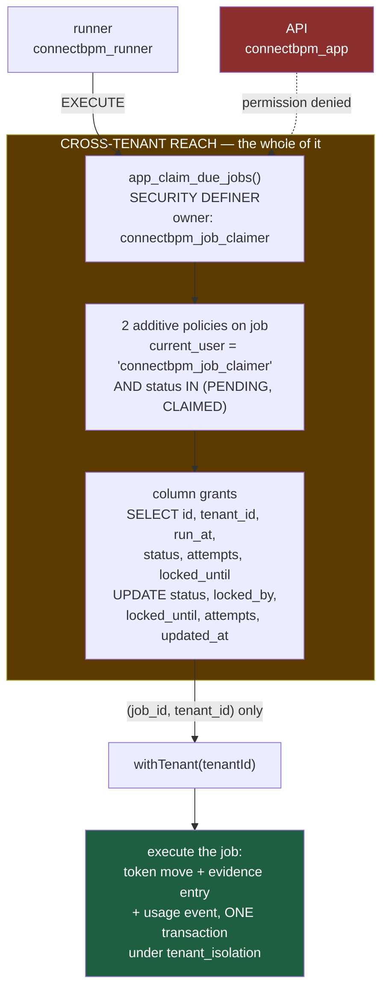

# ADR-010: The Cross-Tenant Job-Claim Boundary — One SECURITY DEFINER Function, One Table, Four Columns

**Product**: ConnectBPM · **Task**: ARCH-02 · **Date**: 2026-08-20
**Author**: Architect, ConnectSW
**Supersedes nothing. Amends**: ADR-004 §3, ADR-009 ("The claim loop")
**Raised by**: BACKEND-01, who demonstrated the contradiction on a live database rather than reasoning about it.

## Status

Accepted.

## Context

ADR-004 §3 and ADR-009 could not both be true, and the way they failed together was the
worst shape available.

ADR-004 §3 put `ENABLE` + `FORCE ROW LEVEL SECURITY` on all 27 tenant-scoped tables. `job` is
one of them. ADR-009's runner claims due jobs with a single **cross-tenant**
`SELECT … FOR UPDATE SKIP LOCKED`, and `check-rls.ts`'s `INDEX_EXCEPTIONS` documents the
deliberately tenant-less `Job:(runAt,id)` index that depends on it. ADR-005 rejected
third-party engines partly *because* per-tenant polling was unacceptable.

### Reproduced before anything was designed (Article XI)

Two `PENDING` jobs planted, one per tenant, as superuser. Then the ADR-009 claim query, verbatim:

```
--- as connectbpm_app  (the runner), NO tenant context -------
 id | tenant_id
----+-----------
(0 rows)
UPDATE 0

--- as connectbpm_migrator (the table OWNER) -----------------
 id | tenant_id
----+-----------
(0 rows)
UPDATE 0

--- as connectbpm_app WITH app.tenant_id = tenant A ----------
                  id                  |              tenant_id
--------------------------------------+--------------------------------------
 11111111-0000-4000-8000-000000000001 | aaaaaaaa-0000-4000-8000-000000000001
UPDATE 1

 rows_visible_to_runner |  rows_actually_present
------------------------+------------------------
                      0 |                      2
```

**The runner claims nothing, and says nothing.** No error, no log, no metric — the query
succeeds on zero rows. Timers never fire, escalations never escalate, SLA jobs never run, the
outbox never drains, and every health check is green. A silent engine is worse than a crashed
one, because a crashed one pages somebody.

### Constraints on any fix

| # | Constraint | Source |
|---|-----------|--------|
| C1 | Cross-tenant leakage is the existential risk. Any cross-tenant reach must be **small enough to audit in one sitting** | STRAT-01 **K6**, `NFR-008`, `RSK-001` |
| C2 | The meter increments in the **same transaction** as the terminal state transition, idempotent and replay-safe | DEC-002 **MET-2/MET-3**, ADR-007 |
| C3 | Every instance emits an immutable, version-pinned evidence record | DEC-001, ADR-008 |
| C4 | ≥99% of a 50,000-timer burst fires within 60 s, with per-tenant fairness | `NFR-004`, `AC-071`, ADR-009 J1 |
| C5 | A cross-tenant read is 404, never 403 | `FR-003`, `AC-052` |
| C6 | The fix must not foreclose the Dedicated / Sovereign topology | `NFR-019`, DEC-001, STRAT A4 |

## Decision

**One `SECURITY DEFINER` function owned by a `NOLOGIN`, `NOBYPASSRLS` role, admitted by two
additive policies on `job` alone, and narrowed further by column-level privileges. It returns
job ids and their tenant ids and nothing else; the runner then enters `withTenant(tenantId)`
per job to execute it.**



### 1. The principal

`connectbpm_job_claimer` — **NOLOGIN**, NOSUPERUSER, **NOBYPASSRLS**. It owns the two functions
below and nothing else, and holds privileges on `job` and no other table.

`NOLOGIN` is the confinement. There is no session in which this role is `current_user` except
one a function it owns has opened, and only `connectbpm_migrator` can replace those bodies. The
reach is therefore not "a role", which would have to be audited across every query that role
ever runs; it is **two function bodies**, which fit on one screen.

### 2. The policies — additive, and unconditional in both conjuncts

`tenant_isolation` is **not touched**. On all 27 tables it remains one equality with no branch
in it, and a predicate with no branch cannot fail open. The exception is two new rows in
`pg_policies`:

```sql
CREATE POLICY job_claimer_read ON "job"
  AS PERMISSIVE FOR SELECT TO connectbpm_job_claimer
  USING (current_user = 'connectbpm_job_claimer'
         AND status IN ('PENDING'::"JobStatus", 'CLAIMED'::"JobStatus"));
```

There is **no INSERT policy and no DELETE policy**. The claim principal can move a job between
`PENDING` and `CLAIMED` and do nothing else to it.

#### Why `current_user =` is load-bearing, and not decoration

`TO connectbpm_job_claimer` alone also matches every **member** of that role — and
`connectbpm_migrator` must be a member in order to transfer ownership of the functions to it.
This was measured, not assumed:

```
--- migrator, MEMBER of the claimer, WITHOUT the current_user conjunct ---
    current_user     | inherits_claimer | job_rows_visible
---------------------+------------------+------------------
 connectbpm_migrator | t                |                2      <- LEAK

--- migrator, MEMBER of the claimer, WITH the conjunct ---
 connectbpm_migrator | t                |                0
```

PostgreSQL's policy role-matching follows role membership, and it does **not** follow
`NOINHERIT`: on PostgreSQL 16 `ALTER ROLE … NOINHERIT` does not retroactively change an existing
grant's stored `inherit_option`, so the leak survived that too. Inside a `SECURITY DEFINER`
function `current_user` is the **owner**, so the conjunct admits the function and excludes every
session, including the migrator's own.

Both conjuncts only ever **narrow**. If either were wrong the result is zero rows claimed — the
closed failure, which check E and the regression test both catch loudly — never a row belonging
to another tenant.

### 3. Column privileges — the reach is narrower than the policy

```sql
GRANT SELECT (id, tenant_id, run_at, status, attempts, locked_until) ON "job" TO connectbpm_job_claimer;
GRANT UPDATE (status, locked_by, locked_until, attempts, updated_at)  ON "job" TO connectbpm_job_claimer;
```

The policy decides which **rows** the claim principal sees; these grants decide which **columns**
it can name at all. `payload` is in neither list, and `job.payload` carries outbox bodies, which
are tenant **content**. `tenant_id` is readable — it is the routing key the runner needs — and
deliberately **not writable**: the claimer routes jobs, it does not move them between tenants.

This was verified by writing a hostile function body, owned by the claimer, and calling it:

```
--- a claimer-owned function that selects job.payload ---
ERROR:  permission denied for table job
--- a claimer-owned function that selects process_definition ---
ERROR:  permission denied for table process_definition
```

The refusal happens at the **privilege** layer, before row-level security is consulted. A future
edit of the function body that tried to read another tenant's content does not run in the
database.

### 4. `EXECUTE` belongs to the runner, and is denied to the API

A fourth login role, `connectbpm_runner`, is introduced for exactly one reason: it is the only
role granted `EXECUTE` on the claim functions. `connectbpm_app` — the role that serves HTTP —
is refused:

```
--- connectbpm_app calling app_claim_due_jobs ---
ERROR:  permission denied for function app_claim_due_jobs
```

Without this separation, any bug that reached raw SQL on the request path could mark **every
tenant's** timers `CLAIMED` for the lease duration, repeatedly — a cross-tenant availability
attack on the engine, launched from the surface that handles untrusted input. The runner has no
HTTP surface. One extra role and one extra `DATABASE_URL` is a cheap price for removing that.

### 5. The projection is the guarantee

`app_claim_due_jobs` returns `(job_id, tenant_id)`. That is the minimum the runner needs — which
tenant to enter — and it is all it gets. Everything else about the job is read **inside**
`withTenant(tenantId)`, through the branded `TenantScopedClient`, under `tenant_isolation`, like
every other read in the product. Cross-tenant reach ends at the function boundary.

### 6. Fairness and throughput, with one correction to ADR-009

Per-tenant fairness is applied **inside** the claim, by a window function over the bounded scan,
rather than by post-filtering a batch that has already been claimed. One tenant's midnight burst
takes at most `p_tenant_cap` slots of a batch, so a batch under a single-tenant burst is
*deliberately* smaller than `p_batch`.

`FOR UPDATE SKIP LOCKED` must sit in the **same query level as the `LIMIT`**. This was got wrong
in the first draft of the function and caught by an 8-worker concurrency test:

| Draft | w1 | w2 | overlap |
|-------|----|----|---------|
| lock in a later CTE, over a candidate set already fixed | 0 | 30 | 0 |
| lock in the same level as the LIMIT (shipped) | 20 | 20 | 0 |

With the lock in a later CTE both workers choose the same candidates, one skips all of them and
claims nothing — correct, and 1/Nth of the throughput `J1` needs. With the lock in the scan, the
limit counts only rows the worker actually took, so worker 2 skips worker 1's window and takes
the next one. Measured with 8 concurrent workers over 400 due jobs: **160 rows claimed, 160
distinct, 8 distinct workers, 20 each, zero double-claims.**

### 7. The lease reaper

`app_reap_expired_job_leases` returns a crashed worker's `CLAIMED` rows to `PENDING` once
`locked_until` has passed. It is shipped here rather than with the runner because a claim
mechanism without lease recovery is half a mechanism, and its missing half fails the same silent
way. `attempts` is **not** re-incremented — it was already incremented at claim time, so a crash
loop stays bounded.

### 8. Two partial indexes ADR-009 declared but never had

`CREATE INDEX job_due ON job (run_at, id) WHERE status = 'PENDING'` appears in ADR-009 and in
`check-rls.ts`'s exception text as though it existed. It did not: only Prisma's non-partial
`job_run_at_id_idx` was ever created, because Prisma cannot express an index predicate. Both
`job_due_pending_idx` and `job_lease_expiry_idx` are added by this migration. The non-partial
index stays because `schema.prisma` declares it and removing it would be migration drift; that
redundancy is a known, recorded cost.

## Consequences

### Positive
- The entire cross-tenant surface of this product is now **one table, six readable columns, two
  statuses, one direction, two function bodies** — and `check-rls.ts` check E asserts every one
  of those numbers against the live database on each build. C1 is satisfied literally.
- `tenant_isolation` is untouched on all 27 tables. The defence-in-depth argument of ADR-004 is
  unchanged for every table including `job` on every connection except one function.
- The silent failure is now a loud one in two places: check E fails the build if the boundary is
  absent or mis-owned, and `job-claim-boundary.test.ts` fails if a claim does not reach both
  tenants.
- ADR-009's substrate works as designed — one poll, one table, no per-tenant fan-out — so C4 and
  ADR-005's rejection of per-tenant polling both stand.

### Negative
- **A fourth login role and a fifth database role.** More provisioning surface,
  another `DATABASE_URL` to get right in every environment. Mitigated by `db:roles` being
  idempotent and by check E failing if any role's posture is wrong.
- **The migration depends on `db:roles` having run**, because it grants privileges to roles it
  does not create. This was already true of every migration since ADR-004 §3, and the README
  already mandates the ordering; it is now load-bearing for a second reason.
- **`GRANT CREATE ON SCHEMA public` is held by the claimer for two statements** inside the
  migration, because transferring ownership requires the new owner to hold it. It is revoked
  in the same migration. A migration that failed between the two would leave the claimer able to
  create objects — recorded, and the reason the revoke is not deferred to provisioning.
- Rows locked by the 4× oversample and then trimmed by fairness are held for the duration of one
  statement and released on commit. Wasteful in principle; milliseconds in practice.

### Neutral
- The claim transaction and the execution transaction are separate. They **must** be — a lease
  that is not committed is not visible to other workers — and this is not a weakening of MET-2,
  for the reason argued next.

## How C2 and C3 survive this, specifically

**C2 — DEC-002 MET-2/MET-3 (the meter).** MET-2 requires the meter to increment in the same
transaction as the **state transition**. A lease is not a state transition: `app_claim_due_jobs`
writes `status`, `locked_by`, `locked_until`, `attempts` and `updated_at` on `job`, and **it is
column-privilege-forbidden from writing anything else, on any table**. It cannot reach
`usage_event`, `quota_counter` or `quota_reservation` at all — it holds no privilege on them, as
check E asserts. The transition transaction is entirely unchanged: it opens inside
`withTenant(tenantId)`, is promoted to a `TransitionTx` by `withTransitionTx`, and writes the
token move, the evidence entry and the usage event as statements of one PostgreSQL transaction,
exactly as ADR-007 specifies. `TransitionTx` is still constructible only from a live
`TenantScopedClient`, so the meter still cannot be in a different transaction from the state
change **even in principle**.

MET-3 (replay safety) is likewise untouched, and is what makes the reaper safe. A worker killed
after claiming and before executing leaves a `CLAIMED` row; the reaper returns it to `PENDING`;
another worker claims and executes it. The idempotency key is
`sha256(instanceId ‖ tokenId ‖ fromElementId ‖ transitionId ‖ 'billable_completion')` — derived
only from immutable identifiers, and **not** from the job id, the lease, the worker or
`attempts`. A re-execution therefore computes the *same* key, `UNIQUE(tenantId, idempotencyKey)`
rejects the second insert as `P2002` → "already accounted", and ADR-009's token-version guard
matches zero rows so the replay commits empty. Nothing in this ADR touches any input to that key.

**C3 — DEC-001 evidence.** Every evidence entry is written inside the transition transaction,
inside `withTenant`, under `evidence_entry`'s `tenant_isolation` policy with `app.tenant_id`
set — unchanged. The claim principal holds **no privilege on `evidence_entry`**; a claimer-owned
function that selects from it fails with `permission denied for table evidence_entry` before RLS
is even consulted. The gap-free `seq` and the hash chain (ADR-008) are properties of that
transaction and are not reachable from the boundary. Because the boundary hands over
`(job_id, tenant_id)` rather than a job payload, the version pinning that makes evidence
reproducible is read inside the tenant scope, from rows that only that tenant can see.

**C5 — 404 not 403.** Unchanged, and re-asserted: a runner inside `withTenant(A)` looking up
tenant B's job by primary key gets **zero rows**, not a permission error, so the API renders 404
identically to a genuinely absent row.

**C6 — sovereignty.** The boundary is roles, policies and functions in the same schema, created
by the same migration. A single-tenant Sovereign deployment gets the same DDL, where it is a
no-op that claims that one tenant's jobs. Nothing is foreclosed.

## Alternatives Considered

### 1. Grant the runner `BYPASSRLS`
- **Pros**: one line; the claim query in ADR-009 works verbatim.
- **Cons**: `BYPASSRLS` is an attribute of a **role**, not of a statement — it exempts that role
  from every policy on all 27 tables for every query it ever runs. The runner is the process that
  executes workflow logic, drains the outbox and evaluates customer-authored conditions; it is
  the *last* connection that should lose layer two. One compromised role would read every
  tenant's data. And ADR-004 §3, the roles script and `rls-enforcement.test.ts` all assert
  `rolbypassrls = false` — this would require deleting the assertion that makes the second layer
  real.
- **Why rejected**: it converts a bounded exception into an unbounded one, and it contradicts the
  posture ADR-004 exists to hold. Fails C1.

### 2. A role-aware clause inside the `job` `tenant_isolation` policy
- **Pros**: no new function, no new object; RLS stays on.
- **Cons**: the shared policy becomes conditional logic, and a policy that is subtly wrong **fails
  open** — silently, and on the one table that carries every tenant's outbox payloads. The reach
  would be a **role**, not a function: every query that role ever issues against `job` gets it,
  including inside `withTenant`, so auditing it means auditing the whole runner rather than one
  function body. The runner also legitimately needs full tenant-scoped access to `job.payload`,
  so the clause could not be narrowed by column privileges.
- **Why rejected**: the audit surface is a codebase rather than a screen, and the failure mode is
  open rather than closed. Note that ADR-010 *does* use role-targeted policies — but as
  **separate, additive** rows whose predicate is a conjunction of two narrowing tests, on a
  principal nothing can log in as. `tenant_isolation` itself keeps no branch. Check E fails the
  build if anyone later adopts this option by editing `tenant_isolation` — verified against a
  planted violation.

### 3. A `SECURITY DEFINER` claim function owned by the **migrator** (BACKEND-01's preference)
- **Pros**: the right shape — reach confined to one auditable function, execution fully scoped.
- **Cons, decisive**: **it does not work.** `FORCE ROW LEVEL SECURITY` binds the table owner, and
  ADR-004 §3 chose `FORCE` deliberately for exactly that reason. A `SECURITY DEFINER` function
  owned by `connectbpm_migrator` runs as the migrator, and the migrator is bound by
  `tenant_isolation` like everyone else. Verified:

  ```
   proname                 |        owner        | security_definer
  -------------------------+---------------------+------------------
   probe_claim_as_migrator | connectbpm_migrator | t

  --- connectbpm_app calls it ---
   job_id | tenant_id
  --------+-----------
  (0 rows)
  ```

  Shipping it would have reproduced the original bug with more machinery in front of it.
- **Why adopted in corrected form**: the *architecture* is right and is what ships. What was
  missing is the principal: `SECURITY DEFINER` confines *who* runs the body, but something still
  has to make that principal visible to the rows, and under `FORCE` only a policy can. Hence the
  two additive policies and the `NOLOGIN` owner. This ADR is option 3 with the mechanism that
  makes it true.

### 4. Move `job` out of the tenant-scoped set — "it is infrastructure, not tenant content"
- **Pros**: the ADR-009 claim query works verbatim; no new role, no function, no policy; the
  `Job:(runAt,id)` index exception disappears.
- **Cons, decisive, and this was the option worth taking seriously**:
  1. **`job.payload` is tenant content, not metadata.** `OUTBOX_WEBHOOK` and
     `OUTBOX_NOTIFICATION` jobs carry the event body — instance variables, task data, actor
     identities. Un-scoping the table exposes all of it to any single missing predicate, on the
     highest-write table in the schema.
  2. **It breaks the write path, not only the read path.** `withTenant`'s extension stamps
     `tenantId` on every create for a tenant-scoped model. Making `Job` global removes that
     stamp, so the outbox row a transition enqueues would carry whatever `tenantId` the caller
     passed — and ADR-004 §5's webhook guarantee (`AC-056`) rests on the dispatcher selecting
     endpoints by `tenantId` from inside `withTenant`. A mis-stamped outbox row is a delivery of
     one tenant's data to another tenant's endpoint. That is C1, from the direction nobody was
     watching.
  3. **`WITH CHECK` disappears too**, so a write claiming another tenant's id is accepted instead
     of refused.
  4. **The evidence and metering consequence**: the job is what drives a timer, the timer drives
     a transition, and the transition writes the evidence entry and the usage event. If the job
     can be enqueued with the wrong `tenantId`, the transition it triggers runs in the wrong
     tenant's scope — which bills the wrong tenant (C2) and writes an evidence entry into the
     wrong chain (C3). Both are irreversible: DEC-002 is explicit that retroactive metering is
     impossible, and ADR-008's chain is append-only.
  5. It would also fail check A mechanically, since `Job` declares `tenantId` and the global
     allowlist forbids that combination.
- **A refinement was considered and also rejected**: split `job` into a tenant-less `job_claim`
  (id, tenant_id, run_at, status, lease) and a tenant-scoped `job_payload`. It removes objection
  1 but not 2, 3 or 4; it doubles the writes on the hot path; it breaks the single
  `UNIQUE(tenant_id, dedupe_key)` that PATTERN-014's idempotency depends on; and the claim table's
  `(tenant_id, run_at)` is still a cross-tenant volume-and-timing side channel. Higher cost than
  ADR-010 for a strictly weaker guarantee.
- **Why rejected**: `job` is not infrastructure. It is a queue of tenant content with a scheduler
  column on it.

## References
- `NFR-004`, `NFR-008`, `NFR-019`; `FR-003`, `FR-045`, `FR-054`–`FR-064`; `AC-052`, `AC-056`, `AC-070`, `AC-071`, `AC-072`; `RSK-001`; STRAT-01 K6, A4
- DEC-001 (evidence), DEC-002 MET-2/MET-3 (metering)
- ADR-004 §3 (amended by this ADR), ADR-005 (per-tenant polling rejected), ADR-007 (metering), ADR-008 (evidence chain), ADR-009 (amended by this ADR)
- `apps/api/prisma/migrations/20260820150000_job_claim_boundary/migration.sql`
- `apps/api/scripts/check-rls.ts` — check E, and its six planted-violation verifications
- `apps/api/tests/integration/tenancy/job-claim-boundary.test.ts` — 18 tests
- PostgreSQL: `CREATE POLICY … TO role`, `FORCE ROW LEVEL SECURITY`, `SECURITY DEFINER`, column-level `GRANT`, `aclexplode`
