# ConnectBPM — Product Requirements Document

| Field | Value |
|-------|-------|
| Task ID | PRD-01 |
| Product | connectbpm |
| Author | Product Manager, ConnectSW |
| Date | 2026-08-20 |
| Status | Draft — awaiting CEO checkpoint |
| Branch | `claude/bpm-workflow-product-9p2fxy` |
| Ports | Web 3123 · API 5018 |
| Upstream inputs | `docs/CEO-DECISIONS.md` (binding) · `docs/business-analysis.md` (BA-01) · `docs/strategy/OPPORTUNITY-connectbpm.md` (STRAT-01) |
| Companion spec | `docs/specs/connectbpm-foundation.md` (SPEC-01, CLARIFY-01 applied) |
| Downstream | Architect (ARCH-01), QA Engineer, UI/UX Designer, Frontend Engineer |

> **Identifier ownership (Article VI).** SPEC-01 owns the `US-xx`, `FR-xxx` and `NFR-xxx` identifier
> space. This PRD **references** those identifiers and does not mint a second set. What this document
> adds and owns: feature identifiers `F-xxx`, the **Site Map**, personas, phasing, pricing and
> packaging, dependencies, risks and milestones. Where this PRD and SPEC-01 appear to disagree,
> SPEC-01 governs on requirement detail and this PRD governs on scope, phase and surface.

---

## 1. Overview

### 1.1 Vision

**A customer's operations team models a human approval process with a form, publishes it, runs real
instances, has their staff complete tasks in an inbox with due dates and escalation, and exports a
complete, immutable, independently verifiable audit trail of every instance — in Arabic or English,
self-serve, with no seat charges and no sales call.**

ConnectBPM exists because the BPM market is barbelled and a specific buyer falls through the middle.
Trigger-automation tools price and architect for stateless event plumbing and cannot hold an
eleven-day, five-approver case with delegation, escalation and an immutable history. Enterprise
suites model that case at USD 35–90 per user per month with a 12–18 month implementation. Between
them sits a compliance-exposed mid-market company running its approvals on email, whose acute,
funded pain is not speed and not cost — it is that **it cannot produce evidence that an approval
followed its own stated control**.

Per **DEC-001**, the product is built **geography-neutral around that evidence core**, and the first
go-to-market and template library are aimed at the **GCC**. Arabic and RTL are in v1. Locale,
jurisdiction, working calendar and regulatory templates are **configuration, never structure**.

### 1.2 Target Users

Two layers. Layer A buys; Layer B uses. See §2.

**Beachhead ICP** (STRAT-01 §6.1): 50–2,000 employees; Saudi Arabia and UAE first, then Qatar,
Kuwait, Bahrain, Oman; financial services, healthcare, government-adjacent entities and their
suppliers, professional services with regulatory exposure. Buyer is the Head of Compliance/Risk,
Head of Operations or COO — **not** the CIO. Disqualifiers: deeply Microsoft-committed accounts with
a mature Power Platform practice; purely integration-shaped needs.

### 1.3 Success Metrics

The full set is SPEC-01 §Success Criteria (`SC-001`–`SC-018`). The five that decide whether this
product worked:

| Metric | Target | Why this one |
|--------|--------|--------------|
| Cross-tenant data exposure incidents | **0** | `SC-001`. The only failure that ends the product outright (K6). |
| Lost or duplicated process instances | **0** | `SC-002`. An engine that loses work has negative value; K7 kills at >2 incidents/quarter. |
| Activation — ≥1 published process **and** ≥50 real instances in 30 days | **≥20%** of signups; **40 activated tenants** by month 6 | `SC-010`, `SC-011`. STRAT-01's north star. Signups are not the metric; activation is. |
| Median task completion time in the inbox | **≤60 s** | `SC-006`. RSK-004 (adoption failure) is the highest-scoring risk at 9/9. |
| Sales-touch rate on paid conversions | **≤20%** | `SC-014`. The falsification test for the entire self-serve thesis. |

---

## 2. User Personas

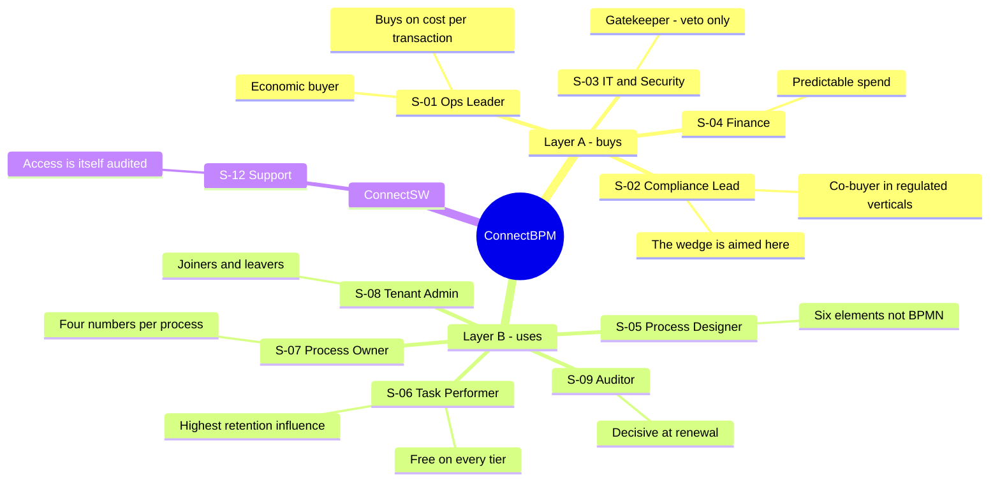

### Persona 1 — Ops Leader (S-01) · economic buyer

- **Role**: Head of Operations or COO at a 50–2,000 person organisation.
- **Goals**: raise throughput and SLA attainment without adding headcount; prove value inside one
  billing period.
- **Pain Points**: every vendor conversation becomes an IT project; per-seat pricing forces them to
  ration who gets access, which is the opposite of what the process needs.
- **Usage Context**: evaluates in a browser on a weekday afternoon, alone, without IT present. Buys
  on a card if the product works.
- **Non-negotiables**: public pricing, self-serve signup, a live process the same day.

### Persona 2 — Compliance / Risk Lead (S-02) · co-buyer, and the wedge's target

- **Role**: Head of Compliance or Risk; in regulated GCC verticals, often the true budget holder.
- **Goals**: answer an evidence request without a two-week reconstruction; stop being afraid of the
  next audit.
- **Pain Points**: evidence today is screenshots, a folder and a reconstructed email chain. It is
  produced *after* the fact, which is exactly what makes it weak.
- **Usage Context**: triggered by a PDPL readiness audit, an external audit finding, a failed manual
  control, or a new reporting obligation.
- **Non-negotiables**: the record is immutable, pinned to the version that actually ran, exportable,
  and verifiable by someone who does not trust us.

### Persona 3 — Process Designer (S-05)

- **Role**: operations or business systems analyst. Domain expert. **Not a programmer.**
- **Goals**: model a real approval — including the exception paths — and change it safely later.
- **Pain Points**: BPMN palettes assume programming and infrastructure skills they do not have;
  editing a live process elsewhere breaks work in flight.
- **Usage Context**: builds in bursts, from a template, usually the week a new obligation lands.
- **Non-negotiables**: a palette small enough to hold in the head; validation that names the problem
  element; publishing that cannot corrupt running work.

### Persona 4 — Task Performer / Participant (S-06) · **the retention persona**

- **Role**: approver, reviewer or requester. Uses the product a few times a month.
- **Goals**: finish the task and get back to the actual job.
- **Pain Points**: any new application is a tax; any training requirement means reverting to email.
- **Usage Context**: arrives from an email notification, often on a phone, often in Arabic.
- **Non-negotiables**: the link opens the task itself — not a dashboard; ≤60 seconds; RTL that is a
  layout, not a stylesheet hack; **never costs their employer anything** (DEC-002).

### Persona 5 — Tenant Admin (S-08)

- **Role**: customer IT admin or operations manager who owns the workspace.
- **Goals**: joiners and leavers handled without stranding work; spend that never surprises Finance.
- **Pain Points**: a leaver's open approvals disappear into a deactivated account.
- **Non-negotiables**: deactivation forces task reassignment; a hard cap they control; visibility of
  every ConnectSW staff access to their data.

### Persona 6 — Process Owner (S-07)

- **Role**: department head accountable for one process's outcome.
- **Goals**: know where work is stuck and why; show improvement to their own management.
- **Non-negotiables**: four numbers, per process, per period — not a BI tool.

### Persona 7 — Auditor / Regulator (S-09) · external, decisive at renewal

- **Role**: internal audit, external auditor, or regulator.
- **Goals**: verify that a control operated, completely, for a period.
- **Non-negotiables**: completeness, immutability, and a record tied to the definition version in
  force at the time. **STRAT A9 — that GCC auditors accept engine-produced evidence — is
  unvalidated and load-bearing** (RISK-PM-05).

---

## 3. Features

Feature IDs are owned by this PRD. Each names its SPEC-01 user stories, its BA-01 business need, and
its priority. **P0** = no launch without it. **P1** = required at launch. **P2** = within two
releases of launch. **P3** = backlog.

### 3.1 MVP Features (Must Have — the v1 release)

| ID | Feature | User Story | Stories | BN | Priority |
|----|---------|-----------|---------|----|----------|
| F-001 | **Tenant isolation and workspace** | As an Ops Leader, I want a private company workspace so that our process data is provably ours alone. | US-01, US-06 | BN-001 | **P0** |
| F-002 | Membership, roles and joiner/leaver handling | As a Tenant Admin, I want to invite, role-assign and deactivate members, and reassign a leaver's open tasks, so that staff changes never strand work. | US-02, US-24, US-27 | BN-012 | **P0** |
| F-003 | **Visual process designer (E1–E7)** | As a Process Designer, I want to model an approval with a small element set so that I can build a real process without writing code. | US-03, US-04, US-05 | BN-002 | **P0** |
| F-004 | **Immutable definition versioning with instance pinning** | As a Process Designer, I want to publish changes without disturbing running work so that improving a process never corrupts evidence. | US-08, US-09 | BN-004 | **P0** |
| F-005 | **Durable workflow engine** | As a Process Owner, I want every instance to advance exactly once and survive a restart so that the record is the truth. | US-06, US-07 | BN-003 | **P0** |
| F-006 | Restricted-grammar conditions | As a Process Designer, I want routing rules on form data so that policy is applied by the engine, not from memory. | US-04 | BN-002, BR-005 | **P0** |
| F-007 | **Form builder and renderer** | As a Process Designer, I want typed validated fields bound to a Step so that a decision has the data it needs. | US-10, US-11 | BN-005 | **P0** |
| F-008 | **Task inbox and single-task deep link** | As a Task Performer, I want to open the exact task from my email and finish it in a minute. | US-12, US-13, US-14, US-41 | BN-006 | **P0** |
| F-009 | **Due dates, reminders, escalation** | As a Process Owner, I want overdue work to remind and escalate so that waiting time is bounded and visible. | US-17, US-18 | BN-008 | **P0** |
| F-010 | Per-tenant working calendar | As a Tenant Admin, I want our working week and holidays to define "2 working days". | US-36 | BN-008, DEC-001 | **P0** |
| F-011 | **Evidence trail — immutable, hash-chained, version-pinned** | As a Compliance Lead, I want a complete ordered tamper-evident history of every instance. | US-15, US-38 | BN-007 | **P0** |
| F-012 | **Evidence export and independent verification** | As an Auditor, I want a CSV/JSON export I can verify without trusting the application. | US-16, US-38 | BN-007 | **P0** |
| F-013 | **Completed-instance metering (MET-1..MET-7)** | As ConnectSW, we must meter completions transactionally, idempotently and replay-safely, because retroactive metering is impossible. | US-19 | BN-009 | **P0** |
| F-014 | Quota reservation and pre-start refusal | As a Tenant Admin, I want to be refused cleanly at the cap rather than surprised by an invoice. | US-20, US-40, US-43 | BN-009 | **P0** |
| F-015 | Self-serve signup, tier selection, card payment | As an Ops Leader, I want to buy without contacting sales. | US-21, US-22 | BN-010 | **P0** |
| F-016 | **Arabic-first RTL across every surface** | As an Arabic-speaking performer, I want the product in Arabic with a genuine RTL layout. | US-35 | DEC-001 | **P0** |
| F-017 | Onboarding to first published process | As an Ops Leader, I want to reach a published process in one session. | US-28 | BN-015 | **P0** |
| F-018 | Template gallery — 15 bilingual templates | As a Process Designer, I want to start from a pre-built process and edit it. | US-28 | BN-015 | **P1** |
| F-019 | Minimal analytics — four numbers per process | As a Process Owner, I want started, completed, median cycle time and SLA breaches. | US-23 | BN-011 | **P1** |
| F-020 | Outbound signed webhooks | As a Tenant Admin, I want process events delivered to our systems. | US-25 | BN-013 | **P1** |
| F-021 | Notifications — email and in-app, bilingual | As a Task Performer, I want to be told when work arrives, in my language. | US-13, US-18 | BN-006, BN-008 | **P0** |
| F-022 | Usage dashboard and threshold alerts | As a Tenant Admin, I want to see billable completions against quota. | US-19, US-20 | BN-009 | **P0** |
| F-023 | Retention policy and enforcement job | As a Tenant Admin, I want retention enforced by deletion, not by hiding rows. | US-45 | BN-019 (partial) | **P1** |
| F-024 | Workspace audit view including ConnectSW staff access | As a Tenant Admin, I want to see who touched our data, including ConnectSW. | US-42 | BR-010 | **P1** |
| F-025 | **Schedule start (E7) and bulk instantiation** — SCOPE-AMD-001 | As a Compliance Lead, I want recurring and campaign processes to run without starting each one by hand. | US-37, US-39 | BN-015, ASM-005 | **P2** (in MVP release) |
| F-026 | Public marketing, pricing and trust surface | As an Ops Leader and as IT/Security, I want published pricing and a straight answer on data handling. | US-21 | BN-010, BN-014 | **P0** |
| F-027 | Personal-data erasure with evidence tombstones | As a Compliance Lead, I want to honour an erasure request without breaking the evidence chain. | US-45 | BN-007, BN-019 | **P2** |

### 3.2 Phase 2 Features (Should Have — "Next", 6–18 months)

| ID | Feature | Stories | BN | Why not now |
|----|---------|---------|----|-------------|
| F-101 | SSO — OIDC, SAML, SCIM | US-26 | BN-014 | Removes the IT veto, but the veto is not the first sale |
| F-102 | BPMN 2.0 XML import and export | US-30, US-31 | BN-017 | Serves the Camunda-refugee segment, not the MVP buyer. FR-012 keeps it additive. |
| F-103 | Service tasks with a sandboxed execution boundary | US-29 | BN-016 | Highest effort in the gap matrix (G-22, 4 sprints) and carries RSK-002 |
| F-104 | Full analytics — bottleneck heatmap, per-step duration, rework rate | US-32 | BN-018 | Valuable; not what the first cheque is for |
| F-105 | Evidence pack export with control mapping | US-16 (extended) | BN-007 | Business-tier entitlement; needs the auditor conversation (STRAT A9) first |
| F-106 | Arabic AI process authoring | — | — | An accelerant, not the wedge. Metered separately; never bundled. |
| F-107 | In-region deployment and the Sovereign tier | US-33 | BN-019 | STRAT A4 unvalidated. **NFR-019 forbids foreclosing it.** |
| F-108 | ConnectGRC integration | — | — | The internal API boundary (FR-065) is built now; the integration is not |
| F-109 | External participant tasks via signed link | — | — | **Blocked on CLR-B, a CEO decision.** Degrades template T02 until resolved. |
| F-110 | Connector library | — | — | Integration breadth is a losing fight; webhooks answer the objection |

### 3.3 Future Considerations (Nice to Have — 18–36 months)

| ID | Feature | Strategic objective |
|----|---------|--------------------|
| F-201 | Agentic orchestration — AI agents as governed task performers with human-in-the-loop | SO-5 |
| F-202 | Embeddable / OEM engine and SDK | SO-5 |
| F-203 | Partner-authored template marketplace | SO-2 |
| F-204 | Process intelligence — mining, simulation, predictive SLA breach | SO-1, SO-5 |
| F-205 | Sovereign on-premise and air-gapped edition | SO-2, SO-6 |
| F-206 | In-flight instance migration between definition versions | US-34, BN-020 |

---

## 4. User Flows

### 4.1 Buyer flow — signup to first published process to first paid invoice

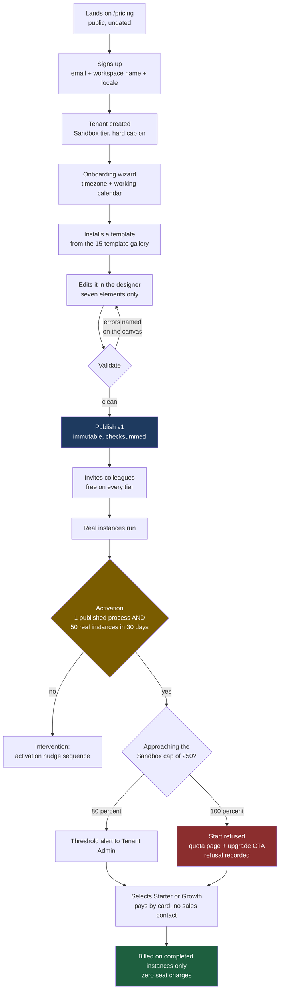

### 4.2 Participant flow — the 60-second path (F-008, `SC-006`)

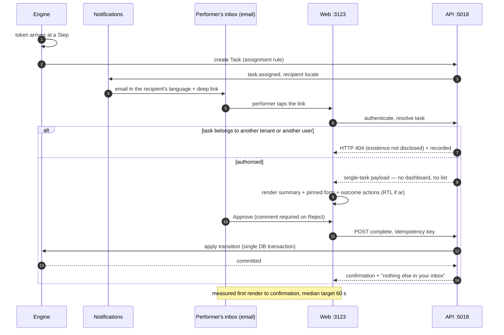

### 4.3 Compliance flow — from an audit request to a verified export (F-011, F-012)

```mermaid
flowchart LR
    A["Auditor asks:<br/>show that this control<br/>operated for Q3"] --> B["Compliance Lead opens<br/>/app/evidence"]
    B --> C["Selects process<br/>and date range"]
    C --> D{"Range crosses a<br/>retention deletion?"}
    D -->|"yes"| E["Export states the removed<br/>sub-period, policy and date<br/>never a silent gap"]
    D -->|"no"| F["Export generated"]
    E --> F
    F --> G["CSV and JSON<br/>+ definition versions covered<br/>+ hash-chain material"]
    G --> H["Export event itself recorded<br/>requester, filters, timestamp"]
    H --> I["Auditor recomputes the chain<br/>outside the application"]
    I --> J{"Chain verifies?"}
    J -->|"yes"| K["Evidence accepted"]
    J -->|"no"| L["First divergent entry named<br/>P0 investigation"]

    style K fill:#1e5f3f,color:#fff
    style L fill:#8b2e2e,color:#fff
```

### 4.4 Designer flow — publishing a change safely (F-004)

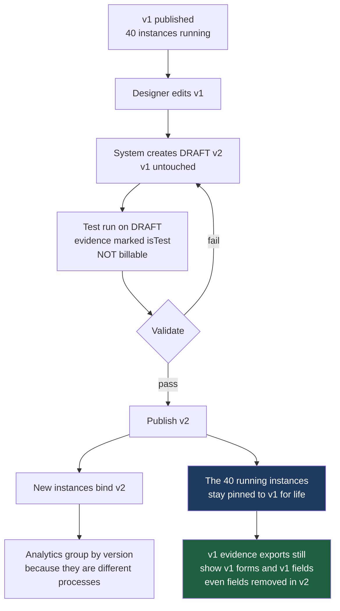

### 4.5 Metering flow — quota reservation to billable completion (F-013, F-014)

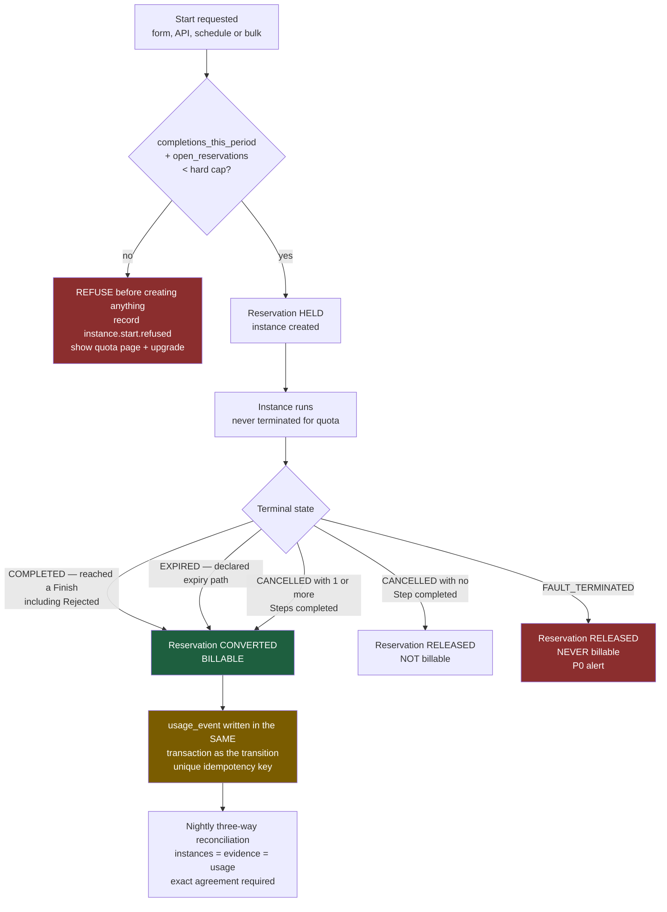

---

## 5. Requirements

### 5.1 Functional Requirements

The normative set is **SPEC-01 §Requirements, `FR-001`–`FR-154`**. It is not restated here. The map
below shows which requirement block implements which feature, so that a reader of this PRD can find
the binding text.

| Feature | SPEC-01 requirements | Block |
|---------|---------------------|-------|
| F-001, F-002 | `FR-001`–`FR-010` | A. Tenancy, identity and authorisation |
| F-003, F-004, F-006, F-025 (design side) | `FR-011`–`FR-030` | B. Process designer and definitions |
| F-007 | `FR-031`–`FR-040` | C. Forms |
| F-005, F-009, F-010, F-020, F-025 (runtime side) | `FR-041`–`FR-065` | D. Workflow engine |
| F-008, F-021 | `FR-066`–`FR-085` | E. Tasks and inbox |
| F-011, F-012, F-023, F-024, F-027 | `FR-086`–`FR-100` | F. Evidence and audit trail |
| F-013, F-014, F-015, F-022 | `FR-101`–`FR-125` | G. Metering, quota and billing |
| F-019 | `FR-126`–`FR-130` | H. Analytics (minimal) |
| F-015, F-017, F-026 | `FR-131`–`FR-137` | I. Commerce, onboarding, administration |
| F-016 | `FR-138`–`FR-149` | J. Internationalisation |
| F-018 | `FR-150`–`FR-154` | K. Template gallery |

### 5.2 The pricing requirements — DEC-002 written as hard requirements

DEC-002 is irreversible: *"Retroactive metering is impossible."* The seven CEO metering requirements
are carried into SPEC-01 as testable functional requirements. This table is the contract.

| CEO req | What it demands | SPEC-01 FRs | Verified by |
|---------|-----------------|-------------|-------------|
| **MET-1** | The billable event is instance **completion**, not start. "Completed" — including terminated, cancelled and error-terminal states — must be specified unambiguously. **This is the revenue definition.** | `FR-101`, `FR-102`, `FR-103`, `FR-104`, `FR-105`, `FR-106`, `FR-108` | `SC-003`; §5.3 below |
| **MET-2** | The meter increments **inside the same DB transaction** as the state transition, with an idempotency key. | `FR-101`, `FR-042` | `EC-05` test; `SC-002` |
| **MET-3** | Exactly-once accounting on an at-least-once substrate — replay-safe. | `FR-043`, `FR-107` | `SC-003`, `SC-004` |
| **MET-4** | Pre-start quota refusal hook — tier limits enforced **before** instance creation. | `FR-113`, `FR-114`, `FR-115`, `FR-116`, `FR-105` | `EC-03`, `EC-21` tests |
| **MET-5** | The meter is immutable and reconcilable against the audit trail. | `FR-109`, `FR-110`, `FR-111` | `SC-003` nightly reconciliation |
| **MET-6** | Per-tenant sandbox CPU/memory metering — COGS **and** the security boundary. | `FR-112`, `FR-119` | `NFR-009`, `NFR-010` |
| **MET-7** | All secondary dimensions instrumented day one even if not billed in v1. | `FR-117`, `FR-118` | Instrumentation audit at the Foundation checkpoint |

**Two consequences of DEC-002 that this PRD records explicitly:**

1. **No seat metering of any kind means no designer-seat caps.** BA-01 §Q5 and STRAT-01 §7.2 both
   capped designer seats per tier. DEC-002 supersedes both (`FR-005`, `FR-118`, `FR-121`, CLR-H).
   Distinct authoring users and distinct participants are **counted and reported, never billed,
   capped or gated**. The remaining packaging levers — published-process count, billable instances,
   retention window, feature entitlements — are sufficient to differentiate all four tiers.
2. **`@connectsw/billing`'s `UsageService` MUST NOT be used for instance metering.** It is Redis
   counters keyed to `userId`, synced to the database. It is neither transactional with the state
   transition nor replay-safe, so it fails MET-2 and MET-3. It remains acceptable for soft limits and
   dashboards only. (CEO-DECISIONS.md note; BA-01 §6.2.)

### 5.3 The definition of "completed" — the revenue definition

> **A process instance is *completed*, and therefore billable exactly once, at the moment the engine
> commits its transition into a terminal state produced by the tenant's own published definition —
> a token reaching any `Finish` element (including Rejected, Denied, Withdrawn and every other
> negative outcome) or a definition-declared expiry path — together with any administratively
> cancelled instance in which at least one `Step` had already been completed; instances terminated by
> platform fault or by an invalid-definition runtime error, instances cancelled before any `Step` was
> completed, refused starts, and test runs of a draft are never billable.**

| Terminal state | Meaning | Billable | Requirement |
|----------------|---------|----------|-------------|
| `COMPLETED` | A token reached a `Finish` element | **Yes** | `FR-049`, `FR-103` |
| `EXPIRED` | The instance ended down a definition-declared expiry path | **Yes** | `FR-050`, `FR-103` |
| `CANCELLED`, ≥1 Step completed | A human ended it after work was done | **Yes** | `FR-104` |
| `CANCELLED`, 0 Steps completed | Started by mistake and killed immediately | No | `FR-104` |
| `FAULT_TERMINATED` | Engine fault or invalid-definition runtime error | **Never** | `FR-052`, `FR-103` |
| Refused at admission | Quota reservation denied; no instance row exists | Never | `FR-105`, `FR-113` |
| DRAFT test run (`isTest`) | Designer testing before publish | Never | `FR-029`, `FR-106` |

**Why "Rejected" is billable.** A rejected purchase order is a *completed process*. The customer
received the full value of the product — routing, SLA, evidence — and the instance consumed the same
resources. **This must be stated on the pricing page in plain language**, because "completed" reads
colloquially as "approved", and a customer who discovers the difference on an invoice will treat it
as a billing dispute in a product sold on trustworthiness.

**Why the cancelled-instance rule exists.** Without it, a tenant avoids the meter entirely by
cancelling every instance at its last Step. With a blanket "all cancellations are billable" rule, a
tenant is charged for instances started by mistake. "At least one `Step` completed" is the smallest
precise test that closes the first hole without opening the second. Every usage event records
`completedStepCountAtEvent` as its justification, so an alternative rule could be applied to
historical data without re-deriving it. **This is a revenue-policy judgement made by the Product
Manager and is flagged for CEO ratification (RISK-PM-02).**

### 5.4 Non-Functional Requirements

The normative set is **SPEC-01 `NFR-001`–`NFR-021`**. The ones that shape the architecture:

| Area | Requirement | Target |
|------|-------------|--------|
| Security | `NFR-008` cross-tenant exposure; automated two-tenant isolation suite is a **merge blocker** | **0 incidents** |
| Security | `NFR-009` no customer input reaches `eval`, `Function`, a VM or an isolate in v1 | Absolute |
| Correctness | `NFR-006` lost or duplicated instances | **0**, nightly three-way reconciliation |
| Correctness | `NFR-007` meter-to-evidence agreement | **100%**, not "within tolerance" |
| Performance | `NFR-001` engine transition p95 · `NFR-002` median task completion · `NFR-003` task view interactive | ≤500 ms · ≤60 s · ≤2.0 s on 4G |
| Reliability | `NFR-004` timer accuracy · `NFR-005` crash recovery | ≥99% within 60 s · 100% resume |
| Accessibility | `NFR-012` WCAG 2.1 AA in **both** LTR and RTL; single-task view keyboard-operable | 0 critical/serious |
| Testing | `NFR-018` coverage overall / engine transition branch coverage; real Postgres and Redis, no mocks | ≥80% / **100%** |
| Portability | `NFR-019` topology must not foreclose in-region single-tenant deployment · `NFR-020` no jurisdiction rule compiled into the app | Architectural constraint |

---

## 6. Site Map

> **Every route this product will have is listed here — including deferred ones.** A navigation link
> that leads to a 404 is a defect; a missing route discovered during frontend work is a planning
> failure. The Frontend Engineer builds exactly this list.

**Three rules that govern the table:**

1. **Locale prefix.** Every route is served under `/{locale}/` where `locale ∈ {en, ar}` (`FR-138`).
   The prefix is omitted from the table for readability. `ar` sets `dir="rtl"` at the document level
   and mirrors layout with logical CSS properties (`FR-140`).
2. **Deferred routes ship as real pages, never as "Coming Soon".** A `Deferred` route in v1 renders a
   real page skeleton with a genuine empty state that explains the current entitlement or status and
   offers the correct action (upgrade, request, or read the docs). The string "Coming Soon" is
   forbidden and is rejected by the smoke-test gate.
3. **Participants see surface D and nothing else.** Every route in surfaces B, C and E returns HTTP
   403 to a Participant and is absent from their navigation (`FR-084`).

### Surface overview

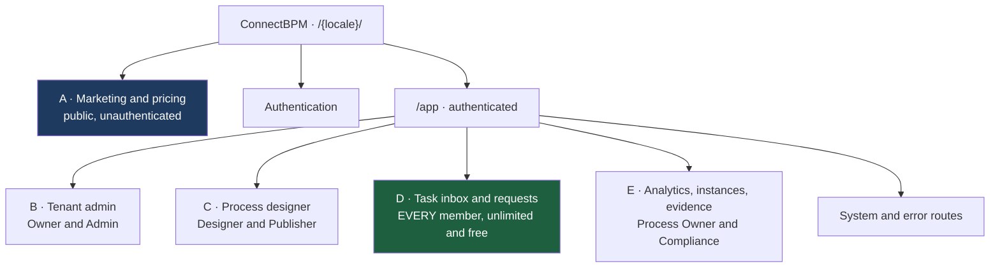

### A — Marketing, pricing and trust (public, unauthenticated)

| Route | Purpose | Key Elements | Phase |
|-------|---------|--------------|-------|
| `/` | Landing | Wedge headline (evidence-native execution), three differentiators, template teaser, Arabic/English switch, signup CTA | MVP |
| `/pricing` | **Public pricing — no gate** | Four tier cards; instance-meter explanation; **"unlimited free participants" callout**; **"completed includes rejected" plain-language note** (§5.3); **campaign/bulk instance disclosure** (RISK-PM-01); overage rate; comparison FAQ | MVP |
| `/templates` | Public template gallery | 15 templates, filter by control context, locale toggle | MVP |
| `/templates/[slug]` | Template detail | Flow preview, elements used, form fields, "start free" CTA, disclaimer (`FR-154`) | MVP |
| `/security` | **Trust page — removes the S-03 veto** | Tenant isolation model, encryption in transit and at rest, retention, sub-processors, **current hosting posture stated plainly** (RISK-PM-03), incident response, security-questionnaire download | MVP |
| `/evidence` | Wedge explainer | How the evidence record is produced, hash-chain explanation, sample export, auditor FAQ | MVP |
| `/docs` | Help centre index | Getting started, the seven elements, forms, inbox, evidence, billing | MVP |
| `/docs/[slug]` | Help article | Bilingual article body, related articles | MVP |
| `/legal/terms` | Terms of service | | MVP |
| `/legal/privacy` | Privacy notice | | MVP |
| `/legal/dpa` | Data processing addendum | Static v1 document + request form | MVP |
| `/legal/subprocessors` | Sub-processor register | Table with notification subscription | MVP |
| `/contact` | Contact | Form. Explicitly **not** a sales gate — signup never requires it (`SC-014`) | MVP |
| `/changelog` | Product changelog | v1: real page listing releases from a data file; empty state until the first release | Deferred (skeleton) |
| `/status` | Service status | v1: real page stating the current posture and linking to the incident policy | Deferred (skeleton) |

### Authentication

| Route | Purpose | Key Elements | Phase |
|-------|---------|--------------|-------|
| `/signup` | Create user + tenant | Email, password, workspace name, locale, timezone, terms acceptance → Sandbox tier (`FR-010`) | MVP |
| `/login` | Sign in | Email/password, forgot link, locale switch | MVP |
| `/forgot-password` | Request reset | | MVP |
| `/reset-password` | Complete reset | Token-scoped | MVP |
| `/verify-email` | Verify address | | MVP |
| `/invite/[token]` | Accept an invitation | Shows inviting workspace and assigned role; joins **free** (`FR-007`, DEC-002) | MVP |
| `/logout` | Sign out | Session and refresh-token revocation | MVP |
| `/sso/[tenantSlug]` | SSO entry point | v1: real page explaining SSO is a Phase-2 entitlement, with a request action | Deferred (skeleton) |

### B — Tenant admin (Owner, Admin)

| Route | Purpose | Key Elements | Phase |
|-------|---------|--------------|-------|
| `/app/settings` | Workspace general | Name, slug, default locale, timezone, branding | MVP |
| `/app/settings/calendar` | **Working calendar** | Weekend days, working hours, holiday list — the mechanism for DEC-001 geography neutrality (`FR-062`) | MVP |
| `/app/settings/members` | Members | Invite, role assignment, deactivate; **deactivation blocks until open tasks are reassigned** (`FR-008`) | MVP |
| `/app/settings/roles` | Roles and permissions | v1: read-only role matrix with the publish-permission toggle (`US-27`); full custom roles deferred | MVP (partial) |
| `/app/settings/billing` | Plan and invoices | Current tier, change plan, payment method, invoice history, downgrade guard (`FR-122`) | MVP |
| `/app/settings/usage` | **Usage and quota** | Billable completions this period, quota bar, per-process breakdown, overage incurred, **hard-cap toggle** (`FR-115`), reconciliation statement (`FR-125`) | MVP |
| `/app/settings/retention` | Retention policy | Evidence and attachment retention windows, tier maximum, next deletion run (`FR-096`) | MVP |
| `/app/settings/notifications` | Workspace notification defaults | Channel and event defaults | MVP |
| `/app/settings/webhooks` | Outbound webhooks | Endpoint CRUD, secret rotation, delivery log, HTTPS + SSRF enforcement (`FR-064`) | MVP (tier-gated) |
| `/app/settings/audit` | **Workspace audit** | Admin actions, publish events, exports, **and every ConnectSW staff access** (`FR-009`, BR-010) | MVP |
| `/app/settings/privacy` | Data subject requests | Erasure request execution producing evidence tombstones (`FR-097`); v1 skeleton shows the policy and a manual request path | Deferred (skeleton) → F-027 |
| `/app/settings/api-keys` | API keys | v1 skeleton stating the public API is a Growth-tier Phase-2 entitlement | Deferred (skeleton) |
| `/app/settings/sso` | SSO configuration | v1 skeleton stating the entitlement and offering a request action | Deferred (skeleton) → F-101 |
| `/app/settings/profile` | My profile | Name, **personal locale override** (`FR-146`), timezone, avatar | MVP |
| `/app/settings/security` | My security | Password change, active sessions, session revocation | MVP |

### C — Process designer (Designer, Publisher)

| Route | Purpose | Key Elements | Phase |
|-------|---------|--------------|-------|
| `/app/processes` | Process list | DataTable: name, status, live version, running instances, last published | MVP |
| `/app/processes/new` | Create a process | Blank canvas or install from the gallery | MVP |
| `/app/processes/[id]` | Process overview | Version list, running-instance count, analytics link, start permissions, archive action | MVP |
| `/app/processes/[id]/design` | **Designer canvas** | Palette of exactly E1–E7 (`FR-011`); properties panel; condition editor with the restricted grammar; Validate with element-level errors (`FR-017`); Publish; **RTL mirroring including connector arrowheads** (`FR-141`) | MVP |
| `/app/processes/[id]/design/forms/[elementId]` | Form builder | Typed field palette, validation rules, per-Step read-only/editable/hidden (`FR-039`), preview in both locales | MVP |
| `/app/processes/[id]/versions` | Version history | Version, checksum, publisher, published date, live instance count per version (`FR-129`) | MVP |
| `/app/processes/[id]/versions/[version]` | Read-only version view | Canvas in read-only mode, diff against the previous version | MVP |
| `/app/processes/[id]/settings` | Process settings | Name, description, instance SLA (`FR-025`), who may start (`FR-030`), **Schedule recurrence** (E7, `FR-060`), archive | MVP |
| `/app/processes/[id]/test` | Test run a draft | Runs a DRAFT, evidence marked `isTest`, **never billable** (`FR-029`) | MVP |
| `/app/templates` | In-app template gallery | 15 bilingual templates, install to a draft (`FR-153`) | MVP |
| `/app/templates/[slug]` | Template preview | Flow, forms, control-context tags, install action | MVP |

### D — Task inbox and requests (**every member — unlimited and free on every tier**)

| Route | Purpose | Key Elements | Phase |
|-------|---------|--------------|-------|
| `/app` | App home | Role-routed: Participant → inbox; Designer → processes; Admin → usage | MVP |
| `/app/inbox` | My tasks | Due-date sort by default, overdue badge, filters by process and status (`FR-069`) | MVP |
| `/app/inbox/[taskId]` | **Single task — the deep-link target** | Request summary, version-pinned form, outcome actions with required comment on negative outcomes, no dashboard chrome; read-only on revisit (`FR-070`, `FR-076`); the `SC-006` ≤60 s surface | MVP |
| `/app/inbox/queue` | Claimable queue | Unassigned tasks for my roles; conditional-update claim (`FR-068`) | MVP |
| `/app/inbox/completed` | My completed tasks | Read-only history with outcomes | MVP |
| `/app/start` | Start a request | Every process I am permitted to start (`FR-085`) | MVP |
| `/app/start/[processId]` | Start form | Version-pinned start form; quota checked **before** creation (`FR-113`) | MVP |
| `/app/start/[processId]/bulk` | **Bulk start** | CSV or saved list upload; **confirmation screen states the exact billable instance count and resulting quota position before the operation runs** (`FR-108`); all-or-nothing on quota shortfall (`EC-21`) | MVP (F-025) |
| `/app/requests` | My requests | Instances I started, with current Step, holder and due time (`FR-077`) | MVP |
| `/app/requests/[instanceId]` | Request status | Progress, current holder, due time, summarised history; 404 if not mine (`US-41`) | MVP |
| `/app/notifications` | Notification centre | In-app notifications with unread count | MVP |
| `/app/onboarding` | First-run wizard | Workspace → locale and calendar → install template → publish → start one instance (`FR-134`) | MVP |
| `/app/switch` | Workspace switcher | Explicit switch between memberships; nothing visible across them (`FR-006`, `EC-20`) | MVP |

### E — Instances, analytics and evidence (Process Owner, Compliance, Admin)

| Route | Purpose | Key Elements | Phase |
|-------|---------|--------------|-------|
| `/app/instances` | Instance list | Filters: process, definition version, status, SLA state, date range, starter | MVP |
| `/app/instances/[instanceId]` | Instance detail | Token position on the canvas, instance variables, tasks, **pinned definition version shown on the instance** (`FR-019`), terminal reason, suspend/cancel actions with required reason | MVP |
| `/app/instances/[instanceId]/evidence` | **Instance evidence record** | Ordered entries with actor, role, UTC and local timestamps, field-level deltas; hash-chain verification action (`FR-091`); single-instance export | MVP |
| `/app/evidence` | **Evidence export centre** | Date range + process filter, CSV and JSON, versions-covered statement, retention-gap statement (`FR-095`), export history (`FR-094`) | MVP |
| `/app/analytics` | Analytics overview | One card per process with the four numbers (`FR-126`) | MVP |
| `/app/analytics/[processId]` | Process analytics | Instances started, instances completed, median cycle time, SLA breach count; grouped by definition version (`FR-127`); explicit empty state (`FR-128`) | MVP |
| `/app/analytics/bottlenecks` | Bottleneck analysis | v1 skeleton: real page describing per-step duration analysis and the Phase-2 entitlement, with an empty state | Deferred (skeleton) → F-104 |

### System and error routes

| Route | Purpose | Key Elements | Phase |
|-------|---------|--------------|-------|
| `/app/quota` | **Quota reached** | Limit, current usage, period reset date, upgrade action; reached via a refused start (`FR-114`) | MVP |
| `/app/no-access` | Insufficient permission | Names the role required and who in the workspace can grant it | MVP |
| `/404` | Not found | Also serves cross-tenant refusals — existence is never disclosed (`FR-003`) | MVP |
| `/500` | Unexpected error | Correlation ID displayed for support (`NFR-017`) | MVP |
| `/offline` | Offline state | Task view degradation notice | Deferred (skeleton) |

**Route counts** — **74 routes total: 66 MVP** (of which `/app/settings/roles` ships partial and
`/app/settings/webhooks` is tier-gated) **and 8 deferred-with-skeleton**
(`/changelog`, `/status`, `/sso/[tenantSlug]`, `/app/settings/privacy`, `/app/settings/api-keys`,
`/app/settings/sso`, `/app/analytics/bottlenecks`, `/offline`).
**No route is planned to 404 and no route displays "Coming Soon."**

---

## 7. Acceptance Criteria

### 7.1 How this section is written and how it is read

Acceptance criteria carry their own identifier space, **`AC-xxx`, owned by this PRD**. They do not
restate and do not renumber SPEC-01's `FR-xxx`, `NFR-xxx`, `SC-xxx`, `US-xx` or `EC-xx`. Every row
below names the requirement it verifies and **the mechanism that verifies it**. A criterion with no
named mechanism is not a criterion, and is rejected in review.

**Four rules govern every row.**

1. **Given / When / Then, and nothing else.** No adjectives. Every threshold is a number, a count,
   an HTTP status, a state name or a boolean.
2. **Traceability is mandatory** (Article VI). Each row names at least one SPEC-01 identifier.
3. **Verification is named** — one of: `AUTO` (automated test in CI), `GATE` (merge-blocking CI
   gate), `RECON` (scheduled reconciliation job), `MANUAL` (recorded manual pass with an artifact),
   `PERF` (instrumented measurement against a stated population).
4. **P0 ordering.** §7.2 (revenue), §7.3 (evidence), §7.4 (isolation) and §7.5 (Arabic/RTL) are
   ordered first deliberately. Under DEC-002 a vague metering criterion is a **commercial defect**,
   not a documentation defect; under DEC-001 the evidence and Arabic criteria are the wedge; and
   cross-tenant exposure is the one failure class that ends the product (K6).

**Coverage rule.** Every P0 feature in §3.1 carries at least one criterion here. The map is §7.10.

### 7.2 Metering and revenue — DEC-002 `MET-1`..`MET-7`

The definition being tested is §5.3. These criteria are the executable form of that sentence.

#### `MET-1` — the billable event is completion, and "completed" is unambiguous

| ID | Given / When / Then | Traces | Verify |
|----|---------------------|--------|--------|
| **AC-001** | **Given** a running instance on published version v1 · **When** a token reaches a `Finish` element whose outcome label is `Rejected` · **Then** instance state is `COMPLETED`, exactly one billable usage event exists for that instance, and its `terminalReason` is `COMPLETED`. A negative business outcome is a billable completion. | `FR-101`, `FR-102`, `FR-103`, §5.3 | AUTO |
| **AC-002** | **Given** a definition declaring an expiry path and an instance that reaches it · **When** the expiry transition commits · **Then** instance state is `EXPIRED` and exactly one billable usage event exists. | `FR-050`, `FR-103` | AUTO |
| **AC-003** | **Given** an instance in which 1 `Step` has been completed · **When** an Admin cancels it · **Then** exactly one billable usage event exists and it records `completedStepCountAtEvent = 1`. | `FR-104`, RISK-PM-02 | AUTO |
| **AC-004** | **Given** an instance in which 0 `Step`s have been completed · **When** an Admin cancels it · **Then** no billable usage event exists, the quota reservation is released, and the released reservation is visible in the usage view within the same billing period. | `FR-104`, `FR-113` | AUTO |
| **AC-005** | **Given** an instance that reaches `FAULT_TERMINATED` by engine fault or invalid-definition runtime error · **When** the terminal transition commits · **Then** no billable usage event exists for that instance under any subsequent condition, the reservation is released, and a P0 alert is raised. | `FR-052`, `FR-103`, `EC-06` | AUTO |
| **AC-006** | **Given** a tenant at its hard cap · **When** a start is requested · **Then** the count of rows in the instance table is unchanged, one `instance.start.refused` usage event exists carrying tenant, definition, requester, reason and timestamp, and the requester receives `/app/quota` naming limit, current usage, reset date and upgrade action. | `FR-105`, `FR-113`, `FR-114` | AUTO |
| **AC-007** | **Given** a DRAFT version · **When** a designer executes a test run to a `Finish` element · **Then** the evidence entries carry `isTest = true` and no billable usage event exists. | `FR-029`, `FR-106` | AUTO |
| **AC-008** | **Given** the seven terminal outcomes in the §5.3 table · **When** the metering test suite runs · **Then** each of the seven has at least one dedicated test asserting its billability, and the suite fails if a new terminal state is added to the engine without a corresponding billability test. | §5.3, `FR-103`, `FR-104` | GATE |

#### `MET-2` and `MET-3` — one transaction, replay-safe, exactly once

The crash case is stated explicitly because it is the case that silently destroys revenue.

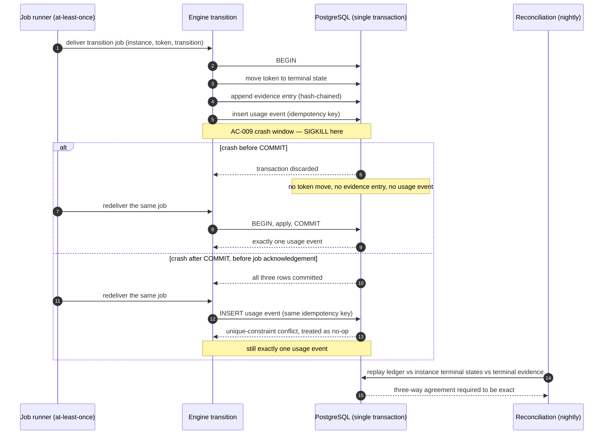

| ID | Given / When / Then | Traces | Verify |
|----|---------------------|--------|--------|
| **AC-009** | **Given** an instance one transition away from a billable terminal state · **When** the process is `SIGKILL`ed after the transition statements execute and before `COMMIT` · **Then** on restart the instance is in its **prior** state, no evidence entry for that transition exists, and no usage event exists — all three or none, never a subset. | `FR-101`, `EC-05`, `MET-2` | AUTO |
| **AC-010** | **Given** the same crash test · **When** the job is redelivered after restart · **Then** the transition commits and **exactly one** usage event exists for `(instance, token, transition)`. | `FR-107`, `EC-05`, `MET-3` | AUTO |
| **AC-011** | **Given** a committed billable transition · **When** the identical job is redelivered 5 times concurrently · **Then** the usage-event count for that instance remains 1, the duplicate inserts fail on the unique idempotency-key constraint, and none of the 5 deliveries returns HTTP 5xx. | `FR-107`, `MET-3` | AUTO |
| **AC-012** | **Given** the engine transition code path · **When** static analysis runs in CI · **Then** no code path writes a usage event outside the database transaction that performs the state transition, and any such path fails the build. | `FR-101`, `MET-2` | GATE |
| **AC-013** | **Given** the ConnectSW shared packages · **When** the build runs · **Then** no instance-metering code path imports `@connectsw/billing`'s `UsageService`, and the import is denied by a lint rule naming DEC-002 `MET-2`/`MET-3` as the reason. | DEC-002 note, §5.2(2) | GATE |

#### `MET-4` — quota is admission control, enforced before creation

| ID | Given / When / Then | Traces | Verify |
|----|---------------------|--------|--------|
| **AC-014** | **Given** `billable_completions_this_period + open_reservations = hard_cap` · **When** a start is requested · **Then** no instance row, no evidence record and no reservation are created, and the refusal precedes creation in the recorded event order. | `FR-113`, `MET-4` | AUTO |
| **AC-015** | **Given** remaining quota of 5 · **When** 10 starts are requested concurrently · **Then** exactly 5 instances exist, exactly 5 reservations are held, and 5 refusal events are recorded. | `FR-113`, `EC-03` | AUTO |
| **AC-016** | **Given** a tenant that exhausts quota with 900 instances in flight · **When** the cap is reached · **Then** all 900 continue to advance, none is suspended, terminated or degraded, and each is billed only on reaching a billable terminal state. | `EC-03`, `FR-113` | AUTO |
| **AC-017** | **Given** a bulk start of 400 rows against a remaining quota of 250 · **When** the operation is submitted · **Then** 0 instances are created, exactly 1 refusal event is recorded for the batch, and the response states the shortfall as a number. | `EC-21`, `FR-108` | AUTO |
| **AC-018** | **Given** a bulk start of 400 rows within quota · **When** the confirmation screen renders · **Then** it states "400 billable instances" and the resulting quota position **before** the operation runs, and the operation cannot be executed without passing that screen. | `FR-108`, RISK-PM-01 | AUTO + MANUAL |
| **AC-019** | **Given** a Schedule (E7) start whose recurrence is due · **When** the scheduler fires · **Then** the same admission check applies, and a refused scheduled start records a refusal event and notifies the Tenant Admin rather than failing silently. | `FR-060`, `FR-113`, `FR-114` | AUTO |
| **AC-020** | **Given** a tenant on the Sandbox tier · **When** the Admin attempts to disable the hard cap · **Then** the action is refused; the Sandbox hard cap is non-removable. | `FR-115` | AUTO |

#### `MET-5` — immutable and reconcilable

| ID | Given / When / Then | Traces | Verify |
|----|---------------------|--------|--------|
| **AC-021** | **Given** an existing usage event · **When** any API, job or administrative path attempts `UPDATE` or `DELETE` on it · **Then** the attempt is refused and the refusal is itself recorded; corrections exist only as compensating events. | `FR-109` | AUTO |
| **AC-022** | **Given** a tenant with 1,000 completed instances · **When** the nightly reconciliation runs · **Then** instance terminal states, terminal evidence entries and usage events agree **exactly** — not within a tolerance — and the run publishes a per-tenant statement. | `FR-110`, `NFR-007`, `SC-003` | RECON |
| **AC-023** | **Given** a deliberately injected divergence of one record · **When** the nightly reconciliation runs · **Then** it detects the divergence, names the instance, and raises a P0 alert. The detection test itself runs in CI. | `FR-110`, `SC-002` | AUTO + RECON |
| **AC-024** | **Given** a retention policy that deletes an instance payload · **When** the deletion job runs · **Then** the instance's usage events remain readable and reconcilable, and the period totals are unchanged. | `FR-111`, `FR-096` | AUTO |
| **AC-025** | **Given** an instance whose terminal transition commits at `23:59:59.998Z` on the last day of a period · **When** the period closes · **Then** the usage event belongs to that period by its recorded UTC commit timestamp, and no later job recomputes its period membership. | `FR-123`, `EC-19` | AUTO |

#### `MET-6` and `MET-7` — resource metering and day-one instrumentation

| ID | Given / When / Then | Traces | Verify |
|----|---------------------|--------|--------|
| **AC-026** | **Given** a condition expression submitted by a tenant · **When** it is evaluated · **Then** the CPU time and memory consumed are recorded against that tenant, and an evaluation exceeding the configured bound is terminated, recorded, and surfaced as a definition error rather than an engine fault. | `FR-119`, `NFR-009`, `MET-6` | AUTO |
| **AC-027** | **Given** a synthetic tenant exercised through one full instance lifecycle · **When** the instrumentation audit query runs at the Foundation checkpoint · **Then** every dimension enumerated in `FR-117` returns a non-null value for that tenant and period — including the dimensions not billed in v1. | `FR-117`, `MET-7` | GATE |
| **AC-028** | **Given** two tenants that each complete 500 instances in a period, one with 3 members and one with 300 members · **When** invoices are generated · **Then** the two invoices are identical. No billable quantity varies with the number of users, roles, designers or participants. | `FR-005`, `FR-118`, `FR-121`, DEC-002 | AUTO |
| **AC-029** | **Given** any tier definition in the entitlement configuration · **When** the entitlement schema is validated in CI · **Then** no entitlement is expressed in seats, users, designers or participants, and any such entitlement fails the build. | `FR-121`, DEC-002 | GATE |

#### Commercial disclosure — the criteria that keep the meter defensible

| ID | Given / When / Then | Traces | Verify |
|----|---------------------|--------|--------|
| **AC-030** | **Given** the public pricing page · **When** it renders in `en` and in `ar` · **Then** it states in plain language that a completed instance includes rejected, denied and withdrawn outcomes, and that statement is present in both locales. | `FR-131`, §5.3 | MANUAL |
| **AC-031** | **Given** the public pricing page · **When** it renders · **Then** the campaign/bulk disclosure — one billable instance per recipient — is present at the same visual weight as the "unlimited free participants" claim. | RISK-PM-01, `FR-131` | MANUAL |
| **AC-032** | **Given** a Tenant Admin · **When** usage reaches 80%, 100% and 120% of quota in a period · **Then** exactly one notification is sent per threshold per period. | `FR-116` | AUTO |
| **AC-033** | **Given** the tenant usage view · **When** it is compared with the invoice for the same period · **Then** billable completions, overage incurred and the per-process breakdown reconcile to the invoice total with zero difference. | `FR-125`, `NFR-007` | AUTO |
| **AC-034** | **Given** a tenant with 3,000 completed instances in the current period · **When** a downgrade to a 2,500 cap is requested · **Then** the downgrade is refused, the exact overage is stated as a number, the published processes exceeding the new limit are listed, and no already-billed usage is repriced. | `FR-122`, `FR-124`, `EC-13` | AUTO |

### 7.3 Evidence and audit — the DEC-001 moat

DEC-001 makes the evidence record day-one architecture rather than a Phase-2 feature. The property
an auditor can test is not "we log things"; it is **completeness, immutability, version-pinning and
independent verifiability**. These four are separated deliberately below.

| ID | Given / When / Then | Traces | Verify |
|----|---------------------|--------|--------|
| **AC-035** | **Given** a tenant on the free Sandbox tier · **When** an instance runs to completion · **Then** a complete evidence record exists for it, identical in structure to a Business-tier record. Evidence is not a tier entitlement. | `FR-086`, DEC-001 | AUTO |
| **AC-036** | **Given** any tenant, role, configuration flag or support action · **When** an attempt is made to disable evidence capture for a process, an instance or a period · **Then** no such control exists in the API, the UI or the configuration schema. | `FR-100` | AUTO + GATE |
| **AC-037** | **Given** an instance exercised through every action class in `FR-087` — transition, task creation, assignment, reassignment, claim, completion, withdrawal, decision outcome, timer firing, timer discard, suspension, cancellation, quota refusal, form-data delta, publication, export request · **When** its evidence record is read · **Then** each of the 16 classes has at least one entry, and the test fails if the engine gains an action class with no evidence entry. | `FR-087` | AUTO + GATE |
| **AC-038** | **Given** any evidence entry · **When** it is read · **Then** it carries actor identity, the actor's role **at the time of the action**, a UTC timestamp, the tenant-local timestamp, tenant, instance, definition version, and a per-instance sequence number that is strictly monotonic with no gaps. | `FR-088` | AUTO |
| **AC-039** | **Given** an existing evidence entry · **When** any API path, job, migration or administrative tool attempts to update or delete it · **Then** the attempt is refused and the refusal is itself recorded as an evidence entry. | `FR-089` | AUTO |
| **AC-040** | **Given** an instance with 40 evidence entries · **When** entry 17's content is altered directly in the database · **Then** the verification operation reports failure and names entry 17 as the first divergent entry. | `FR-090`, `FR-091` | AUTO |
| **AC-041** | **Given** an evidence export in JSON · **When** an independent verification script that imports **no application code** recomputes the hash chain from the exported material alone · **Then** the chain verifies. This test is the operational form of "verifiable by someone who does not trust us". | `FR-093`, `FR-091`, STRAT A9 | AUTO |
| **AC-042** | **Given** an export covering a date range spanning definition versions v1, v2 and v3 · **When** it is generated · **Then** the export names all three versions covered, and each instance's entries render against the version that instance was pinned to. | `FR-093`, `FR-018`, `EC-01` | AUTO |
| **AC-043** | **Given** a form field removed in v2 · **When** a v1 instance's evidence is exported after v2 is live · **Then** the removed field and its captured values are present in the v1 export. | `EC-18`, `FR-018` | AUTO |
| **AC-044** | **Given** an export request · **When** it completes · **Then** an evidence entry exists recording requester identity, the exact filter parameters and the generation timestamp. | `FR-094` | AUTO |
| **AC-045** | **Given** a retention policy that deleted 2026-01 through 2026-03 · **When** an export for 2026-01 through 2026-06 is requested · **Then** the export is produced **and** states which sub-period was removed, under which policy, and on what date. A silently short export is a defect. | `FR-095`, `EC-14` | AUTO |
| **AC-046** | **Given** a personal-data erasure request against an instance · **When** it is executed · **Then** the personal-data payloads are irreversibly removed, the evidence entries remain as tombstones naming what was removed, by whom and under which policy, and the hash chain still verifies end to end. | `FR-097`, CLR-G | AUTO |
| **AC-047** | **Given** an instance whose recorded path is not a legal path through its pinned definition version · **When** the daily path reconciliation runs · **Then** the instance is named and a P0 alert is raised. | `FR-099`, `SC-005` | RECON |
| **AC-048** | **Given** any evidence query, export or verification operation · **When** it executes · **Then** its result set contains rows from exactly one tenant, and no aggregate across tenants is reachable from any API path. | `FR-098`, `FR-112` | AUTO |

### 7.4 Tenant isolation — the highest-severity criteria in this document

RSK-001 is existential and K6 is the only kill criterion that can fire on a single incident. These
criteria are merge-blocking, not advisory.

| ID | Given / When / Then | Traces | Verify |
|----|---------------------|--------|--------|
| **AC-049** | **Given** two provisioned tenants A and B with populated processes, instances, tasks, forms, evidence and usage · **When** the automated isolation suite requests **every** API endpoint as a member of A using B's identifiers · **Then** every response is HTTP 404 and no response body contains any value originating in B. The suite runs on every build and blocks merge on any deviation. | `NFR-008`, `FR-003`, `SC-001` | GATE |
| **AC-050** | **Given** a new endpoint added in a pull request · **When** CI runs · **Then** the isolation suite enumerates the new endpoint automatically, and an endpoint absent from the suite fails the build. Coverage of the suite is itself enforced. | `NFR-008` | GATE |
| **AC-051** | **Given** a data-access method that reads or writes a tenant-scoped entity · **When** it is written without a tenant predicate · **Then** the code does not compile or does not pass the access-layer test, and enforcement lives at the data-access boundary rather than in per-route checks. | `FR-002`, RSK-001 | GATE |
| **AC-052** | **Given** a request for an entity that belongs to another tenant and a request for an entity that does not exist at all · **When** both are issued · **Then** both return HTTP 404 with the same response shape. Existence is never disclosed across a tenant boundary, and 403 is never returned in this case. | `FR-003` | AUTO |
| **AC-053** | **Given** one email address holding membership in tenants A and B · **When** the user is signed in to A · **Then** no task, instance, evidence entry, notification, search result, count or navigation item from B is reachable, and switching to B is an explicit action. | `FR-006`, `EC-20` | AUTO |
| **AC-054** | **Given** ConnectSW staff access to a tenant's data · **When** the access occurs · **Then** an entry naming actor, timestamp, scope and the stated reason appears in that tenant's `/app/settings/audit` view without ConnectSW action. | `FR-009`, BR-010 | AUTO |
| **AC-055** | **Given** an attachment stored by tenant A · **When** tenant B requests it by direct object key or signed-URL guess · **Then** the response is HTTP 404 and storage partitioning prevents the read at the storage layer, not only at the API layer. | `NFR-011` | AUTO |
| **AC-056** | **Given** a webhook endpoint registered by tenant A · **When** any event fires for tenant B · **Then** no delivery is attempted to A's endpoint, and the delivery log for A contains no reference to B. | `FR-064`, `FR-112` | AUTO |
| **AC-057** | **Given** the analytics, usage and reconciliation queries · **When** they execute · **Then** each produces per-tenant results only, and no query plan in the codebase aggregates a tenant-scoped table without a tenant predicate. | `FR-112`, `FR-098` | GATE |

### 7.5 Arabic and right-to-left — v1 scope under DEC-001

DEC-001 places Arabic and RTL **in v1**. Deferring them turns internationalisation into a
translation layer bolted onto a left-to-right product, which is the failure mode these criteria
exist to prevent.

| ID | Given / When / Then | Traces | Verify |
|----|---------------------|--------|--------|
| **AC-058** | **Given** the 66 MVP routes in §6 · **When** each is requested under `/ar/` · **Then** every route renders with `dir="rtl"` on the document element, and no route falls back to an English-only page. | `FR-138`, `FR-140` | AUTO |
| **AC-059** | **Given** the compiled stylesheets · **When** the RTL lint rule runs · **Then** layout uses logical properties (`margin-inline`, `padding-inline`, `inset-inline`) and no `text-align: right` is used as an RTL substitute; a violation fails the build. | `FR-140` | GATE |
| **AC-060** | **Given** a process definition open in the designer under `ar` · **When** the canvas renders · **Then** flow direction, connector routing and arrowheads are mirrored, and a screenshot pair (LTR and RTL) is recorded as the acceptance artifact for the story. | `FR-141`, `NFR-013` | MANUAL |
| **AC-061** | **Given** a task assigned by an `en` author to an `ar` recipient · **When** the notification is composed · **Then** the email subject, body, action label and deep-link landing page are in the recipient's locale, not the author's. | `FR-142` | AUTO |
| **AC-062** | **Given** a build in which one key exists in `en` and is absent in `ar` · **When** CI runs · **Then** the build fails and names the missing key. Untranslated `ar` keys in a shipped build: 0. | `FR-144`, `SC-016` | GATE |
| **AC-063** | **Given** any component in the codebase · **When** the string-extraction lint runs · **Then** no user-visible string is hard-coded in a component. | `FR-139` | GATE |
| **AC-064** | **Given** a workspace whose default locale is `en` and a member whose personal locale is `ar` · **When** that member signs in · **Then** every surface and every notification for that member renders in `ar`. | `FR-146` | AUTO |
| **AC-065** | **Given** a Step named in Arabic by a tenant author · **When** an `en` user views it · **Then** the Arabic name is displayed unchanged. Tenant-authored content is never machine-translated; only ConnectSW chrome and gallery templates are bilingual. | `FR-147` | AUTO |
| **AC-066** | **Given** an instance started under `ar`, completed by an `en` user and exported under `ar` · **When** the exports are compared · **Then** each field carries the same stable machine key in both, alongside the locale-specific display label, and stored values are byte-identical. | `FR-149`, `EC-12` | AUTO |
| **AC-067** | **Given** every shipped surface in both `en` and `ar` · **When** an automated accessibility scan and a manual keyboard pass run · **Then** critical and serious WCAG 2.1 AA violations total 0 in both directions, and the single-task view is completed end to end using the keyboard alone. | `NFR-012`, `SC-018` | GATE + MANUAL |
| **AC-068** | **Given** Arabic text on any surface · **When** the primary webfont fails to load · **Then** the fallback chain renders Arabic script correctly rather than falling back to a Latin-only face. | `FR-143` | MANUAL |
| **AC-069** | **Given** all 15 gallery templates · **When** each is inspected · **Then** element labels, form labels and instructions exist in both `en` and `ar`. | `FR-151`, `FR-150` | GATE |

### 7.6 Engine correctness and durability

| ID | Given / When / Then | Traces | Verify |
|----|---------------------|--------|--------|
| **AC-070** | **Given** 500 in-flight instances across varied element types · **When** the process is force-killed and restarted · **Then** 100% resume at their recorded position with zero duplicated side effects — no duplicated task, notification, webhook or usage event. | `NFR-005`, `SC-004` | GATE |
| **AC-071** | **Given** 50,000 timers due within the same second · **When** the runner drains the backlog · **Then** ≥99% fire within 60 s of due time, none fires twice, and none is dropped. | `NFR-004`, `EC-17`, `SC-008` | AUTO |
| **AC-072** | **Given** a timer whose target token has already moved · **When** the timer job is claimed · **Then** it is discarded as stale on token version — never on wall-clock ordering — and records `timer.discarded_stale` with no transition and no notification. | `EC-02`, `FR-057` | AUTO |
| **AC-073** | **Given** one unassigned task and two participants claiming it simultaneously · **When** both claims execute · **Then** exactly one succeeds, and the loser receives a response naming the claimant rather than a generic error. | `EC-04`, `FR-068` | AUTO |
| **AC-074** | **Given** a task completion submitted twice with the same idempotency key · **When** both requests are processed · **Then** the second returns the first result and performs no state change; a `GET` of the deep link never mutates state. | `FR-072`, `FR-073`, `EC-11` | AUTO |
| **AC-075** | **Given** a `Decision` element without a default path · **When** publication is attempted · **Then** publication is refused and the offending element is named. **Given** a published `Decision` whose conditions all evaluate false · **When** the token arrives · **Then** it takes the default path and the instance never stalls. | `FR-020`, `EC-08` | AUTO |
| **AC-076** | **Given** a condition referencing a form field that was never filled · **When** it is evaluated · **Then** the absent variable is treated as `null`, the comparison yields `false` deterministically, and no exception, crash or stall occurs. | `FR-023`, `EC-09` | AUTO |
| **AC-077** | **Given** a `Split` whose branches cannot all reach the matching `Join`, including via a boundary path that bypasses it · **When** publication is attempted · **Then** publication is refused with the structural fault named. | `EC-06` | AUTO |
| **AC-078** | **Given** production-representative load · **When** engine state transitions are measured at the API boundary · **Then** p95 ≤ 500 ms. | `NFR-001`, `SC-007` | PERF |
| **AC-079** | **Given** the test suite · **When** coverage is measured · **Then** overall coverage ≥ 80% and branch coverage of the engine transition function is 100%, with all tests executed against real PostgreSQL and real Redis and no mocked data stores. | `NFR-018`, `SC-017` | GATE |

### 7.7 Task inbox — the 60-second path and the retention persona

RSK-004 scores 9/9. These criteria are the mitigation, stated as numbers.

| ID | Given / When / Then | Traces | Verify |
|----|---------------------|--------|--------|
| **AC-080** | **Given** a task-assignment email · **When** the recipient taps the link · **Then** the destination is the single task — request summary, version-pinned form, outcome actions — with no dashboard, no task list and no navigation chrome. | `FR-070`, `FR-084` | AUTO |
| **AC-081** | **Given** ≥100 real task completions by users who received no training · **When** completion time is measured client-side from first render to submission confirmation · **Then** the median is ≤ 60 s. | `NFR-002`, `SC-006` | PERF |
| **AC-082** | **Given** a 375 px viewport on a throttled 4G connection · **When** the single-task view loads · **Then** it is interactive in ≤ 2.0 s. | `NFR-003` | PERF |
| **AC-083** | **Given** a task the user has already completed · **When** the same deep link is opened again · **Then** the view renders read-only with the recorded outcome, and no second submission is possible. | `FR-076` | AUTO |
| **AC-084** | **Given** a Step outcome action configured to require a comment, such as Reject · **When** it is submitted without a comment · **Then** submission is refused and the required field is named. | `FR-081` | AUTO |
| **AC-085** | **Given** a member with 6 open tasks · **When** an Admin attempts deactivation · **Then** deactivation does not complete until all 6 are reassigned or returned to a claimable queue, and the Admin is shown the full list. | `FR-008`, `EC-07` | AUTO |
| **AC-086** | **Given** a task belonging to another user or another tenant · **When** its deep link is opened · **Then** the response is HTTP 404 and the attempt is recorded. | `FR-071`, `FR-003`, US-41 | AUTO |
| **AC-087** | **Given** a Participant · **When** any route in site-map surfaces B, C or E is requested · **Then** the response is HTTP 403 and the route is absent from that user's navigation. | `FR-084`, §6 | AUTO |

### 7.8 Designer, versioning and the template gallery

| ID | Given / When / Then | Traces | Verify |
|----|---------------------|--------|--------|
| **AC-088** | **Given** the designer palette and the definition API · **When** an element type outside E1–E7 is created through the UI, the API or a direct payload · **Then** creation is refused. The palette ceiling is enforced at the API, not only in the UI. | `FR-011` | AUTO |
| **AC-089** | **Given** a definition with a validation fault · **When** Validate runs · **Then** the response names the specific element by its canvas identifier and its customer-facing label, not a generic message. | `FR-017` | AUTO |
| **AC-090** | **Given** v1 published with 40 running instances · **When** v2 is published · **Then** all 40 continue to resolve every element, form and condition from v1 for their entire remaining life, new instances bind v2, and both the instance detail view and the evidence export name the version actually executing. | `EC-01`, `FR-018`, `FR-019` | AUTO |
| **AC-091** | **Given** two designers editing the same draft · **When** the second saves against a changed baseline · **Then** the save is refused with HTTP 409 and the second designer is shown what changed and by whom. Last-write-wins is not acceptable on an artifact that becomes an immutable published version. | `EC-16` | AUTO |
| **AC-092** | **Given** a published version · **When** any path attempts to modify it · **Then** the attempt is refused; the version and its checksum are immutable. | `FR-018` | AUTO |
| **AC-093** | **Given** a process archived while instances are running · **When** a new start is requested · **Then** it is refused; running instances complete normally on their pinned version, and hard deletion is refused while any instance or evidence record references the process. | `EC-15` | AUTO |
| **AC-094** | **Given** the shipped designer · **When** all 15 gallery templates (T01–T15) are modelled in it · **Then** 15 of 15 model within the shipped element set with no excluded element required. This test re-runs against the built product before the Foundation checkpoint. | `SC-015`, ASM-005, SCOPE-AMD-001 | GATE |
| **AC-095** | **Given** an installed gallery template · **When** the gallery version of that template is later changed · **Then** the installed copy is unaffected; installation creates an unlinked editable DRAFT. | `FR-153` | AUTO |
| **AC-096** | **Given** any gallery template · **When** it is viewed publicly or in-app · **Then** it declares its regulatory or control context as a descriptive tag and carries the disclaimer that it is a starting point rather than legal advice. | `FR-154`, RISK-PM-05 | MANUAL |

### 7.9 Commerce, onboarding, calendar and surface completeness

| ID | Given / When / Then | Traces | Verify |
|----|---------------------|--------|--------|
| **AC-097** | **Given** a visitor on `/pricing` · **When** they sign up, select a tier and pay by card · **Then** a user, a tenant and a subscription are created with zero human intervention at any step, and no route in the paid path requires contacting sales. | `FR-010`, `FR-131`, `SC-014` | AUTO |
| **AC-098** | **Given** a new signup · **When** the onboarding wizard is followed to its end in one session · **Then** the tenant has a published process and one started instance, and the funnel event for each step is recorded. | `FR-134`, `FR-135`, `SC-009` | AUTO |
| **AC-099** | **Given** every route in the §6 site map · **When** the smoke-test gate runs · **Then** no route returns 404, no route is missing, and the string "Coming Soon" appears in no rendered page in either locale. Deferred routes render a real skeleton with a genuine empty state and a valid action. | §6 rule 2 | GATE |
| **AC-100** | **Given** a tenant whose working week is Sunday–Thursday with a configured holiday · **When** a Step carries a due date of "2 working days" · **Then** the due instant skips the configured weekend and holiday and resolves to one unambiguous UTC instant. | `FR-062`, US-36 | AUTO |
| **AC-101** | **Given** a due instant that lands in a local time skipped by a DST transition · **When** it is computed · **Then** the next valid instant is used, and the evidence entry records both the UTC instant and the tenant-local rendering. | `EC-10`, `FR-062` | AUTO |
| **AC-102** | **Given** a webhook endpoint configured with a non-HTTPS URL or an address in a private range · **When** it is saved · **Then** it is refused, and outbound delivery enforces SSRF protection at request time as well as at configuration time. | `FR-064`, `NFR-011` | AUTO |
| **AC-103** | **Given** the four numbers on `/app/analytics/[processId]` · **When** a process has instances on v1 and v2 · **Then** the metrics are grouped by definition version, and a process with no data renders an explicit empty state rather than zeros presented as results. | `FR-126`, `FR-127`, `FR-128` | AUTO |
| **AC-104** | **Given** the public `/security` page · **When** it renders · **Then** it states the current hosting posture in plain language, together with the isolation model, encryption posture, retention and sub-processors. Procurement never discovers the hosting posture for the first time in a questionnaire. | `FR-137`, RISK-PM-03 | MANUAL |

### 7.10 Coverage map — every P0 feature and every CEO metering requirement

| DEC-002 requirement | Criteria |
|---------------------|----------|
| `MET-1` completion is the billable event, unambiguously defined | AC-001 … AC-008, AC-030 |
| `MET-2` same transaction, idempotency key | AC-009, AC-012, AC-013 |
| `MET-3` exactly-once on an at-least-once substrate | AC-010, AC-011 |
| `MET-4` pre-start quota refusal | AC-014 … AC-020 |
| `MET-5` immutable and reconcilable | AC-021 … AC-025 |
| `MET-6` per-tenant resource metering | AC-026 |
| `MET-7` day-one instrumentation of secondary dimensions | AC-027, AC-028, AC-029 |

| Feature | Criteria | Feature | Criteria |
|---------|----------|---------|----------|
| F-001 Tenant isolation | AC-049 … AC-057 | F-014 Quota reservation | AC-014 … AC-020, AC-034 |
| F-002 Membership and leavers | AC-053, AC-085, AC-054 | F-015 Self-serve commerce | AC-097, AC-030, AC-031 |
| F-003 Designer E1–E7 | AC-088, AC-089, AC-094 | F-016 Arabic and RTL | AC-058 … AC-069 |
| F-004 Versioning and pinning | AC-090 … AC-093, AC-042, AC-043 | F-017 Onboarding | AC-098 |
| F-005 Durable engine | AC-070 … AC-079 | F-018 Template gallery | AC-094, AC-095, AC-096, AC-069 |
| F-006 Restricted conditions | AC-075, AC-076, AC-026 | F-019 Minimal analytics | AC-103 |
| F-007 Forms | AC-043, AC-083, AC-084 | F-020 Signed webhooks | AC-102, AC-056 |
| F-008 Inbox and deep link | AC-080 … AC-087 | F-021 Notifications | AC-061, AC-032 |
| F-009 Due dates and escalation | AC-071, AC-072, AC-100 | F-022 Usage dashboard | AC-032, AC-033 |
| F-010 Working calendar | AC-100, AC-101 | F-023 Retention | AC-024, AC-045 |
| F-011 Evidence trail | AC-035 … AC-040, AC-047, AC-048 | F-024 Workspace audit | AC-054, AC-044 |
| F-012 Evidence export | AC-041 … AC-046 | F-025 Schedule and bulk start | AC-017, AC-018, AC-019 |
| F-013 Completed-instance metering | AC-001 … AC-029 | F-026 Marketing and trust | AC-030, AC-031, AC-099, AC-104 |
| | | F-027 Erasure tombstones | AC-046 |

**Gaps stated honestly.** Two P0 areas carry criteria that cannot be fully automated before a real
customer population exists: **AC-081** (median ≤ 60 s) needs ≥100 real completions by untrained
users, and **AC-041**'s auditor-acceptance value depends on STRAT A9, which is unvalidated
(RISK-PM-05). Both are measured on synthetic populations pre-launch and re-measured on the real
population at the first paying tenant. No other criterion above depends on a live customer.

---

## 8. Out of Scope

RSK-009 rates the pressure to build five partial pillars instead of three complete ones at **6/9
with high probability**. This section is the fence. Anything named here is **not** in v1, and the
reason is recorded so that a future reader knows whether the exclusion was a judgement or an
oversight. It was a judgement in every case.

### 8.1 The scope fence

```mermaid
flowchart TB
    subgraph V1["IN — v1, and non-negotiable"]
        direction LR
        A1["Tenancy and isolation"]
        A2["Designer E1–E7 + publish/version"]
        A3["Durable engine + timers"]
        A4["Forms + task inbox"]
        A5["Evidence trail + export"]
        A6["Completed-instance meter + quota"]
        A7["Arabic / RTL"]
        A8["15 bilingual templates"]
        A9["Four numbers per process"]
        A10["Self-serve commerce"]
    end
    subgraph P2["OUT — Phase 2, named and dated to a horizon"]
        direction LR
        B1["SSO / SAML / SCIM"]
        B2["BPMN 2.0 XML in/out"]
        B3["Service tasks + sandbox"]
        B4["Full analytics"]
        B5["Evidence pack + control mapping"]
        B6["AI process authoring"]
        B7["In-region + Sovereign tier"]
        B8["ConnectGRC integration"]
        B9["External participants — blocked on CLR-B"]
        B10["Connector library"]
    end
    subgraph FU["OUT — Future, thesis not feature"]
        direction LR
        C1["Agentic orchestration"]
        C2["Embeddable engine / OEM"]
        C3["Template marketplace"]
        C4["Process mining and simulation"]
        C5["In-flight instance migration"]
    end
    V1 -->|"RSK-009 gate:<br/>any addition needs an equal removal<br/>at an Orchestrator checkpoint"| P2
    P2 --> FU

    style V1 fill:#1e5f3f,color:#fff
    style P2 fill:#7a5c00,color:#fff
    style FU fill:#1e3a5f,color:#fff
```

### 8.2 Out of scope by CEO direction — DEC-001, DEC-002, DEC-003

| # | Excluded from v1 | Reason (one line) | Lands |
|---|------------------|-------------------|-------|
| 1 | **AI / natural-language process authoring** | An accelerant on top of the wedge, not the wedge, and LLM cost of goods must never be folded into a base tier. | F-106, Next horizon, separately metered |
| 2 | **BPMN 2.0 XML import and export** | Serves the Camunda-refugee segment rather than the MVP buyer; `FR-012`'s 1:1 semantic mapping keeps it an additive layer instead of a re-architecture. | F-102, Phase 2 |
| 3 | **In-region hosting and the Sovereign tier** | STRAT A4 is unvalidated and needs a DevOps costing exercise; `NFR-019` forbids foreclosing it. | F-107, Next horizon |
| 4 | **ConnectGRC integration** | The internal API boundary (`FR-065`) is built now so the integration stays cheap later; the integration itself earns nothing in v1. | F-108, Next horizon |
| 5 | **SSO, SAML and SCIM** | Removes the IT gatekeeper's veto, and the veto is not what blocks the first sale — the buyer is the Ops or Compliance lead, not the CIO. | F-101, Phase 2 |
| 6 | **Third-party connectors and a connector marketplace** | Integration-catalogue breadth is an unwinnable race against Zapier and Power Automate; signed webhooks answer the objection at a fraction of the cost. | F-110, Next / Future |
| 7 | **Agentic orchestration** | A Future-horizon thesis (SO-5) that presumes the governed-execution core already exists. | F-201, Future |

### 8.3 Out of scope by the BA-01 §Q6 MVP boundary

| # | Excluded from v1 | Reason (one line) |
|---|------------------|-------------------|
| 8 | **Service tasks and any customer-authored script execution** | The largest single item in the gap matrix and the carrier of RSK-002; `BR-005` and `NFR-009` remove untrusted code execution from the v1 critical path entirely. |
| 9 | **Sub-processes, call activities, message and signal events, inclusive and event-based gateways, multi-instance loops, compensation, DMN decision tables** | Outside the element set, and the ASM-005 test measured exactly what that costs: 15 of 15 templates model without them once E7 and bulk start are added. |
| 10 | **Full analytics — bottleneck heatmap, per-step duration distribution, rework rate** | Valuable, and not what the first cheque is for; four numbers per process answer the Process Owner's question. |
| 11 | **In-flight instance migration between definition versions** | Genuinely hard, and `BR-002` version pinning makes it non-urgent rather than deferred-and-painful. |
| 12 | **Per-tenant data residency selection** | An enterprise-segment enabler, and the enterprise segment is itself out of scope for v1. |
| 13 | **Enterprise segment (5,000+ employees), field sales, professional services, SOC 2 Type II certification** | Requires a cost base a pre-revenue entrant cannot fund; SOC 2 **readiness** work starts now, certification does not. |
| 14 | **Native mobile applications** | The single-task view is mobile-responsive under `NFR-003`, which is what the Task Performer persona actually needs; a native app adds two release trains for no additional job-to-be-done. |

### 8.4 Out of scope by decisions taken in this PRD and in SPEC-01

These are exclusions that sections 1–6 and the specification made deliberately. They are recorded
here because an unstated exclusion becomes an assumed inclusion.

| # | Excluded from v1 | Reason (one line) |
|---|------------------|-------------------|
| 15 | **Unauthenticated external participants completing tasks via a signed link** | `CLR-B` is an open CEO decision; the PM recommendation is Phase 2, and template T02 ships with its degradation documented rather than the evidence model retrofitted late. |
| 16 | **A custom role editor** | v1 ships the six fixed roles of `FR-004` with the publish-permission toggle; arbitrary role composition multiplies the isolation test surface for no first-sale value (`/app/settings/roles` ships partial by design). |
| 17 | **A public REST API and API keys for tenants** | A Growth-tier Phase-2 entitlement; every v1 job-to-be-done is reachable through the UI and outbound webhooks (`/app/settings/api-keys` ships as a skeleton). |
| 18 | **Evidence pack export with control mapping** | The auditor conversation that defines what a control mapping must contain has not happened; building it before STRAT A9 is tested risks building the wrong artifact. |
| 19 | **Machine translation of tenant-authored content** | `FR-147` — translating a customer's Step and outcome labels would put ConnectSW-generated text into an evidence record that is supposed to be the customer's own. |
| 20 | **Offline task completion** | The engine is the system of record and an offline mutation queue creates a second one; `/offline` ships as a real page describing the degradation. |
| 21 | **A BI or reporting tool, custom dashboards, scheduled reports** | `FR-126` fixes analytics at four numbers per process; anything beyond it competes with the customer's existing BI stack. |
| 22 | **Any seat, user, designer or participant entitlement — permanently, not merely in v1** | DEC-002 is irreversible; `FR-121` forbids expressing any entitlement in seats, and §5.2 records that this supersedes both BA-01 §Q5 and STRAT-01 §7.2. |

### 8.5 In scope, but deliberately not frozen

Three items are inside v1 and are **not** yet fixed. Recording them here prevents a later reader
from treating a provisional number as a commitment.

| Item | Status | Unfreezes when |
|------|--------|----------------|
| **Tier price points** (USD 0 / 299 / 899 / 2,499; overage USD 0.04) | Tier **structure** is normative; the **numbers** are provisional and are not published on `/pricing` until validated. `CLR-C` is an open CEO decision. | K0 discovery interviews complete (ASM-004, ASM-006, STRAT A8) |
| **SCOPE-AMD-001** — E7 `Schedule` plus bulk instantiation | Written into scope by SPEC-01 on the evidence of the ASM-005 test; the notation decision is delegated to the Architect. | ARCH-01 ratifies or overrides in an ADR (`OQ-02`) |
| **`NFR-014` scalability targets** (200 tenants, 100k completed instances/month, 500k open timers) | An explicit planning assumption, not a measured requirement. | Re-baselined at the Foundation checkpoint |

### 8.6 The rule that keeps this section true

**Any addition to v1 scope requires an Orchestrator checkpoint and an equivalent removal** (RSK-009
mitigation 3). The declared release valve, if throughput falls short, is the P1 set — F-018 template
gallery, F-019 analytics, F-020 webhooks, F-023 retention, F-024 workspace audit — cut in that
order. **No P0 item is ever compromised to protect a date**, because every P0 item is either the
security boundary, the correctness boundary, the revenue definition or the wedge itself.

---

## 9. Risks, Dependencies and Milestones

### 9.1 Identifier discipline — no parallel numbering

**BA-01 §10 is the authoritative risk register for this product.** Its `RSK-001`–`RSK-010`
identifiers are carried forward here unchanged. SPEC-01 raised five product-management risks as
`RISK-PM-01`–`RISK-PM-05`; those are carried forward unchanged as well. STRAT-01's `K0`–`K8` are
kill criteria, not risks, and are cross-referenced in §9.6.

**This PRD mints no new risk identifiers.** A second numbering scheme over the same risks is a
traceability defect, and the register review below found no risk arising from sections 1–8 that is
not already covered by an existing entry. If a genuinely new risk is identified later, the next
free identifier is `RISK-PM-06` and it belongs to whichever document raises it.

What this PRD **adds** to each carried risk is the column BA-01 had no basis to supply before the
product surface existed: a **leading indicator** — the specific observable number that says the risk is
materialising, before the consequence lands.

### 9.2 Exposure map

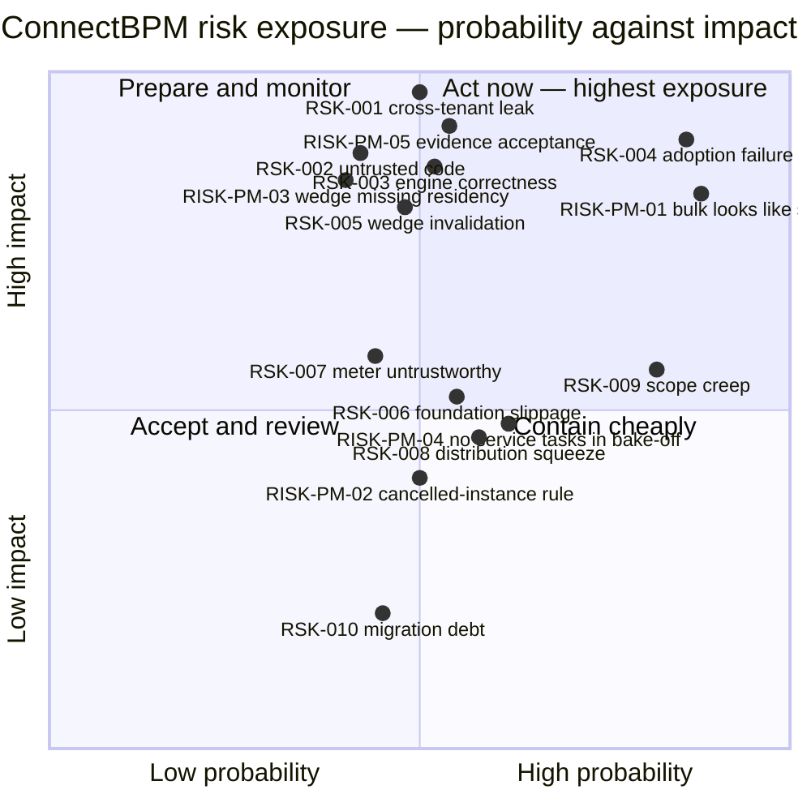

Four risks sit in the act-now quadrant or on its boundary: **RSK-004** (adoption), **RISK-PM-01**
(bulk instantiation reads as per-seat pricing), **RSK-001** (cross-tenant leak — placed at the top
of the impact axis because it is the only single-incident kill criterion) and **RISK-PM-05**
(evidence acceptance, which is the wedge itself).

### 9.3 Technical risks

| ID | Risk | P × I | Mitigation carried into this PRD | Leading indicator | Owner |
|----|------|-------|----------------------------------|-------------------|-------|
| **RSK-001** | **Cross-tenant data leak.** A query path omits the tenant filter and one customer sees another's process, form data or evidence. No shared package supplies tenancy, so every tenant-scoping decision is new code. | M × H = **6** | AC-049 … AC-057 make the two-tenant isolation suite a merge blocker and push enforcement to the data-access boundary; F-001 is the first thing built; `FR-003` returns 404 rather than 403 so existence is never disclosed. | Any build in which the isolation suite fails to enumerate a new endpoint (AC-050), or any endpoint added without a tenant predicate (AC-051). Both are build failures, not report lines. | Architect + Security Engineer |
| **RSK-002** | **Customer-authored logic executes on our infrastructure.** A sandbox escape is remote code execution on shared infrastructure; an unbounded expression is a cross-tenant denial of service. | M × H = **6** | Removed from the v1 critical path by scope: `BR-005` and `NFR-009` forbid any dynamic execution path, and §8.3 item 8 keeps service tasks out. AC-026 bounds and meters evaluation; `NFR-010` makes parser fuzzing a QA deliverable. | Any pull request introducing an import of `eval`, `Function`, a VM or an isolate into the API or engine; expression evaluations terminated on the resource bound trending above zero. | Security Engineer + Architect |
| **RSK-003** | **Engine correctness failure.** The engine loses, duplicates or strands work under crash or concurrency. Failures are silent, found late, and destroy the evidence claim that is the whole wedge. | M × H = **6** | AC-009 … AC-011 (single transaction, replay-safe), AC-070 (crash recovery), AC-071 … AC-074 (timers, claims, idempotency), AC-079 (100% branch coverage on the transition function, real datastores). Nightly three-way reconciliation under AC-022. | Any non-zero divergence in the nightly reconciliation; any drop below 100% branch coverage on the transition function; any timer-fire delta above 60 s exceeding 1% of firings. | Backend Engineer + QA Engineer |
| **RSK-006** | **Foundation slippage on the critical path.** Tenancy → versioning → engine does not parallelise, so any slip on tenancy moves everything behind it. | M × M = **4** | Milestone sequencing in §9.8 puts tenancy first and gates M2 on the SPEC-01 foundation definition; `OQ-03` (additive `tenantId` in shared packages) is a spike **before** the Architecture checkpoint, not a discovery during implementation; the P1 release valve is named in §8.6. | The `OQ-03` spike returning "not additive"; any P0 item slipping past its milestone gate while a P1 item is still in progress. | Orchestrator |
| **RSK-007** | **The meter cannot be trusted or cannot be retro-fitted.** Under-metering forfeits revenue permanently; over-metering produces billing disputes in a product sold on trustworthiness. | M × M = **4** | The whole of §7.2. AC-013 makes the wrong metering path a build failure rather than a code-review opinion; AC-027 audits day-one instrumentation of every `FR-117` dimension at the Foundation checkpoint. | Any reconciliation divergence; any `FR-117` dimension returning null in the AC-027 audit; any usage-view-to-invoice difference other than zero. | Backend Engineer + Architect |
| **RSK-010** | **Version-pinning and migration debt.** A tenant accumulates many live versions and eventually demands in-flight migration, which is genuinely hard. | M × L = **2** | Pinning is enforced strictly from v1 (AC-090) because the correct behaviour is also the simpler one; live-version count per process is surfaced in analytics (`FR-129`) so accumulation is visible to the tenant; F-206 stays in the Future set with no v1 commitment. | Median live versions per process rising above 3 for any tenant. | Architect |
| **RISK-PM-04** | **"No customer script execution" is invisible in a demo and load-bearing in a bake-off.** Templates T02 and T14 degrade a system lookup into a human Step. | M × M = **4** | Signed outbound webhooks (F-020) answer the outbound half in v1; AC-096 requires each template to declare its control context, so the human Step is positioned as an explicit control rather than concealed; service tasks get an ADR and a threat model in Phase 2 instead of a quiet retrofit. | Win/loss reason codes citing "no integrations" above 25% of losses. | Product Manager |

### 9.4 Business and commercial risks

| ID | Risk | P × I | Mitigation carried into this PRD | Leading indicator | Owner |
|----|------|-------|----------------------------------|-------------------|-------|
| **RISK-PM-01** | **Bulk instantiation makes the "no seats" promise look false.** A 400-person attestation campaign creates 400 billable instances, on precisely the two GCC regulatory templates the wedge leads with (T04, T15). The perception is per-seat pricing through the back door. | H × H = **9** | AC-018 forces the exact billable count and resulting quota position onto the confirmation screen before the operation runs; AC-031 requires the campaign disclosure at the same visual weight as the "unlimited free participants" claim. **Escalated to the CEO**: a distinct, lower-priced campaign meter remains exercisable later because `MET-7` instrumentation exists from day one. | Any billing dispute referencing a campaign process; bulk starts exceeding 30% of billable completions for any tenant. | Product Manager → CEO |
| **RSK-005** | **Wedge invalidation.** ASM-003 is wrong — buyers do not weight compliance evidence highly enough to switch, and the product becomes an undifferentiated entrant. | M × H = **6** | Message validation runs before launch messaging freezes; the K0 interviews precede the pricing freeze (§8.5); the engineering investment in the evidence trail retains value under any positioning, so a message failure is not an architecture failure. | The audit-evidence landing-page variant failing to outperform both alternatives by ≥30% on qualified-demand rate. | Product Strategist + BA |
| **RISK-PM-05** | **Evidence acceptance is unvalidated and it is the wedge.** No auditor has yet stated that an engine-produced record is acceptable evidence (STRAT A9). | M × H = **6** | AC-041 makes the record verifiable **without trusting the application**, which is the property an auditor can test independently; AC-096 disclaims legal advice per template; the audit-firm conversation is a Now-horizon item and precedes any design of evidence-pack export (F-105). | The first audit-firm conversation returning "not acceptable without a named framework mapping". | Product Strategist + CEO |
| **RISK-PM-03** | **The GCC wedge ships with one of its three layers absent.** The wedge is Arabic-first ∩ in-region ∩ evidence-native; DEC-001 correctly places in-region hosting outside v1, so v1 sells two of three to a buyer whose gatekeeper may veto on the third. | M × H = **6** | `NFR-019` keeps the topology open, which makes this a schedule problem rather than an architecture problem; AC-104 requires the public security page to state the hosting posture plainly rather than let procurement discover it. | Residency named as a blocking objection in more than 3 of the first 15 qualified conversations. | Product Strategist + CEO |
| **RSK-009** | **Scope creep back to five full pillars**, producing five half-built pillars — the documented BPM failure pattern. | H × M = **6** | §8 is the fence and §8.6 is the rule: any addition needs an Orchestrator checkpoint and an equivalent removal. ASM-005 is the objective boundary test and it has been run (§7.8 AC-094 re-runs it against the built product). | Any scope addition reaching implementation without a recorded equivalent removal. | Orchestrator + Product Manager |
| **RSK-008** | **Competitive distribution squeeze.** Microsoft bundles comparable human workflow inside estates the customer already pays for. | M × M = **4** | ICP disqualifiers in §1.2 exclude Microsoft-estate-locked accounts early rather than losing late; the competition is on the evidence wedge and the non-seat meter, neither of which that licensing model naturally offers. | Power Automate appearing in more than 30% of recorded loss reasons. | Product Strategist |
| **RISK-PM-02** | **The cancelled-instance billing rule is a revenue-policy judgement made by the Product Manager.** `FR-104` ("billable if ≥1 Step completed") is a defensible reading of `MET-1`, not a derivation from it. | M × M = **4** | The rule is isolated in exactly one requirement, and AC-003 records `completedStepCountAtEvent` on every usage event, so an alternative rule is applicable to historical data without re-deriving it. **Flagged for explicit CEO ratification at this checkpoint.** | Cancelled-with-work-done instances exceeding 10% of billable completions for any tenant. | CEO |

### 9.5 User-adoption risks

Adoption is the single highest-scoring risk in the register and it is the one a specification is
least able to fix on its own, so it is separated out rather than folded into §9.4.

| ID | Risk | P × I | Mitigation carried into this PRD | Leading indicator | Owner |
|----|------|-------|----------------------------------|-------------------|-------|
| **RSK-004** | **Adoption failure inside the customer.** The buyer signs, designers publish, and task performers refuse the inbox and revert to email — churn at renewal behind a healthy-looking activation number. | H × H = **9** | The retention persona (S-06) is the only persona with a numeric non-negotiable, and four criteria enforce it: AC-080 (the link opens the task, not a dashboard), AC-081 (median ≤ 60 s over ≥100 untrained completions), AC-082 (interactive ≤ 2.0 s on 4G at 375 px), AC-067 (keyboard-operable, both directions). DEC-002 removes the buyer's incentive to ration access — AC-028 proves the invoice does not move with headcount. Arabic is a v1 requirement (§7.5) because the performer often reads Arabic on a phone. | Weekly active task performers below 60% of invited members for any paying tenant (`SC-013`); median task completion time trending above 60 s in any weekly cohort. | Product Manager + UI/UX Designer |
| **RISK-PM-04** *(adoption facet)* | Designers hit the element ceiling and conclude the product cannot model their work. | M × M = **4** | ASM-005 was run against all 15 templates and SCOPE-AMD-001 closed the two structural gaps it exposed; AC-094 re-runs the test against the shipped designer before the Foundation checkpoint. | Any template in the shipped gallery requiring an element outside E1–E7; support requests asking for an excluded element exceeding 5 per month. | Product Manager |

### 9.6 Kill criteria — where the risks become decisions

| Kill criterion | Fires on | The risk it terminates |
|----------------|----------|------------------------|
| **K0** (before implementation, deferred by DEC-003 — **not cancelled**) | No named design partner, or ≥10 of 15 discovery interviews failing to confirm the wedge | RSK-005, RISK-PM-03, RISK-PM-05 |
| **K1**, **K2** | Paying or activated tenants below target; activation below 15%; time-to-first-published-process above 7 days | RSK-004, RSK-009 |
| **K3**, **K4**, **K5** | No customer citing the wedge; unit economics failing; a bundled competitor matching the wedge | RSK-005, RSK-008 |
| **K6** — the only single-incident kill criterion | **A cross-tenant leak reaching production and affecting a customer** → immediate sales stop | RSK-001 |
| **K7** | More than 2 engine-correctness incidents per quarter after GA | RSK-003, RSK-007 |
| **K8** | Portfolio allocation failure against ConnectGRC compounding | RSK-006 |

### 9.7 Dependencies

**External services** — v1 cannot ship without each of these, and each is an availability dependency
on the product's critical path.

| Dependency | Used for | Consequence if unavailable | Selection owner |
|------------|----------|----------------------------|-----------------|
| Card payment provider | Self-serve tier purchase and overage billing (F-015) | Signup succeeds, conversion stops. The Sandbox tier keeps working. | Architect (ADR) |
| Transactional email provider | Task-assignment deep links, reminders, escalations, threshold alerts (F-021) | The 60-second path breaks at its entry point; RSK-004 materialises directly. | Architect (ADR) |
| PostgreSQL 15+ | System of record: instances, evidence chain, usage ledger | Total outage. Recovery targets are `NFR-016` (RPO ≤ 5 min, RTO ≤ 1 h). | Constitution Article V |
| Redis | Queue backing and soft-limit counters — **never the meter** (§5.2, AC-013) | Timer and job throughput degrade; committed evidence and usage data are unaffected. | Constitution Article V |
| Object storage | Form attachments, tenant-partitioned (`NFR-011`, AC-055) | Attachment upload and retrieval fail; process execution continues. | Architect (ADR) |

**Internal package dependencies** — the addendum's verified finding is that **no shared package
carries a tenant dimension**, so three of these are EXTEND rather than REUSE and one capability is a
full BUILD.

| Package | Classification | Why |
|---------|---------------|-----|
| `@connectsw/auth` | **EXTEND** | No tenant dimension; membership and workspace switching are new. |
| `@connectsw/billing` | **EXTEND** | `Subscription` and `UsageRecord` are keyed to `userId`, and its Redis `UsageService` fails `MET-2` and `MET-3` (AC-013). |
| `@connectsw/audit` | **EXTEND** | No tenant dimension, and no hash chain — the evidence trail needs both. |
| `@connectsw/notifications`, `@connectsw/webhooks`, `@connectsw/ui`, `@connectsw/observability`, `@connectsw/shared` | **REUSE** | Used as-is, per the SPEC-01 Component Reuse Check. |
| **Tenancy itself** | **BUILD** | Gates every pillar; it is the first milestone for that reason. |

**Decision dependencies** — work that is blocked on a decision rather than on code.

| Blocked item | Blocked on | Owner | Effect while open |
|--------------|-----------|-------|-------------------|
| External participant tasks (F-109), template T02 at full value | `CLR-B` | **CEO** | T02 ships degraded; the evidence model stays tenant-member-only. |
| Publishing tier price points on `/pricing` | `CLR-C` + K0 interviews | **CEO** | Tier structure is built; the numbers stay unpublished (§8.5). |
| Expression evaluation mechanism | `OQ-01` | Architect + Security Engineer | Behaviour is fixed by `FR-022`–`FR-024`; the mechanism is not. |
| E7 `Schedule` and bulk start (F-025) | `OQ-02` | Architect | Written into scope by SPEC-01; an ADR ratifies or overrides. |
| Foundation cost and critical-path length | `OQ-03` spike | Architect | Must resolve **before** the Architecture checkpoint (RSK-006). |
| Isolation model and deployment topology | `OQ-04` | Architect | Constrained by `NFR-019`, which is stricter than a shared-schema default. |
| `credit-os` boundary | `OQ-05` | Architect | Harvest patterns, do not fork; no migration before month 24. |
| Cancelled-instance billing rule | RISK-PM-02 ratification | **CEO** | `FR-104` stands as written until the CEO rules otherwise. |
| Any foundation implementation at all | **K0 gate** (DEC-003) | Orchestrator → CEO | Design proceeds; build does not start until K0 is re-raised and passed. |

### 9.8 Milestones

Milestones are **sequence and gate**, not dates. Each gate is evidence-based: it passes when the
named criteria pass, and not when a calendar says so (Article XI).

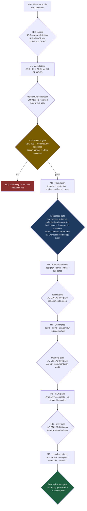

| Milestone | Contains | Passes when |
|-----------|----------|-------------|
| **M1** Architecture | ADRs for `OQ-01`–`OQ-05`; SCOPE-AMD-001 ratified or overridden | Architecture checkpoint, with the `OQ-03` spike already resolved |
| **M2** Foundation | F-001, F-002, F-004, F-005, F-011, F-013 | The SPEC-01 foundation definition, verbatim, plus `SC-001`, `SC-002`, `SC-004` at zero defects |
| **M3** Author-to-execute | F-003, F-006, F-007, F-008, F-009, F-010, F-021 | AC-070 … AC-093 |
| **M4** Commerce | F-012, F-014, F-015, F-022, F-026 | AC-001 … AC-034, AC-041 … AC-046 |
| **M5** GCC pack | F-016, F-017, F-018, F-025 | AC-058 … AC-069, AC-094 … AC-096 |
| **M6** Launch readiness | F-019, F-020, F-023, F-024, F-027 | All quality gates; the P1 release valve applies here and nowhere earlier |

---

## 10. Product Addendum

> **Ownership of this section.** The Product Manager owns **Product Overview** (§10.2), **Business
> Logic** (§10.3) and **Special Considerations** (§10.4). The **Architect owns §10.5, Technical
> Architecture**, and it is left deliberately empty below. `products/connectbpm/.claude/addendum.md`
> is the file agents read at task start; it is refreshed from this section once ARCH-01 has filled
> §10.5, so that the addendum is never published half-owned.

### 10.1 What this section is for

Every agent that touches ConnectBPM reads the addendum before doing anything else. It answers three
questions that would otherwise be re-derived from a 1,700-line specification on every task: *what is
this product*, *what rules does it obey*, and *what will hurt me if I do not know it*.

### 10.2 Product Overview

| Field | Value |
|-------|-------|
| **Name** | ConnectBPM |
| **Type** | Multi-tenant SaaS web application, sold to external customers |
| **Status** | Design — PRD complete, architecture pending, implementation gated on K0 |
| **Ports** | Web (Next.js) **3123** · API (Fastify) **5018** |
| **Repo mode** | Monorepo — `products/connectbpm/` |
| **Locales** | `en`, `ar` — both in v1, RTL is a layout not a stylesheet variant |
| **Pricing metric** | **Completed process instances only.** No seats, ever (DEC-002) |

**What it is.** ConnectBPM lets a customer's operations team model a human approval process with a
form, publish it as an immutable versioned definition, run real instances on a durable engine, have
staff complete tasks in an inbox with due dates and escalation, and export a complete, immutable,
independently verifiable evidence record of every instance — in Arabic or English, self-serve, with
no seat charges and no sales call.

**Who it is for.** A compliance-exposed mid-market organisation of 50–2,000 people, bought by the
Head of Operations or the Head of Compliance rather than by the CIO. The GCC first, on a
geography-neutral core.

**What makes it defensible.** Not features and not price: the **evidence record**. Competitors log
activity; ConnectBPM produces a hash-chained, version-pinned, exportable record that a third party
verifies **without trusting the application** (AC-041). That is the property an auditor can test,
and it is why DEC-001 makes evidence day-one architecture rather than a Phase-2 module.

**The five capability pillars, and their v1 boundary.**

| Pillar | v1 boundary |
|--------|-------------|
| Visual process designer | Exactly elements E1–E7. Draft → validate → publish. Immutable versions. |
| Workflow engine | Token-based, durable, exactly-once, crash-recoverable, with timers. **No customer script execution.** |
| Forms + task inbox | One indivisible pillar. Typed validated fields, version-pinned rendering, deep-linked single-task completion. |
| Evidence trail | Complete, on every tier, not disableable, hash-chained, exportable, independently verifiable. |
| Process analytics | **Exactly four numbers per process.** Not a BI tool. |

### 10.3 Business Logic

Rules are grouped by area and each names its normative source. **No new identifiers are minted
here** — this is a navigable restatement of rules owned by BA-01 (`BR-xxx`) and SPEC-01 (`FR-xxx`).

#### 10.3.1 Tenancy and identity

| Rule | Source |
|------|--------|
| A Tenant (workspace) owns every tenant-scoped entity. Nothing exists outside a tenant. | `FR-001`, BR-004 |
| Every tenant-scoped row carries a non-null tenant identifier, and filtering happens at the data-access boundary — never per route. | `FR-002` |
| A request for another tenant's entity returns **HTTP 404**, never 403 and never 200. Existence is not disclosed across a tenant boundary. | `FR-003` |
| One email address holds independent memberships in several tenants. Nothing is visible between them and switching is explicit. | `FR-006`, `EC-20` |
| Roles are Owner, Admin, Designer, Publisher, Process Owner, Participant. Roles are additive; Participant is the default for an invited user. | `FR-004` |
| **Role assignment never affects a billable quantity.** Roles are authorisation, not commerce. | `FR-005`, DEC-002 |
| Deactivating a member with open tasks does not complete until every open task is reassigned or returned to a claimable queue. | `FR-008`, `EC-07` |
| ConnectSW staff access to tenant data is recorded and is visible to that tenant's Admin. | `FR-009`, BR-010 |

**Role and permission matrix** — the authorisation model the Frontend and Backend Engineers build
against. "Own" means limited to processes where the user is the recorded process owner.

| Capability | Owner | Admin | Designer | Publisher | Process Owner | Participant |
|------------|:-----:|:-----:|:--------:|:---------:|:-------------:|:-----------:|
| Complete assigned tasks, start permitted processes | ✅ | ✅ | ✅ | ✅ | ✅ | ✅ |
| Create and edit a DRAFT definition, run a test | ✅ | ✅ | ✅ | ✅ | — | — |
| **Publish** a definition version | ✅ | ✅ | — | ✅ | — | — |
| Archive a process | ✅ | ✅ | — | ✅ | — | — |
| View instances, cancel or suspend an instance | ✅ | ✅ | — | — | ✅ (own) | — |
| View analytics | ✅ | ✅ | ✅ | ✅ | ✅ (own) | — |
| View and export evidence | ✅ | ✅ | — | — | ✅ (own) | — |
| Invite, assign roles, deactivate members | ✅ | ✅ | — | — | — | — |
| Working calendar, retention, webhooks, workspace audit | ✅ | ✅ | — | — | — | — |
| Billing, plan change, hard-cap toggle | ✅ | ✅ | — | — | — | — |
| Transfer ownership, close the workspace | ✅ | — | — | — | — | — |

#### 10.3.2 Definition lifecycle

```mermaid
stateDiagram-v2
    [*] --> Draft: create blank or install a template
    Draft --> Draft: edit, validate, test run (evidence isTest, never billable)
    Draft --> Published: publish — validation passes, version and checksum frozen
    Published --> Draft: edit a published version creates a NEW draft; the published version is untouched
    Published --> Archived: archive — no new starts, running instances continue on their pinned version
    Archived --> Published: restore
    Published --> [*]
    note right of Published
        A published version is immutable for life.
        Every running instance stays pinned to the
        version it started on, including forms and
        fields later removed (FR-018, EC-01, EC-18).
    end note
```

| Rule | Source |
|------|--------|
| Publication is refused unless structural validation passes, and the response names the offending element. | `FR-017`, AC-089 |
| Every `Decision` carries exactly one mandatory default path; publication is refused without it. | `FR-020`, `EC-08` |
| A `Split` whose branches cannot all reach the matching `Join` — including via a boundary path that bypasses it — is refused at publish. | `EC-06` |
| A published version and its checksum are immutable. Editing produces a new DRAFT. | `FR-018` |
| Running instances resolve every element, form and condition from their pinned version for their entire remaining life. | `FR-018`, `FR-019`, `EC-01` |
| Concurrent draft edits resolve by HTTP 409 against a changed baseline, never last-write-wins. | `EC-16` |
| An archived process accepts no new starts, and is not hard-deletable while any instance or evidence record references it. | `EC-15` |
| The palette ceiling E1–E7 is enforced at the API, not only in the UI. | `FR-011`, AC-088 |

#### 10.3.3 Instance lifecycle and billability

The revenue definition is **§5.3** and it is not paraphrased here. The operating rules around it:

| Rule | Source |
|------|--------|
| Quota is **admission control only**. A running instance is never terminated, suspended or degraded because a cap was reached. | `EC-03`, `FR-113` |
| Admission is `billable_completions_this_period + open_reservations < hard_cap`, evaluated before any instance row exists. | `FR-113` |
| A reservation **converts** on a billable terminal state and **releases** on a non-billable one. | `FR-113` |
| The usage event is written in the **same database transaction** as the state transition, with an idempotency key unique to `(instance, token, transition)`. | `FR-101`, `FR-107` |
| Usage events are append-only. Corrections are compensating events, never edits. | `FR-109` |
| Billing-period membership is fixed at write time from the UTC commit timestamp, and is never recomputed. | `FR-123`, `EC-19` |
| A bulk or scheduled start states the exact billable count and the resulting quota position before it runs, and is refused **in full** on a shortfall. | `FR-108`, `EC-21` |
| `@connectsw/billing`'s `UsageService` is used for soft limits and dashboards only — **never** for instance metering. | DEC-002 note, AC-013 |

#### 10.3.4 Tasks, assignment and the working calendar

| Rule | Source |
|------|--------|
| A task is held by exactly one actor. Concurrent claims resolve by conditional update; the loser is told who claimed it. | BR-007, `EC-04` |
| A completed task is read-only on revisit. Re-submission is impossible. | `FR-076` |
| Completion is a `POST` with an idempotency key; opening the deep link is a `GET` and never mutates state. | `FR-072`, `FR-073`, `EC-11` |
| An outcome action is configurable to require a comment, and Reject in the shipped templates requires one. | `FR-081` |
| "2 working days" is computed against the **tenant's** working week, working hours and holiday list — this is the mechanism that makes DEC-001 geography neutrality real rather than aspirational. | `FR-062`, US-36 |
| A due instant resolves to one unambiguous UTC value; a local time skipped by DST resolves to the next valid instant. Evidence records both UTC and tenant-local renderings. | `EC-10` |
| A timer whose target token has moved is discarded as stale **on token version**, never on wall-clock ordering. | `EC-02`, `FR-057` |
| An `E5` timer with `interrupting: false` reminds and escalates while the Step stays open; with `interrupting: true` it withdraws the Step and routes the token down the boundary path. One element, two behaviours. | CLR-E, `FR-058` |
| An instance-level deadline is a definition attribute (`instanceSla`), not an element. | CLR-F, `FR-025` |

#### 10.3.5 Conditions — the restricted grammar

| Rule | Source |
|------|--------|
| Conditions are comparison and boolean operators over form fields and process variables. No dynamic code execution reaches `eval`, `Function`, a VM or an isolate. | BR-005, `NFR-009` |
| An absent variable is `null`; a comparison against `null` yields `false` deterministically — never an exception, never a stall. | `FR-023`, `EC-09` |
| Evaluation is bounded on AST depth, node count and time; the bound is a security control as much as a cost control, and consumption is metered per tenant. | `FR-119`, `MET-6` |

#### 10.3.6 Evidence, retention and erasure

| Rule | Source |
|------|--------|
| Evidence is emitted by default on **every tier including the free one**, and is not disableable by any tenant, role or configuration. | `FR-086`, `FR-100` |
| Entries are append-only and hash-chained per instance; an attempted mutation is refused **and recorded**. | `FR-089`, `FR-090` |
| Verification recomputes the chain and names the first divergent entry. | `FR-091` |
| An export names every definition version covered and carries the material needed to verify the chain outside the application. | `FR-093` |
| An export spanning a retention deletion states the removed sub-period, the policy and the date. A silently short export is a defect. | `FR-095`, `EC-14` |
| Retention is enforced by deletion, not by hiding rows in the UI — and it never deletes usage events. | `FR-096`, `FR-111` |
| Erasure removes personal-data payloads irreversibly and leaves tombstones that keep the hash chain verifiable. | `FR-097`, CLR-G |

#### 10.3.7 Locale resolution

| Rule | Source |
|------|--------|
| Resolution order for a surface: **personal locale override → tenant default locale**. | `FR-146`, `FR-138` |
| A notification is composed in the **recipient's** locale, never the author's. | `FR-142` |
| Tenant-authored content (process, Step, form-field and outcome labels) is stored in the language the author typed and is never machine-translated. Only ConnectSW chrome and gallery templates are bilingual. | `FR-147` |
| Stored values are locale-independent; only display formatting varies. Exports carry a stable machine key beside every display label. | `FR-148`, `FR-149` |
| No geography, jurisdiction or regulator is representable structurally — not in an entity, an enum, a schema or engine logic. It is configuration and data. | `FR-145`, `NFR-020` |

### 10.4 Special Considerations

1. **Tenant isolation is a security boundary, not a data-modelling preference.** A leak is
   existential and fires K6 on a single incident. The shared packages supply **no** tenancy — this
   was verified, not assumed — so every tenant-scoping decision is new code written under AC-049 …
   AC-057.
2. **Correctness outranks features.** An engine that loses or duplicates work has negative value.
   Exactly-once transitions, idempotency keys and 100% branch coverage on the transition function
   are not negotiable against a date.
3. **The meter cannot be retro-fitted.** DEC-002 is irreversible. A metering dimension not
   instrumented on day one is history that no later work recovers. `FR-117` lists what is
   instrumented even where it is not billed.
4. **Versioning protects evidence, not convenience.** Instance pinning exists so that an audit
   record reflects the rules that actually applied at the time. It is why editing a published
   version is impossible by design.
5. **Bulk instantiation is the commercial soft spot.** A 400-person attestation campaign bills 400
   instances in a product marketed on "unlimited free participants". Disclosure before the operation
   runs (AC-018) and on the pricing page (AC-031) is a requirement, not a courtesy — RISK-PM-01
   scores 9/9.
6. **Arabic is a layout, not a translation pass.** RTL affects the designer canvas, connector
   arrowheads, form flow and email templates. Retrofitting it later would rebuild the designer.
7. **Deferred routes ship as real pages.** Every one of the 8 deferred routes renders a genuine
   empty state with the correct action. The string "Coming Soon" is rejected by the smoke-test gate.
8. **Two decisions are open and both are the CEO's**: `CLR-B` (external participants) and `CLR-C`
   (price-point publication). Neither blocks architecture; both change scope if answered late.

### 10.5 Technical Architecture — *placeholder, owned by the Architect (ARCH-01)*

> 🚧 **NOT WRITTEN BY THE PRODUCT MANAGER. DO NOT FILL THIS IN FROM THE PRD.**
>
> This subsection is reserved for the Architect and is intentionally empty. It is filled during
> **ARCH-01**, after which `products/connectbpm/.claude/addendum.md` is refreshed from §10 as a
> whole.
>
> **What belongs here** (each item traces to an open question in §9.7):
>
> | Content | Resolves |
> |---------|----------|
> | Confirmed tech stack and any deviation from Constitution Article V, with an ADR | Article V |
> | Multi-tenancy isolation model — shared schema with `tenantId` or schema-per-tenant — constrained by `NFR-019` | `OQ-04` |
> | Whether `@connectsw/auth` and `@connectsw/billing` take an additive `tenantId` | `OQ-03` |
> | Durable execution and timer mechanism; job store and claim strategy | Engine design |
> | Restricted-grammar evaluation mechanism and its resource bounds | `OQ-01` |
> | Canvas library for the designer, and its RTL mirroring capability | `FR-141` |
> | Definition and form storage, versioning and checksum model | `FR-018` |
> | Evidence hash-chain construction and the external verification format | `FR-090`, `FR-093` |
> | The billable-completion write path as implemented | `FR-101`, `MET-2` |
> | Deployment topology, and how it keeps in-region deployment open | `NFR-019` |
> | The `credit-os` boundary | `OQ-05` |
> | Ratification or override of SCOPE-AMD-001 (E7 + bulk start) | `OQ-02` |
> | Data models, entity relationships and migration strategy | SPEC-01 §Data Model |
>
> **Until this subsection is filled, no implementation task is picked up.** DEC-003 additionally
> holds implementation behind the K0 gate.

---

*PRD-01 · ConnectBPM Product Requirements Document · Product Manager, ConnectSW · 2026-08-20 ·
Sections 1–6 committed at `0aced94`; sections 7–10 complete this document. Awaiting CEO checkpoint.*
