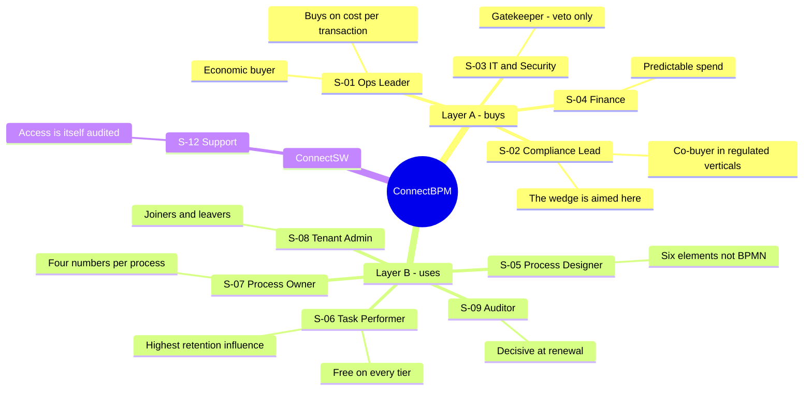
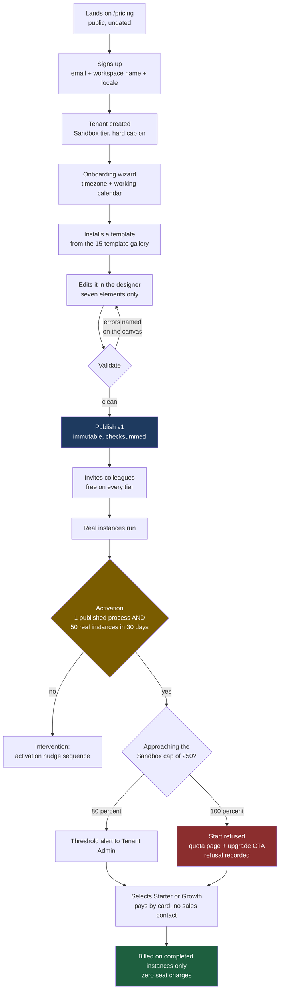
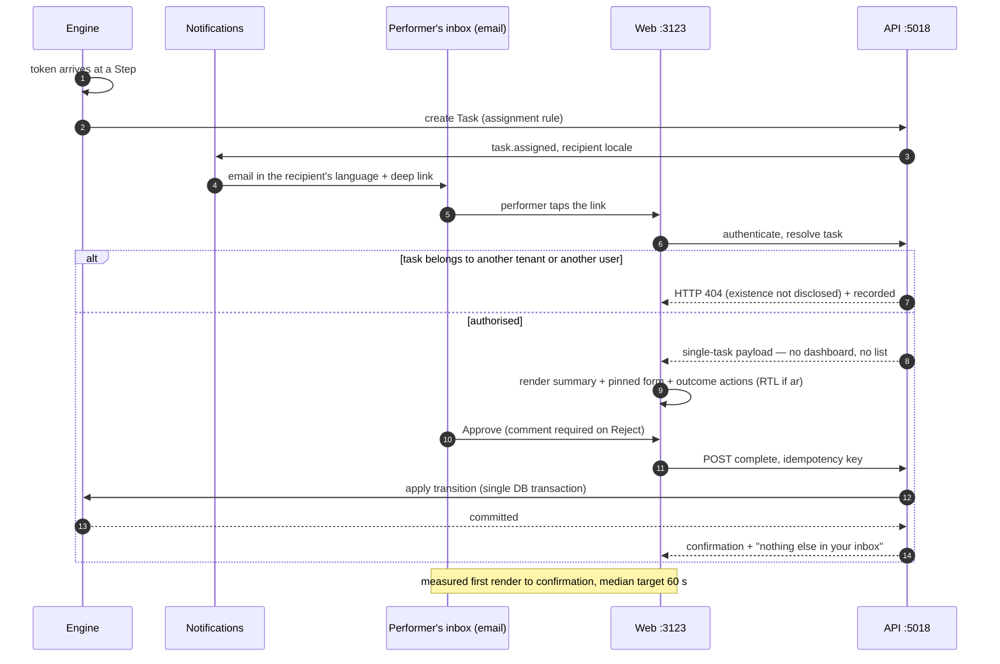
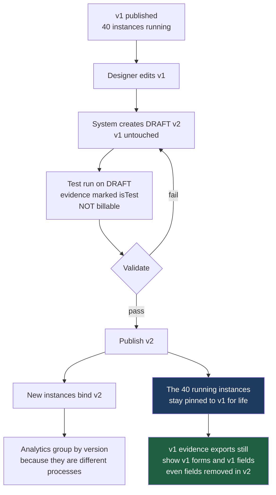
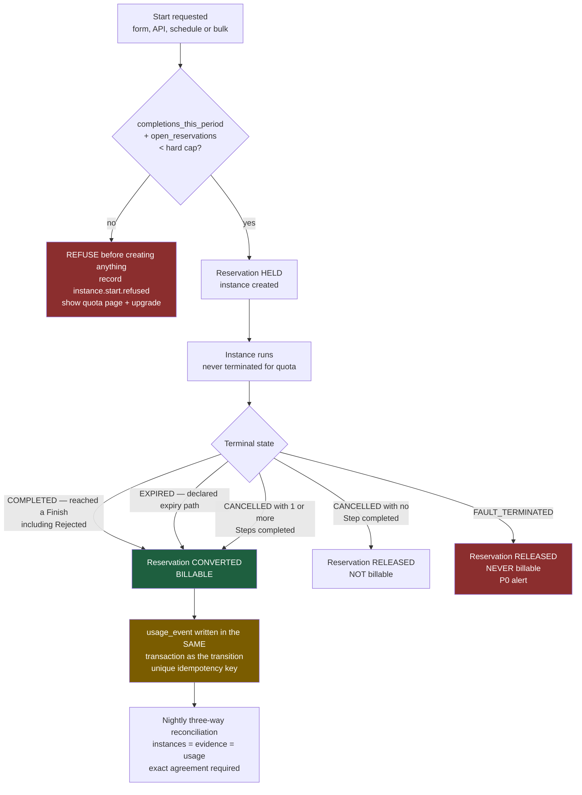
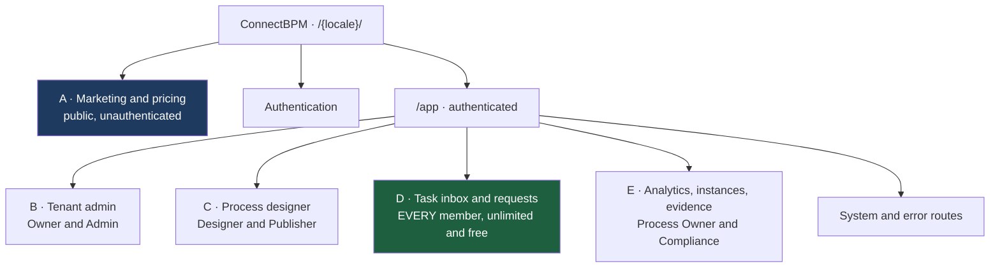

# ConnectBPM — Product Requirements Document

| Field | Value |
|-------|-------|
| Task ID | PRD-01 |
| Product | connectbpm |
| Author | Product Manager, ConnectSW |
| Date | 2026-08-20 |
| Status | Draft — awaiting CEO checkpoint |
| Branch | `claude/bpm-workflow-product-9p2fxy` |
| Ports | Web 3123 · API 5018 |
| Upstream inputs | `docs/CEO-DECISIONS.md` (binding) · `docs/business-analysis.md` (BA-01) · `docs/strategy/OPPORTUNITY-connectbpm.md` (STRAT-01) |
| Companion spec | `docs/specs/connectbpm-foundation.md` (SPEC-01, CLARIFY-01 applied) |
| Downstream | Architect (ARCH-01), QA Engineer, UI/UX Designer, Frontend Engineer |

> **Identifier ownership (Article VI).** SPEC-01 owns the `US-xx`, `FR-xxx` and `NFR-xxx` identifier
> space. This PRD **references** those identifiers and does not mint a second set. What this document
> adds and owns: feature identifiers `F-xxx`, the **Site Map**, personas, phasing, pricing and
> packaging, dependencies, risks and milestones. Where this PRD and SPEC-01 appear to disagree,
> SPEC-01 governs on requirement detail and this PRD governs on scope, phase and surface.

---

## 1. Overview

### 1.1 Vision

**A customer's operations team models a human approval process with a form, publishes it, runs real
instances, has their staff complete tasks in an inbox with due dates and escalation, and exports a
complete, immutable, independently verifiable audit trail of every instance — in Arabic or English,
self-serve, with no seat charges and no sales call.**

ConnectBPM exists because the BPM market is barbelled and a specific buyer falls through the middle.
Trigger-automation tools price and architect for stateless event plumbing and cannot hold an
eleven-day, five-approver case with delegation, escalation and an immutable history. Enterprise
suites model that case at USD 35–90 per user per month with a 12–18 month implementation. Between
them sits a compliance-exposed mid-market company running its approvals on email, whose acute,
funded pain is not speed and not cost — it is that **it cannot produce evidence that an approval
followed its own stated control**.

Per **DEC-001**, the product is built **geography-neutral around that evidence core**, and the first
go-to-market and template library are aimed at the **GCC**. Arabic and RTL are in v1. Locale,
jurisdiction, working calendar and regulatory templates are **configuration, never structure**.

### 1.2 Target Users

Two layers. Layer A buys; Layer B uses. See §2.

**Beachhead ICP** (STRAT-01 §6.1): 50–2,000 employees; Saudi Arabia and UAE first, then Qatar,
Kuwait, Bahrain, Oman; financial services, healthcare, government-adjacent entities and their
suppliers, professional services with regulatory exposure. Buyer is the Head of Compliance/Risk,
Head of Operations or COO — **not** the CIO. Disqualifiers: deeply Microsoft-committed accounts with
a mature Power Platform practice; purely integration-shaped needs.

### 1.3 Success Metrics

The full set is SPEC-01 §Success Criteria (`SC-001`–`SC-018`). The five that decide whether this
product worked:

| Metric | Target | Why this one |
|--------|--------|--------------|
| Cross-tenant data exposure incidents | **0** | `SC-001`. The only failure that ends the product outright (K6). |
| Lost or duplicated process instances | **0** | `SC-002`. An engine that loses work has negative value; K7 kills at >2 incidents/quarter. |
| Activation — ≥1 published process **and** ≥50 real instances in 30 days | **≥20%** of signups; **40 activated tenants** by month 6 | `SC-010`, `SC-011`. STRAT-01's north star. Signups are not the metric; activation is. |
| Median task completion time in the inbox | **≤60 s** | `SC-006`. RSK-004 (adoption failure) is the highest-scoring risk at 9/9. |
| Sales-touch rate on paid conversions | **≤20%** | `SC-014`. The falsification test for the entire self-serve thesis. |

---

## 2. User Personas

### Persona 1 — Ops Leader (S-01) · economic buyer

- **Role**: Head of Operations or COO at a 50–2,000 person organisation.
- **Goals**: raise throughput and SLA attainment without adding headcount; prove value inside one
  billing period.
- **Pain Points**: every vendor conversation becomes an IT project; per-seat pricing forces them to
  ration who gets access, which is the opposite of what the process needs.
- **Usage Context**: evaluates in a browser on a weekday afternoon, alone, without IT present. Buys
  on a card if the product works.
- **Non-negotiables**: public pricing, self-serve signup, a live process the same day.

### Persona 2 — Compliance / Risk Lead (S-02) · co-buyer, and the wedge's target

- **Role**: Head of Compliance or Risk; in regulated GCC verticals, often the true budget holder.
- **Goals**: answer an evidence request without a two-week reconstruction; stop being afraid of the
  next audit.
- **Pain Points**: evidence today is screenshots, a folder and a reconstructed email chain. It is
  produced *after* the fact, which is exactly what makes it weak.
- **Usage Context**: triggered by a PDPL readiness audit, an external audit finding, a failed manual
  control, or a new reporting obligation.
- **Non-negotiables**: the record is immutable, pinned to the version that actually ran, exportable,
  and verifiable by someone who does not trust us.

### Persona 3 — Process Designer (S-05)

- **Role**: operations or business systems analyst. Domain expert. **Not a programmer.**
- **Goals**: model a real approval — including the exception paths — and change it safely later.
- **Pain Points**: BPMN palettes assume programming and infrastructure skills they do not have;
  editing a live process elsewhere breaks work in flight.
- **Usage Context**: builds in bursts, from a template, usually the week a new obligation lands.
- **Non-negotiables**: a palette small enough to hold in the head; validation that names the problem
  element; publishing that cannot corrupt running work.

### Persona 4 — Task Performer / Participant (S-06) · **the retention persona**

- **Role**: approver, reviewer or requester. Uses the product a few times a month.
- **Goals**: finish the task and get back to the actual job.
- **Pain Points**: any new application is a tax; any training requirement means reverting to email.
- **Usage Context**: arrives from an email notification, often on a phone, often in Arabic.
- **Non-negotiables**: the link opens the task itself — not a dashboard; ≤60 seconds; RTL that is a
  layout, not a stylesheet hack; **never costs their employer anything** (DEC-002).

### Persona 5 — Tenant Admin (S-08)

- **Role**: customer IT admin or operations manager who owns the workspace.
- **Goals**: joiners and leavers handled without stranding work; spend that never surprises Finance.
- **Pain Points**: a leaver's open approvals disappear into a deactivated account.
- **Non-negotiables**: deactivation forces task reassignment; a hard cap they control; visibility of
  every ConnectSW staff access to their data.

### Persona 6 — Process Owner (S-07)

- **Role**: department head accountable for one process's outcome.
- **Goals**: know where work is stuck and why; show improvement to their own management.
- **Non-negotiables**: four numbers, per process, per period — not a BI tool.

### Persona 7 — Auditor / Regulator (S-09) · external, decisive at renewal

- **Role**: internal audit, external auditor, or regulator.
- **Goals**: verify that a control operated, completely, for a period.
- **Non-negotiables**: completeness, immutability, and a record tied to the definition version in
  force at the time. **STRAT A9 — that GCC auditors accept engine-produced evidence — is
  unvalidated and load-bearing** (RISK-PM-05).

---

## 3. Features

Feature IDs are owned by this PRD. Each names its SPEC-01 user stories, its BA-01 business need, and
its priority. **P0** = no launch without it. **P1** = required at launch. **P2** = within two
releases of launch. **P3** = backlog.

### 3.1 MVP Features (Must Have — the v1 release)

| ID | Feature | User Story | Stories | BN | Priority |
|----|---------|-----------|---------|----|----------|
| F-001 | **Tenant isolation and workspace** | As an Ops Leader, I want a private company workspace so that our process data is provably ours alone. | US-01, US-06 | BN-001 | **P0** |
| F-002 | Membership, roles and joiner/leaver handling | As a Tenant Admin, I want to invite, role-assign and deactivate members, and reassign a leaver's open tasks, so that staff changes never strand work. | US-02, US-24, US-27 | BN-012 | **P0** |
| F-003 | **Visual process designer (E1–E7)** | As a Process Designer, I want to model an approval with a small element set so that I can build a real process without writing code. | US-03, US-04, US-05 | BN-002 | **P0** |
| F-004 | **Immutable definition versioning with instance pinning** | As a Process Designer, I want to publish changes without disturbing running work so that improving a process never corrupts evidence. | US-08, US-09 | BN-004 | **P0** |
| F-005 | **Durable workflow engine** | As a Process Owner, I want every instance to advance exactly once and survive a restart so that the record is the truth. | US-06, US-07 | BN-003 | **P0** |
| F-006 | Restricted-grammar conditions | As a Process Designer, I want routing rules on form data so that policy is applied by the engine, not from memory. | US-04 | BN-002, BR-005 | **P0** |
| F-007 | **Form builder and renderer** | As a Process Designer, I want typed validated fields bound to a Step so that a decision has the data it needs. | US-10, US-11 | BN-005 | **P0** |
| F-008 | **Task inbox and single-task deep link** | As a Task Performer, I want to open the exact task from my email and finish it in a minute. | US-12, US-13, US-14, US-41 | BN-006 | **P0** |
| F-009 | **Due dates, reminders, escalation** | As a Process Owner, I want overdue work to remind and escalate so that waiting time is bounded and visible. | US-17, US-18 | BN-008 | **P0** |
| F-010 | Per-tenant working calendar | As a Tenant Admin, I want our working week and holidays to define "2 working days". | US-36 | BN-008, DEC-001 | **P0** |
| F-011 | **Evidence trail — immutable, hash-chained, version-pinned** | As a Compliance Lead, I want a complete ordered tamper-evident history of every instance. | US-15, US-38 | BN-007 | **P0** |
| F-012 | **Evidence export and independent verification** | As an Auditor, I want a CSV/JSON export I can verify without trusting the application. | US-16, US-38 | BN-007 | **P0** |
| F-013 | **Completed-instance metering (MET-1..MET-7)** | As ConnectSW, we must meter completions transactionally, idempotently and replay-safely, because retroactive metering is impossible. | US-19 | BN-009 | **P0** |
| F-014 | Quota reservation and pre-start refusal | As a Tenant Admin, I want to be refused cleanly at the cap rather than surprised by an invoice. | US-20, US-40, US-43 | BN-009 | **P0** |
| F-015 | Self-serve signup, tier selection, card payment | As an Ops Leader, I want to buy without contacting sales. | US-21, US-22 | BN-010 | **P0** |
| F-016 | **Arabic-first RTL across every surface** | As an Arabic-speaking performer, I want the product in Arabic with a genuine RTL layout. | US-35 | DEC-001 | **P0** |
| F-017 | Onboarding to first published process | As an Ops Leader, I want to reach a published process in one session. | US-28 | BN-015 | **P0** |
| F-018 | Template gallery — 15 bilingual templates | As a Process Designer, I want to start from a pre-built process and edit it. | US-28 | BN-015 | **P1** |
| F-019 | Minimal analytics — four numbers per process | As a Process Owner, I want started, completed, median cycle time and SLA breaches. | US-23 | BN-011 | **P1** |
| F-020 | Outbound signed webhooks | As a Tenant Admin, I want process events delivered to our systems. | US-25 | BN-013 | **P1** |
| F-021 | Notifications — email and in-app, bilingual | As a Task Performer, I want to be told when work arrives, in my language. | US-13, US-18 | BN-006, BN-008 | **P0** |
| F-022 | Usage dashboard and threshold alerts | As a Tenant Admin, I want to see billable completions against quota. | US-19, US-20 | BN-009 | **P0** |
| F-023 | Retention policy and enforcement job | As a Tenant Admin, I want retention enforced by deletion, not by hiding rows. | US-45 | BN-019 (partial) | **P1** |
| F-024 | Workspace audit view including ConnectSW staff access | As a Tenant Admin, I want to see who touched our data, including ConnectSW. | US-42 | BR-010 | **P1** |
| F-025 | **Schedule start (E7) and bulk instantiation** — SCOPE-AMD-001 | As a Compliance Lead, I want recurring and campaign processes to run without starting each one by hand. | US-37, US-39 | BN-015, ASM-005 | **P2** (in MVP release) |
| F-026 | Public marketing, pricing and trust surface | As an Ops Leader and as IT/Security, I want published pricing and a straight answer on data handling. | US-21 | BN-010, BN-014 | **P0** |
| F-027 | Personal-data erasure with evidence tombstones | As a Compliance Lead, I want to honour an erasure request without breaking the evidence chain. | US-45 | BN-007, BN-019 | **P2** |

### 3.2 Phase 2 Features (Should Have — "Next", 6–18 months)

| ID | Feature | Stories | BN | Why not now |
|----|---------|---------|----|-------------|
| F-101 | SSO — OIDC, SAML, SCIM | US-26 | BN-014 | Removes the IT veto, but the veto is not the first sale |
| F-102 | BPMN 2.0 XML import and export | US-30, US-31 | BN-017 | Serves the Camunda-refugee segment, not the MVP buyer. FR-012 keeps it additive. |
| F-103 | Service tasks with a sandboxed execution boundary | US-29 | BN-016 | Highest effort in the gap matrix (G-22, 4 sprints) and carries RSK-002 |
| F-104 | Full analytics — bottleneck heatmap, per-step duration, rework rate | US-32 | BN-018 | Valuable; not what the first cheque is for |
| F-105 | Evidence pack export with control mapping | US-16 (extended) | BN-007 | Business-tier entitlement; needs the auditor conversation (STRAT A9) first |
| F-106 | Arabic AI process authoring | — | — | An accelerant, not the wedge. Metered separately; never bundled. |
| F-107 | In-region deployment and the Sovereign tier | US-33 | BN-019 | STRAT A4 unvalidated. **NFR-019 forbids foreclosing it.** |
| F-108 | ConnectGRC integration | — | — | The internal API boundary (FR-065) is built now; the integration is not |
| F-109 | External participant tasks via signed link | — | — | **Blocked on CLR-B, a CEO decision.** Degrades template T02 until resolved. |
| F-110 | Connector library | — | — | Integration breadth is a losing fight; webhooks answer the objection |

### 3.3 Future Considerations (Nice to Have — 18–36 months)

| ID | Feature | Strategic objective |
|----|---------|--------------------|
| F-201 | Agentic orchestration — AI agents as governed task performers with human-in-the-loop | SO-5 |
| F-202 | Embeddable / OEM engine and SDK | SO-5 |
| F-203 | Partner-authored template marketplace | SO-2 |
| F-204 | Process intelligence — mining, simulation, predictive SLA breach | SO-1, SO-5 |
| F-205 | Sovereign on-premise and air-gapped edition | SO-2, SO-6 |
| F-206 | In-flight instance migration between definition versions | US-34, BN-020 |

---

## 4. User Flows

### 4.1 Buyer flow — signup to first published process to first paid invoice

### 4.2 Participant flow — the 60-second path (F-008, `SC-006`)

### 4.3 Compliance flow — from an audit request to a verified export (F-011, F-012)

```mermaid
flowchart LR
    A["Auditor asks:<br/>show that this control<br/>operated for Q3"] --> B["Compliance Lead opens<br/>/app/evidence"]
    B --> C["Selects process<br/>and date range"]
    C --> D{"Range crosses a<br/>retention deletion?"}
    D -->|"yes"| E["Export states the removed<br/>sub-period, policy and date<br/>never a silent gap"]
    D -->|"no"| F["Export generated"]
    E --> F
    F --> G["CSV and JSON<br/>+ definition versions covered<br/>+ hash-chain material"]
    G --> H["Export event itself recorded<br/>requester, filters, timestamp"]
    H --> I["Auditor recomputes the chain<br/>outside the application"]
    I --> J{"Chain verifies?"}
    J -->|"yes"| K["Evidence accepted"]
    J -->|"no"| L["First divergent entry named<br/>P0 investigation"]

    style K fill:#1e5f3f,color:#fff
    style L fill:#8b2e2e,color:#fff
```

### 4.4 Designer flow — publishing a change safely (F-004)

### 4.5 Metering flow — quota reservation to billable completion (F-013, F-014)

---

## 5. Requirements

### 5.1 Functional Requirements

The normative set is **SPEC-01 §Requirements, `FR-001`–`FR-154`**. It is not restated here. The map
below shows which requirement block implements which feature, so that a reader of this PRD can find
the binding text.

| Feature | SPEC-01 requirements | Block |
|---------|---------------------|-------|
| F-001, F-002 | `FR-001`–`FR-010` | A. Tenancy, identity and authorisation |
| F-003, F-004, F-006, F-025 (design side) | `FR-011`–`FR-030` | B. Process designer and definitions |
| F-007 | `FR-031`–`FR-040` | C. Forms |
| F-005, F-009, F-010, F-020, F-025 (runtime side) | `FR-041`–`FR-065` | D. Workflow engine |
| F-008, F-021 | `FR-066`–`FR-085` | E. Tasks and inbox |
| F-011, F-012, F-023, F-024, F-027 | `FR-086`–`FR-100` | F. Evidence and audit trail |
| F-013, F-014, F-015, F-022 | `FR-101`–`FR-125` | G. Metering, quota and billing |
| F-019 | `FR-126`–`FR-130` | H. Analytics (minimal) |
| F-015, F-017, F-026 | `FR-131`–`FR-137` | I. Commerce, onboarding, administration |
| F-016 | `FR-138`–`FR-149` | J. Internationalisation |
| F-018 | `FR-150`–`FR-154` | K. Template gallery |

### 5.2 The pricing requirements — DEC-002 written as hard requirements

DEC-002 is irreversible: *"Retroactive metering is impossible."* The seven CEO metering requirements
are carried into SPEC-01 as testable functional requirements. This table is the contract.

| CEO req | What it demands | SPEC-01 FRs | Verified by |
|---------|-----------------|-------------|-------------|
| **MET-1** | The billable event is instance **completion**, not start. "Completed" — including terminated, cancelled and error-terminal states — must be specified unambiguously. **This is the revenue definition.** | `FR-101`, `FR-102`, `FR-103`, `FR-104`, `FR-105`, `FR-106`, `FR-108` | `SC-003`; §5.3 below |
| **MET-2** | The meter increments **inside the same DB transaction** as the state transition, with an idempotency key. | `FR-101`, `FR-042` | `EC-05` test; `SC-002` |
| **MET-3** | Exactly-once accounting on an at-least-once substrate — replay-safe. | `FR-043`, `FR-107` | `SC-003`, `SC-004` |
| **MET-4** | Pre-start quota refusal hook — tier limits enforced **before** instance creation. | `FR-113`, `FR-114`, `FR-115`, `FR-116`, `FR-105` | `EC-03`, `EC-21` tests |
| **MET-5** | The meter is immutable and reconcilable against the audit trail. | `FR-109`, `FR-110`, `FR-111` | `SC-003` nightly reconciliation |
| **MET-6** | Per-tenant sandbox CPU/memory metering — COGS **and** the security boundary. | `FR-112`, `FR-119` | `NFR-009`, `NFR-010` |
| **MET-7** | All secondary dimensions instrumented day one even if not billed in v1. | `FR-117`, `FR-118` | Instrumentation audit at the Foundation checkpoint |

**Two consequences of DEC-002 that this PRD records explicitly:**

1. **No seat metering of any kind means no designer-seat caps.** BA-01 §Q5 and STRAT-01 §7.2 both
   capped designer seats per tier. DEC-002 supersedes both (`FR-005`, `FR-118`, `FR-121`, CLR-H).
   Distinct authoring users and distinct participants are **counted and reported, never billed,
   capped or gated**. The remaining packaging levers — published-process count, billable instances,
   retention window, feature entitlements — are sufficient to differentiate all four tiers.
2. **`@connectsw/billing`'s `UsageService` MUST NOT be used for instance metering.** It is Redis
   counters keyed to `userId`, synced to the database. It is neither transactional with the state
   transition nor replay-safe, so it fails MET-2 and MET-3. It remains acceptable for soft limits and
   dashboards only. (CEO-DECISIONS.md note; BA-01 §6.2.)

### 5.3 The definition of "completed" — the revenue definition

> **A process instance is *completed*, and therefore billable exactly once, at the moment the engine
> commits its transition into a terminal state produced by the tenant's own published definition —
> a token reaching any `Finish` element (including Rejected, Denied, Withdrawn and every other
> negative outcome) or a definition-declared expiry path — together with any administratively
> cancelled instance in which at least one `Step` had already been completed; instances terminated by
> platform fault or by an invalid-definition runtime error, instances cancelled before any `Step` was
> completed, refused starts, and test runs of a draft are never billable.**

| Terminal state | Meaning | Billable | Requirement |
|----------------|---------|----------|-------------|
| `COMPLETED` | A token reached a `Finish` element | **Yes** | `FR-049`, `FR-103` |
| `EXPIRED` | The instance ended down a definition-declared expiry path | **Yes** | `FR-050`, `FR-103` |
| `CANCELLED`, ≥1 Step completed | A human ended it after work was done | **Yes** | `FR-104` |
| `CANCELLED`, 0 Steps completed | Started by mistake and killed immediately | No | `FR-104` |
| `FAULT_TERMINATED` | Engine fault or invalid-definition runtime error | **Never** | `FR-052`, `FR-103` |
| Refused at admission | Quota reservation denied; no instance row exists | Never | `FR-105`, `FR-113` |
| DRAFT test run (`isTest`) | Designer testing before publish | Never | `FR-029`, `FR-106` |

**Why "Rejected" is billable.** A rejected purchase order is a *completed process*. The customer
received the full value of the product — routing, SLA, evidence — and the instance consumed the same
resources. **This must be stated on the pricing page in plain language**, because "completed" reads
colloquially as "approved", and a customer who discovers the difference on an invoice will treat it
as a billing dispute in a product sold on trustworthiness.

**Why the cancelled-instance rule exists.** Without it, a tenant avoids the meter entirely by
cancelling every instance at its last Step. With a blanket "all cancellations are billable" rule, a
tenant is charged for instances started by mistake. "At least one `Step` completed" is the smallest
precise test that closes the first hole without opening the second. Every usage event records
`completedStepCountAtEvent` as its justification, so an alternative rule could be applied to
historical data without re-deriving it. **This is a revenue-policy judgement made by the Product
Manager and is flagged for CEO ratification (RISK-PM-02).**

### 5.4 Non-Functional Requirements

The normative set is **SPEC-01 `NFR-001`–`NFR-021`**. The ones that shape the architecture:

| Area | Requirement | Target |
|------|-------------|--------|
| Security | `NFR-008` cross-tenant exposure; automated two-tenant isolation suite is a **merge blocker** | **0 incidents** |
| Security | `NFR-009` no customer input reaches `eval`, `Function`, a VM or an isolate in v1 | Absolute |
| Correctness | `NFR-006` lost or duplicated instances | **0**, nightly three-way reconciliation |
| Correctness | `NFR-007` meter-to-evidence agreement | **100%**, not "within tolerance" |
| Performance | `NFR-001` engine transition p95 · `NFR-002` median task completion · `NFR-003` task view interactive | ≤500 ms · ≤60 s · ≤2.0 s on 4G |
| Reliability | `NFR-004` timer accuracy · `NFR-005` crash recovery | ≥99% within 60 s · 100% resume |
| Accessibility | `NFR-012` WCAG 2.1 AA in **both** LTR and RTL; single-task view keyboard-operable | 0 critical/serious |
| Testing | `NFR-018` coverage overall / engine transition branch coverage; real Postgres and Redis, no mocks | ≥80% / **100%** |
| Portability | `NFR-019` topology must not foreclose in-region single-tenant deployment · `NFR-020` no jurisdiction rule compiled into the app | Architectural constraint |

---

## 6. Site Map

> **Every route this product will have is listed here — including deferred ones.** A navigation link
> that leads to a 404 is a defect; a missing route discovered during frontend work is a planning
> failure. The Frontend Engineer builds exactly this list.

**Three rules that govern the table:**

1. **Locale prefix.** Every route is served under `/{locale}/` where `locale ∈ {en, ar}` (`FR-138`).
   The prefix is omitted from the table for readability. `ar` sets `dir="rtl"` at the document level
   and mirrors layout with logical CSS properties (`FR-140`).
2. **Deferred routes ship as real pages, never as "Coming Soon".** A `Deferred` route in v1 renders a
   real page skeleton with a genuine empty state that explains the current entitlement or status and
   offers the correct action (upgrade, request, or read the docs). The string "Coming Soon" is
   forbidden and is rejected by the smoke-test gate.
3. **Participants see surface D and nothing else.** Every route in surfaces B, C and E returns HTTP
   403 to a Participant and is absent from their navigation (`FR-084`).

### Surface overview

### A — Marketing, pricing and trust (public, unauthenticated)

| Route | Purpose | Key Elements | Phase |
|-------|---------|--------------|-------|
| `/` | Landing | Wedge headline (evidence-native execution), three differentiators, template teaser, Arabic/English switch, signup CTA | MVP |
| `/pricing` | **Public pricing — no gate** | Four tier cards; instance-meter explanation; **"unlimited free participants" callout**; **"completed includes rejected" plain-language note** (§5.3); **campaign/bulk instance disclosure** (RISK-PM-01); overage rate; comparison FAQ | MVP |
| `/templates` | Public template gallery | 15 templates, filter by control context, locale toggle | MVP |
| `/templates/[slug]` | Template detail | Flow preview, elements used, form fields, "start free" CTA, disclaimer (`FR-154`) | MVP |
| `/security` | **Trust page — removes the S-03 veto** | Tenant isolation model, encryption in transit and at rest, retention, sub-processors, **current hosting posture stated plainly** (RISK-PM-03), incident response, security-questionnaire download | MVP |
| `/evidence` | Wedge explainer | How the evidence record is produced, hash-chain explanation, sample export, auditor FAQ | MVP |
| `/docs` | Help centre index | Getting started, the seven elements, forms, inbox, evidence, billing | MVP |
| `/docs/[slug]` | Help article | Bilingual article body, related articles | MVP |
| `/legal/terms` | Terms of service | | MVP |
| `/legal/privacy` | Privacy notice | | MVP |
| `/legal/dpa` | Data processing addendum | Static v1 document + request form | MVP |
| `/legal/subprocessors` | Sub-processor register | Table with notification subscription | MVP |
| `/contact` | Contact | Form. Explicitly **not** a sales gate — signup never requires it (`SC-014`) | MVP |
| `/changelog` | Product changelog | v1: real page listing releases from a data file; empty state until the first release | Deferred (skeleton) |
| `/status` | Service status | v1: real page stating the current posture and linking to the incident policy | Deferred (skeleton) |

### Authentication

| Route | Purpose | Key Elements | Phase |
|-------|---------|--------------|-------|
| `/signup` | Create user + tenant | Email, password, workspace name, locale, timezone, terms acceptance → Sandbox tier (`FR-010`) | MVP |
| `/login` | Sign in | Email/password, forgot link, locale switch | MVP |
| `/forgot-password` | Request reset | | MVP |
| `/reset-password` | Complete reset | Token-scoped | MVP |
| `/verify-email` | Verify address | | MVP |
| `/invite/[token]` | Accept an invitation | Shows inviting workspace and assigned role; joins **free** (`FR-007`, DEC-002) | MVP |
| `/logout` | Sign out | Session and refresh-token revocation | MVP |
| `/sso/[tenantSlug]` | SSO entry point | v1: real page explaining SSO is a Phase-2 entitlement, with a request action | Deferred (skeleton) |

### B — Tenant admin (Owner, Admin)

| Route | Purpose | Key Elements | Phase |
|-------|---------|--------------|-------|
| `/app/settings` | Workspace general | Name, slug, default locale, timezone, branding | MVP |
| `/app/settings/calendar` | **Working calendar** | Weekend days, working hours, holiday list — the mechanism for DEC-001 geography neutrality (`FR-062`) | MVP |
| `/app/settings/members` | Members | Invite, role assignment, deactivate; **deactivation blocks until open tasks are reassigned** (`FR-008`) | MVP |
| `/app/settings/roles` | Roles and permissions | v1: read-only role matrix with the publish-permission toggle (`US-27`); full custom roles deferred | MVP (partial) |
| `/app/settings/billing` | Plan and invoices | Current tier, change plan, payment method, invoice history, downgrade guard (`FR-122`) | MVP |
| `/app/settings/usage` | **Usage and quota** | Billable completions this period, quota bar, per-process breakdown, overage incurred, **hard-cap toggle** (`FR-115`), reconciliation statement (`FR-125`) | MVP |
| `/app/settings/retention` | Retention policy | Evidence and attachment retention windows, tier maximum, next deletion run (`FR-096`) | MVP |
| `/app/settings/notifications` | Workspace notification defaults | Channel and event defaults | MVP |
| `/app/settings/webhooks` | Outbound webhooks | Endpoint CRUD, secret rotation, delivery log, HTTPS + SSRF enforcement (`FR-064`) | MVP (tier-gated) |
| `/app/settings/audit` | **Workspace audit** | Admin actions, publish events, exports, **and every ConnectSW staff access** (`FR-009`, BR-010) | MVP |
| `/app/settings/privacy` | Data subject requests | Erasure request execution producing evidence tombstones (`FR-097`); v1 skeleton shows the policy and a manual request path | Deferred (skeleton) → F-027 |
| `/app/settings/api-keys` | API keys | v1 skeleton stating the public API is a Growth-tier Phase-2 entitlement | Deferred (skeleton) |
| `/app/settings/sso` | SSO configuration | v1 skeleton stating the entitlement and offering a request action | Deferred (skeleton) → F-101 |
| `/app/settings/profile` | My profile | Name, **personal locale override** (`FR-146`), timezone, avatar | MVP |
| `/app/settings/security` | My security | Password change, active sessions, session revocation | MVP |

### C — Process designer (Designer, Publisher)

| Route | Purpose | Key Elements | Phase |
|-------|---------|--------------|-------|
| `/app/processes` | Process list | DataTable: name, status, live version, running instances, last published | MVP |
| `/app/processes/new` | Create a process | Blank canvas or install from the gallery | MVP |
| `/app/processes/[id]` | Process overview | Version list, running-instance count, analytics link, start permissions, archive action | MVP |
| `/app/processes/[id]/design` | **Designer canvas** | Palette of exactly E1–E7 (`FR-011`); properties panel; condition editor with the restricted grammar; Validate with element-level errors (`FR-017`); Publish; **RTL mirroring including connector arrowheads** (`FR-141`) | MVP |
| `/app/processes/[id]/design/forms/[elementId]` | Form builder | Typed field palette, validation rules, per-Step read-only/editable/hidden (`FR-039`), preview in both locales | MVP |
| `/app/processes/[id]/versions` | Version history | Version, checksum, publisher, published date, live instance count per version (`FR-129`) | MVP |
| `/app/processes/[id]/versions/[version]` | Read-only version view | Canvas in read-only mode, diff against the previous version | MVP |
| `/app/processes/[id]/settings` | Process settings | Name, description, instance SLA (`FR-025`), who may start (`FR-030`), **Schedule recurrence** (E7, `FR-060`), archive | MVP |
| `/app/processes/[id]/test` | Test run a draft | Runs a DRAFT, evidence marked `isTest`, **never billable** (`FR-029`) | MVP |
| `/app/templates` | In-app template gallery | 15 bilingual templates, install to a draft (`FR-153`) | MVP |
| `/app/templates/[slug]` | Template preview | Flow, forms, control-context tags, install action | MVP |

### D — Task inbox and requests (**every member — unlimited and free on every tier**)

| Route | Purpose | Key Elements | Phase |
|-------|---------|--------------|-------|
| `/app` | App home | Role-routed: Participant → inbox; Designer → processes; Admin → usage | MVP |
| `/app/inbox` | My tasks | Due-date sort by default, overdue badge, filters by process and status (`FR-069`) | MVP |
| `/app/inbox/[taskId]` | **Single task — the deep-link target** | Request summary, version-pinned form, outcome actions with required comment on negative outcomes, no dashboard chrome; read-only on revisit (`FR-070`, `FR-076`); the `SC-006` ≤60 s surface | MVP |
| `/app/inbox/queue` | Claimable queue | Unassigned tasks for my roles; conditional-update claim (`FR-068`) | MVP |
| `/app/inbox/completed` | My completed tasks | Read-only history with outcomes | MVP |
| `/app/start` | Start a request | Every process I am permitted to start (`FR-085`) | MVP |
| `/app/start/[processId]` | Start form | Version-pinned start form; quota checked **before** creation (`FR-113`) | MVP |
| `/app/start/[processId]/bulk` | **Bulk start** | CSV or saved list upload; **confirmation screen states the exact billable instance count and resulting quota position before the operation runs** (`FR-108`); all-or-nothing on quota shortfall (`EC-21`) | MVP (F-025) |
| `/app/requests` | My requests | Instances I started, with current Step, holder and due time (`FR-077`) | MVP |
| `/app/requests/[instanceId]` | Request status | Progress, current holder, due time, summarised history; 404 if not mine (`US-41`) | MVP |
| `/app/notifications` | Notification centre | In-app notifications with unread count | MVP |
| `/app/onboarding` | First-run wizard | Workspace → locale and calendar → install template → publish → start one instance (`FR-134`) | MVP |
| `/app/switch` | Workspace switcher | Explicit switch between memberships; nothing visible across them (`FR-006`, `EC-20`) | MVP |

### E — Instances, analytics and evidence (Process Owner, Compliance, Admin)

| Route | Purpose | Key Elements | Phase |
|-------|---------|--------------|-------|
| `/app/instances` | Instance list | Filters: process, definition version, status, SLA state, date range, starter | MVP |
| `/app/instances/[instanceId]` | Instance detail | Token position on the canvas, instance variables, tasks, **pinned definition version shown on the instance** (`FR-019`), terminal reason, suspend/cancel actions with required reason | MVP |
| `/app/instances/[instanceId]/evidence` | **Instance evidence record** | Ordered entries with actor, role, UTC and local timestamps, field-level deltas; hash-chain verification action (`FR-091`); single-instance export | MVP |
| `/app/evidence` | **Evidence export centre** | Date range + process filter, CSV and JSON, versions-covered statement, retention-gap statement (`FR-095`), export history (`FR-094`) | MVP |
| `/app/analytics` | Analytics overview | One card per process with the four numbers (`FR-126`) | MVP |
| `/app/analytics/[processId]` | Process analytics | Instances started, instances completed, median cycle time, SLA breach count; grouped by definition version (`FR-127`); explicit empty state (`FR-128`) | MVP |
| `/app/analytics/bottlenecks` | Bottleneck analysis | v1 skeleton: real page describing per-step duration analysis and the Phase-2 entitlement, with an empty state | Deferred (skeleton) → F-104 |

### System and error routes

| Route | Purpose | Key Elements | Phase |
|-------|---------|--------------|-------|
| `/app/quota` | **Quota reached** | Limit, current usage, period reset date, upgrade action; reached via a refused start (`FR-114`) | MVP |
| `/app/no-access` | Insufficient permission | Names the role required and who in the workspace can grant it | MVP |
| `/404` | Not found | Also serves cross-tenant refusals — existence is never disclosed (`FR-003`) | MVP |
| `/500` | Unexpected error | Correlation ID displayed for support (`NFR-017`) | MVP |
| `/offline` | Offline state | Task view degradation notice | Deferred (skeleton) |

**Route counts** — **74 routes total: 66 MVP** (of which `/app/settings/roles` ships partial and
`/app/settings/webhooks` is tier-gated) **and 8 deferred-with-skeleton**
(`/changelog`, `/status`, `/sso/[tenantSlug]`, `/app/settings/privacy`, `/app/settings/api-keys`,
`/app/settings/sso`, `/app/analytics/bottlenecks`, `/offline`).
**No route is planned to 404 and no route displays "Coming Soon."**

