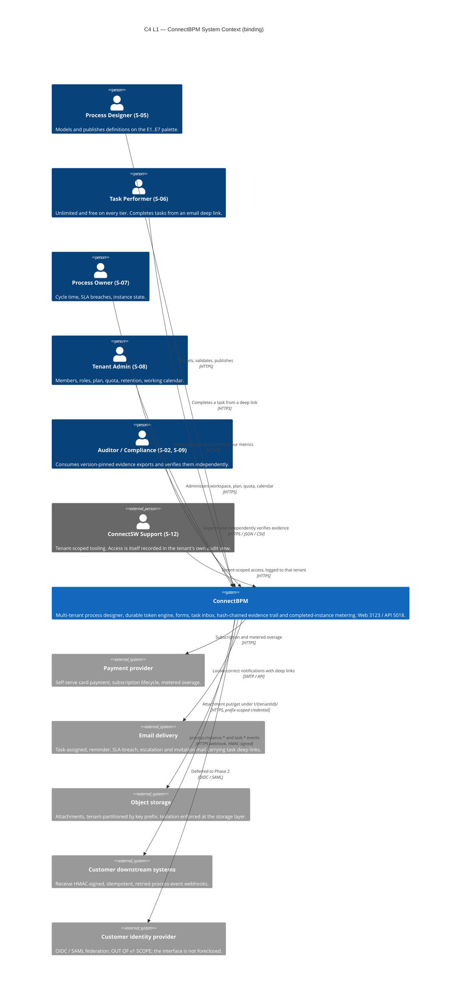
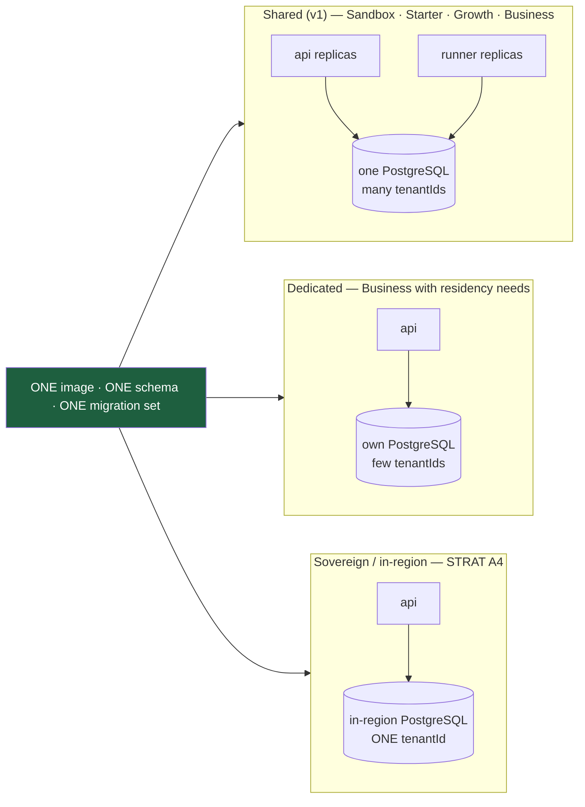
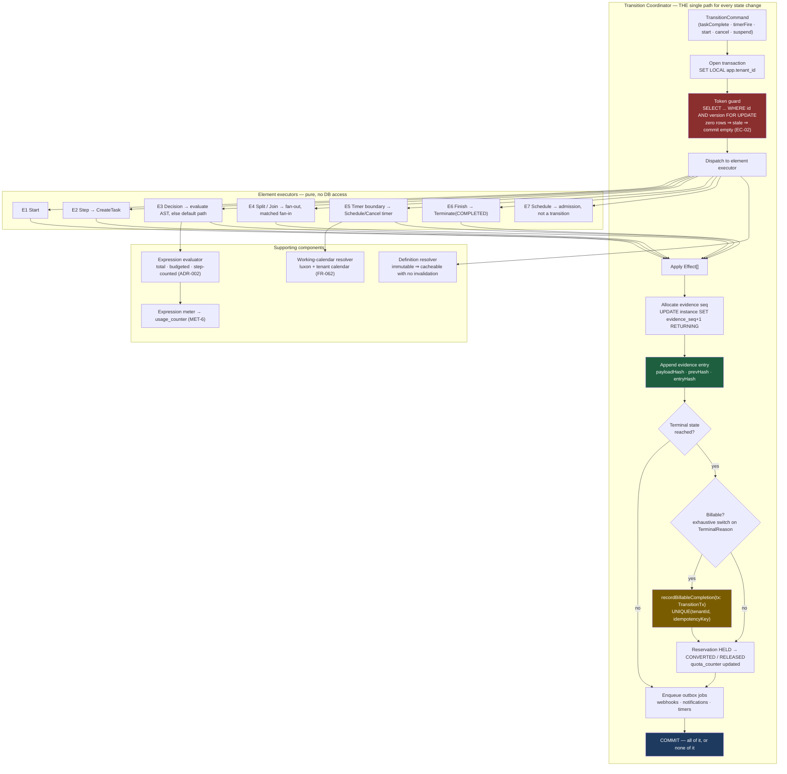
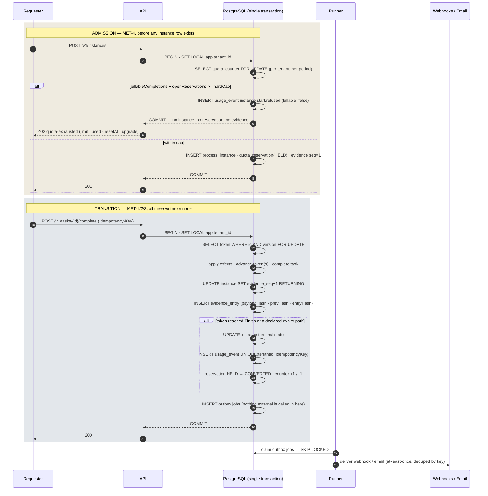
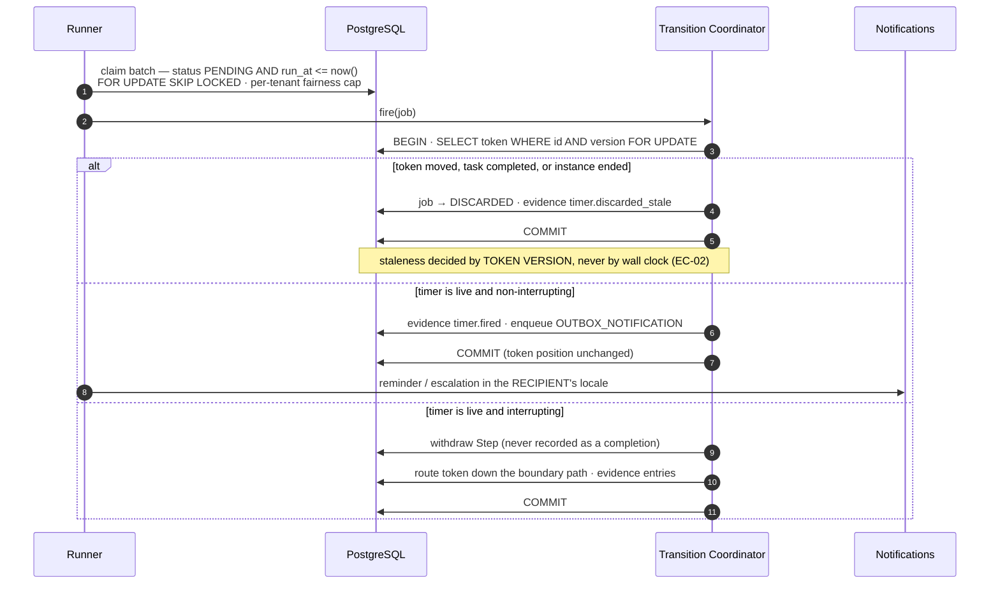
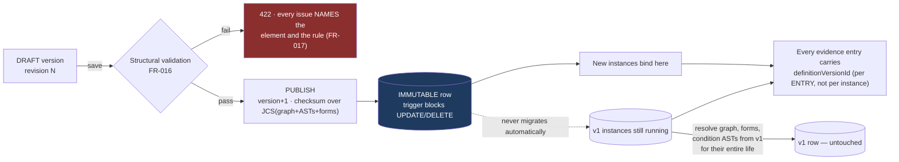
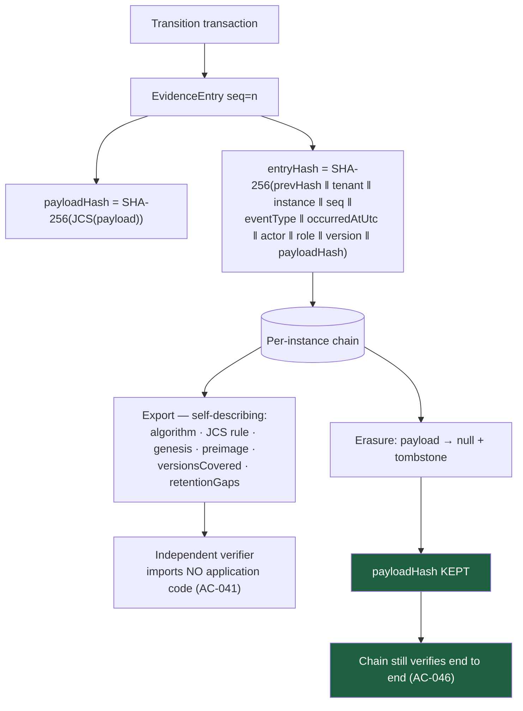
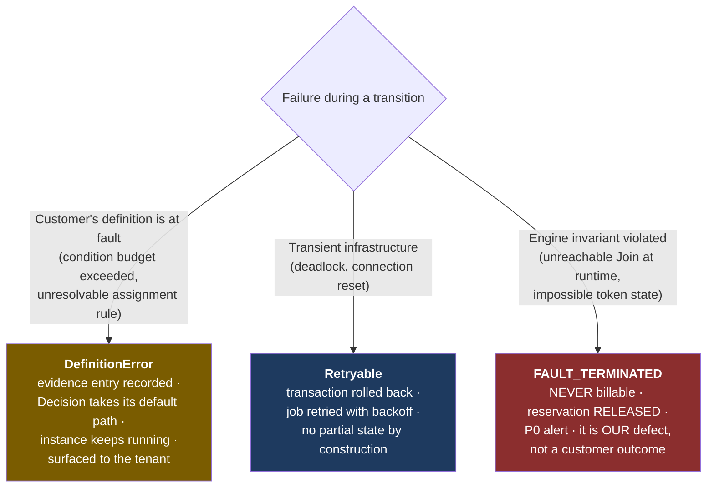
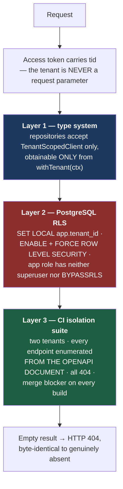

# ConnectBPM — System Architecture

**Task**: ARCH-01 · **Product**: connectbpm · **Date**: 2026-08-20
**Author**: Architect, ConnectSW · **Status**: Awaiting CEO checkpoint

> **This is a design artifact.** No application code exists and none is written by ARCH-01.
> DEC-003 holds implementation behind the K0 validation gate.

---

## 0. How to read this document

| If you want | Read |
|-------------|------|
| The decisions and why | §1 the four delegated decisions, then the ADRs |
| The shape of the system | §2 C4 L1, §3 C4 L2, §4 C4 L3 |
| How money is counted correctly | §5.1 and ADR-007 |
| How the engine survives a crash | §5.2, §6.2 and ADR-009 |
| What we build vs. what we get free | §8 the honest reuse table |
| What errors look like | §7 |
| What is still open | §10 |

Companion artifacts: `docs/api-contract.yaml` (OpenAPI 3.0, 87 operations),
`docs/db-schema.prisma` (28 models), `docs/ADRs/001`–`009`.

---

## 1. The four delegated decisions, in one table

| ADR | Decision | The decisive reason |
|-----|----------|---------------------|
| **ADR-001** Process notation | **SCOPE-AMD-001 RATIFIED** — E7 `Schedule` (`bpmn:timerStartEvent`) plus bulk start as a capability — with three amendments: an `InstanceBatch` entity, E1+E7 coexistence, and a `ScheduleOccurrence` idempotency ledger. `multiInstanceLoopCharacteristics` rejected. | Multi-instance fan-out would make 400 attestations **one** billable completion. That is a different revenue model, not a different notation, and DEC-002 is irreversible. Flat fan-out also keeps the engine single-token and gives the auditor 400 separately verifiable records. |
| **ADR-002** Expression evaluation | An **owned restricted grammar**, parsed **at publish time** to a typed AST stored as JSONB on the immutable version, evaluated at runtime by a total, budgeted tree-walking interpreter. No third-party evaluator. | Every candidate library either compiles to a runtime JavaScript function (filtrex — a flat `NFR-009` violation), is unmaintained and explicitly not a sandbox (expression-eval), or is a much larger language than `FR-022` permits (CEL). Parsing at publish removes the parser from the runtime attack surface entirely. |
| **ADR-003** `credit-os` boundary | **Harvest five patterns, share zero code, zero schema, zero package.** Re-evaluate at month 24 or on three named triggers. | `credit-os` models a **stage machine** (one current stage, SLA as JSONB config); ConnectBPM models a **token engine** (concurrent tokens, durable claimable timers, transactional metering). Its constraint is its value there; removing it produces a worse credit product, not ConnectBPM. |
| **ADR-004** Multi-tenancy | **Shared schema + `tenantId` + mandatory PostgreSQL Row-Level Security**, with the **deployment topology** as the sovereignty lever. | Schema-per-tenant breaks the durable job substrate — the timer runner's whole design is one indexed poll over one table, and 200 schemas make it 200 polls, putting `NFR-004` at risk for isolation RLS already provides. Two independent layers must both fail to leak. |

Five further ADRs record the decisions that follow from these: **ADR-005** build the engine,
**ADR-006** React Flow for the canvas, **ADR-007** the transactional usage ledger, **ADR-008** the
evidence hash chain, **ADR-009** the job substrate.

---

## 2. C4 Level 1 — System Context

**Boundary note.** Object storage is drawn as an external system deliberately: `AC-055` requires
cross-tenant attachment reads to be refused **at the storage layer**, which only means something if
the storage layer is a real trust boundary with its own prefix-scoped credential.

---

## 3. C4 Level 2 — Containers

```mermaid
graph TB
    subgraph client["Client — Arabic-first RTL and English LTR"]
        WEB["<b>Web app</b> · Next.js 14 · :3123<br/>Marketing · Admin · Designer (React Flow)<br/>Inbox · Analytics · Evidence"]
        MAILLINK["Email deep link<br/>→ single-task view, no chrome"]
    end

    subgraph api["<b>API</b> · Fastify + TypeScript · :5018"]
        GW["<b>Tenant-scoped access boundary</b><br/>withTenant(ctx) → TransactionScoped client<br/>SET LOCAL app.tenant_id + injected predicate"]
        DES["Definition service<br/>draft · validate · publish · version · checksum"]
        FRM["Form service<br/>schema binding · server-side revalidation"]
        ENG["<b>Transition Coordinator</b><br/>the single path for every state change"]
        TSK["Task service<br/>assign · claim · complete · reassign · withdraw"]
        EVD["Evidence service<br/>append-only hash chain · verify · export"]
        MET["<b>Metering and quota</b><br/>admission · ledger · counters"]
        ANA["Analytics — four metrics, by version"]
        TPL["Template gallery — data, bilingual"]
    end

    subgraph runner["<b>Runner</b> · same image, separate process"]
        JOB["Job loop · SELECT FOR UPDATE SKIP LOCKED"]
        TIM["Timer + instance-SLA handlers"]
        SCH["Schedule tick (E7) + bulk admission"]
        OBX["Outbox drain → webhooks · notifications"]
        REC["Nightly 3-way reconciliation · retention · erasure"]
    end

    subgraph store["State"]
        PG[("<b>PostgreSQL 15+</b><br/>SOLE source of truth for state,<br/>evidence and meters · RLS enforced")]
        RD[("Redis<br/>cache and soft counters only —<br/>never a value correctness depends on")]
        OS[("Object storage<br/>t/{tenantId}/ prefix-scoped")]
    end

    subgraph pkg["Shared packages"]
        AU["@connectsw/auth · EXTEND"]
        BI["@connectsw/billing · PARTIAL — UsageService FORBIDDEN"]
        AD["@connectsw/audit · EXTEND"]
        WH["@connectsw/webhooks · REUSE code / EXTEND schema"]
        NO["@connectsw/notifications · REUSE code / EXTEND schema"]
        UI["@connectsw/ui · REUSE"]
        OB["@connectsw/observability · REUSE"]
        SH["@connectsw/shared · REUSE"]
    end

    WEB --> GW
    MAILLINK --> WEB
    GW --> DES & FRM & ENG & TSK & EVD & MET & ANA & TPL
    ENG --> EVD
    ENG --> MET
    ENG --> TSK
    DES --> PG
    FRM --> PG
    ENG --> PG
    TSK --> PG
    EVD --> PG
    MET --> PG
    ANA --> PG
    TPL --> PG
    ENG -.enqueue in the SAME transaction.-> PG
    JOB --> PG
    JOB --> TIM & SCH & OBX & REC
    TIM --> ENG
    SCH --> MET
    OBX --> WH
    OBX --> NO
    GW -.cache only.-> RD
    TSK --> OS
    GW --> AU
    MET --> BI
    EVD --> AD
    WEB --> UI
    api --> OB
    api --> SH
    runner --> OB

    style ENG fill:#1e3a5f,color:#fff
    style EVD fill:#1e5f3f,color:#fff
    style MET fill:#7a5c00,color:#fff
    style GW fill:#8b2e2e,color:#fff
    style PG fill:#333,color:#fff
```

### Containers

| Container | Technology | Port | Why it is a separate process |
|-----------|-----------|------|------------------------------|
| **Web** | Next.js 14 (App Router), React 18, Tailwind, shadcn/ui, React Flow | 3123 | Article V default |
| **API** | Fastify, TypeScript strict, Prisma, Zod | 5018 | Article V default |
| **Runner** | Same image, `MODE=runner` | — | So an API deploy never pauses timers, and runner concurrency scales independently. **Not a microservice**: same repository, same schema, same models, no network protocol between them. |
| **PostgreSQL 15+** | — | — | `FR-045` — the sole source of truth. `MET-2` is only achievable because state, evidence and the meter share one transaction. |
| **Redis** | — | — | Cache, rate-limit counters, soft usage display. Nothing correctness depends on. |
| **Object storage** | S3-compatible | — | Attachments, prefix-partitioned per tenant |

### Deployment topologies — `NFR-019`, DEC-001

**No schema change, no query change, no code fork.** A sovereign deployment is a configuration and a
DNS decision — and it is only that because `tenantId` is unconditional (ADR-004). `Tenant.residency`
and `Tenant.deploymentRef` exist from day one so routing and support tooling are data-driven; two
columns now, an unpleasant retrofit later.

---

## 4. C4 Level 3 — Inside the Workflow Engine

### Why the executors are pure

An element executor has the signature `(token, element, snapshot) → Effect[]` and touches no
database. `Effect` is a closed union: `MoveToken`, `CreateToken`, `ConsumeToken`, `CreateTask`,
`WithdrawTask`, `ScheduleTimer`, `CancelTimer`, `SetVariable`, `Terminate`. Three consequences that
are worth the discipline:

1. **`NFR-018`'s 100% branch coverage of the transition function becomes achievable**, because the
   coordinator is small (target ≤ 200 LOC) and the branching lives in seven separately covered pure
   functions.
2. Element semantics are reviewable one element at a time — which matters when the element set is the
   product's scope boundary.
3. Tests run against **real PostgreSQL with no mocks** (`NFR-018`) because there is nothing to mock:
   the executors have no dependencies and the coordinator has exactly one.

---

## 5. Data flows

### 5.1 Admission and the billable-completion write path — DEC-002

**The crash question, answered.** A `SIGKILL` between the state transition and the meter increment
**cannot happen**, because they are statements in one transaction — the crash loses all three writes
or commits all three (`AC-009`). On redelivery the idempotency key is recomputed from immutable
identifiers only (`sha256(instanceId ‖ tokenId ‖ fromElementId ‖ transitionId ‖ purpose)` — no clock,
no random, no attempt counter), so `UNIQUE(tenantId, idempotencyKey)` rejects the second insert and
the token-version guard matches zero rows, making the replay an empty transaction that returns the
first result (`AC-010`, `AC-011`). The nightly three-way reconciliation then asserts this daily rather
than trusting it: instance terminal states, terminal evidence entries and usage events must agree
**exactly**, and a deliberately injected divergence must be caught in CI (`AC-022`, `AC-023`).

### 5.2 Timer firing and stale discard

### 5.3 Publish, pin, and the version a running instance executes

Because each **evidence entry** carries `definitionVersionId` — not just the instance — a future
running-instance migration (v2, designed but not implemented) can move an instance between versions
as an ordinary transition and the record still shows which version executed which step. Nothing in
v1 forecloses it.

### 5.4 Evidence chain, export and erasure

**One design choice makes `AC-041` and `AC-046` compatible**: the chain commits to `payloadHash`, not
to the payload. Destroy the payload, keep the hash, and the chain still verifies.

---

## 6. Engine correctness — the part that makes or breaks the product

| Failure mode | Mechanism | Verified by |
|--------------|-----------|-------------|
| Crash between transition and meter | One transaction: token move + evidence + usage event (ADR-007) | `AC-009` |
| Replay after crash duplicates the meter | Deterministic idempotency key + `UNIQUE(tenantId, idempotencyKey)`; `P2002` read as "already accounted" | `AC-010`, `AC-011` |
| Meter written outside the transaction | `recordBillableCompletion(tx: TransitionTx, …)` — the branded type cannot be constructed outside the coordinator; the lint rule is a backstop, not the guarantee | `AC-012` |
| `@connectsw/billing` `UsageService` used for instance metering | Import denied by a lint rule naming DEC-002 `MET-2`/`MET-3` | `AC-013` |
| Two participants claim one task | Conditional `UPDATE … WHERE assignee_id IS NULL`; the loser gets 409 **naming the claimant** | `AC-073` |
| Timer fires on a moved token | Token-version guard, never wall-clock ordering; `timer.discarded_stale` | `AC-072` |
| Instance stalls at a Decision | Mandatory default path refused at publish **and** taken at runtime as defence in depth | `AC-075` |
| Condition references an unfilled field | Absent ⇒ `null`; every comparison with `null` ⇒ `false`, deterministically, never throwing | `AC-076` |
| A Join can never complete | Publish-time structural validation rejects any Split whose branches cannot all reach the Join, including boundary paths that bypass it | `AC-077`, `EC-06` |
| Unclean shutdown loses in-flight work | All state in PostgreSQL; jobs are rows; 500 in-flight instances resume with zero duplicate side effects | `AC-070`, `NFR-005` |
| 50,000 timers due in one second | `SKIP LOCKED` batches, per-tenant fairness cap; ~825 claims/s needed, ~3× headroom at batch 200 × 8 workers | `AC-071`, `NFR-004` |
| Quota kills running work | Quota is **admission control only**; a tenant at cap with 900 in flight completes all 900 | `AC-016`, `EC-03` |
| Silent divergence anywhere | Nightly three-way reconciliation, exact agreement, P0 on any divergence, detection itself tested in CI | `AC-022`, `AC-023` |

### Concurrency and locking summary

| Contended resource | Lock | Scope of contention | Why acceptable |
|--------------------|------|---------------------|----------------|
| `quota_counter(tenant, period)` | `SELECT … FOR UPDATE` | one tenant, **start path only** | Starts are rare relative to transitions; makes `AC-015` deterministic |
| `token(id, version)` | `SELECT … FOR UPDATE` | one token | The unit of engine progress |
| `process_instance.evidence_seq` | row lock via `UPDATE … RETURNING` | one instance | Gap-free sequencing is the requirement (`AC-038`) |
| `job` rows | `FOR UPDATE SKIP LOCKED` | none — skipping is the point | Workers never collide |
| Draft version | optimistic `revision` | one draft | 409 with what changed and by whom (`EC-16`) |

---

## 7. Error-handling strategy

### 7.1 The status-code contract

| Status | Meaning here | Rule |
|--------|--------------|------|
| **400** | Malformed request (bad JSON, bad types) | Zod at the boundary |
| **401** | Missing, expired or invalid credentials | — |
| **402** | **Quota exhausted** — `MET-4` refusal | Deliberately distinct from 429 (rate limiting) so a customer and a client library can tell "you are going too fast" from "you have used your plan". Body carries limit, used, resetAt, upgrade action, and for a batch the shortfall as a number. |
| **403** | **Your role** does not permit this action on **your own** tenant's resource | `FR-084`, `AC-087`. Never used for a cross-tenant reference. |
| **404** | Absent — **or belonging to another tenant** | `FR-003`, `AC-052`. The two responses are byte-identical. Existence is never disclosed across a tenant boundary. |
| **409** | Optimistic-concurrency conflict, immutability violation, already-claimed task, blocking relationship, refused downgrade | Body always says **what** conflicted, and for a draft **who** changed it and **when** |
| **413** | Body or upload over the limit | 1 MiB JSON, 25 MiB upload, 5,000 batch rows |
| **422** | Semantic validation failed | Every issue names the offending element/field and the rule violated (`FR-017`) |
| **423** | Account locked by the failed-attempt policy | API2 |
| **429** | Rate limited | `Retry-After` always present |
| **503** | `/ready` when PostgreSQL or Redis is unhealthy | A readiness probe returning 200 with a dead database is worse than no probe |

Every error body is **RFC 7807** `application/problem+json` with a `type` URI under
`https://api.connectbpm.com/errors/`. Every response carries `X-Request-ID`, propagated to logs,
traces and the evidence entry's correlation field.

### 7.2 Failure classes inside the engine

The distinction is load-bearing commercially, not just operationally: `FAULT_TERMINATED` is never
billable (`FR-052`, `FR-103`, `AC-005`), so misclassifying a customer's definition error as an engine
fault gives away revenue, and misclassifying an engine fault as a customer outcome bills a customer
for our bug. `AC-026` names this explicitly for expression budgets, and the classification is a tested
property, not a convention.

### 7.3 Delivery guarantees, stated honestly

| Effect | Guarantee |
|--------|-----------|
| Token movement, task rows, instance state | **Exactly once** — one transaction + token-version guard |
| Evidence entry | **Exactly once** — same transaction, gap-free sequence |
| Usage event | **Exactly once** — same transaction + unique idempotency key |
| Webhook delivery | **At least once**, deduplicated at the receiver by our idempotency header and by the delivery table's composite unique key |
| Email / notification | **Notification row exactly once; email delivery at least once** |

A worker that crashes after handing an email to the provider but before marking the job done will
retry, and the provider may send twice. This is not solvable without provider-side idempotency, and we
choose at-least-once **deliberately**: a duplicate reminder is an annoyance, a lost task assignment is
a broken process. See §10 item 2 — `AC-070` should be reworded to match.

---

## 8. Security architecture

### 8.1 Tenant isolation — three independent layers

An application bug is contained by RLS; an RLS misconfiguration is contained by the injected
predicate; a missed endpoint is caught by a suite that enumerates itself from the contract. All three
must fail to produce a leak — which is what `NFR-008`'s zero and STRAT kill criterion **K6** demand.

Two CI gates make this real rather than aspirational:
- The application role is asserted to have **neither `BYPASSRLS` nor superuser** — without this the
  second layer silently does nothing in tests.
- `information_schema.tables` is compared against `pg_policies`; any tenant-scoped table without
  `ENABLE` + `FORCE` + a policy fails the build.

### 8.2 OWASP API Top 10 — where each is addressed

| # | Risk | Where it is handled |
|---|------|---------------------|
| API1 | **BOLA** | Ownership is not checked per route — it is structural. Every read and write goes through `withTenant`, under RLS. Cross-tenant reference ⇒ 404 (`AC-049`–`AC-052`). Task-level ownership additionally checked in the task service (`AC-086`). |
| API2 | **Broken authentication** | Login 5/min per IP **and** per account; 10 consecutive failures ⇒ 15-minute lockout (423); refresh tokens stored as SHA-256 hashes, rotated on every use, with **reuse detection revoking the whole family**; password reset tokens hashed, single-use, 30-minute expiry; identical responses for unknown account and wrong password. |
| API3 | **Object property authorisation** | Response schemas are explicit in the contract — no model is serialised wholesale. `passwordHash`, `tokenHash`, `WebhookEndpoint.secret` and `Attachment.objectKey` never appear in any response. A webhook secret is returned **once** at creation and is never retrievable. |
| API4 | **Unrestricted resource consumption** | Cursor pagination, `limit` capped at 100 server-side (clamped, not honoured); 1 MiB JSON bodies; 25 MiB uploads; 5,000-row batch cap; expression AST depth ≤ 16 / nodes ≤ 200 / 1,000 evaluation steps / 50 ms; `statement_timeout` 5 s (API) and 30 s (jobs); per-tenant job fairness cap. |
| API5 | **BFLA** | Every privileged operation names its required roles in its OpenAPI `security` block. An operation with no explicit list is available to every ACTIVE member including PARTICIPANT — and every surface-B/C/E route returns 403 to a Participant and is absent from their navigation (`FR-084`, `AC-087`). |
| API6 | **Unrestricted access to sensitive business flows** | Bulk start requires a `preflightToken` from `/v1/batches/preflight`, so the "400 billable instances" confirmation cannot be bypassed (`AC-018`). Quota admission gates every start including scheduled and bulk (`AC-019`). |
| API7 | **SSRF** | Outbound webhooks go through `@connectsw/webhooks`'s URL validator, which rejects private, loopback and link-local destinations. No other component fetches a customer-supplied URL — there are no service tasks in v1. |
| API8 | **Security misconfiguration** | CORS restricted to the configured web origin (never `*`), with `Vary: Origin`; nonce-based CSP with `frame-ancestors 'none'`, `object-src 'none'`, `base-uri 'self'`; HSTS with preload; RFC 7807 errors that never leak stack traces or SQL. |
| API9 | **Improper inventory management** | `docs/api-contract.yaml` **is** the inventory; CI asserts router ↔ document parity in both directions. `FR-065`'s internal engine API is the same contract on the `internal` server, deliberately — not a second surface. |
| API10 | **Unsafe consumption of third-party APIs** | The only inbound third-party call is the payment webhook, signature-verified with replay rejection, documented rather than hidden. |

### 8.3 The customer-code question

`NFR-009` is absolute: **no customer-authored input reaches `eval`, `Function`, a VM or an isolate in
v1.** The design satisfies it structurally rather than by policy — the authored string is parsed at
publish time and never reaches the runtime, and the evaluator is a tree walker over a validated AST
(ADR-002). The parser is fuzz-tested with `fast-check` as a required CI gate (`NFR-010`).

**A note on MET-6's wording.** DEC-002 says "per-tenant **sandbox** CPU/memory metering". There is no
sandbox in v1, because `NFR-009` forbids the isolate the word implies. In v1 the only customer-authored
compute is expression evaluation, so MET-6 is implemented as deterministic step counts plus wall-clock
microseconds per tenant per period. Recorded plainly so nobody builds an isolate to satisfy a word.

### 8.4 Data protection

| Concern | Mechanism |
|---------|-----------|
| In transit | TLS 1.2+ everywhere; HSTS preload |
| At rest | Database and object-storage encryption; webhook secrets AES-256-GCM (`@connectsw/webhooks`) |
| Attachments | `t/{tenantId}/…` prefix, prefix-scoped credential, signed URLs ≤ 5 min, single-object, virus-scanned before visible |
| Secrets | Never in the repository; `.gitleaks.toml` and `.semgrep.yml` already in CI |
| PII | Marked `/// @pii` in the schema, on the `@connectsw/shared` logger redaction list, **never logged**, erasable under `FR-097` |
| Staff access | Recorded with actor, timestamp, scope and a **mandatory stated reason**, visible in the tenant's own audit view without ConnectSW action (`AC-054`) |

### 8.5 Observability

`@connectsw/observability` supplies `/health` (liveness, never touches a dependency), `/ready`
(**503** when PostgreSQL or Redis is unhealthy), `/metrics` (Prometheus, internal listener only) and
`X-Request-ID` correlation. Engine-specific metrics: transition latency p50/p95/p99 (`NFR-001`), timer
lag distribution (`NFR-004`), job queue depth by kind, meter writes per period, reconciliation
divergence count (must be 0), expression evaluation steps per tenant.

---

## 9. Component reuse — the honest position

Verified in this task, not assumed: `grep -ril "tenantid\|tenant_id" packages/` returns **0 files**;
no package schema contains a `Tenant`, `Organization`, `Workspace` or `Account` model; and
`@connectsw/billing` keys `Subscription` and `UsageRecord` to `userId`.

**One correction to SPEC-01's reuse table**: `@connectsw/webhooks` and `@connectsw/notifications` are
listed as REUSE. Their **code** is reusable whole; their **schemas are also user-keyed**
(`WebhookEndpoint.userId`, `Notification.userId`), so they are `REUSE code / EXTEND schema`. Small,
but it is a schema change SPEC-01's table does not show and a build plan would have missed.

| Package | Position | What that costs |
|---------|----------|-----------------|
| `@connectsw/shared` | **REUSE as-is** | Logger with PII redaction, crypto (the evidence hash primitive), Prisma and Redis plugins |
| `@connectsw/observability` | **REUSE as-is** | Health, readiness, metrics, correlation IDs — `NFR-017` |
| `@connectsw/ui` | **REUSE** | `DataTable` carries the inbox and instance lists, `StatCard` the four metrics. Every component must be re-verified in RTL (`NFR-013`) — that is the real cost |
| `@connectsw/saas-kit` | **REUSE** | Generates the Fastify + Next.js + Prisma skeleton at 5018 / 3123 |
| `@connectsw/webhooks` | **REUSE code / EXTEND schema** | HMAC signing, SSRF guard, circuit breaker, retry, delivery idempotency reused whole — **and its `SELECT FOR UPDATE SKIP LOCKED` claim loop is the direct precedent for the engine's job runner (PATTERN-014), the single largest de-risking factor in the build**. `WebhookEndpoint.userId → tenantId` |
| `@connectsw/notifications` | **REUSE code / EXTEND schema** | Bilingual templates added; `Notification` takes `tenantId` |
| `@connectsw/auth` | **EXTEND** | Auth mechanics reuse; `User` stays global; `Membership`, tenant-scoped authorisation, refresh rotation with reuse detection and API-key tenant scoping are new |
| `@connectsw/billing` | **PARTIAL** | `SubscriptionService`, `requireFeature`, `PricingCard`, `UsageBar` reused; `Subscription` re-keyed `userId → tenantId`; **`UsageService` FORBIDDEN in the instance-metering path — importing it is a build failure (`AC-013`)** |
| `@connectsw/audit` | **EXTEND, substantially** | `AuditLog` becomes tenant-scoped and stays as the *administrative* audit. The evidence chain is a different model with different guarantees and is built (ADR-008) |
| Tenancy | **BUILD** | Nothing exists. Gates every pillar. G-08 |
| Workflow engine | **BUILD** | ADR-005. G-14 — the hard part |
| Definition model + versioning | **BUILD** | G-12 |
| Designer canvas | **BUILD on React Flow** | ADR-006. G-13 |
| Expression grammar + evaluator | **BUILD** | ADR-002. G-15 |
| Form builder + renderer | **BUILD on `@connectsw/ui` primitives** | G-16 |
| Task inbox | **BUILD on `DataTable`** | G-17 |
| Transactional usage ledger | **BUILD** | ADR-007. Registry candidate afterwards |
| Hash-chained evidence trail | **BUILD** | ADR-008. Registry candidate afterwards |
| Arabic / RTL | **ADAPT** the `connectin` / `muaththir` pattern | `.claude/protocols/i18n.md`; harvest, do not re-derive |

**Third-party adopted, deliberately**: `@xyflow/react` (MIT, canvas), `elkjs` (EPL-2.0, template
auto-layout only), `cron-parser` (MIT, E7 recurrence), `luxon` (MIT, IANA/DST), `zod`, `fast-check`
(MIT, fuzzing). We rejected *engines*, not *libraries*.

**Position, stated plainly**: the shared estate removes roughly 40% of a from-scratch MVP, and it
removes exactly the capabilities a trigger-automation competitor moving upmarket would also have. It
contributes **nothing** to G-12 through G-17, which are the product itself. **The platform is bought;
the product is built.**

---

## 10. What I believe is wrong, unachievable, or missing

Raised now rather than after the build starts.

| # | Item | Assessment | Proposed resolution |
|---|------|-----------|---------------------|
| 1 | **The Sandbox tier has no instance allowance.** DEC-005 makes the five-tier structure normative and gives allowances for Starter / Growth / Business (2,500 / 15,000 / 60,000). Sandbox has none, yet `FR-115` requires a **non-removable** Sandbox hard cap and `AC-020` tests that it cannot be disabled. The number is untestable as written. | **Gap — needs a CEO number.** It is also an abuse-surface question: a free tier with evidence on every instance (`AC-035`) and unlimited members is a COGS and spam vector. | Propose **50 completed instances per month**, non-removable. Architect designs against 50 until told otherwise; changing it later is a configuration change, not a redesign. |
| 2 | **`AC-070` — "zero duplicate side effects … no duplicated notification"** | **Not achievable as literally worded** at the email-provider boundary: a crash after handing a message to the provider and before marking the job done will retry, and providers do not dedupe by default. | Reword to *"no duplicated notification **record**; email delivery is at-least-once by design, deduplicated where the provider supports an idempotency key"*. The choice is deliberate — a duplicate reminder is an annoyance, a lost task assignment is a broken process. |
| 3 | **`AC-012` / `AC-051` — "static analysis" / "does not compile"** | **Not achievable by lint alone.** Whether a call site is inside a transaction, or whether a query carries a tenant predicate, is not decidable by a linter in general. | Solved by construction: `recordBillableCompletion(tx: TransitionTx, …)` and repositories accepting only `TenantScopedClient`, both branded types constructible only by the coordinator and by `withTenant`. The lint rules become backstops over type-level guarantees. **The ACs are satisfiable — but only with this mechanism, so it is not optional.** |
| 4 | **`MET-6` says "sandbox CPU/memory"** while `NFR-009` / BR-005 forbid the isolate that implies. | Reconcilable, but the wording invites someone to build an isolate to satisfy it. | Read MET-6 in v1 as *expression-evaluation resource accounting*: deterministic step counts plus microseconds, per tenant per period. Recorded in ADR-002 §4. |
| 5 | **SPEC-01's `ScheduleSubscription.lastOccurrenceAt`** is the stated mechanism for `FR-060`'s "exactly one instance per occurrence, idempotent across ticks and restarts". | **Insufficient.** A mutable high-water mark loses to two concurrent runners and to a crash between instance creation and mark advance — the same defect class DEC-002 forbids on the meter. | ADR-001 amendment A3: a `ScheduleOccurrence` table with `@@unique(scheduleSubscriptionId, occurrenceAt)`, written in the admission transaction. |
| 6 | **SPEC-01's reuse table lists `@connectsw/webhooks` and `@connectsw/notifications` as REUSE.** | **Optimistic.** Their schemas are user-keyed (verified). The code is reusable; the schemas need an additive `tenantId`. | Reclassified as `REUSE code / EXTEND schema` in §9. Roughly +0.3 sprint, not material — but a build plan that missed it would hit it in week one. |
| 7 | **`NFR-002` — "median ≤ 60 s over ≥100 real task completions by users who received no training"** | **Correct as a product target, unusable as a gate.** It cannot be measured before there are real users, so it cannot block the Foundation checkpoint. | Keep as a post-launch KPI. The Foundation gate should assert the **instrumentation** (`FR-083`) exists and reports, not the value. |
| 8 | **`NFR-018` — 100% branch coverage of "the engine transition function"** | Achievable **only** if the coordinator stays small. If element semantics live inside it, 100% becomes either impossible or gamed. | Made a design constraint: the coordinator is ≤ ~200 LOC and delegates to seven pure executors covered by their own suites (§4). Recorded so a later refactor does not quietly break the AC. |
| 9 | **`AC-041` — "recompute the hash chain from the exported material alone"** | Under-specified without a canonicalisation rule; any implementation detail we invent makes the export verifiable only by us. | **RFC 8785 (JCS)** adopted, published in the export header, with a dependency-free reference verifier in `tools/verify-evidence/` executed in CI against a generated export. |
| 10 | **`FR-065` internal engine API** | A real risk of becoming a second, undocumented surface — an API9 violation by accretion. | Specified as the **same** OpenAPI contract served on the `internal` server with service-account auth. It appears in `docs/api-contract.yaml`; there is no second document. |

**Nothing above blocks the architecture.** Item 1 needs a CEO number before the quota tests can be
written; items 2, 3, 5, 6 and 7 are wording or mechanism corrections for the PM and QA to fold in at
`/speckit.analyze`.

---

## 11. Traceability (Article VI)

| Requirement block | Where the architecture answers it |
|-------------------|-----------------------------------|
| `FR-001`–`FR-010` tenancy | ADR-004; §8.1; `Tenant`, `Membership`, `WorkingCalendar` |
| `FR-011`–`FR-030` designer | ADR-001, ADR-006; §5.3; `ProcessDefinition(Version)`, `ProcessGraph` |
| `FR-031`–`FR-040` forms | `FormSchema` with stable machine keys; §5.3 pinning |
| `FR-041`–`FR-065` engine | ADR-005, ADR-009; §4, §5.1, §5.2, §6 |
| `FR-066`–`FR-085` tasks | §6 claim/complete; `Task`; contract `/v1/tasks/*` |
| `FR-086`–`FR-100` evidence | ADR-008; §5.4 |
| `FR-101`–`FR-125` metering | ADR-007; §5.1 |
| `FR-126`–`FR-130` analytics | `/v1/analytics/*`, grouped by version, never a billing source |
| `FR-131`–`FR-137` commerce | `/v1/subscription/*`; `Subscription` |
| `FR-138`–`FR-149` i18n | ADR-006 §3 (RTL by coordinate transform); stable machine keys; locale-independent storage |
| `FR-150`–`FR-154` gallery | `Template` / `TemplateLocale` — global, data, tags not enums |
| `NFR-001`–`NFR-021` | §6 (correctness, performance), §8 (security), §3 (topology), §10 (the two I contest) |
| `MET-1`–`MET-7` | ADR-007 in full; §5.1; §6 |
| DEC-001 | Evidence day-one (ADR-008); RTL in v1 (ADR-006); geography as configuration (`WorkingCalendar`, `contextTags`, no jurisdiction enum anywhere); topology open (§3) |
| DEC-002 | ADR-007 |
| DEC-004 | `completedStepCountAtEvent` mandatory on every usage event; exhaustive billability switch |
| DEC-005 | `ActorKind.EXTERNAL_PARTY` reserved and never written in v1 (ADR-008 §6); five-tier `SubscriptionTier` normative |

---

*ARCH-01 · ConnectBPM System Architecture · Architect, ConnectSW · 2026-08-20*
