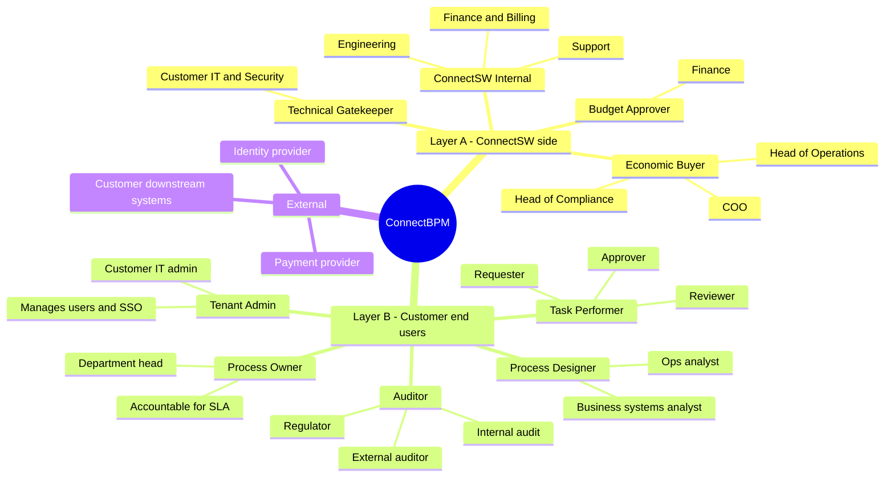
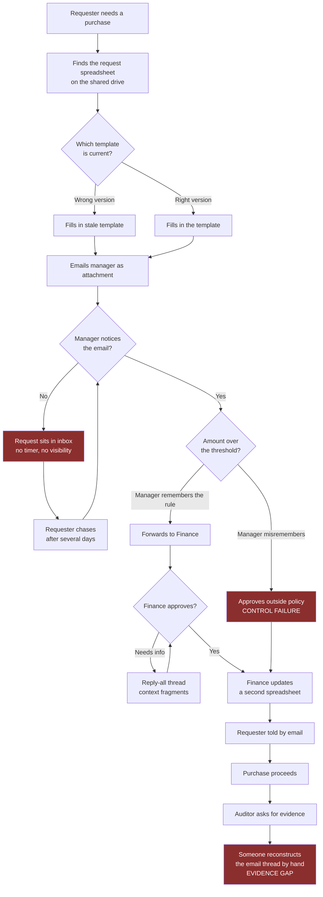
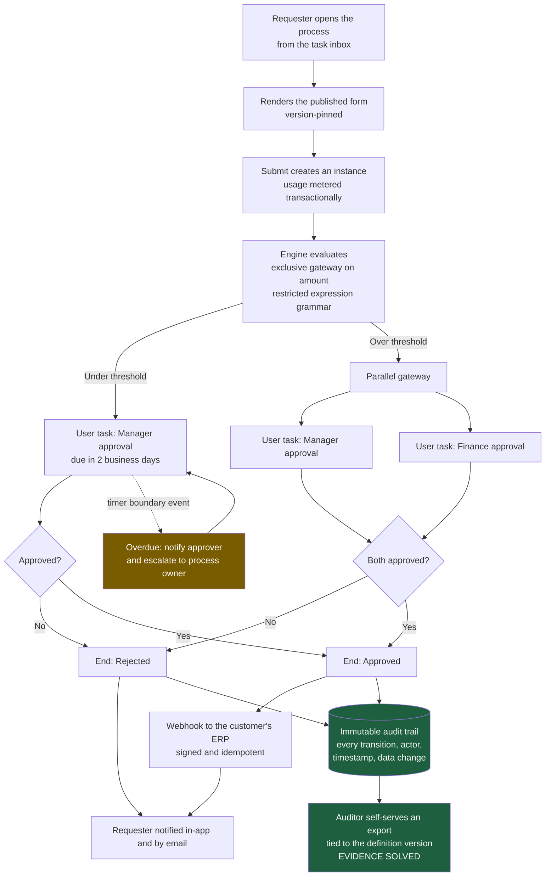
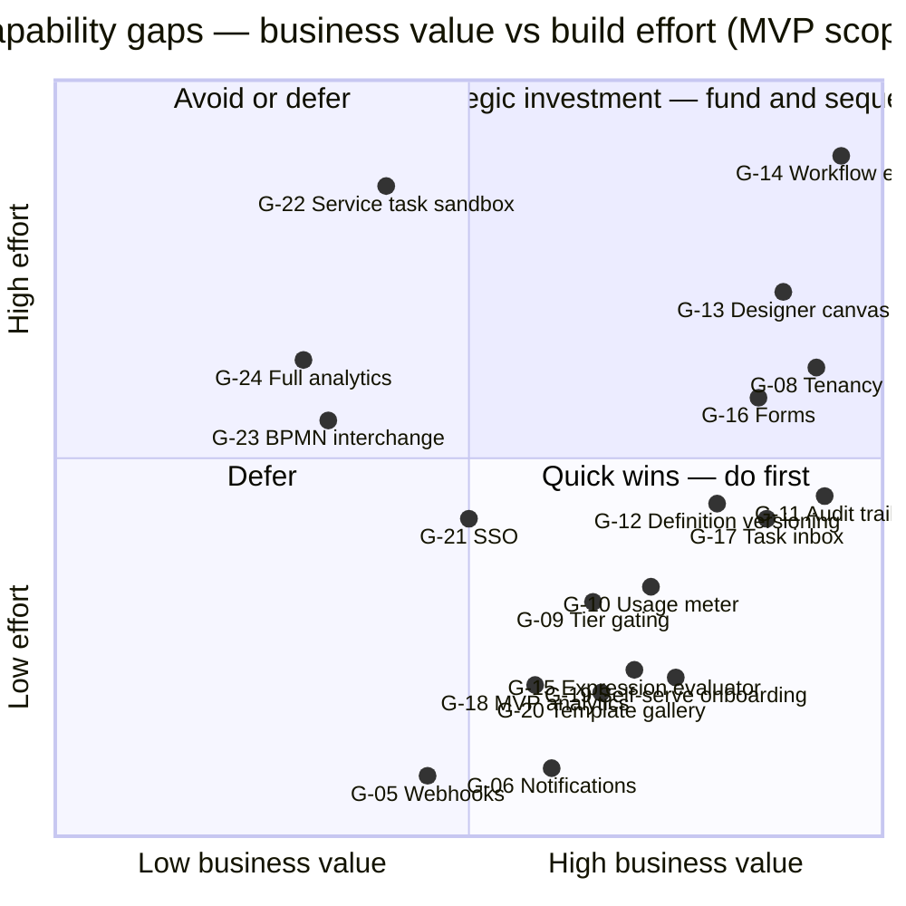
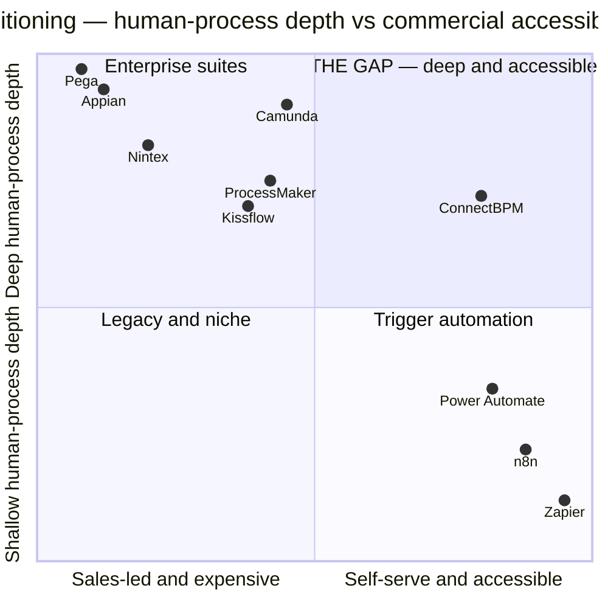

# Business Analysis Report: ConnectBPM

| Field | Value |
|-------|-------|
| Task ID | BA-01 |
| Product | connectbpm |
| Author | Business Analyst (ConnectSW) |
| Date | 2026-08-20 |
| Status | Complete — awaiting Orchestrator checkpoint |
| Downstream consumers | Product Manager (PRD-01), Architect (ARCH-01) |

> **Evidence convention used throughout this document.** Every quantitative claim is either
> (a) cited to a named external source, or (b) labelled `[ASSUMPTION]` and carries a row in
> §4.3 with a validation plan. No unverified figure is presented as fact.

---

## 1. Executive Summary

The BPM software market is large and growing — independent analysts place the 2026 market
between USD 17.5B and USD 26.7B with CAGRs from 9% to 18% ([Grand View](https://www.grandviewresearch.com/industry-analysis/business-process-management-bpm-market),
[Mordor](https://www.mordorintelligence.com/industry-reports/business-process-management-market),
[Fortune Business Insights](https://www.fortunebusinessinsights.com/business-process-management-bpm-market-102639)) —
and it is also extremely crowded. Entering it on "better UX" is not viable. This analysis
identifies a specific structural gap instead: the market is barbelled between **USD 20/month
trigger-automation tools** (Zapier, n8n, Make, Power Automate) that cannot hold long-running
human work, and **USD 400K+/year enterprise suites** (Pega, Appian, Nintex) that take 12–18
months to deliver value ([Kissflow](https://kissflow.com/workflow/bpm/enterprise-bpm-pricing-you-need-to-know/)).
Mid-market companies with real compliance obligations sit in that gap and run their
approval processes on email, spreadsheets and shared drives.

**The recommended wedge is audit-grade, human-in-the-loop process execution for the
compliance-touched mid-market, sold self-serve to the operations leader.** The
differentiator is not the designer and not the engine — every competitor has both. It is
that **every process instance produces a defensible, immutable, exportable audit trail by
default**, which is the artefact the buyer is actually missing when an auditor, regulator or
enterprise-customer security questionnaire asks how an approval was made. ConnectSW already
owns `@connectsw/audit`, `@connectsw/webhooks` (with the PATTERN-014 idempotent
`SELECT FOR UPDATE SKIP LOCKED` queue that the engine's timer/job store reuses directly) and
`@connectsw/notifications`, which makes this wedge structurally cheaper for us than for a
trigger-automation incumbent to retrofit.

**Three findings materially change the plan that follows.** First, **the shared packages
contain no tenancy whatsoever** — repository inspection returns zero matches for a Tenant,
Organization or Workspace model and zero files containing `tenantId`, and
`@connectsw/billing` keys its Subscription to a User. ConnectBPM is a B2B2C multi-tenant
product, so tenancy is a **build**, and reuse of auth, billing and audit is **partial, not
full** (§6). Second, **BPMN 2.0 must not be the authoring surface** for a non-technical ops
buyer, but its *execution semantics* must be the engine's internal model so that BPMN
interchange is a later mapping exercise rather than a re-architecture (§Q3). Third, the MVP
must ship **three complete pillars, not five half-built ones**: designer, engine, and
forms-plus-inbox treated as a single indivisible pillar — with **no customer-authored script
execution at all in v1**, which removes the single largest security risk from the MVP
critical path (§Q6, RSK-002).

**Recommendation: GO**, scoped to the MVP boundary in §11.1, with the tenancy work
(BN-001) treated as a foundation blocker that gates every other pillar.

---

## 2. Business Context

### 2.1 Problem Statement

A mid-market company of 100–2,000 employees runs between 20 and 200 recurring
cross-functional processes — purchase approvals, vendor onboarding, employee onboarding and
offboarding, expense exceptions, change requests, customer credit decisions, incident
reviews, contract sign-off. Repository-external validation of the exact count is not
available, so the range is recorded as `[ASSUMPTION ASM-001]`.

Today the substantial majority of those processes run on **email threads, spreadsheets,
shared drives and verbal escalation**. That configuration produces five concrete costs:

1. **No state.** Nobody knows where a request is without asking. Status-chasing consumes
   the requester's and the approver's time.
2. **No SLA.** Work stalls in an inbox with no timer, no escalation and no visibility.
3. **No routing rules.** Routing lives in one person's head; that person becomes a
   bottleneck and a single point of failure.
4. **No evidence.** When an auditor, a regulator, or an enterprise customer's security
   questionnaire asks *"demonstrate that this approval followed your stated control"*, the
   answer is a forwarded email chain and a screenshot. This is the acute pain.
5. **No measurement.** Cycle time, rework rate and bottleneck location are unknown, so the
   process is never improved.

**Cost of inaction, from the buyer's side:** the operations leader continues to absorb
throughput problems with headcount, and the compliance owner continues to fail evidence
requests. **Cost of inaction, from ConnectSW's side:** the barbell gap closes as
trigger-automation vendors move upmarket into human workflow.

**Why the incumbent alternatives do not close it.** Trigger-automation tools are priced and
architected for stateless event plumbing (Zapier from USD 19.99/month for 750 tasks; n8n from
USD 20/month for 2,500 executions — [Cipher Projects](https://www.cipherprojects.com/blog/posts/n8n-vs-zapier-automation-tool-comparison/)),
and an eleven-day, five-approver case with delegation, reassignment, SLA escalation and an
immutable history is not an execution of a trigger. Enterprise suites do model that case, at
USD 35–90 per user per month ([SelectHub](https://www.selecthub.com/workflow-management-software/pega-vs-camunda/)) —
USD 420K–1.08M annually for 1,000 users on Appian — and with an implementation horizon of
12–18 months before measurable value.

### 2.2 Market Landscape

| Dimension | Finding | Source |
|-----------|---------|--------|
| 2026 market size | USD 17.5B – 26.7B (analysts disagree; treat as a band) | [Grand View](https://www.grandviewresearch.com/industry-analysis/business-process-management-bpm-market) 17.5B; [Mordor](https://www.mordorintelligence.com/industry-reports/business-process-management-market) 18.68B; [Persistence](https://www.persistencemarketresearch.com/market-research/business-process-management-market.asp) 20.2B; [Fortune](https://www.fortunebusinessinsights.com/business-process-management-bpm-market-102639) 25.88B; [Coherent](https://www.coherentmarketinsights.com/market-insight/business-process-management-market-6108) 26.66B |
| CAGR | 9.0% – 17.9% depending on scope definition | [IMARC](https://www.imarcgroup.com/business-process-management-market) 9.02%; [Mordor](https://www.mordorintelligence.com/industry-reports/business-process-management-market) 10.1%; [Coherent](https://www.coherentmarketinsights.com/market-insight/business-process-management-market-6108) 13.4%; [Persistence](https://www.persistencemarketresearch.com/market-research/business-process-management-market.asp) 17.9% |
| Fastest-growing end-user segment | SME / SMB, 2026–2035 | [Precedence Research](https://www.precedenceresearch.com/business-process-management-market), [MarketsandMarkets](https://www.marketsandmarkets.com/Market-Reports/business-process-management-market-157890056.html) |
| Programme failure rate | ~70% of BPM programmes fail, driven by rigid architecture and consultant dependency; enterprise implementations fail at 38% vs SMB at 22% | [LowCode Agency](https://www.lowcode.agency/blog/crm-implementation-failure-rate) |
| Time to value | Low-code self-service BPM returns ROI in weeks; traditional suites require 12–18 months | [Kissflow](https://kissflow.com/workflow/bpm/enterprise-bpm-pricing-you-need-to-know/) |
| Rollout pattern | Phased rollouts are 2.8× more likely to succeed than big-bang | [LowCode Agency](https://www.lowcode.agency/blog/crm-implementation-failure-rate) |

**The disruption event worth naming.** With Camunda 8.6 (released 8 October 2024), Camunda
required a commercial production licence for **all** self-managed components including the
Zeebe engine, Operate and Tasklist, removing the previously free self-hosted production path
([Camunda licensing update](https://camunda.com/blog/2024/04/licensing-update-camunda-8-self-managed/),
[Camunda 8 licensing docs](https://docs.camunda.io/docs/reference/licenses/),
[Camunda community forum](https://forum.camunda.io/t/important-licensing-changes-to-camunda-8-self-managed/51669)).
Camunda 7 was Apache 2.0 and is now carried by community forks
([Wikipedia](https://en.wikipedia.org/wiki/Camunda)). This displaced a cohort of teams that
were running production workflow for free and now face an enterprise licence conversation.
That cohort is a named acquisition target for Phase 2 (BPMN import — see §Q3), not for MVP.

### 2.3 Target Segments

| Rank | Segment | Definition | Why | Size basis |
|------|---------|-----------|-----|------------|
| Primary | Compliance-touched mid-market | 100–2,000 employees; financial services, insurance, healthcare, professional services, public-sector suppliers | Has the compliance evidence pain (§2.1 item 4), has process volume, is reachable self-serve, and fails implementations at 22% rather than 38% | Segment growth: [Precedence](https://www.precedenceresearch.com/business-process-management-market); failure delta: [LowCode Agency](https://www.lowcode.agency/blog/crm-implementation-failure-rate) |
| Secondary | Camunda 7 / Camunda 8 self-managed refugees | Engineering-led teams displaced by the 8.6 licence change | Motivated, technical, already believe in process orchestration; require BPMN import, so Phase 2 | [Camunda forum](https://forum.camunda.io/t/important-licensing-changes-to-camunda-8-self-managed/51669) |
| Tertiary | Upper SMB, 25–100 employees | Fast-growing, low ACV | Absorbs the free and entry tier; funds word-of-mouth; does not carry the roadmap | [ASSUMPTION ASM-002] |
| Explicitly out of scope for v1 | Enterprise, 5,000+ employees | Requires a field sales organisation, SOC 2 Type II, professional services and 9–18 month cycles a new entrant cannot fund | See §8.3 |

---

## 3. Stakeholder Analysis

This product has **two distinct stakeholder layers**. Layer A is ConnectSW's commercial
relationship — the companies that buy. Layer B is inside the customer's own organisation —
the people who design, perform and own processes on our platform. Conflating them is the
classic B2B2C design error: it produces a product that the buyer signs for and the end users
refuse to use, which is precisely the "gap between deployment and adoption" identified as
the most common failure mode in enterprise BPM ([LowCode Agency](https://www.lowcode.agency/blog/crm-implementation-failure-rate)).

### 3.1 Stakeholder Map

### 3.2 Stakeholder Register

| # | Layer | Stakeholder | Role | Primary interest | Influence | Core need | Communication channel |
|---|-------|------------|------|------------------|-----------|-----------|----------------------|
| S-01 | A | Head of Operations / COO | **Economic buyer** | Throughput, SLA attainment, cost per transaction | High | Prove value inside one billing period without an IT project | Self-serve trial, template gallery, in-product ROI view |
| S-02 | A | Head of Compliance / Risk | Co-buyer in regulated verticals | Defensible evidence of control execution | High | Immutable, exportable per-instance audit trail | Audit export feature, compliance one-pager |
| S-03 | A | Customer IT / Security | **Gatekeeper (veto only)** | Data protection, SSO, no shadow IT | High (negative) | SSO, RBAC, data residency statement, security questionnaire answers | Trust page, security docs, SSO in paid tier |
| S-04 | A | Finance (customer) | Budget approver | Predictable, defensible spend | Medium | Transparent pricing, no per-seat explosion | Public pricing page, usage dashboard |
| S-05 | B | **Process Designer** | Builds and publishes processes | Model a real process without writing code | High | Constrained, forgiving designer; versioning; safe publish | In-app designer, templates, validation errors |
| S-06 | B | **Task Performer** | Completes assigned work | Finish the task in under a minute and move on | High (adoption) | Zero-training inbox, deep-link from email, mobile-readable | Task inbox, email/in-app notification |
| S-07 | B | **Process Owner** | Accountable for one process's outcome | Where is work stuck and why | Medium | Instance list, cycle time, SLA breach count | Analytics view, SLA breach notification |
| S-08 | B | **Tenant Admin** | Manages the customer's workspace | User lifecycle, permissions, joiners/leavers | Medium | Invite/deactivate users, assign roles, reassign orphaned tasks | Admin settings area |
| S-09 | B | Auditor / Regulator | Verifies control execution after the fact | Completeness and immutability of the record | Medium (but decisive at renewal) | Point-in-time export tied to a definition version | Audit export (CSV/JSON), retention policy |
| S-10 | Ext | Identity provider | SSO federation | — | Low | OIDC/SAML conformance | Integration |
| S-11 | Ext | Customer downstream systems | Receive process events | — | Low | Signed, idempotent, retried webhooks | `@connectsw/webhooks` |
| S-12 | Int | ConnectSW Support | Resolves tenant issues | Diagnose without reading tenant data | Medium | Tenant-scoped admin tooling with access logging | Internal tooling |

### 3.3 Power / Interest Grid

| | **Low interest** | **High interest** |
|---|---|---|
| **High power** | **Keep satisfied** — S-03 Customer IT/Security (vetoes on SSO, data handling; does not want features), S-04 Finance | **Manage closely** — S-01 Head of Operations (economic buyer), S-02 Head of Compliance, S-05 Process Designer, S-06 Task Performer |
| **Low power** | **Monitor** — S-10 IdP, S-11 downstream systems | **Keep informed** — S-07 Process Owner, S-08 Tenant Admin, S-09 Auditor, S-12 ConnectSW Support |

**The decisive read from this grid:** S-06 (Task Performer) has **low formal power and the
highest practical influence on retention**. The economic buyer signs, but if task performers
do not complete work in the inbox the product is abandoned at renewal. This makes
"task completion in under 60 seconds with no training" a **P0 requirement (BN-006)**, not a
polish item.

---

## 4. Requirements Elicitation

### 4.1 Business Needs

Priority key: **P0** = MVP blocker, no launch without it. **P1** = required within two
releases of launch. **P2** = Phase 2. **P3** = backlog.

| ID | Business need | Source | Priority | Rationale |
|----|--------------|--------|----------|-----------|
| BN-001 | Tenant isolation model: every entity is owned by a tenant, and every query is tenant-scoped at the data-access boundary | Addendum "Special Considerations 1"; repo inspection (§6.2) | **P0** | Multi-tenant SaaS. A cross-tenant leak terminates the product. No shared package supplies this. |
| BN-002 | A non-technical designer models a process on a visual canvas using a constrained element set, and publishes it | CEO brief pillar 1; S-05 | **P0** | Without authoring there is no product. Constrained set is deliberate (§Q3). |
| BN-003 | A durable workflow engine executes published definitions with exactly-once state transitions and survives process restart | CEO brief pillar 2; Addendum "Correctness over features" | **P0** | An engine that loses or duplicates work has negative value. |
| BN-004 | Published process definitions are immutable and versioned; running instances stay pinned to the version they started on | Addendum "Special Considerations 3" | **P0** | Editing a live definition corrupts in-flight instances and destroys audit defensibility. |
| BN-005 | A designer builds a form and binds it to a user task; the form renders for the performer and its data becomes process variables | CEO brief pillar 3; S-05 | **P0** | A user task with no data capture cannot make a decision. |
| BN-006 | A task performer sees assigned work in an inbox and completes it in under 60 seconds with no training | CEO brief pillar 4; S-06 | **P0** | Adoption-side failure is the dominant BPM failure mode. |
| BN-007 | Every state transition, assignment, decision and data change is written to an immutable, tenant-scoped, exportable audit trail | S-02, S-09; §2.1 item 4 | **P0** | **This is the commercial wedge**, not a compliance checkbox. |
| BN-008 | Tasks carry a due time; overdue tasks escalate and notify | S-01, S-07 | **P0** | SLA is the ops leader's own metric. Without timers the product does not address the buyer's KPI. |
| BN-009 | The engine meters billable usage transactionally, idempotently and per tenant | §Q5 | **P0** | Retro-fitting a meter is expensive and un-billable for past periods. |
| BN-010 | Self-serve signup, tenant creation, tier selection and in-product upgrade with no human in the loop | §Q2 | **P0** | The go-to-market motion is product-led; a sales-gated trial invalidates the segment choice. |
| BN-011 | Process owner sees instances started, instances completed, median cycle time, and SLA breach count per process | CEO brief pillar 5; S-07 | **P1** | Minimum viable analytics. Full analytics is Phase 2. |
| BN-012 | Tenant admin invites, role-assigns and deactivates users, and reassigns tasks orphaned by a leaver | S-08 | **P1** | Joiner/leaver handling is a hard requirement in any real deployment. |
| BN-013 | Process events are delivered outbound as signed, idempotent, retried webhooks | S-11 | **P1** | Reuses `@connectsw/webhooks`; cheap; unblocks integration objections without building service tasks. |
| BN-014 | SSO (OIDC/SAML) and enforced RBAC | S-03 | **P1** | Removes the IT gatekeeper veto. Paid-tier gate. |
| BN-015 | Template gallery of pre-built processes a customer starts from and edits | S-01, S-05 | **P1** | Directly attacks time-to-first-value, the segment's stated buying criterion. |
| BN-016 | Service tasks calling customer HTTP endpoints, executed in a sandbox with egress controls | CEO brief pillar 2 (implied) | **P2** | Deliberately deferred out of MVP to remove RSK-002 from the critical path. |
| BN-017 | BPMN 2.0 XML import and export | §2.3 secondary segment; S-03 | **P2** | Unlocks the Camunda-refugee segment and answers enterprise "is it standard?" objections. |
| BN-018 | Full process analytics: bottleneck heatmap, per-step duration distribution, rework rate | CEO brief pillar 5 | **P2** | Valuable, and not what the first cheque is for. |
| BN-019 | Data residency selection and per-tenant retention policy | S-03, S-09 | **P3** | Enterprise-segment enabler. |
| BN-020 | Running-instance migration between definition versions | Addendum open question 6 | **P3** | Genuinely hard; the pinning rule in BN-004 makes it non-urgent. |

### 4.2 Business Rules

| ID | Rule | Source | What it constrains |
|----|------|--------|--------------------|
| BR-001 | A published process definition version is immutable. Edits create a new draft version. | Addendum | Designer save/publish flow; storage model |
| BR-002 | A running instance executes against the definition version it started on for its entire life. | Addendum | Engine resolution of definition; analytics grouping |
| BR-003 | Audit records are append-only. No API path updates or deletes an audit record. | S-09, compliance wedge | Data model, API surface, retention job design |
| BR-004 | Every persisted row carries a tenant identifier, and every read path filters on it. | Addendum, BN-001 | Prisma schema, every repository method, every route |
| BR-005 | Customer-authored expressions are evaluated by a restricted non-Turing-complete grammar. No `eval`, no dynamic code execution, no general-purpose sandbox in v1. | RSK-002 mitigation | Expression evaluator design; gateway conditions |
| BR-006 | A state transition is idempotent: replaying the same transition with the same token produces one effect and one meter increment. | Addendum "Correctness over features"; BN-009 | Engine transaction design; billing meter |
| BR-007 | A task is assignable to exactly one performer at a time; reassignment is an audited event. | S-06, S-08 | Task model, inbox query, audit events |
| BR-008 | Tier limits are enforced at the engine boundary before an instance is created, not after. | BN-009 | `@connectsw/billing` integration point |
| BR-009 | Task performers are not billable units. Billing meters process instances and named designers only. | §Q5 | Pricing model; seat management; billing schema |
| BR-010 | ConnectSW staff access to tenant data is itself audited and surfaced to the tenant admin. | S-12, S-03 | Support tooling; trust posture |

### 4.3 Assumptions

Every figure in this report that is not externally cited appears here.

| ID | Assumption | Risk if wrong | Validation plan |
|----|-----------|---------------|-----------------|
| ASM-001 | A 100–2,000 employee company runs 20–200 recurring cross-functional processes | Instance-based pricing is mispriced; tier limits are set at the wrong level | Ten structured discovery interviews with target-segment ops leaders before pricing is fixed. Owner: Product Strategist. Gate: before PRD-01 pricing section is frozen. |
| ASM-002 | Upper SMB (25–100 employees) converts on a free/entry tier and generates referral volume | Free tier consumes engine capacity with no revenue path | Instrument free-tier→paid conversion from launch; kill or cap the free tier if conversion is below 2% after 90 days |
| ASM-003 | The compliance-evidence pain is the strongest single purchase trigger in the target segment, ahead of cost saving and speed | The wedge is wrong; positioning and the audit-first roadmap are misdirected | Message test: three landing-page variants (audit-evidence / cost-per-transaction / speed-to-launch) measured on qualified-demo-request rate. Owner: Product Strategist. Gate: before launch messaging is fixed. |
| ASM-004 | Target buyers accept an instance-metered price and do not demand per-seat | Revenue model requires rework after launch | Present both models in the discovery interviews above; require ≥7/10 preference for instance metering |
| ASM-005 | The MVP element set (§Q6) covers ≥80% of the processes the target segment wants to automate first | Customers hit the ceiling in week one and churn | Model the 15 template-gallery processes (BN-015) using **only** the MVP element set. If any template requires an out-of-scope element, the boundary is wrong. Owner: BA + PM. Gate: before ARCH-01 closes. |
| ASM-006 | Price points of USD 299/month (Team) and USD 999/month (Business) sit inside the segment's departmental discretionary budget | Pricing blocks self-serve conversion | Van Westendorp price-sensitivity question set inside the ASM-001 interviews |
| ASM-007 | The ConnectSW agent team sustains a delivery rate of one sprint per calendar week at the quality bar in Article III | The 16-week MVP baseline in §8.3 is optimistic | Measure actual sprint throughput across the first three sprints and re-baseline the estimate at the Foundation checkpoint |
| ASM-008 | No shared package needs a breaking change to become tenant-aware — tenancy is additive | Foundation cost rises and other ConnectSW products are impacted | Architect spike in ARCH-01: attempt an additive `tenantId` on `@connectsw/auth` and `@connectsw/billing` schemas and report back before the Architecture checkpoint |

---

## 5. Process Analysis

The exemplar process modelled below is **non-standard purchase approval** at a 600-person
company — chosen because it is cross-functional, involves conditional routing on a monetary
value, has a real SLA, and produces an audit obligation. It is representative of the
template-gallery set in BN-015.

### 5.1 Current State (As-Is)

**Quantified pain in the as-is path** (all figures `[ASSUMPTION ASM-001]`, validated by the
discovery interviews):

| Symptom | Where it originates | Consequence |
|---------|--------------------|-------------|
| Dead time in inboxes | Node H | The dominant share of end-to-end cycle time is waiting, not working |
| Policy applied from memory | Node J/L | Control failures are undetected until audit |
| Context fragmentation | Node N | Decision rationale is unrecoverable |
| Manual evidence reconstruction | Node S | Audit response cost, and an incomplete answer |
| No measurement | Whole flow | The process is never improved because it is never measured |

### 5.2 Future State (To-Be) on ConnectBPM

### 5.3 Process Improvement Opportunities

| # | As-is defect | To-be mechanism | Benefit | Measured by |
|---|-------------|-----------------|---------|-------------|
| PI-01 | Dead time with no timer (node H) | Timer boundary event + escalation (BN-008) | Waiting time becomes bounded and visible | KPI-P3 median cycle time; KPI-P4 SLA breach rate |
| PI-02 | Policy from memory (node J/L) | Exclusive gateway evaluated by the engine (BN-002, BR-005) | Routing is deterministic; the control cannot be skipped | KPI-P5 out-of-policy approvals, target zero |
| PI-03 | Fragmented context (node N) | Form data as process variables, held on the instance (BN-005) | Decision inputs are on the record | Qualitative in interviews |
| PI-04 | Manual evidence reconstruction (node S) | Immutable audit trail + self-serve export (BN-007) | Audit response drops from hours of reconstruction to one export | KPI-P6 audit export usage |
| PI-05 | No measurement | Four-metric analytics view (BN-011) | The process becomes improvable | KPI-P7 processes with ≥2 published versions |
| PI-06 | No handoff to systems of record | Signed idempotent webhooks (BN-013) | Removes double entry into the ERP | Webhook delivery success rate |

**What the to-be flow deliberately does not contain:** a service task calling a customer
script, a sub-process, a message event, a DMN decision table, or a BI dashboard. That
absence is the MVP boundary decision in §Q6, not an oversight.

---

## 6. Gap Analysis

### 6.1 Method

Each capability is classified as **REUSE** (a shared package supplies it as-is),
**EXTEND** (a shared package supplies a base that requires tenant-awareness or
domain-specific extension), or **BUILD** (no ConnectSW asset exists). Effort is stated in
**sprints, where one sprint = one calendar week of ConnectSW agent-team delivery at the
Article III quality bar** — see `[ASSUMPTION ASM-007]`.

### 6.2 Repository Finding That Drives This Section

Direct inspection of `packages/` returned:

- `grep -rniE "model (Tenant|Organization|Org|Workspace|Account)\b" packages/ --include=*.prisma --include=*.ts` → **zero matches**
- `grep -rl "tenantId" packages/` → **zero files**
- `@connectsw/billing` Prisma models are `Subscription` (keyed to user) and `UsageRecord`
  (per-feature, per-period counters); `UsageService` is described as *"Redis-backed counters
  with DB sync"*.

**Three consequences the Architect must act on.**

1. **ConnectSW's shared packages are shaped for single-tenant, user-owned SaaS.** ConnectBPM
   is B2B2C multi-tenant. Tenancy is a **BUILD**, and it is the foundation every other
   pillar sits on. This is why BN-001 is the first thing delivered.
2. **`@connectsw/billing` reuse is EXTEND, not REUSE.** The subscription must be re-keyed
   from user to tenant.
3. **`@connectsw/billing` `UsageService` is not sufficient for instance metering.**
   Redis counters synced to the database are not transactional with the instance-creation
   write and are not replay-safe, which violates BR-006 and BN-009. **Finding for the
   Architect: billable process-instance metering requires a database-transactional,
   idempotency-keyed meter written in the same transaction as instance creation. The Redis
   counter path is acceptable for soft limits and dashboards only.**

### 6.3 Capability Gap Matrix

| ID | Capability | Current state | Desired state | Classification | Gap | Priority | Effort |
|----|-----------|--------------|---------------|----------------|-----|----------|--------|
| G-01 | Authentication, sessions, token rotation, API keys | `@connectsw/auth` (PATTERN-012/017) | Same, unchanged | **REUSE** | None | P0 | 0 sprints |
| G-02 | UI primitives, DashboardLayout, Sidebar, DataTable | `@connectsw/ui` | Same, unchanged | **REUSE** | None | P0 | 0 sprints |
| G-03 | Logger, crypto, Prisma/Redis plugins | `@connectsw/shared` | Same, unchanged | **REUSE** | None | P0 | 0 sprints |
| G-04 | Health, metrics, correlation IDs | `@connectsw/observability` | Same, unchanged | **REUSE** | None | P0 | 0 sprints |
| G-05 | Outbound webhooks: signing, SSRF guard, retry, circuit breaker | `@connectsw/webhooks` (PATTERN-014) | Same + process event catalogue | **REUSE** | Event name catalogue only | P1 | 0.5 sprints |
| G-06 | Email + in-app notifications | `@connectsw/notifications` | Same + task-assigned and SLA-breach templates | **REUSE** | Templates only | P0 | 0.5 sprints |
| G-07 | Product scaffold | `@connectsw/saas-kit` | Same | **REUSE** | None | P0 | 0 sprints |
| G-08 | **Tenant model, membership, tenant-scoped access control** | **Nothing exists** (§6.2) | Every entity tenant-owned; every query tenant-filtered; org roles | **BUILD** | Complete | **P0** | **3 sprints** |
| G-09 | Subscription and tier gating | `@connectsw/billing`, keyed to user | Keyed to tenant; tier limits on processes, instances, designers, retention | **EXTEND** | Re-key + BPM-specific limit definitions | P0 | 1.5 sprints |
| G-10 | **Transactional, replay-safe usage meter** | `UsageService` is Redis counters + DB sync — not transactional (§6.2) | Meter written in the instance-creation transaction, idempotency-keyed, reconcilable against audit | **EXTEND (substantial)** | Durable meter path | **P0** | **1.5 sprints** |
| G-11 | Audit logging | `@connectsw/audit` — user-scoped audit log | Tenant-scoped, append-only, per-instance process history with actor/timestamp/data-delta, exportable | **EXTEND (substantial)** | Process-history semantics + export + immutability enforcement | **P0** | **2 sprints** |
| G-12 | **Process definition model and versioning** | Nothing exists | Draft/published lifecycle, immutable versions, instance pinning (BR-001, BR-002) | **BUILD** | Complete | **P0** | **2 sprints** |
| G-13 | **Visual process designer canvas** | Nothing exists | Drag-drop canvas, constrained palette, validation before publish | **BUILD** | Complete | **P0** | **3 sprints** |
| G-14 | **Workflow engine: token execution, durable state, timers** | Nothing exists. **PATTERN-014's `SELECT FOR UPDATE SKIP LOCKED` job queue is a directly applicable precedent** | Exactly-once transitions, durable timers, crash recovery | **BUILD (de-risked by PATTERN-014)** | Complete | **P0** | **4 sprints** |
| G-15 | **Restricted expression evaluator** | Nothing exists | Non-Turing-complete grammar over form data and process variables (BR-005) | **BUILD** | Complete | **P0** | **1 sprint** |
| G-16 | **Form builder and renderer** | `@connectsw/ui` supplies Input/Button/Card primitives only | Designer-authored form schema, versioned, rendered, validated, bound to task data | **BUILD on reused primitives** | Schema + builder + renderer | **P0** | **2.5 sprints** |
| G-17 | **Task inbox, assignment, claim, reassignment** | Nothing exists. `DataTable` from `@connectsw/ui` is reused for the list | Filterable inbox, claim/complete, delegation, orphan reassignment | **BUILD on reused primitives** | Complete | **P0** | **2 sprints** |
| G-18 | Minimum viable analytics | Nothing exists. `StatCard` from `@connectsw/ui` is reused | Four metrics per process: started, completed, median cycle time, SLA breaches | **BUILD on reused primitives** | Complete | P1 | 1 sprint |
| G-19 | Self-serve signup → tenant creation → tier selection | `@connectsw/auth` signup + `billing` PricingCard exist; tenant creation does not | End-to-end self-serve onboarding | **EXTEND** | Tenant provisioning step | P0 | 1 sprint |
| G-20 | Template gallery | Nothing exists | 15 pre-built, editable processes | **BUILD (content, not engineering)** | Complete | P1 | 1 sprint |
| G-21 | SSO (OIDC/SAML) | Nothing exists in `@connectsw/auth` | Per-tenant IdP federation | **BUILD** | Complete | P1 | 2 sprints |
| G-22 | Service tasks + untrusted code sandbox | Nothing exists | Sandboxed HTTP/script execution with egress control | **BUILD** | Complete — **deliberately deferred** | **P2** | 4 sprints |
| G-23 | BPMN 2.0 XML import/export | Nothing exists | Bidirectional mapping to the internal model | **BUILD** | Complete — deferred | **P2** | 2.5 sprints |
| G-24 | Full analytics: bottleneck heatmap, duration distribution, rework rate | Nothing exists | Full process intelligence | **BUILD** | Complete — deferred | **P2** | 3 sprints |

**Reuse leverage.** Seven capabilities (G-01 to G-07) are delivered at effectively zero
engineering cost by existing shared packages — authentication, UI, platform utilities,
observability, webhooks, notifications and scaffolding. Without the shared-package estate,
those seven represent roughly 8–10 additional sprints. **The estate removes approximately 40%
of a from-scratch MVP.** Critically, it removes exactly the capabilities that a
trigger-automation competitor moving upmarket would also have to build.

**Reuse limitation, stated plainly.** The estate contributes **nothing** to the five
capabilities that constitute the product itself (G-12 through G-17) and, because it contains
no tenancy, it contributes less than the addendum's "Mandatory Reuse" table implies for
G-09, G-10 and G-11. The honest reuse position is: **the platform is bought, the product is
built.**

### 6.4 Gap Visualisation

**Reading of the quadrant.** G-11 (audit trail) is the highest-value, lowest-effort item in
the top value band — it is the wedge, and the shared `@connectsw/audit` base is why it is
cheap. G-22 (service-task sandbox) is the clearest defer: highest effort in the entire
matrix, moderate value at this segment, and it carries RSK-002. G-23 and G-24 sit in
"defer" for MVP and become Phase-2 segment expanders.

---

## 7. Competitive Analysis

### 7.1 Competitive Landscape

Eight competitors across three strategic groups. Market-share percentages are not published
reliably by segment, so relative position is stated qualitatively rather than with an
invented number.

| # | Competitor | Group | Strengths | Weaknesses vs. our wedge | Position |
|---|-----------|-------|-----------|--------------------------|----------|
| C-1 | **Pega** | Enterprise suite | Deep case management, decisioning, very large installed base | Quote-based enterprise pricing in the USD 35–90/user/month band; high initial setup cost; long implementation ([SelectHub](https://www.selecthub.com/workflow-management-software/pega-vs-camunda/)) | Enterprise leader; structurally unable to serve self-serve mid-market |
| C-2 | **Appian** | Enterprise suite | Mature low-code + BPM, strong analyst position | USD 35–90/user/month; 1,000 users ≈ USD 420K–1.08M annually ([SelectHub](https://www.selecthub.com/workflow-management-software/pega-vs-camunda/)); per-seat model penalises broad rollout | Enterprise leader; price-excluded from our segment |
| C-3 | **Camunda** | Developer orchestration | Best-in-class execution semantics; flat subscription that does not escalate with users; strong developer trust | **Removed the free self-managed production path at 8.6 (Oct 2024) — Zeebe, Operate and Tasklist all require a commercial production licence** ([Camunda](https://camunda.com/blog/2024/04/licensing-update-camunda-8-self-managed/), [docs](https://docs.camunda.io/docs/reference/licenses/)); enterprise entry ≈ USD 50K/year; BPMN-and-code-first, hostile to a non-technical ops buyer | Developer-segment leader; **its licence change creates our Phase-2 displacement target** |
| C-4 | **Nintex** | Mid/enterprise suite | Strong Microsoft-ecosystem footprint, process mapping heritage | **No public pricing — quote only** ([Vendr](https://www.vendr.com/marketplace/nintex), [FlowForma](https://www.flowforma.com/blog/nintex-pricing)); per-instance consumption pricing is hard to forecast | Sales-led; opaque pricing is itself a self-serve vulnerability we exploit |
| C-5 | **Kissflow** | Mid-market no-code BPM | Genuine no-code positioning, closest direct analogue to our product | **~USD 2,500/month entry for the Basic plan, up to 50 users, per-user model** ([Ramp](https://ramp.com/blog/kissflow-alternatives), [Automation Atlas](https://automationatlas.io/tools/kissflow/)) — that is a USD 30K annual floor, which is a sales-led price point, not a self-serve one | **Closest competitor.** Beaten on entry price and on time-to-first-live-process, not on breadth |
| C-6 | **ProcessMaker / Bizagi** | Mid-market BPMN suites | 30–40% lower Year-1 cost than Camunda for <100 users, <10 processes, minimal integration ([checkthat.ai](https://checkthat.ai/brands/camunda/pricing)) | BPMN-centric authoring; implementation-partner motion rather than self-serve | Value mid-market; notation is their constraint and our choice point (§Q3) |
| C-7 | **Microsoft Power Automate** | Task automation | USD 20/user/month Premium; USD 12/user/month at 2,000-seat minimum ([Layer3Labs](https://www.layer3labs.io/comparisons/n8n-vs-power-automate)); bundled distribution advantage inside Microsoft estates | Per-user model; long-running human case management with immutable audit and SLA escalation is not its centre of gravity; licensing complexity | **The most dangerous competitor by distribution.** Our answer is the compliance-evidence wedge and non-Microsoft estates |
| C-8 | **Zapier / n8n / Make** | Trigger automation | Very low entry price (Zapier from USD 19.99/month for 750 tasks; n8n from USD 20/month for 2,500 executions, free self-hosted, Enterprise USD 800/month — [Cipher Projects](https://www.cipherprojects.com/blog/posts/n8n-vs-zapier-automation-tool-comparison/)); enormous integration catalogues | Stateless, event-shaped execution. No task inbox, no SLA escalation on human work, no immutable per-instance audit trail, no forms-with-state | Adjacent, not overlapping. **Their pricing model is the precedent that validates our execution meter (§Q5)** |

### 7.2 Feature Comparison Matrix

Legend: **Full** / **Partial** / **None** / **MVP** (in our v1 scope) / **P2** (our Phase 2).

| Capability | ConnectBPM | Pega | Appian | Camunda | Nintex | Kissflow | Power Automate | Zapier / n8n |
|-----------|-----------|------|--------|---------|--------|----------|----------------|--------------|
| Visual process designer | **MVP** (constrained) | Full | Full | Full (BPMN) | Full | Full | Full | Full |
| BPMN 2.0 standard authoring | **P2 (interchange only)** | Partial | Partial | Full | Partial | None | None | None |
| Durable long-running engine | **MVP** | Full | Full | Full | Full | Full | Partial | None |
| Human task inbox | **MVP** | Full | Full | Full | Full | Full | Partial | None |
| Forms with state binding | **MVP** | Full | Full | Partial | Full | Full | Partial | None |
| SLA timers + escalation | **MVP** | Full | Full | Full | Full | Partial | Partial | None |
| **Immutable per-instance audit export** | **MVP — differentiator** | Full | Full | Partial | Partial | Partial | Partial | **None** |
| Process analytics | **P1 minimal / P2 full** | Full | Full | Full | Full | Partial | Partial | None |
| Integration catalogue breadth | **P2 (webhooks in MVP)** | Full | Full | Partial | Full | Partial | Full | **Full** |
| Self-serve signup, no sales contact | **MVP — differentiator** | None | None | Partial | **None** | **None** | Full | Full |
| Published entry price under USD 500/month | **MVP — differentiator** | None | None | Partial | **None** | **None** | Full | Full |
| Non-per-seat pricing for task performers | **MVP — differentiator** | None | None | Full | Partial | **None** | None | Full |

### 7.3 Competitive Positioning

**The empty quadrant is the thesis.** Quadrant 1 — deep human-process capability sold on a
self-serve, sub-USD-500-per-month, non-per-seat basis — has no strong occupant. Kissflow is
the nearest and sits at a ~USD 2,500/month floor with a per-user model
([Ramp](https://ramp.com/blog/kissflow-alternatives)). Camunda has the depth and has moved
*away* from accessibility with the 8.6 licence change. Power Automate has the accessibility
and not the depth on long-running audited human work.

**Three defensible differentiators, in priority order:**

1. **Audit-grade by default.** Every instance emits an immutable, exportable evidence
   record tied to a definition version, on every tier including free. Retrofitting this into
   a stateless trigger platform requires a data-model change, not a feature.
2. **Task performers are free.** Per-seat pricing structurally punishes the rollout the
   buyer needs (BR-009). Every enterprise suite and Kissflow charge per user.
3. **Time to first live process measured in hours.** Against a segment norm of 12–18 months
   for traditional suites ([Kissflow](https://kissflow.com/workflow/bpm/enterprise-bpm-pricing-you-need-to-know/))
   and a ~70% programme failure rate driven by rigidity and consultant dependency
   ([LowCode Agency](https://www.lowcode.agency/blog/crm-implementation-failure-rate)).

**What we explicitly do not compete on in v1:** integration catalogue breadth, BPMN
standards completeness, decisioning/DMN, RPA, and enterprise case management. Attempting any
of these in v1 loses to an incumbent that has invested a decade in it.

---

## 8. Feasibility Assessment

### 8.1 Technical Feasibility — **HIGH**, with one named area of genuine difficulty

**Stack alignment.** The ConnectSW default stack (Fastify, Next.js 14+, PostgreSQL 15+,
Prisma, Redis, Tailwind + shadcn/ui, Playwright) is appropriate for this product without
deviation, with one qualification stated below. No ADR-worthy stack exception is identified
by this analysis.

| Concern | Assessment |
|---------|-----------|
| Durable engine state on PostgreSQL | **Proven in-house.** PATTERN-014 already implements idempotent, at-least-once delivery on a database-backed queue using `SELECT FOR UPDATE SKIP LOCKED`. The engine's job and timer store is the same shape: claim work atomically, execute, mark done, retry with backoff. This is the single largest de-risking factor in the whole build. |
| Exactly-once state transitions (BR-006) | Achievable with a database transaction spanning token move + audit write + meter increment, plus a unique idempotency key per `(instance, token, transition)`. PostgreSQL supplies the necessary isolation. |
| Timers at scale | A polled timer table is adequate at the target segment's volume. Redis is a cache and soft-limit counter, not the source of truth. |
| Designer canvas | Client-side rendering library selection is an ARCH-01 decision (addendum open question 3). React Flow is a credible fit for a constrained non-BPMN palette; `bpmn-js` is a credible fit only if the notation decision goes the other way. **This BA recommends the constrained palette (§Q3), which points to React Flow or a custom SVG canvas.** |
| Multi-tenancy | Shared schema with a mandatory `tenantId` on every table plus enforcement at the Prisma access layer is the appropriate model at this segment's scale. Schema-per-tenant adds migration and connection-pool cost that this segment's volume does not justify. Recorded as a recommendation to ARCH-01, not a decision. |
| Untrusted code execution | **Removed from the MVP entirely** by BR-005. Gateway conditions use a restricted, non-Turing-complete grammar evaluated by our own parser — no `eval`, no VM, no isolate. The sandbox problem returns with BN-016 in Phase 2 with dedicated design time. |
| TypeScript + Zod | Process definition schemas, form schemas and expression ASTs are all Zod-validated at the boundary, satisfying Article IV. |

**The one hard part, stated honestly:** a correct workflow engine is difficult, and
correctness failures are silent and catastrophic. This is not a UI problem. It requires
property-based and crash-recovery testing beyond the standard suite. **Complexity rating:
COMPLEX.** Confidence in feasibility remains High because the durability primitive is
already proven in-house.

**Anti-pattern note (ANTI-001):** QA effort in §8.3 assumes E2E tests run against real
PostgreSQL and real Redis. No mocked dependencies. Engine crash-recovery tests require
process termination and restart against a real database, which is slower and is budgeted for.

### 8.2 Market Feasibility — **MEDIUM-HIGH**

| Factor | Evidence | Read |
|--------|----------|------|
| Demand exists | 2026 BPM market USD 17.5–26.7B at 9–18% CAGR (§2.2) | Positive |
| Segment is growing fastest | SME/SMB is the fastest-growing end-user segment 2026–2035 ([Precedence](https://www.precedenceresearch.com/business-process-management-market), [MarketsandMarkets](https://www.marketsandmarkets.com/Market-Reports/business-process-management-market-157890056.html)) | Positive |
| Segment succeeds more often | SMB implementations fail at 22% vs 38% for enterprise ([LowCode Agency](https://www.lowcode.agency/blog/crm-implementation-failure-rate)) | Positive |
| Incumbent price umbrella | Kissflow ~USD 2,500/month floor; Appian/Pega USD 35–90/user/month | Positive — wide room beneath |
| A displacement event exists | Camunda 8.6 self-managed licence change ([Camunda](https://camunda.com/blog/2024/04/licensing-update-camunda-8-self-managed/)) | Positive, Phase 2 |
| Market is crowded | Eight named competitors across three strategic groups | **Negative — mitigated only by the narrow wedge** |
| Distribution disadvantage | Power Automate at USD 12–20/user/month rides Microsoft estate distribution ([Layer3Labs](https://www.layer3labs.io/comparisons/n8n-vs-power-automate)) | **Negative — avoid Microsoft-centric accounts in v1** |
| Adoption, not deployment, is the failure mode | Most common enterprise BPM failure is the deployment-to-adoption gap ([LowCode Agency](https://www.lowcode.agency/blog/crm-implementation-failure-rate)) | **Negative — drives BN-006 to P0** |

**Key market risk: ASM-003.** The entire wedge rests on compliance-evidence being the
strongest purchase trigger. That assumption is not yet externally validated and carries a
named validation plan. It must be tested before launch messaging is fixed.

### 8.3 Resource Feasibility — **MEDIUM**

Effort is stated in sprint-units from §6.3, where one sprint-unit = one calendar week of one
delivery stream at the Article III quality bar (`[ASSUMPTION ASM-007]`).

| Scope | Sprint-units |
|-------|-------------|
| P0 capabilities (G-05, G-06, G-08 to G-17, G-19) | 24.5 |
| Integration, QA, security review and hardening overhead at 30% | 7.5 |
| **Total P0 effort** | **32** |
| P1 launch-adjacent (G-18 analytics, G-20 templates, G-21 SSO) | 4 + 1.2 overhead = 5.2 |
| P2 deferred (G-22, G-23, G-24) | 9.5 + overhead — **not in the MVP plan** |

**Calendar estimate.** With three parallel delivery streams (platform/data, backend engine,
frontend designer/inbox) plus QA and security running continuously, **the MVP calendar
estimate is 14–18 weeks; the planning baseline is 16 weeks.** The critical path is
**G-08 tenancy → G-12 definition versioning → G-14 engine → G-17 inbox**, and it does not
parallelise: nothing meaningful is built until tenancy lands.

| Resource | Requirement | Status |
|----------|------------|--------|
| Agent effort | ~32 sprint-units P0 | Available |
| PostgreSQL 15+, Redis | Standard ConnectSW infrastructure | Available |
| Ports | Web 3123, API 5018 | **Already allocated — no other ports proposed** |
| Payment provider | Required for self-serve conversion (BN-010) | External dependency — `@connectsw/billing` provides the abstraction; provider selection is a DevOps/Architect decision |
| Identity provider federation | Required for BN-014 (P1) | External dependency |
| SOC 2 / ISO 27001 | Not required for mid-market self-serve v1; **required before the enterprise segment** | Deferred, explicitly |
| Specialist skill gaps | None identified. Engine correctness work is the highest-skill item and is covered by the existing backend + QA agent roles | — |

### 8.4 Feasibility Summary

| Dimension | Rating | Confidence | Key risk |
|-----------|--------|------------|----------|
| Technical | **High** | High | Workflow-engine correctness under crash and concurrency (RSK-003). De-risked by PATTERN-014 precedent. |
| Market | **Medium-High** | **Medium** | The compliance-evidence wedge (ASM-003) is unvalidated, and the market is crowded (RSK-005). |
| Resource | **Medium** | Medium | 16-week critical path with a non-parallelisable foundation (G-08 tenancy). Slippage there moves everything (RSK-006). |

---

## 9. Success Metrics

All metrics are quantified, measurable, and instrumented from launch. Targets marked
`[ASSUMPTION]` are planning baselines to be re-set from real data after 90 days.

### 9.1 Commercial KPIs

| ID | KPI | Baseline | Target | Measurement | Frequency |
|----|-----|----------|--------|-------------|-----------|
| KPI-C1 | Annual recurring revenue | USD 0 | USD 250,000 by month 12 post-launch `[ASSUMPTION]` | Sum of active tenant subscription MRR × 12 | Weekly |
| KPI-C2 | Paying tenants | 0 | 60 by month 12 `[ASSUMPTION]` | Count of tenants with an active paid subscription | Weekly |
| KPI-C3 | Signup → activation rate | N/A | ≥ 35% of signups reach activation (KPI-P1) within 7 days | Funnel event instrumentation | Weekly |
| KPI-C4 | Activation → paid conversion | N/A | ≥ 12% within 30 days of activation | Billing event join on activation event | Monthly |
| KPI-C5 | Gross logo retention | N/A | ≥ 85% annualised | Cancelled tenants ÷ tenants at period start | Monthly |
| KPI-C6 | Net revenue retention | N/A | ≥ 105% | Expansion + contraction + churn on the prior cohort | Quarterly |
| KPI-C7 | Median time from signup to first paid invoice | N/A | ≤ 21 days | Timestamp delta | Monthly |
| KPI-C8 | Sales-touch rate | N/A | ≤ 20% of paid conversions require human contact | CRM contact flag on converted tenants | Monthly |

**KPI-C8 is the falsification test for the self-serve thesis (§Q2).** If more than 20% of
paid conversions require a human, the segment or the product surface is wrong and the
go-to-market motion is re-decided.

### 9.2 Product KPIs

| ID | KPI | Baseline | Target | Measurement | Frequency |
|----|-----|----------|--------|-------------|-----------|
| KPI-P1 | **Activation**: tenant publishes a process and completes ≥ 3 real instances | N/A | ≥ 35% of signups within 7 days | Instance-completion events grouped by tenant | Weekly |
| KPI-P2 | Median time from signup to first published process | N/A | ≤ 4 hours | Timestamp delta | Weekly |
| KPI-P3 | Median instance cycle time reduction vs the tenant's stated as-is baseline | Tenant-declared at onboarding | ≥ 40% reduction by day 60 `[ASSUMPTION]` | Instance duration vs onboarding-survey baseline | Monthly |
| KPI-P4 | SLA breach rate across all tenant instances | N/A | ≤ 10% of instances breach their configured due time | Timer-breach events ÷ instances | Weekly |
| KPI-P5 | Out-of-policy completions (an instance completing without traversing a required gateway) | N/A | **Zero.** Any non-zero value is a P0 engine defect | Audit-trail path reconciliation against definition | Daily |
| KPI-P6 | Tenants using audit export ≥ once per quarter | N/A | ≥ 40% of paying tenants `[ASSUMPTION]` | Export event count by tenant | Quarterly |
| KPI-P7 | Processes reaching version 2 or higher | N/A | ≥ 50% of published processes within 90 days | Definition version count | Monthly |
| KPI-P8 | Weekly active task performers per paying tenant | N/A | ≥ 60% of the tenant's invited users | Task-completion events by distinct user | Weekly |
| KPI-P9 | Median task completion time in the inbox | N/A | ≤ 60 seconds (open → submit) | Client-side timing on the task view | Weekly |

**KPI-P8 and KPI-P9 measure BN-006 — the adoption-side failure mode.** They are the
leading indicator of KPI-C5 retention.

### 9.3 Engineering and Trust KPIs

| ID | KPI | Baseline | Target | Measurement | Frequency |
|----|-----|----------|--------|-------------|-----------|
| KPI-E1 | **Cross-tenant data exposure incidents** | N/A | **Zero.** Non-zero triggers immediate incident response and CEO notification | Automated tenant-isolation test suite + access-log audit | Continuous |
| KPI-E2 | Lost or duplicated process instances | N/A | **Zero.** Reconciliation of the meter, audit trail and instance table must balance exactly | Nightly three-way reconciliation job | Daily |
| KPI-E3 | Engine transition p95 latency | N/A | ≤ 500 ms | `@connectsw/observability` route metrics | Continuous |
| KPI-E4 | Timer firing accuracy | N/A | ≥ 99% of timers fire within 60 s of their due time | Timer due-time vs fire-time delta | Daily |
| KPI-E5 | Engine crash-recovery correctness | N/A | 100% of in-flight instances resume with no duplicate side effects after forced restart | Automated crash-recovery test in CI | Every build |
| KPI-E6 | Billing meter accuracy | N/A | 100% agreement between meter counts and audit-trail instance-start events | Nightly reconciliation (KPI-E2 job) | Daily |
| KPI-E7 | Test coverage | N/A | ≥ 80% per Article III, with 100% branch coverage on the engine transition function | CI coverage gate | Every build |

### 9.4 Success Criteria — Definition of "This Product Worked"

**At the Foundation checkpoint:** one process definition is authored in the designer,
published, executed to completion through a form and a task inbox by two distinct users in
two distinct tenants, with a complete exported audit trail, and with KPI-E1, KPI-E2 and
KPI-E5 all reading zero-defect.

**At 12 months post-launch:** KPI-C1 ≥ USD 250,000 ARR, KPI-C2 ≥ 60 paying tenants,
KPI-C5 ≥ 85%, KPI-P1 ≥ 35%, and KPI-E1 = zero for the full period.

---

## 10. Risk Register

Score = Probability (H=3, M=2, L=1) × Impact (H=3, M=2, L=1), maximum 9.

| ID | Risk | Prob. | Impact | Score | Mitigation | Owner |
|----|------|-------|--------|-------|-----------|-------|
| **RSK-001** | **Cross-tenant data leak.** A query path omits the tenant filter and one customer sees another customer's process, form data or audit trail. Existential: it ends the product and exposes ConnectSW to breach liability. No shared package supplies tenancy (§6.2), so every tenant-scoping decision is new code. | M | H | **6** | (1) Tenancy is delivered first (G-08) as the foundation, before any pillar. (2) Enforcement at the Prisma access layer, not per-route — a repository method that omits `tenantId` fails at the type level. (3) A mandatory automated tenant-isolation test suite that provisions two tenants and asserts every endpoint returns 404 for the other tenant's identifiers; the suite runs on every build and is a merge blocker. (4) KPI-E1 monitored continuously. (5) Security Engineer review is a required gate on every route touching tenant data. | Architect + Security Engineer |
| **RSK-002** | **Customer-authored logic executes on our infrastructure.** Expressions, conditions and scripts in customer process definitions are untrusted input. A sandbox escape yields remote code execution on shared infrastructure; an un-bounded expression yields denial of service across tenants. | M | H | **6** | (1) **Eliminated from the MVP by scope**: BR-005 forbids any dynamic code execution in v1. Conditions use a restricted, non-Turing-complete grammar (comparison and boolean operators over form fields and process variables) parsed to an AST and evaluated by our own evaluator. No `eval`, no `Function`, no VM, no isolate. (2) The evaluator enforces hard limits on AST depth, node count and evaluation time. (3) Fuzz testing of the parser is a required QA deliverable. (4) When BN-016 service tasks arrive in Phase 2, sandbox design gets a dedicated ADR and a Security Engineer threat model **before** implementation, and egress is allow-listed per tenant with SSRF protection reused from `@connectsw/webhooks`. | Security Engineer + Architect |
| **RSK-003** | **Engine correctness failure.** The engine loses, duplicates or strands work under crash or concurrency. Failures are silent, discovered late, and destroy the audit-trail claim that is the entire wedge. | M | H | **6** | (1) Exactly-once transitions via a single database transaction covering token move + audit write + meter increment, with a unique idempotency key per `(instance, token, transition)` (BR-006). (2) Reuse of the proven PATTERN-014 `SELECT FOR UPDATE SKIP LOCKED` claim pattern rather than a new concurrency design. (3) Property-based tests over transition sequences, plus forced-crash recovery tests in CI (KPI-E5). (4) Nightly three-way reconciliation of instances, audit records and meters (KPI-E2). (5) 100% branch coverage on the transition function (KPI-E7). (6) Real PostgreSQL and Redis in all tests — no mocks (ANTI-001). | Backend Engineer + QA Engineer |
| **RSK-004** | **Adoption failure inside the customer.** The buyer signs, designers publish processes, and task performers refuse the inbox and revert to email. This is documented as the most common BPM failure mode. Result: churn at renewal with a healthy-looking activation number. | **H** | **H** | **9** | (1) BN-006 is P0 with a hard, measured target: task completion in ≤ 60 s with no training (KPI-P9). (2) Deep-link from the notification email straight into the single task, so the performer never navigates the app. (3) Task performers are never billable (BR-009), removing the buyer's incentive to restrict rollout. (4) KPI-P8 weekly active performers is a leading churn indicator reviewed weekly, with intervention below 60%. (5) Phased rollout guidance in onboarding — phased rollouts succeed 2.8× more often. | Product Manager + UI/UX Designer |
| **RSK-005** | **Wedge invalidation.** ASM-003 is wrong: buyers do not weight compliance evidence highly enough to switch, and the product becomes an undifferentiated ninth entrant in a crowded market. | M | H | **6** | (1) ASM-003 validation plan runs **before** launch messaging freezes: three landing-page message variants measured on qualified-demo-request rate. (2) Ten discovery interviews (ASM-001, ASM-004, ASM-006) precede the pricing freeze. (3) Kill criterion defined in advance: if the audit-evidence variant does not outperform both alternatives by ≥ 30% on demand-request rate, positioning is re-decided at a CEO checkpoint before launch. (4) The engineering investment in G-11 is useful under any positioning, so the technical bet is not lost if the message is. | Product Strategist + BA |
| **RSK-006** | **Foundation slippage on the critical path.** G-08 tenancy → G-12 versioning → G-14 engine does not parallelise. Any slip on tenancy moves the entire 16-week baseline, and ASM-007 (one sprint per week of throughput) is unvalidated. | M | M | **4** | (1) Tenancy is scoped and sequenced first, with the Foundation checkpoint gated on the §9.4 two-tenant end-to-end test. (2) ASM-008 spike in ARCH-01 determines whether shared-package tenant-awareness is additive **before** the Architecture checkpoint, not during implementation. (3) Throughput re-baselined after three sprints against actual delivery. (4) P1 scope (G-18, G-20, G-21) is the declared release valve — it is cut before any P0 item is compromised. | Orchestrator |
| **RSK-007** | **Billing meter cannot be trusted or cannot be retro-fitted.** `@connectsw/billing`'s `UsageService` is Redis counters with database sync — not transactional with instance creation and not replay-safe (§6.2). Under-metering forfeits revenue permanently; over-metering triggers billing disputes that destroy trust in a compliance product. | M | M | **4** | (1) G-10 delivers a database-transactional, idempotency-keyed meter written in the instance-creation transaction; the Redis path is confined to soft limits and dashboards. (2) Daily reconciliation of meter vs audit trail (KPI-E6), targeting 100% agreement. (3) All secondary dimensions (task completions, active designers, stored instances, retention volume, service-task calls) are instrumented from day one even where not billed, because retroactive metering is impossible. (4) Tier limits enforced at the engine boundary before instance creation (BR-008). | Backend Engineer + Architect |
| **RSK-008** | **Competitive distribution squeeze.** Microsoft bundles equivalent long-running human workflow into Power Automate at USD 12–20/user/month inside estates the customer already pays for. | M | M | **4** | (1) Target non-Microsoft-centric accounts in v1 and disqualify Microsoft-estate-locked prospects early rather than losing late. (2) Compete on the audit-evidence wedge and non-per-seat pricing, neither of which Microsoft's licensing model naturally offers. (3) Track win/loss reason codes from the first paid deal and escalate to a CEO checkpoint if Power Automate appears in more than 30% of losses. | Product Strategist |
| **RSK-009** | **Scope creep back to five full pillars.** Pressure to ship the complete CEO brief produces five half-built pillars, which is the documented BPM failure pattern of rigid, over-scoped programmes. | **H** | M | **6** | (1) The MVP boundary in §11.1 is an explicit, recorded decision with named deferrals (BN-016, BN-017, BN-018) rather than an implicit omission. (2) ASM-005 provides the objective test: all 15 gallery templates must model within the MVP element set, or the boundary — not the scope — is re-decided. (3) Any addition to MVP scope requires an Orchestrator checkpoint and an equivalent removal. | Orchestrator + Product Manager |
| **RSK-010** | **Version-pinning and migration debt.** BR-002 pins running instances to their definition version. Over time a tenant accumulates many live versions, and eventually demands migration of in-flight instances (BN-020), which is genuinely hard. | M | L | **2** | (1) Enforce pinning strictly from v1 — the correct behaviour is also the simple one. (2) Surface live-version count per process in analytics so tenants see the accumulation. (3) BN-020 stays P3 with no v1 commitment; the Architect designs the definition-storage model so that a future migration path is not structurally excluded. | Architect |

---

## 11. Recommendations

### 11.1 Answers to the Six Orchestrator Questions

These six answers are the load-bearing output of this analysis. The Product Manager and the
Architect act on them directly.

---

#### Q1 — Positioning: where does a new entrant credibly win?

**Recommendation: win on *audit-grade, human-in-the-loop process execution for the
compliance-touched mid-market, sold self-serve*. The wedge is a capability wedge —
evidence — not a UX claim.**

The market is barbelled. Trigger-automation tools (Zapier from USD 19.99/month, n8n from
USD 20/month) are stateless event plumbing and hold no long-running human case. Enterprise
suites (Appian and Pega at USD 35–90/user/month; Kissflow at a ~USD 2,500/month floor) hold
the case and cost more than the mid-market's departmental budget, with 12–18 months to
value. Between those two poles sits a mid-market company running its approvals on email and
spreadsheets — and the thing it cannot produce when asked is **evidence that the approval
followed the stated control**.

The differentiator is therefore: **every process instance emits an immutable, exportable,
version-pinned audit record by default, on every tier including free.** Three properties make
this a defensible wedge rather than a feature:

1. **It is structurally expensive for the adjacent threat to copy.** Retrofitting immutable
   per-instance history into a stateless trigger platform is a data-model change.
2. **It is structurally cheap for us.** ConnectSW already owns `@connectsw/audit`, and
   `@connectsw/webhooks` already proved the idempotent delivery pattern that the engine
   reuses. §6.3 rates G-11 as the highest-value, lowest-effort item in the top value band.
3. **It attaches to a budget that already exists.** Compliance evidence is a funded
   obligation, whereas "process improvement" is discretionary.

**Supporting positioning claims, in order:** (a) task performers are never billed
(BR-009), so rollout is never rationed by price; (b) time to first live process measured in
hours, against a segment norm of 12–18 months.

**Do not position on:** better UX, integration breadth, AI, or BPMN completeness. Each of
those loses to a named incumbent.

**This recommendation is conditional on ASM-003**, which has a validation plan and a
pre-declared kill criterion in RSK-005.

---

#### Q2 — Buyer: who signs the cheque?

**Recommendation: the economic buyer is the *operations leader* — Head of Operations, COO,
or a functional ops owner in Finance, HR or Compliance — at a 100–2,000 employee company.
IT is a gatekeeper with veto power, not the buyer. The motion is therefore product-led
self-serve, with sales-assist only above roughly USD 25,000 ACV.**

Evidence: operations leaders own the SLAs, the headcount budget and the backlog, and the
metric they buy on is cost per transaction rather than developer convenience or vendor
brand; they need a working deployment in weeks, not a twelve-month IT project, and they
respond to pricing that starts small and scales with results
([kye.ai mid-market buyer analysis](https://www.kye.ai/best-workflow-automation-platforms-mid-market),
[Wezom on mid-market buying](https://wezom.com/blog/how-mid-market-companies-in-the-us-buy-software)).
In regulated verticals the Head of Compliance is a co-buyer and is the stakeholder for whom
the Q1 wedge is decisive.

**What this determines about the product surface — act on all six:**

1. **Self-serve signup, tenant creation and card payment with no human contact** (BN-010,
   P0). A sales-gated trial invalidates the segment choice.
2. **Public, published pricing.** Nintex and Kissflow do not publish usable pricing; that
   opacity is itself the vulnerability being attacked.
3. **Value visible inside one session.** Template gallery (BN-015) plus a ≤ 4 hour
   signup-to-published-process target (KPI-P2).
4. **A gatekeeper-satisfaction set that removes the IT veto without being sold to IT:**
   SSO, enforced RBAC, audit export, and a published data-handling statement (BN-014, P1).
   These are objection-removers, not buyer features — build them, do not market on them.
5. **No implementation services, no professional-services line.** Consultant dependency is
   a named driver of the ~70% BPM programme failure rate.
6. **KPI-C8 (sales-touch rate ≤ 20%) is the falsification test.** Exceeding it means the
   motion is wrong and gets re-decided at a CEO checkpoint.

---

#### Q3 — Notation: BPMN 2.0 or not?

**Recommendation — hybrid, and this is a firm instruction to the Architect:**

> **Do NOT build BPMN 2.0 authoring in the MVP. Do build the engine on a strict subset of
> BPMN 2.0 *execution semantics*. Store definitions in our own JSON schema, with a
> documented 1:1 semantic mapping to BPMN element types maintained from day one, so that
> BPMN XML import/export (BN-017) is an additive mapping layer in Phase 2 rather than a
> re-architecture.**

**Why BPMN authoring is rejected for MVP.** BPMN 2.0 was designed to be readable by business
users and precise enough for developers, but the practical gap between that intent and
non-technical adoption is well documented: for human-focused BPM, BPMN 2.0's additional
complexity adds cost without proportional benefit to users, and the notation has been argued
to be unsuitable for business professionals outright
([social-biz.org, "BPMN 2.0: no longer for Business Professionals"](https://social-biz.org/2010/09/01/bpmn-2-0-no-longer-for-business-professionals/)).
The academic literature on citizen development reaches the same conclusion from the other
direction: citizen developers are domain experts who lack the programming and infrastructure
skill that BPMN-class automation languages assume for authoring, debugging and deployment
([arXiv 2207.10648](https://arxiv.org/pdf/2207.10648),
[arXiv 2112.14073](https://arxiv.org/pdf/2112.14073)). Our MVP author (S-05) sits in an
operations team, and our buyer (S-01) is non-technical by definition of Q2. Presenting a
palette of over 100 BPMN elements to that person defeats the ≤ 4 hour time-to-first-process
target and hands the advantage straight back to Kissflow's no-code positioning.

**Why BPMN execution semantics are nevertheless adopted.** Token-based execution with
gateways, events, timers and boundary events is a solved, correct and well-understood
execution model. Inventing new semantics adds risk to RSK-003 for no gain. Adopting the
semantics while rejecting the notation gets correctness for free and keeps the Phase-2
interchange door open.

**The MVP element set — the Architect implements exactly this and no more:**

| Internal (customer-facing) name | BPMN 2.0 semantic equivalent |
|--------------------------------|------------------------------|
| Start | `bpmn:startEvent` (none / form-triggered) |
| Step | `bpmn:userTask` |
| Decision | `bpmn:exclusiveGateway` |
| Split / Join | `bpmn:parallelGateway` |
| Due date and reminder | `bpmn:boundaryEvent` with `bpmn:timerEventDefinition` |
| Finish | `bpmn:endEvent` |

**Explicitly excluded from MVP:** service tasks, script tasks, sub-processes, call
activities, message and signal events, inclusive and event-based gateways, multi-instance
loops, compensation, and DMN decision tables.

**Commercial consequence.** BPMN import/export (BN-017, P2) becomes a paid-tier feature that
serves two purposes simultaneously: it answers the IT gatekeeper's "is it standard?"
objection, and it is the migration on-ramp for the Camunda 8.6 self-managed cohort
identified in §2.3.

---

#### Q4 — Segment: SMB self-serve, mid-market, or enterprise?

**Recommendation: mid-market, 100–2,000 employees, in a compliance-touched vertical
(financial services, insurance, healthcare, professional services, public-sector
suppliers), acquired self-serve.**

| Option | Verdict | Justification |
|--------|---------|---------------|
| **SMB (<100 employees), pure self-serve** | **Rejected as the primary segment** | Insufficient process volume and, decisively, insufficient compliance obligation — the Q1 wedge does not bite. Below the instance thresholds that make metered pricing viable. **Retained as the free/entry tier only** (ASM-002), to fund word-of-mouth. |
| **Mid-market (100–2,000)** | **SELECTED** | The SME end-user segment is forecast to be the fastest-growing segment of the BPM market 2026–2035 ([Precedence](https://www.precedenceresearch.com/business-process-management-market), [MarketsandMarkets](https://www.marketsandmarkets.com/Market-Reports/business-process-management-market-157890056.html)). SMB implementations fail at 22% versus 38% for enterprise ([LowCode Agency](https://www.lowcode.agency/blog/crm-implementation-failure-rate)) — the smaller the deployment, the more likely our customer succeeds, and customer success is our retention. Low-code deployments return ROI in weeks versus 12–18 months for traditional suites ([Kissflow](https://kissflow.com/workflow/bpm/enterprise-bpm-pricing-you-need-to-know/)). It is the only segment with real compliance pain that is still reachable without a field sales organisation. |
| **Enterprise (5,000+)** | **Rejected for v1** | Requires field sales, SOC 2 Type II and ISO 27001, professional services, data residency, and 9–18 month sales cycles — a cost base a new entrant cannot fund pre-revenue. It also produces a 38% implementation failure rate. **Revisit only after KPI-C2 ≥ 60 paying tenants and SOC 2 is funded.** |

**Vertical qualification within the segment.** Prioritise companies that already respond to
external evidence demands — regulated firms, and any company answering enterprise customer
security questionnaires. **Disqualify Microsoft-estate-locked accounts early** (RSK-008)
rather than losing them late.

---

#### Q5 — Pricing model direction, and what the engine must meter

**Recommendation: tiered subscription, with *process instances started* as the primary
usage meter and a small count of named designer seats as the secondary. Task performers are
unlimited and free.**

**Why not per-seat.** Per-seat pricing is exactly what makes enterprise BPM unaffordable to
this segment (Appian and Pega at USD 35–90/user/month; 1,000 users on Appian ≈ USD
420K–1.08M annually) and it actively punishes the behaviour the product depends on. If a
task performer costs money, the ops leader rations rollout, KPI-P8 collapses, and RSK-004
(adoption failure) materialises. Kissflow's per-user model at a ~USD 2,500/month floor is
the specific pricing position being attacked.

**Why an instance meter works.** A started process instance is the closest available proxy
for delivered value (a case handled) and it correlates with our own cost (engine execution,
storage, audit rows). Buyers already accept execution-based metering at this price point:
n8n sells 2,500 executions at USD 20/month, 10,000 at USD 50/month, and 40,000 at USD
800/month enterprise. Camunda's flat subscription that does not escalate with user count is
further evidence that the non-per-seat model is credible in this category.

**Indicative tier shape — every price point is `[ASSUMPTION ASM-006]`, validated before the
PRD freezes pricing:**

| Tier | Price | Published processes | Instances/month | Designer seats | Audit retention | Gated features |
|------|-------|--------------------|-----------------|----------------|-----------------|----------------|
| Free | USD 0 | 1 | 100 | 1 | 7 days | — |
| Team | ~USD 299/mo | 5 | 2,500 | 3 | 12 months | Webhooks |
| Business | ~USD 999/mo | Unlimited | 15,000 | 10 | 24 months | SSO, audit export API, webhooks |
| Enterprise | Custom | Unlimited | Custom | Custom | Custom | Data residency, SLA, BPMN import/export |

**Hard requirements this places on the workflow engine.** This is the operative part of the
answer — the Architect treats the following as non-negotiable engine requirements, not
billing features:

| # | Engine requirement | Rationale |
|---|-------------------|-----------|
| M-1 | Increment the billable instance meter **inside the same database transaction that creates the process instance**, keyed by tenant + process definition + version. Not derived after the fact, not eventually consistent. | `@connectsw/billing` `UsageService` is Redis counters with database sync and is not transactional (§6.2). RSK-007. |
| M-2 | Every meter increment carries an **idempotency key**; a retried or replayed transition increments exactly once (BR-006). | A crash-retry must not double-bill. |
| M-3 | Meter records are **immutable and reconcilable against the audit trail**, with a nightly three-way reconciliation across instances, audit records and meters (KPI-E2, KPI-E6). | Billing disputes destroy trust in a compliance product. |
| M-4 | Instrument **all** of the following from day one even where not billed at launch: instances started, instances completed, task completions, active named designers, stored instance count, audit-record volume and retention days, and outbound service-task calls. | Retroactive metering is impossible; un-metered past periods are un-billable forever. |
| M-5 | Enforce tier limits **at the engine boundary before instance creation** (BR-008), with a soft warning at 80% and a hard block at 100%, surfaced through `@connectsw/billing` `requireUsageLimit()` and `UsageBar`. | Blocking after creation leaves orphaned instances and an inconsistent meter. |
| M-6 | Meters are **tenant-scoped** and never aggregate across tenants (BR-004). | RSK-001. |
| M-7 | Meter state **survives engine crash and restart** with no loss and no duplication (KPI-E5). | RSK-003. |

---

#### Q6 — MVP boundary: the smallest version a customer pays for

**Recommendation: ship *three* complete pillars, not five partial ones. Treat Forms and Task
Inbox as one indivisible pillar — a form with no inbox and an inbox with no form are each
worth nothing.**

**The MVP, stated as one sentence:**

> **A customer's operations team models a human approval process with a form, publishes it,
> runs real instances, has their staff complete tasks in an inbox with due dates and
> escalation, and exports a complete, immutable audit trail of every instance.**

| Pillar | MVP status | Boundary |
|--------|-----------|----------|
| 1. Visual process designer | **IN — complete** | Constrained to the six elements in Q3. Draft/publish lifecycle, validation before publish, immutable versions. |
| 2. Workflow engine | **IN — complete** | The Q3 element set only. Durable, exactly-once, crash-recoverable, with timers. **No customer script execution (BR-005).** |
| 3 + 4. Forms and task inbox | **IN — complete, as one pillar** | Form builder with typed fields, versioned schema, rendered on the task; inbox with due-date sort, claim, complete, reassign, and email deep-link. |
| 5. Process analytics | **MINIMAL** | Exactly four numbers per process: instances started, instances completed, median cycle time, SLA breach count (BN-011). **Not a BI tool.** |
| — Audit trail | **IN — complete, and it is the wedge** | Immutable, tenant-scoped, per-instance, version-pinned, exportable as CSV and JSON (BN-007). |

**Deferred out of MVP, deliberately and with reasons recorded:**

| Deferred | Reason |
|----------|--------|
| Service tasks and any customer-authored script execution (BN-016) | Highest effort in the entire matrix (4 sprints, G-22) and it carries RSK-002. Outbound signed webhooks (BN-013) from `@connectsw/webhooks` cover the integration objection at 0.5 sprints. |
| BPMN 2.0 XML import/export (BN-017) | Serves the Phase-2 Camunda-refugee segment, not the MVP buyer (Q3). |
| Full analytics — bottleneck heatmap, duration distribution, rework rate (BN-018) | Valuable; not what the first cheque is for. |
| Sub-processes, message and signal events, DMN, multi-instance loops | Outside the Q3 element set. |
| Running-instance version migration (BN-020) | Genuinely hard; the BR-002 pinning rule makes it non-urgent. |
| Data residency (BN-019) | Enterprise-segment enabler, and enterprise is out of scope for v1 (Q4). |

**The objective test on this boundary — ASM-005.** All 15 templates in the gallery (BN-015)
must be modelled using **only** the Q3 element set. If any template requires an excluded
element, the boundary is wrong and gets re-decided before ARCH-01 closes. That test runs
before implementation, not after.

---

### 11.2 Go / No-Go Recommendation

**GO — scoped to the §11.1 Q6 MVP boundary, with two conditions.**

Supporting evidence: a USD 17.5–26.7B market growing at 9–18%; the fastest-growing end-user
segment is the one selected; a structurally empty quadrant in §7.3 (deep human-process
capability at a self-serve price point); a named displacement event in the Camunda 8.6
licence change; a shared-package estate that removes roughly 40% of a from-scratch MVP; and
an in-house precedent (PATTERN-014) for the hardest technical primitive in the build.

**Condition 1 — validate ASM-003 before launch messaging freezes.** The wedge rests on
compliance evidence being the strongest purchase trigger. RSK-005 carries the pre-declared
kill criterion. The engineering investment is not lost if the message is wrong, but the
positioning is re-decided at a CEO checkpoint rather than discovered at launch.

**Condition 2 — treat tenancy (BN-001 / G-08) as a gating foundation.** No pillar work
starts until the two-tenant isolation test in §9.4 passes. RSK-001 is the only risk in this
register that ends the product outright.

### 11.3 Prioritised Action Items

| # | Action | Owner | Gate |
|---|--------|-------|------|
| 1 | Run the ASM-008 spike: determine whether `@connectsw/auth` and `@connectsw/billing` accept an additive `tenantId` without breaking other ConnectSW products | Architect | Before the Architecture checkpoint |
| 2 | Record ADRs for: multi-tenancy isolation model, engine execution model and durable job/timer store (reusing PATTERN-014), process-definition storage and versioning, canvas library, restricted expression grammar | Architect | ARCH-01 |
| 3 | Write the PRD against the Q6 MVP boundary and the BN→US map in §11.4 | Product Manager | PRD-01 |
| 4 | Run 10 discovery interviews covering ASM-001, ASM-004 and ASM-006 | Product Strategist | Before pricing freezes in the PRD |
| 5 | Run the ASM-003 message test across three landing-page variants | Product Strategist | Before launch messaging freezes |
| 6 | Draft the 15 gallery templates and prove every one models within the Q3 element set (ASM-005) | BA + Product Manager | Before ARCH-01 closes |
| 7 | Specify the mandatory two-tenant isolation test suite as a merge blocker | Security Engineer + QA Engineer | Before the first pillar sprint |
| 8 | Design the restricted expression grammar and its fuzz-test plan (BR-005, RSK-002) | Architect + Security Engineer | Before G-15 |
| 9 | Specify the transactional idempotent meter (M-1 to M-7) and the nightly three-way reconciliation job | Backend Engineer + Architect | Before G-14 |
| 10 | Re-baseline throughput against ASM-007 after three sprints | Orchestrator | Foundation checkpoint |

### 11.4 Traceability: Business Need → Suggested User Stories

The Product Manager owns final user-story wording; this map guarantees coverage — every
business need has at least one story, and every story traces to a need (Article VI).

| Business need | Suggested user stories | Priority | Release |
|--------------|----------------------|----------|---------|
| BN-001 Tenant isolation | US-01 Sign up and receive a private company workspace; US-02 Invite colleagues and assign workspace roles | P0 | MVP |
| BN-002 Visual designer | US-03 Model an approval process by placing steps on a canvas; US-04 Set a routing condition on a form field; US-05 Validate and publish a process | P0 | MVP |
| BN-003 Workflow engine | US-06 Start a process and watch it advance through its steps; US-07 Resume every in-flight instance correctly after a platform restart | P0 | MVP |
| BN-004 Immutable versioning | US-08 Edit a published process as a new draft without disturbing running instances; US-09 See which definition version a running instance executes | P0 | MVP |
| BN-005 Forms | US-10 Build a form with typed, validated fields and attach it to a step; US-11 Complete a task by filling in its form | P0 | MVP |
| BN-006 Task inbox | US-12 See all my assigned tasks in one inbox sorted by due date; US-13 Open a task from an email link and complete it in under a minute; US-14 Reassign a task to a colleague | P0 | MVP |
| BN-007 Audit trail | US-15 View the complete, ordered history of any process instance; US-16 Export an audit trail for a date range as CSV or JSON | P0 | MVP |
| BN-008 SLA timers | US-17 Set a due time and reminder on a step; US-18 Receive notification when a task breaches its SLA | P0 | MVP |
| BN-009 Usage metering | US-19 See my workspace usage against my plan limits; US-20 Receive a warning before reaching my monthly instance limit | P0 | MVP |
| BN-010 Self-serve commerce | US-21 Choose a plan and pay by card without contacting sales; US-22 Upgrade or downgrade my plan in-product | P0 | MVP |
| BN-011 Minimal analytics | US-23 See instances started, instances completed, median cycle time and SLA breaches for one process | P1 | MVP |
| BN-012 User administration | US-24 Deactivate a departing employee and reassign their open tasks | P1 | Launch +1 |
| BN-013 Outbound webhooks | US-25 Register a webhook endpoint and receive signed process events | P1 | Launch +1 |
| BN-014 SSO and RBAC | US-26 Connect our identity provider so staff sign in with SSO; US-27 Restrict who is permitted to publish processes | P1 | Launch +1 |
| BN-015 Template gallery | US-28 Start from a pre-built process template and edit it to match our policy | P1 | MVP |
| BN-016 Service tasks | US-29 Call an external system from a step without human involvement | P2 | Phase 2 |
| BN-017 BPMN interchange | US-30 Import a BPMN 2.0 file from our previous platform; US-31 Export a process as BPMN 2.0 XML | P2 | Phase 2 |
| BN-018 Full analytics | US-32 Identify which step is the bottleneck in a process and how long each step takes | P2 | Phase 2 |
| BN-019 Data residency | US-33 Choose the region where our workspace data is stored | P3 | Backlog |
| BN-020 Instance migration | US-34 Move in-flight instances onto a newer definition version | P3 | Backlog |

---

## Appendix A — Sources

1. [Grand View Research — BPM Market Report 2026-2033](https://www.grandviewresearch.com/industry-analysis/business-process-management-bpm-market)
2. [Mordor Intelligence — BPM Market Size, Trends & Share 2031](https://www.mordorintelligence.com/industry-reports/business-process-management-market)
3. [Fortune Business Insights — BPM Market 2026-2034](https://www.fortunebusinessinsights.com/business-process-management-bpm-market-102639)
4. [Coherent Market Insights — BPM Market Forecast 2033](https://www.coherentmarketinsights.com/market-insight/business-process-management-market-6108)
5. [Persistence Market Research — BPM Market Size & Revenue 2031](https://www.persistencemarketresearch.com/market-research/business-process-management-market.asp)
6. [IMARC Group — BPM Market Size & Outlook 2034](https://www.imarcgroup.com/business-process-management-market)
7. [Precedence Research — BPM Market to USD 76.26Bn by 2035](https://www.precedenceresearch.com/business-process-management-market)
8. [MarketsandMarkets — BPM Market Size, Trends, Share Forecast](https://www.marketsandmarkets.com/Market-Reports/business-process-management-market-157890056.html)
9. [SelectHub — Pega vs Camunda 2026](https://www.selecthub.com/workflow-management-software/pega-vs-camunda/)
10. [checkthat.ai — Camunda Pricing 2026: Plans, Costs & TCO](https://checkthat.ai/brands/camunda/pricing)
11. [Camunda — Licensing Update for Camunda 8 Self-Managed](https://camunda.com/blog/2024/04/licensing-update-camunda-8-self-managed/)
12. [Camunda 8 Docs — Licensing](https://docs.camunda.io/docs/reference/licenses/)
13. [Camunda Forum — Important Licensing Changes to Camunda 8 Self-Managed](https://forum.camunda.io/t/important-licensing-changes-to-camunda-8-self-managed/51669)
14. [Wikipedia — Camunda](https://en.wikipedia.org/wiki/Camunda)
15. [Ramp — Top 11 Kissflow Competitors in 2026](https://ramp.com/blog/kissflow-alternatives)
16. [Automation Atlas — Kissflow Low-Code Work Platform 2026](https://automationatlas.io/tools/kissflow/)
17. [Vendr — Nintex Software Pricing & Plans 2026](https://www.vendr.com/marketplace/nintex)
18. [FlowForma — Nintex Process Platform Pricing & Alternatives 2026](https://www.flowforma.com/blog/nintex-pricing)
19. [Layer3Labs — n8n vs Power Automate 2026](https://www.layer3labs.io/comparisons/n8n-vs-power-automate)
20. [Cipher Projects — n8n vs Zapier Pricing & Comparison 2026](https://www.cipherprojects.com/blog/posts/n8n-vs-zapier-automation-tool-comparison/)
21. [Kissflow — Enterprise BPM Pricing Explained 2026](https://kissflow.com/workflow/bpm/enterprise-bpm-pricing-you-need-to-know/)
22. [LowCode Agency — Implementation Failure Rate Explained 2026](https://www.lowcode.agency/blog/crm-implementation-failure-rate)
23. [social-biz.org — BPMN 2.0: no longer for Business Professionals](https://social-biz.org/2010/09/01/bpmn-2-0-no-longer-for-business-professionals/)
24. [arXiv 2207.10648 — A No-Code Low-Code Paradigm for Authoring Business Automations Using Natural Language](https://arxiv.org/pdf/2207.10648)
25. [arXiv 2112.14073 — The Impacts of Low/No-Code Development on Digital Transformation and Software Development](https://arxiv.org/pdf/2112.14073)
26. [kye.ai — Best Workflow Automation Platforms for Mid-Market 2026](https://www.kye.ai/best-workflow-automation-platforms-mid-market)
27. [Wezom — How Mid-Market Companies Buy Software in 2026](https://wezom.com/blog/how-mid-market-companies-in-the-us-buy-software)

Internal sources: `products/connectbpm/.claude/addendum.md`; `.claude/COMPONENT-REGISTRY.md`;
direct inspection of `packages/` (§6.2); ConnectSW company knowledge PATTERN-012, PATTERN-014,
PATTERN-017, ANTI-001.

---

*Business Analysis Report — BA-01 — ConnectBPM — Business Analyst, ConnectSW — 2026-08-20*
