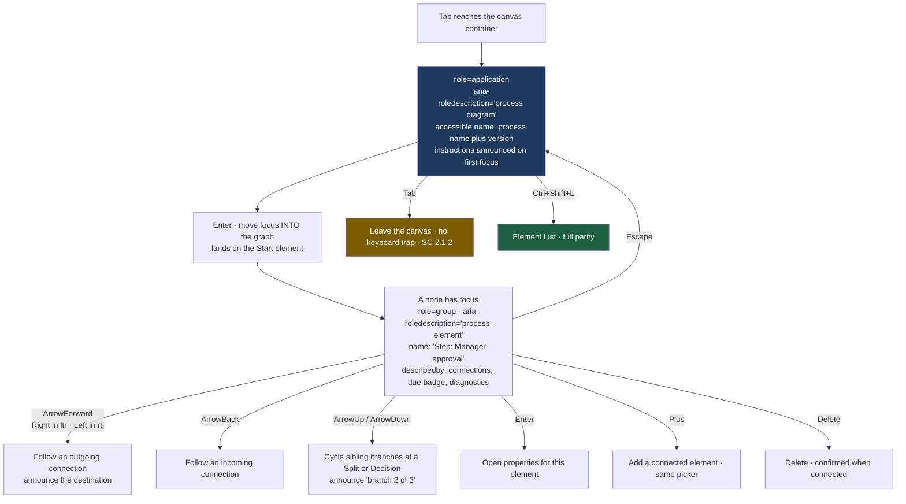
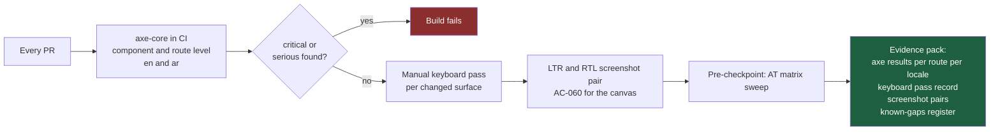

# ConnectBPM — Accessibility Specification

**Product**: ConnectBPM · **Task**: DESIGN-01 · **Date**: 2026-08-20
**Author**: UI/UX Designer, ConnectSW
**Standard**: **WCAG 2.1 Level AA**, verified in **both** `ltr` and `rtl`
**Binding inputs**: `NFR-012` (0 critical/serious, both directions; single-task view keyboard-operable)
· `NFR-013` · `AC-067`, `SC-018` · ADR-006 §C4 · `.claude/protocols/i18n.md`

---

## 1. Why this is a procurement document as much as a design document

ConnectBPM is sold to compliance-conscious organisations. Accessibility appears in their procurement
questionnaires beside encryption and data residency, and the `/security` page already exists to stop
those questions arriving as surprises (`FR-137`, `AC-104`). An unanswerable accessibility question is
the same class of deal risk as an unanswerable hosting question.

It is also a design constraint with a hard edge: **a drag-and-drop-only process designer is
inaccessible**, and the designer is the product's differentiator. §3 is the answer to that, and it is
the longest section here for that reason.

**Target**: 0 critical and 0 serious violations on every shipped surface, in `en` and `ar`
(`AC-067`, `SC-018`). Moderate and minor findings are logged with a decision, never silently carried.

---

## 2. Conformance model

| Layer | What it covers | Verified by |
|---|---|---|
| **Tokens** | Contrast, focus indication, target size, motion | Contrast calculation (`design-system.md` §3–§5), all values published |
| **Primitives** | `@connectsw/ui` components already ship ARIA and focus behaviour | Reused, not re-implemented (Article II) |
| **Compositions** | The nine new ConnectBPM components | This document |
| **Surfaces** | The 66 MVP routes | `axe` sweep per route per locale + manual keyboard pass |

Three criteria carry the most risk in this product and are called out individually below: **2.1.1
Keyboard** (the canvas, §3), **1.4.10 Reflow** (the canvas again, §7.3), and **4.1.3 Status Messages**
(validation, quota refusal and claim races, §6).

---

## 3. The canvas — keyboard operability

### 3.1 The position

> **The canvas is one of two peer editing surfaces, not the editing surface with a fallback.**
> Everything a definition can express is authorable from the **Element List**, and the Element List is
> reachable at every viewport width. ADR-006 §Decision 5 commits to this; here it is specified.

The distinction matters. A "keyboard fallback" is typically a degraded subset that drifts out of
parity with the real editor. A **peer surface** is held to the same completeness test — `AC-094`,
all 15 gallery templates modellable — and that test is run against the Element List as well as the
canvas.

### 3.2 The Element List

Reached by `Ctrl` + `Shift` + `L` from anywhere in the designer, by a visible toggle in the header,
and automatically below the `lg` breakpoint (`design-system.md` §6).

**Structure.** A flat list in **topological order from the Start element**, not a tree. A process
graph has joins and legal cycles (`FR-046`, `FR-047`), so a tree would misrepresent it; each row
instead exposes its incoming and outgoing connections explicitly.

| Row element | Content |
|---|---|
| Position | "3 of 9" |
| Type | The customer-facing element name — Start, Step, Decision, Split, Join, Finish, Schedule |
| Label | Tenant-authored, `dir="auto"`, isolated (`rtl-and-i18n.md` §8.1) |
| Summary | The element's decisive property: assignment rule, condition count, branch count, recurrence, outcome label |
| Connections | "From: Submit request. To: Above threshold?" — each a link that moves focus to that row |
| Attachments | E5 badge state for a Step: "Due in 2 working days, 1 reminder, cancels the step" |
| Diagnostics | Error and warning counts, with the same text as the ValidationPanel |

**Interaction.** One Tab stop for the whole list, roving `tabindex` across rows. `ArrowUp`/`ArrowDown`
move; `Home`/`End` jump; type-ahead matches the label. `Enter` opens the row's command menu:

| Command | Effect |
|---|---|
| **Add element after this one** | Opens the 7-item picker as a listbox. Insertion connects automatically — the same primary path as the canvas `+` (`designer-canvas-ux.md` §4.1) |
| **Connect to element…** | A listbox of **legal targets only**, filtered by the connection matrix in `designer-canvas-ux.md` §4.2, each named by its label |
| **Remove connection…** | Lists existing outgoing connections by target label |
| **Edit properties** | Moves focus into the properties panel, first field |
| **Attach due date and reminder** | E2 only; creates or edits the E5 badge |
| **Delete element** | Confirms when the element has connections, naming what will be disconnected |
| **Show on canvas** | Selects and centres the node — for keyboard users who can see, and for screen-magnifier users |

Adding a Split/Join always creates the matched pair (`designer-canvas-ux.md` §4.3), so the most
common structural error is unreachable from this surface too.

### 3.3 The canvas as a keyboard surface

Four rules that make `role="application"` defensible rather than dangerous:

1. **It is entered deliberately** (`Enter`) and left deliberately (`Escape`, then `Tab`). It is never
   a region a user falls into.
2. **Instructions are announced on first focus** each session, and are available at any time from the
   container.
3. **There is no keyboard trap** (SC 2.1.2). `Tab` from the container always exits.
4. **The Element List exists**, so a user for whom `application` semantics work badly with their AT
   has a surface built from ordinary list semantics.

**Direction awareness.** "Forward" follows the *flow*, and under `ar` the flow runs right to left, so
`ArrowLeft` moves forward. The arrow key is bound to the projected direction, not to a fixed
`Right = next`. This is the keyboard counterpart of the coordinate projection in
`rtl-and-i18n.md` §6 and is verified in both locales.

### 3.4 Character-key shortcuts — SC 2.1.4

Single-character shortcuts (`+`, `Delete`, arrow keys) are **active only while the canvas or the
Element List has focus**, which is the exception SC 2.1.4 permits. No single-character shortcut is
active at the document level anywhere in the product. All multi-key shortcuts use a modifier.

---

## 4. Keyboard map

### 4.1 Global

| Key | Action |
|---|---|
| `Tab` / `Shift+Tab` | Move through the focus order |
| `Skip to content` | First Tab stop on every page, visible on focus, including `chromeless` mode |
| `Esc` | Close the topmost overlay and return focus to its trigger |
| `Ctrl` + `/` | Show the keyboard shortcut reference |

### 4.2 Designer

| Key | Action |
|---|---|
| `Ctrl` + `Shift` + `L` | Toggle canvas ⇄ Element List |
| `Enter` on the canvas container | Enter the graph at Start |
| Arrow keys | Traverse, direction-aware (§3.3) |
| `+` | Add a connected element |
| `Enter` on a node | Open properties |
| `Delete` | Delete, confirmed when connected |
| `Ctrl` + `Shift` + `V` | Validate |
| `Esc` | Return focus to the canvas container |

### 4.3 Task view — must be completable by keyboard alone (`NFR-012`, `AC-067`)

| Key | Action |
|---|---|
| `Tab` | Question → context → summary disclosure → each editable field → action bar |
| `Enter` / `Space` on an outcome | Activate. Comment-required outcomes move focus to the textarea |
| `Esc` in the comment sheet | Cancel, preserve typed text, return focus to the outcome button |

**Focus is never obscured by the sticky action bar.** The scroll container sets
`scroll-padding-block-end: 88px` (bar height 72 px + 16 px), so a focused field scrolled into view
never lands underneath it. This is the most common defect introduced by sticky bars and it is
designed out rather than tested for.

---

## 5. Focus management

| Situation | Rule |
|---|---|
| Overlay opens | Focus moves to the overlay's first focusable element or its heading; focus is trapped inside; `Esc` closes and **returns focus to the trigger** |
| Validation fails | Focus moves to the first invalid field (`AC-084`) or the first error entry (`AC-089`) |
| "Go to element" | Selects, centres, and moves focus to the node; the node is linked by `aria-describedby` to its error text |
| Route change | Focus moves to the page `h1`, which is programmatically focusable and not in the tab order |
| Content inserted (comment sheet, picker) | Focus moves into it; removing it returns focus to the origin |
| Async completion | Focus stays put; the result is announced (§6). Focus never jumps under the user |
| Focus indicator | Dual-contour ring, ≥ 3:1 against every adjacent colour (`design-system.md` §5.4). Never removed, never `outline: none` without a replacement, and **never suppressed on the canvas**, where pointer and keyboard selection must look identical for magnifier users |

---

## 6. Status messages — SC 4.1.3

Three live regions, no more, each with a defined owner. Extra live regions cause double announcements
and are treated as defects.

| Region | Politeness | Announces |
|---|---|---|
| Global status | `polite` | Save confirmations, autosave state, claim results, quota threshold notices |
| Validation | `polite` on count change · **`assertive` on a failed publish attempt** | "3 errors. Decision *Above threshold?* has no default path." |
| Canvas navigation | `polite` | The newly focused element on every arrow-key move, including branch position: "Decision: Above threshold? Branch 2 of 3." |

Specific announcements the acceptance criteria depend on:

- **Quota refusal** (`FR-114`): announced assertively and rendered as a page, never a toast. It is a
  commercial event, and a toast can be missed
- **Claim lost** (`AC-073`): "Sara Al-Mansouri claimed this task 2 seconds ago" — a name, not "error"
- **Publish success**: version number and checksum announced, checksum spelled out in a form a screen
  reader renders character by character
- **Withdrawn task** (`task-inbox-ux.md` §7): announced assertively; the entered data stays available

---

## 7. Presentation

### 7.1 Colour and contrast

All values are published and measured in `design-system.md` §3–§5. Summary of the floors this product
holds itself to:

| Requirement | WCAG | ConnectBPM |
|---|---|---|
| Body text | 4.5:1 | 4.76:1 minimum measured, most tokens ≥ 5.5:1 |
| Large text | 3:1 | ≥ 4.5:1 — the large-text allowance is not used |
| Non-text (borders, node strokes, edges, focus) | 3:1 | ≥ 3.44:1 measured; node strokes 6.92:1 light / 7.30:1 dark |
| Colour not the only channel (1.4.1) | — | Every status token is `{ fill, icon, label }`; the set is greyscale-distinguishable |

### 7.2 Target size and spacing

**44 × 44 CSS px** for every interactive element on every surface. WCAG 2.1 AA contains no target-size
criterion — 2.5.5 is AAA — and ConnectBPM adopts the AAA figure as a product standard because the
retention persona arrives on a phone. The single exception is canvas connection handles at
**24 × 24 px** with 24 px spacing, where a larger target would occlude the node; every function
reachable through a handle is also reachable from the Element List, so nothing depends on hitting one.

### 7.3 Reflow, zoom and text spacing — SC 1.4.10, 1.4.4, 1.4.12

| Criterion | Behaviour |
|---|---|
| **1.4.10 Reflow** | Every surface reflows to a 320 px equivalent (400% zoom at 1280 px) with no two-dimensional scrolling — **except the canvas**, which takes the criterion's explicit exception for content requiring two-dimensional layout. **That exception is only honest because the Element List provides the same function without it, and below `lg` the Element List is what renders.** This is the conformance argument to give in a procurement questionnaire |
| **1.4.4 Resize text** | 200% without loss of content or function. All type is in `rem` against a 16 px root; nothing uses `px` for type |
| **1.4.12 Text spacing** | Line height 1.5×, paragraph spacing 2×, letter spacing 0.12em, word spacing 0.16em applied without clipping. **Under `[lang="ar"]` the letter-spacing part of this user override is neutralised**, because positive tracking breaks Arabic joining (`rtl-and-i18n.md` §5.2). This is a documented, deliberate deviation in the user's interest, recorded here rather than discovered by an auditor |

### 7.4 Motion — SC 2.3.3, 2.2.2

`prefers-reduced-motion: reduce` sets every duration to 1 ms and disables canvas easing and pan
inertia. It never removes a state change, only its transition. Nothing autoplays, nothing flashes,
nothing moves for longer than 5 seconds without a control. The canvas never animates a locale-driven
mirror (`design-system.md` §5.5).

### 7.5 Forms — SC 1.3.1, 3.3.1, 3.3.2, 3.3.3

Every control has a persistent visible `<label>` programmatically associated with it. Placeholder
text is never a label. Required fields are marked in text as well as symbolically. Errors are
identified in text, adjacent to the field, linked by `aria-describedby`, and describe the fix — "Enter
an amount greater than 0", not "Invalid". The 11 field types of `FR-031` each use the native control
where one exists; a custom control ships the full ARIA pattern or it does not ship.

---

## 8. Structure and semantics

| Area | Rule |
|---|---|
| Headings | One `h1` per route, no level skipped. The task view's `h1` **is** the question (`task-inbox-ux.md` §3.1) |
| Landmarks | `banner`, `navigation`, `main`, `contentinfo`. In `chromeless` mode only `main` — but `main` is always present |
| Tables | `DataTable` emits real `<table>` with `<th scope>`; sortable headers expose `aria-sort` |
| Lists | Inbox, element list and evidence timeline are real lists, so AT announces counts |
| Links vs buttons | Navigation is `<a>`; action is `<button>`. Never a `div` with a click handler |
| Icon-only controls | Accessible name via `aria-label`; icons beside their own text are `aria-hidden` |
| `dir` and `lang` | Set server-side on `<html>` (`rtl-and-i18n.md` §2.2). Tenant-authored content is isolated and `dir="auto"` |
| Page titles | Unique and front-loaded: "Approve purchase request PR-2291 · ConnectBPM" |

### 8.1 A limitation stated plainly — SC 3.1.2 Language of Parts

`FR-147` stores tenant-authored content in whatever language the author typed, and does not record
which language that is. ConnectBPM therefore **cannot** set `lang` on tenant-authored strings, and a
screen reader may pronounce an Arabic Step name inside an English page with an English voice.

- **What is done**: `dir="auto"` plus bidi isolation gives correct visual order and correct
  punctuation placement in every case
- **What is not done**: no language detection. A heuristic that guesses wrong is worse than a stated
  gap, because it produces confidently mispronounced content
- **Where it is fixed**: whenever `FR-147` gains an authored-language field. ConnectSW-authored chrome
  and the 15 gallery templates are unaffected — they ship in both languages and carry correct `lang`
- **Where it is recorded**: here, and in the procurement answer in §10. A known, documented gap is a
  defensible position; an undocumented one is a finding

---

## 9. Verification

### 9.1 What automation cannot catch

`axe` finds roughly a third of real barriers. These are manual, per surface, per locale, and each has
a named owner in the checkpoint checklist:

1. Complete one task end to end with the keyboard alone (`AC-067`) — in `en` **and** `ar`
2. Build a three-element process using the Element List only, with no pointer
3. Traverse a Split/Join process on the canvas by keyboard and confirm branch announcements
4. Confirm focus order matches visual order in `rtl`, where a wrong `order` value is invisible in `ltr`
5. Confirm the focus ring is visible on every background, including on primary and danger buttons
6. Confirm the sticky action bar never obscures a focused field
7. Confirm reduced motion removes transitions and no state
8. Confirm Arabic renders correctly with the primary webfont blocked (`AC-068`)

### 9.2 Assistive technology matrix

| AT | Browser | Locale | Surfaces |
|---|---|---|---|
| NVDA | Firefox | `en` | All |
| NVDA + Arabic voice | Firefox | `ar` | Task view, inbox, designer, evidence |
| JAWS | Chrome | `en` | Designer, evidence export |
| VoiceOver | Safari macOS | `en` | All |
| VoiceOver | iOS Safari | `en`, `ar` | **Task view — the retention path, both directions** |
| TalkBack | Android Chrome | `en`, `ar` | Task view |
| Keyboard only, no AT | Chrome | `en`, `ar` | All |
| 400% zoom | Chrome | `en`, `ar` | All non-canvas surfaces |
| Forced colours / high contrast | Edge | `en` | All — verifies the non-shadow elevation fallbacks |

---

## 10. The procurement answer

When a questionnaire asks, this is the answer and these are the artifacts behind it:

| Question | Answer |
|---|---|
| Conformance target | WCAG 2.1 Level AA, verified in English and Arabic, left-to-right and right-to-left |
| Evidence | `axe` results per route per locale; a recorded manual keyboard pass; LTR/RTL screenshot pairs; an AT matrix sweep; a known-gaps register |
| Is the visual designer keyboard accessible? | Yes. The canvas is keyboard-navigable, and a peer **Element List** surface provides complete authoring without a pointer at any viewport width. Both are held to the same completeness test |
| Does any function require drag and drop? | **No.** Every element can be added, connected, configured, validated and published without a pointer |
| Does the product reflow to 320 px? | Yes, on every surface. The canvas takes SC 1.4.10's two-dimensional-layout exception; the Element List provides the same function and is what renders below 1024 px |
| Known limitations | `lang` is not set on tenant-authored content because the authored language is not recorded (§8.1). Direction and bidi isolation are handled correctly |
| Target size | 44 × 44 px throughout — above the AA requirement, which has none. Canvas connection handles are 24 × 24 px with a keyboard equivalent |

---

## 11. Acceptance criteria for this specification

| # | Criterion | Method | Traces |
|---|---|---|---|
| A-1 | 0 critical and 0 serious `axe` violations on every shipped surface, `en` and `ar` | GATE | `AC-067`, `SC-018` |
| A-2 | Single-task view completed end to end by keyboard alone, both locales | MANUAL | `NFR-012`, `AC-067` |
| A-3 | A complete definition authored using the Element List only, no pointer | MANUAL | ADR-006 C4 |
| A-4 | Canvas arrow-key traversal follows flow direction correctly in both locales | MANUAL | §3.3 |
| A-5 | No keyboard trap on any surface, canvas included | AUTO + MANUAL | SC 2.1.2 |
| A-6 | Focus indicator ≥ 3:1 against every adjacent colour, measured | Calculation | SC 1.4.11 |
| A-7 | Focus never obscured by the sticky action bar | MANUAL | §4.3 |
| A-8 | All surfaces reflow to 320 px without 2D scrolling, canvas excepted per §7.3 | MANUAL | SC 1.4.10 |
| A-9 | Text spacing overrides apply without clipping; Arabic letter-spacing neutralised | MANUAL | SC 1.4.12, §7.3 |
| A-10 | Reduced motion removes transitions and no state | MANUAL | SC 2.3.3 |
| A-11 | Exactly three live regions; no double announcement | MANUAL | SC 4.1.3 |
| A-12 | Every status distinguishable in greyscale | MANUAL | SC 1.4.1 |
| A-13 | No single-character shortcut active at document level | AUTO | SC 2.1.4 |
| A-14 | Known-gaps register exists and includes §8.1 | Review | §8.1 |

---

## Document history

| Version | Date | Author | Change |
|---|---|---|---|
| 1.0 | 2026-08-20 | UI/UX Designer | Initial specification for DESIGN-01. Canvas keyboard model, Element List peer surface, procurement answers. |
