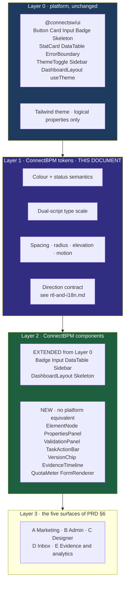
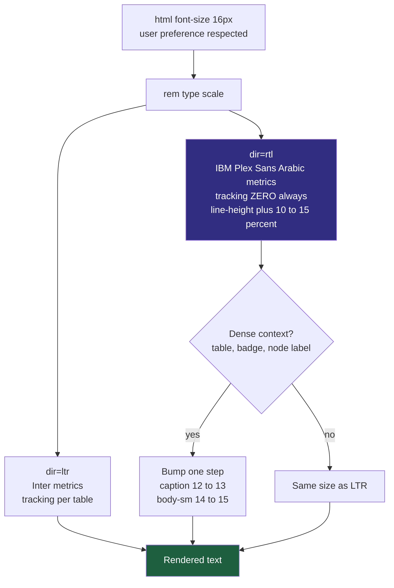
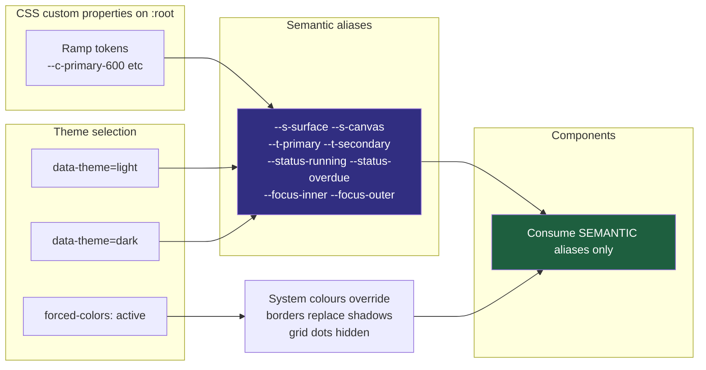

# ConnectBPM — Design System

**Product**: ConnectBPM · **Task**: DESIGN-01 · **Date**: 2026-08-20
**Author**: UI/UX Designer, ConnectSW
**Status**: Normative for FE-xx implementation tasks.
**Binding inputs**: `CEO-DECISIONS.md` DEC-001, DEC-002 · `PRD.md` §6 site map, §7.5, `NFR-012`,
`NFR-013` · `ADRs/006-designer-canvas-library.md` · `ADRs/001-process-notation-and-scope-amd-001.md`
· `.claude/protocols/i18n.md` · `.claude/COMPONENT-REGISTRY.md` (Article II)

> **How to read this.** Every value here is a token, and every token has a measured number attached.
> There are no adjectives in the acceptance criteria. If a rule cannot be checked by a linter, an
> `axe` run, a contrast calculation or a stopwatch, it is not in this document.
>
> Companion documents: `rtl-and-i18n.md` (direction and locale), `designer-canvas-ux.md` (the
> canvas), `task-inbox-ux.md` (the 60-second surface), `accessibility.md` (WCAG 2.1 AA).

---

## 1. What this system is built on

ConnectBPM does **not** get a new component library. Article II makes reuse constitutional, and
`@connectsw/ui` is already in production across ConnectSW products. This system is a **token layer
plus seven product-specific components** on top of it.



### 1.1 Reuse ledger — Article II

The Frontend Engineer implements this table literally. A component in the **REUSE AS-IS** column that
acquires a ConnectBPM-only prop is a defect against Article II; raise it here first.

| `@connectsw/ui` component | Verdict | What ConnectBPM needs |
|---|---|---|
| **Button** | **REUSE AS-IS** | The five variants (primary, secondary, outline, ghost, danger) cover every action in the site map. Outcome actions on a Step are `primary` and `danger` instances, not a new variant. Focus ring per §5.4 is a token change, not a component change. |
| **Card** | **REUSE AS-IS** | Used for tier cards, template cards, analytics cards, evidence entries. |
| **Skeleton** | **EXTEND** | Add a `canvas` variant: a static node-and-edge lattice used while a definition loads, so the designer does not flash an empty grid. Existing `text`/`circular`/`rectangular`/`rounded` variants unchanged. |
| **Input** | **EXTEND** | Add `dir="auto"` pass-through and a `machineKey` affordance (a monospaced, LTR-locked, copyable suffix) required by `FR-032` and `FR-149`. Both are additive props with LTR-safe defaults. |
| **Badge** | **EXTEND** | Add the ConnectBPM status set (§4). The platform's `default/success/warning/info/danger` remain; ConnectBPM adds `running`, `suspended`, `cancelled`, `expired`, `fault`, `draft`, `published`, `test`, `overdue`, `due-soon`. Each carries an icon slot, because colour must never be the only channel (WCAG 1.4.1). |
| **StatCard** | **REUSE AS-IS** | Exactly the four numbers of `FR-126` on `/app/analytics/[processId]`. |
| **DataTable** | **EXTEND** | Add (a) a sticky first column for RTL-safe row identity, (b) a `groupBy` header row for `FR-127` version grouping, (c) an `emptyState` slot that renders a real empty state rather than zeros (`FR-128`). |
| **ErrorBoundary** | **REUSE AS-IS** | Wraps the canvas and the form renderer. Fallback carries the correlation ID for `NFR-017`. |
| **ThemeToggle** | **REUSE AS-IS** | |
| **Sidebar** | **EXTEND** | Add role-filtered sections. A Participant's sidebar contains surface D only, and surfaces B/C/E are **absent, not disabled** (`FR-084`, `AC-087`). |
| **DashboardLayout** | **EXTEND** | Add a `chromeless` mode for `/app/inbox/[taskId]`. `AC-080` forbids a dashboard, a task list and navigation chrome on that route, so the layout must be able to render its skip-link and live region **without** the shell. |
| **useTheme** | **REUSE AS-IS** | |

**New components — no platform equivalent exists.**

| New component | Route(s) | Why it cannot be composed from Layer 0 |
|---|---|---|
| `ElementNode` (×7) | `/app/processes/[id]/design` | The seven-element visual language (§4.5, `designer-canvas-ux.md` §3). ADR-006 makes the node registry a closed map, which is how `FR-011` is enforced. |
| `PropertiesPanel` | designer | Element-typed forms with a BPMN-mapping disclosure (`FR-012`). |
| `ValidationPanel` | designer | `FR-017` requires errors that name the element and highlight it; a generic alert list is non-compliant. |
| `TaskActionBar` | `/app/inbox/[taskId]` | Sticky, safe-area-aware outcome bar. It is the mechanism by which the 60-second median is met (`task-inbox-ux.md` §4). |
| `VersionChip` | designer, instances, evidence | `FR-019` requires the executing version to be visible on the instance and in every export. |
| `EvidenceTimeline` | `/app/instances/[id]/evidence` | Ordered, immutable, hash-chained entries with field-level deltas — a table cannot express the chain or the verify action (`FR-091`). |
| `QuotaMeter` | `/app/settings/usage`, `/app/quota` | Reservation-aware: held reservations are shown distinctly from converted completions (`FR-113`). |
| `FormRenderer` | start forms, task forms, previews | Version-pinned rendering of the 11 field types of `FR-031`, with per-Step read-only / editable / hidden (`FR-039`). |

---

## 2. Design principles, in priority order

Ties are broken by the lower number.

| # | Principle | Concrete test |
|---|---|---|
| 1 | **Evidence legibility** | Any state a viewer could later be asked to justify — version, actor, timestamp, outcome — is visible on the surface, not one click away. No surface displays a status without also displaying the version that produced it. |
| 2 | **Accessibility** | 0 critical/serious `axe` violations in `en` **and** `ar` (`NFR-012`, `AC-067`); every task completable by keyboard alone. |
| 3 | **Direction parity** | Every component renders correctly under `dir="rtl"` with no direction-specific stylesheet. Physical CSS properties fail the build (`AC-059`). |
| 4 | **Sixty seconds** | Nothing may be added to `/app/inbox/[taskId]` that increases median completion time. This route has a budget, not a wish (`SC-006`, `AC-081`). |
| 5 | **Small vocabulary** | Seven elements, five semantic colours, one type scale, one spacing grid. The designer persona (S-05) is "not a programmer" and holds the palette in their head. |
| 6 | **Reuse before invention** | Article II. The ledger in §1.1 is the whole permitted surface of new components. |

---

## 3. Colour

Base ramps are the Tailwind `indigo` and `slate` scales (Article V default stack), so no bespoke ramp
has to be maintained. What is ConnectBPM-specific is the **semantic assignment** in §4.

### 3.1 Brand and neutral

| Token | Hex | Role |
|---|---|---|
| `--c-primary-50` | `#EEF2FF` | Tint fills, selected-row background |
| `--c-primary-100` | `#E0E7FF` | Hover tint |
| `--c-primary-300` | `#A5B4FC` | Dark-theme text and links |
| `--c-primary-400` | `#818CF8` | Dark-theme selection stroke |
| `--c-primary-500` | `#6366F1` | Light-theme chip border |
| `--c-primary-600` | `#4F46E5` | **Primary action fill**, light-theme selection stroke |
| `--c-primary-700` | `#4338CA` | Primary hover, light-theme link text |
| `--c-primary-800` | `#3730A3` | Primary active |
| `--c-neutral-50` | `#F8FAFC` | App background (light) |
| `--c-neutral-100` | `#F1F5F9` | **Canvas background (light)**, disabled fill |
| `--c-neutral-300` | `#CBD5E1` | Decorative rules, canvas grid |
| `--c-neutral-400` | `#94A3B8` | Dark-theme borders and tertiary text |
| `--c-neutral-500` | `#64748B` | Light-theme borders, placeholder |
| `--c-neutral-600` | `#475569` | Light-theme secondary text, node stroke |
| `--c-neutral-800` | `#1E293B` | Dark surface, dark node fill |
| `--c-neutral-900` | `#0F172A` | Light-theme primary text, dark app background |
| `--c-canvas-dark` | `#0B1220` | **Canvas background (dark)** — one step below the app background so the canvas reads as a distinct working plane |

### 3.2 Surfaces

| Token | Light | Dark |
|---|---|---|
| `--s-app` | `#F8FAFC` | `#0F172A` |
| `--s-surface` | `#FFFFFF` | `#1E293B` |
| `--s-canvas` | `#F1F5F9` | `#0B1220` |
| `--s-inverse` | `#0F172A` | `#F8FAFC` |

### 3.3 Measured contrast — light theme

Computed with the WCAG 2.x relative-luminance formula. **AA text floor is 4.5:1** (3:1 for text
≥24 px or ≥18.66 px bold); **non-text floor is 3:1** (WCAG 1.4.11).

| Foreground | Hex | on `--s-surface` | on `--s-app` | on `--s-canvas` | Verdict |
|---|---|---:|---:|---:|---|
| Text primary (`neutral-900`) | `#0F172A` | **17.85** | 17.06 | 16.30 | PASS |
| Text secondary (`neutral-600`) | `#475569` | **7.58** | 7.24 | 6.92 | PASS |
| Text tertiary (`neutral-500`) | `#64748B` | **4.76** | 4.55 | 4.34 | PASS (floor) |
| Link / primary text (`primary-700`) | `#4338CA` | **7.90** | 7.55 | 7.21 | PASS |
| Success text (`emerald-700`) | `#047857` | **5.48** | 5.24 | 5.01 | PASS |
| Warning text (`amber-700`) | `#B45309` | **5.02** | 4.80 | 4.58 | PASS |
| Danger text (`red-700`) | `#B91C1C` | **6.47** | 6.18 | 5.91 | PASS |
| Info text (`sky-700`) | `#0369A1` | **5.93** | 5.67 | 5.42 | PASS |
| Evidence accent (`violet-700`) | `#6D28D9` | **7.10** | 6.79 | 6.49 | PASS |

White text on solid fills: `primary-600` **6.29**, `primary-700` **7.90**, `emerald-700` **5.48**,
`amber-700` **5.02**, `red-700` **6.47**, `sky-700` **5.93**, `slate-600` **7.58**,
`violet-700` **7.10**. All PASS.

### 3.4 Measured contrast — dark theme

| Foreground | Hex | on `--s-surface` `#1E293B` | on `--s-app` `#0F172A` | on `--s-canvas` `#0B1220` |
|---|---|---:|---:|---:|
| Text primary (`neutral-50`) | `#F8FAFC` | **13.98** | 17.06 | 17.89 |
| Text secondary (`neutral-300`) | `#CBD5E1` | **9.85** | 12.02 | 12.61 |
| Text tertiary (`neutral-400`) | `#94A3B8` | **5.71** | 6.96 | 7.30 |
| Link (`primary-300`) | `#A5B4FC` | **7.34** | 8.96 | 9.39 |
| Success (`emerald-400`) | `#34D399` | **7.61** | 9.29 | 9.74 |
| Warning (`amber-400`) | `#FBBF24` | **8.76** | 10.69 | 11.22 |
| Danger (`red-400`) | `#F87171` | **5.29** | 6.45 | 6.77 |
| Info (`sky-400`) | `#38BDF8` | **6.83** | 8.33 | 8.74 |
| Evidence (`violet-400`) | `#A78BFA` | **5.38** | 6.56 | 6.88 |

### 3.5 Three contrast failures found during token selection — do not reintroduce

These were measured, failed, and were corrected. They are recorded because they are the values a
developer reaches for by habit.

| Rejected value | Measured | Required | Replacement |
|---|---:|---:|---|
| `slate-400` `#94A3B8` as a **light-theme** border or node stroke | **2.34** vs canvas, **2.56** vs surface | 3:1 | `slate-500` `#64748B` (4.34 / 4.76) for borders; `slate-600` `#475569` (6.92) for node strokes |
| `amber-600` `#D97706` as an **overdue** border on the canvas | **2.91** vs canvas | 3:1 | `amber-700` `#B45309` (4.58) |
| A single-contour focus ring in `primary-700` on a `primary-600` button | **1.26** | 3:1 | Dual-contour ring, §5.4 |

The canvas **grid dots** (`neutral-300` on `--s-canvas`, **1.36**) intentionally fail 3:1 and are
therefore classified as **decorative**: they carry no information, are never the only cue for
anything, and are hidden entirely under `prefers-reduced-motion` snapping and under high-contrast
forced-colours mode.

---

## 4. Semantic status colour

Colour is never the sole channel. **Every status token is a triple: `{ fill, icon, label }`.** A
badge that renders without its icon is a defect (WCAG 1.4.1). The label text is the i18n key, so the
same badge reads correctly in `ar`.

### 4.1 Instance status — `InstanceStatus` × `TerminalReason`

The billable/non-billable distinction (DEC-002, DEC-004) is a **revenue** fact, so it is displayed,
never inferred from colour alone.

| Status | Icon | Light fill / text | Dark fill / text | Contrast | Billable |
|---|---|---|---|---:|---|
| `RUNNING` | arrow-in-circle | `#F0F9FF` / `#0369A1` | `#082F49` / `#7DD3FC` | 5.57 / 8.32 | pending |
| `SUSPENDED` | pause | `#F1F5F9` / `#334155` | `#1E293B` / `#CBD5E1` | 9.45 / 9.85 | pending |
| `COMPLETED` | check-circle | `#ECFDF5` / `#047857` | `#052E26` / `#6EE7B7` | 5.21 / 9.67 | **yes** |
| `CANCELLED`, ≥1 Step completed | slash-circle | `#FFFBEB` / `#92400E` | `#3A2205` / `#FCD34D` | 6.84 / 10.32 | **yes** (DEC-004) |
| `CANCELLED`, 0 Steps completed | slash-circle | `#F1F5F9` / `#334155` | `#1E293B` / `#CBD5E1` | 9.45 / 9.85 | no |
| `EXPIRED` | hourglass | `#FFFBEB` / `#92400E` | `#3A2205` / `#FCD34D` | 6.84 / 10.32 | **yes** |
| `FAULT_TERMINATED` | alert-octagon | `#FEF2F2` / `#B91C1C` | `#3B0A0A` / `#FCA5A5` | 5.91 / 8.97 | **never** |

`COMPLETED` covers negative outcomes. A rejected request is green-badged `COMPLETED` with its
outcome label — "Rejected" — rendered adjacent in text. This is deliberate and matches DEC-004's
requirement that the pricing page state it in plain language: the badge must not imply "approved".
The outcome label, not the badge colour, carries the business result.

Tinted badges have a **1px border** because the tint itself is only 1.04–1.12 against the surface and
would be invisible to a low-vision user: `emerald-600` `#059669` (3.77 vs surface), `red-600`
`#DC2626` (4.83), `sky-600` `#0284C7` (4.10), `slate-500` `#64748B` (4.76), `amber-700` `#B45309`
(5.02 — `amber-600` fails at 3.19 on canvas, see §3.5). All ≥3:1.

### 4.2 Task status — `TaskStatus`

| Status | Icon | Semantic token |
|---|---|---|
| `OPEN` (assigned to me) | inbox | `primary` |
| `OPEN` (claimable queue) | hand-raised | `info` |
| `CLAIMED` | user-check | `info` |
| `COMPLETED` | check | `success` |
| `WITHDRAWN` | x-circle | `neutral` — never rendered as a completion (`FR-058`) |
| `REASSIGNED` | arrow-right-left | `neutral`, **mirrors in RTL** (see `rtl-and-i18n.md` §4) |

### 4.3 SLA / due state — the only time-sensitive palette

| State | Threshold | Icon | Token | Light contrast |
|---|---|---|---|---:|
| `ON_TIME` | > 25% of the window remaining | clock | `neutral` text `#475569` | 7.58 |
| `DUE_SOON` | ≤ 25% remaining, not past due | clock-alert | `amber-700` `#B45309` | 5.02 |
| `OVERDUE` | past the due instant | clock-x | `red-700` `#B91C1C` | 6.47 |
| `BREACHED` | instance-level SLA breached (`FR-025`) | flag | `red-700` + solid `red-700` fill, white text | 6.47 |

`DUE_SOON` and `OVERDUE` additionally carry a **relative-time string** ("in 3 hours" / "2 days
overdue") next to an absolute tenant-local time on hover and on focus. Relative time alone is not
sufficient for an evidence product; absolute time alone is not sufficient for a 60-second decision.

### 4.4 Definition lifecycle

| State | Visual | Rule |
|---|---|---|
| `DRAFT` | dashed 2px `slate-500` outline chip, `neutral` token | Editable. The palette is present. |
| `PUBLISHED` | solid chip, `violet-700` (`--c-evidence`) + lock icon | **Immutable** (`FR-014`). The palette is **removed from the DOM**, not disabled. |
| `TEST RUN` | solid `violet-700` chip reading "Test run — not billable" | `FR-029`, `FR-106`. The non-billable statement is part of the chip, not a tooltip. |

`--c-evidence` (`violet-700` / `violet-400`) is reserved. It marks exactly three things: a published
immutable version, an evidence record, and a hash-chain verification result. It is never used
decoratively, so that "purple means this is on the record" is learnable in one session.

### 4.5 Element colour — the seven

Element identity is carried by **silhouette first, colour second**. Verified by printing the palette
in greyscale: all seven remain distinguishable. Full geometry is in `designer-canvas-ux.md` §3.

| # | Element | Silhouette | Stroke (light / dark) | Accent |
|---|---|---|---|---|
| E1 | Start | circle, 2px stroke | `#475569` / `#94A3B8` | `emerald-700` fill ring |
| E2 | Step | rounded rectangle, `radius-lg` | `#475569` / `#94A3B8` | `primary-600` icon |
| E3 | Decision | rectangle with a notched leading edge | `#475569` / `#94A3B8` | `amber-700` icon |
| E4 | Split / Join | rectangle with a doubled leading rule | `#475569` / `#94A3B8` | `sky-700` icon |
| E5 | Due date and reminder | **badge attached to an E2**, not a free node | `#B45309` / `#FBBF24` | interrupting = solid ring; non-interrupting = dashed ring |
| E6 | Finish | circle, 4px stroke | `#475569` / `#94A3B8` | `slate-600` fill ring |
| E7 | Schedule | circle with a clock glyph, 2px stroke | `#475569` / `#94A3B8` | `violet-700` icon |

Node stroke on canvas measures **6.92:1** (light, `slate-600` on `#F1F5F9`) and **7.30:1** (dark,
`slate-400` on `#0B1220`). Selection stroke measures **6.29:1** (light `primary-600` on a white node
fill) and **4.90:1** (dark `primary-400` on `#1E293B`). All exceed the 3:1 non-text floor.

---

## 5. Typography

### 5.1 Font stacks

| Role | Latin | Arabic | Full stack |
|---|---|---|---|
| UI / body | Inter | **IBM Plex Sans Arabic** | `'Inter','IBM Plex Sans Arabic','Noto Sans Arabic',system-ui,-apple-system,'Segoe UI',sans-serif` |
| Numeric / tabular | Inter `tnum` | Inter `tnum` | same stack, `font-variant-numeric: tabular-nums` |
| Code, machine keys, expressions, checksums | IBM Plex Mono | **IBM Plex Mono** (Latin glyphs only, by design) | `'IBM Plex Mono','Courier New',monospace` |

**Why IBM Plex Sans Arabic** rather than Tajawal or Cairo: it is metrically compatible with Inter, so
a bilingual line (an Arabic Step name beside an English machine key) does not shift baseline, and it
is SIL OFL. Harvested from `connectin`, which selected the IBM Plex pairing for the same reason.
Tajawal remains a valid fallback and is named in the i18n protocol; the stack tolerates either.

**`AC-068` — fallback correctness.** `Noto Sans Arabic` is second in the chain and `system-ui` third.
The chain must **never** terminate in a Latin-only face, because the browser then falls back to a
system Arabic face with unpredictable metrics and, on some Linux images, to tofu. The i18n check
verifies the chain by rendering the Arabic pangram
`نص حكيم له سر قاطع وذو شأن عظيم مكتوب على ثوب أخضر ومغلف بجلد أزرق` with the primary webfont
blocked and asserting a non-zero glyph advance for every codepoint.

### 5.2 Type scale — dual metrics

Arabic requires more vertical space for tashkeel and for descenders that Latin does not have. A
single line-height column is the most common Arabic typography bug in this company's history
(harvested from `connectin` §3.4). The scale therefore carries **two line-height columns** and one
letter-spacing rule.

| Token | rem | px | Weight | `line-height` LTR | `line-height` RTL | `letter-spacing` LTR | `letter-spacing` RTL | Use |
|---|---:|---:|---:|---:|---:|---:|---:|---|
| `display` | 3.00 | 48 | 700 | 1.10 | 1.25 | −0.02em | **0** | Marketing hero |
| `h1` | 2.25 | 36 | 700 | 1.20 | 1.35 | −0.02em | **0** | Page title |
| `h2` | 1.875 | 30 | 600 | 1.25 | 1.40 | −0.01em | **0** | Section |
| `h3` | 1.50 | 24 | 600 | 1.30 | 1.45 | −0.01em | **0** | Card title, task question |
| `h4` | 1.25 | 20 | 600 | 1.35 | 1.50 | 0 | **0** | Subsection, node title at 100% zoom |
| `body-lg` | 1.125 | 18 | 400 | 1.60 | 1.80 | 0 | **0** | Task request summary |
| `body` | 1.00 | 16 | 400 | 1.50 | 1.75 | 0 | **0** | Default |
| `body-sm` | 0.875 | 14 | 400 | 1.50 | 1.70 | 0.01em | **0** | Metadata, table cells |
| `caption` | 0.75 | 12 | 400 | 1.40 | 1.60 | 0.02em | **0** | Timestamps, badges |
| `mono-sm` | 0.8125 | 13 | 400 | 1.50 | 1.50 | 0 | 0 | Machine keys, checksums, expressions |

**The RTL letter-spacing column is zero on every row, without exception.** Arabic is a connected
script; positive tracking breaks the joining forms and turns a word into disconnected glyphs. This is
enforced as a lint rule, not a convention (`rtl-and-i18n.md` §5).

Base font size is `16px` and every size is expressed in `rem`, so a user's browser font-size
preference scales the whole product. Nothing in this system uses `px` for type.

**Arabic optical size.** At identical `font-size`, Arabic x-height reads smaller than Latin. In the
three densest contexts only — table cells, badges, and canvas node labels — `[lang="ar"]` bumps one
step: `caption` → 13px, `body-sm` → 15px. This is a token override, not a separate scale.



### 5.3 Spacing, radius, elevation

**4px base, 8px rhythm.** Only these values exist; a `13px` anywhere is a defect.

| Token | px | Use |
|---|---:|---|
| `space-1` | 4 | Icon-to-label |
| `space-2` | 8 | Inside a badge, between form label and control |
| `space-3` | 12 | Compact list rows |
| `space-4` | 16 | **Default gap**, card padding on mobile |
| `space-6` | 24 | Card padding on desktop, section gap |
| `space-8` | 32 | Between major sections |
| `space-12` | 48 | Page top rhythm |
| `space-16` | 64 | Marketing sections |

Canvas geometry is on a **16px snap grid** so that node edges land on the same rhythm as the rest of
the product, and so mirrored coordinates stay integral (`rtl-and-i18n.md` §6).

| Radius | px | Use |
|---|---:|---|
| `radius-sm` | 4 | Badges, chips |
| `radius-md` | 8 | Inputs, buttons |
| `radius-lg` | 12 | Cards, E2 Step nodes |
| `radius-xl` | 16 | Sheets, modals |
| `radius-full` | 9999 | Avatars, E1/E6/E7 circles |

Elevation is **four levels only**, and each has a non-shadow fallback because shadow is invisible in
forced-colours mode:

| Level | Shadow | Non-shadow fallback |
|---|---|---|
| `e0` | none | — |
| `e1` | `0 1px 2px rgb(15 23 42 / .06)` | 1px `neutral-300` border |
| `e2` | `0 4px 12px rgb(15 23 42 / .08)` | 1px `neutral-500` border |
| `e3` | `0 12px 32px rgb(15 23 42 / .16)` | 1px `neutral-500` border + backdrop |

In dark theme shadows are replaced by a `1px` `neutral-700` top border plus a surface-lightening step,
because shadow does not read on `#0F172A`.

### 5.4 Focus — the dual-contour ring

A single-colour ring cannot satisfy 3:1 against both a white page and an indigo button. Measured:
`primary-700` ring on a `primary-600` button is **1.26:1** — a failure that ships in a lot of design
systems. ConnectBPM uses a **dual-contour** ring so that at least one contour always passes:

```
outline: 2px solid var(--focus-outer);   /* #0F172A light · #F8FAFC dark */
outline-offset: 2px;
box-shadow: 0 0 0 2px var(--focus-inner); /* #FFFFFF light · #0F172A dark */
```

| Adjacent colour | Inner contour | Outer contour | Best of the two |
|---|---:|---:|---|
| White surface `#FFFFFF` | 1.00 | **17.85** | PASS |
| `primary-600` button `#4F46E5` | **6.29** | 2.84 | PASS |
| Canvas `#F1F5F9` | 1.10 | **16.30** | PASS |
| Dark surface `#1E293B` | **1.28** vs inner, outer `#F8FAFC` = **13.98** | | PASS |

The ring is **always visible on keyboard focus** and is never suppressed by `:focus:not(:focus-visible)`
on the canvas, where pointer and keyboard selection must look identical so a screen-magnifier user
tracking a mouse still sees the node boundary.

### 5.5 Motion

| Token | Duration | Easing | Use |
|---|---:|---|---|
| `motion-instant` | 0 ms | — | State that must not animate: validation errors, quota refusal, task submission result |
| `motion-fast` | 120 ms | `cubic-bezier(.2,0,.38,.9)` | Hover, focus, badge change |
| `motion-base` | 200 ms | `cubic-bezier(.2,0,.38,.9)` | Panel open/close, sheet, tooltip |
| `motion-slow` | 320 ms | `cubic-bezier(.2,0,0,1)` | Canvas fit-to-view, node centring on a validation-error jump |

**Hard rules.**
1. Nothing on `/app/inbox/[taskId]` uses a duration above `motion-fast`. The 60-second budget cannot
   fund animation.
2. **The canvas never animates a locale-driven mirror.** Switching `en` ⇄ `ar` re-projects the graph
   instantly. An animated flip would read as the diagram changing rather than the view changing.
3. `@media (prefers-reduced-motion: reduce)` sets every duration to `1ms` and disables canvas
   easing and the pan inertia. It never removes a state change — only its transition.

### 5.6 Icons

**Lucide**, 24px grid, 1.5px stroke (harvested from `connectin` §7.1 — an existing ConnectSW choice,
ISC-licensed, and it already contains every glyph named in §4).

| Size token | px | Use |
|---|---:|---|
| `icon-xs` | 14 | Inside `caption` badges |
| `icon-sm` | 16 | Inline with `body-sm` |
| `icon-md` | 20 | Buttons, inline with `body` |
| `icon-lg` | 24 | Node glyphs, empty states |

An icon that carries meaning has an accessible name; an icon beside its own text label is
`aria-hidden="true"`. Directional icons mirror under RTL per the table in `rtl-and-i18n.md` §4 — and
that table, not the developer's judgement, is the authority.

---

## 6. Density, breakpoints and touch

Mobile-first. Base styles are the 375px layout; `md:` and `lg:` add complexity. This is the
company-standard direction and the reverse has cost this team two days of rework before.

| Breakpoint | Min width | Layout change |
|---|---:|---|
| base | 320 | Single column. Sidebar collapses to a sheet. Task view is the whole viewport. |
| `sm` | 640 | Two-column form pairs where both fields are ≤ 12 characters. |
| `md` | 768 | Persistent sidebar. DataTable stops card-stacking. |
| `lg` | 1024 | **Designer canvas becomes available.** Below 1024px `/app/processes/[id]/design` renders the keyboard **Element List** view (`accessibility.md` §3.2) — a real, complete editing surface, not a "please use a larger screen" wall. |
| `xl` | 1280 | Properties panel docks beside the canvas instead of overlaying it. |

**Touch targets: 44 × 44 CSS px minimum** for every interactive element on every surface. WCAG 2.1
AA has no target-size criterion (2.5.5 is AAA); ConnectBPM adopts 44px as a product standard because
the retention persona arrives on a phone. **Absolute floor 24 × 24 px** with 24px spacing, and that
floor applies only to canvas connection handles, where a larger target would occlude the node — those
handles have a keyboard equivalent, so no function depends on hitting them.

Minimum comfortable line length is 45 characters and the maximum is **75 characters** (`ch`) for both
scripts; Arabic at the same measure runs longer in glyph count, which is expected and correct.

---

## 7. Empty, loading, and error states — first-class, not afterthoughts

Site-map rule 2 forbids the string "Coming Soon" and requires deferred routes to render a real page
with a genuine empty state and a valid action (`AC-099`). This system therefore defines a single
`EmptyState` composition used everywhere, including on the eight deferred routes.

| Slot | Rule |
|---|---|
| Icon | `icon-lg`, `neutral-500`, decorative (`aria-hidden`) |
| Headline | `h3`, states the fact — "No tasks assigned to you" |
| Body | `body`, ≤ 2 sentences, states **why** and **what changes it** |
| Action | Exactly one primary action, or none. Never two. |
| Entitlement note | On a deferred or tier-gated route: the entitlement in plain language plus the request/upgrade action |

Loading uses `Skeleton` with the **same geometry as the loaded content**, so nothing reflows. The
canvas uses the new `canvas` skeleton variant (§1.1). A spinner is permitted only where the wait is
unbounded and the shape is unknown — evidence export generation is the only such case in v1.

Errors show what failed, whether it is retryable, and the correlation ID (`NFR-017`). An error that
says only "Something went wrong" fails review.

---

## 8. Theming contract



**Rule**: a component never references a ramp token. It references a semantic alias. This is what
makes the dark theme, the RTL theme and forced-colours mode three configurations of one component
tree rather than three component trees — which is the same argument DEC-001 makes about locale
(`rtl-and-i18n.md` §8).

---

## 9. Verification checklist — DESIGN-01 exit criteria

| # | Check | Method | Traces |
|---|---|---|---|
| 1 | Every text token ≥ 4.5:1 on its declared surfaces, both themes | Contrast calculation, §3.3 / §3.4 | `NFR-012` |
| 2 | Every border, node stroke, edge and focus contour ≥ 3:1 | Contrast calculation, §3.5 / §4.5 / §5.4 | WCAG 1.4.11 |
| 3 | Every status distinguishable in greyscale | Greyscale print of §4 | WCAG 1.4.1 |
| 4 | No physical CSS property in any stylesheet | Lint gate | `AC-059` |
| 5 | RTL letter-spacing is 0 on every type token | Lint gate | `FR-140`, §5.2 |
| 6 | Arabic fallback chain renders the pangram with the webfont blocked | Manual | `AC-068` |
| 7 | Every interactive target ≥ 44×44 px, canvas handles ≥ 24×24 px with a keyboard equivalent | Manual + `axe` | `NFR-012` |
| 8 | No new component outside the §1.1 ledger | Code review | Article II |
| 9 | No route renders "Coming Soon"; every empty state has a real action | Smoke gate | `AC-099` |
| 10 | Reduced-motion disables every transition and removes no state | Manual | WCAG 2.3.3 |

---

## Document history

| Version | Date | Author | Change |
|---|---|---|---|
| 1.0 | 2026-08-20 | UI/UX Designer | Initial system for DESIGN-01. Tokens, reuse ledger, measured contrast, dual-script type scale. |
