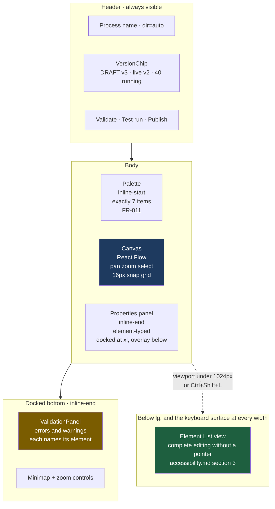
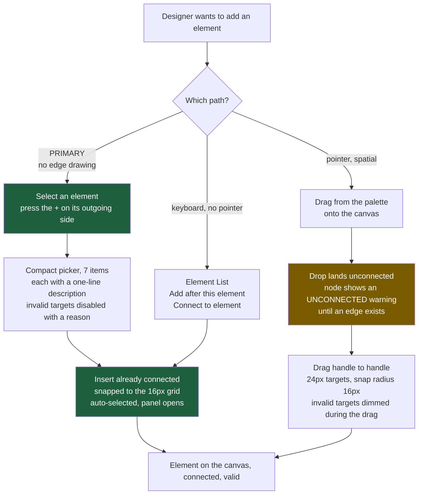
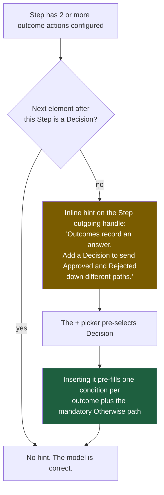
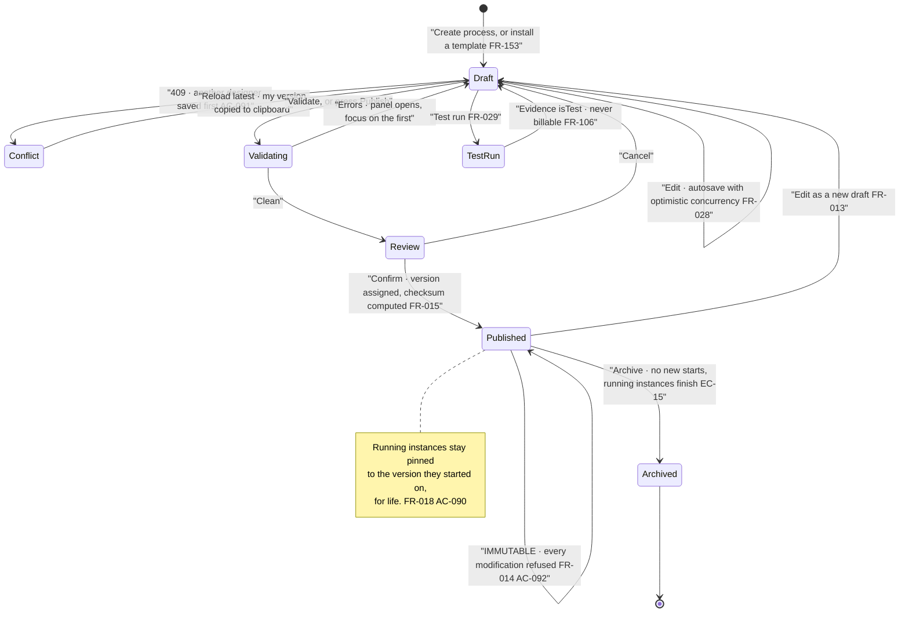

# ConnectBPM — Process Designer Interaction Specification

**Product**: ConnectBPM · **Task**: DESIGN-01 · **Date**: 2026-08-20
**Author**: UI/UX Designer, ConnectSW
**Route**: `/app/processes/[id]/design` (plus `/versions/[version]`, `/design/forms/[elementId]`)
**Binding inputs**: `FR-011`–`FR-030`, `FR-153` · `AC-088`–`AC-096`, `AC-060` · `NFR-012` ·
ADR-006 (`@xyflow/react`, MIT) · ADR-001 (E1–E7, SCOPE-AMD-001) · BA-01 §Q3

---

## 1. The constraint that shapes every decision here

BA-01's finding is the design brief: **BPMN notation repels the non-technical buyer**, and this
product's designer persona (S-05) is *"an operations or business systems analyst. Domain expert.
**Not a programmer.**"* ADR-001 answers with seven elements. This document answers with the
interaction layer, and the test it must pass is `AC-094`: all 15 gallery templates modellable in the
shipped designer.

Four consequences, applied throughout:

| # | Consequence | Where it shows up |
|---|---|---|
| **C-1** | **BPMN vocabulary is never in the primary UI.** `bpmn:exclusiveGateway` appears only behind a collapsed "Technical mapping" disclosure, which exists because `FR-012` requires the 1:1 mapping to be persisted and visible, and because the Camunda-migration buyer asks for it | §5.3 |
| **C-2** | **No BPMN shapes.** ADR-006 already accepts that we draw our own. A diamond gateway wastes ~50% of its bounding box and truncates the label — a functional cost, not a stylistic preference | §3 |
| **C-3** | **Drawing an edge is never required.** The primary construction path adds elements *already connected*. A user who never learns to drag from a handle can still build all 15 templates | §4.2 |
| **C-4** | **Every refusal names the element and the rule in plain language.** `FR-017` makes generic messages non-compliant. "Publication refused: the Decision *Above threshold?* has no default path" — not "validation failed" | §6 |

---

## 2. Screen anatomy



Layout uses logical properties throughout, so under `ar` the palette is at the visual right, the
properties panel at the visual left, and the graph itself mirrors by coordinate projection
(`rtl-and-i18n.md` §6). **The palette does not mirror its item order** — it is a vertical list.

Measured targets for this screen:

| Property | Target |
|---|---|
| Palette items | **exactly 7**, never 8 (`FR-011`, `AC-088`) |
| Activations to add a connected element | **2** (select source → `+` → pick = 2 activations after the picker opens) |
| Activations from a validation error to the offending element selected and centred | **1** |
| Canvas interactive after definition load, 40 nodes | ≤ **1.5 s** on desktop broadband |
| Node label legible without zoom | at 100%, `h4` 20px / `body-sm` 14px metadata |
| Minimum node hit target | **44 × 44 px**; connection handles **24 × 24 px** with a keyboard equivalent |

---

## 3. The seven elements — visual language

Identity is carried by **silhouette first**. Verified by printing the set in greyscale: all seven
remain distinguishable with colour removed (WCAG 1.4.1). Strokes measure 6.92:1 light / 7.30:1 dark
against the canvas (`design-system.md` §4.5).

| # | Name shown to the user | Silhouette | Face carries | Ports (in / out) | BPMN, behind the disclosure |
|---|---|---|---|---|---|
| **E1** | **Start** | Circle, 2px stroke, 64px | Start-form name if bound; who may start (`FR-030`) | 0 / **exactly 1** | `bpmn:startEvent` |
| **E2** | **Step** | Rounded rectangle `radius-lg`, 240 × 88px | Step name · assignment rule · bound form · E5 badge if attached | ≥1 / **exactly 1** | `bpmn:userTask` |
| **E3** | **Decision** | Rectangle with a notched leading edge, 240 × 88px | Question label · one row per condition path · the **default path always rendered last and always labelled "Otherwise"** | ≥1 / **≥2** (n conditions + 1 default) | `bpmn:exclusiveGateway` |
| **E4** | **Split / Join** | Rectangle with a doubled leading rule, 176 × 72px | Branch count · "waits for all" on the Join | Split 1 / ≥2 · Join ≥2 / 1 | `bpmn:parallelGateway` |
| **E5** | **Due date and reminder** | **Badge attached to an E2**, not a free node (ADR-006) | Due expression · reminder count · **interrupting = solid ring, non-interrupting = dashed ring, each with its own text label** | n/a | `bpmn:boundaryEvent` + `bpmn:timerEventDefinition` |
| **E6** | **Finish** | Circle, 4px stroke, 64px | Outcome label ("Approved", "Rejected") | ≥1 / **0** | `bpmn:endEvent` |
| **E7** | **Schedule** | Circle with a clock glyph, 2px stroke, 64px | Recurrence in plain language · tenant timezone | 0 / **exactly 1** | `bpmn:timerStartEvent` |

**Why not diamonds and circles-with-icons.** A BPMN diamond sized to hold "Is the amount above the
approval threshold?" is either enormous or truncating. The notched rectangle holds the same label as
a Step at the same width, so a 6-element process fits a 1440px viewport without zooming, and the
notch alone distinguishes it at 40% zoom in the minimap.

**E5 is a badge, not a node.** ADR-006 fixes this. It also removes a whole class of user error: a
due date cannot be left floating, unattached, and silently non-functional.

**E1 and E7 may both be present** (ADR-001 Amendment A2 — T05 needs a control tested monthly *and*
on demand). Validation enforces at most one *of each kind*, not one in total, and the canvas renders
both as separate entry points with a shared first Step. The Element List labels them
"Started by a person" and "Started on a schedule" so the distinction is readable without geometry.

---

## 4. Building a process

### 4.1 Three construction paths, one of them primary



The `+` path is primary because it makes the hardest motor skill in graph editing — dragging between
two small targets — optional. It is also the path that carries the connection rules: the picker
disables what cannot legally connect and says why, so an invalid graph is difficult to construct
rather than merely rejected later.

### 4.2 Connection legality — enforced at connect time, not only at publish

React Flow's connection validation runs the same rule set the server enforces (`AC-088`: the palette
ceiling is enforced at the API, not only in the UI).

| From ↓ / To → | E1 | E2 | E3 | E4 Split | E4 Join | E6 | E7 |
|---|:--:|:--:|:--:|:--:|:--:|:--:|:--:|
| **E1 Start** | ✗ | ✓ | ✓ | ✓ | ✗ | ✓ | ✗ |
| **E2 Step** | ✗ | ✓ | ✓ | ✓ | ✓ | ✓ | ✗ |
| **E3 Decision** | ✗ | ✓ | ✓ | ✓ | ✓ | ✓ | ✗ |
| **E4 Split** | ✗ | ✓ | ✓ | ✓ | ✓ | ✓ | ✗ |
| **E4 Join** | ✗ | ✓ | ✓ | ✓ | ✓ | ✓ | ✗ |
| **E6 Finish** | ✗ | ✗ | ✗ | ✗ | ✗ | ✗ | ✗ |
| **E7 Schedule** | ✗ | ✓ | ✓ | ✓ | ✗ | ✓ | ✗ |

Cycles are legal (`FR-047`, template T10): a Decision may route back to an earlier Step. The canvas
routes a loop-back edge around the node band rather than through it, and mirrors with everything else
under `ar`. A rejected connection shows an inline reason at the pointer for `motion-base`, e.g.
"Finish has no outgoing path — it ends the request."

### 4.3 E4 is inserted as a **matched pair**, always

Selecting Split/Join inserts **both** a Split and its matching Join, connected by two empty branch
placeholders. It is not possible to add a lone Split through any UI path.

This is the highest-value structural decision in the designer. `FR-016` and `AC-077` make an
unmatched Split a publish-blocking structural fault, and `EC-06` shows it is also the fault most
likely to be created accidentally. Inserting the pair together makes the most common blocking error
unreachable via the primary path. Deleting a Split offers "Delete the Split and its Join" as the
default action, with "Delete only this element" as an explicit secondary.

### 4.4 The Step-outcome mental-model correction

An ops analyst expects "Approve" and "Reject" to be two arrows leaving a Step. In this element set
they are not: an outcome action sets a value (`FR-081`, `FR-035`), and **routing happens at a
Decision** (`FR-020`). Left undiagnosed, this is the point at which a non-technical designer
concludes the tool is broken.

The designer detects and repairs it:



Pre-filling the Decision's conditions from the Step's outcome actions is the concrete mechanism: the
designer never has to write `stepOutcome = "REJECTED"` by hand for the common case, which is also the
single largest reduction in exposure to the expression grammar.

### 4.5 The named idiom for conditional parallel branches — `FR-021`

Template T07 needs a Decision *inside* a parallel branch routing directly to the matching Join. That
costs three elements where an inclusive gateway would cost one, and ADR-001 accepts the cost. `FR-021`
requires the designer to offer it as a **named canvas idiom with an inline explanation**.

Implementation as specification: a palette item under a small "Patterns" affordance — not an eighth
element, and it creates nothing outside E1–E7 — labelled **"Optional branch"**. Choosing it inserts,
inside an existing Split/Join pair, a Decision whose true path leads to the branch work and whose
`Otherwise` path leads straight to the Join, with an inline note on the canvas:

> "This branch only runs when the condition is true. The other path goes straight to the join, so the
> request never waits for work that was skipped."

The note is dismissible per user, persists per user, and is a chrome string (bilingual).

---

## 5. The properties panel

### 5.1 Structure

One panel, element-typed, always in the same place. Sections in a fixed order so the panel is
learnable:

1. **Name** — tenant-authored, `dir="auto"`, never machine-translated (`FR-147`)
2. **Behaviour** — the element-specific fields (assignment rule, conditions, recurrence, outcome label)
3. **Form** — the bound form, with "Open the form builder" → `/design/forms/[elementId]` and a
   two-locale preview (`FR-039`)
4. **Due date and reminders** — E2 only; adds or edits the attached E5
5. **Technical mapping** — collapsed by default (C-1): the BPMN semantic equivalent, the element id,
   and the machine key. LTR-locked, monospace, copyable

### 5.2 Assignment rule — E2's most important field

`FR-066` allows four kinds. They are presented as four radio options in plain language, not as an
expression:

| Option | Plain-language label | Notes shown inline |
|---|---|---|
| Named user | "A specific person" | Warns: "If this person leaves, open tasks must be reassigned before they can be deactivated" (`FR-008`, `AC-085`) |
| Role | "Anyone with a role" | Creates an unassigned claimable task (`FR-068`) |
| Relationship | "The requester's manager" | The only relationship expression in v1; rendered as a sentence, never as syntax |
| Claimable queue | "First person to pick it up" | Shows which roles can see the queue |

### 5.3 The condition editor — the grammar without the syntax

`FR-022` restricts conditions to literals, field references, comparisons, boolean operators,
parentheses and a fixed set of pure predicates. `FR-024` caps AST depth and node count at publish
time. The designer persona is not a programmer, so conditions are authored as **rows**, not as text:

```
[ Amount            ▾ ]  [ is greater than ▾ ]  [ 5000        ]
   AND ▾
[ Department        ▾ ]  [ is              ▾ ]  [ Finance   ▾ ]
```

- The left selector lists only fields that exist on forms **reachable before this element**. A field
  that cannot be set before this point is not offerable, which removes a whole class of
  always-`false` conditions (`FR-023`, `AC-076`).
- The operator list is filtered by the field's type. A date field cannot offer "contains".
- The right side accepts a literal or another field, with the type enforced.
- A **plain-language echo** renders below the rows: *"Send down this path when Amount is greater than
  5,000 and Department is Finance."* This is the sentence a reviewer reads, and the same sentence
  appears in the pre-publish review (§7.2).
- The generated expression is shown in the Technical mapping disclosure, LTR-locked and read-only.
- Nesting depth is capped in the UI **one level below** the `FR-024` server limit, so the editor
  cannot construct something the server will refuse.
- **The `Otherwise` path is rendered as a permanent, non-deletable row** at the bottom of every
  Decision (`FR-020`). It cannot be removed, which makes `AC-075`'s publish refusal unreachable via
  the UI while the server still enforces it.

---

## 6. Validation and error affordances

### 6.1 Two severities, and only two

| Severity | Blocks publish? | Set |
|---|---|---|
| **Error** | Yes | The `FR-016` set: missing or duplicate Start of a kind; no reachable Finish; unreachable element; Split without a matching Join reachable from every branch (`AC-077`); Decision without a default; Step without an assignment rule; condition outside the grammar or over the `FR-024` limits |
| **Warning** | No | Exactly three, so warnings stay meaningful: (1) a Step with **more than 5 editable fields** — see `task-inbox-ux.md` §5, this is the 60-second budget expressed at design time; (2) a Step assigned to a single named user with no queue fallback; (3) a process with no E5 anywhere, so nothing will ever escalate |

### 6.2 Error presentation — `FR-017`, `AC-089`

Each entry carries the element's **customer-facing label** and its canvas identifier — the criterion
names both — plus the rule in plain language and a single "Go to element" action.

| Channel | Behaviour |
|---|---|
| ValidationPanel | Docked bottom inline-end. `role="region"`, labelled. Count changes announce `polite`; a failed publish announces `assertive` |
| On the node | A count badge with an `alert-octagon` icon and a **2px `red-600` ring** (4.41:1 against the canvas). Colour is never the only channel |
| Focus | "Go to element" selects the node, centres it (`motion-slow`, instant under reduced motion), moves focus to it, and links it by `aria-describedby` to its error text |
| Element List | The same errors appear inline against the same elements, so the keyboard surface is not second-class |

### 6.3 Publish is never a disabled button

A disabled Publish button tells a non-technical user nothing and invites clicking. **Publish is always
enabled.** Pressing it with errors present runs validation, opens the ValidationPanel, announces
`assertive`, and moves focus to the first error. The refusal is the explanation.

---

## 7. Publishing

### 7.1 The state machine



### 7.2 The pre-publish review sheet

Publishing is the moment a non-technical user takes on an irreversible obligation, so the sheet
states the consequences in the order they matter. It is not dismissible by backdrop click; `Esc`
cancels and returns focus to the Publish button.

| Line | Content | Traces |
|---|---|---|
| 1 | "This will become **version 3**." | `FR-015` |
| 2 | **What changed since version 2** — elements added, removed and changed, listed by their customer-facing labels, with condition changes shown as the plain-language echo from §5.3 | `FR-018` |
| 3 | "**40 running requests stay on version 2** and will finish on version 2." | `FR-018`, `AC-090` |
| 4 | "New requests will use version 3." | `AC-090` |
| 5 | "**Published versions cannot be edited or deleted.** To change this process later, publish version 4." | `FR-014`, `AC-092` |
| 6 | "Who can start this process: *any member / role X / named members*." | `FR-030` |
| 7 | Warnings, if any, restated with a "Publish anyway" acknowledgement | §6.1 |

**No type-to-confirm.** The action's true blast radius is *new instances bind v3*; running work is
protected by pinning and nothing is destroyed. Type-to-confirm is calibrated for destructive,
unrecoverable actions and, applied here, it teaches a non-technical user that publishing is dangerous
— which suppresses the exact behaviour DEC-002's pricing model needs. One explicit, unambiguously
labelled button — **"Publish version 3"** — is the correct weight.

### 7.3 After publish

The canvas switches to the read-only published view. The palette is **removed from the DOM, not
disabled** — a disabled palette invites clicking and communicates nothing. Immutability is shown, not
merely implied:

- A `PUBLISHED` chip in `--c-evidence` violet with a lock icon
- The checksum, LTR-locked, monospace, with a copy action (`FR-015`)
- Publisher and publication timestamp in tenant-local time with the UTC instant on focus
- Two actions: **"Start a request"** and **"Edit as a new draft"** (`FR-013`)

### 7.4 Test run — `FR-029`, `FR-106`

The `Test run` action is available on a DRAFT only. Its confirmation states, in the button's own
label region rather than in a tooltip:

> "Test run — evidence is marked as a test and **this does not use your instance allowance**."

Test instances carry a persistent `TEST` chip everywhere they appear and are excluded from
`/app/instances` by default behind a "Show test runs" filter. A tooltip is not sufficient here: the
non-billable property is a commercial promise (DEC-002) and must be readable without hover, which
also makes it readable on touch.

---

## 8. Version visibility — `FR-019`

The version a thing is executing is never more than one glance away.

| Surface | What is shown | Rule |
|---|---|---|
| Designer header | `DRAFT v3 · live v2 · 40 running` — one chip, three facts | Focus or hover expands to the per-version running count (`FR-129`) |
| `/app/processes/[id]/versions` | Version, checksum, publisher, date, live instance count per version | `FR-129` |
| `/app/processes/[id]/versions/[version]` | Read-only canvas + diff against the previous version, using the same element labels as the review sheet | |
| `/app/instances/[instanceId]` | **VersionChip is mandatory**, adjacent to the status badge | `FR-019`, `AC-090` |
| Evidence export | Version and checksum in the export header and in every entry | `FR-019`, `AC-090` |
| Task view | The version is present but de-emphasised — `caption`, tertiary text — because it must not compete for attention on the 60-second path | `task-inbox-ux.md` §3 |

`VersionChip` is one component with one appearance everywhere, so "v2" always means the same thing.

---

## 9. Concurrent editing — `AC-091`

Last-write-wins is unacceptable on an artifact that becomes an immutable published version. On HTTP
409 the designer shows a non-dismissible sheet:

- **Who** saved, and **when** (tenant-local, with the UTC instant on focus)
- **What changed**, listed by customer-facing element label — not a JSON diff
- Primary action: **"Load their version"**
- Secondary action: **"Copy my version"** — puts the losing draft on the clipboard as JSON so the
  work is recoverable. The refusal is correct; losing an hour of modelling to it is not

---

## 10. Installing a template — `FR-153`, `AC-095`

Installation creates an **unlinked editable DRAFT**. The canvas opens with `elkjs` auto-layout
already applied in canonical space (`rtl-and-i18n.md` §6.6), so the template appears tidy rather than
stacked at the origin. The header states, once and dismissibly: "This is your own copy. Changes to the
gallery template will not affect it." Every template carries its control-context tag and the
`FR-154` disclaimer that it is a starting point, not legal advice, on both the gallery card and the
installed draft's overview.

---

## 11. Empty and first-run states

| State | Content |
|---|---|
| New blank process, no elements | A canvas containing one **Start** already placed and selected, with its `+` affordance visible and a one-line note: "Every process begins here. Press + to add the first step." Starting from a truly empty canvas is the point at which a non-technical user stalls |
| Process with elements but never validated | The header's Validate action carries a neutral "Not yet checked" chip. It is not an error state |
| Under 1024px | The Element List view, complete and editable — never a "use a bigger screen" wall (`rtl-and-i18n.md` §6.9) |

---

## 12. Measurable acceptance criteria for this specification

| # | Criterion | Method |
|---|---|---|
| D-1 | The palette offers exactly 7 items; no eighth element type is creatable through the UI or the API | AUTO (`AC-088`) |
| D-2 | All 15 gallery templates are modellable in the shipped designer with no excluded element | GATE (`AC-094`) |
| D-3 | Every validation error names the element's customer-facing label **and** its canvas identifier | AUTO (`AC-089`) |
| D-4 | An element can be added, connected, configured and validated **without a pointer** | MANUAL (`NFR-012`) |
| D-5 | Adding a connected element takes ≤ 2 activations after the source is selected | MANUAL |
| D-6 | Selecting Split/Join always produces a matched pair; no UI path creates a lone Split | AUTO |
| D-7 | The `Otherwise` row on every Decision is present and non-deletable | AUTO (`FR-020`) |
| D-8 | Publish is never rendered disabled; pressing it with errors opens the panel and focuses the first | MANUAL |
| D-9 | The published view contains no palette in the DOM | AUTO (`AC-092`) |
| D-10 | Test run states the non-billable property in visible text, not a tooltip | MANUAL (`FR-029`) |
| D-11 | LTR/RTL screenshot pair per `rtl-and-i18n.md` §6.8 | MANUAL (`AC-060`) |
| D-12 | A 409 conflict offers recovery of the losing draft | MANUAL (`AC-091`) |

---

## 13. What I believe is under-specified upstream

| # | Item | Why it matters | Owner |
|---|---|---|---|
| **U-1** | `/app/processes/[id]/versions/[version]` promises "diff against the previous version" but no requirement defines **what a diff is** for a graph — added/removed/changed elements, condition text changes, form-field changes, or coordinate moves. A coordinate-only move is not a semantic change and should not appear in a diff shown to a Publisher, but nothing says so | The pre-publish review sheet (§7.2 line 2) depends on the same computation. Two different diffs would be worse than one imperfect one | Product Manager + Architect |
| **U-2** | `FR-021`'s "named canvas idiom" is required, but nothing states whether an idiom may appear in the palette. §4.4 places it under a separate "Patterns" affordance and creates only E1–E7 elements, which I read as compliant with `FR-011` — this should be confirmed rather than assumed | `AC-088` is an automated test against the palette | Architect |
| **U-3** | E5 `interrupting: true` withdraws the task (`FR-058`, `TaskStatus.WITHDRAWN`). Nothing specifies what the **performer** sees if they are looking at that task when it is withdrawn under them | It is a live-update problem on a surface with a 60-second budget. `task-inbox-ux.md` §7 proposes a behaviour; it needs a requirement | Product Manager |

---

## Document history

| Version | Date | Author | Change |
|---|---|---|---|
| 1.0 | 2026-08-20 | UI/UX Designer | Initial interaction specification for DESIGN-01. |
