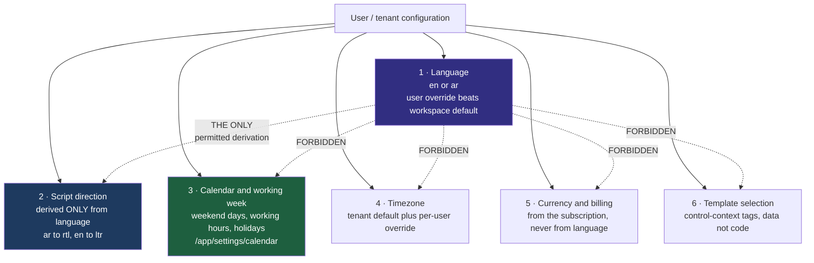
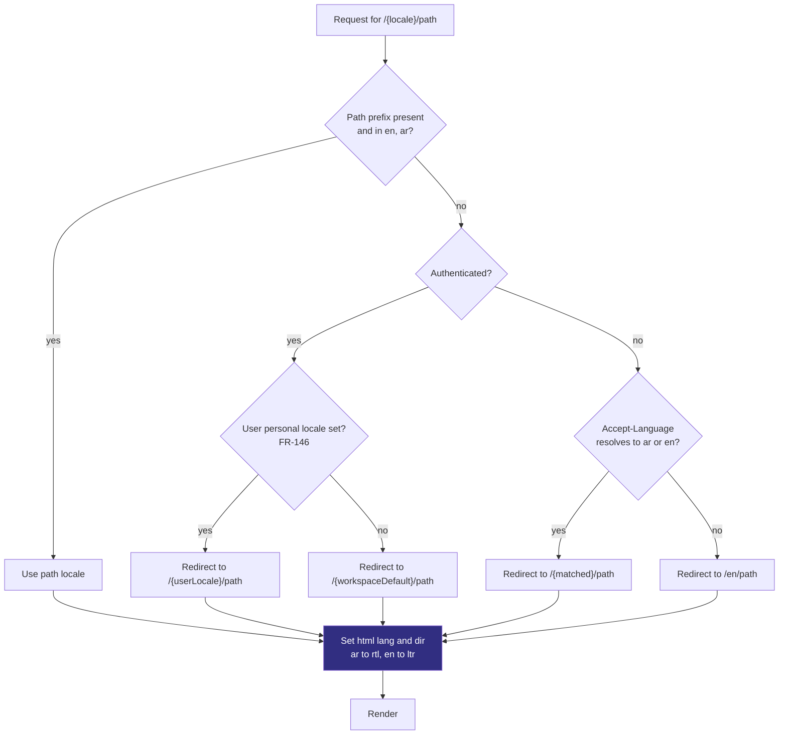
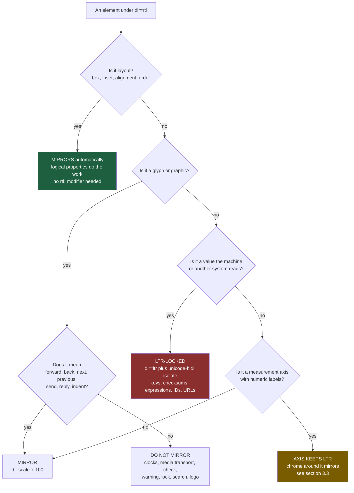
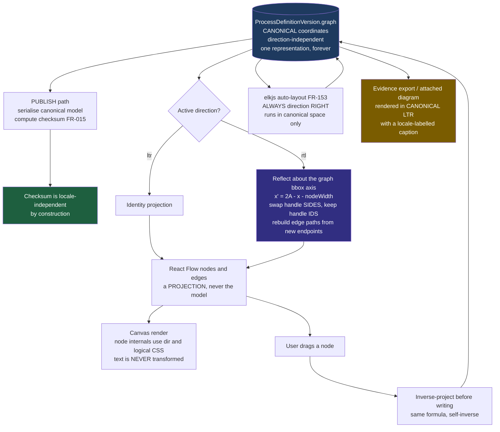
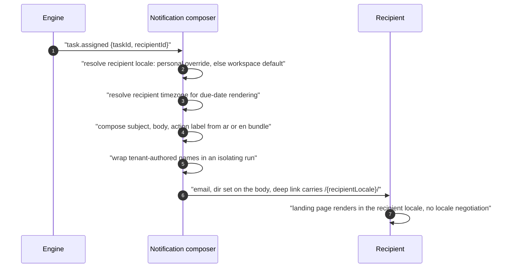

# ConnectBPM — RTL and Internationalisation Specification

**Product**: ConnectBPM · **Task**: DESIGN-01 · **Date**: 2026-08-20
**Author**: UI/UX Designer, ConnectSW
**Status**: Normative. This document defines behaviour that `AC-058`–`AC-069` test.
**Binding inputs**: DEC-001 (Arabic/RTL in v1; geography neutrality) · `FR-138`–`FR-149`, `FR-062`,
`FR-145` · `AC-058`–`AC-069`, `AC-100`, `AC-101` · `NFR-012`, `NFR-013` · ADR-006 §Decision 3 ·
`.claude/protocols/i18n.md` · precedent: `connectin`, `muaththir`

---

## 1. The single rule this document exists to enforce

> **Locale is a rendering configuration. It is never a structure.**

DEC-001 requires the product to be geography-neutral while its first go-to-market is the GCC.
`FR-145` states it as a requirement: *no geography, jurisdiction or regulator may be represented
structurally in an entity, an enum, a schema or engine logic.* Every rule below is a consequence.

The failure mode this prevents is not "the Arabic looks wrong". It is a product in which the Arabic
build and the English build have diverged into two products, and in which a definition authored in
one cannot be safely opened in the other. Everything here is designed so that **the stored artifact
is byte-identical regardless of who is looking at it**.

---

## 2. The locale model

### 2.1 Five axes that are commonly conflated, and are independent here

Each of these is set separately. **None is derived from any other.** A conditional of the form
`if (locale === 'ar')` that sets any of the other four is a defect and fails review.



Worked counter-examples, all of which are real and all of which are forbidden:

| Tempting shortcut | Why it is wrong | Correct source |
|---|---|---|
| `ar` implies a Friday–Saturday weekend | An Arabic-speaking tenant in Morocco or Tunisia has a Saturday–Sunday weekend | `/app/settings/calendar` (`FR-062`, `AC-100`) |
| `ar` implies SAR or AED | Currency comes from the subscription. An `ar` user in a USD-billed tenant sees USD | Subscription record |
| `ar` implies the Hijri calendar | Gregorian is the default for both locales; Hijri is opt-in tenant configuration | Tenant calendar configuration |
| `ar` implies GCC regulatory templates | Templates are data with control-context tags (`FR-152`); an `en` tenant in Qatar wants the same ones | Template gallery filters |
| `ar` implies Eastern Arabic numerals | See §7.1 — Western digits are the `ar` default in this product, by decision | User numeral preference |
| `en` implies UTC | Timezone is explicit configuration; `AC-101` depends on it being unambiguous | Tenant / user timezone |

### 2.2 Resolution order



Three properties this ordering guarantees:

1. **A URL is unambiguous and shareable.** A task deep link in an email carries its locale in the
   path, so the recipient lands in their own language even before the session resolves (`AC-061`).
2. **The personal override always wins** (`FR-146`, `AC-064`). A workspace defaulting to `en`
   containing an `ar` member renders every surface *and every notification* for that member in `ar`.
3. **No silent English fallback.** `AC-058` requires all 66 MVP routes to render under `/ar/`. A
   missing `ar` key fails CI (`FR-144`, `AC-062`) rather than degrading to English at runtime, so a
   partial translation can never ship.

**Harvested from `connectin`**: the direction and language attributes are set on `documentElement`
at first paint and re-applied on `languageChanged`, not left to a React effect. Setting them late
causes a visible LTR flash and, worse, causes the first layout pass to compute logical properties in
the wrong direction. `connectin`'s `I18nProvider` sets them synchronously before the provider
renders; ConnectBPM does the same in the App Router layout, where `dir` is a server-rendered
attribute on `<html>`.

**Harvested from `muaththir`**: `getDirection(locale)` and `isRtl(locale)` are pure functions in one
module (`src/i18n/config.ts`) and are the *only* place the string `'rtl'` appears outside CSS. The
API side has the mirror-image helper for `Accept-Language` parsing. ConnectBPM reuses both shapes so
that direction logic is one function with one test, not a condition scattered across components.

---

## 3. What mirrors, and what must not

Mirroring is decided by **category, not by taste**. The table is the authority; a developer's
judgement is not. `AC-059` makes physical CSS properties a build failure, so most of the "mirror"
column happens automatically once logical properties are used — the interesting content is the
**do-not-mirror** column, which requires deliberate suppression.



### 3.1 Mirrors

| Category | Examples | Mechanism |
|---|---|---|
| Box model and insets | margin, padding, border, `inset`, `float` | Logical properties only — `ms-*`, `me-*`, `ps-*`, `pe-*`, `start-*`, `end-*`, `border-s-*` |
| Text alignment | Everything | `text-align: start` / `end`. Never `left` / `right` (`AC-059`) |
| Panel and drawer origin | Sidebar, properties panel, sheets, toasts | Logical inset |
| Table column order | Every `DataTable` | Reverses; numeric cells stay LTR internally (§3.2) |
| Directional icons | arrow-left/right, chevron-left/right, back, forward, undo, redo, reply, send, indent, outdent, tab, breadcrumb separator, "next step" | `rtl:-scale-x-100` on the glyph only |
| Progress fill origin | Quota meter, onboarding stepper, instance progress | Fills from **inline-start**: right-to-left under `ar` |
| Sliders and ranges | Retention window control | Value increases toward inline-end |
| Ordered list markers, tree chevrons | Element list, evidence timeline | Automatic under `dir` |
| **The designer canvas graph** | Nodes, edges, arrowheads, minimap | Coordinate projection — §6, the substantial case |

### 3.2 Does not mirror

| Category | Examples | Why | Mechanism |
|---|---|---|---|
| Clock glyphs and clock hands | due-soon, overdue, schedule (E7) | Time is clockwise in every locale | No transform |
| Media transport | play, pause, skip | Universal convention; a mirrored play button reads as rewind | No transform |
| Non-directional glyphs | check, x, warning triangle, lock, bell, search, gear, trash, user, hash | No inherent direction | No transform |
| **Digits inside a number** | `2,500`, `v3`, `60,000` | The Unicode Bidi Algorithm renders digit runs LTR inside RTL text. This is not a choice | Automatic; do not fight it |
| **Machine keys** | `applicantEmail`, `stepOutcome` | `FR-032`, `FR-149` — stable, locale-independent, cross-system | `dir="ltr"`, `unicode-bidi: isolate`, monospace |
| **Condition expressions** | `amount > 5000 and region = "GCC"` | `FR-022` restricted grammar. Reordering an operator visually is a correctness hazard | `dir="ltr"`, `unicode-bidi: isolate` |
| **Checksums, correlation IDs, hash-chain hex** | `FR-015`, `FR-091`, `NFR-017` | An auditor retypes these. A bidi-reordered hex string is a false negative | `dir="ltr"`, `unicode-bidi: isolate` |
| URLs, email addresses, webhook endpoints, API keys | `/app/settings/webhooks` | Same reason | `dir="ltr"`, `unicode-bidi: isolate` |
| Recurrence expressions (E7) | cron-equivalent fields | ADR-001 Neutral note — structured object, LTR display | `dir="ltr"` |
| **Logo and wordmark** | ConnectBPM mark | A flipped wordmark is a broken logo, not a localised one | Never transformed. An Arabic lockup, if ever produced, is a separate asset |
| File-type and status glyphs | PDF, CSV, JSON icons | No direction | No transform |
| **Chart measurement axes** | Phase-2 bottleneck analysis | §3.3 | Axis LTR, chrome mirrors |

### 3.3 Progress direction versus time-axis direction — they are opposite, and here is why

This is the pair that gets got wrong, because both look like "a horizontal thing that increases".

- A **progress indicator** measures *how far the reader has come*. Its origin is where reading begins.
  Under `ar` a quota meter fills right-to-left, the onboarding stepper advances right-to-left, and the
  instance-progress bar on `/app/requests/[instanceId]` advances right-to-left. **Mirrors.**
- A **chart axis** is a *measurement scale whose tick labels are numbers*, and numbers render LTR
  under the Bidi algorithm no matter what `dir` says. An axis whose data runs right-to-left while its
  own tick labels run left-to-right is internally contradictory, and it disagrees with every
  spreadsheet, regulator report and BI tool the compliance persona (S-02) cross-checks against.
  **Does not mirror.** Its legend, title, axis label placement and tooltip do mirror, because those
  are chrome.

v1 ships no time-series chart — `FR-126` is four numbers per process — so this rule costs nothing
now. It is stated now so that F-104 (bottleneck analysis) inherits it rather than re-deciding it.

**Does this contradict the canvas decision in §6?** No, and the distinction is the load-bearing part:

| | Designer canvas | Chart axis |
|---|---|---|
| What the horizontal axis carries | **Labelled prose read as a sentence** — Arabic Step names, in reading order | **A numeric scale** whose labels are digits |
| How a reader consumes it | Scans in reading direction, node to node | Reads a position against a labelled tick |
| Consequence of mirroring | Matches reading order — correct | Data and its own tick labels disagree — incorrect |

The canvas is a reading surface. An axis is a ruler. Reading surfaces follow the script; rulers do not.

---

## 4. Icon mirroring — the enumerated list

Adapted from `connectin` §6.4 and extended with the ConnectBPM-specific glyphs. Implemented as a
single map (`MIRRORED_ICONS: ReadonlySet<string>`), not as a `rtl:` class sprinkled at call sites, so
that the rule is testable in one unit test.

```ts
// specification, not implementation
const MIRRORED_ICONS = new Set([
  'arrow-left', 'arrow-right', 'arrow-up-left', 'arrow-down-right',
  'chevron-left', 'chevron-right', 'chevrons-left', 'chevrons-right',
  'corner-down-left', 'corner-up-right',
  'undo', 'redo', 'reply', 'reply-all', 'forward', 'send',
  'indent', 'outdent', 'list-ordered',
  'log-in', 'log-out',
  'arrow-right-left',        // TaskStatus.REASSIGNED
  'git-branch',              // E4 Split / Join palette glyph
  'move-right',              // "next element" affordance in the Element List
]);

const NEVER_MIRRORED = new Set([
  'clock', 'clock-alert', 'clock-x', 'timer', 'calendar',   // E5, E7, SLA states
  'play', 'pause', 'skip-forward', 'skip-back',
  'check', 'check-circle', 'x', 'x-circle', 'alert-triangle', 'alert-octagon',
  'lock', 'unlock', 'shield', 'bell', 'search', 'settings', 'trash', 'user',
  'hash', 'file-json', 'file-spreadsheet', 'link',
]);
```

A glyph in neither set fails the icon lint. There is no default.

---

## 5. Arabic typography — and why `text-align` alone is not internationalisation

### 5.1 What `text-align: right` does not do

`FR-140` and `AC-059` forbid `text-align: right` as an RTL substitute. The reason is not stylistic
purity — it is that alignment and *direction* are different properties, and only `direction` changes
the six behaviours below.

| Behaviour | Under `text-align: right` alone | Under `dir="rtl"` |
|---|---|---|
| **Neutral character placement** | The Bidi algorithm still resolves the paragraph as LTR, so full stops, brackets, quotation marks and colons attach to the wrong end. `الخطوة 3.` renders with the stop on the visual left | Correct |
| **`::marker` and list bullets** | Stay on the left, detached from the text | Move to inline-start |
| **`text-overflow: ellipsis`** | Truncates the *beginning* of an Arabic string — the reader loses the subject, not the tail | Truncates the correct end |
| **Inline overflow / horizontal scroll** | A wide `DataTable` or evidence export preview opens scrolled to the wrong end | Opens at inline-start |
| **Form control internals** | Select arrow, date picker, number spinner and the empty-input caret stay LTR | Flip with the control |
| **Nested mixed-script runs** | An English machine key inside an Arabic label reorders the surrounding sentence | Isolated correctly, given `bdi` / `unicode-bidi: isolate` |

### 5.2 Letterform joining — what breaks it

Arabic letters take initial, medial, final and isolated forms selected by the shaping engine over a
continuous run. Anything that fragments the run breaks the word.

| Forbidden | Effect | Rule |
|---|---|---|
| Positive `letter-spacing` | Joining forms detach; the word becomes loose glyphs | `letter-spacing: 0` on every type token under `[lang="ar"]` — enforced by lint (`design-system.md` §5.2) |
| Per-character `<span>` splitting for animation or highlighting | Each glyph shapes in isolation | Highlight by background range, never by character wrapping |
| Synthesised (faux) bold | Uneven stroke thickening, ligature collision | Ship real 400 / 500 / 600 / 700 weights of IBM Plex Sans Arabic. Never `font-weight` above a weight the family provides |
| `text-transform: uppercase` / `capitalize` | No case in Arabic; some pipelines still mangle the run | `text-transform: none` under `[lang="ar"]`. The `overline` token's uppercase is disabled |
| `text-align: justify` | Browsers justify by stretching spaces, not by kashida — produces rivers and inconsistent word shapes | `text-align: start` |
| Disabling `liga` / `calt` | Required ligatures such as lām-alif fail | Font features stay at defaults |
| `hyphens: auto` | Meaningless for Arabic | `hyphens: none` under `[lang="ar"]` |

### 5.3 Vertical metrics

Arabic needs 10–15% more leading than Latin at the same size: descenders are deeper, and tashkeel —
present in some regulatory template text even when absent from UI chrome — sits above the line.
`design-system.md` §5.2 carries the two line-height columns. The single most common regression is a
component that hard-codes `leading-tight`; that class is banned outside `[lang="en"]` scopes.

### 5.4 Font stack and the `AC-068` fallback test

```
'Inter', 'IBM Plex Sans Arabic', 'Noto Sans Arabic', system-ui, -apple-system, 'Segoe UI', sans-serif
```

`AC-068` requires Arabic to render correctly **when the primary webfont fails to load**. The chain
must therefore contain a second Arabic-capable family (`Noto Sans Arabic`) before any generic, and
must never terminate on a Latin-only face. Test: block the webfont origin, render the pangram
`نص حكيم له سر قاطع وذو شأن عظيم مكتوب على ثوب أخضر ومغلف بجلد أزرق`, assert non-zero glyph advance
for every codepoint and zero `.notdef` boxes.

---

## 6. The canvas problem

### 6.1 The decision

> **The graph mirrors. The glyphs inside it do not. The stored model never changes.**
>
> Under `ar`, `/app/processes/[id]/design` renders the process flowing **right to left**: E1 Start at
> the inline-start (visually right), E6 Finish at the inline-end (visually left), connectors routed
> and arrowheads oriented accordingly. This is a **view projection** applied at render time. Node
> coordinates are stored canonically, in one direction, forever.

`FR-141` and `AC-060` require it; ADR-006 §Decision 3 specifies the mechanism. This section defines
what that mechanism must actually do, because "mirror the canvas" has at least four wrong
implementations and one right one.

**Why mirror at all, in three sentences.** A workflow diagram is not a picture, it is a spatial
argument about causality that a person reads node by node in the direction their script runs, so a
graph entering from the left forces an Arabic reader to scan against their reading direction and
turns every arrowhead into a symbol pointing backwards from progress. Mirroring is safe here — where
it would not be for a chart axis — because it is a *projection* rather than a transformation: stored
coordinates stay canonical, the publish checksum (`FR-015`) is computed over the canonical model, and
so the same definition is byte-identical in both locales and a locale switch can never alter what was
published. Mirroring only the chrome produces the worst of both, a right-to-left page containing a
left-to-right diagram whose arrowheads point at the page's inline-start, which reads as *the process
runs backwards* — precisely the confusion `FR-141` exists to prevent.

### 6.2 The projection pipeline



### 6.3 The transform, stated exactly

Let the canonical graph have bounding box `[bboxMinX, bboxMaxX]` over all node origins **and their
widths**. Define the reflection axis and the projection:

```ts
// specification, not implementation
const A = (bboxMinX + bboxMaxX) / 2;          // reflection axis, in canonical graph space

project = (n: Node) => dir === 'rtl'
  ? { ...n, position: { x: 2 * A - n.position.x - n.width, y: n.position.y } }
  : n;

// project is its own inverse: project(project(n)) === n
```

Six requirements this formulation carries, each of which is a defect if omitted:

| # | Requirement | What goes wrong without it |
|---|---|---|
| **T1** | Reflect about **the graph's own bounding box**, not the viewport | ADR-006 writes `x → (canvasWidth − x)`. If `canvasWidth` is read as the viewport width, the whole graph **translates whenever the window resizes or the panel docks**, and the transform stops being self-inverse. Using the graph's own extent makes the projection viewport-independent and stable under resize, zoom and pan. **This is a correction to ADR-006's wording, not to its decision** — raise it with the Architect before implementation |
| **T2** | Subtract `n.width` | Reflecting the origin alone mirrors *anchor points*, not *shapes*. Every node is displaced by its own width, and nodes of unequal width visibly misalign. This is the single most likely implementation bug |
| **T3** | `y` is untouched | Only the inline axis mirrors. A vertical flip would invert branch order at a Split for no reason |
| **T4** | Swap handle **sides**; never handle **ids** | `sourceHandle` / `targetHandle` ids are model data and must stay locale-independent, or the same definition serialises differently in `ar` and the checksum diverges. Only the rendered `position` prop changes: inbound `Left → Right`, outbound `Right → Left` |
| **T5** | Rebuild edge paths from the transformed endpoints | Arrowhead orientation is then derived from the path tangent and is correct for free. Transforming a rendered SVG group instead would mirror the edge **label** |
| **T6** | Snap results to the 16px canvas grid | `2A − x − w` with an odd-sum bounding box can land on a half-pixel, producing a blurred stroke and a 1px drift on repeated round trips |

### 6.4 The trap, named again

**Never `transform: scaleX(-1)` on the canvas pane.** ADR-006 names it; it is repeated here because
it is the fastest way to make the acceptance screenshot look right and the product be wrong. It
mirrors:

- **Arabic node labels** — reversed glyphs, unreadable
- Element icons, including the ones §4 says must never mirror
- The E5 boundary badge's attachment side relative to its own text
- Selection handles, resize cursors, and the minimap viewport rectangle
- Any text inside an edge label

### 6.5 What does **not** mirror inside the canvas

| Item | Behaviour |
|---|---|
| Node label text | Renders under the document `dir`; the *text* reads RTL, the *glyphs* are never transformed |
| Element icons | Per §4. E7's clock does not mirror even though the graph does |
| Machine keys, condition expressions shown on E3 paths | LTR-locked with `unicode-bidi: isolate` (§3.2) |
| Version chip and checksum | LTR-locked |
| Node internal layout | Logical properties — flips as layout, which is correct |
| Grid dots | Symmetric; no-op |

### 6.6 Auto-layout must never see the direction

`elkjs` (ADR-006, `FR-153`) lays out an installed template. It runs with `elk.direction = RIGHT`
**always**, in canonical space, and its output is written as canonical coordinates. If it ran with
`LEFT` under `ar`, the *stored* graph would differ by locale — a template installed by an Arabic user
would open with different coordinates than the same template installed by an English user, and locale
would have become structure. That is a direct DEC-001 / `FR-145` violation dressed as a layout
convenience.

### 6.7 Evidence exports render canonically

An evidence record, and any diagram image attached to one, is produced in **canonical LTR** with a
caption naming the locale of the requester. Rationale: `AC-066` requires exports of the same instance
under different locales to carry the same stable machine keys and byte-identical stored values, and
`FR-149` makes the export the artifact an external auditor verifies without trusting us. An auditor
who receives two visually different diagrams of the same published version has been given a reason to
doubt the chain. The evidence surface is not a reading surface for the tenant; it is a record for a
third party, and records are canonical.

This is the one place the graph deliberately does not follow the reader.

### 6.8 `AC-060` acceptance artifact — what the screenshot pair must show

`AC-060` is `MANUAL`. The pair is not "the canvas in two languages"; it must demonstrate all six
transform properties. The recorded pair must show the **same definition** — one containing at
minimum E1, E2 with an attached E5, E3 with two conditions and a default, E4 with two branches, and
E6 — with:

1. E1 at the inline-start in both, so start position tracks the script, not the screen
2. Arrowheads oriented along flow in both, with no reversed glyph anywhere
3. Node labels legible and correctly shaped in both — this is what catches `scaleX(-1)`
4. The E5 badge attached to the same Step, on the mirrored side, with its clock glyph unmirrored
5. The E3 condition expression rendered LTR in both
6. The version chip and checksum identical, character for character, in both

### 6.9 Below `lg` there is no canvas, and that is not a degradation

Under 1024px the designer renders the **Element List** view (`accessibility.md` §3.2), a complete
keyboard-and-touch editing surface with no spatial metaphor. It has no direction problem to solve, it
is the same surface that satisfies `NFR-012` keyboard operability, and it is the reason mirroring can
be a pure view concern: the model is editable without any canvas at all.

---

## 7. Formatting — numbers, dates, times, currency

Every one of these is **display only**. The stored value is locale-independent (`FR-148`), and the
evidence export carries the machine value plus a display label (`FR-149`, `AC-066`).

### 7.1 Numerals — `ar` defaults to Western digits

| | Decision |
|---|---|
| **`ar` default numbering system** | **`latn` (Western: 0–9)**, i.e. `Intl.NumberFormat('ar-u-nu-latn')` |
| **Alternative** | Eastern Arabic (`arab`: ٠١٢٣٤٥٦٧٨٩) available as a per-user preference |
| **Never localised** | Machine values, checksums, IDs, quantities inside an export payload, version numbers |

Rationale, and it is a product decision rather than a typographic one: ConnectBPM's numbers are
cross-referenced against invoices, quota statements, evidence exports and third-party audit
workpapers. A quota figure that reads `٢٬٥٠٠` on screen and `2500` in the CSV export invites a
transcription error in exactly the workflow the product exists to make trustworthy. Gulf business
software overwhelmingly presents Western digits. Eastern digits remain available because some
regulatory correspondence expects them; they are a preference, not a default, and they never reach a
stored value.

Digit runs render LTR inside RTL text under the Bidi algorithm in both numbering systems. Do not
attempt to "fix" this.

### 7.2 Dates and times

| Rule | Detail |
|---|---|
| Formatter | `Intl.DateTimeFormat(locale, { calendar: 'gregory', timeZone: <resolved tz> })` |
| Calendar | Gregorian is the default for **both** locales. Hijri is tenant configuration, never implied by `ar` |
| Timezone | Always passed explicitly. Never the runtime default — a server-rendered page would otherwise format in the server's zone |
| Resolution | User timezone overrides tenant timezone; tenant timezone is set at signup and on `/app/settings/calendar` |
| **Due dates** | Show tenant-local absolute time as the primary string, with the UTC instant available on hover and on focus. `AC-101` requires the evidence entry to carry **both**, so the UI must never present only one |
| Relative time | `Intl.RelativeTimeFormat` for "in 3 hours" / "2 days overdue". Always accompanied by the absolute time, never a replacement for it |
| Working days | "2 working days" resolves through the tenant working calendar (`FR-062`, `AC-100`), never through the locale. `AC-100`'s Sunday–Thursday week is a *configuration* that an `en` tenant may equally hold |
| DST | `AC-101` — a due instant landing in a skipped local hour resolves to the next valid instant, and the UI shows the resolved instant, not the requested one |

### 7.3 Currency

`Intl.NumberFormat(locale, { style: 'currency', currency: <subscription currency> })`. The currency
code comes from the subscription, never from the locale. Tier price points are provisional and
unpublished until K0 (DEC-005 CLR-C), so the pricing page must render its currency from
configuration and must not hard-code a symbol into a translated string.

### 7.4 Pluralisation and interpolation

ICU message format, per the i18n protocol. **Arabic has six plural categories** — `zero`, `one`,
`two`, `few`, `many`, `other` — against English's two. A key whose `ar` value supplies fewer
categories than the language requires fails the key-coverage gate alongside a missing key
(`FR-144`, `AC-062`). This matters immediately: quota strings ("{count} instances remaining"), task
counts, member counts and batch counts all pluralise, and the bulk-start confirmation screen
(`AC-018`) must state an exact count in a grammatically correct sentence in both languages.

---

## 8. Content versus chrome

`FR-147` and `AC-065`: **tenant-authored content is never machine-translated.** Only ConnectSW chrome
and the 15 gallery templates are bilingual (`FR-151`).

| Content class | Bilingual? | Direction handling |
|---|---|---|
| Product chrome — labels, buttons, errors, empty states, emails | **Yes**, `en` + `ar`, key-coverage gated | Follows the active locale |
| Gallery templates — element labels, form labels, instructions | **Yes**, both locales shipped (`FR-151`, `AC-069`) | Follows the active locale |
| Tenant-authored — process names, Step names, form labels, outcome labels, comments, attachment names | **No.** Stored as entered, displayed unchanged | **`dir="auto"`** on the rendering element, wrapped so it cannot reorder its surroundings |
| Machine values — keys, checksums, expressions, IDs | N/A | `dir="ltr"` + `unicode-bidi: isolate` |

### 8.1 The mixed-content rule

An Arabic Step name rendered inside an English sentence — "Task **مراجعة المدير** is overdue" — will
reorder the surrounding sentence unless the inserted run is isolated. Every interpolation of
tenant-authored content into a chrome string is wrapped in an isolating element (`<bdi>` or
`unicode-bidi: isolate`). This applies to page titles, breadcrumbs, notification subjects, table
cells, canvas node labels, and evidence entries. It is a one-line rule with a large blast radius; it
is verified by rendering every list surface with a deliberately mixed-script fixture.

**Fixture requirement, harvested from a past mistake.** Design reviews use realistic Arabic content,
never Lorem Ipsum and never transliteration. Arabic strings for the same concept typically run 20–30%
shorter in character count and taller in line box than their English equivalents; a layout approved
against Latin placeholder text has broken on real Arabic before in this company. The review fixture
set is: the longest gallery template name in `ar`, a 60-character Arabic Step name, an Arabic outcome
comment of 240 characters, and one deliberately mixed-script process name.

---

## 9. Notifications

`FR-142`, `AC-061`: composed in the **recipient's** locale, not the author's.



Two details the acceptance criterion depends on:

1. The deep link **already contains** the recipient's locale prefix, so the landing page never
   redirects. A redirect on the 60-second path costs a round trip on 4G (`task-inbox-ux.md` §4).
2. The email body carries `dir="rtl"` and the Arabic font stack inline, because email clients do not
   inherit the application stylesheet, and several strip `<style>` blocks entirely.

---

## 10. Verification

| # | Check | Method | Traces |
|---|---|---|---|
| 1 | All 66 MVP routes render under `/ar/` with `dir="rtl"`, no English fallback | AUTO route sweep | `AC-058` |
| 2 | No physical CSS property; no `text-align: right` as an RTL substitute | Lint gate, build-failing | `AC-059` |
| 3 | Canvas mirrors — flow, routing, arrowheads; screenshot pair per §6.8 | MANUAL | `AC-060`, `FR-141` |
| 4 | `project(project(g)) === g` for a 40-node fixture; no coordinate drift over 100 round trips | AUTO unit test | §6.3 T1, T6 |
| 5 | Publish checksum identical for the same draft under `en` and `ar` | AUTO | §6.2, `FR-015` |
| 6 | elk output identical regardless of active locale | AUTO | §6.6, `FR-145` |
| 7 | Notification locale is the recipient's | AUTO | `AC-061` |
| 8 | Missing or under-pluralised `ar` key fails CI | GATE | `AC-062`, §7.4 |
| 9 | No hard-coded user-visible string | Lint gate | `AC-063` |
| 10 | Personal locale override applies to every surface and notification | AUTO | `AC-064` |
| 11 | Tenant-authored Arabic displayed unchanged to an `en` viewer, correctly isolated | AUTO + MANUAL | `AC-065`, §8.1 |
| 12 | Cross-locale export: same machine keys, byte-identical stored values | AUTO | `AC-066` |
| 13 | 0 critical/serious `axe` violations in both directions; keyboard task completion | GATE + MANUAL | `AC-067` |
| 14 | Arabic pangram renders with the webfont blocked | MANUAL | `AC-068` |
| 15 | All 15 templates bilingual, labels and instructions | GATE | `AC-069` |
| 16 | Icon lint: every glyph appears in exactly one of the two sets in §4 | AUTO | §4 |
| 17 | `letter-spacing: 0` on every type token under `[lang="ar"]` | Lint gate | §5.2 |

---

## 11. Open item for the Architect

**§6.3 T1 is a correction to ADR-006's wording.** ADR-006 §Decision 3 specifies
`x → (canvasWidth − x)`. If `canvasWidth` means the viewport, the projection is not viewport-invariant
and not self-inverse, and the graph shifts on resize. The decision (coordinate transform, not CSS
mirroring) is unaffected and remains correct; only the reflection axis needs to be the graph's own
bounding-box centre. Raised here rather than edited into the ADR, because ADRs are the Architect's
artifact.

---

## Document history

| Version | Date | Author | Change |
|---|---|---|---|
| 1.0 | 2026-08-20 | UI/UX Designer | Initial specification for DESIGN-01. Canvas mirroring decision and transform, mirror/no-mirror taxonomy, Arabic typography rules, formatting policy. |
