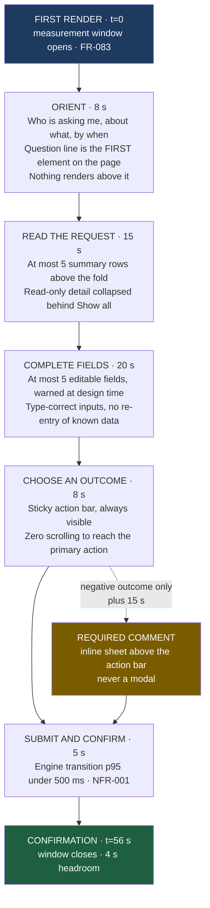
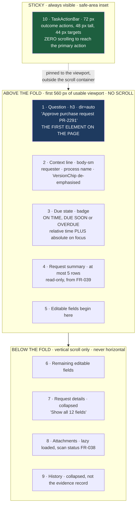
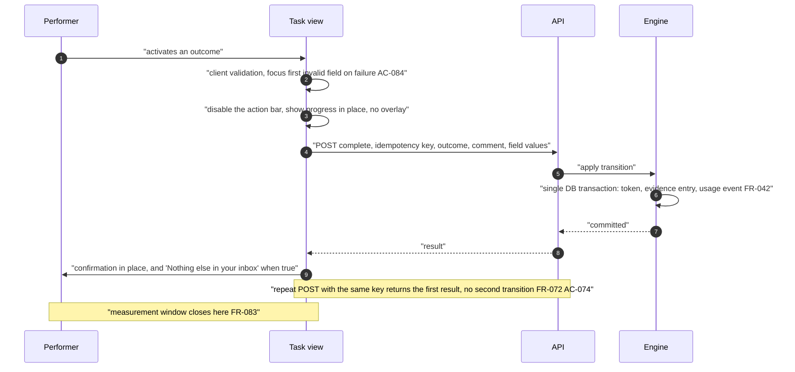

# ConnectBPM — Task Inbox Interaction Specification

**Product**: ConnectBPM · **Task**: DESIGN-01 · **Date**: 2026-08-20
**Author**: UI/UX Designer, ConnectSW
**Routes**: `/app/inbox`, `/app/inbox/[taskId]`, `/app/inbox/queue`, `/app/inbox/completed`,
`/app/requests`, `/app/requests/[instanceId]`, `/app/start`, `/app/start/[processId]`
**Binding inputs**: `SC-006` (median ≤ 60 s) · `NFR-002`, `NFR-003` · `FR-066`–`FR-085` ·
`AC-080`–`AC-087` · DEC-002 (participants unlimited and free) · RSK-004 (scored 9/9)

---

## 1. The number this surface is designed against

> **`SC-006` / `AC-081`: across ≥100 real completions by users who received no training, the median
> time from first render to submission confirmation is ≤ 60 seconds.**

This is the retention surface. Persona S-06 uses the product a few times a month, arrives from an
email, usually on a phone, often in Arabic, and treats any new application as a tax. DEC-002 makes
participants unlimited and free on every tier, so this surface carries the most users and the least
training in the entire product. RSK-004 scores that risk 9/9 and `AC-080`–`AC-087` are the mitigation.

Two consequences that govern everything below:

1. **This route has a budget, not a wish.** Any addition must state which phase of §2 it consumes.
2. **The measured window starts at first render.** Load time is governed separately by `AC-082`
   (≤ 2.0 s interactive at 375 px on throttled 4G). Both are designed for; they are not the same
   number and must not be traded against each other.

---

## 2. The 60-second budget, decomposed

Median case: one approval Step, a request summary, zero to two editable fields, outcome `Approve`.

| Phase | Budget | The mechanism that buys it | Section |
|---|---:|---|---|
| Orient | 8 s | Chromeless layout. The question is the first element. No dashboard, list or navigation (`AC-080`) | §3.1 |
| Read the request | 15 s | Above-the-fold contract; read-only fields collapsed (`FR-039`) | §3.2 |
| Complete fields | 20 s | ≤ 5 editable fields, enforced as a **design-time warning in the designer** | §5 |
| Choose an outcome | 8 s | Sticky `TaskActionBar`; primary and danger visually and spatially separated | §4 |
| Submit and confirm | 5 s | Single POST, idempotency key, engine p95 ≤ 500 ms | §6 |
| **Median total** | **56 s** | **4 s headroom** | |
| Negative outcome | +15 s | Required comment (`FR-081`). Excluded from the median by assumption below | §4.3 |

**The distribution assumption, stated so it can be falsified.** The 56 s figure is the approval path.
Rejections cost ~71 s. The median holds while approvals exceed ~50% of completions — true for every
one of the 15 gallery templates, which are approval, review and attestation flows. `FR-083`
instrumentation therefore records outcome polarity, so if the median misses, the first question —
*is this a slow UI or a rejection-heavy tenant?* — is answerable without a new deployment.

---

## 3. `/app/inbox/[taskId]` — the single-task view

### 3.1 Zones at 375 px

`AC-080` forbids a dashboard, a task list and navigation chrome. `DashboardLayout` renders in
`chromeless` mode: it keeps the skip link and the live region, and drops the shell
(`design-system.md` §1.1).

**The above-the-fold contract is testable**: at 375 × 667 with default browser chrome, zones 1–4 and
the first editable field must be painted without scrolling. This is asserted in the Playwright suite
by measuring the first editable field's bounding box against the viewport height.

Horizontal scrolling is forbidden at 375 px (`US-02 AC-3`). Long tenant-authored strings wrap; long
machine values (IDs, checksums) truncate at the correct end under `dir` with the full value available
on focus and via copy.

### 3.2 Progressive disclosure of read-only context

`FR-039` lets a Step declare each form field read-only, editable, or hidden for that Step. The view
uses that declaration as its information hierarchy:

| Declaration | Rendering |
|---|---|
| **Editable** | In the primary flow. This is the work |
| **Read-only** | The **first three** appear in the summary (zone 4). The rest collapse into "Request details" with an exact count. Never a scroll wall of grey boxes |
| **Hidden** | Not rendered. Not present in the DOM |

A read-only field the performer must see in order to decide belongs in the first three, and the
designer chooses the order. That ordering is part of form design, not a runtime heuristic.

### 3.3 De-emphasised, but present

Three things must be on this page and must not compete for the 8-second orientation budget. All three
render as `caption` in tertiary text below the context line: the definition version (`FR-019`), the
instance identifier, and the task's own identifier. They are what a support conversation needs; they
are not what the performer is here to read.

---

## 4. Outcome actions

### 4.1 The `TaskActionBar`

| Property | Value |
|---|---|
| Position | Sticky to the viewport bottom, outside the scroll container, `padding-block-end: env(safe-area-inset-bottom)` |
| Height | 72 px; buttons 48 px tall, hit target ≥ 44 × 44 px |
| Layout | Primary outcome at inline-end, negative at inline-start, **≥ 8 px apart**, never adjacent full-bleed |
| Order | Fixed by the definition's outcome order, so the same process always presents them in the same place |
| More than 3 outcomes | The first two render as buttons; the rest collapse into a "More outcomes" menu. Three side-by-side buttons is the limit at 375 px without truncating labels |
| Direction | Mirrors under `ar` by logical properties. The bar itself contains no directional icon |

### 4.2 One activation on the fast path

If the Step has **no required editable field** and the selected outcome **does not require a
comment**, the outcome button completes the task in **one activation**. No confirmation dialog.

The reasoning, since this is the kind of decision reviewers challenge: a confirmation dialog costs
roughly 4 seconds and doubles the activation count on the single most frequent action in the product.
It would consume 7% of the budget to protect against a mis-tap that is already addressed by a 44 px
target, 8 px separation from the destructive action, and an unambiguous verb label ("Approve
request", never "OK"). An "Undo" is *not* offered, and that is deliberate: reversal would be a second
engine transition with its own evidence entry, which would make the evidence record describe a
decision that was never actually taken.

### 4.3 Negative outcomes require a comment, inline

`FR-081` makes "require a comment" configurable per outcome action. **The designer defaults it ON for
any outcome the designer marks as negative**, and the task view treats a comment-required outcome as
its own confirmation step — which is why §4.2 can safely omit a dialog on the positive path.

Selecting such an outcome expands a comment sheet **upward from the action bar**, never a modal:

- The sheet is anchored to the bar, so on a phone the on-screen keyboard pushes the bar and the sheet
  together and the submit button stays visible. A centred modal is covered by the keyboard
- Focus moves to the textarea; the label states why the comment is required
- The submit button relabels to the specific verb — "Reject request" — so the committed action is
  never ambiguous
- `Esc` or the back affordance cancels and returns focus to the outcome button, with the typed text
  preserved
- Submitting empty is refused inline and focus moves to the field, with no transition (`AC-084`)

---

## 5. The design-time lever — where the 60 seconds is actually won

The largest single determinant of completion time is **how many editable fields the designer put on
the Step**. That is not decidable at runtime, so the control lives in the designer:

> **Warning W-1** (`designer-canvas-ux.md` §6.1): a Step with **more than 5 editable fields** raises a
> non-blocking publish warning naming the Step and stating: *"Participants take longer than 60 seconds
> on steps with more than 5 fields. Consider splitting this step or marking fields read-only."*

It is a warning, not an error: some steps legitimately need ten fields, and blocking publication over
a UX guideline would be the wrong trade. But the number is stated at the moment the cost is created,
to the person who creates it — which is the only moment it can be influenced.

The same lever appears twice more: `FR-039` read-only/hidden declarations, and the outcome-comment
default in §4.3.

---

## 6. Submission

Rules:

- The action bar disables **in place**; no full-screen overlay. An overlay hides the form the user may
  need to see if the submission fails
- The confirmation replaces the action bar rather than navigating away. Navigation would cost a page
  load inside the measured window
- When the performer has no other open task, the confirmation says so. This is the retention moment:
  the product's promise to S-06 is *finish and get back to your job*
- Following the deep link never mutates state; only the POST does (`FR-073`)

---

## 7. Every other state this view must handle

| State | Rendering | Traces |
|---|---|---|
| **Already completed** | Same layout, read-only, outcome and comment shown, "Completed by *name* on *date*", **no action bar**. Not an error page | `FR-076`, `AC-083` |
| **Not mine / another tenant** | HTTP **404**, visually identical to a genuinely missing task. Existence is never disclosed, and the attempt is recorded | `FR-071`, `AC-086` |
| **Withdrawn under the performer** — an interrupting E5 fired while the page was open | The action bar is replaced by: "This step was cancelled because its due date passed. Your answer was not recorded." **Entered form data stays visible and copyable**, plus a link to the request status. Never a silent failure and never a discarded draft | `FR-058`, `FR-057`; raised as **U-3** in `designer-canvas-ux.md` §13 |
| **Claim lost** on a queue task | "*Sara Al-Mansouri* claimed this 2 seconds ago" — names the claimant, never a generic error | `FR-068`, `AC-073` |
| **Instance suspended** | Read-only with an explanation and the suspending actor. The task is not gone | `FR-054` |
| **Offline** | The task view states that submission requires a connection and preserves entered values. `/offline` ships as a real skeleton, never "Coming Soon" | `AC-099` |
| **Validation failure** | Field flagged inline, focus moves to it, error announced, no transition | `AC-084` |
| **Loading** | `Skeleton` in the exact geometry of the loaded content. Zero layout shift | `NFR-003` |

---

## 8. Getting there — the path before the measured window

Outside `AC-081`'s window but inside the user's experience, and therefore designed:

| Step | Requirement |
|---|---|
| Notification | Composed in the **recipient's** locale; the deep link already carries `/{recipientLocale}/`, so the landing page never redirects (`rtl-and-i18n.md` §9) |
| Unauthenticated arrival | Authenticate, then land **on the task**, not on a dashboard. The full path, locale prefix and query are preserved across the auth round trip (`US-02 AC-1`) |
| Payload | One response carries the request summary, the version-pinned form schema and the outcome actions. **No client fetch waterfall.** Attachments load lazily |
| JS budget | **≤ 120 KB gzipped** for this route. It must not import the designer bundle, React Flow, elkjs or any charting code. Route-level code splitting is an acceptance condition of `AC-082`, not an optimisation |
| Fonts | `font-display: swap` with a metric-adjusted fallback (`size-adjust`, `ascent-override`) for **both** the Latin and Arabic faces, so swapping does not shift the layout. **CLS budget ≤ 0.1** |
| Target | Interactive ≤ **2.0 s** at 375 px on throttled 4G (`AC-082`) |

---

## 9. Instrumentation — `FR-083`, and how a miss is diagnosed

| Mark | When |
|---|---|
| `firstRenderAt` | The paint of the **question line** (zone 1), not navigation start and not `DOMContentLoaded` |
| `submittedAt` | The POST leaves the client |
| `confirmedAt` | The confirmation renders. `confirmedAt − firstRenderAt` is the `SC-006` figure |

Recorded dimensions: outcome polarity, locale, viewport class, editable-field count, whether a
comment was required, and whether the task was claimed from a queue. Without these, a missed median
is a mystery; with them it is a query. Reported as a **median with p75 and p90**, never a mean — one
performer who leaves a tab open for an hour destroys a mean.

---

## 10. The surrounding routes

### 10.1 `/app/inbox` — my tasks

| Property | Specification |
|---|---|
| Default sort | Due time ascending (`FR-069`) |
| Row | 72 px. Line 1: the question (`body`, `dir="auto"`, truncating at the correct end). Line 2 (`caption`): process · requester · due badge |
| Overdue | `OVERDUE` badge with `clock-x`; the row also carries an inline-start 3 px `red-700` rule so overdue is visible in peripheral scanning without relying on colour alone |
| Filters | Process, status, overdue (`FR-069`). Filter state is in the URL, so a filtered inbox is shareable and restorable |
| Empty state | "No tasks assigned to you." Body: what causes a task to appear. **No call to action** — a Participant cannot create work for themselves, and an action they cannot take is noise |
| Whole row | A single link target. No nested interactive elements, so keyboard traversal is one stop per task |

### 10.2 `/app/inbox/queue` — claimable

Claim is a 44 px button on each row. On a lost race the row updates in place naming the claimant
(`AC-073`); it does not vanish, because a disappearing row reads as a bug.

### 10.3 `/app/inbox/completed`

Read-only history with outcomes. Same row geometry as the inbox, so the two lists are one learned
pattern.

### 10.4 `/app/start` and `/app/start/[processId]`

Lists exactly the processes this member may start (`FR-085`, `FR-030`). The start form is the same
`FormRenderer` as the task view, so a requester learns one form UI. **Quota is checked before
creation** (`FR-113`): a refusal routes to `/app/quota` with the limit, the current usage, the period
reset date and the upgrade action — never a generic failure (`FR-114`).

### 10.5 `/app/start/[processId]/bulk` — the unskippable confirmation

`AC-018` requires the exact billable instance count and the resulting quota position **before** the
operation runs, on a screen that cannot be skipped.

| Element | Rule |
|---|---|
| Count | "This will start **400 requests** and use **400 billable instances**." The number is computed and persisted server-side against the `InstanceBatch` (ADR-001 A1); a client-side count is forgeable |
| Quota position | "You have used 1,200 of 2,500 this period. After this: 1,600 of 2,500." Rendered by `QuotaMeter` with held reservations shown distinctly from converted completions |
| Shortfall | All-or-nothing. One refusal, naming the batch, never N (`EC-21`, `AC-017`) |
| Skippability | No "don't show again". Not dismissible by backdrop. `Esc` cancels |
| Batch cap | `MAX_BATCH_SIZE = 5,000` stated before upload, not after (ADR-001) |

### 10.6 `/app/requests` and `/app/requests/[instanceId]`

Instances I started, with current Step, current holder and due time (`FR-077`). Progress renders as a
step indicator filling from **inline-start**, so it mirrors under `ar` (`rtl-and-i18n.md` §3.3). A
request that is not mine returns 404, never 403 (`US-41`).

---

## 11. What a Participant must never see

`FR-084` / `AC-087`: every route in site-map surfaces B, C and E returns HTTP 403 to a Participant and
is **absent from their navigation**. The `Sidebar` extension filters by role and renders nothing for
surfaces the member cannot enter — a disabled or greyed entry is a worse outcome than absence,
because it advertises a capability the member's employer would have to pay for, contradicting DEC-002's
promise that participation is free.

---

## 12. Measurable acceptance criteria

| # | Criterion | Method | Traces |
|---|---|---|---|
| T-1 | Median completion, ≥100 untrained users, first render → confirmation: **≤ 60 s** | PERF | `AC-081`, `SC-006` |
| T-2 | Interactive ≤ **2.0 s** at 375 px on throttled 4G | PERF | `AC-082` |
| T-3 | Deep link lands on the task; no dashboard, list or navigation in the DOM | AUTO | `AC-080` |
| T-4 | Zones 1–4 and the first editable field paint without scrolling at 375 × 667 | AUTO | `US-02 AC-3` |
| T-5 | No horizontal scrolling at 375 px in either direction | AUTO | `US-02 AC-3`, `AC-058` |
| T-6 | Fast path completes in **1 activation** when no field is required and no comment is required | MANUAL | §4.2 |
| T-7 | Comment-required outcome refuses empty submission, flags the field, moves focus, no transition | AUTO | `AC-084` |
| T-8 | Revisit renders read-only with the recorded outcome; no second submission possible | AUTO | `AC-083` |
| T-9 | Another user's or tenant's task returns 404, visually identical to a missing task | AUTO | `AC-086` |
| T-10 | Route JS ≤ **120 KB gzipped**; the designer bundle is absent | GATE | `AC-082` |
| T-11 | CLS ≤ **0.1** with fonts swapping, both locales | PERF | `AC-082` |
| T-12 | Task completed end to end **using the keyboard alone**, both locales | MANUAL | `AC-067`, `NFR-012` |
| T-13 | Bulk confirmation states the exact billable count and resulting quota position and cannot be skipped | AUTO + MANUAL | `AC-018` |
| T-14 | Participant receives 403 on every surface B/C/E route and sees no navigation to them | AUTO | `AC-087` |

---

## Document history

| Version | Date | Author | Change |
|---|---|---|---|
| 1.0 | 2026-08-20 | UI/UX Designer | Initial specification for DESIGN-01. 60-second budget decomposition and the design-time lever. |
