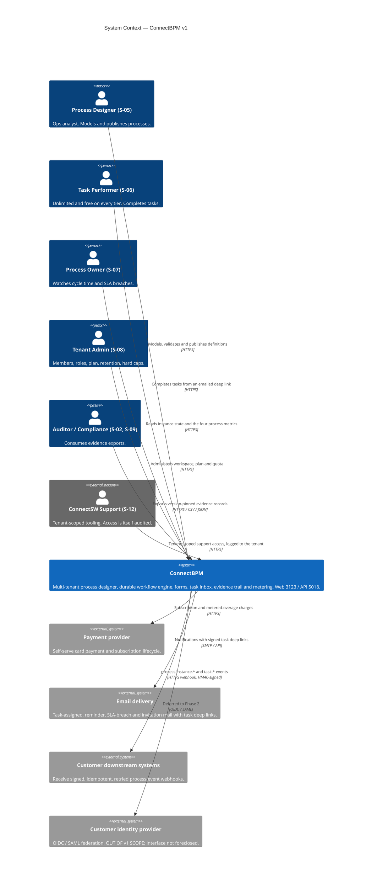
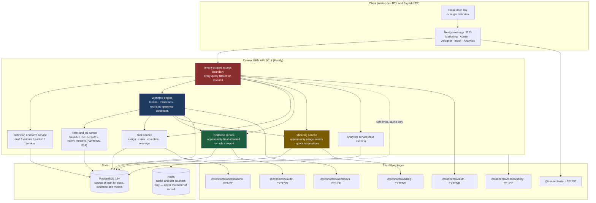
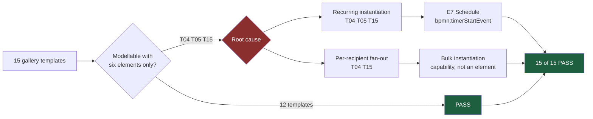
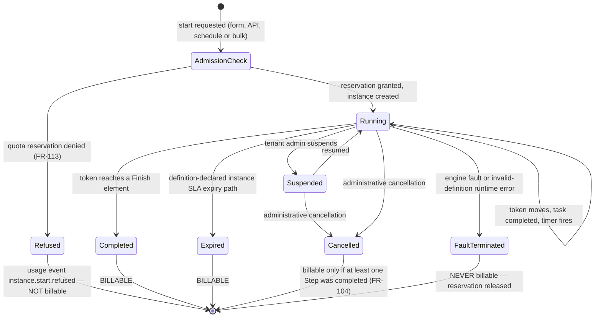
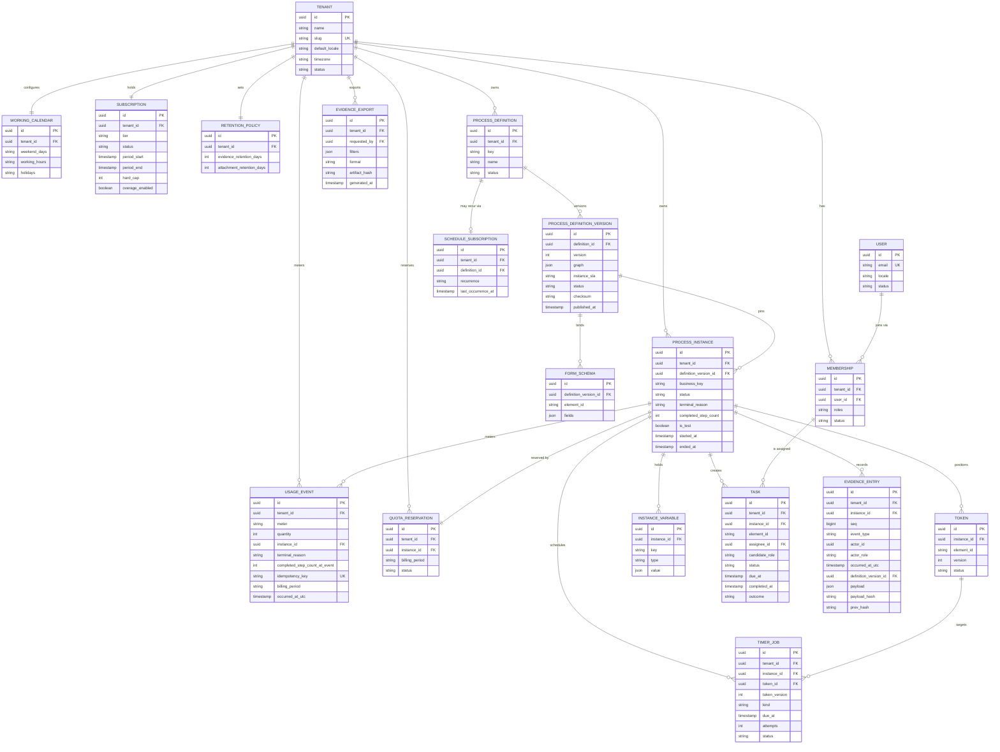
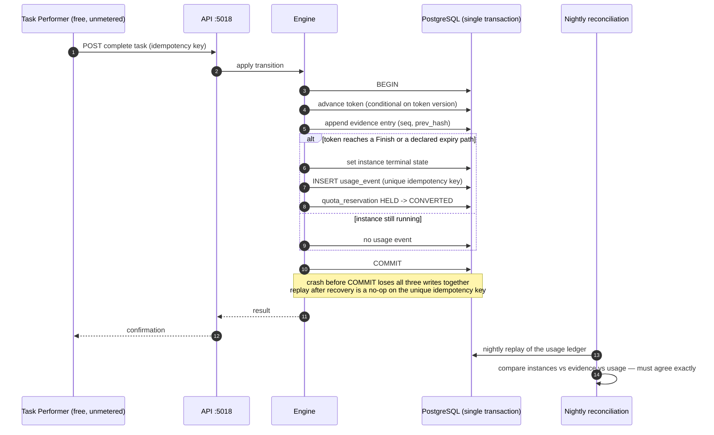

# Feature Specification: ConnectBPM Foundation — Evidence-Native Process Execution

**Product**: connectbpm
**Feature Branch**: `claude/bpm-workflow-product-9p2fxy`
**Created**: 2026-08-20
**Status**: Draft — carries 10 `[NEEDS CLARIFICATION]` markers; CLARIFY-01 to follow
**Task**: SPEC-01
**Input**: CEO brief (five capability pillars) as constrained by `docs/CEO-DECISIONS.md` DEC-001/002/003, `docs/business-analysis.md` (BA-01) and `docs/strategy/OPPORTUNITY-connectbpm.md` (STRAT-01)

> **Scope of this document.** This is the v1 (MVP) foundation specification for ConnectBPM: the
> whole product as first sold, not one feature of it. It is the contract between the Product
> Manager and the Architect.
>
> **Identifier ownership (Article VI).** This specification owns the `US-xx`, `FR-xxx` and
> `NFR-xxx` identifier space for ConnectBPM. `docs/PRD.md` references these identifiers and
> does not mint a second set. `US-01`–`US-34` are carried over unchanged from BA-01 §11.4;
> `US-35`–`US-45` are new here. Every `FR` traces to at least one `US` and one `BN-xxx`.

---

## Business Context *(mandatory)*

### Problem Statement

A compliance-exposed mid-market organisation (50–2,000 employees) runs 20–200 recurring
cross-functional processes — purchase approvals, vendor onboarding, DSARs, incident reviews,
policy attestation, access recertification — and runs the substantial majority of them on
**email, spreadsheets, shared drives and verbal escalation** (BA-01 §2.1, `[ASSUMPTION ASM-001]`).

That configuration produces five costs, of which the fifth is the one that has a budget attached:

| # | Cost | Who feels it |
|---|------|--------------|
| 1 | No state — nobody knows where a request is without asking | S-01 Head of Operations |
| 2 | No SLA — work stalls in an inbox with no timer and no escalation | S-01, S-07 |
| 3 | No routing rules — policy is applied from memory, so controls fail silently | S-02 Head of Compliance |
| 4 | No measurement — the process is never improved because it is never measured | S-07 Process Owner |
| 5 | **No evidence** — when an auditor, a regulator or an enterprise customer's security questionnaire asks *"demonstrate that this approval followed your stated control"*, the answer is a forwarded email chain and a screenshot | **S-02, S-09 — the acute, funded pain** |

The market is barbelled around this buyer. Trigger-automation tools (Zapier from USD 19.99/mo,
n8n from USD 20/mo) are stateless event plumbing and hold no long-running human case. Enterprise
suites (Appian, Pega at USD 35–90/user/month; Kissflow at a ~USD 2,500/month floor) hold the case
and cost more than a departmental budget, with 12–18 months to first value and a ~70% programme
failure rate. Nothing occupies the space between (BA-01 §7.3, STRAT-01 §5.1).

**The wedge, per DEC-001**: build the product **geography-neutral around an audit-evidence core**
and aim the **first go-to-market and template library at the GCC**. Every process instance emits
an immutable, version-pinned, exportable evidence record **by default, on every tier including
free**. Retrofitting that into a stateless trigger platform is a data-model change, not a feature —
which is what makes it a wedge rather than a checkbox.

**Cost of not solving it**: the operations leader absorbs throughput problems with headcount and
the compliance owner keeps failing evidence requests; on ConnectSW's side, the barbell gap closes
as trigger-automation vendors move upmarket into human workflow.

### Target Users

Two stakeholder layers. Layer A buys; Layer B uses. Conflating them is the classic B2B2C error
that produces a product the buyer signs for and the end users refuse (BA-01 §3).

| Persona | ID | Layer | Role | Pain Point Today | Expected Outcome |
|---------|----|-------|------|------------------|------------------|
| Ops Leader (Head of Operations / COO) | S-01 | A — economic buyer | Owns SLAs, headcount budget, process backlog | Cannot prove value without a 12-month IT project; buys on cost per transaction | Publishes a live process the same day, self-serve, with no sales contact |
| Compliance / Risk Lead | S-02 | A — co-buyer in regulated verticals | Answers auditors and regulators | Reconstructs evidence by hand from email threads, for weeks | Self-serves a complete, immutable, version-pinned evidence export per instance |
| Customer IT / Security | S-03 | A — gatekeeper, veto only | Data protection, no shadow IT | Cannot approve a tool with no RBAC story and no data-handling statement | Objections removed: enforced RBAC, tenant isolation, published security posture |
| Process Designer | S-05 | B | Ops or business analyst; not a programmer | BPMN palettes of 100+ elements are unusable; no safe way to change a live process | Models a real approval with six elements, validates, publishes a new immutable version |
| Task Performer / Participant | S-06 | B — **highest practical influence on retention** | Approver, reviewer, requester; occasional user | Work arrives as email and is lost; any training requirement kills adoption | Opens a deep link from an email and completes the task in ≤60 seconds, in Arabic or English |
| Process Owner | S-07 | B | Department head accountable for one process | Cannot say where work is stuck or why | Four numbers per process: started, completed, median cycle time, SLA breaches |
| Tenant Admin | S-08 | B | Customer IT admin / ops manager | Joiners and leavers strand work | Invites, role-assigns, deactivates, and reassigns a leaver's open tasks |
| Auditor / Regulator | S-09 | B/External — decisive at renewal | Verifies control execution after the fact | Evidence is reconstructed, not captured | Receives a point-in-time export pinned to the definition version that actually executed |

> **The decisive read (BA-01 §3.3)**: S-06 has the *lowest formal power* and the *highest practical
> influence on retention*. "Task completion in ≤60 seconds with no training" is therefore a P0
> requirement (BN-006, NFR-002), not a polish item. RSK-004 (adoption failure) is the highest-scoring
> risk in the register at 9/9.

### Business Value

- **Revenue Impact**: The primary meter is the **completed process instance** (DEC-002). Revenue
  therefore rises only when the customer is succeeding, and the "unlimited free participants"
  promise removes the buyer's incentive to ration rollout — which is what drives instance volume.
  Tier ladder Sandbox → Starter → Growth → Business with USD 0.04/instance overage
  (STRAT-01 §7.2; price points provisional, see `[NEEDS CLARIFICATION: CLR-C]`).
- **User Retention**: Switching cost accumulates in four layers (STRAT-01 §5.5) — executable
  process definitions, accumulated evidence history, the localised template library, and the depth
  of participation the free-participant model permits. Layer 2 (evidence history) compounds monthly
  and cannot be exported to a competitor in executable form.
- **Competitive Position**: Occupies the empty quadrant in BA-01 §7.3 — deep long-running
  human-process capability at a self-serve, sub-USD-1,000/month, non-per-seat price. Kissflow is
  nearest at a ~USD 2,500/month per-user floor; Camunda has the depth and moved *away* from
  accessibility at 8.6; Power Automate has the accessibility and not the depth on audited
  long-running human work.
- **Strategic Alignment**: Serves STRAT-01 SO-1 (provably correct engine), SO-2 (win the GCC
  compliance-exposed beachhead), SO-3 (enforceable pricing), and preserves SO-4/SO-5 optionality
  by requiring an internal API boundary and a deployment topology that does not foreclose
  in-region hosting (DEC-001).

---

## System Context (C4 Level 1) *(mandatory)*

### Container view (C4 Level 2, informative — the Architect owns the binding version)

---

## Process Model and MVP Boundary *(ConnectSW addition — load-bearing)*

### The element set

BA-01 §Q3 instructs: no BPMN 2.0 **authoring** in the MVP; the engine is built on a strict subset
of BPMN 2.0 **execution semantics**, with a documented 1:1 mapping so that BPMN interchange
(BN-017, Phase 2) is an additive mapping layer rather than a re-architecture.

| # | Customer-facing name | BPMN 2.0 semantic equivalent | Attributes |
|---|---------------------|------------------------------|------------|
| E1 | **Start** | `bpmn:startEvent` (none, or form-triggered) | start form (optional), who may start |
| E2 | **Step** | `bpmn:userTask` | assignment rule, form binding, instructions |
| E3 | **Decision** | `bpmn:exclusiveGateway` | one restricted-grammar condition per outgoing path + one mandatory default path |
| E4 | **Split / Join** | `bpmn:parallelGateway` | fan-out and matched fan-in |
| E5 | **Due date and reminder** | `bpmn:boundaryEvent` + `bpmn:timerEventDefinition` | duration or absolute; `interrupting: true\|false`; reminder schedule; escalation recipient |
| E6 | **Finish** | `bpmn:endEvent` | outcome label (e.g. Approved, Rejected, Withdrawn) |
| **E7** | **Schedule** *(added — see SCOPE-AMD-001)* | `bpmn:timerStartEvent` | recurrence (cron-equivalent) evaluated in the tenant's calendar |

**Explicitly excluded from v1** (unchanged from BA-01 §Q3): service tasks, script tasks,
sub-processes, call activities, message and signal events, inclusive gateways, event-based
gateways, multi-instance loop characteristics, compensation, and DMN decision tables.

Two element attributes are proposed below. Both are `[NEEDS CLARIFICATION: CLR-F]` — they change
what "six elements" means and need confirming before ARCH-01:

- **E5 is one element with two behaviours.** `interrupting: false` sends a reminder and escalates
  while the Step stays open (BA-01 §5.2's exemplar). `interrupting: true` withdraws the Step and
  routes the token down the boundary path. Both are `bpmn:boundaryEvent` + `bpmn:timerEventDefinition`;
  this is an attribute, not a seventh element.
- **Instance-level deadlines are a definition attribute, not an element.** A DSAR's statutory
  30-day clock applies to the whole instance. In BPMN that would be a boundary event on a
  sub-process, and sub-processes are excluded. It is therefore specified as
  `ProcessDefinitionVersion.instanceSla` — same timer machinery, no new element, and it maps to a
  process-level boundary event when BPMN export arrives.

### SCOPE-AMD-001 — the boundary amendment this specification proposes

BA-01 §Q6 and ASM-005 set an objective test: **all 15 gallery templates must be modellable using
only the MVP element set. If any template requires an excluded element, the boundary is wrong and
is re-decided before ARCH-01 closes.** That test was run (below). Three templates failed. The
minimum remedy is:

1. **Add E7 `Schedule` (`bpmn:timerStartEvent`)** — recurring instantiation. It reuses the timer
   and job store that E5 already requires, so its marginal cost is the schedule field, the
   scheduler tick, and its interaction with quota admission (FR-113). It preserves the 1:1 BPMN
   mapping exactly.
2. **Add bulk instantiation as a capability, not an element** — start N instances from a list
   (CSV upload or a saved recipient list), each an ordinary single-token instance. This replaces
   `bpmn:multiInstanceLoopCharacteristics` without adopting it, and keeps the execution model
   flat. It has a **material commercial consequence** recorded in FR-108 and RISK-PM-01.

**Status**: `[NEEDS CLARIFICATION: CLR-D]` — proposed by the Product Manager on the evidence of the
ASM-005 test; the element set is a BA-01 "firm instruction" and cannot be amended unilaterally.
**Owner**: Architect — CEO-DECISIONS.md delegates process notation to ARCH-01
("Architect confirms or overrides with an ADR"). This specification writes E7 and bulk start into
scope; ARCH-01 must ratify or override in an ADR. Surfaced to the Orchestrator at the PRD checkpoint.

### ASM-005 — the 15-template modelling test, run

Templates T01–T05 are the five GCC regulatory templates STRAT-01 §9.2 places in the Now horizon.
T06–T15 are the generic mid-market set. Each was modelled against the six-element set.

| # | Template | Elements required | Six-element result | Note |
|---|----------|-------------------|--------------------|------|
| T01 | PDPL / GDPR Data Subject Access Request | E1 E2 E3 E5 E6 + instance SLA | **PASS** | 30-day statutory clock modelled as `instanceSla`, not an element |
| T02 | Vendor onboarding and KYC due diligence | E1 E2 E3 E4 E5 E6 | **PASS with degradation** | Sanctions/registry screening is a human Step, not a service task. External vendor cannot self-serve the form — see `[NEEDS CLARIFICATION: CLR-B]` |
| T03 | Security incident response and regulatory notification | E1 E2 E3 E4 E5 E6 | **PASS** | 72-hour notification clock = interrupting E5; parallel containment/notification tracks = E4 |
| T04 | Policy attestation campaign | E1 E2 E5 E6 **+ multi-instance fan-out + recurrence** | **FAIL** | One attestation per employee is `multiInstanceLoopCharacteristics` (excluded); annual re-run is `timerStartEvent` (excluded) |
| T05 | Internal control testing / evidence collection | E1 E2 E3 E4 E5 E6 **+ recurrence** | **FAIL** | A control tested monthly needs `timerStartEvent` (excluded) |
| T06 | Non-standard purchase approval (BA-01 exemplar) | E1 E2 E3 E4 E5 E6 | **PASS** | The §5.2 to-be model verbatim |
| T07 | Employee onboarding | E1 E2 E3 E4 E5 E6 | **PASS with idiom** | Conditional parallel branches need a Decision *inside* a parallel branch routing to the Join — an inclusive gateway would be one element instead of three (usability cost, FR-021) |
| T08 | Employee offboarding | E1 E2 E4 E5 E6 | **PASS** | |
| T09 | Expense exception approval | E1 E2 E3 E5 E6 | **PASS** | Threshold routing via restricted grammar |
| T10 | Contract review and sign-off | E1 E2 E3 E5 E6 | **PASS** | "Request changes" loops back to an earlier Step; cyclic sequence flow is legal token execution |
| T11 | IT change request / CAB approval | E1 E2 E3 E4 E5 E6 | **PASS** | |
| T12 | Customer credit limit decision | E1 E2 E3 E5 E6 | **PASS** | |
| T13 | Leave / time-off request | E1 E2 E3 E5 E6 | **PASS** | Working calendar (FR-062) is what makes "2 business days" meaningful |
| T14 | Invoice exception and payment approval | E1 E2 E3 E4 E5 E6 | **PASS with degradation** | Three-way match against the ERP is a human Step in v1 |
| T15 | Privileged access request and periodic recertification | E1 E2 E3 E5 E6 **+ recurrence + fan-out** | **FAIL** | Quarterly recertification per account holder |

**Result, stated plainly: 12 of 15 PASS on the six-element set. 3 FAIL — T04, T05 and T15.**
All three failures are the same two root causes: **recurring instantiation** (T04, T05, T15) and
**per-recipient fan-out** (T04, T15). Neither is a routing or a gateway problem; the six-element
set models every *flow* in all 15 templates correctly. What it cannot express is *how an instance
comes into existence*.

**This matters commercially, not just technically.** T04 (policy attestation) and T05 (control
testing) are two of the five GCC regulatory templates STRAT-01 places in the Now horizon and that
DEC-001 makes the day-one template library. Shipping the six-element set unamended means shipping
the wedge's template library with 40% of it missing.

**With SCOPE-AMD-001 applied (E7 Schedule + bulk instantiation): 15 of 15 PASS.**

### Instance lifecycle — the state machine the whole product hangs from

---

## User Scenarios & Testing *(mandatory)*

Ten load-bearing journeys are written in full below. Every remaining MVP story carries
Given/When/Then acceptance criteria in the compact table that follows (§Remaining MVP Stories).
`US-01`–`US-34` are BA-01 §11.4 identifiers, carried unchanged; `US-35`–`US-45` are new here.

---

### User Story 1 — Model, validate and publish a process (US-03, US-04, US-05) (Priority: P1)

**As a** Process Designer (S-05), **I want to** model an approval process on a canvas using a small,
constrained set of elements and publish it, **so that** the process runs itself instead of running
on my colleagues' memory.

Nabil is a business systems analyst at a 600-person insurer. He opens the workspace, starts from the
"Non-standard purchase approval" template, and sees a canvas with seven elements in the palette and
nothing else. He drags a Step, names it "Manager approval", assigns it to "the requester's manager",
binds the request form to it, and sets a due date of two working days with a reminder at one day. He
adds a Decision after it with the condition `amount > 5000` on one path and a default path on the
other. He clicks Validate; the canvas tells him the Decision has no default path yet and highlights
it. He fixes it, validates clean, and publishes. The workspace now shows "Purchase approval · v1 ·
published". Nabil starts a test instance from the same screen.

**Why this priority**: without authoring there is no product (BN-002). The constrained palette is a
deliberate rejection of BPMN authoring for a non-technical buyer (BA-01 §Q3) and is what makes
KPI-P2 (≤4 hours signup-to-published-process) reachable.

**Independent Test**: fully testable by creating a workspace, authoring a two-Step process with one
Decision, publishing it, and asserting a `ProcessDefinitionVersion` row exists with `status=PUBLISHED`
and an immutable checksum — no engine execution required.

**Acceptance Criteria**:

1. **Given** an authenticated user holding the Designer role in tenant T, **When** they open the
   designer palette, **Then** exactly the seven elements E1–E7 are offered and no other element type
   can be added by any means including direct API call.
2. **Given** a draft with a Decision whose outgoing paths do not include a default path, **When** the
   designer clicks Validate, **Then** publication is refused, the offending element is highlighted,
   and the message names the element and the rule violated.
3. **Given** a draft containing a Split with no matching Join, **When** Validate runs, **Then**
   publication is refused with a structural-validation error identifying both the unmatched Split
   and the reachable end states.
4. **Given** a structurally valid draft, **When** the designer publishes, **Then** a new
   `ProcessDefinitionVersion` is created with a monotonically increasing version number, a content
   checksum, `publishedBy`, `publishedAt`, and `status=PUBLISHED`.
5. **Given** a published version, **When** any user attempts to modify it through any API path,
   **Then** the request is refused with HTTP 409 and the attempt is written to the evidence trail
   (BR-001).
6. **Given** a designer edits a published process, **When** they save, **Then** a new DRAFT version
   is created and the published version and all instances running on it are unaffected.
7. **Given** a condition expression containing a function call, an assignment, a loop or any
   construct outside the restricted grammar, **When** Validate runs, **Then** publication is refused
   and the message states which token is not permitted (BR-005).

---

### User Story 2 — Complete a task from an email link in under a minute (US-12, US-13) (Priority: P1)

**As a** Task Performer (S-06), **I want to** open the exact task from the email I was sent and finish
it without learning an application, **so that** approving something costs me a minute rather than a
morning.

Fatima receives an email in Arabic: "طلب شراء بقيمة 12,000 ر.س بانتظار موافقتك — يستحق خلال يومي عمل".
She taps the button. The browser opens directly on the single task: the request summary at the top,
the form beneath it, and two buttons — Approve and Reject, with a required comment on Reject. She
approves. The page confirms, tells her there is nothing else in her inbox, and she closes it. She has
never seen the designer, the analytics or the settings, and she is not billed for.

**Why this priority**: RSK-004 (adoption failure inside the customer) is the highest-scoring risk in
BA-01's register at 9/9, and the documented dominant failure mode of enterprise BPM. KPI-P9 (median
task completion ≤60 seconds) and KPI-P8 (≥60% weekly active performers) are the leading indicators of
retention.

**Independent Test**: fully testable by seeding one open task, generating its notification, following
the link as the assignee, and measuring wall-clock time from navigation to completion confirmation.

**Acceptance Criteria**:

1. **Given** a task assigned to user U in tenant T, **When** U follows the notification deep link
   while unauthenticated, **Then** U is authenticated and lands on that task's view directly, with no
   intermediate dashboard, list or interstitial.
2. **Given** a task assigned to user U in tenant T, **When** a user from tenant T2 follows the same
   link, **Then** the response is HTTP 404 (not 403 — existence is not disclosed) and the attempt is
   recorded in tenant T's evidence trail.
3. **Given** the single-task view on a 375 px-wide viewport, **When** it renders, **Then** the form,
   the instructions and the outcome actions are all reachable without horizontal scrolling.
4. **Given** a task whose form has three required fields, **When** the performer submits with one
   blank, **Then** the field is flagged inline, focus moves to it, and no state transition occurs.
5. **Given** a completed task, **When** the performer follows the same deep link again, **Then** they
   see a read-only completed state naming who completed it and when, and no second transition occurs
   (BR-006).
6. **Given** the performer's locale is Arabic, **When** the task view renders, **Then** the document
   direction is `rtl`, the layout mirrors, and no string is hard-coded in English.
7. **Given** a performer who has completed 200 tasks in a billing period, **When** the tenant's
   invoice is computed, **Then** that performer contributes zero to the amount charged (DEC-002).

---

### User Story 3 — The engine executes correctly and survives a restart (US-06, US-07) (Priority: P1)

**As a** Process Owner (S-07), **I want** every instance to advance exactly once per transition and
to survive a platform restart with no lost or duplicated work, **so that** the record the auditor
reads is the truth.

**Why this priority**: BN-003 and the addendum's "correctness over features". An engine that loses or
duplicates work has negative value, the failures are silent, and they destroy the evidence claim that
is the entire wedge (RSK-003). K7 kills the product at more than two correctness incidents per
quarter.

**Independent Test**: fully testable by starting N instances, forcibly killing the API process
mid-transition, restarting, and reconciling instances, evidence records and usage events three ways.

**Acceptance Criteria**:

1. **Given** an instance at a Step, **When** the same completion command is submitted twice with the
   same idempotency key, **Then** exactly one transition occurs, exactly one evidence record is
   written, and exactly one usage event is emitted (BR-006).
2. **Given** the engine is killed after a state transition is committed but before any downstream
   notification is sent, **When** the engine restarts, **Then** the transition is not repeated and the
   notification is delivered exactly once.
3. **Given** 1,000 in-flight instances, **When** the API process is forcibly terminated and restarted,
   **Then** 100% of instances resume at their committed token position with zero duplicate side
   effects (KPI-E5).
4. **Given** two Steps on parallel branches complete simultaneously, **When** both reach the Join,
   **Then** exactly one token continues past the Join.
5. **Given** any instance that has reached a terminal state, **When** the nightly reconciliation runs,
   **Then** instance count, terminal evidence records and billable usage events agree exactly, and any
   disagreement raises a P0 alert (KPI-E2, KPI-E6).
6. **Given** a Decision whose conditions all evaluate false, **When** the token arrives, **Then** the
   token takes the mandatory default path — the instance never stalls without a route (edge case EC-08).

---

### User Story 4 — Evidence that an auditor accepts (US-15, US-16, US-38) (Priority: P1)

**As a** Compliance Lead (S-02) preparing for an audit, **I want** a complete, ordered, tamper-evident
history of every instance, exportable for a date range and pinned to the definition version that
actually executed, **so that** answering an evidence request takes one export instead of two weeks of
reconstruction.

**Why this priority**: BN-007 is *the commercial wedge*, not a compliance checkbox (BA-01 §Q1,
DEC-001). It is day-one architecture. STRAT A9 — that GCC auditors accept engine-produced evidence —
is unvalidated and load-bearing, which makes verifiability a product requirement rather than a nice
property.

**Independent Test**: fully testable by running one instance to completion, exporting its evidence
record, and verifying the hash chain independently of the application.

**Acceptance Criteria**:

1. **Given** any instance, **When** its evidence record is opened, **Then** it lists every state
   transition, assignment, reassignment, decision outcome, timer firing, and form-data change with
   actor identity, UTC timestamp, tenant-local timestamp, and the definition version in force.
2. **Given** an evidence record, **When** any actor attempts to update or delete any entry through any
   API path, **Then** the request is refused and the attempt is itself recorded (BR-003).
3. **Given** an exported evidence record, **When** its hash chain is recomputed from the entries,
   **Then** the recomputed chain matches the stored chain, and a single altered entry makes the
   recomputation fail at that entry.
4. **Given** a date range and a process, **When** a user with the Compliance or Admin role requests an
   export, **Then** CSV and JSON are both offered, the export names the definition versions covered,
   and the export event is itself recorded with requester identity (STRAT M11).
5. **Given** a tenant whose retention window has elapsed for part of the range, **When** an export is
   requested spanning that boundary, **Then** the export states explicitly which period was removed
   under which retention policy and on what date, rather than silently returning a short record
   (edge case EC-14).
6. **Given** an instance whose definition version was superseded mid-flight, **When** its evidence is
   exported, **Then** it names the version the instance actually executed, not the current one (BR-002).

---

### User Story 5 — Usage, quota and the completed-instance meter (US-19, US-20, US-40) (Priority: P1)

**As a** Tenant Admin (S-08), **I want** to see exactly how many billable instances we have used, be
warned before we reach the limit, and be able to set a hard cap, **so that** our spend is predictable
and I am never surprised by an invoice.

**Why this priority**: DEC-002 makes this irreversible — "retroactive metering is impossible". BN-009,
MET-1 through MET-7 and STRAT M1–M13 are engine requirements, not billing plumbing. Revenue leakage in
a usage-priced product is silent, and over-metering destroys trust in a compliance product (RSK-007).

**Independent Test**: fully testable by driving instances to each terminal state and asserting the
resulting usage-event ledger, then replaying the ledger and asserting identical totals.

**Acceptance Criteria**:

1. **Given** an instance whose token reaches a Finish element, **When** the terminal transition
   commits, **Then** exactly one billable usage event is written **in the same database transaction**,
   carrying tenant, definition, definition version, instance, terminal reason and idempotency key
   (MET-1, MET-2).
2. **Given** the same terminal transition is replayed after a crash, **When** the engine recovers,
   **Then** the idempotency key causes the second write to be a no-op and the billable total is
   unchanged (MET-3).
3. **Given** a tenant at 100% of a hard cap, **When** any actor attempts to start an instance,
   **Then** the start is refused before the instance is created, a first-class
   `instance.start.refused` usage event is recorded with the reason, and the requester is shown the
   quota page with an upgrade action (MET-4, STRAT M13).
4. **Given** a tenant at 80%, 100% and 120% of quota, **When** each threshold is crossed, **Then** the
   Tenant Admin is notified once per threshold per billing period.
5. **Given** an instance that is running when the tenant's quota is exhausted, **When** the quota is
   exhausted, **Then** that instance is never terminated for quota and completes normally
   (edge case EC-03).
6. **Given** any usage event, **When** any actor attempts to modify it, **Then** the write is refused;
   the ledger is append-only and reconcilable against the evidence trail (MET-5).
7. **Given** a billing period, **When** the nightly reconciliation replays the usage-event ledger,
   **Then** the replayed total equals the billed total exactly — 100%, not "within tolerance"
   (STRAT M12, KPI-E6).
8. **Given** any billing period, **When** the invoice is computed, **Then** no component of the amount
   is derived from a count of users, seats, designers or participants of any kind (DEC-002).

---

### User Story 6 — A private workspace, self-serve, with roles (US-01, US-02, US-21) (Priority: P1)

**As an** Ops Leader (S-01), **I want** to sign up, get a private company workspace, invite colleagues
with roles, and pay by card without speaking to anyone, **so that** I can prove value inside one
billing period without opening an IT project.

**Why this priority**: BN-001 (tenant isolation) is the foundation every pillar sits on and no shared
package supplies it — `packages/` contains zero tenancy (BA-01 §6.2, verified). BN-010 (self-serve) is
the go-to-market motion itself; KPI-C8 (sales-touch rate ≤20%) is its falsification test.

**Independent Test**: fully testable by provisioning two tenants and asserting that every endpoint
returns 404 for the other tenant's identifiers.

**Acceptance Criteria**:

1. **Given** a new signup, **When** the workspace is created, **Then** the creating user holds the
   Owner role and every entity subsequently created in that workspace carries its tenant identifier
   (BR-004).
2. **Given** two tenants T1 and T2 with equivalent data, **When** any authenticated user of T1 requests
   any T2 identifier on any endpoint, **Then** the response is HTTP 404 and the attempt is recorded.
3. **Given** an invitation sent to an email address, **When** the recipient accepts, **Then** they join
   only the inviting tenant with only the role assigned, and joining costs the tenant nothing
   (DEC-002).
4. **Given** an email address already a member of tenant T1, **When** it is invited to T2, **Then** it
   joins T2 as a separate membership and no data is visible across the two (edge case EC-20).
5. **Given** a user holding only the Participant role, **When** they request any designer, analytics,
   billing or settings route, **Then** the response is HTTP 403 and the route is absent from their
   navigation.
6. **Given** a Tenant Admin deactivates a member with open tasks, **When** deactivation commits,
   **Then** the member cannot authenticate, their open tasks are listed for reassignment, and no task
   is silently orphaned (US-24, edge case EC-07).
7. **Given** ConnectSW support staff access tenant data, **When** the access occurs, **Then** it is
   recorded and visible to that Tenant Admin in the workspace audit view (BR-010).

---

### User Story 7 — Publish a change without disturbing running work (US-08, US-09) (Priority: P1)

**As a** Process Designer (S-05), **I want** to change a live process and publish it as a new version
while every in-flight instance keeps running on the version it started on, **so that** improving a
process never corrupts work already under way or evidence already produced.

**Why this priority**: BR-001 and BR-002. Editing a live definition corrupts in-flight instances and
destroys audit defensibility; the pinning rule is both the correct behaviour and the simple one, and
it is what makes running-instance migration (BN-020) non-urgent.

**Independent Test**: fully testable by starting an instance on v1, publishing v2 with a changed
route, and asserting the v1 instance completes on the v1 route.

**Acceptance Criteria**:

1. **Given** instances running on v1, **When** v2 is published, **Then** every v1 instance continues
   to resolve its elements, forms and conditions from v1 for its entire remaining life (BR-002).
2. **Given** v2 is published, **When** a new instance is started, **Then** it binds to v2, and the
   binding is immutable for the life of that instance.
3. **Given** v2 removes a form field that v1 instances hold data in, **When** a v1 instance's evidence
   is exported, **Then** the removed field and its values are still present (edge case EC-18).
4. **Given** any instance, **When** its detail view is opened, **Then** the definition version it
   executes is displayed on the instance itself, not inferred from the process.
5. **Given** two designers editing the same draft, **When** the second saves over a changed baseline,
   **Then** the save is refused with a conflict and the second designer is shown what changed
   (edge case EC-16).
6. **Given** a process with instances still running on v1, **When** an admin archives the process,
   **Then** no new instances may start and running v1 instances still complete (edge case EC-15).

---

### User Story 8 — Due dates, reminders and escalation (US-17, US-18) (Priority: P1)

**As a** Process Owner (S-07), **I want** every Step to carry a due time that reminds the assignee and
escalates when breached, **so that** waiting time is bounded and visible instead of invisible.

**Why this priority**: BN-008. SLA attainment is the economic buyer's own metric (S-01); dead time in
an inbox with no timer is the single largest component of as-is cycle time (BA-01 §5.1 node H).
KPI-P4 targets ≤10% SLA breach across all tenant instances.

**Independent Test**: fully testable by setting a due time in the near past, running the timer tick,
and asserting the reminder, the breach event and the escalation notification.

**Acceptance Criteria**:

1. **Given** a Step with a due date of "2 working days", **When** an instance reaches it on a Thursday
   in a tenant whose weekend is Friday and Saturday, **Then** the due time falls on the following
   Tuesday, computed from the tenant's working calendar (FR-062, US-36).
2. **Given** a Step past its reminder offset and not yet complete, **When** the timer tick runs,
   **Then** the assignee is reminded once per configured reminder and the Step stays open
   (non-interrupting E5).
3. **Given** a Step past its due time with an interrupting boundary path, **When** the timer fires,
   **Then** the Step is withdrawn, the token takes the boundary path, and the withdrawal is recorded
   as a distinct evidence entry — not as a completion.
4. **Given** a Step whose task was already completed microseconds before its timer fires, **When** the
   timer fires, **Then** it is discarded as stale with no effect and no duplicate transition
   (edge case EC-02).
5. **Given** 50,000 timers due within the same second, **When** the tick runs, **Then** every timer
   fires within 60 seconds of its due time (KPI-E4) and no timer fires twice (edge case EC-17).
6. **Given** a tenant timezone in which the due time falls inside a DST transition, **When** the due
   time is computed, **Then** it resolves deterministically to a single UTC instant and the evidence
   record shows both the UTC instant and the tenant-local rendering (edge case EC-10).

---

### User Story 9 — Arabic-first, right-to-left, everywhere (US-35) (Priority: P1)

**As a** Task Performer or Designer whose working language is Arabic, **I want** the entire product —
designer canvas, forms, inbox, notifications and evidence exports — in Arabic with a genuine RTL
layout, **so that** my staff can use it without a translation layer and without training.

**Why this priority**: DEC-001 places Arabic/RTL in v1 scope explicitly. STRAT-01 §9.2 is blunt about
why: "if Arabic is added later it becomes a translation layer and the wedge dies". Proven precedent
exists in `connectin` and `muaththir`. Governed by `.claude/protocols/i18n.md`.

**Independent Test**: fully testable by switching locale to `ar` and asserting `dir="rtl"`, mirrored
layout, and zero untranslated keys across every route.

**Acceptance Criteria**:

1. **Given** any user-facing route, **When** it renders in either locale, **Then** no user-visible
   string is hard-coded in a component; every string resolves through the i18n system.
2. **Given** locale `ar`, **When** any route renders, **Then** the document carries `dir="rtl"`,
   layout mirrors using logical CSS properties, and `text-align: right` is not used as an RTL
   workaround.
3. **Given** locale `ar`, **When** the designer canvas renders, **Then** the flow reads right-to-left,
   connectors and arrowheads mirror, and element labels render in an Arabic-capable font.
4. **Given** a task notification email, **When** it is sent, **Then** it is composed in the recipient's
   locale, not the process author's.
5. **Given** an evidence export, **When** it is generated, **Then** field names are emitted in a
   stable locale-independent machine key alongside the requested locale's display label, so that an
   export is comparable across locales (edge case EC-12).
6. **Given** the `ar` locale bundle, **When** CI runs, **Then** any key present in `en` and missing in
   `ar` fails the build.

---

### User Story 10 — Recurring and bulk instantiation (US-37, US-39) (Priority: P2)

**As a** Compliance Lead (S-02), **I want** to run a policy attestation for 400 employees and a control
test every month without starting each one by hand, **so that** the recurring obligations that
generate my audit findings actually run.

**Why this priority**: this is SCOPE-AMD-001. Without it, three of the fifteen gallery templates
cannot be built and two of the five GCC regulatory templates named in STRAT-01's Now horizon do not
exist. It is P2 within the MVP — it ships in the MVP release, after the P1 pillars are proven.

**Independent Test**: fully testable by uploading a 400-row recipient list, asserting 400 instances,
400 quota reservations and 400 evidence records; and by scheduling a recurrence and asserting it fires.

**Acceptance Criteria**:

1. **Given** a published process with a Schedule (E7) start, **When** the recurrence is due in the
   tenant's calendar and timezone, **Then** exactly one instance is created per occurrence, even if
   the scheduler ticks more than once for that occurrence.
2. **Given** a bulk start of N rows, **When** it is submitted, **Then** N independent single-token
   instances are created, each with its own evidence record and its own quota reservation.
3. **Given** a bulk start of N rows where the tenant's remaining quota is M and M < N, **When** it is
   submitted, **Then** the operation is refused **in full before any instance is created**, the
   shortfall is stated numerically, and N refusal events are not emitted — one refusal event for the
   batch is (edge case EC-21).
4. **Given** a bulk start is submitted, **When** the confirmation screen renders, **Then** it states
   the exact number of billable instances the operation will create and the resulting quota position,
   before the user confirms (FR-108, RISK-PM-01).
5. **Given** a scheduled start whose tenant is over a hard cap, **When** the occurrence is due,
   **Then** the start is refused, an `instance.start.refused` event is recorded, and the Tenant Admin
   is notified — the occurrence is not silently skipped.

---

### Remaining MVP Stories *(every story carries Given/When/Then criteria)*

| ID | Story | Persona | Priority | Acceptance criteria (Given / When / Then) |
|----|-------|---------|----------|-------------------------------------------|
| US-10 | Build a form with typed, validated fields and attach it to a Step | S-05 | P1 | **G** a Step with no form **W** the designer adds text, number, date, single-select, multi-select, checkbox, file and read-only fields **T** each field's type, required flag and validation rule are stored in the version-pinned form schema · **G** a form with a required number field bounded 1–100 **W** a performer submits 0 **T** submission is refused inline and no transition occurs · **G** a published form **W** a designer edits it **T** a new draft version is created and running instances keep rendering the pinned version |
| US-11 | Complete a task by filling in its form | S-06 | P1 | **G** an assigned Step with a bound form **W** the performer submits valid data **T** the data is written as instance variables, the token advances once, and the evidence entry records the field-level delta · **G** a form submitted twice **W** the second submission arrives **T** it is rejected as a duplicate and no second transition occurs |
| US-14 | Reassign a task to a colleague | S-06/S-08 | P1 | **G** an assigned task **W** the assignee or an admin reassigns it to another member of the same tenant **T** the assignment changes, both parties are notified, and the reassignment is a distinct evidence entry naming both actors (BR-007) · **G** a reassignment target outside the tenant **W** it is attempted **T** it is refused with HTTP 404 |
| US-24 | Deactivate a departing employee and reassign their open tasks | S-08 | P1 | **G** a member with 12 open tasks **W** the admin deactivates them **T** the admin is shown all 12 and must choose a reassignment target or a queue before deactivation completes · **G** a deactivated member **W** they follow an old task deep link **T** they are refused and the attempt is recorded |
| US-23 | See the four numbers for one process | S-07 | P2 | **G** a process with completed and running instances **W** the process analytics view opens **T** it shows instances started, instances completed, median cycle time and SLA breach count for the selected period, and nothing else · **G** a process with zero instances **W** the view opens **T** an explicit empty state is shown, not zeros presented as data |
| US-28 | Start from a template and edit it | S-05 | P2 | **G** the in-app gallery **W** the designer installs a template **T** an editable DRAFT in their tenant is created, unlinked from the gallery copy, with all labels in the tenant's locale · **G** an installed template **W** the gallery version later changes **T** the tenant's copy is unaffected |
| US-22 | Upgrade or downgrade plan in-product | S-01/S-08 | P2 | **G** an active subscription **W** the admin changes tier **T** entitlements apply from the change, the meter continues without reset, and the change is recorded · **G** a downgrade to a tier whose published-process limit is below current usage **W** it is attempted **T** it is refused with the specific overage named and the processes that must be archived listed (edge case EC-13) |
| US-25 | Register a webhook endpoint and receive signed process events | S-11/S-08 | P2 | **G** a registered HTTPS endpoint **W** an instance completes **T** a signed, idempotent `process.instance.completed` event is delivered with retry and circuit breaking (`@connectsw/webhooks`) · **G** an endpoint resolving to a private IP **W** registration is attempted **T** it is refused by SSRF validation |
| US-27 | Restrict who may publish processes | S-03/S-08 | P2 | **G** a member holding Designer but not Publisher **W** they attempt to publish **T** it is refused with HTTP 403 and recorded · **G** a role change **W** it commits **T** it takes effect on the next request without re-login |
| US-36 | Set our working week and holidays | S-08 | P1 | **G** a workspace **W** the admin sets weekend days and a holiday list **T** every duration-based due date, reminder and schedule is computed against that calendar · **G** no calendar configured **W** a duration due date is computed **T** a documented default calendar is used and the instance's evidence names which calendar applied |
| US-41 | Track the status of requests I started | S-06 | P1 | **G** a performer who started three instances **W** they open "My requests" **T** each shows its current Step, who holds it, and its due time · **G** an instance the performer did not start and is not assigned to **W** they request it **T** HTTP 404 |
| US-42 | See every ConnectSW staff access to our data | S-08 | P2 | **G** support access occurred **W** the admin opens the workspace audit view **T** the access is listed with actor, timestamp, scope and stated reason (BR-010) |
| US-43 | Be refused cleanly when over quota | S-01/S-06 | P1 | **G** a tenant over its hard cap **W** any actor starts an instance **T** a quota page states the limit, current usage, reset date and upgrade action, and the refusal is recorded (MET-4) |
| US-44 | Exercise the product on a free tier | S-01 | P1 | **G** a Sandbox tenant **W** it operates **T** one published process, 250 completed instances per period, a mandatory hard cap, unlimited free participants, and full evidence capture with a shortened retention window |
| US-45 | Delete personal data on request while keeping the evidence record intact | S-02/S-08 | P2 | **G** an erasure request naming a data subject **W** the admin executes it **T** personal-data payloads are irreversibly removed, the evidence entries survive as a structurally complete tombstone naming what was removed, by whom and under which policy, and the hash chain still verifies (CLR-G) |

### Deferred stories — not in v1 (traced for completeness)

`US-26` SSO/OIDC federation, `US-29` service tasks, `US-30`/`US-31` BPMN import and export,
`US-32` bottleneck analytics, `US-33` data residency selection, `US-34` in-flight instance migration.
See §Out of Scope.

---

### Edge Cases *(mandatory — minimum 5; 21 specified)*

A workflow engine is defined by its edge cases far more than by its happy path. Each row below is a
merge-blocking test case, not a discussion.

| # | Scenario | Expected Behavior | Priority |
|---|----------|------------------|----------|
| EC-01 | **A definition is republished while instances are mid-flight** | Running instances continue to resolve every element, form and condition from the version they started on, for their entire remaining life. New instances bind to the new version. The instance detail view and the evidence export both name the version actually executing, never the current one. (BR-002, FR-018) | P1 |
| EC-02 | **A timer fires on a task that no longer exists** (completed, withdrawn, or its instance cancelled microseconds earlier) | The timer job is claimed, finds its target token is no longer at the expected element with the expected token version, and is discarded as stale. No transition, no notification, no evidence entry beyond a `timer.discarded_stale` record. Staleness is decided by token version, never by wall-clock ordering. (FR-057) | P1 |
| EC-03 | **A tenant exhausts its quota while instances are in flight** | Running instances are **never** terminated, suspended or degraded for quota. Quota is admission control only: it refuses *new* starts. A tenant that exhausts quota with 900 instances in flight completes all 900 and is billed for those that reach a billable terminal state. (FR-113, MET-4) | P1 |
| EC-04 | **Two participants claim the same unassigned task simultaneously** | Exactly one claim succeeds, decided by a conditional update on the task's assignment state. The loser receives a specific "already claimed by X" response, not a generic error, and their view refreshes to the claimed state. No task is ever held by two actors (BR-007). | P1 |
| EC-05 | **The engine crashes between the state transition and the meter increment** | Cannot occur by construction. The token move, the evidence entry and the usage event are one database transaction; the crash either loses all three or commits all three. On restart, replay is a no-op because the usage event carries an idempotency key unique to `(instance, token, transition)`. The nightly three-way reconciliation asserts this daily. (MET-2, MET-3, BR-006, FR-101) | P1 |
| EC-06 | **A parallel Join can never complete** because one branch's Step was withdrawn by an interrupting timer that routed the token past the Join | Structural validation at publish time rejects any Split whose branches cannot all reach the matching Join, including boundary paths that bypass it. If it nonetheless occurs at runtime, the instance is marked `FAULT_TERMINATED`, is **not billable**, and raises a P0 alert — it is an engine or validation defect, not a customer outcome. | P1 |
| EC-07 | **A task's assignee is deactivated with work open** | Deactivation cannot complete until every open task is reassigned or returned to a claimable queue. The deactivating admin is shown the full list and must choose. No task is silently orphaned. (US-24) | P1 |
| EC-08 | **A Decision's conditions all evaluate false** | The token takes the mandatory default path. Publication is refused for any Decision without a default path, so this state is unreachable in a published definition; the runtime default is defence in depth. An instance never stalls at a Decision. (FR-020) | P1 |
| EC-09 | **A condition references a form field that was never filled** | The restricted grammar treats an absent variable as `null`. Comparison against `null` yields `false` deterministically — never an exception, never a crash, never a stall. Publish-time validation warns when a condition references a field that no upstream form can populate. (FR-023) | P1 |
| EC-10 | **A due date lands inside a DST transition or on a tenant-specific weekend** | Durations are computed against the tenant's working calendar and timezone and resolve to a single unambiguous UTC instant. Where a local time is skipped by DST, the next valid instant is used. Evidence records both the UTC instant and the tenant-local rendering. (FR-062, US-36) | P2 |
| EC-11 | **A form is double-submitted** — the performer double-clicks, or an email client pre-fetches the deep link | The client-supplied idempotency key makes the second submission a no-op returning the first result. Link pre-fetch is a `GET` and never mutates state; completion is a `POST`. (BR-006) | P1 |
| EC-12 | **An instance started under `ar` is completed by an `en` user and exported under a third locale** | Instance data is stored locale-independent. Evidence exports emit a stable machine key per field alongside the display label for the requested locale, so records are comparable across locales. The evidence record names the actor's locale at the time of each action. (FR-149) | P2 |
| EC-13 | **A tenant downgrades mid-period below current usage** — 3,000 instances already completed, new cap 2,500 | The downgrade is refused with the exact overage stated, and with the specific published processes that exceed the new limit listed. Already-billed usage is never retroactively repriced. Downgrades take effect at the next period boundary when accepted. | P2 |
| EC-14 | **An evidence export spans a retention deletion boundary** | The export is produced and states explicitly which sub-period was removed, under which retention policy, and on what date. A short record is never returned silently — for a compliance product an unmarked gap is worse than no export. | P1 |
| EC-15 | **A process is archived while instances are still running on it** | No new instances may start. Running instances complete normally on their pinned version. The process cannot be hard-deleted while any instance or evidence record references it. | P2 |
| EC-16 | **Two designers edit the same draft concurrently** | The second save is refused with HTTP 409 against a changed baseline, and the second designer is shown what changed and by whom. Last-write-wins is not acceptable on an artefact that becomes an immutable published version. | P2 |
| EC-17 | **50,000 timers become due in the same second** (a midnight batch) | The timer runner claims work in bounded batches with `SELECT FOR UPDATE SKIP LOCKED` (PATTERN-014), so concurrent runners never collide and no timer fires twice. Every timer fires within 60 seconds of its due time (KPI-E4); the backlog is drained, not dropped. | P2 |
| EC-18 | **A form field is removed in v2 while v1 instances hold data in it** | v1 instances continue to render and validate against the v1 form schema. The removed field and its values remain in v1 instance variables and in v1 evidence exports permanently. (BR-001, BR-002) | P1 |
| EC-19 | **An instance completes at the exact billing-period boundary** | Period membership is decided by the commit timestamp of the terminal transition in UTC, recorded on the usage event at write time. It is never recomputed later and never derived from the instance start time. | P2 |
| EC-20 | **The same email address is a member of two tenants** | Two independent memberships exist. Nothing — task, instance, evidence, notification or navigation — is visible across them. Switching workspaces is explicit. (BR-004) | P1 |
| EC-21 | **A bulk start exceeds remaining quota** | The batch is refused **in full before any instance is created**; partial batches are never created. The shortfall is stated numerically with an upgrade action. One refusal event is recorded for the batch, not N. (US-10 AC-3) | P2 |

---

## Requirements *(mandatory)*

RFC 2119 keywords. Every requirement traces to a user story and a BA-01 business need (Article VI).
"System" means the ConnectBPM product as a whole unless a component is named.

### Functional Requirements

#### A. Tenancy, identity and authorisation (BN-001, BN-012 — G-08 BUILD, G-19 EXTEND)

- **FR-001**: The System MUST model a Tenant (workspace) as a first-class entity that owns every
  other tenant-scoped entity. *Traces to: US-06 AC-1; BN-001; BR-004.*
- **FR-002**: Every tenant-scoped row MUST carry a non-null tenant identifier, and every read and
  write path MUST filter on it at the data-access boundary rather than per route. *US-06 AC-2; BR-004.*
- **FR-003**: A request for an entity belonging to another tenant MUST return HTTP 404, never 403 or
  200 — existence MUST NOT be disclosed across a tenant boundary. *US-06 AC-2; RSK-001.*
- **FR-004**: The System MUST support these workspace roles: Owner, Admin, Designer, Publisher,
  Process Owner, Participant. Roles are additive; Participant is the default for invited users.
  *US-06 AC-5, US-27; BN-012, BN-014.*
- **FR-005**: Role assignment MUST NOT affect any billable quantity. Roles are an authorisation
  concern only. *US-05 AC-8; DEC-002.*
- **FR-006**: A user MUST be able to hold memberships in multiple tenants with no data visible
  between them, and MUST switch workspaces explicitly. *US-06 AC-4; EC-20.*
- **FR-007**: A Tenant Admin MUST be able to invite by email, assign roles, change roles, and
  deactivate members. *US-02, US-24; BN-012.*
- **FR-008**: Deactivating a member with open tasks MUST NOT complete until every open task is
  reassigned to another member or returned to a claimable queue. *US-24; EC-07.*
- **FR-009**: ConnectSW staff access to tenant data MUST be recorded with actor, timestamp, scope and
  stated reason, and MUST be visible to that tenant's Admin. *US-42; BR-010.*
- **FR-010**: The System MUST provide self-serve signup that creates a user, a tenant and a Sandbox
  subscription with no human intervention. *US-01, US-21; BN-010.*

#### B. Process designer and definitions (BN-002, BN-004 — G-12, G-13 BUILD)

- **FR-011**: The designer palette MUST offer exactly elements E1–E7 and MUST NOT permit any other
  element type to be created through any interface, including direct API calls. *US-01 AC-1; BN-002; BA-01 §Q3.*
- **FR-012**: The System MUST persist, for every element type, its documented 1:1 BPMN 2.0 semantic
  mapping (§Process Model), so that BPMN interchange (BN-017) is an additive mapping layer.
  *US-01; BN-017; BA-01 §Q3.*
- **FR-013**: A process definition MUST have a DRAFT/PUBLISHED lifecycle. Editing a published version
  MUST create a new DRAFT. *US-07 AC-6; BR-001.*
- **FR-014**: A PUBLISHED version MUST be immutable. Any modification attempt MUST be refused with
  HTTP 409 and recorded in the evidence trail. *US-01 AC-5; BR-001.*
- **FR-015**: Publication MUST assign a monotonically increasing integer version number per process
  and MUST store a content checksum of the definition graph and all bound form schemas.
  *US-01 AC-4; BN-004.*
- **FR-016**: Publication MUST be refused unless structural validation passes. Validation MUST check
  at minimum: exactly one Start of each configured kind, at least one reachable Finish, every element
  reachable from a Start, every Split matched by a Join reachable from all its branches, every
  Decision carrying a default path, every Step carrying an assignment rule, and every condition
  parsing within the restricted grammar. *US-01 AC-2, AC-3, AC-7; BN-002.*
- **FR-017**: Validation failures MUST name the offending element, the rule violated, and MUST
  highlight the element on the canvas. Generic failure messages are non-compliant. *US-01 AC-2.*
- **FR-018**: A process instance MUST resolve every element, form schema and condition from the
  definition version it was created against, for its entire life, regardless of subsequent
  publications. *US-07 AC-1; BR-002; EC-01.*
- **FR-019**: The definition version a running instance executes MUST be displayed on the instance
  and included in every evidence export for that instance. *US-07 AC-4, US-04 AC-6.*
- **FR-020**: Every Decision MUST have exactly one default outgoing path. At runtime, if no condition
  evaluates true the token MUST take the default path. An instance MUST NEVER stall at a Decision.
  *US-03 AC-6; EC-08.*
- **FR-021**: Where a template requires conditionally-executed parallel branches, the designer MUST
  support a Decision placed inside a parallel branch that routes directly to the matching Join. The
  designer MUST offer this as a named canvas idiom with an inline explanation, because it costs three
  elements where an inclusive gateway would cost one. *Template T07; BA-01 §Q3 exclusions.*
- **FR-022**: Conditions MUST be authored in a restricted, non-Turing-complete grammar limited to:
  literals, references to form fields and instance variables, comparison operators, boolean operators,
  parentheses, and a fixed set of pure built-in predicates. Function definition, assignment, iteration,
  recursion, property traversal into host objects, and any form of dynamic code execution MUST NOT be
  expressible. *US-01 AC-7; BR-005; RSK-002.*
- **FR-023**: The grammar MUST treat an absent or unset variable as `null`, and every comparison
  against `null` MUST evaluate to `false` deterministically. Evaluation MUST NOT throw, stall or
  terminate an instance. *EC-09; BR-005.*
- **FR-024**: Expression evaluation MUST enforce hard limits on AST depth, node count and evaluation
  time, and MUST be refused at publish time when static limits are exceeded. *BR-005; RSK-002.*
  *(Evaluation **mechanism** is delegated to ARCH-01 by CEO-DECISIONS.md; this requirement constrains
  the behaviour, not the implementation.)*
- **FR-025**: A definition MUST support an optional instance-level SLA (`instanceSla`) expressed as a
  duration or an absolute date, with a declared expiry path. *Template T01; §Process Model.*
- **FR-026**: A process MUST be archivable. Archiving MUST prevent new instances while permitting
  running instances to complete. *EC-15.*
- **FR-027**: A process or definition version MUST NOT be hard-deletable while any instance or
  evidence record references it. *EC-15; BR-003.*
- **FR-028**: Concurrent edits to the same draft MUST be detected by optimistic concurrency and the
  losing save MUST be refused with HTTP 409 and a description of what changed. *US-07 AC-5; EC-16.*
- **FR-029**: The designer MUST permit a test run of a DRAFT version in a way that produces evidence
  records marked `isTest=true` and that MUST NOT produce a billable usage event. *US-01; DEC-002.*
- **FR-030**: A Start element MUST declare who may start instances of the process: any member, a named
  role, or a named set of members. *US-41; BN-002.*

#### C. Forms (BN-005 — G-16 BUILD on reused primitives)

- **FR-031**: A Designer MUST be able to build a form from typed fields: short text, long text, number,
  currency, date, datetime, single-select, multi-select, checkbox, file attachment, and read-only
  display. *US-10; BN-005.*
- **FR-032**: Each field MUST support a required flag, a validation rule appropriate to its type, a
  help text, and a machine key that is stable across form versions. *US-10; FR-149.*
- **FR-033**: A form MUST be bindable to a Start element (a start form) and to any Step.
  *US-10; BN-005.*
- **FR-034**: Form schemas MUST be versioned as part of the process definition version and MUST be
  pinned to the instance identically to the definition graph. *US-07 AC-3; BR-002; EC-18.*
- **FR-035**: Submitted form data MUST become instance variables addressable by the restricted grammar.
  *US-11; BN-005.*
- **FR-036**: Server-side validation MUST re-run every field rule on submission. Client-side validation
  is a convenience and MUST NOT be the only enforcement. *US-10; Article XIV secure coding.*
- **FR-037**: A field removed in a later version MUST remain present, with its values, in instances and
  evidence exports for earlier versions, permanently. *EC-18.*
- **FR-038**: File attachments MUST be tenant-scoped, size-limited per tier, virus-scanned before
  becoming visible, and counted toward the tenant's storage meter. *STRAT M8.*
- **FR-039**: A Step MUST be able to declare which form fields are read-only, editable, or hidden for
  that Step, so that the same form can be progressively completed across Steps. *US-10, US-11.*
- **FR-040**: Every form field change MUST be recorded as a field-level delta in the evidence trail —
  old value, new value, actor, timestamp. *US-11; BN-007.*

#### D. Workflow engine (BN-003, BN-008 — G-14, G-15 BUILD)

- **FR-041**: The engine MUST execute published definitions using token-based semantics equivalent to
  the BPMN 2.0 subset in §Process Model. *US-03; BN-003.*
- **FR-042**: A state transition MUST be atomic across: token movement, evidence entry, and usage
  event. All three MUST commit in a single database transaction or none MUST commit.
  *US-05 AC-1; BR-006; EC-05.*
- **FR-043**: Every transition MUST carry an idempotency key unique to `(instance, token, transition)`.
  Replaying a transition MUST produce exactly one effect. *US-03 AC-1; BR-006; MET-3.*
- **FR-044**: The engine MUST recover every in-flight instance to its last committed token position
  after an unclean shutdown, with zero duplicate side effects. *US-03 AC-3; KPI-E5.*
- **FR-045**: PostgreSQL MUST be the sole source of truth for instance state, evidence and meters.
  Redis MUST NOT hold any value that billing, evidence or execution correctness depends on.
  *BA-01 §6.2; RSK-007.*
- **FR-046**: A Split MUST create one token per outgoing branch; the matching Join MUST emit exactly
  one token when and only when every incoming branch has arrived. *US-03 AC-4.*
- **FR-047**: Sequence flows MUST be permitted to form cycles (loop-back from a Decision to an earlier
  Step). *Template T10.*
- **FR-048**: An instance MUST have exactly these statuses: `RUNNING`, `SUSPENDED`, `COMPLETED`,
  `CANCELLED`, `EXPIRED`, `FAULT_TERMINATED`. *§Process Model lifecycle diagram.*
- **FR-049**: `COMPLETED` MUST mean a token reached a Finish element, whatever that Finish's outcome
  label is — including negative outcomes such as Rejected, Denied or Withdrawn.
  *US-05; DEC-002 MET-1.*
- **FR-050**: `EXPIRED` MUST mean the instance ended down a definition-declared expiry path.
  *FR-025.*
- **FR-051**: `CANCELLED` MUST mean an authorised human ended the instance outside its definition.
  Cancellation MUST require a reason, recorded in evidence. *US-05; MET-1.*
- **FR-052**: `FAULT_TERMINATED` MUST mean the engine ended the instance because of an engine fault or
  an invalid-definition runtime error. It MUST raise a P0 alert. *EC-06.*
- **FR-053**: An instance MUST NEVER be terminated, suspended or degraded because of quota.
  *EC-03; MET-4.*
- **FR-054**: A Tenant Admin MUST be able to suspend and resume an instance; suspension MUST pause its
  timers and MUST be recorded. *FR-048.*
- **FR-055**: The engine MUST support durable timers backed by a database job table claimed with
  `SELECT FOR UPDATE SKIP LOCKED`, reusing the PATTERN-014 precedent. *BA-01 §8.1; EC-17.*
- **FR-056**: A Step MUST support a due date (E5) as a duration or an absolute datetime, zero or more
  reminder offsets, an escalation recipient, and an `interrupting` flag. *US-08; BN-008.*
- **FR-057**: A timer whose target token has moved, whose task is already completed or withdrawn, or
  whose instance is no longer running, MUST be discarded as stale with no effect. Staleness MUST be
  determined by token version, never by wall-clock ordering. *US-08 AC-4; EC-02.*
- **FR-058**: A non-interrupting due-date timer MUST notify without altering the token position. An
  interrupting due-date timer MUST withdraw the Step and route the token down the boundary path,
  recorded as a withdrawal and never as a completion. *US-08 AC-2, AC-3.*
- **FR-059**: Timers MUST fire within 60 seconds of their due time at the specified load.
  *US-08 AC-5; KPI-E4; NFR-004.*
- **FR-060**: A Schedule start (E7) MUST create exactly one instance per occurrence, idempotently
  across scheduler ticks and restarts. *US-10 AC-1; SCOPE-AMD-001.*
- **FR-061**: Bulk instantiation MUST create N independent single-token instances from a supplied list,
  each with its own evidence record and quota reservation. *US-10 AC-2; SCOPE-AMD-001.*
- **FR-062** `[NEEDS CLARIFICATION: CLR-J]`: Every duration-based due date, reminder and schedule MUST be computed against a
  **per-tenant working calendar** — configurable weekend days, working hours and holiday dates — and
  the tenant's timezone. The calendar MUST be configuration; no weekend, workweek or holiday
  assumption may be embedded in the engine, the schema, or any entity. *US-36; EC-10; **DEC-001
  geography neutrality**.*
- **FR-063**: Every timestamp MUST be stored in UTC and rendered in the tenant's timezone. Evidence
  records MUST carry both. *EC-10.*
- **FR-064**: Process events (`process.instance.started`, `.completed`, `.cancelled`, `.expired`,
  `task.assigned`, `task.completed`, `task.escalated`, `task.sla_breached`) MUST be emitted to
  `@connectsw/webhooks` for signed, idempotent, retried outbound delivery. *US-25; BN-013.*
- **FR-065**: The engine MUST expose an internal, tenant-scoped API boundary suitable for consumption
  by another ConnectSW product without going through the web surface. *STRAT-01 §8.5, SO-4/SO-5.*

#### E. Tasks and inbox (BN-006 — G-17 BUILD on reused primitives)

- **FR-066**: A Step reaching a token MUST create a Task assigned per its assignment rule: a named
  user, a role, a relationship expression (e.g. the requester's manager), or an unassigned claimable
  queue. *US-02, US-11; BN-006.*
- **FR-067**: A Task MUST be assignable to at most one performer at a time. *BR-007.*
- **FR-068**: Claiming an unassigned Task MUST be decided by a conditional update; exactly one
  concurrent claim MUST succeed and the loser MUST receive a specific "already claimed" response.
  *EC-04.*
- **FR-069**: The inbox MUST list a performer's open tasks sorted by due time by default, with filters
  for process, status and overdue. *US-12; BN-006.*
- **FR-070**: A single-task view MUST be directly addressable by URL and MUST be the landing target of
  the task notification deep link, with no intervening dashboard or list. *US-02 AC-1; RSK-004.*
- **FR-071**: A task deep link followed by a user without rights to that task MUST return HTTP 404 and
  MUST be recorded. *US-02 AC-2.*
- **FR-072**: Task completion MUST accept a client-supplied idempotency key; a repeated submission MUST
  return the first result without a second transition. *US-02 AC-5; EC-11.*
- **FR-073**: Following a task deep link MUST NOT mutate state; completion MUST require an explicit
  POST. *EC-11.*
- **FR-074**: A Task MUST be reassignable by its assignee or by an Admin to another member of the same
  tenant; reassignment MUST be a distinct evidence entry naming both actors. *US-14; BR-007.*
- **FR-075**: Reassignment to a principal outside the tenant MUST return HTTP 404. *US-14.*
- **FR-076**: A completed task MUST render read-only on revisit, naming who completed it and when.
  *US-02 AC-5.*
- **FR-077**: A performer MUST be able to see instances they started, with current Step, current holder
  and due time. *US-41.*
- **FR-078**: Task assignment, reminder, escalation and SLA-breach notifications MUST be delivered by
  `@connectsw/notifications` in the recipient's locale, containing a deep link. *US-09 AC-4; BN-006, BN-008.*
- **FR-079**: A Participant MUST be able to complete every task assigned to them without holding any
  role beyond Participant, and without any entitlement check that depends on a seat count.
  *US-02 AC-7; DEC-002.*
- **FR-080**: The number of Participants in a tenant MUST NOT be limited on any tier. *DEC-002.*
- **FR-081**: An outcome action on a Step (e.g. Approve / Reject) MUST be able to require a comment,
  and the comment MUST be recorded in evidence. *US-02.*
- **FR-082**: Tasks returned to a claimable queue MUST be visible to every member holding the queue's
  role. *FR-066; EC-07.*
- **FR-083**: The System MUST record, per task, the interval between first render and submission, to
  instrument KPI-P9. *KPI-P9.*
- **FR-084**: A Participant MUST NOT see any designer, analytics, billing or settings route, and those
  routes MUST return HTTP 403. *US-06 AC-5.*
- **FR-085**: A start form MUST be startable by an authorised member from a "Start a request" surface
  listing every process they may start. *US-41; FR-030.*

#### F. Evidence and audit trail (BN-007 — G-11 EXTEND, substantial)

- **FR-086**: Every process instance MUST emit an evidence record by default, on every tier including
  Sandbox. Evidence MUST NOT be a tier entitlement. *DEC-001; BA-01 §Q1.*
- **FR-087**: The evidence record MUST capture every state transition, task creation, assignment,
  reassignment, claim, completion, withdrawal, decision outcome, timer firing, timer discard,
  suspension, cancellation, quota refusal, form-data delta, publication, and export request.
  *US-04 AC-1; BN-007.*
- **FR-088**: Each evidence entry MUST record actor identity, actor role at the time, UTC timestamp,
  tenant-local timestamp, tenant, instance, definition version, and a monotonic per-instance sequence
  number. *US-04 AC-1.*
- **FR-089**: Evidence entries MUST be append-only. No API path may update or delete one. Attempts MUST
  be refused and recorded. *US-04 AC-2; BR-003.*
- **FR-090**: Each evidence entry MUST carry a cryptographic hash over its own content and the previous
  entry's hash, forming a per-instance chain. *US-04 AC-3.*
- **FR-091**: The System MUST provide a verification operation that recomputes an instance's hash chain
  and reports the first divergent entry, if any. *US-04 AC-3; STRAT A9.*
- **FR-092**: Evidence MUST be exportable as CSV and JSON, for a single instance or for a date range
  filtered by process. *US-16; BN-007.*
- **FR-093**: An export MUST name every definition version covered and MUST include the verification
  material needed to check the hash chain outside the application. *US-04 AC-4, AC-6.*
- **FR-094**: Every export MUST itself be recorded with requester identity, filter parameters and
  generation timestamp. *US-04 AC-4; STRAT M11.*
- **FR-095**: An export spanning a period removed by retention MUST state which sub-period was removed,
  under which policy, and when. *US-04 AC-5; EC-14.*
- **FR-096**: Retention MUST be a per-tenant policy with a tier-bounded maximum, enforced by a
  scheduled deletion job — not by hiding records in the UI. *STRAT M8; BN-019 boundary.*
- **FR-097** `[NEEDS CLARIFICATION: CLR-G]`: A personal-data erasure request MUST irreversibly remove personal-data payloads while
  leaving evidence entries structurally intact as tombstones that name what was removed, by whom, and
  under which policy, and the hash chain MUST still verify. *US-45; CLR-G.*
- **FR-098**: The evidence trail MUST be tenant-scoped and MUST NEVER aggregate across tenants.
  *BR-004; STRAT M6.*
- **FR-099**: The System MUST record an out-of-policy detection: any instance reaching a terminal state
  whose recorded path is not a legal path through its pinned definition version MUST raise a P0 alert.
  *KPI-P5.*
- **FR-100**: Evidence capture MUST NOT be disableable by any tenant, role or configuration.
  *DEC-001.*

#### G. Metering, quota and billing (BN-009, BN-010 — G-09, G-10 EXTEND; DEC-002 MET-1..MET-7)

> **DEC-002 supersedes BA-01 §Q5 M-1.** BA-01 specified the meter increment inside the
> instance-**creation** transaction. The CEO decision makes the billable event instance
> **completion**. Where the two conflict, DEC-002 governs. BA-01's M-2 through M-7 remain in force.
> `@connectsw/billing`'s `UsageService` (Redis counters keyed to `userId`) MUST NOT be used for
> instance metering (CEO-DECISIONS.md note; BA-01 §6.2).

- **FR-101** *(MET-1, MET-2)*: On any transition that takes an instance to a billable terminal state,
  the System MUST write exactly one billable usage event **inside the same database transaction as the
  state transition**, carrying tenant, definition, definition version, instance, terminal reason,
  UTC commit timestamp, billing period and idempotency key. *US-05 AC-1; EC-05.*
- **FR-102** *(MET-1)*: **The billable event is instance completion, not instance start.** No component
  of any invoice may be derived from instance starts. *US-05; DEC-002.*
- **FR-103** *(MET-1)*: `COMPLETED` and `EXPIRED` MUST be billable. `FAULT_TERMINATED` MUST NEVER be
  billable. *§Process Model; FR-049, FR-050, FR-052.*
- **FR-104** *(MET-1)* `[NEEDS CLARIFICATION: CLR-A]`: `CANCELLED` MUST be billable **if and only if** at least one Step in that
  instance was completed before cancellation; otherwise it MUST NOT be billable. The completed-Step
  count at cancellation MUST be recorded on the usage event as the justification.
  *US-05; CLR-A; anti-gaming — see RISK-PM-02.*
- **FR-105** *(MET-1)*: An instance that was never admitted (quota refusal) MUST NOT be billable and
  MUST NOT create an instance row. *FR-113; EC-03.*
- **FR-106** *(MET-1)*: A test run of a DRAFT version MUST NOT be billable. *FR-029.*
- **FR-107** *(MET-3)*: Replay of a terminal transition after a crash MUST be a no-op against the usage
  ledger, enforced by a unique constraint on the idempotency key. *US-05 AC-2; STRAT M12.*
- **FR-108** *(MET-1)*: Before a bulk start or a Schedule start is confirmed, the System MUST state the
  exact number of billable instances the operation will create and the resulting quota position. A
  400-person attestation campaign MUST be presented as 400 billable instances, before confirmation.
  *US-10 AC-4; RISK-PM-01.*
- **FR-109** *(MET-5)*: Usage events MUST be append-only and immutable; corrections MUST be expressed
  as compensating events, never as edits. *US-05 AC-6.*
- **FR-110** *(MET-5)*: A nightly reconciliation MUST replay the usage ledger and compare it three ways
  against instance terminal states and terminal evidence entries. Agreement MUST be exact; any
  divergence MUST raise a P0 alert. *US-05 AC-7; KPI-E2, KPI-E6.*
- **FR-111** *(MET-5)*: Usage events MUST survive deletion of the instance payload under retention;
  the meter is not deletable by a retention policy. *FR-096.*
- **FR-112** *(MET-6)*: Every meter MUST be tenant-scoped and MUST NEVER aggregate across tenants.
  *STRAT M6; BR-004.*
- **FR-113** *(MET-4)* `[NEEDS CLARIFICATION: CLR-I]`: The System MUST enforce quota **before** an instance is created, by a
  reservation: a start is admitted only when
  `billable_completions_this_period + open_reservations < hard_cap`. A reservation MUST be released
  when its instance reaches a non-billable terminal state and MUST convert to a billable usage event
  when its instance reaches a billable terminal state. *US-05 AC-3; STRAT M13.*
- **FR-114** *(MET-4)*: A refused start MUST record a first-class `instance.start.refused` usage event
  carrying tenant, definition, requester, reason and timestamp, and MUST return the requester to a
  quota page naming the limit, current usage, reset date and upgrade action. *US-43; STRAT M13.*
- **FR-115** *(MET-4)*: Overage MUST be configurable per tenant as a soft cap (billed at the published
  overage rate) or a hard cap (starts refused). The Sandbox tier MUST have a non-removable hard cap.
  *US-40, US-44; STRAT-01 §7.2.*
- **FR-116**: The Tenant Admin MUST be notified once per billing period at each of 80%, 100% and 120%
  of quota. *US-05 AC-4; STRAT-01 §7.3.*
- **FR-117** *(MET-7)*: The System MUST instrument, from day one, per tenant and per billing period,
  **even where not billed in v1**: instances started; instances completed by terminal reason; task
  lifecycle events (created, assigned, reassigned, claimed, completed, withdrawn, escalated,
  SLA-breached); timer and job executions including retries; outbound webhook invocations; storage
  bytes for variables, attachments and retained evidence; evidence export events; published-process
  count (active and archived, distinguished); distinct users holding an authoring role; distinct users
  completing tasks; environment count; and expression-evaluation resource consumption.
  *DEC-002 MET-7; STRAT M1–M11.*
- **FR-118** *(DEC-002)* `[NEEDS CLARIFICATION: CLR-H]`: Distinct authoring users and distinct participants MUST be **counted and
  reported but never billed, never capped and never gated**. *DEC-002 "explicitly NOT required".*
- **FR-119** *(MET-6)*: Per-tenant CPU and memory consumed by expression evaluation MUST be metered and
  bounded; the bound is a security control as well as a cost control. *DEC-002 MET-6; STRAT M7; RSK-002.*
- **FR-120**: Tier entitlements MUST be enforced for: published-process count, billable instances per
  period, evidence retention window, evidence-export API access, webhook access, and analytics access.
  *STRAT-01 §7.2.*
- **FR-121**: No tier entitlement may be expressed in seats, users, designers or participants.
  *DEC-002.*
- **FR-122**: A downgrade below current usage MUST be refused with the specific overage stated and the
  processes exceeding the new limit listed. *EC-13; US-22.*
- **FR-123**: Billing-period membership of a usage event MUST be fixed at write time from the UTC
  commit timestamp and MUST NOT be recomputed. *EC-19.*
- **FR-124**: Already-billed usage MUST NEVER be retroactively repriced by a plan change. *EC-13.*
- **FR-125**: The tenant-facing usage view MUST show billable completions this period, quota, overage
  incurred, and a per-process breakdown, and MUST reconcile to the invoice. *US-19; RSK-007.*

#### H. Analytics — minimal (BN-011 — G-18)

- **FR-126**: Per process, the System MUST report exactly four metrics for a selected period: instances
  started, instances completed, median cycle time, SLA breach count. *US-23; BA-01 §Q6.*
- **FR-127**: Analytics MUST group by definition version as well as by process, since instances on
  different versions executed different processes. *BR-002.*
- **FR-128**: A process with no instances MUST render an explicit empty state, never zeros presented as
  measurements. *US-23.*
- **FR-129**: The System MUST surface the count of definition versions with live instances per process,
  so tenants can see version accumulation. *RSK-010.*
- **FR-130**: Analytics MUST NOT be the source of any billed quantity; the usage ledger is.
  *FR-110.*

#### I. Commerce, onboarding and administration (BN-010 — G-19 EXTEND)

- **FR-131**: The System MUST publish pricing on a public page with no gate. *BA-01 §Q2.*
- **FR-132**: A tenant MUST be able to select a tier and pay by card in-product with no human contact.
  *US-21; BN-010; KPI-C8.*
- **FR-133**: A tenant MUST be able to upgrade or downgrade in-product; upgrades apply immediately,
  downgrades at the next period boundary. *US-22.*
- **FR-134**: First-run onboarding MUST route a new Owner to: name the workspace, set locale, timezone
  and working calendar, install a template, publish, and start one instance. *KPI-P2.*
- **FR-135**: The System MUST instrument activation as defined by STRAT-01: **≥1 published process AND
  ≥50 real instances within a 30-day window**. *STRAT-01 §11.1.*
- **FR-136**: A Tenant Admin MUST be able to configure the workspace locale, timezone, working calendar,
  retention window and hard cap. *US-36, US-40.*
- **FR-137**: The System MUST provide a public security and data-handling page addressing tenant
  isolation, encryption, retention, sub-processors and incident response. *S-03; BA-01 §Q2 item 4.*

#### J. Internationalisation — Arabic-first (DEC-001; `.claude/protocols/i18n.md`)

- **FR-138**: The System MUST support English (`en`) and Arabic (`ar`) across every user-facing
  surface: marketing, onboarding, admin, designer, forms, inbox, analytics, notifications, errors and
  empty states. *US-35; DEC-001.*
- **FR-139**: No user-visible string may be hard-coded in a component. *US-09 AC-1; i18n protocol §1.*
- **FR-140**: Locale `ar` MUST set `dir="rtl"` at the document level and MUST use logical CSS
  properties for layout; `text-align: right` MUST NOT be used as an RTL workaround.
  *US-09 AC-2; i18n protocol §3.*
- **FR-141**: The designer canvas MUST mirror in RTL, including flow direction, connector routing and
  arrowheads. *US-09 AC-3.*
- **FR-142**: Notifications MUST be composed in the recipient's locale, not the author's.
  *US-09 AC-4.*
- **FR-143**: Arabic text MUST render in an Arabic-capable font with a correct fallback chain.
  *i18n protocol §5.*
- **FR-144**: A key present in `en` and absent in `ar` MUST fail CI. *US-09 AC-6.*
- **FR-145**: Locale, timezone, working calendar, currency display and regulatory template selection
  MUST be per-tenant configuration. No geography, jurisdiction or regulator may be represented
  structurally in an entity, an enum, a schema or engine logic. *DEC-001 geography neutrality.*
- **FR-146**: Every user MUST be able to set a personal locale that overrides the workspace default.
  *US-09.*
- **FR-147** `[NEEDS CLARIFICATION: CLR-E]`: Tenant-authored content (process names, Step names, form labels, outcome labels) is
  stored in the language the author entered and is NOT machine-translated. Only ConnectSW-authored
  chrome and gallery templates are bilingual. *CLR-E.*
- **FR-148**: Numerals, dates and currency MUST render per the active locale's conventions while the
  stored value remains locale-independent. *EC-12.*
- **FR-149**: Evidence exports MUST emit a stable, locale-independent machine key for every field
  alongside the display label in the requested locale, so exports are comparable across locales.
  *US-09 AC-5; EC-12.*

#### K. Template gallery (BN-015 — G-20, content not engineering)

- **FR-150**: The System MUST ship a gallery of 15 templates (T01–T15, §ASM-005 test), each modellable
  within E1–E7. *BN-015; ASM-005.*
- **FR-151**: Every template MUST be supplied in both `en` and `ar`, including element labels, form
  labels and instructions. *DEC-001; FR-147.*
- **FR-152**: Templates MUST be stored as **data**, versioned independently of application code, with
  no jurisdiction or regulator encoded structurally. *DEC-001 "regulatory templates as data, not code".*
- **FR-153**: Installing a template MUST create an unlinked editable DRAFT in the tenant; later gallery
  changes MUST NOT affect installed copies. *US-28.*
- **FR-154**: Each template MUST declare which regulatory or control context it is offered for, as a
  descriptive tag, and MUST carry a disclaimer that it is a starting point rather than legal advice.
  *DEC-001; STRAT A9.*

### Non-Functional Requirements

- **NFR-001** — Performance: engine state-transition p95 ≤ 500 ms measured at the API boundary.
  *KPI-E3.*
- **NFR-002** — Performance / adoption: median task completion time in the inbox ≤ 60 seconds from
  first render to submission confirmation, measured client-side. *KPI-P9; BN-006; RSK-004.*
- **NFR-003** — Performance: the single-task view MUST reach interactive in ≤ 2.0 s on a 4G connection
  on a 375 px viewport. *RSK-004.*
- **NFR-004** — Reliability: ≥ 99% of timers fire within 60 s of their due time, sustained through a
  50,000-timer burst. *KPI-E4; EC-17.*
- **NFR-005** — Reliability: 100% of in-flight instances resume correctly after a forced restart, with
  zero duplicate side effects; verified by an automated crash-recovery test on every build.
  *KPI-E5.*
- **NFR-006** — Correctness: lost or duplicated process instances MUST be zero, verified by nightly
  three-way reconciliation. Any non-zero result is a P0 incident. *KPI-E2.*
- **NFR-007** — Correctness: billing-meter agreement with the evidence trail MUST be 100%, not "within
  tolerance". *KPI-E6.*
- **NFR-008** — Security: cross-tenant data exposure incidents MUST be zero. An automated
  two-tenant isolation suite MUST provision two tenants and assert HTTP 404 on every endpoint for the
  other tenant's identifiers, and MUST be a merge blocker on every build. *KPI-E1; RSK-001; K6.*
- **NFR-009** — Security: no customer-authored input may reach `eval`, `Function`, a VM, an isolate or
  any dynamic code execution path in v1. *BR-005; RSK-002.*
- **NFR-010** — Security: the expression parser MUST be fuzz-tested as a required QA deliverable.
  *RSK-002.*
- **NFR-011** — Security: all data encrypted in transit (TLS 1.2+) and at rest; attachment storage
  tenant-partitioned; webhook secrets encrypted at rest (`@connectsw/webhooks` AES-256-GCM).
  *S-03.*
- **NFR-012** — Accessibility: WCAG 2.1 AA across every surface, verified in both LTR and RTL. The
  single-task view MUST be fully operable by keyboard alone. *RSK-004.*
- **NFR-013** — Internationalisation: every UI component MUST be visually verified in both LTR and RTL
  before its story is accepted. *i18n protocol §4.*
- **NFR-014** — Scalability (v1 planning target, `[ASSUMPTION]` re-baselined at the Foundation
  checkpoint): 200 tenants; 100,000 completed instances per month aggregate; 500,000 open timers;
  largest single tenant 60,000 instances per month (the Business tier ceiling).
  *STRAT-01 §7.2, §9.3.*
- **NFR-015** — Availability: 99.5% monthly for v1, excluding announced maintenance. A named SLA is a
  Business-tier entitlement and is set commercially, not here.
- **NFR-016** — Recovery: RPO ≤ 5 minutes, RTO ≤ 1 hour for the API and engine.
- **NFR-017** — Observability: every request carries a correlation ID; engine transitions, timer firings
  and meter writes are traceable end to end via `@connectsw/observability`. *BR-010, KPI-E3.*
- **NFR-018** — Testing: ≥ 80% coverage overall (Article III) with **100% branch coverage on the engine
  transition function**; all tests run against real PostgreSQL and real Redis, no mocks.
  *KPI-E7; ANTI-001.*
- **NFR-019** — Deployment topology: the architecture MUST NOT foreclose a future single-tenant or
  in-region deployment of the same codebase without re-architecture. No v1 design decision may assume
  a single global database as a permanent condition. *DEC-001; STRAT A4.*
- **NFR-020** — Portability: no jurisdiction-specific rule may be compiled into the application.
  Regulatory content is data. *DEC-001.*
- **NFR-021** — Traceability: every merged change MUST reference a `US-xx` or `FR-xxx` identifier from
  this specification. *Article VI.*

---

### Key Entities

| Entity | Description | Key Attributes | Relationships |
|--------|-------------|---------------|---------------|
| **Tenant** | The customer workspace. Owns everything. | id, name, slug, defaultLocale, timezone, workingCalendarId, status | 1–N Membership, ProcessDefinition, ProcessInstance, EvidenceEntry, UsageEvent, Subscription |
| **User** | A global identity. May hold memberships in several tenants. | id, email, passwordHash, locale, status | N–M Tenant via Membership |
| **Membership** | A user's participation in one tenant, carrying roles. | id, tenantId, userId, roles[], status, invitedBy, acceptedAt | Tenant, User |
| **WorkingCalendar** | Per-tenant weekend days, working hours and holidays. **Configuration — the mechanism by which the product stays geography-neutral.** | id, tenantId, weekendDays[], workingHours, holidays[] | Tenant |
| **ProcessDefinition** | A named process. A container for versions. | id, tenantId, key, name, description, status(ACTIVE/ARCHIVED) | 1–N ProcessDefinitionVersion |
| **ProcessDefinitionVersion** | An immutable published (or draft) graph plus its form schemas. | id, definitionId, version, graph(JSON), formSchemas(JSON), instanceSla, status(DRAFT/PUBLISHED), checksum, publishedBy, publishedAt | 1–N ProcessInstance; 1–N FormSchema |
| **FormSchema** | A versioned typed field set bound to a Start or a Step. | id, definitionVersionId, elementId, fields(JSON) | ProcessDefinitionVersion |
| **ProcessInstance** | One execution. Pinned to a version for life. | id, tenantId, definitionVersionId, businessKey, status, startedBy, startedAt, endedAt, terminalReason, completedStepCount, dueAt, isTest | Token, Task, InstanceVariable, EvidenceEntry, QuotaReservation, UsageEvent |
| **Token** | Engine execution position. Multiple tokens exist between Split and Join. | id, instanceId, elementId, version, status | ProcessInstance |
| **InstanceVariable** | Process data, mostly from form submissions. | id, instanceId, key, type, value(JSON) | ProcessInstance |
| **Task** | A human work item created by a Step. | id, tenantId, instanceId, elementId, assigneeId, candidateRole, status, dueAt, claimedAt, completedAt, outcome, comment | ProcessInstance, Membership |
| **TimerJob** | A durable scheduled action; claimed with `SELECT FOR UPDATE SKIP LOCKED`. | id, tenantId, instanceId, tokenId, tokenVersion, elementId, kind, dueAt, attempts, lockedBy, lockedUntil, status | ProcessInstance, Token |
| **ScheduleSubscription** | A Schedule (E7) start recurrence and its last fired occurrence. | id, tenantId, definitionId, recurrence, timezone, lastOccurrenceAt, status | ProcessDefinition |
| **EvidenceEntry** | The append-only, hash-chained instance history. **The wedge.** | id, tenantId, instanceId, seq, eventType, actorId, actorRole, occurredAtUtc, occurredAtLocal, definitionVersionId, payload(JSON), payloadHash, prevHash | ProcessInstance |
| **EvidenceExport** | A record that evidence left the system. | id, tenantId, requestedBy, filters(JSON), format, versionsCovered[], retentionGapsNoted, artifactHash, generatedAt | Tenant |
| **UsageEvent** | Append-only usage ledger. Written in the transition transaction. | id, tenantId, meter, quantity, instanceId, definitionVersionId, terminalReason, completedStepCountAtEvent, idempotencyKey (unique), billingPeriod, occurredAtUtc | Tenant, ProcessInstance |
| **QuotaReservation** | Admission control. Held from start until terminal state. | id, tenantId, instanceId, billingPeriod, status(HELD/CONVERTED/RELEASED) | Tenant, ProcessInstance |
| **Subscription** | Tenant tier and period. **Re-keyed from `userId` to `tenantId`** vs `@connectsw/billing`. | id, tenantId, tier, status, periodStart, periodEnd, hardCap, overageEnabled, externalRef | Tenant |
| **RetentionPolicy** | Per-tenant evidence retention window, tier-bounded. | id, tenantId, evidenceRetentionDays, attachmentRetentionDays, lastRunAt | Tenant |
| **Template** | Gallery content. Global, not tenant-scoped. Data, not code. | id, slug, version, locale, graph(JSON), formSchemas(JSON), contextTags[], disclaimer | — |

### Data Model *(mandatory)*

> **Not shown**: `Template` (global, no tenant relationship, deliberately), and the models supplied by
> `@connectsw/auth`, `@connectsw/webhooks` and `@connectsw/notifications`, each of which requires an
> additive `tenantId` — see the Component Reuse Check and ASM-008.

### The billable-completion write path

---

## Component Reuse Check *(mandatory — ConnectSW, Article II)*

> **This table is honest, not optimistic.** The addendum's "Mandatory Reuse" table was written before
> `packages/` was inspected. The Orchestrator has since verified, and BA-01 §6.2 records, that
> **`packages/` contains zero tenancy**: `grep -ril "tenantid\|tenant_id" packages/` returns 0 files;
> there is no `Tenant`, `Organization`, `Workspace` or `Account` model in any package schema; and
> `@connectsw/billing` keys both `Subscription` and `UsageRecord` to `userId`. ConnectBPM is a
> multi-tenant B2B2C product. Every package that persists tenant-owned data is therefore **EXTEND**,
> not REUSE.

| Need | Existing Component | Source | Reuse? | What this actually costs |
|------|-------------------|--------|--------|--------------------------|
| Auth: JWT + API keys, sessions, refresh rotation, password reset | `@connectsw/auth` | `packages/auth` | **EXTEND** | Auth mechanics reuse as-is. The `User` model has no tenant dimension and there is no membership concept; Tenant + Membership + tenant-scoped authorisation are new. G-08, ~3 sprints. |
| Subscriptions and tier gating | `@connectsw/billing` (`SubscriptionService`, `requireFeature`, `PricingCard`, `UsageBar`) | `packages/billing` | **EXTEND** | `Subscription` must be re-keyed from `userId` to `tenantId`. Tier limits must be expressed in processes, instances and retention — never in seats (DEC-002, FR-121). G-09, ~1.5 sprints. |
| Billable usage metering | `@connectsw/billing` `UsageService` | `packages/billing` | **DO NOT USE for instance metering** | Redis counters with DB sync, keyed to `userId`. Not transactional with the state transition and not replay-safe: violates MET-2, MET-3, FR-101 and BR-006. Explicitly ruled out by CEO-DECISIONS.md. Acceptable for soft limits and dashboards only. New transactional ledger required. G-10, ~1.5 sprints. |
| Audit / evidence trail | `@connectsw/audit` (`AuditLogService`, `createAuditHook`) | `packages/audit` | **EXTEND (substantial)** | Standalone user-scoped `AuditLog` with no relations. Needs tenant scoping, per-instance sequencing, hash chaining, field-level deltas, immutability enforcement, export and retention. This is the wedge, so it gets built properly. G-11, ~2 sprints. |
| Outbound webhooks: HMAC signing, SSRF guard, retry, circuit breaker, idempotent queue | `@connectsw/webhooks` | `packages/webhooks` | **REUSE** | Used as-is; only a process-event name catalogue is added. **PATTERN-014's `SELECT FOR UPDATE SKIP LOCKED` claim loop is also the direct precedent for the engine's timer/job store** — the single largest de-risking factor in the build. G-05, ~0.5 sprints. |
| Email + in-app notifications | `@connectsw/notifications` | `packages/notifications` | **REUSE** | Templates only: task assigned, reminder, SLA breach, escalation, invitation, quota threshold — each bilingual. G-06, ~0.5 sprints. |
| UI primitives: Button, Card, Input, Badge, Skeleton, StatCard, DataTable, ErrorBoundary, ThemeToggle | `@connectsw/ui/components` | `packages/ui` | **REUSE** | `DataTable` carries the inbox and instance lists; `StatCard` carries the four analytics numbers. Must be verified in RTL (NFR-013). G-02. |
| Dashboard shell, Sidebar, skip-to-content, mobile nav | `@connectsw/ui/layout` | `packages/ui` | **REUSE** | Role-aware nav; the Participant sees only inbox routes (FR-084). RTL mirroring required. |
| Dark/light theme | `@connectsw/ui/hooks` `useTheme` | `packages/ui` | **REUSE** | As-is. |
| Logger with PII redaction, crypto utils, Prisma and Redis plugins | `@connectsw/shared` | `packages/shared` | **REUSE** | As-is. Crypto utils supply the evidence hash-chain primitive. G-03. |
| Health, readiness, metrics (p50/p95/p99), correlation IDs | `@connectsw/observability` | `packages/observability` | **REUSE** | Supplies NFR-017 and the KPI-E3 measurement. G-04. |
| Product scaffold | `@connectsw/saas-kit` | `packages/saas-kit` | **REUSE** | Generates the Fastify + Next.js + Prisma skeleton at ports 5018 / 3123. G-07. |
| Visual designer canvas | **None found** | — | **BUILD** | G-13, ~3 sprints. Canvas library choice is an ARCH-01 decision. |
| Workflow engine: tokens, transitions, durable timers, crash recovery | **None found** (PATTERN-014 is a precedent, not a component) | — | **BUILD** | G-14, ~4 sprints. The hard part. |
| Process definition model, versioning, instance pinning | **None found** | — | **BUILD** | G-12, ~2 sprints. |
| Restricted expression grammar and evaluator | **None found** | — | **BUILD** | G-15, ~1 sprint. Mechanism delegated to ARCH-01. |
| Form builder and renderer | `@connectsw/ui` supplies field primitives only | `packages/ui` | **BUILD on reused primitives** | G-16, ~2.5 sprints. |
| Task inbox, claim, complete, reassign | `DataTable` reused for the list | `packages/ui` | **BUILD on reused primitives** | G-17, ~2 sprints. |
| Tenancy: Tenant, Membership, tenant-scoped data access | **Nothing exists — verified** | — | **BUILD** | G-08, ~3 sprints. **Gates every other pillar.** |
| Arabic / RTL infrastructure | No shared package; **proven product precedent in `connectin` and `muaththir`** | products | **ADAPT the pattern** | Follow `.claude/protocols/i18n.md`. Harvest the RTL layout and locale-routing patterns rather than re-deriving them. |
| i18n key-coverage CI gate | Referenced by `.claude/commands/i18n-check` | `.claude` | **REUSE** | Satisfies FR-144. |

**Honest reuse position (BA-01 §6.3, endorsed):** the shared estate removes roughly 40% of a
from-scratch MVP — and it removes exactly the capabilities a trigger-automation competitor moving
upmarket would also have to build. It contributes **nothing** to G-12 through G-17, which are the
product itself. **The platform is bought; the product is built.**

**New reusable components this work will produce** (candidates for the registry): the transactional
idempotent usage ledger with quota reservations; the hash-chained append-only evidence trail; the
`SELECT FOR UPDATE SKIP LOCKED` durable timer runner; and the tenant-scoped data-access boundary. All
four are generic ConnectSW infrastructure, not BPM-specific.

---

## Success Criteria *(mandatory)*

### Measurable Outcomes

| # | Metric | Target | Measurement Method | Source |
|---|--------|--------|--------------------|--------|
| SC-001 | Cross-tenant data exposure incidents | **0** | Automated two-tenant isolation suite on every build + access-log audit | KPI-E1, K6 |
| SC-002 | Lost or duplicated process instances | **0** | Nightly three-way reconciliation of instances, evidence and usage events | KPI-E2, K7 |
| SC-003 | Billing-meter agreement with the evidence trail | **100%** (exact, not tolerance) | Nightly replay of the usage ledger vs billed totals | KPI-E6, STRAT M12 |
| SC-004 | In-flight instances resuming correctly after forced restart | **100%** | Automated crash-recovery test in CI on every build | KPI-E5 |
| SC-005 | Out-of-policy completions (terminal state via a path illegal in the pinned version) | **0** | Daily audit-trail path reconciliation against the definition | KPI-P5 |
| SC-006 | Median task completion time in the inbox | **≤ 60 s** | Client-side timing, first render to submission confirmation | KPI-P9, NFR-002 |
| SC-007 | Engine state-transition p95 latency | **≤ 500 ms** | `@connectsw/observability` route metrics | KPI-E3 |
| SC-008 | Timers firing within 60 s of due time | **≥ 99%** | Due-time vs fire-time delta, daily | KPI-E4 |
| SC-009 | Median time from signup to first published process | **≤ 3 days** (STRAT month-6 target; BA-01's ≤4 h is the stretch goal) | Timestamp delta | STRAT §9.3, KPI-P2 |
| SC-010 | Activation rate — ≥1 published process **and** ≥50 real instances within 30 days | **≥ 20%** of signups by month 6 | Funnel instrumentation, FR-135 | STRAT §9.3 |
| SC-011 | Activated tenants at month 6 | **40** | Count of tenants meeting SC-010 | STRAT §9.3 |
| SC-012 | Paying tenants at month 6 | **12** | Active paid subscriptions | STRAT §9.3 |
| SC-013 | Weekly active task performers per paying tenant | **≥ 60%** of invited members | Distinct task-completion actors per week | KPI-P8 |
| SC-014 | Sales-touch rate on paid conversions | **≤ 20%** | CRM contact flag on converted tenants | KPI-C8 — the falsification test for the self-serve thesis |
| SC-015 | All 15 gallery templates modellable within the shipped element set | **15 / 15** | Modelling test re-run against the shipped designer before the Foundation checkpoint | ASM-005 |
| SC-016 | Untranslated `ar` keys in a build | **0** | CI i18n key-coverage gate | FR-144 |
| SC-017 | Test coverage — overall / engine transition function branch coverage | **≥ 80% / 100%** | CI coverage gate | KPI-E7, NFR-018 |
| SC-018 | WCAG 2.1 AA violations on shipped surfaces, LTR and RTL | **0 critical / serious** | Automated axe scan + manual keyboard pass | NFR-012 |

### Definition of "the foundation worked" (Foundation checkpoint gate)

One process definition is authored in the designer, published, and executed to completion through a
form and a task inbox **by two distinct users in two distinct tenants**, in **both Arabic and
English**, with a complete verifiable evidence export, a billable usage event that reconciles
three ways, and SC-001, SC-002 and SC-004 all reading zero-defect. *(BA-01 §9.4, extended for
DEC-001 and DEC-002.)*

---

## Out of Scope

Stated explicitly to prevent scope creep. RSK-009 rates the pressure to build five partial pillars
instead of three complete ones at 6/9, with high probability.

**Out of scope for v1 by CEO direction (brief and DEC-001/002/003):**

| # | Excluded | Why | Where it lands |
|---|----------|-----|----------------|
| 1 | AI / natural-language process authoring | An accelerant, not the wedge (STRAT §11). LLM COGS must never be bundled into a base tier. | Next horizon, as a separately metered add-on |
| 2 | BPMN 2.0 XML import and export | Serves the Camunda-refugee segment, not the MVP buyer. The 1:1 semantic mapping (FR-012) keeps it an additive layer. | Phase 2 — BN-017, US-30, US-31 |
| 3 | In-region hosting and the Sovereign / Enterprise tier | STRAT A4 is unvalidated and needs a DevOps costing exercise. **NFR-019 forbids foreclosing it.** | Next horizon |
| 4 | ConnectGRC integration | The internal API boundary (FR-065) is built now; the integration is not. | Next horizon — SO-4 |
| 5 | SSO, SAML, SCIM | Removes the IT gatekeeper veto, but the veto is not the first sale. | Phase 2 — BN-014, US-26 |
| 6 | Third-party connectors and a connector marketplace | Integration-catalogue breadth is a losing fight against Zapier and Power Automate. Signed webhooks (FR-064) answer the objection at 0.5 sprints. | Next / Future |
| 7 | Agentic orchestration | The Future horizon thesis (SO-5), not a v1 feature. | Future |

**Out of scope for v1 by BA-01 §Q6 MVP boundary:**

| # | Excluded | Why |
|---|----------|-----|
| 8 | Service tasks and **any** customer-authored script execution | Highest effort in the entire gap matrix (G-22, 4 sprints) and it carries RSK-002. BR-005 removes untrusted code execution from the MVP critical path entirely. |
| 9 | Sub-processes, call activities, message and signal events, inclusive and event-based gateways, multi-instance loops, compensation, DMN decision tables | Outside the element set. The ASM-005 test above shows what this costs and what it does not. |
| 10 | Full analytics: bottleneck heatmap, per-step duration distribution, rework rate | Valuable, and not what the first cheque is for. Four numbers ship (FR-126). |
| 11 | In-flight instance migration between definition versions | Genuinely hard; BR-002 pinning makes it non-urgent. |
| 12 | Data residency selection per tenant | Enterprise-segment enabler; enterprise is out of scope for v1. |
| 13 | Enterprise segment (5,000+ employees), field sales, professional services, SOC 2 Type II | Requires a cost base a pre-revenue entrant cannot fund. SOC 2 **readiness** starts now; certification does not. |
| 14 | Mobile applications | The single-task view is mobile-**responsive** (NFR-003); there is no native app. |

**Deliberately NOT out of scope, despite pressure to defer:** the evidence trail (DEC-001 makes it
day-one architecture), Arabic/RTL (DEC-001 — deferring it turns it into a translation layer and
kills the wedge), and metering (DEC-002 — retroactive metering is impossible).

---

## Open Questions

| # | Question | Impact if Unresolved | Owner | Status |
|---|----------|---------------------|-------|--------|
| CLR-B | **Can a person outside the tenant complete a task via a signed link — a vendor uploading KYC documents, a customer confirming a detail?** DEC-002 promises "unlimited free participants"; whether that promise extends beyond the tenant's own members is a commercial and a security question at once. | Template T02 (vendor onboarding / KYC) — one of the five GCC regulatory templates — ships degraded: a staff member must transcribe the vendor's submission, which removes most of its value. Deciding it late means retrofitting an unauthenticated-actor identity into the evidence model, which is exactly the kind of change the evidence trail cannot absorb cheaply. | **CEO** (scope + commercial), then Security Engineer | `[NEEDS CLARIFICATION]` — **PM recommendation: defer to Phase 2.** v1 ships tenant-members-only. The degradation is documented in T02 and disclosed in the template. |
| CLR-C | **Are the tier price points (USD 0 / 299 / 899 / 2,499, overage USD 0.04) approved as provisional, or must the pricing page wait for K0?** | BA-01 action item 4 makes 10 discovery interviews a gate "before pricing freezes in the PRD"; DEC-003 deferred K0 to before implementation. FR-131 requires a public pricing page, and a public page with unvalidated numbers is a commitment that is expensive to walk back. | **CEO**, with Product Strategist | `[NEEDS CLARIFICATION]` — **PM recommendation: tier *structure* is normative now; *price points* are provisional and are not published until K0's interviews complete (ASM-004, ASM-006, STRAT A8).** |
| OQ-01 | Which evaluation mechanism implements the restricted grammar? | Delegated by CEO-DECISIONS.md. FR-022/FR-023/FR-024 constrain behaviour; the mechanism is not specified here. | Architect + Security Engineer | Open — ADR required in ARCH-01 |
| OQ-02 | Does SCOPE-AMD-001 (E7 Schedule + bulk instantiation) stand? | Without it, 3 of 15 templates and 2 of 5 GCC regulatory templates cannot be built. With it, the palette grows from six elements to seven. | Architect (per CEO-DECISIONS.md notation delegation) | Open — ADR required in ARCH-01; surfaced at the PRD checkpoint |
| OQ-03 | Can `@connectsw/auth` and `@connectsw/billing` take an additive `tenantId` without breaking other ConnectSW products? | ASM-008. If additive, the foundation cost holds; if not, the critical path lengthens and other products are impacted. | Architect | Open — spike required **before** the Architecture checkpoint |
| OQ-04 | Shared-schema-with-`tenantId` or schema-per-tenant? | NFR-019 requires that a future in-region single-tenant deployment not need a re-architecture, which constrains this choice beyond what BA-01 §8.1 considered. | Architect | Open — ADR required in ARCH-01 |
| OQ-05 | What is the `credit-os` boundary? | Harvest patterns, do not fork code; no migration before month 24. | Architect | Open — ADR required (CEO-DECISIONS.md) |

---

## Product-Manager Risks Raised by This Specification

These are new, raised here, and additional to BA-01 §10 RSK-001..010 and STRAT-01's K0–K8.

| ID | Risk | Prob. | Impact | Mitigation | Owner |
|----|------|-------|--------|-----------|-------|
| **RISK-PM-01** | **Bulk instantiation makes the "no seats" promise look false.** A 400-person policy attestation creates 400 billable instances. The customer bought a product sold on "unlimited free participants" and receives an invoice that scales with headcount. The perception is per-seat pricing through the back door, and it lands on precisely the two GCC regulatory templates the wedge leads with (T04, T15). | **H** | **H** | (1) FR-108 forces the exact billable count and resulting quota position onto the confirmation screen *before* the operation runs. (2) The pricing page must state, in the same visual weight as "unlimited free participants", that campaign-style processes create one instance per recipient. (3) **Escalated to the CEO**: consider a distinct, lower-priced campaign meter — the instrumentation for it exists day one under MET-7, so the option can be exercised later without losing history. | Product Manager → CEO |
| **RISK-PM-02** | **The cancelled-instance billing rule is a revenue-policy judgement made by the PM.** FR-104 ("billable if ≥1 Step completed") is a defensible reading of MET-1, not a derivation from it. If the CEO wants a different rule, changing it after launch means re-billing history. | M | M | Flagged for explicit CEO ratification at the PRD checkpoint. The rule is isolated in exactly one place (FR-104) and the justifying `completedStepCountAtEvent` is recorded on every usage event, so an alternative rule can be applied to historical data without re-deriving it. | CEO |
| **RISK-PM-03** | **The GCC wedge ships with one of its three layers absent.** STRAT-01's wedge is Arabic-first ∩ in-region ∩ evidence-native, and its ICP names residency as a blocker owned by IT/Security with "keep the data in the Kingdom" as a named JTBD. DEC-001 correctly places in-region hosting outside v1. v1 therefore sells two of three layers to a buyer whose gatekeeper may veto on the third. | M | **H** | (1) NFR-019 keeps the topology open so this is a schedule problem, not an architecture problem. (2) The public security page (FR-137) must state the current hosting posture plainly rather than let it surface in procurement. (3) The K0 interviews must test whether residency is a *disqualifier* or a *deferrable*, because the answer changes the Next-horizon sequencing. | Product Strategist + CEO |
| **RISK-PM-04** | **"No customer script execution" (BR-005) is invisible in a demo and load-bearing in a bake-off.** Two of the fifteen templates (T02, T14) degrade a system lookup into a human Step. A prospect comparing against Power Automate will see the difference immediately. | M | M | (1) Signed outbound webhooks (FR-064) answer the outbound half of the objection in v1. (2) Position the degradation as an explicit control ("a human recorded the screening result, and the record proves it") rather than concealing it. (3) BN-016 service tasks get a dedicated ADR and a threat model in Phase 2 — never a quiet retrofit. | Product Manager |
| **RISK-PM-05** | **Evidence acceptance (STRAT A9) is unvalidated and is the wedge.** No auditor has yet said that an engine-produced record is acceptable. | M | **H** | (1) FR-090/FR-091 make the record independently verifiable, which is the property an auditor can actually test. (2) STRAT's validation plan item 2 — one Big-4 or regional audit-firm conversation — must happen in the Now horizon and before evidence-pack export is designed. (3) FR-154 requires each template to state its control context and disclaim legal advice. | Product Strategist + CEO |

---

## Traceability Summary (Article VI)

| Artifact | Count | Coverage |
|----------|-------|----------|
| User stories | 45 (`US-01`–`US-45`; `US-26`, `US-29`–`US-34` deferred out of v1) | Every MVP story carries ≥2 Given/When/Then criteria |
| Functional requirements | 154 (`FR-001`–`FR-154`) | Every FR names its user story and its BA-01 business need |
| Non-functional requirements | 21 (`NFR-001`–`NFR-021`) | Every NFR carries a number, not an adjective |
| Edge cases | 21 (`EC-01`–`EC-21`) | Each is a merge-blocking test case |
| Success criteria | 18 (`SC-001`–`SC-018`) | Each maps to a BA-01 KPI or a STRAT-01 §9.3 target |
| Business needs covered | `BN-001`–`BN-015` in v1; `BN-016`–`BN-020` explicitly deferred | 100% of P0 and P1 needs |
| Business rules honoured | `BR-001`–`BR-010`, with `BR-009` **amended** by DEC-002 (no designer-seat billing either) | 10/10 |
| CEO metering requirements | `MET-1`–`MET-7` → `FR-101`–`FR-119` | 7/7 encoded as testable FRs |
| STRAT engine meters | `M1`–`M13` → `FR-101`, `FR-113`–`FR-119`, `FR-064`, `FR-094` | 13/13, with M3 reduced to counted-not-billed per DEC-002 |
| Open `[NEEDS CLARIFICATION]` | **10** — CLR-A, CLR-B, CLR-C, CLR-D, CLR-E, CLR-F, CLR-G, CLR-H, CLR-I, CLR-J | CLARIFY-01 resolves all but the CEO-owned ones |

---

*SPEC-01 · ConnectBPM Foundation Specification · Product Manager, ConnectSW · 2026-08-20.*
