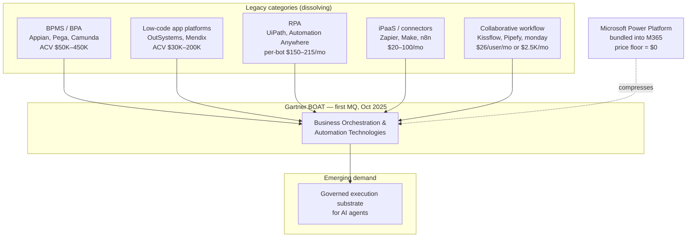
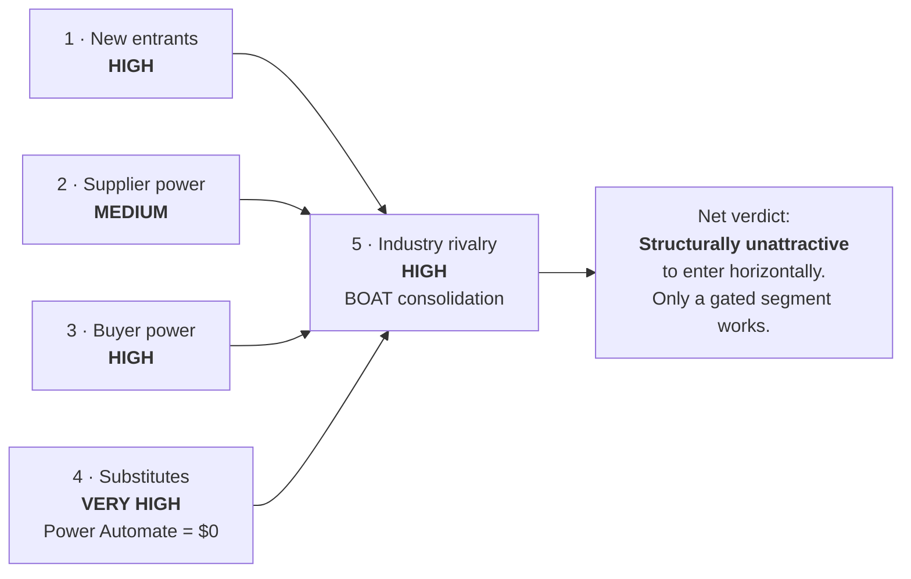
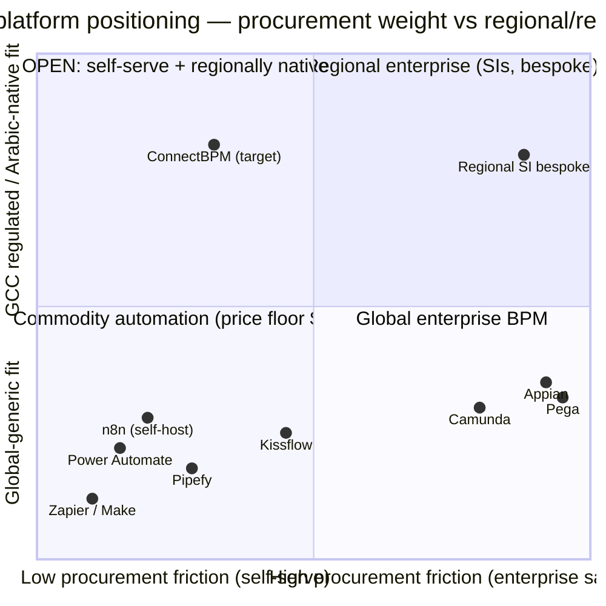
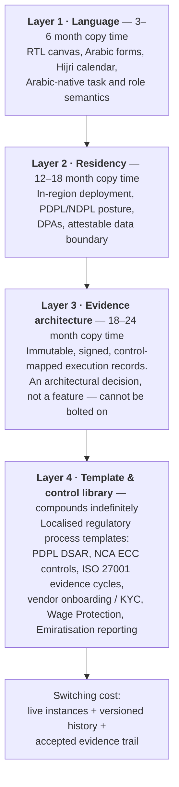
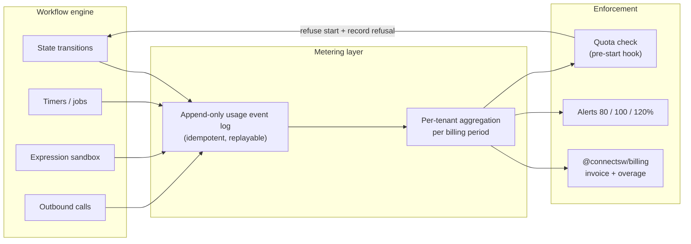
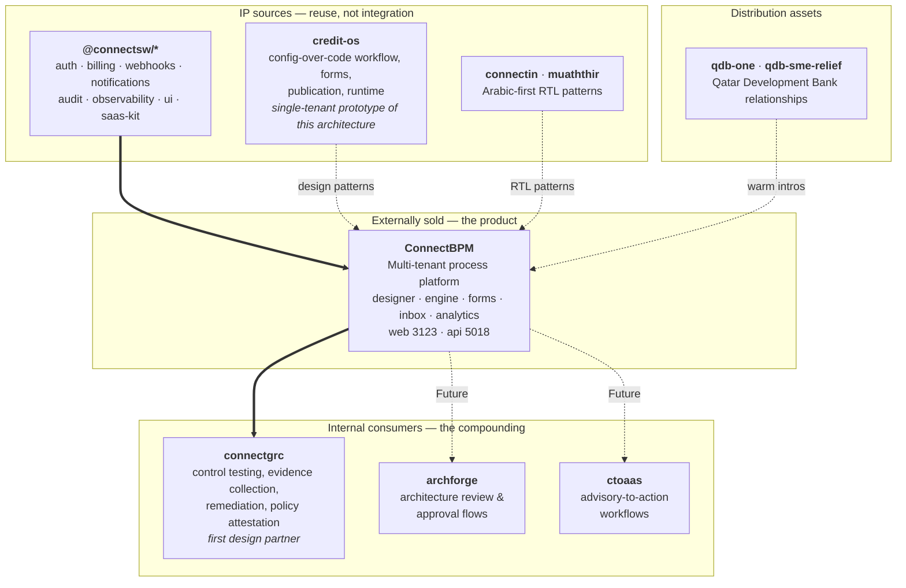
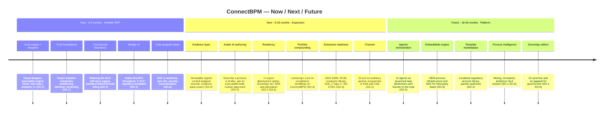
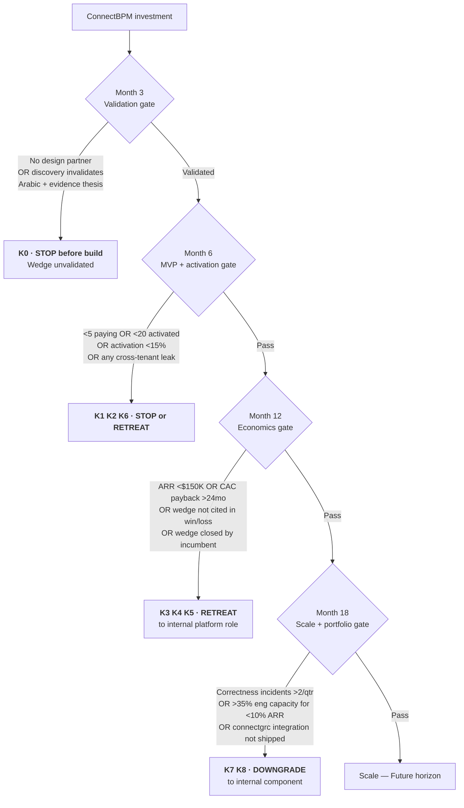

# Opportunity Assessment & Go-To-Market Strategy — ConnectBPM

| Field | Value |
|-------|-------|
| **Task** | STRAT-01 |
| **Product** | `connectbpm` |
| **Author** | Product Strategist |
| **Date** | 2026-08-20 |
| **Status** | For CEO review |
| **Companion docs** | `products/connectbpm/docs/business-analysis.md` (BA-01, owned by Business Analyst) · `products/connectbpm/.claude/addendum.md` (seed context) |
| **Research notes** | `products/connectbpm/.claude/scratch/STRAT-01-research-notes.md` |

---

## 1. Executive Summary

ConnectBPM enters a **large, growing, and structurally hostile market**. Global BPM software is USD 21–26B growing 14–20% CAGR, and the adjacent low-code market exceeds USD 30B — but the price floor in this market is **zero**, because Microsoft bundles Power Automate into every Microsoft 365 business plan. Any strategy that ignores that fact is fiction.

The honest conclusion of this assessment is: **a generic, horizontal, global BPM suite from ConnectSW would fail.** We have no brand, no enterprise sales motion, no certifications, and no distribution. Competing on "visual designer + engine + forms + inbox + analytics" against Appian, Camunda, Kissflow and a free Microsoft bundle is a losing trade.

There is, however, a defensible position. Three facts intersect:

1. **Saudi PDPL is in full enforcement and SDAIA mandates in-Kingdom residency for government and sensitive personal data.** Data residency is a *procurement gate* — it disqualifies vendors before price is discussed. Gates are barriers, and barriers are what a small entrant needs.
2. **No BPM/workflow suite is credibly marketed as Arabic-first with native RTL process design.** ConnectSW has shipped Arabic-first RTL twice (`connectin`, `muaththir`). Global vendors treat Arabic as a translation layer, not a design constraint.
3. **ConnectSW already sells into the compliance-adjacent space** (`connectgrc`, 6 GRC domains) and already has GCC institutional access (`qdb-one`, `qdb-sme-relief` — Qatar Development Bank).

**Recommended wedge: compliance-grade process automation for the GCC — Arabic-first, in-region, audit-evidence-native.** AI-native process authoring is a *feature we must have*, not the wedge: Microsoft's Copilot Studio Agentic Workflow Builder reached GA on 20 May 2026 and n8n ships an AI Workflow Builder. Natural-language-to-workflow is a 24-week moat, not a 24-month one.

**Recommended pricing metric: completed process instances, not seats.** Per-seat pricing puts us in a direct comparison with Power Automate Premium at USD 15/user/month, which we lose on brand alone. Instance-based hybrid pricing (platform fee + metered instances, unlimited task participants) aligns with value, matches where the market is moving (hybrid pricing 27% → 43% of SaaS companies in 12 months), and neutralises the seat comparison. This imposes **hard metering requirements on the workflow engine** — enumerated in §7.3 and non-negotiable.

**Recommended portfolio play: compounding, not standalone.** ConnectBPM should be built as an externally sellable multi-tenant product with a clean internal API boundary from day one, with `connectgrc` as its first internal design partner. `credit-os` already contains a single-tenant, configuration-over-code workflow/forms/publication/runtime engine — that is reusable IP *and* a duplication risk that must be arbitrated in ARCH-01, not left ambiguous.

**Kill criteria are defined in §10** and are the most important section of this document. ConnectSW has 18 products and only 2 at Active tier. A 19th product that demands deep distributed-systems engineering must earn its capacity allocation continuously, not once.

---

## 2. Market Sizing — TAM / SAM / SOM

### 2.1 Two markets, not one

The brief correctly flags that the classic BPM suite market and the no-code workflow market are converging but priced an order of magnitude apart. Gartner has now formalised the convergence: in **October 2025 it published the first Magic Quadrant for Business Orchestration and Automation Technologies (BOAT)** — a category that fuses BPA, LCAP, iPaaS, IDP, RPA, collaborative workflow and document management, and which Gartner frames as the control plane for agentic automation.

**Strategic read:** "BPM suite" is no longer a category a buyer shops for in isolation. ConnectBPM must be positioned either *inside* BOAT (impossible — we cannot match breadth) or in a **segment that BOAT vendors structurally under-serve**. §5 selects that segment.

### 2.2 TAM — global BPM software

Three independent sources, converging on USD 21–26B today:

| Source | Base year value | Forecast | CAGR |
|--------|-----------------|----------|------|
| [Grand View Research](https://www.grandviewresearch.com/industry-analysis/business-process-management-bpm-market) | USD 21.51B (2025) | USD 61.17B by 2030 | 20.3% |
| [Precedence Research](https://www.precedenceresearch.com/business-process-management-market) | USD 20.84B (2025) | USD 76.26B by 2035 | 13.85% |
| [Fortune Business Insights](https://www.fortunebusinessinsights.com/business-process-management-bpm-market-102639) | USD 25.88B (2026) | USD 91.87B by 2034 | 17.2% |

Adjacent market for cross-reference: [Gartner](https://www.gartner.com/en/documents/7146430) forecasts low-code development technologies to exceed **USD 30B in 2026**, reaching **USD 58.2B by 2029** (14.1% CAGR). Gartner's reported top low-code use cases are *forms and data collection* (58% of organisations) and *business workflow automation* (49%) — which is precisely ConnectBPM's product definition. The demand is real; the question is only whether we can capture any of it.

**TAM used in this assessment: USD 23B (2026), global BPM software.** We adopt the midpoint rather than the most flattering figure.

> ⚠️ **TAM discipline note** (learned from the `stablecoin-gateway` error, PS memory `common_mistakes[0]`): the USD 23B figure is an analyst top-down number and includes services, on-premise licences, and enterprise deals ConnectBPM cannot bid for. It is context, **not** an addressable opportunity. The SAM below is built bottom-up from customer count × ACV, which is the number that governs decisions.

### 2.3 SAM — bottom-up, GCC regulated mid-market

We deliberately scope SAM to the segment the recommended wedge (§5) can actually serve: **GCC organisations with 50–2,000 employees, in regulated or compliance-exposed sectors, buying a cloud process platform with in-region residency and Arabic language support.**

| Step | Input | Value | Source / basis |
|------|-------|-------|----------------|
| A | Active commercial registrations, Saudi Arabia | 1,700,000 | [Monsha'at, Q3 2025](https://saudigazette.com.sa/article/655282) |
| B | UAE + Qatar + Kuwait + Bahrain + Oman registered businesses | ~1,300,000 | Assumption A1 — extrapolated from UAE's stated target of 1M SMEs by 2030/31 ([UAE Ministry of Economy](https://www.moet.gov.ae/en/entrepreneurs-and-smes)) plus smaller-state estimates |
| C | GCC registered businesses (A + B) | ~3,000,000 | Derived |
| D | Share with ≥50 employees and a discretionary software budget | 2% | Assumption A2 — see §11 |
| E | **Addressable organisations** | **~60,000** | C × D |
| F | Realistic serviceable share (sectors + language + residency fit) | 60% | Assumption A3 |
| G | **Serviceable organisations** | **~36,000** | E × F |
| H | Blended target ACV | USD 11,000/yr | §7 pricing model, blended across Starter/Growth/Business |
| I | **SAM** | **≈ USD 400M/yr** | G × H |

Sanity anchor: the Middle East digital transformation market is USD 71.64B in 2026 growing at 15.32% CAGR ([Mordor Intelligence](https://www.mordorintelligence.com/industry-reports/middle-east-digital-transformation-market)), with Saudi Arabia alone at USD 7.51B (2025) → USD 15.06B (2030) and 34.11% of regional spend. A USD 400M process-automation SAM is ~0.6% of regional DX spend — conservative and plausible.

### 2.4 SOM — 3-year obtainable

SOM is what ConnectSW can realistically win given **no brand, no field sales in year 1, and self-serve plus founder-led GCC relationships as the only channel.**

| Horizon | Paying SaaS tenants | Enterprise / Sovereign contracts | Blended ACV | ARR | % of SAM |
|---------|--------------------|---------------------------------|-------------|-----|----------|
| Month 12 | 40 | 0 | USD 7,200 | **USD 288K** | 0.07% |
| Month 24 | 180 | 3 | USD 9,600 | **USD 1.9M** | 0.48% |
| Month 36 | 450 | 12 | USD 12,000 | **USD 5.5M** | 1.4% |

**SOM = USD 5.5M ARR at month 36 (~1.4% of SAM).**

Assumptions behind SOM are stated explicitly in §9.4 and validated or falsified by the kill criteria in §10. The single most fragile assumption is **40 paying tenants in year 1 with no sales team**. If that fails, the self-serve thesis fails, and the kill criteria fire.

---

## 3. Porter's Five Forces

### 3.1 Threat of new entrants — HIGH

Building a workflow engine used to be a multi-year undertaking. It is not any more. Open-source engines (Flowable, Temporal, Camunda 7 derivatives), open canvas libraries (`bpmn-js`, React Flow), and AI-assisted development have collapsed the cost of a credible v1. ConnectSW itself is proof: we intend to do exactly this.

The barrier in this market is **not technology — it is distribution, trust, and certification.** That cuts both ways: it means we can build, and it means everyone else can too. It also means our own build is not a moat, which is why §5 refuses to treat "we can build a good engine" as differentiation.

### 3.2 Bargaining power of suppliers — MEDIUM

Infrastructure (Postgres, Redis, compute) is commodity — low supplier power. Two real exposures:

- **LLM providers.** The AI authoring feature and any future agentic orchestration make model vendors a genuine supplier with pricing power over our COGS. Mitigation: meter AI usage separately (§7.3), pass through with margin, keep the core product functional without AI.
- **Canvas / notation libraries.** If we adopt `bpmn-js` (bpmn.io), we inherit its licence terms and roadmap. This is an ARCH-01 decision with commercial consequences, and should be treated as such.

### 3.3 Bargaining power of buyers — HIGH

- Buyers can anchor every negotiation against **zero** (bundled Power Automate) or against **USD 15/user/month** (Power Automate Premium).
- Mid-market buyers have a dozen credible alternatives and no switching cost until they have processes running in our engine. Switching cost only accrues *after* adoption — which makes activation, not acquisition, the metric that matters.
- Regulated GCC buyers add procurement power: they will demand SOC 2, ISO 27001, DPAs, residency attestation, and penetration test reports before signing. We have **none of these today** (§4).
- Counterweight: once a customer has 20 live processes with running instances and a year of history, switching is genuinely painful. Our entire retention strategy rests on getting there.

### 3.4 Threat of substitutes — VERY HIGH (the defining force)

This is the force that reshapes the whole strategy, and it deserves to be stated bluntly.

**Microsoft 365 E1, E3, E5, F3, Business Basic, Business Standard and Business Premium all include Power Automate for automated, scheduled and instant flows using standard connectors** ([Zapier's 2026 pricing breakdown](https://zapier.com/blog/power-automate-pricing/), [Microsoft Learn](https://learn.microsoft.com/en-us/power-automate/copilot-overview)). Premium connectors, Dataverse storage, process mining and 5,000 AI Builder credits/month cost **USD 15/user/month**. Unattended RPA is USD 150/bot/month.

The implications are not subtle:

| Implication | Consequence for ConnectBPM |
|-------------|---------------------------|
| Marginal price of "good enough" workflow automation is **$0** for anyone already on M365 | We can never win a generic "we do workflows" pitch. Ever. |
| Microsoft owns the identity, the mail, the files, the chat and the spreadsheet | Integration depth we cannot match on Microsoft's home turf |
| **Copilot Studio Agentic Workflow Builder went GA on 20 May 2026** — describe automation in natural language, Copilot generates and configures steps | **AI process authoring is not a differentiator.** It is table stakes shipped by the incumbent five months before we start. |
| Power Automate Copilot already creates, modifies and troubleshoots flows in natural language | Same conclusion, reinforced |

Other substitutes, each real:

- **Zapier / Make / n8n** — cheap, self-serve, and n8n ships its own [AI Workflow Builder](https://docs.n8n.io/advanced-ai/ai-workflow-builder/). Strong for integration-shaped automation, weak for long-running human-in-the-loop processes with SLAs and audit trails.
- **Work management tools** (monday.com, Asana, Jira) — already installed, "good enough" for approval chains.
- **ERP/core-system embedded workflow** (SAP, Oracle, ServiceNow) — free with the system of record, wins whenever the process lives inside one application.
- **Spreadsheets, email and WhatsApp** — the actual incumbent in GCC mid-market. Gartner's data shows *replacing spreadsheets and paper processes* is a top-three low-code use case (42% of organisations). This is simultaneously our biggest competitor and our biggest opportunity.

**Where substitutes are weak — and this is the entire opening:**

1. Processes that must produce **defensible audit evidence** (who approved what, under which policy version, with which controls satisfied). Power Automate produces run history, not compliance evidence.
2. Processes bound by **data residency** — where SDAIA/PDPL requires in-Kingdom storage and a global multi-tenant SaaS cannot attest to it.
3. Processes whose participants **work in Arabic**, where an RTL form, Hijri dates and Arabic-native task semantics are the difference between adoption and shelfware.
4. **Long-running, versioned, human-centric processes** — weeks-long, with timers, escalations, and running instances pinned to definition versions. This is genuine BPM territory that flow-automation tools handle badly.

### 3.5 Industry rivalry — HIGH

Mature market, many well-funded vendors, and now an explicit consolidation dynamic: Gartner's inaugural BOAT MQ (Oct 2025) is pushing every vendor to broaden into adjacent categories, with [Appian named a Leader](https://appian.com/about/explore/press-releases/2025/appian-is-named-a-leader-in-inaugural-gartner-magic-quadrant-for-business-orchestration-and-automation-technologies). Pricing at the enterprise end is opaque (Camunda and Nintex publish nothing; Camunda discontinued its Starter plan entirely, removing the low end), and the mid-market end is a features-and-price race.

### 3.6 Verdict

| Force | Level | One-line judgement |
|-------|-------|--------------------|
| New entrants | HIGH | Anyone can build the engine; the moat is not technical |
| Supplier power | MEDIUM | LLM vendors and canvas library licensing are real exposures |
| Buyer power | HIGH | Anchored against $0; procurement gates we cannot yet pass |
| Substitutes | **VERY HIGH** | Power Automate is bundled and now generates flows from natural language |
| Rivalry | HIGH | BOAT consolidation, opaque enterprise pricing, feature race |

**Strategic conclusion:** this is an unattractive market to enter *horizontally*. It is attractive only where a **regulatory or linguistic gate excludes the substitutes**. Everything in §5 onward follows from that sentence.

---

## 4. SWOT — ConnectSW entering the BPM market

This section is grounded in `.claude/PRODUCT-REGISTRY.md` and `products/connectbpm/.claude/addendum.md`, not in generic startup platitudes.

### 4.1 Strengths (real, verifiable)

| # | Strength | Evidence |
|---|----------|----------|
| S1 | **Shared SaaS package library** — auth, billing, webhooks, notifications, audit, observability, UI, saas-kit | `@connectsw/auth`, `@connectsw/billing`, `@connectsw/webhooks`, `@connectsw/notifications`, `@connectsw/audit`, `@connectsw/observability`, `@connectsw/ui`, `@connectsw/saas-kit` (addendum, mandatory-reuse table). Multi-tenant SaaS plumbing is weeks of work, not quarters. |
| S2 | **Proven Arabic-first / RTL delivery** | `connectin` (Active tier, Arabic-first, most-audited product in the portfolio); `muaththir` (Arabic-primary, RTL required); `linkedin-agent` (bilingual AI generation) |
| S3 | **Config-over-code workflow IP already exists** | `credit-os`: "meta-driven composable... configuration-over-code platform (product, eligibility, decisioning, **workflow, forms**, documents, integrations, validation, **publication, runtime**)" with `json-rules-engine`. A single-tenant prototype of ConnectBPM's core architecture. |
| S4 | **Compliance-domain adjacency** | `connectgrc` — AI-native GRC platform across 6 GRC domains, full spec-kit pipeline. Domain vocabulary, and a captive first customer for a process layer. |
| S5 | **GCC institutional access** | `qdb-one` (integrates Qatar Development Bank's Direct Financing, Advisory and Guarantees portals) and `qdb-sme-relief`. Real relationships with a regional development bank — the only distribution asset we actually possess. |
| S6 | **AI-native product development velocity** | Entire company operates as spec-driven AI agents under a constitution with enforced quality gates. Feature cycle time is a genuine structural advantage against incumbents. |
| S7 | **Engineering discipline is codified** | Constitution Articles I–XIV: spec-first, TDD with real dependencies, 80% coverage, traceability, quality gates. For a product where correctness *is* the value proposition, this matters commercially. |

### 4.2 Weaknesses (stated plainly — this is where strategies die)

| # | Weakness | Why it hurts here specifically |
|---|----------|-------------------------------|
| W1 | **Zero brand and zero distribution in enterprise software procurement** | BPM is bought by CIOs and process owners after vendor evaluation. Nobody has heard of ConnectSW. There is no analyst coverage, no G2 presence, no reference customers, no partner channel. This is the binding constraint on the entire plan. |
| W2 | **No security certifications** — no SOC 2, no ISO 27001, no CSA STAR, no penetration test reports | In regulated GCC procurement this is not a disadvantage, it is a **disqualification**. It blocks the exact buyers the recommended wedge targets. Certification is a 9–15 month path and must start in the Now horizon. |
| W3 | **No enterprise sales motion, no solution engineers, no implementation partners** | BPM deals above USD 30K ACV do not close self-serve. The Sovereign tier in §7 has no delivery capability behind it today. |
| W4 | **Portfolio is broad and thin** | 18 products; only **2 at Active tier** (`stablecoin-gateway`, `connectin`), 14 in Development. Adding a 19th that requires deep distributed-systems work is a real capacity risk, not a theoretical one. |
| W5 | **No in-region hosting footprint** | The residency wedge depends on being able to run in KSA/UAE/Qatar. We cannot do that today, and the cost and operational burden are unquantified. Assumption A4, §11. |
| W6 | **No production experience operating a multi-tenant execution engine** | `credit-os`'s workflow module is explicitly *single-tenant, multi-tenant-ready*. Exactly-once state transitions, durable timers, definition versioning with running-instance pinning, and untrusted-expression sandboxing are hard problems we have not solved at scale. The addendum names tenant isolation as "existential". |
| W7 | **No customer evidence — the market thesis is desk research** | Every claim in §2 and §5 is secondary research. We have not interviewed a single GCC process owner. §11 exists because of this. |

### 4.3 Opportunities

| # | Opportunity | Basis |
|---|-------------|-------|
| O1 | **Data residency as a procurement gate** — Saudi PDPL in full enforcement (grace period ended); SDAIA requires government data in-Kingdom and localisation of sensitive personal data by default; 48 violation decisions issued 2025–26 | [SDAIA/PDPL compliance guidance](https://www.sgc.consulting/sdaia-saudi-personal-data-protection-law-pdpl-compliance-guide/), [US trade.gov market intelligence on enforcement](https://www.trade.gov/market-intelligence/saudi-arabia-ict-cross-border-data-transfer-rules-now-under-enforcement) |
| O2 | **Arabic-first process design is an unoccupied position** | No BPM/workflow suite found marketing native Arabic/RTL process authoring. Treated as unvalidated — see A5, §11. |
| O3 | **Regional digitisation spend** — ME DX market USD 71.64B (2026) → USD 146.09B (2031), 15.32% CAGR; Saudi 34.11% of it | [Mordor Intelligence](https://www.mordorintelligence.com/industry-reports/middle-east-digital-transformation-market) |
| O4 | **Spreadsheet/paper replacement is the top job to be done** — 42% of organisations cite it as a primary low-code use case; forms & data collection 58%; workflow automation 49% | [Gartner low-code forecast coverage](https://kissflow.com/low-code/gartner-forecasts-on-low-code-development-market/) |
| O5 | **Pricing model shift creates room to differentiate commercially** — seat-based pricing fell 21%→15% of SaaS companies in 12 months; hybrid rose 27%→43%, projected 61% by end-2026 | [State of B2B SaaS & AI Monetization 2026](https://www.growthunhinged.com/p/the-state-of-b2b-monetization-in-2026) |
| O6 | **Agentic automation needs a governed execution substrate** — Gartner frames BOAT as the control plane for agentic automation | [Gartner BOAT market overview](https://www.gartner.com/en/documents/7837181) |
| O7 | **SME segment is the fastest-growing BPM sub-segment** (~20% CAGR) and is under-served by USD 50K+ vendors | Grand View Research |

### 4.4 Threats

| # | Threat | Severity |
|---|--------|----------|
| T1 | **Microsoft bundling** — Power Automate free with M365; Premium at USD 15/user/mo | Critical — permanently caps our pricing power in any non-gated segment |
| T2 | **NL→workflow already commoditised** — Copilot Studio Agentic Workflow Builder GA 20 May 2026; n8n AI Workflow Builder shipped | Critical — invalidates AI authoring as a standalone wedge |
| T3 | **Open-source substitution** — Temporal, Flowable, n8n self-hosted; a technical GCC buyer can self-host for infrastructure cost | High |
| T4 | **Regional SIs building bespoke** — GCC system integrators deliver custom workflow builds inside larger transformation programmes | High — they own the customer relationship we lack |
| T5 | **Cross-tenant data leak** | Existential. Customer-authored expressions execute on our infrastructure (addendum, Special Consideration 2). One leak ends the product and damages the company. |
| T6 | **Engine correctness failure** — lost or duplicated work | Existential. "A workflow engine that loses or duplicates work is worthless" (addendum). |
| T7 | **Price compression** — Camunda discontinued its Starter plan, ceding the low end; the mid-market is a race to the bottom | Medium |
| T8 | **Portfolio attention dilution** — ConnectBPM starves or is starved by 14 other Development-tier products | High — addressed by kill criterion K8 |

### 4.5 SWOT synthesis

The strengths are **build-side** (we can ship it fast, cheaply, in Arabic, with compliance DNA). The weaknesses are **sell-side** (nobody knows us, and we cannot pass procurement). Therefore:

> **The strategy must be one where the product's characteristics do the selling, because the company cannot.** That means picking a segment where a *gate* — regulatory, linguistic, or evidentiary — filters out the vendors who would otherwise beat us on brand.

---

## 5. Differentiation Wedge — Options, Scoring, Recommendation

### 5.1 Positioning map

The upper-left quadrant — **self-serve purchasable *and* regionally native** — is empty. Global vendors sit low on regional fit; regional fit today is delivered only by SIs at high procurement friction. That gap is the wedge.

### 5.2 Candidate wedges

| ID | Wedge | Thesis |
|----|-------|--------|
| **WD-1** | **AI-native process authoring** | Describe a process in natural language, get an executable, versioned workflow with forms and roles. Global, horizontal. |
| **WD-2** | **GCC / Arabic-first sovereign BPM** | Arabic-native process design (RTL canvas, Arabic forms, Hijri calendar, Arabic task semantics) + in-region data residency + PDPL/NDPL alignment. |
| **WD-3** | **Compliance & GRC-adjacent vertical** | Processes that must generate defensible audit evidence: control testing, policy attestation, DSAR handling, vendor onboarding, incident response. Leverages `connectgrc`. |
| **WD-4** | **Embeddable / OEM process engine** | White-label workflow-as-infrastructure for other SaaS products (starting with ConnectSW's own `connectgrc`, `credit-os`, `archforge`). "Stripe for workflows." |

### 5.3 Scoring

Scale 1–5. Weights reflect what actually determines survival for a company with W1 (no brand) and W2 (no certifications).

| Criterion | Weight | Rationale for weight |
|-----------|--------|----------------------|
| Market size | 20% | Must be big enough to matter, but every option here clears the bar |
| Strategic fit | 25% | Fit with ConnectSW's actual assets (S1–S7) is what makes execution possible at all |
| **Defensibility (24-month)** | **35%** | Highest weight. With no brand, a wedge that closes in a year is worthless. |
| Time-to-credibility | 20% | How fast can we produce a referenceable customer? Slow = we run out of patience before evidence arrives |

| Wedge | Market size | Strategic fit | Defensibility | Time-to-credibility | **Weighted** |
|-------|-------------|---------------|---------------|---------------------|--------------|
| WD-1 AI-native authoring | 5 | 4 | **1** | 4 | **2.95** |
| WD-2 GCC / Arabic-first sovereign | 3 | 5 | **4** | 4 | **4.05** |
| WD-3 Compliance / GRC-adjacent | 3 | 5 | **4** | 3 | **3.85** |
| WD-4 Embeddable / OEM engine | 4 | 4 | 3 | **2** | **3.25** |

**Score notes — the reasoning matters more than the arithmetic:**

- **WD-1 defensibility = 1.** This is the whole point. Microsoft shipped Copilot Studio's Agentic Workflow Builder to GA on **20 May 2026**; Power Automate Copilot generates, modifies and troubleshoots flows in natural language; n8n ships an AI Workflow Builder. Our AI authoring would be *better than nothing and worse than Microsoft's* within one release cycle. A wedge whose moat is "we prompt an LLM well" is a **24-week** advantage, not 24 months.
- **WD-2 defensibility = 4.** Residency is a legal gate, not a feature; Arabic-first is a design commitment global vendors will not prioritise for a market that is single-digit percent of their revenue. Not a 5 because a determined regional competitor could copy it in 18–24 months.
- **WD-3 defensibility = 4**, but **time-to-credibility = 3** — compliance buyers are slower and demand the certifications we lack (W2).
- **WD-4 time-to-credibility = 2** — OEM/embedded sales cycles are long and require API maturity and stability guarantees we will not have for 18 months. It is a *Future* play, not a wedge.

### 5.4 Recommendation

> ## Recommended wedge: **WD-2 ∩ WD-3**
> ### "Compliance-grade process automation for the GCC — Arabic-first, in-region, audit-evidence-native."

WD-2 and WD-3 are not competing options; they are the two halves of one position. WD-2 supplies the *gate* (residency + language) that keeps Microsoft out. WD-3 supplies the *value* (defensible evidence) that justifies paying for something the buyer could theoretically get free. Neither is sufficient alone:

- WD-2 alone → "the Arabic Power Automate." A localisation play. Beatable by a translation layer.
- WD-3 alone → "compliance workflows." Global, crowded, and we lose on brand and certifications.
- **Together** → "the process platform a Saudi bank's compliance officer can actually buy, in a language their staff actually work in, that produces evidence their regulator actually accepts."

**WD-1 (AI authoring) is repositioned as an accelerant, not the wedge.** It ships in the Next horizon as *Arabic-language process authoring* — describe a process in Arabic, get an executable workflow. That framing is defensible (Arabic-language process semantics) where the generic framing is not.

**WD-4 (OEM engine) is the Future platform play** (§8), enabled by the internal API boundary we build from day one.

### 5.5 Why this is defensible for 24 months, not 24 weeks

Four compounding layers, in increasing order of durability:

- **Layer 1** is copyable but *unattractive* to copy — Microsoft will not re-architect its designer for RTL-first for a market this size.
- **Layer 2** is a legal and operational barrier. Global SaaS vendors clear it slowly and expensively; several simply do not.
- **Layer 3** is the real moat. An audit-evidence-native engine — where every state transition emits an immutable, signed, control-mapped record — is an architectural commitment made on day one or never. Run history is not evidence. Retrofitting evidence semantics onto an existing engine is a rewrite.
- **Layer 4** compounds. Every localised regulatory process template we ship is an asset a competitor must re-earn. This is the layer that carries us past month 24.

**And a switching cost accrues on top:** once a customer has live instances pinned to published definition versions, with a year of retained history that their auditor has already accepted, migrating is a compliance event. That is the strongest retention mechanic available in this market — and it is why activation (§9) is the metric to manage, not signups.

---

## 6. ICP, Jobs To Be Done, and Competitive Landscape

### 6.1 Ideal Customer Profile (beachhead)

| Attribute | Beachhead ICP |
|-----------|---------------|
| **Geography** | Saudi Arabia and UAE first; Qatar, Kuwait, Bahrain, Oman follow |
| **Size** | 50–2,000 employees |
| **Sectors** | Financial services (banks, finance companies, insurers), healthcare providers, government-adjacent entities and their suppliers, professional services with regulatory exposure |
| **Buyer** | Head of Compliance / Risk, Head of Operations, or COO — **not** the CIO |
| **Champion** | The process owner drowning in email approvals and Excel trackers |
| **Blocker** | IT/Security (residency, certifications) and Procurement |
| **Trigger events** | PDPL enforcement action or readiness audit; an external audit finding; a failed manual control; ERP implementation exposing process gaps; a new regulatory reporting obligation |
| **Disqualifiers** | Deeply Microsoft-committed with a mature Power Platform CoE; purely integration-shaped needs (send them to n8n); needs enterprise-grade RPA |

### 6.2 Jobs To Be Done

| JTBD | Current solution | Why it fails | ConnectBPM's answer |
|------|------------------|--------------|---------------------|
| **Functional** — "Get this approval chain out of email and Excel and make it run on its own" | Email + shared spreadsheet + WhatsApp follow-ups | No SLA visibility, no reliable status, work silently drops | Visual designer + engine + task inbox with SLAs and escalations |
| **Functional** — "Prove to the auditor that this control operated every month for the last year" | Screenshots, manual evidence collection, a folder | Weeks of preparation; evidence is reconstructed, not captured | Evidence-native execution records: immutable, signed, control-mapped, exportable |
| **Functional** — "Let my Arabic-speaking staff actually use it" | English-only tool + a training burden | Adoption failure; the process reverts to paper | Arabic-first RTL design, forms, and task inbox |
| **Functional** — "Keep the data in the Kingdom" | On-premise custom build, or nothing | Expensive, slow, unmaintained | In-region deployment option with an attestable data boundary |
| **Social** — "Don't make me look like the department that can't modernise" | — | — | Ship a working process in days, demonstrable to the board |
| **Emotional** — "Stop being afraid of the next audit" | — | — | Continuous evidence rather than an annual scramble |

### 6.3 Value proposition statement

> **For** compliance-exposed operations and risk leaders in GCC mid-market organisations
> **Who** run critical, auditable processes on email and spreadsheets and cannot use global cloud workflow tools because of data residency and Arabic language requirements,
> **ConnectBPM is** a business process management platform
> **That** lets them design, run and monitor their own workflows in Arabic, hosted in-region, producing audit-grade evidence automatically,
> **Unlike** Power Automate, Kissflow or a bespoke SI build,
> **We** make the audit trail a first-class output of the engine rather than an afterthought, and we make Arabic a design language rather than a translation layer.

### 6.4 Competitive matrix

| Vendor | Offering | Strengths | Weaknesses vs our wedge | Pricing |
|--------|----------|-----------|------------------------|---------|
| **Microsoft Power Automate** | Flow automation in M365 | Bundled, ubiquitous, deep M365 integration, NL authoring GA May 2026 | Global multi-tenant residency posture; RTL is a translation layer; run history ≠ compliance evidence; weak long-running human-centric BPM | **$0** bundled; $15/user/mo Premium; $150–215/bot/mo RPA |
| **Camunda** | Developer-first process orchestration (BPMN) | Best-in-class engine, standards-based, high scale | Developer-only; Starter plan discontinued; opaque pricing; no self-serve entry; no Arabic story | ~$50K–200K+/yr; one quote $65K/yr @ 500K instances/mo |
| **Appian** | Enterprise BOAT platform, MQ Leader | Breadth, analyst validation, enterprise credibility | Price and procurement weight exclude mid-market entirely | Reported $280K–450K |
| **Kissflow** | No-code work platform | Clean UX, fast time-to-value | Flat-tier entry price is steep for mid-market; no residency or Arabic-first position | Basic from ~$2,500/mo |
| **Pipefy** | No-code process management | Transparent per-user pricing, free tier | Per-user model penalises broad participation; no evidence architecture; no GCC posture | Free ≤10 users; ~$26/user/mo |
| **Nintex** | Process automation + RPA | Strong document/forms heritage | Opaque pricing; enterprise procurement | Custom quote |
| **n8n / Zapier / Make** | Integration automation | Cheap, self-serve, developer-loved, AI builders shipped | Integration-shaped, not human-centric long-running BPM; no compliance evidence; no residency guarantees | ~$20–100/mo |
| **Regional SI bespoke** | Custom-built workflow inside a transformation programme | Owns the customer relationship; residency solved by construction | Expensive, slow, unmaintainable, no product economics | Project-priced |

**The gap ConnectBPM occupies:** transparent, self-serve-to-mid-market pricing (which Camunda, Appian, Nintex do not offer) **combined with** residency, Arabic-first design and evidence architecture (which Power Automate, Pipefy, n8n and Kissflow do not offer).

---

## 7. Pricing and Packaging Strategy

### 7.1 The pricing decision that matters most

**Do not price per seat.** This is the single most consequential commercial decision in this document.

Per-seat pricing places ConnectBPM in direct comparison with Power Automate Premium at **USD 15/user/month** — a comparison we lose on brand before features are discussed. It also actively damages the product: a business process touches many occasional participants (an approver who acts twice a month), and charging for them suppresses exactly the adoption that creates our switching cost.

The market is moving the same direction: seat-based pricing fell from 21% to 15% of SaaS companies in twelve months while hybrid models rose from 27% to 43%, projected to reach 61% by end of 2026, and Gartner expects ≥40% of enterprise SaaS spend to be usage-, agent- or outcome-based by 2030.

> **Recommended metric: the completed process instance.**
> Charge a platform fee plus metered process instances. **Task participants are unlimited and free on every paid tier.** Designer (authoring) seats are capped per tier as a packaging lever, not as the primary meter.

Why the instance is the right metric:
- It correlates with delivered value (work actually processed), so cost rises only when the customer is succeeding.
- It matches how the serious end of the market already prices (Camunda meters process-instance volume), which makes us legible to sophisticated buyers.
- It sidesteps the seat war with Microsoft entirely.
- It makes unlimited participation free, which maximises adoption depth and therefore switching cost.

### 7.2 Tier structure

| Tier | Price | Published processes | Instances/mo | Designer seats | Participants | Key entitlements |
|------|-------|--------------------|--------------|----------------|--------------|------------------|
| **Sandbox** (free) | USD 0 | 1 | 250 | 3 | Unlimited | Community support, ConnectSW branding, 30-day history, no SSO, no in-region option |
| **Starter** | USD 299/mo | 5 | 2,500 | 5 | Unlimited | Email + webhook actions, 90-day history, Arabic pack, standard support |
| **Growth** | USD 899/mo | 25 | 15,000 | 15 | Unlimited | SSO, process analytics, sandbox environment, 1-year history, public API, template library |
| **Business** | USD 2,499/mo | Unlimited | 60,000 | 40 | Unlimited | SAML + SCIM, **evidence pack export**, control mapping, 3-year retention, SLA, priority support |
| **Sovereign / Enterprise** | From USD 60,000/yr | Unlimited | Negotiated | Negotiated | Unlimited | **In-region single-tenant or VPC deployment**, residency attestation, DPA, custom retention, named CSM, professional services |
| **Overage** | USD 0.04/instance | — | Beyond quota | — | — | Soft cap with alerts at 80/100/120%; hard cap configurable per tenant |
| **Add-on: AI authoring** | Metered credits | — | — | — | — | Priced separately — LLM cost pass-through with margin; never bundled into the base tier |

**Benchmark check:** Sovereign entry at USD 60K/yr sits just above Camunda's reported ~USD 50K+ entry and far below Appian's USD 280–450K, while Starter/Growth occupy the USD 299–899/mo band that Camunda abandoned when it discontinued its Starter plan and that Kissflow's ~USD 2,500/mo floor prices out. That band is the commercial opening.

**Free tier purpose** — it is not charity, it has three jobs: (1) prove activation is possible without sales touch, (2) seed the localised template gallery with real usage, (3) generate the win/loss interview pool the validation plan in §11 depends on. It is deliberately capped at 1 published process so it demonstrates value without substituting for Starter.

### 7.3 Required engine-level metering — HARD PRODUCT REQUIREMENT

> **This subsection is a requirement, not a suggestion.** A pricing model the engine cannot measure is a pricing model we cannot enforce, and revenue leakage in a usage-priced product is silent. The Product Manager must carry these into the PRD as functional requirements, and the Architect must treat them as first-class in ARCH-01 — retrofitting metering into a workflow engine after the fact is a rewrite of the state machine's write path.

| # | Metric the engine MUST instrument | Enforces / enables |
|---|-----------------------------------|--------------------|
| M1 | `process_instance.started` / `.completed` / `.terminated` — per tenant, definition ID, **definition version**, timestamp, idempotency key | The primary billing meter |
| M2 | Count of **published** process definitions per tenant (active vs archived, distinguished) | Tier limits on published processes |
| M3 | **Designer seats vs participant seats** — distinct users holding an authoring role in the billing period, separable from task-completion-only users | The "unlimited free participants" promise. Without role-level separation this entitlement leaks and the tier structure collapses. |
| M4 | Task lifecycle events: created / assigned / reassigned / completed / escalated / SLA-breached | SLA analytics, and the option to move to outcome pricing later |
| M5 | Timer and job executions **including retries**, attributable per tenant | Direct COGS driver; also abuse detection |
| M6 | Outbound call volume — webhooks and HTTP connector invocations, per tenant | COGS, fair-use limits, connector tiering |
| M7 | Sandbox execution time, CPU and memory per customer-authored expression/script, per tenant | Cost control **and** the security boundary (addendum, Special Consideration 2). Untrusted code must be resource-capped, and the cap must be measured. |
| M8 | Storage bytes: instance variable payloads, attachments, retained history rows — per tenant, per retention tier | Retention is a paid entitlement; it must be enforced by a deletion job, not merely displayed in the UI |
| M9 | AI authoring usage: prompts, input/output tokens, model ID, cost — per tenant and per user | AI add-on billing and LLM COGS attribution (supplier-power mitigation, §3.2) |
| M10 | Environment count per tenant (sandbox / production / additional) | Tier entitlement |
| M11 | Evidence-pack generation and export events, per tenant | Business-tier entitlement; also an audit trail of who exported evidence |
| M12 | **Idempotent, replayable, reconcilable accounting** — the usage event log must yield exactly-once billing on an at-least-once execution substrate | Non-negotiable. Engine retries must never double-bill, and a replay after an incident must reconcile to the same totals. |
| M13 | **Pre-start quota enforcement hook** — the engine must be able to refuse to start an instance when a tenant is over a hard cap, and must record the refusal as a first-class event | Makes hard caps real; gives Support a diagnosable record instead of a mystery |

All meters integrate through `@connectsw/billing` (Constitution Article II, mandatory reuse). Metering events must be tenant-scoped by the same isolation boundary as all other queries (addendum, Special Consideration 1).

---

## 8. Portfolio Fit and the Platform Play

### 8.1 Recommendation: compounding, with a hard boundary

> **Recommendation: build ConnectBPM as an externally sellable multi-tenant product with a clean internal API boundary from day one, and make `connectgrc` its first internal design partner. This is a compounding play, not a standalone bet — but the compounding must not delay the sellable MVP.**

### 8.2 Why `connectgrc` is the right first internal consumer

1. **Every core GRC activity is a long-running human-centric process** — control testing cycles, evidence collection, remediation tracking, policy attestation campaigns, vendor risk reviews. This is exactly what a BPM engine is for, and exactly what flow-automation tools do badly.
2. **It dogfoods the evidence architecture** — the hardest and most defensible layer of the wedge (§5.5, Layer 3). If `connectgrc`'s compliance workflows cannot produce audit-grade evidence from ConnectBPM's execution records, the wedge is unproven and we find out internally rather than in a customer's audit.
3. **It generates the reference story we cannot buy** — "our GRC platform runs on our process engine" is credible in exactly the segment we are selling into.
4. **It is a captive customer with real requirements**, which is worth more than ten prospect conversations.

### 8.3 The `credit-os` overlap — arbitrate it now, not later

`credit-os` is described in the registry as a "meta-driven composable... configuration-over-code platform (product, eligibility, decisioning, **workflow, forms**, documents, integrations, validation, **publication, runtime**)" — a modular monolith of 13 modules, single-tenant but multi-tenant-ready, using `json-rules-engine`.

That is a **single-tenant, vertical instance of the architecture ConnectBPM needs multi-tenant and horizontal.** It is simultaneously our best source of proven design patterns and our clearest duplication risk. Leaving this ambiguous means two teams building two workflow engines inside one company with 14 Development-tier products already competing for capacity.

> **Recommended boundary — for ARCH-01 to ratify as an ADR:**
>
> | Concern | Owner |
> |---------|-------|
> | Generic process notation, execution engine, timers, versioning, multi-tenant isolation, forms runtime, task inbox, process analytics | **ConnectBPM** |
> | Credit domain semantics — product definitions, eligibility, decisioning rules, financing lifecycle, regulatory credit reporting | **credit-os** |
> | Design patterns for configuration-over-code, publication and runtime separation | **Harvested from `credit-os` into ConnectBPM**; no code fork |
>
> `credit-os` **does not** migrate onto ConnectBPM in the Now or Next horizon. Forcing that migration would couple a Development-tier product's roadmap to an inception-stage engine. Revisit at month 24, once ConnectBPM has production hardening and a stable API.

### 8.4 Cannibalisation and dilution risks

| Risk | Assessment | Action |
|------|------------|--------|
| ConnectBPM cannibalises `credit-os` | Low — different buyers, different domains | Boundary in §8.3 |
| Duplicated workflow engineering across ConnectBPM and `credit-os` | **High** | ADR in ARCH-01; explicit "harvest patterns, do not fork code" instruction |
| `connectgrc` roadmap held hostage to ConnectBPM readiness | **Medium-High** | `connectgrc` integration is **Next (6–18mo)**, never a Now-horizon dependency. `connectgrc` keeps its own workflow handling until ConnectBPM is production-hardened. |
| Portfolio attention dilution — 19 products, 2 Active | **High** | Kill criterion **K8**; quarterly capacity review |
| The Sovereign tier is sold with no delivery capability behind it | **High** | Do not sell Sovereign before month 12; W3 and W5 must be resolved first |

### 8.5 The platform play (Future, WD-4)

The internal API boundary built in the Now horizon for `connectgrc` is the same boundary that later enables **embeddable / OEM process infrastructure** — workflow-as-a-service for third-party SaaS products, in the shape `recomengine` and `stablecoin-gateway` already validated with SDKs. This is deliberately deferred to months 18–36 (§9.2): OEM sales cycles are long and demand API stability guarantees we will not credibly offer before then. **But the boundary must be built now, because it cannot be added later.**

---

## 9. Roadmap and Success Criteria

### 9.1 Strategic objectives

Every roadmap item below traces to one of these. Items that trace to nothing are cut.

| ID | Strategic objective | Rationale |
|----|--------------------|-----------|
| **SO-1** | Ship a sellable MVP whose engine is provably correct | Correctness is the product (addendum, Special Consideration 4). An engine that loses work has negative value. |
| **SO-2** | Win the beachhead — GCC compliance-exposed mid-market, Arabic-first | The wedge (§5.4). Without a beachhead there is no reference, and without a reference W1 never resolves. |
| **SO-3** | Make the pricing model enforceable and unit economics knowable | A usage-priced product without metering leaks revenue silently (§7.3) |
| **SO-4** | Compound with the portfolio via `connectgrc` | Turns a standalone bet into a portfolio asset (§8) |
| **SO-5** | Become the governed execution substrate for agentic automation | Where the category is going — Gartner frames BOAT as the control plane for agentic automation (§2.1) |
| **SO-6** | Clear the procurement gates that currently disqualify us | W2 is a hard blocker on the exact buyers SO-2 targets |

### 9.2 Horizon roadmap

**Now (0–6 months) — the sellable MVP.** Scope discipline is the point.

| Item | Objective | Why it is in Now and not later |
|------|-----------|-------------------------------|
| Visual process designer (simplified notation subset, BPMN-informed) | SO-1 | Core product; full BPMN 2.0 coverage is not required to sell |
| Workflow engine — tokens, state, transitions, timers, exactly-once semantics | SO-1 | The product |
| Forms builder + renderer attached to user tasks | SO-1 | Gartner's #1 low-code use case (58%) |
| Task inbox with SLAs and escalation | SO-1 | Where end-user adoption is won or lost |
| Process analytics v1 — cycle time, throughput, SLA breaches | SO-1 | Minimum credible monitoring |
| Multi-tenant isolation + expression sandboxing | SO-1 | Existential (T5). Cannot be retrofitted. |
| Definition versioning with running-instance pinning | SO-1 | Cannot be retrofitted; addendum Special Consideration 3 |
| **Metering M1–M13** | **SO-3** | Cannot be retrofitted without rewriting the state machine write path |
| **Arabic-first RTL across designer, forms and inbox** | **SO-2** | If Arabic is added later it becomes a translation layer and the wedge dies |
| 5 GCC regulatory process templates (PDPL DSAR, vendor onboarding/KYC, incident response, policy attestation, control testing) | SO-2 | Layer 4 of the moat starts accumulating on day one |
| Self-serve signup, Sandbox/Starter/Growth billing via `@connectsw/billing` | SO-3 | Tests the no-sales-team hypothesis, which is the fragile one |
| SOC 2 readiness programme + external penetration test | SO-6 | 9–15 month lead time; starting later means the Sovereign tier slips past month 24 |

**Explicitly NOT in Now:** AI authoring, evidence-pack export, in-region deployment, `connectgrc` integration, SSO/SCIM, connector marketplace, process mining, agents. Each has a home in Next or Future.

**Next (6–18 months) — expansion.** Evidence layer (SO-2); Arabic AI authoring (SO-2); in-region deployment and Sovereign tier (SO-2, SO-6); `connectgrc` integration (SO-4); SSO/SAML/SCIM and connector library (SO-6); SOC 2 Type II and ISO 27001 (SO-6); SI partner programme in KSA/UAE (SO-2).

**Future (18–36 months) — platform.** Agentic orchestration with governed human-in-the-loop (SO-5); embeddable/OEM engine and SDK (SO-5); partner-authored template marketplace (SO-2); process intelligence — mining, simulation, predictive SLA breach (SO-1, SO-5); sovereign on-premise/air-gapped edition (SO-2, SO-6).

### 9.3 Success criteria

| Horizon | Metric | Target | Objective |
|---------|--------|--------|-----------|
| **Now — month 6** | Sandbox signups | 200 | SO-2 |
| | **Activated tenants** (≥1 published process AND ≥50 real instances in a 30-day window) | 40 | SO-2 |
| | Activation rate (signup → activated within 30 days) | ≥20% | SO-2 |
| | Median time to first published process | ≤3 days | SO-1 |
| | Paying tenants | 12 | SO-2 |
| | MRR | USD 9,000 (≈USD 108K ARR run-rate) | SO-2 |
| | Metering reconciliation accuracy (billed vs replayed usage log) | 100% | SO-3 |
| | Cross-tenant data leaks | **0** | SO-1 |
| | Lost or duplicated work incidents | **0** | SO-1 |
| | Gross margin excluding AI COGS | ≥70% | SO-3 |
| **Next — month 18** | Paying SaaS tenants | 90 | SO-2 |
| | Sovereign / Enterprise contracts | 3 | SO-2 |
| | ARR | USD 1.5M | SO-2 |
| | Net revenue retention | ≥110% | SO-2 |
| | Logo churn (monthly) | <2.5% | SO-2 |
| | CAC payback | <12 months | SO-3 |
| | NPS | ≥35 | SO-2 |
| | `connectgrc` compliance workflows running on ConnectBPM in production | Yes | SO-4 |
| | SOC 2 Type II achieved | Yes | SO-6 |
| **Future — month 36** | Paying SaaS tenants | 450 | SO-2 |
| | Enterprise / Sovereign contracts | 12 | SO-2 |
| | ARR | USD 5.5M | SO-2 |
| | Net revenue retention | ≥120% | SO-2 |
| | Gross margin | ≥75% | SO-3 |
| | Share of ARR from in-region deployments | ≥30% | SO-2 |
| | Share of new tenants originating from partner channel | ≥25% | SO-2 |
| | Third-party products embedding the engine (OEM) | ≥3 | SO-5 |

### 9.4 Assumptions behind the numbers

The targets above are only as good as these assumptions. Each is labelled and carries a validation route.

| ID | Assumption | Confidence | If wrong |
|----|------------|-----------|----------|
| **A1** | GCC non-Saudi registered businesses ≈ 1.3M (extrapolated from UAE's 1M-SME-by-2030 target plus smaller-state estimates) | Low | SAM shifts ±30%; wedge unaffected |
| **A2** | 2% of GCC registered businesses have ≥50 employees and a discretionary software budget | Low | SAM scales linearly; SOM targets unaffected in year 1 |
| **A3** | 60% of those are a genuine sector/language/residency fit | Medium | SAM scales linearly |
| **A4** | ConnectSW can offer an in-region (KSA/UAE/Qatar) deployment option within 18 months at acceptable cost | **Low — unvalidated** | Sovereign tier and 30%-in-region target fail; wedge Layer 2 collapses to Layer 1+3. **Requires DevOps costing in the Now horizon.** |
| **A5** | No incumbent offers credible Arabic-first process design, and GCC buyers will pay for it | **Low — absence of evidence, not evidence of absence** | The wedge's language layer is worthless. Validated by K3. |
| **A6** | 40 paying tenants in 12 months achievable via self-serve + founder-led GCC relationships, with no field sales team | **Low — the most fragile assumption in this document** | The entire GTM motion is wrong. Validated by K1. |
| **A7** | Blended ACV rises USD 7.2K → USD 12K over three years via tier mix shift and instance growth | Medium | ARR targets miss proportionally |
| **A8** | Instance-based pricing is legible to GCC mid-market buyers (not just to Camunda-class technical buyers) | Medium | Fall back to a hybrid of platform fee + designer seats, retaining free participants |
| **A9** | Evidence produced by the engine is accepted by GCC auditors and regulators | **Low — unvalidated and load-bearing** | Wedge Layer 3 — the strongest moat — fails. Must be tested with a real auditor in the Now horizon. |
| **A10** | Existing QDB relationships convert to warm introductions for ConnectBPM | Medium | Distribution reverts to cold self-serve; A6 becomes even more fragile |

**Validation plan** — the following must happen in the first 90 days, before significant engineering is sunk into the wedge-specific features:

1. **15 discovery interviews** with GCC compliance/operations leaders in the target ICP. Test A5, A9, and willingness to pay. (Addresses W7.)
2. **One auditor conversation** — a Big-4 or regional audit firm — on what execution evidence they would accept. Tests A9 directly.
3. **DevOps costing exercise** on in-region hosting options in KSA/UAE/Qatar. Tests A4.
4. **Hands-on evaluation of Power Automate, Pipefy and n8n** by the strategist and PM, in Arabic where possible. *(Product Strategist memory, `common_mistakes[1]`: competitive analysis without direct product use has produced errors twice. This document's competitive matrix is desk research and is explicitly marked as such until this step is complete.)*
5. **Named design partner secured** — one GCC organisation committed to the Now-horizon MVP. Without one, A6 and A10 are both unvalidated and the Now horizon should not start.

---

## 10. Kill Criteria

> A strategy without kill criteria is a wish. These are evaluated at the stated checkpoints by the CEO with the Product Strategist and Product Manager. **Any RED triggers a formal decision — continue with a documented rationale, retreat, or stop. Silence is not a decision.**

| ID | Checkpoint | Kill condition | Interpretation | Action |
|----|-----------|----------------|----------------|--------|
| **K0** | Month 3 | No named design partner secured, **or** ≥10 of 15 discovery interviews fail to confirm that Arabic-first and/or residency and/or audit evidence would change a buying decision | The wedge is imaginary (A5, A9, A10 all fail) | **Stop before significant build.** Cheapest possible exit. |
| **K1** | Month 6 | Fewer than **5 paying tenants** or fewer than **20 activated tenants** | The self-serve motion does not work (A6 fails) | Stop and reassess GTM, or retreat to internal-platform-only |
| **K2** | Month 6 | Activation rate <15% of signups, **or** median time-to-first-published-process >7 days after two design iterations | The designer is not usable by the target buyer — the core product hypothesis has failed | Stop feature work; fix or stop the product |
| **K3** | Month 9 | Across ≥15 win/loss interviews, **no** paying customer cites Arabic/RTL, residency, or audit evidence as a reason to buy | The wedge is wrong even though the product sells — we are a generic BPM tool with no moat | Re-select wedge, or stop |
| **K4** | Month 12 | ARR <USD 150K **or** CAC payback >24 months | Unit economics do not work at this price point or motion | Reprice, or stop |
| **K5** | Month 12 | Microsoft, a BOAT leader, or a regional competitor ships Arabic-first RTL process design **with** in-region governance at bundled or near-bundled price, **and** we lose ≥3 of 5 head-to-head deals | The gate is closed; substitutes now reach our segment | Retreat to internal platform role or exit |
| **K6** | Any time | **A cross-tenant data leak reaches production and affects a customer** | The existential risk materialised (T5, addendum Special Consideration 1) | **Immediate sales stop.** Full remediation, external review, and an explicit CEO decision on whether ConnectSW should operate a multi-tenant execution platform at all. |
| **K7** | Month 18 | More than 2 engine correctness incidents (lost or duplicated work) per quarter after GA | The core promise is broken; no pricing or positioning survives it (T6) | Halt feature work; correctness remediation programme or stop |
| **K8** | Month 18 | ConnectBPM consumes >35% of company engineering capacity while contributing <10% of company ARR **and** the `connectgrc` integration has not shipped | Portfolio allocation failure — the compounding thesis (SO-4) did not materialise (W4) | **Downgrade to an internal platform component**; stop external sales and marketing investment |

**Defined exit paths, in order of preference:**

1. **Retreat to internal platform** — ConnectBPM becomes the shared process layer for `connectgrc`, `credit-os` and `archforge`. Preserves most engineering value; abandons the external product thesis.
2. **Narrow to a feature** — fold the workflow capability into `connectgrc` as compliance-workflow functionality. Preserves the GRC product's roadmap.
3. **Full sunset** — follow `.claude/workflows/sunset.md`. Reserved for K6 outcomes where operating the platform is judged untenable.

---

## 11. Recommendation

**Proceed — conditionally, and with the month-3 gate treated as real.**

| Decision | Recommendation |
|----------|----------------|
| **Pursue / Defer / Do not pursue** | **Pursue**, gated at K0 (month 3) |
| **Wedge** | Compliance-grade process automation for the GCC — **Arabic-first, in-region, audit-evidence-native** (WD-2 ∩ WD-3). AI authoring is an accelerant, not the wedge. |
| **Pricing metric** | **Completed process instances**, hybrid with a platform fee. **Unlimited free task participants.** Never per-seat. Engine metering M1–M13 is a hard product requirement. |
| **Portfolio play** | **Compounding.** External product with an internal API boundary from day one; `connectgrc` as first internal design partner in the Next horizon. `credit-os` boundary arbitrated by ADR in ARCH-01 — harvest patterns, do not fork code. |
| **Now-horizon scope** | Designer, engine, forms, inbox, analytics v1, tenant isolation, sandboxing, versioning, metering, Arabic-first RTL, 5 GCC templates, self-serve billing, SOC 2 readiness. Nothing else. |
| **Biggest risk** | A6 — 40 paying tenants in year 1 with no sales team. Followed by A9 (auditor acceptance of engine-produced evidence) and A4 (in-region hosting feasibility). |
| **Cheapest way to be wrong** | Run the §9.4 90-day validation plan **before** building wedge-specific features. K0 exists so that being wrong costs three months, not eighteen. |

### 11.1 Handoffs

**To the Product Manager (PRD-01):**
- Carry metering requirements **M1–M13** (§7.3) into the PRD as functional requirements with acceptance criteria. They are not "billing plumbing" — they are enforceability.
- Arabic/RTL is a **Now-horizon, day-one** requirement across designer, forms and task inbox, not a localisation phase. Apply `.claude/protocols/i18n.md`.
- The Now-horizon scope table in §9.2 is the MVP boundary. Items marked "explicitly NOT in Now" should be rejected if they appear in the PRD.
- Activation — not signups — is the product's north-star metric. Define and instrument it: ≥1 published process AND ≥50 real instances in 30 days.

**To the Architect (ARCH-01):**
- **Evidence architecture is a day-one decision.** Every state transition must emit an immutable, signed, control-mappable record. This is moat Layer 3 (§5.5) and cannot be retrofitted.
- Metering must be an **append-only, idempotent, replayable usage event log** giving exactly-once accounting on at-least-once execution (M12), with a pre-start quota enforcement hook (M13).
- Build the **internal API boundary** for `connectgrc` consumption now, even though the integration ships in Next — it enables the Future OEM play (§8.5) and cannot be added later.
- The engine must support an **in-region single-tenant / VPC deployment topology** (Sovereign tier, A4). This constrains the multi-tenancy model chosen in open question 5 of the addendum.
- Arbitrate the `credit-os` boundary (§8.3) as an ADR.

**To the CEO:** the month-3 K0 gate requires a named design partner. That is a relationship decision, not an engineering one, and the QDB relationships behind `qdb-one` and `qdb-sme-relief` are the most likely source.

---

## 12. Sources

Market sizing and category:
- [Grand View Research — Business Process Management Market Report, 2026–2033](https://www.grandviewresearch.com/industry-analysis/business-process-management-bpm-market)
- [Precedence Research — Business Process Management Market Size to Hit USD 76.26 Bn by 2035](https://www.precedenceresearch.com/business-process-management-market)
- [Fortune Business Insights — Business Process Management Market Size, Share 2026–2034](https://www.fortunebusinessinsights.com/business-process-management-bpm-market-102639)
- [Gartner — Forecast Analysis: Low-Code Development Technologies, Worldwide](https://www.gartner.com/en/documents/7146430)
- [Kissflow — Gartner forecasts on the low-code development market (2026)](https://kissflow.com/low-code/gartner-forecasts-on-low-code-development-market/)
- [Gartner — Market Overview for Business Orchestration and Automation Technologies](https://www.gartner.com/en/documents/7837181)
- [Gartner Peer Insights — Business Orchestration and Automation Technologies](https://www.gartner.com/reviews/market/business-orchestration-and-automation-technologies)
- [Appian — Named a Leader in the inaugural Gartner MQ for BOAT (Oct 2025)](https://appian.com/about/explore/press-releases/2025/appian-is-named-a-leader-in-inaugural-gartner-magic-quadrant-for-business-orchestration-and-automation-technologies)

Competitive and pricing:
- [Zapier — Power Automate pricing and plans for 2026](https://zapier.com/blog/power-automate-pricing/)
- [Microsoft Learn — Copilot in Power Automate](https://learn.microsoft.com/en-us/power-automate/copilot-overview)
- [Microsoft Copilot Studio — Agentic Workflow Builder, natural-language workflow creation (GA 20 May 2026)](https://m365admin.handsontek.net/microsoft-copilot-studio-create-workflows-using-natural-language-agentic-workflow-builder/)
- [n8n Docs — AI Workflow Builder](https://docs.n8n.io/advanced-ai/ai-workflow-builder/)
- [Automation Atlas — Camunda pricing explained (2026)](https://automationatlas.io/answers/camunda-pricing-explained-2026/)
- [Kissflow — No-code platform pricing comparison 2026](https://kissflow.com/no-code/no-code-platform-pricing-comparison-2026/)

Region, regulation and pricing models:
- [Mordor Intelligence — Middle East Digital Transformation Market](https://www.mordorintelligence.com/industry-reports/middle-east-digital-transformation-market)
- [Saudi Gazette / Monsha'at — Saudi commercial registrations reach 1.7 million (Q3 2025)](https://saudigazette.com.sa/article/655282)
- [UAE Ministry of Economy & Tourism — Entrepreneurs and SMEs](https://www.moet.gov.ae/en/entrepreneurs-and-smes)
- [SGC Consulting — SDAIA and Saudi PDPL: what organisations must know in 2026](https://www.sgc.consulting/sdaia-saudi-personal-data-protection-law-pdpl-compliance-guide/)
- [Kiteworks — SDAIA guidelines for government cloud procurement in Saudi Arabia](https://www.kiteworks.com/regulatory-compliance/sdaia-government-cloud-procurement-guidelines/)
- [US Department of Commerce trade.gov — Saudi Arabia cross-border data transfer rules now under enforcement](https://www.trade.gov/market-intelligence/saudi-arabia-ict-cross-border-data-transfer-rules-now-under-enforcement)
- [Growth Unhinged — The 2026 State of B2B SaaS and AI Monetization Report](https://www.growthunhinged.com/p/the-state-of-b2b-monetization-in-2026)
- [Monetizely — The 2026 guide to SaaS, AI and agentic pricing models](https://www.getmonetizely.com/blogs/the-2026-guide-to-saas-ai-and-agentic-pricing-models)

Internal:
- `.claude/PRODUCT-REGISTRY.md` — portfolio composition, tiers, stacks
- `products/connectbpm/.claude/addendum.md` — capability pillars, ports, mandatory reuse, special considerations
- `products/connectbpm/.claude/scratch/STRAT-01-research-notes.md` — raw research notes

---

*Prepared by the Product Strategist · ConnectSW · STRAT-01 · 2026-08-20*
