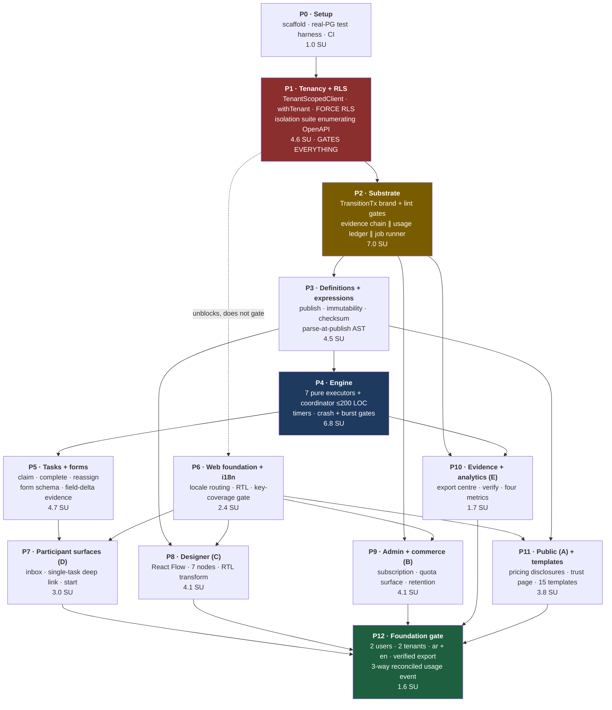
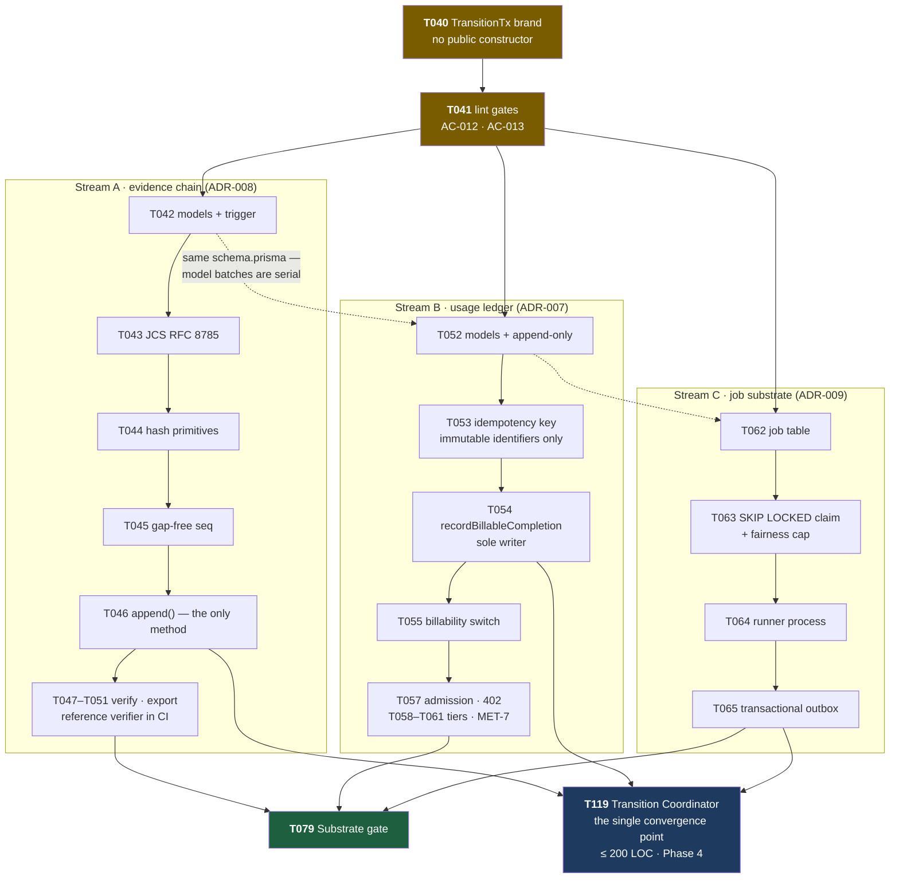

# Tasks: ConnectBPM Foundation — Evidence-Native Process Execution

**Task**: TASKS-01 · **Product**: connectbpm · **Branch**: `claude/bpm-workflow-product-9p2fxy`
**Created**: 2026-08-20 · **Author**: Architect, ConnectSW
**Spec**: `docs/specs/connectbpm-foundation.md` · **Architecture**: `docs/architecture.md` + `docs/ADRs/001`–`009`
**Binding decisions**: `docs/CEO-DECISIONS.md` DEC-001 … DEC-008

---

## 0. Critical path — read this part

The shortest ordered chain from an empty repository to a foundation that can be sold. Everything not
on this chain is breadth that must land beside it, not ahead of it.

### The chain, as an ordered list

| # | Link | Why it cannot move earlier |
|---|------|----------------------------|
| 1 | **P0** scaffold + real-PostgreSQL test harness | Article III forbids mocks; the harness is a precondition for the first red test, not a convenience |
| 2 | **P1** tenancy — `tenantId`, `withTenant`, FORCE RLS, the enumerating isolation suite | DEC-008: *tenancy ships before any pillar*. Retrofitting isolation into a running multi-tenant engine is the one mistake this product cannot absorb (BA gap G-08) |
| 3 | **P2a** `TransitionTx` brand + the two lint gates (`AC-012`, `AC-013`) | The brand is the only key to `recordBillableCompletion`. Every later task that writes a meter must be *unable* to compile without it |
| 4 | **P2b** evidence chain ∥ usage ledger ∥ job substrate | Three parallel streams, one convergence point. Evidence is a day-one commitment (DEC-001); the ledger is irreversible (DEC-002); the engine's exactly-once guarantee rests on the job substrate (ADR-009) |
| 5 | **P3** definition model + publish + parse-at-publish AST | The engine executes a *pinned version*; there is nothing to execute until publish exists |
| 6 | **P4** engine — coordinator + 7 pure executors + timers | The coordinator is the sole constructor of `TransitionTx` and the sole writer of the meter and the chain |
| 7 | **P5** tasks + forms | A Step with no task is not a process; the foundation gate requires completion *through a form and an inbox* |
| 8 | **P6/P7** web foundation, i18n, inbox surfaces | The foundation gate requires completion by a human in `ar` and in `en` |
| 9 | **P12** foundation gate | One process authored, published and completed by 2 users in 2 tenants, in both locales, with a verifiable export and a 3-way reconciled usage event |

**Serial length of this chain: ≈ 12.1 weeks.** That is within 10% of BA-01's stated 11 sprint-units, so
the *shape* of BA-01's critical path is right and I am not arguing with it. What is understated is the
**volume that must land beside it** — see §1.

### Where the work genuinely parallelises

| Fan-out point | Streams that can run concurrently | Constraint |
|---------------|------------------------------------|-----------|
| After **T014** (`withTenant` lands) | auth/members · working calendar · web foundation + i18n (P6) | P6 needs no engine; it must not wait for one |
| After **T041** (brand + lint gates) | **evidence** (T042–T051) · **ledger** (T052–T061) · **jobs** (T062–T068) | Three engineers, three module trees, three table groups. They converge only at T119 |
| After **T082** (publish exists) | definition validation rules · expression parser/evaluator · designer canvas (P8) | The parser and the canvas share only the AST type |
| After **T111** (`Effect` union frozen) | E1/E2/E6 · E3 · E4 · E5 · E7 executors | Pure functions, one file each, no DB access |
| After **T186** (i18n namespacing lands) | every route task in P7–P11 | Only if messages are namespaced per route — see the file-conflict note in §5 |
| Throughout | 15 bilingual templates (T305), legal/docs pages (T300–T303) | Content work, no code dependency past T304 |

### What looks parallel and is not — read before fanning out agents

| Trap | Why it conflicts | Handling |
|------|------------------|----------|
| **Prisma model tasks** (T010, T042, T052, T062, T080, T110, T150, T304) | All eight edit **one file**, `apps/api/prisma/schema.prisma` | Every model task is `parallel_ok: false` against every other model task. Batch per phase, never split within a phase |
| **Migrations** | The migration folder is an ordered sequence; two agents generating migrations concurrently produce a non-deterministic order | Serial, always |
| **CI gate tasks** (every `GATE` row) | Each registers a job in one workflow file | Gate *implementation* is parallel; gate *registration* is batched into T007 and re-run per phase checkpoint |
| **i18n message catalogues** | A single `en.json`/`ar.json` is touched by all ~60 route tasks | T186 mandates one message file per route namespace. Without that, P7–P11 are serial |
| **Evidence recorder and usage ledger** | Separate modules, separate tables — but both are called from the coordinator's commit path | Module work parallel; **integration into T119 is serial and single-owner** |
| **React Flow node components** | All seven register into one closed type map | T220 (registry) first, then T221 nodes in parallel |
| **The single-task view and the form renderer** | The view *embeds* the renderer | T203 depends on T206; they are not siblings |
| **The isolation suite** (T027) | It enumerates endpoints from the OpenAPI document, so it changes meaning every time a route lands | Not a one-off task — a **standing gate** re-asserted at every phase checkpoint |

---

## 1. Effort — and where I disagree with BA-01

| Figure | BA-01 §8.3 | This decomposition |
|--------|-----------|--------------------|
| P0 capability effort | 24.5 SU | **49.3 SU** — the arithmetic sum of the 214 task rows below, with TDD test authoring counted inside each row |
| Integration / security review / hardening reserve | +30% = 7.5 SU | **+15% = 7.4 SU** (lower rate, because test effort is already in the rows rather than in the reserve) |
| **Total P0** | **32 SU** | **≈ 57 SU** |
| Serial critical path | 11 SU | **≈ 12.1 weeks — agrees** |
| Calendar at 3 delivery streams | 16 weeks | **20 weeks** (resource floor 57 / 3 = 18.9 weeks) |

**I disagree materially, and the disagreement is not about the critical path.** BA-01's chain
(G-08 → G-12 → G-14 → G-17) is the right chain and my serial spine is within 10% of its length. The
disagreement is about **how much work has to land beside that chain**, and it is large: 57 SU against
32, or +78%.

### Where the 25 SU of difference is

BA-01's G-01 … G-24 table has no line item for six things this build cannot ship without. Three of
them are direct consequences of decisions the CEO took **after** BA-01 was written.

| Not in BA-01's G-table | Why it is unavoidable | Cost here |
|------------------------|-----------------------|-----------|
| **Arabic / RTL** | DEC-001 put it in v1 *after* BA-01. The spec's reuse table says "ADAPT the pattern" and gives no number. 74 routes × 2 locales, the RTL canvas coordinate transform, the key-coverage gate, a11y verified in both directions | ~2.6 SU |
| **The public and auth surface** | Surface A is 15 routes, auth is 8, and `AC-099` forbids the 8 deferred routes from being "Coming Soon" — they ship as real pages with genuine empty states | ~2.4 SU |
| **The durable job substrate as its own deliverable** | ADR-009 makes it a table, a claim loop, a sweeper, a separate runner process and a transactional outbox. BA-01 folded all of it inside G-14's 4 SU | ~1.4 SU |
| **Evidence export, the reference verifier, retention and erasure** | G-11's 2 SU covers the chain. ADR-008 adds the JCS canonicaliser, a dependency-free verifier executed in CI, retention-gap statements and erasure tombstones | ~1.9 SU |
| **MET-7 secondary instrumentation** | DEC-002 says day one, and DEC-004 adds `completedStepCountAtEvent` to every event. History cannot be recovered later, so none of it can be deferred | ~0.8 SU |
| **Backup and restore** | NFR-016 (RPO ≤ 5 min, RTO ≤ 1 h) has no AC, no G-item and no owner — see gap **G3** | ~0.3 SU |

That is ~9.4 SU. The remaining ~15 SU is **granularity, not new scope**: a 24-row capability table
cannot show the engine's five merge-blocking gates (crash, redelivery, restart, timer burst,
coverage), the 15-route admin settings surface, the eight separate structural validation rules, or the
seven pure element executors. They are all inside G-08 … G-17 in BA-01's accounting; they are simply
costed at their real size here.

### What follows from this — the choice is streams, not scope

The build is **resource-bound, not path-bound**. The serial spine is 12.1 weeks; the resource floor
at three streams is 18.9 weeks. Six of those weeks are pure queueing, not dependency.

| Option | Calendar | What it costs |
|--------|----------|---------------|
| **3 streams, full scope** | ~20 weeks | 4 weeks over the BA-01 baseline |
| **4 streams, full scope** | **~15 weeks** | Nothing in scope. The fan-out points support it: Phase 2 wants three concurrent owners, Phase 6 runs from T014, and Phases 8–11 are independent of the engine |
| **3 streams, P1 valve cut** (T274/T275 analytics, T298/T304–T307 templates) | ~18.1 weeks | 2.1 SU, or **less than one week of calendar**. Ships without analytics and without the gallery that is the GCC go-to-market's opening move — a bad trade at that price |

**A fourth delivery stream buys ~5 weeks. Cutting the entire declared P1 release valve buys less than
one.** The valve is a real option against *quality* slippage, but it is not a schedule lever at this
scale — that is worth knowing before it is spent. The recommendation is the fourth stream; the
decision is the CEO's, not mine.

**Nothing on the P0 chain can be cut.** DEC-002 is irreversible, so the metering substrate cannot be
deferred; DEC-001 makes evidence structural rather than a feature, so the chain cannot be deferred;
and DEC-008 puts tenancy ahead of everything. Those three decisions are exactly what makes this
foundation more expensive than a workflow engine without them — which is the point of the product.

---

## 2. Pre-verified Exclusions

*Spec-kit's `/speckit.tasks` requires an Implementation Audit table in `plan.md`. **ConnectBPM has no
`plan.md`** — ARCH-01 delivered `architecture.md` plus nine ADRs instead. This section substitutes
`architecture.md` §9 (the honest reuse table), which serves the same function. The deviation is
recorded as gap **G2** in §6.*

Verified at task-generation time: `products/connectbpm/apps/` contains only the DevOps scaffold; no
application capability is implemented. `grep -ril "tenantid\|tenant_id" packages/` returns 0 files.

| Capability | Evidence | Position | Would have been |
|-----------|----------|----------|-----------------|
| Logger with PII redaction, crypto primitives, Prisma/Redis plugins | `packages/shared` | **REUSE as-is** — no task | P0 |
| Health, readiness, `/metrics`, correlation IDs | `packages/observability` | **REUSE as-is** — T029 is wiring only | P1 |
| UI primitives, `DataTable`, `StatCard`, `DashboardLayout` | `packages/ui` | **REUSE** — RTL re-verification is the only cost (T198) | P6 |
| Fastify + Next.js + Prisma skeleton at 5018 / 3123 | `packages/saas-kit` | **REUSE** — T001 only | P0 |
| HMAC signing, SSRF guard, circuit breaker, retry, delivery idempotency | `packages/webhooks` | **REUSE code / EXTEND schema** — T066 adds `tenantId`; the claim loop is the engine's precedent (PATTERN-014) | P2 |
| Email + in-app delivery machinery | `packages/notifications` | **REUSE code / EXTEND schema** — T066, T173 (templates) | P2/P5 |
| JWT, sessions, refresh rotation, password reset mechanics | `packages/auth` | **EXTEND** — mechanics reused; `Membership` and tenant scoping are new (T017–T023) | P1 |
| `SubscriptionService`, `requireFeature`, `PricingCard`, `UsageBar` | `packages/billing` | **PARTIAL** — re-keyed to `tenantId` (T240). **`UsageService` is FORBIDDEN in the metering path** and its import fails the build (T041) | P9 |
| `AuditLogService` | `packages/audit` | **EXTEND** — becomes the tenant-scoped *administrative* audit (T024). It is **not** the evidence chain | P1 |

Nothing else is pre-implemented. G-08, G-12 … G-17 have no prior art anywhere in the estate.

---

## 3. Format and conventions

`| ID | Task → path | Satisfies | Verified by | Dep | ∥ | SU | TDD |`

- **Satisfies** — `US-xx` / `FR-xxx` / `NFR-xxx` / `MET-n` / `DEC-00n` from SPEC-01 and CEO-DECISIONS.
- **Verified by** — `AC-xxx` from PRD §7, `EC-xx` from SPEC-01 (merge-blocking edge cases), `SC-xxx`.
  Where an FR has no `AC-xxx` this is deliberate, not missing: PRD §7.1 scopes the AC space to
  feature level, so those FRs are verified against the user story's own Given/When/Then and the
  `EC-xx` cases. See gap **G9**.
- **Dep** — `depends_on`. `—` means it depends only on its phase entry gate.
- **∥** — `parallel_ok`. `Y` = different files, no shared state, safe to fan out. `N` = do not.
- **SU** — sprint-units (1 SU = 1 calendar week of one delivery stream at the Article III bar).
- **TDD** — how Red-Green-Refactor applies (Article III, real dependencies, no mocks):
  - `RGR` — failing test against real PostgreSQL/Redis first, then implementation.
  - `GATE` — the merge-blocking check **is** the deliverable; write it failing against a seeded
    violation, then make it pass.
  - `E2E` — failing Playwright spec first, in both `en` and `ar`.
  - `MANUAL` — recorded manual pass with an artifact; **not** expressible as RGR, footnoted.
  - `N/A` — cannot be expressed as RGR at all; reason footnoted. There are five such tasks and they
    are named, not hidden.

---

## Phase 0 — Setup *(owner: DevOps; partly complete at time of writing)*

Entry: none. Exit: a failing test can be written against a real database.

| ID | Task → path | Satisfies | Verified by | Dep | ∥ | SU | TDD |
|----|-------------|-----------|-------------|-----|---|----|-----|
| T001 | Scaffold from `@connectsw/saas-kit`: Fastify API :5018, Next.js web :3123 → `apps/api`, `apps/web` | NFR-004 stack | — | — | N | 0.1 | N/A ¹ |
| T002 | Move connectbpm from *Concept* to *Active* in the port registry → `.claude/PORT-REGISTRY.md` | Article VII | — | T001 | Y | 0.0 | N/A ¹ |
| T003 | TypeScript strict + `@connectsw/eslint-config` + Prettier → `tsconfig.json`, `eslint.config.js` | Article IV, XIV | — | T001 | Y | 0.1 | N/A ¹ |
| T004 | Real-dependency test harness: PostgreSQL 15 + Redis containers, per-worker template DB, transactional rollback per test, **no mocks** → `apps/api/test/setup.ts` | NFR-018, Article III | SC-017 | T001 | N | 0.2 | N/A ¹ |
| T005 | Playwright harness with `en` and `ar` projects and a 4G-throttled mobile project → `e2e/playwright.config.ts` | NFR-003, NFR-013 | AC-082 | T001 | Y | 0.1 | N/A ¹ |
| T006 | Prisma init against the reviewed `docs/db-schema.prisma`; **schema is copied in per-phase batches, never wholesale** → `apps/api/prisma/schema.prisma` | — | — | T004 | N | 0.1 | N/A ¹ |
| T007 | CI workflow with lint · typecheck · test · coverage · gitleaks · semgrep, and a **named gate registry** every later `GATE` task appends to → `.github/workflows/connectbpm.yml` | Article XIII | — | T003 | N | 0.1 | GATE |
| T008 | PostgreSQL PITR + a **documented, executed restore drill** proving RPO ≤ 5 min / RTO ≤ 1 h → `docs/runbooks/restore.md` | NFR-016 | *none exists — gap G3* | T004 | Y | 0.3 | MANUAL ² |

**Phase 0 total: 1.0 SU** *(0.4 on the critical path; T008 is off it)*

---

## Phase 1 — Tenancy and isolation *(the gate — DEC-008)*

> Nothing that touches tenant data starts before this phase's exit gate passes. This is not a style
> preference; it is the sequencing consequence the CEO recorded in DEC-008.

Entry: T004, T006. Exit: **T039**.

### Data and the access boundary

| ID | Task → path | Satisfies | Verified by | Dep | ∥ | SU | TDD |
|----|-------------|-----------|-------------|-----|---|----|-----|
| T010 | Model batch 1 — `Tenant`, `User`, `Membership`, `RefreshToken`, `WorkingCalendar` + `TenantStatus`, `UserStatus`, `WorkspaceRole`, `MembershipStatus`. `Tenant.residency` and `Tenant.deploymentRef` ship now, not later → `prisma/schema.prisma` | FR-001, FR-004, FR-006, NFR-019 | EC-20 | T006 | **N** ³ | 0.3 | RGR |
| T011 | Migration + RLS: `ENABLE` **and** `FORCE ROW LEVEL SECURITY` with a `current_setting('app.tenant_id')` policy on every tenant-scoped table; explicit enumerated allow-list of global tables → `prisma/migrations/`, `src/db/global-tables.ts` | FR-002, NFR-008 | AC-049 | T010 | N | 0.3 | RGR |
| T012 | Three database roles: `app` (neither superuser nor `BYPASSRLS`), `migrator`, `reconciler` → `infra/db/roles.sql` | NFR-008 | AC-049 | T011 | N | 0.1 | RGR |
| T013 | **GATE** — RLS coverage: compare `information_schema.tables` against `pg_policies`; any tenant-scoped table without `ENABLE` + `FORCE` + a policy fails the build. Assert the `app` role lacks `BYPASSRLS` and superuser | NFR-008 | AC-049 | T012 | Y | 0.2 | GATE |
| T014 | `TenantScopedClient` branded type and `withTenant(ctx, fn)` — opens the transaction, issues `SET LOCAL app.tenant_id`, `$extends` a query hook injecting `where: { tenantId }`, and **throws on any unregistered model** so a new model is scoped by default → `src/tenancy/with-tenant.ts` | FR-002, FR-003 | AC-051, AC-052 | T012 | N | 0.4 | RGR |
| T015 | **GATE** — type-level proof: a repository written against a raw `PrismaClient` **does not compile**. `expect-type` assertions run in CI | FR-002 | AC-051 | T014 | Y | 0.2 | GATE |
| T016 | RFC 7807 `application/problem+json` envelope, `X-Request-ID` on every response, and the **404-not-403** mapper for cross-tenant references → `src/http/errors.ts` | FR-003 | AC-052 | T014 | Y | 0.2 | RGR |
| T017 | Redis key namespacing `bpm:{tenantId}:…`; cache and soft counters only — nothing correctness depends on → `src/cache/` | FR-045 | AC-057 | T014 | Y | 0.1 | RGR |

### Identity, membership and authorisation

| ID | Task → path | Satisfies | Verified by | Dep | ∥ | SU | TDD |
|----|-------------|-----------|-------------|-----|---|----|-----|
| T018 | Self-serve signup — one transaction creating `User` + `Tenant` + Sandbox `Subscription`, zero human intervention → `src/routes/auth/signup.ts` | FR-010, US-01, US-21 | AC-097 | T014 | Y | 0.2 | RGR |
| T019 | Login: 5/min per IP **and** per account; 10 consecutive failures ⇒ 15-min lockout (**423**); byte-identical responses for unknown account and wrong password | NFR-008 (API2) | *US-01; API2* | T018 | N | 0.2 | RGR |
| T020 | Refresh-token rotation with **reuse detection revoking the whole family**; SHA-256 hashes at rest; session list and revoke → `src/routes/auth/refresh.ts`, `/v1/me/sessions` | NFR-008 (API2) | *API2* | T019 | Y | 0.2 | RGR |
| T021 | Password reset: hashed, single-use, 30-minute expiry | NFR-008 (API2) | *API2* | T019 | Y | 0.1 | RGR |
| T022 | Six-role model (Owner, Admin, Designer, Publisher, Process Owner, Participant), additive, Participant default; route→role matrix declared in the OpenAPI `security` block; **role changes take effect on the next request without re-login** → `src/authz/` | FR-004, FR-005, US-27 | AC-087 | T014 | N | 0.3 | RGR |
| T023 | Members: invite by email, assign and change roles, deactivate. *Open-task blocking is T164 — it cannot exist before `Task` does* → `/v1/members` | FR-007, US-02 | *US-02, US-24* | T022 | Y | 0.2 | RGR |
| T024 | Workspace switching across multiple memberships; nothing visible across them → `/v1/me/tenants/{id}/switch`, `/v1/me` | FR-006 | AC-053, EC-20 | T022 | Y | 0.2 | RGR |
| T025 | Staff access recording — actor, timestamp, scope and a **mandatory stated reason** — into the tenant-scoped `AuditLog`, readable by that tenant's Admin with no ConnectSW action → `/v1/tenant/audit` | FR-009 | AC-054 | T022 | Y | 0.2 | RGR |
| T026 | `WorkingCalendar` CRUD and the pure function `resolveDueAt(startUtc, duration, calendar, timezone) → utcInstant` using `luxon`; **no weekend, workweek or holiday value appears in any enum or in the engine** — that is the mechanism DEC-001's geography neutrality actually rests on → `src/calendar/` | FR-062, FR-063, US-36, NFR-020 | AC-100, AC-101, EC-10 | T014 | Y | 0.3 | RGR |

### Standing gates introduced here

| ID | Task → path | Satisfies | Verified by | Dep | ∥ | SU | TDD |
|----|-------------|-----------|-------------|-----|---|----|-----|
| T027 | **GATE** — two-tenant isolation suite that **enumerates every endpoint from the generated OpenAPI document**, requests each as a member of A using B's identifiers, and requires 404 with no value originating in B. A new endpoint is covered automatically; an endpoint missing from the document fails the build → `test/gates/isolation.test.ts` | NFR-008, FR-003 | AC-049, AC-050, SC-001 | T016, T022 | N | 0.4 | GATE |
| T028 | **GATE** — OpenAPI ↔ router parity asserted in **both** directions | NFR-008 (API9) | AC-050 | T027 | Y | 0.2 | GATE |
| T029 | Wire `@connectsw/observability`: `/health` (never touches a dependency), `/ready` (**503** when PostgreSQL or Redis is unhealthy), `/metrics` on an internal listener, `X-Request-ID` propagation | NFR-017 | *NFR-017* | T014 | Y | 0.1 | RGR |
| T030 | **GATE** — no jurisdiction-specific rule compiled into the application: CI rejects any enum or constant naming a country, weekend, currency or regulator outside `Template` data | NFR-020, DEC-001 | *none exists — gap* | T026 | Y | 0.1 | GATE |
| **T039** | **CHECKPOINT — Tenancy gate.** T013, T015, T027, T028 green. Two tenants provisioned and populated. **No pillar task starts until this passes (DEC-008).** | DEC-008 | AC-049 … AC-053, SC-001 | T013, T015, T027, T028, T030 | N | 0.1 | GATE |

**Phase 1 total: 4.6 SU**

---

## Phase 2 — The substrate: metering type, evidence chain, ledger, job runner

> Order inside this phase is not stylistic. **T040 and T041 come before anything that writes a
> meter**, because the brand is what makes `AC-012` decidable — a linter cannot decide whether a call
> site is inside a transaction, and a type can.

Entry: **T039**. Exit: **T079**.

Three streams, three owners, one convergence point. The dotted edges are the trap: the three model
batches edit **one file** and must be serialised even though everything downstream of them is
genuinely parallel.

### 2a — The brand and its gates *(strictly first)*

| ID | Task → path | Satisfies | Verified by | Dep | ∥ | SU | TDD |
|----|-------------|-----------|-------------|-----|---|----|-----|
| T040 | `TransitionTx = Prisma.TransactionClient & { readonly [TxBrand]: true }` and the coordinator's transaction envelope — `BEGIN`, `SET LOCAL app.tenant_id`, brand construction. **The brand has no public constructor** → `src/engine/transition-tx.ts` | MET-2, FR-042 | AC-012 | T039 | **N** | 0.2 | RGR |
| T041 | **GATE** — two lint rules, each naming its reason: (a) no `usageEvent.create` outside `src/metering/ledger.ts`; (b) no import of `@connectsw/billing`'s `UsageService` anywhere in the metering path, citing DEC-002 `MET-2`/`MET-3`. Seed a violating fixture, watch it fail, then remove it | MET-2, MET-3, DEC-002 | AC-012, AC-013 | T040 | N | 0.2 | GATE |

### 2b — Evidence chain *(stream A — ADR-008, day-one per DEC-001)*

| ID | Task → path | Satisfies | Verified by | Dep | ∥ | SU | TDD |
|----|-------------|-----------|-------------|-----|---|----|-----|
| T042 | Model batch 2 — `EvidenceEntry`, `EvidenceExport`, `AuditLog(+tenantId)` + `ActorKind`, `ExportFormat`, `ExportStatus`. `ActorKind.EXTERNAL_PARTY` exists in the enum and export schema from day one and is **never written in v1** → `prisma/schema.prisma` | FR-086 … FR-088, DEC-005 | AC-035, AC-038 | T041 | **N** ³ | 0.3 | RGR |
| T043 | RFC 8785 (JCS) canonicaliser + property tests: lexicographic UTF-16 key order, ECMAScript number serialisation, UTF-8 output → `src/evidence/jcs.ts` | FR-090 | AC-041 | T042 | Y | 0.3 | RGR |
| T044 | Hash primitives — `payloadHash = SHA-256(JCS(payload))`, `entryHash` over the length-prefixed preimage, genesis `SHA-256("connectbpm.evidence.v1" ‖ tenantId ‖ instanceId)` → `src/evidence/hash.ts` | FR-090 | AC-040 | T043 | Y | 0.2 | RGR |
| T045 | Gap-free sequence allocation **inside** the transition transaction: `UPDATE process_instance SET evidence_seq = evidence_seq + 1 RETURNING`. A rollback returns the counter, so a gap is impossible → `src/evidence/seq.ts` | FR-087 | AC-038 | T044 | N | 0.2 | RGR |
| T046 | `EvidenceRecorder.append(tx: TransitionTx, …)` — the **only** method; no update, no delete exists to be called. Polymorphic actor (`actorKind`, `actorId`, `actorRole` denormalised at write time, `actorRef`, `actorLocale`) → `src/evidence/recorder.ts` | FR-087, FR-088, EC-12 | AC-037, AC-038, AC-066 | T045 | N | 0.3 | RGR |
| T047 | Append-only enforced twice: a `BEFORE UPDATE OR DELETE` trigger that raises, plus a single `SECURITY DEFINER` erasure function that may null payload columns and **may not touch** `seq`, `payloadHash`, `prevHash`, `entryHash`, `eventType`, `occurredAtUtc`, `actorId` or `definitionVersionId`. A refused attempt is itself an evidence entry | FR-089, FR-100 | AC-036, AC-039 | T046 | Y | 0.2 | RGR |
| T048 | **GATE** — `eventType` is a closed union; CI asserts every member has at least one producing call site **and** at least one test | FR-087 | AC-037 | T046 | Y | 0.2 | GATE |
| T049 | Chain verification operation reporting the **first** divergent `seq` → `/v1/instances/{id}/evidence/verify` | FR-091 | AC-040 | T047 | Y | 0.2 | RGR |
| T050 | Export builder — self-describing JSON header (algorithm, JCS rule, genesis, entry preimage, `versionsCovered`, `retentionGaps`, `artifactHash`) plus CSV; the export is itself recorded as an evidence entry naming requester and exact filters → `/v1/evidence/exports` | FR-092 … FR-095 | AC-042, AC-044, AC-045 | T049 | Y | 0.3 | RGR |
| T051 | **GATE** — `tools/verify-evidence/`: a dependency-free Node verifier that **imports no application code**, executed in CI against a generated export | FR-091, FR-093 | AC-041 | T050 | Y | 0.2 | GATE |

### 2c — Transactional usage ledger and quota *(stream B — ADR-007, DEC-002)*

| ID | Task → path | Satisfies | Verified by | Dep | ∥ | SU | TDD |
|----|-------------|-----------|-------------|-----|---|----|-----|
| T052 | Model batch 3 — `UsageEvent`, `QuotaReservation`, `QuotaCounter`, `UsageCounter`, `UsageDistinctActor`, `Subscription(tenantId)`, `RetentionPolicy` + `ReservationStatus`, `SubscriptionTier`, `SubscriptionStatus`. `usage_event` gets its append-only trigger in the same migration → `prisma/schema.prisma` | FR-109, FR-120 | AC-021 | T042 | **N** ³ | 0.3 | RGR |
| T053 | Idempotency key `sha256(instanceId ‖ tokenId ‖ fromElementId ‖ transitionId ‖ 'billable_completion')` — **immutable identifiers only, no clock, no random, no attempt counter** — with `@@unique([tenantId, idempotencyKey])` → `src/metering/idempotency.ts` | FR-043, FR-107, MET-3 | AC-010, AC-011 | T052 | N | 0.2 | RGR |
| T054 | `recordBillableCompletion(tx: TransitionTx, e)` — the **sole** writer of `usage_event(billable=true)`. Prisma `P2002` is read as "already accounted", never as an error → `src/metering/ledger.ts` | FR-101, MET-1, MET-2 | AC-009 … AC-011 | T053 | N | 0.3 | RGR |
| T055 | Billability decision — one exhaustive `switch` over `TerminalReason`. `completedStepCountAtEvent` is **mandatory on every event** (DEC-004), so a future rule change can be applied to history without re-deriving it | FR-103, FR-104, FR-106, DEC-004 | AC-001 … AC-005, AC-007 | T054 | N | 0.2 | RGR |
| T056 | **GATE** — seven-outcome enumeration: each of the seven rows of the §5.3 table has a dedicated test, and adding a `TerminalReason` member without one fails the build | FR-103, FR-104 | AC-008 | T055 | Y | 0.2 | GATE |
| T057 | Admission control `admit(tenantCtx, n)` — `SELECT quota_counter FOR UPDATE`, reservation `HELD ×n`, or a single refusal event and **402** carrying limit, used, `resetAt`, upgrade action and (for a batch) the shortfall as a number. **Refusal creates no instance row, no reservation and no evidence** → `src/metering/admission.ts` | FR-105, FR-113, FR-114, MET-4 | AC-006, AC-014 … AC-017, EC-03, EC-21 | T054 | N | 0.4 | RGR |
| T058 | Tier entitlement configuration: Sandbox **50**/month non-removable (DEC-007), Starter 2 500, Growth 15 000, Business 60 000; published-process, retention and attachment-size limits. **Sandbox's cap is a product constraint, not a config default** | FR-115, FR-120, DEC-005, DEC-007 | AC-020 | T057 | Y | 0.2 | RGR |
| T059 | **GATE** — entitlement schema validation: **no entitlement may be expressed in seats, users, designers or participants**; the CI check fails on any such key | FR-121, DEC-002 | AC-028, AC-029 | T058 | Y | 0.1 | GATE |
| T060 | `billingPeriod` (`YYYY-MM`) fixed at write time from the transaction's commit clock, never recomputed, never derived from instance start | FR-123, FR-124 | AC-025, EC-19 | T054 | Y | 0.1 | RGR |
| T061 | MET-7 secondary instrumentation from day one — `usage_counter` hourly buckets and `usage_distinct_actor` exact distinct counts, **counted and reported, never billed, capped or gated** | FR-117, FR-118, FR-119, MET-6, MET-7 | AC-026 … AC-028 | T060 | Y | 0.3 | RGR |

### 2d — Durable job substrate and outbox *(stream C — ADR-009)*

| ID | Task → path | Satisfies | Verified by | Dep | ∥ | SU | TDD |
|----|-------------|-----------|-------------|-----|---|----|-----|
| T062 | Model batch 4 — `Job`, `WebhookEndpoint(+tenantId)`, `WebhookDelivery`, `Notification(+tenantId)` + `JobKind`, `JobStatus`; partial index on `status = 'PENDING'`, `UNIQUE(tenant_id, dedupe_key)` → `prisma/schema.prisma` | FR-055 | AC-071 | T052 | **N** ³ | 0.3 | RGR |
| T063 | Claim loop — `FOR UPDATE SKIP LOCKED` in bounded batches, per-tenant fairness cap of `ceil(batch/4)`, `locked_until` sweeper returning crashed workers' rows to `PENDING` → `src/runner/claim.ts` | FR-055, NFR-004 | AC-071, EC-17 | T062 | N | 0.3 | RGR |
| T064 | Runner process (`MODE=runner`, same image, same schema, no network protocol to the API), handler registry, graceful shutdown → `src/runner/index.ts` | NFR-005 | AC-070 | T063 | N | 0.2 | RGR |
| T065 | Transactional outbox — `OUTBOX_WEBHOOK` / `OUTBOX_NOTIFICATION` rows inserted **inside** the transition transaction; **nothing external is ever called from inside a transaction**. Drain hands off to `@connectsw/webhooks` (HMAC, SSRF guard, circuit breaker, retry reused whole) → `src/runner/outbox.ts` | FR-064, FR-078 | AC-056, AC-102 | T064 | N | 0.3 | RGR |
| T066 | Additive `tenantId` on the `@connectsw/webhooks` and `@connectsw/notifications` schemas; dispatcher selects endpoints from inside `withTenant`, so a cross-tenant delivery is **unqueryable**, not merely improbable | FR-064, FR-112 | AC-056 | T065 | Y | 0.2 | RGR |
| T067 | Nightly three-way reconciliation — instance terminal states vs terminal evidence entries vs usage events, **exact agreement, not a tolerance**; iterates tenants by entering `withTenant` per tenant, never a cross-tenant `GROUP BY` → `src/jobs/reconcile.ts` | FR-110, NFR-006, NFR-007 | AC-022, AC-057, SC-002, SC-003 | T061, T064 | N | 0.3 | RGR |
| T068 | **GATE** — inject one divergent record; reconciliation must detect it, name the instance and raise P0. **The detector is tested, not trusted** | FR-110 | AC-023 | T067 | Y | 0.2 | GATE |
| **T079** | **CHECKPOINT — Substrate gate.** T041, T048, T051, T056, T059, T068 green. Evidence chain verifies end to end; ledger idempotency holds under 5× concurrent redelivery | DEC-001, DEC-002 | AC-008 … AC-013, AC-021 … AC-023, AC-037 … AC-041 | T051, T061, T068 | N | 0.1 | GATE |

**Phase 2 total: 7.0 SU** *(three streams; serial contribution ≈ 2.5 weeks)*

---

## Phase 3 — Definition model, versioning and the expression grammar

Entry: **T079**. Exit: **T109**.

### 3a — Definitions and publish *(G-12)*

| ID | Task → path | Satisfies | Verified by | Dep | ∥ | SU | TDD |
|----|-------------|-----------|-------------|-----|---|----|-----|
| T080 | Model batch 5 — `ProcessDefinition`, `ProcessDefinitionVersion`, `FormSchema`, `Template`, `TemplateLocale` + `DefinitionStatus`, `VersionStatus` → `prisma/schema.prisma` | FR-013, FR-034 | *US-07* | T079 | **N** ³ | 0.3 | RGR |
| T081 | Draft lifecycle: editing a published version creates a new DRAFT; optimistic `revision` concurrency returning **409** naming **what** changed and **by whom** and **when** | FR-013, FR-028 | AC-091, EC-16 | T080 | N | 0.2 | RGR |
| T082 | Publish: monotonic integer version per process, content checksum over `JCS(graph + condition ASTs + form schemas)`, database trigger blocking `UPDATE`/`DELETE` on a published row, **409** on any modification attempt recorded in the evidence trail | FR-014, FR-015 | AC-092 | T081 | N | 0.3 | RGR |
| T083 | Structural validation engine — every issue returns `{ elementId, rule, message }`; **a generic failure message is non-compliant** → `src/definitions/validate/` | FR-016, FR-017 | AC-089 | T082 | N | 0.3 | RGR |
| T084 | Validation rule: every `Split`'s branches must all reach the matching `Join`, **including boundary paths that bypass it** — the case that otherwise produces an unjoinable instance at runtime | FR-016 | AC-077, EC-06 | T083 | Y | 0.2 | RGR |
| T085 | Validation rule: every `Decision` carries exactly one default outgoing path; publication refused otherwise, **and** the runtime takes the default as defence in depth so an instance never stalls | FR-016, FR-020 | AC-075, EC-08 | T083 | Y | 0.2 | RGR |
| T086 | Validation rules: exactly one Start of each configured kind, ≥1 reachable Finish, every element reachable, every Step carrying an assignment rule | FR-016 | *US-03 AC-2/3/7* | T083 | Y | 0.2 | RGR |
| T087 | **GATE** — the element type registry is a **closed map**: an element type outside E1–E7 cannot be created through the UI, the API, or a direct payload | FR-011 | AC-088 | T083 | Y | 0.2 | GATE |
| T088 | Definition resolver + immutable-row cache (immutable ⇒ cacheable with no invalidation) and the pinned read path: a running instance resolves graph, forms and condition ASTs from **its own version** for its entire life | FR-018, FR-019 | AC-090, EC-01 | T082 | N | 0.3 | RGR |
| T089 | Archive (no new instances, running ones complete on their pinned version) and `ON DELETE RESTRICT` while any instance or evidence record references a version | FR-026, FR-027 | AC-093, EC-15 | T088 | Y | 0.2 | RGR |
| T090 | Instance-level SLA (`instanceSla`) and the Start element's start-permission declaration | FR-025, FR-030 | *US-03* | T088 | Y | 0.2 | RGR |
| T091 | Persist each element type's documented **1:1 BPMN 2.0 semantic mapping** as data on the type registry, so BN-017 interchange is an additive layer later → `src/definitions/bpmn-mapping.ts` | FR-012 | *none exists — gap G7* | T087 | Y | 0.1 | RGR |

### 3b — Restricted expression grammar *(G-15, ADR-002 — parallel stream)*

| ID | Task → path | Satisfies | Verified by | Dep | ∥ | SU | TDD |
|----|-------------|-----------|-------------|-----|---|----|-----|
| T092 | Lexer with a fixed token set + hand-written Pratt parser (~300 LOC) for the complete grammar in ADR-002 §1. **No assignment, no lambda, no loop, no `if`, no user function, no method call, no computed indexing** → `src/expressions/parse.ts` | FR-022, NFR-009 | *US-03 AC-6* | T079 | Y | 0.3 | RGR |
| T093 | Typed AST + Zod schema + static budgets enforced **at publish**: depth ≤ 16, nodes ≤ 200, references ≤ 40, string literal ≤ 1 KiB. `__proto__`, `constructor`, `prototype` rejected at parse as reserved identifiers so they cannot appear in a stored AST at all | FR-024, NFR-009 | *EC-09* | T092 | N | 0.2 | RGR |
| T094 | Store the AST as JSONB on the immutable version alongside the source text for display. **The parser is not on the runtime path** | FR-018, FR-022 | AC-090 | T093, T082 | N | 0.2 | RGR |
| T095 | Reference check against upstream form schemas at publish; warn where a condition references a field no upstream form can populate | FR-023 | *EC-09* | T094 | Y | 0.1 | RGR |
| T096 | Total, budgeted tree-walking interpreter — **no throw path**. Null truth table written out and tested exhaustively: any comparison with `null` ⇒ `false`; `not null` ⇒ `false`; `null and x` ⇒ `false`; `null or x` ⇒ truth of `x`. Budget: 1 000 steps, 50 ms checked every 64 steps; exceeding raises `DefinitionError`, records `condition.budget_exceeded`, and the Decision takes its default path — the instance is **not** `FAULT_TERMINATED` | FR-023, FR-024 | AC-026, AC-076, EC-09 | T093 | N | 0.4 | RGR |
| T097 | Expression resource meter → `usage_counter`: deterministic step count (primary, reproducible), wall-clock microseconds (secondary), peak operand-stack depth. **This is MET-6 in v1; there is no sandbox, because NFR-009 forbids the isolate the word implies** | FR-119, MET-6 | AC-026 | T096, T061 | Y | 0.2 | RGR |
| T098 | **GATE** — `fast-check` fuzz suite as a required CI gate: parser totality (random bytes ⇒ AST or structured `ParseError`, never a thrown non-`ParseError`, never a hang), round-trip `parse(print(ast)) ≡ ast`, evaluator totality, and **determinism** — same `(ast, snapshot)` ⇒ same result and same step count, which is what makes the meter reconcilable | NFR-010 | *NFR-010; SC-003* | T096 | Y | 0.3 | GATE |
| **T109** | **CHECKPOINT — Definition gate.** T087, T098 green; a definition publishes, pins and refuses every FR-016 violation by name | FR-011 … FR-030 | AC-075, AC-077, AC-088 … AC-093 | T089, T091, T098 | N | 0.1 | GATE |

**Phase 3 total: 4.5 SU** *(two streams; serial contribution ≈ 1.5 weeks)*

---

## Phase 4 — The workflow engine *(G-14 — the hard part)*

Entry: **T109**. Exit: **T149**.

> `NFR-018`'s 100% branch coverage of the transition function is achievable **only** if the
> coordinator stays small. It is a design constraint, not an aspiration: ≤ ~200 LOC, delegating to
> seven pure executors with their own suites. A refactor that moves element semantics into the
> coordinator silently breaks `AC-079`.

| ID | Task → path | Satisfies | Verified by | Dep | ∥ | SU | TDD |
|----|-------------|-----------|-------------|-----|---|----|-----|
| T110 | Model batch 6 — `ProcessInstance`, `Token`, `InstanceVariable`, `InstanceBatch`, `ScheduleSubscription`, `ScheduleOccurrence`, `Attachment` + `InstanceStatus`, `TerminalReason`, `TokenStatus`, `BatchKind`, `BatchStatus`, `ScheduleStatus`, `OccurrenceStatus`, `ScanStatus`. `ScheduleOccurrence` carries `@@unique(scheduleSubscriptionId, occurrenceAt)` — a mutable high-water mark loses to two concurrent runners → `prisma/schema.prisma` | FR-041, FR-048, FR-060 | AC-019 | T109 | **N** ³ | 0.3 | RGR |
| T111 | The `Effect` closed union — `MoveToken`, `CreateToken`, `ConsumeToken`, `CreateTask`, `WithdrawTask`, `ScheduleTimer`, `CancelTimer`, `SetVariable`, `Terminate` — and `apply(tx, Effect[])` → `src/engine/effects.ts` | FR-041 | *NFR-018* | T110 | **N** | 0.2 | RGR |
| T112 | E1 `Start` executor — `(token, element, snapshot) → Effect[]`, **no database access** → `src/engine/executors/start.ts` | FR-041 | *US-06* | T111 | Y | 0.1 | RGR |
| T113 | E2 `Step` executor → `CreateTask` effect carrying the assignment rule | FR-041, FR-066 | *US-11* | T111 | Y | 0.2 | RGR |
| T114 | E3 `Decision` executor — evaluate the pinned AST, else the mandatory default path | FR-020, FR-041 | AC-075, AC-076 | T111, T096 | Y | 0.2 | RGR |
| T115 | E4 `Split` / `Join` executor — one token per outgoing branch; the Join emits **exactly one** token when all incoming branches have arrived | FR-046 | AC-077, EC-06 | T111 | Y | 0.3 | RGR |
| T116 | E5 `Timer` boundary executor — `ScheduleTimer` / `CancelTimer`; interrupting (withdraw the Step, route down the boundary path) vs non-interrupting (notify, token position unchanged) | FR-056, FR-058 | AC-072 | T111, T026 | Y | 0.3 | RGR |
| T117 | E6 `Finish` executor → `Terminate(COMPLETED)`, whatever the outcome label. **A Rejected outcome is a completion** | FR-049 | AC-001 | T111 | Y | 0.1 | RGR |
| T118 | E7 `Schedule` — admission, **not a transition**. `cron-parser` recurrence computed in the tenant's timezone against its working calendar; one `ScheduleOccurrence` row per occurrence written in the admission transaction | FR-060, FR-062 | AC-019 | T111, T026, T057 | Y | 0.3 | RGR |
| T119 | **Transition Coordinator** — the single path for every state change: token guard (`SELECT … WHERE id AND version FOR UPDATE`; zero rows ⇒ stale ⇒ commit empty), dispatch, apply effects, allocate `evidence_seq`, append the entry, decide billability, convert or release the reservation, enqueue outbox rows, `COMMIT`. **≤ 200 LOC** → `src/engine/coordinator.ts` | FR-042, FR-043, MET-2, NFR-018 | AC-009, AC-072, EC-02, EC-05 | T112 … T118, T046, T054, T065 | **N** | 0.6 | RGR |
| T120 | Instance start path — admission (T057) then instance + reservation + `evidence_seq = 1` in one transaction | FR-113 | AC-006, AC-014, AC-015 | T119, T057 | N | 0.2 | RGR |
| T121 | Instance status machine: `RUNNING`, `SUSPENDED`, `COMPLETED`, `EXPIRED`, `CANCELLED`, `FAULT_TERMINATED`, with the §5.3 definitions of each | FR-048 … FR-052 | AC-001 … AC-005 | T119 | N | 0.2 | RGR |
| T122 | Suspend / resume — timer jobs set to `run_at = 'infinity'` with the remaining duration recorded on the payload; resume recomputes against the working calendar, so a two-day approval suspended over a weekend neither loses its two days nor fires the instant it resumes | FR-054 | *US-08* | T121, T026 | Y | 0.2 | RGR |
| T123 | Cancel with a required reason; billable **iff** `completedStepCount ≥ 1` (DEC-004) | FR-051, FR-104 | AC-003, AC-004 | T121, T055 | Y | 0.2 | RGR |
| T124 | `FAULT_TERMINATED` — **never billable under any subsequent condition**, reservation `RELEASED`, P0 alert. Misclassifying a customer's definition error as an engine fault gives away revenue; the reverse bills a customer for our bug | FR-052 | AC-005, EC-06 | T121 | N | 0.2 | RGR |
| T125 | Failure classification: `DefinitionError` (evidence entry, default path, instance keeps running, surfaced to the tenant) vs `Retryable` (rollback, backoff, no partial state by construction) vs `FAULT_TERMINATED`. **A tested property, not a convention** | FR-052 | AC-005, AC-026 | T124, T096 | N | 0.2 | RGR |
| T126 | Timer handlers — due, reminder, escalation, instance SLA — firing within 60 s of due time | FR-056, FR-058, FR-059, NFR-004 | AC-071, SC-008 | T119, T063 | N | 0.3 | RGR |
| T127 | Staleness discarded on **token version, never on wall clock**; one `timer.discarded_stale` evidence entry and nothing else — no transition, no notification | FR-057 | AC-072, EC-02 | T126 | N | 0.2 | RGR |
| T128 | Quota is admission control only — a tenant at cap with 900 instances in flight completes all 900, none suspended, none degraded | FR-053, FR-113 | AC-016, EC-03 | T120 | Y | 0.2 | RGR |
| T129 | Bulk instantiation — N independent single-token instances, `preflightToken` from `/v1/batches/preflight` so the "400 billable instances" confirmation cannot be bypassed, all-or-nothing on quota shortfall with **one** refusal event for the batch | FR-061, FR-108 | AC-017, AC-018, EC-21 | T120, T057 | N | 0.3 | RGR |
| T130 | Process-event catalogue and emission — `process.instance.started/.completed/.cancelled/.expired`, `task.*` — through the outbox, HMAC-signed, deduplicated by `(endpointId, eventType, resourceId)`. **A dead endpoint never blocks a transition** | FR-064 | AC-056, AC-102 | T119, T065 | Y | 0.2 | RGR |
| T131 | Internal engine API — the **same** OpenAPI contract on the `internal` server with service-account auth, tenant-scoped, rate-limited and quota-gated identically. An internal caller gets no metering exemption | FR-065 | *none exists — gap G8* | T119 | Y | 0.2 | RGR |
| T132 | Daily path reconciliation — any instance whose recorded path is not legal in its pinned version is flagged out-of-policy | FR-099 | AC-047, SC-005 | T119, T067 | Y | 0.2 | RGR |

### Engine gates *(each is a merge blocker)*

| ID | Task → path | Satisfies | Verified by | Dep | ∥ | SU | TDD |
|----|-------------|-----------|-------------|-----|---|----|-----|
| T140 | **GATE** — `SIGKILL` after the transition statements execute and before `COMMIT`: on restart the instance is in its **prior** state, no evidence entry, no usage event. All three or none, never a subset | MET-2 | AC-009, EC-05 | T119 | N | 0.3 | GATE |
| T141 | **GATE** — redeliver the identical job 5× concurrently: usage-event count stays 1, duplicates fail on the unique constraint, none of the 5 returns 5xx | MET-3, FR-107 | AC-010, AC-011 | T140 | Y | 0.2 | GATE |
| T142 | **GATE** — 500 in-flight instances across varied element types, force-kill, restart: 100% resume at their recorded position with **no duplicated notification record** (see gap G6 on the email boundary) | NFR-005 | AC-070, SC-004 | T140 | N | 0.3 | GATE |
| T143 | **GATE** — 50 000 timers due in one second: ≥ 99% fire within 60 s, none twice, none dropped, per-tenant fairness observed | NFR-004 | AC-071, EC-17, SC-008 | T126 | Y | 0.3 | GATE |
| T144 | **GATE** — coverage: ≥ 80% overall **and 100% branch coverage of the coordinator**; the gate also asserts the coordinator's LOC ceiling, because 100% becomes gameable the moment element semantics move inside it | NFR-018 | AC-079, SC-017 | T119 | Y | 0.2 | GATE |
| **T149** | **CHECKPOINT — Engine gate.** T140 … T144 green; reconciliation exact over 1 000 completed instances | FR-041 … FR-065 | AC-070 … AC-079, AC-022 | T140 … T144, T132 | N | 0.1 | GATE |

**Phase 4 total: 6.8 SU** *(serial contribution ≈ 2.8 weeks)*

---

## Phase 5 — Tasks, forms and the inbox API *(G-16, G-17)*

Entry: **T149**. Exit: **T179**.

| ID | Task → path | Satisfies | Verified by | Dep | ∥ | SU | TDD |
|----|-------------|-----------|-------------|-----|---|----|-----|
| T150 | Model batch 7 — `Task` + `TaskStatus`; every index leads with `tenantId` → `prisma/schema.prisma` | FR-066, FR-067 | *US-11* | T149 | **N** ³ | 0.2 | RGR |
| T151 | Task creation from E2 with the three assignment-rule kinds — named member, role, claimable queue; at most one performer at a time | FR-066, FR-067, FR-082 | *US-11, BR-007* | T150, T113 | N | 0.3 | RGR |
| T152 | Claim by conditional `UPDATE … WHERE assignee_id IS NULL`; the loser gets **409 naming the claimant**, not a generic error, and their view refreshes to the claimed state | FR-068 | AC-073, EC-04 | T151 | N | 0.2 | RGR |
| T153 | Complete with a client-supplied `Idempotency-Key`; the second submission returns the **first result** and performs no second transition. `GET` on a deep link never mutates state | FR-072, FR-073 | AC-074, EC-11 | T152, T119 | N | 0.3 | RGR |
| T154 | Reassign by assignee or Admin; a target outside the tenant returns **404**; both parties notified; a **distinct evidence entry naming both actors** | FR-074, FR-075 | *US-14* | T153 | Y | 0.2 | RGR |
| T155 | Withdraw on an interrupting timer — **never recorded as a completion** | FR-057 | AC-072 | T153, T116 | Y | 0.1 | RGR |
| T156 | Outcome actions that can require a comment (e.g. Reject); submission without one is refused and no transition occurs | FR-081 | AC-084 | T153 | Y | 0.2 | RGR |
| T157 | Task ownership check beyond RLS; a deep link to another user's or another tenant's task returns **404** and the attempt is recorded | FR-071 | AC-086 | T153 | Y | 0.2 | RGR |
| T158 | Per-task timing instrumentation, first render → submission confirmation. **Instrumentation only — the ≤ 60 s value cannot gate the Foundation checkpoint (gap G5)** | FR-083, NFR-002 | AC-081 | T153 | Y | 0.2 | RGR |
| T159 | Form schema: eight typed fields (short text, long text, number, date, single-select, multi-select, checkbox, file, read-only), required flags, per-type validation rules, and per-Step read-only / editable / hidden | FR-031, FR-032, FR-039 | *US-10* | T080 | N | 0.4 | RGR |
| T160 | Form binding to a Start element and to any Step; schemas versioned as part of the definition version and pinned | FR-033, FR-034 | AC-090, EC-18 | T159, T088 | N | 0.2 | RGR |
| T161 | **Server-side revalidation of every field rule on submission.** Client-side validation is a convenience and is never the enforcement point | FR-036 | *US-10* | T160 | N | 0.3 | RGR |
| T162 | Submitted data → instance variables addressable by the restricted grammar, via an allow-list built from the pinned form schemas | FR-035 | AC-076 | T161, T096 | N | 0.2 | RGR |
| T163 | Field-level delta evidence entries carrying the **stable machine key** alongside the value, so records are comparable across locales | FR-040, FR-149 | AC-066, EC-12 | T162, T046 | N | 0.3 | RGR |
| T164 | A field removed in v2 remains present, with its values, in v1 instances and v1 exports permanently | FR-037 | AC-043, EC-18 | T163 | Y | 0.2 | RGR |
| T165 | Deactivation of a member with open tasks **cannot complete** until every one is reassigned or returned to a claimable queue; the admin is shown the full list and must choose | FR-008 | AC-085, EC-07 | T154, T023 | Y | 0.2 | RGR |
| T166 | Attachments — `t/{tenantId}/{instanceId}/{objectId}` keys, a **prefix-scoped storage credential**, signed URLs ≤ 5 min and single-object, virus scan before the attachment is visible. Cross-tenant reads are refused **at the storage layer**, not only at the API | FR-038, NFR-011 | AC-055 | T150 | Y | 0.3 | RGR |
| T167 | `/v1/tasks`, `/v1/tasks/{id}`, `/v1/startable`, `/v1/my-requests` list and read endpoints with cursor pagination and a server-**clamped** `limit` of 100 | FR-069, FR-077, FR-085 | AC-087, *US-41* | T153 | Y | 0.3 | RGR |
| T168 | Bilingual notification templates — assigned, reminder, SLA breach, escalation, invitation, quota threshold — **composed in the recipient's locale, not the author's** | FR-078, FR-142 | AC-061 | T065 | Y | 0.3 | RGR |
| **T179** | **CHECKPOINT — Task gate.** AC-073, AC-074, AC-084 … AC-086 pass; isolation suite re-run over the new endpoints | FR-066 … FR-085 | AC-073 … AC-087 | T165 … T168, T027 | N | 0.1 | GATE |

**Phase 5 total: 4.7 SU** *(forms sub-chain T159–T164 starts at T080 and runs beside Phase 4; serial contribution ≈ 1.1 weeks)*

---

## Phase 6 — Web foundation and internationalisation

> **This phase does not wait for the engine.** It depends only on T014, and it must land before the
> first route task, because retrofitting `dir="rtl"` and message extraction across 74 routes is the
> frontend equivalent of retrofitting tenancy.

Entry: **T014** *(not T149)*. Exit: **T199**.

| ID | Task → path | Satisfies | Verified by | Dep | ∥ | SU | TDD |
|----|-------------|-----------|-------------|-----|---|----|-----|
| T180 | Next.js App Router with a `/{locale}/` segment (`en`, `ar`), `dir="rtl"` set on the document element for `ar`, locale negotiation, and a **personal locale that overrides the workspace default** | FR-138, FR-140, FR-146 | AC-058, AC-064 | T014 | N | 0.3 | E2E |
| T181 | Message catalogue architecture — **one message file per route namespace**, not a single `en.json`. This is a build-parallelism decision as much as an i18n one: a shared catalogue serialises every route task in P7–P11 → `apps/web/messages/{locale}/{namespace}.json` | FR-139 | AC-063 | T180 | N | 0.2 | RGR |
| T182 | **GATE** — i18n key coverage: a key present in `en` and absent in `ar` **fails CI and names the key**. Untranslated `ar` values are also failures | FR-144 | AC-062, SC-016 | T181 | Y | 0.2 | GATE |
| T183 | **GATE** — no user-visible string hard-coded in a component (string-extraction lint) | FR-139 | AC-063 | T181 | Y | 0.1 | GATE |
| T184 | **GATE** — RTL lint: layout must use logical properties (`margin-inline`, `padding-inline`, `inset-inline`), never directional ones | FR-140 | AC-059 | T180 | Y | 0.2 | GATE |
| T185 | Arabic-capable font with a correct fallback chain that still renders Arabic script when the primary webfont fails | FR-143 | AC-068 | T180 | Y | 0.1 | MANUAL ⁴ |
| T186 | App shell from `@connectsw/ui` — `DashboardLayout`, `Sidebar`, skip-to-content, mobile nav — with **role-aware navigation: a Participant sees surface D and nothing else**, and B/C/E routes return 403 | FR-084 | AC-087 | T180, T022 | N | 0.3 | E2E |
| T187 | Locale-aware numeral, date and currency rendering while values stay locale-independent in storage; UTC stored, tenant timezone rendered | FR-063, FR-148 | AC-066, EC-12 | T180 | Y | 0.2 | RGR |
| T188 | System and error surfaces — `/404` (also the cross-tenant refusal target), `/500` with the correlation ID, `/app/quota` (limit, usage, reset date, upgrade action), `/app/no-access` naming the required role and who can grant it | FR-003, FR-114, NFR-017 | AC-006, AC-052 | T186 | Y | 0.2 | E2E |
| T189 | **GATE** — axe accessibility scan across every shipped surface in **both** `en` and `ar`, plus a recorded manual keyboard pass; zero critical and zero serious violations | NFR-012, NFR-013 | AC-067, SC-018 | T186 | Y | 0.3 | GATE |
| T190 | **GATE** — route smoke test over every route in PRD §6: none returns 404, none is missing, and the string **"Coming Soon" is forbidden**. Deferred routes must render a real skeleton with a genuine empty state | *PRD §6 rule 2* | AC-099 | T186 | Y | 0.2 | GATE |
| **T199** | **CHECKPOINT — Web foundation gate.** T182, T183, T184, T189, T190 green on the routes that exist so far; all five are re-asserted at every later checkpoint | FR-138 … FR-149, NFR-012 | AC-058 … AC-069 | T189, T190 | N | 0.1 | GATE |

**Phase 6 total: 2.4 SU** *(entirely off the critical path — runs from T014)*

---

## Phase 7 — Participant surfaces (site-map D) — *the retention persona*

Entry: **T179**, **T199**. Exit: **T219**.

| ID | Task → path | Satisfies | Verified by | Dep | ∥ | SU | TDD |
|----|-------------|-----------|-------------|-----|---|----|-----|
| T200 | Form **renderer** component — the eight field types, RTL-correct, keyboard-operable, with inline validation mirroring the server rules → `apps/web/src/components/forms/` | FR-031, FR-036, NFR-012 | AC-067, *US-10* | T199, T161 | N | 0.4 | E2E |
| T201 | `/app/inbox` — `DataTable` from `@connectsw/ui`, due-time sort by default, overdue badge, filters by process and status | FR-069 | *US-13* | T200 | Y | 0.2 | E2E |
| T202 | `/app/inbox/[taskId]` — the deep-link target and the `SC-006` surface. Request summary, version-pinned form, outcome actions, **no dashboard chrome**; interactive in ≤ 2.0 s at 375 px on throttled 4G | FR-070, FR-073, NFR-003 | AC-080, AC-082 | T200 | **N** ⁵ | 0.4 | E2E |
| T203 | Read-only rendering on revisit, naming who completed it and when | FR-076 | AC-083 | T202 | Y | 0.1 | E2E |
| T204 | `/app/inbox/queue` claimable queue and `/app/inbox/completed` history | FR-082 | AC-073 | T202 | Y | 0.2 | E2E |
| T205 | `/app/start` and `/app/start/[processId]` — every process the member may start; the version-pinned start form; **quota checked before creation** | FR-085, FR-113 | AC-006, AC-014 | T200, T120 | Y | 0.3 | E2E |
| T206 | `/app/start/[processId]/bulk` — CSV or saved-list upload with a confirmation screen stating **the exact billable instance count and the resulting quota position** before the operation runs | FR-108 | AC-018, EC-21 | T205, T129 | Y | 0.3 | E2E |
| T207 | `/app/requests` and `/app/requests/[instanceId]` — current Step, holder, due time; **404 if not mine** | FR-077 | *US-41* | T201 | Y | 0.2 | E2E |
| T208 | `/app` role-routed home, `/app/notifications`, `/app/switch` explicit workspace switching | FR-006 | AC-053, EC-20 | T186, T024 | Y | 0.2 | E2E |
| T209 | `/app/onboarding` — workspace → locale and calendar → install a template → publish → start one instance, completable in one session | FR-134, FR-135 | AC-098, SC-009 | T208, T304 | Y | 0.3 | E2E |
| T210 | **E2E** — the 60-second path end to end in `en` **and** `ar`: assignment email → deep link → form → outcome → confirmation | US-12, US-13, NFR-002 | AC-080, AC-061, SC-006 | T202, T168 | Y | 0.3 | E2E |
| **T219** | **CHECKPOINT — Participant gate.** AC-080 … AC-087 pass in both locales; T190 route smoke green over surface D | FR-066 … FR-085 | AC-080 … AC-087 | T210, T190 | N | 0.1 | GATE |

**Phase 7 total: 3.0 SU** *(serial contribution ≈ 1.2 weeks)*

---

## Phase 8 — Process designer (site-map C) *(G-13, ADR-006)*

Entry: **T109**, **T199**. Exit: **T239**.

| ID | Task → path | Satisfies | Verified by | Dep | ∥ | SU | TDD |
|----|-------------|-----------|-------------|-----|---|----|-----|
| T220 | `@xyflow/react` canvas with a **closed node-type registry**. React Flow's `nodes`/`edges` are a *projection* of our `ProcessDefinitionVersion.graph`; the checksum is computed over **our** model, so a library upgrade cannot change a published checksum | FR-011, FR-015 | AC-088 | T199, T088 | **N** | 0.4 | E2E |
| T221 | Seven node components, one per element; E5 renders as a **boundary badge attached to its Step**, not as a free node. An unknown `type` renders an error node and fails validation | FR-011 | AC-088 | T220 | Y | 0.4 | E2E |
| T222 | Properties panel — assignment rule, outcome labels, due dates, reminders | FR-056, FR-066, FR-081 | AC-084, AC-100 | T221 | Y | 0.3 | E2E |
| T223 | Condition editor over the restricted grammar with inline parse errors and the published static budgets shown | FR-022, FR-024 | *US-03 AC-6* | T222, T092 | Y | 0.3 | E2E |
| T224 | Validate action — maps `elementId` to a node, applies an error state, and renders a **focusable error list**. Because our model owns element ids, this survives library changes | FR-017 | AC-089 | T223, T083 | Y | 0.3 | E2E |
| T225 | Publish action with immutability messaging and 409 handling on a stale draft baseline naming who changed it | FR-014, FR-028 | AC-091, AC-092 | T224, T082 | Y | 0.2 | E2E |
| T226 | **RTL by coordinate transform, never by CSS mirroring.** In `ar` the canvas maps `x → (canvasWidth − x)`, swaps source/target handle sides and re-renders arrowheads from the transformed geometry; node internals render normally with `dir="rtl"`. Stored coordinates stay canonical, so the same definition opens correctly in either locale | FR-141, NFR-013 | AC-060 | T221 | **N** ⁶ | 0.4 | MANUAL ⁶ |
| T227 | Keyboard node-list panel — select element, connect to element, set property — so the designer is operable without a pointer even though the canvas is a spatial surface | NFR-012 | AC-067 | T221 | Y | 0.3 | E2E |
| T228 | Form builder UI with a typed field palette, per-Step read-only/editable/hidden, and preview in **both** locales | FR-031, FR-039 | *US-10* | T221, T159 | Y | 0.4 | E2E |
| T229 | `/app/processes`, `/new`, `/[id]` overview, `/[id]/settings` (name, instance SLA, who may start, Schedule recurrence, archive) | FR-025, FR-026, FR-030, FR-060 | AC-093 | T220, T090 | Y | 0.3 | E2E |
| T230 | `/app/processes/[id]/versions` and `/versions/[version]` — version, checksum, publisher, date, **live instance count per version**, read-only canvas with a diff against the previous version | FR-019, FR-129 | AC-090 | T229 | Y | 0.3 | E2E |
| T231 | `/app/processes/[id]/test` — run a DRAFT; evidence entries carry `isTest = true` and **no billable usage event exists** | FR-029, FR-106 | AC-007 | T229, T055 | Y | 0.2 | E2E |
| T232 | The Decision-inside-a-parallel-branch idiom, offered as a **named canvas idiom with an inline explanation** — it costs three elements where an inclusive gateway would cost one, and template T07 needs it | FR-021 | *T07; US-03* | T222 | Y | 0.2 | E2E |
| **T239** | **CHECKPOINT — Designer gate.** AC-060, AC-088 … AC-093 pass; RTL canvas pass recorded with artifacts in both locales | FR-011 … FR-030, FR-141 | AC-060, AC-088 … AC-093 | T226 … T232 | N | 0.1 | GATE |

**Phase 8 total: 4.1 SU** *(off the critical path — runs from T109 beside Phase 4)*

---

## Phase 9 — Tenant admin and commerce (site-map B)

Entry: **T079**, **T199**. Exit: **T269**.

| ID | Task → path | Satisfies | Verified by | Dep | ∥ | SU | TDD |
|----|-------------|-----------|-------------|-----|---|----|-----|
| T240 | Re-key `@connectsw/billing`'s `Subscription` from `userId` to `tenantId`; reuse `SubscriptionService`, `requireFeature`, `PricingCard`, `UsageBar` | FR-120 | AC-097 | T199, T058 | N | 0.3 | RGR |
| T241 | Tier selection and card checkout with **zero human contact** → `/v1/subscription/checkout` | FR-132, US-22 | AC-097, SC-014 | T240 | N | 0.3 | RGR |
| T242 | Payment-provider callback — signature verified with **replay rejection**, idempotent by external reference, safely re-applicable | FR-133 | *API10* | T241 | Y | 0.2 | RGR |
| T243 | Upgrade (immediate) and downgrade; a downgrade below current usage is **refused with the specific overage stated and the processes that must be archived listed**. Already-billed usage is never retroactively repriced | FR-122, FR-124, FR-133 | AC-034, EC-13 | T241 | Y | 0.3 | RGR |
| T244 | `/app/settings/usage` — billable completions this period, quota bar, per-process breakdown, overage incurred, hard-cap toggle (**disabled and non-removable on Sandbox**), reconciliation statement that agrees with the invoice | FR-115, FR-125 | AC-020, AC-033 | T240, T061 | Y | 0.3 | E2E |
| T245 | Threshold notifications at 80%, 100% and 120% — **exactly one per threshold per period** | FR-116 | AC-032 | T244, T168 | Y | 0.2 | RGR |
| T246 | `/app/settings` general, `/calendar`, `/members`, `/roles` (read-only matrix with the publish toggle), `/profile` (personal locale override), `/security` (password, active sessions, revoke), `/notifications` | FR-004, FR-007, FR-136, FR-146, US-27 | AC-064, AC-087, AC-100 | T199, T026 | Y | 0.5 | E2E |
| T247 | `/app/settings/webhooks` — endpoint CRUD, **secret returned once at creation and never retrievable**, non-HTTPS and private-range addresses refused, delivery log | FR-064, NFR-011 | AC-102, AC-056 | T246, T066 | Y | 0.3 | E2E |
| T248 | `/app/settings/audit` — admin actions, publish events, exports, **and every ConnectSW staff access, visible without ConnectSW action** | FR-009 | AC-054, AC-044 | T246, T025 | Y | 0.2 | E2E |
| T249 | `/app/settings/retention` — evidence and attachment windows, tier maximum, next deletion run | FR-096 | AC-045 | T246 | Y | 0.2 | E2E |
| T250 | Retention job — deletes instance **payloads** by policy, never hides rows in the UI. Usage events survive and stay reconcilable because they carry denormalised `definitionId`, `definitionVersion`, `terminalReason`, `completedStepCountAtEvent` and `billingPeriod` | FR-096, FR-111 | AC-024, AC-045, EC-14 | T249, T067 | N | 0.3 | RGR |
| T251 | Erasure execution — payload nulled, tombstone appended (`erasure.applied` naming what was removed, by whom, under which policy), referenced variables and attachments destroyed in the same transaction, and **the chain still verifies end to end because it committed to `payloadHash`, not to the payload** | FR-097 | AC-046 | T250, T047 | N | 0.3 | RGR |
| T252 | `/v1/privacy/tenant-export`, `/erasure`, `/retention` endpoints | FR-097 | AC-046 | T251 | Y | 0.2 | RGR |
| T253 | Deferred-with-skeleton admin routes rendering real pages with genuine empty states and correct actions — `/app/settings/privacy`, `/api-keys`, `/sso` | *PRD §6 rule 2* | AC-099 | T246 | Y | 0.2 | E2E |
| T254 | Activation instrumentation — **≥ 1 published process AND ≥ 50 real instances within 30 days** | FR-135 | SC-010 | T240 | Y | 0.2 | RGR |
| **T269** | **CHECKPOINT — Commerce gate.** AC-001 … AC-034 pass; **AC-027 instrumentation audit** run against a synthetic tenant taken through one full lifecycle | DEC-002, MET-1 … MET-7 | AC-001 … AC-034 | T244 … T254 | N | 0.1 | GATE |

**Phase 9 total: 4.1 SU** *(off the critical path — runs from T079)*

---

## Phase 10 — Instances, evidence and analytics (site-map E)

Entry: **T149**, **T199**. Exit: **T289**.

| ID | Task → path | Satisfies | Verified by | Dep | ∥ | SU | TDD |
|----|-------------|-----------|-------------|-----|---|----|-----|
| T270 | `/app/instances` list with filters: process, definition version, status, SLA state, date range, starter | FR-048 | AC-090 | T199, T121 | Y | 0.2 | E2E |
| T271 | `/app/instances/[instanceId]` — token position rendered on the canvas, instance variables, tasks, **the pinned definition version shown on the instance**, terminal reason, suspend and cancel with a required reason | FR-019, FR-051, FR-054 | AC-003, AC-004, AC-090 | T270, T220 | Y | 0.3 | E2E |
| T272 | `/app/instances/[instanceId]/evidence` — ordered entries with actor, role at the time, UTC **and** tenant-local timestamps, field-level deltas, a hash-chain verification action, and single-instance export | FR-088, FR-091 | AC-038, AC-040 | T271, T049 | Y | 0.3 | E2E |
| T273 | `/app/evidence` export centre — date range and process filter, CSV and JSON, the versions-covered statement, the **retention-gap statement** (a silently short export is a defect), and export history | FR-092 … FR-095 | AC-042, AC-044, AC-045, EC-14 | T272, T050 | Y | 0.3 | E2E |
| T274 | `/app/analytics` and `/app/analytics/[processId]` — exactly four metrics (instances started, instances completed, median cycle time, SLA breach count), **grouped by definition version**, with an explicit empty state rather than zeros presented as data. **Never a source of a billed quantity** | FR-126 … FR-130 | AC-103 | T270 | Y | 0.4 | E2E |
| T275 | Deferred skeleton `/app/analytics/bottlenecks` describing per-step duration analysis and the Phase-2 entitlement | *PRD §6 rule 2* | AC-099 | T274 | Y | 0.1 | E2E |
| **T289** | **CHECKPOINT — Evidence surface gate.** AC-035 … AC-048 pass; an export generated here verifies under `tools/verify-evidence` | DEC-001 | AC-035 … AC-048 | T273, T051 | N | 0.1 | GATE |

**Phase 10 total: 1.7 SU** *(off the critical path)*

---

## Phase 11 — Public surface (site-map A), auth routes and the template gallery

Entry: **T199**, **T109**. Exit: **T319**.

| ID | Task → path | Satisfies | Verified by | Dep | ∥ | SU | TDD |
|----|-------------|-----------|-------------|-----|---|----|-----|
| T290 | `/` landing — wedge headline, three differentiators, template teaser, locale switch, signup CTA | FR-131 | AC-099 | T199 | Y | 0.2 | E2E |
| T291 | `/pricing` — four tier cards, the instance-meter explanation, the **"unlimited free participants"** callout, the plain-language **"completed includes rejected, denied and withdrawn — and those are billable"** note, and the **campaign/bulk disclosure** at the same visual weight. Price points stay unpublished until K0 (DEC-005) | FR-131, DEC-004, DEC-005 | AC-030, AC-031 | T290 | Y | 0.3 | MANUAL ⁷ |
| T292 | `/security` trust page — isolation model, encryption in transit and at rest, retention, sub-processors, incident response, security-questionnaire download, and **the current hosting posture stated plainly** | FR-137 | AC-104 | T290 | Y | 0.3 | MANUAL ⁷ |
| T293 | `/evidence` wedge explainer — how the record is produced, the hash-chain explanation, a real sample export, auditor FAQ | FR-086, FR-090 | AC-035 | T292, T050 | Y | 0.2 | E2E |
| T294 | `/docs` and `/docs/[slug]` bilingual help centre — getting started, the seven elements, forms, inbox, evidence, billing | FR-138 | AC-099 | T290 | Y | 0.3 | E2E |
| T295 | `/legal/terms`, `/legal/privacy`, `/legal/dpa`, `/legal/subprocessors`, `/contact` — contact is **explicitly not a sales gate**; signup never requires it | *PRD §6* | AC-099, SC-014 | T290 | Y | 0.2 | E2E |
| T296 | Deferred-with-skeleton public routes — `/changelog`, `/status`, `/sso/[tenantSlug]`, `/offline` | *PRD §6 rule 2* | AC-099 | T290 | Y | 0.2 | E2E |
| T297 | Auth routes — `/signup`, `/login`, `/forgot-password`, `/reset-password`, `/verify-email`, `/invite/[token]` (shows the inviting workspace and assigned role, **joins free**), `/logout` | FR-007, FR-010 | AC-097 | T290, T018 … T021 | Y | 0.4 | E2E |
| T298 | Public `/templates` and `/templates/[slug]` — filter by control context, locale toggle, flow preview, elements used, form fields, "start free" CTA and the `FR-154` disclaimer | FR-150, FR-154 | AC-096 | T290, T304 | Y | 0.3 | E2E |
| T304 | Template storage as **data, not code** — `Template` / `TemplateLocale`, global, versioned independently of application code, control context as a **descriptive tag, never an enum**. Installing creates an **unlinked** editable DRAFT; later gallery changes never touch the installed copy | FR-150, FR-152, FR-153, FR-154, NFR-020 | AC-095, AC-096 | T109 | N | 0.3 | RGR |
| T305 | Author the 15 templates T01–T15 in **both** `en` and `ar` — element labels, form labels and instructions — each with its control-context tag and disclaimer | FR-150, FR-151 | AC-069, AC-096 | T304 | Y | 0.6 | MANUAL ⁷ |
| T306 | **GATE** — all 15 templates model within the shipped element set with no element outside E1–E7 and no unmodellable construct. Re-run against the **shipped designer**, not the design document | *ASM-005, SCOPE-AMD-001* | AC-094, SC-015 | T305, T239 | N | 0.2 | GATE |
| T307 | `/app/templates` and `/app/templates/[slug]` in-app gallery with install-to-draft | FR-153 | AC-095 | T304, T239 | Y | 0.2 | E2E |
| **T319** | **CHECKPOINT — Surface gate.** T190 route smoke green over **all 74 routes**; AC-094 … AC-096, AC-099, AC-104 pass | *PRD §6* | AC-094 … AC-099, AC-104 | T296, T306, T307 | N | 0.1 | GATE |

**Phase 11 total: 3.8 SU** *(off the critical path)*

---

## Phase 12 — Foundation gate

Entry: **T219**, **T239**, **T269**, **T289**, **T319**.

| ID | Task → path | Satisfies | Verified by | Dep | ∥ | SU | TDD |
|----|-------------|-----------|-------------|-----|---|----|-----|
| T320 | Run `/speckit.analyze` across spec, architecture, ADRs and this task list; resolve every inconsistency it names | Article I, VI | *spec consistency gate* | T319 | N | 0.2 | GATE |
| T321 | **GATE** — coverage: ≥ 80% overall and 100% branch on the coordinator, re-asserted over the complete codebase | NFR-018 | AC-079, SC-017 | T320 | Y | 0.1 | GATE |
| T322 | **GATE** — performance: engine transition p95 ≤ 500 ms at the API boundary under production-representative load; single-task view interactive in ≤ 2.0 s at 375 px on throttled 4G | NFR-001, NFR-003 | AC-078, AC-082, SC-007 | T320 | Y | 0.3 | GATE |
| T323 | **GATE** — full isolation suite over the final endpoint set: two populated tenants, every endpoint enumerated from the OpenAPI document, every response 404, no value from B in any body | NFR-008 | AC-049 … AC-057, SC-001 | T320 | N | 0.2 | GATE |
| T324 | **GATE** — the MET-7 instrumentation audit query: every secondary dimension present for a synthetic tenant taken through one full instance lifecycle | MET-7, FR-117 | AC-027 | T320 | Y | 0.1 | GATE |
| T325 | **GATE** — reconciliation over 1 000 completed instances agrees exactly three ways, and the injected-divergence detector still fires | NFR-006, NFR-007 | AC-022, AC-023, SC-002, SC-003 | T320 | Y | 0.1 | GATE |
| T326 | **FOUNDATION GATE** — one process authored in the designer, published, and executed to completion through a form and the task inbox **by two distinct users in two distinct tenants, in both Arabic and English**, with a complete verifiable evidence export, a billable usage event that reconciles three ways, and SC-001, SC-002 and SC-004 all reading zero defect | *SPEC-01 foundation definition* | SC-001 … SC-004, AC-041 | T321 … T325 | N | 0.3 | E2E |
| T327 | Register the four new generic components in `.claude/COMPONENT-REGISTRY.md` — the tenant-scoped data-access boundary, the transactional idempotent usage ledger with quota reservations, the hash-chained append-only evidence trail, and the `SKIP LOCKED` durable job runner. **All four are ConnectSW infrastructure, not BPM-specific** | Article II | — | T326 | Y | 0.1 | N/A ¹ |
| T328 | Update `.claude/PRODUCT-REGISTRY.md`, `docs/API.md`, and the product addendum | Article VI | — | T326 | Y | 0.1 | N/A ¹ |
| T329 | **GATE** — traceability: every merged change references a `US-xx` or `FR-xxx`; every FR and NFR maps to at least one task and one test | NFR-021, Article VI | *traceability gate* | T326 | Y | 0.1 | GATE |

**Phase 12 total: 1.6 SU** *(serial contribution ≈ 0.7 weeks)*

---

## 4. Footnotes on TDD applicability *(Article III — stated, not hidden)*

1. **`N/A` — scaffolding and registry edits.** T001–T003, T005, T006, T327, T328 create configuration
   and documentation. There is no behaviour to drive out with a failing test. Their correctness is
   verified by the tasks that depend on them failing loudly if they are wrong.
2. **`MANUAL` — T008 restore drill.** RPO/RTO is proved by executing a restore against a real backup
   and timing it. It can be scripted, but the first execution is a recorded manual drill with an
   artifact. **This task has no acceptance criterion in the PRD at all — see gap G3.**
3. **Model batches are `parallel_ok: false` against each other**, not because of TDD but because all
   eight edit `apps/api/prisma/schema.prisma`. This is a file-conflict constraint and is the single
   most likely cause of a real merge collision if the Orchestrator fans out on phase boundaries.
4. **`MANUAL` — T185 font fallback.** "The fallback chain renders Arabic script correctly rather than
   falling back to Latin glyphs" is a rendering judgement. Automatable only as a screenshot diff,
   which is a regression guard, not a first test.
5. **T202 is `parallel_ok: false` against T200** — the single-task view embeds the form renderer. They
   look like sibling route tasks and are not.
6. **`MANUAL` — T226 RTL coordinate transform.** `AC-060` ("flow direction, connector routing and
   arrowheads are mirrored; labels remain correctly oriented") is a visual criterion. The coordinate
   transform itself **is** unit-testable RGR — `project(graph, 'ar')` is a pure function and gets a
   real test — but the acceptance judgement is a recorded manual pass in both locales. It is also
   `parallel_ok: false` against the node components because it changes how every one of them
   projects.
7. **`MANUAL` — T291, T292, T305.** Copy and content. `AC-030`, `AC-031`, `AC-096` and `AC-104` are
   all `MANUAL` in the PRD's own verification column. What **is** automated: T190's smoke gate proves
   the pages exist and render, and T182's key-coverage gate proves the Arabic copy exists.

---

## 5. Requirement traceability

Every FR and NFR maps to at least one task. Where an FR has no `AC-xxx`, the verifying criterion is
the user story's Given/When/Then or an `EC-xx` merge-blocking case — **that is PRD §7.1's design, not
a coverage hole** (gap G9).

| Requirement block | Tasks | Primary verification |
|-------------------|-------|----------------------|
| FR-001 … FR-010 tenancy, identity | T010 … T025, T165 | AC-049 … AC-054, AC-085 |
| FR-011 … FR-030 designer, definitions | T080 … T091, T220 … T232 | AC-088 … AC-093, AC-060 |
| FR-022 … FR-024 expression grammar | T092 … T098 | AC-026, AC-076, NFR-010 fuzz gate |
| FR-031 … FR-040 forms | T159 … T166, T200, T228 | AC-043, AC-083, AC-084, AC-066 |
| FR-041 … FR-047 engine semantics | T110 … T119 | AC-070 … AC-079 |
| FR-048 … FR-054 instance lifecycle | T120 … T125, T271 | AC-001 … AC-005, AC-016 |
| FR-055 … FR-063 timers, calendar | T026, T062 … T064, T116, T126, T127 | AC-071, AC-072, AC-100, AC-101 |
| FR-064 … FR-065 webhooks, internal API | T065, T066, T130, T131, T247 | AC-056, AC-102; **FR-065 has no AC (G8)** |
| FR-066 … FR-085 tasks, inbox | T150 … T168, T200 … T210 | AC-073, AC-074, AC-080 … AC-087 |
| FR-086 … FR-100 evidence | T042 … T051, T251, T272, T273 | AC-035 … AC-048 |
| FR-101 … FR-125 metering, quota | T040, T041, T052 … T061, T129, T240 … T245 | AC-001 … AC-034 |
| FR-126 … FR-130 analytics | T274 | AC-103 |
| FR-131 … FR-137 commerce, onboarding | T240 … T243, T246, T290 … T292, T297, T209 | AC-097, AC-098, AC-030, AC-031, AC-104 |
| FR-138 … FR-149 i18n | T180 … T189, T163, T168, T187 | AC-058 … AC-069 |
| FR-150 … FR-154 templates | T304 … T307, T298 | AC-069, AC-094 … AC-096 |
| NFR-001, NFR-003 performance | T322 | AC-078, AC-082 |
| NFR-002 | T158 only — **instrumentation, not a gate (G5)** | AC-081, post-launch |
| NFR-004, NFR-005 reliability | T063, T126, T142, T143 | AC-070, AC-071 |
| NFR-006, NFR-007 correctness | T067, T068, T325 | AC-022, AC-023 |
| NFR-008 security / isolation | T011 … T016, T027, T028, T323 | AC-049 … AC-057 |
| NFR-009, NFR-010 no customer code | T092 … T098 | fuzz gate; **NFR-009 verified structurally** |
| NFR-011 encryption, attachments | T166, T247 | AC-055, AC-102 |
| NFR-012, NFR-013 a11y, RTL | T184, T189, T226, T227 | AC-059, AC-060, AC-067 |
| NFR-014 scalability | **no task — `[ASSUMPTION]`, re-baselined at this checkpoint (G4)** | none |
| NFR-015 availability | **no task, no AC (G3)** | none |
| NFR-016 RPO / RTO | T008 | **no AC (G3)** |
| NFR-017 observability | T029 | *NFR-017* |
| NFR-018 testing | T144, T321 | AC-079 |
| NFR-019 topology | T010 (`residency`, `deploymentRef`) | design review, not a test |
| NFR-020 portability | T026, T030, T304 | CI grep gate |
| NFR-021 traceability | T329 | traceability gate |

---

## 6. Specification gaps — requirements I could not turn into an executable task

These are reported now, not after the build starts.

| # | Gap | Why it matters | What I did |
|---|-----|----------------|-----------|
| **G1** | **Sandbox allowance contradiction.** SPEC-01 `US-44` says **250** completed instances per period; PRD §4.1 says "the Sandbox cap of 250"; **DEC-007 ratified 50**. | `AC-020` and the quota tests would be written against the wrong number, and the free-tier COGS model is 5× out. | Designed and estimated against **50** (DEC-007 binds). **SPEC-01 US-44 and PRD §4.1 need correcting before T058 is implemented.** |
| **G2** | **No `plan.md`.** `/speckit.tasks` requires a plan with an Implementation Audit table. ARCH-01 shipped `architecture.md` + nine ADRs. | The Pre-verified Exclusions step has no defined input. | Substituted `architecture.md` §9 as the audit (§2 above). Either backfill `plan.md` or amend the spec-kit command to accept an architecture document. |
| **G3** | **NFR-015 (99.5% monthly availability) and NFR-016 (RPO ≤ 5 min, RTO ≤ 1 h) have no acceptance criterion, no G-item, no owner and no test.** | These are the two requirements a compliance-led buyer's security questionnaire asks about, on a product whose `/security` page must state the posture plainly (`AC-104`). | Added **T008** (PITR + a documented restore drill) with the gap named. NFR-015 remains unownable in a foundation build — it needs production operating history. |
| **G4** | **NFR-014's scale numbers are marked `[ASSUMPTION]`** and re-baselined at this very checkpoint. | A scalability gate cannot assert a number that the checkpoint is supposed to produce. | No task. T143 (50 000 timers) and T322 (p95) are the two load figures that *are* executable. |
| **G5** | **NFR-002 / AC-081** — median ≤ 60 s over ≥ 100 real completions by untrained users. | Not measurable before real users exist; architecture §10 item 7 already says so. | **T158 builds the instrumentation only.** The Foundation gate asserts that the measurement exists and reports, not its value. |
| **G6** | **AC-070's literal wording** — "zero duplicate side effects … no duplicated notification" — is unachievable at the email-provider boundary. | A worker that crashes after handing a message to the provider will retry, and providers do not dedupe by default. | **T142 tests "no duplicated notification *record*".** ADR-009 already flags the wording; the PM should reword `AC-070` at `/speckit.analyze`. |
| **G7** | **FR-012** — "persist each element type's documented 1:1 BPMN 2.0 semantic mapping" — has no AC, no schema field and no API surface. | Without a place to put it, the mapping becomes prose in a design doc and BN-017 interchange loses its foundation. | **T091** stores it as data on the type registry. The storage location was my decision, not the spec's — it should be ratified. |
| **G8** | **FR-065** internal engine API has no acceptance criterion. | Architecture §10 item 10 names the exact risk: a second, undocumented surface accreting into an API9 violation. | **T131** implements it as the same OpenAPI contract on the `internal` server, and **T028** (bidirectional router↔document parity) is what actually prevents the drift. A dedicated AC would be better. |
| **G9** | **67 of 154 FRs have no `AC-xxx`.** | Reads as a coverage hole in an automated scan; it is not one. | PRD §7.1 scopes the AC space to feature level by design. Those FRs verify against the user story Given/When/Then and `EC-01 … EC-21`. **Recorded here so a future audit does not "fix" it by inventing 67 criteria.** |

None of these blocks the start of Phase 1. **G1 blocks T058** and must be resolved before the quota
tests are written.

---

## 7. Execution strategy for the Orchestrator

- **Serial spine, no exceptions**: T039 → T041 → T119 → T326. Every one of those four is a
  single-owner task; fanning out across them causes rework, not speed.
- **Three streams after T041**: evidence · ledger · jobs. Three after T109: definitions/engine ·
  expressions · designer. Two throughout: backend and web (P6 runs from T014, not from T149).
- **Model batches are the fan-out hazard.** Eight tasks, one file. Schedule them as phase-opening
  single-owner tasks and never concurrently.
- **Standing gates re-run at every checkpoint**: T013, T015, T027, T028, T041, T182, T183, T184,
  T189, T190. A checkpoint that does not re-run them is not a checkpoint.
- **MVP-minimum for a demonstrable increment**: Phases 0–5 plus T180–T188 and T200–T204 — a process
  runs end to end with evidence and a meter, in one locale, with no designer UI. That is the earliest
  point at which the wedge is showable. It is **not** the Foundation gate, which requires two tenants,
  two locales and a verified export.
- **The declared release valve is P1 scope only**: T274/T275 (analytics) and T298, T304–T307
  (templates) — **2.1 SU, under one week of calendar at three streams**. Spend it on quality, not on
  schedule. **No P0 task above may be cut**: DEC-002 is irreversible and DEC-001 makes evidence
  structural, so neither substrate can be deferred, and DEC-008 fixes tenancy first.

---

*TASKS-01 · ConnectBPM foundation task breakdown · Architect, ConnectSW · 2026-08-20*
*214 tasks · 13 phases · 49.3 SU decomposed + 15% reserve ≈ 57 SU · critical path ≈ 12.1 weeks*
