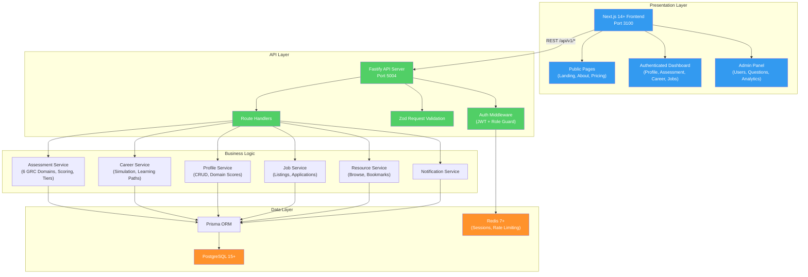

# ConnectGRC -- AI-Native GRC Talent Platform

ConnectGRC is the first AI-native talent platform built specifically for Governance, Risk, and Compliance (GRC) professionals. It connects GRC practitioners with employers through AI-powered skill assessments, career development tools, and intelligent job matching across six core GRC domains.

## Why ConnectGRC Exists

GRC professionals lack a specialized platform to objectively validate their expertise, receive AI-driven career guidance, and connect with employers who understand GRC competencies. Generic job platforms do not differentiate between GRC domains, experience levels, or framework-specific expertise. Employers struggle to assess candidate competency beyond certifications listed on a resume.

ConnectGRC solves this by providing domain-specific assessments with tier placements (Foundation, Developing, Proficient, Expert), a career simulator with skill gap analysis, and a job board that matches candidates by verified domain scores.

## Architecture Overview



## Tech Stack

| Layer | Technology | Version |
|-------|-----------|---------|
| Runtime | Node.js | 20+ |
| Language | TypeScript | 5+ |
| Backend Framework | Fastify | Latest |
| Frontend Framework | Next.js (App Router) | 14+ |
| UI Library | React | 18+ |
| Styling | Tailwind CSS | Latest |
| Database | PostgreSQL | 15+ |
| ORM | Prisma | Latest |
| Cache / Rate Limiting | Redis | 7+ |
| Authentication | JWT (HS256) | -- |
| Validation | Zod | Latest |
| Testing (Unit/Integration) | Jest + React Testing Library | Latest |
| Testing (E2E) | Playwright | Latest |
| Containerization | Docker + docker-compose | -- |

## Port Assignments

| Service | Port |
|---------|------|
| Frontend (Next.js) | 3100 |
| Backend (Fastify API) | 5004 |
| PostgreSQL (Docker) | 5433 (maps to 5432 internal) |
| Redis (Docker) | 6380 (maps to 6379 internal) |

## Getting Started

### Prerequisites

- Node.js 20+
- Docker and Docker Compose
- PostgreSQL 15+ (or use Docker)
- Redis 7+ (or use Docker)

### Quick Start

```bash
# 1. Start infrastructure
cd products/connectgrc
docker compose up -d

# 2. Set up environment
cp apps/api/.env.example apps/api/.env
cp apps/web/.env.example apps/web/.env
# Edit .env files with your values

# 3. Install dependencies
cd apps/api && npm install && cd ../..
cd apps/web && npm install && cd ../..

# 4. Run database migrations
cd apps/api && npx prisma migrate dev && cd ../..

# 5. Seed test data
cd apps/api && npx prisma db seed && cd ../..

# 6. Start development servers
# In one terminal:
cd apps/api && npm run dev
# In another terminal:
cd apps/web && npm run dev

# API: http://localhost:5004
# Web: http://localhost:3100
```

### Test Users

All seeded in the local database:

| Email | Password | Role |
|-------|----------|------|
| aspirant@test.com | Test123!@# | Talent |
| professional@test.com | Test123!@# | Talent |
| vanguard@test.com | Test123!@# | Talent |
| recruiter@test.com | Test123!@# | Employer |
| admin@test.com | Test123!@# | Admin |

## Development Commands

```bash
# Run all tests
cd products/connectgrc && npm test

# Run backend integration tests
cd apps/api && npm test

# Run frontend tests
cd apps/web && npm test

# Run E2E tests (requires running servers)
cd e2e && npx playwright test

# Open Prisma Studio (database viewer)
cd apps/api && npx prisma studio

# Run database migrations
cd apps/api && npx prisma migrate dev
```

## Project Structure

```
products/connectgrc/
├── apps/
│   ├── api/                    # Fastify backend (port 5004)
│   │   ├── prisma/
│   │   │   ├── schema.prisma   # 18 models (User, Profile, Assessment, etc.)
│   │   │   └── seed.ts         # Test data seeder
│   │   ├── src/
│   │   │   ├── app.ts          # Fastify app builder
│   │   │   ├── config.ts       # Environment configuration
│   │   │   └── server.ts       # Server entry point
│   │   ├── jest.config.js
│   │   └── package.json
│   └── web/                    # Next.js frontend (port 3100)
│       ├── src/                # App Router pages, components, hooks
│       ├── tailwind.config.ts
│       ├── jest.config.js
│       └── package.json
├── e2e/                        # Playwright E2E tests
│   ├── tests/
│   │   ├── auth-flow.spec.ts
│   │   ├── dashboard.spec.ts
│   │   ├── assessment-flow.spec.ts
│   │   ├── public-pages.spec.ts
│   │   └── profile-management.spec.ts
│   └── playwright.config.ts
├── docs/
│   ├── PRD.md                  # Product Requirements Document
│   ├── architecture.md         # System Architecture
│   └── backlog.yml             # Product Backlog
├── docker-compose.yml          # PostgreSQL + Redis
└── README.md                   # This file
```

## Key Features

| Feature | Status | Description |
|---------|--------|-------------|
| Authentication | Complete | Register, login, verify email, password reset, JWT + refresh tokens |
| Profile Management | Complete | Headline, bio, skills, certifications, domain scores |
| AI Assessment System | Complete | 6 GRC domains, 10 questions per session, tier placement |
| Career Simulator | Complete | Target role simulation, skill gap analysis, learning paths |
| Job Board | Complete | Listings, filters, quick apply, application tracking |
| Resource Hub | Complete | Articles, videos, courses, bookmarks |
| Notification System | Complete | In-app notifications, unread count, mark read |
| Admin Panel | 70% | User management API complete, UI stubbed |
| E2E Tests | 60% | Playwright configured, critical flows covered |

## API Overview

All endpoints are prefixed with `/api/v1/`. 30+ endpoints across 8 domains:

| Domain | Endpoints | Auth Required |
|--------|-----------|---------------|
| Auth | register, login, refresh, logout, verify-email, forgot-password, reset-password | No (except logout) |
| Profile | get, update, public view, domain scores | Yes |
| Assessment | list, start, get, submit answer, complete | Yes |
| Career | simulate, list simulations, learning paths | Yes (except learning paths) |
| Jobs | list, get, create, update, apply, my applications | Mixed |
| Resources | list, get, bookmark, unbookmark, my bookmarks | Mixed |
| Notifications | list, mark read, mark all read, unread count | Yes |
| Admin | users list, user update, analytics, seed questions | Yes (Admin role) |

## Documentation

| Document | Path | Description |
|----------|------|-------------|
| PRD | [docs/PRD.md](docs/PRD.md) | Complete product requirements with user stories and acceptance criteria |
| Architecture | [docs/architecture.md](docs/architecture.md) | System architecture with C4 diagrams |
| Backlog | [docs/backlog.yml](docs/backlog.yml) | Product backlog in YAML format |

## License

UNLICENSED -- ConnectSW Internal
