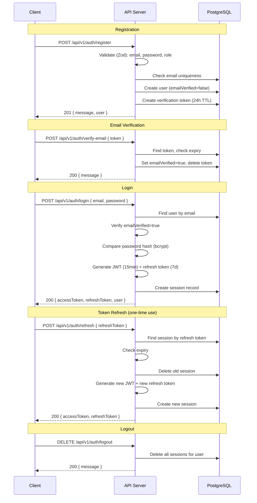
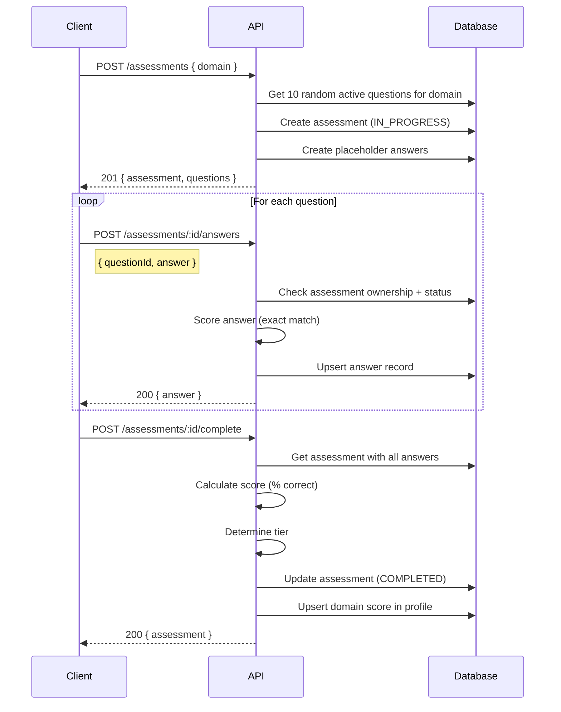

# ConnectGRC API Reference

Base URL: `http://localhost:5006/api/v1`

## Table of Contents

- [Authentication](#authentication)
- [Error Format](#error-format)
- [Pagination](#pagination)
- [Endpoints](#endpoints)
  - [Health](#health)
  - [Auth](#auth)
  - [Profile](#profile)
  - [Assessments](#assessments)
  - [Questions (Admin)](#questions-admin)
  - [Career](#career)
  - [Jobs](#jobs)
  - [Resources](#resources)
  - [Notifications](#notifications)
  - [Admin](#admin)

---

## Authentication

ConnectGRC supports two authentication methods: **JWT Bearer tokens** and **API keys**. Both are passed via the `Authorization` header.

### JWT Bearer Token

Obtained via the login endpoint. Short-lived (15 minutes) with refresh token rotation (7 days).

```
Authorization: Bearer <access_token>
```

### API Key

For programmatic access. Created per user, stored as a hash in the database.

```
Authorization: Bearer <api_key>
```

### Auth Flow



### Role-Based Access Control

| Role | Value | Access |
|------|-------|--------|
| Talent | `TALENT` | Own profile, assessments, career sims, resources, notifications, job applications |
| Employer | `EMPLOYER` | (Phase 2) Job postings, candidate search |
| Admin | `ADMIN` | All routes + user management, question CRUD, analytics |

---

## Error Format

All errors follow a consistent JSON structure:

```json
{
  "error": {
    "code": "ERROR_CODE",
    "message": "Human-readable description",
    "statusCode": 400,
    "details": []
  }
}
```

### Error Codes

| HTTP Status | Code | Description |
|-------------|------|-------------|
| 400 | `VALIDATION_ERROR` | Invalid request body or query parameters |
| 400 | `BAD_REQUEST` | Business logic violation (e.g., assessment not in progress) |
| 401 | `UNAUTHORIZED` | Missing or invalid authentication |
| 403 | `FORBIDDEN` | Insufficient role permissions |
| 404 | `NOT_FOUND` | Resource or route not found |
| 409 | `CONFLICT` | Duplicate resource (e.g., email already registered) |
| 422 | `VALIDATION_ERROR` | Semantic validation failure |
| 500 | `INTERNAL_ERROR` | Unexpected server error (details hidden in production) |

### Validation Error Example

```json
{
  "error": {
    "code": "VALIDATION_ERROR",
    "message": "Validation failed",
    "statusCode": 400,
    "details": [
      {
        "code": "too_small",
        "minimum": 8,
        "type": "string",
        "inclusive": true,
        "message": "Password must be at least 8 characters",
        "path": ["password"]
      }
    ]
  }
}
```

---

## Pagination

List endpoints that return paginated results use offset-based pagination:

### Request Parameters

| Parameter | Type | Default | Description |
|-----------|------|---------|-------------|
| `page` | number | 1 | Page number (1-based) |
| `limit` | number | 20 | Items per page (max 100) |

### Response Format

```json
{
  "data": [],
  "pagination": {
    "page": 1,
    "limit": 20,
    "total": 150,
    "totalPages": 8
  }
}
```

Paginated endpoints: `GET /jobs`, `GET /resources`, `GET /notifications`, `GET /questions`, `GET /admin/users`.

---

## Endpoints

### Health

#### Check API Health

`GET /api/v1/health`

Returns the API health status including database connectivity and uptime. Excluded from rate limiting.

**Auth Required**: No

**Success Response** `200 OK`

```json
{
  "status": "ok",
  "version": "0.1.0",
  "uptime": 3600,
  "database": "connected"
}
```

**Degraded Response** `503 Service Unavailable`

```json
{
  "status": "degraded",
  "version": "0.1.0",
  "uptime": 3600,
  "database": "disconnected"
}
```

---

### Auth

All auth endpoints are under `/api/v1/auth/`.

#### Register

`POST /api/v1/auth/register`

Creates a new user account and generates an email verification token.

**Auth Required**: No

**Request Body**

| Field | Type | Required | Validation |
|-------|------|----------|------------|
| `email` | string | Yes | Valid email format |
| `password` | string | Yes | Min 8 chars, 1 uppercase, 1 lowercase, 1 number |
| `name` | string | No | 1-100 characters |
| `role` | string | No | `TALENT` (default), `EMPLOYER`, `ADMIN` |

**Example Request**

```bash
curl -X POST http://localhost:5006/api/v1/auth/register \
  -H "Content-Type: application/json" \
  -d '{
    "email": "user@example.com",
    "password": "SecurePass1",
    "name": "Jane Doe",
    "role": "TALENT"
  }'
```

**Success Response** `201 Created`

```json
{
  "message": "Registration successful. Please verify your email.",
  "user": {
    "id": "clx1abc123",
    "email": "user@example.com",
    "name": "Jane Doe",
    "role": "TALENT"
  }
}
```

**Error Responses**

| Status | Code | Condition |
|--------|------|-----------|
| 400 | `VALIDATION_ERROR` | Invalid email, weak password |
| 409 | `CONFLICT` | Email already registered |

---

#### Login

`POST /api/v1/auth/login`

Authenticates a user and returns JWT access and refresh tokens.

**Auth Required**: No

**Request Body**

| Field | Type | Required |
|-------|------|----------|
| `email` | string | Yes |
| `password` | string | Yes |

**Example Request**

```bash
curl -X POST http://localhost:5006/api/v1/auth/login \
  -H "Content-Type: application/json" \
  -d '{
    "email": "aspirant@test.com",
    "password": "Test123!@#"
  }'
```

**Success Response** `200 OK`

```json
{
  "accessToken": "eyJhbGciOiJIUzI1NiIs...",
  "refreshToken": "a1b2c3d4e5f6...",
  "user": {
    "id": "clx1abc123",
    "email": "aspirant@test.com",
    "name": "Test Aspirant",
    "role": "TALENT"
  }
}
```

**Error Responses**

| Status | Code | Condition |
|--------|------|-----------|
| 401 | `UNAUTHORIZED` | Invalid credentials |
| 401 | `UNAUTHORIZED` | Email not verified |

---

#### Refresh Token

`POST /api/v1/auth/refresh`

Exchanges a valid refresh token for a new access token and refresh token pair. Refresh tokens are one-time use (rotation).

**Auth Required**: No

**Request Body**

| Field | Type | Required |
|-------|------|----------|
| `refreshToken` | string | Yes |

**Success Response** `200 OK`

```json
{
  "accessToken": "eyJhbGciOiJIUzI1NiIs...",
  "refreshToken": "f6e5d4c3b2a1..."
}
```

**Error Responses**

| Status | Code | Condition |
|--------|------|-----------|
| 401 | `UNAUTHORIZED` | Invalid or expired refresh token |

---

#### Logout

`DELETE /api/v1/auth/logout`

Deletes all sessions for the authenticated user, invalidating all tokens.

**Auth Required**: Yes

**Success Response** `200 OK`

```json
{
  "message": "Logged out successfully"
}
```

---

#### Verify Email

`POST /api/v1/auth/verify-email`

Verifies a user's email address using the token sent during registration.

**Auth Required**: No

**Request Body**

| Field | Type | Required |
|-------|------|----------|
| `token` | string | Yes |

**Success Response** `200 OK`

```json
{
  "message": "Email verified successfully"
}
```

**Error Responses**

| Status | Code | Condition |
|--------|------|-----------|
| 400 | `BAD_REQUEST` | Invalid or expired token |

---

#### Forgot Password

`POST /api/v1/auth/forgot-password`

Generates a password reset token (1 hour TTL). Always returns success to prevent email enumeration.

**Auth Required**: No

**Request Body**

| Field | Type | Required |
|-------|------|----------|
| `email` | string | Yes |

**Success Response** `200 OK`

```json
{
  "message": "If the email exists, a password reset link has been sent"
}
```

---

#### Reset Password

`POST /api/v1/auth/reset-password`

Resets the user's password using a valid reset token.

**Auth Required**: No

**Request Body**

| Field | Type | Required | Validation |
|-------|------|----------|------------|
| `token` | string | Yes | Valid reset token |
| `newPassword` | string | Yes | Min 8 chars, 1 uppercase, 1 lowercase, 1 number |

**Success Response** `200 OK`

```json
{
  "message": "Password reset successfully"
}
```

**Error Responses**

| Status | Code | Condition |
|--------|------|-----------|
| 400 | `BAD_REQUEST` | Invalid, expired, or already-used token |

---

### Profile

All profile endpoints are under `/api/v1/profile/`.

#### Get My Profile

`GET /api/v1/profile`

Returns the authenticated user's profile including domain scores.

**Auth Required**: Yes

**Success Response** `200 OK`

```json
{
  "profile": {
    "id": "clx1abc123",
    "userId": "clx1user123",
    "headline": "Senior GRC Analyst",
    "bio": "10 years of experience in compliance and risk management",
    "phone": "+974-5555-0001",
    "location": "Doha, Qatar",
    "linkedinUrl": "https://linkedin.com/in/example",
    "experienceLevel": "SENIOR",
    "currentTier": "PROFICIENT",
    "overallScore": 78.5,
    "cvUrl": null,
    "skills": ["ISO 27001", "SOX", "GDPR"],
    "certifications": ["CISA", "CRISC"],
    "completeness": 85,
    "createdAt": "2026-02-11T00:00:00.000Z",
    "updatedAt": "2026-02-15T00:00:00.000Z",
    "domainScores": [
      {
        "id": "clx1ds1",
        "profileId": "clx1abc123",
        "domain": "RISK_MANAGEMENT",
        "score": 82.0,
        "tier": "PROFICIENT",
        "updatedAt": "2026-02-14T00:00:00.000Z"
      }
    ]
  }
}
```

---

#### Update Profile

`PUT /api/v1/profile`

Creates or updates the authenticated user's profile (upsert).

**Auth Required**: Yes

**Request Body**

| Field | Type | Required | Validation |
|-------|------|----------|------------|
| `headline` | string | No | 1-200 characters |
| `bio` | string | No | Max 2000 characters |
| `phone` | string | No | Max 50 characters |
| `location` | string | No | Max 100 characters |
| `linkedinUrl` | string | No | Valid URL or empty string |
| `experienceLevel` | string | No | `ENTRY`, `MID`, `SENIOR`, `PRINCIPAL` |
| `skills` | string[] | No | Array of skill names |
| `certifications` | string[] | No | Array of certification names |
| `cvUrl` | string | No | Valid URL |

**Example Request**

```bash
curl -X PUT http://localhost:5006/api/v1/profile \
  -H "Content-Type: application/json" \
  -H "Authorization: Bearer <token>" \
  -d '{
    "headline": "Senior GRC Analyst",
    "bio": "Specializing in risk management and compliance",
    "location": "Doha, Qatar",
    "experienceLevel": "SENIOR",
    "skills": ["ISO 27001", "SOX", "GDPR"],
    "certifications": ["CISA", "CRISC"]
  }'
```

**Success Response** `200 OK`

```json
{
  "profile": { ... }
}
```

---

#### Get Public Profile

`GET /api/v1/profile/:userId`

Returns a public view of a user's profile (phone number excluded).

**Auth Required**: No

**URL Parameters**

| Parameter | Type | Description |
|-----------|------|-------------|
| `userId` | string | Target user's CUID |

**Error Responses**

| Status | Code | Condition |
|--------|------|-----------|
| 404 | `NOT_FOUND` | User or profile not found |

---

#### Get Domain Scores

`GET /api/v1/profile/domain-scores`

Returns the authenticated user's assessment scores across all six GRC domains.

**Auth Required**: Yes

**Success Response** `200 OK`

```json
{
  "domainScores": [
    {
      "id": "clx1ds1",
      "profileId": "clx1abc123",
      "domain": "GOVERNANCE_STRATEGY",
      "score": 75.0,
      "tier": "PROFICIENT",
      "updatedAt": "2026-02-14T00:00:00.000Z"
    }
  ]
}
```

---

### Assessments

All assessment endpoints are under `/api/v1/assessments/`.

#### Assessment Flow



#### Tier Assignment

| Score Range | Tier |
|-------------|------|
| 90-100% | EXPERT |
| 70-89% | PROFICIENT |
| 50-69% | DEVELOPING |
| 0-49% | FOUNDATION |

---

#### List Assessments

`GET /api/v1/assessments`

Returns all assessments for the authenticated user, ordered by most recent.

**Auth Required**: Yes

**Success Response** `200 OK`

```json
{
  "assessments": [
    {
      "id": "clx1asmt1",
      "userId": "clx1user1",
      "domain": "RISK_MANAGEMENT",
      "status": "COMPLETED",
      "score": 80.0,
      "tier": "PROFICIENT",
      "startedAt": "2026-02-14T10:00:00.000Z",
      "completedAt": "2026-02-14T10:45:00.000Z",
      "expiresAt": "2026-02-14T11:00:00.000Z",
      "timeSpent": null,
      "createdAt": "2026-02-14T10:00:00.000Z",
      "_count": { "answers": 10 }
    }
  ]
}
```

---

#### Start Assessment

`POST /api/v1/assessments`

Creates a new assessment session with 10 questions from the specified GRC domain. The assessment expires after 1 hour.

**Auth Required**: Yes

**Request Body**

| Field | Type | Required | Values |
|-------|------|----------|--------|
| `domain` | string | Yes | `GOVERNANCE_STRATEGY`, `RISK_MANAGEMENT`, `COMPLIANCE_REGULATORY`, `INFORMATION_SECURITY`, `AUDIT_ASSURANCE`, `BUSINESS_CONTINUITY` |

**Example Request**

```bash
curl -X POST http://localhost:5006/api/v1/assessments \
  -H "Content-Type: application/json" \
  -H "Authorization: Bearer <token>" \
  -d '{ "domain": "RISK_MANAGEMENT" }'
```

**Success Response** `201 Created`

```json
{
  "assessment": {
    "id": "clx1asmt1",
    "userId": "clx1user1",
    "domain": "RISK_MANAGEMENT",
    "status": "IN_PROGRESS",
    "startedAt": "2026-02-14T10:00:00.000Z",
    "expiresAt": "2026-02-14T11:00:00.000Z"
  },
  "questions": [
    {
      "id": "clx1q1",
      "domain": "RISK_MANAGEMENT",
      "type": "MULTIPLE_CHOICE",
      "difficulty": "INTERMEDIATE",
      "text": "What is the primary objective of a risk assessment?",
      "options": ["Option A", "Option B", "Option C", "Option D"],
      "tags": ["risk", "assessment"]
    }
  ]
}
```

**Error Responses**

| Status | Code | Condition |
|--------|------|-----------|
| 400 | `BAD_REQUEST` | Fewer than 10 active questions available for domain |

---

#### Get Assessment

`GET /api/v1/assessments/:id`

Returns a specific assessment with its questions and answers.

**Auth Required**: Yes (owner only)

**Error Responses**

| Status | Code | Condition |
|--------|------|-----------|
| 404 | `NOT_FOUND` | Assessment not found |
| 403 | `FORBIDDEN` | Not the assessment owner |

---

#### Submit Answer

`POST /api/v1/assessments/:id/answers`

Submits or updates an answer for a question in the assessment. Answers are scored immediately via exact match against the correct answer.

**Auth Required**: Yes (owner only)

**Request Body**

| Field | Type | Required |
|-------|------|----------|
| `questionId` | string | Yes |
| `answer` | string | Yes |

**Success Response** `200 OK`

```json
{
  "answer": {
    "id": "clx1ans1",
    "assessmentId": "clx1asmt1",
    "questionId": "clx1q1",
    "answer": "Option A",
    "isCorrect": true,
    "score": 1,
    "createdAt": "2026-02-14T10:05:00.000Z"
  }
}
```

**Error Responses**

| Status | Code | Condition |
|--------|------|-----------|
| 400 | `BAD_REQUEST` | Assessment is not in progress |
| 403 | `FORBIDDEN` | Not the assessment owner |
| 404 | `NOT_FOUND` | Assessment or question not found |

---

#### Complete Assessment

`POST /api/v1/assessments/:id/complete`

Finalizes the assessment, calculates the score, determines the tier, and updates the user's domain score in their profile.

**Auth Required**: Yes (owner only)

**Success Response** `200 OK`

```json
{
  "assessment": {
    "id": "clx1asmt1",
    "status": "COMPLETED",
    "score": 80.0,
    "tier": "PROFICIENT",
    "completedAt": "2026-02-14T10:45:00.000Z"
  }
}
```

---

### Questions (Admin)

All question endpoints require the `ADMIN` role.

#### List Questions

`GET /api/v1/questions`

**Auth Required**: Yes (Admin only)

**Query Parameters**

| Parameter | Type | Description |
|-----------|------|-------------|
| `domain` | string | Filter by GRC domain |
| `difficulty` | string | `BEGINNER`, `INTERMEDIATE`, `ADVANCED`, `EXPERT` |
| `type` | string | `MULTIPLE_CHOICE`, `SCENARIO_BASED`, `TRUE_FALSE` |
| `page` | number | Page number (default 1) |
| `limit` | number | Items per page (default 20) |

---

#### Create Question

`POST /api/v1/questions`

**Auth Required**: Yes (Admin only)

**Request Body**

| Field | Type | Required | Validation |
|-------|------|----------|------------|
| `domain` | string | Yes | One of 6 GRC domains |
| `type` | string | No | Default: `MULTIPLE_CHOICE` |
| `difficulty` | string | No | Default: `INTERMEDIATE` |
| `text` | string | Yes | Min 10 characters |
| `options` | any | No | Answer options (JSON) |
| `correctAnswer` | string | No | Correct answer text |
| `explanation` | string | No | Answer explanation |
| `framework` | string | No | Related GRC framework |
| `tags` | string[] | No | Searchable tags |

---

#### Update Question

`PUT /api/v1/questions/:id`

**Auth Required**: Yes (Admin only)

Accepts partial updates with the same fields as Create.

---

#### Delete Question (Soft)

`DELETE /api/v1/questions/:id`

**Auth Required**: Yes (Admin only)

Sets `active: false` rather than deleting the record.

---

### Career

All career endpoints are under `/api/v1/career/`.

#### Run Career Simulation

`POST /api/v1/career/simulate`

Runs a career simulation that analyzes the gap between the user's current level and their target role, providing skill gaps, recommendations, and estimated timeline.

**Auth Required**: Yes

**Request Body**

| Field | Type | Required | Validation |
|-------|------|----------|------------|
| `targetRole` | string | Yes | 1-200 characters |
| `targetLevel` | string | Yes | `ENTRY`, `MID`, `SENIOR`, `PRINCIPAL` |

**Example Request**

```bash
curl -X POST http://localhost:5006/api/v1/career/simulate \
  -H "Content-Type: application/json" \
  -H "Authorization: Bearer <token>" \
  -d '{
    "targetRole": "Chief Information Security Officer",
    "targetLevel": "PRINCIPAL"
  }'
```

**Success Response** `201 Created`

```json
{
  "simulation": {
    "id": "clx1sim1",
    "userId": "clx1user1",
    "targetRole": "Chief Information Security Officer",
    "currentLevel": "MID",
    "targetLevel": "PRINCIPAL",
    "skillGaps": {
      "technical": ["Risk Assessment", "Compliance Frameworks"],
      "soft": ["Leadership", "Communication"]
    },
    "recommendations": [
      "Complete advanced GRC certifications",
      "Gain experience in regulatory compliance",
      "Lead cross-functional projects"
    ],
    "estimatedMonths": 24,
    "createdAt": "2026-02-15T00:00:00.000Z"
  }
}
```

---

#### List Simulations

`GET /api/v1/career/simulations`

Returns all career simulations for the authenticated user, ordered by most recent.

**Auth Required**: Yes

---

#### List Learning Paths

`GET /api/v1/career/learning-paths`

Returns curated learning paths, optionally filtered by domain and level. This is a public endpoint (no auth required).

**Auth Required**: No

**Query Parameters**

| Parameter | Type | Description |
|-----------|------|-------------|
| `domain` | string | Filter by GRC domain |
| `level` | string | `ENTRY`, `MID`, `SENIOR`, `PRINCIPAL` |

**Success Response** `200 OK`

```json
{
  "paths": [
    {
      "id": "clx1lp1",
      "title": "Risk Management Fundamentals",
      "description": "Learn the basics of risk identification and assessment",
      "domain": "RISK_MANAGEMENT",
      "level": "ENTRY",
      "steps": [...],
      "duration": "6 weeks",
      "active": true
    }
  ]
}
```

---

### Jobs

All job endpoints are under `/api/v1/jobs/`.

#### List Jobs

`GET /api/v1/jobs`

Returns paginated list of active job postings with optional filters.

**Auth Required**: No

**Query Parameters**

| Parameter | Type | Description |
|-----------|------|-------------|
| `domain` | string | Filter by GRC domain |
| `level` | string | `ENTRY`, `MID`, `SENIOR`, `PRINCIPAL` |
| `remote` | string | `true` or `false` |
| `location` | string | Case-insensitive location search |
| `page` | number | Page number (default 1) |
| `limit` | number | Items per page (default 20) |

**Example Request**

```bash
curl "http://localhost:5006/api/v1/jobs?domain=RISK_MANAGEMENT&level=SENIOR&remote=true"
```

**Success Response** `200 OK`

```json
{
  "data": [
    {
      "id": "clx1job1",
      "title": "Senior Risk Manager",
      "company": "Acme Corp",
      "description": "Lead risk management initiatives...",
      "location": "Doha, Qatar",
      "remote": true,
      "salaryMin": 25000,
      "salaryMax": 35000,
      "currency": "QAR",
      "domains": ["RISK_MANAGEMENT", "COMPLIANCE_REGULATORY"],
      "level": "SENIOR",
      "requiredTier": "PROFICIENT",
      "skills": ["ISO 31000", "ERM"],
      "status": "ACTIVE"
    }
  ],
  "pagination": {
    "page": 1,
    "limit": 20,
    "total": 5,
    "totalPages": 1
  }
}
```

---

#### Get Job Details

`GET /api/v1/jobs/:id`

**Auth Required**: No

---

#### Create Job

`POST /api/v1/jobs`

**Auth Required**: Yes (Admin only)

**Request Body**

| Field | Type | Required | Validation |
|-------|------|----------|------------|
| `title` | string | Yes | 1-200 characters |
| `company` | string | Yes | 1-100 characters |
| `description` | string | Yes | Min 10 characters |
| `location` | string | Yes | 1-100 characters |
| `remote` | boolean | No | Default: false |
| `salaryMin` | number | No | Min 0 |
| `salaryMax` | number | No | Min 0 |
| `currency` | string | No | Default: `QAR` |
| `domains` | string[] | Yes | Array of GRC domains |
| `level` | string | Yes | Experience level |
| `requiredTier` | string | No | Minimum tier for candidates |
| `skills` | string[] | No | Required skills |
| `expiresAt` | string | No | ISO 8601 datetime |

---

#### Update Job

`PUT /api/v1/jobs/:id`

**Auth Required**: Yes (Admin only)

Accepts partial updates with the same fields as Create.

---

#### Apply for Job

`POST /api/v1/jobs/:id/apply`

Submits a job application. Only users with the `TALENT` role can apply.

**Auth Required**: Yes (Talent only)

**Request Body**

| Field | Type | Required | Validation |
|-------|------|----------|------------|
| `coverLetter` | string | No | Max 5000 characters |

**Error Responses**

| Status | Code | Condition |
|--------|------|-----------|
| 400 | `BAD_REQUEST` | Job is not active |
| 404 | `NOT_FOUND` | Job not found |
| 409 | `CONFLICT` | Already applied to this job |

---

#### My Applications

`GET /api/v1/jobs/applications`

Returns all job applications for the authenticated user, including job details.

**Auth Required**: Yes

---

### Resources

All resource endpoints are under `/api/v1/resources/`.

#### List Resources

`GET /api/v1/resources`

Returns paginated list of active resources with optional filters.

**Auth Required**: No

**Query Parameters**

| Parameter | Type | Description |
|-----------|------|-------------|
| `type` | string | `ARTICLE`, `VIDEO`, `COURSE`, `WHITEPAPER`, `TOOL` |
| `domain` | string | Filter by GRC domain |
| `level` | string | `ENTRY`, `MID`, `SENIOR`, `PRINCIPAL` |
| `featured` | string | `true` to show featured only |
| `page` | number | Page number (default 1) |
| `limit` | number | Items per page (default 20) |

---

#### Get Resource

`GET /api/v1/resources/:id`

**Auth Required**: No

---

#### Bookmark Resource

`POST /api/v1/resources/:id/bookmark`

**Auth Required**: Yes

**Error Responses**

| Status | Code | Condition |
|--------|------|-----------|
| 404 | `NOT_FOUND` | Resource not found |
| 409 | `CONFLICT` | Already bookmarked |

---

#### Remove Bookmark

`DELETE /api/v1/resources/:id/bookmark`

**Auth Required**: Yes

---

#### My Bookmarks

`GET /api/v1/resources/bookmarks`

Returns all bookmarked resources for the authenticated user.

**Auth Required**: Yes

---

### Notifications

All notification endpoints are under `/api/v1/notifications/`.

#### List Notifications

`GET /api/v1/notifications`

Returns paginated list of notifications for the authenticated user, ordered by most recent.

**Auth Required**: Yes

**Query Parameters**

| Parameter | Type | Description |
|-----------|------|-------------|
| `page` | number | Page number (default 1) |
| `limit` | number | Items per page (default 20) |

**Success Response** `200 OK`

```json
{
  "data": [
    {
      "id": "clx1not1",
      "userId": "clx1user1",
      "type": "ASSESSMENT_COMPLETE",
      "title": "Assessment Complete",
      "message": "Your Risk Management assessment has been scored.",
      "read": false,
      "data": { "assessmentId": "clx1asmt1" },
      "createdAt": "2026-02-14T11:00:00.000Z"
    }
  ],
  "pagination": {
    "page": 1,
    "limit": 20,
    "total": 3,
    "totalPages": 1
  }
}
```

**Notification Types**: `ASSESSMENT_COMPLETE`, `TIER_CHANGE`, `JOB_MATCH`, `APPLICATION_UPDATE`, `SYSTEM`

---

#### Mark as Read

`PATCH /api/v1/notifications/:id/read`

**Auth Required**: Yes

---

#### Mark All as Read

`POST /api/v1/notifications/read-all`

**Auth Required**: Yes

**Success Response** `200 OK`

```json
{
  "message": "All notifications marked as read"
}
```

---

#### Unread Count

`GET /api/v1/notifications/unread-count`

**Auth Required**: Yes

**Success Response** `200 OK`

```json
{
  "count": 5
}
```

---

### Admin

All admin endpoints require the `ADMIN` role and are under `/api/v1/admin/`.

#### List Users

`GET /api/v1/admin/users`

Returns paginated list of all users (excludes password hash).

**Auth Required**: Yes (Admin only)

**Query Parameters**

| Parameter | Type | Description |
|-----------|------|-------------|
| `role` | string | Filter by role: `TALENT`, `EMPLOYER`, `ADMIN` |
| `page` | number | Page number (default 1) |
| `limit` | number | Items per page (default 20) |

---

#### Update User

`PATCH /api/v1/admin/users/:id`

Updates a user's role or email verification status.

**Auth Required**: Yes (Admin only)

**Request Body**

| Field | Type | Required |
|-------|------|----------|
| `role` | string | No |
| `emailVerified` | boolean | No |

---

#### Analytics Dashboard

`GET /api/v1/admin/analytics`

Returns aggregated platform analytics: user counts by role, assessment counts by status, job counts by status.

**Auth Required**: Yes (Admin only)

**Success Response** `200 OK`

```json
{
  "analytics": {
    "users": {
      "total": 150,
      "byRole": {
        "TALENT": 120,
        "EMPLOYER": 25,
        "ADMIN": 5
      }
    },
    "assessments": {
      "total": 300,
      "byStatus": {
        "COMPLETED": 250,
        "IN_PROGRESS": 30,
        "NOT_STARTED": 20
      }
    },
    "jobs": {
      "total": 45,
      "byStatus": {
        "ACTIVE": 30,
        "DRAFT": 10,
        "CLOSED": 5
      }
    }
  }
}
```

---

#### Seed Questions

`POST /api/v1/admin/seed-questions`

Creates sample assessment questions for a specified GRC domain. Useful for development and testing.

**Auth Required**: Yes (Admin only)

**Request Body**

| Field | Type | Required | Validation |
|-------|------|----------|------------|
| `domain` | string | Yes | One of 6 GRC domains |
| `count` | number | No | 1-100, default: 10 |

**Success Response** `201 Created`

```json
{
  "message": "Created 10 sample questions",
  "questions": [...]
}
```

---

## Rate Limiting

All endpoints (except `/api/v1/health`) are rate limited:

| Setting | Default |
|---------|---------|
| Max requests | 100 per window |
| Window | 60 seconds |

Rate limit headers are included in responses:

```
X-RateLimit-Limit: 100
X-RateLimit-Remaining: 95
X-RateLimit-Reset: 1700000060
```

Configure via environment variables:
- `RATE_LIMIT_MAX` -- Max requests per window (default: 100)
- `RATE_LIMIT_WINDOW` -- Window in milliseconds (default: 60000)
