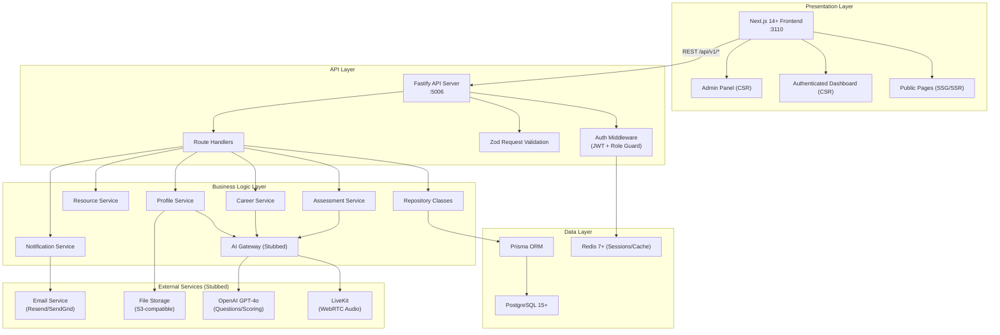
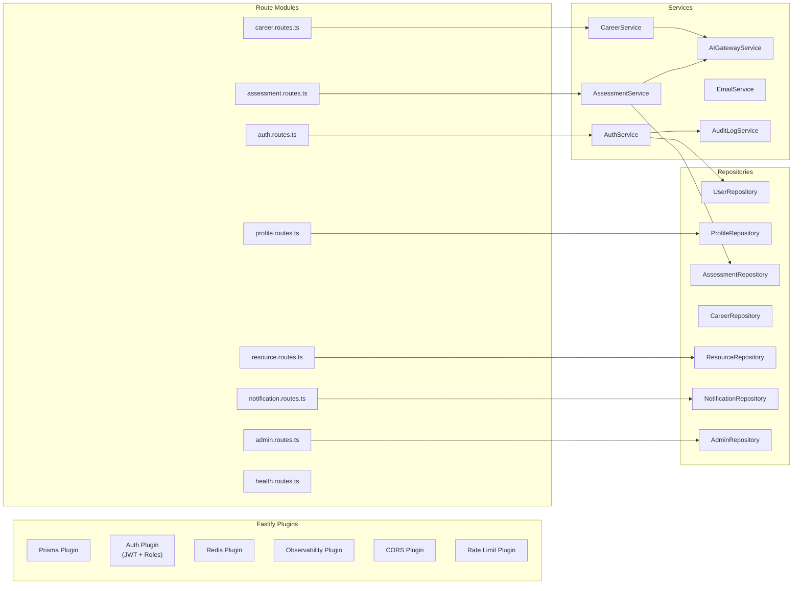
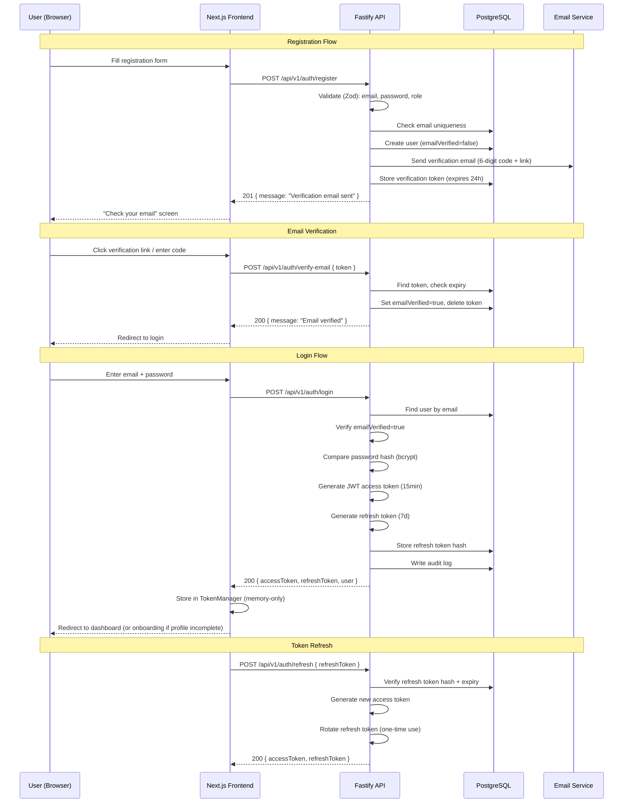
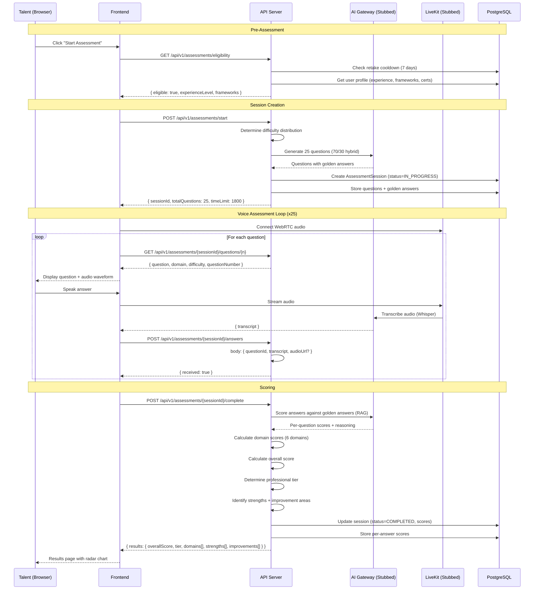
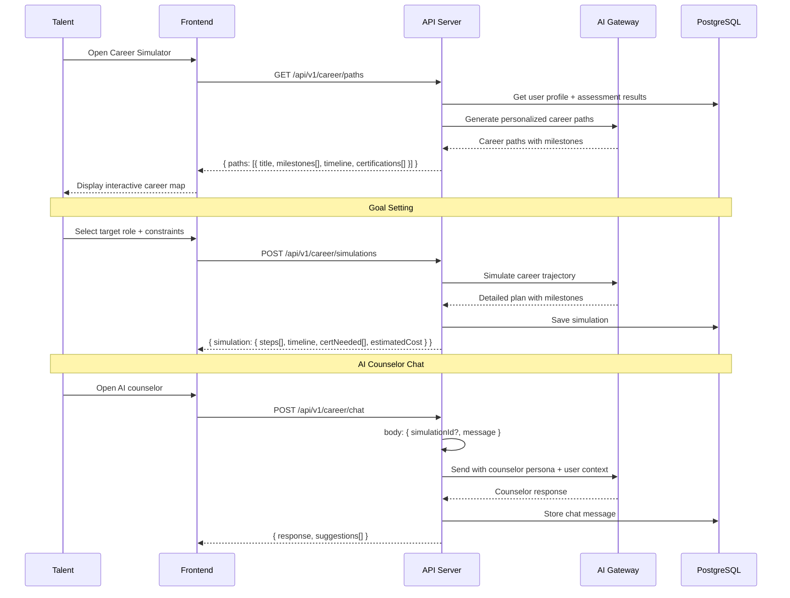
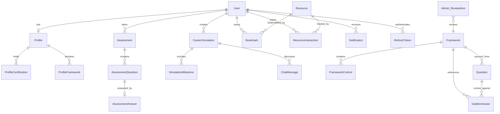
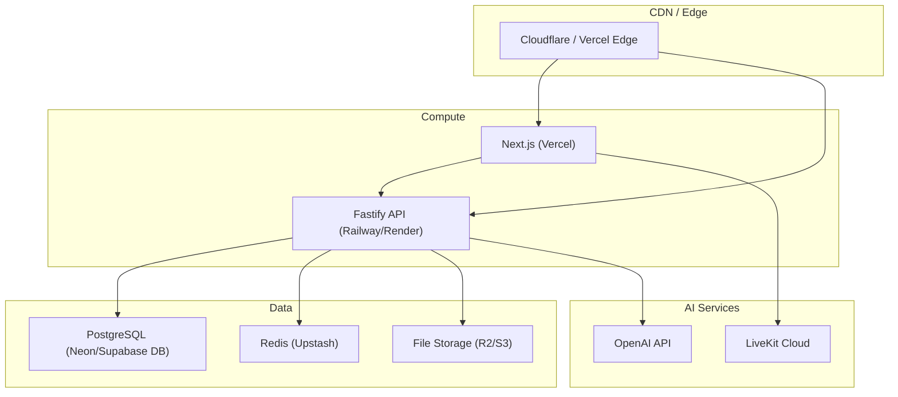

# ConnectGRC - System Architecture

## Overview

ConnectGRC is a GRC-native talent platform built on the ConnectSW standard stack. The system connects GRC professionals with employers through AI-powered assessments, career development tools, and intelligent job matching.

This document defines the system architecture, component interactions, and key technical flows.

## System Layers



## Component Architecture

### Frontend (Next.js 14+ App Router)

| Component | Responsibility |
|-----------|---------------|
| **Public Pages** | Landing, About, Pricing, For Talents, For Employers. SSG/SSR for SEO. |
| **Auth Pages** | Register, Login, Verify Email, Forgot/Reset Password. Client-side forms. |
| **Onboarding Flow** | Multi-step wizard: role selection, basic info, resume upload, certifications, frameworks. |
| **Dashboard** | Profile overview, assessment results radar chart, career simulator, resource hub. |
| **Assessment UI** | Voice assessment interface with audio waveform, timer, question display. |
| **Career Simulator** | Interactive career path exploration, AI counselor chat, simulation history. |
| **Resource Hub** | Browseable content library with filters, search, bookmarks, download tracking. |
| **Admin Panel** | User management, framework/question CRUD, analytics dashboards, review queue. |
| **Notification Center** | In-app notification bell with preference management. |

**State Management**: Zustand for client-side UI state (auth context, assessment session, notification count). Server state via React Query / SWR for API data fetching.

**Routing**: Next.js App Router with route groups:
- `(public)/` -- Landing, about, pricing, etc.
- `(auth)/` -- Login, register, verify, reset
- `(app)/` -- Authenticated routes (dashboard, assessment, career, resources)
- `(admin)/` -- Admin-only routes

### Backend (Fastify)



**Plugin Loading Order**:
1. CORS
2. Rate Limiting (with Redis store when available)
3. Prisma (database connection)
4. Redis (session/cache, graceful degradation)
5. Auth (JWT verification, role guard)
6. Observability (request logging, metrics)
7. Routes

### Repository Pattern

All database access goes through repository classes. Routes never call Prisma directly.

```typescript
// Pattern: Repository base class
class BaseRepository<T> {
  constructor(protected prisma: PrismaClient) {}

  // All queries include tenant isolation (userId where clause)
  // Soft-delete support where applicable
  // Cursor-based pagination helper
}

// Example: Assessment queries are always scoped to the user
class AssessmentRepository extends BaseRepository<Assessment> {
  async findByUser(userId: string, cursor?: string, limit?: number) {
    return this.prisma.assessment.findMany({
      where: { userId },
      cursor: cursor ? { id: cursor } : undefined,
      take: limit ?? 20,
      orderBy: { createdAt: 'desc' },
    });
  }
}
```

## Authentication Flow



### JWT Token Structure

```json
{
  "sub": "user_cuid",
  "email": "user@example.com",
  "role": "talent",
  "iat": 1700000000,
  "exp": 1700000900
}
```

- Access token: 15 minutes TTL
- Refresh token: 7 days TTL, one-time use (rotation)
- Tokens stored in-memory via TokenManager (never localStorage)
- Refresh token hash stored in DB for revocation support

### Role-Based Access Control

| Role | Access Scope |
|------|-------------|
| `talent` | Own profile, assessments, career simulations, resources, notifications |
| `employer` | (Phase 2) Job postings, candidate search, assessment reports |
| `admin` | All talent/employer routes + user management, framework CRUD, analytics, review queue |

## Assessment Flow



### Question Difficulty Distribution

| Experience Level | Foundational | Intermediate | Advanced | Expert/Strategic |
|-----------------|-------------|-------------|---------|-----------------|
| Entry           | 70%         | 0%          | 0%      | 0%              |
| Mid             | 20%         | 50%         | 0%      | 0%              |
| Senior          | 0%          | 20%         | 50%     | 0%              |
| Principal       | 0%          | 0%          | 0%      | 70%             |

Remaining 30% in each level is "general GRC knowledge" drawn evenly across difficulty levels.

### Scoring Pipeline

1. **Transcription**: Voice answer -> text via OpenAI Whisper (stubbed)
2. **RAG Retrieval**: Find relevant golden answers + framework controls for the question
3. **Similarity Scoring**: Compare answer transcript against golden answers using embeddings
4. **GPT Evaluation**: GPT-4o evaluates answer quality considering context, depth, accuracy
5. **Domain Aggregation**: Per-domain average across questions
6. **Tier Assignment**: Overall score maps to professional tier
7. **Stretch Detection**: If scoring 90%+ in a domain, flag for stretch questions on retake

### Dual Assessment Model

- **Talent View**: Full results with detailed feedback, improvement suggestions, learning resources
- **Employer View** (Phase 2): Summary tier, domain breakdown, integrity score. No raw transcripts.

## Career Simulator Flow



### AI Counselor Persona

The career counselor is modeled as a senior GRC advisor with 20+ years of experience. It provides:
- Certification ROI analysis (which cert gives the best career boost)
- Career transition guidance (e.g., IT Audit -> CISO pathway)
- Salary benchmarks by role, region, and certification
- Market demand insights by GRC domain
- Regional regulatory awareness (GDPR, CCPA, HIPAA, DORA, NIS2, AI Act)

## Data Model Overview



See `prisma/schema.prisma` for the full data model with all fields, indexes, and constraints.

## API Architecture

All endpoints are under `/api/v1/`. See `docs/api-schema.yml` for the full OpenAPI 3.0 specification.

### Endpoint Groups

| Group | Prefix | Auth Required | Roles |
|-------|--------|--------------|-------|
| Health | `/health` | No | -- |
| Auth | `/api/v1/auth/*` | No (except logout/refresh) | All |
| Profile | `/api/v1/profile/*` | Yes | talent, admin |
| Assessment | `/api/v1/assessments/*` | Yes | talent, admin |
| Career | `/api/v1/career/*` | Yes | talent, admin |
| Resources | `/api/v1/resources/*` | Partial (browse=no, bookmark=yes) | All |
| Notifications | `/api/v1/notifications/*` | Yes | talent, employer, admin |
| Admin | `/api/v1/admin/*` | Yes | admin only |

### Error Format

All errors follow a consistent structure:

```json
{
  "error": {
    "code": "ASSESSMENT_COOLDOWN",
    "message": "You must wait 7 days between assessment attempts",
    "details": {
      "nextEligibleDate": "2026-02-18T00:00:00Z",
      "remainingDays": 5
    }
  }
}
```

### Pagination

Cursor-based pagination for all list endpoints:

```
GET /api/v1/resources?cursor=clx1abc123&limit=20

Response:
{
  "data": [...],
  "pagination": {
    "cursor": "clx1xyz789",
    "hasMore": true,
    "limit": 20
  }
}
```

## Infrastructure

### Development Environment

```
Frontend:  http://localhost:3110  (Next.js dev server)
Backend:   http://localhost:5006  (Fastify)
Database:  postgresql://localhost:5432/connectgrc_dev
Redis:     redis://localhost:6379 (optional, graceful degradation)
```

### Environment Variables

```bash
# Server
PORT=5006
HOST=0.0.0.0
NODE_ENV=development

# Database
DATABASE_URL=postgresql://postgres@localhost:5432/connectgrc_dev
DATABASE_POOL_SIZE=10
DATABASE_POOL_TIMEOUT=30000

# Auth
JWT_SECRET=<64+ chars>
JWT_EXPIRES_IN=15m
REFRESH_TOKEN_EXPIRES_IN=7d

# Redis (optional)
REDIS_URL=redis://localhost:6379

# AI (stubbed initially)
OPENAI_API_KEY=<key>
LIVEKIT_API_KEY=<key>
LIVEKIT_API_SECRET=<secret>
LIVEKIT_URL=<url>

# Email (stubbed initially)
EMAIL_FROM=noreply@connectgrc.com
EMAIL_PROVIDER=console

# File Storage (stubbed initially)
STORAGE_PROVIDER=local
STORAGE_PATH=./uploads

# Frontend
NEXT_PUBLIC_API_URL=http://localhost:5006
NEXT_PUBLIC_APP_URL=http://localhost:3110
```

### Deployment Architecture (Future)



## Security Considerations

1. **Authentication**: JWT with short-lived access tokens (15min) and rotated refresh tokens
2. **Authorization**: Role-based access control enforced at the route level via Fastify decorators
3. **Input Validation**: Zod schemas on all request bodies and query parameters
4. **SQL Injection**: Prevented by Prisma parameterized queries
5. **XSS**: Token storage in memory only (never localStorage). HTML escaping on all user-generated content.
6. **CSRF**: Stateless JWT auth with SameSite cookies for refresh tokens
7. **Rate Limiting**: Redis-backed rate limiting on auth endpoints (stricter) and general API
8. **Data Isolation**: All queries scoped to authenticated user via repository pattern (RLS-equivalent)
9. **Audit Trail**: All security-critical actions logged to audit_logs table
10. **Password Security**: bcrypt with 12 rounds, strong password policy enforced
11. **Email Verification**: Required before login; prevents account enumeration
12. **CORS**: Strict origin allowlist (frontend URL only)
13. **CSP Headers**: Content Security Policy configured in Next.js middleware

## Feature Flags

Feature flags control progressive activation of functionality:

```typescript
// Feature flag configuration
const features = {
  VOICE_ASSESSMENT: false,      // LiveKit integration
  AI_SCORING: false,            // OpenAI RAG scoring
  AI_CAREER_COUNSELOR: false,   // AI chat
  AI_PROFILE_ANALYSIS: false,   // AI profile insights
  EMPLOYER_FEATURES: false,     // Phase 2 employer dashboard
  EMAIL_NOTIFICATIONS: false,   // Real email sending
  FILE_UPLOAD: false,           // S3 file upload
};
```

When a feature flag is off, the system uses stubbed implementations that return deterministic mock data, allowing frontend development to proceed independently of AI service integration.

## Phase 2 Readiness

The database schema and API contracts are designed to support Phase 2 employer features without schema migration:

- `User` model includes `employer` role
- `employer_profiles` table exists (empty in Phase 1)
- `job_postings` table exists (empty in Phase 1)
- `job_applications` table exists (empty in Phase 1)
- Assessment dual-view model separates talent and employer data access
- API versioning (`/api/v1/`) allows non-breaking additions

## Key ADRs

| ADR | Title | Decision |
|-----|-------|----------|
| [001](ADRs/001-tech-stack.md) | Tech Stack | Fastify+Prisma+PostgreSQL (ConnectSW standard) |
| [002](ADRs/002-assessment-architecture.md) | Assessment Architecture | LiveKit + OpenAI GPT-4o Realtime, stubbed initially |
| [003](ADRs/003-rag-scoring-system.md) | RAG Scoring System | Embeddings + golden answers for assessment scoring |
| [004](ADRs/004-professional-tiering.md) | Professional Tiering | Score-based tier assignment with domain breakdown |
| [005](ADRs/005-auth-strategy.md) | Auth Strategy | JWT with email verification and role-based access |
