# Implementation Plan: ConnectGRC — Core Features

**Product**: connectgrc
**Spec**: docs/specs/core-features.md
**Created**: 2026-02-11
**Status**: In Progress (Sprint 1.2 Complete)
**Architect**: Claude Architect

## Constitution Check

| Article | Requirement | Status |
|---------|------------|--------|
| I. Spec-First | Spec approved (core-features.md) | PASS |
| II. Component Reuse | Auth, audit, billing, notifications from registry | PASS |
| III. TDD | 706/706 tests passing | PASS |
| IV. TypeScript | Strict mode + Zod validation | PASS |
| V. Default Stack | Fastify + Prisma + PostgreSQL + Next.js | PASS |
| VI. Traceability | All sprints map to FR requirements | PASS |
| VII. Port Registry | API: 5006, Web: 3106 registered | PASS |
| VIII. Git Safety | Feature branch per sprint | PASS |
| IX. Diagram-First | C4, ER, assessment flow diagrams in spec | PASS |
| X. Quality Gates | 6 gates planned post-sprint | PASS |

## Journey-Based Architecture

```mermaid
graph TD
    subgraph Aspirant["Aspirant Journey (98% complete)"]
        A1["Registration + Email Verify"]
        A2["Profile Creation"]
        A3["Assessment Engine"]
        A4["Gap Analysis + Resources"]
    end

    subgraph Professional["Professional Journey (25% complete)"]
        P1["Professional Registration"]
        P2["CV Upload + Parsing"]
        P3["Profile Validation"]
        P4["Compliance Program Management"]
    end

    subgraph Recruiter["Recruiter Journey (0%)"]
        R1["Recruiter Registration"]
        R2["Job Board Management"]
        R3["Candidate Search"]
    end

    A1 --> A2 --> A3 --> A4
    P1 --> P2 --> P3 --> P4
    R1 --> R2 --> R3
```

## Sprint Breakdown

### Sprint 1.1: Aspirant Foundation (Complete)

| Task ID | Task | Status | FR Refs |
|---------|------|--------|---------|
| T001 | User registration + email verification | Complete | FR-001 |
| T002 | JWT auth + role middleware | Complete | FR-002 |
| T003 | Aspirant profile creation UI | Complete | FR-003 |
| T004 | Profile completeness scoring | Complete | FR-003 |

### Sprint 1.2: Assessment Engine (Complete)

| Task ID | Task | Status | FR Refs |
|---------|------|--------|---------|
| T010 | Assessment schema (questions, answers, scores) | Complete | FR-004 |
| T011 | Claude API integration for question generation | Complete | FR-004 |
| T012 | Assessment UI (take, submit, view results) | Complete | FR-004 |
| T013 | Competency scoring algorithm | Complete | FR-005 |
| T014 | Gap analysis generation | Complete | FR-005 |

### Sprint 1.3: Professional Profile (Next — 9 days)

| Task ID | Task | Agent | FR Refs |
|---------|------|-------|---------|
| T020 | Write professional registration tests | Backend | FR-001, FR-002 |
| T021 | Professional registration endpoints (PRO-01 to PRO-04) | Backend | FR-001 |
| T022 | CV upload and S3 storage | Backend | — |
| T023 | AI CV parsing (extract skills, certs, experience) | Backend | FR-003 |
| T024 | Profile validation and completeness scoring | Backend | FR-003 |
| T025 | Professional profile UI | Frontend | FR-003 |

### Sprint 2.1: Compliance Program (Future)

| Task ID | Task | Agent | FR Refs |
|---------|------|-------|---------|
| T030 | Compliance program CRUD | Backend | FR-006 |
| T031 | Framework control library (ISO 27001, SOC2, GDPR) | Backend | FR-006 |
| T032 | Control assessment workflow | Backend | FR-007 |
| T033 | Evidence upload and hash verification | Backend | FR-007 |
| T034 | Compliance report generation (PDF) | Backend | FR-008 |
| T035 | Compliance program UI | Frontend | FR-006, FR-007 |

### Sprint 3.1: Job Board + Recruiter (Future)

| Task ID | Task | Agent | FR Refs |
|---------|------|-------|---------|
| T040 | Recruiter registration + onboarding | Backend | FR-002 |
| T041 | Job listing CRUD | Backend | FR-009 |
| T042 | Candidate search with skill filters | Backend | FR-010 |
| T043 | Recruiter-professional matching algorithm | Backend | FR-010 |
| T044 | Job board UI | Frontend | FR-009 |

## Component Reuse Plan

| Component | Source | Used For |
|-----------|--------|----------|
| Auth Plugin | packages/auth | Multi-role authentication |
| Audit Log | packages/audit | Compliance evidence audit trail |
| Billing | packages/billing | Professional subscription |
| Notifications | packages/notifications | Assessment results, job alerts |
| Redis Plugin | packages/shared | Permission caching |

## Security Considerations

- Role-based access: Aspirant, Professional, Recruiter, Admin — strict route-level enforcement
- Compliance data: evidence files stored encrypted, hash-verified on retrieval
- Assessment integrity: question answers stored server-side, never exposed to client
- Audit trail: all compliance program changes immutably logged
- CV data: parsed data stored, raw CV file encrypted at rest in S3
