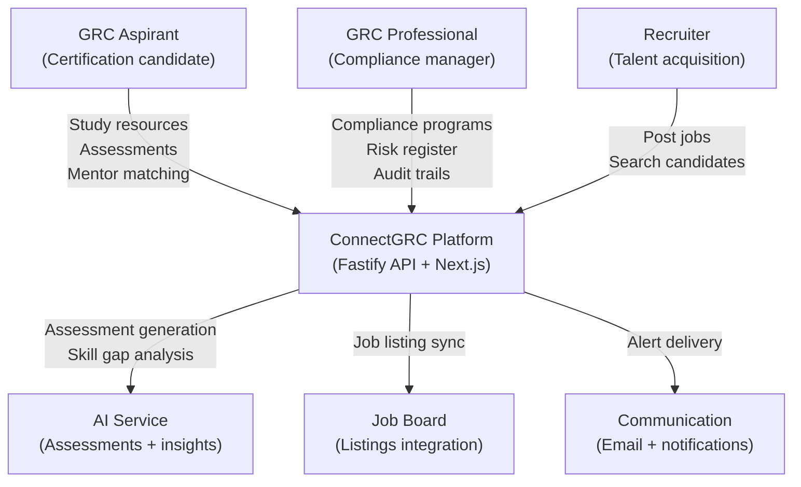
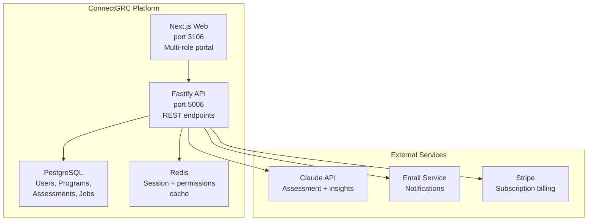
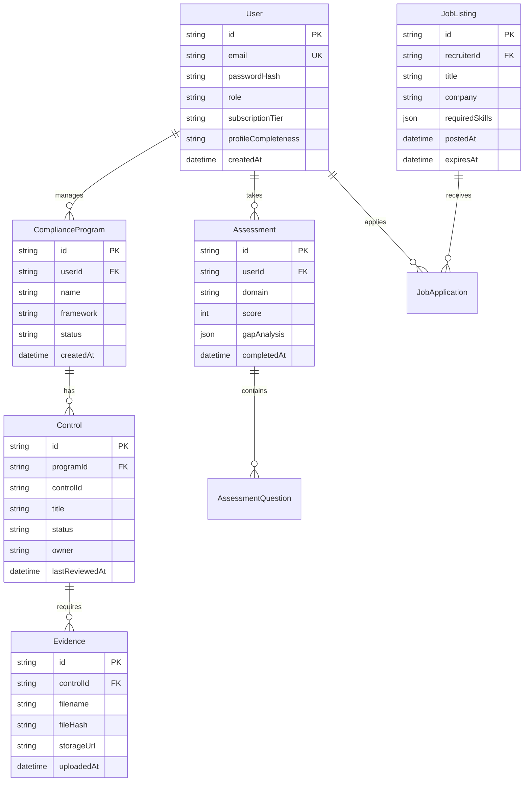
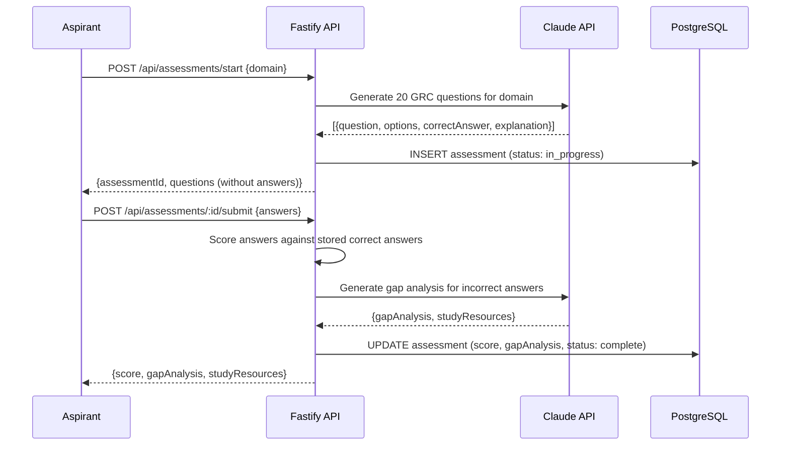

# Feature Specification: ConnectGRC — Core Features

**Product**: connectgrc
**Feature Branch**: `feature/connectgrc/core-mvp`
**Created**: 2026-02-11
**Status**: Accepted
**Version**: 1.0

## Business Context

### Problem Statement

Governance, Risk, and Compliance (GRC) professionals — Aspirants seeking certification and Professionals managing programs — lack modern tools tailored to their workflows. Existing platforms are expensive enterprise tools inaccessible to individual practitioners. ConnectGRC provides an AI-first GRC platform connecting aspirants to professional opportunities while helping organisations manage compliance programs.

### Target Users

| Persona | Role | Pain Point | Expected Outcome |
|---------|------|-----------|-----------------|
| Aspirant (Ahmed) | GRC certification candidate | No structured platform to find mentors, jobs, or community | Guided learning path, mentor matching, job board |
| Professional (Sarah) | Senior GRC Manager | Manual compliance tracking in spreadsheets | Automated compliance workflow, risk register, audit trails |
| Recruiter (Omar) | Talent Acquisition at bank | No GRC-specific talent marketplace | Verified GRC professional profiles with assessment scores |

### Business Value

- **Revenue Impact**: Subscription for professionals ($49/month), enterprise licensing for organisations ($500+/month)
- **User Retention**: Aspirants build portfolio on platform → professionals stay for career tools → recruiters pay for access to verified talent pool
- **Competitive Position**: AI-first GRC platform purpose-built for practitioners. No equivalent for individual GRC professionals.
- **Strategic Alignment**: B2B SaaS in regulated industry with enterprise expansion path

## System Context (C4 Level 1)

## Container Diagram (C4 Level 2)

## User Scenarios & Testing

### User Story 1 — Aspirant Registration & Onboarding (Priority: P1)

**As a** GRC certification aspirant, **I want to** create an account and complete my profile with certifications, experience level, and learning goals, **so that** the platform can provide relevant resources and match me with mentors.

**Acceptance Criteria**:

1. **Given** a new user visits /register, **When** they complete email + password registration, **Then** they receive a verification email and their account is created with aspirant role
2. **Given** a verified aspirant logs in, **When** they complete the onboarding profile (certifications, experience, goals), **Then** their profile is scored for completeness and they are directed to the learning dashboard
3. **Given** an aspirant's profile is complete, **When** the system processes it, **Then** mentor recommendations are generated based on specialisation overlap

### User Story 2 — Assessment & Competency Scoring (Priority: P1)

**As a** GRC aspirant, **I want to** take AI-generated competency assessments, **so that** I can identify my gaps and track my progress toward certification readiness.

**Acceptance Criteria**:

1. **Given** an aspirant selects an assessment domain, **When** they start the assessment, **Then** 20 AI-generated questions are presented with scenario-based format appropriate to GRC practice
2. **Given** an assessment is submitted, **When** the system scores it, **Then** a competency score (0-100) is calculated per domain and a gap analysis is generated
3. **Given** an aspirant has taken at least 3 assessments, **When** they view their progress, **Then** a trending competency chart shows improvement over time

### User Story 3 — Professional Compliance Program (Priority: P1)

**As a** GRC professional, **I want to** create and manage compliance programs with controls, risk assessments, and evidence collection, **so that** I can demonstrate compliance to auditors without managing spreadsheets.

**Acceptance Criteria**:

1. **Given** a professional creates a compliance program (e.g., ISO 27001), **When** they select a framework, **Then** the program is pre-populated with the standard's control set
2. **Given** a control requires evidence, **When** a professional uploads a document, **Then** the evidence is stored with hash verification and linked to the specific control
3. **Given** a compliance program has all controls assessed, **When** the professional requests a report, **Then** a formatted compliance report is generated showing pass/fail/in-progress per control

### User Story 4 — Job Board & Recruiter Matching (Priority: P2)

**As a** recruiter, **I want to** post GRC roles and search verified professional profiles, **so that** I can find candidates with confirmed competencies rather than self-reported CVs.

**Acceptance Criteria**:

1. **Given** a recruiter posts a job listing, **When** they define required skills and certifications, **Then** the system surfaces matching professionals (with their consent to be discoverable)
2. **Given** a professional has completed assessments, **When** a recruiter views their profile, **Then** verified competency scores are displayed alongside certifications
3. **Given** a job matches an aspirant's goals, **When** the system identifies the match, **Then** the aspirant receives a notification with the job details

## Data Model

## Assessment Flow

## Functional Requirements

| ID | Requirement | Priority |
|----|-------------|----------|
| FR-001 | User registration with email verification | P1 |
| FR-002 | Multi-role authentication (Aspirant, Professional, Recruiter, Admin) | P1 |
| FR-003 | Aspirant profile creation with certifications | P1 |
| FR-004 | AI-generated domain assessments | P1 |
| FR-005 | Competency scoring and gap analysis | P1 |
| FR-006 | Professional compliance program management | P1 |
| FR-007 | Control assessment and evidence collection | P1 |
| FR-008 | Compliance report generation | P2 |
| FR-009 | Job board (post, search, apply) | P2 |
| FR-010 | Recruiter-professional matching | P2 |
| FR-011 | Mentor matching for aspirants | P2 |
| FR-012 | Subscription billing (Stripe) | P1 |
