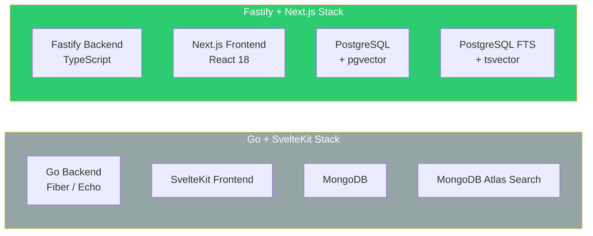
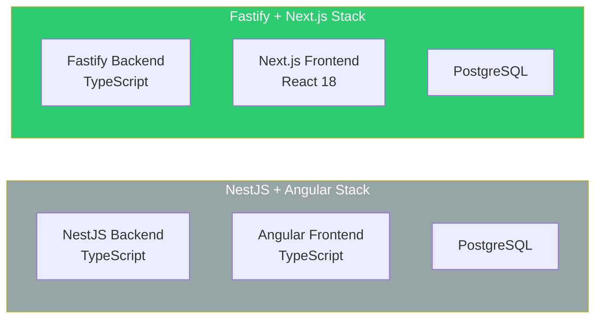

# ADR-001: Technology Stack Selection

> **Status**: Accepted
> **Date**: 2026-02-20
> **Author**: Architect (AI Agent)
> **Product**: ConnectIn -- Professional Networking Platform

---

## Context

ConnectIn is an AI-native, Arabic-first professional networking platform targeting Arab tech professionals globally and MENA-based recruiters. The technology stack must support:

1. **Bilingual RTL/LTR rendering** -- Arabic-first UI with seamless language switching
2. **AI integration** -- Claude API for profile optimization, content generation, and (Phase 2) embedding-based matching
3. **Real-time features** -- WebSocket messaging, SSE notifications, live read receipts
4. **Full-text search** -- Arabic and English text search across profiles, posts, and jobs
5. **Vector similarity search** (Phase 2) -- Profile and job embeddings for semantic matching
6. **Scalability to 10K MAU** -- Architecture supports Phase 2 growth without re-architecture
7. **Developer productivity** -- Reuse ConnectSW's shared packages and established patterns
8. **Open-source readiness** -- Core platform will be open-sourced; stack must be freely available

ConnectSW has an established technology stack (Fastify + Next.js + PostgreSQL + Prisma + Redis) with production-tested shared packages (`@connectsw/auth`, `@connectsw/notifications`, `@connectsw/audit`, `@connectsw/ui`). The decision is whether to use this stack or diverge for ConnectIn's specific needs.

---

## Decision

We adopt the **ConnectSW standard stack** with targeted additions for ConnectIn's unique requirements:

| Layer | Technology | Version |
|-------|-----------|---------|
| **Backend** | Fastify | 4+ |
| **Frontend** | Next.js (App Router) | 14+ |
| **Language** | TypeScript | 5+ |
| **Database** | PostgreSQL + pgvector | 15+ |
| **ORM** | Prisma | 5+ |
| **Cache / Sessions / Queue** | Redis + BullMQ | 7+ |
| **Styling** | Tailwind CSS | 3+ |
| **i18n** | react-i18next | Latest |
| **Real-time** | @fastify/websocket + SSE | Latest |
| **AI** | Claude API (Anthropic) | Latest |
| **Object Storage** | Cloudflare R2 | -- |
| **Email** | Resend | -- |
| **Testing** | Jest + React Testing Library + Playwright | Latest |
| **CI/CD** | GitHub Actions | -- |

---

## Alternatives Considered

### Alternative 1: Go + SvelteKit + MongoDB

| Criterion | Go + SvelteKit | Fastify + Next.js |
|-----------|:--------------:|:-----------------:|
| Performance | Higher raw throughput | More than sufficient for 10K MAU |
| Developer productivity | Lower (Go learning curve, no shared packages) | Higher (TypeScript everywhere, shared packages) |
| Arabic i18n support | Svelte i18n is less mature | react-i18next is battle-tested |
| AI integration | Would need new SDK integration | Anthropic TypeScript SDK; existing LinkedIn Agent patterns |
| Component reuse | Zero reuse from ConnectSW | Full reuse of `@connectsw/*` packages |
| Hiring/community | Smaller Go+Svelte community | Large Next.js + React community |

**Rejected because**: Zero shared package reuse. ConnectSW has 25+ production-tested components in TypeScript. Rebuilding in Go/Svelte would add months of development time for marginal performance gains at MVP scale.

### Alternative 2: NestJS + Angular + PostgreSQL

| Criterion | NestJS + Angular | Fastify + Next.js |
|-----------|:----------------:|:-----------------:|
| Type safety | Full (decorators, DI) | Full (Prisma types, Zod schemas) |
| Bundle size | Angular is larger | Next.js App Router is optimized |
| SSR/SSG | Angular Universal (complex) | Built-in (Next.js App Router) |
| Plugin ecosystem | NestJS modules | Fastify plugins (lighter weight) |
| Component reuse | Partial (NestJS is TypeScript) | Full (same framework family) |
| Arabic RTL support | Angular CDK has bidi | Tailwind logical properties + react-i18next |
| Learning curve | Higher (Angular DI, RxJS) | Lower (React hooks, simpler mental model) |

**Rejected because**: NestJS adds abstraction overhead (decorators, DI containers) that is unnecessary for ConnectIn's domain. Angular's learning curve is steeper for new contributors, which conflicts with the open-source goal. Shared packages are built for Fastify, not NestJS.

### Alternative 3: Elixir/Phoenix + React + PostgreSQL

| Criterion | Elixir/Phoenix | Fastify + Next.js |
|-----------|:--------------:|:-----------------:|
| Real-time | Excellent (Phoenix Channels, LiveView) | Good (WebSocket + SSE) |
| Concurrency | Superior (BEAM VM) | Sufficient (Node.js async I/O) |
| Developer pool | Small | Large |
| Package reuse | Zero | Full |
| Arabic NLP tooling | Very limited in Elixir | Extensive in TypeScript/Node.js |

**Rejected because**: Despite Elixir's superior concurrency model, the tiny Elixir developer pool makes hiring difficult and conflicts with open-source community growth. Zero reuse of ConnectSW packages. Arabic NLP tooling in Elixir is minimal.

---

## Consequences

### Positive

- **Immediate reuse** of `@connectsw/auth`, `@connectsw/notifications`, `@connectsw/audit`, `@connectsw/ui`, and all shared utilities -- saving an estimated 3-4 weeks of development
- **Full type safety** from database schema (Prisma) through API validation (Zod) to frontend props (TypeScript) -- fewer runtime errors in production
- **Single language** (TypeScript) across the entire stack -- any engineer can work on any layer
- **PostgreSQL as single data store** with pgvector for embeddings and tsvector for full-text search eliminates operational complexity of running separate search or vector databases
- **Next.js App Router** provides SSR for SEO-critical pages (profiles, job listings) and client-side rendering for interactive features (feed, messaging)
- **Tailwind CSS logical properties** (`ms-`, `me-`, `ps-`, `pe-`) provide first-class RTL support without CSS hacks
- **Large React/Next.js community** supports the open-source strategy -- contributors can start immediately

### Negative

- **Node.js single-threaded model** limits CPU-intensive operations. Mitigation: BullMQ offloads heavy work (embedding generation, email rendering) to background workers
- **PostgreSQL full-text search for Arabic is limited** -- no Arabic stemmer in the default PostgreSQL installation. Mitigation: Use `simple` dictionary for Phase 1 (whitespace tokenization); evaluate Meilisearch or Elasticsearch for Phase 2 if search quality is insufficient
- **Prisma ORM adds overhead** compared to raw SQL for complex queries (feed algorithm, mutual connections). Mitigation: Use Prisma's `$queryRaw` for performance-critical queries; monitor query latency
- **Monolith architecture** means all modules share a single process. Mitigation: Fastify's plugin system provides logical isolation; extract to microservices only when a module becomes a bottleneck (unlikely before 100K MAU)
- **Redis as a single point of dependency** for sessions, caching, queues, and pub/sub. Mitigation: Redis Plugin has graceful degradation (app functions without Redis, just without caching and with polling instead of real-time); use managed Redis (Upstash, Redis Cloud) for reliability

### Risks

| Risk | Probability | Impact | Mitigation |
|------|:-----------:|:------:|------------|
| PostgreSQL Arabic FTS quality insufficient | Medium | Medium | Phase 1 uses `simple` tokenizer; Phase 2 evaluates dedicated search engine |
| Node.js struggles with concurrent WebSocket connections | Low | Medium | Horizontal scaling on Railway/Render; Redis pub/sub for cross-instance communication |
| Prisma performance for complex feed queries | Low | Low | `$queryRaw` for hot paths; query analysis with `EXPLAIN ANALYZE` |

---

## References

- [ConnectSW Component Registry](/.claude/COMPONENT-REGISTRY.md)
- [ConnectSW Port Registry](/.claude/PORT-REGISTRY.md)
- [ConnectIn PRD](../PRD.md)
- [ConnectIn Innovation Brief](../strategy/INNOVATION-BRIEF.md)

---

## Document History

| Version | Date | Author | Changes |
|---------|------|--------|---------|
| 1.0 | 2026-02-20 | Architect (AI Agent) | Initial ADR |
