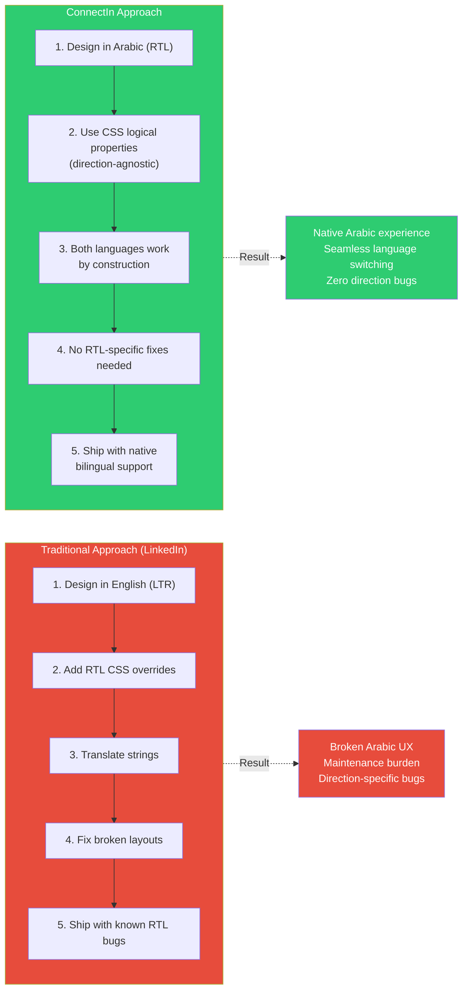
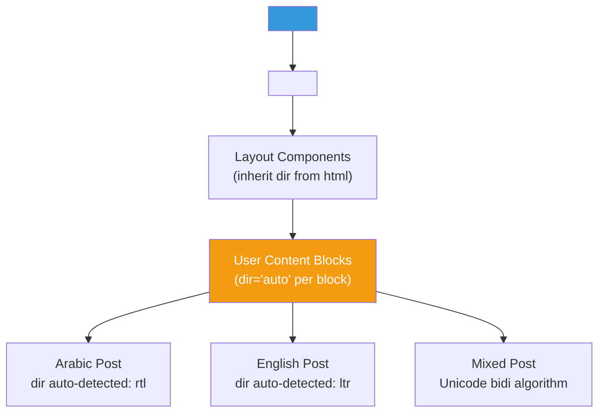
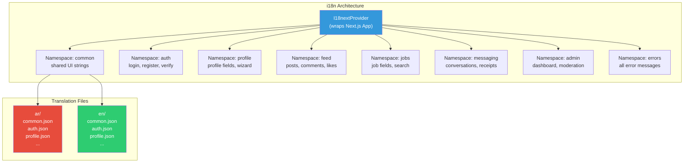
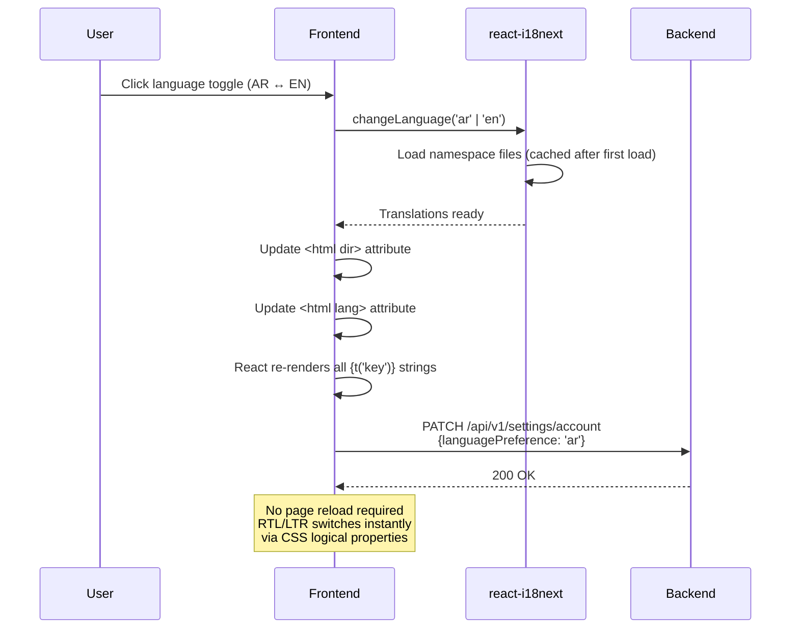
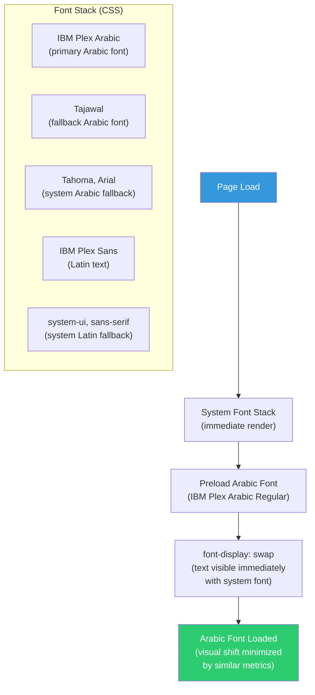
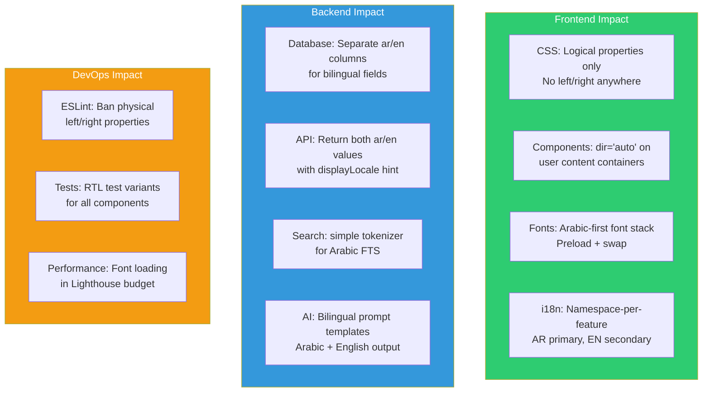

# ADR-002: Arabic-First Architecture

> **Status**: Accepted
> **Date**: 2026-02-20
> **Author**: Architect (AI Agent)
> **Product**: ConnectIn -- Professional Networking Platform

---

## Context

ConnectIn's core competitive thesis is that it is built **Arabic-first**, not English-first with Arabic bolted on. This architectural decision affects every layer of the stack: CSS layout, component design, text rendering, font loading, database storage, API design, and AI integration.

LinkedIn added Arabic support in 2015 as a secondary language, resulting in:
- Broken RTL layouts in certain UI components
- Arabic posts getting deprioritized by English-centric feed algorithms
- No Arabic NLP for search or recommendations
- Profile sections rendering awkwardly when mixing Arabic and English

ConnectIn must avoid these problems by designing Arabic as the default direction, with English as an equally supported secondary direction.

### The Fundamental Difference



---

## Decision

### 1. RTL-First CSS with Logical Properties

**All CSS uses logical properties exclusively.** Physical `left`/`right` properties are banned. Tailwind CSS utility classes use their logical equivalents.

| Physical (Banned) | Logical (Required) | Tailwind Utility |
|:------------------:|:------------------:|:----------------:|
| `margin-left` | `margin-inline-start` | `ms-4` |
| `margin-right` | `margin-inline-end` | `me-4` |
| `padding-left` | `padding-inline-start` | `ps-4` |
| `padding-right` | `padding-inline-end` | `pe-4` |
| `text-align: left` | `text-align: start` | `text-start` |
| `text-align: right` | `text-align: end` | `text-end` |
| `float: left` | `float: inline-start` | Avoid floats; use flex |
| `border-left` | `border-inline-start` | `border-s` |
| `left: 0` | `inset-inline-start: 0` | `start-0` |
| `right: 0` | `inset-inline-end: 0` | `end-0` |

**ESLint rule enforces this:**

```json
{
  "rules": {
    "no-restricted-properties": ["error", {
      "message": "Use CSS logical properties (margin-inline-start/end) instead of margin-left/right"
    }]
  }
}
```

### 2. HTML Direction Architecture



Three levels of direction control:

| Level | Element | `dir` Attribute | Purpose |
|-------|---------|:---------------:|---------|
| Document | `<html>` | `rtl` or `ltr` (from user preference) | Global UI direction |
| User Content | Post text, comments, messages | `auto` | Per-block direction detection |
| Inline Segments | Mixed-language text within a block | (none -- Unicode bidi algorithm) | Inline direction switching |

### 3. i18n Framework: react-i18next



**Namespace organization:**

```
apps/web/public/locales/
  ar/
    common.json       # Navigation, buttons, general UI
    auth.json          # Login, register, verification
    profile.json       # Profile fields, wizard, completeness
    feed.json          # Posts, comments, likes, shares
    jobs.json          # Job listings, applications
    messaging.json     # Conversations, read receipts
    search.json        # Search, filters, trending
    admin.json         # Dashboard, moderation
    errors.json        # All error messages
    validation.json    # Form validation messages
  en/
    (same structure)
```

**Language switching flow:**



### 4. Arabic Font Loading Strategy



**CSS font-face declarations:**

```css
/* Arabic font: preloaded, subset for critical characters */
@font-face {
  font-family: 'IBM Plex Arabic';
  font-style: normal;
  font-weight: 400;
  font-display: swap;
  src: url('/fonts/ibm-plex-arabic-regular.woff2') format('woff2');
  unicode-range: U+0600-06FF, U+0750-077F, U+FB50-FDFF, U+FE70-FEFF;
}

@font-face {
  font-family: 'IBM Plex Arabic';
  font-style: normal;
  font-weight: 600;
  font-display: swap;
  src: url('/fonts/ibm-plex-arabic-semibold.woff2') format('woff2');
  unicode-range: U+0600-06FF, U+0750-077F, U+FB50-FDFF, U+FE70-FEFF;
}

@font-face {
  font-family: 'IBM Plex Arabic';
  font-style: normal;
  font-weight: 700;
  font-display: swap;
  src: url('/fonts/ibm-plex-arabic-bold.woff2') format('woff2');
  unicode-range: U+0600-06FF, U+0750-077F, U+FB50-FDFF, U+FE70-FEFF;
}
```

**Tailwind config:**

```typescript
// tailwind.config.ts
export default {
  theme: {
    fontFamily: {
      sans: [
        'IBM Plex Arabic',
        'Tajawal',
        'IBM Plex Sans',
        'system-ui',
        'sans-serif',
      ],
    },
  },
};
```

Font loading performance targets:
- Arabic font preloaded in `<head>` via `<link rel="preload">`
- `font-display: swap` ensures text is visible immediately with system font
- WOFF2 format only (95%+ browser support, best compression)
- `unicode-range` subsetting prevents loading Arabic fonts when page contains only Latin text

### 5. Bidirectional Content Handling

User-generated content (posts, comments, messages, profile fields) can contain Arabic, English, or mixed text. The system handles this at three layers:

**Layer 1: Frontend Rendering**

```typescript
// Auto-detect text direction based on first strongly-typed character
function detectDirection(text: string): 'rtl' | 'ltr' {
  const rtlChars = /[\u0591-\u07FF\uFB1D-\uFDFD\uFE70-\uFEFC]/;
  const match = text.match(/[^\s\d\W]/);
  if (match && rtlChars.test(match[0])) return 'rtl';
  return 'ltr';
}

// Usage in PostCard
<div dir="auto" className="whitespace-pre-wrap">
  {post.content}
</div>
```

**Layer 2: Database Storage**

Bilingual fields (headline, summary) are stored as separate columns:
- `headline_ar VARCHAR(220)` -- Arabic headline
- `headline_en VARCHAR(220)` -- English headline
- `summary_ar TEXT` -- Arabic summary
- `summary_en TEXT` -- English summary

User content (posts, comments, messages) stores the text as-is with a `text_direction` hint:
- `content TEXT` -- The actual text
- `text_direction ENUM('rtl', 'ltr', 'auto') DEFAULT 'auto'` -- Direction hint from creation time

**Layer 3: API Response**

The API returns content with direction metadata:

```json
{
  "headline": {
    "ar": "مهندس برمجيات أول",
    "en": "Senior Software Engineer"
  },
  "displayLocale": "ar"
}
```

### 6. Number and Date Formatting

| Format | Arabic (ar) | English (en) | Implementation |
|--------|:-----------:|:------------:|----------------|
| Numbers | ١٢٣٬٤٥٦ (Eastern Arabic numerals) | 123,456 | `Intl.NumberFormat(locale)` |
| Dates | ٢٠ فبراير ٢٠٢٦ | February 20, 2026 | `Intl.DateTimeFormat(locale)` |
| Relative time | منذ ساعتين | 2 hours ago | `Intl.RelativeTimeFormat(locale)` |
| Currency | ١٢٣٬٤٥٦ ر.س. | SAR 123,456 | `Intl.NumberFormat(locale, {style: 'currency'})` |

User preference for numeral format (Eastern Arabic vs Western) is stored in `notification_preferences` and respected client-side.

---

## Alternatives Considered

### Alternative A: LTR-First with RTL Overrides (Traditional Approach)

The approach used by LinkedIn and most Western platforms.

| Criterion | LTR-First + RTL Overrides | RTL-First with Logical Properties |
|-----------|:-------------------------:|:---------------------------------:|
| Initial development speed | Faster (familiar to most devs) | Slightly slower (learning curve for logical properties) |
| Arabic UX quality | Compromised (override bugs) | Native (no overrides needed) |
| Maintenance burden | High (two CSS codepaths) | Low (single codepath) |
| RTL bugs in production | Common | Rare (by construction) |
| Alignment with brand promise | Contradicts "Arabic-first" | Fulfills "Arabic-first" |

**Rejected because**: Fundamentally contradicts ConnectIn's value proposition. Building LTR-first and adding RTL is exactly what LinkedIn does. The CSS logical property approach costs slightly more upfront but eliminates an entire category of bugs and maintenance work.

### Alternative B: Separate Arabic and English Frontends

Two separate Next.js applications: one RTL, one LTR.

| Criterion | Separate Frontends | Single Bilingual Frontend |
|-----------|:------------------:|:-------------------------:|
| Code duplication | High (two codebases) | None |
| Feature parity | Risk of divergence | Guaranteed by construction |
| Deployment complexity | 2x (two apps to deploy) | 1x |
| Language switching | Full page reload (redirect to other app) | Instant (no reload) |
| Bundle size | Smaller per-app | Slightly larger (both locales) |

**Rejected because**: Code duplication is unsustainable. Feature parity would diverge over time. Language switching requires a full redirect, which is a poor user experience. The 500ms instant toggle requirement (US-26) cannot be met with separate apps.

### Alternative C: next-intl Instead of react-i18next

| Criterion | next-intl | react-i18next |
|-----------|:---------:|:-------------:|
| Next.js App Router integration | Excellent (native) | Good (requires adapter) |
| Community size | Smaller, growing | Large, established |
| SSR support | First-class | Requires configuration |
| Namespace support | Via file paths | Explicit namespace declaration |
| RTL handling | Manual | Manual (same either way) |
| ConnectSW precedent | None | Some products use it |

**Not rejected** -- next-intl is a viable alternative. We chose react-i18next because of its larger community, more battle-tested Arabic locale handling, and existing team familiarity. The decision can be revisited if next-intl's App Router integration proves significantly superior during implementation.

---

## Consequences

### Positive

- **Arabic UX is native, not adapted** -- no RTL-specific overrides, no direction bugs by construction
- **CSS is direction-agnostic** -- the same styles work in both RTL and LTR because logical properties adapt automatically
- **Language switching is instant** (< 500ms) -- no page reload, no separate app, just a React re-render
- **Bilingual profiles are first-class** -- separate columns for Arabic and English content, not a translation overlay
- **Font loading is optimized** -- Arabic fonts only load when Arabic characters are present on the page (unicode-range subsetting)
- **Number and date formatting adapts automatically** -- `Intl` API handles Eastern Arabic numerals without custom code

### Negative

- **Learning curve for CSS logical properties** -- developers unfamiliar with `margin-inline-start`, `padding-block-end`, etc. need training. Mitigation: Tailwind abstracts most logical properties behind familiar utility classes (`ms-4`, `pe-2`)
- **PostgreSQL Arabic full-text search is limited** -- no stemmer for Arabic root extraction. Mitigation: `simple` dictionary for Phase 1 (whitespace tokenization); Phase 2 evaluates dedicated Arabic search
- **Two translation files per namespace** -- doubles the number of locale files. Mitigation: Translation management tooling (Crowdin or similar) in Phase 2
- **Mixed-direction content is complex** -- Arabic text embedded in English paragraphs (and vice versa) requires careful handling. Mitigation: `dir="auto"` on content blocks + Unicode bidi algorithm for inline segments; well-tested in the browser engine
- **Arabic font files add ~150KB** to the initial page load. Mitigation: WOFF2 compression, `font-display: swap`, preloading critical weights only (regular + semibold)

### Impact on All Layers



---

## References

- [CSS Logical Properties (MDN)](https://developer.mozilla.org/en-US/docs/Web/CSS/CSS_logical_properties_and_values)
- [Tailwind CSS RTL Support](https://tailwindcss.com/docs/hover-focus-and-other-states#rtl-support)
- [react-i18next Documentation](https://react.i18next.com/)
- [Unicode Bidirectional Algorithm (UAX #9)](https://unicode.org/reports/tr9/)
- [IBM Plex Arabic (Google Fonts)](https://fonts.google.com/specimen/IBM+Plex+Sans+Arabic)
- [ConnectIn PRD Section 10: NFR-400 (i18n Requirements)](../PRD.md#nfr-400-internationalization-i18n)

---

## Document History

| Version | Date | Author | Changes |
|---------|------|--------|---------|
| 1.0 | 2026-02-20 | Architect (AI Agent) | Initial ADR |
