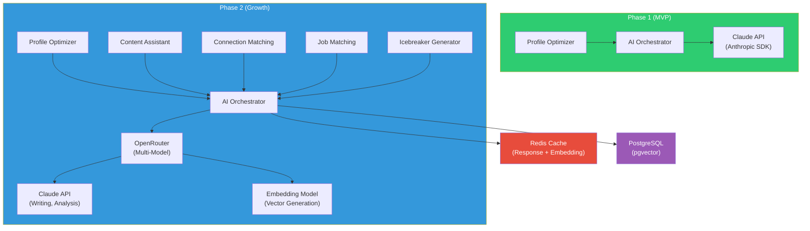
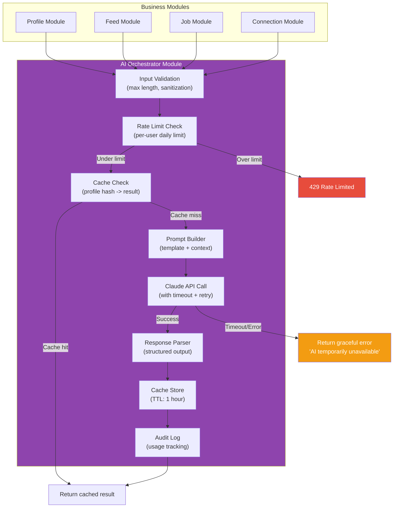
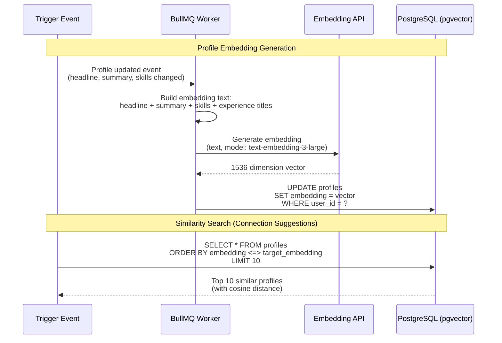
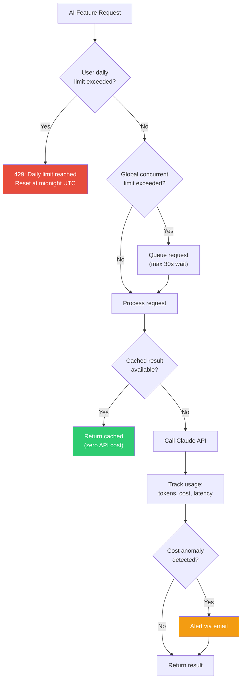
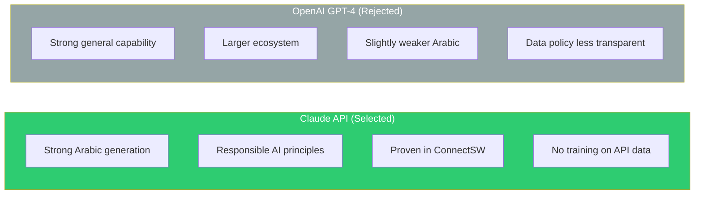

# ADR-003: AI Integration Architecture

> **Status**: Accepted
> **Date**: 2026-02-20
> **Author**: Architect (AI Agent)
> **Product**: ConnectIn -- Professional Networking Platform

---

## Context

ConnectIn positions itself as an **AI-native** professional networking platform. AI is not a premium upsell (as on LinkedIn) but a core capability available to all users from day one. The AI features span multiple phases:

| Feature | Phase | AI Capability |
|---------|-------|---------------|
| Profile Optimizer | MVP (Phase 1) | Analyze profile, generate bilingual suggestions, calculate completeness score |
| Connection Suggestions | Phase 2 | Embedding-based semantic matching, goal alignment scoring |
| Content Assistant | Phase 2 | Bilingual post generation, draft improvement, translation |
| Job Matching | Phase 2 | Semantic job-candidate matching, skill gap analysis |
| Connection Icebreaker | Phase 2 | Personalized connection message generation |

The architecture must:
1. Support Claude API as the primary LLM for text generation (Arabic + English)
2. Enable vector similarity search for matching features (Phase 2)
3. Manage AI API costs at scale (rate limiting, caching, batching)
4. Degrade gracefully when AI services are unavailable
5. Maintain user privacy (no profile data stored by AI providers)

---

## Decision

### 1. Claude API as Primary LLM

Claude API (Anthropic) is the sole LLM provider for Phase 1, with OpenRouter as a multi-model router for Phase 2.



**Rationale for Claude API:**
- Excellent Arabic text generation (proven in ConnectSW's LinkedIn Agent)
- Responsible AI principles (no training on user data via API)
- Competitive pricing for text generation tasks
- TypeScript SDK available (`@anthropic-ai/sdk`)

### 2. AI Orchestrator Pattern

All AI operations go through a single **AI Orchestrator** module in the Fastify API. No module directly calls the Claude API.



**Orchestrator responsibilities:**
1. **Input validation**: Sanitize user content before sending to AI; enforce max length
2. **Rate limiting**: Per-user daily limits (5 profile optimizations, 20 content generations)
3. **Caching**: Hash profile data to create cache key; return cached results for identical inputs (TTL: 1 hour)
4. **Prompt management**: Maintain versioned prompt templates; A/B test prompts for quality
5. **API communication**: Call Claude API with timeout (30s), retry on transient errors (max 2 retries)
6. **Response parsing**: Extract structured data from LLM response; validate schema
7. **Cost tracking**: Log token usage per user per feature; alert on cost anomalies
8. **Graceful degradation**: Return informative error when AI is unavailable; never block core functionality

### 3. Embedding Strategy (Phase 2)

Profile and job embeddings enable semantic matching for connection suggestions and job recommendations.



**Embedding pipeline design:**

| Aspect | Decision |
|--------|----------|
| **Embedding model** | OpenAI `text-embedding-3-large` (1536 dimensions) via OpenRouter |
| **Storage** | PostgreSQL `pgvector` extension (`vector(1536)` column) |
| **Index type** | IVFFlat (good balance of build time and query speed at < 100K vectors) |
| **When to generate** | On profile creation, on profile update (debounced 5 min), on job posting |
| **Processing** | Asynchronous via BullMQ worker (not in request path) |
| **Text preparation** | Concatenate: headline + summary + top 10 skills + experience titles |
| **Bilingual handling** | Embed both Arabic and English text together (embedding model handles multilingual) |
| **Cache** | Embedding is stored in DB column; no separate cache needed |
| **Similarity metric** | Cosine distance (`<=>` operator in pgvector) |

**pgvector configuration:**

```sql
-- Enable extension
CREATE EXTENSION IF NOT EXISTS vector;

-- Add embedding column
ALTER TABLE profiles ADD COLUMN embedding vector(1536);

-- Create IVFFlat index (after initial data load)
-- lists = sqrt(row_count), probes = sqrt(lists)
CREATE INDEX idx_profiles_embedding ON profiles
  USING ivfflat (embedding vector_cosine_ops)
  WITH (lists = 100);

-- Similarly for jobs
ALTER TABLE jobs ADD COLUMN embedding vector(1536);
CREATE INDEX idx_jobs_embedding ON jobs
  USING ivfflat (embedding vector_cosine_ops)
  WITH (lists = 50);
```

### 4. Rate Limiting and Cost Management



**Cost projections (Phase 1 MVP):**

| Feature | Calls/Day (2,500 users) | Avg Tokens/Call | Cost/Call | Daily Cost |
|---------|:-----------------------:|:---------------:|:---------:|:----------:|
| Profile Optimizer | ~200 (8% of users/day) | ~2,000 (in+out) | $0.03 | $6.00 |
| **Total** | **200** | -- | -- | **$6.00/day** |
| **Monthly** | -- | -- | -- | **~$180/month** |

**Cost projections (Phase 2, 10K MAU):**

| Feature | Calls/Day | Avg Tokens/Call | Cost/Call | Daily Cost |
|---------|:---------:|:---------------:|:---------:|:----------:|
| Profile Optimizer | ~500 | ~2,000 | $0.03 | $15.00 |
| Content Assistant | ~300 | ~1,500 | $0.02 | $6.00 |
| Connection Icebreaker | ~200 | ~500 | $0.01 | $2.00 |
| Embeddings (batch) | ~100 new/updated profiles | ~200 | $0.002 | $0.20 |
| **Total** | **~1,100** | -- | -- | **$23.20/day** |
| **Monthly** | -- | -- | -- | **~$700/month** |

**Cost controls:**

| Control | Mechanism |
|---------|-----------|
| Per-user daily cap | Redis counter with TTL (5 optimizations, 20 content generations) |
| Global concurrency | Semaphore limiting concurrent Claude API calls to 10 |
| Response caching | Profile hash -> cached result (1 hour TTL) reduces repeat calls by ~40% |
| Embedding batching | Batch new/updated profiles every 5 minutes instead of per-request |
| Cost alerting | Daily cost check; alert if > 2x rolling 7-day average |
| Kill switch | Feature flag to disable AI features instantly if costs spike |

### 5. Prompt Architecture

Prompts are versioned, templated, and stored in code (not a database) for version control and review.

```
apps/api/src/ai/prompts/
  profile-optimizer/
    v1.ts       # System prompt + user prompt template
    schema.ts   # Zod schema for expected response
  content-assistant/    (Phase 2)
    v1.ts
    schema.ts
  icebreaker/           (Phase 2)
    v1.ts
    schema.ts
```

**Profile Optimizer prompt structure (v1):**

```typescript
export const PROFILE_OPTIMIZER_SYSTEM = `
You are a professional profile optimization expert specializing in
Arabic and English professional content for the MENA tech industry.

Your task is to analyze a user's professional profile and provide:
1. A completeness score (0-100) based on weighted sections
2. Specific, actionable recommendations for improvement
3. Suggested headline and summary text in BOTH Arabic and English

Rules:
- Generate Arabic content that sounds natural, not translated
- Use Modern Standard Arabic (فصحى) for professional contexts
- Keep headlines under 220 characters
- Keep summaries under 2000 characters
- Focus recommendations on discoverability and professionalism
- Never fabricate experience or skills the user has not listed

Respond in JSON format matching the provided schema.
`;

export const PROFILE_OPTIMIZER_USER = (profile: ProfileData) => `
Analyze this professional profile and provide optimization suggestions:

Name: ${profile.displayName}
Current Headline (AR): ${profile.headlineAr || 'Not set'}
Current Headline (EN): ${profile.headlineEn || 'Not set'}
Current Summary (AR): ${profile.summaryAr || 'Not set'}
Current Summary (EN): ${profile.summaryEn || 'Not set'}
Experience: ${JSON.stringify(profile.experiences)}
Education: ${JSON.stringify(profile.educations)}
Skills: ${profile.skills.join(', ')}
Location: ${profile.location || 'Not set'}

Provide your response as JSON.
`;
```

### 6. Graceful Degradation

AI features must never block core platform functionality.

```mermaid
flowchart TD
    AI_REQUEST["User clicks<br/>'Optimize Profile'"] --> API_CALL["Call Claude API<br/>(30s timeout)"]

    API_CALL -->|Success| DISPLAY["Display AI suggestions<br/>with Accept/Edit/Reject"]

    API_CALL -->|Timeout (30s)| TIMEOUT_MSG["Show: 'AI is taking longer<br/>than expected. Try again?'"]
    API_CALL -->|API Error (5xx)| ERROR_MSG["Show: 'AI is temporarily<br/>unavailable. Your profile<br/>is still fully functional.'"]
    API_CALL -->|Rate Limited| LIMIT_MSG["Show: 'You have used all<br/>5 optimizations today.<br/>Try again tomorrow.'"]

    TIMEOUT_MSG --> RETRY{"Retry?"}
    RETRY -->|Yes| API_CALL
    RETRY -->|No| MANUAL["User edits profile manually"]

    ERROR_MSG --> MANUAL
    LIMIT_MSG --> MANUAL

    style DISPLAY fill:#2ECC71,color:#fff
    style TIMEOUT_MSG fill:#F39C12,color:#fff
    style ERROR_MSG fill:#E74C3C,color:#fff
    style LIMIT_MSG fill:#95A5A6,color:#fff
```

**Degradation hierarchy:**

| Scenario | User Experience | Platform Impact |
|----------|----------------|-----------------|
| Claude API responds normally | Full AI suggestions in < 15s | Normal |
| Claude API slow (> 15s, < 30s) | Loading spinner; result eventually arrives | Normal |
| Claude API timeout (> 30s) | "Try again" message | AI features unavailable; all other features work |
| Claude API down (500/503) | "Temporarily unavailable" message | AI features unavailable; all other features work |
| Redis down (cache unavailable) | Slightly slower (no caching); AI still works | Minor latency increase |
| User rate limited | "Daily limit reached" message | Per-user; other users unaffected |
| Cost kill switch activated | AI features disabled platform-wide | Manual editing still works; completeness score calculated locally |

---

## Alternatives Considered

### Alternative A: OpenAI GPT-4 as Primary LLM



| Criterion | Claude API | OpenAI GPT-4 |
|-----------|:----------:|:------------:|
| Arabic text quality | Excellent | Good (slightly below Claude for Arabic) |
| Data privacy | Explicit: no training on API data | Less transparent policies |
| ConnectSW precedent | LinkedIn Agent uses Claude | No precedent |
| Pricing | Competitive | Similar |
| TypeScript SDK | Yes | Yes |

**Rejected because**: Claude's Arabic generation quality is measurably better based on ConnectSW's LinkedIn Agent testing. Anthropic's explicit no-training-on-API-data policy aligns with ConnectIn's privacy-first pillar.

### Alternative B: Self-Hosted Arabic LLM (Jais/ALLaM)

| Criterion | Self-Hosted | Claude API |
|-----------|:-----------:|:----------:|
| Arabic NLP quality | Potentially superior for dialectal Arabic | Excellent for MSA |
| Cost at scale | Lower (compute only) | Higher (per-token) |
| Operational complexity | Very high (GPU infrastructure) | None (API call) |
| Time to implement | Weeks (infrastructure + fine-tuning) | Days (API integration) |
| MVP feasibility | Low | High |

**Rejected for Phase 1** because the operational complexity of hosting and managing GPU infrastructure is prohibitive at MVP stage. Reconsidered for Phase 2 as a secondary model via OpenRouter for dialect-specific tasks.

### Alternative C: Dedicated Vector Database (Pinecone/Weaviate)

| Criterion | pgvector (In PostgreSQL) | Pinecone | Weaviate |
|-----------|:------------------------:|:--------:|:--------:|
| Operational complexity | None (runs in existing PostgreSQL) | Separate managed service | Separate self-hosted service |
| Cost | $0 (included in PostgreSQL) | $70+/month for 100K vectors | Infrastructure cost |
| Query performance | Good (IVFFlat: ~10ms at 100K) | Excellent | Excellent |
| Scale ceiling | ~1M vectors | Billions | Millions |
| Transactional consistency | Full (same DB as profile data) | Eventual consistency | Eventual consistency |
| Hybrid queries | Native (JOIN with profile data) | Requires two queries + merge | Limited |

**Rejected because**: At ConnectIn's Phase 2 target (< 100K profiles), pgvector in PostgreSQL provides sufficient performance. Running in the same database enables transactional consistency and JOIN operations with profile data. Separate vector databases are justified only at millions of vectors or when sub-millisecond latency is required.

---

## Consequences

### Positive

- **AI is available to all users from day one** -- not locked behind a premium tier, differentiating from LinkedIn
- **Single LLM provider simplifies operations** -- one API key, one SDK, one set of rate limits to manage
- **AI Orchestrator pattern provides centralized control** -- caching, rate limiting, cost tracking, and graceful degradation in one place
- **pgvector keeps vector search in PostgreSQL** -- no additional infrastructure; JOINs with profile data; transactional consistency
- **Prompt versioning in code** -- prompts are reviewed in PRs, versioned with the codebase, and A/B testable
- **Cost is predictable and controlled** -- per-user daily limits + caching + monitoring prevent runaway spending

### Negative

- **Single LLM vendor lock-in** -- if Claude API quality degrades or pricing changes, migration is non-trivial. Mitigation: AI Orchestrator abstracts the LLM interface; OpenRouter added in Phase 2 for multi-model routing
- **Embedding generation is async** -- new profiles are not immediately searchable by semantic similarity. Mitigation: Debounce to 5 minutes; fallback to keyword search until embedding is ready
- **IVFFlat index requires rebuilding** as data grows -- insert-heavy workloads degrade accuracy over time. Mitigation: Scheduled weekly REINDEX; monitor recall quality; upgrade to HNSW index at > 100K profiles
- **AI costs scale linearly with users** -- every optimization call costs real money. Mitigation: Aggressive caching (estimated 40% cache hit rate); daily per-user limits; cost monitoring and alerting
- **Arabic LLM quality may not match English** -- despite Claude's strong Arabic, subtle cultural nuances may be missed. Mitigation: User review step (accept/edit/reject); feedback loop to improve prompts; Phase 2 adds dialect-specific models

---

## References

- [Anthropic Claude API Documentation](https://docs.anthropic.com/)
- [pgvector GitHub Repository](https://github.com/pgvector/pgvector)
- [OpenRouter Documentation](https://openrouter.ai/docs)
- [ConnectIn Innovation Brief -- AI Features](../strategy/INNOVATION-BRIEF.md)
- [ConnectIn PRD -- FR-600 AI Requirements](../PRD.md#fr-600-ai-features)

---

## Document History

| Version | Date | Author | Changes |
|---------|------|--------|---------|
| 1.0 | 2026-02-20 | Architect (AI Agent) | Initial ADR |
