# ConnectIn -- Technical Architecture Plan (Gap Closure)

> **Architect** | ConnectSW
> **Version**: 2.0
> **Date**: February 24, 2026
> **Status**: Proposed
> **Product**: ConnectIn -- Arabic-First Professional Networking Platform
> **Scope**: 25 new feature areas across 3 phases to close gaps vs LinkedIn/Qabilah

---

## Table of Contents

1. [System Architecture (C4 Model)](#1-system-architecture-c4-model)
2. [Data Model Extensions](#2-data-model-extensions)
3. [API Contract Overview](#3-api-contract-overview)
4. [Infrastructure Requirements](#4-infrastructure-requirements)
5. [Migration Strategy](#5-migration-strategy)
6. [Performance Considerations](#6-performance-considerations)
7. [Security Architecture](#7-security-architecture)
8. [Sequence Diagrams](#8-sequence-diagrams)
9. [Technology Decision Records](#9-technology-decision-records)

---

## 1. System Architecture (C4 Model)

### 1.1 Level 1 -- System Context

Shows ConnectIn in its full environment after all three phases are complete.


### 1.2 Level 2 -- Container Diagram


### 1.3 Level 3 -- API Component Diagram


---

## 2. Data Model Extensions

### 2.1 Phase 1 -- Profile and Content Enrichment

#### ER Diagram (Phase 1 Additions)

```mermaid
erDiagram
    users ||--o{ reactions : "gives"
    users ||--o{ reposts : "creates"
    users ||--o{ bookmarks : "saves"
    users ||--o{ endorsements_given : "endorses"
    users ||--o{ endorsements_received : "receives via profile_skill"
    users ||--o{ blocks : "blocks"
    users ||--o{ reports : "submits"
    users ||--o| user_preferences : "has"
    users ||--o{ mentions : "is mentioned"
    users ||--o{ hashtag_follows : "follows hashtags"

    posts ||--o{ reactions : "has"
    posts ||--o{ reposts : "is reposted"
    posts ||--o{ post_media : "has media"
    posts ||--o{ post_hashtags : "tagged with"
    posts ||--o{ mentions : "contains mentions"
    posts ||--o{ bookmarks : "is bookmarked"

    profiles ||--o| profile_banners : "has banner"
    profile_skills ||--o{ endorsements : "receives"

    hashtags ||--o{ post_hashtags : "used in"
    hashtags ||--o{ hashtag_follows : "followed by"
    media ||--o{ post_media : "attached to"

    reactions {
        uuid id PK
        uuid post_id FK
        uuid user_id FK
        enum type "LIKE CELEBRATE SUPPORT LOVE INSIGHTFUL FUNNY"
        timestamp created_at
    }

    reposts {
        uuid id PK
        uuid original_post_id FK
        uuid user_id FK
        uuid repost_post_id FK "nullable - the new post created"
        text comment "nullable, max 1000"
        timestamp created_at
    }

    media {
        uuid id PK
        uuid uploader_id FK
        enum type "IMAGE VIDEO DOCUMENT"
        varchar url
        varchar cdn_url "nullable"
        varchar thumbnail_url "nullable"
        varchar mime_type
        integer file_size
        integer width "nullable"
        integer height "nullable"
        integer duration_seconds "nullable, video only"
        varchar alt_text "nullable"
        enum status "PROCESSING READY FAILED"
        jsonb metadata "nullable"
        timestamp created_at
    }

    post_media {
        uuid id PK
        uuid post_id FK
        uuid media_id FK
        integer sort_order
        timestamp created_at
    }

    hashtags {
        uuid id PK
        varchar tag "UNIQUE, max 100"
        integer post_count "DEFAULT 0"
        boolean is_trending "DEFAULT false"
        timestamp created_at
    }

    post_hashtags {
        uuid id PK
        uuid post_id FK
        uuid hashtag_id FK
        timestamp created_at
    }

    mentions {
        uuid id PK
        uuid post_id FK "nullable"
        uuid comment_id FK "nullable"
        uuid mentioned_user_id FK
        uuid mentioned_company_id FK "nullable"
        integer offset_start
        integer offset_end
        timestamp created_at
    }

    bookmarks {
        uuid id PK
        uuid user_id FK
        uuid post_id FK "nullable"
        uuid job_id FK "nullable"
        uuid article_id FK "nullable"
        timestamp created_at
    }

    endorsements {
        uuid id PK
        uuid endorser_id FK
        uuid profile_skill_id FK
        timestamp created_at
    }

    blocks {
        uuid id PK
        uuid blocker_id FK
        uuid blocked_id FK
        varchar reason "nullable"
        timestamp created_at
    }

    reports {
        uuid id PK
        uuid reporter_id FK
        uuid reported_user_id FK "nullable"
        uuid reported_post_id FK "nullable"
        uuid reported_comment_id FK "nullable"
        enum category "SPAM HARASSMENT MISINFORMATION HATE_SPEECH IMPERSONATION OTHER"
        text details "nullable, max 500"
        enum status "PENDING REVIEWED DISMISSED ACTIONED"
        uuid reviewed_by FK "nullable"
        text action_taken "nullable"
        timestamp reviewed_at "nullable"
        timestamp created_at
    }

    user_preferences {
        uuid id PK
        uuid user_id FK "UNIQUE"
        enum theme "LIGHT DARK SYSTEM"
        enum feed_sort "RELEVANCE RECENT"
        boolean show_profile_photo "DEFAULT true"
        boolean show_activity_status "DEFAULT true"
        varchar locale "DEFAULT ar"
        jsonb custom_settings "nullable"
        timestamp updated_at
    }

    hashtag_follows {
        uuid id PK
        uuid user_id FK
        uuid hashtag_id FK
        timestamp created_at
    }
```



#### Prisma Schema -- Phase 1

```prisma
// ─── Phase 1 Enums ─────────────────────────────────────────

enum ReactionType {
  LIKE
  CELEBRATE
  SUPPORT
  LOVE
  INSIGHTFUL
  FUNNY
}

enum MediaType {
  IMAGE
  VIDEO
  DOCUMENT
}

enum MediaStatus {
  PROCESSING
  READY
  FAILED
}

enum ReportCategory {
  SPAM
  HARASSMENT
  MISINFORMATION
  HATE_SPEECH
  IMPERSONATION
  OTHER
}

enum ReportStatus {
  PENDING
  REVIEWED
  DISMISSED
  ACTIONED
}

enum ThemePreference {
  LIGHT
  DARK
  SYSTEM
}

enum FeedSort {
  RELEVANCE
  RECENT
}

// ─── Reactions (replaces Like) ──────────────────────────────

model Reaction {
  id        String       @id @default(uuid())
  postId    String       @map("post_id")
  userId    String       @map("user_id")
  type      ReactionType @default(LIKE)
  createdAt DateTime     @default(now()) @map("created_at")

  post Post @relation(fields: [postId], references: [id], onDelete: Cascade)
  user User @relation(fields: [userId], references: [id], onDelete: Cascade)

  @@unique([postId, userId])
  @@index([postId, type])
  @@index([userId])
  @@map("reactions")
}

// ─── Media ──────────────────────────────────────────────────

model Media {
  id              String      @id @default(uuid())
  uploaderId      String      @map("uploader_id")
  type            MediaType
  url             String      @db.VarChar(500)
  cdnUrl          String?     @map("cdn_url") @db.VarChar(500)
  thumbnailUrl    String?     @map("thumbnail_url") @db.VarChar(500)
  mimeType        String      @map("mime_type") @db.VarChar(100)
  fileSize        Int         @map("file_size")
  width           Int?
  height          Int?
  durationSeconds Int?        @map("duration_seconds")
  altText         String?     @map("alt_text") @db.VarChar(200)
  status          MediaStatus @default(PROCESSING)
  metadata        Json?
  createdAt       DateTime    @default(now()) @map("created_at")

  uploader  User        @relation(fields: [uploaderId], references: [id], onDelete: Cascade)
  postMedia PostMedia[]

  @@index([uploaderId])
  @@index([status])
  @@map("media")
}

model PostMedia {
  id        String   @id @default(uuid())
  postId    String   @map("post_id")
  mediaId   String   @map("media_id")
  sortOrder Int      @default(0) @map("sort_order")
  createdAt DateTime @default(now()) @map("created_at")

  post  Post  @relation(fields: [postId], references: [id], onDelete: Cascade)
  media Media @relation(fields: [mediaId], references: [id], onDelete: Cascade)

  @@unique([postId, mediaId])
  @@index([postId, sortOrder])
  @@map("post_media")
}

// ─── Reposts ────────────────────────────────────────────────

model Repost {
  id             String   @id @default(uuid())
  originalPostId String   @map("original_post_id")
  userId         String   @map("user_id")
  repostPostId   String?  @unique @map("repost_post_id")
  comment        String?  @db.VarChar(1000)
  createdAt      DateTime @default(now()) @map("created_at")

  originalPost Post  @relation("RepostOriginal", fields: [originalPostId], references: [id], onDelete: Cascade)
  repostPost   Post? @relation("RepostNew", fields: [repostPostId], references: [id], onDelete: SetNull)
  user         User  @relation(fields: [userId], references: [id], onDelete: Cascade)

  @@unique([originalPostId, userId])
  @@index([userId])
  @@map("reposts")
}

// ─── Hashtags ───────────────────────────────────────────────

model Hashtag {
  id         String   @id @default(uuid())
  tag        String   @unique @db.VarChar(100)
  postCount  Int      @default(0) @map("post_count")
  isTrending Boolean  @default(false) @map("is_trending")
  createdAt  DateTime @default(now()) @map("created_at")

  postHashtags   PostHashtag[]
  hashtagFollows HashtagFollow[]

  @@index([postCount(sort: Desc)])
  @@map("hashtags")
}

model PostHashtag {
  id        String   @id @default(uuid())
  postId    String   @map("post_id")
  hashtagId String   @map("hashtag_id")
  createdAt DateTime @default(now()) @map("created_at")

  post    Post    @relation(fields: [postId], references: [id], onDelete: Cascade)
  hashtag Hashtag @relation(fields: [hashtagId], references: [id], onDelete: Cascade)

  @@unique([postId, hashtagId])
  @@map("post_hashtags")
}

model HashtagFollow {
  id        String   @id @default(uuid())
  userId    String   @map("user_id")
  hashtagId String   @map("hashtag_id")
  createdAt DateTime @default(now()) @map("created_at")

  user    User    @relation(fields: [userId], references: [id], onDelete: Cascade)
  hashtag Hashtag @relation(fields: [hashtagId], references: [id], onDelete: Cascade)

  @@unique([userId, hashtagId])
  @@map("hashtag_follows")
}

// ─── Mentions ───────────────────────────────────────────────

model Mention {
  id                 String   @id @default(uuid())
  postId             String?  @map("post_id")
  commentId          String?  @map("comment_id")
  mentionedUserId    String?  @map("mentioned_user_id")
  mentionedCompanyId String?  @map("mentioned_company_id")
  offsetStart        Int      @map("offset_start")
  offsetEnd          Int      @map("offset_end")
  createdAt          DateTime @default(now()) @map("created_at")

  post             Post?    @relation(fields: [postId], references: [id], onDelete: Cascade)
  comment          Comment? @relation(fields: [commentId], references: [id], onDelete: Cascade)
  mentionedUser    User?    @relation("MentionTarget", fields: [mentionedUserId], references: [id], onDelete: Cascade)

  @@index([mentionedUserId])
  @@index([postId])
  @@map("mentions")
}

// ─── Bookmarks ──────────────────────────────────────────────

model Bookmark {
  id        String   @id @default(uuid())
  userId    String   @map("user_id")
  postId    String?  @map("post_id")
  jobId     String?  @map("job_id")
  articleId String?  @map("article_id")
  createdAt DateTime @default(now()) @map("created_at")

  user    User     @relation(fields: [userId], references: [id], onDelete: Cascade)
  post    Post?    @relation(fields: [postId], references: [id], onDelete: Cascade)
  job     Job?     @relation(fields: [jobId], references: [id], onDelete: Cascade)

  @@unique([userId, postId])
  @@unique([userId, jobId])
  @@unique([userId, articleId])
  @@index([userId, createdAt(sort: Desc)])
  @@map("bookmarks")
}

// ─── Endorsements ───────────────────────────────────────────

model Endorsement {
  id             String   @id @default(uuid())
  endorserId     String   @map("endorser_id")
  profileSkillId String   @map("profile_skill_id")
  createdAt      DateTime @default(now()) @map("created_at")

  endorser     User         @relation(fields: [endorserId], references: [id], onDelete: Cascade)
  profileSkill ProfileSkill @relation(fields: [profileSkillId], references: [id], onDelete: Cascade)

  @@unique([endorserId, profileSkillId])
  @@index([profileSkillId])
  @@map("endorsements")
}

// ─── Block / Report ─────────────────────────────────────────

model Block {
  id        String   @id @default(uuid())
  blockerId String   @map("blocker_id")
  blockedId String   @map("blocked_id")
  reason    String?  @db.VarChar(500)
  createdAt DateTime @default(now()) @map("created_at")

  blocker User @relation("BlockSender", fields: [blockerId], references: [id], onDelete: Cascade)
  blocked User @relation("BlockTarget", fields: [blockedId], references: [id], onDelete: Cascade)

  @@unique([blockerId, blockedId])
  @@index([blockedId])
  @@map("blocks")
}

model Report {
  id                String         @id @default(uuid())
  reporterId        String         @map("reporter_id")
  reportedUserId    String?        @map("reported_user_id")
  reportedPostId    String?        @map("reported_post_id")
  reportedCommentId String?        @map("reported_comment_id")
  category          ReportCategory
  details           String?        @db.VarChar(500)
  status            ReportStatus   @default(PENDING)
  reviewedBy        String?        @map("reviewed_by")
  actionTaken       String?        @map("action_taken") @db.Text
  reviewedAt        DateTime?      @map("reviewed_at")
  createdAt         DateTime       @default(now()) @map("created_at")

  reporter User @relation("ReportSubmitter", fields: [reporterId], references: [id], onDelete: Cascade)

  @@index([status, createdAt])
  @@index([reporterId])
  @@map("reports")
}

// ─── User Preferences ───────────────────────────────────────

model UserPreference {
  id                   String          @id @default(uuid())
  userId               String          @unique @map("user_id")
  theme                ThemePreference @default(SYSTEM)
  feedSort             FeedSort        @default(RELEVANCE) @map("feed_sort")
  showProfilePhoto     Boolean         @default(true) @map("show_profile_photo")
  showActivityStatus   Boolean         @default(true) @map("show_activity_status")
  locale               String          @default("ar") @db.VarChar(5)
  customSettings       Json?           @map("custom_settings")
  updatedAt            DateTime        @updatedAt @map("updated_at")

  user User @relation(fields: [userId], references: [id], onDelete: Cascade)

  @@map("user_preferences")
}
```

**Changes to existing models for Phase 1:**

```prisma
// Post model additions:
//   - Add: reactionCount  Int @default(0) @map("reaction_count")
//   - Add: repostCount    Int @default(0) @map("repost_count")
//   - Add: bookmarkCount  Int @default(0) @map("bookmark_count")
//   - Add: relations to Reaction[], PostMedia[], Repost[], PostHashtag[], Mention[], Bookmark[]
//   - Deprecate: likeCount (migrate to reactionCount), likes (migrate to reactions)

// Profile model additions:
//   - Add: bannerUrl  String? @map("banner_url") @db.VarChar(500)

// ProfileSkill model additions:
//   - Add: endorsements Endorsement[]

// User model additions:
//   - Add: reactions        Reaction[]
//   - Add: reposts          Repost[]
//   - Add: bookmarks        Bookmark[]
//   - Add: endorsementsGiven Endorsement[]
//   - Add: media            Media[]
//   - Add: blocksSent       Block[] @relation("BlockSender")
//   - Add: blocksReceived   Block[] @relation("BlockTarget")
//   - Add: reportsSent      Report[] @relation("ReportSubmitter")
//   - Add: mentionsReceived Mention[] @relation("MentionTarget")
//   - Add: hashtagFollows   HashtagFollow[]
//   - Add: preference       UserPreference?
```

### 2.2 Phase 2 -- Platform Features

#### ER Diagram (Phase 2 Additions)


#### Prisma Schema -- Phase 2

```prisma
// ─── Phase 2 Enums ─────────────────────────────────────────

enum CompanyMemberRole {
  OWNER
  ADMIN
  EDITOR
  ANALYST
}

enum GroupVisibility {
  PUBLIC
  PRIVATE
}

enum GroupMemberRole {
  OWNER
  ADMIN
  MODERATOR
  MEMBER
}

enum EventType {
  IN_PERSON
  VIRTUAL
  HYBRID
}

enum EventStatus {
  DRAFT
  PUBLISHED
  CANCELLED
  COMPLETED
}

enum RsvpStatus {
  GOING
  INTERESTED
  NOT_GOING
}

enum AlertFrequency {
  INSTANT
  DAILY
  WEEKLY
}

enum ArticleStatus {
  DRAFT
  PUBLISHED
  ARCHIVED
}

enum ParseStatus {
  PENDING
  PROCESSING
  COMPLETED
  FAILED
}

// ─── Company Pages ──────────────────────────────────────────

model Company {
  id            String   @id @default(uuid())
  createdById   String   @map("created_by")
  name          String   @db.VarChar(200)
  slug          String   @unique @db.VarChar(200)
  logoUrl       String?  @map("logo_url") @db.VarChar(500)
  bannerUrl     String?  @map("banner_url") @db.VarChar(500)
  descriptionAr String?  @map("description_ar") @db.Text
  descriptionEn String?  @map("description_en") @db.Text
  industry      String?  @db.VarChar(100)
  companySize   String?  @map("company_size") @db.VarChar(50)
  headquarters  String?  @db.VarChar(200)
  website       String?  @db.VarChar(255)
  followerCount Int      @default(0) @map("follower_count")
  employeeCount Int      @default(0) @map("employee_count")
  isVerified    Boolean  @default(false) @map("is_verified")
  createdAt     DateTime @default(now()) @map("created_at")
  updatedAt     DateTime @updatedAt @map("updated_at")

  createdBy User            @relation(fields: [createdById], references: [id])
  members   CompanyMember[]
  followers CompanyFollower[]
  jobs      Job[]
  events    Event[]

  @@index([slug])
  @@index([industry])
  @@map("companies")
}

model CompanyMember {
  id        String            @id @default(uuid())
  companyId String            @map("company_id")
  userId    String            @map("user_id")
  role      CompanyMemberRole @default(EDITOR)
  title     String?           @db.VarChar(200)
  createdAt DateTime          @default(now()) @map("created_at")

  company Company @relation(fields: [companyId], references: [id], onDelete: Cascade)
  user    User    @relation(fields: [userId], references: [id], onDelete: Cascade)

  @@unique([companyId, userId])
  @@map("company_members")
}

model CompanyFollower {
  id        String   @id @default(uuid())
  companyId String   @map("company_id")
  userId    String   @map("user_id")
  createdAt DateTime @default(now()) @map("created_at")

  company Company @relation(fields: [companyId], references: [id], onDelete: Cascade)
  user    User    @relation(fields: [userId], references: [id], onDelete: Cascade)

  @@unique([companyId, userId])
  @@index([userId])
  @@map("company_followers")
}

// ─── Groups ─────────────────────────────────────────────────

model Group {
  id            String          @id @default(uuid())
  createdById   String          @map("created_by")
  name          String          @db.VarChar(200)
  slug          String          @unique @db.VarChar(200)
  description   String?         @db.Text
  coverImageUrl String?         @map("cover_image_url") @db.VarChar(500)
  visibility    GroupVisibility @default(PUBLIC)
  rules         String?         @db.Text
  memberCount   Int             @default(0) @map("member_count")
  postCount     Int             @default(0) @map("post_count")
  createdAt     DateTime        @default(now()) @map("created_at")
  updatedAt     DateTime        @updatedAt @map("updated_at")

  createdBy User          @relation(fields: [createdById], references: [id])
  members   GroupMember[]
  posts     GroupPost[]

  @@index([visibility])
  @@index([memberCount(sort: Desc)])
  @@map("groups")
}

model GroupMember {
  id       String          @id @default(uuid())
  groupId  String          @map("group_id")
  userId   String          @map("user_id")
  role     GroupMemberRole @default(MEMBER)
  joinedAt DateTime        @default(now()) @map("joined_at")

  group Group @relation(fields: [groupId], references: [id], onDelete: Cascade)
  user  User  @relation(fields: [userId], references: [id], onDelete: Cascade)

  @@unique([groupId, userId])
  @@index([userId])
  @@map("group_members")
}

model GroupPost {
  id         String   @id @default(uuid())
  groupId    String   @map("group_id")
  postId     String   @map("post_id")
  isPinned   Boolean  @default(false) @map("is_pinned")
  isApproved Boolean  @default(true) @map("is_approved")
  createdAt  DateTime @default(now()) @map("created_at")

  group Group @relation(fields: [groupId], references: [id], onDelete: Cascade)
  post  Post  @relation(fields: [postId], references: [id], onDelete: Cascade)

  @@unique([groupId, postId])
  @@map("group_posts")
}

// ─── Events ─────────────────────────────────────────────────

model Event {
  id            String      @id @default(uuid())
  organizerId   String      @map("organizer_id")
  companyId     String?     @map("company_id")
  title         String      @db.VarChar(300)
  description   String?     @db.Text
  eventType     EventType   @default(VIRTUAL) @map("event_type")
  location      String?     @db.VarChar(300)
  virtualUrl    String?     @map("virtual_url") @db.VarChar(500)
  startsAt      DateTime    @map("starts_at")
  endsAt        DateTime    @map("ends_at")
  maxAttendees  Int?        @map("max_attendees")
  attendeeCount Int         @default(0) @map("attendee_count")
  coverImageUrl String?     @map("cover_image_url") @db.VarChar(500)
  status        EventStatus @default(DRAFT)
  createdAt     DateTime    @default(now()) @map("created_at")
  updatedAt     DateTime    @updatedAt @map("updated_at")

  organizer User             @relation(fields: [organizerId], references: [id])
  company   Company?         @relation(fields: [companyId], references: [id])
  attendees EventAttendee[]

  @@index([status, startsAt])
  @@index([organizerId])
  @@index([companyId])
  @@map("events")
}

model EventAttendee {
  id           String     @id @default(uuid())
  eventId      String     @map("event_id")
  userId       String     @map("user_id")
  rsvpStatus   RsvpStatus @default(GOING) @map("rsvp_status")
  registeredAt DateTime   @default(now()) @map("registered_at")

  event Event @relation(fields: [eventId], references: [id], onDelete: Cascade)
  user  User  @relation(fields: [userId], references: [id], onDelete: Cascade)

  @@unique([eventId, userId])
  @@index([userId])
  @@map("event_attendees")
}

// ─── Follow System ──────────────────────────────────────────

model Follow {
  id                String   @id @default(uuid())
  followerId        String   @map("follower_id")
  followedUserId    String?  @map("followed_user_id")
  followedCompanyId String?  @map("followed_company_id")
  followedHashtagId String?  @map("followed_hashtag_id")
  createdAt         DateTime @default(now()) @map("created_at")

  follower User @relation("FollowSender", fields: [followerId], references: [id], onDelete: Cascade)

  @@unique([followerId, followedUserId])
  @@unique([followerId, followedCompanyId])
  @@unique([followerId, followedHashtagId])
  @@index([followedUserId])
  @@index([followedCompanyId])
  @@map("follows")
}

// ─── Saved Searches / Alerts ────────────────────────────────

model SavedSearch {
  id           String   @id @default(uuid())
  userId       String   @map("user_id")
  name         String   @db.VarChar(200)
  query        String   @db.VarChar(500)
  filters      Json?
  alertEnabled Boolean  @default(false) @map("alert_enabled")
  createdAt    DateTime @default(now()) @map("created_at")

  user   User          @relation(fields: [userId], references: [id], onDelete: Cascade)
  alerts SearchAlert[]

  @@index([userId])
  @@map("saved_searches")
}

model SearchAlert {
  id            String         @id @default(uuid())
  savedSearchId String         @map("saved_search_id")
  userId        String         @map("user_id")
  frequency     AlertFrequency @default(DAILY)
  lastSentAt    DateTime?      @map("last_sent_at")
  createdAt     DateTime       @default(now()) @map("created_at")

  savedSearch SavedSearch @relation(fields: [savedSearchId], references: [id], onDelete: Cascade)
  user        User        @relation(fields: [userId], references: [id], onDelete: Cascade)

  @@index([userId])
  @@map("search_alerts")
}

// ─── Polls ──────────────────────────────────────────────────

model Poll {
  id           String   @id @default(uuid())
  postId       String   @unique @map("post_id")
  durationDays Int      @default(7) @map("duration_days")
  totalVotes   Int      @default(0) @map("total_votes")
  isClosed     Boolean  @default(false) @map("is_closed")
  closesAt     DateTime @map("closes_at")
  createdAt    DateTime @default(now()) @map("created_at")

  post    Post         @relation(fields: [postId], references: [id], onDelete: Cascade)
  options PollOption[]

  @@map("polls")
}

model PollOption {
  id        String @id @default(uuid())
  pollId    String @map("poll_id")
  text      String @db.VarChar(200)
  voteCount Int    @default(0) @map("vote_count")
  sortOrder Int    @default(0) @map("sort_order")

  poll  Poll       @relation(fields: [pollId], references: [id], onDelete: Cascade)
  votes PollVote[]

  @@index([pollId, sortOrder])
  @@map("poll_options")
}

model PollVote {
  id        String   @id @default(uuid())
  pollId    String   @map("poll_id")
  optionId  String   @map("option_id")
  userId    String   @map("user_id")
  createdAt DateTime @default(now()) @map("created_at")

  option PollOption @relation(fields: [optionId], references: [id], onDelete: Cascade)
  user   User       @relation(fields: [userId], references: [id], onDelete: Cascade)

  @@unique([pollId, userId])
  @@map("poll_votes")
}

// ─── Articles ───────────────────────────────────────────────

model Article {
  id              String        @id @default(uuid())
  authorId        String        @map("author_id")
  title           String        @db.VarChar(300)
  slug            String        @unique @db.VarChar(300)
  content         String        @db.Text
  coverImageUrl   String?       @map("cover_image_url") @db.VarChar(500)
  status          ArticleStatus @default(DRAFT)
  readTimeMinutes Int           @default(0) @map("read_time_minutes")
  viewCount       Int           @default(0) @map("view_count")
  reactionCount   Int           @default(0) @map("reaction_count")
  commentCount    Int           @default(0) @map("comment_count")
  publishedAt     DateTime?     @map("published_at")
  createdAt       DateTime      @default(now()) @map("created_at")
  updatedAt       DateTime      @updatedAt @map("updated_at")

  author User @relation(fields: [authorId], references: [id], onDelete: Cascade)

  @@index([authorId])
  @@index([status, publishedAt(sort: Desc)])
  @@index([slug])
  @@map("articles")
}

// ─── Job Alerts ─────────────────────────────────────────────

model JobAlert {
  id              String          @id @default(uuid())
  userId          String          @map("user_id")
  keywords        String?         @db.VarChar(300)
  location        String?         @db.VarChar(200)
  workType        WorkType?       @map("work_type")
  experienceLevel ExperienceLevel? @map("experience_level")
  frequency       AlertFrequency  @default(DAILY)
  isActive        Boolean         @default(true) @map("is_active")
  lastSentAt      DateTime?       @map("last_sent_at")
  createdAt       DateTime        @default(now()) @map("created_at")

  user User @relation(fields: [userId], references: [id], onDelete: Cascade)

  @@index([userId, isActive])
  @@map("job_alerts")
}

// ─── Resumes ────────────────────────────────────────────────

model Resume {
  id          String      @id @default(uuid())
  userId      String      @map("user_id")
  fileUrl     String      @map("file_url") @db.VarChar(500)
  fileName    String      @map("file_name") @db.VarChar(300)
  fileSize    Int         @map("file_size")
  mimeType    String      @map("mime_type") @db.VarChar(100)
  parsedData  Json?       @map("parsed_data")
  parseStatus ParseStatus @default(PENDING) @map("parse_status")
  isPrimary   Boolean     @default(false) @map("is_primary")
  createdAt   DateTime    @default(now()) @map("created_at")
  updatedAt   DateTime    @updatedAt @map("updated_at")

  user User @relation(fields: [userId], references: [id], onDelete: Cascade)

  @@index([userId])
  @@map("resumes")
}
```

### 2.3 Phase 3 -- Advanced Features

#### Prisma Schema -- Phase 3

```prisma
// ─── Phase 3 Enums ─────────────────────────────────────────

enum CourseLevel {
  BEGINNER
  INTERMEDIATE
  ADVANCED
}

enum EnrollmentStatus {
  ENROLLED
  IN_PROGRESS
  COMPLETED
  DROPPED
}

enum SubscriptionTier {
  FREE
  PREMIUM_CAREER
  PREMIUM_BUSINESS
  RECRUITER_LITE
  RECRUITER_PRO
}

enum SubscriptionStatus {
  ACTIVE
  CANCELLED
  PAST_DUE
  EXPIRED
  TRIALING
}

enum InMailStatus {
  SENT
  DELIVERED
  READ
  REPLIED
  EXPIRED
}

enum RecruiterCandidateStage {
  SOURCED
  CONTACTED
  RESPONDED
  SCREENING
  INTERVIEW
  OFFER
  HIRED
  REJECTED
  ARCHIVED
}

enum PushPlatform {
  WEB
  IOS
  ANDROID
}

// ─── Learning Hub ───────────────────────────────────────────

model Course {
  id             String      @id @default(uuid())
  title          String      @db.VarChar(300)
  slug           String      @unique @db.VarChar(300)
  description    String      @db.Text
  instructorName String      @map("instructor_name") @db.VarChar(200)
  coverImageUrl  String?     @map("cover_image_url") @db.VarChar(500)
  level          CourseLevel @default(BEGINNER)
  durationMinutes Int        @map("duration_minutes")
  lessonCount    Int         @default(0) @map("lesson_count")
  enrollmentCount Int        @default(0) @map("enrollment_count")
  isPremium      Boolean     @default(false) @map("is_premium")
  tags           String[]
  createdAt      DateTime    @default(now()) @map("created_at")
  updatedAt      DateTime    @updatedAt @map("updated_at")

  enrollments CourseEnrollment[]
  certificates Certificate[]

  @@index([level])
  @@index([isPremium])
  @@map("courses")
}

model CourseEnrollment {
  id           String           @id @default(uuid())
  courseId      String           @map("course_id")
  userId        String           @map("user_id")
  status        EnrollmentStatus @default(ENROLLED)
  progress      Int              @default(0)
  completedAt   DateTime?        @map("completed_at")
  enrolledAt    DateTime         @default(now()) @map("enrolled_at")

  course Course @relation(fields: [courseId], references: [id], onDelete: Cascade)
  user   User   @relation(fields: [userId], references: [id], onDelete: Cascade)

  @@unique([courseId, userId])
  @@index([userId, status])
  @@map("course_enrollments")
}

model Certificate {
  id          String   @id @default(uuid())
  userId      String   @map("user_id")
  courseId     String?  @map("course_id")
  title       String   @db.VarChar(300)
  issuedBy    String   @map("issued_by") @db.VarChar(200)
  credentialId String? @map("credential_id") @db.VarChar(200)
  credentialUrl String? @map("credential_url") @db.VarChar(500)
  issuedAt    DateTime @map("issued_at")
  expiresAt   DateTime? @map("expires_at")
  createdAt   DateTime @default(now()) @map("created_at")

  user   User    @relation(fields: [userId], references: [id], onDelete: Cascade)
  course Course? @relation(fields: [courseId], references: [id])

  @@index([userId])
  @@map("certificates")
}

model SkillAssessment {
  id        String   @id @default(uuid())
  userId    String   @map("user_id")
  skillId   String   @map("skill_id")
  score     Int
  maxScore  Int      @map("max_score")
  passed    Boolean
  badge     String?  @db.VarChar(100)
  takenAt   DateTime @default(now()) @map("taken_at")

  user  User  @relation(fields: [userId], references: [id], onDelete: Cascade)
  skill Skill @relation(fields: [skillId], references: [id], onDelete: Cascade)

  @@unique([userId, skillId])
  @@map("skill_assessments")
}

// ─── Subscriptions ──────────────────────────────────────────

model SubscriptionPlan {
  id              String           @id @default(uuid())
  tier            SubscriptionTier @unique
  nameEn          String           @map("name_en") @db.VarChar(100)
  nameAr          String?          @map("name_ar") @db.VarChar(100)
  priceMonthly    Decimal          @map("price_monthly") @db.Decimal(10, 2)
  priceYearly     Decimal          @map("price_yearly") @db.Decimal(10, 2)
  currency        String           @default("USD") @db.VarChar(3)
  inMailQuota     Int              @default(0) @map("inmail_quota")
  features        Json
  stripePriceIdMo String?          @map("stripe_price_id_monthly")
  stripePriceIdYr String?          @map("stripe_price_id_yearly")
  isActive        Boolean          @default(true) @map("is_active")
  createdAt       DateTime         @default(now()) @map("created_at")

  subscriptions Subscription[]

  @@map("subscription_plans")
}

model Subscription {
  id                   String             @id @default(uuid())
  userId               String             @map("user_id")
  planId               String             @map("plan_id")
  status               SubscriptionStatus @default(ACTIVE)
  stripeSubscriptionId String?            @map("stripe_subscription_id")
  stripeCustomerId     String?            @map("stripe_customer_id")
  currentPeriodStart   DateTime           @map("current_period_start")
  currentPeriodEnd     DateTime           @map("current_period_end")
  cancelledAt          DateTime?          @map("cancelled_at")
  createdAt            DateTime           @default(now()) @map("created_at")
  updatedAt            DateTime           @updatedAt @map("updated_at")

  user User             @relation(fields: [userId], references: [id], onDelete: Cascade)
  plan SubscriptionPlan @relation(fields: [planId], references: [id])

  @@index([userId, status])
  @@index([stripeSubscriptionId])
  @@map("subscriptions")
}

// ─── InMail (Premium Messaging) ─────────────────────────────

model InMail {
  id          String       @id @default(uuid())
  senderId    String       @map("sender_id")
  recipientId String       @map("recipient_id")
  subject     String       @db.VarChar(200)
  content     String       @db.Text
  status      InMailStatus @default(SENT)
  readAt      DateTime?    @map("read_at")
  repliedAt   DateTime?    @map("replied_at")
  expiresAt   DateTime     @map("expires_at")
  createdAt   DateTime     @default(now()) @map("created_at")

  sender    User @relation("InMailSender", fields: [senderId], references: [id], onDelete: Cascade)
  recipient User @relation("InMailRecipient", fields: [recipientId], references: [id], onDelete: Cascade)

  @@index([recipientId, status])
  @@index([senderId])
  @@map("inmails")
}

// ─── Recruiter Tools ────────────────────────────────────────

model RecruiterProject {
  id          String   @id @default(uuid())
  recruiterId String   @map("recruiter_id")
  name        String   @db.VarChar(200)
  description String?  @db.Text
  jobId       String?  @map("job_id")
  createdAt   DateTime @default(now()) @map("created_at")
  updatedAt   DateTime @updatedAt @map("updated_at")

  recruiter  User                 @relation(fields: [recruiterId], references: [id], onDelete: Cascade)
  job        Job?                 @relation(fields: [jobId], references: [id])
  candidates RecruiterCandidate[]

  @@index([recruiterId])
  @@map("recruiter_projects")
}

model RecruiterCandidate {
  id        String                   @id @default(uuid())
  projectId String                   @map("project_id")
  userId    String                   @map("user_id")
  stage     RecruiterCandidateStage  @default(SOURCED)
  notes     String?                  @db.Text
  rating    Int?
  addedAt   DateTime                 @default(now()) @map("added_at")
  updatedAt DateTime                 @updatedAt @map("updated_at")

  project RecruiterProject @relation(fields: [projectId], references: [id], onDelete: Cascade)
  user    User             @relation(fields: [userId], references: [id], onDelete: Cascade)

  @@unique([projectId, userId])
  @@index([stage])
  @@map("recruiter_candidates")
}

// ─── Push Notification Tokens ───────────────────────────────

model PushToken {
  id        String       @id @default(uuid())
  userId    String       @map("user_id")
  token     String       @unique
  platform  PushPlatform
  isActive  Boolean      @default(true) @map("is_active")
  createdAt DateTime     @default(now()) @map("created_at")

  user User @relation(fields: [userId], references: [id], onDelete: Cascade)

  @@index([userId, isActive])
  @@map("push_tokens")
}
```

### 2.4 Schema Summary

| Phase | New Models | New Enums | New Tables |
|-------|-----------|-----------|------------|
| Phase 1 | 12 models | 7 enums | 12 tables |
| Phase 2 | 18 models | 10 enums | 18 tables |
| Phase 3 | 11 models | 7 enums | 11 tables |
| **Total** | **41 models** | **24 enums** | **41 tables** |

**Database growth**: 25 existing tables + 41 new = **66 tables total**.

---

## 3. API Contract Overview

### 3.1 Phase 1 Endpoints

#### Media Uploads

| Method | Path | Auth | Rate Limit | Description |
|--------|------|:----:|:----------:|-------------|
| POST | `/api/v1/media/upload` | Yes | 20/hour | Upload image/video/document |
| GET | `/api/v1/media/:id` | Yes | -- | Get media metadata |
| DELETE | `/api/v1/media/:id` | Yes | -- | Delete own media |

```
POST /api/v1/media/upload
Content-Type: multipart/form-data
Body: { file: binary, type: "IMAGE"|"VIDEO"|"DOCUMENT", altText?: string }
Response 201: { id, url, cdnUrl, thumbnailUrl, type, status, width, height }
```

#### Multi-Reaction System

| Method | Path | Auth | Rate Limit | Description |
|--------|------|:----:|:----------:|-------------|
| POST | `/api/v1/posts/:id/react` | Yes | 60/min | Add/change reaction |
| DELETE | `/api/v1/posts/:id/react` | Yes | 60/min | Remove reaction |
| GET | `/api/v1/posts/:id/reactions` | Yes | -- | List reactions by type |

```
POST /api/v1/posts/:id/react
Body: { type: "LIKE"|"CELEBRATE"|"SUPPORT"|"LOVE"|"INSIGHTFUL"|"FUNNY" }
Response 200: { reacted: true, type, reactionCounts: { LIKE: 5, CELEBRATE: 2, ... } }
```

#### Shares/Reposts

| Method | Path | Auth | Rate Limit | Description |
|--------|------|:----:|:----------:|-------------|
| POST | `/api/v1/posts/:id/repost` | Yes | 10/hour | Repost with optional comment |
| DELETE | `/api/v1/posts/:id/repost` | Yes | -- | Remove repost |

```
POST /api/v1/posts/:id/repost
Body: { comment?: string }
Response 201: { repostId, repostPostId, originalPostId }
```

#### Hashtags

| Method | Path | Auth | Rate Limit | Description |
|--------|------|:----:|:----------:|-------------|
| GET | `/api/v1/hashtags/trending` | Yes | -- | Top trending hashtags |
| GET | `/api/v1/hashtags/:tag/posts` | Yes | -- | Posts with hashtag |
| POST | `/api/v1/hashtags/:tag/follow` | Yes | -- | Follow a hashtag |
| DELETE | `/api/v1/hashtags/:tag/follow` | Yes | -- | Unfollow a hashtag |

#### @Mentions

Mentions are extracted server-side from post/comment content. No dedicated endpoints. Mentioned users receive notifications.

#### Bookmarks

| Method | Path | Auth | Rate Limit | Description |
|--------|------|:----:|:----------:|-------------|
| POST | `/api/v1/bookmarks` | Yes | 50/hour | Bookmark a post/job/article |
| DELETE | `/api/v1/bookmarks/:id` | Yes | -- | Remove bookmark |
| GET | `/api/v1/bookmarks` | Yes | -- | List user's bookmarks |

```
POST /api/v1/bookmarks
Body: { postId?: string, jobId?: string, articleId?: string }
Response 201: { bookmarkId, type, createdAt }
```

#### Endorsements

| Method | Path | Auth | Rate Limit | Description |
|--------|------|:----:|:----------:|-------------|
| POST | `/api/v1/profiles/:id/skills/:skillId/endorse` | Yes | 20/day | Endorse a connection's skill |
| DELETE | `/api/v1/profiles/:id/skills/:skillId/endorse` | Yes | -- | Remove endorsement |

#### Block/Report

| Method | Path | Auth | Rate Limit | Description |
|--------|------|:----:|:----------:|-------------|
| POST | `/api/v1/users/:id/block` | Yes | 10/day | Block a user |
| DELETE | `/api/v1/users/:id/block` | Yes | -- | Unblock a user |
| GET | `/api/v1/users/blocked` | Yes | -- | List blocked users |
| POST | `/api/v1/reports` | Yes | 10/day | Report user/post/comment |

#### People You May Know

| Method | Path | Auth | Rate Limit | Description |
|--------|------|:----:|:----------:|-------------|
| GET | `/api/v1/connections/suggestions` | Yes | 10/hour | Get PYMK suggestions |

```
GET /api/v1/connections/suggestions?limit=10
Response 200: { data: [{ user, mutualConnections, reason }] }
```

#### User Preferences (Dark Mode)

| Method | Path | Auth | Rate Limit | Description |
|--------|------|:----:|:----------:|-------------|
| GET | `/api/v1/settings/preferences` | Yes | -- | Get user preferences |
| PATCH | `/api/v1/settings/preferences` | Yes | -- | Update preferences |

```
PATCH /api/v1/settings/preferences
Body: { theme: "DARK", feedSort: "RECENT", locale: "ar" }
Response 200: { theme, feedSort, locale, ... }
```

### 3.2 Phase 2 Endpoints

#### Company Pages

| Method | Path | Auth | Rate Limit | Description |
|--------|------|:----:|:----------:|-------------|
| POST | `/api/v1/companies` | Yes | 3/day | Create company page |
| GET | `/api/v1/companies/:slug` | Yes | -- | Get company page |
| PATCH | `/api/v1/companies/:slug` | Yes (admin) | -- | Update company |
| DELETE | `/api/v1/companies/:slug` | Yes (owner) | -- | Delete company |
| GET | `/api/v1/companies/:slug/jobs` | Yes | -- | Company's open jobs |
| GET | `/api/v1/companies/:slug/employees` | Yes | -- | Company employees |
| POST | `/api/v1/companies/:slug/follow` | Yes | -- | Follow company |
| DELETE | `/api/v1/companies/:slug/follow` | Yes | -- | Unfollow company |
| POST | `/api/v1/companies/:slug/members` | Yes (admin) | -- | Add member |
| PATCH | `/api/v1/companies/:slug/members/:id` | Yes (admin) | -- | Update member role |
| DELETE | `/api/v1/companies/:slug/members/:id` | Yes (admin) | -- | Remove member |
| GET | `/api/v1/companies/:slug/analytics` | Yes (analyst+) | -- | Company analytics |

#### Groups

| Method | Path | Auth | Rate Limit | Description |
|--------|------|:----:|:----------:|-------------|
| POST | `/api/v1/groups` | Yes | 5/day | Create group |
| GET | `/api/v1/groups/:slug` | Yes | -- | Get group details |
| PATCH | `/api/v1/groups/:slug` | Yes (admin) | -- | Update group |
| DELETE | `/api/v1/groups/:slug` | Yes (owner) | -- | Delete group |
| POST | `/api/v1/groups/:slug/join` | Yes | -- | Join group |
| DELETE | `/api/v1/groups/:slug/leave` | Yes | -- | Leave group |
| GET | `/api/v1/groups/:slug/posts` | Yes (member) | -- | Group feed |
| POST | `/api/v1/groups/:slug/posts` | Yes (member) | -- | Post to group |
| GET | `/api/v1/groups/:slug/members` | Yes | -- | List members |
| GET | `/api/v1/groups/discover` | Yes | -- | Recommended groups |

#### Events

| Method | Path | Auth | Rate Limit | Description |
|--------|------|:----:|:----------:|-------------|
| POST | `/api/v1/events` | Yes | 5/day | Create event |
| GET | `/api/v1/events/:id` | Yes | -- | Get event |
| PATCH | `/api/v1/events/:id` | Yes (organizer) | -- | Update event |
| DELETE | `/api/v1/events/:id` | Yes (organizer) | -- | Cancel event |
| POST | `/api/v1/events/:id/register` | Yes | -- | Register for event |
| DELETE | `/api/v1/events/:id/register` | Yes | -- | Cancel registration |
| GET | `/api/v1/events/:id/attendees` | Yes | -- | List attendees |
| GET | `/api/v1/events/discover` | Yes | -- | Upcoming events |

#### Follow System

| Method | Path | Auth | Rate Limit | Description |
|--------|------|:----:|:----------:|-------------|
| POST | `/api/v1/follow` | Yes | 50/hour | Follow user/company/hashtag |
| DELETE | `/api/v1/follow` | Yes | -- | Unfollow |
| GET | `/api/v1/follow/followers` | Yes | -- | Who follows me |
| GET | `/api/v1/follow/following` | Yes | -- | Who I follow |

```
POST /api/v1/follow
Body: { userId?: string, companyId?: string, hashtagId?: string }
Response 201: { followId, type }
```

#### Enhanced Search

| Method | Path | Auth | Rate Limit | Description |
|--------|------|:----:|:----------:|-------------|
| GET | `/api/v1/search` | Yes | 30/min | Enhanced search (all types) |
| POST | `/api/v1/search/saved` | Yes | 10/day | Save a search |
| GET | `/api/v1/search/saved` | Yes | -- | List saved searches |
| DELETE | `/api/v1/search/saved/:id` | Yes | -- | Delete saved search |
| POST | `/api/v1/search/saved/:id/alert` | Yes | -- | Create alert for search |

Additional query params: `boolean` (enable AND/OR/NOT), `filters` (JSON), `type` (people/posts/jobs/companies/groups/events).

#### Polls

| Method | Path | Auth | Rate Limit | Description |
|--------|------|:----:|:----------:|-------------|
| POST | `/api/v1/posts` | Yes | 10/hour | Create post with poll |
| POST | `/api/v1/polls/:id/vote` | Yes | -- | Vote on poll |
| GET | `/api/v1/polls/:id/results` | Yes | -- | Get poll results |

```
POST /api/v1/posts (with poll)
Body: { content, poll: { options: ["Option A", "Option B", "Option C"], durationDays: 7 } }
```

#### Articles

| Method | Path | Auth | Rate Limit | Description |
|--------|------|:----:|:----------:|-------------|
| POST | `/api/v1/articles` | Yes | 5/day | Create article |
| GET | `/api/v1/articles/:slug` | Public | -- | Read article |
| PATCH | `/api/v1/articles/:slug` | Yes (author) | -- | Update article |
| DELETE | `/api/v1/articles/:slug` | Yes (author) | -- | Delete article |
| GET | `/api/v1/articles` | Yes | -- | List articles feed |

#### Job Alerts

| Method | Path | Auth | Rate Limit | Description |
|--------|------|:----:|:----------:|-------------|
| POST | `/api/v1/job-alerts` | Yes | 10/day | Create job alert |
| GET | `/api/v1/job-alerts` | Yes | -- | List my alerts |
| PATCH | `/api/v1/job-alerts/:id` | Yes | -- | Update alert |
| DELETE | `/api/v1/job-alerts/:id` | Yes | -- | Delete alert |

#### Resume Upload and Parsing

| Method | Path | Auth | Rate Limit | Description |
|--------|------|:----:|:----------:|-------------|
| POST | `/api/v1/resumes/upload` | Yes | 5/day | Upload resume |
| GET | `/api/v1/resumes` | Yes | -- | List my resumes |
| GET | `/api/v1/resumes/:id` | Yes | -- | Get resume details |
| DELETE | `/api/v1/resumes/:id` | Yes | -- | Delete resume |
| POST | `/api/v1/resumes/:id/parse` | Yes | 5/day | Trigger AI parsing |

### 3.3 Phase 3 Endpoints

#### Learning Hub

| Method | Path | Auth | Rate Limit | Description |
|--------|------|:----:|:----------:|-------------|
| GET | `/api/v1/courses` | Yes | -- | Browse courses |
| GET | `/api/v1/courses/:slug` | Yes | -- | Course details |
| POST | `/api/v1/courses/:slug/enroll` | Yes | -- | Enroll in course |
| PATCH | `/api/v1/courses/:slug/progress` | Yes | -- | Update progress |
| GET | `/api/v1/certificates` | Yes | -- | My certificates |
| POST | `/api/v1/skill-assessments/:skillId/take` | Yes | 3/day | Take assessment |

#### Premium/Subscriptions

| Method | Path | Auth | Rate Limit | Description |
|--------|------|:----:|:----------:|-------------|
| GET | `/api/v1/subscriptions/plans` | Public | -- | Available plans |
| POST | `/api/v1/subscriptions/checkout` | Yes | -- | Start Stripe checkout |
| GET | `/api/v1/subscriptions/current` | Yes | -- | My subscription |
| POST | `/api/v1/subscriptions/cancel` | Yes | -- | Cancel subscription |
| POST | `/api/v1/subscriptions/webhook` | Public | -- | Stripe webhook |

#### InMail (Premium)

| Method | Path | Auth + Premium | Rate Limit | Description |
|--------|------|:--------------:|:----------:|-------------|
| POST | `/api/v1/inmails` | Premium | quota/month | Send InMail |
| GET | `/api/v1/inmails` | Premium | -- | List InMails |
| PATCH | `/api/v1/inmails/:id/read` | Yes | -- | Mark as read |

#### Recruiter Tools

| Method | Path | Auth + Recruiter | Rate Limit | Description |
|--------|------|:----------------:|:----------:|-------------|
| POST | `/api/v1/recruiter/projects` | Recruiter | -- | Create project |
| GET | `/api/v1/recruiter/projects` | Recruiter | -- | List projects |
| POST | `/api/v1/recruiter/projects/:id/candidates` | Recruiter | -- | Add candidate |
| PATCH | `/api/v1/recruiter/candidates/:id` | Recruiter | -- | Update stage/notes |
| GET | `/api/v1/recruiter/analytics` | Recruiter | -- | Pipeline analytics |

#### Push Notifications

| Method | Path | Auth | Description |
|--------|------|:----:|-------------|
| POST | `/api/v1/push/register` | Yes | Register device token |
| DELETE | `/api/v1/push/unregister` | Yes | Remove device token |

#### AI Features

| Method | Path | Auth | Rate Limit | Description |
|--------|------|:----:|:----------:|-------------|
| POST | `/api/v1/ai/job-match` | Yes | 10/day | AI job match scoring |
| POST | `/api/v1/ai/content-suggest` | Yes | 20/day | Content suggestions |
| POST | `/api/v1/ai/profile/optimize` | Yes | 5/day | Profile optimization (exists) |
| POST | `/api/v1/ai/resume/parse` | Yes | 5/day | Resume AI parsing |

---

## 4. Infrastructure Requirements

### 4.1 Infrastructure Overview


### 4.2 Service-by-Service Requirements

| Service | Phase | Purpose | Estimated Cost (10K MAU) |
|---------|:-----:|---------|:------------------------:|
| **Cloudflare R2** | 1 | Media storage (images, videos, docs, resumes) | ~$15/mo (100GB storage, no egress) |
| **Meilisearch Cloud** | 2 | Full-text search with Arabic tokenization | ~$30/mo (100K documents) |
| **BullMQ** (on Redis) | 1 | Background jobs (email, media, AI, search sync) | $0 (runs on existing Redis) |
| **SendGrid** | 3 | Email delivery (transactional + digests) | ~$20/mo (40K emails) |
| **Stripe** | 3 | Payment processing for subscriptions | 2.9% + $0.30 per transaction |
| **Firebase Cloud Messaging** | 3 | Push notifications (web + mobile) | Free (up to 100K/day) |
| **Cloudflare CDN** | 1 | Media delivery, edge caching | ~$20/mo (Pro plan) |
| **Claude API** | 3 | AI features (matching, parsing, suggestions) | ~$100/mo (estimated usage) |

### 4.3 Object Storage Structure (R2)

```
connectin-media/
  avatars/{userId}.webp
  banners/{userId}.webp
  posts/{postId}/{mediaId}.{ext}
  posts/{postId}/{mediaId}_thumb.webp
  videos/{mediaId}/original.mp4
  videos/{mediaId}/720p.mp4
  videos/{mediaId}/360p.mp4
  videos/{mediaId}/thumbnail.webp
  documents/{mediaId}.pdf
  resumes/{userId}/{resumeId}.pdf
  exports/{userId}/{exportId}.zip
  companies/{companyId}/logo.webp
  companies/{companyId}/banner.webp
  groups/{groupId}/cover.webp
  events/{eventId}/cover.webp
  courses/{courseId}/cover.webp
  articles/{articleId}/cover.webp
```

### 4.4 BullMQ Queue Architecture

| Queue Name | Workers | Purpose | Retry Policy |
|------------|:-------:|---------|:------------:|
| `media-processing` | 2 | Image resize, video transcode, thumbnail | 3 retries, exponential backoff |
| `email-delivery` | 1 | Transactional emails (verification, reset) | 5 retries, 60s delay |
| `email-digest` | 1 | Daily/weekly digest compilation | 3 retries |
| `ai-processing` | 1 | Job matching, resume parsing, content recs | 2 retries, 30s delay |
| `search-indexing` | 1 | Sync new/updated records to Meilisearch | 3 retries |
| `notifications` | 1 | Push notifications via FCM/APNs | 3 retries |
| `maintenance` | 1 | Session cleanup, expired job closure, trending | 1 retry |

---

## 5. Migration Strategy

### 5.1 Phased Migration Approach


### 5.2 Like-to-Reaction Migration

The most disruptive schema change is replacing `Like` with `Reaction`. Migration strategy:

1. **Create `reactions` table** alongside existing `likes` table.
2. **Backfill**: Copy all existing likes into `reactions` with `type = LIKE`.
3. **Add `reactionCount`** column to `posts`, set equal to `likeCount`.
4. **Update application code** to read/write `reactions` table.
5. **Feature flag**: `FEATURE_MULTI_REACTIONS` controls whether the UI shows the reaction picker or the simple like button.
6. **Drop `likes` table** after 30-day validation period.

```sql
-- Migration: Backfill reactions from likes
INSERT INTO reactions (id, post_id, user_id, type, created_at)
SELECT gen_random_uuid(), post_id, user_id, 'LIKE', created_at
FROM likes
ON CONFLICT (post_id, user_id) DO NOTHING;

-- Add reaction_count, seed from like_count
ALTER TABLE posts ADD COLUMN reaction_count INTEGER DEFAULT 0;
UPDATE posts SET reaction_count = like_count;
```

### 5.3 Feature Flag Strategy

All new features are gated behind feature flags stored in Redis and configured via environment variables:

```typescript
interface FeatureFlags {
  // Phase 1
  FEATURE_MULTI_REACTIONS: boolean;    // Multi-reaction picker
  FEATURE_MEDIA_UPLOADS: boolean;      // Image/video uploads in posts
  FEATURE_REPOSTS: boolean;            // Share/repost button
  FEATURE_HASHTAGS: boolean;           // Hashtag extraction and follow
  FEATURE_MENTIONS: boolean;           // @mention parsing
  FEATURE_BOOKMARKS: boolean;          // Save/bookmark button
  FEATURE_ENDORSEMENTS: boolean;       // Skill endorsement UI
  FEATURE_BLOCK_REPORT: boolean;       // Block/report users
  FEATURE_PYMK: boolean;              // People You May Know
  FEATURE_DARK_MODE: boolean;         // Dark mode toggle

  // Phase 2
  FEATURE_COMPANIES: boolean;
  FEATURE_GROUPS: boolean;
  FEATURE_EVENTS: boolean;
  FEATURE_FOLLOW_SYSTEM: boolean;
  FEATURE_ADVANCED_SEARCH: boolean;
  FEATURE_POLLS: boolean;
  FEATURE_ARTICLES: boolean;
  FEATURE_JOB_ALERTS: boolean;
  FEATURE_RESUME_UPLOAD: boolean;

  // Phase 3
  FEATURE_LEARNING_HUB: boolean;
  FEATURE_PREMIUM: boolean;
  FEATURE_RECRUITER_TOOLS: boolean;
  FEATURE_EMAIL_SYSTEM: boolean;
  FEATURE_PUSH_NOTIFICATIONS: boolean;
  FEATURE_AI_FEATURES: boolean;
}
```

### 5.4 Data Backfill Strategies

| Data Change | Strategy | Downtime |
|------------|----------|:--------:|
| Like to Reaction | Background migration, dual-write during transition | None |
| Post `likeCount` to `reactionCount` | SQL UPDATE, then rename | None |
| Profile `bannerUrl` column | ADD COLUMN (nullable, instant) | None |
| Hashtag extraction from existing posts | BullMQ job processes all existing posts | None |
| Meilisearch initial index | Full table scan via BullMQ worker | None |
| Existing SavedJobs to Bookmarks | SQL INSERT...SELECT | None |

---

## 6. Performance Considerations

### 6.1 Caching Strategy (Redis)


| Data Type | Cache TTL | Invalidation Trigger |
|-----------|:---------:|---------------------|
| User profile | 5 min | Profile update |
| Feed page | 2 min | Time-based expiry |
| Individual post | 5 min | Reaction/comment/repost |
| Trending hashtags | 10 min | Recalculated by cron |
| Company page | 10 min | Company update |
| PYMK suggestions | 1 hour | New connection accepted |
| Search results | 5 min | Time-based expiry |
| Subscription status | 15 min | Stripe webhook |
| Notification count | 30 sec | New notification |

### 6.2 Database Indexing Plan

**Phase 1 indexes:**

```sql
-- Reactions
CREATE UNIQUE INDEX idx_reactions_post_user ON reactions(post_id, user_id);
CREATE INDEX idx_reactions_post_type ON reactions(post_id, type);

-- Media
CREATE INDEX idx_media_uploader ON media(uploader_id);
CREATE INDEX idx_media_status ON media(status);

-- Reposts
CREATE UNIQUE INDEX idx_reposts_post_user ON reposts(original_post_id, user_id);

-- Hashtags
CREATE UNIQUE INDEX idx_hashtags_tag ON hashtags(tag);
CREATE INDEX idx_hashtags_trending ON hashtags(post_count DESC) WHERE is_trending = true;

-- Bookmarks
CREATE UNIQUE INDEX idx_bookmarks_user_post ON bookmarks(user_id, post_id) WHERE post_id IS NOT NULL;
CREATE UNIQUE INDEX idx_bookmarks_user_job ON bookmarks(user_id, job_id) WHERE job_id IS NOT NULL;
CREATE INDEX idx_bookmarks_user_date ON bookmarks(user_id, created_at DESC);

-- Blocks (critical for query filtering)
CREATE UNIQUE INDEX idx_blocks_pair ON blocks(blocker_id, blocked_id);
CREATE INDEX idx_blocks_blocked ON blocks(blocked_id);

-- Reports
CREATE INDEX idx_reports_status ON reports(status, created_at);

-- Endorsements
CREATE UNIQUE INDEX idx_endorsements_pair ON endorsements(endorser_id, profile_skill_id);
```

**Phase 2 indexes:**

```sql
-- Companies
CREATE UNIQUE INDEX idx_companies_slug ON companies(slug);
CREATE INDEX idx_companies_industry ON companies(industry);

-- Groups
CREATE UNIQUE INDEX idx_groups_slug ON groups(slug);
CREATE INDEX idx_groups_visibility ON groups(visibility, member_count DESC);

-- Events
CREATE INDEX idx_events_status_date ON events(status, starts_at);
CREATE INDEX idx_events_organizer ON events(organizer_id);

-- Follows (critical for feed assembly)
CREATE INDEX idx_follows_follower ON follows(follower_id);
CREATE INDEX idx_follows_followed_user ON follows(followed_user_id);
CREATE INDEX idx_follows_followed_company ON follows(followed_company_id);

-- Articles
CREATE UNIQUE INDEX idx_articles_slug ON articles(slug);
CREATE INDEX idx_articles_published ON articles(status, published_at DESC) WHERE status = 'PUBLISHED';

-- Polls
CREATE UNIQUE INDEX idx_poll_votes_user ON poll_votes(poll_id, user_id);
```

### 6.3 Pagination Strategy

| Endpoint Category | Strategy | Reason |
|-------------------|----------|--------|
| Feed (posts, group posts) | Cursor-based (created_at + id) | Infinite scroll, no duplicates on insert |
| Messages | Cursor-based (created_at + id, DESC) | Newest first, load more history |
| Search results | Offset-based (page + limit) | Users navigate to specific pages |
| Connections list | Offset-based (page + limit, max 100) | Grid view with page numbers |
| Company followers | Offset-based | Tabular display |
| Event attendees | Offset-based | Tabular display |
| Bookmarks | Cursor-based (created_at + id) | Infinite scroll |
| Notifications | Cursor-based (created_at + id) | Infinite scroll |

### 6.4 Media Processing Pipeline


**Size Limits:**

| Type | Max Size | Formats | Processing |
|------|:--------:|---------|------------|
| Avatar | 5 MB | JPEG, PNG, WebP | Resize to 400x400, WebP |
| Banner | 10 MB | JPEG, PNG, WebP | Resize to 1584x396, WebP |
| Post Image | 10 MB | JPEG, PNG, WebP, GIF | Resize max 1200px wide, WebP |
| Video | 200 MB | MP4, MOV, WebM | Transcode to 720p, 360p |
| Document | 25 MB | PDF, DOCX, PPTX | PDF preview, page count |
| Resume | 10 MB | PDF, DOCX | Parse via AI, virus scan |

### 6.5 WebSocket Scaling

Current single-server WebSocket works for < 10K concurrent connections. Scaling path:

1. **Phase 1-2 (< 10K MAU)**: Single Fastify process with Redis pub/sub for multi-tab sync.
2. **Phase 3 (10K-50K MAU)**: Multiple API instances behind load balancer; Redis pub/sub for cross-instance messaging; sticky sessions via IP hash.
3. **Future (> 50K)**: Evaluate dedicated WebSocket service (e.g., Soketi self-hosted or Pusher managed).

---

## 7. Security Architecture

### 7.1 OWASP API Top 10 Coverage

| # | Risk | Mitigation |
|:-:|------|------------|
| 1 | Broken Object Level Authorization | Every query includes `WHERE userId = authenticatedUser.id`; ownership checks on all mutations |
| 2 | Broken Authentication | JWT + refresh token rotation; bcrypt cost 12; account lockout after 5 failed attempts |
| 3 | Broken Object Property Level Authorization | Prisma `select` clauses whitelist returned fields; no `passwordHash` in any response |
| 4 | Unrestricted Resource Consumption | Rate limiting per endpoint; file size limits; query complexity limits; pagination enforced |
| 5 | Broken Function Level Authorization | Role-based middleware (`requireRole('ADMIN')`); premium-gated middleware; company role checks |
| 6 | Unrestricted Access to Sensitive Business Flows | Rate limits on registration, job applications, InMail; CAPTCHA on registration (Phase 2) |
| 7 | Server-Side Request Forgery | No user-supplied URLs fetched server-side; R2 upload uses pre-signed URLs |
| 8 | Security Misconfiguration | Helmet headers; CORS origin whitelist; no stack traces in production; `.env` not committed |
| 9 | Improper Inventory Management | OpenAPI spec auto-generated from Fastify schemas; deprecated endpoints use `Sunset` header |
| 10 | Unsafe Consumption of APIs | Claude API responses sanitized; Stripe webhook signature verified; OAuth state validated |

### 7.2 File Upload Security


### 7.3 Rate Limiting Per Feature

| Feature | Limit | Window | Key |
|---------|:-----:|:------:|-----|
| Media upload | 20 | 1 hour | `rl:media:{userId}` |
| Reactions | 60 | 1 minute | `rl:react:{userId}` |
| Reposts | 10 | 1 hour | `rl:repost:{userId}` |
| Bookmarks | 50 | 1 hour | `rl:bookmark:{userId}` |
| Endorsements | 20 | 1 day | `rl:endorse:{userId}` |
| Block/Report | 10 | 1 day | `rl:blockreport:{userId}` |
| Company creation | 3 | 1 day | `rl:company:{userId}` |
| Group creation | 5 | 1 day | `rl:group:{userId}` |
| Event creation | 5 | 1 day | `rl:event:{userId}` |
| Article publish | 5 | 1 day | `rl:article:{userId}` |
| InMail | quota | 1 month | `rl:inmail:{userId}` |
| AI features | 10 | 1 day | `rl:ai:{userId}` |
| Resume upload | 5 | 1 day | `rl:resume:{userId}` |

### 7.4 Authorization Model


### 7.5 Block Filtering

When a user blocks another user, the blocked user is invisible. This requires filtering on every query that returns user data:

```typescript
// Middleware: inject blocked user IDs into request context
async function injectBlockList(request: FastifyRequest) {
  const blockedIds = await prisma.block.findMany({
    where: {
      OR: [
        { blockerId: request.user.id },  // users I blocked
        { blockedId: request.user.id },  // users who blocked me
      ],
    },
    select: { blockerId: true, blockedId: true },
  });
  request.blockedUserIds = new Set(
    blockedIds.flatMap(b => [b.blockerId, b.blockedId])
  );
}

// Usage in queries
const posts = await prisma.post.findMany({
  where: {
    authorId: { notIn: Array.from(request.blockedUserIds) },
  },
});
```

---

## 8. Sequence Diagrams

### 8.1 Media Upload Flow


### 8.2 Company Page Creation Flow


### 8.3 Group Discussion Flow


### 8.4 Event Registration Flow


### 8.5 Premium Subscription Flow


### 8.6 AI Job Matching Flow


---

## 9. Technology Decision Records

### TDR-001: Meilisearch for Full-Text Search

| | |
|--|--|
| **Status** | Proposed for Phase 2 |
| **Problem** | PostgreSQL `tsvector` lacks Arabic stemming; `simple` dictionary only does whitespace tokenization. No typo tolerance, no faceted search. |
| **Decision** | Adopt Meilisearch as the dedicated search engine, keeping PostgreSQL for simple lookups. |
| **Alternatives** | (1) Elasticsearch -- heavier, more expensive to host, overkill for < 1M documents. (2) Typesense -- good alternative but smaller community. (3) Stay with PostgreSQL -- insufficient Arabic support. |
| **Rationale** | Meilisearch has built-in Arabic tokenization, typo tolerance, faceted filters, and runs well at our scale. Meilisearch Cloud costs ~$30/mo. Sync from PostgreSQL via BullMQ worker on write events. |
| **Cost** | ~$30/mo (Meilisearch Cloud, 100K documents) |

### TDR-002: Stripe for Payment Processing

| | |
|--|--|
| **Status** | Proposed for Phase 3 |
| **Problem** | Premium subscriptions require recurring billing, invoicing, and tax handling. |
| **Decision** | Use Stripe Billing with Checkout Sessions and Customer Portal. |
| **Alternatives** | (1) Paddle -- handles tax for you, but less flexible. (2) LemonSqueezy -- simpler but limited. (3) Build custom -- too complex, PCI compliance burden. |
| **Rationale** | Stripe is the industry standard. Supports MENA currencies (SAR, AED, EGP). Webhook-based architecture fits our async pattern. Customer Portal removes the need to build billing UI. |
| **Cost** | 2.9% + $0.30 per transaction (no monthly fee) |

### TDR-003: BullMQ for Background Job Processing

| | |
|--|--|
| **Status** | Proposed for Phase 1 |
| **Problem** | Media processing, email delivery, AI calls, and search indexing are slow and must not block API responses. |
| **Decision** | Use BullMQ (Redis-backed job queue) for all background processing. |
| **Alternatives** | (1) pg-boss -- PostgreSQL-backed, simpler but less performant at scale. (2) Temporal -- too complex for current needs. (3) AWS SQS -- vendor lock-in. |
| **Rationale** | BullMQ runs on our existing Redis instance (no new infrastructure). Supports delayed jobs, priority queues, retries with exponential backoff, and job rate limiting. TypeScript-native with excellent DX. |
| **Cost** | $0 (runs on existing Redis) |

### TDR-004: SendGrid/SES for Email Delivery

| | |
|--|--|
| **Status** | Proposed for Phase 3 |
| **Problem** | Email digests, job alerts, event reminders, and marketing campaigns need reliable delivery at scale. Current Resend is fine for transactional but lacks digest/campaign tools. |
| **Decision** | Use SendGrid (or SES as fallback) for both transactional and digest emails. Keep Resend as secondary provider. |
| **Alternatives** | (1) Resend only -- limited campaign/digest features. (2) Postmark -- excellent deliverability but expensive at scale. (3) Self-hosted -- too complex, deliverability issues. |
| **Rationale** | SendGrid supports dynamic templates, digest scheduling, suppression lists, and analytics. Free tier covers 100 emails/day; paid plan at ~$20/mo for 40K emails. Arabic email rendering tested. |
| **Cost** | ~$20/mo (40K emails/mo) |

### TDR-005: Firebase Cloud Messaging for Push Notifications

| | |
|--|--|
| **Status** | Proposed for Phase 3 |
| **Problem** | Users need real-time push notifications on mobile and desktop when not actively using the app. |
| **Decision** | Use FCM for web/Android and APNs (via FCM proxy) for iOS push notifications. |
| **Alternatives** | (1) OneSignal -- managed service, more features but adds a dependency. (2) Pusher Beams -- good but paid. (3) Self-hosted web push only -- no mobile support. |
| **Rationale** | FCM is free for up to 100K notifications/day, handles both web push and mobile, and integrates with our Service Worker for PWA. Token management via our PushToken model. |
| **Cost** | Free (< 100K notifications/day) |

### TDR-006: Cloudflare R2 + CDN for Media

| | |
|--|--|
| **Status** | Proposed for Phase 1 (expanding existing usage) |
| **Problem** | Current R2 usage is avatars only. Need to support images, videos, documents, and resumes with CDN delivery. |
| **Decision** | Continue with R2 for storage; add Cloudflare CDN (included with Workers/Pages or Pro plan) for edge delivery with image transformation. |
| **Alternatives** | (1) AWS S3 + CloudFront -- proven but egress fees add up. (2) Backblaze B2 + Cloudflare -- cheapest but extra complexity. (3) Uploadthing -- simpler but less control. |
| **Rationale** | R2 has zero egress fees (critical for a media-heavy platform). S3-compatible API means easy migration if needed. Cloudflare Images can do on-the-fly resizing at the edge. |
| **Cost** | ~$15/mo storage + ~$20/mo CDN Pro plan |

---

## Document History

| Version | Date | Author | Changes |
|---------|------|--------|---------|
| 2.0 | 2026-02-24 | Architect (AI Agent) | Comprehensive architecture plan for 25 gap-closure features |
