# ConnectIn -- Product Requirements Document

> **Product Manager** | ConnectSW
> **Version**: 1.1
> **Date**: February 24, 2026
> **Status**: In Progress
> **Product**: ConnectIn -- Professional Networking Platform
> **Frontend Port**: 3111 | **Backend Port**: 5007

---

## Table of Contents

1. [Product Overview & Business Context](#1-product-overview--business-context)
2. [Personas](#2-personas)
3. [Epics](#3-epics-ep-xx)
4. [User Stories](#4-user-stories-us-xx)
5. [MVP Feature Set (Phase 1)](#5-mvp-feature-set-phase-1)
6. [Phase 2 Features](#6-phase-2-features)
7. [Future Features (Phase 3+)](#7-future-features-phase-3)
8. [User Flow Diagrams](#8-user-flow-diagrams)
9. [Functional Requirements](#9-functional-requirements-fr-xxx)
10. [Non-Functional Requirements](#10-non-functional-requirements-nfr-xxx)
11. [Data Model](#11-data-model)
12. [API Contracts](#12-api-contracts)
13. [Out of Scope](#13-out-of-scope)
14. [Risks & Mitigations](#14-risks--mitigations)
15. [Success Metrics](#15-success-metrics)

---

## 1. Product Overview & Business Context

### 1.1 What Is ConnectIn?

ConnectIn is an **AI-native, Arabic-first professional networking platform** targeting Arab tech professionals globally and MENA-based recruiters. It serves a dual strategic purpose for ConnectSW:

1. **Platform Showcase**: Demonstrates the full capability of ConnectSW's AI agent development platform by engaging all 14+ specialist agents across 6 phases of product development.
2. **Market Opportunity**: Addresses a genuine, quantifiable gap in professional networking for the 300M+ Arabic speakers worldwide, where LinkedIn's Arabic experience remains a bolted-on afterthought to an English-first platform.

### 1.2 Why Now?

- **TAM**: $65.64B global professional networking market (2025), growing at 25.1% CAGR to $201.12B by 2030.
- **SAM**: ~$4.5B (MENA tech professionals + global AI-native segment).
- **SOM**: ~$45M (1% SAM penetration in first 3 years).
- **MENA ICT spend**: $177.1B (2025), growing at 9.64% CAGR.
- **LinkedIn MENA users**: 74M, yet Arabic content generates 31% higher engagement than the platform average -- a signal of unmet demand.
- **Polywork shut down** (Jan 2025) despite $28M in funding, proving that differentiation must be deep and defensible.

### 1.3 Value Proposition

> **For Arab tech professionals** who are underserved by LinkedIn's English-first experience, **ConnectIn** is a professional networking platform **that is built Arabic-first with AI at its core**, unlike LinkedIn which bolts Arabic support onto a 2003-era architecture.

### 1.4 Four Differentiation Pillars

| Pillar | Description | Competitive Gap Filled |
|--------|-------------|----------------------|
| **AI-Native** | AI baked into every feature from architecture up, not bolted on | LinkedIn adds AI as premium upsell; Xing has minimal AI |
| **Arabic-First** | RTL-native design system, Arabic NLP, cultural awareness | LinkedIn added Arabic in 2015 as a secondary language |
| **Privacy-First** | User-owned data, transparent algorithms, data export | LinkedIn monetizes user data; no export of social graph |
| **Open Source** | Core platform open-source, self-hostable, API-first | No major professional network is open-source |

### 1.5 System Context Diagram (C4 Level 1)

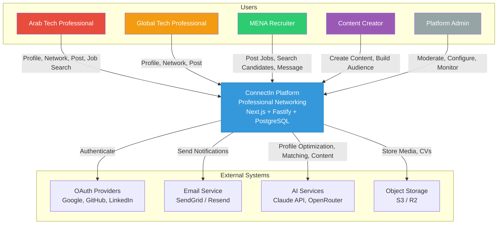

---

## 2. Personas

### Persona 1: Ahmed -- Arab Tech Professional (Primary)

| Attribute | Detail |
|-----------|--------|
| **Name** | Ahmed Al-Rashidi |
| **Age** | 28 |
| **Location** | Riyadh, Saudi Arabia |
| **Role** | Senior Software Engineer at a fintech startup |
| **Language** | Native Arabic (Gulf dialect), professional English |
| **Pain Points** | LinkedIn's Arabic experience feels second-class; profile sections render awkwardly in RTL; Arabic posts get buried by English-centric algorithms; cannot showcase bilingual expertise effectively |
| **Goals** | Build a visible presence in the Saudi tech ecosystem; connect with Gulf-based founders and CTOs; share technical content in Arabic to reach a wider regional audience |
| **Tech Savviness** | High -- early adopter, uses GitHub, follows open-source projects |
| **Motivations** | Career advancement, thought leadership in Arabic tech community, contributing to open-source |

### Persona 2: Sophia -- Global Tech Professional (Secondary)

| Attribute | Detail |
|-----------|--------|
| **Name** | Sophia Chen |
| **Age** | 32 |
| **Location** | Berlin, Germany |
| **Role** | Product Manager at an AI startup |
| **Language** | Native Mandarin, professional English |
| **Pain Points** | LinkedIn feed is noisy with low-quality "broetry"; privacy concerns with Microsoft's data practices; AI features are locked behind expensive Premium tier; recruiter spam is overwhelming |
| **Goals** | Find meaningful professional connections based on shared goals, not just mutual acquaintances; use AI tools to manage her professional brand efficiently; maintain privacy while networking |
| **Tech Savviness** | High -- values open-source tools and data transparency |
| **Motivations** | Quality networking over quantity, privacy, AI-powered efficiency |

### Persona 3: Khalid -- MENA Recruiter (Tertiary)

| Attribute | Detail |
|-----------|--------|
| **Name** | Khalid Mansour |
| **Age** | 40 |
| **Location** | Dubai, UAE |
| **Role** | Head of Talent Acquisition at a GCC tech company |
| **Language** | Native Arabic (Levantine), fluent English |
| **Pain Points** | LinkedIn Recruiter costs $170+/month with declining signal-to-noise ratio; keyword search misses qualified candidates who describe their skills differently; cannot search effectively in Arabic; limited access to passive Arabic-speaking candidates |
| **Goals** | Find bilingual tech talent across the GCC; reduce cost-per-hire; access candidates who are not active on LinkedIn; reach Arabic-speaking talent pools more effectively |
| **Tech Savviness** | Medium -- uses ATS systems, comfortable with SaaS tools |
| **Motivations** | Faster hiring, lower costs, access to underrepresented talent pools |

### Persona 4: Layla -- Content Creator / Thought Leader

| Attribute | Detail |
|-----------|--------|
| **Name** | Layla Farouk |
| **Age** | 35 |
| **Location** | Cairo, Egypt |
| **Role** | Independent tech consultant and Arabic tech blogger |
| **Language** | Native Arabic (Egyptian dialect), fluent English, conversational French |
| **Pain Points** | LinkedIn's content algorithm favors English posts and personal stories over technical Arabic content; no AI tools to help create bilingual content efficiently; audience analytics are limited; building a personal brand requires cross-posting to multiple platforms |
| **Goals** | Grow her Arabic-language tech thought leadership; reach professionals across MENA, not just Egypt; monetize expertise through consulting leads generated by content; create bilingual content without doubling her effort |
| **Tech Savviness** | High -- writes technical blogs, manages own website, active on social media |
| **Motivations** | Audience growth, thought leadership, consulting pipeline, bilingual reach |

### Persona Relationship Map

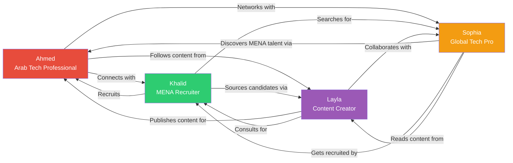

---

## 3. Epics (EP-XX)

| Epic ID | Name | Description | Phase |
|---------|------|-------------|-------|
| **EP-01** | User Authentication & Profile | Registration, login, OAuth, email verification, profile creation/editing, avatar upload, bilingual profiles | MVP |
| **EP-02** | Professional Networking | Connection requests (send, accept, reject, withdraw), connection list, mutual connections, network graph | MVP |
| **EP-03** | Content & Engagement | News feed, text/image posts, likes, comments, shares, hashtags, content moderation | MVP |
| **EP-04** | Job Marketplace | Job postings (CRUD), job search/filters, job applications, recruiter candidate view, application tracking | MVP |
| **EP-05** | AI-Powered Features | Profile optimizer, smart connection matching, content assistant, job matching engine | MVP (optimizer) / Phase 2 (rest) |
| **EP-06** | Arabic-First Experience | RTL design system, bilingual UI toggle, Arabic NLP, dialect awareness, cultural calendar | MVP (core) / Phase 2 (advanced) |
| **EP-07** | Search & Discovery | Full-text search (name, title, company, skills), filters, search suggestions, trending topics | MVP |
| **EP-08** | Messaging & Communication | 1:1 direct messages, read receipts, typing indicators, message notifications, conversation list | MVP |
| **EP-09** | Admin & Moderation | Admin dashboard, user management, content moderation queue, report handling, analytics overview | MVP (basic) / Phase 2 (full) |
| **EP-10** | Analytics & Insights | Profile views, post analytics, connection growth, engagement metrics, recruiter pipeline metrics | Phase 2 |
| **EP-11** | Social Engagement & Safety | Reactions (6 types), follow system, block/report system, skill endorsements | MVP (Sprint 2) -- **Implemented** |

### Epic Dependency Map

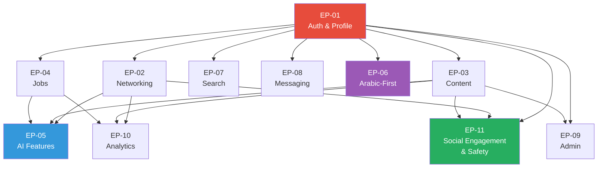

---

## 4. User Stories (US-XX)

### EP-01: User Authentication & Profile

#### US-01: Email Registration (EP-01) -- P0-MVP

**As** Ahmed (Arab Tech Professional), **I want** to register with my email address and password **so that** I can create a professional account on ConnectIn.

**Acceptance Criteria:**
- **Given** I am on the registration page, **When** I enter a valid email, password (min 8 chars, 1 uppercase, 1 number, 1 special char), and display name, **Then** an account is created and a verification email is sent within 30 seconds.
- **Given** I enter an email already in use, **When** I submit the registration form, **Then** I see the error "An account with this email already exists" and no duplicate account is created.
- **Given** I enter a password that does not meet complexity requirements, **When** I submit, **Then** I see specific validation messages indicating which requirements are missing.

#### US-02: OAuth Registration (EP-01) -- P0-MVP

**As** Sophia (Global Tech Professional), **I want** to register using my Google or GitHub account **so that** I can sign up quickly without creating another password.

**Acceptance Criteria:**
- **Given** I am on the registration page, **When** I click "Continue with Google" or "Continue with GitHub", **Then** I am redirected to the OAuth provider's consent screen.
- **Given** I authorize the OAuth provider, **When** I am redirected back to ConnectIn, **Then** my account is created with name and email pre-populated from the provider.
- **Given** an account already exists with my OAuth email, **When** I attempt OAuth registration, **Then** my OAuth identity is linked to my existing account (not duplicated).

#### US-03: Email Verification (EP-01) -- P0-MVP

**As** Ahmed, **I want** to verify my email address **so that** my account is activated and I can access all platform features.

**Acceptance Criteria:**
- **Given** I have registered, **When** I click the verification link in the email, **Then** my account status changes to "verified" and I am redirected to profile setup.
- **Given** the verification link has expired (after 24 hours), **When** I click it, **Then** I see a message with an option to resend a new verification email.
- **Given** I have not verified within 7 days, **When** I try to log in, **Then** I see a prompt to verify or resend the verification email; I cannot access the feed or messaging until verified.

#### US-04: Profile Creation (EP-01) -- P0-MVP

**As** Ahmed, **I want** to create my professional profile with headline, summary, experience, education, and skills **so that** other professionals can learn about my background.

**Acceptance Criteria:**
- **Given** I have verified my email, **When** I land on the profile setup wizard, **Then** I see a step-by-step flow: photo, headline, summary, experience, education, skills.
- **Given** I am filling out my profile, **When** I enter text in any field, **Then** I can type in Arabic or English and the UI respects the text direction (RTL/LTR) automatically.
- **Given** I complete the required fields (headline, at least one experience entry), **When** I click "Save", **Then** my profile is published and visible to other users.
- **Given** I skip optional fields, **When** I view my profile, **Then** I see a completeness score (0-100%) with specific suggestions for what to add next.

#### US-05: Profile Editing (EP-01) -- P0-MVP

**As** Ahmed, **I want** to edit any section of my profile at any time **so that** I can keep my professional information current.

**Acceptance Criteria:**
- **Given** I am viewing my own profile, **When** I click the edit icon on any section (headline, summary, experience, education, skills), **Then** that section becomes editable inline.
- **Given** I am editing my experience, **When** I add a new position with company, title, start date, and description, **Then** it appears in my experience section in reverse chronological order.
- **Given** I change my profile, **When** I save, **Then** the update is reflected within 2 seconds and a "Profile updated" confirmation appears.

#### US-06: Avatar Upload (EP-01) -- P0-MVP

**As** Ahmed, **I want** to upload a professional photo **so that** my profile appears credible and recognizable.

**Acceptance Criteria:**
- **Given** I am on the profile edit page, **When** I click the photo area, **Then** I can select a JPEG, PNG, or WebP file up to 5MB.
- **Given** I select a valid image, **When** I confirm, **Then** the image is cropped to a square aspect ratio (with a crop tool) and uploaded.
- **Given** the file exceeds 5MB or is an unsupported format, **When** I try to upload, **Then** I see an error message specifying the constraint.

#### US-07: Bilingual Profile (EP-01) -- P0-MVP

**As** Ahmed, **I want** to enter my headline and summary in both Arabic and English **so that** I can reach recruiters and professionals regardless of their language preference.

**Acceptance Criteria:**
- **Given** I am editing my headline or summary, **When** I see the language tabs (Arabic / English), **Then** I can enter separate content for each language.
- **Given** a visitor views my profile, **When** their UI language is Arabic, **Then** they see my Arabic headline and summary by default, with a toggle to switch to English.
- **Given** I have only filled in one language, **When** a visitor views my profile in the missing language, **Then** they see the available language content with a label "[Originally written in Arabic/English]".

### EP-02: Professional Networking

#### US-08: Send Connection Request (EP-02) -- P0-MVP

**As** Ahmed, **I want** to send a connection request to another professional **so that** I can expand my professional network.

**Acceptance Criteria:**
- **Given** I am viewing another user's profile, **When** I click "Connect", **Then** I see an optional field to add a personal message (max 300 characters) and a "Send Request" button.
- **Given** I send a request, **When** the recipient views their notifications, **Then** they see my request with my name, headline, and optional message within 60 seconds.
- **Given** I have already sent a request to this user, **When** I view their profile, **Then** I see "Request Pending" instead of "Connect".

#### US-09: Accept/Reject Connection Request (EP-02) -- P0-MVP

**As** Sophia, **I want** to accept or reject incoming connection requests **so that** I can control who is in my professional network.

**Acceptance Criteria:**
- **Given** I have a pending connection request, **When** I navigate to my notifications or connection requests page, **Then** I see the requester's name, headline, photo, mutual connections count, and optional message.
- **Given** I click "Accept", **When** the connection is created, **Then** both parties see each other as "Connected" and appear in each other's connection lists.
- **Given** I click "Reject", **When** the request is dismissed, **Then** the requester is not notified of the rejection and can send a new request after 30 days.

#### US-10: Withdraw Connection Request (EP-02) -- P0-MVP

**As** Ahmed, **I want** to withdraw a pending connection request **so that** I can change my mind before the recipient responds.

**Acceptance Criteria:**
- **Given** I have a pending outgoing request, **When** I view the recipient's profile, **Then** I see a "Withdraw Request" button.
- **Given** I click "Withdraw Request", **When** confirmed, **Then** the request is removed and the recipient no longer sees it in their pending requests.

#### US-11: View Connection List (EP-02) -- P0-MVP

**As** Ahmed, **I want** to view my list of connections **so that** I can browse and manage my professional network.

**Acceptance Criteria:**
- **Given** I navigate to "My Network", **When** the page loads, **Then** I see a paginated list of my connections (20 per page) with photo, name, and headline.
- **Given** I have 50+ connections, **When** I search within my connections, **Then** I can filter by name, company, or title with results appearing within 500ms.
- **Given** I click "Remove Connection" on a contact, **When** I confirm, **Then** the connection is severed bilaterally and neither party appears in the other's connection list.

#### US-12: Mutual Connections (EP-02) -- P0-MVP

**As** Ahmed, **I want** to see how many mutual connections I share with another user **so that** I can gauge how closely we are networked.

**Acceptance Criteria:**
- **Given** I view another user's profile, **When** the profile loads, **Then** I see "X mutual connections" with a clickable link.
- **Given** I click the mutual connections link, **When** the overlay opens, **Then** I see a list of shared connections with their names and photos.

### EP-03: Content & Engagement

#### US-13: Create Text Post (EP-03) -- P0-MVP

**As** Layla (Content Creator), **I want** to create a text post on my feed **so that** I can share professional insights with my network.

**Acceptance Criteria:**
- **Given** I am on the home feed, **When** I click the "Start a post" composer, **Then** a rich text editor opens supporting Arabic and English with automatic direction detection.
- **Given** I type a post (max 3000 characters), **When** I click "Post", **Then** the post appears at the top of my connections' feeds within 10 seconds.
- **Given** I include hashtags (#AI, #MENA_tech), **When** the post is published, **Then** hashtags are clickable and link to a topic feed.

#### US-14: Create Image Post (EP-03) -- P0-MVP

**As** Layla, **I want** to attach images to my posts **so that** I can share visual content like infographics, screenshots, and event photos.

**Acceptance Criteria:**
- **Given** I am composing a post, **When** I click the image icon, **Then** I can select up to 4 images (JPEG, PNG, WebP, max 10MB each).
- **Given** I attach images, **When** I publish the post, **Then** images are displayed in a responsive grid below the text.
- **Given** an image exceeds 10MB, **When** I try to attach it, **Then** I see an error "Image must be under 10MB".

#### US-15: Like a Post (EP-03) -- P0-MVP

> **Note**: The binary "like" has been superseded by the rich Reactions system (US-43, Sprint 2). The original Like model is retained for backward compatibility, but new engagement uses the Reaction model with 6 types. See US-43 for the full specification.

**As** Ahmed, **I want** to like a post **so that** I can show appreciation and signal engagement.

**Acceptance Criteria:**
- **Given** I see a post in my feed, **When** I click the "Like" button, **Then** the like count increments by 1 and the button state changes to "Liked".
- **Given** I have already liked a post, **When** I click "Like" again, **Then** the like is removed and the count decrements by 1.

#### US-16: Comment on a Post (EP-03) -- P0-MVP

**As** Ahmed, **I want** to comment on a post **so that** I can share my perspective and engage in discussion.

**Acceptance Criteria:**
- **Given** I click "Comment" on a post, **When** the comment input expands, **Then** I can type a comment (max 1000 characters) in Arabic or English.
- **Given** I submit a comment, **When** it is saved, **Then** it appears below the post with my name, photo, timestamp, and the comment text.
- **Given** a post has more than 3 comments, **When** I view the post, **Then** I see the 3 most recent comments with a "View all X comments" link.

#### US-17: Share a Post (EP-03) -- P0-MVP

**As** Layla, **I want** to share another user's post to my feed **so that** I can amplify valuable content to my network.

**Acceptance Criteria:**
- **Given** I click "Share" on a post, **When** the share dialog opens, **Then** I can add optional commentary (max 1000 characters) and click "Share Now".
- **Given** I share a post, **When** it appears in my connections' feeds, **Then** it shows as "Layla shared Ahmed's post" with the original post embedded.

#### US-18: News Feed (EP-03) -- P0-MVP

**As** Ahmed, **I want** to see a personalized news feed **so that** I can discover relevant professional content from my network and beyond.

**Acceptance Criteria:**
- **Given** I log in and land on the home page, **When** the feed loads, **Then** I see posts from my connections and followed topics, sorted by a combination of recency and engagement.
- **Given** I scroll to the bottom of the visible posts, **When** I continue scrolling, **Then** the next batch of posts loads automatically (infinite scroll, 10 posts per batch).
- **Given** the feed has no new content, **When** I pull to refresh (mobile) or click refresh, **Then** the feed checks for new posts and updates.

### EP-04: Job Marketplace

#### US-19: Create Job Posting (EP-04) -- P0-MVP

**As** Khalid (MENA Recruiter), **I want** to create a job posting **so that** I can attract qualified candidates on the platform.

**Acceptance Criteria:**
- **Given** I am a recruiter user, **When** I navigate to "Post a Job", **Then** I see a form with fields: title, company, location (city + remote option), description, requirements, salary range (optional), and language (Arabic/English/Bilingual).
- **Given** I fill in all required fields, **When** I click "Publish", **Then** the job posting is live and appears in job search results within 60 seconds.
- **Given** I leave a required field empty, **When** I try to publish, **Then** I see inline validation errors on the missing fields.

#### US-20: Search and Filter Jobs (EP-04) -- P0-MVP

**As** Ahmed, **I want** to search for jobs by keyword, location, and type **so that** I can find relevant career opportunities.

**Acceptance Criteria:**
- **Given** I navigate to the Jobs section, **When** the page loads, **Then** I see a search bar and filter controls (location, remote/hybrid/onsite, experience level, posted date).
- **Given** I search for "software engineer Riyadh", **When** results load, **Then** I see matching job postings sorted by relevance, each showing title, company, location, and posted date.
- **Given** I apply filters, **When** the results update, **Then** only jobs matching all active filters are displayed, with the filter state preserved in the URL.

#### US-21: Apply to a Job (EP-04) -- P0-MVP

**As** Ahmed, **I want** to apply to a job posting with my profile **so that** the recruiter can review my candidacy.

**Acceptance Criteria:**
- **Given** I view a job posting, **When** I click "Apply", **Then** I see a confirmation showing which profile information will be shared (headline, summary, experience, skills) and an optional cover note field (max 500 characters).
- **Given** I click "Submit Application", **When** the application is recorded, **Then** the job card shows "Applied" and the recruiter sees my application in their candidate list.
- **Given** I have already applied, **When** I view the job, **Then** I see "Applied on [date]" and the apply button is disabled.

### EP-05: AI-Powered Features

#### US-22: AI Profile Optimizer (EP-05) -- P0-MVP

**As** Ahmed, **I want** the AI to analyze my profile and suggest improvements **so that** my profile is more discoverable and professional.

**Acceptance Criteria:**
- **Given** I have completed at least the headline and one experience entry, **When** I click "Optimize Profile" on my profile page, **Then** the AI analyzes my profile and returns a completeness score (0-100) with specific, actionable recommendations within 15 seconds.
- **Given** the AI generates a suggested headline or summary, **When** I review the suggestions, **Then** I see both Arabic and English versions that I can accept, edit, or reject individually.
- **Given** I accept a suggestion, **When** my profile updates, **Then** the completeness score recalculates and the accepted text replaces the previous content.

#### US-23: AI Connection Suggestions (EP-05) -- P1-Phase 2

**As** Ahmed, **I want** to receive AI-powered "people you should know" suggestions **so that** I can discover relevant professionals beyond my immediate network.

**Acceptance Criteria:**
- **Given** I navigate to "My Network", **When** the suggestions section loads, **Then** I see up to 10 AI-suggested connections with an explanation for each match (e.g., "Similar career goals", "Complementary skills").
- **Given** I click "Connect" on a suggestion, **When** the request is sent, **Then** the suggestion is replaced with the next most relevant match.
- **Given** I click "Dismiss", **When** the suggestion is removed, **Then** the AI learns from this signal and does not suggest that person again.

#### US-24: AI Content Assistant (EP-05) -- P1-Phase 2

**As** Layla, **I want** the AI to help me draft professional posts in both Arabic and English **so that** I can create bilingual content efficiently.

**Acceptance Criteria:**
- **Given** I am in the post composer, **When** I click "AI Assist", **Then** I see options: "Generate from topic", "Improve draft", "Translate to Arabic/English".
- **Given** I select "Generate from topic" and enter a topic, **When** the AI generates content, **Then** I see a draft post in my chosen language with the option to generate it in the other language simultaneously.
- **Given** I select "Improve draft" with my text, **When** the AI processes it, **Then** I see a revised version with tracked changes (additions highlighted, removals struck through).

#### US-25: AI Job Matching (EP-05) -- P1-Phase 2

**As** Ahmed, **I want** the platform to recommend jobs that match my skills and career goals semantically **so that** I discover opportunities I would have missed with keyword search alone.

**Acceptance Criteria:**
- **Given** I have set career goals in my profile settings, **When** I visit the Jobs section, **Then** I see a "Recommended for You" section with up to 5 AI-matched jobs, each with a match score (%) and an explanation.
- **Given** a recommended job has a skill gap, **When** I view the match details, **Then** I see specific skills I am missing and general guidance on how to develop them.

### EP-06: Arabic-First Experience

#### US-26: Language Toggle (EP-06) -- P0-MVP

**As** Ahmed, **I want** to switch the UI between Arabic and English **so that** I can use the platform in my preferred language.

**Acceptance Criteria:**
- **Given** I am anywhere in the application, **When** I click the language toggle in the header, **Then** the entire UI switches language and direction (RTL/LTR) within 500ms without a page reload.
- **Given** I set my language preference to Arabic, **When** I close and reopen the app, **Then** my preference is remembered and the app loads in Arabic.
- **Given** the UI is in Arabic, **When** I view all pages and components, **Then** all system text (buttons, labels, menus, error messages) is displayed in Arabic with no untranslated strings.

#### US-27: RTL Content Rendering (EP-06) -- P0-MVP

**As** Ahmed, **I want** posts and messages containing Arabic text to render correctly in RTL **so that** content is readable and professional.

**Acceptance Criteria:**
- **Given** a post is written in Arabic, **When** it appears in the feed, **Then** text is right-aligned, punctuation is placed correctly, and mixed Arabic/English text flows naturally using the Unicode bidirectional algorithm.
- **Given** a message contains a mix of Arabic and English, **When** displayed in the chat window, **Then** Arabic segments flow RTL and English segments flow LTR within the same message bubble.

### EP-07: Search & Discovery

#### US-28: People Search (EP-07) -- P0-MVP

**As** Khalid (Recruiter), **I want** to search for professionals by name, title, company, or skills **so that** I can find candidates for open positions.

**Acceptance Criteria:**
- **Given** I enter a search query in the global search bar, **When** I submit, **Then** I see a results page with tabs: People, Posts, Jobs, Companies.
- **Given** I am on the People tab, **When** results display, **Then** each result shows photo, name, headline, location, and mutual connection count, with results matching the query highlighted.
- **Given** I search in Arabic (e.g., "مهندس برمجيات"), **When** results load, **Then** profiles with Arabic content matching the query are returned accurately.
- **Given** I use filters (location, industry, experience level), **When** results update, **Then** only matching profiles appear, with the active filter count displayed.

#### US-29: Trending Topics (EP-07) -- P0-MVP

**As** Layla, **I want** to see trending topics and hashtags **so that** I can create content that is timely and engaging.

**Acceptance Criteria:**
- **Given** I am on the home feed or discovery page, **When** I view the sidebar, **Then** I see the top 5 trending topics/hashtags in my region with post counts.
- **Given** I click a trending topic, **When** the topic feed opens, **Then** I see the most recent and most engaged posts using that hashtag.

### EP-08: Messaging & Communication

#### US-30: Direct Message (EP-08) -- P0-MVP

**As** Ahmed, **I want** to send a direct message to a connection **so that** I can have private professional conversations.

**Acceptance Criteria:**
- **Given** I am connected with another user, **When** I click "Message" on their profile or from my connections list, **Then** a conversation thread opens.
- **Given** I type a message (max 5000 characters), **When** I click Send, **Then** the message appears in the thread and the recipient receives a notification within 10 seconds.
- **Given** I am not connected with a user, **When** I view their profile, **Then** the "Message" button is disabled with the tooltip "Connect first to send a message".

#### US-31: Conversation List (EP-08) -- P0-MVP

**As** Ahmed, **I want** to view all my message conversations in one place **so that** I can manage my professional communications efficiently.

**Acceptance Criteria:**
- **Given** I navigate to "Messages", **When** the inbox loads, **Then** I see a list of conversations sorted by most recent message, each showing the contact's name, photo, last message preview (truncated to 100 chars), timestamp, and unread indicator.
- **Given** I have unread messages, **When** I view the messages icon in the navbar, **Then** I see a badge with the unread conversation count.

#### US-32: Read Receipts (EP-08) -- P0-MVP

**As** Ahmed, **I want** to know when my message has been read **so that** I understand whether the recipient has seen my communication.

**Acceptance Criteria:**
- **Given** I send a message, **When** the recipient opens the conversation, **Then** I see a "Read" indicator (with timestamp) below my message.
- **Given** I prefer not to send read receipts, **When** I toggle off "Send Read Receipts" in settings, **Then** my read status is not shared with senders.

### EP-09: Admin & Moderation

#### US-33: Content Report (EP-09) -- P0-MVP

**As** Ahmed, **I want** to report inappropriate content **so that** the platform remains professional and safe.

**Acceptance Criteria:**
- **Given** I see a post or comment that violates community guidelines, **When** I click the "..." menu and select "Report", **Then** I see report categories (spam, harassment, misinformation, other) and an optional details field.
- **Given** I submit a report, **When** it is recorded, **Then** I see "Report submitted. We will review this within 24 hours." and the content is flagged for moderator review.

#### US-34: Admin Dashboard (EP-09) -- P0-MVP

**As** a Platform Admin, **I want** an admin dashboard **so that** I can monitor platform health and manage content moderation.

**Acceptance Criteria:**
- **Given** I am logged in as an admin, **When** I navigate to /admin, **Then** I see an overview with key metrics: total users, active users (24h), new registrations (7d), pending reports, flagged content count.
- **Given** there are pending content reports, **When** I view the moderation queue, **Then** I see each report with the reported content, reporter info, report reason, and action buttons (dismiss, warn user, remove content, ban user).

### EP-10: Analytics & Insights

#### US-35: Profile View Analytics (EP-10) -- P1-Phase 2

**As** Ahmed, **I want** to see who viewed my profile and how often **so that** I can gauge my visibility and tailor my networking.

**Acceptance Criteria:**
- **Given** I navigate to "Profile Analytics", **When** the page loads, **Then** I see: total profile views (7d, 30d), a graph of views over time, and the industries/titles of viewers (anonymized unless they allow visibility).
- **Given** a viewer has "Show Profile Visits" enabled, **When** I view my analytics, **Then** I see their name and headline; otherwise, I see "Someone at [Company] in [Industry]".

#### US-36: Post Analytics (EP-10) -- P1-Phase 2

**As** Layla, **I want** to see detailed analytics for my posts **so that** I can understand what content resonates with my audience.

**Acceptance Criteria:**
- **Given** I click "View Analytics" on one of my posts, **When** the analytics panel opens, **Then** I see: impressions, unique viewers, likes, comments, shares, engagement rate (%), and a demographic breakdown (top industries, top locations).

### Additional Stories

#### US-37: Delete Account (EP-01) -- P0-MVP

**As** Ahmed, **I want** to delete my account and all associated data **so that** I can exercise my right to data erasure.

**Acceptance Criteria:**
- **Given** I navigate to Settings > Account > Delete Account, **When** I click "Delete My Account", **Then** I see a confirmation dialog explaining that all data will be permanently deleted within 30 days, with a password confirmation field.
- **Given** I confirm deletion, **When** the 30-day grace period expires, **Then** all my profile data, posts, messages, connections, and uploaded files are permanently removed.
- **Given** I log in within the 30-day grace period, **When** I authenticate, **Then** I see an option to cancel the deletion and reactivate my account.

#### US-38: Password Reset (EP-01) -- P0-MVP

**As** Ahmed, **I want** to reset my password if I forget it **so that** I can regain access to my account.

**Acceptance Criteria:**
- **Given** I am on the login page, **When** I click "Forgot Password", **Then** I see a form to enter my email address.
- **Given** I enter a registered email, **When** I submit, **Then** I receive a password reset email with a link that expires in 1 hour.
- **Given** I click the reset link and enter a new password, **When** I submit, **Then** my password is updated and I am logged in automatically.

#### US-39: Notification Preferences (EP-01) -- P0-MVP

**As** Sophia, **I want** to control which notifications I receive **so that** I am not overwhelmed by alerts.

**Acceptance Criteria:**
- **Given** I navigate to Settings > Notifications, **When** the page loads, **Then** I see toggles for: connection requests, messages, post likes, post comments, job recommendations, and email digests (daily/weekly/off).
- **Given** I toggle off "Post Likes", **When** someone likes my post, **Then** I do not receive an in-app or email notification for likes.

#### US-40: Hashtag Following (EP-03) -- P0-MVP

**As** Layla, **I want** to follow hashtags **so that** I see relevant topic content in my feed even from people I am not connected with.

**Acceptance Criteria:**
- **Given** I click on a hashtag in a post, **When** the topic feed opens, **Then** I see a "Follow" button at the top.
- **Given** I follow a hashtag, **When** new posts use that hashtag, **Then** those posts appear in my main feed alongside connection posts.

#### US-41: Company Pages (EP-03) -- P1-Phase 2

**As** Khalid, **I want** to create a company page **so that** my organization has a presence on the platform for employer branding and job posting.

**Acceptance Criteria:**
- **Given** I am a recruiter user, **When** I navigate to "Create Company Page", **Then** I see a form with: company name, logo, description (Arabic/English), industry, size, headquarters, website.
- **Given** I create a company page, **When** other users view it, **Then** they see the company profile, current job openings, and a "Follow" button.

#### US-42: Connection Request with AI Icebreaker (EP-05) -- P1-Phase 2

**As** Ahmed, **I want** the AI to suggest a personalized icebreaker message when I send a connection request **so that** my request stands out and is more likely to be accepted.

**Acceptance Criteria:**
- **Given** I click "Connect" on a user's profile, **When** the connection request dialog opens, **Then** I see an "AI Suggest" button next to the message field.
- **Given** I click "AI Suggest", **When** the AI generates an icebreaker, **Then** I see a message referencing shared interests, mutual connections, or complementary skills, which I can edit before sending.

### EP-11: Social Engagement & Safety (Sprint 2 -- Implemented)

#### US-43: React to a Post (EP-11) -- P0-MVP -- IMPLEMENTED

**As** Ahmed (Arab Tech Professional), **I want** to react to posts with expressive reaction types (Like, Celebrate, Support, Love, Insightful, Funny) **so that** I can provide nuanced feedback beyond a simple "like".

**Acceptance Criteria:**
- **Given** I see a post in my feed, **When** I click the react button and select a reaction type (e.g., "Celebrate"), **Then** my reaction is recorded and the post's reaction breakdown updates to reflect my choice.
- **Given** I have already reacted to a post with "Like", **When** I select a different reaction type (e.g., "Insightful"), **Then** my previous reaction is replaced with the new one (upsert behavior) -- only one reaction per user per post is allowed.
- **Given** I have reacted to a post, **When** I click to remove my reaction, **Then** my reaction is deleted and the post's reaction counts update accordingly.
- **Given** a post has multiple reactions from different users, **When** I view the post's reaction breakdown, **Then** I see a count per reaction type (e.g., 5 Like, 3 Celebrate, 1 Insightful).

#### US-44: Block a User (EP-11) -- P0-MVP -- IMPLEMENTED

**As** Sophia (Global Tech Professional), **I want** to block another user **so that** they can no longer view my profile or interact with me, and I am protected from unwanted contact.

**Acceptance Criteria:**
- **Given** I am viewing another user's profile, **When** I choose to block them, **Then** the block is recorded and any existing connection between us is severed immediately.
- **Given** I have blocked a user, **When** that user tries to view my profile, **Then** they are prevented from seeing my profile information (bidirectional invisibility).
- **Given** I have blocked a user, **When** I try to view their profile, **Then** I am also prevented from seeing their profile information (bidirectional).
- **Given** I have blocked a user, **When** I choose to unblock them, **Then** the block is removed and normal visibility is restored. Unblocking is idempotent -- unblocking someone who is not blocked does not cause an error.
- **Given** I want to review my blocked users, **When** I navigate to my blocked users list, **Then** I see all users I have currently blocked with their display names.

#### US-45: Report Content (EP-11) -- P0-MVP -- IMPLEMENTED

**As** Ahmed, **I want** to report inappropriate content (posts, comments, or user profiles) with a specific reason **so that** platform moderators can review and take action to keep the community safe.

**Acceptance Criteria:**
- **Given** I encounter inappropriate content, **When** I submit a report specifying the target type (USER, POST, or COMMENT), the target ID, and a reason (SPAM, HARASSMENT, HATE_SPEECH, MISINFORMATION, IMPERSONATION, or OTHER), **Then** the report is created with a PENDING status and an optional description (up to 1000 characters).
- **Given** a report has been submitted, **When** a moderator reviews it, **Then** the report status progresses through a workflow: PENDING -> REVIEWED -> RESOLVED or DISMISSED.
- **Given** I submit a report, **When** the system processes it, **Then** my identity (reporter ID) is recorded for accountability, but the reported user is not informed of who reported them.

#### US-46: Follow a User (EP-11) -- P0-MVP -- IMPLEMENTED

**As** Layla (Content Creator), **I want** to follow other users without sending a connection request **so that** I can see their public content in my feed without requiring a bidirectional relationship.

**Acceptance Criteria:**
- **Given** I am viewing another user's profile, **When** I click "Follow", **Then** a one-way follow relationship is created (I follow them; they do not automatically follow me).
- **Given** I am following a user, **When** I click "Unfollow", **Then** the follow relationship is removed. Unfollowing someone I do not follow does not cause an error.
- **Given** I want to see who follows me, **When** I navigate to my followers list, **Then** I see a paginated list of users who follow me (with configurable limit and offset).
- **Given** I want to see who I follow, **When** I navigate to my following list, **Then** I see all users I currently follow.
- **Given** I want to check whether I follow a specific user, **When** I query the follow status, **Then** I receive a boolean indicator of whether the follow relationship exists.
- **Given** I want to see follow metrics for any user, **When** I query their follow counts, **Then** I see both their follower count and following count.

#### US-47: Endorse a Skill (EP-11) -- P0-MVP -- IMPLEMENTED

**As** Ahmed, **I want** to endorse skills listed on another professional's profile **so that** I can vouch for their expertise and increase the credibility of their listed skills.

**Acceptance Criteria:**
- **Given** I am viewing another user's profile and they have skills listed, **When** I click "Endorse" on a specific skill (identified by profileSkillId), **Then** my endorsement is recorded and the skill's endorsement count increments by 1.
- **Given** I have already endorsed a skill, **When** I try to endorse the same skill again, **Then** the operation is idempotent -- no duplicate endorsement is created and no error occurs.
- **Given** I have endorsed a skill, **When** I choose to remove my endorsement, **Then** my endorsement is deleted and the skill's endorsement count decrements by 1. Removing a non-existent endorsement is idempotent.
- **Given** I try to endorse a skill on my own profile, **When** the system processes the request, **Then** it is rejected with an error -- self-endorsement is not allowed.
- **Given** a skill has multiple endorsements, **When** I view the endorsers for that skill, **Then** I see a list of all users who endorsed it, with their display names and IDs.
- **Given** I want to review all endorsements I have given, **When** I query my endorsements, **Then** I see a list of all skills I have endorsed across all profiles, including the skill name and profile owner.

---

## 5. MVP Feature Set (Phase 1)

### 5.1 MVP Scope Summary

The MVP delivers a functional professional networking platform that proves the Arabic-first + AI-native thesis. It must be usable as a daily professional tool, not a demo.

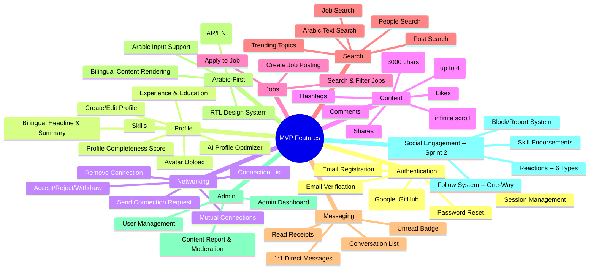

### 5.2 MVP Feature Prioritization

| Feature | Priority | Rationale |
|---------|----------|-----------|
| Email + OAuth Registration | P0 | Gate to all other features |
| Profile CRUD + Bilingual | P0 | Core identity; differentiator |
| Connection Request Flow | P0 | Core networking loop |
| Text/Image Posts + Feed | P0 | Content drives daily engagement |
| People + Job Search | P0 | Discovery is essential for network growth |
| 1:1 Messaging | P0 | Private communication enables professional relationships |
| Language Toggle + RTL | P0 | Fundamental differentiator |
| AI Profile Optimizer | P0 | First AI touchpoint; differentiates from day one |
| Job Posting + Apply | P0 | Recruiter value proposition |
| Admin Dashboard + Moderation | P0 | Platform health from launch |
| Notification Preferences | P0 | User control prevents churn |
| Rich Reactions (6 types) | P0 -- **Implemented** | Nuanced engagement replaces binary like; drives content quality signals |
| Follow System (non-connection) | P0 -- **Implemented** | One-way following enables content creator audience building without mutual connection |
| Block & Report System | P0 -- **Implemented** | User safety and trust; required for platform health from launch |
| Skill Endorsements | P0 -- **Implemented** | Social proof of skills; professional credibility; differentiates from generic networking |

### 5.3 What MVP Does NOT Include

- AI Content Assistant (Phase 2)
- AI Connection Matching (Phase 2)
- AI Job Matching (Phase 2)
- Company Pages (Phase 2)
- Profile View Analytics (Phase 2)
- Post Analytics (Phase 2)
- Knowledge Graph (Phase 3)
- Video Rooms (Phase 3)
- Decentralized Identity (Phase 3+)
- Real-Time Collaboration (Phase 3+)
- Premium Subscriptions (Phase 3)

---

## 6. Phase 2 Features

Phase 2 focuses on AI differentiation and analytics that drive retention and network effects.

| Feature | Epic | Stories | Description |
|---------|------|---------|-------------|
| Smart Connection Matching | EP-05 | US-23 | AI-powered "People You Should Know" using embedding similarity |
| AI Content Assistant | EP-05 | US-24 | Bilingual content generation, improvement, and translation |
| AI Job Matching | EP-05 | US-25 | Semantic job-candidate matching with skill gap analysis |
| AI Connection Icebreaker | EP-05 | US-42 | AI-suggested personalized connection messages |
| Company Pages | EP-03 | US-41 | Organization profiles with branding and job listings |
| Profile View Analytics | EP-10 | US-35 | Who viewed your profile, trends over time |
| Post Analytics | EP-10 | US-36 | Impressions, engagement rate, audience demographics |
| Dialect-Aware NLP | EP-06 | -- | Distinguish Gulf, Egyptian, Levantine, Maghreb Arabic |
| Cultural Context Engine | EP-06 | -- | Ramadan-aware scheduling, regional business customs |
| Advanced Moderation | EP-09 | -- | AI-assisted Arabic content moderation, automated spam detection |

---

## 7. Future Features (Phase 3+)

| Feature | Epic | Description |
|---------|------|-------------|
| Knowledge Graph | EP-10 | Skill/career path visualization, trend detection |
| Virtual Networking Rooms | EP-08 | WebRTC-based video rooms with AI facilitation |
| Decentralized Identity (DID) | EP-01 | Verifiable credentials for degrees and certifications |
| Real-Time Collaboration | EP-08 | CRDT-based document co-editing |
| Premium Subscriptions | EP-04 | Tiered pricing: Professional, Business, Recruiter, Enterprise |
| ActivityPub Federation | EP-02 | Interoperability with Mastodon and fediverse |
| Self-Hosted Enterprise | EP-09 | On-premise deployment for organizations |
| Events Platform | EP-03 | Virtual and in-person professional events |
| Services Marketplace | EP-04 | Freelance and consulting marketplace |
| Salary Insights | EP-10 | Market salary data from platform activity |

---

## 8. User Flow Diagrams

### 8.1 Registration Flow

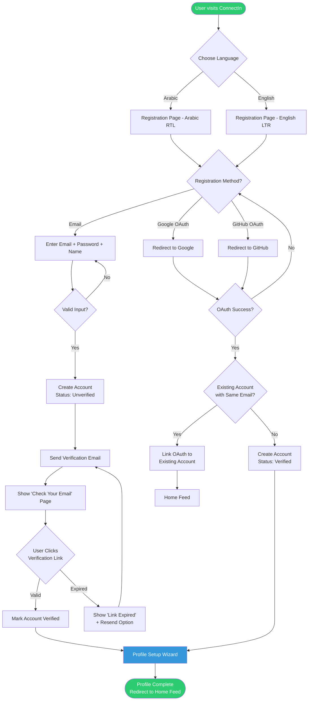

### 8.2 Profile Creation Flow

```mermaid
flowchart TD
    START([Profile Setup Wizard]) --> STEP1[Step 1: Upload Photo]
    STEP1 --> PHOTO{Photo Uploaded?}
    PHOTO -->|Yes| CROP[Crop to Square]
    PHOTO -->|Skip| STEP2
    CROP --> STEP2

    STEP2[Step 2: Headline<br/>Arabic + English Tabs]
    STEP2 --> STEP3[Step 3: Professional Summary<br/>Arabic + English Tabs]

    STEP3 --> AI_OPT{Use AI Optimizer?}
    AI_OPT -->|Yes| AI_ANALYZE[AI Analyzes Profile Data]
    AI_ANALYZE --> AI_SUGGEST[Show AI Suggestions<br/>Arabic + English]
    AI_SUGGEST --> ACCEPT{Accept Suggestions?}
    ACCEPT -->|Accept All| STEP4
    ACCEPT -->|Edit & Accept| EDIT_SUGGESTION[Edit AI Text]
    EDIT_SUGGESTION --> STEP4
    ACCEPT -->|Reject| STEP4
    AI_OPT -->|No| STEP4

    STEP4[Step 4: Experience<br/>Company, Title, Dates, Description]
    STEP4 --> MORE_EXP{Add Another?}
    MORE_EXP -->|Yes| STEP4
    MORE_EXP -->|No| STEP5

    STEP5[Step 5: Education<br/>Institution, Degree, Year]
    STEP5 --> STEP6[Step 6: Skills<br/>Select from Suggestions + Custom]

    STEP6 --> SCORE[Calculate Completeness Score]
    SCORE --> PUBLISH{Score >= 50%?}
    PUBLISH -->|Yes| SAVE[Save & Publish Profile]
    PUBLISH -->|Low Score| WARN[Show Suggestions to<br/>Improve Score]
    WARN --> SAVE

    SAVE --> DONE([Redirect to Home Feed])

    style START fill:#3498DB,color:#fff
    style DONE fill:#2ECC71,color:#fff
    style AI_ANALYZE fill:#9B59B6,color:#fff
    style AI_SUGGEST fill:#9B59B6,color:#fff
```

### 8.3 Connection Request Flow

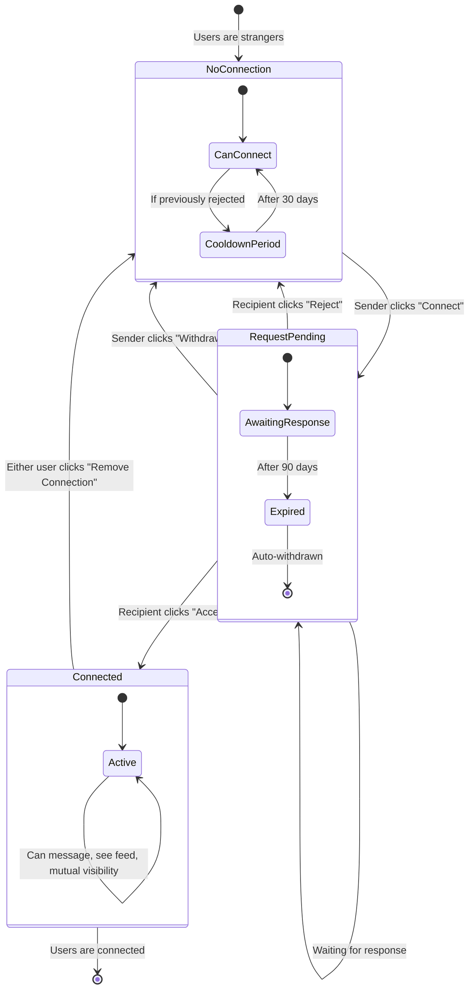

### 8.4 Content Posting Flow

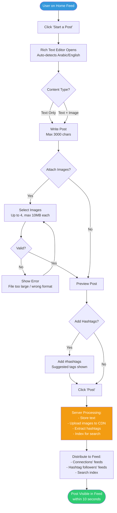

### 8.5 Job Application Flow

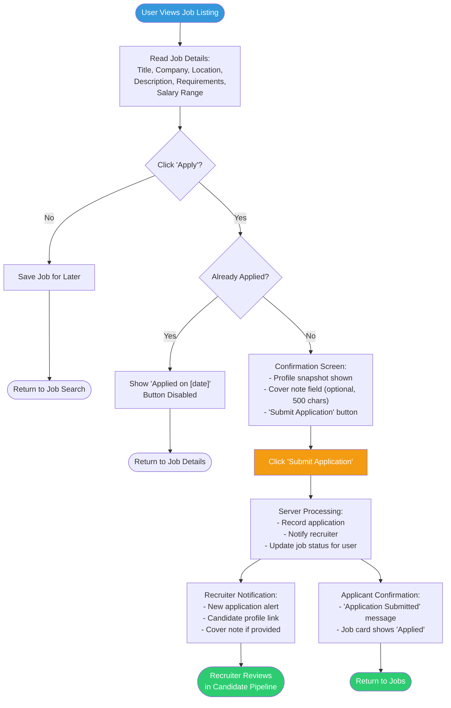

### 8.6 Messaging Flow

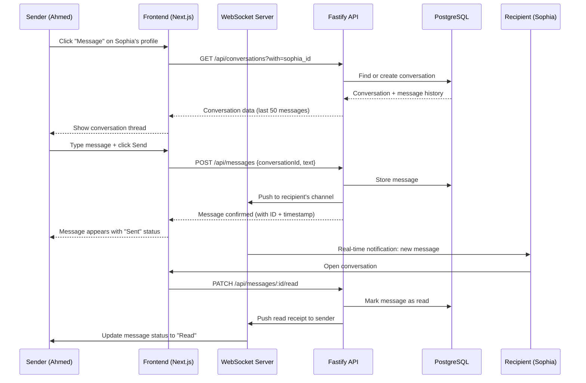

### 8.7 Block Effect Flow (Sprint 2)

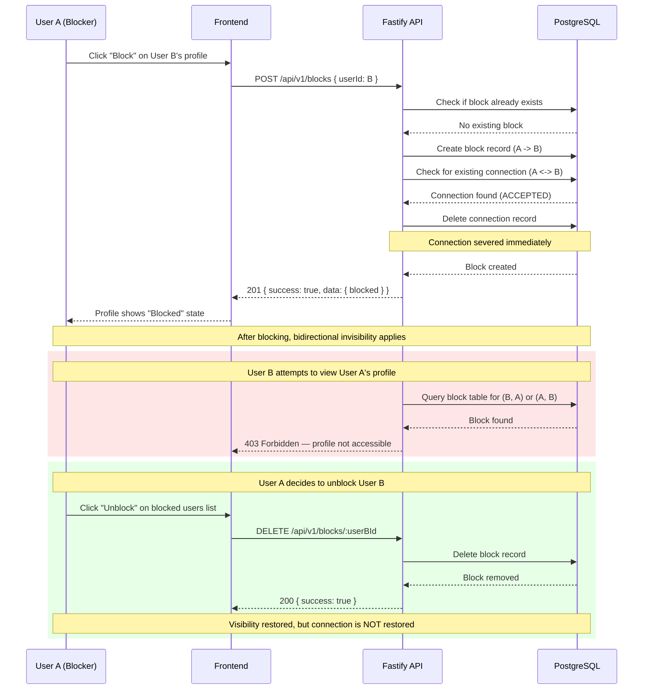

### 8.8 Reaction Flow (Sprint 2)

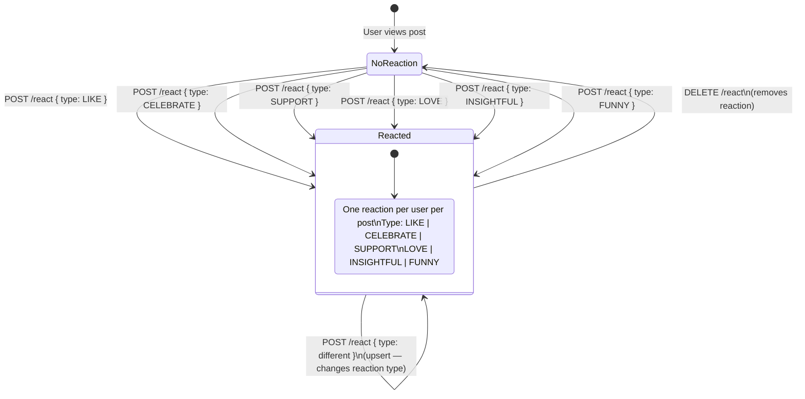

### 8.9 Follow vs. Connection Model (Sprint 2)

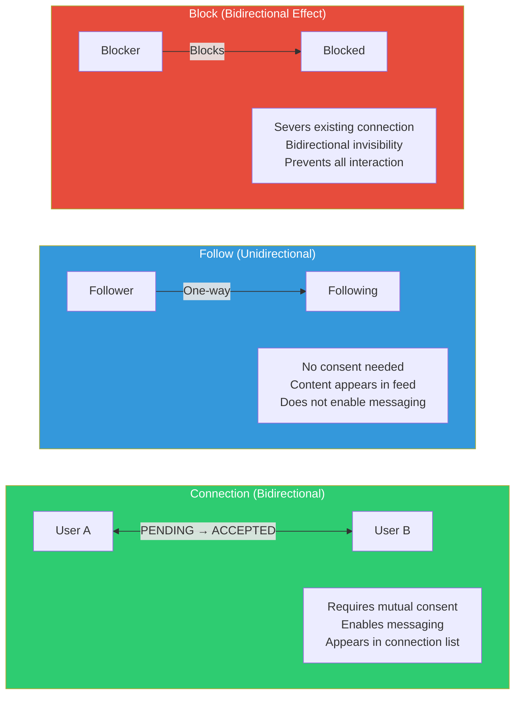

### 8.10 Endorsement Flow (Sprint 2)

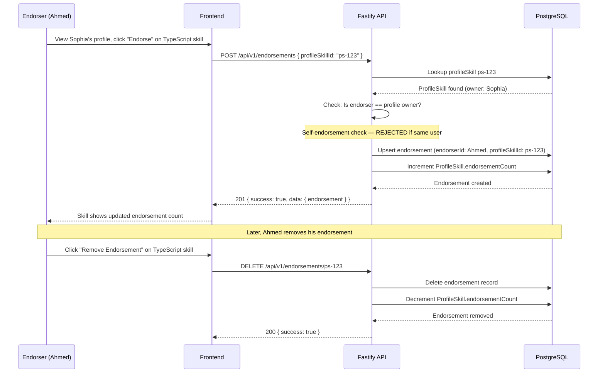

---

## 9. Functional Requirements (FR-XXX)

### FR-100: Authentication

| ID | Requirement | Priority | Story Ref |
|----|-------------|----------|-----------|
| FR-101 | The system shall support email + password registration with validation (min 8 chars, 1 uppercase, 1 number, 1 special char). | P0 | US-01 |
| FR-102 | The system shall support OAuth 2.0 registration and login via Google and GitHub. | P0 | US-02 |
| FR-103 | The system shall send a verification email with a unique token link that expires after 24 hours. | P0 | US-03 |
| FR-104 | The system shall restrict unverified accounts from accessing feed, messaging, and posting features. | P0 | US-03 |
| FR-105 | The system shall support password reset via email with a token link that expires after 1 hour. | P0 | US-38 |
| FR-106 | The system shall manage sessions using secure HTTP-only cookies with CSRF protection. | P0 | -- |
| FR-107 | The system shall rate-limit login attempts to 5 per minute per IP address. | P0 | -- |
| FR-108 | The system shall link OAuth identities to existing accounts matching the same email address. | P0 | US-02 |

### FR-200: Profile Management

| ID | Requirement | Priority | Story Ref |
|----|-------------|----------|-----------|
| FR-201 | The system shall support profile fields: display name, headline (AR/EN), summary (AR/EN), experience (multiple), education (multiple), skills (multiple), location, website. | P0 | US-04 |
| FR-202 | The system shall auto-detect text direction (RTL/LTR) for each input field based on the first strongly-typed character. | P0 | US-27 |
| FR-203 | The system shall calculate a profile completeness score (0-100%) based on weighted sections: photo (10%), headline (15%), summary (20%), experience (25%), education (15%), skills (15%). | P0 | US-04 |
| FR-204 | The system shall store separate Arabic and English values for headline and summary fields. | P0 | US-07 |
| FR-205 | The system shall accept avatar uploads in JPEG, PNG, or WebP format, max 5MB, cropped to square. | P0 | US-06 |
| FR-206 | The system shall provide inline editing for all profile sections. | P0 | US-05 |
| FR-207 | The system shall sort experience entries in reverse chronological order by start date. | P0 | US-05 |

### FR-300: Networking

| ID | Requirement | Priority | Story Ref |
|----|-------------|----------|-----------|
| FR-301 | The system shall allow users to send connection requests with an optional message (max 300 characters). | P0 | US-08 |
| FR-302 | The system shall deliver connection request notifications to recipients within 60 seconds. | P0 | US-08 |
| FR-303 | The system shall allow recipients to accept or reject connection requests. | P0 | US-09 |
| FR-304 | The system shall not notify senders of rejected connection requests. | P0 | US-09 |
| FR-305 | The system shall enforce a 30-day cooldown before re-sending a request to a user who rejected a previous one. | P0 | US-09 |
| FR-306 | The system shall allow senders to withdraw pending connection requests. | P0 | US-10 |
| FR-307 | The system shall display mutual connection counts on user profiles. | P0 | US-12 |
| FR-308 | The system shall auto-expire pending connection requests after 90 days. | P0 | US-08 |
| FR-309 | The system shall support bilateral connection removal. | P0 | US-11 |

### FR-400: Content & Feed

| ID | Requirement | Priority | Story Ref |
|----|-------------|----------|-----------|
| FR-401 | The system shall support text posts up to 3000 characters with automatic direction detection. | P0 | US-13 |
| FR-402 | The system shall support image attachments on posts: up to 4 images, JPEG/PNG/WebP, max 10MB each. | P0 | US-14 |
| FR-403 | The system shall support likes, comments, and shares on posts. | P0 | US-15, US-16, US-17 |
| FR-404 | The system shall parse and link hashtags in post text. | P0 | US-13 |
| FR-405 | The system shall display the news feed as an infinite-scrolling list, loading 10 posts per batch. | P0 | US-18 |
| FR-406 | The system shall sort the feed by a blend of recency and engagement score. | P0 | US-18 |
| FR-407 | The system shall limit comments to 1000 characters. | P0 | US-16 |
| FR-408 | The system shall display the 3 most recent comments on a post with a "View all" link. | P0 | US-16 |

### FR-500: Jobs

| ID | Requirement | Priority | Story Ref |
|----|-------------|----------|-----------|
| FR-501 | The system shall allow recruiter-role users to create job postings with: title, company, location, remote option, description, requirements, salary range (optional), language. | P0 | US-19 |
| FR-502 | The system shall support job search by keyword, location, remote/hybrid/onsite, experience level, and posted date. | P0 | US-20 |
| FR-503 | The system shall preserve job search filter state in the URL. | P0 | US-20 |
| FR-504 | The system shall allow users to apply to jobs by sharing their profile and an optional cover note (max 500 characters). | P0 | US-21 |
| FR-505 | The system shall prevent duplicate applications to the same job. | P0 | US-21 |

### FR-600: AI Features

| ID | Requirement | Priority | Story Ref |
|----|-------------|----------|-----------|
| FR-601 | The AI Profile Optimizer shall return a completeness score and actionable recommendations within 15 seconds. | P0 | US-22 |
| FR-602 | The AI Profile Optimizer shall generate bilingual (Arabic + English) suggestions for headline and summary. | P0 | US-22 |
| FR-603 | The AI shall allow users to accept, edit, or reject each suggestion individually. | P0 | US-22 |
| FR-604 | The AI Connection Matching engine shall suggest up to 10 connections with an explanation for each match. | P1 | US-23 |
| FR-605 | The AI Content Assistant shall support: generate from topic, improve draft, and translate between Arabic/English. | P1 | US-24 |
| FR-606 | The AI Job Matching engine shall provide match scores (%) and skill gap analysis. | P1 | US-25 |

### FR-700: Search

| ID | Requirement | Priority | Story Ref |
|----|-------------|----------|-----------|
| FR-701 | The system shall support full-text search across people, posts, and jobs. | P0 | US-28 |
| FR-702 | The system shall support Arabic text search using PostgreSQL full-text search with Arabic tokenization. | P0 | US-28 |
| FR-703 | The system shall display search results with tabs: People, Posts, Jobs. | P0 | US-28 |
| FR-704 | The system shall display up to 5 trending topics/hashtags based on recent post volume in the user's region. | P0 | US-29 |

### FR-800: Messaging

| ID | Requirement | Priority | Story Ref |
|----|-------------|----------|-----------|
| FR-801 | The system shall support 1:1 direct messaging between connected users. | P0 | US-30 |
| FR-802 | The system shall restrict messaging to connected users only. | P0 | US-30 |
| FR-803 | The system shall deliver messages in real-time via WebSocket with a fallback to polling. | P0 | US-30 |
| FR-804 | The system shall support read receipts with a user-configurable opt-out. | P0 | US-32 |
| FR-805 | The system shall display an unread message count badge on the navigation bar. | P0 | US-31 |
| FR-806 | The system shall limit individual messages to 5000 characters. | P0 | US-30 |

### FR-900: Admin & Moderation

| ID | Requirement | Priority | Story Ref |
|----|-------------|----------|-----------|
| FR-901 | The system shall allow any user to report content (posts, comments) with a category and optional detail. | P0 | US-33 |
| FR-902 | The system shall provide an admin dashboard at /admin accessible only to users with the admin role. | P0 | US-34 |
| FR-903 | The admin dashboard shall display: total users, active users (24h), new registrations (7d), pending reports, flagged content count. | P0 | US-34 |
| FR-904 | The moderation queue shall allow admins to: dismiss report, warn user, remove content, or ban user. | P0 | US-34 |

### FR-1000: Reactions (Sprint 2 -- Implemented)

| ID | Requirement | Priority | Story Ref |
|----|-------------|----------|-----------|
| FR-1001 | The system shall support 6 reaction types on posts: LIKE, CELEBRATE, SUPPORT, LOVE, INSIGHTFUL, FUNNY. | P0 | US-43 |
| FR-1002 | The system shall enforce a maximum of one reaction per user per post via a unique constraint on (postId, userId). | P0 | US-43 |
| FR-1003 | The system shall support upsert behavior: re-reacting to a post with a different type replaces the previous reaction. | P0 | US-43 |
| FR-1004 | The system shall support unreacting: removing a reaction deletes the record entirely. | P0 | US-43 |
| FR-1005 | The system shall provide a reaction breakdown endpoint that returns a count per reaction type for a given post. | P0 | US-43 |

### FR-1100: Block & Report (Sprint 2 -- Implemented)

| ID | Requirement | Priority | Story Ref |
|----|-------------|----------|-----------|
| FR-1101 | The system shall allow any user to block another user, creating a record in the blocks table with a unique constraint on (blockerId, blockedId). | P0 | US-44 |
| FR-1102 | When a user blocks another, the system shall automatically sever any existing connection between them. | P0 | US-44 |
| FR-1103 | The system shall enforce bidirectional invisibility for blocked pairs: neither user can view the other's profile. | P0 | US-44 |
| FR-1104 | The system shall support idempotent unblocking: unblocking a user who is not blocked shall not cause an error. | P0 | US-44 |
| FR-1105 | The system shall provide an endpoint to list all users the current user has blocked. | P0 | US-44 |
| FR-1106 | The system shall allow users to report content (target types: USER, POST, COMMENT) with a reason enum (SPAM, HARASSMENT, HATE_SPEECH, MISINFORMATION, IMPERSONATION, OTHER) and an optional description (max 1000 chars). | P0 | US-45 |
| FR-1107 | Reports shall follow a status workflow: PENDING -> REVIEWED -> RESOLVED or DISMISSED. | P0 | US-45 |

### FR-1200: Follow System (Sprint 2 -- Implemented)

| ID | Requirement | Priority | Story Ref |
|----|-------------|----------|-----------|
| FR-1201 | The system shall support one-way follow relationships via a follows table with a unique constraint on (followerId, followingId). | P0 | US-46 |
| FR-1202 | The system shall support unfollowing, which deletes the follow record. Unfollowing a user who is not followed shall not cause an error. | P0 | US-46 |
| FR-1203 | The system shall provide paginated follower and following lists with configurable limit and offset. | P0 | US-46 |
| FR-1204 | The system shall provide a follow status check endpoint returning a boolean indicator. | P0 | US-46 |
| FR-1205 | The system shall provide a follow counts endpoint returning both follower count and following count for any user. | P0 | US-46 |

### FR-1300: Endorsements (Sprint 2 -- Implemented)

| ID | Requirement | Priority | Story Ref |
|----|-------------|----------|-----------|
| FR-1301 | The system shall allow users to endorse a specific skill on another user's profile, identified by profileSkillId, with a unique constraint on (endorserId, profileSkillId). | P0 | US-47 |
| FR-1302 | The system shall prevent self-endorsement: a user cannot endorse skills on their own profile. | P0 | US-47 |
| FR-1303 | Endorsement operations shall be idempotent: endorsing an already-endorsed skill or removing a non-existent endorsement shall not cause errors. | P0 | US-47 |
| FR-1304 | The system shall track endorsement count on the ProfileSkill model, incrementing on endorse and decrementing on removal. | P0 | US-47 |
| FR-1305 | The system shall provide an endpoint to list all endorsers for a specific skill (by profileSkillId). | P0 | US-47 |
| FR-1306 | The system shall provide an endpoint to list all endorsements made by the current user. | P0 | US-47 |

---

## 10. Non-Functional Requirements (NFR-XXX)

### NFR-100: Performance

| ID | Requirement | Target |
|----|-------------|--------|
| NFR-101 | Page load time (initial) | < 2 seconds on 4G connection |
| NFR-102 | API response time (95th percentile) | < 500ms for non-AI endpoints |
| NFR-103 | AI Profile Optimizer response time | < 15 seconds |
| NFR-104 | Feed load time (per batch) | < 1 second |
| NFR-105 | Search results latency | < 500ms |
| NFR-106 | Message delivery (real-time via WebSocket) | < 1 second |
| NFR-107 | Concurrent users supported (MVP) | 1,000 simultaneous |
| NFR-108 | Image upload processing time | < 5 seconds including resize and CDN upload |

### NFR-200: Security

| ID | Requirement |
|----|-------------|
| NFR-201 | All traffic shall be encrypted via TLS 1.3. |
| NFR-202 | Passwords shall be hashed using bcrypt with a cost factor of at least 12. |
| NFR-203 | Session tokens shall be stored in HTTP-only, Secure, SameSite=Strict cookies. |
| NFR-204 | All API endpoints shall validate and sanitize input to prevent SQL injection, XSS, and CSRF attacks. |
| NFR-205 | OAuth tokens shall be stored encrypted at rest using AES-256. |
| NFR-206 | Rate limiting shall be applied to all public endpoints: 100 requests/min for authenticated users, 20 requests/min for unauthenticated. |
| NFR-207 | File uploads shall be scanned for malicious content before storage. |
| NFR-208 | Admin endpoints shall require role-based access control (RBAC) with the "admin" role. |
| NFR-209 | The system shall implement OWASP Top 10 mitigations. |

### NFR-300: Accessibility

| ID | Requirement |
|----|-------------|
| NFR-301 | The application shall conform to WCAG 2.1 Level AA. |
| NFR-302 | All interactive elements shall be keyboard-navigable. |
| NFR-303 | All images shall have alt text attributes. |
| NFR-304 | Color contrast ratios shall meet a minimum of 4.5:1 for normal text and 3:1 for large text. |
| NFR-305 | Screen readers shall correctly announce content direction changes (RTL/LTR). |

### NFR-400: Internationalization (i18n)

| ID | Requirement |
|----|-------------|
| NFR-401 | The UI shall support full Arabic (RTL) and English (LTR) with a runtime toggle. |
| NFR-402 | All UI strings shall be externalized in translation files (react-i18next namespace files). |
| NFR-403 | Date/time formatting shall use the Intl API with locale-appropriate formats (e.g., Hijri calendar option for Arabic). |
| NFR-404 | Number formatting shall support Eastern Arabic numerals when the UI language is Arabic. |
| NFR-405 | The RTL design system shall use CSS logical properties (`margin-inline-start`, `padding-inline-end`) exclusively; no physical `left`/`right` properties. |
| NFR-406 | Mixed-direction content (Arabic + English in the same text block) shall render correctly using the Unicode bidirectional algorithm. |

### NFR-500: Reliability & Availability

| ID | Requirement | Target |
|----|-------------|--------|
| NFR-501 | API uptime | 99.9% (monthly) |
| NFR-502 | Database backup frequency | Every 6 hours with point-in-time recovery |
| NFR-503 | Disaster recovery RTO | < 4 hours |
| NFR-504 | Disaster recovery RPO | < 1 hour |

### NFR-600: Data Privacy

| ID | Requirement |
|----|-------------|
| NFR-601 | Users shall be able to export all their data in a machine-readable format (JSON). |
| NFR-602 | Account deletion shall permanently remove all user data within 30 days. |
| NFR-603 | The platform shall not sell or share user data with third parties without explicit consent. |
| NFR-604 | The system shall comply with GDPR and MENA data residency requirements. |
| NFR-605 | All AI processing of user data shall be disclosed in the privacy policy. |

---

## 11. Data Model

### 11.1 Entity-Relationship Diagram

```mermaid
erDiagram
    USER ||--o| PROFILE : has
    USER ||--o{ SESSION : has
    USER ||--o{ OAUTH_ACCOUNT : has
    USER ||--o{ CONNECTION : sends
    USER ||--o{ CONNECTION : receives
    USER ||--o{ POST : creates
    USER ||--o{ COMMENT : writes
    USER ||--o{ LIKE : gives
    USER ||--o{ REACTION : reacts
    USER ||--o{ SHARE : makes
    USER ||--o{ MESSAGE : sends
    USER ||--o{ CONVERSATION_MEMBER : participates_in
    USER ||--o{ JOB_APPLICATION : submits
    USER ||--o{ NOTIFICATION : receives
    USER ||--o{ CONTENT_REPORT : submits
    USER ||--o{ HASHTAG_FOLLOW : follows
    USER ||--o{ BLOCK : blocks_given
    USER ||--o{ BLOCK : blocks_received
    USER ||--o{ REPORT : reports
    USER ||--o{ FOLLOW : follows_given
    USER ||--o{ FOLLOW : follows_received
    USER ||--o{ ENDORSEMENT : endorses

    PROFILE ||--o{ EXPERIENCE : contains
    PROFILE ||--o{ EDUCATION : contains
    PROFILE ||--o{ PROFILE_SKILL : lists

    PROFILE_SKILL }o--|| SKILL : references
    PROFILE_SKILL ||--o{ ENDORSEMENT : endorsed_by

    POST ||--o{ COMMENT : has
    POST ||--o{ LIKE : has
    POST ||--o{ REACTION : has
    POST ||--o{ SHARE : has
    POST ||--o{ POST_IMAGE : has
    POST ||--o{ POST_HASHTAG : tagged_with
    POST ||--o| POST : shared_from

    HASHTAG ||--o{ POST_HASHTAG : tagged_in
    HASHTAG ||--o{ HASHTAG_FOLLOW : followed_by

    CONVERSATION ||--o{ CONVERSATION_MEMBER : includes
    CONVERSATION ||--o{ MESSAGE : contains

    JOB ||--o{ JOB_APPLICATION : receives
    JOB }o--|| USER : posted_by
    JOB }o--o| COMPANY : belongs_to

    COMPANY ||--o{ JOB : lists

    CONTENT_REPORT }o--|| POST : reports_post
    CONTENT_REPORT }o--o| COMMENT : reports_comment

    REACTION {
        UUID id PK
        UUID postId FK
        UUID userId FK
        ReactionType type "LIKE|CELEBRATE|SUPPORT|LOVE|INSIGHTFUL|FUNNY"
        TIMESTAMP createdAt
    }

    BLOCK {
        UUID id PK
        UUID blockerId FK
        UUID blockedId FK
        TIMESTAMP createdAt
    }

    REPORT {
        UUID id PK
        UUID reporterId FK
        ReportTargetType targetType "USER|POST|COMMENT"
        UUID targetId
        ReportReason reason "SPAM|HARASSMENT|HATE_SPEECH|MISINFORMATION|IMPERSONATION|OTHER"
        VARCHAR description
        ReportStatus status "PENDING|REVIEWED|RESOLVED|DISMISSED"
        TIMESTAMP createdAt
    }

    FOLLOW {
        UUID id PK
        UUID followerId FK
        UUID followingId FK
        TIMESTAMP createdAt
    }

    ENDORSEMENT {
        UUID id PK
        UUID endorserId FK
        UUID profileSkillId FK
        TIMESTAMP createdAt
    }

    PROFILE_SKILL {
        UUID id PK
        UUID profileId FK
        UUID skillId FK
        INT endorsementCount "Default 0"
        TIMESTAMP createdAt
    }
```

### 11.2 Core Entity Details

#### User

| Field | Type | Constraints |
|-------|------|-------------|
| id | UUID | PK, auto-generated |
| email | VARCHAR(255) | UNIQUE, NOT NULL |
| password_hash | VARCHAR(255) | NULLABLE (OAuth users) |
| display_name | VARCHAR(100) | NOT NULL |
| role | ENUM(user, recruiter, admin) | DEFAULT user |
| email_verified | BOOLEAN | DEFAULT false |
| verification_token | VARCHAR(255) | NULLABLE |
| verification_expires | TIMESTAMP | NULLABLE |
| language_preference | ENUM(ar, en) | DEFAULT ar |
| status | ENUM(active, suspended, deleted) | DEFAULT active |
| deletion_requested_at | TIMESTAMP | NULLABLE |
| created_at | TIMESTAMP | DEFAULT NOW() |
| updated_at | TIMESTAMP | AUTO-UPDATE |

#### Profile

| Field | Type | Constraints |
|-------|------|-------------|
| id | UUID | PK |
| user_id | UUID | FK -> User, UNIQUE |
| headline_ar | VARCHAR(220) | NULLABLE |
| headline_en | VARCHAR(220) | NULLABLE |
| summary_ar | TEXT | NULLABLE |
| summary_en | TEXT | NULLABLE |
| avatar_url | VARCHAR(500) | NULLABLE |
| location | VARCHAR(100) | NULLABLE |
| website | VARCHAR(255) | NULLABLE |
| completeness_score | INTEGER | DEFAULT 0, CHECK 0-100 |
| created_at | TIMESTAMP | DEFAULT NOW() |
| updated_at | TIMESTAMP | AUTO-UPDATE |

#### Connection

| Field | Type | Constraints |
|-------|------|-------------|
| id | UUID | PK |
| sender_id | UUID | FK -> User |
| receiver_id | UUID | FK -> User |
| status | ENUM(pending, accepted, rejected, withdrawn, expired) | DEFAULT pending |
| message | VARCHAR(300) | NULLABLE |
| responded_at | TIMESTAMP | NULLABLE |
| cooldown_until | TIMESTAMP | NULLABLE |
| created_at | TIMESTAMP | DEFAULT NOW() |

#### Post

| Field | Type | Constraints |
|-------|------|-------------|
| id | UUID | PK |
| author_id | UUID | FK -> User |
| content | TEXT | NOT NULL, max 3000 chars |
| text_direction | ENUM(rtl, ltr, auto) | DEFAULT auto |
| shared_post_id | UUID | FK -> Post, NULLABLE |
| share_comment | TEXT | NULLABLE, max 1000 chars |
| like_count | INTEGER | DEFAULT 0 |
| comment_count | INTEGER | DEFAULT 0 |
| share_count | INTEGER | DEFAULT 0 |
| is_deleted | BOOLEAN | DEFAULT false |
| created_at | TIMESTAMP | DEFAULT NOW() |
| updated_at | TIMESTAMP | AUTO-UPDATE |

#### Job

| Field | Type | Constraints |
|-------|------|-------------|
| id | UUID | PK |
| posted_by | UUID | FK -> User |
| company_id | UUID | FK -> Company, NULLABLE |
| title | VARCHAR(200) | NOT NULL |
| description | TEXT | NOT NULL |
| requirements | TEXT | NULLABLE |
| location | VARCHAR(100) | NOT NULL |
| is_remote | BOOLEAN | DEFAULT false |
| work_type | ENUM(onsite, hybrid, remote) | DEFAULT onsite |
| experience_level | ENUM(entry, mid, senior, lead, executive) | NOT NULL |
| salary_min | INTEGER | NULLABLE |
| salary_max | INTEGER | NULLABLE |
| salary_currency | VARCHAR(3) | DEFAULT 'USD' |
| language | ENUM(ar, en, bilingual) | DEFAULT bilingual |
| status | ENUM(active, closed, draft) | DEFAULT active |
| application_count | INTEGER | DEFAULT 0 |
| created_at | TIMESTAMP | DEFAULT NOW() |
| expires_at | TIMESTAMP | NULLABLE |

#### Message

| Field | Type | Constraints |
|-------|------|-------------|
| id | UUID | PK |
| conversation_id | UUID | FK -> Conversation |
| sender_id | UUID | FK -> User |
| content | TEXT | NOT NULL, max 5000 chars |
| read_at | TIMESTAMP | NULLABLE |
| created_at | TIMESTAMP | DEFAULT NOW() |

#### Reaction (Sprint 2 -- Implemented)

| Field | Type | Constraints |
|-------|------|-------------|
| id | UUID | PK, auto-generated |
| post_id | UUID | FK -> Post, NOT NULL |
| user_id | UUID | FK -> User, NOT NULL |
| type | ENUM(LIKE, CELEBRATE, SUPPORT, LOVE, INSIGHTFUL, FUNNY) | NOT NULL |
| created_at | TIMESTAMP | DEFAULT NOW() |
| | | UNIQUE(post_id, user_id) |
| | | INDEX(post_id) |

#### Block (Sprint 2 -- Implemented)

| Field | Type | Constraints |
|-------|------|-------------|
| id | UUID | PK, auto-generated |
| blocker_id | UUID | FK -> User, NOT NULL |
| blocked_id | UUID | FK -> User, NOT NULL |
| created_at | TIMESTAMP | DEFAULT NOW() |
| | | UNIQUE(blocker_id, blocked_id) |
| | | INDEX(blocker_id), INDEX(blocked_id) |

#### Report (Sprint 2 -- Implemented)

| Field | Type | Constraints |
|-------|------|-------------|
| id | UUID | PK, auto-generated |
| reporter_id | UUID | FK -> User, NOT NULL |
| target_type | ENUM(USER, POST, COMMENT) | NOT NULL |
| target_id | UUID | NOT NULL |
| reason | ENUM(SPAM, HARASSMENT, HATE_SPEECH, MISINFORMATION, IMPERSONATION, OTHER) | NOT NULL |
| description | VARCHAR(1000) | NULLABLE |
| status | ENUM(PENDING, REVIEWED, RESOLVED, DISMISSED) | DEFAULT PENDING |
| created_at | TIMESTAMP | DEFAULT NOW() |
| updated_at | TIMESTAMP | AUTO-UPDATE |
| | | INDEX(reporter_id), INDEX(target_type, target_id) |

#### Follow (Sprint 2 -- Implemented)

| Field | Type | Constraints |
|-------|------|-------------|
| id | UUID | PK, auto-generated |
| follower_id | UUID | FK -> User, NOT NULL |
| following_id | UUID | FK -> User, NOT NULL |
| created_at | TIMESTAMP | DEFAULT NOW() |
| | | UNIQUE(follower_id, following_id) |
| | | INDEX(follower_id), INDEX(following_id) |

#### Endorsement (Sprint 2 -- Implemented)

| Field | Type | Constraints |
|-------|------|-------------|
| id | UUID | PK, auto-generated |
| endorser_id | UUID | FK -> User, NOT NULL |
| profile_skill_id | UUID | FK -> ProfileSkill, NOT NULL |
| created_at | TIMESTAMP | DEFAULT NOW() |
| | | UNIQUE(endorser_id, profile_skill_id) |
| | | INDEX(profile_skill_id) |

#### ProfileSkill (Updated for Endorsements)

| Field | Type | Constraints |
|-------|------|-------------|
| id | UUID | PK, auto-generated |
| profile_id | UUID | FK -> Profile, NOT NULL |
| skill_id | UUID | FK -> Skill, NOT NULL |
| endorsement_count | INTEGER | DEFAULT 0 |
| created_at | TIMESTAMP | DEFAULT NOW() |
| | | UNIQUE(profile_id, skill_id) |

---

## 12. API Contracts

### 12.1 Container Diagram (C4 Level 2)

```mermaid
graph TD
    subgraph Client["Frontend (Next.js 14 - Port 3111)"]
        WEB[Web Application<br/>React 18 + Tailwind]
    end

    subgraph API["Backend (Fastify - Port 5007)"]
        AUTH[Auth Module<br/>/api/auth/*]
        PROFILE[Profile Module<br/>/api/profiles/*]
        NETWORK[Network Module<br/>/api/connections/*]
        CONTENT[Content Module<br/>/api/posts/*]
        JOBS[Jobs Module<br/>/api/jobs/*]
        SEARCH[Search Module<br/>/api/search/*]
        MSG[Messaging Module<br/>/api/messages/*]
        ADMIN[Admin Module<br/>/api/admin/*]
        AI_MOD[AI Module<br/>/api/ai/*]
        BLOCKS[Block/Report Module<br/>/api/v1/blocks/*<br/>/api/v1/reports/*]
        FOLLOWS[Follow Module<br/>/api/v1/follows/*]
        ENDORSE[Endorsement Module<br/>/api/v1/endorsements/*]
    end

    subgraph Data["Data Layer"]
        DB[(PostgreSQL<br/>+ pgvector)]
        REDIS[(Redis<br/>Cache + Sessions)]
        S3[Object Storage<br/>Avatars + Images]
    end

    subgraph External["External Services"]
        CLAUDE[Claude API]
        OAUTH[OAuth Providers]
        EMAILSVC[Email Service]
    end

    WEB --> AUTH
    WEB --> PROFILE
    WEB --> NETWORK
    WEB --> CONTENT
    WEB --> JOBS
    WEB --> SEARCH
    WEB --> MSG
    WEB --> ADMIN
    WEB --> AI_MOD
    WEB --> BLOCKS
    WEB --> FOLLOWS
    WEB --> ENDORSE

    AUTH --> DB
    AUTH --> REDIS
    AUTH --> OAUTH
    AUTH --> EMAILSVC
    PROFILE --> DB
    PROFILE --> S3
    NETWORK --> DB
    CONTENT --> DB
    CONTENT --> S3
    JOBS --> DB
    SEARCH --> DB
    MSG --> DB
    MSG --> REDIS
    ADMIN --> DB
    AI_MOD --> DB
    AI_MOD --> CLAUDE
    BLOCKS --> DB
    FOLLOWS --> DB
    ENDORSE --> DB

    style Client fill:#2ECC71,color:#fff
    style API fill:#3498DB,color:#fff
    style DB fill:#9B59B6,color:#fff
    style REDIS fill:#E74C3C,color:#fff
```

### 12.2 Key API Endpoints

#### Authentication

| Method | Endpoint | Description | Auth |
|--------|----------|-------------|------|
| POST | `/api/auth/register` | Email registration | Public |
| POST | `/api/auth/login` | Email login | Public |
| POST | `/api/auth/logout` | End session | Authenticated |
| GET | `/api/auth/verify/:token` | Email verification | Public |
| POST | `/api/auth/forgot-password` | Request password reset | Public |
| POST | `/api/auth/reset-password` | Reset password with token | Public |
| GET | `/api/auth/oauth/google` | Initiate Google OAuth | Public |
| GET | `/api/auth/oauth/github` | Initiate GitHub OAuth | Public |
| GET | `/api/auth/oauth/callback` | OAuth callback handler | Public |

#### Profiles

| Method | Endpoint | Description | Auth |
|--------|----------|-------------|------|
| GET | `/api/profiles/:id` | Get user profile | Authenticated |
| GET | `/api/profiles/me` | Get own profile | Authenticated |
| PATCH | `/api/profiles/me` | Update own profile | Authenticated |
| POST | `/api/profiles/me/avatar` | Upload avatar | Authenticated |
| POST | `/api/profiles/me/experience` | Add experience entry | Authenticated |
| PATCH | `/api/profiles/me/experience/:id` | Update experience | Authenticated |
| DELETE | `/api/profiles/me/experience/:id` | Delete experience | Authenticated |
| POST | `/api/profiles/me/education` | Add education entry | Authenticated |
| PATCH | `/api/profiles/me/education/:id` | Update education | Authenticated |
| DELETE | `/api/profiles/me/education/:id` | Delete education | Authenticated |
| PUT | `/api/profiles/me/skills` | Update skills list | Authenticated |

#### Connections

| Method | Endpoint | Description | Auth |
|--------|----------|-------------|------|
| POST | `/api/connections/request` | Send connection request | Authenticated |
| POST | `/api/connections/:id/accept` | Accept request | Authenticated |
| POST | `/api/connections/:id/reject` | Reject request | Authenticated |
| DELETE | `/api/connections/:id/withdraw` | Withdraw request | Authenticated |
| DELETE | `/api/connections/:id` | Remove connection | Authenticated |
| GET | `/api/connections` | List my connections | Authenticated |
| GET | `/api/connections/pending` | List pending requests | Authenticated |
| GET | `/api/connections/mutual/:userId` | Mutual connections | Authenticated |

#### Posts

| Method | Endpoint | Description | Auth |
|--------|----------|-------------|------|
| POST | `/api/posts` | Create post | Authenticated |
| GET | `/api/posts/feed` | Get news feed | Authenticated |
| GET | `/api/posts/:id` | Get single post | Authenticated |
| DELETE | `/api/posts/:id` | Delete own post | Authenticated |
| POST | `/api/posts/:id/like` | Like post | Authenticated |
| DELETE | `/api/posts/:id/like` | Unlike post | Authenticated |
| POST | `/api/posts/:id/comments` | Add comment | Authenticated |
| GET | `/api/posts/:id/comments` | List comments | Authenticated |
| POST | `/api/posts/:id/share` | Share post | Authenticated |

#### Jobs

| Method | Endpoint | Description | Auth |
|--------|----------|-------------|------|
| POST | `/api/jobs` | Create job posting | Recruiter |
| GET | `/api/jobs` | Search/list jobs | Authenticated |
| GET | `/api/jobs/:id` | Get job details | Authenticated |
| PATCH | `/api/jobs/:id` | Update job | Recruiter (owner) |
| DELETE | `/api/jobs/:id` | Close job | Recruiter (owner) |
| POST | `/api/jobs/:id/apply` | Apply to job | Authenticated |
| GET | `/api/jobs/:id/applications` | List applicants | Recruiter (owner) |

#### Messaging

| Method | Endpoint | Description | Auth |
|--------|----------|-------------|------|
| GET | `/api/conversations` | List conversations | Authenticated |
| GET | `/api/conversations/:id/messages` | Get messages | Authenticated |
| POST | `/api/messages` | Send message | Authenticated |
| PATCH | `/api/messages/:id/read` | Mark as read | Authenticated |

#### Search

| Method | Endpoint | Description | Auth |
|--------|----------|-------------|------|
| GET | `/api/search?q=&type=` | Global search | Authenticated |
| GET | `/api/search/trending` | Trending topics | Authenticated |

#### AI

| Method | Endpoint | Description | Auth |
|--------|----------|-------------|------|
| POST | `/api/ai/profile/optimize` | AI profile optimization | Authenticated |
| POST | `/api/ai/connections/suggest` | AI connection suggestions | Authenticated |
| POST | `/api/ai/content/generate` | AI content generation | Authenticated |
| POST | `/api/ai/content/improve` | AI content improvement | Authenticated |
| POST | `/api/ai/jobs/match` | AI job matching | Authenticated |

#### Admin

| Method | Endpoint | Description | Auth |
|--------|----------|-------------|------|
| GET | `/api/admin/dashboard` | Dashboard metrics | Admin |
| GET | `/api/admin/reports` | Content reports queue | Admin |
| POST | `/api/admin/reports/:id/action` | Take action on report | Admin |
| GET | `/api/admin/users` | User management list | Admin |
| PATCH | `/api/admin/users/:id` | Update user (suspend/ban) | Admin |

#### Reactions (Sprint 2 -- Implemented)

| Method | Endpoint | Description | Auth |
|--------|----------|-------------|------|
| POST | `/api/v1/feed/posts/:id/react` | React to a post (body: `{ type }`) | Authenticated |
| DELETE | `/api/v1/feed/posts/:id/react` | Remove reaction from a post | Authenticated |
| GET | `/api/v1/feed/posts/:id/reactions` | Get reaction breakdown for a post | Authenticated |

#### Blocks (Sprint 2 -- Implemented)

| Method | Endpoint | Description | Auth |
|--------|----------|-------------|------|
| POST | `/api/v1/blocks` | Block a user (body: `{ userId }`) | Authenticated |
| DELETE | `/api/v1/blocks/:userId` | Unblock a user | Authenticated |
| GET | `/api/v1/blocks` | List blocked users | Authenticated |

#### Reports (Sprint 2 -- Implemented)

| Method | Endpoint | Description | Auth |
|--------|----------|-------------|------|
| POST | `/api/v1/reports` | Report content (body: `{ targetType, targetId, reason, description? }`) | Authenticated |

#### Follows (Sprint 2 -- Implemented)

| Method | Endpoint | Description | Auth |
|--------|----------|-------------|------|
| POST | `/api/v1/follows` | Follow a user (body: `{ userId }`) | Authenticated |
| DELETE | `/api/v1/follows/:userId` | Unfollow a user | Authenticated |
| GET | `/api/v1/follows/followers` | List followers (query: `limit`, `offset`) | Authenticated |
| GET | `/api/v1/follows/following` | List users I follow | Authenticated |
| GET | `/api/v1/follows/:userId/status` | Check if I follow a user | Authenticated |
| GET | `/api/v1/follows/:userId/counts` | Get follower/following counts | Authenticated |

#### Endorsements (Sprint 2 -- Implemented)

| Method | Endpoint | Description | Auth |
|--------|----------|-------------|------|
| POST | `/api/v1/endorsements` | Endorse a skill (body: `{ profileSkillId }`) | Authenticated |
| DELETE | `/api/v1/endorsements/:profileSkillId` | Remove endorsement | Authenticated |
| GET | `/api/v1/endorsements/skill/:profileSkillId` | List endorsers for a skill | Authenticated |
| GET | `/api/v1/endorsements/by-me` | List my endorsements | Authenticated |

### 12.3 API Response Format

All API responses follow a consistent envelope:

**Success:**
```json
{
  "success": true,
  "data": { ... },
  "meta": {
    "page": 1,
    "limit": 20,
    "total": 150
  }
}
```

**Error:**
```json
{
  "success": false,
  "error": {
    "code": "VALIDATION_ERROR",
    "message": "Email is required",
    "details": [
      { "field": "email", "message": "Must be a valid email address" }
    ]
  }
}
```

---

## 13. Out of Scope

The following are explicitly **NOT** included in any phase of the current plan:

| Item | Reason |
|------|--------|
| Native mobile apps (iOS/Android) | Web-first; responsive design covers mobile use cases for MVP |
| Video/audio calls within the platform (Phase 1-2) | Complexity; Phase 3 explores WebRTC rooms |
| Payment processing / in-app purchases | Revenue model not validated; Phase 3 introduces subscriptions |
| LinkedIn data import/sync | API restrictions; legal complexity; manual profile creation preferred |
| Multi-language beyond Arabic/English | Scope creep; future consideration for French (Maghreb), Turkish, Urdu |
| Algorithmic timeline ranking (ML-based) | Phase 1 uses a simple recency + engagement blend; ML ranking is Phase 3 |
| Enterprise SSO (SAML/OIDC) | Enterprise features are Phase 3+ |
| Mobile push notifications | Web notifications only in MVP; push requires native app or PWA work |
| Advertising platform | No ads; premium subscriptions are the revenue model |
| Gamification (badges, leaderboards) | Risk of cheapening professional platform; may reconsider in Phase 3 |
| Content translation (auto-translate posts) | Phase 1 supports bilingual authoring; auto-translation is Phase 2 AI feature |
| Group messaging / channels | 1:1 messaging only in MVP; group features in Phase 2+ |
| Video posts / stories | Text + image only in MVP; video in Phase 2+ |

---

## 14. Risks & Mitigations

### 14.1 Risk Matrix

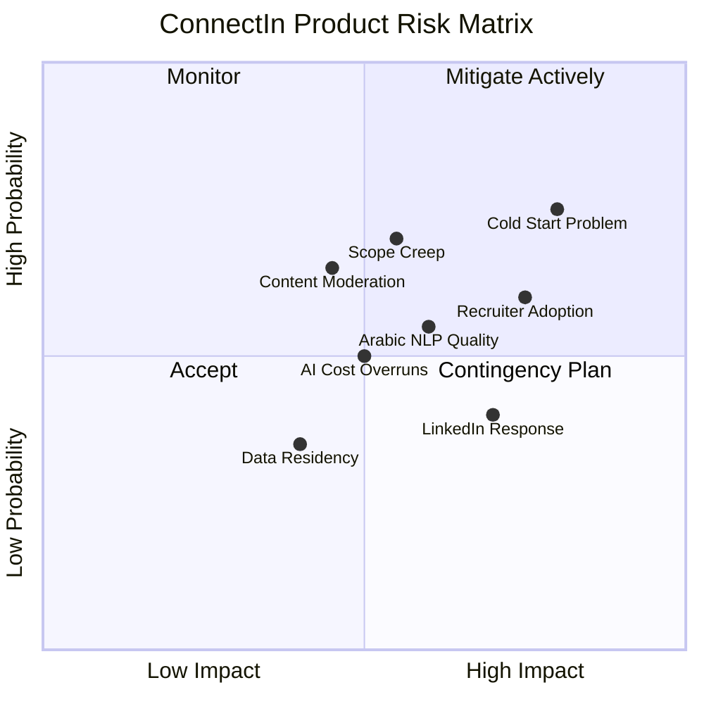

### 14.2 Risk Details

| Risk ID | Risk | Category | Probability | Impact | Mitigation |
|---------|------|----------|-------------|--------|------------|
| R-01 | **Cold start problem**: Platform has no value without users; users will not join without existing users | Market | High | High | Focus on niche (Arab tech professionals); create value through AI tools that work independently of network size (profile optimizer); seed with 50-100 lighthouse users from MENA tech communities before public launch |
| R-02 | **Arabic NLP quality**: AI features may underperform in Arabic, especially dialectal Arabic | Technical | Medium | High | Use Claude API (strong Arabic performance); supplement with specialized Arabic models (Jais, ALLaM); build Arabic test corpus; dialect support is Phase 2, not MVP |
| R-03 | **LinkedIn competitive response**: LinkedIn improves its Arabic experience in response | Competitive | Medium | Medium | Move fast; build community loyalty; Arabic-first design is architecturally deep and hard to replicate; open-source community creates lock-in |
| R-04 | **Arabic content moderation**: Moderating Arabic content is harder than English (dialects, cultural context) | Operational | High | Medium | Start with human moderation + community reporting; add AI-assisted moderation in Phase 2; partner with Arabic content moderation services |
| R-05 | **AI cost overruns**: Claude API costs per-profile-optimization or per-content-generation may not scale | Financial | Medium | Medium | Implement aggressive caching; rate-limit AI features per user (e.g., 5 optimizations/day); batch embedding generation; track cost-per-user and set alerts |
| R-06 | **Recruiter adoption**: Recruiters will not join without a large candidate pool | Market | High | High | Offer free recruiter accounts for first 6 months; partner with MENA recruitment agencies; emphasize Arabic-speaking talent access as unique selling point |
| R-07 | **Scope creep**: Pressure to add features beyond MVP delays launch | Process | High | Medium | Strict MVP scope enforcement; this PRD defines what is in and what is out; two-week sprint reviews with scope validation |
| R-08 | **Data residency**: MENA regulations require data to be stored in specific jurisdictions | Legal | Low | Medium | Deploy on cloud providers with MENA regions (AWS Bahrain, Azure UAE) from Phase 2; Phase 1 can use any region |

---

## 15. Success Metrics

### 15.1 MVP Launch KPIs (Month 1-3)

| Metric | Target | Measurement |
|--------|--------|-------------|
| Registered Users | 2,500 | Count of verified accounts |
| Monthly Active Users (MAU) | 1,000 | Unique users with at least 1 session in 30 days |
| Activation Rate | 65% | % of registrants who complete profile (score >= 50%) |
| Connection Requests Sent | 5,000 | Total connection requests in first 3 months |
| Connection Accept Rate | 40% | Accepted / (Accepted + Rejected) |
| Posts Created | 500 | Total posts in first 3 months |
| Arabic Content Ratio | 60% | % of posts with Arabic as primary language |
| AI Profile Optimizer Usage | 50% | % of users who use the optimizer at least once |
| Average Session Duration | 5 minutes | Measured via analytics |
| Page Load Time (P95) | < 2 seconds | Measured via monitoring |
| API Uptime | 99.9% | Measured via monitoring |

### 15.2 Phase 2 KPIs (Month 4-6)

| Metric | Target | Measurement |
|--------|--------|-------------|
| MAU | 10,000 | Unique monthly active users |
| DAU/MAU Ratio | 20% | Daily active / Monthly active |
| AI Connection Suggestion Accept Rate | 25% | % of AI suggestions that lead to a connection request |
| AI Content Assistant Usage | 30% | % of active users who use content AI at least once/month |
| Job Postings | 200 | Active job postings on platform |
| Job Applications | 1,000 | Total applications submitted |
| NPS Score | 40+ | Net Promoter Score from user survey |

### 15.3 North Star Metric

**Weekly Active Bilingual Engagements**: The number of unique users per week who create or meaningfully engage with (like, comment, share, message) content in **both Arabic and English**. This metric captures the intersection of our three differentiators: active usage, bilingual value, and engagement quality.

---

## Appendix A: Site Map Overview

```mermaid
graph TD
    ROOT[ConnectIn<br/>connectin.app] --> HOME[Home Feed<br/>/]
    ROOT --> AUTH_GROUP[Authentication]
    ROOT --> PROFILE_GROUP[Profile]
    ROOT --> NETWORK_GROUP[Network]
    ROOT --> JOBS_GROUP[Jobs]
    ROOT --> MSG_GROUP[Messaging]
    ROOT --> SEARCH_PAGE[Search<br/>/search]
    ROOT --> SETTINGS_GROUP[Settings]
    ROOT --> ADMIN_GROUP[Admin]

    AUTH_GROUP --> LOGIN[Login<br/>/login]
    AUTH_GROUP --> REGISTER[Register<br/>/register]
    AUTH_GROUP --> VERIFY[Verify Email<br/>/verify/:token]
    AUTH_GROUP --> FORGOT[Forgot Password<br/>/forgot-password]
    AUTH_GROUP --> RESET[Reset Password<br/>/reset-password/:token]

    PROFILE_GROUP --> MY_PROFILE[My Profile<br/>/profile]
    PROFILE_GROUP --> USER_PROFILE[User Profile<br/>/profile/:id]
    PROFILE_GROUP --> EDIT_PROFILE[Edit Profile<br/>/profile/edit]
    PROFILE_GROUP --> SETUP_WIZARD[Profile Setup<br/>/profile/setup]

    NETWORK_GROUP --> MY_NETWORK[My Network<br/>/network]
    NETWORK_GROUP --> PENDING[Pending Requests<br/>/network/pending]

    JOBS_GROUP --> JOB_LIST[Job Search<br/>/jobs]
    JOBS_GROUP --> JOB_DETAIL[Job Detail<br/>/jobs/:id]
    JOBS_GROUP --> POST_JOB[Post a Job<br/>/jobs/new]
    JOBS_GROUP --> MY_APPS[My Applications<br/>/jobs/applications]
    JOBS_GROUP --> MY_POSTINGS[My Postings<br/>/jobs/my-postings]

    MSG_GROUP --> INBOX[Inbox<br/>/messages]
    MSG_GROUP --> THREAD[Conversation<br/>/messages/:conversationId]

    SETTINGS_GROUP --> ACCOUNT[Account Settings<br/>/settings/account]
    SETTINGS_GROUP --> NOTIF[Notification Settings<br/>/settings/notifications]
    SETTINGS_GROUP --> PRIVACY[Privacy Settings<br/>/settings/privacy]
    SETTINGS_GROUP --> LANG[Language Settings<br/>/settings/language]

    ADMIN_GROUP --> DASH[Dashboard<br/>/admin]
    ADMIN_GROUP --> MOD_QUEUE[Moderation Queue<br/>/admin/moderation]
    ADMIN_GROUP --> USER_MGMT[User Management<br/>/admin/users]

    style ROOT fill:#3498DB,color:#fff
    style HOME fill:#2ECC71,color:#fff
```

---

## Appendix B: Glossary

| Term | Definition |
|------|-----------|
| **RTL** | Right-to-Left text direction, used for Arabic script |
| **LTR** | Left-to-Right text direction, used for Latin script |
| **MENA** | Middle East and North Africa region |
| **GCC** | Gulf Cooperation Council (Saudi Arabia, UAE, Qatar, Bahrain, Kuwait, Oman) |
| **MAU** | Monthly Active Users |
| **DAU** | Daily Active Users |
| **NPS** | Net Promoter Score |
| **pgvector** | PostgreSQL extension for vector similarity search |
| **OAuth 2.0** | Authorization framework for third-party login |
| **DID** | Decentralized Identifier (W3C standard) |
| **CRDT** | Conflict-free Replicated Data Type (for real-time collaboration) |
| **ActivityPub** | W3C protocol for decentralized social networking |
| **RBAC** | Role-Based Access Control |
| **Reaction** | An expressive engagement on a post (one of 6 types: Like, Celebrate, Support, Love, Insightful, Funny); replaces binary Like |
| **Endorsement** | A vouching action where one user validates another user's listed skill, incrementing the skill's endorsement count |
| **Follow** | A one-way subscription relationship where a user can follow another to see their content without mutual consent |
| **Block** | A safety mechanism where a user prevents bidirectional visibility and interaction with another user |

---

## Document History

| Version | Date | Author | Changes |
|---------|------|--------|---------|
| 1.0 | 2026-02-20 | Product Manager (AI Agent) | Initial PRD creation |
| 1.1 | 2026-02-24 | Product Manager (AI Agent) | Added Sprint 2 features: Reactions System (US-43, FR-1000), Block/Report System (US-44/45, FR-1100), Follow System (US-46, FR-1200), Endorsement System (US-47, FR-1300). Updated ER diagram, API contracts, C4 container diagram, epic dependency map, and feature prioritization table. Added sequence diagrams for block effect flow, reaction state machine, endorsement flow, and follow vs. connection comparison. |
