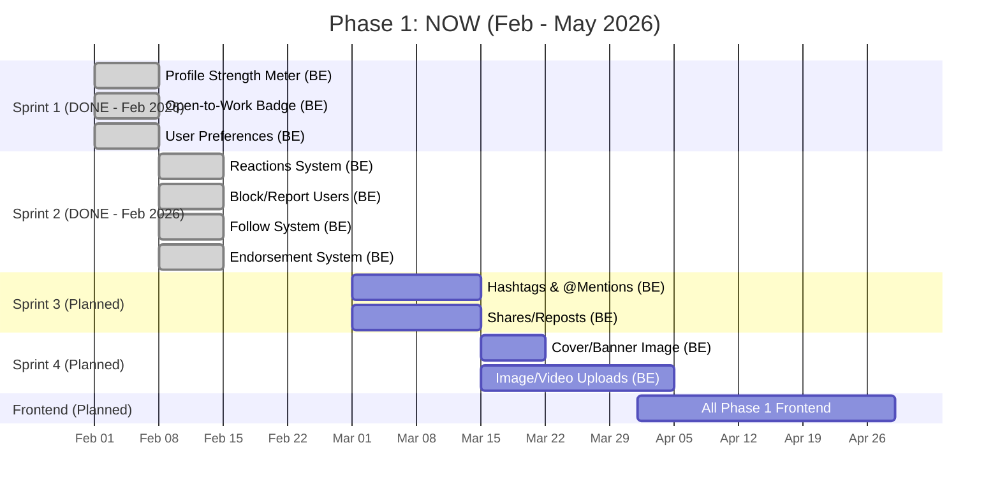
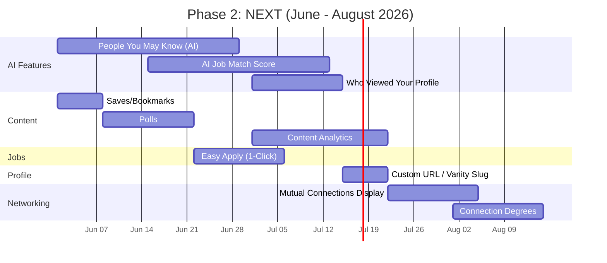
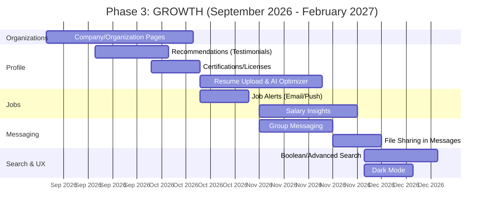
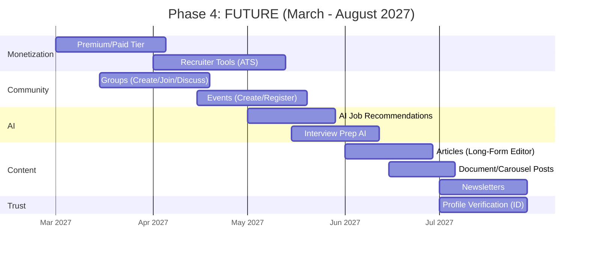
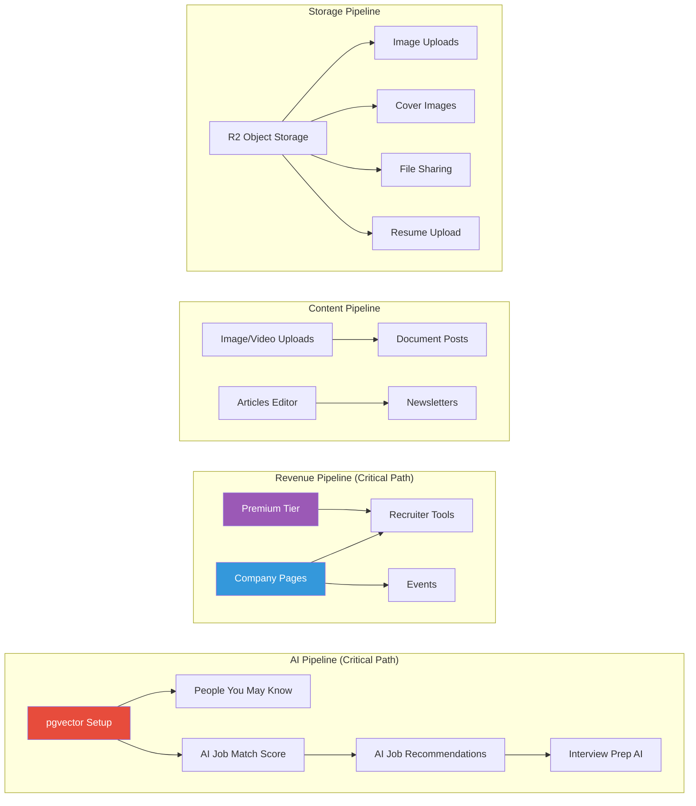
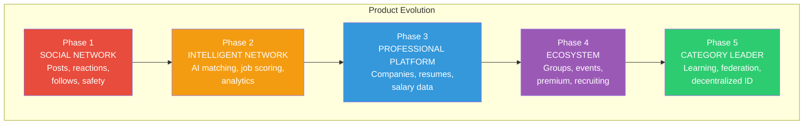
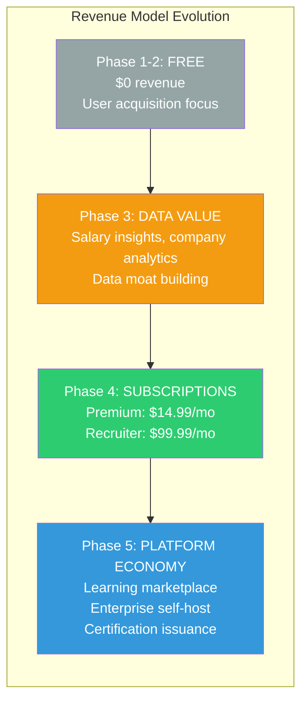

# ConnectIn Product Roadmap

> **Product Strategist** | ConnectSW
> **Date**: February 24, 2026
> **Version**: 1.1 (Updated: February 2026)
> **Status**: Active -- Phase 1 In Progress
> **Horizon**: 18+ months (5 phases)

---

## Table of Contents

1. [Strategic Vision](#1-strategic-vision)
2. [Prioritization Framework](#2-prioritization-framework)
3. [Phase 1: NOW (0-3 months)](#3-phase-1-now-0-3-months)
4. [Phase 2: NEXT (3-6 months)](#4-phase-2-next-3-6-months)
5. [Phase 3: GROWTH (6-12 months)](#5-phase-3-growth-6-12-months)
6. [Phase 4: FUTURE (12-18 months)](#6-phase-4-future-12-18-months)
7. [Phase 5: HORIZON (18+ months)](#7-phase-5-horizon-18-months)
8. [Dependencies Map](#8-dependencies-map)
9. [Success Metrics](#9-success-metrics)

---

## Current Sprint Status (February 2026)

**Phase 1 Backend Progress: 6 of 10 features complete (60%)**

| Sprint | Features | Tests | Status |
|--------|----------|:-----:|:------:|
| Sprint 1 (Complete) | Profile Strength Meter, Open-to-Work Badge, User Preferences | 41 | DONE |
| Sprint 2 (Complete) | Reactions, Block/Report, Follow, Endorsements | 54 | DONE |
| Sprint 3 (Planned) | Hashtags & @Mentions, Shares/Reposts | -- | NOT STARTED |
| Sprint 4 (Planned) | Cover/Banner Image, Image/Video Uploads | -- | NOT STARTED |
| **Total** | **10 features** | **95 passing** | **60% backend** |

**Key accomplishment**: 95 new backend tests passing across 6 implemented features. All frontend implementations remain pending.

### What Was Delivered

**Sprint 1 (Feb 2026)**:
- Profile Strength Meter -- completeness score calculation with weighted field analysis
- Open-to-Work Badge -- UserPreference model with public/recruiter-only visibility toggle
- User Preferences Model -- theme, language, feed sort, activity status preferences

**Sprint 2 (Feb 2026)**:
- Reactions System -- 6-type reactions (LIKE, CELEBRATE, SUPPORT, LOVE, INSIGHTFUL, FUNNY) with counts (18 tests)
- Block/Report System -- block/unblock, bidirectional profile hiding, connection removal on block, content reporting (14 tests)
- Follow System -- follow/unfollow, followers/following lists, pagination, status check, counts (13 tests)
- Endorsement System -- endorse/remove skills, endorser lists, idempotent operations, endorsement count tracking (9 tests)

### What Remains (Phase 1)
- Hashtags & @Mentions (backend)
- Shares/Reposts (backend)
- Cover/Banner Image Upload (backend + storage)
- Image/Video Uploads (backend + storage)
- All frontend implementations for all 10 features

---

## 1. Strategic Vision

ConnectIn will become the default professional network for the 300M+ Arabic-speaking professionals worldwide by delivering an experience that no competitor can replicate: a platform where Arabic is the native language (not a bolt-on), where AI powers every interaction from profile optimization to career navigation, and where users own their professional identity rather than renting it from a corporation. Within 18 months, ConnectIn will progress from a functional MVP with core networking to a full-stack professional platform with AI-powered job matching, company pages, event hosting, and a premium tier -- establishing a defensible position in the $65B professional networking market before LinkedIn or Qabilah can close the Arabic-first AI-native gap.

---

## 2. Prioritization Framework

Every candidate feature is scored on three dimensions, each rated 1-5:

| Dimension | Weight | What It Measures |
|-----------|--------|-----------------|
| **User Impact (UI)** | Direct | How significantly does this feature improve the daily experience for our primary persona (Arab tech professional)? 5 = essential daily-use, 1 = rarely noticed |
| **Technical Feasibility (TF)** | Direct | How achievable is this with our current stack (Next.js 14, Fastify, Prisma, PostgreSQL, WebSocket)? 5 = straightforward extension, 1 = requires new infrastructure |
| **Strategic Differentiation (SD)** | Direct | How much does this strengthen ConnectIn's unique position (Arabic-first, AI-native, privacy-first, open-source)? 5 = no competitor has this for Arabic professionals, 1 = commodity feature |

**Priority Score = UI x TF x SD** (max 125)

### Feature Scoring Table

| # | Feature | UI | TF | SD | Score | Phase |
|---|---------|:--:|:--:|:--:|:-----:|:-----:|
| 1 | Image/Video Uploads (Posts) | 5 | 4 | 2 | 40 | 1 |
| 2 | Reactions (Celebrate/Support/Love/Insightful/Funny) | 4 | 5 | 2 | 40 | 1 |
| 3 | Hashtags & @Mentions | 4 | 4 | 3 | 48 | 1 |
| 4 | Follow (Non-Connection) | 4 | 4 | 2 | 32 | 1 |
| 5 | Profile Strength Meter | 4 | 5 | 3 | 60 | 1 |
| 6 | Block/Report Users | 5 | 4 | 2 | 40 | 1 |
| 7 | Shares/Reposts | 4 | 4 | 2 | 32 | 1 |
| 8 | Cover/Banner Image | 3 | 5 | 2 | 30 | 1 |
| 9 | Endorsement UI (Give/Receive) | 4 | 4 | 3 | 48 | 1 |
| 10 | Open-to-Work Badge | 4 | 5 | 3 | 60 | 1 |
| 11 | People You May Know (AI) | 5 | 3 | 5 | 75 | 2 |
| 12 | Mutual Connections Display | 4 | 4 | 2 | 32 | 2 |
| 13 | Connection Degrees (1st/2nd/3rd) | 4 | 3 | 2 | 24 | 2 |
| 14 | Saves/Bookmarks (Posts) | 4 | 5 | 2 | 40 | 2 |
| 15 | Polls | 3 | 4 | 2 | 24 | 2 |
| 16 | Content Analytics (Post Views/Impressions) | 4 | 3 | 3 | 36 | 2 |
| 17 | Easy Apply (1-Click) | 5 | 4 | 3 | 60 | 2 |
| 18 | AI Job Match Score | 5 | 3 | 5 | 75 | 2 |
| 19 | Who Viewed Your Profile | 5 | 3 | 3 | 45 | 2 |
| 20 | Custom URL / Vanity Slug | 3 | 5 | 2 | 30 | 2 |
| 21 | Company/Organization Pages | 5 | 3 | 3 | 45 | 3 |
| 22 | Recommendations (Written Testimonials) | 4 | 4 | 3 | 48 | 3 |
| 23 | Certifications/Licenses Section | 3 | 4 | 3 | 36 | 3 |
| 24 | Group Messaging | 3 | 3 | 2 | 18 | 3 |
| 25 | File Sharing in Messages | 3 | 3 | 2 | 18 | 3 |
| 26 | Job Alerts (Email/Push) | 4 | 4 | 2 | 32 | 3 |
| 27 | Salary Insights | 4 | 2 | 4 | 32 | 3 |
| 28 | Boolean/Advanced Search | 3 | 3 | 2 | 18 | 3 |
| 29 | Dark Mode | 3 | 4 | 1 | 12 | 3 |
| 30 | Resume Upload & AI Optimizer | 4 | 3 | 5 | 60 | 3 |
| 31 | Groups (Create/Join/Discuss) | 3 | 2 | 3 | 18 | 4 |
| 32 | Events (Create/Register) | 3 | 2 | 3 | 18 | 4 |
| 33 | Articles (Long-Form Editor) | 3 | 3 | 3 | 27 | 4 |
| 34 | Newsletters | 2 | 2 | 3 | 12 | 4 |
| 35 | Premium/Paid Tier | 3 | 3 | 4 | 36 | 4 |
| 36 | AI Job Recommendations | 4 | 3 | 5 | 60 | 4 |
| 37 | Profile Verification (ID) | 3 | 2 | 4 | 24 | 4 |
| 38 | Document/Carousel Posts | 3 | 3 | 2 | 18 | 4 |
| 39 | Recruiter Tools (ATS, Pipeline) | 4 | 2 | 4 | 32 | 4 |
| 40 | Interview Prep AI | 3 | 3 | 5 | 45 | 4 |
| 41 | Learning Platform (Courses) | 2 | 1 | 4 | 8 | 5 |
| 42 | Audio Events (Clubhouse-Style) | 2 | 2 | 3 | 12 | 5 |
| 43 | Decentralized Identity (DID) | 2 | 1 | 5 | 10 | 5 |
| 44 | ActivityPub Federation | 1 | 1 | 5 | 5 | 5 |
| 45 | In-App Professional Games | 2 | 2 | 3 | 12 | 5 |

---

## 3. Phase 1: NOW (0-3 months)

**Theme**: Close the table-stakes gap. Make ConnectIn feel like a complete, usable professional network.

**Strategic rationale**: Users who arrive today encounter a platform with text-only posts, binary likes, no way to share content, and no safety controls. These are not differentiators -- they are baseline expectations. Phase 1 closes these gaps so that Phase 2's AI-powered differentiators land on a credible foundation.

### Phase 1 Feature Details

| # | Feature | Description | Score | Effort | Backend | Frontend | Dependencies |
|---|---------|-------------|:-----:|:------:|:-------:|:--------:|-------------|
| 1 | **Image/Video Uploads** | Allow image (up to 4) and video (up to 5 min) attachments on posts with R2 storage | 40 | L | Planned | Planned | Object storage (Cloudflare R2) setup |
| 2 | **Reactions System** | Replace binary like with 6 reaction types: Like, Celebrate, Support, Love, Insightful, Funny -- extending the existing Like model | 40 | M | DONE (Feb 2026) -- 18 tests | Planned | None (extends existing Like model) |
| 3 | **Hashtags & @Mentions** | Parse #hashtags and @mentions in post content; hashtag pages aggregate posts; mentions trigger notifications | 48 | M | Planned | Planned | Notification system (exists) |
| 4 | **Shares/Reposts** | Repost a post to your feed with optional commentary; track share count on original post | 32 | M | Planned | Planned | Post model (exists) |
| 5 | **Profile Strength Meter** | AI-analyzed completeness score (photo, headline, summary, experience, education, skills) with specific improvement suggestions in Arabic/English | 60 | S | DONE (Feb 2026) | Planned | Profile model (exists) |
| 6 | **Block/Report Users** | Block users (hide content bidirectionally, prevent messaging) and report content/users with moderation queue | 40 | M | DONE (Feb 2026) -- 14 tests | Planned | Admin routes (exist) |
| 7 | **Cover/Banner Image** | Upload a profile banner image (1584x396 recommended) stored on R2 | 30 | S | Planned | Planned | Object storage (same as #1) |
| 8 | **Endorsement UI** | UI for connections to endorse each other's skills with a single click; display top endorsers | 48 | M | DONE (Feb 2026) -- 9 tests | Planned | ProfileSkill model (exists, has endorsementCount) |
| 9 | **Open-to-Work Badge** | Toggle on profile that signals availability to recruiters (public or recruiter-only visibility) | 60 | S | DONE (Feb 2026) | Planned | Profile model (exists) |
| 10 | **Follow (Non-Connection)** | Follow a user's content without establishing a bilateral connection; followers see the user's posts in their feed | 32 | M | DONE (Feb 2026) -- 13 tests | Planned | Feed algorithm adjustment required |

---

## 4. Phase 2: NEXT (3-6 months)

**Theme**: AI-powered differentiation. Deliver features that make ConnectIn feel intelligent in ways LinkedIn does not.

**Strategic rationale**: With table stakes closed, Phase 2 deploys ConnectIn's core differentiator: AI that understands Arabic professionals. People You May Know and AI Job Match Score are the two highest-scoring features in the entire backlog (score: 75 each) because they combine high user impact with strong strategic differentiation. This phase also introduces the first jobs-specific AI features that will drive the future revenue model.

### Phase 2 Feature Details

| # | Feature | Description | Score | Effort | Dependencies |
|---|---------|-------------|:-----:|:------:|-------------|
| 1 | **People You May Know (AI)** | pgvector-powered embedding similarity matching that suggests connections based on career goals, skill complementarity, industry proximity, and geographic relevance -- not just mutual connections | 75 | XL | pgvector extension; embedding pipeline; Phase 1 Follow system |
| 2 | **AI Job Match Score** | Semantic matching engine that encodes job descriptions and candidate profiles as vectors, returning a 0-100 match score with explainable skill-gap analysis | 75 | XL | pgvector (shared with PYMK); Job model (exists) |
| 3 | **Who Viewed Your Profile** | Track and display anonymous profile viewers (last 90 days); users can see counts and limited details on free tier, full details on future premium | 45 | M | New ProfileView model; privacy settings |
| 4 | **Saves/Bookmarks** | Save any post to a private collection for later reading; organize by collections | 40 | S | Post model (exists) |
| 5 | **Polls** | Create polls with up to 4 options and configurable duration (1-14 days); display results as percentage bars | 24 | M | Post model extension (poll subtype) |
| 6 | **Content Analytics** | Post authors see view count, impression count, reaction breakdown, and top viewer demographics for their posts | 36 | M | Depends on Who Viewed (#3) infrastructure |
| 7 | **Easy Apply (1-Click)** | Apply to a job with a single click using profile data (headline, experience, skills) as the application; no cover note required | 60 | S | Job/Application models (exist) |
| 8 | **Custom URL / Vanity Slug** | Users claim a vanity slug (connectin.app/in/yourname) for their profile | 30 | S | Profile model (exists) |
| 9 | **Mutual Connections Display** | Show mutual connections between the current user and any other profile; count shown on profile cards | 32 | M | Connection model (exists) |
| 10 | **Connection Degrees (1st/2nd/3rd)** | Display relationship degree (1st, 2nd, 3rd+) on every profile card using BFS traversal on the connection graph | 24 | L | Connection model (exists); graph traversal logic |

---

## 5. Phase 3: GROWTH (6-12 months)

**Theme**: Platform expansion. Evolve from a networking tool to a professional ecosystem.

**Strategic rationale**: Phase 3 transitions ConnectIn from "social network" to "professional platform" by adding company pages (the foundation for B2B revenue), recommendations (trust signals), resume AI (high-differentiation Arabic-first feature), and salary insights (data moat). The recruiter-facing features planted here enable the Phase 4 premium tier and recruiter tooling.

### Phase 3 Feature Details

| # | Feature | Description | Score | Effort | Dependencies |
|---|---------|-------------|:-----:|:------:|-------------|
| 1 | **Company/Organization Pages** | Full company profiles with about section, employee list, job listings, content feed, and basic analytics (visitors, followers) | 45 | XL | New Organization model; many-to-many User-Organization; Job model link |
| 2 | **Recommendations** | Request and write professional recommendations (testimonials) displayed on profiles; requires bilateral acceptance | 48 | M | Connection model (must be 1st-degree to recommend) |
| 3 | **Certifications/Licenses** | Profile section for certifications with issuing organization, credential ID, date, and optional verification link | 36 | S | Profile model extension |
| 4 | **Resume Upload & AI Optimizer** | Upload PDF/DOCX resume; AI parses content, extracts structured data, and suggests keyword optimization aligned to target roles -- in Arabic and English | 60 | L | Object storage (R2); Claude API; parser service |
| 5 | **Job Alerts** | Configurable email and push alerts for new jobs matching user preferences (title, location, work type, experience level) | 32 | M | Job model (exists); NotificationPreference model (exists); email service |
| 6 | **Salary Insights** | Aggregate and display salary ranges by job title, location, and experience level from job postings and (optional) user-reported data | 32 | L | Requires sufficient job posting volume from Phase 1-2; Job model salary fields (exist) |
| 7 | **Group Messaging** | Conversations with 3+ participants; group naming, adding/removing members, admin controls | 18 | M | Conversation/ConversationMember models (exist; extend for groups) |
| 8 | **File Sharing in Messages** | Send images, documents (PDF, DOCX), and files (up to 25MB) within conversations | 18 | M | Object storage (R2); Message model extension |
| 9 | **Boolean/Advanced Search** | Support AND, OR, NOT, quotes, and parentheses in people/job search; add advanced filter panel (location, company, industry, experience level) | 18 | L | Existing search routes; PostgreSQL full-text search upgrade or Meilisearch |
| 10 | **Dark Mode** | System-wide dark color scheme toggled in settings; respects OS preference; CSS variables-based implementation | 12 | M | Tailwind CSS (exists); design system update |

---

## 6. Phase 4: FUTURE (12-18 months)

**Theme**: Innovation and monetization. Ship the features that generate revenue and create long-term defensibility.

**Strategic rationale**: Phase 4 is where ConnectIn becomes a business, not just a product. The premium tier (score: 36) and recruiter tools (score: 32) are the revenue engines. Groups and events create community lock-in -- the most durable form of network effect. AI job recommendations and interview prep AI (score: 60 and 45 respectively) are high-differentiation features that deepen the AI-native positioning.

### Phase 4 Feature Details

| # | Feature | Description | Score | Effort | Dependencies |
|---|---------|-------------|:-----:|:------:|-------------|
| 1 | **Premium/Paid Tier** | Subscription tiers: Professional ($14.99/mo), Business ($49.99/mo), Recruiter ($99.99/mo); gated features include full Who Viewed, InMail credits, advanced analytics, AI writing assistant | 36 | XL | Stripe/payment integration; feature flagging; most Phase 1-3 features |
| 2 | **Recruiter Tools** | Mini-ATS with candidate pipeline management, bulk messaging, advanced candidate search (21+ filters), and application tracking dashboard | 32 | XL | Company Pages (Phase 3); Premium tier; Job/Application models |
| 3 | **Groups** | Create topic-based groups (open or invite-only); group discussions with posts, comments, moderation tools; Arabic-first group discovery | 18 | L | New Group model; moderation infrastructure |
| 4 | **Events** | Create virtual and in-person events with registration, attendee list, event discussion, and calendar integration | 18 | L | Company Pages (optional host); notification system |
| 5 | **AI Job Recommendations** | Daily AI-curated job recommendations based on profile embedding, browsing behavior, application history, and stated career goals | 60 | L | AI Job Match Score (Phase 2); pgvector embeddings; notification system |
| 6 | **Interview Prep AI** | AI-powered mock interview practice with industry-specific questions generated from job descriptions; supports Arabic and English responses with AI feedback | 45 | L | Claude API; Job model (exists) |
| 7 | **Articles (Long-Form)** | Rich text editor for long-form articles (5000+ words); SEO-indexed, shareable, displayed on author's profile | 27 | L | Rich text editor integration (Tiptap/ProseMirror) |
| 8 | **Document/Carousel Posts** | Upload PDF documents that render as swipeable carousel slides in the feed | 18 | M | Object storage (R2); PDF rendering library |
| 9 | **Newsletters** | Create and manage subscriber-based newsletters delivered via email; built on top of Articles | 12 | L | Articles (same phase); email service; subscriber management |
| 10 | **Profile Verification** | ID-based identity verification via third-party provider (Persona/CLEAR equivalent for MENA); displays verified badge on profile | 24 | L | Third-party identity verification API; KYC compliance |

---

## 7. Phase 5: HORIZON (18+ months)

**Theme**: Visionary platform capabilities. Features that establish ConnectIn as a category-defining product.

**Strategic rationale**: These features are either technically unproven (DID, ActivityPub), infrastructure-heavy (learning platform), or dependent on large user scale (games, audio events). They represent the long-term vision but should not distract from Phases 1-4 execution.

| # | Feature | Description | Score | Effort | Dependencies |
|---|---------|-------------|:-----:|:------:|-------------|
| 1 | **Learning Platform** | Course library with video content, skill assessments, certificates shareable to profile, and AI-curated learning paths aligned to career goals | 8 | XL | Partnerships with MENA educational institutions; video hosting; certificate issuance |
| 2 | **Audio Events (Clubhouse-Style)** | Live audio rooms for professional discussions with speaker/listener roles, AI-powered real-time Arabic/English translation, and automatic session transcription | 12 | XL | WebRTC infrastructure (LiveKit/mediasoup); Events system (Phase 4) |
| 3 | **Decentralized Identity (DID)** | W3C Verifiable Credentials for university degrees, certifications, and professional endorsements; user-owned, cryptographically verifiable, portable across platforms | 10 | XL | DID/VC standards maturity; university/issuer partnerships in MENA; wallet infrastructure |
| 4 | **ActivityPub Federation** | Enable ConnectIn profiles and content to federate with Mastodon and other ActivityPub networks, allowing cross-platform professional presence | 5 | XL | ActivityPub protocol implementation; federation policy; moderation for federated content |
| 5 | **In-App Professional Games** | Daily professional skill challenges (industry trivia, business scenarios) with connection leaderboards to drive daily returns and viral sharing | 12 | L | Gamification framework; content authoring pipeline for challenges |

---

## 8. Dependencies Map

```mermaid
flowchart TD
    subgraph P1["Phase 1: NOW (0-3mo)"]
        P1A[Image/Video Uploads]
        P1B[Reactions System]
        P1C[Hashtags & @Mentions]
        P1D[Shares/Reposts]
        P1E[Profile Strength Meter]
        P1F[Cover/Banner Image]
        P1G[Endorsement UI]
        P1H[Open-to-Work Badge]
        P1I[Follow Non-Connection]
        P1J[Block/Report Users]
    end

    subgraph P2["Phase 2: NEXT (3-6mo)"]
        P2A[People You May Know AI]
        P2B[AI Job Match Score]
        P2C[Who Viewed Profile]
        P2D[Saves/Bookmarks]
        P2E[Polls]
        P2F[Content Analytics]
        P2G[Easy Apply]
        P2H[Custom URL Slug]
        P2I[Mutual Connections]
        P2J[Connection Degrees]
    end

    subgraph P3["Phase 3: GROWTH (6-12mo)"]
        P3A[Company Pages]
        P3B[Recommendations]
        P3C[Certifications]
        P3D[Resume AI Optimizer]
        P3E[Job Alerts]
        P3F[Salary Insights]
        P3G[Group Messaging]
        P3H[File Sharing Messages]
        P3I[Advanced Search]
        P3J[Dark Mode]
    end

    subgraph P4["Phase 4: FUTURE (12-18mo)"]
        P4A[Premium Tier]
        P4B[Recruiter Tools]
        P4C[Groups]
        P4D[Events]
        P4E[AI Job Recommendations]
        P4F[Interview Prep AI]
        P4G[Articles]
        P4H[Document Posts]
        P4I[Newsletters]
        P4J[Profile Verification]
    end

    subgraph P5["Phase 5: HORIZON (18+mo)"]
        P5A[Learning Platform]
        P5B[Audio Events]
        P5C[Decentralized Identity]
        P5D[ActivityPub Federation]
        P5E[Professional Games]
    end

    %% Cross-phase dependencies
    P1A -->|R2 storage| P1F
    P1A -->|R2 storage| P3H
    P1I -->|Feed changes| P2A
    P1C -->|Notifications| P2F

    P2A -->|pgvector| P2B
    P2C -->|View tracking| P2F
    P2B -->|Embeddings| P4E

    P3A -->|Org model| P4B
    P3A -->|Host events| P4D
    P3D -->|Resume data| P4E
    P3F -->|Data pipeline| P4B

    P4A -->|Feature gates| P4B
    P4A -->|Feature gates| P2C
    P4C -->|Community infra| P4D
    P4G -->|Rich text| P4I
    P4D -->|Events system| P5B

    P4J -->|Trust infra| P5C

    %% Styling
    style P1 fill:#E74C3C,color:#fff
    style P2 fill:#F39C12,color:#fff
    style P3 fill:#3498DB,color:#fff
    style P4 fill:#9B59B6,color:#fff
    style P5 fill:#2ECC71,color:#fff
```

### Key Dependency Chains

---

## 9. Success Metrics

### Phase 1: NOW (0-3 months)

**North Star**: Active users who post at least once per week

| Metric | Current | Target | Rationale |
|--------|---------|--------|-----------|
| **MAU** | 0 (pre-launch) | 1,000 | Beta community from MENA tech events |
| **DAU/MAU Ratio** | -- | 15% | Baseline engagement for new social platforms |
| **Posts with Media** | 0% | 30% | Image/video uploads driving richer content |
| **Avg Reactions per Post** | 1.0 (like-only) | 2.5 | Multiple reaction types increase engagement |
| **Profile Completeness** | ~40% avg | 65% avg | Strength meter nudges completion |
| **Endorsements Given per User/Month** | 0 | 3 | Endorsement UI activates social proof loop |
| **Block/Report Actions** | 0 | <2% of MAU | Safety feature exists but not overused |
| **Weekly Retention (D7)** | -- | 40% | Users return after first week |

### Phase 2: NEXT (3-6 months)

**North Star**: Connection acceptance rate from AI suggestions

| Metric | Target | Rationale |
|--------|--------|-----------|
| **MAU** | 5,000 | Public launch drives growth |
| **DAU/MAU Ratio** | 20% | AI features create daily habit loops |
| **PYMK Connection Acceptance Rate** | 25%+ | AI suggestions are relevant enough to act on |
| **AI Job Match Engagement** | 40% of job seekers view match scores | Users trust the AI scoring |
| **Profile Views per User/Month** | 10 | Who Viewed feature drives curiosity loop |
| **Easy Apply Usage** | 60% of applications | Friction reduction increases applications |
| **Posts Saved per User/Month** | 5 | Bookmarks signal content value |
| **Monthly Retention (D30)** | 50% | Users stay beyond initial curiosity |

### Phase 3: GROWTH (6-12 months)

**North Star**: Company pages created and active

| Metric | Target | Rationale |
|--------|--------|-----------|
| **MAU** | 25,000 | Platform features attract broader audience |
| **DAU/MAU Ratio** | 22% | More reasons to return daily |
| **Company Pages Created** | 200 | Signals B2B traction |
| **Recommendations Written** | 500/month | Social proof loop active |
| **Resume Uploads** | 2,000 | Users trust platform with career documents |
| **Job Alert Subscribers** | 3,000 | Automated return visits via email |
| **Group Messages Sent** | 5,000/month | Group messaging adds stickiness |
| **Advanced Search Queries** | 1,000/month | Power users finding value in search |
| **Quarterly Retention** | 35% | Platform becomes part of professional routine |

### Phase 4: FUTURE (12-18 months)

**North Star**: Monthly Recurring Revenue (MRR)

| Metric | Target | Rationale |
|--------|--------|-----------|
| **MAU** | 50,000 | Network effects compounding |
| **DAU/MAU Ratio** | 25% | LinkedIn's benchmark is ~27% |
| **Premium Subscribers** | 1,500 | 3% free-to-paid conversion |
| **MRR** | $50,000 | Validates the business model |
| **Recruiter Accounts** | 100 | B2B revenue engine starts |
| **Groups Created** | 300 | Community-driven content grows |
| **Events Hosted** | 50/month | Platform becomes event destination |
| **AI Feature Adoption** | 65% of MAU | AI is not a gimmick but a daily tool |
| **NPS Score** | 45+ | Users actively recommend ConnectIn |

### Phase 5: HORIZON (18+ months)

**North Star**: Platform becomes self-sustaining with positive unit economics

| Metric | Target | Rationale |
|--------|--------|-----------|
| **MAU** | 100,000+ | Approaching critical mass in MENA tech |
| **DAU/MAU Ratio** | 27%+ | Parity with LinkedIn |
| **ARR** (Annual Recurring Revenue) | $1.2M+ | Sustainable business |
| **Learning Course Completions** | 5,000/month | Education creates deep lock-in |
| **Verified Profiles** | 10% of MAU | Trust distinguishes from competitors |
| **Open Source Contributors** | 50+ | Community ownership achieved |
| **Federated Connections** | 1,000+ | ActivityPub expands reach |

---

## Appendix: Phase-Over-Phase Progression

---

*This roadmap is a living document. It will be reviewed and updated quarterly by the Product Strategist in consultation with the CEO. Feature priorities may shift based on user feedback, market conditions, and competitive moves.*
