# ConnectIn -- System Architecture

> **Architect** | ConnectSW
> **Version**: 1.0
> **Date**: February 20, 2026
> **Status**: Accepted
> **Product**: ConnectIn -- Professional Networking Platform
> **Frontend Port**: 3111 | **Backend Port**: 5007

---

## Table of Contents

1. [Business Context](#1-business-context)
2. [Architecture Goals & Constraints](#2-architecture-goals--constraints)
3. [C4 Level 1 -- System Context](#3-c4-level-1----system-context)
4. [C4 Level 2 -- Container Diagram](#4-c4-level-2----container-diagram)
5. [C4 Level 3 -- Component Diagram (Fastify API)](#5-c4-level-3----component-diagram-fastify-api)
6. [Database Schema](#6-database-schema)
7. [API Architecture](#7-api-architecture)
8. [Sequence Diagrams](#8-sequence-diagrams)
9. [State Diagrams](#9-state-diagrams)
10. [Technology Decisions](#10-technology-decisions)
11. [Deployment Architecture](#11-deployment-architecture)
12. [Cross-Cutting Concerns](#12-cross-cutting-concerns)

---

## 1. Business Context

ConnectIn is an **AI-native, Arabic-first professional networking platform** targeting Arab tech professionals globally and MENA-based recruiters. It addresses a structural gap in the $65B professional networking market: there is no platform built Arabic-first for the 300M+ Arabic speakers worldwide.

### Architecture Goals

| Goal | Description | Driven By |
|------|-------------|-----------|
| **Arabic-First** | RTL-native design system using CSS logical properties; bidirectional content rendering at every layer | Competitive thesis |
| **AI-Native** | AI deeply integrated into profile optimization, matching, and content -- not an afterthought bolted onto existing features | Differentiation pillar |
| **Privacy-First** | User-owned data, no third-party data selling, full data export, transparent algorithms | Trust and GDPR/MENA compliance |
| **Scalable to 10K MAU** | Architecture supports Phase 2 target (10,000 monthly active users) without re-architecture | Growth roadmap |
| **Developer Experience** | Reuse ConnectSW shared packages; TDD; type-safe end-to-end | Engineering efficiency |
| **Low Operational Cost** | Managed services, single PostgreSQL instance (with pgvector), Redis for caching/sessions | MVP budget |

### Architecture Constraints

| Constraint | Rationale |
|------------|-----------|
| PostgreSQL 15+ as sole database | Avoid operational complexity of multiple databases; pgvector provides vector search within PostgreSQL |
| Fastify as backend framework | ConnectSW standard; async-first, schema-based validation, plugin architecture |
| Next.js 14+ as frontend framework | ConnectSW standard; App Router, React Server Components, built-in SSR/SSG |
| TypeScript everywhere | Type safety end-to-end; ConnectSW mandate |
| Reuse `@connectsw/*` shared packages | Auth, notifications, audit, UI components -- no rebuilding |

---

## 2. Architecture Goals & Constraints

### Quality Attribute Priorities

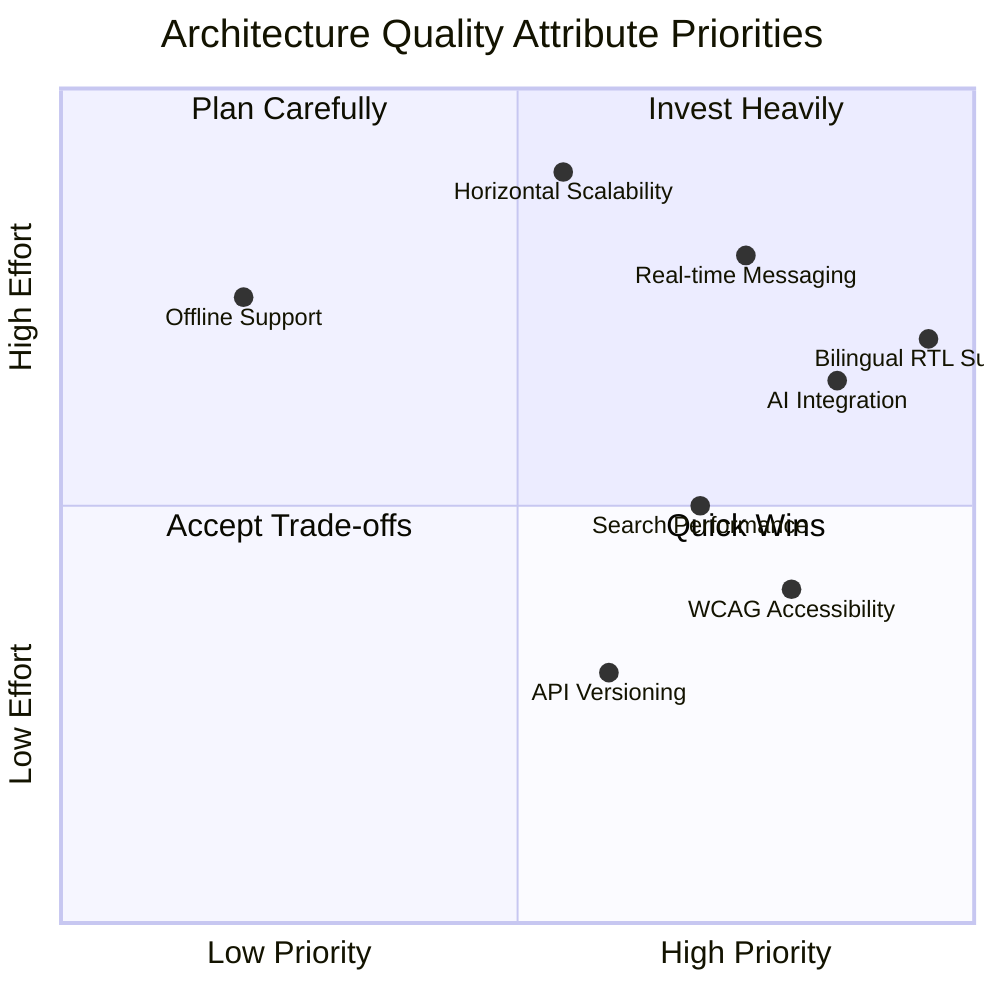
```mermaid
quadrantChart
    title Architecture Quality Attribute Priorities
    x-axis Low Priority --> High Priority
    y-axis Low Effort --> High Effort
    quadrant-1 Invest Heavily
    quadrant-2 Plan Carefully
    quadrant-3 Accept Trade-offs
    quadrant-4 Quick Wins
    Bilingual RTL Support: [0.95, 0.70]
    Real-time Messaging: [0.75, 0.80]
    AI Integration: [0.85, 0.65]
    Horizontal Scalability: [0.55, 0.90]
    Search Performance: [0.70, 0.50]
    Offline Support: [0.20, 0.75]
    WCAG Accessibility: [0.80, 0.40]
    API Versioning: [0.60, 0.30]
```

### Key Architectural Decisions Summary

| Decision | Choice | ADR |
|----------|--------|-----|
| Tech Stack | Fastify + Next.js + PostgreSQL + Prisma + Redis | [ADR-001](ADRs/ADR-001-tech-stack.md) |
| Arabic-First Approach | RTL-first CSS logical properties, bidirectional rendering, react-i18next | [ADR-002](ADRs/ADR-002-arabic-first-architecture.md) |
| AI Integration | Claude API + pgvector + AI orchestrator pattern | [ADR-003](ADRs/ADR-003-ai-integration.md) |

---

## 3. C4 Level 1 -- System Context

The system context diagram shows ConnectIn in its environment: the users who interact with it and the external systems it depends on.

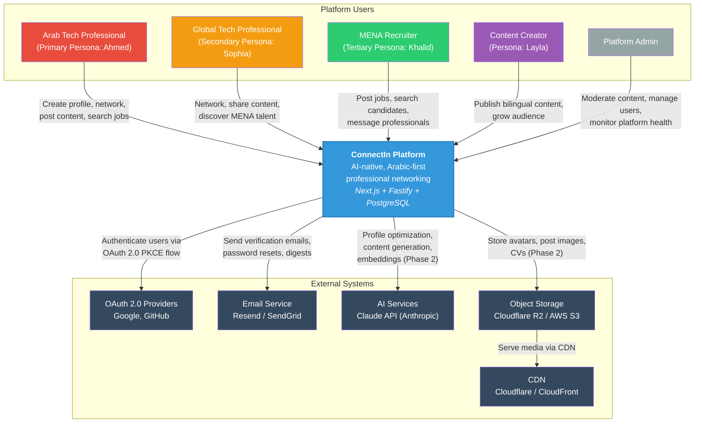
```mermaid
graph TD
    subgraph Users["Platform Users"]
        ARAB["Arab Tech Professional<br/>(Primary Persona: Ahmed)"]
        GLOBAL["Global Tech Professional<br/>(Secondary Persona: Sophia)"]
        RECRUITER["MENA Recruiter<br/>(Tertiary Persona: Khalid)"]
        CREATOR["Content Creator<br/>(Persona: Layla)"]
        ADMIN["Platform Admin"]
    end

    CONNECTIN["<b>ConnectIn Platform</b><br/>AI-native, Arabic-first<br/>professional networking<br/><i>Next.js + Fastify + PostgreSQL</i>"]

    subgraph External["External Systems"]
        OAUTH["OAuth 2.0 Providers<br/>Google, GitHub"]
        EMAIL_SVC["Email Service<br/>Resend / SendGrid"]
        AI_SVC["AI Services<br/>Claude API (Anthropic)"]
        STORAGE["Object Storage<br/>Cloudflare R2 / AWS S3"]
        CDN["CDN<br/>Cloudflare / CloudFront"]
    end

    ARAB -->|"Create profile, network,<br/>post content, search jobs"| CONNECTIN
    GLOBAL -->|"Network, share content,<br/>discover MENA talent"| CONNECTIN
    RECRUITER -->|"Post jobs, search candidates,<br/>message professionals"| CONNECTIN
    CREATOR -->|"Publish bilingual content,<br/>grow audience"| CONNECTIN
    ADMIN -->|"Moderate content, manage users,<br/>monitor platform health"| CONNECTIN

    CONNECTIN -->|"Authenticate users via<br/>OAuth 2.0 PKCE flow"| OAUTH
    CONNECTIN -->|"Send verification emails,<br/>password resets, digests"| EMAIL_SVC
    CONNECTIN -->|"Profile optimization,<br/>content generation,<br/>embeddings (Phase 2)"| AI_SVC
    CONNECTIN -->|"Store avatars, post images,<br/>CVs (Phase 2)"| STORAGE
    STORAGE -->|"Serve media via CDN"| CDN

    style CONNECTIN fill:#3498DB,color:#fff,stroke:#2980B9,stroke-width:2px
    style ARAB fill:#E74C3C,color:#fff
    style GLOBAL fill:#F39C12,color:#fff
    style RECRUITER fill:#2ECC71,color:#fff
    style CREATOR fill:#9B59B6,color:#fff
    style ADMIN fill:#95A5A6,color:#fff
    style OAUTH fill:#34495E,color:#fff
    style EMAIL_SVC fill:#34495E,color:#fff
    style AI_SVC fill:#34495E,color:#fff
    style STORAGE fill:#34495E,color:#fff
    style CDN fill:#34495E,color:#fff
```

### External System Dependencies

| System | Purpose | SLA Requirement | Fallback |
|--------|---------|-----------------|----------|
| Google OAuth | User registration and login | Best-effort (Google uptime: 99.99%) | Email/password login |
| GitHub OAuth | Developer registration and login | Best-effort | Email/password login |
| Resend / SendGrid | Transactional email | 99.9% delivery rate | Queue and retry; secondary provider |
| Claude API (Anthropic) | AI profile optimization, content generation | Best-effort; AI features degrade gracefully | Cached results; manual editing |
| Cloudflare R2 / AWS S3 | Object storage for media | 99.99% durability | Upload retry; CDN caches |
| Redis | Session management, caching, rate limiting | Best-effort; app functions without Redis | In-memory fallback (single-instance) |

---

## 4. C4 Level 2 -- Container Diagram

The container diagram shows the major technical building blocks that compose ConnectIn and their interactions.

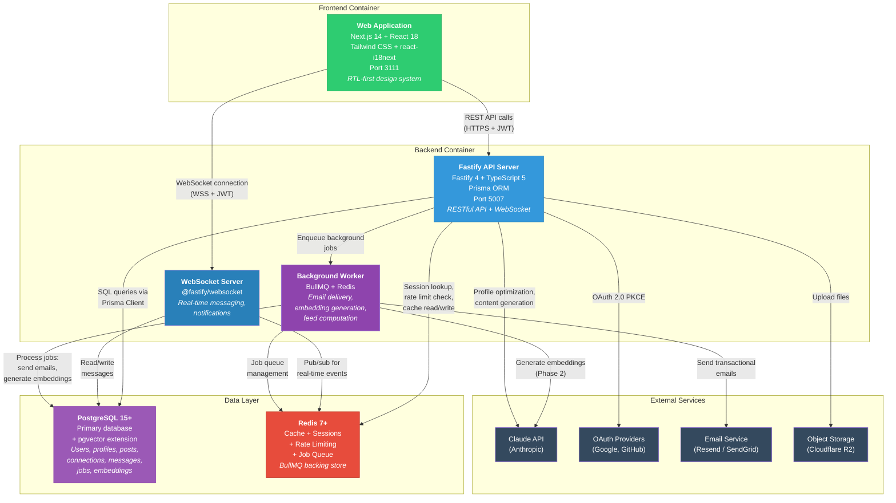
```mermaid
graph TD
    subgraph Client["Frontend Container"]
        WEB["<b>Web Application</b><br/>Next.js 14 + React 18<br/>Tailwind CSS + react-i18next<br/>Port 3111<br/><i>RTL-first design system</i>"]
    end

    subgraph API_CONTAINER["Backend Container"]
        API["<b>Fastify API Server</b><br/>Fastify 4 + TypeScript 5<br/>Prisma ORM<br/>Port 5007<br/><i>RESTful API + WebSocket</i>"]
        WS["<b>WebSocket Server</b><br/>@fastify/websocket<br/><i>Real-time messaging,<br/>notifications</i>"]
        WORKER["<b>Background Worker</b><br/>BullMQ + Redis<br/><i>Email delivery,<br/>embedding generation,<br/>feed computation</i>"]
    end

    subgraph Data["Data Layer"]
        PG["<b>PostgreSQL 15+</b><br/>Primary database<br/>+ pgvector extension<br/><i>Users, profiles, posts,<br/>connections, messages,<br/>jobs, embeddings</i>"]
        REDIS["<b>Redis 7+</b><br/>Cache + Sessions<br/>+ Rate Limiting<br/>+ Job Queue<br/><i>BullMQ backing store</i>"]
    end

    subgraph External["External Services"]
        CLAUDE["Claude API<br/>(Anthropic)"]
        OAUTH["OAuth Providers<br/>(Google, GitHub)"]
        EMAIL["Email Service<br/>(Resend / SendGrid)"]
        R2["Object Storage<br/>(Cloudflare R2)"]
    end

    WEB -->|"REST API calls<br/>(HTTPS + JWT)"| API
    WEB -->|"WebSocket connection<br/>(WSS + JWT)"| WS

    API -->|"SQL queries via<br/>Prisma Client"| PG
    API -->|"Session lookup,<br/>rate limit check,<br/>cache read/write"| REDIS
    API -->|"Enqueue background<br/>jobs"| WORKER

    WS -->|"Read/write<br/>messages"| PG
    WS -->|"Pub/sub for<br/>real-time events"| REDIS

    WORKER -->|"Process jobs:<br/>send emails,<br/>generate embeddings"| PG
    WORKER -->|"Job queue<br/>management"| REDIS
    WORKER -->|"Send transactional<br/>emails"| EMAIL
    WORKER -->|"Generate embeddings<br/>(Phase 2)"| CLAUDE

    API -->|"OAuth 2.0 PKCE"| OAUTH
    API -->|"Profile optimization,<br/>content generation"| CLAUDE
    API -->|"Upload files"| R2

    style WEB fill:#2ECC71,color:#fff,stroke:#27AE60
    style API fill:#3498DB,color:#fff,stroke:#2980B9
    style WS fill:#2980B9,color:#fff
    style WORKER fill:#8E44AD,color:#fff
    style PG fill:#9B59B6,color:#fff,stroke:#8E44AD
    style REDIS fill:#E74C3C,color:#fff,stroke:#C0392B
    style CLAUDE fill:#34495E,color:#fff
    style OAUTH fill:#34495E,color:#fff
    style EMAIL fill:#34495E,color:#fff
    style R2 fill:#34495E,color:#fff
```

### Container Responsibilities

| Container | Technology | Port | Responsibility |
|-----------|-----------|:----:|----------------|
| Web Application | Next.js 14, React 18, Tailwind CSS, react-i18next | 3111 | RTL-first UI, SSR, client-side routing, i18n |
| Fastify API Server | Fastify 4, TypeScript 5, Prisma 5 | 5007 | REST API, authentication, business logic, file uploads |
| WebSocket Server | @fastify/websocket | 5007 (shared) | Real-time messaging, typing indicators, read receipts, SSE notifications |
| Background Worker | BullMQ | -- (internal) | Email delivery, feed computation, embedding generation, connection request expiry |
| PostgreSQL | PostgreSQL 15 + pgvector | 5432 | Persistent data storage, full-text search, vector similarity (Phase 2) |
| Redis | Redis 7 | 6379 | Session store, rate limiting, BullMQ job queue, caching, pub/sub |

---

## 5. C4 Level 3 -- Component Diagram (Fastify API)

The component diagram shows the internal modules of the Fastify API server and how they interact.

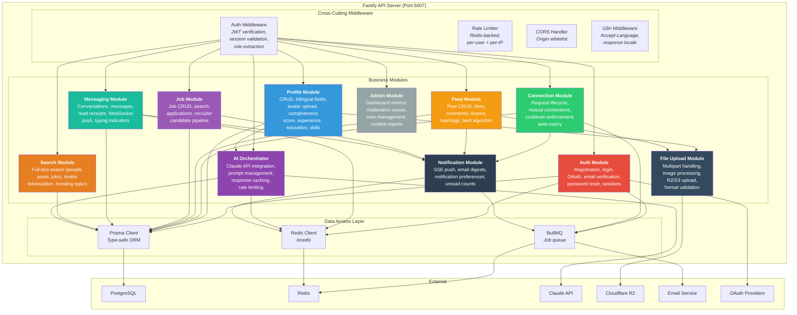
```mermaid
graph TD
    subgraph API["Fastify API Server (Port 5007)"]
        subgraph Middleware["Cross-Cutting Middleware"]
            AUTH_MW["Auth Middleware<br/><i>JWT verification,<br/>session validation,<br/>role extraction</i>"]
            RATE_MW["Rate Limiter<br/><i>Redis-backed,<br/>per-user + per-IP</i>"]
            CORS_MW["CORS Handler<br/><i>Origin whitelist</i>"]
            I18N_MW["i18n Middleware<br/><i>Accept-Language,<br/>response locale</i>"]
        end

        subgraph Modules["Business Modules"]
            AUTH["<b>Auth Module</b><br/>Registration, login,<br/>OAuth, email verification,<br/>password reset, sessions"]
            PROFILE["<b>Profile Module</b><br/>CRUD, bilingual fields,<br/>avatar upload, completeness<br/>score, experience, education, skills"]
            CONNECT["<b>Connection Module</b><br/>Request lifecycle,<br/>mutual connections,<br/>cooldown enforcement,<br/>auto-expiry"]
            FEED["<b>Feed Module</b><br/>Post CRUD, likes,<br/>comments, shares,<br/>hashtags, feed algorithm"]
            JOB["<b>Job Module</b><br/>Job CRUD, search,<br/>applications, recruiter<br/>candidate pipeline"]
            MSG["<b>Messaging Module</b><br/>Conversations, messages,<br/>read receipts, WebSocket<br/>push, typing indicators"]
            SEARCH["<b>Search Module</b><br/>Full-text search (people,<br/>posts, jobs), Arabic<br/>tokenization, trending topics"]
            AI_ORCH["<b>AI Orchestrator</b><br/>Claude API integration,<br/>prompt management,<br/>response caching,<br/>rate limiting"]
            FILE["<b>File Upload Module</b><br/>Multipart handling,<br/>image processing,<br/>R2/S3 upload,<br/>format validation"]
            NOTIF["<b>Notification Module</b><br/>SSE push, email digests,<br/>notification preferences,<br/>unread counts"]
            ADMIN_MOD["<b>Admin Module</b><br/>Dashboard metrics,<br/>moderation queue,<br/>user management,<br/>content reports"]
        end

        subgraph DataAccess["Data Access Layer"]
            PRISMA["Prisma Client<br/><i>Type-safe ORM</i>"]
            REDIS_CLIENT["Redis Client<br/><i>ioredis</i>"]
            BULL["BullMQ<br/><i>Job queue</i>"]
        end
    end

    subgraph External["External"]
        PG_EXT["PostgreSQL"]
        REDIS_EXT["Redis"]
        CLAUDE_EXT["Claude API"]
        R2_EXT["Cloudflare R2"]
        EMAIL_EXT["Email Service"]
        OAUTH_EXT["OAuth Providers"]
    end

    AUTH_MW --> AUTH
    AUTH_MW --> PROFILE
    AUTH_MW --> CONNECT
    AUTH_MW --> FEED
    AUTH_MW --> JOB
    AUTH_MW --> MSG
    AUTH_MW --> SEARCH
    AUTH_MW --> AI_ORCH
    AUTH_MW --> ADMIN_MOD

    AUTH --> PRISMA
    AUTH --> REDIS_CLIENT
    AUTH --> OAUTH_EXT
    AUTH --> BULL

    PROFILE --> PRISMA
    PROFILE --> AI_ORCH
    PROFILE --> FILE

    CONNECT --> PRISMA
    CONNECT --> NOTIF
    CONNECT --> BULL

    FEED --> PRISMA
    FEED --> FILE
    FEED --> NOTIF

    JOB --> PRISMA
    JOB --> NOTIF

    MSG --> PRISMA
    MSG --> REDIS_CLIENT
    MSG --> NOTIF

    SEARCH --> PRISMA

    AI_ORCH --> CLAUDE_EXT
    AI_ORCH --> REDIS_CLIENT
    AI_ORCH --> PRISMA

    FILE --> R2_EXT

    NOTIF --> BULL
    NOTIF --> REDIS_CLIENT

    BULL --> EMAIL_EXT
    BULL --> REDIS_EXT

    PRISMA --> PG_EXT
    REDIS_CLIENT --> REDIS_EXT

    style AUTH fill:#E74C3C,color:#fff
    style PROFILE fill:#3498DB,color:#fff
    style CONNECT fill:#2ECC71,color:#fff
    style FEED fill:#F39C12,color:#fff
    style JOB fill:#9B59B6,color:#fff
    style MSG fill:#1ABC9C,color:#fff
    style SEARCH fill:#E67E22,color:#fff
    style AI_ORCH fill:#8E44AD,color:#fff
    style FILE fill:#34495E,color:#fff
    style NOTIF fill:#2C3E50,color:#fff
    style ADMIN_MOD fill:#95A5A6,color:#fff
```

### Module Responsibility Matrix

| Module | Routes | Key Dependencies | Shared Package Reuse |
|--------|--------|------------------|---------------------|
| Auth | `/api/v1/auth/*` | Prisma, Redis, OAuth providers, Email | `@connectsw/auth` (JWT, refresh tokens, password hashing) |
| Profile | `/api/v1/profiles/*` | Prisma, AI Orchestrator, File Upload | -- |
| Connection | `/api/v1/connections/*` | Prisma, Notification, BullMQ (expiry) | -- |
| Feed | `/api/v1/posts/*` | Prisma, File Upload, Notification | -- |
| Job | `/api/v1/jobs/*` | Prisma, Notification | -- |
| Messaging | `/api/v1/conversations/*`, `/api/v1/messages/*` | Prisma, Redis (pub/sub), WebSocket | -- |
| Search | `/api/v1/search/*` | Prisma (tsvector full-text search) | -- |
| AI Orchestrator | `/api/v1/ai/*` | Claude API, Redis (caching), Prisma | -- |
| File Upload | (internal, no routes) | Cloudflare R2 / AWS S3 | -- |
| Notification | `/api/v1/notifications/*` | BullMQ, Redis (SSE), Email service | `@connectsw/notifications` |
| Admin | `/api/v1/admin/*` | Prisma | `@connectsw/audit` |

---

## 6. Database Schema

### 6.1 Entity-Relationship Diagram


```mermaid
erDiagram
    users ||--o| profiles : "has one"
    users ||--o{ sessions : "has many"
    users ||--o{ oauth_accounts : "has many"
    users ||--o{ connections_sent : "sends"
    users ||--o{ connections_received : "receives"
    users ||--o{ posts : "creates"
    users ||--o{ comments : "writes"
    users ||--o{ likes : "gives"
    users ||--o{ shares : "makes"
    users ||--o{ messages : "sends"
    users ||--o{ conversation_members : "participates in"
    users ||--o{ job_applications : "submits"
    users ||--o{ jobs : "posts"
    users ||--o{ notifications : "receives"
    users ||--o{ content_reports : "submits"
    users ||--o{ hashtag_follows : "follows"
    users ||--o{ notification_preferences : "configures"

    profiles ||--o{ experiences : "contains"
    profiles ||--o{ educations : "contains"
    profiles ||--o{ profile_skills : "lists"

    skills ||--o{ profile_skills : "assigned to"

    posts ||--o{ comments : "has"
    posts ||--o{ likes : "has"
    posts ||--o{ shares : "has"
    posts ||--o{ post_images : "has"
    posts ||--o{ post_hashtags : "tagged with"
    posts ||--o| posts : "shared from"

    hashtags ||--o{ post_hashtags : "used in"
    hashtags ||--o{ hashtag_follows : "followed by"

    conversations ||--o{ conversation_members : "includes"
    conversations ||--o{ messages : "contains"

    jobs ||--o{ job_applications : "receives"
    jobs }o--o| companies : "belongs to"

    companies ||--o{ jobs : "lists"

    content_reports }o--|| posts : "reports post"
    content_reports }o--o| comments : "reports comment"

    users {
        uuid id PK
        varchar email UK "NOT NULL, max 255"
        varchar password_hash "NULLABLE (OAuth users)"
        varchar display_name "NOT NULL, max 100"
        enum role "user | recruiter | admin, DEFAULT user"
        boolean email_verified "DEFAULT false"
        varchar verification_token "NULLABLE"
        timestamp verification_expires "NULLABLE"
        varchar reset_token "NULLABLE"
        timestamp reset_token_expires "NULLABLE"
        enum language_preference "ar | en, DEFAULT ar"
        enum status "active | suspended | deactivated | deleted, DEFAULT active"
        timestamp deletion_requested_at "NULLABLE"
        timestamp last_login_at "NULLABLE"
        timestamp created_at "DEFAULT NOW()"
        timestamp updated_at "AUTO-UPDATE"
    }

    profiles {
        uuid id PK
        uuid user_id FK "UNIQUE"
        varchar headline_ar "NULLABLE, max 220"
        varchar headline_en "NULLABLE, max 220"
        text summary_ar "NULLABLE"
        text summary_en "NULLABLE"
        varchar avatar_url "NULLABLE, max 500"
        varchar location "NULLABLE, max 100"
        varchar website "NULLABLE, max 255"
        integer completeness_score "DEFAULT 0, CHECK 0-100"
        vector embedding "NULLABLE, dimension 1536 (Phase 2)"
        timestamp created_at "DEFAULT NOW()"
        timestamp updated_at "AUTO-UPDATE"
    }

    experiences {
        uuid id PK
        uuid profile_id FK
        varchar company "NOT NULL, max 200"
        varchar title "NOT NULL, max 200"
        varchar location "NULLABLE, max 100"
        text description "NULLABLE"
        date start_date "NOT NULL"
        date end_date "NULLABLE"
        boolean is_current "DEFAULT false"
        integer sort_order "DEFAULT 0"
        timestamp created_at "DEFAULT NOW()"
    }

    educations {
        uuid id PK
        uuid profile_id FK
        varchar institution "NOT NULL, max 200"
        varchar degree "NULLABLE, max 200"
        varchar field_of_study "NULLABLE, max 200"
        integer start_year "NOT NULL"
        integer end_year "NULLABLE"
        timestamp created_at "DEFAULT NOW()"
    }

    skills {
        uuid id PK
        varchar name_en "NOT NULL, UNIQUE, max 100"
        varchar name_ar "NULLABLE, max 100"
        varchar category "NULLABLE, max 50"
        timestamp created_at "DEFAULT NOW()"
    }

    profile_skills {
        uuid id PK
        uuid profile_id FK
        uuid skill_id FK
        integer endorsement_count "DEFAULT 0"
        timestamp created_at "DEFAULT NOW()"
    }

    oauth_accounts {
        uuid id PK
        uuid user_id FK
        varchar provider "NOT NULL (google | github)"
        varchar provider_account_id "NOT NULL"
        varchar access_token "NULLABLE"
        varchar refresh_token "NULLABLE"
        timestamp expires_at "NULLABLE"
        timestamp created_at "DEFAULT NOW()"
    }

    sessions {
        uuid id PK
        uuid user_id FK
        varchar refresh_token_hash "NOT NULL"
        varchar ip_address "NULLABLE"
        varchar user_agent "NULLABLE"
        timestamp expires_at "NOT NULL"
        timestamp created_at "DEFAULT NOW()"
    }

    connections {
        uuid id PK
        uuid sender_id FK
        uuid receiver_id FK
        enum status "pending | accepted | rejected | withdrawn | expired, DEFAULT pending"
        varchar message "NULLABLE, max 300"
        timestamp responded_at "NULLABLE"
        timestamp cooldown_until "NULLABLE"
        timestamp expires_at "NULLABLE"
        timestamp created_at "DEFAULT NOW()"
    }

    posts {
        uuid id PK
        uuid author_id FK
        text content "NOT NULL, max 3000"
        enum text_direction "rtl | ltr | auto, DEFAULT auto"
        uuid shared_post_id FK "NULLABLE"
        text share_comment "NULLABLE, max 1000"
        integer like_count "DEFAULT 0"
        integer comment_count "DEFAULT 0"
        integer share_count "DEFAULT 0"
        boolean is_deleted "DEFAULT false"
        timestamp edited_at "NULLABLE"
        tsvector search_vector "generated"
        timestamp created_at "DEFAULT NOW()"
        timestamp updated_at "AUTO-UPDATE"
    }

    post_images {
        uuid id PK
        uuid post_id FK
        varchar url "NOT NULL, max 500"
        varchar alt_text "NULLABLE, max 200"
        integer width "NOT NULL"
        integer height "NOT NULL"
        integer sort_order "DEFAULT 0"
        timestamp created_at "DEFAULT NOW()"
    }

    comments {
        uuid id PK
        uuid post_id FK
        uuid author_id FK
        text content "NOT NULL, max 1000"
        enum text_direction "rtl | ltr | auto, DEFAULT auto"
        boolean is_deleted "DEFAULT false"
        timestamp created_at "DEFAULT NOW()"
    }

    likes {
        uuid id PK
        uuid post_id FK
        uuid user_id FK
        timestamp created_at "DEFAULT NOW()"
    }

    shares {
        uuid id PK
        uuid post_id FK
        uuid user_id FK
        uuid shared_post_id FK "the resulting shared post"
        timestamp created_at "DEFAULT NOW()"
    }

    hashtags {
        uuid id PK
        varchar tag "NOT NULL, UNIQUE, max 100"
        integer post_count "DEFAULT 0"
        timestamp created_at "DEFAULT NOW()"
    }

    post_hashtags {
        uuid id PK
        uuid post_id FK
        uuid hashtag_id FK
        timestamp created_at "DEFAULT NOW()"
    }

    hashtag_follows {
        uuid id PK
        uuid user_id FK
        uuid hashtag_id FK
        timestamp created_at "DEFAULT NOW()"
    }

    conversations {
        uuid id PK
        timestamp last_message_at "NULLABLE"
        timestamp created_at "DEFAULT NOW()"
    }

    conversation_members {
        uuid id PK
        uuid conversation_id FK
        uuid user_id FK
        timestamp last_read_at "NULLABLE"
        boolean notifications_muted "DEFAULT false"
        timestamp created_at "DEFAULT NOW()"
    }

    messages {
        uuid id PK
        uuid conversation_id FK
        uuid sender_id FK
        text content "NOT NULL, max 5000"
        enum text_direction "rtl | ltr | auto, DEFAULT auto"
        timestamp read_at "NULLABLE"
        boolean is_deleted "DEFAULT false"
        timestamp created_at "DEFAULT NOW()"
    }

    jobs {
        uuid id PK
        uuid posted_by FK
        uuid company_id FK "NULLABLE"
        varchar title "NOT NULL, max 200"
        text description "NOT NULL"
        text requirements "NULLABLE"
        varchar location "NOT NULL, max 100"
        boolean is_remote "DEFAULT false"
        enum work_type "onsite | hybrid | remote, DEFAULT onsite"
        enum experience_level "entry | mid | senior | lead | executive"
        integer salary_min "NULLABLE"
        integer salary_max "NULLABLE"
        varchar salary_currency "DEFAULT USD, max 3"
        enum language "ar | en | bilingual, DEFAULT bilingual"
        enum status "draft | active | closed | archived, DEFAULT draft"
        integer application_count "DEFAULT 0"
        tsvector search_vector "generated"
        vector embedding "NULLABLE, dimension 1536 (Phase 2)"
        timestamp created_at "DEFAULT NOW()"
        timestamp expires_at "NULLABLE"
        timestamp updated_at "AUTO-UPDATE"
    }

    job_applications {
        uuid id PK
        uuid job_id FK
        uuid applicant_id FK
        text cover_note "NULLABLE, max 500"
        enum status "applied | reviewed | shortlisted | rejected, DEFAULT applied"
        timestamp reviewed_at "NULLABLE"
        timestamp created_at "DEFAULT NOW()"
    }

    companies {
        uuid id PK
        uuid created_by FK
        varchar name "NOT NULL, max 200"
        varchar logo_url "NULLABLE, max 500"
        text description_ar "NULLABLE"
        text description_en "NULLABLE"
        varchar industry "NULLABLE, max 100"
        varchar size "NULLABLE, max 50"
        varchar headquarters "NULLABLE, max 100"
        varchar website "NULLABLE, max 255"
        timestamp created_at "DEFAULT NOW()"
        timestamp updated_at "AUTO-UPDATE"
    }

    notifications {
        uuid id PK
        uuid user_id FK
        enum type "connection_request | connection_accepted | message | like | comment | share | job_application | mention | system"
        varchar title "NOT NULL, max 200"
        text message "NULLABLE"
        uuid reference_id "NULLABLE"
        varchar reference_type "NULLABLE"
        boolean is_read "DEFAULT false"
        timestamp read_at "NULLABLE"
        timestamp created_at "DEFAULT NOW()"
    }

    notification_preferences {
        uuid id PK
        uuid user_id FK "UNIQUE"
        boolean connection_requests "DEFAULT true"
        boolean messages "DEFAULT true"
        boolean post_likes "DEFAULT true"
        boolean post_comments "DEFAULT true"
        boolean job_recommendations "DEFAULT true"
        enum email_digest "off | daily | weekly, DEFAULT weekly"
        boolean send_read_receipts "DEFAULT true"
        timestamp updated_at "AUTO-UPDATE"
    }

    content_reports {
        uuid id PK
        uuid reporter_id FK
        uuid post_id FK "NULLABLE"
        uuid comment_id FK "NULLABLE"
        enum category "spam | harassment | misinformation | hate_speech | impersonation | other"
        text details "NULLABLE, max 500"
        enum status "pending | reviewed | dismissed | actioned, DEFAULT pending"
        uuid reviewed_by FK "NULLABLE"
        text action_taken "NULLABLE"
        timestamp reviewed_at "NULLABLE"
        timestamp created_at "DEFAULT NOW()"
    }

    audit_logs {
        uuid id PK
        varchar actor "NOT NULL"
        varchar action "NOT NULL"
        varchar resource_type "NOT NULL"
        varchar resource_id "NOT NULL"
        jsonb details "NULLABLE"
        varchar ip "NULLABLE"
        varchar user_agent "NULLABLE"
        timestamp timestamp "DEFAULT NOW()"
    }
```

### 6.2 Key Indexes

| Table | Index | Type | Purpose |
|-------|-------|------|---------|
| `users` | `email` | UNIQUE | Login lookup |
| `users` | `status, created_at` | BTREE | Admin user listing |
| `profiles` | `user_id` | UNIQUE | Profile lookup |
| `profiles` | `embedding` | IVFFlat (Phase 2) | Vector similarity search |
| `connections` | `sender_id, receiver_id` | UNIQUE | Prevent duplicate requests |
| `connections` | `receiver_id, status` | BTREE | Pending request lookup |
| `connections` | `status, expires_at` | BTREE | Expiry job processing |
| `posts` | `author_id, created_at DESC` | BTREE | User post listing |
| `posts` | `search_vector` | GIN | Full-text search |
| `posts` | `created_at DESC` | BTREE | Feed ordering |
| `likes` | `post_id, user_id` | UNIQUE | Prevent double-likes |
| `comments` | `post_id, created_at DESC` | BTREE | Comment listing |
| `messages` | `conversation_id, created_at DESC` | BTREE | Message history |
| `messages` | `sender_id, read_at` | BTREE | Unread count |
| `jobs` | `search_vector` | GIN | Full-text search |
| `jobs` | `status, created_at DESC` | BTREE | Active job listing |
| `job_applications` | `job_id, applicant_id` | UNIQUE | Prevent duplicate applications |
| `notifications` | `user_id, is_read, created_at DESC` | BTREE | Notification listing |
| `hashtags` | `tag` | UNIQUE | Hashtag lookup |
| `post_hashtags` | `post_id, hashtag_id` | UNIQUE | Prevent duplicate tags |
| `audit_logs` | `actor` | BTREE | Audit trail queries |
| `audit_logs` | `action` | BTREE | Audit trail queries |
| `audit_logs` | `timestamp` | BTREE | Date range queries |

### 6.3 Full-Text Search Configuration

PostgreSQL full-text search is used for MVP-phase search. Arabic search is handled via `simple` dictionary (which performs whitespace-based tokenization without stemming) since PostgreSQL does not ship an Arabic stemmer. Phase 2 will evaluate dedicated Arabic search solutions.

```sql
-- Post search vector (auto-generated via trigger)
CREATE OR REPLACE FUNCTION posts_search_vector_update() RETURNS trigger AS $$
BEGIN
  NEW.search_vector :=
    setweight(to_tsvector('simple', coalesce(NEW.content, '')), 'A');
  RETURN NEW;
END;
$$ LANGUAGE plpgsql;

-- Job search vector
CREATE OR REPLACE FUNCTION jobs_search_vector_update() RETURNS trigger AS $$
BEGIN
  NEW.search_vector :=
    setweight(to_tsvector('english', coalesce(NEW.title, '')), 'A') ||
    setweight(to_tsvector('simple', coalesce(NEW.description, '')), 'B') ||
    setweight(to_tsvector('simple', coalesce(NEW.requirements, '')), 'C');
  RETURN NEW;
END;
$$ LANGUAGE plpgsql;
```

---

## 7. API Architecture

### 7.1 Route Structure

All API routes are versioned under `/api/v1/` and organized by module.

```
/api/v1/
  /auth/
    POST   /register              # Email registration
    POST   /login                 # Email login
    POST   /logout                # End session
    POST   /refresh               # Refresh JWT token
    GET    /verify/:token         # Email verification
    POST   /forgot-password       # Request password reset
    POST   /reset-password        # Reset with token
    GET    /oauth/google          # Initiate Google OAuth
    GET    /oauth/github          # Initiate GitHub OAuth
    GET    /oauth/callback        # OAuth callback handler
  /profiles/
    GET    /me                    # Get own profile
    PATCH  /me                    # Update own profile
    POST   /me/avatar             # Upload avatar
    POST   /me/experience         # Add experience
    PATCH  /me/experience/:id     # Update experience
    DELETE /me/experience/:id     # Delete experience
    POST   /me/education          # Add education
    PATCH  /me/education/:id      # Update education
    DELETE /me/education/:id      # Delete education
    PUT    /me/skills             # Update skills list
    GET    /:id                   # Get user profile
  /connections/
    POST   /request               # Send connection request
    POST   /:id/accept            # Accept request
    POST   /:id/reject            # Reject request
    DELETE /:id/withdraw          # Withdraw request
    DELETE /:id                   # Remove connection
    GET    /                      # List my connections
    GET    /pending               # List pending requests
    GET    /mutual/:userId        # Mutual connections
  /posts/
    POST   /                      # Create post
    GET    /feed                  # Get news feed
    GET    /:id                   # Get single post
    DELETE /:id                   # Delete own post
    POST   /:id/like              # Like post
    DELETE /:id/like              # Unlike post
    POST   /:id/comments          # Add comment
    GET    /:id/comments          # List comments
    POST   /:id/share             # Share post
    POST   /:id/report            # Report post
  /jobs/
    POST   /                      # Create job (recruiter)
    GET    /                      # Search/list jobs
    GET    /:id                   # Get job details
    PATCH  /:id                   # Update job (owner)
    DELETE /:id                   # Close job (owner)
    POST   /:id/apply             # Apply to job
    GET    /:id/applications      # List applicants (owner)
  /conversations/
    GET    /                      # List conversations
    GET    /:id/messages          # Get messages
  /messages/
    POST   /                      # Send message
    PATCH  /:id/read              # Mark as read
  /search/
    GET    /                      # Global search (?q=&type=)
    GET    /trending              # Trending topics
  /notifications/
    GET    /                      # List notifications
    PATCH  /:id/read              # Mark as read
    PATCH  /read-all              # Mark all as read
    GET    /unread-count          # Unread count
  /ai/
    POST   /profile/optimize      # AI profile optimization
  /admin/
    GET    /dashboard             # Dashboard metrics
    GET    /reports               # Content reports queue
    POST   /reports/:id/action    # Take action on report
    GET    /users                 # User management list
    PATCH  /users/:id             # Update user status/role
  /settings/
    GET    /notifications         # Get notification prefs
    PATCH  /notifications         # Update notification prefs
    GET    /account               # Get account settings
    PATCH  /account               # Update account settings
    POST   /account/delete        # Request account deletion
    POST   /account/export        # Request data export
```

### 7.2 Authentication Architecture

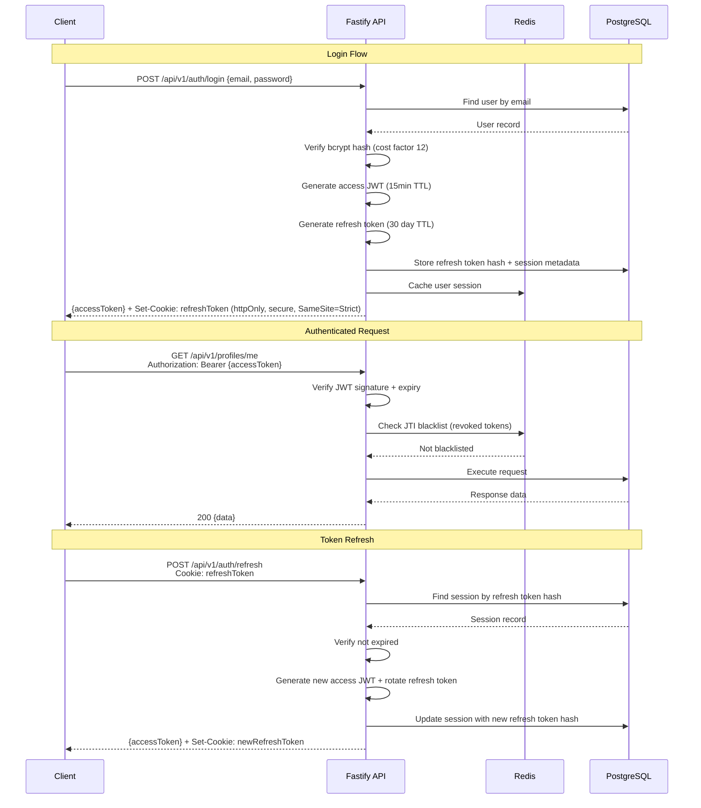
```mermaid
sequenceDiagram
    participant C as Client
    participant API as Fastify API
    participant R as Redis
    participant DB as PostgreSQL

    Note over C,DB: Login Flow
    C->>API: POST /api/v1/auth/login {email, password}
    API->>DB: Find user by email
    DB-->>API: User record
    API->>API: Verify bcrypt hash (cost factor 12)
    API->>API: Generate access JWT (15min TTL)
    API->>API: Generate refresh token (30 day TTL)
    API->>DB: Store refresh token hash + session metadata
    API->>R: Cache user session
    API-->>C: {accessToken} + Set-Cookie: refreshToken (httpOnly, secure, SameSite=Strict)

    Note over C,DB: Authenticated Request
    C->>API: GET /api/v1/profiles/me<br/>Authorization: Bearer {accessToken}
    API->>API: Verify JWT signature + expiry
    API->>R: Check JTI blacklist (revoked tokens)
    R-->>API: Not blacklisted
    API->>DB: Execute request
    DB-->>API: Response data
    API-->>C: 200 {data}

    Note over C,DB: Token Refresh
    C->>API: POST /api/v1/auth/refresh<br/>Cookie: refreshToken
    API->>DB: Find session by refresh token hash
    DB-->>API: Session record
    API->>API: Verify not expired
    API->>API: Generate new access JWT + rotate refresh token
    API->>DB: Update session with new refresh token hash
    API-->>C: {accessToken} + Set-Cookie: newRefreshToken
```

**JWT Token Structure:**

```json
{
  "sub": "user-uuid",
  "email": "ahmed@example.com",
  "role": "user",
  "jti": "unique-token-id",
  "iat": 1740000000,
  "exp": 1740000900
}
```

| Token | Storage | TTL | Purpose |
|-------|---------|-----|---------|
| Access Token | In-memory (frontend TokenManager) | 15 minutes | API authorization |
| Refresh Token | httpOnly Secure cookie | 30 days (rolling) | Token renewal |

### 7.3 Rate Limiting Strategy

Rate limiting uses Redis-backed sliding window counters via `@fastify/rate-limit` with the `RedisRateLimitStore` from `@connectsw/shared`.

| Scope | Limit | Window | Key |
|-------|-------|--------|-----|
| Global (authenticated) | 100 requests | 1 minute | `rl:user:{userId}` |
| Global (unauthenticated) | 20 requests | 1 minute | `rl:ip:{ip}` |
| Login | 5 attempts | 1 minute | `rl:login:{ip}` |
| Registration | 3 accounts | 1 hour | `rl:register:{ip}` |
| Connection requests | 50 requests | 1 day | `rl:connect:{userId}` |
| Posts | 10 posts | 1 hour | `rl:post:{userId}` |
| AI optimization | 5 calls | 1 day | `rl:ai:{userId}` |

### 7.4 Pagination Patterns

| Context | Strategy | Rationale |
|---------|----------|-----------|
| News Feed | **Cursor-based** (keyset pagination using `created_at + id`) | Infinite scroll; no duplicate/missing posts when new content is inserted |
| Messages | **Cursor-based** (keyset using `created_at + id`, reverse) | Conversation history loads from newest to oldest |
| Search Results | **Offset-based** (`page` + `limit`) | Users navigate to specific pages; dataset is relatively stable |
| Connection List | **Offset-based** (`page` + `limit`, max 100) | Paginated grid/list with page numbers |
| Admin Lists | **Offset-based** (`page` + `limit`) | Tabular data with page navigation |

**Cursor-based pagination response:**

```json
{
  "success": true,
  "data": [...],
  "meta": {
    "cursor": "eyJjcmVhdGVkQXQiOiIyMDI2LTAyLTIwVDEyOjAwOjAwWiIsImlkIjoiYWJjMTIzIn0=",
    "hasMore": true,
    "count": 10
  }
}
```

**Offset-based pagination response:**

```json
{
  "success": true,
  "data": [...],
  "meta": {
    "page": 1,
    "limit": 20,
    "total": 150,
    "totalPages": 8
  }
}
```

### 7.5 Error Response Format

All API errors follow a consistent envelope:

```json
{
  "success": false,
  "error": {
    "code": "VALIDATION_ERROR",
    "message": "Validation failed",
    "details": [
      {
        "field": "email",
        "message": "Must be a valid email address"
      }
    ]
  }
}
```

| HTTP Status | Error Code | When |
|:-----------:|-----------|------|
| 400 | `BAD_REQUEST` | Malformed request |
| 401 | `UNAUTHORIZED` | Missing or invalid token |
| 403 | `FORBIDDEN` | Insufficient permissions |
| 404 | `NOT_FOUND` | Resource does not exist |
| 409 | `CONFLICT` | Duplicate resource (e.g., already connected) |
| 422 | `VALIDATION_ERROR` | Input validation failure (with field details) |
| 429 | `RATE_LIMITED` | Rate limit exceeded (includes `Retry-After` header) |
| 500 | `INTERNAL_ERROR` | Unexpected server error |

### 7.6 API Versioning Strategy

- **URL-based versioning**: All routes prefixed with `/api/v1/`
- **Version bumping**: `/api/v2/` introduced only for breaking changes
- **Deprecation**: `Sunset` header + 6-month deprecation window
- **Phase 1 (MVP)**: Only v1 exists
- **Backwards compatibility**: New fields added without breaking existing clients; removed fields deprecated first

---

## 8. Sequence Diagrams

### 8.1 User Registration + Email Verification

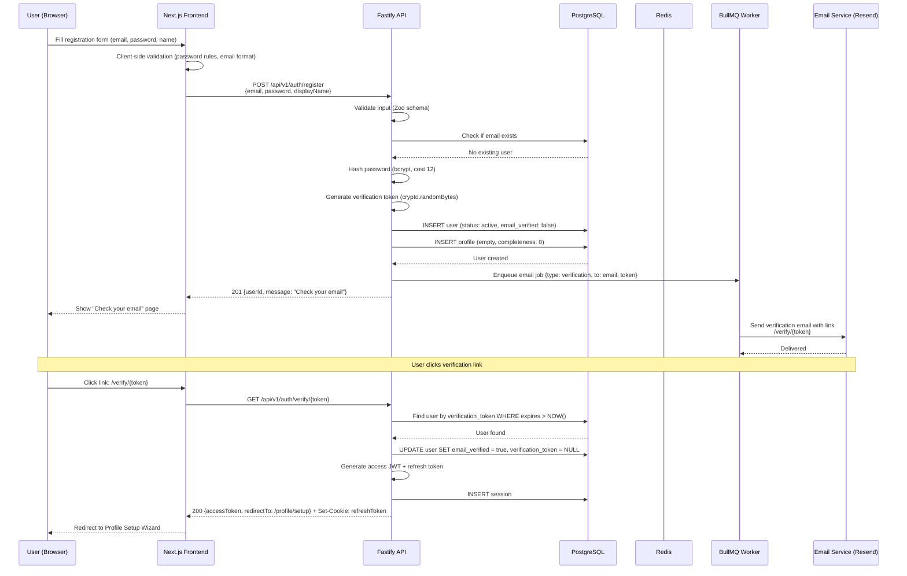
```mermaid
sequenceDiagram
    participant U as User (Browser)
    participant FE as Next.js Frontend
    participant API as Fastify API
    participant DB as PostgreSQL
    participant R as Redis
    participant Q as BullMQ Worker
    participant E as Email Service (Resend)

    U->>FE: Fill registration form (email, password, name)
    FE->>FE: Client-side validation (password rules, email format)
    FE->>API: POST /api/v1/auth/register<br/>{email, password, displayName}

    API->>API: Validate input (Zod schema)
    API->>DB: Check if email exists
    DB-->>API: No existing user

    API->>API: Hash password (bcrypt, cost 12)
    API->>API: Generate verification token (crypto.randomBytes)
    API->>DB: INSERT user (status: active, email_verified: false)
    API->>DB: INSERT profile (empty, completeness: 0)
    DB-->>API: User created

    API->>Q: Enqueue email job {type: verification, to: email, token}
    API-->>FE: 201 {userId, message: "Check your email"}
    FE-->>U: Show "Check your email" page

    Q->>E: Send verification email with link<br/>/verify/{token}
    E-->>Q: Delivered

    Note over U,E: User clicks verification link

    U->>FE: Click link: /verify/{token}
    FE->>API: GET /api/v1/auth/verify/{token}
    API->>DB: Find user by verification_token WHERE expires > NOW()
    DB-->>API: User found

    API->>DB: UPDATE user SET email_verified = true, verification_token = NULL
    API->>API: Generate access JWT + refresh token
    API->>DB: INSERT session
    API-->>FE: 200 {accessToken, redirectTo: /profile/setup} + Set-Cookie: refreshToken

    FE-->>U: Redirect to Profile Setup Wizard
```

### 8.2 OAuth Login (Google)

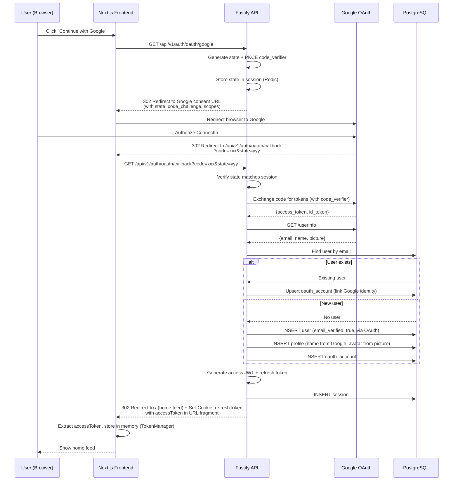
```mermaid
sequenceDiagram
    participant U as User (Browser)
    participant FE as Next.js Frontend
    participant API as Fastify API
    participant G as Google OAuth
    participant DB as PostgreSQL

    U->>FE: Click "Continue with Google"
    FE->>API: GET /api/v1/auth/oauth/google
    API->>API: Generate state + PKCE code_verifier
    API->>API: Store state in session (Redis)
    API-->>FE: 302 Redirect to Google consent URL<br/>(with state, code_challenge, scopes)

    FE->>G: Redirect browser to Google
    U->>G: Authorize ConnectIn
    G-->>FE: 302 Redirect to /api/v1/auth/oauth/callback<br/>?code=xxx&state=yyy

    FE->>API: GET /api/v1/auth/oauth/callback?code=xxx&state=yyy
    API->>API: Verify state matches session
    API->>G: Exchange code for tokens (with code_verifier)
    G-->>API: {access_token, id_token}
    API->>G: GET /userinfo
    G-->>API: {email, name, picture}

    API->>DB: Find user by email
    alt User exists
        DB-->>API: Existing user
        API->>DB: Upsert oauth_account (link Google identity)
    else New user
        DB-->>API: No user
        API->>DB: INSERT user (email_verified: true, via OAuth)
        API->>DB: INSERT profile (name from Google, avatar from picture)
        API->>DB: INSERT oauth_account
    end

    API->>API: Generate access JWT + refresh token
    API->>DB: INSERT session
    API-->>FE: 302 Redirect to / (home feed) + Set-Cookie: refreshToken<br/>with accessToken in URL fragment
    FE->>FE: Extract accessToken, store in memory (TokenManager)
    FE-->>U: Show home feed
```

### 8.3 AI Profile Optimization

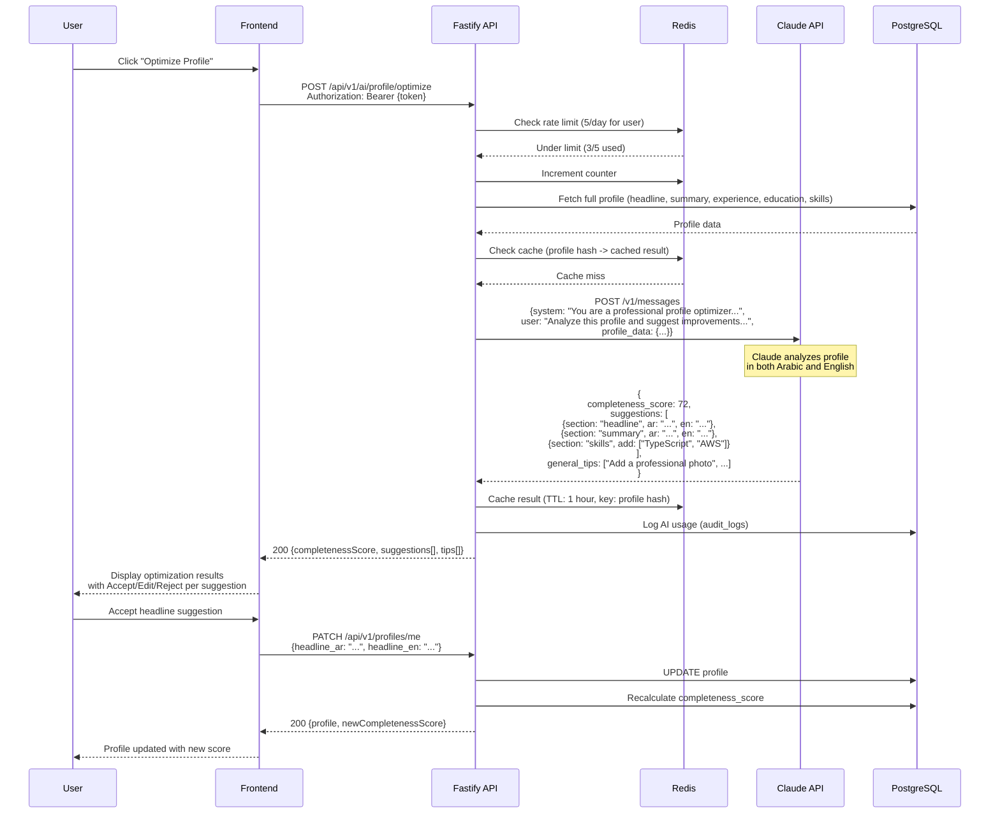
```mermaid
sequenceDiagram
    participant U as User
    participant FE as Frontend
    participant API as Fastify API
    participant R as Redis
    participant AI as Claude API
    participant DB as PostgreSQL

    U->>FE: Click "Optimize Profile"
    FE->>API: POST /api/v1/ai/profile/optimize<br/>Authorization: Bearer {token}

    API->>R: Check rate limit (5/day for user)
    R-->>API: Under limit (3/5 used)
    API->>R: Increment counter

    API->>DB: Fetch full profile (headline, summary, experience, education, skills)
    DB-->>API: Profile data

    API->>R: Check cache (profile hash -> cached result)
    R-->>API: Cache miss

    API->>AI: POST /v1/messages<br/>{system: "You are a professional profile optimizer...",<br/>user: "Analyze this profile and suggest improvements...",<br/>profile_data: {...}}

    Note over AI: Claude analyzes profile<br/>in both Arabic and English

    AI-->>API: {<br/>  completeness_score: 72,<br/>  suggestions: [<br/>    {section: "headline", ar: "...", en: "..."},<br/>    {section: "summary", ar: "...", en: "..."},<br/>    {section: "skills", add: ["TypeScript", "AWS"]}<br/>  ],<br/>  general_tips: ["Add a professional photo", ...]<br/>}

    API->>R: Cache result (TTL: 1 hour, key: profile hash)
    API->>DB: Log AI usage (audit_logs)

    API-->>FE: 200 {completenessScore, suggestions[], tips[]}
    FE-->>U: Display optimization results<br/>with Accept/Edit/Reject per suggestion

    U->>FE: Accept headline suggestion
    FE->>API: PATCH /api/v1/profiles/me<br/>{headline_ar: "...", headline_en: "..."}
    API->>DB: UPDATE profile
    API->>DB: Recalculate completeness_score
    API-->>FE: 200 {profile, newCompletenessScore}
    FE-->>U: Profile updated with new score
```

### 8.4 Connection Request Lifecycle

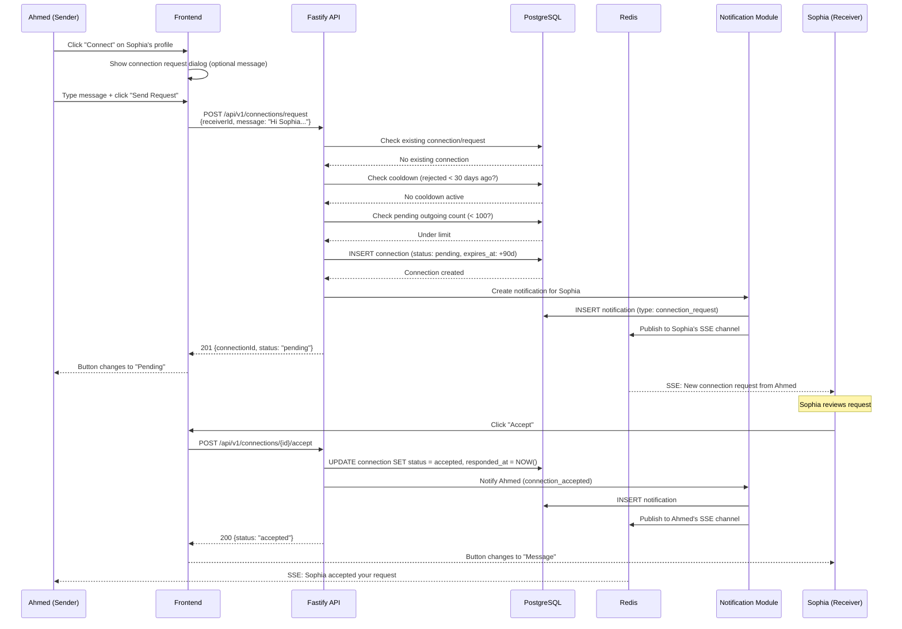
```mermaid
sequenceDiagram
    participant A as Ahmed (Sender)
    participant FE as Frontend
    participant API as Fastify API
    participant DB as PostgreSQL
    participant R as Redis
    participant N as Notification Module
    participant S as Sophia (Receiver)

    A->>FE: Click "Connect" on Sophia's profile
    FE->>FE: Show connection request dialog (optional message)
    A->>FE: Type message + click "Send Request"
    FE->>API: POST /api/v1/connections/request<br/>{receiverId, message: "Hi Sophia..."}

    API->>DB: Check existing connection/request
    DB-->>API: No existing connection
    API->>DB: Check cooldown (rejected < 30 days ago?)
    DB-->>API: No cooldown active
    API->>DB: Check pending outgoing count (< 100?)
    DB-->>API: Under limit

    API->>DB: INSERT connection (status: pending, expires_at: +90d)
    DB-->>API: Connection created

    API->>N: Create notification for Sophia
    N->>DB: INSERT notification (type: connection_request)
    N->>R: Publish to Sophia's SSE channel

    API-->>FE: 201 {connectionId, status: "pending"}
    FE-->>A: Button changes to "Pending"

    R-->>S: SSE: New connection request from Ahmed

    Note over S: Sophia reviews request

    S->>FE: Click "Accept"
    FE->>API: POST /api/v1/connections/{id}/accept

    API->>DB: UPDATE connection SET status = accepted, responded_at = NOW()
    API->>N: Notify Ahmed (connection_accepted)
    N->>DB: INSERT notification
    N->>R: Publish to Ahmed's SSE channel

    API-->>FE: 200 {status: "accepted"}
    FE-->>S: Button changes to "Message"

    R-->>A: SSE: Sophia accepted your request
```

### 8.5 Real-Time Messaging via WebSocket

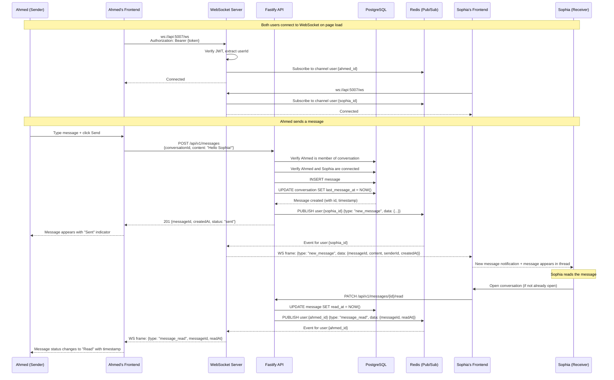
```mermaid
sequenceDiagram
    participant A as Ahmed (Sender)
    participant FE_A as Ahmed's Frontend
    participant WS as WebSocket Server
    participant API as Fastify API
    participant DB as PostgreSQL
    participant R as Redis (Pub/Sub)
    participant FE_S as Sophia's Frontend
    participant S as Sophia (Receiver)

    Note over A,S: Both users connect to WebSocket on page load

    FE_A->>WS: ws://api:5007/ws<br/>Authorization: Bearer {token}
    WS->>WS: Verify JWT, extract userId
    WS->>R: Subscribe to channel user:{ahmed_id}
    WS-->>FE_A: Connected

    FE_S->>WS: ws://api:5007/ws
    WS->>R: Subscribe to channel user:{sophia_id}
    WS-->>FE_S: Connected

    Note over A,S: Ahmed sends a message

    A->>FE_A: Type message + click Send
    FE_A->>API: POST /api/v1/messages<br/>{conversationId, content: "Hello Sophia!"}

    API->>DB: Verify Ahmed is member of conversation
    API->>DB: Verify Ahmed and Sophia are connected
    API->>DB: INSERT message
    API->>DB: UPDATE conversation SET last_message_at = NOW()
    DB-->>API: Message created (with id, timestamp)

    API->>R: PUBLISH user:{sophia_id} {type: "new_message", data: {...}}

    API-->>FE_A: 201 {messageId, createdAt, status: "sent"}
    FE_A-->>A: Message appears with "Sent" indicator

    R-->>WS: Event for user:{sophia_id}
    WS-->>FE_S: WS frame: {type: "new_message", data: {messageId, content, senderId, createdAt}}
    FE_S-->>S: New message notification + message appears in thread

    Note over S: Sophia reads the message

    S->>FE_S: Open conversation (if not already open)
    FE_S->>API: PATCH /api/v1/messages/{id}/read
    API->>DB: UPDATE message SET read_at = NOW()
    API->>R: PUBLISH user:{ahmed_id} {type: "message_read", data: {messageId, readAt}}

    R-->>WS: Event for user:{ahmed_id}
    WS-->>FE_A: WS frame: {type: "message_read", messageId, readAt}
    FE_A-->>A: Message status changes to "Read" with timestamp
```

### 8.6 Job Application Flow

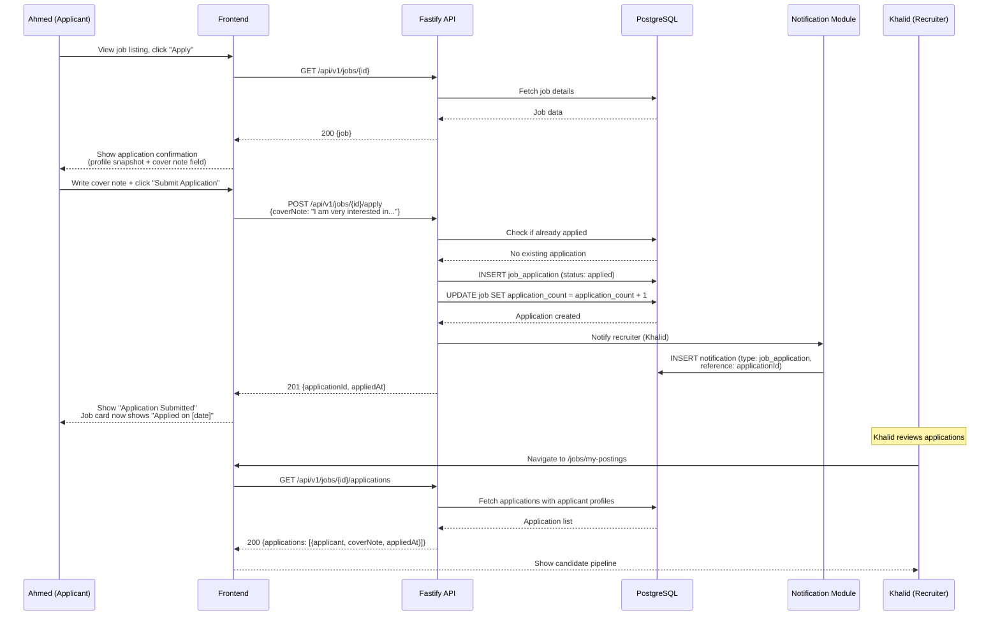
```mermaid
sequenceDiagram
    participant A as Ahmed (Applicant)
    participant FE as Frontend
    participant API as Fastify API
    participant DB as PostgreSQL
    participant N as Notification Module
    participant K as Khalid (Recruiter)

    A->>FE: View job listing, click "Apply"
    FE->>API: GET /api/v1/jobs/{id}
    API->>DB: Fetch job details
    DB-->>API: Job data
    API-->>FE: 200 {job}

    FE-->>A: Show application confirmation<br/>(profile snapshot + cover note field)

    A->>FE: Write cover note + click "Submit Application"
    FE->>API: POST /api/v1/jobs/{id}/apply<br/>{coverNote: "I am very interested in..."}

    API->>DB: Check if already applied
    DB-->>API: No existing application

    API->>DB: INSERT job_application (status: applied)
    API->>DB: UPDATE job SET application_count = application_count + 1
    DB-->>API: Application created

    API->>N: Notify recruiter (Khalid)
    N->>DB: INSERT notification (type: job_application,<br/>reference: applicationId)

    API-->>FE: 201 {applicationId, appliedAt}
    FE-->>A: Show "Application Submitted"<br/>Job card now shows "Applied on [date]"

    Note over K: Khalid reviews applications

    K->>FE: Navigate to /jobs/my-postings
    FE->>API: GET /api/v1/jobs/{id}/applications
    API->>DB: Fetch applications with applicant profiles
    DB-->>API: Application list
    API-->>FE: 200 {applications: [{applicant, coverNote, appliedAt}]}
    FE-->>K: Show candidate pipeline
```

---

## 9. State Diagrams

### 9.1 Connection Request States

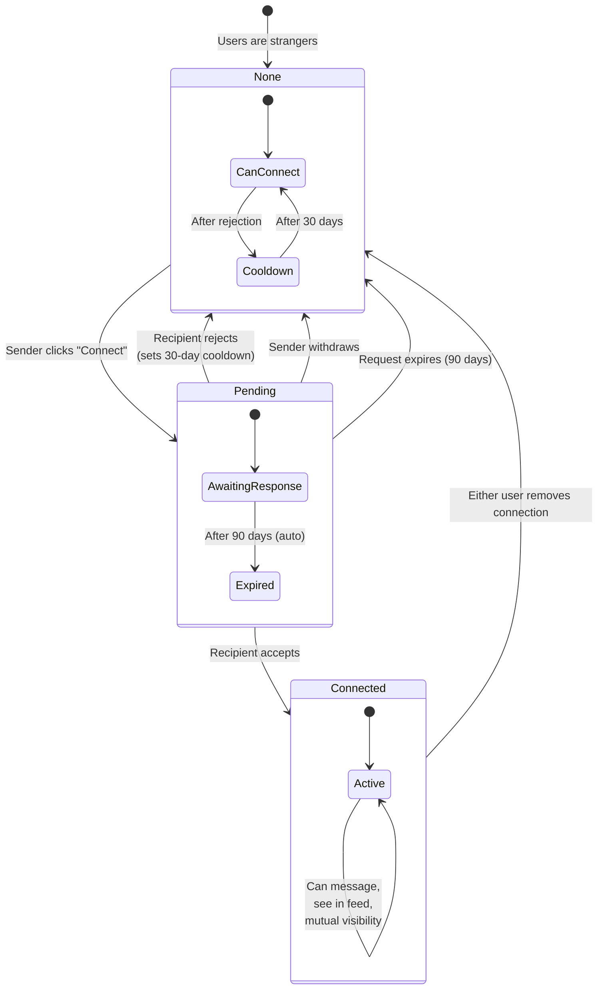
```mermaid
stateDiagram-v2
    [*] --> None: Users are strangers

    state None {
        [*] --> CanConnect
        CanConnect --> Cooldown: After rejection
        Cooldown --> CanConnect: After 30 days
    }

    None --> Pending: Sender clicks "Connect"

    state Pending {
        [*] --> AwaitingResponse
        AwaitingResponse --> Expired: After 90 days (auto)
    }

    Pending --> Connected: Recipient accepts
    Pending --> None: Recipient rejects<br/>(sets 30-day cooldown)
    Pending --> None: Sender withdraws
    Pending --> None: Request expires (90 days)

    state Connected {
        [*] --> Active
        Active --> Active: Can message,<br/>see in feed,<br/>mutual visibility
    }

    Connected --> None: Either user removes connection
```

### 9.2 User Account States

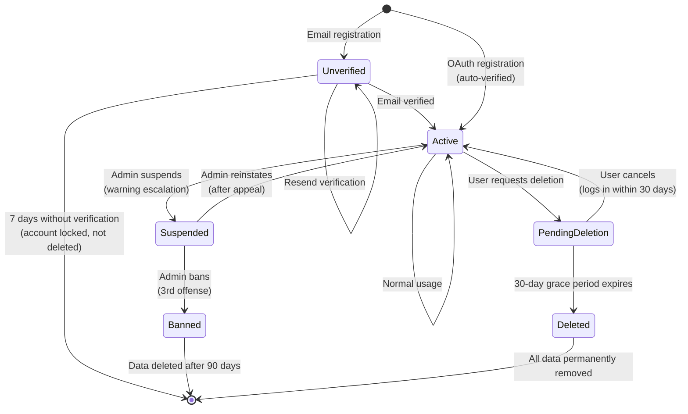
```mermaid
stateDiagram-v2
    [*] --> Unverified: Email registration

    Unverified --> Active: Email verified
    Unverified --> Unverified: Resend verification
    Unverified --> [*]: 7 days without verification<br/>(account locked, not deleted)

    [*] --> Active: OAuth registration<br/>(auto-verified)

    Active --> Suspended: Admin suspends<br/>(warning escalation)
    Active --> PendingDeletion: User requests deletion
    Active --> Active: Normal usage

    Suspended --> Active: Admin reinstates<br/>(after appeal)
    Suspended --> Banned: Admin bans<br/>(3rd offense)

    Banned --> [*]: Data deleted after 90 days

    PendingDeletion --> Active: User cancels<br/>(logs in within 30 days)
    PendingDeletion --> Deleted: 30-day grace period expires

    Deleted --> [*]: All data permanently removed
```

### 9.3 Job Posting States

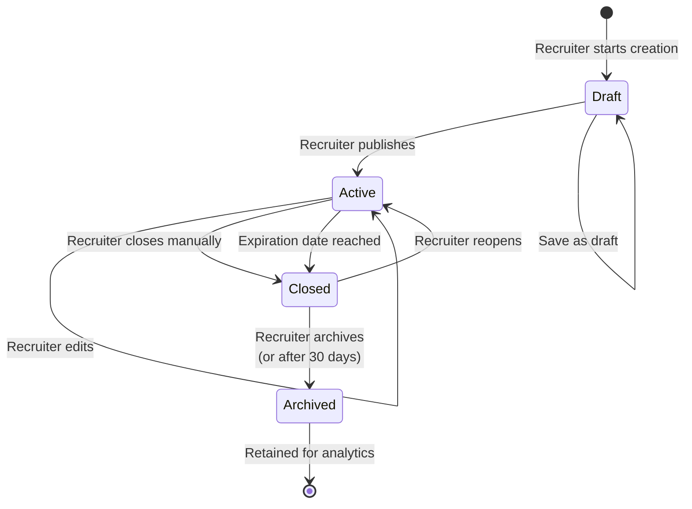
```mermaid
stateDiagram-v2
    [*] --> Draft: Recruiter starts creation

    Draft --> Active: Recruiter publishes
    Draft --> Draft: Save as draft

    Active --> Active: Receives applications
    Active --> Closed: Recruiter closes manually
    Active --> Closed: Expiration date reached
    Active --> Active: Recruiter edits

    Closed --> Active: Recruiter reopens
    Closed --> Archived: Recruiter archives<br/>(or after 30 days)

    Archived --> [*]: Retained for analytics
```

### 9.4 Content Report States

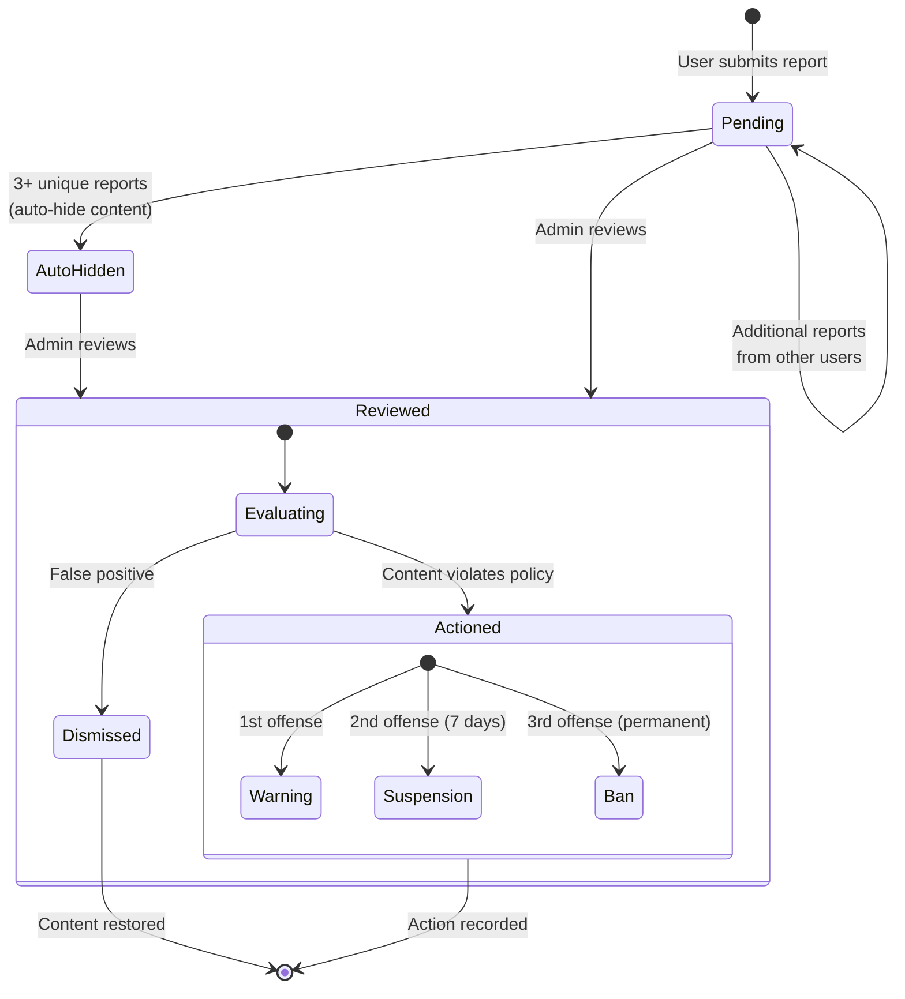
```mermaid
stateDiagram-v2
    [*] --> Pending: User submits report

    Pending --> Pending: Additional reports<br/>from other users
    Pending --> AutoHidden: 3+ unique reports<br/>(auto-hide content)

    AutoHidden --> Reviewed: Admin reviews

    Pending --> Reviewed: Admin reviews

    state Reviewed {
        [*] --> Evaluating
        Evaluating --> Dismissed: False positive
        Evaluating --> Actioned: Content violates policy
    }

    state Actioned {
        [*] --> Warning: 1st offense
        [*] --> Suspension: 2nd offense (7 days)
        [*] --> Ban: 3rd offense (permanent)
    }

    Dismissed --> [*]: Content restored
    Actioned --> [*]: Action recorded
```

---

## 10. Technology Decisions

| Decision | Choice | Alternatives Considered | Rationale |
|----------|--------|------------------------|-----------|
| **Backend Framework** | Fastify 4 | Express, NestJS, Hono | ConnectSW standard; async-first; schema validation; plugin architecture; 2x faster than Express |
| **Frontend Framework** | Next.js 14 (App Router) | Remix, Nuxt, SvelteKit | ConnectSW standard; React Server Components; built-in SSR/SSG; strong ecosystem |
| **Database** | PostgreSQL 15 | MySQL, MongoDB, CockroachDB | ConnectSW standard; pgvector for embeddings; tsvector for full-text search; JSONB for flexible fields; mature ecosystem |
| **ORM** | Prisma 5 | Drizzle, TypeORM, Kysely | ConnectSW standard; type-safe schema; migrations; query builder; studio for debugging |
| **Cache/Sessions** | Redis 7 | Memcached, PostgreSQL sessions | Pub/sub for real-time events; BullMQ job queue; rate limiting; session TTL management |
| **Object Storage** | Cloudflare R2 | AWS S3, MinIO | S3-compatible API; zero egress fees; built-in CDN; lower cost for media-heavy platform |
| **Email Service** | Resend (primary) | SendGrid, Mailgun, SES | Developer-friendly API; React email templates; good deliverability; affordable at scale |
| **AI Provider** | Claude API (Anthropic) | OpenAI GPT-4, Google Gemini | Excellent Arabic text generation; proven in ConnectSW LinkedIn Agent; responsible AI principles |
| **Vector Storage** | pgvector (PostgreSQL extension) | Pinecone, Weaviate, Qdrant | No additional infrastructure; lives in PostgreSQL; sufficient for Phase 2 scale (< 100K profiles) |
| **i18n Framework** | react-i18next | next-intl, FormatJS | Industry standard; namespace-based; RTL support; SSR-compatible; large community |
| **Styling** | Tailwind CSS 3 | CSS Modules, Styled Components, Emotion | ConnectSW standard; utility-first; CSS logical properties for RTL; fast development |
| **WebSocket** | @fastify/websocket | Socket.IO, ws (standalone) | Native Fastify integration; lower overhead than Socket.IO; sufficient for 1:1 messaging |
| **Job Queue** | BullMQ | Agenda, pg-boss, Temporal | Redis-backed; robust retry logic; delayed jobs; priority queues; good TypeScript support |
| **Testing** | Jest + React Testing Library + Playwright | Vitest, Cypress, WebdriverIO | ConnectSW standard; mature ecosystem; Playwright for cross-browser E2E |
| **Arabic Fonts** | IBM Plex Arabic + Tajawal | Noto Naskh, Cairo, Amiri | Open-source; optimized for screen readability; good Latin+Arabic pairing; web font performance |
| **SSE (Notifications)** | Native EventSource (built into Fastify) | WebSocket, Firebase Cloud Messaging | Simpler than WebSocket for server-to-client push; auto-reconnect; works with Fastify |

---

## 11. Deployment Architecture

### 11.1 Local Development

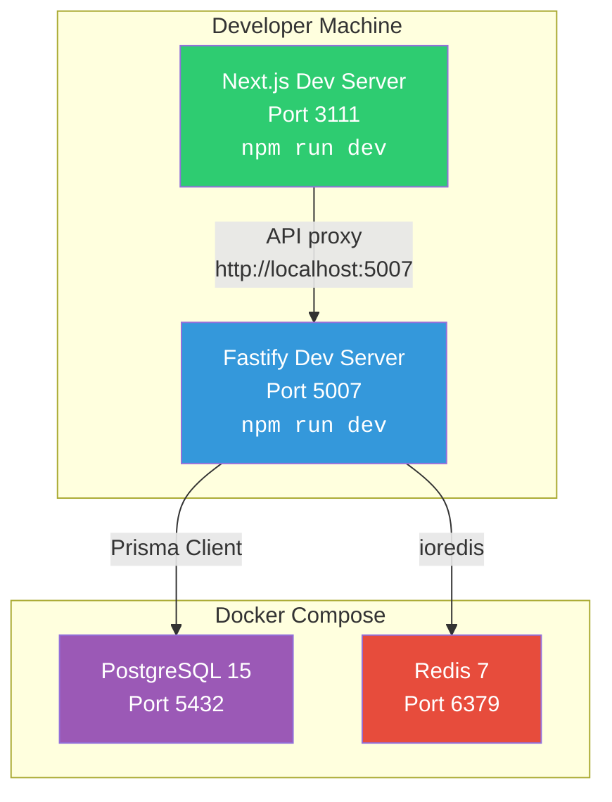
```mermaid
graph TD
    subgraph Dev["Developer Machine"]
        FE["Next.js Dev Server<br/>Port 3111<br/><code>npm run dev</code>"]
        BE["Fastify Dev Server<br/>Port 5007<br/><code>npm run dev</code>"]
    end

    subgraph Docker["Docker Compose"]
        PG["PostgreSQL 15<br/>Port 5432"]
        REDIS["Redis 7<br/>Port 6379"]
    end

    FE -->|"API proxy<br/>http://localhost:5007"| BE
    BE -->|"Prisma Client"| PG
    BE -->|"ioredis"| REDIS

    style FE fill:#2ECC71,color:#fff
    style BE fill:#3498DB,color:#fff
    style PG fill:#9B59B6,color:#fff
    style REDIS fill:#E74C3C,color:#fff
```

**Local setup commands:**

```bash
# Start infrastructure
docker compose up -d postgres redis

# Install dependencies
npm install

# Run database migrations
cd apps/api && npx prisma migrate dev

# Seed test data
cd apps/api && npx tsx scripts/seed.ts

# Start both services
npm run dev
# Frontend: http://localhost:3111
# Backend:  http://localhost:5007
```

### 11.2 CI/CD Pipeline

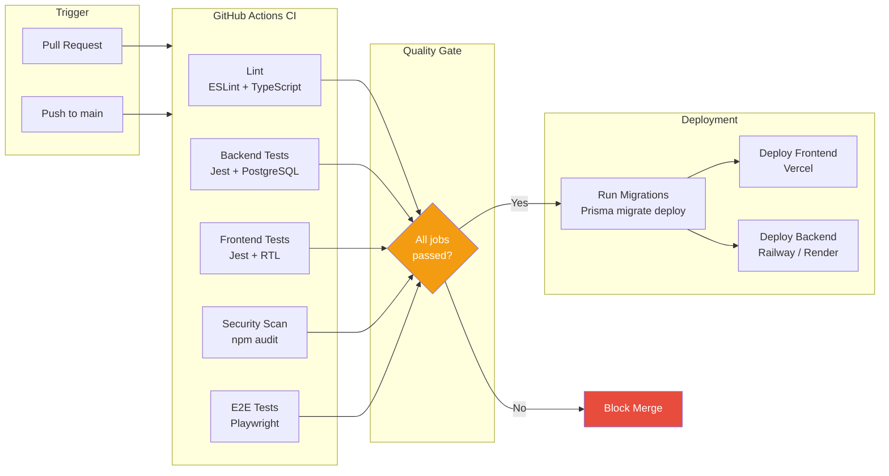
```mermaid
flowchart LR
    subgraph Trigger["Trigger"]
        PR["Pull Request"]
        PUSH["Push to main"]
    end

    subgraph CI["GitHub Actions CI"]
        LINT["Lint<br/>ESLint + TypeScript"]
        TEST_BE["Backend Tests<br/>Jest + PostgreSQL"]
        TEST_FE["Frontend Tests<br/>Jest + RTL"]
        SECURITY["Security Scan<br/>npm audit"]
        E2E["E2E Tests<br/>Playwright"]
    end

    subgraph Gate["Quality Gate"]
        GATE_CHECK{"All jobs<br/>passed?"}
    end

    subgraph CD["Deployment"]
        DEPLOY_FE["Deploy Frontend<br/>Vercel"]
        DEPLOY_BE["Deploy Backend<br/>Railway / Render"]
        MIGRATE["Run Migrations<br/>Prisma migrate deploy"]
    end

    PR --> CI
    PUSH --> CI

    LINT --> GATE_CHECK
    TEST_BE --> GATE_CHECK
    TEST_FE --> GATE_CHECK
    SECURITY --> GATE_CHECK
    E2E --> GATE_CHECK

    GATE_CHECK -->|"Yes"| MIGRATE
    MIGRATE --> DEPLOY_BE
    MIGRATE --> DEPLOY_FE
    GATE_CHECK -->|"No"| FAIL["Block Merge"]

    style GATE_CHECK fill:#F39C12,color:#fff
    style FAIL fill:#E74C3C,color:#fff
```

### 11.3 Production Architecture

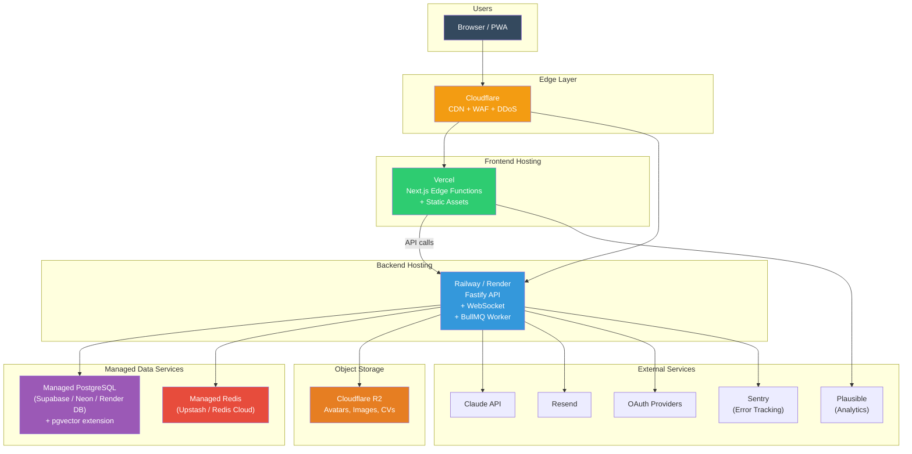
```mermaid
graph TD
    subgraph Users["Users"]
        BROWSER["Browser / PWA"]
    end

    subgraph Edge["Edge Layer"]
        CF["Cloudflare<br/>CDN + WAF + DDoS"]
    end

    subgraph Frontend_Hosting["Frontend Hosting"]
        VERCEL["Vercel<br/>Next.js Edge Functions<br/>+ Static Assets"]
    end

    subgraph Backend_Hosting["Backend Hosting"]
        RAILWAY["Railway / Render<br/>Fastify API<br/>+ WebSocket<br/>+ BullMQ Worker"]
    end

    subgraph Managed_Data["Managed Data Services"]
        PG_PROD["Managed PostgreSQL<br/>(Supabase / Neon / Render DB)<br/>+ pgvector extension"]
        REDIS_PROD["Managed Redis<br/>(Upstash / Redis Cloud)"]
    end

    subgraph Object_Storage["Object Storage"]
        R2_PROD["Cloudflare R2<br/>Avatars, Images, CVs"]
    end

    subgraph External_Prod["External Services"]
        CLAUDE_PROD["Claude API"]
        RESEND_PROD["Resend"]
        OAUTH_PROD["OAuth Providers"]
        SENTRY["Sentry<br/>(Error Tracking)"]
        PLAUSIBLE["Plausible<br/>(Analytics)"]
    end

    BROWSER --> CF
    CF --> VERCEL
    CF --> RAILWAY

    VERCEL -->|"API calls"| RAILWAY
    RAILWAY --> PG_PROD
    RAILWAY --> REDIS_PROD
    RAILWAY --> R2_PROD
    RAILWAY --> CLAUDE_PROD
    RAILWAY --> RESEND_PROD
    RAILWAY --> OAUTH_PROD
    RAILWAY --> SENTRY

    VERCEL --> PLAUSIBLE

    style BROWSER fill:#34495E,color:#fff
    style CF fill:#F39C12,color:#fff
    style VERCEL fill:#2ECC71,color:#fff
    style RAILWAY fill:#3498DB,color:#fff
    style PG_PROD fill:#9B59B6,color:#fff
    style REDIS_PROD fill:#E74C3C,color:#fff
    style R2_PROD fill:#E67E22,color:#fff
```

### 11.4 Environment Configuration

| Environment Variable | Required | Default | Description |
|---------------------|:--------:|---------|-------------|
| `DATABASE_URL` | Yes | -- | PostgreSQL connection string |
| `REDIS_URL` | Yes | -- | Redis connection string |
| `JWT_SECRET` | Yes | -- | JWT signing secret (min 32 chars) |
| `JWT_REFRESH_SECRET` | Yes | -- | Refresh token signing secret |
| `GOOGLE_CLIENT_ID` | Yes | -- | Google OAuth client ID |
| `GOOGLE_CLIENT_SECRET` | Yes | -- | Google OAuth client secret |
| `GITHUB_CLIENT_ID` | Yes | -- | GitHub OAuth client ID |
| `GITHUB_CLIENT_SECRET` | Yes | -- | GitHub OAuth client secret |
| `ANTHROPIC_API_KEY` | Yes | -- | Claude API key |
| `R2_ACCOUNT_ID` | Yes | -- | Cloudflare R2 account |
| `R2_ACCESS_KEY_ID` | Yes | -- | R2 access key |
| `R2_SECRET_ACCESS_KEY` | Yes | -- | R2 secret key |
| `R2_BUCKET_NAME` | Yes | -- | R2 bucket name |
| `RESEND_API_KEY` | Yes | -- | Resend email API key |
| `FRONTEND_URL` | Yes | `http://localhost:3111` | Frontend base URL (CORS, email links) |
| `API_URL` | Yes | `http://localhost:5007` | Backend base URL |
| `NODE_ENV` | No | `development` | Environment mode |
| `LOG_LEVEL` | No | `info` | Log verbosity |
| `API_KEY_HMAC_SECRET` | Yes (prod) | -- | HMAC secret for API key hashing |

---

## 12. Cross-Cutting Concerns

### 12.1 Security Architecture

| Concern | Implementation |
|---------|---------------|
| **Authentication** | JWT access tokens (15min) + httpOnly refresh cookies (30 days) |
| **Authorization** | Role-based: `user`, `recruiter`, `admin`. Middleware checks on protected routes |
| **Password Storage** | bcrypt with cost factor 12 |
| **CSRF Protection** | SameSite=Strict cookies; Double-submit cookie pattern for mutation requests |
| **XSS Prevention** | Content Security Policy headers; HTML escaping on all user content; DOMPurify on frontend |
| **SQL Injection** | Prisma parameterized queries (no raw SQL in application code) |
| **Rate Limiting** | Redis-backed sliding window; per-user and per-IP limits |
| **File Upload** | Max size enforcement (5MB avatars, 10MB images); format whitelist (JPEG, PNG, WebP); magic byte validation |
| **OAuth Security** | PKCE flow (no implicit grant); state parameter verification |
| **Encryption in Transit** | TLS 1.3 enforced in production |
| **Secrets Management** | Environment variables; never in code or version control |
| **Dependency Security** | `npm audit` in CI; Dependabot for automated updates |

### 12.2 Observability

| Aspect | Tool | Details |
|--------|------|---------|
| **Error Tracking** | Sentry | Server + client errors with stack traces, breadcrumbs, user context |
| **Logging** | Structured JSON logs (`@connectsw/shared` Logger) | PII redaction; correlation IDs (X-Request-ID) |
| **Metrics** | In-memory (MVP) -> Prometheus (Phase 2) | Request latency (p50/p95/p99), error rate, active connections |
| **Uptime** | BetterUptime | Health check on `/health` endpoint every 60s |
| **Analytics** | Plausible | Privacy-respecting; no cookies; GDPR-compliant |

### 12.3 Data Privacy and Compliance

| Requirement | Implementation |
|-------------|---------------|
| **GDPR Right to Access** | `POST /api/v1/settings/account/export` generates JSON data dump (queued via BullMQ) |
| **GDPR Right to Erasure** | `POST /api/v1/settings/account/delete` with 30-day grace period, then full data deletion |
| **Data Minimization** | Only collect fields required for platform functionality; no tracking beyond Plausible |
| **Consent** | ToS acceptance at registration; AI data usage disclosed in privacy policy |
| **AI Data Handling** | Profile data sent to Claude API for optimization is not stored by Anthropic (per API agreement) |
| **Data Residency** | Phase 1: Any region. Phase 2: Evaluate AWS Bahrain or Azure UAE for MENA compliance |

### 12.4 Performance Budgets

| Metric | Target | Measurement |
|--------|--------|-------------|
| Initial page load | < 2s on 4G | Lighthouse |
| API response (p95) | < 500ms (non-AI endpoints) | Server-side metrics |
| AI optimization response | < 15s | Server-side timer |
| WebSocket message delivery | < 1s end-to-end | Client-side measurement |
| Feed load (per batch) | < 1s | Server + client |
| Search results | < 500ms | Server-side metrics |
| Image upload + processing | < 5s | Client-side timer |
| Language toggle (RTL/LTR switch) | < 500ms, no page reload | Client-side measurement |

---

## Document History

| Version | Date | Author | Changes |
|---------|------|--------|---------|
| 1.0 | 2026-02-20 | Architect (AI Agent) | Initial architecture document |
