# ConnectIn Accessibility Specification

> **Version**: 1.0
> **Date**: February 20, 2026
> **Author**: UI/UX Designer
> **Status**: Active
> **Product**: ConnectIn -- Professional Networking Platform
> **Standard**: WCAG 2.1 Level AA Compliance

---

## Table of Contents

1. [Overview](#1-overview)
2. [Color Contrast Table](#2-color-contrast-table)
3. [Keyboard Navigation Map](#3-keyboard-navigation-map)
4. [Screen Reader Annotations](#4-screen-reader-annotations)
5. [Focus Management](#5-focus-management)
6. [Form Accessibility](#6-form-accessibility)
7. [Touch Targets](#7-touch-targets)
8. [Motion Preferences](#8-motion-preferences)
9. [Language and Direction](#9-language-and-direction)
10. [Testing Checklist](#10-testing-checklist)

---

## 1. Overview

ConnectIn is committed to WCAG 2.1 Level AA compliance across all pages and components. As a bilingual Arabic/English platform, accessibility carries additional complexity: screen readers must handle direction changes, focus management must account for RTL layouts, and all ARIA attributes must provide correct labels in both languages.

### Accessibility Architecture

```mermaid
flowchart TD
    WCAG["WCAG 2.1 Level AA"] --> PERCEIVABLE["1. Perceivable"]
    WCAG --> OPERABLE["2. Operable"]
    WCAG --> UNDERSTANDABLE["3. Understandable"]
    WCAG --> ROBUST["4. Robust"]

    PERCEIVABLE --> CONTRAST["Color Contrast<br/>4.5:1 normal, 3:1 large"]
    PERCEIVABLE --> ALT["Alt Text<br/>All images"]
    PERCEIVABLE --> CAPTIONS["Media Captions"]
    PERCEIVABLE --> DIRECTION["Text Direction<br/>RTL/LTR announced"]

    OPERABLE --> KEYBOARD["Full Keyboard Nav"]
    OPERABLE --> FOCUS["Visible Focus Ring"]
    OPERABLE --> TIMING["No Time Limits<br/>(except toasts)"]
    OPERABLE --> TOUCH["44x44px Touch Targets"]

    UNDERSTANDABLE --> LABELS["Clear Labels"]
    UNDERSTANDABLE --> ERRORS["Error Messages"]
    UNDERSTANDABLE --> LANG["Language Attributes"]
    UNDERSTANDABLE --> PREDICT["Predictable Navigation"]

    ROBUST --> SEMANTIC["Semantic HTML"]
    ROBUST --> ARIA["ARIA Roles/States"]
    ROBUST --> COMPAT["Screen Reader Compat"]
```

### WCAG 2.1 AA Success Criteria Applicability

| Criterion | Level | Applies | Notes |
|-----------|:-----:|:-------:|-------|
| 1.1.1 Non-text Content | A | Yes | Alt text on all images (avatars, post images) |
| 1.2.1 Audio-only and Video-only | A | No | MVP has no audio/video content |
| 1.3.1 Info and Relationships | A | Yes | Semantic HTML, ARIA landmarks |
| 1.3.2 Meaningful Sequence | A | Yes | DOM order matches visual order in both RTL and LTR |
| 1.3.3 Sensory Characteristics | A | Yes | No instructions rely solely on color or shape |
| 1.3.4 Orientation | AA | Yes | No orientation lock; all pages work portrait and landscape |
| 1.3.5 Identify Input Purpose | AA | Yes | `autocomplete` attributes on form fields |
| 1.4.1 Use of Color | A | Yes | Color is never the sole indicator (icons/text supplement) |
| 1.4.3 Contrast (Minimum) | AA | Yes | 4.5:1 normal text, 3:1 large text |
| 1.4.4 Resize Text | AA | Yes | rem-based sizing; tested at 200% zoom |
| 1.4.5 Images of Text | AA | Yes | No images of text used |
| 1.4.10 Reflow | AA | Yes | No horizontal scroll at 320px width |
| 1.4.11 Non-text Contrast | AA | Yes | UI components and graphical objects have 3:1 contrast |
| 1.4.12 Text Spacing | AA | Yes | Content tolerates user-adjusted text spacing |
| 1.4.13 Content on Hover/Focus | AA | Yes | Tooltips dismissible, hoverable, persistent |
| 2.1.1 Keyboard | A | Yes | All functionality via keyboard |
| 2.1.2 No Keyboard Trap | A | Yes | Focus traps only in modals (with Escape exit) |
| 2.4.1 Bypass Blocks | A | Yes | Skip-to-content link on every page |
| 2.4.2 Page Titled | A | Yes | Descriptive `<title>` on every route |
| 2.4.3 Focus Order | A | Yes | Logical tab order follows visual layout |
| 2.4.4 Link Purpose | A | Yes | Link text is descriptive |
| 2.4.6 Headings and Labels | AA | Yes | Descriptive headings, unique labels |
| 2.4.7 Focus Visible | AA | Yes | Custom focus ring: 2px primary-300 outline |
| 2.5.1 Pointer Gestures | A | Yes | No multi-point or path gestures required |
| 2.5.2 Pointer Cancellation | A | Yes | Actions on up-event, not down-event |
| 3.1.1 Language of Page | A | Yes | `lang="ar"` or `lang="en"` on `<html>` |
| 3.1.2 Language of Parts | AA | Yes | `lang` attribute on mixed-language sections |
| 3.2.1 On Focus | A | Yes | Focus alone does not trigger context change |
| 3.2.2 On Input | A | Yes | Input alone does not trigger unexpected context change |
| 3.3.1 Error Identification | A | Yes | Errors described in text, not just color |
| 3.3.2 Labels or Instructions | A | Yes | All form fields have visible labels |
| 3.3.3 Error Suggestion | AA | Yes | Error messages suggest corrections |
| 3.3.4 Error Prevention | AA | Yes | Confirmations for destructive actions |
| 4.1.1 Parsing | A | Yes | Valid HTML output |
| 4.1.2 Name, Role, Value | A | Yes | ARIA attributes on custom components |
| 4.1.3 Status Messages | AA | Yes | Live regions for dynamic updates (toasts, counters) |

---

## 2. Color Contrast Table

Every text/background combination used in the ConnectIn UI is documented below with its computed contrast ratio.

### 2.1 Light Mode Contrast

| Element | Text Color | Background Color | Ratio | AA Normal | AA Large |
|---------|-----------|-----------------|:-----:|:---------:|:--------:|
| Page title (h1) | `#0F172A` neutral-900 | `#FFFFFF` neutral-0 | 16.75:1 | Pass | Pass |
| Section heading (h2) | `#1E293B` neutral-800 | `#FFFFFF` neutral-0 | 13.58:1 | Pass | Pass |
| Card title (h3) | `#334155` neutral-700 | `#FFFFFF` neutral-0 | 9.73:1 | Pass | Pass |
| Body text | `#475569` neutral-600 | `#FFFFFF` neutral-0 | 7.07:1 | Pass | Pass |
| Secondary text | `#64748B` neutral-500 | `#FFFFFF` neutral-0 | 4.61:1 | Pass | Pass |
| Placeholder text | `#94A3B8` neutral-400 | `#FFFFFF` neutral-0 | 3.07:1 | Fail | Pass |
| Primary link | `#0A7F99` primary-600 | `#FFFFFF` neutral-0 | 4.52:1 | Pass | Pass |
| Primary button text | `#FFFFFF` neutral-0 | `#0A7F99` primary-600 | 4.52:1 | Pass | Pass |
| Error text | `#B91C1C` error-700 | `#FFFFFF` neutral-0 | 5.74:1 | Pass | Pass |
| Error text on error bg | `#B91C1C` error-700 | `#FEF2F2` error-50 | 5.39:1 | Pass | Pass |
| Success text | `#047857` success-700 | `#FFFFFF` neutral-0 | 4.58:1 | Pass | Pass |
| Warning text | `#B45309` warning-700 | `#FFFFFF` neutral-0 | 4.78:1 | Pass | Pass |
| Info text | `#1D4ED8` info-700 | `#FFFFFF` neutral-0 | 5.46:1 | Pass | Pass |
| Body text on card | `#475569` neutral-600 | `#F8FAFC` neutral-50 | 6.74:1 | Pass | Pass |
| Badge text (primary) | `#086577` primary-700 | `#E6F4F8` primary-50 | 5.12:1 | Pass | Pass |
| Destructive btn text | `#FFFFFF` neutral-0 | `#B91C1C` error-700 | 5.74:1 | Pass | Pass |

### 2.2 Dark Mode Contrast

| Element | Text Color | Background Color | Ratio | AA Normal | AA Large |
|---------|-----------|-----------------|:-----:|:---------:|:--------:|
| Page title (h1) | `#F1F5F9` neutral-100 | `#0F172A` neutral-900 | 15.39:1 | Pass | Pass |
| Section heading (h2) | `#E2E8F0` neutral-200 | `#0F172A` neutral-900 | 13.47:1 | Pass | Pass |
| Card title (h3) | `#E2E8F0` neutral-200 | `#1E293B` neutral-800 | 10.07:1 | Pass | Pass |
| Body text | `#CBD5E1` neutral-300 | `#0F172A` neutral-900 | 10.12:1 | Pass | Pass |
| Secondary text | `#94A3B8` neutral-400 | `#0F172A` neutral-900 | 5.47:1 | Pass | Pass |
| Primary link | `#30ABC3` primary-300 | `#0F172A` neutral-900 | 6.24:1 | Pass | Pass |
| Body text on card | `#CBD5E1` neutral-300 | `#1E293B` neutral-800 | 7.57:1 | Pass | Pass |
| Muted text on card | `#94A3B8` neutral-400 | `#1E293B` neutral-800 | 4.10:1 | Fail | Pass |

**Note**: `neutral-400` on `neutral-800` (4.10:1) fails AA for normal text but passes for large text (18px+). In dark mode, secondary text that is smaller than 18px must use `neutral-300` (#CBD5E1) or lighter instead.

### 2.3 Non-Text Contrast (UI Components)

| Element | Foreground | Background | Ratio | Passes 3:1 |
|---------|-----------|------------|:-----:|:----------:|
| Input border (default) | `#E2E8F0` neutral-200 | `#FFFFFF` neutral-0 | 1.41:1 | Fail -- needs label |
| Input border (focus) | `#0C9AB8` primary-500 | `#FFFFFF` neutral-0 | 3.72:1 | Pass |
| Button outline | `#0A7F99` primary-600 | `#FFFFFF` neutral-0 | 4.52:1 | Pass |
| Toggle track (on) | `#0C9AB8` primary-500 | `#FFFFFF` neutral-0 | 3.72:1 | Pass |
| Toggle track (off) | `#CBD5E1` neutral-300 | `#FFFFFF` neutral-0 | 1.84:1 | Fail -- has label |
| Checkbox (checked) | `#0A7F99` primary-600 | `#FFFFFF` neutral-0 | 4.52:1 | Pass |
| Focus ring | `#57BBCE` primary-300 | `#FFFFFF` neutral-0 | 2.50:1 | Fail |

**Remediation**: The focus ring contrast is supplemented by a 2px solid outline with a 2px offset gap, making the focus state visually distinct through shape change (not just color). Default input borders rely on their visible label for identification, meeting WCAG 1.3.1 (Info and Relationships).

---

## 3. Keyboard Navigation Map

### 3.1 Global Keyboard Shortcuts

| Key | Action | Context |
|-----|--------|---------|
| `Tab` | Move focus to next focusable element | Global |
| `Shift + Tab` | Move focus to previous focusable element | Global |
| `Enter` / `Space` | Activate focused button/link | Global |
| `Escape` | Close modal, dropdown, popover, or dismiss toast | When overlay is open |
| `/` | Focus the global search bar | When not in a text input |
| `Alt + H` | Navigate to Home | Global |
| `Alt + N` | Navigate to My Network | Global |
| `Alt + J` | Navigate to Jobs | Global |
| `Alt + M` | Navigate to Messages | Global |

### 3.2 Page-Specific Tab Orders

#### Feed Page (/)

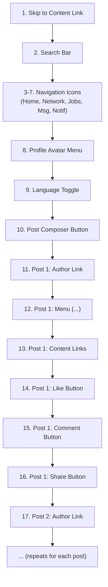

#### Registration Page (/register)

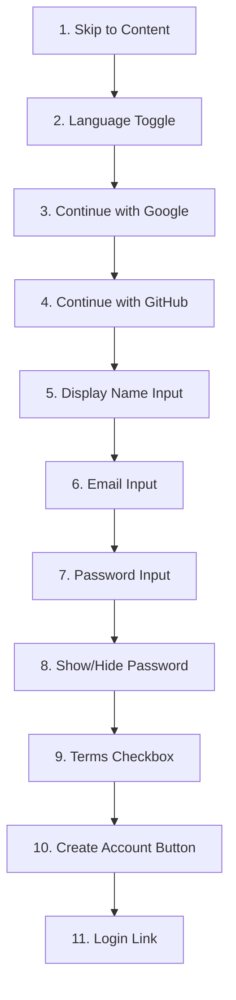

#### Profile Page (/profile)

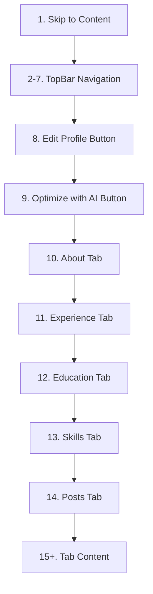

### 3.3 Component Keyboard Interactions

| Component | Key | Action |
|-----------|-----|--------|
| **Button** | `Enter`, `Space` | Activate |
| **Link** | `Enter` | Navigate |
| **Checkbox** | `Space` | Toggle |
| **Radio** | `Arrow Up/Down` | Move selection |
| **Switch** | `Space` | Toggle |
| **Select** | `Enter`, `Space` | Open menu |
| **Select (open)** | `Arrow Up/Down` | Navigate options |
| **Select (open)** | `Enter` | Select option |
| **Select (open)** | `Escape` | Close without selecting |
| **Tabs** | `Arrow Left/Right` | Switch tab (RTL: reversed) |
| **Tabs** | `Home` | First tab |
| **Tabs** | `End` | Last tab |
| **Modal** | `Tab` | Cycle within modal (trapped) |
| **Modal** | `Escape` | Close modal |
| **Dropdown** | `Arrow Down` | Open and focus first item |
| **Dropdown (open)** | `Arrow Up/Down` | Navigate items |
| **Dropdown (open)** | `Escape` | Close |
| **Toast** | `Escape` | Dismiss |
| **Infinite Scroll** | `Tab` | Focus moves to loaded content naturally |
| **Post Composer** | `Ctrl+Enter` / `Cmd+Enter` | Submit post |

**RTL keyboard note**: Arrow Left/Right behavior in tabs is reversed in RTL mode. Arrow Right moves to the previous tab (visual left becomes logical start). This matches user expectation in RTL layouts.

---

## 4. Screen Reader Annotations

### 4.1 ARIA Landmarks

Every page must include these landmark regions:

| Landmark | ARIA Role | HTML Element | Content |
|----------|-----------|-------------|---------|
| Banner | `banner` | `<header>` | TopBar with logo, search, nav |
| Navigation | `navigation` | `<nav>` | Main navigation (TopBar), sidebar nav |
| Main | `main` | `<main>` | Primary content area |
| Complementary | `complementary` | `<aside>` | Sidebar (trending, suggestions) |
| Contentinfo | `contentinfo` | `<footer>` | Footer with links |
| Search | `search` | `<form role="search">` | Global search bar |

### 4.2 ARIA Labels for Custom Components

| Component | ARIA Attribute | Value (EN) | Value (AR) |
|-----------|---------------|-----------|-----------|
| Language toggle | `aria-label` | "Switch language" | "تبديل اللغة" |
| Dark mode toggle | `aria-label` | "Toggle dark mode" | "تبديل الوضع الداكن" |
| Search bar | `aria-label` | "Search professionals, jobs, and posts" | "البحث عن محترفين ووظائف ومنشورات" |
| Notification bell | `aria-label` | "Notifications, X unread" | "الإشعارات، X غير مقروءة" |
| Message icon | `aria-label` | "Messages, X unread" | "الرسائل، X غير مقروءة" |
| Like button | `aria-label` | "Like this post" / "Unlike this post" | "أعجبني" / "إلغاء الإعجاب" |
| Like button | `aria-pressed` | "true" / "false" | (same) |
| Comment button | `aria-label` | "Comment on this post" | "التعليق على هذا المنشور" |
| Share button | `aria-label` | "Share this post" | "مشاركة هذا المنشور" |
| Connect button | `aria-label` | "Connect with [Name]" | "التواصل مع [Name]" |
| Post menu (...) | `aria-label` | "More actions for this post" | "المزيد من الإجراءات" |
| Avatar (profile link) | `aria-label` | "[Name]'s profile" | "الملف الشخصي لـ [Name]" |
| Online indicator | `aria-label` | "[Name] is online" | "[Name] متصل الآن" |
| Unread badge | `aria-label` | "X unread messages" | "X رسائل غير مقروءة" |
| Progress bar | `aria-valuenow` | Current value (0-100) | (same) |
| Progress bar | `aria-label` | "Profile completeness" | "اكتمال الملف الشخصي" |
| Tabs | `role="tablist"` | -- | -- |
| Tab | `aria-selected` | "true" / "false" | (same) |
| Tab panel | `aria-labelledby` | Tab ID | (same) |
| Modal | `aria-modal` | "true" | (same) |
| Modal | `aria-labelledby` | Title element ID | (same) |
| Toast | `role="status"` | -- | -- |
| Toast (error) | `role="alert"` | -- | -- |
| Infinite scroll | `aria-live="polite"` | -- | -- |
| Loading spinner | `aria-label` | "Loading" | "جار التحميل" |
| Read receipt | `aria-label` | "Message read at [time]" | "تمت القراءة في [time]" |

### 4.3 Live Regions

Dynamic content updates must be announced by screen readers without requiring page reload.

| Region | `aria-live` | `aria-atomic` | Trigger |
|--------|:-----------:|:-------------:|---------|
| Toast container | `polite` / `assertive` (errors) | `true` | New toast appears |
| Like count | `polite` | `true` | User likes/unlikes |
| Comment count | `polite` | `true` | New comment added |
| Unread badge | `polite` | `true` | New message received |
| Feed new posts | `polite` | `false` | New posts loaded |
| Form errors | `assertive` | `true` | Validation error appears |
| Search results count | `polite` | `true` | Results load |
| Connection status | `polite` | `true` | Request accepted/rejected |

### Screen Reader Interaction Flow

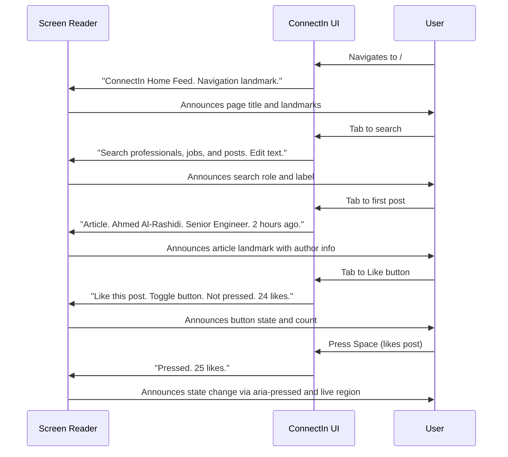

---

## 5. Focus Management

### 5.1 Focus Ring Styling

All focusable elements display a visible focus ring:

| Property | Value |
|----------|-------|
| Outline color | `primary-300` (#57BBCE) |
| Outline width | 2px |
| Outline style | solid |
| Outline offset | 2px |
| Border radius | Matches element's border-radius |

The focus ring uses `outline` (not `border`) to avoid layout shifts.

**Dark mode**: Focus ring color changes to `primary-400` (#30ABC3) for sufficient contrast against dark backgrounds.

### 5.2 Focus Trap Rules

| Scenario | Behavior |
|----------|----------|
| **Modal open** | Focus moves to first focusable element in modal. Tab cycles within modal only. Escape closes modal. |
| **Modal close** | Focus returns to the element that triggered the modal. |
| **Dropdown open** | Focus moves to first option. Arrow keys navigate. Escape closes. |
| **Dropdown close** | Focus returns to the trigger button. |
| **Sheet (mobile drawer) open** | Focus moves into sheet. Tab cycles within sheet. |
| **Sheet close** | Focus returns to trigger element. |
| **Route change** | Focus moves to `<main>` content (or skip link target). |
| **Infinite scroll load** | Focus remains on current position. New content is announced via `aria-live`. |
| **Toast appears** | Focus does NOT move to toast. Toast is announced via live region. |
| **Post composer (expanded)** | Focus moves into composer textarea. |
| **Post composer (submit)** | Focus returns to feed. New post is announced via live region. |

### 5.3 Focus Restoration Map

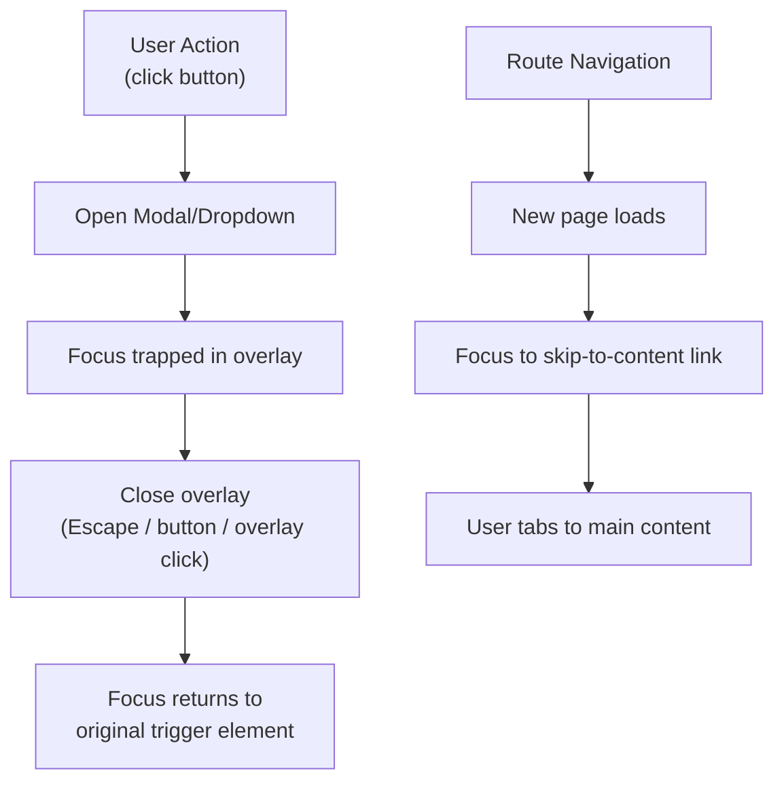

---

## 6. Form Accessibility

### 6.1 Label Associations

Every form input must have a visible label associated via one of these methods:

| Method | Implementation | When to Use |
|--------|---------------|-------------|
| `<label for="id">` | `<label for="email">Email</label><input id="email">` | Standard form fields |
| `aria-label` | `<input aria-label="Search">` | Inputs where visual label is replaced by icon/placeholder |
| `aria-labelledby` | `<input aria-labelledby="heading-id">` | Input labeled by a heading |

**Rule**: `placeholder` alone is never sufficient as a label. Every input must have either a visible `<label>` or an `aria-label`.

### 6.2 Error Messaging

| Requirement | Implementation |
|-------------|---------------|
| Errors are not color-only | Error text + red border + error icon |
| Error text is associated with input | `aria-describedby` pointing to error message `<span>` |
| Error is announced | Error container has `role="alert"` or `aria-live="assertive"` |
| Error is specific | "Password must be at least 8 characters" not "Invalid password" |
| Error suggests fix | "Email format: name@example.com" |

### Error Display Pattern

```
+------------------------------------------+
| Email *                                  |
| {invalid-email           } <ErrorIcon>   |
| [!] Please enter a valid email address   |
|     (e.g., name@example.com)             |
+------------------------------------------+

HTML:
<label for="email">Email <span aria-hidden="true">*</span>
  <span class="sr-only">(required)</span></label>
<input id="email" aria-describedby="email-error" aria-invalid="true">
<span id="email-error" role="alert">
  Please enter a valid email address (e.g., name@example.com)
</span>
```

### 6.3 Required Field Indicators

- Visual: asterisk (*) after label text
- Screen reader: `aria-required="true"` on input, plus `(required)` in screen-reader-only text
- The asterisk is marked `aria-hidden="true"` so screen readers use the explicit text instead

### 6.4 Autocomplete Attributes

| Field | `autocomplete` Value |
|-------|---------------------|
| Display name | `name` |
| Email | `email` |
| Password (login) | `current-password` |
| Password (register) | `new-password` |
| City/Location | `address-level2` |
| Country | `country-name` |
| Phone | `tel` |
| Company | `organization` |
| Job title | `organization-title` |

### Form Accessibility Architecture

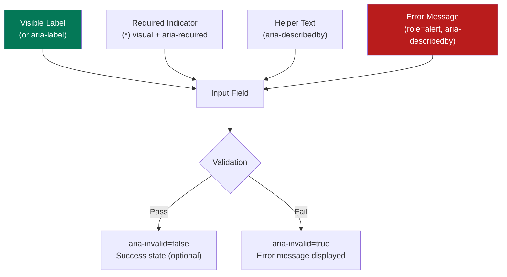

---

## 7. Touch Targets

### 7.1 Minimum Sizes

All interactive elements must meet minimum touch target sizes per WCAG 2.5.5 (AAA) and Apple/Google HIG guidelines.

| Element | Minimum Size | Actual Size | Padding Added |
|---------|:------------:|:-----------:|:-------------:|
| Button (sm) | 44x44px | 32px height | 6px tap padding |
| Button (md) | 44x44px | 40px height | 2px tap padding |
| Button (lg) | 44x44px | 48px height | None needed |
| Icon button (nav) | 44x44px | 24px icon | 10px padding each side |
| Checkbox | 44x44px | 20px visual | 12px tap padding |
| Radio | 44x44px | 20px visual | 12px tap padding |
| Switch/Toggle | 44x44px | 40x24px visual | Tap area extended |
| Tab (navigation) | 44x44px | Variable width, 48px height | None needed |
| Link (inline text) | 44x24px min | Text size dependent | Line height provides vertical |
| Close button (X) | 44x44px | 24px icon | 10px padding each side |
| Avatar (clickable) | 44x44px | 40px+ | None needed (sm) / 2px padding (xs) |

### 7.2 Spacing Between Targets

Adjacent touch targets must have at least 8px of space between them to prevent accidental activation.

| Example | Spacing |
|---------|:-------:|
| Like / Comment / Share buttons | 16px gap |
| Accept / Reject buttons | 12px gap |
| Navigation icons | 8px gap |
| Form submit / cancel buttons | 16px gap |

### Touch Target Visualization

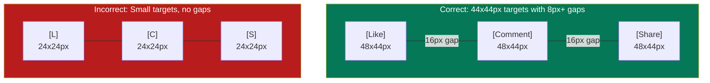

---

## 8. Motion Preferences

### 8.1 Respecting prefers-reduced-motion

| Animation | Normal Mode | Reduced Motion Mode |
|-----------|-------------|---------------------|
| Page transitions (fade/slide) | 200ms ease-in-out | Instant (0ms) |
| Modal appear (slide-up + fade) | 200ms ease-out | Instant (0ms) |
| Dropdown open (scale-in) | 150ms ease-out | Instant (0ms) |
| Toast appear (slide-in) | 200ms ease-out | Instant (0ms) |
| Skeleton pulse | 1500ms infinite | Static `neutral-200` |
| Loading spinner | 600ms infinite | Static loading icon |
| Like bounce | 300ms ease-out | Color change only (no scale) |
| Counter increment | 200ms slide-up | Instant number update |
| Hover elevation (card) | 150ms ease | No elevation change |
| Infinite scroll loading | Smooth scroll | Jump to new content |

### 8.2 Implementation

```
CSS:
@media (prefers-reduced-motion: reduce) {
  *, *::before, *::after {
    animation-duration: 0.01ms !important;
    animation-iteration-count: 1 !important;
    transition-duration: 0.01ms !important;
    scroll-behavior: auto !important;
  }
}
```

### Reduced Motion Decision Tree

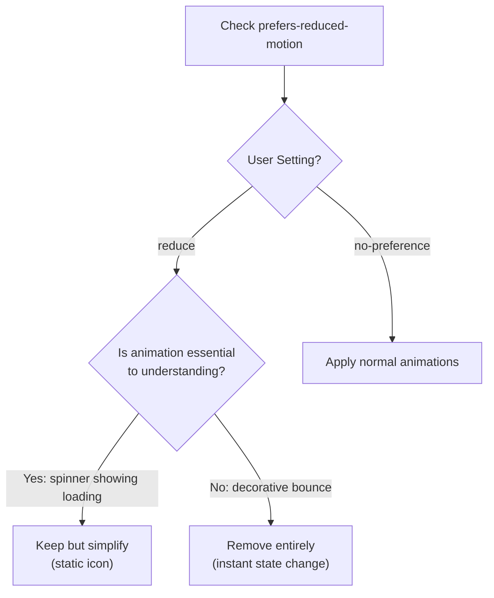

---

## 9. Language and Direction

### 9.1 HTML Attributes

The `<html>` element must always include both `dir` and `lang` attributes:

```html
<!-- Arabic mode -->
<html dir="rtl" lang="ar">

<!-- English mode -->
<html dir="ltr" lang="en">
```

### 9.2 Mixed-Language Content

When user-generated content contains both Arabic and English, use `lang` attributes on spans:

```html
<!-- Post with mixed content -->
<article dir="rtl" lang="ar">
  <p>
    أطلقنا اليوم مشروع
    <span lang="en" dir="ltr">ConnectIn Open Source SDK</span>
    للمطورين العرب
  </p>
</article>
```

### 9.3 Screen Reader Behavior

| Scenario | Expected Behavior |
|----------|-------------------|
| Page in Arabic | Screen reader uses Arabic voice/pronunciation |
| `lang="en"` span within Arabic page | Screen reader switches to English voice for that span |
| User-generated mixed content (`dir="auto"`) | Browser determines direction; screen reader follows `lang` |
| Bilingual tabs (AR / EN) | Each tab panel has its own `lang` attribute |
| Number display (Eastern Arabic ١٢٣) | Screen reader announces the number value, not characters |

### 9.4 Direction Change Announcements

Screen readers should announce direction changes. ConnectIn achieves this through:

1. `dir` attribute on `<html>` for page-level direction
2. `dir="auto"` on user content containers for automatic detection
3. `lang` attributes on mixed-language sections for voice switching
4. ARIA live regions announce when the user switches language via the toggle

### Language Architecture

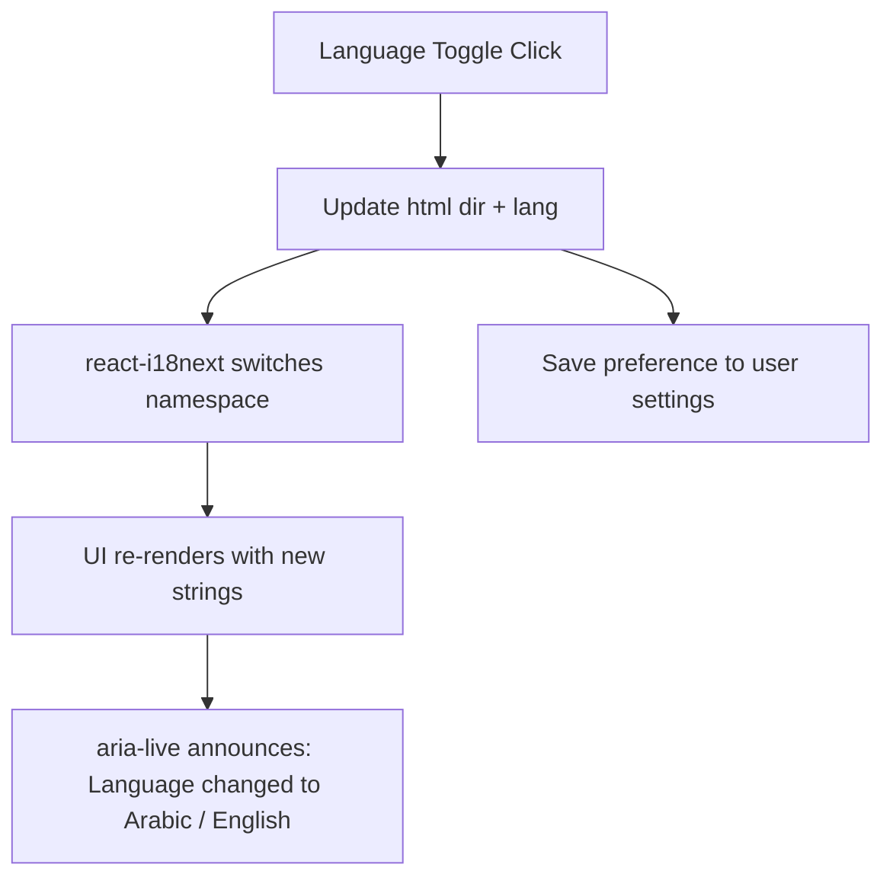

---

## 10. Testing Checklist

### 10.1 Automated Testing

| Tool | What It Tests | When to Run |
|------|---------------|-------------|
| **axe-core** (via @axe-core/react) | WCAG violations in rendered DOM | Every component test |
| **jest-axe** | Accessibility assertions in Jest | Unit tests |
| **Playwright axe** | Full-page accessibility audits | E2E tests |
| **Lighthouse** | Accessibility score, contrast, labels | CI pipeline |
| **ESLint eslint-plugin-jsx-a11y** | JSX accessibility anti-patterns | Pre-commit |

### 10.2 Manual Testing Checklist

This checklist must be completed for every new page or component before it can be merged.

#### Keyboard Navigation

- [ ] All interactive elements are reachable via Tab
- [ ] Tab order follows a logical visual sequence
- [ ] No keyboard traps (except intentional focus traps in modals)
- [ ] Escape closes all overlays (modals, dropdowns, popovers)
- [ ] Enter/Space activates buttons and links
- [ ] Arrow keys navigate within composite widgets (tabs, radios, menus)
- [ ] Focus ring is visible on all focused elements
- [ ] Focus returns to trigger element when overlay closes
- [ ] Skip-to-content link works on every page

#### Screen Reader (Test with VoiceOver on macOS and NVDA on Windows)

- [ ] Page title is announced on navigation
- [ ] All landmarks are announced (banner, nav, main, complementary)
- [ ] All images have descriptive alt text
- [ ] All form inputs have associated labels
- [ ] Error messages are announced when they appear
- [ ] Dynamic content updates are announced via live regions
- [ ] Direction changes (RTL/LTR) are handled by the screen reader
- [ ] Mixed Arabic/English content is read with correct voice switching
- [ ] Like/comment counts are announced on state change
- [ ] Modal content is announced when opened
- [ ] Button states (pressed, expanded, disabled) are announced

#### Visual/Layout

- [ ] All text passes 4.5:1 contrast ratio (or 3:1 for large text)
- [ ] UI components pass 3:1 non-text contrast ratio
- [ ] No information is conveyed by color alone
- [ ] Page is usable at 200% browser zoom
- [ ] No horizontal scrolling at 320px viewport width
- [ ] Content is readable with increased text spacing (1.5x line height, 2x letter spacing, 2x word spacing)
- [ ] Touch targets are minimum 44x44px
- [ ] Adjacent targets have minimum 8px spacing

#### RTL-Specific

- [ ] Layout mirrors correctly in RTL mode
- [ ] No physical CSS properties (left, right, margin-left, etc.) are used
- [ ] Directional icons mirror (arrows, chevrons, send)
- [ ] Non-directional icons do not mirror (search, heart, settings)
- [ ] Arabic text renders with correct line height
- [ ] Mixed content (Arabic + English) flows correctly
- [ ] Form inputs auto-detect text direction
- [ ] Tab key moves in correct direction for RTL

#### Reduced Motion

- [ ] All animations are disabled when prefers-reduced-motion: reduce is set
- [ ] Skeleton loaders show static placeholder
- [ ] Loading spinners show static icon
- [ ] Content remains accessible without animation

### 10.3 Screen Reader Test Matrix

| Screen Reader | Browser | OS | Priority |
|---------------|---------|-----|:--------:|
| **VoiceOver** | Safari | macOS | P0 |
| **VoiceOver** | Safari | iOS | P0 |
| **NVDA** | Firefox | Windows | P1 |
| **JAWS** | Chrome | Windows | P2 |
| **TalkBack** | Chrome | Android | P1 |

### Testing Decision Flow

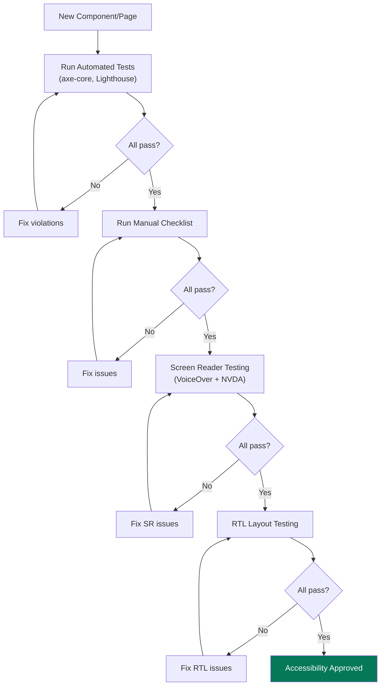

---

## Document History

| Version | Date | Author | Changes |
|---------|------|--------|---------|
| 1.0 | 2026-02-20 | UI/UX Designer (AI Agent) | Initial accessibility specification |
