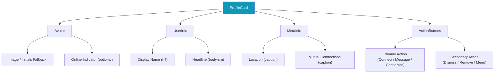
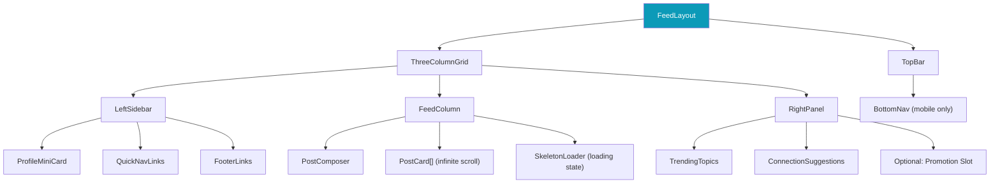
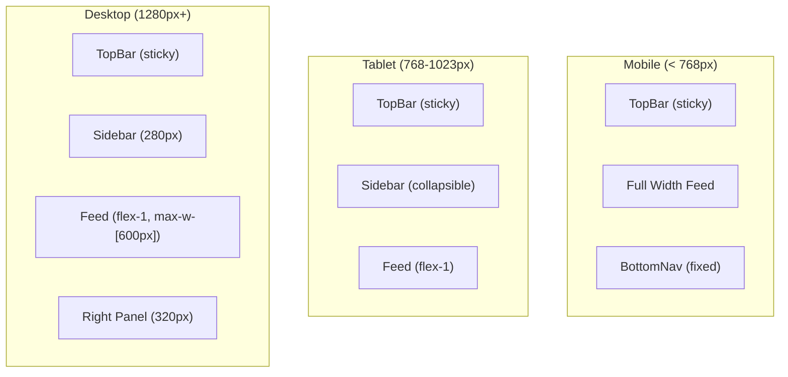
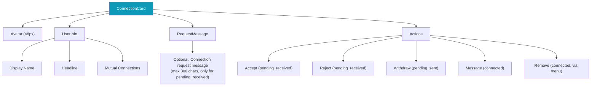
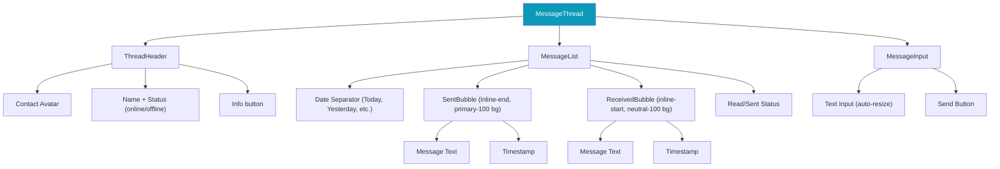
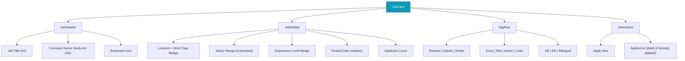
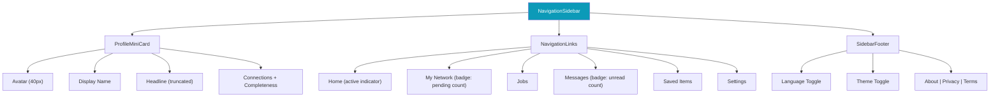
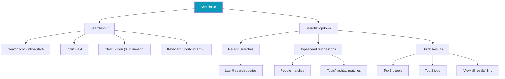
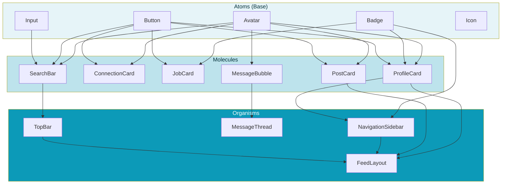

```mermaid
graph TD
    POST[PostCard] --> HEADER[PostHeader]
    POST --> BODY[PostBody]
    POST --> IMAGES[ImageGrid]
    POST --> TAGS[HashtagBar]
    POST --> ENGAGEMENT[EngagementBar]
    POST --> COMMENTS[CommentPreview]

    HEADER --> AUTHOR_AV["Author Avatar (40px)"]
    HEADER --> AUTHOR_INFO["Author Name + Headline"]
    HEADER --> TIMESTAMP["Relative Time (2h)"]
    HEADER --> MENU["Menu (...) Dropdown"]

    BODY --> TEXT["Post Text (max 3000 chars)"]
    BODY --> EXPAND["'...see more' if truncated"]

    IMAGES --> GRID["1-4 Image Responsive Grid"]

    TAGS --> TAG_LIST["Clickable #hashtag badges"]

    ENGAGEMENT --> LIKE_BTN["Like Button + Count"]
    ENGAGEMENT --> COMMENT_BTN["Comment Button + Count"]
    ENGAGEMENT --> SHARE_BTN["Share Button + Count"]

    COMMENTS --> PREVIEW["Last 3 comments"]
    COMMENTS --> VIEW_ALL["'View all X comments' link"]

    style POST fill:#0C9AB8,color:#fff
```

# ConnectIn Component Specifications

> **Version**: 1.0
> **Date**: February 20, 2026
> **Author**: UI/UX Designer
> **Status**: Active
> **Product**: ConnectIn -- Professional Networking Platform
> **Audience**: Frontend Engineer

---

## Table of Contents

1. [ProfileCard](#1-profilecard)
2. [PostCard](#2-postcard)
3. [FeedLayout](#3-feedlayout)
4. [ConnectionCard](#4-connectioncard)
5. [MessageThread](#5-messagethread)
6. [JobCard](#6-jobcard)
7. [NavigationSidebar](#7-navigationsidebar)
8. [SearchBar](#8-searchbar)

---

## Conventions

### Component Structure

Every component specification follows this structure:

1. **Purpose**: What this component does
2. **Component Composition Diagram**: Mermaid diagram showing internal structure
3. **Props/API**: TypeScript interface
4. **Variants and States**: All visual variations
5. **Responsive Behavior**: How it adapts across breakpoints
6. **RTL Considerations**: What changes in Arabic mode
7. **Tailwind CSS Patterns**: Key class patterns
8. **shadcn/ui Base**: Which shadcn component to extend

### Naming Convention

- Components: PascalCase (`ProfileCard`, `PostCard`)
- Props: camelCase (`displayName`, `onConnect`)
- CSS classes: Tailwind utility classes
- Files: kebab-case (`profile-card.tsx`, `post-card.tsx`)

---

## 1. ProfileCard

### Purpose

Displays a user's professional identity in a compact card format. Used in connection lists, search results, people-you-may-know suggestions, and sidebar mini-profiles.

### Component Composition



### Props/API

```typescript
interface ProfileCardProps {
  // Required
  userId: string;
  displayName: string;
  avatarUrl?: string;

  // Optional info
  headline?: string;
  location?: string;
  mutualConnections?: number;
  isOnline?: boolean;

  // Connection state
  connectionStatus: 'none' | 'pending_sent' | 'pending_received' | 'connected';

  // Variant
  variant: 'default' | 'compact' | 'mini' | 'suggestion';
  /**
   * default: Full card with avatar, info, meta, actions (search results, network page)
   * compact: Smaller avatar, single-line info (connection list)
   * mini: Avatar + name only (sidebar profile summary)
   * suggestion: Full card + "Dismiss" button (people you may know)
   */

  // Events
  onConnect?: () => void;
  onMessage?: () => void;
  onDismiss?: () => void;
  onRemove?: () => void;
  onClick?: () => void;
}
```

### Variants and States

| Variant | Avatar Size | Info Lines | Actions | Width |
|---------|:-----------:|:----------:|---------|:-----:|
| `default` | 64px (lg) | Name + headline + location + mutual | Connect / Message | 100% |
| `compact` | 48px (md+) | Name + headline | Message + menu | 100% |
| `mini` | 40px (md) | Name + headline (1 line) | None (clickable) | 100% |
| `suggestion` | 64px (lg) | Name + headline + mutual + reason | Connect + Dismiss | 100% |

| Connection Status | Primary Button | Button Variant |
|-------------------|---------------|:-------------:|
| `none` | "Connect" | `primary` |
| `pending_sent` | "Pending" (disabled) | `outline` (disabled) |
| `pending_received` | "Accept" | `primary` |
| `connected` | "Message" | `outline` |

| Interaction State | Visual Change |
|-------------------|---------------|
| Default | `shadow-sm`, `bg-card` |
| Hover | `shadow-md`, subtle background shift |
| Focus (keyboard) | Focus ring (primary-300, 2px) |
| Loading | Skeleton variant |

### Responsive Behavior

| Breakpoint | Layout |
|------------|--------|
| Mobile (< 640px) | Full width, stacked vertically |
| Tablet (640-1023px) | 2-column grid of cards |
| Desktop (1024px+) | 3-column grid or list layout |

### RTL Considerations

- Avatar positioned at `inline-start`
- Text aligned to `inline-start` (right in RTL)
- Action buttons at `inline-end`
- Location pin icon at `inline-start` of location text

### Tailwind CSS Pattern

```
Container: rounded-md shadow-sm bg-card p-4 hover:shadow-md transition-shadow
           duration-instant flex items-start gap-3

Avatar:    rounded-full object-cover
           (lg: h-16 w-16, md: h-12 w-12, sm: h-10 w-10)

Name:      text-h4 font-semibold text-primary truncate

Headline:  text-body-sm text-secondary truncate

Location:  text-caption text-muted flex items-center gap-1

Mutual:    text-caption text-muted

Actions:   flex items-center gap-2 mt-2 ms-auto
           (ms-auto pushes to inline-end)
```

### shadcn/ui Base

Extend: `Card` + `Avatar` + `Button`

---

## 2. PostCard

### Purpose

Displays a single post in the news feed with author info, content, optional images, hashtags, and engagement actions (like, comment, share).

### Component Composition



### Props/API

```typescript
interface PostCardProps {
  // Post data
  postId: string;
  author: {
    userId: string;
    displayName: string;
    avatarUrl?: string;
    headline?: string;
  };
  content: string;
  textDirection: 'rtl' | 'ltr' | 'auto';
  createdAt: string; // ISO date
  images?: Array<{
    url: string;
    alt: string;
    width: number;
    height: number;
  }>;
  hashtags?: string[];

  // Shared post (if this is a share)
  sharedPost?: PostCardProps;
  shareComment?: string;

  // Engagement
  likeCount: number;
  commentCount: number;
  shareCount: number;
  isLikedByMe: boolean;

  // Comments preview
  recentComments?: Array<{
    authorName: string;
    authorAvatarUrl?: string;
    content: string;
    createdAt: string;
  }>;

  // Events
  onLike?: () => void;
  onComment?: () => void;
  onShare?: () => void;
  onAuthorClick?: () => void;
  onHashtagClick?: (hashtag: string) => void;
  onImageClick?: (index: number) => void;
  onMenuAction?: (action: 'report' | 'save' | 'delete') => void;
}
```

### Variants and States

| Variant | Context |
|---------|---------|
| `feed` | Default: in the news feed, full width |
| `detail` | Single post view with expanded comments |
| `shared` | Embedded inside another PostCard (shared post) |
| `preview` | In search results, truncated content |

| Like State | Icon | Color | aria-pressed |
|------------|------|-------|:------------:|
| Not liked | Heart outline | `neutral-500` | `false` |
| Liked | Heart filled | `error-500` (red) | `true` |

| Content State | Behavior |
|---------------|----------|
| Short (< 300 chars) | Show full text |
| Long (> 300 chars) | Truncate + "...see more" button |
| Arabic content | `dir="rtl"` auto-detected, right-aligned |
| English content | `dir="ltr"` auto-detected, left-aligned |
| Mixed content | `dir="auto"` with Unicode bidi algorithm |

### Image Grid Patterns

| Image Count | Layout |
|:-----------:|--------|
| 1 | Single image, max-height 400px, rounded-md |
| 2 | 2-column grid, equal width, 200px height |
| 3 | 1 large (left) + 2 stacked (right), or 1 top + 2 bottom on mobile |
| 4 | 2x2 grid, equal dimensions |

### Responsive Behavior

| Breakpoint | Max Width | Image Grid |
|------------|:---------:|-----------|
| Mobile (< 640px) | 100% (edge-to-edge content) | Images stack or 2-col |
| Tablet (640-1023px) | 600px | Standard grid |
| Desktop (1024px+) | 600px (within feed column) | Standard grid |

### RTL Considerations

- Author info flows from inline-start (avatar first, then name/headline)
- Menu (...) at `inline-end` of header
- Post text with `dir="auto"` attribute
- Hashtags flow inline, wrapping follows text direction
- Like/Comment/Share bar layout is horizontal, order unchanged (universal icons)
- Shared post embed has same RTL treatment

### Tailwind CSS Pattern

```
Container:      rounded-md shadow-sm bg-card divide-y divide-border

Header:         p-4 flex items-start gap-3
Author avatar:  h-10 w-10 rounded-full
Author name:    text-body font-semibold text-primary hover:underline
Headline:       text-body-sm text-secondary
Timestamp:      text-caption text-muted ms-auto

Body:           px-4 pb-3
Content:        text-body text-primary whitespace-pre-wrap
                [dir=auto applied to this element]
See more:       text-body-sm text-link font-medium cursor-pointer

Image grid:     px-4 pb-3 grid gap-1 rounded-md overflow-hidden
                (grid-cols-1 | grid-cols-2 depending on count)

Hashtags:       px-4 pb-3 flex flex-wrap gap-1
Tag:            text-body-sm text-link hover:underline cursor-pointer

Engagement:     px-4 py-2 flex items-center gap-6
Like btn:       flex items-center gap-1 text-body-sm
                text-secondary hover:text-error-500
                (when liked: text-error-500 font-medium)
Count:          text-body-sm text-muted
```

### shadcn/ui Base

Extend: `Card` + `Avatar` + `Button` (ghost) + `DropdownMenu` + `Badge`

---

## 3. FeedLayout

### Purpose

The main layout wrapper for the home feed page. Manages the three-column layout (sidebar, feed, right panel) with responsive collapse behavior.

### Component Composition



### Props/API

```typescript
interface FeedLayoutProps {
  children: React.ReactNode; // The feed content (center column)
}

interface LeftSidebarProps {
  user: {
    displayName: string;
    avatarUrl?: string;
    headline?: string;
    connectionCount: number;
    profileCompleteness: number;
  };
}

interface RightPanelProps {
  trendingTopics: Array<{
    hashtag: string;
    postCount: number;
  }>;
  suggestions: ProfileCardProps[];
}
```

### Layout Variants

| Breakpoint | Columns | Sidebar | Right Panel |
|------------|:-------:|:-------:|:-----------:|
| Mobile (< 768px) | 1 | Hidden | Hidden |
| Tablet (768-1023px) | 2 | Collapsible (hamburger) | Hidden |
| Desktop (1024-1279px) | 2 | 240px fixed | Hidden |
| Wide Desktop (1280px+) | 3 | 280px fixed | 320px fixed |

### Responsive Behavior



### RTL Considerations

- Sidebar moves to `inline-start` (right side in RTL)
- Right panel moves to `inline-end` (left side in RTL)
- Use `flex-row` with logical properties; Tailwind's `flex-row-reverse` is NOT used -- instead rely on `dir="rtl"` to naturally reverse flex direction
- Bottom nav order remains the same (positional, not directional)

### Tailwind CSS Pattern

```
Page wrapper:     min-h-screen bg-page

Grid container:   max-w-7xl mx-auto px-4
                  flex gap-6

Left sidebar:     hidden lg:block w-[280px] shrink-0
                  sticky top-[80px] self-start h-fit

Feed column:      flex-1 max-w-[600px] mx-auto
                  min-w-0 (prevents overflow)

Right panel:      hidden xl:block w-[320px] shrink-0
                  sticky top-[80px] self-start h-fit

TopBar:           sticky top-0 z-sticky h-16
                  bg-card border-b border-border

BottomNav:        fixed bottom-0 inset-x-0 z-sticky
                  h-14 bg-card border-t border-border
                  flex items-center justify-around
                  md:hidden (mobile only)
                  pb-[env(safe-area-inset-bottom)]
```

### shadcn/ui Base

Custom layout component; no direct shadcn base. Uses `ScrollArea` for sidebar overflow.

---

## 4. ConnectionCard

### Purpose

Displays a connection or connection request with appropriate actions. Used in the My Network page for both connection management and pending request handling.

### Component Composition



### Props/API

```typescript
interface ConnectionCardProps {
  userId: string;
  displayName: string;
  avatarUrl?: string;
  headline?: string;
  mutualConnections?: number;

  // Determines which actions to show
  status: 'connected' | 'pending_received' | 'pending_sent';

  // For pending_received: optional message from sender
  requestMessage?: string;

  // Timestamps
  connectedSince?: string;  // ISO date (for connected)
  requestedAt?: string;     // ISO date (for pending)

  // Events
  onAccept?: () => void;
  onReject?: () => void;
  onWithdraw?: () => void;
  onMessage?: () => void;
  onRemove?: () => void;
  onClick?: () => void;
}
```

### Variants by Status

| Status | Layout | Primary Action | Secondary Action |
|--------|--------|---------------|-----------------|
| `connected` | Avatar + Info + Message button | Message | Remove (via ... menu) |
| `pending_received` | Avatar + Info + Request message + Accept/Reject | Accept | Reject |
| `pending_sent` | Avatar + Info + "Pending" label + Withdraw | Withdraw | None |

### Responsive Behavior

| Breakpoint | Card Layout | Grid |
|------------|-------------|------|
| Mobile | Full width, stacked | 1 column |
| Tablet | Full width | 1 column with wider card |
| Desktop | Fixed width in grid | 2-3 column grid |

### RTL Considerations

- Avatar at `inline-start`
- Action buttons at `inline-end`
- Request message text follows its own `dir="auto"`
- Accept/Reject button order does not change (Accept always first / inline-start)

### Tailwind CSS Pattern

```
Container:    rounded-md shadow-sm bg-card p-4
              flex items-start gap-3 hover:shadow-md
              transition-shadow duration-instant

Avatar:       h-12 w-12 rounded-full shrink-0

Info:         flex-1 min-w-0
Name:         text-body font-semibold text-primary truncate
Headline:     text-body-sm text-secondary truncate
Mutual:       text-caption text-muted mt-0.5

Message:      text-body-sm text-secondary mt-2
              bg-neutral-50 p-2 rounded-md
              italic (request message)

Actions:      flex items-center gap-2 mt-2
Accept btn:   btn-primary btn-sm
Reject btn:   btn-secondary btn-sm
Withdraw btn: btn-outline btn-sm text-warning-700
```

### shadcn/ui Base

Extend: `Card` + `Avatar` + `Button` + `DropdownMenu`

---

## 5. MessageThread

### Purpose

Displays a conversation between two users with message bubbles, read receipts, timestamps, and a message input field.

### Component Composition



### Props/API

```typescript
interface MessageThreadProps {
  conversationId: string;
  contact: {
    userId: string;
    displayName: string;
    avatarUrl?: string;
    headline?: string;
    isOnline: boolean;
  };
  messages: Message[];
  hasMore: boolean; // For loading older messages

  // Events
  onSendMessage: (text: string) => void;
  onLoadMore: () => void;
  onBack: () => void; // Mobile: return to conversation list
}

interface Message {
  id: string;
  senderId: string;
  content: string;
  createdAt: string;
  readAt?: string;
  status: 'sending' | 'sent' | 'delivered' | 'read';
}
```

### Message Bubble Layout

| Bubble Type | Alignment | Background | Text Color | Max Width |
|-------------|-----------|------------|------------|:---------:|
| Sent (mine) | `inline-end` | `primary-50` | `neutral-800` | 70% |
| Received (theirs) | `inline-start` | `neutral-100` | `neutral-800` | 70% |

| Status | Indicator | Icon |
|--------|-----------|------|
| `sending` | Spinner (small) | Clock icon |
| `sent` | Single check | Check icon |
| `delivered` | Double check (grey) | CheckCheck icon |
| `read` | Double check (primary) | CheckCheck icon (primary-500) |

### Responsive Behavior

| Breakpoint | Layout |
|------------|--------|
| Mobile | Full screen: header + messages + input. Back button returns to list. |
| Desktop | Right panel in split view: conversation list (320px) + thread (flex-1) |

### RTL Considerations

- **Critical**: Sent messages position at `inline-end` (left side in RTL), received at `inline-start` (right side in RTL). This is the opposite of the typical LTR messaging layout.
- Message text uses `dir="auto"` for content direction detection
- Send button at `inline-end` of input
- Timestamp at `inline-end` of each bubble
- Read receipt icons at `inline-end` of sent bubble

### Tailwind CSS Pattern

```
Thread container:  flex flex-col h-full

Header:           flex items-center gap-3 p-4 border-b border-border
                  bg-card sticky top-0

Message list:     flex-1 overflow-y-auto p-4 space-y-2
                  flex flex-col

Date separator:   text-center text-caption text-muted py-2
                  relative (with line through)

Sent bubble:      self-end max-w-[70%]
                  bg-primary-50 text-primary-900
                  rounded-lg rounded-ee-sm p-3
                  (rounded-ee-sm: end-end corner is sharp)

Received bubble:  self-start max-w-[70%]
                  bg-neutral-100 text-neutral-800
                  rounded-lg rounded-ss-sm p-3
                  (rounded-ss-sm: start-start corner is sharp)

Timestamp:        text-caption text-muted mt-1 text-end

Read receipt:     flex items-center gap-0.5 text-caption
                  text-muted (sent/delivered)
                  text-primary-500 (read)

Input area:       flex items-end gap-2 p-4 border-t border-border bg-card
Textarea:         flex-1 resize-none max-h-32 text-body
Send button:      btn-primary btn-md rounded-full p-2
                  (icon-only button)
```

### shadcn/ui Base

Extend: `Avatar` + `Button` + `Textarea` + `ScrollArea`

---

## 6. JobCard

### Purpose

Displays a job listing in search results and job board. Shows key job details with quick-action buttons.

### Component Composition



### Props/API

```typescript
interface JobCardProps {
  jobId: string;
  title: string;
  company: {
    name: string;
    logoUrl?: string;
    id?: string; // for company page link
  };
  location: string;
  workType: 'onsite' | 'hybrid' | 'remote';
  experienceLevel: 'entry' | 'mid' | 'senior' | 'lead' | 'executive';
  salaryMin?: number;
  salaryMax?: number;
  salaryCurrency?: string;
  language: 'ar' | 'en' | 'bilingual';
  createdAt: string;
  applicantCount: number;

  // User state
  isApplied: boolean;
  appliedAt?: string;
  isSaved: boolean;

  // Variant
  variant: 'list' | 'detail' | 'compact';

  // Events
  onApply?: () => void;
  onSave?: () => void;
  onClick?: () => void;
}
```

### Variants

| Variant | Usage | Layout |
|---------|-------|--------|
| `list` | Job search results list | Full card with all details |
| `detail` | Job detail page header | Expanded with description |
| `compact` | Sidebar "similar jobs" | Title + company + location only |

### Badge Color Mapping

| Badge | Value | Background | Text |
|-------|-------|------------|------|
| Work Type | Remote | `success-50` | `success-700` |
| Work Type | Hybrid | `warning-50` | `warning-700` |
| Work Type | Onsite | `neutral-100` | `neutral-700` |
| Experience | Entry | `info-50` | `info-700` |
| Experience | Mid | `primary-50` | `primary-700` |
| Experience | Senior | `secondary-50` | `secondary-700` |
| Experience | Lead/Exec | `neutral-100` | `neutral-800` |
| Language | Arabic | `primary-50` | `primary-700` |
| Language | English | `neutral-100` | `neutral-600` |
| Language | Bilingual | `secondary-50` | `secondary-700` |

### Responsive Behavior

| Breakpoint | Layout |
|------------|--------|
| Mobile | Full-width card, stacked content |
| Desktop (list) | Left panel in split view with job detail on right |

### RTL Considerations

- Job title and company align to `inline-start`
- Salary display: currency symbol position follows locale convention
- Location icon at `inline-start` of location text
- Bookmark icon at `inline-end` of header row
- Badge row wraps following text direction

### Tailwind CSS Pattern

```
Container:    rounded-md shadow-sm bg-card p-4
              hover:shadow-md cursor-pointer
              transition-shadow duration-instant
              border-s-4 border-transparent
              hover:border-primary-300

Title:        text-h4 font-semibold text-primary
              hover:text-link hover:underline

Company:      text-body-sm text-link hover:underline

Location:     text-body-sm text-secondary
              flex items-center gap-1

Salary:       text-body font-medium text-primary

Badges:       flex flex-wrap gap-1.5 mt-2

Apply btn:    btn-primary btn-md w-full sm:w-auto
Applied state: text-body-sm text-success-700
              flex items-center gap-1

Bookmark:     btn-ghost p-2 text-neutral-400
              hover:text-secondary-500
              (when saved: text-secondary-500)
```

### shadcn/ui Base

Extend: `Card` + `Badge` + `Button`

---

## 7. NavigationSidebar

### Purpose

The left sidebar navigation for desktop layout. Shows the user's mini profile card and quick navigation links. On tablet it collapses to a hamburger menu. Hidden on mobile (replaced by BottomNav).

### Component Composition



### Props/API

```typescript
interface NavigationSidebarProps {
  user: {
    displayName: string;
    avatarUrl?: string;
    headline?: string;
    connectionCount: number;
    profileCompleteness: number;
  };
  activeRoute: string;
  pendingRequestCount: number;
  unreadMessageCount: number;
  savedItemCount: number;

  // Events
  onNavigate: (route: string) => void;
  onLanguageToggle: () => void;
  onThemeToggle: () => void;
}
```

### Navigation Items

| Label (EN) | Label (AR) | Icon | Route | Badge |
|-----------|-----------|------|-------|:-----:|
| Home | الرئيسية | `home` | `/` | -- |
| My Network | شبكتي | `users` | `/network` | Pending count |
| Jobs | الوظائف | `briefcase` | `/jobs` | -- |
| Messages | الرسائل | `message-circle` | `/messages` | Unread count |
| Saved | المحفوظات | `bookmark` | `/saved` | Saved count |
| Settings | الإعدادات | `settings` | `/settings/account` | -- |

### Variants

| Breakpoint | Variant | Width | Behavior |
|------------|---------|:-----:|----------|
| < 768px | Hidden | 0 | BottomNav used instead |
| 768-1023px | Collapsed | 64px | Icons only, tooltip on hover |
| 1024px+ | Expanded | 280px | Icons + labels + profile card |

### Active State

The active nav item shows:
- Background: `primary-50`
- Text: `primary-700` (font-medium)
- Border-inline-start: 3px solid `primary-500`
- Icon: `primary-600`

Inactive items: `neutral-600` text, `neutral-400` icon.

### RTL Considerations

- Active indicator border on `inline-start` (right side in RTL)
- Nav text at `inline-end` of icon (in RTL, text appears to the left of the icon visually)
- Badge positioned at `inline-end` of the nav item row
- Profile card content right-aligned in RTL

### Tailwind CSS Pattern

```
Sidebar:      w-[280px] shrink-0 h-[calc(100vh-64px)]
              sticky top-16 overflow-y-auto
              bg-card border-e border-border
              hidden lg:flex flex-col

Profile card: p-4 border-b border-border

Nav list:     flex flex-col py-2

Nav item:     flex items-center gap-3 px-4 py-2.5
              text-body text-secondary
              hover:bg-neutral-50 hover:text-primary
              transition-colors duration-instant
              rounded-md mx-2

Nav active:   bg-primary-50 text-primary-700
              font-medium border-s-3 border-primary-500

Badge:        ms-auto min-w-[20px] h-5
              bg-error-500 text-neutral-0
              text-caption font-medium
              rounded-full flex items-center justify-center

Footer:       mt-auto p-4 border-t border-border
              text-caption text-muted
```

### shadcn/ui Base

Extend: `ScrollArea` + `Avatar` + `Badge` + `Button` (ghost) + `Tooltip`

---

## 8. SearchBar

### Purpose

The global search input used in the TopBar. Supports search across people, posts, and jobs with typeahead suggestions and search history.

### Component Composition



### Props/API

```typescript
interface SearchBarProps {
  // Initial value
  value?: string;
  placeholder?: string; // Default: "Search professionals, jobs, and posts..."

  // Variant
  variant: 'topbar' | 'page' | 'inline';
  /**
   * topbar: In the navigation bar, collapses to icon on mobile
   * page: Full-width on the search results page
   * inline: Smaller version for filtering within a list (e.g., connection search)
   */

  // Recent searches
  recentSearches?: string[];

  // Typeahead results
  suggestions?: Array<{
    type: 'person' | 'job' | 'hashtag';
    label: string;
    sublabel?: string;
    avatarUrl?: string;
    id: string;
  }>;

  // Events
  onSearch: (query: string) => void;
  onSuggestionSelect: (suggestion: { type: string; id: string }) => void;
  onClear: () => void;
  onChange: (value: string) => void;
}
```

### Variants

| Variant | Width | Behavior |
|---------|:-----:|---------|
| `topbar` | 360px (desktop), icon-only (mobile) | Expands on focus (mobile), dropdown on type |
| `page` | 100% | Full-width, always visible, auto-focus |
| `inline` | 100% of container | No dropdown, immediate filtering |

### States

| State | Visual |
|-------|--------|
| Default | Placeholder text, search icon, `/` shortcut hint |
| Focused | Border changes to `primary-500`, shortcut hint hides |
| Typing | Clear button appears, dropdown opens after 2+ chars |
| Loading | Spinner replaces search icon in dropdown |
| Results | Dropdown shows categorized results |
| No results | Dropdown shows "No results for '[query]'" |

### Dropdown Sections

| Section | Content | Max Items |
|---------|---------|:---------:|
| Recent | Previous search queries with clock icon | 5 |
| People | Matching profiles (avatar + name + headline) | 3 |
| Jobs | Matching job titles (briefcase icon + title + company) | 2 |
| Hashtags | Matching hashtags (# icon + tag + post count) | 3 |
| View All | "View all results for '[query]'" link | 1 |

### Responsive Behavior

| Breakpoint | Behavior |
|------------|----------|
| Mobile (< 640px) | `topbar` variant shows search icon; tap expands to full-width overlay |
| Tablet (640-1023px) | `topbar` variant shows shortened input (240px) |
| Desktop (1024px+) | `topbar` variant shows full input (360px) |

### RTL Considerations

- Search icon at `inline-start` (right side in RTL)
- Clear button at `inline-end` (left side in RTL)
- Keyboard shortcut hint at `inline-end`
- Dropdown suggestion items: icon at `inline-start`, text at `inline-end`
- Arabic query input: direction auto-detected

### Tailwind CSS Pattern

```
Container:    relative w-full max-w-[360px]

Input:        w-full h-10 ps-10 pe-10
              bg-neutral-100 dark:bg-neutral-800
              border border-transparent
              rounded-full
              text-body text-primary
              placeholder:text-muted
              focus:border-primary-500
              focus:bg-card
              focus:outline-none
              transition-colors duration-instant

Search icon:  absolute inset-y-0 start-0
              flex items-center ps-3
              text-neutral-400

Clear btn:    absolute inset-y-0 end-0
              flex items-center pe-3
              text-neutral-400 hover:text-neutral-600
              (hidden when input is empty)

Shortcut:     absolute inset-y-0 end-0
              flex items-center pe-3
              text-caption text-muted
              bg-neutral-200 rounded px-1.5
              (hidden when focused or has value)

Dropdown:     absolute top-full inset-x-0 mt-1
              bg-card rounded-lg shadow-lg
              border border-border
              max-h-[400px] overflow-y-auto
              z-dropdown

Section title: text-overline text-muted
              px-4 py-2 uppercase

Result item:  flex items-center gap-3
              px-4 py-2.5
              hover:bg-neutral-50
              cursor-pointer

Result avatar: h-8 w-8 rounded-full
Result name:  text-body font-medium
Result sub:   text-body-sm text-secondary
```

### shadcn/ui Base

Extend: `Command` (for search palette behavior) + `Popover` + `Avatar`

### Keyboard Interaction

| Key | Action |
|-----|--------|
| `/` (not in input) | Focus search bar |
| `Escape` | Clear input and close dropdown |
| `Arrow Down/Up` | Navigate dropdown suggestions |
| `Enter` | Select highlighted suggestion or submit search |
| `Backspace` (empty) | Close dropdown |

---

## Component Dependency Map



---

## Implementation Priority

| Priority | Component | Reason |
|:--------:|-----------|--------|
| 1 | **SearchBar** | Used in TopBar on every page |
| 2 | **NavigationSidebar** + TopBar + BottomNav | Navigation shell for all pages |
| 3 | **ProfileCard** | Used in onboarding, network, search, sidebar |
| 4 | **PostCard** | Core of the news feed experience |
| 5 | **FeedLayout** | Home page layout (wraps PostCard) |
| 6 | **ConnectionCard** | Network page |
| 7 | **JobCard** | Job board |
| 8 | **MessageThread** | Messaging feature |

---

## Document History

| Version | Date | Author | Changes |
|---------|------|--------|---------|
| 1.0 | 2026-02-20 | UI/UX Designer (AI Agent) | Initial component specifications |
