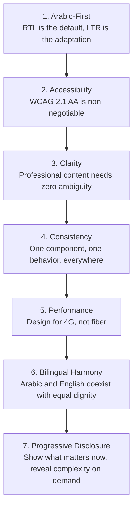
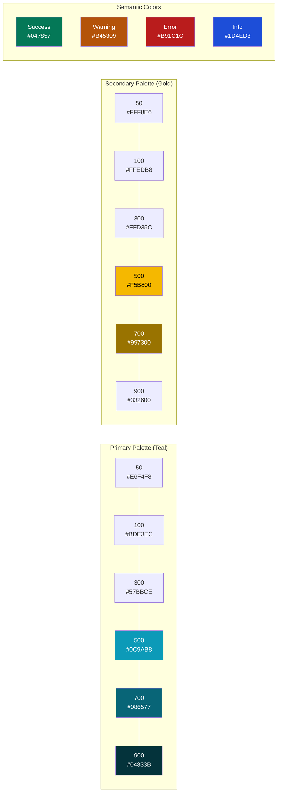
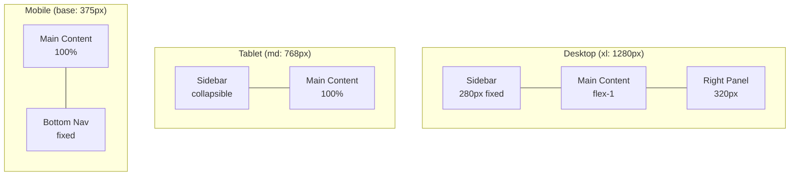
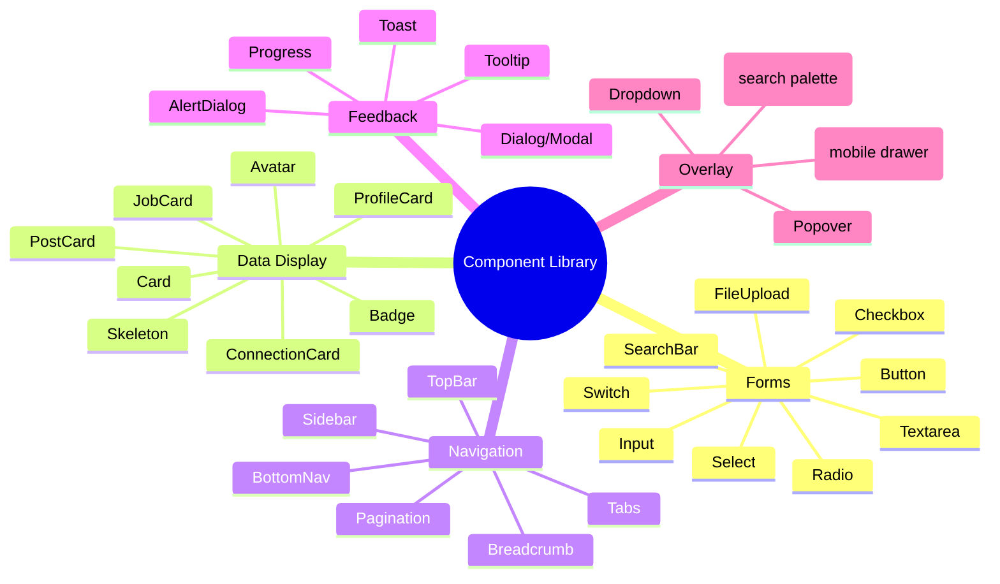
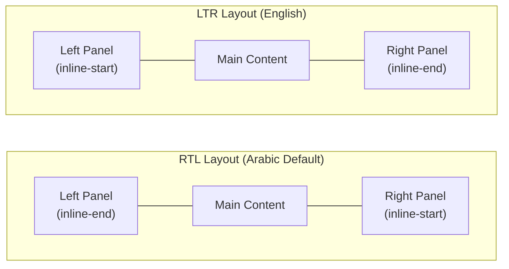
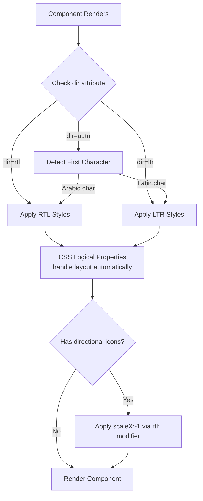
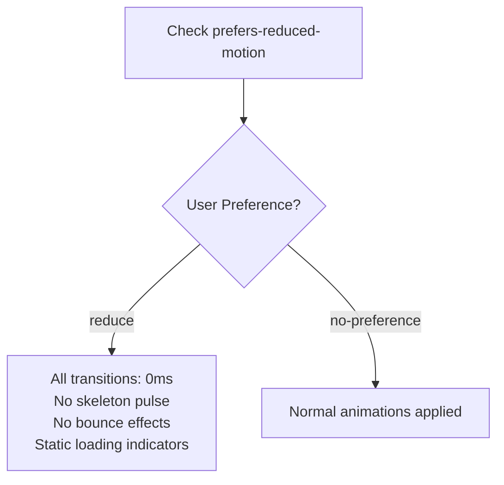
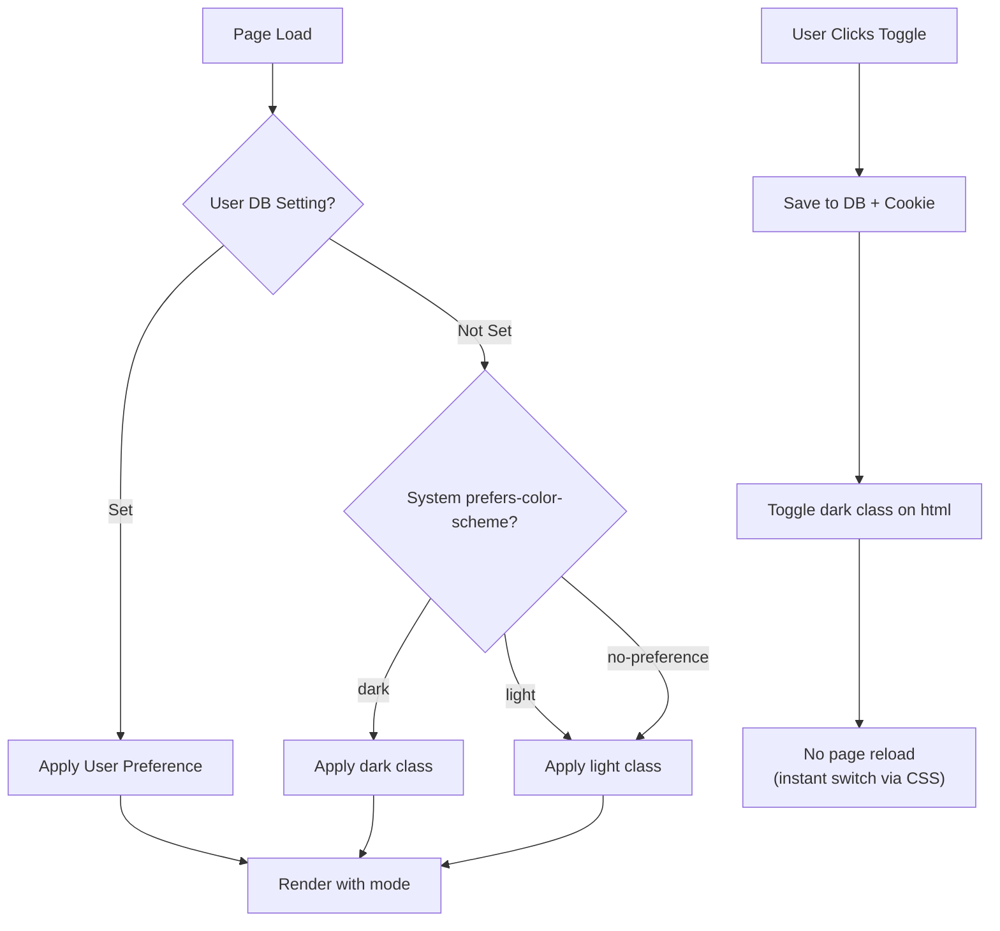
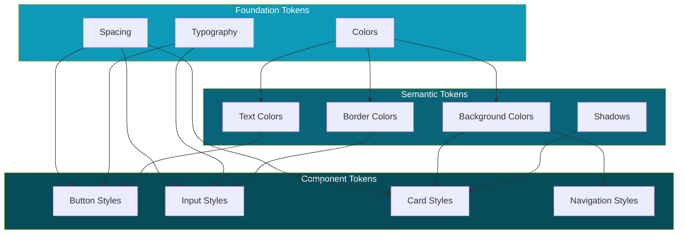

# ConnectIn Design System

> **Version**: 1.0
> **Date**: February 20, 2026
> **Author**: UI/UX Designer
> **Status**: Active
> **Product**: ConnectIn -- Professional Networking Platform

---

## Table of Contents

1. [Design Principles](#1-design-principles)
2. [Color System](#2-color-system)
3. [Typography](#3-typography)
4. [Spacing and Layout](#4-spacing-and-layout)
5. [Component Library](#5-component-library)
6. [RTL and Bidirectional Design](#6-rtl-and-bidirectional-design)
7. [Iconography](#7-iconography)
8. [Motion and Animation](#8-motion-and-animation)
9. [Dark Mode](#9-dark-mode)
10. [Design Tokens Reference](#10-design-tokens-reference)

---

## 1. Design Principles

ConnectIn's design language is governed by seven core principles. Every design decision must be evaluated against these principles, in priority order.

### Principle Hierarchy



| # | Principle | Description | Practical Application |
|---|-----------|-------------|----------------------|
| 1 | **Arabic-First** | The default design direction is RTL. All layouts, components, and flows are designed for Arabic first, then adapted for English LTR. | Use CSS Logical Properties (`margin-inline-start`). Test Arabic layout first. |
| 2 | **Accessibility** | Every user, regardless of ability, must be able to use ConnectIn effectively. WCAG 2.1 AA compliance is mandatory. | 4.5:1 contrast, keyboard navigation, screen reader support, 44px touch targets. |
| 3 | **Clarity** | Professional networking content must be scannable and unambiguous. No decorative noise. | Clean typography, ample whitespace, clear visual hierarchy. |
| 4 | **Consistency** | A button behaves the same everywhere. A card looks the same everywhere. Predictability builds trust. | Use the component library. No one-off styles. |
| 5 | **Performance** | Many MENA users are on mobile with 4G connections. Design for constrained bandwidth. | Lazy load images, skeleton screens, minimal animation, compressed assets. |
| 6 | **Bilingual Harmony** | Arabic and English are equal citizens. Neither language should feel "bolted on." | Bilingual tabs in editors, auto-direction detection, mirrored layouts. |
| 7 | **Progressive Disclosure** | Show the essentials first. Let users drill into details on demand. | Collapsed sections, "View all" links, step-by-step wizards. |

---

## 2. Color System

### 2.1 Primary Palette

The primary palette uses a professional teal-blue that conveys trust, intelligence, and modernity. It avoids LinkedIn's pure blue to establish a distinct brand identity.

| Token | Name | Hex | RGB | Usage |
|-------|------|-----|-----|-------|
| `primary-50` | Teal 50 | `#E6F4F8` | 230, 244, 248 | Backgrounds, hover states |
| `primary-100` | Teal 100 | `#BDE3EC` | 189, 227, 236 | Light backgrounds |
| `primary-200` | Teal 200 | `#8ACFDD` | 138, 207, 221 | Borders, dividers |
| `primary-300` | Teal 300 | `#57BBCE` | 87, 187, 206 | Icons on light backgrounds |
| `primary-400` | Teal 400 | `#30ABC3` | 48, 171, 195 | Secondary actions |
| `primary-500` | Teal 500 | `#0C9AB8` | 12, 154, 184 | **Primary brand color** |
| `primary-600` | Teal 600 | `#0A7F99` | 10, 127, 153 | Primary buttons, links |
| `primary-700` | Teal 700 | `#086577` | 8, 101, 119 | Hover states on primary |
| `primary-800` | Teal 800 | `#064C59` | 6, 76, 89 | Active states |
| `primary-900` | Teal 900 | `#04333B` | 4, 51, 59 | Dark accents |
| `primary-950` | Teal 950 | `#021A1F` | 2, 26, 31 | Deepest accent |

### 2.2 Secondary Palette

A warm amber-gold that complements the teal primary and carries connotations of Arabian heritage and warmth.

| Token | Name | Hex | RGB | Usage |
|-------|------|-----|-----|-------|
| `secondary-50` | Gold 50 | `#FFF8E6` | 255, 248, 230 | Backgrounds |
| `secondary-100` | Gold 100 | `#FFEDB8` | 255, 237, 184 | Light backgrounds |
| `secondary-200` | Gold 200 | `#FFE08A` | 255, 224, 138 | Borders |
| `secondary-300` | Gold 300 | `#FFD35C` | 255, 211, 92 | Decorative elements |
| `secondary-400` | Gold 400 | `#FFC93D` | 255, 201, 61 | Highlights |
| `secondary-500` | Gold 500 | `#F5B800` | 245, 184, 0 | **Secondary brand color** |
| `secondary-600` | Gold 600 | `#CC9900` | 204, 153, 0 | Secondary buttons |
| `secondary-700` | Gold 700 | `#997300` | 153, 115, 0 | Hover states |
| `secondary-800` | Gold 800 | `#664D00` | 102, 77, 0 | Active states |
| `secondary-900` | Gold 900 | `#332600` | 51, 38, 0 | Dark accents |

### 2.3 Semantic Colors

| Token | Hex | Usage | Contrast on White |
|-------|-----|-------|-------------------|
| `success-50` | `#ECFDF5` | Success background | -- |
| `success-500` | `#10B981` | Success text/icons | 3.03:1 (use on dark bg only) |
| `success-700` | `#047857` | Success text on light bg | **4.58:1** |
| `warning-50` | `#FFFBEB` | Warning background | -- |
| `warning-500` | `#F59E0B` | Warning icons | 2.15:1 (icon only) |
| `warning-700` | `#B45309` | Warning text on light bg | **4.78:1** |
| `error-50` | `#FEF2F2` | Error background | -- |
| `error-500` | `#EF4444` | Error icons | 3.12:1 (icon only) |
| `error-700` | `#B91C1C` | Error text on light bg | **5.74:1** |
| `info-50` | `#EFF6FF` | Info background | -- |
| `info-500` | `#3B82F6` | Info icons | 3.13:1 (icon only) |
| `info-700` | `#1D4ED8` | Info text on light bg | **5.46:1** |

### 2.4 Neutral Scale

| Token | Hex | Usage |
|-------|-----|-------|
| `neutral-0` | `#FFFFFF` | Page background |
| `neutral-50` | `#F8FAFC` | Card backgrounds, subtle bg |
| `neutral-100` | `#F1F5F9` | Section backgrounds |
| `neutral-200` | `#E2E8F0` | Borders, dividers |
| `neutral-300` | `#CBD5E1` | Disabled text, placeholders |
| `neutral-400` | `#94A3B8` | Secondary icons |
| `neutral-500` | `#64748B` | Body text (secondary) -- 4.61:1 on white |
| `neutral-600` | `#475569` | Body text (primary) -- 7.07:1 on white |
| `neutral-700` | `#334155` | Headings -- 9.73:1 on white |
| `neutral-800` | `#1E293B` | Primary headings -- 13.58:1 on white |
| `neutral-900` | `#0F172A` | Highest contrast text -- 16.75:1 on white |
| `neutral-950` | `#020617` | Near-black |

### 2.5 Contrast Verification Table

All text/background combinations used in the UI must meet WCAG 2.1 AA standards.

| Text Color | Background | Contrast Ratio | Passes AA (Normal) | Passes AA (Large) |
|------------|------------|:--------------:|:-------------------:|:-----------------:|
| `neutral-900` (#0F172A) | `neutral-0` (#FFFFFF) | 16.75:1 | Yes | Yes |
| `neutral-800` (#1E293B) | `neutral-0` (#FFFFFF) | 13.58:1 | Yes | Yes |
| `neutral-700` (#334155) | `neutral-0` (#FFFFFF) | 9.73:1 | Yes | Yes |
| `neutral-600` (#475569) | `neutral-0` (#FFFFFF) | 7.07:1 | Yes | Yes |
| `neutral-500` (#64748B) | `neutral-0` (#FFFFFF) | 4.61:1 | Yes | Yes |
| `neutral-400` (#94A3B8) | `neutral-0` (#FFFFFF) | 3.07:1 | No | Yes |
| `primary-600` (#0A7F99) | `neutral-0` (#FFFFFF) | 4.52:1 | Yes | Yes |
| `primary-700` (#086577) | `neutral-0` (#FFFFFF) | 5.87:1 | Yes | Yes |
| `neutral-0` (#FFFFFF) | `primary-600` (#0A7F99) | 4.52:1 | Yes | Yes |
| `neutral-0` (#FFFFFF) | `primary-700` (#086577) | 5.87:1 | Yes | Yes |
| `error-700` (#B91C1C) | `neutral-0` (#FFFFFF) | 5.74:1 | Yes | Yes |
| `success-700` (#047857) | `neutral-0` (#FFFFFF) | 4.58:1 | Yes | Yes |

### Color Palette Visualization



---

## 3. Typography

### 3.1 Font Families

| Role | Arabic Font | Latin Font | Fallback Stack |
|------|-------------|------------|----------------|
| **Primary** | IBM Plex Arabic | Inter | `'IBM Plex Arabic', 'Inter', system-ui, -apple-system, sans-serif` |
| **Monospace** | IBM Plex Mono Arabic | IBM Plex Mono | `'IBM Plex Mono', 'Courier New', monospace` |

**Why IBM Plex Arabic**: Designed by IBM for screen readability across Latin and Arabic scripts with matching metrics, ensuring harmonious bilingual typography. Open-source (OFL license).

**Why Inter**: Designed for screen interfaces with excellent legibility at small sizes, wide language support, and variable font support for performance.

### 3.2 Type Scale

All sizes use `rem` units for accessibility (user font-size preferences respected).

| Token | Size (rem) | Size (px) | Weight | Line Height (AR) | Line Height (EN) | Letter Spacing (AR) | Letter Spacing (EN) | Usage |
|-------|:----------:|:---------:|:------:|:-----------------:|:-----------------:|:--------------------:|:--------------------:|-------|
| `display` | 3 | 48 | 700 | 1.2 | 1.1 | 0 | -0.02em | Hero sections |
| `h1` | 2.25 | 36 | 700 | 1.3 | 1.2 | 0 | -0.02em | Page titles |
| `h2` | 1.875 | 30 | 600 | 1.35 | 1.25 | 0 | -0.01em | Section headings |
| `h3` | 1.5 | 24 | 600 | 1.4 | 1.3 | 0 | -0.01em | Card titles |
| `h4` | 1.25 | 20 | 600 | 1.4 | 1.35 | 0 | 0 | Subsection headings |
| `h5` | 1.125 | 18 | 600 | 1.5 | 1.4 | 0 | 0 | Minor headings |
| `h6` | 1 | 16 | 600 | 1.5 | 1.4 | 0 | 0 | Label headings |
| `body-lg` | 1.125 | 18 | 400 | 1.75 | 1.6 | 0 | 0 | Feature descriptions |
| `body` | 1 | 16 | 400 | 1.75 | 1.5 | 0 | 0 | **Default body text** |
| `body-sm` | 0.875 | 14 | 400 | 1.7 | 1.5 | 0 | 0.01em | Secondary text, meta |
| `caption` | 0.75 | 12 | 400 | 1.6 | 1.4 | 0 | 0.02em | Timestamps, badges |
| `overline` | 0.75 | 12 | 600 | 1.6 | 1.4 | 0.05em | 0.08em | Labels, categories |

### 3.3 Font Weights

| Token | Weight | Usage |
|-------|:------:|-------|
| `font-regular` | 400 | Body text, descriptions |
| `font-medium` | 500 | Buttons, navigation items |
| `font-semibold` | 600 | Headings, card titles |
| `font-bold` | 700 | Page titles, display text, emphasis |

### 3.4 Arabic Typography Notes

Arabic text requires special treatment:

1. **Line height**: Arabic scripts use more vertical space due to diacritical marks (tashkeel). Line heights are 10-15% taller than Latin equivalents.
2. **Letter spacing**: Arabic is a connected script. Adding letter spacing breaks ligatures. Use `letter-spacing: 0` for all Arabic text.
3. **Font size**: Arabic glyphs often appear smaller at the same pixel size as Latin glyphs. Consider bumping Arabic text by 1-2px in compact layouts.
4. **Text alignment**: Arabic text is right-aligned by default. Use `text-align: start` (CSS Logical Property) to handle both directions.
5. **Number display**: When `lang="ar"`, offer option for Eastern Arabic numerals (١٢٣) vs Western (123) per user preference (NFR-404).

### Typography Hierarchy

```mermaid
graph TD
    subgraph Hierarchy["Visual Hierarchy"]
        D["display (48px / 700)<br/>Hero Text"]
        H1["h1 (36px / 700)<br/>Page Titles"]
        H2["h2 (30px / 600)<br/>Section Headings"]
        H3["h3 (24px / 600)<br/>Card Titles"]
        H4["h4 (20px / 600)<br/>Subsections"]
        BL["body-lg (18px / 400)<br/>Feature Descriptions"]
        B["body (16px / 400)<br/>Default Body"]
        BS["body-sm (14px / 400)<br/>Secondary Text"]
        C["caption (12px / 400)<br/>Timestamps"]
    end

    D --> H1 --> H2 --> H3 --> H4 --> BL --> B --> BS --> C

    style D fill:#0F172A,color:#fff
    style H1 fill:#1E293B,color:#fff
    style H2 fill:#334155,color:#fff
    style H3 fill:#475569,color:#fff
    style B fill:#64748B,color:#fff
```



---

## 4. Spacing and Layout

### 4.1 Spacing Scale (8px Grid)

All spacing uses multiples of 4px, with 8px as the primary unit.

| Token | Value | Tailwind | Usage |
|-------|:-----:|---------|-------|
| `space-0` | 0px | `p-0` | Reset |
| `space-0.5` | 2px | `p-0.5` | Hairline gaps |
| `space-1` | 4px | `p-1` | Tight inline spacing |
| `space-2` | 8px | `p-2` | Default inline spacing |
| `space-3` | 12px | `p-3` | Compact padding |
| `space-4` | 16px | `p-4` | Standard padding |
| `space-5` | 20px | `p-5` | Comfortable padding |
| `space-6` | 24px | `p-6` | Card padding |
| `space-8` | 32px | `p-8` | Section padding |
| `space-10` | 40px | `p-10` | Large section gaps |
| `space-12` | 48px | `p-12` | Page section margins |
| `space-16` | 64px | `p-16` | Major layout gaps |
| `space-20` | 80px | `p-20` | Hero spacing |
| `space-24` | 96px | `p-24` | Page top/bottom padding |

### 4.2 Responsive Breakpoints

Mobile-first breakpoints aligned with common device widths.

| Token | Min Width | Tailwind Prefix | Target Devices |
|-------|:---------:|:---------------:|----------------|
| (base) | 0px | (none) | Small phones |
| `sm` | 640px | `sm:` | Large phones, small tablets |
| `md` | 768px | `md:` | Tablets portrait |
| `lg` | 1024px | `lg:` | Tablets landscape, small laptops |
| `xl` | 1280px | `xl:` | Desktop |
| `2xl` | 1536px | `2xl:` | Large desktop |

### 4.3 Container Widths

| Breakpoint | Max Width | Padding (inline) |
|------------|:---------:|:----------------:|
| base | 100% | 16px |
| `sm` | 640px | 16px |
| `md` | 768px | 24px |
| `lg` | 1024px | 32px |
| `xl` | 1280px | 32px |
| `2xl` | 1400px | 32px |

### 4.4 Layout Grid



### 4.5 Common Layout Patterns

| Pattern | Structure | Breakpoint Behavior |
|---------|-----------|---------------------|
| **Feed Layout** | Sidebar + Feed + Right Panel | Mobile: full width + bottom nav; Tablet: collapsible sidebar + feed; Desktop: 3-column |
| **Profile Layout** | Banner + Avatar + Content | Mobile: stacked; Desktop: banner spans full width, content in constrained container |
| **Messaging Layout** | Conversation List + Thread | Mobile: list OR thread (navigate between); Desktop: side-by-side split |
| **Settings Layout** | Nav + Form | Mobile: stacked (nav as tabs); Desktop: sidebar nav + form panel |
| **Search Layout** | Search Bar + Tabs + Results | Consistent across breakpoints; grid columns vary |

### 4.6 Border Radius Scale

| Token | Value | Usage |
|-------|:-----:|-------|
| `rounded-sm` | 4px | Badges, small elements |
| `rounded` | 6px | Buttons, inputs |
| `rounded-md` | 8px | Cards, dropdowns |
| `rounded-lg` | 12px | Modals, larger cards |
| `rounded-xl` | 16px | Dialogs, popovers |
| `rounded-full` | 9999px | Avatars, pills |

### 4.7 Shadow Scale

| Token | Value | Usage |
|-------|-------|-------|
| `shadow-sm` | `0 1px 2px rgba(0,0,0,0.05)` | Subtle lift (cards) |
| `shadow` | `0 1px 3px rgba(0,0,0,0.1), 0 1px 2px rgba(0,0,0,0.06)` | Default cards |
| `shadow-md` | `0 4px 6px rgba(0,0,0,0.1), 0 2px 4px rgba(0,0,0,0.06)` | Elevated cards, dropdowns |
| `shadow-lg` | `0 10px 15px rgba(0,0,0,0.1), 0 4px 6px rgba(0,0,0,0.05)` | Modals, popovers |
| `shadow-xl` | `0 20px 25px rgba(0,0,0,0.1), 0 10px 10px rgba(0,0,0,0.04)` | Toasts, overlays |

---

## 5. Component Library

All components are built on shadcn/ui primitives and extended for RTL support, bilingual content, and ConnectIn-specific needs.

### 5.1 Component Inventory



### 5.2 Button

**Base**: shadcn/ui `Button`

| Variant | Background | Text | Border | Usage |
|---------|------------|------|--------|-------|
| `primary` | `primary-600` | `neutral-0` | none | Primary actions (Post, Connect, Apply) |
| `secondary` | `neutral-100` | `neutral-700` | `neutral-200` | Secondary actions (Cancel, Back) |
| `outline` | transparent | `primary-600` | `primary-600` | Tertiary actions (Follow, Save) |
| `ghost` | transparent | `neutral-600` | none | Inline actions (Like, Comment icons) |
| `destructive` | `error-700` | `neutral-0` | none | Delete, Remove, Ban |
| `link` | transparent | `primary-600` | none | Inline links styled as buttons |

| Size | Height | Padding (inline) | Font Size | Icon Size |
|------|:------:|:-----------------:|:---------:|:---------:|
| `sm` | 32px | 12px | 14px | 16px |
| `md` | 40px | 16px | 14px | 18px |
| `lg` | 48px | 24px | 16px | 20px |
| `xl` | 56px | 32px | 18px | 24px |

**States**: default, hover (`primary-700`), focus (ring: `primary-300` 2px offset), active (`primary-800`), disabled (opacity 0.5, cursor not-allowed), loading (spinner replaces text).

### 5.3 Input

**Base**: shadcn/ui `Input`

| Variant | Usage |
|---------|-------|
| `text` | General text input |
| `email` | Email field with validation |
| `password` | Password with show/hide toggle |
| `search` | Search bar with magnifier icon and clear button |
| `textarea` | Multi-line text input (posts, comments, messages) |
| `url` | Website URL input |

| State | Border | Background | Label Color |
|-------|--------|------------|-------------|
| Default | `neutral-200` | `neutral-0` | `neutral-600` |
| Focus | `primary-500` (2px) | `neutral-0` | `primary-600` |
| Error | `error-500` (2px) | `error-50` | `error-700` |
| Disabled | `neutral-200` | `neutral-100` | `neutral-400` |
| Read-only | `neutral-200` | `neutral-50` | `neutral-500` |

**RTL/LTR States**: Inputs auto-detect text direction. If the first strongly-typed character is Arabic, the input direction switches to RTL. Icons (search magnifier, password toggle) are placed at `inline-end`.

### 5.4 Card Variants

All cards use `rounded-md` (8px), `shadow-sm`, `neutral-0` background, and `space-4` (16px) padding.

#### ProfileCard
- Avatar (64px), display name (`h4`), headline (`body-sm`), location (`caption`), mutual connections count
- Action buttons: Connect / Message / Connected
- RTL: layout mirrors, text alignment follows direction

#### PostCard
- Author avatar (40px) + name + headline + timestamp
- Post content with auto-direction detection
- Image grid (1-4 images)
- Engagement bar: Like, Comment, Share counts + action buttons
- Hashtags as clickable badges

#### JobCard
- Job title (`h4`), company name, location, work type badge (Remote/Hybrid/Onsite)
- Salary range (if provided), experience level badge
- Posted date, application count
- Action buttons: Apply, Save

#### ConnectionCard
- Avatar (48px), name, headline
- Mutual connections count
- Accept / Reject buttons (for pending) or Message / Remove (for connected)

### 5.5 Avatar

| Size | Dimensions | Usage |
|------|:----------:|-------|
| `xs` | 24px | Inline mentions |
| `sm` | 32px | Comment threads, compact lists |
| `md` | 40px | Post author, message sender |
| `lg` | 64px | Profile cards, connection cards |
| `xl` | 96px | Profile page header |
| `2xl` | 128px | Profile page (desktop) |

**Variants**: Image, initials fallback (background: `primary-100`, text: `primary-700`), online indicator (green dot, 12px, positioned at bottom-end).

### 5.6 Navigation Components

#### TopBar (Desktop + Tablet)
- Height: 64px
- Contents: Logo (inline-start), Search bar (center), nav icons (inline-end): Home, Network, Jobs, Messages (with unread badge), Notifications, Avatar dropdown
- Language toggle button
- Sticky at top

#### Sidebar (Desktop)
- Width: 280px
- Contents: Profile mini-card, navigation links, trending topics
- Collapsible on tablet

#### BottomNav (Mobile)
- Height: 56px + safe area
- Contents: 5 icons: Home, Network, Post (+), Messages, Profile
- Fixed at bottom
- Active indicator: `primary-600` icon + label

### 5.7 Modal/Dialog

- Max width: 480px (sm), 640px (md), 800px (lg)
- Overlay: `rgba(0, 0, 0, 0.5)`
- Focus trap: enabled
- Close: X button (inline-end), Escape key, overlay click
- Animation: fade-in overlay + slide-up dialog (200ms ease-out)
- Header + body + footer pattern

### 5.8 Toast/Notification

- Position: top-end (RTL: top-start)
- Max width: 360px
- Duration: 5000ms (auto-dismiss), persistent for errors
- Variants: success (green), error (red), warning (amber), info (blue)
- Action button optional
- Stacks vertically (max 3 visible)

### 5.9 Badge

| Variant | Background | Text | Usage |
|---------|------------|------|-------|
| `default` | `neutral-100` | `neutral-700` | General labels |
| `primary` | `primary-100` | `primary-700` | Skills, hashtags |
| `success` | `success-50` | `success-700` | Active, Verified |
| `warning` | `warning-50` | `warning-700` | Pending, Draft |
| `error` | `error-50` | `error-700` | Closed, Banned |
| `secondary` | `secondary-100` | `secondary-700` | Featured, Premium |

### 5.10 Skeleton Loaders

Every component has a corresponding skeleton variant that matches its dimensions exactly. Skeleton elements use a pulsing animation (`neutral-200` to `neutral-100`, 1.5s ease-in-out infinite).

| Component | Skeleton Structure |
|-----------|-------------------|
| PostCard | Circle (avatar) + 2 short lines + long line + rectangle (image) + 3 small circles (actions) |
| ProfileCard | Circle (avatar) + 2 lines + button shape |
| JobCard | 2 lines + short line + badge shapes + button shape |
| Feed | 3-5 PostCard skeletons stacked |

---

## 6. RTL and Bidirectional Design

### 6.1 CSS Logical Properties Reference

**Mandatory rule**: Physical properties (`left`, `right`, `margin-left`, `padding-right`) are **never** used. All layout properties must use logical equivalents.

| Physical Property | Logical Property | Tailwind Class |
|-------------------|-----------------|----------------|
| `margin-left` | `margin-inline-start` | `ms-*` |
| `margin-right` | `margin-inline-end` | `me-*` |
| `padding-left` | `padding-inline-start` | `ps-*` |
| `padding-right` | `padding-inline-end` | `pe-*` |
| `left` | `inset-inline-start` | `start-*` |
| `right` | `inset-inline-end` | `end-*` |
| `text-align: left` | `text-align: start` | `text-start` |
| `text-align: right` | `text-align: end` | `text-end` |
| `border-left` | `border-inline-start` | `border-s-*` |
| `border-right` | `border-inline-end` | `border-e-*` |
| `float: left` | `float: inline-start` | `float-start` |
| `float: right` | `float: inline-end` | `float-end` |

### 6.2 Directional Layout



### 6.3 Mixed Content Handling

When a post or message contains both Arabic and English text:

1. The **block direction** (overall text alignment) follows the first strongly-typed character.
2. **Inline direction switching** is handled by the Unicode bidirectional algorithm (browser-native).
3. The `dir="auto"` attribute is applied to user-generated content containers.
4. For form inputs, `dir="auto"` enables automatic direction detection as the user types.

### 6.4 Icon Mirroring Rules

| Category | Examples | Mirror in RTL? |
|----------|---------|:--------------:|
| **Directional** | Arrow left/right, chevron, back, forward, undo, redo | **Yes** |
| **Non-directional** | Search, heart, star, bell, settings gear, camera | No |
| **Text-related** | Align left/right, indent, outdent, list | **Yes** |
| **Media controls** | Play, pause, skip forward/back | No (universal convention) |
| **Communication** | Send (paper plane), reply | **Yes** |
| **Navigation** | External link, download | No |

Implementation: use Tailwind's `rtl:` modifier to apply `transform: scaleX(-1)` on icons that must mirror.

### 6.5 Form Layout in RTL

```
RTL Form Layout:
+--------------------------------------------+
|                              :Label (end)  |
|  [Clear] [Input field value.............]  |
|                   :Helper text or error    |
+--------------------------------------------+

LTR Form Layout:
+--------------------------------------------+
|  Label: (start)                            |
|  [Input field value...............] [Clear] |
|  Helper text or error:                     |
+--------------------------------------------+
```

- Labels are placed at `inline-start` (which visually appears on the right in RTL)
- Action icons in inputs are at `inline-end`
- Error messages align to `inline-start`

### RTL Adaptation Flow



---

## 7. Iconography

### 7.1 Icon Set

**Primary set**: [Lucide Icons](https://lucide.dev/) -- open-source, consistent 24px grid, 1.5px stroke width.

### 7.2 Icon Size Scale

| Token | Size | Stroke Width | Usage |
|-------|:----:|:------------:|-------|
| `icon-xs` | 14px | 1.5px | Inline badges, tiny indicators |
| `icon-sm` | 16px | 1.5px | Button icons (small), input icons |
| `icon-md` | 20px | 1.5px | **Default** -- nav items, action buttons |
| `icon-lg` | 24px | 2px | Section headers, prominent actions |
| `icon-xl` | 32px | 2px | Empty states, feature illustrations |
| `icon-2xl` | 48px | 2px | Hero illustrations, onboarding |

### 7.3 Key Icon Mapping

| Feature | Icon | Lucide Name |
|---------|------|-------------|
| Home | House | `home` |
| Network | Users | `users` |
| Jobs | Briefcase | `briefcase` |
| Messages | MessageCircle | `message-circle` |
| Notifications | Bell | `bell` |
| Search | Search | `search` |
| Post/Create | PlusCircle | `plus-circle` |
| Like | Heart | `heart` |
| Comment | MessageSquare | `message-square` |
| Share | Share2 | `share-2` |
| Settings | Settings | `settings` |
| Profile | User | `user` |
| Edit | Pencil | `pencil` |
| Delete | Trash2 | `trash-2` |
| Close | X | `x` |
| Back | ArrowLeft (mirrors in RTL) | `arrow-left` |
| Language | Globe | `globe` |
| AI Optimize | Sparkles | `sparkles` |
| Upload | Upload | `upload` |
| External Link | ExternalLink | `external-link` |
| Verified Badge | BadgeCheck | `badge-check` |

### 7.4 Custom Icons Needed

| Icon | Description | Reason |
|------|-------------|--------|
| ConnectIn Logo | Stylized "C" with network node motif | Brand identity |
| Arabic/English Toggle | "ع/En" text-based toggle | Language switcher in header |
| Connection + AI | User icon with sparkle | AI-suggested connections |
| Bilingual Post | Document with AR+EN indicator | Bilingual content indicator |

---

## 8. Motion and Animation

### 8.1 Timing Tokens

| Token | Duration | Easing | Usage |
|-------|:--------:|--------|-------|
| `duration-instant` | 100ms | `ease-out` | Hover states, active states |
| `duration-fast` | 150ms | `ease-out` | Tooltips, dropdowns |
| `duration-normal` | 200ms | `ease-in-out` | Modals, dialogs, page transitions |
| `duration-slow` | 300ms | `ease-in-out` | Complex animations, skeleton fade |
| `duration-slower` | 500ms | `ease-in-out` | Page-level transitions |

### 8.2 Animation Patterns

| Pattern | Duration | Description |
|---------|----------|-------------|
| **Fade In** | 200ms | Opacity 0 to 1. Used for toasts, modals appearing. |
| **Slide Up** | 200ms | TranslateY 8px to 0 + fade in. Used for dialogs, bottom sheets. |
| **Scale In** | 150ms | Scale 0.95 to 1 + fade in. Used for dropdowns, popovers. |
| **Skeleton Pulse** | 1500ms | Background alternates `neutral-200` to `neutral-100`. Infinite loop. |
| **Spinner** | 600ms | 360-degree rotation. Used for loading states. |
| **Like Bounce** | 300ms | Scale 1 to 1.2 to 1 with color change. Used for like button. |
| **Count Increment** | 200ms | Slide-up number replacement. Used for like/comment counts. |

### 8.3 Reduced Motion

When `prefers-reduced-motion: reduce` is active:

- All animations are replaced with instant state changes (duration: 0ms)
- Skeleton loaders use a static `neutral-200` (no pulsing)
- Like bounce is replaced with color change only
- Spinner is replaced with a static loading icon
- Page transitions are instant (no slide/fade)



---

## 9. Dark Mode

### 9.1 Dark Mode Color Mapping

| Token | Light Mode | Dark Mode | Notes |
|-------|------------|-----------|-------|
| `bg-page` | `#FFFFFF` | `#0F172A` | Page background |
| `bg-card` | `#FFFFFF` | `#1E293B` | Card backgrounds |
| `bg-elevated` | `#F8FAFC` | `#334155` | Elevated surfaces |
| `bg-input` | `#FFFFFF` | `#1E293B` | Input backgrounds |
| `border-default` | `#E2E8F0` | `#334155` | Default borders |
| `border-strong` | `#CBD5E1` | `#475569` | Emphasized borders |
| `text-primary` | `#0F172A` | `#F1F5F9` | Primary text |
| `text-secondary` | `#475569` | `#94A3B8` | Secondary text |
| `text-muted` | `#64748B` | `#64748B` | Muted text (same both modes) |
| `text-link` | `#0A7F99` | `#30ABC3` | Link text |
| `primary-button-bg` | `#0A7F99` | `#0C9AB8` | Primary button |
| `primary-button-text` | `#FFFFFF` | `#FFFFFF` | Primary button text |
| `shadow` | `rgba(0,0,0,0.1)` | `rgba(0,0,0,0.4)` | Shadow color |

### 9.2 Dark Mode Contrast Verification

| Text | Background | Ratio (Dark Mode) | Passes AA |
|------|------------|:------------------:|:---------:|
| `#F1F5F9` (text-primary) | `#0F172A` (bg-page) | 15.39:1 | Yes |
| `#94A3B8` (text-secondary) | `#0F172A` (bg-page) | 5.47:1 | Yes |
| `#94A3B8` (text-secondary) | `#1E293B` (bg-card) | 4.08:1 | No (use on large text only) |
| `#CBD5E1` (text-secondary-alt) | `#1E293B` (bg-card) | 6.45:1 | Yes |
| `#30ABC3` (text-link) | `#0F172A` (bg-page) | 6.24:1 | Yes |
| `#FFFFFF` (button-text) | `#0C9AB8` (primary-btn) | 4.37:1 | No -- use `#0A7F99` for AA |

### 9.3 Implementation

Dark mode is implemented via Tailwind's `dark:` variant, toggled by a class on `<html>`:

```
<html dir="rtl" lang="ar" class="dark">
```

User preference hierarchy:
1. Explicit user setting in `/settings/language` (persisted in DB)
2. System preference (`prefers-color-scheme: dark`)
3. Default: light mode

### Dark Mode Architecture



---

## 10. Design Tokens Reference

### 10.1 Tailwind Configuration Summary

The following tokens extend the default Tailwind configuration:

```
colors:
  primary: { 50-950 as defined above }
  secondary: { 50-900 as defined above }
  success: { 50, 500, 700 }
  warning: { 50, 500, 700 }
  error: { 50, 500, 700 }
  info: { 50, 500, 700 }

fontFamily:
  sans: ['IBM Plex Arabic', 'Inter', 'system-ui', 'sans-serif']
  mono: ['IBM Plex Mono', 'Courier New', 'monospace']

fontSize:
  display: ['3rem', { lineHeight: '1.2', fontWeight: '700' }]
  (and all tokens from the type scale table)

borderRadius:
  sm: '4px'
  DEFAULT: '6px'
  md: '8px'
  lg: '12px'
  xl: '16px'

spacing:
  (follows the 8px grid scale above)
```

### 10.2 Z-Index Scale

| Token | Value | Usage |
|-------|:-----:|-------|
| `z-base` | 0 | Default layer |
| `z-dropdown` | 10 | Dropdowns, popovers |
| `z-sticky` | 20 | Sticky headers, navigation |
| `z-overlay` | 30 | Modal overlays |
| `z-modal` | 40 | Modal dialogs |
| `z-toast` | 50 | Toast notifications |
| `z-tooltip` | 60 | Tooltips (highest) |

### Token Dependency Map



---

## Document History

| Version | Date | Author | Changes |
|---------|------|--------|---------|
| 1.0 | 2026-02-20 | UI/UX Designer (AI Agent) | Initial design system creation |
