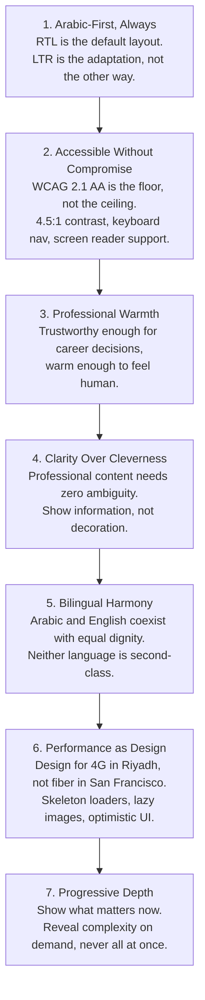
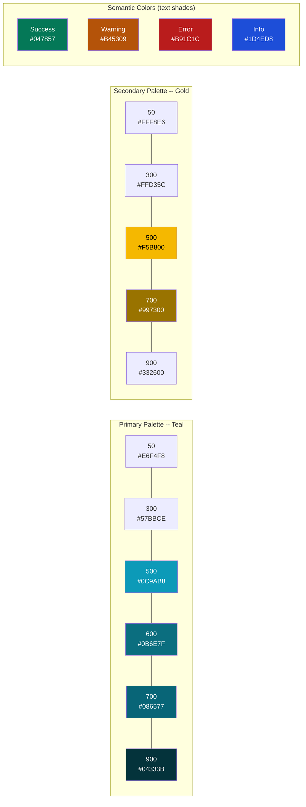
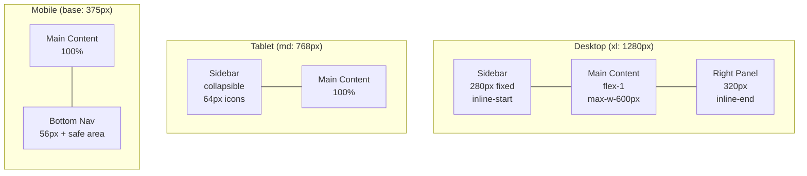
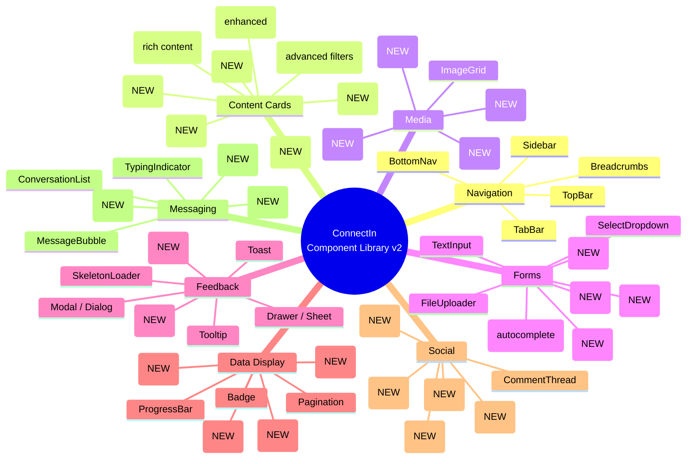
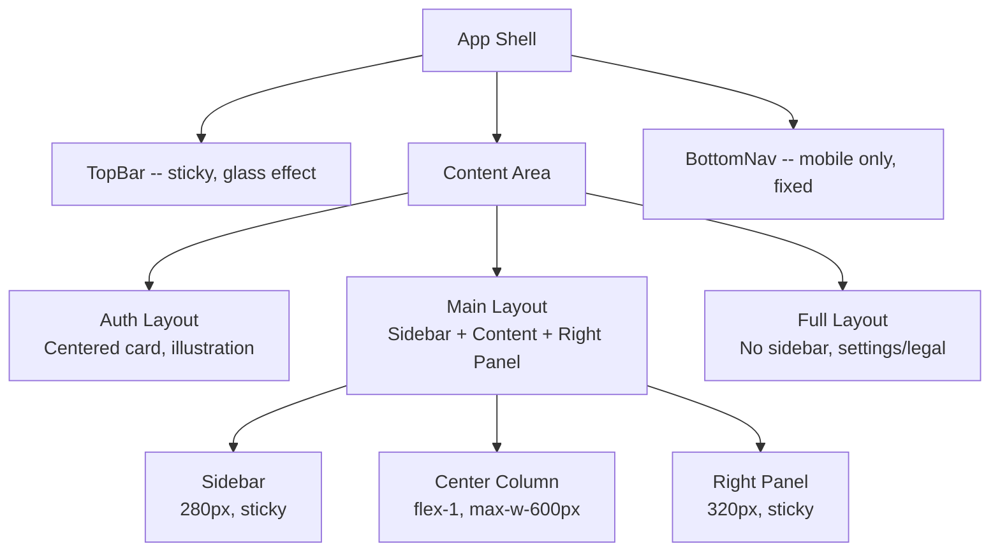
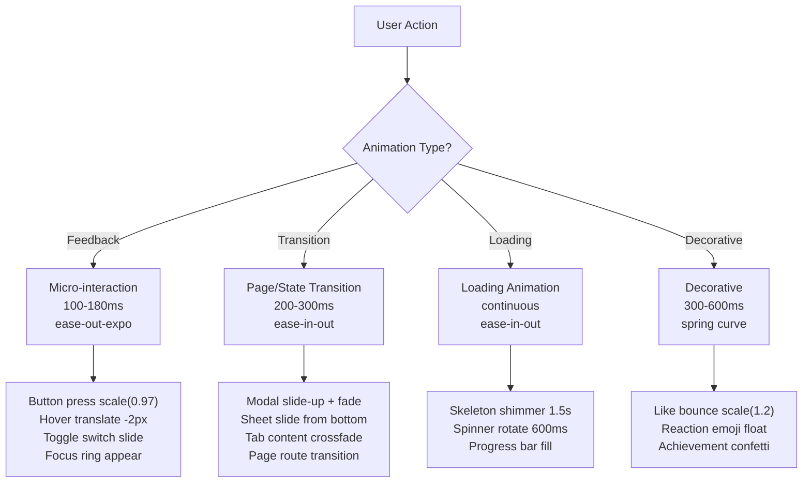
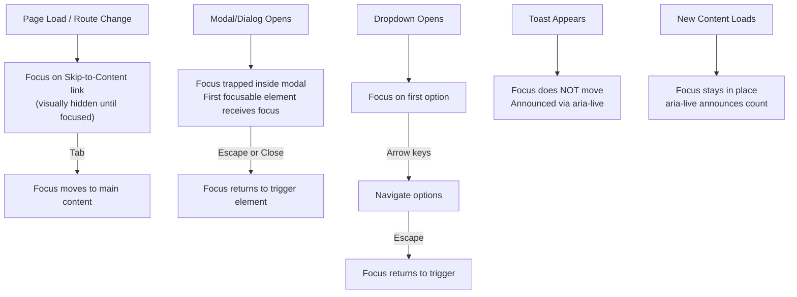
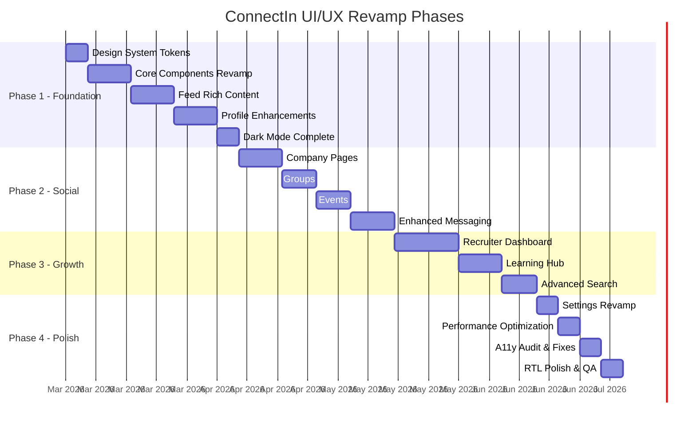
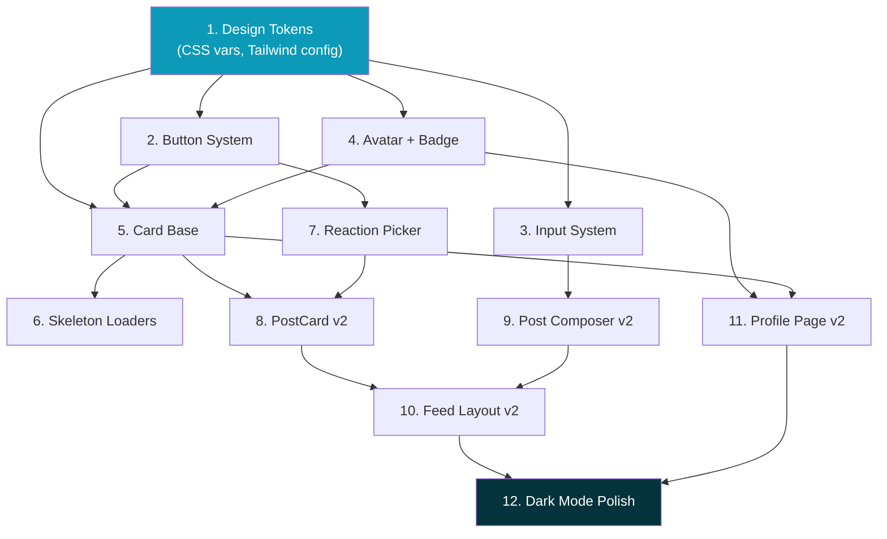

# ConnectIn UI/UX Design System & Revamp Plan

> **Version**: 2.0
> **Date**: February 24, 2026
> **Author**: UI/UX Designer
> **Status**: Active
> **Product**: ConnectIn -- Arabic-First Professional Networking Platform
> **Supersedes**: DESIGN-SYSTEM.md v1.0, WIREFRAMES.md v1.0

---

## Table of Contents

1. [Design Philosophy](#1-design-philosophy)
2. [Design System Foundation](#2-design-system-foundation)
3. [Component Library Plan](#3-component-library-plan)
4. [Page-by-Page Design Specs](#4-page-by-page-design-specs)
5. [Interaction Design](#5-interaction-design)
6. [Accessibility Specification](#6-accessibility-specification)
7. [Implementation Priority](#7-implementation-priority)

---

## 1. Design Philosophy

### Vision Statement

ConnectIn is the professional networking platform that treats Arabic as a first-class language, not an afterthought. Our design language blends the warmth and geometric elegance of Arabic calligraphic tradition with the clean precision of modern interface design. Every pixel serves a purpose: connecting Arab and MENA tech professionals with the same dignity and delight that Western-centric platforms reserve for Latin-script users.

We draw inspiration from the geometric patterns of Islamic architecture -- repeating, symmetrical, purposeful -- and translate those principles into a digital system where every component is modular, every layout is balanced, and every interaction respects the user's time and attention.

### Design Principles



| # | Principle | Description | In Practice |
|---|-----------|-------------|-------------|
| 1 | **Arabic-First, Always** | The default design direction is RTL. All layouts, components, and user flows are authored for Arabic first, then adapted for English. CSS Logical Properties are mandatory. | Use `margin-inline-start`, not `margin-left`. Test Arabic layout first. Every wireframe shows RTL as the primary view. |
| 2 | **Accessible Without Compromise** | Every user, regardless of ability, uses ConnectIn effectively. WCAG 2.1 AA is non-negotiable across both languages and both themes. | 4.5:1 contrast minimum, 44px touch targets, keyboard-navigable everything, `aria-live` for dynamic content. |
| 3 | **Professional Warmth** | ConnectIn carries the weight of career decisions -- job applications, professional introductions, recruiter outreach. It must feel trustworthy yet approachable. The teal-gold palette evokes Gulf waters and desert sun, grounding the brand in MENA identity. | Rounded corners (18px cards), Apple-style layered shadows, warm gold accents on achievements and badges, but restrained animation. |
| 4 | **Clarity Over Cleverness** | No decorative noise. Every element earns its place. Typography hierarchy is strict. Whitespace is generous. The interface fades into the background so the content -- people, jobs, conversations -- commands attention. | Clean type scale, ample padding, no gratuitous gradients, no icon-only buttons without tooltips. |
| 5 | **Bilingual Harmony** | Arabic and English are equal citizens. Neither language should feel "bolted on." Bilingual inputs, auto-direction detection, and culturally appropriate iconography ensure both audiences feel at home. | Bilingual tabs in editors, `dir="auto"` on user content, mirrored layouts with logical properties, Eastern Arabic numeral option. |
| 6 | **Performance as Design** | Many MENA users are on mobile with constrained bandwidth. A skeleton screen that appears in 200ms feels faster than a spinner that blocks for 2 seconds. Every design decision accounts for perceived performance. | Skeleton loaders for every content type, `<Image>` with blur placeholders, lazy-loaded below-fold content, optimistic like/comment updates. |
| 7 | **Progressive Depth** | Show the essentials first. Let users drill into details on demand. Profile cards show name and headline; tap to see the full profile. Feed posts truncate after 300 characters; tap "see more" to expand. | Collapsed sections, "View all" links, step-by-step wizards, bottom sheets instead of new pages on mobile. |

### Cultural Design Considerations

| Consideration | Approach |
|---------------|----------|
| **Arabic script geometry** | Arabic is a connected, flowing script. Our border radii (18px cards, pill buttons) echo the curves of Arabic letterforms. Spacing is generous to give Arabic text room to breathe. |
| **Color symbolism** | Teal evokes Gulf waters and trust. Gold evokes desert warmth, achievement, and Arabian heritage. Green is reserved for success states (not branding) to avoid confusion with national/religious associations. |
| **Reading patterns** | Arabic readers scan right-to-left, top-to-bottom. Primary content is at inline-start (right in RTL). Navigation follows the same pattern. |
| **Formality spectrum** | MENA professional culture varies by market. ConnectIn uses formal-but-friendly tone: "Your professional headline" not "Tell us about yourself!" Playful microcopy is saved for low-stakes interactions (reactions, emoji). |
| **Privacy expectations** | Gulf culture values privacy in professional contexts. Default visibility settings are conservative. Profile photos show initials by default until the user uploads. "Who viewed your profile" is opt-in. |
| **Number formats** | Eastern Arabic numerals (Arabic-Indic: ??|????) are the default when `lang="ar"`, with Western Arabic (123) as a user preference. |

---

## 2. Design System Foundation

### 2.1 Color Palette

#### Primary Palette (Teal)

A professional teal that conveys trust, intelligence, and modernity. Distinct from LinkedIn's corporate blue.

| Token | Hex | Light Mode Usage | Dark Mode Usage | Contrast on White |
|-------|-----|-------------------|-----------------|:-----------------:|
| `primary-50` | `#E6F4F8` | Hover backgrounds, selected states | -- | -- |
| `primary-100` | `#BDE3EC` | Light backgrounds, badge fills | -- | -- |
| `primary-200` | `#8ACFDD` | Borders, dividers | -- | -- |
| `primary-300` | `#57BBCE` | Focus rings, icons on light bg | Links, focus rings | 2.50:1 (decorative) |
| `primary-400` | `#30ABC3` | Secondary actions | Links, active states | 3.44:1 (large text) |
| `primary-500` | `#0C9AB8` | Brand color, toggle tracks | Button backgrounds | 3.72:1 (UI elements) |
| `primary-600` | `#0B6E7F` | **Primary buttons, links** | -- | **5.20:1** |
| `primary-700` | `#086577` | Hover states on primary | -- | **5.87:1** |
| `primary-800` | `#064C59` | Active/pressed states | -- | 8.13:1 |
| `primary-900` | `#04333B` | Dark accents | -- | 11.47:1 |
| `primary-950` | `#021A1F` | Deepest accent | -- | 15.28:1 |

#### Secondary Palette (Gold)

Warm amber-gold carrying connotations of Arabian heritage, achievement, and warmth.

| Token | Hex | Usage | Contrast on White |
|-------|-----|-------|:-----------------:|
| `secondary-50` | `#FFF8E6` | Achievement backgrounds | -- |
| `secondary-100` | `#FFEDB8` | Badge fills, highlights | -- |
| `secondary-200` | `#FFE08A` | Decorative borders | -- |
| `secondary-300` | `#FFD35C` | Decorative elements | 1.65:1 (decorative) |
| `secondary-400` | `#FFC93D` | Highlights, stars | 1.82:1 (decorative) |
| `secondary-500` | `#F5B800` | **Secondary brand color** | 2.10:1 (icon only) |
| `secondary-600` | `#CC9900` | Secondary buttons on dark bg | 2.87:1 (large text) |
| `secondary-700` | `#997300` | **Text on light backgrounds** | **4.54:1** |
| `secondary-800` | `#664D00` | Active states | 7.35:1 |
| `secondary-900` | `#332600` | Dark accents | 12.44:1 |

#### Semantic Colors

| Category | Token (text) | Hex | Token (bg) | Hex | Contrast (text on white) |
|----------|-------------|-----|-----------|-----|:------------------------:|
| Success | `success-700` | `#047857` | `success-50` | `#ECFDF5` | **4.58:1** |
| Success (icon) | `success-500` | `#10B981` | -- | -- | 3.03:1 (icon/large) |
| Warning | `warning-700` | `#B45309` | `warning-50` | `#FFFBEB` | **4.78:1** |
| Warning (icon) | `warning-500` | `#F59E0B` | -- | -- | 2.15:1 (icon only) |
| Error | `error-700` | `#B91C1C` | `error-50` | `#FEF2F2` | **5.74:1** |
| Error (icon) | `error-500` | `#EF4444` | -- | -- | 3.12:1 (icon/large) |
| Info | `info-700` | `#1D4ED8` | `info-50` | `#EFF6FF` | **5.46:1** |
| Info (icon) | `info-500` | `#3B82F6` | -- | -- | 3.13:1 (icon/large) |

#### Neutral Scale

| Token | Hex | Usage | Contrast on White |
|-------|-----|-------|:-----------------:|
| `neutral-0` | `#FFFFFF` | Page background (light) | -- |
| `neutral-50` | `#F8FAFC` | Card backgrounds, subtle bg | -- |
| `neutral-100` | `#F1F5F9` | Section backgrounds, input bg | -- |
| `neutral-200` | `#E2E8F0` | Borders, dividers | 1.41:1 |
| `neutral-300` | `#CBD5E1` | Disabled states, skeleton base | 1.84:1 |
| `neutral-400` | `#94A3B8` | Secondary icons, placeholders | 3.07:1 (large text) |
| `neutral-500` | `#64748B` | **Secondary body text** | **4.61:1** |
| `neutral-600` | `#475569` | **Primary body text** | **7.07:1** |
| `neutral-700` | `#334155` | **Headings** | **9.73:1** |
| `neutral-800` | `#1E293B` | **Primary headings** | **13.58:1** |
| `neutral-900` | `#0F172A` | **Highest contrast text** | **16.75:1** |
| `neutral-950` | `#020617` | Page background (dark) | -- |

#### Dark Mode Semantic Mapping

| Semantic Token | Light Mode | Dark Mode | Notes |
|----------------|------------|-----------|-------|
| `--background` | `#FFFFFF` | `#020617` (neutral-950) | Page background |
| `--foreground` | `#0F172A` | `#F8FAFC` (neutral-50) | Primary text |
| `--muted` | `#F1F5F9` | `#1E293B` (neutral-800) | Muted surfaces |
| `--muted-foreground` | `#64748B` | `#CBD5E1` (neutral-300) | Secondary text |
| `--border` | `#E2E8F0` | `rgba(255,255,255,0.10)` | Borders |
| `--ring` | `#0C9AB8` | `#30ABC3` (primary-400) | Focus rings |
| `--card` | `#FFFFFF` | `#1C1C1E` | Card surfaces |
| `--card-elevated` | `#F8FAFC` | `#334155` | Elevated cards |

#### Color Palette Visualization



### 2.2 Typography Scale

#### Font Families

| Role | Arabic Font | Latin Font | Full Stack | Rationale |
|------|------------|-----------|------------|-----------|
| **Primary** | IBM Plex Arabic | Inter | `'IBM Plex Arabic', 'Inter', system-ui, -apple-system, sans-serif` | IBM Plex has matching Arabic/Latin metrics. Inter is optimized for screens. |
| **Monospace** | IBM Plex Mono | IBM Plex Mono | `'IBM Plex Mono', 'Courier New', monospace` | Code blocks, technical content. |

#### Type Scale

All sizes use `rem` for accessibility. Arabic line heights are 10-15% taller than Latin to accommodate diacritical marks.

| Token | Size (rem/px) | Weight | Line Height (AR / EN) | Letter Spacing (AR / EN) | Usage |
|-------|:------------:|:------:|:---------------------:|:------------------------:|-------|
| `display` | 3rem / 48px | 700 | 1.2 / 1.1 | 0 / -0.02em | Hero sections |
| `h1` | 2.25rem / 36px | 700 | 1.3 / 1.2 | 0 / -0.02em | Page titles |
| `h2` | 1.875rem / 30px | 600 | 1.35 / 1.25 | 0 / -0.01em | Section headings |
| `h3` | 1.5rem / 24px | 600 | 1.4 / 1.3 | 0 / -0.01em | Card titles |
| `h4` | 1.25rem / 20px | 600 | 1.4 / 1.35 | 0 / 0 | Subsection headings |
| `h5` | 1.125rem / 18px | 600 | 1.5 / 1.4 | 0 / 0 | Minor headings |
| `h6` | 1rem / 16px | 600 | 1.5 / 1.4 | 0 / 0 | Label headings |
| `body-lg` | 1.125rem / 18px | 400 | 1.75 / 1.6 | 0 / 0 | Feature descriptions |
| `body` | 1rem / 16px | 400 | 1.75 / 1.5 | 0 / 0 | **Default body text** |
| `body-sm` | 0.875rem / 14px | 400 | 1.7 / 1.5 | 0 / 0.01em | Secondary text, metadata |
| `caption` | 0.75rem / 12px | 400 | 1.6 / 1.4 | 0 / 0.02em | Timestamps, badges |
| `overline` | 0.75rem / 12px | 600 | 1.6 / 1.4 | 0.05em / 0.08em | Labels, section tags |

#### Font Weights

| Token | Weight | Usage |
|-------|:------:|-------|
| `regular` | 400 | Body text, descriptions |
| `medium` | 500 | Buttons, navigation items |
| `semibold` | 600 | Headings, card titles |
| `bold` | 700 | Page titles, display text, emphasis |

#### Typography Hierarchy

```mermaid
graph TD
    subgraph Hierarchy["Visual Hierarchy -- Type Scale"]
        D["display 48px/700<br/>Hero sections"]
        H1["h1 36px/700<br/>Page titles"]
        H2["h2 30px/600<br/>Section headings"]
        H3["h3 24px/600<br/>Card titles"]
        H4["h4 20px/600<br/>Subsections"]
        BL["body-lg 18px/400<br/>Feature descriptions"]
        B["body 16px/400<br/>Default body"]
        BS["body-sm 14px/400<br/>Secondary text"]
        C["caption 12px/400<br/>Timestamps"]
    end

    D --> H1 --> H2 --> H3 --> H4 --> BL --> B --> BS --> C

    style D fill:#0F172A,color:#fff
    style H1 fill:#1E293B,color:#fff
    style H2 fill:#334155,color:#fff
    style H3 fill:#475569,color:#fff
    style B fill:#64748B,color:#fff
```



#### Arabic Typography Notes

1. **Line height**: Arabic diacritics require more vertical space. All Arabic line heights are 10-15% taller.
2. **Letter spacing**: Arabic is a connected script. `letter-spacing: 0` for all Arabic text -- adding space breaks ligatures.
3. **Font size perception**: Arabic glyphs appear smaller at the same pixel size. In compact layouts, consider `font-size: 1.05em` on Arabic containers.
4. **Text alignment**: Always `text-align: start` (CSS Logical Property). Never `text-align: left`.
5. **Number display**: Eastern Arabic numerals by default when `lang="ar"`, with Western Arabic (123) as user preference.

### 2.3 Spacing System

4px base grid. 8px as the primary rhythm unit.

| Token | Value | Tailwind | Usage |
|-------|:-----:|---------|-------|
| `space-0` | 0px | `p-0` | Reset |
| `space-0.5` | 2px | `p-0.5` | Hairline gaps |
| `space-1` | 4px | `p-1` | Tight inline spacing |
| `space-2` | 8px | `p-2` | Default inline spacing |
| `space-3` | 12px | `p-3` | Compact padding |
| `space-4` | 16px | `p-4` | **Standard padding** |
| `space-5` | 20px | `p-5` | Comfortable padding |
| `space-6` | 24px | `p-6` | Card padding |
| `space-8` | 32px | `p-8` | Section padding |
| `space-10` | 40px | `p-10` | Large section gaps |
| `space-12` | 48px | `p-12` | Page section margins |
| `space-16` | 64px | `p-16` | Major layout gaps |
| `space-20` | 80px | `p-20` | Hero spacing |
| `space-24` | 96px | `p-24` | Page top/bottom padding |

### 2.4 Border Radius

ConnectIn uses generous, Apple-inspired radii. Cards feel like physical objects with soft edges.

| Token | Value | CSS Variable | Usage |
|-------|:-----:|-------------|-------|
| `radius-sm` | 4px | -- | Small badges, chips |
| `radius-DEFAULT` | 6px | -- | Inline elements |
| `radius-md` | 8px | -- | Buttons, small inputs |
| `radius-lg` | 12px | -- | Dropdowns, popovers |
| `radius-xl` | 16px | -- | Dialogs, modals |
| `radius-input` | 10px | `--radius-input` | Form inputs |
| `radius-card` | 18px | `--radius-card` | **Cards, main containers** |
| `radius-pill` | 9999px | `--radius-pill` | Avatars, pill buttons, search bar |

### 2.5 Shadow System

Apple-style layered shadows with subtle inset highlight for depth perception.

| Token | Value | CSS Variable | Usage |
|-------|-------|-------------|-------|
| `shadow-apple-xs` | `0 1px 2px rgba(0,0,0,0.04), 0 0 0 0.5px rgba(0,0,0,0.03)` | `--shadow-apple-xs` | Flat resting state |
| `shadow-apple-sm` | `0 1px 3px rgba(0,0,0,0.06), 0 1px 2px rgba(0,0,0,0.04), 0 0 0 0.5px rgba(0,0,0,0.03)` | `--shadow-apple-sm` | Subtle lift (cards at rest) |
| `shadow-apple-md` | `0 4px 12px rgba(0,0,0,0.06), 0 1px 3px rgba(0,0,0,0.04), 0 0 0 0.5px rgba(0,0,0,0.03)` | `--shadow-apple-md` | **Default cards, elevated elements** |
| `shadow-apple-lg` | `0 8px 24px rgba(0,0,0,0.08), 0 2px 6px rgba(0,0,0,0.04), 0 0 0 0.5px rgba(0,0,0,0.03)` | `--shadow-apple-lg` | Hovered cards, dropdowns |
| `shadow-apple-xl` | `0 16px 48px rgba(0,0,0,0.10), 0 4px 12px rgba(0,0,0,0.05), 0 0 0 0.5px rgba(0,0,0,0.03)` | `--shadow-apple-xl` | Modals, overlays, toasts |

Dark mode shadows use stronger opacity and a subtle white border highlight:

| Token (dark) | Value |
|-------------|-------|
| `shadow-apple-md` (dark) | `0 4px 12px rgba(0,0,0,0.20), 0 1px 3px rgba(0,0,0,0.12), 0 0 0 0.5px rgba(255,255,255,0.04)` |
| `shadow-apple-xl` (dark) | `0 16px 48px rgba(0,0,0,0.36), 0 4px 12px rgba(0,0,0,0.18), 0 0 0 0.5px rgba(255,255,255,0.04)` |

### 2.6 Icon System

**Primary set**: [Lucide Icons](https://lucide.dev/) -- open-source, consistent 24px grid, 1.5px stroke.

| Token | Size | Stroke Width | Usage |
|-------|:----:|:------------:|-------|
| `icon-xs` | 14px | 1.5px | Inline badges, tiny indicators |
| `icon-sm` | 16px | 1.5px | Button icons (small), input icons |
| `icon-md` | 20px | 1.5px | **Default** -- nav items, action buttons |
| `icon-lg` | 24px | 2px | Section headers, prominent actions |
| `icon-xl` | 32px | 2px | Empty states, feature illustrations |
| `icon-2xl` | 48px | 2px | Hero illustrations, onboarding |

**RTL mirroring rules**: Directional icons (arrows, chevrons, send, reply, undo/redo) mirror via `rtl:scale-x-[-1]`. Non-directional icons (search, heart, bell, settings) do not mirror.

### 2.7 Grid System

12-column responsive grid with mobile-first breakpoints.

| Breakpoint | Min Width | Tailwind | Columns | Gutter | Container Max |
|------------|:---------:|---------|:-------:|:------:|:-------------:|
| base | 0px | (none) | 4 | 16px | 100% |
| `sm` | 640px | `sm:` | 8 | 16px | 640px |
| `md` | 768px | `md:` | 12 | 24px | 768px |
| `lg` | 1024px | `lg:` | 12 | 32px | 1024px |
| `xl` | 1280px | `xl:` | 12 | 32px | 1280px |
| `2xl` | 1536px | `2xl:` | 12 | 32px | 1400px |

#### Layout Grid Architecture



---

## 3. Component Library Plan

### 3.1 Component Architecture Overview



### 3.2 Navigation Components

| Component | Status | What Changes in Revamp |
|-----------|:------:|------------------------|
| **TopBar** | Exists | Add notification dropdown panel, dark mode toggle, company search |
| **Sidebar** | Exists | Add trending topics section, "People you may know" mini-cards, collapse animation |
| **BottomNav** | Exists | Add haptic-style press animation, unread dot indicators, FAB for create post |
| **Breadcrumbs** | NEW | For nested pages (Company > Jobs > Job Detail), RTL-aware chevron mirroring |
| **TabBar** | Revamp | Unified tab component for profile sections, search categories, settings |

### 3.3 Content Cards

| Component | Status | Additions |
|-----------|:------:|-----------|
| **PostCard** | Revamp | Multi-reaction system, image/video grid, share/repost, hashtag badges, @mentions, poll display, article preview, document/carousel attachments |
| **JobCard** | Revamp | Company logo, salary range display, language badges, "Easy Apply" indicator |
| **ProfileCard** | Revamp | Verification badge, open-to-work frame, profile strength indicator |
| **EventCard** | NEW | Event image, date badge, location/virtual indicator, RSVP button, attendee avatars |
| **GroupCard** | NEW | Group image, member count, activity indicator, join button |
| **CompanyCard** | NEW | Company logo, industry badge, employee count, follow button |
| **CourseCard** | NEW | Thumbnail, progress bar, certificate indicator, duration badge |
| **ArticleCard** | NEW | Cover image, reading time, author byline, bookmark action |

### 3.4 Forms

| Component | Status | Details |
|-----------|:------:|---------|
| **TextInput** | Exists | Add floating label animation, character counter, auto-direction detection |
| **SearchBar** | Exists | Add typeahead dropdown, search history, category tabs in dropdown |
| **RichTextEditor** | NEW | Toolbar (bold, italic, link, list, code, mention, hashtag), bilingual AR/EN tabs, image/video embed, Markdown shortcuts |
| **FileUploader** | Exists | Add drag-and-drop zone, image preview, progress indicator, file type validation |
| **DatePicker** | NEW | Hijri/Gregorian calendar support, RTL month navigation, range selection for events |
| **SelectDropdown** | Exists | Add search within options, multi-select with chips, group headers |
| **TagInput** | NEW | Autocomplete tags (skills, hashtags), pill display, max tag limit |
| **PollCreator** | NEW | 2-4 options, duration selector, result display with percentage bars |

### 3.5 Feedback

| Component | Status | Details |
|-----------|:------:|---------|
| **Toast** | Exists | Verify position (top-end), stack limit (3), auto-dismiss timing |
| **Modal** | Exists | Add focus trap, scroll lock, exit animation, responsive sheet on mobile |
| **Drawer/Sheet** | NEW | Bottom sheet on mobile for actions, side drawer on desktop for filters |
| **Tooltip** | Exists | Verify delay (300ms), RTL positioning, keyboard trigger |
| **SkeletonLoader** | Exists | Add skeleton variants for all new card types |
| **EmptyState** | NEW | Illustrated empty states for feed, messages, notifications, search results |
| **ErrorState** | NEW | API error, network error, 404, permission denied -- each with illustration and retry action |

### 3.6 Social Interaction Components

| Component | Status | Details |
|-----------|:------:|---------|
| **ReactionPicker** | NEW | 6 reactions: Like, Celebrate, Support, Love, Insightful, Funny. Tooltip shows reaction name. Long-press on mobile to open picker. Animated emoji on select. |
| **CommentThread** | Revamp | Nested replies (1 level), load more, @mention autocomplete, image attachment |
| **ShareDialog** | NEW | Share to feed (with comment), copy link, share to message, external share |
| **MentionInput** | NEW | `@` trigger, avatar + name autocomplete dropdown, highlighted mention chips |
| **EndorsementBadge** | NEW | Skill name + endorsement count + top endorser avatars |
| **RecommendationCard** | NEW | Recommender info, relationship context, recommendation text, date |

---

## 4. Page-by-Page Design Specs

### Page Layout Architecture



### 4.1 Home / Feed Page (Rich Content)

#### Desktop (1280px)

```
+-----------------------------------------------------------------------------------+
|  TOPBAR: glass-light backdrop-blur, sticky                                        |
|  <Logo>  {Search professionals, jobs, posts...}  <Home> <Network> <Jobs>          |
|           <Messages> <Bell>(3)  <Avatar>  [AR/EN]  [Dark/Light]                   |
+-----------------------------------------------------------------------------------+
|                                                                                   |
|  +--SIDEBAR(280px)---+  +--FEED(flex-1, max-w-600)--+  +--RIGHT(320px)--------+  |
|  |                   |  |                            |  |                      |  |
|  |  +-------------+  |  |  +-POST COMPOSER---------+ |  |  TRENDING TOPICS     |  |
|  |  | <Avatar>    |  |  |  | <Avatar> Start a post |  |  |  #ArabicNLP  312   |  |
|  |  | Ahmed       |  |  |  | [Photo][Video][Poll]  |  |  |  #MENA_tech  289   |  |
|  |  | Sr.Engineer |  |  |  | [Article][Document]   |  |  |  #AI         1.2k  |  |
|  |  | 500 connects|  |  |  | [Post]                |  |  |  #Riyadh     156   |  |
|  |  | 85% complete|  |  |  +------------------------+ |  |  #تقنية       98    |  |
|  |  +-------------+  |  |                            |  |                      |  |
|  |                   |  |  +-POST CARD (text+image)-+ |  |  ---                |  |
|  |  NAV LINKS:       |  |  | <Av> Ahmed Al-Rashidi  | |  |                      |  |
|  |  * Home (active)  |  |  | Sr. Engineer - 2h  ... | |  |  PEOPLE YOU MAY     |  |
|  |  * My Network (3) |  |  |------------------------| |  |  KNOW               |  |
|  |  * Jobs           |  |  | Excited to share our   | |  |  +--MINI CARD----+  |  |
|  |  * Messages (2)   |  |  | latest open-source     | |  |  | <Av> Omar K.  |  |  |
|  |  * Saved          |  |  | contribution to the    | |  |  | Backend Eng.  |  |  |
|  |  * Settings       |  |  | Arabic NLP community!  | |  |  | [Connect]     |  |  |
|  |  * Sign Out       |  |  | ...see more            | |  |  +---------------+  |  |
|  |                   |  |  |                        | |  |  +--MINI CARD----+  |  |
|  |  ---              |  |  | +--------------------+ | |  |  | <Av> Sara A.  |  |  |
|  |  About | Privacy  |  |  | |  [Image Preview]   | | |  |  | UX Designer   |  |  |
|  |  Terms            |  |  | +--------------------+ | |  |  | [Connect]     |  |  |
|  |  (c) 2026         |  |  |                        | |  |  +---------------+  |  |
|  |                   |  |  | #ArabicNLP #OpenSource | |  |                      |  |
|  +-------------------+  |  |------------------------| |  |  ---                |  |
|                          |  | REACTIONS:             | |  |                      |  |
|                          |  | [Like 24][Comment 8]   | |  |  AD / PROMO SLOT    |  |
|                          |  | [Share 3][Save]        | |  |  (optional)          |  |
|                          |  +------------------------+ |  |                      |  |
|                          |                            |  +----------------------+  |
|                          |  +-POST CARD (poll)-------+ |                           |
|                          |  | <Av> Layla Farouk      | |                           |
|                          |  | Tech Consultant - 5h   | |                           |
|                          |  |------------------------| |                           |
|                          |  | What's the best MENA   | |                           |
|                          |  | tech conference 2026?  | |                           |
|                          |  |                        | |                           |
|                          |  | [=====] LEAP  45%     | |                           |
|                          |  | [===  ] GITEX 30%     | |                           |
|                          |  | [==   ] STC  15%      | |                           |
|                          |  | [=    ] Other 10%     | |                           |
|                          |  |   128 votes - 2d left  | |                           |
|                          |  |------------------------| |                           |
|                          |  | [Like 42][Comment 15]  | |                           |
|                          |  | [Share 5]              | |                           |
|                          |  +------------------------+ |                           |
|                          |                            |                           |
|                          |  [Loading more posts...]   |                           |
|                          +----------------------------+                           |
+-----------------------------------------------------------------------------------+
```

#### Mobile (375px)

```
+-------------------------------------+
| <Logo> {Search..} <Bell>(3) <Av>    |
+-------------------------------------+
|                                     |
|  +-POST COMPOSER------------------+ |
|  | <Avatar> Start a post...       | |
|  | [Photo][Video][Poll] [Post]    | |
|  +--------------------------------+ |
|                                     |
|  +-POST CARD---------------------+  |
|  | <Av> Ahmed Al-Rashidi          |  |
|  | Senior Engineer - 2h      ... |  |
|  |-------------------------------|  |
|  | Excited to share our latest   |  |
|  | open-source contribution...   |  |
|  | ...see more                   |  |
|  |                               |  |
|  | +---------------------------+ |  |
|  | |     [Image Preview]       | |  |
|  | +---------------------------+ |  |
|  |                               |  |
|  | #ArabicNLP #OpenSource        |  |
|  |-------------------------------|  |
|  | [Like 24] [Comment 8] [Share] |  |
|  +-------------------------------+  |
|                                     |
|  +-POST CARD (Arabic RTL)--------+  |
|  | <Av> ليلى فاروق                |  |
|  | 5h - استشارية تقنية            |  |
|  |-------------------------------|  |
|  | نظرة على مستقبل الذكاء        |  |
|  | الاصطناعي في منطقة الشرق      |  |
|  | الأوسط وشمال أفريقيا          |  |
|  | #تقنية #ذكاء_اصطناعي          |  |
|  |-------------------------------|  |
|  | [42 Like] [15 Comment] [Share]|  |
|  +-------------------------------+  |
|                                     |
+-------------------------------------+
| <Home> <Network> <(+)> <Msg> <Me>  |
+-------------------------------------+
```

### 4.2 Profile Page (Enhanced)

#### Desktop (1280px)

```
+-----------------------------------------------------------------------------------+
|  TOPBAR                                                                           |
+-----------------------------------------------------------------------------------+
|                                                                                   |
|  +--BANNER (full width, 200px, gradient overlay)-------------------------------+  |
|  |  [Upload Banner]                                              [Edit Banner] |  |
|  +-----------------------------------------------------------------------------+  |
|                                                                                   |
|  +--PROFILE HEADER (overlaps banner by 48px)----+  +--RIGHT SIDEBAR(320px)---+   |
|  |  +----------+                                |  |                         |   |
|  |  | Avatar   |  Ahmed Al-Rashidi              |  |  PROFILE STRENGTH       |   |
|  |  | (128px)  |  [Verified Badge]               |  |  [==============--] 85% |   |
|  |  | [Camera] |  Senior Software Engineer       |  |  Add education (+15%)   |   |
|  |  +----------+  at Fintech Corp                |  |  Add certifications     |   |
|  |               <MapPin> Riyadh, Saudi Arabia   |  |  (+10%)                 |   |
|  |               500+ connections                |  |                         |   |
|  |               [Open to Work] badge            |  |  ---                   |   |
|  |                                               |  |                         |   |
|  |  [Edit Profile] [Optimize with AI]            |  |  WHO VIEWED PROFILE     |   |
|  |  [Share Profile] [More...]                    |  |  23 views this week     |   |
|  |                                               |  |  [See all viewers]      |   |
|  +-----------------------------------------------+  |                         |   |
|                                                      |  ---                   |   |
|  TABS: [About] [Experience] [Education] [Skills]     |                         |   |
|        [Certifications] [Projects] [Publications]    |  PEOPLE ALSO VIEWED     |   |
|        [Recommendations] [Posts]                     |  +---MINI CARD------+   |   |
|                                                      |  | <Av> Sarah K.    |   |   |
|  +--TAB CONTENT------------------------------------+ |  | PM at Google     |   |   |
|  |                                                 | |  | [Connect]        |   |   |
|  |  FEATURED SECTION (optional)                    | |  +------------------+   |   |
|  |  +--------+ +--------+ +--------+              | |  +---MINI CARD------+   |   |
|  |  | Link 1 | | Doc 1  | | Post 1 |              | |  | <Av> Omar M.     |   |   |
|  |  +--------+ +--------+ +--------+              | |  | Eng at Amazon    |   |   |
|  |                                                 | |  | [Connect]        |   |   |
|  |  ---                                            | |  +------------------+   |   |
|  |                                                 | |                         |   |
|  |  ABOUT                                          | |  ---                   |   |
|  |  [Arabic] [English]                             | |                         |   |
|  |  Experienced software engineer specializing     | |  SIMILAR PROFILES       |   |
|  |  in fintech solutions with 6 years of           | |  ...                    |   |
|  |  experience in building scalable applications.  | +-------------------------+   |
|  |                                                 |                               |
|  |  ---                                            |                               |
|  |                                                 |                               |
|  |  EXPERIENCE                                     |                               |
|  |  +---EXPERIENCE CARD------------------------+   |                               |
|  |  | <Company Logo>                           |   |                               |
|  |  | Senior Software Engineer                 |   |                               |
|  |  | Fintech Corp                              |   |                               |
|  |  | Jan 2022 - Present (4 yrs 1 mo)         |   |                               |
|  |  | Riyadh, Saudi Arabia                      |   |                               |
|  |  | Building payment infrastructure for the  |   |                               |
|  |  | Gulf region...                            |   |                               |
|  |  | [React] [TypeScript] [Node.js]            |   |                               |
|  |  +------------------------------------------+   |                               |
|  |                                                 |                               |
|  |  ---                                            |                               |
|  |                                                 |                               |
|  |  SKILLS & ENDORSEMENTS                          |                               |
|  |  +---SKILL CARD-----------------------------+   |                               |
|  |  | React                   [12 endorsements] |   |                               |
|  |  | <Av><Av><Av> endorsed by Sophia, Omar +9  |   |                               |
|  |  +------------------------------------------+   |                               |
|  |  | TypeScript              [8 endorsements]  |   |                               |
|  |  +------------------------------------------+   |                               |
|  |                                                 |                               |
|  |  ---                                            |                               |
|  |                                                 |                               |
|  |  RECOMMENDATIONS                                |                               |
|  |  +---RECOMMENDATION CARD--------------------+   |                               |
|  |  | <Av> Sophia Chen                         |   |                               |
|  |  | Product Manager at AI Startup             |   |                               |
|  |  | "Ahmed is an exceptional engineer who..." |   |                               |
|  |  | Relationship: Worked together at FintechCo|   |                               |
|  |  +------------------------------------------+   |                               |
|  |                                                 |                               |
|  +-------------------------------------------------+                               |
+-----------------------------------------------------------------------------------+
```

#### Mobile (375px)

```
+-------------------------------------+
| <Back  Profile            <Share>   |
+-------------------------------------+
| +--BANNER (120px)------------------+|
| |                      [Edit]      ||
| +----------------------------------+|
|     +--------+                      |
|     | Avatar |  [Open to Work]      |
|     | (96px) |                      |
|     +--------+                      |
|                                     |
|  Ahmed Al-Rashidi [Verified]        |
|  Senior Software Engineer           |
|  at Fintech Startup                 |
|  <MapPin> Riyadh, Saudi Arabia      |
|  500+ connections                   |
|                                     |
|  [Edit Profile] [AI Optimize]       |
|                                     |
|  PROFILE STRENGTH: 85%             |
|  [==========================--]     |
|  Add education to reach 100%        |
|                                     |
+-------------------------------------+
| [About][Exp][Edu][Skills][More v]   |
+-------------------------------------+
|                                     |
|  FEATURED                           |
|  +--------+ +--------+             |
|  | Link 1 | | Doc 1  |             |
|  +--------+ +--------+             |
|                                     |
|  ---                                |
|                                     |
|  ABOUT                              |
|  [Arabic] [English]                 |
|  Experienced software engineer      |
|  specializing in fintech solutions  |
|  with 6 years of experience...      |
|                                     |
|  ---                                |
|                                     |
|  EXPERIENCE                         |
|  +--------------------------------+ |
|  | <Logo> Senior Software Engineer| |
|  | Fintech Corp                    | |
|  | Jan 2022 - Present (4 yrs)    | |
|  | Building payment infrastructure| |
|  | [React] [TypeScript] [Node.js] | |
|  +--------------------------------+ |
|                                     |
|  ---                                |
|                                     |
|  SKILLS (12)                        |
|  [React 12] [TypeScript 8]         |
|  [Node.js 6] [PostgreSQL 5]        |
|  [+8 more]                          |
|                                     |
|  ---                                |
|                                     |
|  RECOMMENDATIONS (3)                |
|  +--------------------------------+ |
|  | <Av> Sophia Chen               | |
|  | "Ahmed is an exceptional..."   | |
|  +--------------------------------+ |
|                                     |
+-------------------------------------+
| <Home> <Network> <(+)> <Msg> <Me>  |
+-------------------------------------+
```

### 4.3 Company Page

#### Desktop (1280px)

```
+-----------------------------------------------------------------------------------+
|  TOPBAR                                                                           |
+-----------------------------------------------------------------------------------+
|                                                                                   |
|  +--BANNER (full width, 160px)--------------------------------------------------+ |
|  |  [Company Banner Image]                                                      | |
|  +------------------------------------------------------------------------------+ |
|                                                                                   |
|  +--COMPANY HEADER--------------------------------------+  +--SIDEBAR(320px)--+  |
|  |  +--------+                                          |  |                  |  |
|  |  | Logo   |  Fintech Corp                            |  |  SIMILAR COMPANIES|  |
|  |  | (80px) |  Financial Technology - Riyadh, SA       |  |  +--CARD------+  |  |
|  |  +--------+  12,500 followers - 245 employees        |  |  | TechCo    |  |  |
|  |                                                      |  |  | [Follow]  |  |  |
|  |  [Follow] [Visit Website] [More...]                  |  |  +-----------+  |  |
|  +------------------------------------------------------+  |                  |  |
|                                                             |  AFFILIATED       |  |
|  TABS: [About] [Jobs (12)] [People] [Posts] [Analytics*]   |  PAGES            |  |
|  (* Analytics only for admins)                              |  ...              |  |
|                                                             +------------------+  |
|  +--TAB CONTENT (About)-------------------------------------------+               |
|  |                                                                |               |
|  |  OVERVIEW                                                      |               |
|  |  Leading fintech company building payment infrastructure       |               |
|  |  for the Gulf region. Founded in 2020 in Riyadh...             |               |
|  |                                                                |               |
|  |  DETAILS                                                       |               |
|  |  Industry: Financial Technology                                |               |
|  |  Size: 201-500 employees                                       |               |
|  |  Founded: 2020                                                  |               |
|  |  Headquarters: Riyadh, Saudi Arabia                             |               |
|  |  Website: fintechcorp.sa                                        |               |
|  |  Specialties: Payments, Open Banking, APIs                      |               |
|  |                                                                |               |
|  |  ---                                                           |               |
|  |                                                                |               |
|  |  RECENT POSTS                                                   |               |
|  |  +--POST CARD----+ +--POST CARD----+ +--POST CARD----+         |               |
|  |  | Company post 1| | Company post 2| | Company post 3|         |               |
|  |  +---------------+ +---------------+ +---------------+         |               |
|  |                                                                |               |
|  |  ---                                                           |               |
|  |                                                                |               |
|  |  OPEN POSITIONS (12)                                           |               |
|  |  +--JOB CARD---+ +--JOB CARD---+ +--JOB CARD---+              |               |
|  |  | Sr. React   | | Backend Eng | | PM           |              |               |
|  |  | [Apply]     | | [Apply]     | | [Apply]      |              |               |
|  |  +-------------+ +-------------+ +--------------+              |               |
|  |  [View all 12 jobs]                                            |               |
|  |                                                                |               |
|  +----------------------------------------------------------------+               |
+-----------------------------------------------------------------------------------+
```

#### Mobile (375px)

```
+-------------------------------------+
| <Back  Fintech Corp                 |
+-------------------------------------+
| +--BANNER (100px)------------------+|
| |  [Company Banner]               ||
| +----------------------------------+|
|  +------+                           |
|  | Logo |  Fintech Corp             |
|  |(56px)|  FinTech - Riyadh         |
|  +------+  12.5K followers          |
|                                     |
|  [Follow]  [Website]  [...]         |
|                                     |
+-------------------------------------+
| [About][Jobs(12)][People][Posts]    |
+-------------------------------------+
|                                     |
|  OVERVIEW                           |
|  Leading fintech company building   |
|  payment infrastructure for the     |
|  Gulf region...                     |
|                                     |
|  Industry: Financial Technology     |
|  Size: 201-500                      |
|  Founded: 2020                      |
|                                     |
|  ---                                |
|                                     |
|  OPEN POSITIONS                     |
|  +-------------------------------+  |
|  | Sr. React Developer           |  |
|  | Remote - $120-150K - Senior   |  |
|  | [Apply]                       |  |
|  +-------------------------------+  |
|  +-------------------------------+  |
|  | Backend Engineer              |  |
|  | Dubai - Hybrid - Mid          |  |
|  | [Apply]                       |  |
|  +-------------------------------+  |
|  [View all 12 jobs]                 |
|                                     |
+-------------------------------------+
| <Home> <Network> <(+)> <Msg> <Me>  |
+-------------------------------------+
```

### 4.4 Jobs Page (Advanced Filters)

#### Desktop (1280px)

```
+-----------------------------------------------------------------------------------+
|  TOPBAR                                                                           |
+-----------------------------------------------------------------------------------+
|                                                                                   |
|  +--FILTER SIDEBAR(280px)--+  +--JOB LIST(flex-1)----+  +--JOB DETAIL(480px)-+  |
|  |                         |  |                       |  |                     |  |
|  |  JOB SEARCH             |  |  42 results           |  |  Senior React Dev   |  |
|  |  {Search jobs...    }   |  |  Sorted by: Relevance |  |  Fintech Corp       |  |
|  |                         |  |                       |  |  <MapPin> Riyadh    |  |
|  |  FILTERS                |  |  +--JOB CARD-------+  |  |  [Remote] [Senior]  |  |
|  |                         |  |  | Sr. React Dev    |  |  |  $120-150K/yr      |  |
|  |  Work Type              |  |  | Fintech Corp     |  |  |  24 applicants     |  |
|  |  [x] Remote             |  |  | Riyadh [Remote]  |  |  |  Posted 2 days ago |  |
|  |  [x] Hybrid             |  |  | $120-150K Senior |  |  |                     |  |
|  |  [ ] Onsite             |  |  | 2 days ago       |  |  |  [Apply Now] [Save]|  |
|  |                         |  |  +------------------+  |  |                     |  |
|  |  Experience Level       |  |  +--JOB CARD-------+  |  |  ---               |  |
|  |  [ ] Entry              |  |  | Backend Engineer |  |  |                     |  |
|  |  [x] Mid                |  |  | GCC Technologies |  |  |  ABOUT THE ROLE    |  |
|  |  [x] Senior             |  |  | Dubai [Hybrid]   |  |  |  We are looking    |  |
|  |  [ ] Lead               |  |  | 1 week ago       |  |  |  for an experienced|  |
|  |  [ ] Executive          |  |  +------------------+  |  |  React developer...|  |
|  |                         |  |  +--JOB CARD-------+  |  |                     |  |
|  |  Salary Range           |  |  | Product Manager  |  |  |  REQUIREMENTS      |  |
|  |  Min: {$80K         }   |  |  | AI Startup       |  |  |  - 5+ years React  |  |
|  |  Max: {$200K        }   |  |  | Remote           |  |  |  - TypeScript      |  |
|  |                         |  |  | 3 days ago       |  |  |  - RTL experience  |  |
|  |  Date Posted            |  |  +------------------+  |  |  - Arabic (pref)   |  |
|  |  (*) Any time           |  |                       |  |                     |  |
|  |  (*) Past 24 hours      |  |  [1] [2] [3] (Next)  |  |  ---               |  |
|  |  (*) Past week          |  |                       |  |                     |  |
|  |  (*) Past month         |  +---+-------------------+  |  ABOUT COMPANY      |  |
|  |                         |                              |  Fintech Corp is a  |  |
|  |  Language               |                              |  leading fintech... |  |
|  |  [x] Arabic             |                              |                     |  |
|  |  [x] English            |                              |  [Apply Now]        |  |
|  |  [ ] Bilingual          |                              +---------------------+  |
|  |                         |                                                       |
|  |  [Clear All] [Apply]    |                                                       |
|  +-------------------------+                                                       |
+-----------------------------------------------------------------------------------+
```

#### Mobile (375px)

```
+-------------------------------------+
| <Back  Jobs              <Filter>   |
+-------------------------------------+
| {Search jobs...                 }   |
| [Remote][Senior][This week] [+3]   |
| 42 results                          |
+-------------------------------------+
|                                     |
|  +-------------------------------+  |
|  | Sr. React Developer           |  |
|  | Fintech Corp                  |  |
|  | <MapPin> Riyadh  [Remote]     |  |
|  | $120-150K - Senior            |  |
|  | 2 days ago - 24 applicants    |  |
|  | [Apply] [Save]                |  |
|  +-------------------------------+  |
|  +-------------------------------+  |
|  | Backend Engineer              |  |
|  | GCC Technologies              |  |
|  | <MapPin> Dubai  [Hybrid]      |  |
|  | Mid-level                     |  |
|  | 1 week ago                    |  |
|  +-------------------------------+  |
|  +-------------------------------+  |
|  | Product Manager               |  |
|  | AI Startup                    |  |
|  | <MapPin> Remote  [Remote]     |  |
|  | Senior                        |  |
|  | 3 days ago                    |  |
|  +-------------------------------+  |
|                                     |
|  [Show more jobs]                   |
|                                     |
+-------------------------------------+
| <Home> <Network> <(+)> <Msg> <Me>  |
+-------------------------------------+

--- FILTER BOTTOM SHEET (on <Filter> tap) ---

+-------------------------------------+
| Filter Jobs              [x Close]  |
+-------------------------------------+
|                                     |
|  Work Type                          |
|  [Remote] [Hybrid] [Onsite]        |
|                                     |
|  Experience Level                   |
|  [Entry] [Mid] [Senior]            |
|  [Lead] [Executive]                 |
|                                     |
|  Salary Range                       |
|  [=======|=========]  $80K-$200K   |
|                                     |
|  Date Posted                        |
|  [Any] [24h] [Week] [Month]        |
|                                     |
|  Language                           |
|  [Arabic] [English] [Bilingual]     |
|                                     |
|  [Clear All]        [Show 42 Jobs]  |
+-------------------------------------+
```

### 4.5 Messages Page (Group Chat)

#### Desktop (1280px)

```
+-----------------------------------------------------------------------------------+
|  TOPBAR                                                                           |
+-----------------------------------------------------------------------------------+
|                                                                                   |
|  +--CONVERSATION LIST(320px)--+  +--ACTIVE THREAD(flex-1)---------------------+  |
|  |                            |  |                                             |  |
|  |  Messages     [New Chat]   |  |  Sophia Chen           [Online] [Info]      |  |
|  |  {Search messages...   }   |  |  Product Manager at AI Startup              |  |
|  |  [All] [Unread] [Groups]   |  |----------------------------------------------|  |
|  |                            |  |                                             |  |
|  |  +-CONVO ITEM-----------+  |  |  --- Today ---                              |  |
|  |  | <Av>(online) Sophia  |  |  |                                             |  |
|  |  | Thanks for the    2m |  |  |  Hi Ahmed! Great to connect with you.       |  |
|  |  | connection!    [NEW] |  |  |  I noticed we both work in fintech.         |  |
|  |  +----------------------+  |  |                                   10:30 AM  |  |
|  |  +-CONVO ITEM-----------+  |  |                                             |  |
|  |  | <Av> Khalid M.       |  |  |                Thanks for reaching out      |  |
|  |  | I have a posit   1h  |  |  |                Sophia! Yes, I'm working     |  |
|  |  | interest you...      |  |  |                on payment infrastructure.   |  |
|  |  +----------------------+  |  |                                   10:32 AM  |  |
|  |  +-CONVO ITEM (group)---+  |  |                                     (Read)  |  |
|  |  | <Av><Av> MENA Devs   |  |  |                                             |  |
|  |  | Omar: Check out   3h |  |  |  That's exciting! Would you be interested   |  |
|  |  | this repo...         |  |  |  in discussing a collaboration?              |  |
|  |  +----------------------+  |  |                                   10:35 AM  |  |
|  |  +-CONVO ITEM-----------+  |  |                                             |  |
|  |  | <Av> Layla F.        |  |  |                Sure! Let me know when       |  |
|  |  | Great article!   3h  |  |  |                works for you.               |  |
|  |  +----------------------+  |  |                                   10:40 AM  |  |
|  |  +-CONVO ITEM-----------+  |  |                                     (Sent)  |  |
|  |  | <Av> Omar K.         |  |  |                                             |  |
|  |  | Let's catch up   1d  |  |  |                                             |  |
|  |  +----------------------+  |  |----------------------------------------------|  |
|  |                            |  |  [Attach] {Type a message...       } [Send] |  |
|  +----------------------------+  +---------------------------------------------+  |
|                                                                                   |
+-----------------------------------------------------------------------------------+
```

#### Mobile (375px) -- Conversation List

```
+-------------------------------------+
| <Back  Messages         [New Chat]  |
+-------------------------------------+
| {Search messages...             }   |
| [All] [Unread] [Groups]            |
+-------------------------------------+
|                                     |
|  +-CONVO ITEM-------------------+   |
|  | <Av>(online) Sophia Chen     |   |
|  | Thanks for the connection! 2m|   |
|  |                       [NEW]  |   |
|  +------------------------------+   |
|  +-CONVO ITEM-------------------+   |
|  | <Av> Khalid Mansour          |   |
|  | I have a position that   1h  |   |
|  | might interest you...        |   |
|  +------------------------------+   |
|  +-CONVO ITEM (group)-----------+   |
|  | <Av><Av> MENA Developers     |   |
|  | Omar: Check out this repo 3h|   |
|  +------------------------------+   |
|  +-CONVO ITEM-------------------+   |
|  | <Av> Layla Farouk            |   |
|  | Great article! Would love 3h|   |
|  | to discuss further...        |   |
|  +------------------------------+   |
|                                     |
+-------------------------------------+
| <Home> <Network> <(+)> <Msg> <Me>  |
+-------------------------------------+
```

#### Mobile (375px) -- Thread with file sharing

```
+-------------------------------------+
| <Back  Sophia Chen    [Info]        |
|        Product Manager              |
+-------------------------------------+
|                                     |
|  Hi Ahmed! Great to connect         |
|  with you.                10:30 AM  |
|                                     |
|              Thanks for reaching    |
|              out Sophia!            |
|                        10:32 AM  vv |
|                           (Read)    |
|                                     |
|  +--FILE ATTACHMENT-----------+     |
|  | [PDF] Product Roadmap.pdf  |     |
|  | 2.4 MB         [Download]  |     |
|  +----------------------------+     |
|                        10:35 AM     |
|                                     |
|              [Reaction: Celebrate]  |
|              Sure! Let me review.   |
|                        10:40 AM  v  |
|                          (Sent)     |
|                                     |
+-------------------------------------+
| [Attach] {Type a message...} [Send]|
+-------------------------------------+
```

### 4.6 Network Page (People You May Know)

#### Desktop (1280px)

```
+-----------------------------------------------------------------------------------+
|  TOPBAR                                                                           |
+-----------------------------------------------------------------------------------+
|                                                                                   |
|  +--MAIN CONTENT(flex-1)-------------------------------+  +--SIDEBAR(320px)---+  |
|  |                                                     |  |                    |  |
|  |  My Network                                         |  |  PENDING (3)       |  |
|  |  [Connections (156)] [Pending (3)] [Sent (1)]       |  |                    |  |
|  |                                                     |  |  +-REQ CARD------+ |  |
|  |  ---                                                |  |  | <Av> Ahmad H. | |  |
|  |                                                     |  |  | Software Dev  | |  |
|  |  PEOPLE YOU MAY KNOW (AI-powered)                   |  |  | "Hi Ahmed, I  | |  |
|  |  Based on your skills, location, and connections    |  |  |  saw your talk | |  |
|  |  +--------+ +--------+ +--------+ +--------+       |  |  |  at LEAP..."  | |  |
|  |  | <Av>   | | <Av>   | | <Av>   | | <Av>   |       |  |  | [Accept]      | |  |
|  |  | Omar K.| | Sara A.| | Nada T.| | Hassan | |     |  |  | [Reject]      | |  |
|  |  | Backend| | UX     | | DevOps | | Data   | |     |  |  +---------------+ |  |
|  |  | 5 mut. | | 3 mut. | | 8 mut. | | 2 mut. | |     |  |  +-REQ CARD------+ |  |
|  |  |[Connect|]|[Connect|]|[Connect|]|[Connect]| |     |  |  | <Av> Nour S.  | |  |
|  |  |[Dismiss|]|[Dismiss|]|[Dismiss|]|[Dismiss]| |     |  |  | Data Scientist| |  |
|  |  +--------+ +--------+ +--------+ +--------+       |  |  | [Accept]      | |  |
|  |  [See all suggestions ->]                           |  |  | [Reject]      | |  |
|  |                                                     |  |  +---------------+ |  |
|  |  ---                                                |  |                    |  |
|  |                                                     |  |  ---              |  |
|  |  MY CONNECTIONS (156)                               |  |                    |  |
|  |  {Search connections...                         }   |  |  MANAGE NETWORK    |  |
|  |  Sort: [Recently added v]                           |  |  Contacts: 156     |  |
|  |                                                     |  |  Pending: 3        |  |
|  |  +--------+ +--------+ +--------+                  |  |  Sent: 1           |  |
|  |  | <Av>   | | <Av>   | | <Av>   |                  |  |  Blocked: 0        |  |
|  |  | Sophia | | Khalid | | Layla  |                  |  |                    |  |
|  |  | PM     | | TA Lead| | Consult|                  |  +--------------------+  |
|  |  | [Msg]  | | [Msg]  | | [Msg]  |                  |                          |
|  |  +--------+ +--------+ +--------+                  |                          |
|  |  +--------+ +--------+ +--------+                  |                          |
|  |  | ...    | | ...    | | ...    |                  |                          |
|  |  +--------+ +--------+ +--------+                  |                          |
|  |                                                     |                          |
|  |  [1] [2] [3] ... [8] (Next)                        |                          |
|  +---------------------------------+-------------------+                          |
+-----------------------------------------------------------------------------------+
```

#### Mobile (375px)

```
+-------------------------------------+
| <Back  My Network                   |
+-------------------------------------+
| [Connections(156)] [Pending(3)]     |
+-------------------------------------+
|                                     |
|  PEOPLE YOU MAY KNOW                |
|  +-------------------------------+  |
|  | <Avatar>  Omar Khalil         |  |
|  | Backend Engineer at AWS       |  |
|  | 5 mutual connections          |  |
|  | [Connect]  [Dismiss]          |  |
|  +-------------------------------+  |
|  | <Avatar>  Sara Ahmed          |  |
|  | UX Designer at Careem         |  |
|  | 3 mutual connections          |  |
|  | [Connect]  [Dismiss]          |  |
|  +-------------------------------+  |
|  (See all suggestions)              |
|                                     |
|  ---                                |
|                                     |
|  MY CONNECTIONS                     |
|  {Search connections...         }   |
|                                     |
|  +-------------------------------+  |
|  | <Avatar>  Sophia Chen         |  |
|  | Product Manager               |  |
|  | [Message]             [...]   |  |
|  +-------------------------------+  |
|  | <Avatar>  Khalid Mansour      |  |
|  | Head of TA at GCC Tech        |  |
|  | [Message]             [...]   |  |
|  +-------------------------------+  |
|                                     |
|  (Show more)                        |
|                                     |
+-------------------------------------+
| <Home> <Network> <(+)> <Msg> <Me>  |
+-------------------------------------+
```

### 4.7 Search Results Page

#### Desktop (1280px)

```
+-----------------------------------------------------------------------------------+
|  TOPBAR with search focused: {software engineer                              }    |
+-----------------------------------------------------------------------------------+
|                                                                                   |
|  +--RESULTS(flex-1)------------------------------------+  +--FILTERS(280px)---+  |
|  |                                                     |  |                    |  |
|  |  TABS: [People (24)] [Posts (18)] [Jobs (8)]        |  |  FILTERS           |  |
|  |        [Companies (3)] [Groups (2)]                 |  |                    |  |
|  |                                                     |  |  Location           |  |
|  |  24 results for "software engineer"                 |  |  {All locations v}  |  |
|  |                                                     |  |                    |  |
|  |  +--PROFILE RESULT----------------------------+     |  |  Industry           |  |
|  |  | <Avatar>  Ahmed Al-Rashidi                 |     |  |  {All industries v} |  |
|  |  | Senior **Software Engineer** at Fintech    |     |  |                    |  |
|  |  | <MapPin> Riyadh, SA - 5 mutual connections |     |  |  Connection Level   |  |
|  |  | [Connect] [Message]                        |     |  |  [ ] 1st            |  |
|  |  +--------------------------------------------+     |  |  [ ] 2nd            |  |
|  |  +--PROFILE RESULT----------------------------+     |  |  [ ] 3rd+           |  |
|  |  | <Avatar>  Sara Hussein                     |     |  |                    |  |
|  |  | **Software Engineer** at AWS               |     |  |  Company            |  |
|  |  | <MapPin> Dubai, UAE - 2 mutual connections |     |  |  {Filter company v} |  |
|  |  | [Connect] [Message]                        |     |  |                    |  |
|  |  +--------------------------------------------+     |  |  [Apply Filters]    |  |
|  |  +--PROFILE RESULT----------------------------+     |  |  [Clear All]        |  |
|  |  | <Avatar>  Mohamed Youssef                  |     |  |                    |  |
|  |  | Lead **Software Engineer**                 |     |  |  ---              |  |
|  |  | <MapPin> Cairo, Egypt                      |     |  |                    |  |
|  |  | [Connect]                                  |     |  |  TRENDING SEARCHES  |  |
|  |  +--------------------------------------------+     |  |  (AI Engineer)      |  |
|  |                                                     |  |  (React Developer)  |  |
|  |  [1] [2] [3] (Next)                                |  |  (Product Manager)  |  |
|  +-----------------------------------------------------+  +--------------------+  |
|                                                                                   |
+-----------------------------------------------------------------------------------+
```

#### Mobile (375px)

```
+-------------------------------------+
| <Back  {software engineer      } X  |
+-------------------------------------+
| [People(24)] [Posts(18)] [Jobs(8)]  |
|                          [Filter]   |
+-------------------------------------+
|                                     |
|  +-------------------------------+  |
|  | <Avatar>  Ahmed Al-Rashidi    |  |
|  | Senior Software Engineer     |  |
|  | Riyadh, SA - 5 mutual        |  |
|  | [Connect]                     |  |
|  +-------------------------------+  |
|  | <Avatar>  Sara Hussein        |  |
|  | Software Engineer at AWS     |  |
|  | Dubai, UAE - 2 mutual         |  |
|  | [Connect]                     |  |
|  +-------------------------------+  |
|  | <Avatar>  Mohamed Youssef     |  |
|  | Lead Software Engineer       |  |
|  | Cairo, Egypt                  |  |
|  | [Connect]                     |  |
|  +-------------------------------+  |
|                                     |
|  (Show more people)                 |
|                                     |
+-------------------------------------+
| <Home> <Network> <(+)> <Msg> <Me>  |
+-------------------------------------+
```

### 4.8 Settings Page

#### Desktop (1280px)

```
+-----------------------------------------------------------------------------------+
|  TOPBAR                                                                           |
+-----------------------------------------------------------------------------------+
|                                                                                   |
|  +--SETTINGS NAV(240px)--+  +--SETTINGS CONTENT(flex-1, max-w-640)------------+  |
|  |                       |  |                                                  |  |
|  |  Settings             |  |  ACCOUNT SETTINGS                                |  |
|  |                       |  |                                                  |  |
|  |  [Account] (active)   |  |  Email Address                                   |  |
|  |  [Privacy]            |  |  ahmed@example.com                [Change]        |  |
|  |  [Notifications]      |  |                                                  |  |
|  |  [Appearance]         |  |  Password                                        |  |
|  |  [Language]           |  |  Last changed 30 days ago         [Change]        |  |
|  |  [Connections]        |  |                                                  |  |
|  |  [Data & Privacy]     |  |  ---                                             |  |
|  |  [Help]               |  |                                                  |  |
|  |                       |  |  TWO-FACTOR AUTHENTICATION                       |  |
|  |                       |  |  Status: Not enabled               [Enable]      |  |
|  |                       |  |                                                  |  |
|  |                       |  |  ---                                             |  |
|  |                       |  |                                                  |  |
|  |                       |  |  CONNECTED ACCOUNTS                              |  |
|  |                       |  |  Google: ahmed@gmail.com           [Disconnect]   |  |
|  |                       |  |  GitHub: Not connected             [Connect]      |  |
|  |                       |  |                                                  |  |
|  |                       |  |  ---                                             |  |
|  |                       |  |                                                  |  |
|  |                       |  |  SESSIONS                                        |  |
|  |                       |  |  Chrome on macOS (current)                        |  |
|  |                       |  |  Safari on iPhone  [Revoke]                       |  |
|  |                       |  |                                                  |  |
|  |                       |  |  ---                                             |  |
|  |                       |  |                                                  |  |
|  |                       |  |  DANGER ZONE                                     |  |
|  |                       |  |  [Deactivate Account]                            |  |
|  |                       |  |  [Delete Account]                                |  |
|  |                       |  |                                                  |  |
|  +-----------------------+  +--------------------------------------------------+  |
|                                                                                   |
+-----------------------------------------------------------------------------------+
```

#### Mobile (375px) -- Settings Home

```
+-------------------------------------+
| <Back  Settings                     |
+-------------------------------------+
|                                     |
|  +-SETTINGS ITEM-----------------+  |
|  | <User>     Account            |  |
|  |            Email, password,   |  |
|  |            sessions       >   |  |
|  +-------------------------------+  |
|  | <Shield>   Privacy            |  |
|  |            Profile visibility,|  |
|  |            blocking       >   |  |
|  +-------------------------------+  |
|  | <Bell>     Notifications      |  |
|  |            Email, push,       |  |
|  |            in-app         >   |  |
|  +-------------------------------+  |
|  | <Palette>  Appearance         |  |
|  |            Theme, density >   |  |
|  +-------------------------------+  |
|  | <Globe>    Language           |  |
|  |            Arabic/English,    |  |
|  |            numerals       >   |  |
|  +-------------------------------+  |
|  | <Users>    Connections        |  |
|  |            Blocked users,     |  |
|  |            invitations    >   |  |
|  +-------------------------------+  |
|  | <Database> Data & Privacy     |  |
|  |            Download data,     |  |
|  |            delete account >   |  |
|  +-------------------------------+  |
|  | <HelpCircle> Help             |  |
|  |              FAQ, support >   |  |
|  +-------------------------------+  |
|                                     |
+-------------------------------------+
| <Home> <Network> <(+)> <Msg> <Me>  |
+-------------------------------------+
```

### 4.9 Notifications Page

#### Desktop (1280px)

```
+-----------------------------------------------------------------------------------+
|  TOPBAR                                                                           |
+-----------------------------------------------------------------------------------+
|                                                                                   |
|  +--NOTIFICATIONS(max-w-640, centered)--------------------------------------------+|
|  |                                                                                ||
|  |  Notifications                                    [Mark All Read] [Settings]   ||
|  |  [All] [Mentions] [Connections] [Jobs]                                         ||
|  |                                                                                ||
|  |  TODAY                                                                         ||
|  |  +-NOTIF ITEM (unread, connection)-------------------------------------------+ ||
|  |  | [DOT] <Av> Ahmad Hassan accepted your connection request           2h ago  | ||
|  |  |        [Message Ahmad]                                                     | ||
|  |  +--------------------------------------------------------------------------+ ||
|  |  +-NOTIF ITEM (unread, reaction)---------------------------------------------+ ||
|  |  | [DOT] <Av> Sophia Chen celebrated your post                        4h ago  | ||
|  |  |        "Excited to share our latest open-source..."                        | ||
|  |  +--------------------------------------------------------------------------+ ||
|  |  +-NOTIF ITEM (unread, mention)----------------------------------------------+ ||
|  |  | [DOT] <Av> Omar Khalil mentioned you in a comment                  5h ago  | ||
|  |  |        "@Ahmed check this out"                                              | ||
|  |  +--------------------------------------------------------------------------+ ||
|  |                                                                                ||
|  |  YESTERDAY                                                                     ||
|  |  +-NOTIF ITEM (read, job)---------------------------------------------------+ ||
|  |  | <Briefcase> New job matching your skills: Senior React Developer   1d ago  | ||
|  |  |             Fintech Corp - Riyadh  [View Job]                              | ||
|  |  +--------------------------------------------------------------------------+ ||
|  |  +-NOTIF ITEM (read, profile view)-----------------------------------------+  ||
|  |  | <Eye> 5 people viewed your profile this week               [See viewers] |  ||
|  |  +--------------------------------------------------------------------------+ ||
|  |                                                                                ||
|  |  EARLIER                                                                       ||
|  |  +-NOTIF ITEM (read)-------------------------------------------------------+  ||
|  |  | <Av> Layla Farouk commented on your post                        3d ago   |  ||
|  |  +--------------------------------------------------------------------------+ ||
|  |                                                                                ||
|  |  [Load more notifications]                                                     ||
|  +--------------------------------------------------------------------------------+|
+-----------------------------------------------------------------------------------+
```

#### Mobile (375px)

```
+-------------------------------------+
| <Back  Notifications  [Mark All]    |
+-------------------------------------+
| [All] [Mentions] [Jobs]            |
+-------------------------------------+
|                                     |
|  TODAY                              |
|  +-NOTIF (unread)----------------+  |
|  | [*] <Av> Ahmad Hassan         |  |
|  | accepted your connection      |  |
|  | request              2h ago   |  |
|  | [Message Ahmad]               |  |
|  +-------------------------------+  |
|  +-NOTIF (unread)----------------+  |
|  | [*] <Av> Sophia Chen          |  |
|  | celebrated your post          |  |
|  | "Excited to share..."  4h ago |  |
|  +-------------------------------+  |
|  +-NOTIF (unread)----------------+  |
|  | [*] <Av> Omar Khalil          |  |
|  | mentioned you in a comment    |  |
|  | "@Ahmed check this out" 5h ago|  |
|  +-------------------------------+  |
|                                     |
|  YESTERDAY                          |
|  +-NOTIF (read)------------------+  |
|  | <Briefcase> New job match     |  |
|  | Sr. React Dev - Fintech Corp  |  |
|  | [View Job]            1d ago  |  |
|  +-------------------------------+  |
|                                     |
|  [Load more]                        |
|                                     |
+-------------------------------------+
| <Home> <Network> <(+)> <Msg> <Me>  |
+-------------------------------------+
```

---

## 5. Interaction Design

### 5.1 Animation Guidelines



| Token | Duration | Easing | CSS Variable | Usage |
|-------|:--------:|--------|-------------|-------|
| `micro` | 100ms | `ease-out` | `--duration-micro` | Hover states, active presses |
| `fast` | 180ms | `cubic-bezier(0.16, 1, 0.3, 1)` | `--duration-fast` | Tooltips, dropdown open/close, button feedback |
| `normal` | 300ms | `ease-in-out` | `--duration-normal` | Modal appear, tab switch, page transitions |
| `slow` | 450ms | `ease-in-out` | `--duration-slow` | Complex multi-element animations |
| `slower` | 600ms | `ease-in-out` | `--duration-slower` | Hero section entrance, onboarding transitions |
| `spring` | 300ms | `cubic-bezier(0.34, 1.56, 0.64, 1)` | `--ease-spring` | Like bounce, reaction selection, achievement badge |

**Easing reference**:
- `--ease-out-expo`: `cubic-bezier(0.16, 1, 0.3, 1)` -- fast exit, for snappy UI feedback
- `--ease-spring`: `cubic-bezier(0.34, 1.56, 0.64, 1)` -- slight overshoot, for playful delight

### 5.2 Loading States

Every content type has a matching skeleton variant.

| Content Type | Skeleton Structure |
|-------------|-------------------|
| **PostCard** | Circle (40px avatar) + 2 short lines (name, headline) + long block (content) + rectangle (image) + 3 small pill shapes (actions) |
| **ProfileCard** | Circle (64px avatar) + 2 lines + pill button shape |
| **JobCard** | 2 lines (title, company) + short line (location) + 2 badge pills + button shape |
| **MessageBubble** | Rounded rectangle, alternating sides, varying widths |
| **CommentThread** | 3x (small circle + 2 short lines) |
| **CompanyCard** | Square (logo) + 2 lines + pill button |
| **EventCard** | Rectangle (image) + date badge shape + 2 lines + pill button |
| **NotificationItem** | Circle + 3 lines of varying length |
| **Full Page** | TopBar skeleton + sidebar skeleton + 3-5 content skeletons |

Skeleton animation: background shimmer from `neutral-200` to `neutral-100`, 1.5s `ease-in-out` infinite. In dark mode: `neutral-700` to `neutral-800`.

### 5.3 Empty States

Each empty state includes an illustration, a heading, a description, and an action.

| Page/Section | Heading | Description | Action |
|-------------|---------|-------------|--------|
| **Feed (no posts)** | "Your feed is quiet" | "Connect with professionals and follow topics to see posts here." | [Find People] [Explore Topics] |
| **Messages (none)** | "No messages yet" | "Start a conversation with your connections." | [Browse Network] |
| **Jobs (no results)** | "No jobs match your filters" | "Try adjusting your filters or broadening your search." | [Clear Filters] |
| **Network (no connections)** | "Build your network" | "Connect with professionals in your industry." | [Find People] |
| **Notifications (none)** | "You're all caught up" | "We'll notify you when there's something new." | (None -- just the message) |
| **Search (no results)** | "No results for '[query]'" | "Try different keywords or check for typos." | [Clear Search] |
| **Saved (none)** | "Nothing saved yet" | "Bookmark posts, jobs, and articles to find them here." | [Browse Feed] |
| **Profile (section empty)** | "Add your [section]" | "This helps others find and connect with you." | [Add Section] |

### 5.4 Error States

| Error Type | Display | Recovery Action |
|-----------|---------|----------------|
| **API error (500)** | Toast (error): "Something went wrong. Please try again." | [Retry] button |
| **Network offline** | Persistent banner at top: "You're offline. Changes will sync when connected." | Auto-retry on reconnect |
| **Form validation** | Inline error below each field + `role="alert"` | Scroll to first error, focus the field |
| **404 page** | Full page: illustration + "Page not found" + [Go Home] | Navigation link |
| **Permission denied** | Full page: lock illustration + "You don't have access" + explanation | [Request Access] or [Go Back] |
| **Rate limited** | Toast (warning): "Too many requests. Please wait a moment." | Auto-retry after cooldown |
| **Session expired** | Modal: "Your session has expired" + [Sign In Again] | Redirect to login, preserve current URL for return |

### 5.5 Optimistic UI

| Action | Optimistic Behavior | Rollback on Error |
|--------|--------------------|--------------------|
| **Like/React** | Immediately toggle icon + increment count + bounce animation | Revert icon + decrement count + error toast |
| **Comment** | Immediately append comment to list with "Posting..." indicator | Remove comment + error toast |
| **Connect** | Immediately switch button to "Pending" state | Revert to "Connect" + error toast |
| **Save/Bookmark** | Immediately toggle bookmark icon | Revert icon + error toast |
| **Send Message** | Immediately append bubble with "Sending..." status | Show "Failed to send" with retry button |
| **Follow Company** | Immediately toggle "Follow" to "Following" | Revert + error toast |

---

## 6. Accessibility Specification

### 6.1 Focus Management Strategy



**Focus ring specification**:
- Color: `primary-300` (#57BBCE) in light mode, `primary-400` (#30ABC3) in dark mode
- Width: 2px solid outline
- Offset: 2px
- Border radius: matches element's border-radius
- Uses `outline` not `border` to avoid layout shifts
- Applied via `:focus-visible` (not `:focus`) to avoid showing on mouse click

### 6.2 Keyboard Navigation Map

#### Global Shortcuts

| Key | Action | Context |
|-----|--------|---------|
| `Tab` / `Shift+Tab` | Move focus forward/backward | Global |
| `Enter` / `Space` | Activate button/link | Global |
| `Escape` | Close overlay (modal, dropdown, toast) | When overlay is open |
| `/` | Focus global search bar | When not in a text input |
| `Alt+H` | Navigate to Home | Global |
| `Alt+N` | Navigate to Network | Global |
| `Alt+J` | Navigate to Jobs | Global |
| `Alt+M` | Navigate to Messages | Global |

#### Component Keyboard Interactions

| Component | Key | Action |
|-----------|-----|--------|
| **Tabs** | `Arrow Left/Right` | Switch tab (reversed in RTL) |
| **Tabs** | `Home` / `End` | First / last tab |
| **Modal** | `Tab` | Cycle within modal (trapped) |
| **Select (open)** | `Arrow Up/Down` | Navigate options |
| **Select (open)** | `Enter` | Select option |
| **Reaction picker** | `Arrow Left/Right` | Navigate reactions |
| **Reaction picker** | `Enter` | Select reaction |
| **Post composer** | `Ctrl/Cmd+Enter` | Submit post |
| **Message input** | `Enter` | Send message |
| **Message input** | `Shift+Enter` | New line |

### 6.3 Screen Reader Announcements

| Dynamic Content | `aria-live` | `aria-atomic` | Trigger |
|----------------|:-----------:|:-------------:|---------|
| Toast notification | `polite` (info) / `assertive` (error) | `true` | Toast appears |
| Like/reaction count | `polite` | `true` | User reacts |
| Comment count | `polite` | `true` | New comment |
| Unread badge | `polite` | `true` | New message/notification |
| Feed new posts | `polite` | `false` | Infinite scroll loads |
| Form validation errors | `assertive` | `true` | Validation fails |
| Search results count | `polite` | `true` | Results load |
| Language change | `polite` | `true` | User switches AR/EN |
| Connection status | `polite` | `true` | Accept/reject |

### 6.4 Color-Blind Safe Verification

ConnectIn's semantic colors are distinguishable across common color vision deficiencies:

| Color | Normal Vision | Protanopia (no red) | Deuteranopia (no green) | Tritanopia (no blue) |
|-------|:------------:|:-------------------:|:-----------------------:|:--------------------:|
| Success `#047857` | Green | Yellow-brown | Yellow-brown | Blue-green |
| Warning `#B45309` | Orange | Yellow-brown | Yellow | Orange-pink |
| Error `#B91C1C` | Red | Dark brown | Dark yellow-brown | Dark red |
| Info `#1D4ED8` | Blue | Blue | Blue | Green-blue |
| Primary `#0B6E7F` | Teal | Blue-gray | Blue-gray | Teal |

**Mitigation**: Color is never the sole indicator. All semantic states use text labels, icons, and/or shape changes alongside color.

### 6.5 Touch Target Sizes

All interactive elements meet the 44x44px minimum.

| Element | Visual Size | Touch Area | Technique |
|---------|:----------:|:----------:|-----------|
| Icon button (nav) | 20px icon | 44x44px | 12px padding |
| Small button | 32px height | 44x44px | 6px vertical tap padding |
| Checkbox/Radio | 20px visual | 44x44px | Extended tap area via label |
| Close (X) button | 24px icon | 44x44px | 10px padding |
| Inline text link | Text height | 44x24px min | Line height provides vertical space |
| Reaction emoji | 28px | 44x44px | 8px padding |

Adjacent touch targets maintain at least 8px spacing.

### 6.6 Reduced Motion Preferences

When `prefers-reduced-motion: reduce` is active:

| Normal Animation | Reduced Motion Replacement |
|-----------------|---------------------------|
| Page transitions (fade/slide) | Instant (0ms) |
| Modal slide-up | Instant appear |
| Skeleton shimmer | Static `neutral-200` |
| Like bounce | Color change only |
| Spinner rotation | Static loading icon |
| Hover card elevation | No elevation change |
| Counter increment | Instant number update |

CSS implementation:
```css
@media (prefers-reduced-motion: reduce) {
  *, *::before, *::after {
    animation-duration: 0.01ms !important;
    animation-iteration-count: 1 !important;
    transition-duration: 0.01ms !important;
    scroll-behavior: auto !important;
  }
}
```

---

## 7. Implementation Priority

### Phase Roadmap



### Phase 1: Foundation (Now) -- Core Design System + Feed + Profile

**Goal**: Establish the revamped design system and upgrade the two most-used pages.

| Deliverable | Components Involved | Priority |
|------------|---------------------|:--------:|
| Design token migration | CSS variables, Tailwind config, dark mode variables | P0 |
| Button system | All button variants with accessible states | P0 |
| Input system | Text, email, password, search with floating labels | P0 |
| Card system | Base card with Apple shadows, border radius, hover states | P0 |
| Avatar system | All sizes, initials fallback, online indicator, badges | P0 |
| Badge system | Semantic variants, skill badges, notification dots | P0 |
| Skeleton system | Skeletons for all card types | P0 |
| **PostCard v2** | Multi-reaction picker, image/video grid, share dialog, hashtags, @mentions, polls | P0 |
| **Post Composer v2** | Rich text toolbar, image/video upload, poll creator, document upload | P0 |
| **Profile Page v2** | Banner image, featured section, open-to-work badge, verification badge, profile strength meter, endorsement UI, recommendations, certifications, projects, publications, who viewed profile, vanity URL | P1 |
| **Feed Layout v2** | 3-column layout with right panel (trending + suggestions) | P1 |
| **Dark Mode** | Complete dark theme across all Phase 1 components | P1 |
| **Empty States** | Illustrated empty states for feed, profile, messages | P1 |
| **Error States** | API error, network offline, form validation patterns | P1 |

### Phase 2: Social Features (Next) -- Company Pages + Groups + Events

| Deliverable | Components Involved | Priority |
|------------|---------------------|:--------:|
| **Company Pages** | CompanyCard, company header, about tab, jobs tab, employees tab, company feed, analytics (admin) | P0 |
| **Groups** | GroupCard, group header, discussion thread, member list, moderation tools, group search | P1 |
| **Events** | EventCard, event creation form, RSVP system, attendee list, virtual/in-person toggle, calendar integration | P1 |
| **Enhanced Messaging** | Group chat header, file attachment viewer, message reactions, message search, typing indicator for groups | P0 |
| **Notification revamp** | Notification categories, grouped notifications, notification settings granularity | P1 |

### Phase 3: Growth Features -- Recruiter Dashboard + Learning Hub

| Deliverable | Components Involved | Priority |
|------------|---------------------|:--------:|
| **Recruiter Dashboard** | ATS pipeline view (Kanban), candidate cards, hiring analytics charts, job posting wizard, applicant management, interview scheduling | P0 |
| **Learning Hub** | CourseCard, progress tracker, certificate display, video player, quiz UI, learning path visualization | P1 |
| **Advanced Search** | FilterPanel with faceted search, saved searches, search autocomplete with categories, search history | P0 |

### Phase 4: Polish -- Settings + Performance + QA

| Deliverable | Focus | Priority |
|------------|-------|:--------:|
| **Settings Revamp** | Privacy controls (granular visibility), notification preferences (per-type), account security (2FA, sessions), data management (export, delete), appearance (theme, density) | P0 |
| **Performance Optimization** | Image lazy loading, virtualized feed list, bundle splitting, prefetching, Lighthouse audit | P0 |
| **Accessibility Audit** | Full WCAG 2.1 AA audit with axe-core, VoiceOver testing, keyboard navigation QA, screen reader script testing | P0 |
| **RTL Polish** | Full RTL layout QA, mixed content testing, icon mirroring verification, Arabic typography fine-tuning | P0 |

### Component Build Order (Within Phase 1)



---

## Document History

| Version | Date | Author | Changes |
|---------|------|--------|---------|
| 2.0 | 2026-02-24 | UI/UX Designer | Full UI/UX revamp plan: philosophy, design system, component library, page wireframes (9 pages), interaction design, accessibility spec, phased implementation roadmap |
| 1.0 | 2026-02-20 | UI/UX Designer | Initial design system (superseded by this document) |
