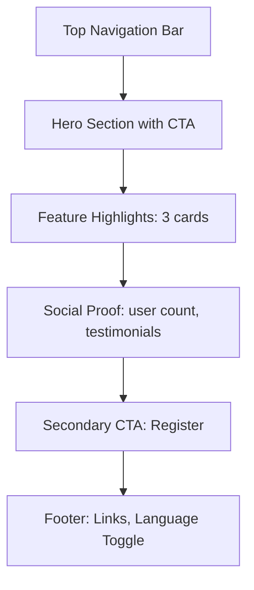
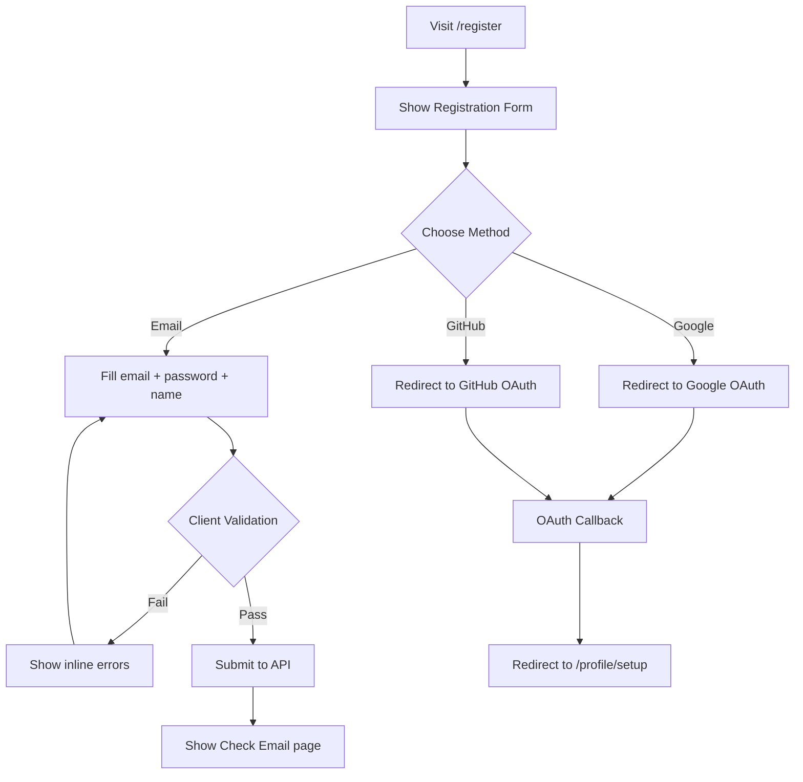
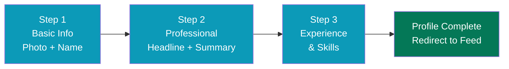
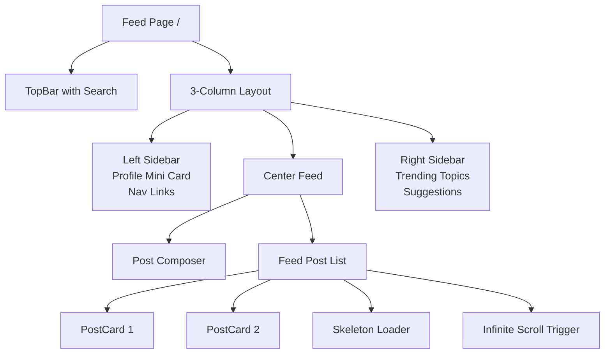
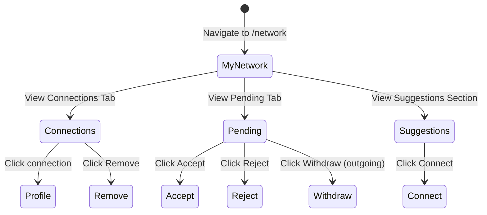
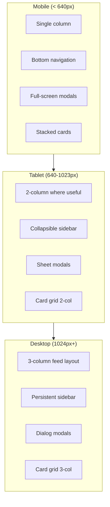

# ConnectIn Wireframes

> **Version**: 1.0
> **Date**: February 20, 2026
> **Author**: UI/UX Designer
> **Status**: Active
> **Product**: ConnectIn -- Professional Networking Platform

---

## Table of Contents

1. [Landing Page](#1-landing-page)
2. [Registration Page](#2-registration-page)
3. [Login Page](#3-login-page)
4. [Onboarding Wizard](#4-onboarding-wizard)
5. [Profile Page](#5-profile-page)
6. [News Feed](#6-news-feed)
7. [Connection Page](#7-connection-page)
8. [Messaging Page](#8-messaging-page)
9. [Job Board](#9-job-board)
10. [Search Results](#10-search-results)
11. [Settings Page](#11-settings-page)

---

## Layout Convention

All wireframes are shown in **LTR orientation** for readability. In RTL mode (Arabic), the layout mirrors horizontally: inline-start becomes the right side, inline-end becomes the left side. Where the RTL layout differs meaningfully beyond simple mirroring, notes are provided.

### Notation Key

```
[Button]         = Clickable button
(Link)           = Text link
{Input}          = Form input field
<Icon>           = Icon element
[===]            = Progress bar
|               = Vertical divider
---              = Horizontal divider
(*)              = Radio button
[x]              = Checkbox
[v]              = Toggle/switch
```

---

## 1. Landing Page

The landing page is shown to unauthenticated visitors. It communicates the value proposition and drives registration.

### Page Structure Flow



### Mobile (375px)

```
+-------------------------------------+
|  <Logo>  ConnectIn    (Login) [ع/En]|
+-------------------------------------+
|                                     |
|     Your Professional Network,      |
|        Built Arabic-First           |
|                                     |
|  AI-powered networking for Arab     |
|  tech professionals worldwide       |
|                                     |
|  [   Get Started -- Free   ]        |
|  (Already have an account? Login)   |
|                                     |
+-------------------------------------+
|  +---------+  +---------+           |
|  |<Sparkle>|  |<Globe> |           |
|  |AI-Native|  |Arabic  |           |
|  |Profile  |  |First   |           |
|  |optimizer|  |RTL     |           |
|  +---------+  +---------+           |
|  +---------+  +---------+           |
|  |<Shield> |  |<Code>  |           |
|  |Privacy  |  |Open    |           |
|  |First    |  |Source  |           |
|  +---------+  +---------+           |
+-------------------------------------+
|  2,500+ professionals connected     |
|  "Finally, a platform that gets     |
|   Arabic right." -- Ahmed, Riyadh   |
+-------------------------------------+
|  [   Create Your Profile   ]        |
+-------------------------------------+
|  About | Privacy | Terms | Contact  |
|  (c) 2026 ConnectIn                 |
+-------------------------------------+
```

### Desktop (1280px)

```
+--------------------------------------------------------------------------------+
|  <Logo> ConnectIn          (About) (Jobs) (Login) [Register]   [ع/En]          |
+--------------------------------------------------------------------------------+
|                                                                                |
|   +-----------------------------------------------+  +---------------------+  |
|   |                                               |  |  +-----------+      |  |
|   |  Your Professional Network,                   |  |  | Profile   |      |  |
|   |  Built Arabic-First                           |  |  | Preview   |      |  |
|   |                                               |  |  | Card      |      |  |
|   |  AI-powered networking for Arab tech          |  |  | Mockup    |      |  |
|   |  professionals worldwide.                     |  |  |           |      |  |
|   |                                               |  |  +-----------+      |  |
|   |  [  Get Started -- Free  ]  (Learn More)      |  |                     |  |
|   +-----------------------------------------------+  +---------------------+  |
|                                                                                |
+--------------------------------------------------------------------------------+
|                                                                                |
|   +------------------+  +------------------+  +------------------+             |
|   | <Sparkles>       |  | <Globe>          |  | <Shield>         |             |
|   | AI-Native        |  | Arabic-First     |  | Privacy-First    |             |
|   | Profile optimizer|  | RTL-native design|  | Your data, your  |             |
|   | and matching     |  | bilingual content|  | control          |             |
|   +------------------+  +------------------+  +------------------+             |
|                                                                                |
+--------------------------------------------------------------------------------+
|  About | Privacy Policy | Terms of Service | Open Source | Contact             |
|  (c) 2026 ConnectIn. All rights reserved.                                      |
+--------------------------------------------------------------------------------+
```

**Components used**: Button (primary, outline), Badge, Card (feature card), TopBar (unauthenticated variant).

**RTL note**: Hero text right-aligns. Feature cards maintain same grid but internal text right-aligns. CTA buttons stay center-aligned.

---

## 2. Registration Page

### Registration Flow



### Mobile (375px)

```
+-------------------------------------+
|  <Logo>  ConnectIn           [ع/En] |
+-------------------------------------+
|                                     |
|       Join ConnectIn                |
|  Create your professional profile   |
|                                     |
|  [  <Google> Continue with Google ] |
|  [  <GitHub> Continue with GitHub ] |
|                                     |
|  ----------- or -----------         |
|                                     |
|  Display Name                       |
|  {Ahmed Al-Rashidi              }   |
|                                     |
|  Email                              |
|  {ahmed@example.com             }   |
|                                     |
|  Password                           |
|  {**********              <Eye> }   |
|  8+ chars, 1 upper, 1 number,      |
|  1 special character                |
|                                     |
|  [x] I agree to the (Terms of      |
|      Service) and (Privacy Policy)  |
|                                     |
|  [       Create Account        ]    |
|                                     |
|  Already have an account? (Login)   |
|                                     |
+-------------------------------------+
```

### Desktop (1280px)

```
+--------------------------------------------------------------------------------+
|  <Logo> ConnectIn                                                [ع/En]        |
+--------------------------------------------------------------------------------+
|                                                                                |
|  +---------------------------+              +----------------------------+     |
|  |                           |              |                            |     |
|  |  "Connect with Arab tech  |              |  Join ConnectIn            |     |
|  |   professionals globally" |              |  Create your professional  |     |
|  |                           |              |  profile                   |     |
|  |  <Illustration>           |              |                            |     |
|  |  Network of professionals |              |  [<Google> Continue with   |     |
|  |  connecting across the    |              |   Google                 ] |     |
|  |  Middle East and beyond   |              |  [<GitHub> Continue with   |     |
|  |                           |              |   GitHub                 ] |     |
|  |                           |              |                            |     |
|  |                           |              |  --------- or ---------   |     |
|  |                           |              |                            |     |
|  |                           |              |  Display Name              |     |
|  |                           |              |  {                       } |     |
|  |                           |              |  Email                     |     |
|  |                           |              |  {                       } |     |
|  |                           |              |  Password                  |     |
|  |                           |              |  {                 <Eye> } |     |
|  |                           |              |                            |     |
|  |                           |              |  [x] I agree to Terms      |     |
|  |                           |              |                            |     |
|  |                           |              |  [   Create Account      ] |     |
|  |                           |              |                            |     |
|  |                           |              |  Already have an account?  |     |
|  |                           |              |  (Login)                   |     |
|  +---------------------------+              +----------------------------+     |
|                                                                                |
+--------------------------------------------------------------------------------+
```

**Components used**: Button (primary, outline, ghost), Input (text, email, password), Checkbox, Divider.

**RTL note**: Form labels and inputs right-align. Password eye icon stays at inline-end. OAuth buttons are full-width and centered.

---

## 3. Login Page

### Mobile (375px)

```
+-------------------------------------+
|  <Logo>  ConnectIn           [ع/En] |
+-------------------------------------+
|                                     |
|       Welcome Back                  |
|  Sign in to your account            |
|                                     |
|  [  <Google> Continue with Google ] |
|  [  <GitHub> Continue with GitHub ] |
|                                     |
|  ----------- or -----------         |
|                                     |
|  Email                              |
|  {ahmed@example.com             }   |
|                                     |
|  Password                           |
|  {**********              <Eye> }   |
|  (Forgot password?)                 |
|                                     |
|  [         Sign In             ]    |
|                                     |
|  Don't have an account? (Register)  |
|                                     |
+-------------------------------------+
```

### Desktop (1280px)

Same split layout as Registration: illustration on inline-start, form on inline-end. Form content changes to login fields.

**Components used**: Button (primary, outline), Input (email, password), link text.

---

## 4. Onboarding Wizard

### Wizard Step Flow



### Step 1: Basic Info -- Mobile (375px)

```
+-------------------------------------+
|  <Logo>  ConnectIn                  |
+-------------------------------------+
|  Step 1 of 3                        |
|  [========--------]  33%            |
+-------------------------------------+
|                                     |
|       Let's set up your profile     |
|                                     |
|       +-------------+               |
|       |             |               |
|       |   <Camera>  |               |
|       |   Add Photo |               |
|       |             |               |
|       +-------------+               |
|       (Skip for now)                |
|                                     |
|  Display Name                       |
|  {Ahmed Al-Rashidi             }    |
|  (pre-filled from registration)     |
|                                     |
|  Location                           |
|  {Riyadh, Saudi Arabia         }    |
|                                     |
|                   [Skip]  [Next ->] |
+-------------------------------------+
```

### Step 2: Professional Details -- Mobile (375px)

```
+-------------------------------------+
|  <Logo>  ConnectIn                  |
+-------------------------------------+
|  Step 2 of 3                        |
|  [================----]  66%        |
+-------------------------------------+
|                                     |
|  Headline                           |
|  [Arabic]  [English]                |
|  +-----------------------------------+
|  | {Senior Software Engineer at    }|
|  | {Fintech Startup                }|
|  +-----------------------------------+
|                                     |
|  Professional Summary               |
|  [Arabic]  [English]                |
|  +-----------------------------------+
|  | {                               }|
|  | {                               }|
|  | {                        200/500}|
|  +-----------------------------------+
|                                     |
|  [<Sparkles> Optimize with AI]      |
|  AI will suggest improvements       |
|                                     |
|              [<- Back]  [Next ->]    |
+-------------------------------------+
```

### Step 3: Experience and Skills -- Mobile (375px)

```
+-------------------------------------+
|  <Logo>  ConnectIn                  |
+-------------------------------------+
|  Step 3 of 3                        |
|  [========================]  100%   |
+-------------------------------------+
|                                     |
|  Work Experience                    |
|  +----------------------------------+
|  | Company  {Fintech Corp       }  |
|  | Title    {Senior Engineer    }  |
|  | From     {2022} To {Present  }  |
|  | Desc     {                   }  |
|  +----------------------------------+
|  (+ Add another position)          |
|                                     |
|  Skills                             |
|  {Type to search skills...      }  |
|  [React] [TypeScript] [Node.js]    |
|  [PostgreSQL] [Arabic]              |
|                                     |
|  Profile Completeness: 72%          |
|  [=====================-------]     |
|  +2 more sections to reach 85%     |
|                                     |
|           [<- Back]  [Complete ->]   |
+-------------------------------------+
```

### Desktop (1280px) -- All Steps

```
+--------------------------------------------------------------------------------+
|  <Logo> ConnectIn                                                              |
+--------------------------------------------------------------------------------+
|                                                                                |
|  Step 2 of 3: Professional Details                                             |
|  [===============================---------]  66%                               |
|                                                                                |
|  +--------------------------------------+  +-----------------------------+    |
|  |                                      |  |  Profile Preview            |    |
|  |  Headline                            |  |  +-------+                  |    |
|  |  [Arabic]  [English]                 |  |  | Photo |  Ahmed          |    |
|  |  {Senior Software Engineer      }    |  |  +-------+  Al-Rashidi     |    |
|  |                                      |  |  Senior Software Engineer   |    |
|  |  Professional Summary                |  |  Riyadh, Saudi Arabia       |    |
|  |  [Arabic]  [English]                 |  |                             |    |
|  |  {                               }   |  |  Completeness: 66%         |    |
|  |  {                               }   |  |  [==================----]  |    |
|  |  {                               }   |  |                             |    |
|  |  {                         0/500 }   |  |  Suggestions:               |    |
|  |                                      |  |  - Add a summary            |    |
|  |  [<Sparkles> Optimize with AI]       |  |  - Add experience           |    |
|  |                                      |  |  - Add skills               |    |
|  |               [<- Back] [Next ->]    |  +-----------------------------+    |
|  +--------------------------------------+                                     |
|                                                                                |
+--------------------------------------------------------------------------------+
```

**Components used**: Progress bar, Tabs (Arabic/English), Input, Textarea, FileUpload, Badge (skills), Button (primary, secondary, ghost), ProfileCard (preview).

**RTL note**: Progress bar fills from right to left in RTL. Back/Next buttons swap positions (Back on inline-end, Next on inline-start).

---

## 5. Profile Page

### Profile Page Structure

```mermaid
flowchart TD
    BANNER[Banner Image Area] --> AVATAR[Avatar + Name + Headline]
    AVATAR --> ACTIONS[Action Buttons: Edit/Connect/Message]
    ACTIONS --> TABS[Tabs: About | Experience | Education | Skills | Posts]
    TABS --> CONTENT[Tab Content Area]
    CONTENT --> SIDEBAR[Sidebar: Completeness Score + Suggestions]
```

### Mobile (375px) -- Own Profile

```
+-------------------------------------+
| <Back  My Profile          <Edit>   |
+-------------------------------------+
| +-----------------------------------+
| |         Banner Area               |
| |                                   |
| +-----------------------------------+
|     +--------+                      |
|     | Avatar |                      |
|     | (96px) |                      |
|     +--------+                      |
|                                     |
|  Ahmed Al-Rashidi                   |
|  Senior Software Engineer           |
|  at Fintech Startup                 |
|  <MapPin> Riyadh, Saudi Arabia      |
|  500+ connections                   |
|                                     |
|  [<Pencil> Edit Profile]            |
|  [<Sparkles> Optimize with AI]      |
|                                     |
|  Profile Completeness: 85%          |
|  [===========================--]    |
|  Add education to reach 100%        |
|                                     |
+-------------------------------------+
|  [About] [Experience] [Skills]      |
+-------------------------------------+
|                                     |
|  About                              |
|  [Arabic]  [English]                |
|  Experienced software engineer      |
|  specializing in fintech solutions  |
|  with 6 years of experience in      |
|  building scalable applications...  |
|                                     |
|  ---                                |
|                                     |
|  Experience                         |
|  +----------------------------------+
|  | <Briefcase>                      |
|  | Senior Software Engineer         |
|  | Fintech Corp                     |
|  | Jan 2022 - Present (4 yrs)      |
|  | Building payment infrastructure  |
|  +----------------------------------+
|  +----------------------------------+
|  | Software Engineer                |
|  | Tech Startup                     |
|  | Mar 2019 - Dec 2021 (2 yrs)     |
|  +----------------------------------+
|                                     |
|  ---                                |
|                                     |
|  Skills                             |
|  [React] [TypeScript] [Node.js]    |
|  [PostgreSQL] [Docker] [AWS]        |
|  [Arabic] [English]                 |
|                                     |
+-------------------------------------+
| <Home> <Network> <+> <Msg> <Profile>|
+-------------------------------------+
```

### Desktop (1280px) -- Viewing Another User's Profile

```
+--------------------------------------------------------------------------------+
| <Logo> ConnectIn  {Search...}  <Home> <Network> <Jobs> <Msg> <Bell> (Avatar)   |
+--------------------------------------------------------------------------------+
|                                                                                |
|  +--------------------------------------------------------------------------+ |
|  |                        Banner Area                                       | |
|  +--------------------------------------------------------------------------+ |
|                                                                                |
|  +-----------------------------------+   +-------------------------------+    |
|  |  +--------+                       |   |  Sidebar                      |    |
|  |  | Avatar |  Sophia Chen          |   |                               |    |
|  |  | (128px)|  Product Manager      |   |  People Also Viewed           |    |
|  |  +--------+  at AI Startup        |   |  +---------------------------+|    |
|  |  <MapPin> Berlin, Germany         |   |  | <Avatar> Sarah K.         ||    |
|  |  12 mutual connections            |   |  | PM at Google              ||    |
|  |                                   |   |  | [Connect]                 ||    |
|  |  [Connect]  [Message]  [...]      |   |  +---------------------------+|    |
|  |                                   |   |  | <Avatar> Omar M.          ||    |
|  +-----------------------------------+   |  | Engineer at Amazon        ||    |
|                                          |  | [Connect]                 ||    |
|  [About] [Experience] [Education]        |  +---------------------------+|    |
|  [Skills] [Posts]                        |                               |    |
|  +-----------------------------------+   |  Similar Profiles             |    |
|  |                                   |   |  ...                          |    |
|  |  About                            |   +-------------------------------+    |
|  |  Experienced product manager      |                                        |
|  |  focused on AI-driven products... |                                        |
|  |                                   |                                        |
|  |  Experience                       |                                        |
|  |  +-----------------------------+  |                                        |
|  |  | Product Manager             |  |                                        |
|  |  | AI Startup                  |  |                                        |
|  |  | 2023 - Present              |  |                                        |
|  |  +-----------------------------+  |                                        |
|  |                                   |                                        |
|  |  Skills                           |                                        |
|  |  [Product Mgmt] [AI] [Agile]     |                                        |
|  +-----------------------------------+                                        |
|                                                                                |
+--------------------------------------------------------------------------------+
```

**Components used**: Avatar (xl, 2xl), Badge (skills), Button (primary, secondary, outline), Tabs, Card (experience, education), ProfileCard (sidebar suggestions), TopBar.

---

## 6. News Feed

### Feed Component Architecture



### Mobile (375px)

```
+-------------------------------------+
| <Logo>  {Search...}  <Bell>(3) (Av) |
+-------------------------------------+
|                                     |
|  +----------------------------------+
|  | <Avatar> Start a post...         |
|  | [<Image>] [<Hash>]    [Post]     |
|  +----------------------------------+
|                                     |
|  +----------------------------------+
|  | <Avatar> Ahmed Al-Rashidi        |
|  | Senior Engineer - 2h             |
|  | ...                              |
|  |----------------------------------|
|  | Excited to share our latest      |
|  | open-source contribution to the  |
|  | Arabic NLP community! We've      |
|  | released a new tokenizer that    |
|  | handles Gulf Arabic dialects...  |
|  |                                  |
|  | #ArabicNLP #OpenSource           |
|  |----------------------------------|
|  | +------------------------------+ |
|  | |       [Image Preview]        | |
|  | +------------------------------+ |
|  |----------------------------------|
|  | <Heart> 24  <Comment> 8  <Share> |
|  +----------------------------------+
|                                     |
|  +----------------------------------+
|  | <Avatar> Layla Farouk            |
|  | Tech Consultant - 5h             |
|  |----------------------------------|
|  | ............نظرة على مستقبل     |
|  | الذكاء الاصطناعي في منطقة       |
|  | الشرق الأوسط وشمال أفريقيا      |
|  | #تقنية #ذكاء_اصطناعي            |
|  |----------------------------------|
|  | <Heart> 42  <Comment> 15 <Share> |
|  +----------------------------------+
|                                     |
|  [Loading more posts...]            |
|                                     |
+-------------------------------------+
| <Home> <Network> <(+)> <Msg> <Prof> |
+-------------------------------------+
```

### Desktop (1280px)

```
+--------------------------------------------------------------------------------+
| <Logo> ConnectIn  {Search professionals, jobs, posts...}  Icons  (Avatar)      |
+--------------------------------------------------------------------------------+
|                                                                                |
|  +---------------+  +----------------------------------+  +----------------+  |
|  | Profile Mini  |  |                                  |  | Trending       |  |
|  | +-----------+ |  | <Avatar> Start a post...         |  |                |  |
|  | |  Avatar   | |  | [<Image>] [<Hash>]     [Post]    |  | #ArabicNLP     |  |
|  | +-----------+ |  |                                  |  |   312 posts    |  |
|  | Ahmed         |  +----------------------------------+  | #MENA_tech     |  |
|  | Al-Rashidi    |  |                                  |  |   289 posts    |  |
|  | Sr. Engineer  |  | <Avatar> Ahmed Al-Rashidi        |  | #AI            |  |
|  |               |  | Senior Engineer - 2h             |  |   1.2k posts   |  |
|  | 500 connects  |  |----------------------------------|  | #Riyadh        |  |
|  | 85% complete  |  | Excited to share our latest      |  |   156 posts    |  |
|  |               |  | open-source contribution to the  |  | #تقنية         |  |
|  | Nav Links:    |  | Arabic NLP community!            |  |   98 posts     |  |
|  | (My Network)  |  |                                  |  +----------------+  |
|  | (Jobs)        |  | #ArabicNLP #OpenSource           |  |                |  |
|  | (Messages)    |  |----------------------------------|  | Suggestions    |  |
|  | (Saved)       |  | +------------------------------+ |  | +------------+ |  |
|  +---------------+  | |       [Image Preview]        | |  | | <Av> Omar  | |  |
|                      | +------------------------------+ |  | | Engineer   | |  |
|                      |----------------------------------|  | | [Connect]  | |  |
|                      | <Heart> 24  <Comment> 8  <Share> |  | +------------+ |  |
|                      +----------------------------------+  | +------------+ |  |
|                      |                                  |  | | <Av> Sara  | |  |
|                      | <Avatar> Layla Farouk            |  | | Designer   | |  |
|                      | Tech Consultant - 5h             |  | | [Connect]  | |  |
|                      |----------------------------------|  | +------------+ |  |
|                      | Arabic RTL post content...       |  +----------------+  |
|                      | #تقنية #ذكاء_اصطناعي            |                      |
|                      |----------------------------------|                      |
|                      | <Heart> 42  <Comment> 15 <Share> |                      |
|                      +----------------------------------+                      |
|                                                                                |
+--------------------------------------------------------------------------------+
```

**Components used**: TopBar, PostCard, Composer (mini), ProfileCard (mini), Badge (hashtags), Avatar, Button (ghost for actions), Skeleton, BottomNav (mobile).

**RTL note**: Post content with Arabic text auto-detects RTL direction. The entire feed layout mirrors: left sidebar becomes right sidebar, right panel becomes left panel.

---

## 7. Connection Page

### Connection Management Flow



### Mobile (375px)

```
+-------------------------------------+
| <Back  My Network                   |
+-------------------------------------+
|  [Connections (156)] [Pending (3)]  |
+-------------------------------------+
|                                     |
|  People You May Know                |
|  +----------------------------------+
|  | <Avatar>  Omar Khalil            |
|  | Backend Engineer at AWS          |
|  | 5 mutual connections             |
|  | [Connect]  [Dismiss]             |
|  +----------------------------------+
|  | <Avatar>  Sara Ahmed             |
|  | UX Designer at Careem            |
|  | 3 mutual connections             |
|  | [Connect]  [Dismiss]             |
|  +----------------------------------+
|  (See all suggestions)              |
|                                     |
|  ---                                |
|                                     |
|  My Connections                     |
|  {Search connections...         }   |
|                                     |
|  +----------------------------------+
|  | <Avatar>  Sophia Chen            |
|  | Product Manager at AI Startup    |
|  | [Message]               [...]    |
|  +----------------------------------+
|  | <Avatar>  Khalid Mansour         |
|  | Head of TA at GCC Tech           |
|  | [Message]               [...]    |
|  +----------------------------------+
|  | <Avatar>  Layla Farouk           |
|  | Tech Consultant                  |
|  | [Message]               [...]    |
|  +----------------------------------+
|                                     |
|  (Show more)                        |
|                                     |
+-------------------------------------+
| <Home> <Network> <(+)> <Msg> <Prof> |
+-------------------------------------+
```

### Desktop (1280px)

```
+--------------------------------------------------------------------------------+
| <Logo> ConnectIn  {Search...}                              Icons  (Avatar)     |
+--------------------------------------------------------------------------------+
|                                                                                |
|  +--------------------------------------+  +-----------------------------+    |
|  |  My Network                          |  |  Pending Requests (3)       |    |
|  |  [Connections (156)] [Pending (3)]   |  |                             |    |
|  |                                      |  |  +-------------------------+|    |
|  |  {Search connections...          }   |  |  | <Av> Ahmad Hassan       ||    |
|  |                                      |  |  | Software Dev            ||    |
|  |  People You May Know                 |  |  | "Hi Ahmed, I saw your   ||    |
|  |  +----------+ +----------+           |  |  |  talk at LEAP..."       ||    |
|  |  | <Avatar> | | <Avatar> |           |  |  | [Accept] [Reject]       ||    |
|  |  | Omar K.  | | Sara A.  |           |  |  +-------------------------+|    |
|  |  | 5 mutual | | 3 mutual |           |  |  | <Av> Nour Sayed        ||    |
|  |  |[Connect] | |[Connect] |           |  |  | Data Scientist          ||    |
|  |  +----------+ +----------+           |  |  | [Accept] [Reject]       ||    |
|  |                                      |  |  +-------------------------+|    |
|  |  ---                                 |  +-----------------------------+    |
|  |                                      |                                     |
|  |  +--------+ +--------+ +--------+   |                                     |
|  |  |<Avatar>| |<Avatar>| |<Avatar>|   |                                     |
|  |  |Sophia  | |Khalid  | |Layla   |   |                                     |
|  |  |PM      | |TA Lead | |Consult |   |                                     |
|  |  |[Msg]   | |[Msg]   | |[Msg]   |   |                                     |
|  |  +--------+ +--------+ +--------+   |                                     |
|  |                                      |                                     |
|  |  +--------+ +--------+ +--------+   |                                     |
|  |  |<Avatar>| |<Avatar>| |<Avatar>|   |                                     |
|  |  |...     | |...     | |...     |   |                                     |
|  |  +--------+ +--------+ +--------+   |                                     |
|  |                                      |                                     |
|  |  [1] [2] [3] ... [8]  (Next)        |                                     |
|  +--------------------------------------+                                     |
|                                                                                |
+--------------------------------------------------------------------------------+
```

**Components used**: ConnectionCard, Tabs, SearchBar, Button (primary, secondary, ghost), Pagination, Avatar, Badge (mutual connections).

---

## 8. Messaging Page

### Messaging Layout Architecture

```mermaid
flowchart TD
    PAGE[/messages] --> CHECK{Screen Size?}
    CHECK -->|Mobile| MOB_LIST[Conversation List<br/>Full Screen]
    CHECK -->|Desktop| SPLIT[Split View:<br/>List + Thread]

    MOB_LIST -->|Tap conversation| MOB_THREAD[Thread View<br/>Full Screen]
    MOB_THREAD -->|Back| MOB_LIST

    SPLIT --> LIST[Conversation List<br/>320px]
    SPLIT --> THREAD[Active Thread<br/>flex-1]
```

### Mobile (375px) -- Conversation List

```
+-------------------------------------+
| <Back  Messages            <Edit>   |
+-------------------------------------+
| {Search messages...             }   |
+-------------------------------------+
|                                     |
|  +----------------------------------+
|  | <Av>(online) Sophia Chen         |
|  | Thanks for the connection!   2m  |
|  |                        [unread]  |
|  +----------------------------------+
|  | <Avatar>  Khalid Mansour         |
|  | I have a position that might 1h  |
|  | interest you...                  |
|  +----------------------------------+
|  | <Avatar>  Layla Farouk           |
|  | Great article! Would love    3h  |
|  | to discuss further...            |
|  +----------------------------------+
|  | <Avatar>  Omar Khalil            |
|  | Let's catch up at LEAP      1d   |
|  | conference next month            |
|  +----------------------------------+
|                                     |
+-------------------------------------+
| <Home> <Network> <(+)> <Msg> <Prof> |
+-------------------------------------+
```

### Mobile (375px) -- Conversation Thread

```
+-------------------------------------+
| <Back  Sophia Chen         <Info>   |
|        Product Manager              |
+-------------------------------------+
|                                     |
|  Hi Ahmed! Great to connect         |
|  with you. I noticed we both        |
|  work in fintech.          10:30 AM |
|                                     |
|              Thanks for reaching    |
|              out Sophia! Yes, I'm   |
|              working on payment     |
|              infrastructure.        |
|                        10:32 AM  vv |
|                           (Read)    |
|                                     |
|  That's exciting! Would you be      |
|  interested in discussing a         |
|  collaboration?            10:35 AM |
|                                     |
|              Thanks for the         |
|              connection!            |
|                        10:40 AM  v  |
|                          (Sent)     |
|                                     |
+-------------------------------------+
| {Type a message...        } [Send]  |
+-------------------------------------+
```

### Desktop (1280px)

```
+--------------------------------------------------------------------------------+
| <Logo> ConnectIn  {Search...}                              Icons  (Avatar)     |
+--------------------------------------------------------------------------------+
|                                                                                |
|  +---------------------+  +----------------------------------------------+    |
|  | Messages            |  |  Sophia Chen                        <Info>   |    |
|  | {Search...       }  |  |  Product Manager at AI Startup               |    |
|  |---------------------|  |----------------------------------------------|    |
|  | <Av> Sophia Chen    |  |                                              |    |
|  | Thanks for the  2m  |  |  Hi Ahmed! Great to connect with you.        |    |
|  | [unread dot]        |  |  I noticed we both work in fintech.          |    |
|  |---------------------|  |                                    10:30 AM  |    |
|  | <Av> Khalid M.      |  |                                              |    |
|  | I have a posit  1h  |  |              Thanks for reaching out Sophia! |    |
|  |---------------------|  |              Yes, I'm working on payment     |    |
|  | <Av> Layla F.       |  |              infrastructure.                 |    |
|  | Great article!  3h  |  |                                    10:32 AM  |    |
|  |---------------------|  |                                       (Read) |    |
|  | <Av> Omar K.        |  |                                              |    |
|  | Let's catch up  1d  |  |  That's exciting! Would you be interested    |    |
|  |---------------------|  |  in discussing a collaboration?              |    |
|  |                     |  |                                    10:35 AM  |    |
|  |                     |  |                                              |    |
|  |                     |  |              Thanks for the connection!       |    |
|  |                     |  |                                    10:40 AM  |    |
|  |                     |  |                                       (Sent) |    |
|  |                     |  |----------------------------------------------|    |
|  |                     |  | {Type a message...                 } [Send]  |    |
|  +---------------------+  +----------------------------------------------+    |
|                                                                                |
+--------------------------------------------------------------------------------+
```

**Components used**: Input (search), Avatar (with online indicator), Badge (unread), Button (ghost for send), TopBar.

**RTL note**: In Arabic mode, the conversation list shifts to the right side. Message bubbles: sent messages on inline-start (right in RTL), received messages on inline-end (left in RTL). Read receipts align accordingly.

---

## 9. Job Board

### Job Board Navigation

```mermaid
flowchart TD
    ENTRY[/jobs] --> SEARCH[Search + Filter]
    SEARCH --> RESULTS[Job Card List]
    RESULTS -->|Click job| DETAIL[/jobs/:id<br/>Job Detail Page]
    DETAIL -->|Click Apply| APPLY_MODAL[Application Modal]
    APPLY_MODAL --> CONFIRM[Confirmation]

    ENTRY --> MY_APPS[/jobs/applications<br/>My Applications]
    ENTRY --> POST_JOB[/jobs/new<br/>Post a Job (Recruiter)]
    ENTRY --> MY_POSTS[/jobs/my-postings<br/>My Postings (Recruiter)]
```

### Mobile (375px) -- Job Search

```
+-------------------------------------+
| <Back  Jobs                         |
+-------------------------------------+
| {Search jobs...                 }   |
| [Remote v] [Level v] [Date v]      |
+-------------------------------------+
|                                     |
|  +----------------------------------+
|  | Senior React Developer           |
|  | Fintech Corp                     |
|  | <MapPin> Riyadh  [Remote]        |
|  | <Clock> Posted 2 days ago        |
|  | <Briefcase> Senior  <Currency>   |
|  |                    $120-150k     |
|  +----------------------------------+
|  | Backend Engineer                  |
|  | GCC Technologies                  |
|  | <MapPin> Dubai  [Hybrid]          |
|  | <Clock> Posted 1 week ago        |
|  | <Briefcase> Mid-level             |
|  +----------------------------------+
|  | Product Manager                   |
|  | AI Startup                        |
|  | <MapPin> Remote  [Remote]         |
|  | <Clock> Posted 3 days ago        |
|  | <Briefcase> Senior                |
|  +----------------------------------+
|                                     |
+-------------------------------------+
| <Home> <Network> <(+)> <Msg> <Prof> |
+-------------------------------------+
```

### Mobile (375px) -- Job Detail

```
+-------------------------------------+
| <Back  Job Detail                   |
+-------------------------------------+
|                                     |
|  Senior React Developer             |
|  Fintech Corp                       |
|  <MapPin> Riyadh, SA  [Remote]      |
|  <Currency> $120,000 - $150,000/yr  |
|  <Briefcase> Senior level           |
|  <Clock> Posted 2 days ago          |
|  <Users> 24 applicants              |
|                                     |
|  [  Apply Now  ]  [<Bookmark> Save] |
|                                     |
|  ---                                |
|                                     |
|  About the Role                     |
|  We are looking for an experienced  |
|  React developer to join our        |
|  frontend team building next-gen    |
|  payment interfaces...              |
|                                     |
|  Requirements                       |
|  - 5+ years React experience        |
|  - TypeScript proficiency            |
|  - RTL layout experience (bonus)    |
|  - Arabic speaker (preferred)        |
|                                     |
|  ---                                |
|                                     |
|  About Fintech Corp                 |
|  Leading fintech company in the     |
|  Gulf region...                     |
|                                     |
+-------------------------------------+
| <Home> <Network> <(+)> <Msg> <Prof> |
+-------------------------------------+
```

### Desktop (1280px) -- Job Search

```
+--------------------------------------------------------------------------------+
| <Logo> ConnectIn  {Search...}                              Icons  (Avatar)     |
+--------------------------------------------------------------------------------+
|                                                                                |
|  +----------------------------------+  +-----------------------------------+  |
|  |  Job Search                      |  |  Senior React Developer           |  |
|  |  {Search jobs, companies...  }   |  |  Fintech Corp                     |  |
|  |  [Remote v][Level v][Date v]     |  |  <MapPin> Riyadh  [Remote]        |  |
|  |                                  |  |  $120,000 - $150,000/yr           |  |
|  |  42 results                      |  |  Senior level - 24 applicants     |  |
|  |  +----------------------------+  |  |  Posted 2 days ago                |  |
|  |  | Senior React Developer     |  |  |                                   |  |
|  |  | Fintech Corp               |  |  |  [  Apply Now  ] [Save]           |  |
|  |  | Riyadh [Remote] $120-150k  |  |  |                                   |  |
|  |  | 2 days ago                 |  |  |  ---                              |  |
|  |  +----------------------------+  |  |                                   |  |
|  |  | Backend Engineer           |  |  |  About the Role                   |  |
|  |  | GCC Technologies           |  |  |  We are looking for an            |  |
|  |  | Dubai [Hybrid]             |  |  |  experienced React developer...   |  |
|  |  | 1 week ago                 |  |  |                                   |  |
|  |  +----------------------------+  |  |  Requirements                     |  |
|  |  | Product Manager            |  |  |  - 5+ years React                 |  |
|  |  | AI Startup                 |  |  |  - TypeScript proficiency          |  |
|  |  | Remote                     |  |  |  - RTL layout experience           |  |
|  |  | 3 days ago                 |  |  |                                   |  |
|  |  +----------------------------+  |  |  [  Apply Now  ]                  |  |
|  +----------------------------------+  +-----------------------------------+  |
|                                                                                |
+--------------------------------------------------------------------------------+
```

**Components used**: JobCard, SearchBar, Select (filters), Badge (Remote/Hybrid/Onsite, level), Button (primary, outline), BookmarkIcon.

---

## 10. Search Results

### Search Architecture

```mermaid
flowchart TD
    QUERY[User Types Query] --> GLOBAL[Global Search Bar]
    GLOBAL --> RESULTS[/search?q=query]
    RESULTS --> TABS{Tab Selected}
    TABS -->|People| PEOPLE[People Results<br/>ProfileCard list]
    TABS -->|Posts| POSTS[Post Results<br/>PostCard list]
    TABS -->|Jobs| JOBS[Job Results<br/>JobCard list]

    PEOPLE --> FILTERS_P[Filters: Location, Industry, Level]
    POSTS --> FILTERS_POSTS[Filters: Date, Hashtag]
    JOBS --> FILTERS_J[Filters: Location, Remote, Level]
```

### Mobile (375px)

```
+-------------------------------------+
| <Back  {software engineer      } X  |
+-------------------------------------+
| [People (24)] [Posts (18)] [Jobs(8)]|
+-------------------------------------+
|                                     |
|  People                             |
|                                     |
|  +----------------------------------+
|  | <Avatar>  Ahmed Al-Rashidi       |
|  | Senior **Software Engineer**     |
|  | <MapPin> Riyadh, SA              |
|  | 5 mutual connections             |
|  | [Connect]                        |
|  +----------------------------------+
|  | <Avatar>  Sara Hussein           |
|  | **Software Engineer** at AWS     |
|  | <MapPin> Dubai, UAE              |
|  | 2 mutual connections             |
|  | [Connect]                        |
|  +----------------------------------+
|  | <Avatar>  Mohamed Youssef        |
|  | Lead **Software Engineer**       |
|  | <MapPin> Cairo, Egypt            |
|  | [Connect]                        |
|  +----------------------------------+
|                                     |
|  (Show more people)                 |
|                                     |
+-------------------------------------+
| <Home> <Network> <(+)> <Msg> <Prof> |
+-------------------------------------+
```

### Desktop (1280px)

```
+--------------------------------------------------------------------------------+
| <Logo> ConnectIn  {software engineer                              } (Avatar)   |
+--------------------------------------------------------------------------------+
|                                                                                |
|  +--------------------------------------+  +----------------------------+     |
|  | [People (24)] [Posts (18)] [Jobs (8)]|  | Filters                    |     |
|  |                                      |  | Location: {All        v}   |     |
|  | People                               |  | Industry: {All        v}   |     |
|  |                                      |  | Level:    {All        v}   |     |
|  | +----------------------------------+ |  | [Apply Filters]            |     |
|  | | <Avatar>  Ahmed Al-Rashidi       | |  +----------------------------+     |
|  | | Senior Software Engineer         | |                                     |
|  | | Fintech Corp                     | |  Trending Searches            |     |
|  | | Riyadh, SA - 5 mutual connects   | |  (AI Engineer)                |     |
|  | | [Connect] [Message]              | |  (React Developer)            |     |
|  | +----------------------------------+ |  (مهندس برمجيات)              |     |
|  | | <Avatar>  Sara Hussein           | |  (Product Manager)            |     |
|  | | Software Engineer at AWS         | |                                     |
|  | | Dubai, UAE - 2 mutual connects   | |                                     |
|  | | [Connect] [Message]              | |                                     |
|  | +----------------------------------+ |                                     |
|  |                                      |                                     |
|  | [1] [2] [3] (Next)                  |                                     |
|  +--------------------------------------+                                     |
|                                                                                |
+--------------------------------------------------------------------------------+
```

**Components used**: SearchBar, Tabs, ProfileCard, PostCard, JobCard, Select (filters), Pagination, Badge (match highlighting).

**RTL note**: Search query highlighting works bidirectionally. Arabic queries like "مهندس برمجيات" highlight matching Arabic text in results.

---

## 11. Settings Page

### Settings Navigation

```mermaid
flowchart TD
    SETTINGS[/settings] --> ACCOUNT[/settings/account<br/>Email, Password, Delete]
    SETTINGS --> NOTIF[/settings/notifications<br/>Toggle Preferences]
    SETTINGS --> PRIVACY[/settings/privacy<br/>Read Receipts, Visibility]
    SETTINGS --> LANG[/settings/language<br/>Language, Numerals, Theme]
```

### Mobile (375px) -- Settings Navigation

```
+-------------------------------------+
| <Back  Settings                     |
+-------------------------------------+
|                                     |
|  +----------------------------------+
|  | <User>     Account               |
|  |            Email, password,      |
|  |            delete account    >   |
|  +----------------------------------+
|  | <Bell>     Notifications         |
|  |            Email and push        |
|  |            preferences       >   |
|  +----------------------------------+
|  | <Shield>   Privacy               |
|  |            Read receipts,        |
|  |            visibility        >   |
|  +----------------------------------+
|  | <Globe>    Language              |
|  |            Arabic/English,       |
|  |            theme, numerals   >   |
|  +----------------------------------+
|                                     |
+-------------------------------------+
| <Home> <Network> <(+)> <Msg> <Prof> |
+-------------------------------------+
```

### Mobile (375px) -- Notification Settings

```
+-------------------------------------+
| <Back  Notification Settings        |
+-------------------------------------+
|                                     |
|  In-App Notifications               |
|                                     |
|  Connection Requests         [v On] |
|  Messages                    [v On] |
|  Post Likes                  [  Off]|
|  Post Comments               [v On] |
|  Job Recommendations         [v On] |
|                                     |
|  ---                                |
|                                     |
|  Email Digest                        |
|  (*) Daily                           |
|  (*) Weekly                          |
|  (*) Off                             |
|                                     |
|  ---                                |
|                                     |
|  [  Save Preferences  ]             |
|                                     |
+-------------------------------------+
```

### Desktop (1280px) -- Language Settings

```
+--------------------------------------------------------------------------------+
| <Logo> ConnectIn  {Search...}                              Icons  (Avatar)     |
+--------------------------------------------------------------------------------+
|                                                                                |
|  +-------------------+  +----------------------------------------------+      |
|  | Settings          |  |  Language & Display                          |      |
|  |                   |  |                                              |      |
|  | (Account)         |  |  Interface Language                          |      |
|  | (Notifications)   |  |  (*) العربية (Arabic)                        |      |
|  | (Privacy)         |  |  (*) English                                 |      |
|  | [Language] active |  |                                              |      |
|  |                   |  |  Numeral Format                              |      |
|  +-------------------+  |  (*) Eastern Arabic (١٢٣)                    |      |
|                          |  (*) Western (123)                           |      |
|                          |                                              |      |
|                          |  Theme                                       |      |
|                          |  (*) Light                                   |      |
|                          |  (*) Dark                                    |      |
|                          |  (*) System Default                          |      |
|                          |                                              |      |
|                          |  [  Save Changes  ]                          |      |
|                          +----------------------------------------------+      |
|                                                                                |
+--------------------------------------------------------------------------------+
```

**Components used**: Switch (toggles), Radio (selection groups), Button (primary), Navigation sidebar (desktop), TopBar.

**RTL note**: Toggle switches do not mirror (universal affordance). Radio buttons maintain inline-start alignment. Labels and descriptions flow with text direction.

---

## Responsive Breakpoint Summary

The following table summarizes how each page adapts across breakpoints.



| Page | Mobile | Tablet | Desktop |
|------|--------|--------|---------|
| Landing | Single column, stacked features | 2-column hero | 2-column hero + 3-column features |
| Register | Single column form | Split: illustration + form | Split: illustration + form |
| Login | Single column form | Split: illustration + form | Split: illustration + form |
| Onboarding | Single column wizard | Wizard + preview sidebar | Wizard + preview sidebar |
| Profile | Stacked sections + bottom nav | 2-column: content + sidebar | 2-column: content + sidebar |
| Feed | Single column + bottom nav | 2-column: sidebar + feed | 3-column: sidebar + feed + right panel |
| Network | Single column cards | 2-column: cards + pending | 2-column: grid + pending sidebar |
| Messages | List OR thread (navigate) | Split: list + thread | Split: list + thread |
| Jobs | Stacked cards + filters | Split: list + detail | Split: list + detail |
| Search | Tabs + stacked results | 2-column: results + filters | 2-column: results + filters sidebar |
| Settings | Stacked nav + form | Sidebar nav + form | Sidebar nav + form |

---

## Document History

| Version | Date | Author | Changes |
|---------|------|--------|---------|
| 1.0 | 2026-02-20 | UI/UX Designer (AI Agent) | Initial wireframes for all MVP pages |
