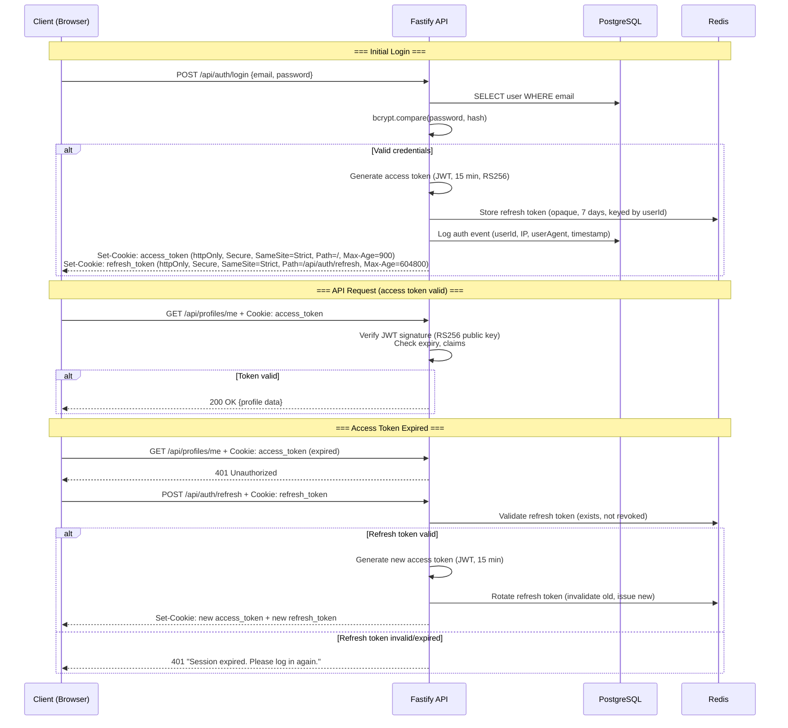
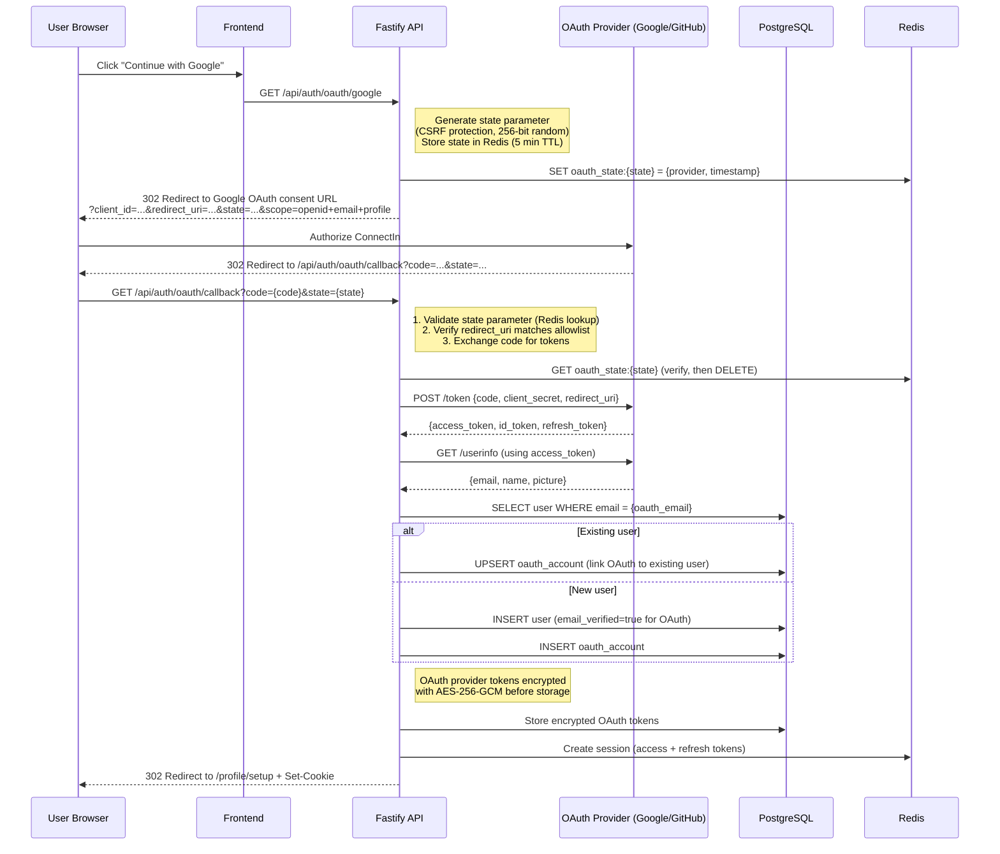
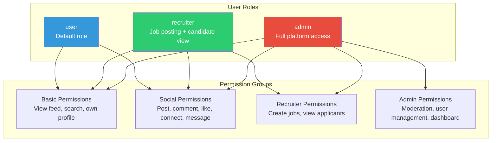
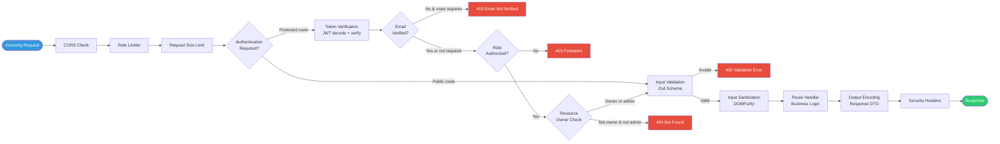
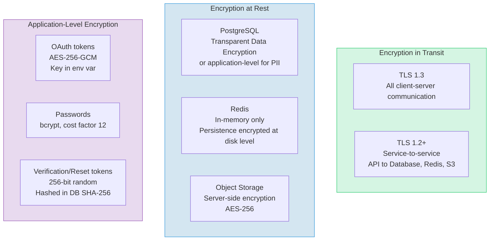
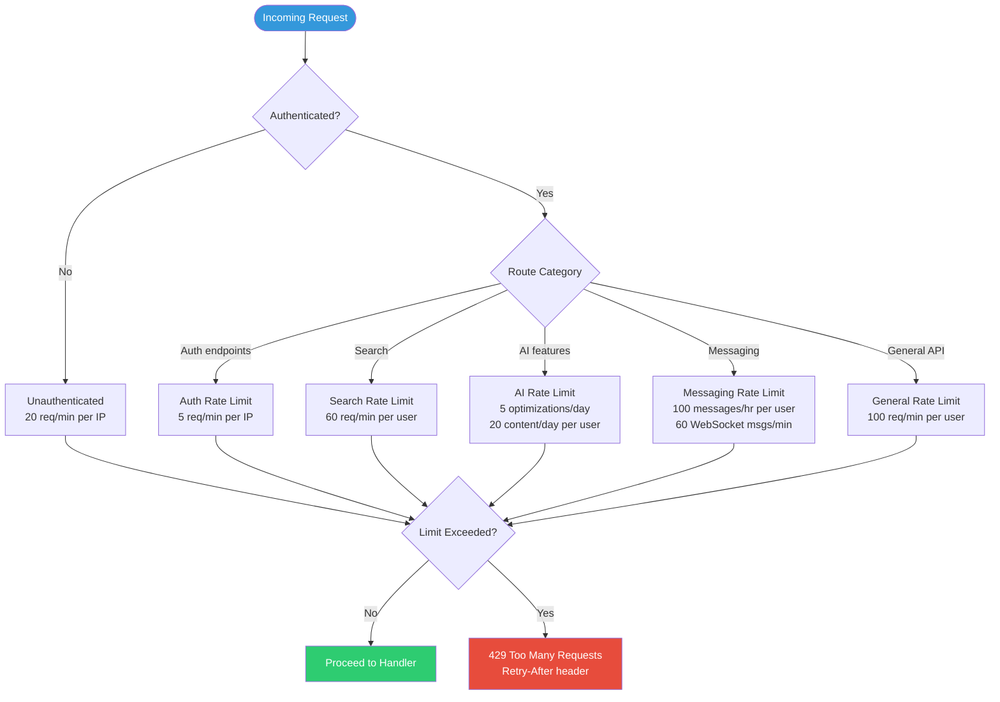
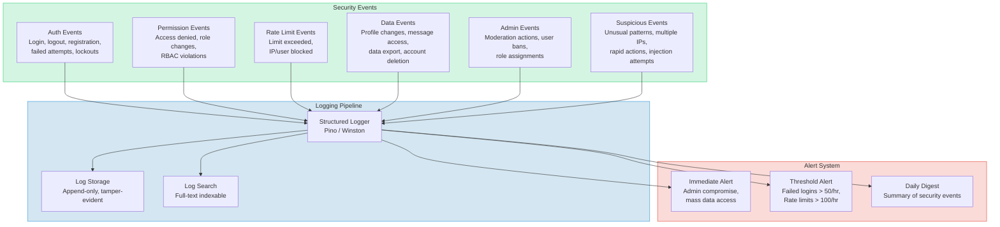

# ConnectIn -- Security Architecture

> **Security Engineer** | ConnectSW
> **Version**: 1.0
> **Date**: February 20, 2026
> **Product**: ConnectIn -- Professional Networking Platform

---

## Table of Contents

1. [Authentication Design](#1-authentication-design)
2. [Authorization Design](#2-authorization-design)
3. [Data Protection](#3-data-protection)
4. [Input Validation & Output Encoding](#4-input-validation--output-encoding)
5. [API Security](#5-api-security)
6. [Monitoring & Incident Response](#6-monitoring--incident-response)
7. [Compliance Checklist](#7-compliance-checklist)

---

## 1. Authentication Design

### 1.1 Token Architecture

ConnectIn uses a dual-token architecture: short-lived JWT access tokens for API authorization and long-lived opaque refresh tokens for session continuity.



### 1.2 Token Specifications

| Property | Access Token | Refresh Token |
|----------|-------------|---------------|
| **Format** | JWT (JSON Web Token) | Opaque (256-bit random, base64url) |
| **Algorithm** | RS256 (asymmetric) | N/A (stored server-side) |
| **Expiry** | 15 minutes | 7 days |
| **Storage (server)** | Not stored (stateless) | Redis (keyed by userId:tokenHash) |
| **Storage (client)** | httpOnly cookie | httpOnly cookie (restricted path) |
| **Rotation** | New token on refresh | Rotated on each use (old invalidated) |
| **Revocation** | Short expiry makes revocation unnecessary | Explicit revoke via Redis DEL |

### 1.3 JWT Claims

```typescript
interface JWTPayload {
  sub: string;       // User UUID
  email: string;     // User email
  role: string;      // "user" | "recruiter" | "admin"
  verified: boolean; // Email verification status
  lang: string;      // "ar" | "en" (language preference)
  iat: number;       // Issued at (Unix timestamp)
  exp: number;       // Expiry (iat + 900 seconds)
  jti: string;       // Unique token ID (for logging)
}
```

### 1.4 Cookie Configuration

```typescript
const cookieConfig = {
  accessToken: {
    httpOnly: true,
    secure: true,              // HTTPS only
    sameSite: 'strict' as const,
    path: '/',
    maxAge: 15 * 60,           // 15 minutes
    domain: '.connectin.app',
  },
  refreshToken: {
    httpOnly: true,
    secure: true,
    sameSite: 'strict' as const,
    path: '/api/auth/refresh',  // Restricted path
    maxAge: 7 * 24 * 60 * 60,  // 7 days
    domain: '.connectin.app',
  },
};
```

### 1.5 OAuth 2.0 Integration



### 1.6 Password Policy

| Requirement | Value | Implementation |
|-------------|-------|----------------|
| Minimum length | 8 characters | Zod `.min(8)` |
| Uppercase required | At least 1 | Zod `.regex(/[A-Z]/)` |
| Number required | At least 1 | Zod `.regex(/[0-9]/)` |
| Special character required | At least 1 | Zod `.regex(/[^A-Za-z0-9]/)` |
| Maximum length | 128 characters | Zod `.max(128)` (prevents bcrypt truncation) |
| Hash algorithm | bcrypt | Cost factor 12 |
| Comparison | Constant-time | `bcrypt.compare()` (built-in constant-time) |

```typescript
import { z } from 'zod';

export const passwordSchema = z
  .string()
  .min(8, 'Password must be at least 8 characters')
  .max(128, 'Password must be at most 128 characters')
  .regex(/[A-Z]/, 'Password must contain at least one uppercase letter')
  .regex(/[0-9]/, 'Password must contain at least one number')
  .regex(/[^A-Za-z0-9]/, 'Password must contain at least one special character');
```

### 1.7 Account Lockout

| Event | Action | Duration |
|-------|--------|----------|
| 1-2 failed login attempts | Log event | N/A |
| 3 failed attempts | Show CAPTCHA | Until successful login |
| 5 failed attempts | Lock account + email notification | 1 minute |
| 8 failed attempts | Extend lockout | 5 minutes |
| 12 failed attempts | Extend lockout | 15 minutes |
| 20+ failed attempts | Extend lockout + admin alert | 1 hour (max) |

Implementation: Redis counter `failed_login:{email}` with TTL matching lockout duration. Counter resets on successful login.

### 1.8 Email Verification Flow

| Property | Value |
|----------|-------|
| Token format | 256-bit cryptographic random (base64url encoded) |
| Token expiry | 24 hours |
| Single use | Yes (nulled after verification) |
| Resend cooldown | 60 seconds between resends |
| Max resends | 5 per 24 hours |
| Unverified account restrictions | Cannot access feed, messaging, posting, job applications |

### 1.9 Password Reset Flow

| Property | Value |
|----------|-------|
| Token format | 256-bit cryptographic random (base64url encoded) |
| Token expiry | 1 hour |
| Single use | Yes (nulled after reset) |
| Rate limit | 3 reset requests per hour per email |
| Email timing | Consistent response time (prevent email enumeration) |
| Post-reset | All existing sessions invalidated |

---

## 2. Authorization Design

### 2.1 Role-Based Access Control (RBAC)



### 2.2 Permission Matrix

| Resource | Action | user | recruiter | admin | Condition |
|----------|--------|------|-----------|-------|-----------|
| **Profile** | View any | Yes | Yes | Yes | Public profiles only (or connected) |
| **Profile** | Edit own | Yes | Yes | Yes | `userId === authenticatedUser.id` |
| **Profile** | Edit any | No | No | Yes | Admin moderation only |
| **Post** | Create | Yes | Yes | Yes | Email verified |
| **Post** | Delete own | Yes | Yes | Yes | `post.authorId === authenticatedUser.id` |
| **Post** | Delete any | No | No | Yes | Moderation action |
| **Comment** | Create | Yes | Yes | Yes | Email verified |
| **Connection** | Send request | Yes | Yes | Yes | Not self, not existing connection |
| **Connection** | Accept/reject | Yes | Yes | Yes | `request.receiverId === authenticatedUser.id` |
| **Message** | Send | Yes | Yes | Yes | Connected users only |
| **Message** | Read | Yes | Yes | Yes | Conversation member only |
| **Job** | View | Yes | Yes | Yes | Active jobs only |
| **Job** | Create | No | Yes | Yes | Recruiter role required |
| **Job** | Edit/Close | No | Owner | Yes | `job.postedBy === authenticatedUser.id` |
| **Job** | View applicants | No | Owner | Yes | `job.postedBy === authenticatedUser.id` |
| **Job** | Apply | Yes | Yes | No | Not own job, not already applied |
| **Admin dashboard** | View | No | No | Yes | Admin role required |
| **Moderation** | Take action | No | No | Yes | Admin role required |
| **User management** | Suspend/ban | No | No | Yes | Admin role required |

### 2.3 API Middleware Chain

Every API request passes through a series of middleware functions in strict order. No step can be bypassed.



### 2.4 Middleware Implementation Pattern

```typescript
// Authentication middleware
async function authenticate(
  request: FastifyRequest,
  reply: FastifyReply,
): Promise<void> {
  const token = request.cookies.access_token;
  if (!token) {
    return reply.status(401).send({
      success: false,
      error: { code: 'UNAUTHORIZED', message: 'Authentication required' },
    });
  }

  try {
    const payload = await verifyJWT(token); // RS256 verification
    request.user = {
      id: payload.sub,
      email: payload.email,
      role: payload.role,
      verified: payload.verified,
    };
  } catch {
    return reply.status(401).send({
      success: false,
      error: { code: 'TOKEN_INVALID', message: 'Invalid or expired token' },
    });
  }
}

// Authorization middleware factory
function requireRole(...roles: string[]) {
  return async (
    request: FastifyRequest,
    reply: FastifyReply,
  ): Promise<void> => {
    if (!request.user || !roles.includes(request.user.role)) {
      // Return 404 instead of 403 to avoid confirming route existence
      return reply.status(404).send({
        success: false,
        error: { code: 'NOT_FOUND', message: 'Resource not found' },
      });
    }
  };
}

// Email verification guard
function requireVerified(
  request: FastifyRequest,
  reply: FastifyReply,
): void {
  if (!request.user?.verified) {
    reply.status(403).send({
      success: false,
      error: {
        code: 'EMAIL_NOT_VERIFIED',
        message: 'Please verify your email to access this feature',
      },
    });
  }
}

// Resource ownership check factory
function requireOwnership(getOwnerId: (req: FastifyRequest) => Promise<string>) {
  return async (
    request: FastifyRequest,
    reply: FastifyReply,
  ): Promise<void> => {
    const ownerId = await getOwnerId(request);
    if (ownerId !== request.user?.id && request.user?.role !== 'admin') {
      return reply.status(404).send({
        success: false,
        error: { code: 'NOT_FOUND', message: 'Resource not found' },
      });
    }
  };
}
```

### 2.5 Route Registration Example

```typescript
// Job routes with RBAC
fastify.post('/api/jobs', {
  preHandler: [authenticate, requireVerified, requireRole('recruiter', 'admin')],
  schema: { body: createJobSchema },
  handler: createJobHandler,
});

fastify.get('/api/jobs/:id/applications', {
  preHandler: [
    authenticate,
    requireVerified,
    requireRole('recruiter', 'admin'),
    requireOwnership(async (req) => {
      const job = await prisma.job.findUnique({ where: { id: req.params.id } });
      return job?.postedBy ?? '';
    }),
  ],
  handler: listApplicantsHandler,
});

// Admin routes
fastify.get('/api/admin/dashboard', {
  preHandler: [authenticate, requireRole('admin')],
  handler: adminDashboardHandler,
});
```

---

## 3. Data Protection

### 3.1 Encryption Overview



### 3.2 PII Data Classification and Handling

| Data | Classification | Encryption | Retention | Right to Delete |
|------|---------------|------------|-----------|-----------------|
| Email | PII | TLS in transit, encrypted at rest | Account lifetime + 30 days | Yes (account deletion) |
| Password hash | Credential | bcrypt (one-way hash) | Account lifetime | Yes (account deletion) |
| Display name | PII | TLS in transit | Account lifetime + 30 days | Yes |
| Profile data (headline, summary, experience, education, skills) | PII | TLS in transit | Account lifetime + 30 days | Yes |
| Avatar image | PII | TLS in transit, S3 SSE | Account lifetime + 30 days | Yes (file deleted from storage) |
| Private messages | Sensitive PII | TLS in transit, encrypted at rest | Account lifetime + 30 days | Yes (cascade delete) |
| Connection data | PII | TLS in transit | Account lifetime | Yes (bilateral removal) |
| Job applications | PII | TLS in transit | Job lifetime or account deletion | Yes |
| OAuth tokens | Credential | AES-256-GCM | OAuth provider session lifetime | Yes (revoked + deleted) |
| IP addresses | PII | TLS in transit | 90 days (audit logs) | Anonymized after 90 days |
| Search queries | Behavioral | TLS in transit | 30 days | Anonymized after 30 days |

### 3.3 Password Hashing

```typescript
import bcrypt from 'bcrypt';

const BCRYPT_COST_FACTOR = 12;

export async function hashPassword(plaintext: string): Promise<string> {
  return bcrypt.hash(plaintext, BCRYPT_COST_FACTOR);
}

export async function verifyPassword(
  plaintext: string,
  hash: string,
): Promise<boolean> {
  // bcrypt.compare is constant-time (prevents timing attacks)
  return bcrypt.compare(plaintext, hash);
}
```

### 3.4 OAuth Token Encryption

```typescript
import { createCipheriv, createDecipheriv, randomBytes } from 'crypto';

const ALGORITHM = 'aes-256-gcm';
const KEY = Buffer.from(process.env.OAUTH_ENCRYPTION_KEY!, 'hex'); // 32 bytes

export function encryptOAuthToken(token: string): string {
  const iv = randomBytes(16);
  const cipher = createCipheriv(ALGORITHM, KEY, iv);
  const encrypted = Buffer.concat([
    cipher.update(token, 'utf8'),
    cipher.final(),
  ]);
  const authTag = cipher.getAuthTag();
  // Format: iv:authTag:ciphertext (all base64)
  return `${iv.toString('base64')}:${authTag.toString('base64')}:${encrypted.toString('base64')}`;
}

export function decryptOAuthToken(stored: string): string {
  const [ivB64, authTagB64, ciphertextB64] = stored.split(':');
  const iv = Buffer.from(ivB64, 'base64');
  const authTag = Buffer.from(authTagB64, 'base64');
  const ciphertext = Buffer.from(ciphertextB64, 'base64');
  const decipher = createDecipheriv(ALGORITHM, KEY, iv);
  decipher.setAuthTag(authTag);
  return decipher.update(ciphertext) + decipher.final('utf8');
}
```

### 3.5 Secrets Management

| Secret | Storage | Rotation |
|--------|---------|----------|
| Database connection string | `DATABASE_URL` env var | On credential change |
| Redis connection string | `REDIS_URL` env var | On credential change |
| JWT signing key (RSA private) | `JWT_PRIVATE_KEY` env var (PEM) | Every 90 days |
| JWT verification key (RSA public) | `JWT_PUBLIC_KEY` env var (PEM) | With private key |
| OAuth client secret (Google) | `GOOGLE_CLIENT_SECRET` env var | Annually |
| OAuth client secret (GitHub) | `GITHUB_CLIENT_SECRET` env var | Annually |
| OAuth token encryption key | `OAUTH_ENCRYPTION_KEY` env var | Every 90 days |
| Claude API key | `CLAUDE_API_KEY` env var | On compromise or quarterly |
| Email service API key | `EMAIL_API_KEY` env var | Annually |
| Object storage credentials | `S3_ACCESS_KEY_ID`, `S3_SECRET_ACCESS_KEY` env vars | Quarterly |

**Rules**:
- Secrets are NEVER committed to version control
- `.env` files are in `.gitignore`
- Production secrets managed via hosting provider's secret manager (Render, Railway, or Vault)
- All secrets have defined rotation schedules
- Key rotation does not require downtime (support multiple active keys during transition)

### 3.6 Data Deletion (Right to Erasure)

When a user requests account deletion (US-37):

1. **Immediate**: Account status set to `deleted`; user cannot log in
2. **30-day grace period**: User can reactivate by logging in
3. **After 30 days** (automated job):
   - Delete all profile data (headline, summary, experience, education, skills)
   - Delete avatar from object storage
   - Delete all posts (content, images), comments, likes, shares
   - Delete all messages (both sides of conversations)
   - Delete all connections
   - Delete all job applications
   - Delete OAuth tokens (revoke + delete)
   - Anonymize audit logs (replace userId with "deleted_user")
   - Delete the user record
4. **Retain**: Anonymized aggregate data (post counts, engagement metrics)

---

## 4. Input Validation & Output Encoding

### 4.1 Validation Strategy

Every API endpoint validates input using Zod schemas. Validation occurs at the Fastify schema layer (before the route handler executes).

### 4.2 Zod Schema Examples

```typescript
import { z } from 'zod';

// Registration schema
export const registerSchema = z.object({
  email: z
    .string()
    .email('Invalid email format')
    .max(255)
    .transform((e) => e.toLowerCase().trim()),
  password: passwordSchema, // from section 1.6
  displayName: z
    .string()
    .min(2, 'Display name must be at least 2 characters')
    .max(100, 'Display name must be at most 100 characters')
    .regex(
      /^[\p{L}\p{N}\p{Zs}\-'.]+$/u,
      'Display name contains invalid characters',
    ),
});

// Profile update schema
export const profileUpdateSchema = z.object({
  headlineAr: z.string().max(220).optional(),
  headlineEn: z.string().max(220).optional(),
  summaryAr: z.string().max(2000).optional(),
  summaryEn: z.string().max(2000).optional(),
  location: z.string().max(100).optional(),
  website: z.string().url().max(255).optional().or(z.literal('')),
});

// Post creation schema
export const createPostSchema = z.object({
  content: z
    .string()
    .min(1, 'Post cannot be empty')
    .max(3000, 'Post cannot exceed 3000 characters'),
  textDirection: z.enum(['rtl', 'ltr', 'auto']).default('auto'),
});

// Message schema
export const sendMessageSchema = z.object({
  conversationId: z.string().uuid(),
  content: z
    .string()
    .min(1, 'Message cannot be empty')
    .max(5000, 'Message cannot exceed 5000 characters'),
});

// Search schema (prevents injection)
export const searchSchema = z.object({
  q: z
    .string()
    .min(1)
    .max(200)
    .transform((s) => s.trim()),
  type: z.enum(['people', 'posts', 'jobs']).optional(),
  page: z.coerce.number().int().min(1).max(100).default(1),
  limit: z.coerce.number().int().min(1).max(50).default(20),
});
```

### 4.3 HTML Sanitization

All user-generated text content is sanitized before storage AND on render.

```typescript
import createDOMPurify from 'dompurify';
import { JSDOM } from 'jsdom';

const window = new JSDOM('').window;
const DOMPurify = createDOMPurify(window);

// Server-side sanitization (before storage)
export function sanitizeUserInput(html: string): string {
  return DOMPurify.sanitize(html, {
    ALLOWED_TAGS: [],          // Strip ALL HTML tags for text content
    ALLOWED_ATTR: [],          // Strip ALL attributes
    KEEP_CONTENT: true,        // Keep text content, strip tags
  });
}

// For rich text fields (if future phases allow formatting)
export function sanitizeRichText(html: string): string {
  return DOMPurify.sanitize(html, {
    ALLOWED_TAGS: ['b', 'i', 'em', 'strong', 'a', 'br', 'p', 'ul', 'ol', 'li'],
    ALLOWED_ATTR: ['href', 'target', 'rel'],
    ADD_ATTR: ['target'],     // Force target="_blank" on links
    FORBID_ATTR: ['style', 'onclick', 'onerror'],
  });
}
```

### 4.4 SQL Injection Prevention

Prisma ORM uses parameterized queries by default. Raw SQL is prohibited except through `prisma.$queryRaw` with tagged template literals (which also parameterize).

```typescript
// SAFE: Prisma parameterized query
const user = await prisma.user.findUnique({
  where: { email: input.email }, // Parameterized automatically
});

// SAFE: Raw query with tagged template (parameterized)
const results = await prisma.$queryRaw`
  SELECT * FROM users WHERE email = ${input.email}
`;

// FORBIDDEN: Never use string concatenation for SQL
// const results = await prisma.$queryRawUnsafe(`SELECT * FROM users WHERE email = '${input.email}'`);
```

### 4.5 XSS Prevention

| Layer | Mechanism | Coverage |
|-------|-----------|----------|
| **React** | Auto-escaping of JSX expressions | All rendered text |
| **CSP header** | `script-src 'self'` blocks inline scripts | Page-level protection |
| **DOMPurify** | Server-side sanitization of stored content | All user-generated content |
| **Zod** | Input length limits and format validation | All API inputs |
| **Cookie flags** | httpOnly prevents JavaScript access to tokens | Session protection |

### 4.6 CSRF Protection

| Mechanism | Implementation |
|-----------|----------------|
| **SameSite cookies** | `SameSite=Strict` on all auth cookies prevents cross-origin requests from sending cookies |
| **Origin header check** | API validates `Origin` header matches allowed domains |
| **CSRF token for forms** | Server-generated per-session CSRF token for any non-GET mutation (double-submit cookie pattern) |

```typescript
// CSRF middleware for mutation endpoints
async function csrfProtection(
  request: FastifyRequest,
  reply: FastifyReply,
): Promise<void> {
  const origin = request.headers.origin;
  const allowedOrigins = [
    'https://connectin.app',
    'https://www.connectin.app',
    process.env.NODE_ENV === 'development' ? 'http://localhost:3111' : '',
  ].filter(Boolean);

  if (!origin || !allowedOrigins.includes(origin)) {
    return reply.status(403).send({
      success: false,
      error: { code: 'CSRF_VIOLATION', message: 'Forbidden' },
    });
  }
}
```

### 4.7 File Upload Validation

```typescript
import { fileTypeFromBuffer } from 'file-type';

const ALLOWED_IMAGE_TYPES = new Map([
  ['image/jpeg', { maxSize: 10 * 1024 * 1024, extensions: ['.jpg', '.jpeg'] }],
  ['image/png', { maxSize: 10 * 1024 * 1024, extensions: ['.png'] }],
  ['image/webp', { maxSize: 10 * 1024 * 1024, extensions: ['.webp'] }],
]);

const AVATAR_MAX_SIZE = 5 * 1024 * 1024; // 5MB

export async function validateImageUpload(
  buffer: Buffer,
  filename: string,
  context: 'avatar' | 'post',
): Promise<{ valid: boolean; error?: string; mime?: string }> {
  // 1. Check file size
  const maxSize = context === 'avatar' ? AVATAR_MAX_SIZE : 10 * 1024 * 1024;
  if (buffer.length > maxSize) {
    return { valid: false, error: `File exceeds ${maxSize / (1024 * 1024)}MB limit` };
  }

  // 2. Verify magic bytes (actual file content, not just extension)
  const detected = await fileTypeFromBuffer(buffer);
  if (!detected || !ALLOWED_IMAGE_TYPES.has(detected.mime)) {
    return { valid: false, error: 'Invalid file type. Allowed: JPEG, PNG, WebP' };
  }

  // 3. Verify extension matches detected type
  const ext = filename.toLowerCase().slice(filename.lastIndexOf('.'));
  const allowed = ALLOWED_IMAGE_TYPES.get(detected.mime);
  if (!allowed?.extensions.includes(ext)) {
    return { valid: false, error: 'File extension does not match content type' };
  }

  return { valid: true, mime: detected.mime };
}
```

---

## 5. API Security

### 5.1 Rate Limiting Tiers



### 5.2 Rate Limit Configuration

| Category | Limit | Window | Key | Storage |
|----------|-------|--------|-----|---------|
| Unauthenticated API | 20 requests | 1 minute | IP address | Redis |
| Authenticated API (general) | 100 requests | 1 minute | User ID | Redis |
| Login attempts | 5 requests | 1 minute | IP address | Redis |
| Registration | 3 requests | 1 hour | IP address | Redis |
| Password reset | 3 requests | 1 hour | Email address | Redis |
| Search | 60 requests | 1 minute | User ID | Redis |
| Post creation | 10 posts | 1 hour | User ID | Redis |
| Comment creation | 30 comments | 1 hour | User ID | Redis |
| Message sending | 100 messages | 1 hour | User ID | Redis |
| WebSocket messages | 60 messages | 1 minute | Connection ID | In-memory |
| Connection requests | 50 requests | 1 day | User ID | Redis |
| AI Profile Optimizer | 5 requests | 1 day | User ID | Redis |
| AI Content Assistant | 20 requests | 1 day | User ID | Redis |
| File upload | 10 uploads | 1 hour | User ID | Redis |

### 5.3 CORS Configuration

```typescript
const corsConfig = {
  origin: [
    'https://connectin.app',
    'https://www.connectin.app',
    ...(process.env.NODE_ENV === 'development'
      ? ['http://localhost:3111']
      : []),
  ],
  methods: ['GET', 'POST', 'PATCH', 'PUT', 'DELETE', 'OPTIONS'],
  allowedHeaders: ['Content-Type', 'Authorization', 'X-CSRF-Token'],
  exposedHeaders: ['X-RateLimit-Remaining', 'X-RateLimit-Reset', 'Retry-After'],
  credentials: true,
  maxAge: 86400, // 24 hours preflight cache
};
```

### 5.4 Security Headers

```typescript
// Fastify security headers plugin
fastify.addHook('onSend', async (request, reply) => {
  // Content Security Policy
  reply.header(
    'Content-Security-Policy',
    [
      "default-src 'self'",
      "script-src 'self'",
      "style-src 'self' 'unsafe-inline'", // Tailwind requires unsafe-inline
      "img-src 'self' https://cdn.connectin.app https://*.googleusercontent.com data:",
      "font-src 'self'",
      "connect-src 'self' wss://connectin.app https://connectin.app",
      "frame-ancestors 'none'",
      "base-uri 'self'",
      "form-action 'self'",
      "object-src 'none'",
    ].join('; '),
  );

  // HTTP Strict Transport Security
  reply.header(
    'Strict-Transport-Security',
    'max-age=63072000; includeSubDomains; preload',
  );

  // Prevent clickjacking
  reply.header('X-Frame-Options', 'DENY');

  // Prevent MIME type sniffing
  reply.header('X-Content-Type-Options', 'nosniff');

  // Referrer policy (prevent token leakage via referrer)
  reply.header('Referrer-Policy', 'strict-origin-when-cross-origin');

  // Permissions policy (restrict browser features)
  reply.header(
    'Permissions-Policy',
    'camera=(), microphone=(), geolocation=(), payment=()',
  );

  // Cross-Origin headers
  reply.header('Cross-Origin-Opener-Policy', 'same-origin');
  reply.header('Cross-Origin-Resource-Policy', 'same-origin');
});
```

### 5.5 Request Size Limits

| Endpoint Type | Max Body Size | Rationale |
|--------------|---------------|-----------|
| JSON API (general) | 1 MB | Sufficient for all text payloads |
| File upload (avatar) | 5 MB | Per PRD spec |
| File upload (post image) | 10 MB | Per PRD spec |
| File upload (total per request) | 40 MB | 4 images x 10 MB max |
| WebSocket message | 8 KB | Messages are text-only |
| URL query string | 2 KB | Prevent query injection |

### 5.6 Error Response Security

API error responses must never leak internal information.

```typescript
// SAFE: Generic error response
{
  success: false,
  error: {
    code: "VALIDATION_ERROR",
    message: "Invalid input",
    details: [{ field: "email", message: "Must be a valid email" }]
  }
}

// FORBIDDEN: Never expose in error responses
// - Stack traces
// - Database query details
// - Internal file paths
// - Server version information
// - Detailed error messages from dependencies

// Error handler
fastify.setErrorHandler((error, request, reply) => {
  // Log full error internally
  request.log.error(error);

  // Return safe error to client
  if (error.validation) {
    return reply.status(400).send({
      success: false,
      error: {
        code: 'VALIDATION_ERROR',
        message: 'Invalid request data',
        details: error.validation.map((v) => ({
          field: v.instancePath.replace('/', ''),
          message: v.message,
        })),
      },
    });
  }

  // Default: generic 500
  return reply.status(500).send({
    success: false,
    error: {
      code: 'INTERNAL_ERROR',
      message: 'An unexpected error occurred',
    },
  });
});
```

---

## 6. Monitoring & Incident Response

### 6.1 Security Event Logging

All security-relevant events must be logged with structured data for analysis and alerting.



### 6.2 Security Event Schema

```typescript
interface SecurityEvent {
  timestamp: string;       // ISO 8601
  level: 'info' | 'warn' | 'error' | 'critical';
  category: 'auth' | 'authz' | 'rate_limit' | 'data' | 'admin' | 'suspicious';
  action: string;          // e.g., "login_failed", "role_changed", "message_accessed"
  userId?: string;         // Authenticated user ID (if available)
  targetId?: string;       // Target resource ID
  ip: string;              // Client IP address
  userAgent: string;       // Client user agent
  details: Record<string, unknown>; // Action-specific details
  requestId: string;       // Correlation ID for request tracing
}
```

### 6.3 Audit Trail for Sensitive Operations

| Operation | Fields Logged | Retention |
|-----------|---------------|-----------|
| Login (success/failure) | userId, email, IP, userAgent, result, failCount | 90 days |
| Registration | userId, email, IP, method (email/OAuth) | 90 days |
| Password change | userId, IP, method (user-initiated/reset) | 90 days |
| Role change | adminId, targetUserId, oldRole, newRole, reason | Permanent |
| Profile update | userId, fields changed, old values (hashed) | 90 days |
| Message sent | senderId, conversationId, messageId (no content) | 90 days |
| Account deletion request | userId, IP, timestamp | Permanent |
| Moderation action | adminId, action, targetContent, reason | Permanent |
| Data export | userId, IP, timestamp | Permanent |
| API rate limit hit | userId/IP, endpoint, currentCount, limit | 30 days |

### 6.4 Alert Thresholds

| Alert | Condition | Severity | Response |
|-------|-----------|----------|----------|
| Mass login failures | > 50 failed logins from same IP in 1 hour | **Critical** | Block IP; investigate credential dump |
| Admin account login from new IP | Admin login from IP not in allowlist | **High** | Notify admin via email; require re-authentication |
| Unusual data access | User accessing > 100 profiles in 1 hour | **High** | Rate limit; flag for review (possible scraping) |
| Rate limit storm | > 1000 rate limit hits from same IP in 1 hour | **Medium** | Auto-block IP for 24 hours |
| Multiple failed password resets | > 10 reset requests for different emails from same IP | **Medium** | Block IP from reset endpoint; investigate enumeration |
| Concurrent session anomaly | Same user active from > 5 distinct IPs in 1 hour | **Medium** | Notify user; suggest password change |
| Mass account creation | > 20 registrations from same IP in 1 day | **Medium** | Block IP; CAPTCHA enforcement |
| Error rate spike | > 5% error rate on any endpoint for 5 minutes | **High** | Alert engineering; possible attack or bug |

### 6.5 Incident Response Runbook (Outline)

| Phase | Actions | Responsible |
|-------|---------|-------------|
| **1. Detection** | Automated alerts trigger; security event review | Monitoring system |
| **2. Triage** | Classify severity (Critical, High, Medium, Low); determine scope | Security Engineer |
| **3. Containment** | Block attacking IP/user; revoke compromised sessions; disable affected feature | Security Engineer + DevOps |
| **4. Investigation** | Review audit logs; identify attack vector; determine data exposure | Security Engineer |
| **5. Eradication** | Fix vulnerability; deploy patch; rotate compromised credentials | Engineering team |
| **6. Recovery** | Restore normal operations; monitor for recurrence | DevOps |
| **7. Post-Mortem** | Document incident; update threat model; improve detection | Security Engineer |
| **8. Notification** | If data breach: notify affected users within 72 hours (GDPR Art. 33) | Legal + Engineering |

---

## 7. Compliance Checklist

### 7.1 OWASP Top 10 (2021) Coverage

| Rank | OWASP Category | ConnectIn Coverage | Status |
|------|---------------|-------------------|--------|
| **A01** | Broken Access Control | RBAC middleware chain; ownership checks on all resource mutations; admin route protection; CORS strict origin; CSRF protection | Covered |
| **A02** | Cryptographic Failures | bcrypt (cost 12) for passwords; AES-256-GCM for OAuth tokens; TLS 1.3 in transit; no sensitive data in logs or URLs | Covered |
| **A03** | Injection | Prisma parameterized queries (SQL injection); Zod input validation; DOMPurify sanitization (XSS); CSP headers | Covered |
| **A04** | Insecure Design | STRIDE threat model; security architecture review; defense in depth; principle of least privilege | Covered |
| **A05** | Security Misconfiguration | Security headers (CSP, HSTS, X-Frame-Options); error handling (no stack traces); default deny CORS; request size limits | Covered |
| **A06** | Vulnerable Components | `npm audit` in CI pipeline; dependency update monitoring; no known-vulnerable packages in production | Planned (CI) |
| **A07** | Identification & Auth Failures | Account lockout; rate limiting; bcrypt; JWT RS256; session management; OAuth PKCE; password complexity | Covered |
| **A08** | Software & Data Integrity Failures | Input validation on all boundaries; file type verification (magic bytes); CSRF protection; integrity checks on OAuth callbacks | Covered |
| **A09** | Security Logging & Monitoring | Structured security event logging; audit trail; alert thresholds; incident response runbook | Covered |
| **A10** | Server-Side Request Forgery (SSRF) | No user-controlled URL fetching in MVP; AI requests use hardcoded API endpoints; file uploads validate content type, not URL | Covered (by design) |

### 7.2 Privacy Compliance (GDPR-Inspired)

| GDPR Article | Requirement | ConnectIn Implementation |
|--------------|-------------|--------------------------|
| Art. 5 | Data minimization | Only collect data necessary for platform function; no selling of user data |
| Art. 6 | Lawful basis | Consent at registration; legitimate interest for platform operation |
| Art. 7 | Conditions for consent | Clear consent checkbox at registration; granular notification preferences |
| Art. 12-14 | Transparency | Privacy policy with AI data usage disclosure; clear data collection explanation |
| Art. 15 | Right of access | Data export endpoint (JSON format, all user data) |
| Art. 17 | Right to erasure | Account deletion with 30-day grace, then full data purge |
| Art. 20 | Data portability | JSON export of all user data (profiles, posts, connections, messages) |
| Art. 22 | Automated decisions | AI suggestions are recommendations only; user always reviews and accepts/rejects |
| Art. 25 | Data protection by design | Encryption at rest and in transit; access controls; input validation |
| Art. 30 | Records of processing | Audit logs for all data processing activities |
| Art. 32 | Security of processing | This entire security architecture document |
| Art. 33 | Breach notification | Incident response plan with 72-hour notification SLA |

### 7.3 Data Retention Policy

| Data Type | Retention Period | After Retention |
|-----------|-----------------|-----------------|
| Active user data | Account lifetime | N/A |
| Deleted account data | 30 days (grace period) | Permanently deleted |
| Audit logs (security) | 90 days | Anonymized (userId removed) |
| Audit logs (admin actions) | Permanent | N/A |
| Banned user data | 90 days post-ban | Permanently deleted |
| Soft-deleted content | 90 days | Permanently deleted |
| IP addresses in logs | 90 days | Anonymized |
| Search query logs | 30 days | Aggregated/anonymized |
| Rate limit counters | TTL-based (1 min to 1 day) | Auto-expired by Redis |

---

## Document History

| Version | Date | Author | Changes |
|---------|------|--------|---------|
| 1.0 | 2026-02-20 | Security Engineer (AI Agent) | Initial security architecture |
