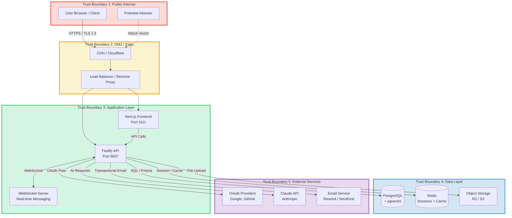
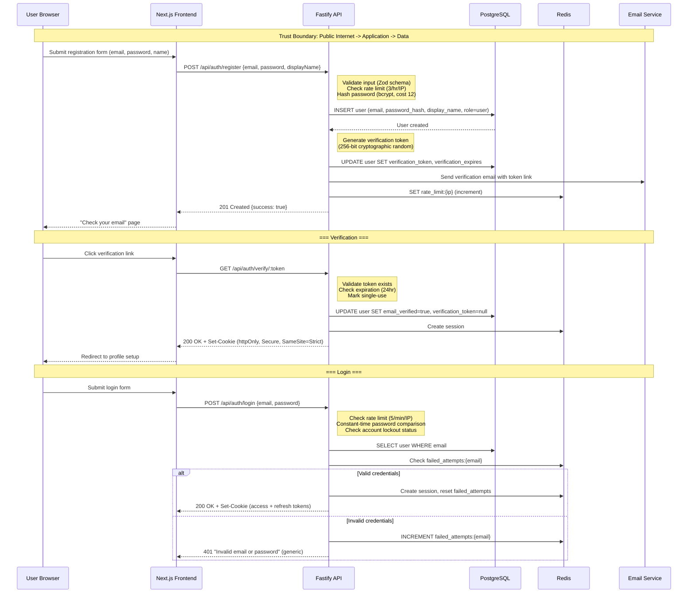
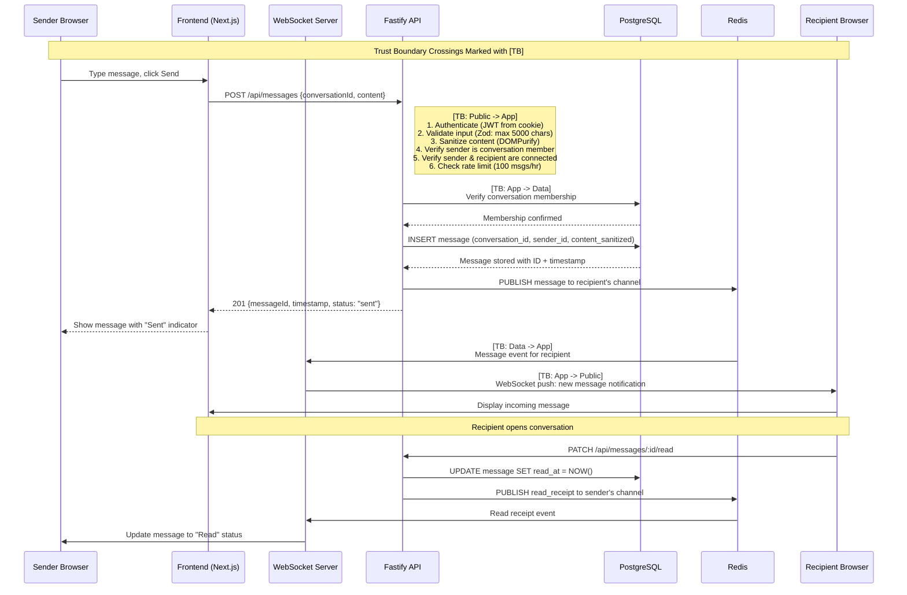
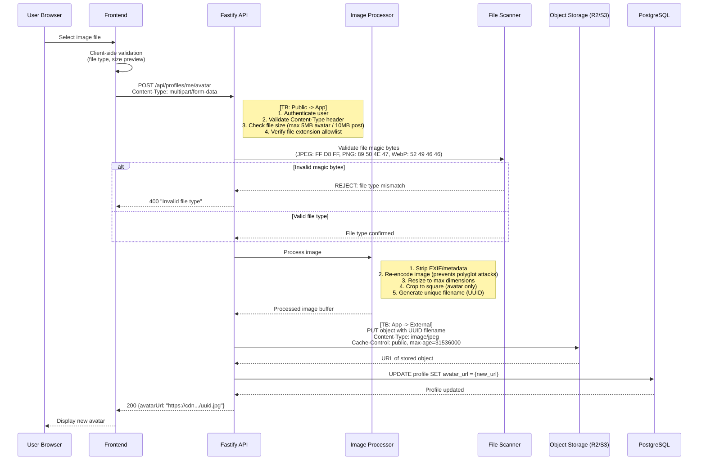
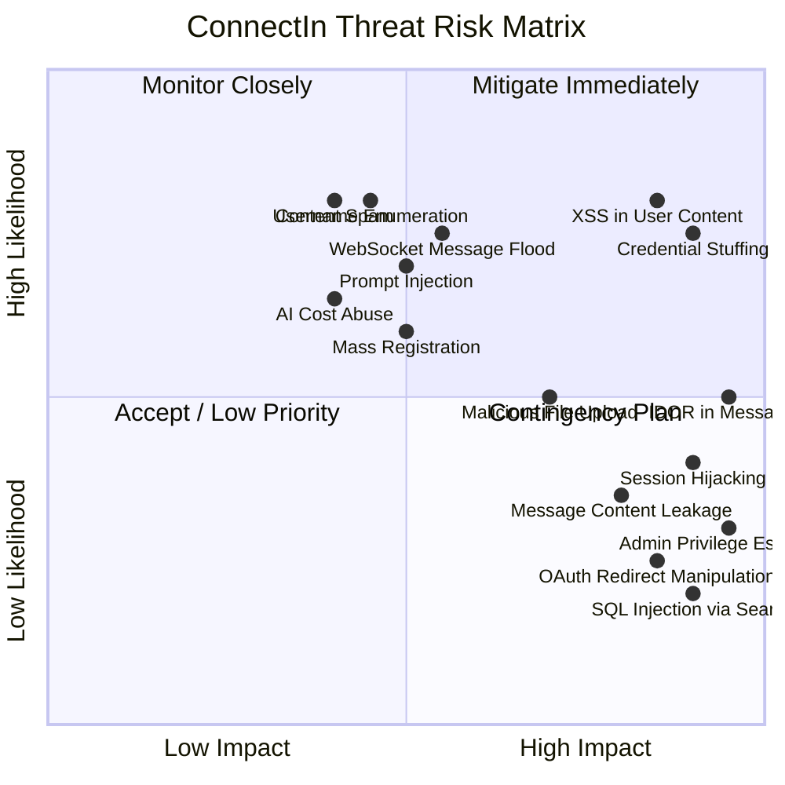

# ConnectIn -- Threat Model

> **Security Engineer** | ConnectSW
> **Version**: 1.0
> **Date**: February 20, 2026
> **Methodology**: STRIDE
> **Product**: ConnectIn -- Professional Networking Platform

---

## Table of Contents

1. [System Overview](#1-system-overview)
2. [Asset Inventory](#2-asset-inventory)
3. [STRIDE Analysis](#3-stride-analysis)
4. [Attack Surface Map](#4-attack-surface-map)
5. [Data Flow Diagrams](#5-data-flow-diagrams)
6. [Risk Matrix](#6-risk-matrix)
7. [Summary](#7-summary)

---

## 1. System Overview

ConnectIn is an AI-native, Arabic-first professional networking platform. It handles sensitive personal data including user credentials, professional profiles, private messages, job applications, and AI-generated content. The system consists of a Next.js frontend (port 3111), a Fastify backend API (port 5007), PostgreSQL with pgvector, Redis for caching/sessions, object storage for media, and external integrations with OAuth providers, AI services (Claude API), and email services.

### 1.1 Trust Boundaries

Trust boundaries separate zones of differing trust levels. Any data crossing a trust boundary must be validated, authenticated, and authorized.



### 1.2 Key Trust Boundary Crossings

| Crossing | From | To | Data | Risk Level |
|----------|------|----|------|------------|
| User input | Public Internet | Application Layer | Form data, file uploads, API requests | **Critical** |
| API responses | Application Layer | Public Internet | User data, tokens, profile content | **High** |
| Database queries | Application Layer | Data Layer | SQL queries, user records, messages | **High** |
| Session tokens | Application Layer | Redis | JWT tokens, session data | **High** |
| OAuth callbacks | External Services | Application Layer | Auth codes, user info, tokens | **High** |
| AI requests | Application Layer | External Services | User profile data, content drafts | **Medium** |
| File uploads | Public Internet | Object Storage | Images, avatars | **High** |
| Email delivery | Application Layer | External Services | Verification tokens, user emails | **Medium** |
| WebSocket | Public Internet | Application Layer | Real-time messages | **High** |

---

## 2. Asset Inventory

### 2.1 Data Assets

| Asset Category | Examples | Sensitivity | Storage Location | Regulatory |
|----------------|----------|-------------|------------------|------------|
| **User Credentials** | Email, password hash, OAuth tokens, session tokens, verification tokens, password reset tokens | **Critical** | PostgreSQL (encrypted), Redis (sessions) | GDPR Art. 32 |
| **Personal Information** | Display name, headline, summary, experience, education, skills, location, avatar photo | **High** | PostgreSQL, Object Storage (avatar) | GDPR Art. 5-9 |
| **Private Communications** | Direct messages, conversation metadata, read receipts | **Critical** | PostgreSQL | GDPR Art. 5, ePrivacy |
| **Professional Data** | Job applications, cover notes, job postings, recruiter-candidate relationships | **High** | PostgreSQL | GDPR Art. 5-6 |
| **AI-Generated Content** | Profile optimization suggestions, content drafts, match scores | **Medium** | Transient (API response), optionally PostgreSQL | GDPR Art. 22 (automated decisions) |
| **Social Graph** | Connections, pending requests, mutual connections, followed hashtags | **High** | PostgreSQL | GDPR Art. 5 |
| **User Activity** | Post likes, comments, shares, profile views, search queries | **Medium** | PostgreSQL | GDPR Art. 5-6 |
| **Platform Metadata** | Content reports, moderation actions, audit logs, admin activity | **Medium** | PostgreSQL | GDPR Art. 30 |

### 2.2 System Assets

| Asset | Purpose | Compromise Impact |
|-------|---------|-------------------|
| API server (Fastify) | Business logic, data processing | Full platform compromise |
| Database (PostgreSQL) | Primary data store | Complete data breach |
| Redis | Session store, rate limiting | Session hijacking, rate limit bypass |
| Object Storage (R2/S3) | Media files | Data leak, content tampering |
| OAuth credentials | Third-party authentication | Account takeover |
| Claude API key | AI feature access | Cost abuse, data exfiltration |
| Email service API key | Transactional email | Phishing, token theft |
| TLS certificates | Transport encryption | Man-in-the-middle attacks |

---

## 3. STRIDE Analysis

### 3.1 Authentication Module (`/api/auth/*`)

| Category | Threat ID | Threat | Likelihood | Impact | Risk | Mitigation |
|----------|-----------|--------|------------|--------|------|------------|
| **S** Spoofing | AUTH-S01 | Credential stuffing attack using breached password databases | High | Critical | **Critical** | Bcrypt cost factor 12+; account lockout after 5 failed attempts with progressive delay (1min, 5min, 15min, 1hr); CAPTCHA after 3 failures |
| **S** Spoofing | AUTH-S02 | Session hijacking via stolen cookies or XSS | Medium | Critical | **High** | HttpOnly + Secure + SameSite=Strict cookies; short-lived access tokens (15 min); CSP headers; session binding to user agent |
| **S** Spoofing | AUTH-S03 | OAuth token theft via redirect URI manipulation | Low | Critical | **Medium** | Strict redirect URI validation; state parameter with CSRF protection; PKCE for public clients |
| **S** Spoofing | AUTH-S04 | Password reset token brute force | Medium | Critical | **High** | Cryptographically random tokens (256-bit); 1-hour expiry; single-use tokens; rate limit reset requests to 3/hour/email |
| **T** Tampering | AUTH-T01 | JWT token manipulation (algorithm confusion, payload modification) | Low | Critical | **Medium** | RS256 algorithm (asymmetric); validate algorithm header; reject `none` algorithm; short expiry |
| **T** Tampering | AUTH-T02 | Registration with tampered role field to claim admin/recruiter | Medium | Critical | **High** | Server-side role assignment only; ignore role field from client input; default to `user` role |
| **R** Repudiation | AUTH-R01 | User denies login or account creation | Low | Low | **Low** | Audit log: all auth events (login, logout, registration, password changes) with IP, user agent, timestamp |
| **I** Information Disclosure | AUTH-I01 | Username enumeration via registration or login error messages | High | Medium | **High** | Generic error messages: "Invalid email or password"; consistent response timing; rate limiting |
| **I** Information Disclosure | AUTH-I02 | Verification/reset tokens leaked via referrer headers or logs | Medium | Critical | **High** | Tokens in URL fragment (not query params where possible); strip referrer on redirect; exclude tokens from application logs |
| **D** Denial of Service | AUTH-D01 | Login brute force causing account lockout for legitimate users | Medium | Medium | **Medium** | Progressive delay (not permanent lockout); CAPTCHA after 3 attempts; lockout resets after 1 hour; allow unlock via email |
| **D** Denial of Service | AUTH-D02 | Mass registration to exhaust email service quota | Medium | Medium | **Medium** | Registration rate limit: 3/hour/IP; email verification required before full access; monitor email service usage |
| **E** Elevation | AUTH-E01 | Privilege escalation via direct API parameter manipulation | Medium | Critical | **Critical** | Server-side RBAC enforcement; role changes restricted to admin API; audit all role modifications |
| **E** Elevation | AUTH-E02 | Unverified account accessing restricted features | Medium | High | **High** | Middleware check: `emailVerified === true` required for feed, messaging, posting; verification guard on all protected routes |

### 3.2 Profile Module (`/api/profiles/*`)

| Category | Threat ID | Threat | Likelihood | Impact | Risk | Mitigation |
|----------|-----------|--------|------------|--------|------|------------|
| **S** Spoofing | PROF-S01 | Editing another user's profile via IDOR (Insecure Direct Object Reference) | Medium | High | **High** | Enforce `userId === authenticatedUser.id` on all profile mutations; use `/me` endpoints for own-profile operations |
| **T** Tampering | PROF-T01 | XSS payload in profile fields (headline, summary, experience) | High | High | **Critical** | Input sanitization (DOMPurify on render); output encoding; CSP with `script-src 'self'`; Zod schema validation with max lengths |
| **T** Tampering | PROF-T02 | Malicious file upload disguised as avatar image | Medium | High | **High** | File type validation (magic bytes, not just extension); image re-encoding (Sharp); max 5MB; strip EXIF metadata; virus scan |
| **R** Repudiation | PROF-R01 | User denies profile content they authored | Low | Low | **Low** | Profile change audit trail with timestamp and previous values |
| **I** Information Disclosure | PROF-I01 | Excessive data exposure in profile API response (password hash, internal IDs) | Medium | Critical | **High** | Explicit response DTOs; never expose `password_hash`, `verification_token`, internal audit fields; use Prisma `select` to limit fields |
| **I** Information Disclosure | PROF-I02 | Avatar URL enumeration to discover user images | Low | Medium | **Low** | Random UUID-based file names; signed URLs with expiration for private storage; CDN caching with authorization |
| **D** Denial of Service | PROF-D01 | Oversized profile updates (extremely long text fields) | Medium | Low | **Medium** | Enforce field length limits in Zod schema: headline 220 chars, summary 2000 chars; request body size limit (1MB) |
| **E** Elevation | PROF-E01 | Regular user accessing recruiter-only fields or admin profile views | Medium | Medium | **Medium** | RBAC middleware on all recruiter/admin profile endpoints; field-level access control for sensitive profile data |

### 3.3 Messaging Module (`/api/messages/*`, WebSocket)

| Category | Threat ID | Threat | Likelihood | Impact | Risk | Mitigation |
|----------|-----------|--------|------------|--------|------|------------|
| **S** Spoofing | MSG-S01 | Sending messages impersonating another user via WebSocket manipulation | Medium | High | **High** | Server-side sender verification: `message.senderId` always set from authenticated session, never from client payload |
| **S** Spoofing | MSG-S02 | Unauthorized access to conversation not belonging to authenticated user | Medium | Critical | **High** | Verify `conversationMember.userId === authenticatedUser.id` on every message read/send; IDOR prevention |
| **T** Tampering | MSG-T01 | XSS payload in message content | High | High | **Critical** | HTML sanitization (DOMPurify); output encoding; CSP headers; message length limit (5000 chars) |
| **T** Tampering | MSG-T02 | WebSocket message injection or replay | Medium | Medium | **Medium** | WebSocket authentication via session token; message sequence numbers; timestamp validation; rate limiting |
| **R** Repudiation | MSG-R01 | User denies sending a message | Low | Medium | **Low** | Message records with immutable `sender_id`, `created_at`; messages cannot be edited after send |
| **I** Information Disclosure | MSG-I01 | Reading private messages of other users via API parameter manipulation | Medium | Critical | **Critical** | Conversation membership check on every read; never return messages from conversations the user is not a member of |
| **I** Information Disclosure | MSG-I02 | Message content exposed in logs, error messages, or push notifications | Medium | High | **High** | No message content in application logs; truncated previews only in notifications; error messages never include message content |
| **D** Denial of Service | MSG-D01 | WebSocket flood: excessive messages overwhelming the server | High | Medium | **High** | Rate limit: 60 messages/minute per WebSocket connection; message size limit; connection limit per user |
| **D** Denial of Service | MSG-D02 | Opening excessive WebSocket connections to exhaust server resources | Medium | High | **Medium** | Max 5 concurrent WebSocket connections per user; connection authentication required; idle timeout (5 min) |
| **E** Elevation | MSG-E01 | Non-connected user sending messages (bypassing connection requirement) | Medium | Medium | **Medium** | Server-side connection status check before allowing message send; `FR-802` enforcement at API layer |

### 3.4 Jobs Module (`/api/jobs/*`)

| Category | Threat ID | Threat | Likelihood | Impact | Risk | Mitigation |
|----------|-----------|--------|------------|--------|------|------------|
| **S** Spoofing | JOB-S01 | Non-recruiter posting jobs by manipulating role checks | Medium | Medium | **High** | Server-side role check: `user.role === 'recruiter'` enforced at route level; role cannot be set by client |
| **T** Tampering | JOB-T01 | XSS in job description or requirements fields | High | Medium | **High** | Sanitize all rich text job fields; CSP headers; Zod validation; output encoding |
| **T** Tampering | JOB-T02 | Modifying another recruiter's job posting via IDOR | Medium | Medium | **High** | Verify `job.postedBy === authenticatedUser.id` on all update/delete operations |
| **R** Repudiation | JOB-R01 | Recruiter denies receiving an application | Low | Medium | **Low** | Application records with timestamp; email notification to recruiter on application receipt |
| **I** Information Disclosure | JOB-I01 | Applicant data leaked to unauthorized recruiters | Medium | High | **High** | Application data visible only to the job poster; verify `job.postedBy === authenticatedUser.id` before returning applicant list |
| **I** Information Disclosure | JOB-I02 | Salary information exposed when marked as optional/hidden | Low | Low | **Low** | Respect `salary_min`/`salary_max` null values; never expose salary when not provided by recruiter |
| **D** Denial of Service | JOB-D01 | Mass job posting to pollute search results | Medium | Medium | **Medium** | Rate limit: recruiter can post 10 jobs/day; admin moderation for flagged job postings |
| **E** Elevation | JOB-E01 | Regular user accessing recruiter-only endpoints (create job, view applicants) | Medium | Medium | **Medium** | RBAC middleware on all `/api/jobs` mutation routes; reject with 403 for non-recruiter users |

### 3.5 Content & Feed Module (`/api/posts/*`)

| Category | Threat ID | Threat | Likelihood | Impact | Risk | Mitigation |
|----------|-----------|--------|------------|--------|------|------------|
| **S** Spoofing | FEED-S01 | Creating posts as another user via API parameter manipulation | Medium | Medium | **High** | `post.authorId` always derived from authenticated session; ignore `authorId` from client payload |
| **T** Tampering | FEED-T01 | XSS or HTML injection in post content, comments, or hashtags | High | High | **Critical** | DOMPurify sanitization; React auto-escaping; CSP headers; Zod validation (3000 char limit posts, 1000 chars comments) |
| **T** Tampering | FEED-T02 | Malicious image upload in post attachments | Medium | High | **High** | File type validation (magic bytes); image re-encoding via Sharp; max 10MB per image; max 4 images; strip metadata; virus scan |
| **T** Tampering | FEED-T03 | Like/comment count manipulation via race conditions | Low | Low | **Low** | Atomic database updates (Prisma `increment`/`decrement`); unique constraint on `(user_id, post_id)` for likes |
| **R** Repudiation | FEED-R01 | User denies authoring a post or comment | Low | Low | **Low** | Immutable `author_id` and `created_at`; soft delete retains records for 90 days |
| **I** Information Disclosure | FEED-I01 | Feed algorithm exposing private user behavior patterns | Low | Medium | **Low** | Feed scoring uses public signals only (likes, comments, shares); no private browsing history exposed |
| **D** Denial of Service | FEED-D01 | Spamming posts or comments to pollute feeds | High | Medium | **High** | Rate limit: 10 posts/hour, 30 comments/hour per user; auto-flag after 3 reports; community moderation |
| **D** Denial of Service | FEED-D02 | Infinite scroll abuse to exhaust API resources | Medium | Low | **Medium** | Cursor-based pagination with max page size (10); query timeout (5 seconds); response caching (Redis) |
| **E** Elevation | FEED-E01 | Deleting or editing another user's post/comment | Medium | Medium | **High** | Ownership check: `post.authorId === authenticatedUser.id` for mutations; admin-only override for moderation |

### 3.6 Search Module (`/api/search/*`)

| Category | Threat ID | Threat | Likelihood | Impact | Risk | Mitigation |
|----------|-----------|--------|------------|--------|------|------------|
| **T** Tampering | SEARCH-T01 | SQL injection via search query parameter | Medium | Critical | **Critical** | Prisma parameterized queries (immune to SQL injection by design); Zod validation on search input; sanitize special characters |
| **I** Information Disclosure | SEARCH-I01 | Search results exposing data of users who should not be visible (suspended, deleted) | Medium | Medium | **Medium** | Exclude `status !== 'active'` users from search results; filter at query level, not application level |
| **D** Denial of Service | SEARCH-D01 | Complex search queries causing slow database scans | High | Medium | **High** | Search rate limit: 60/minute; query timeout (5 seconds); full-text index on searchable fields; result limit (50 per page) |

### 3.7 Admin Module (`/api/admin/*`)

| Category | Threat ID | Threat | Likelihood | Impact | Risk | Mitigation |
|----------|-----------|--------|------------|--------|------|------------|
| **S** Spoofing | ADMIN-S01 | Attacker gaining admin session via credential compromise | Low | Critical | **Critical** | Stronger auth for admin: consider 2FA (Phase 2); admin sessions shorter (4 hours); admin actions require re-authentication |
| **T** Tampering | ADMIN-T01 | Unauthorized moderation actions (banning users, removing content) | Low | Critical | **Critical** | Audit trail for all admin actions; admin action confirmation dialogs; role verification at every admin endpoint |
| **R** Repudiation | ADMIN-R01 | Admin denies taking a moderation action | Low | High | **Medium** | Comprehensive audit log: admin ID, action, target, timestamp, reason; logs immutable (append-only) |
| **I** Information Disclosure | ADMIN-I01 | Admin dashboard leaking sensitive user data beyond what is needed for moderation | Medium | High | **Medium** | Minimize data in admin views; no password hashes or tokens; show only data necessary for moderation decisions |
| **E** Elevation | ADMIN-E01 | Regular user accessing `/api/admin/*` endpoints directly | Medium | Critical | **Critical** | RBAC middleware: `user.role === 'admin'` check on every admin route; return 404 (not 403) to avoid confirming admin endpoints exist |

### 3.8 AI Module (`/api/ai/*`)

| Category | Threat ID | Threat | Likelihood | Impact | Risk | Mitigation |
|----------|-----------|--------|------------|--------|------|------------|
| **S** Spoofing | AI-S01 | Prompt injection: user crafts profile content to manipulate AI output | High | Medium | **High** | Structured prompts with system-level instructions; input sanitization before AI processing; output validation; AI disclaimer on all generated content |
| **T** Tampering | AI-T01 | Manipulating AI suggestions to inject malicious content into profiles | Medium | High | **High** | AI output sanitization (DOMPurify); user review step before acceptance; AI content flagging for unusual patterns |
| **I** Information Disclosure | AI-I01 | User profile data exposed to AI service beyond what is necessary | Medium | Medium | **Medium** | Minimize data sent to Claude API; only send fields relevant to the optimization request; do not send credentials or private messages |
| **I** Information Disclosure | AI-I02 | AI-generated content revealing information about other users' profiles | Low | Medium | **Low** | AI prompts scoped to the requesting user's data only; no cross-user data in AI context |
| **D** Denial of Service | AI-D01 | Excessive AI requests driving up costs or exhausting API quota | High | Medium | **High** | Rate limit: 5 optimizations/day, 20 content assists/day per user; request timeout (30 seconds); cost monitoring with alerts |
| **E** Elevation | AI-E01 | AI-generated content bypassing content moderation rules | Medium | Medium | **Medium** | AI-generated content passes through same moderation pipeline as user-generated content; no special privileges for AI content |

---

## 4. Attack Surface Map

### 4.1 Entry Points Diagram

```mermaid
graph LR
    subgraph Public["Public Entry Points (No Auth)"]
        EP1[POST /api/auth/register]
        EP2[POST /api/auth/login]
        EP3[GET /api/auth/verify/:token]
        EP4[POST /api/auth/forgot-password]
        EP5[POST /api/auth/reset-password]
        EP6[GET /api/auth/oauth/google]
        EP7[GET /api/auth/oauth/github]
        EP8[GET /api/auth/oauth/callback]
    end

    subgraph Authenticated["Authenticated Entry Points"]
        EP9[Profile CRUD<br/>/api/profiles/*]
        EP10[Connection CRUD<br/>/api/connections/*]
        EP11[Post CRUD<br/>/api/posts/*]
        EP12[Job Search + Apply<br/>/api/jobs/*]
        EP13[Messaging<br/>/api/messages/*]
        EP14[Search<br/>/api/search/*]
        EP15[AI Features<br/>/api/ai/*]
        EP16[WebSocket<br/>ws://.../*]
        EP17[File Upload<br/>/api/profiles/me/avatar<br/>/api/posts (images)]
    end

    subgraph Admin["Admin Entry Points"]
        EP18[Dashboard<br/>/api/admin/dashboard]
        EP19[Moderation<br/>/api/admin/reports/*]
        EP20[User Management<br/>/api/admin/users/*]
    end

    subgraph Risk["Risk Rating"]
        CRIT[CRITICAL]
        HIGH[HIGH]
        MED[MEDIUM]
    end

    EP1 --- CRIT
    EP2 --- CRIT
    EP8 --- HIGH
    EP5 --- HIGH
    EP17 --- HIGH
    EP16 --- HIGH
    EP13 --- HIGH
    EP18 --- CRIT
    EP9 --- MED
    EP14 --- MED

    style CRIT fill:#E74C3C,color:#fff
    style HIGH fill:#F39C12,color:#fff
    style MED fill:#F1C40F,color:#000
    style Public fill:#FADBD8,stroke:#E74C3C
    style Authenticated fill:#D5F5E3,stroke:#2ECC71
    style Admin fill:#D4E6F1,stroke:#3498DB
```

### 4.2 Entry Point Risk Assessment

| Entry Point | Auth Required | Risk Level | Key Threats | Priority Mitigations |
|-------------|--------------|------------|-------------|---------------------|
| `POST /api/auth/register` | No | **Critical** | Credential stuffing, account enumeration, mass registration | Rate limiting, CAPTCHA, generic errors |
| `POST /api/auth/login` | No | **Critical** | Brute force, credential stuffing, timing attacks | Account lockout, rate limiting, constant-time comparison |
| `GET /api/auth/oauth/callback` | No | **High** | OAuth redirect manipulation, CSRF, token theft | State parameter, strict redirect URI, PKCE |
| `POST /api/auth/reset-password` | No | **High** | Token brute force, account takeover | Cryptographic tokens, short expiry, single use |
| File upload endpoints | Yes | **High** | Malicious files, path traversal, resource exhaustion | Type validation, size limits, re-encoding, virus scan |
| WebSocket connection | Yes | **High** | Message flood, injection, session hijacking | Auth on connect, rate limiting, message validation |
| `POST /api/messages` | Yes | **High** | XSS, unauthorized access, spam | Sanitization, connection check, rate limiting |
| `/api/admin/*` | Admin | **Critical** | Unauthorized access, privilege escalation | RBAC, re-authentication, audit logging |
| `/api/profiles/*` | Yes | **Medium** | IDOR, XSS, data leakage | Ownership checks, sanitization, response DTOs |
| `/api/search/*` | Yes | **Medium** | SQL injection, DoS via complex queries | Parameterized queries, timeouts, rate limiting |
| `/api/ai/*` | Yes | **High** | Prompt injection, cost abuse, data leakage | Input sanitization, rate limiting, minimal data exposure |

---

## 5. Data Flow Diagrams

### 5.1 Authentication Flow (Email + Password)



### 5.2 Message Sending Flow



### 5.3 File Upload Flow (Avatar / Post Images)



---

## 6. Risk Matrix

### 6.1 Risk Quadrant



### 6.2 Risk Summary Table

| Risk Level | Count | Threats |
|------------|-------|---------|
| **Critical** | 7 | Credential stuffing (AUTH-S01), XSS in content (FEED-T01, MSG-T01, PROF-T01), privilege escalation (AUTH-E01, ADMIN-E01), IDOR in messaging (MSG-I01) |
| **High** | 14 | Session hijacking (AUTH-S02), IDOR in profiles (PROF-S01), malicious file upload (PROF-T02), WebSocket flood (MSG-D01), prompt injection (AI-S01), username enumeration (AUTH-I01), and others |
| **Medium** | 12 | OAuth token theft (AUTH-S03), JWT manipulation (AUTH-T01), AI cost abuse (AI-D01), search DoS (SEARCH-D01), and others |
| **Low** | 8 | Repudiation threats, avatar URL enumeration, feed algorithm exposure, and others |
| **Total Threats Identified** | **41** | |

### 6.3 Top 10 Threats by Risk (Prioritized for Remediation)

| Priority | Threat ID | Threat | Risk | Remediation Sprint |
|----------|-----------|--------|------|---------------------|
| 1 | AUTH-S01 | Credential stuffing | Critical | Foundation Sprint |
| 2 | FEED-T01, MSG-T01, PROF-T01 | XSS in user-generated content | Critical | Foundation Sprint |
| 3 | AUTH-E01, ADMIN-E01 | Privilege escalation | Critical | Foundation Sprint |
| 4 | MSG-I01 | IDOR in private messages | Critical | Foundation Sprint |
| 5 | AUTH-S02 | Session hijacking | High | Foundation Sprint |
| 6 | PROF-S01 | IDOR in profile editing | High | Foundation Sprint |
| 7 | PROF-T02, FEED-T02 | Malicious file upload | High | Foundation Sprint |
| 8 | AI-S01 | Prompt injection | High | MVP Sprint |
| 9 | MSG-D01 | WebSocket message flood | High | MVP Sprint |
| 10 | AUTH-I01 | Username enumeration | High | MVP Sprint |

---

## 7. Summary

### Threat Statistics

- **Total threats identified**: 41
- **Critical risk**: 7 (17%)
- **High risk**: 14 (34%)
- **Medium risk**: 12 (29%)
- **Low risk**: 8 (20%)

### Key Findings

1. **User-generated content is the largest attack surface**: ConnectIn accepts text input in Arabic and English across profiles, posts, comments, messages, and job descriptions. Every input point is a potential XSS vector. Consistent sanitization (DOMPurify) and CSP headers are non-negotiable.

2. **Private messaging requires the strictest access controls**: Messages are the most sensitive user data after credentials. IDOR vulnerabilities in the messaging module would constitute a critical data breach. Every message read/write must verify conversation membership.

3. **Authentication is the highest-value target**: Credential stuffing, session hijacking, and privilege escalation are the top threats. The auth module must implement defense in depth: bcrypt hashing, progressive lockout, short-lived tokens, secure cookie flags, and RBAC enforcement.

4. **File uploads are a high-risk entry point**: Avatar and post image uploads cross trust boundaries and can carry malicious payloads. Magic byte validation, image re-encoding, metadata stripping, and size limits are essential.

5. **AI features introduce novel attack vectors**: Prompt injection and cost abuse are specific to AI-native platforms. Input sanitization before AI processing and strict per-user rate limits are critical.

6. **Admin access is the highest-impact target**: Compromise of an admin account enables platform-wide damage. Admin sessions should be shorter, require re-authentication for sensitive actions, and produce comprehensive audit logs.

### Next Steps

- Implement mitigations outlined in `SECURITY-ARCHITECTURE.md`
- Use `SECURITY-CHECKLIST.md` for PR-level security review
- Schedule quarterly threat model review
- Conduct penetration testing before MVP launch

---

## Document History

| Version | Date | Author | Changes |
|---------|------|--------|---------|
| 1.0 | 2026-02-20 | Security Engineer (AI Agent) | Initial threat model |
