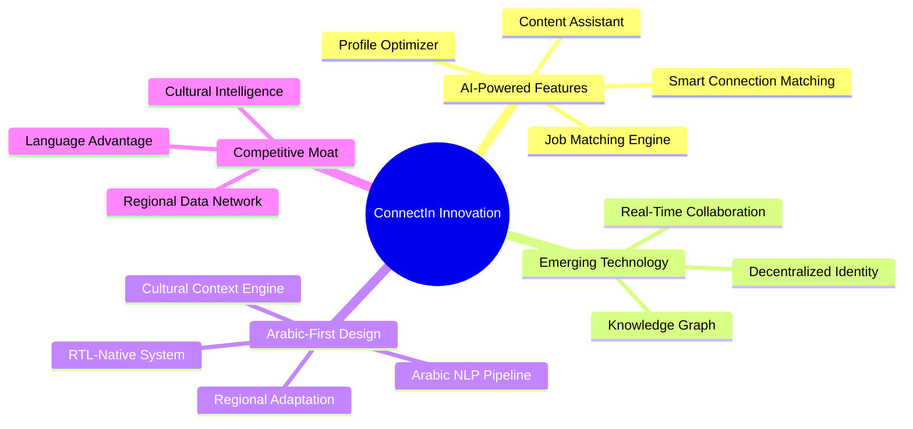
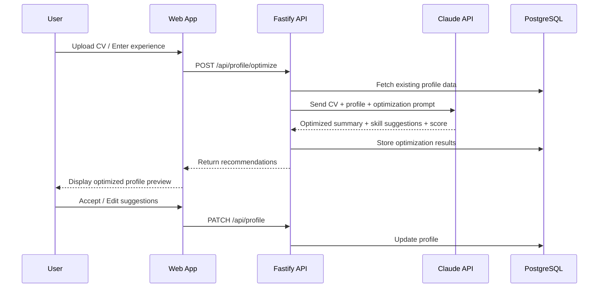
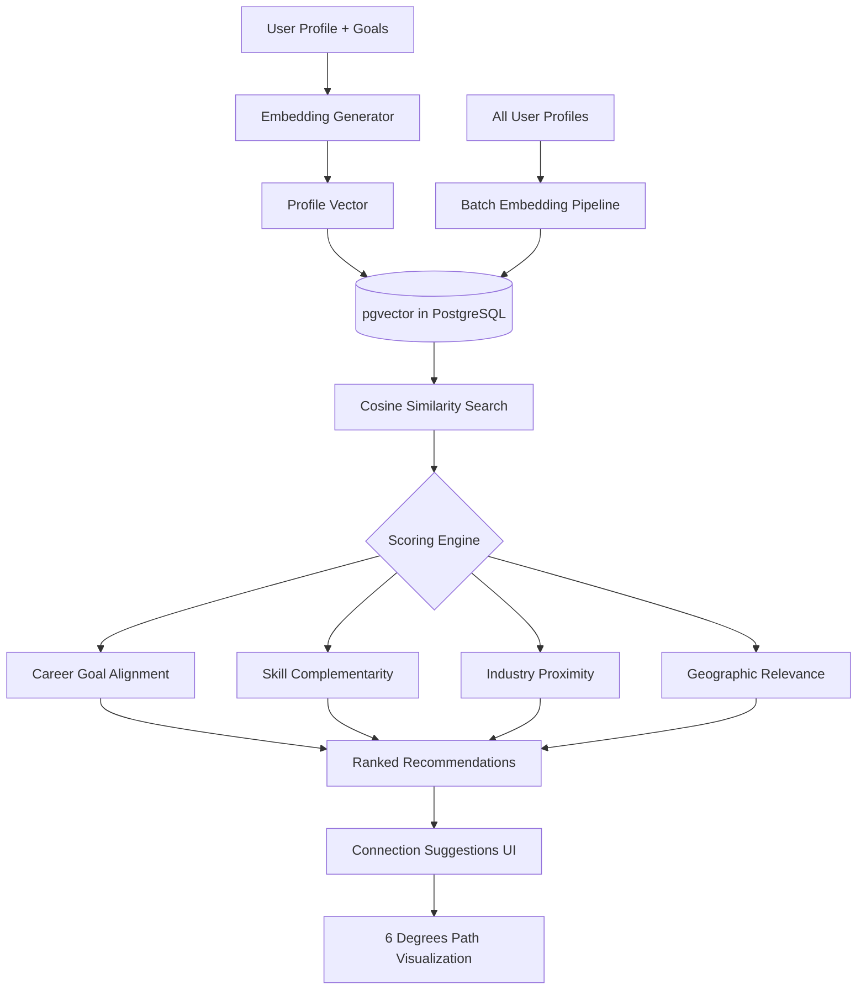
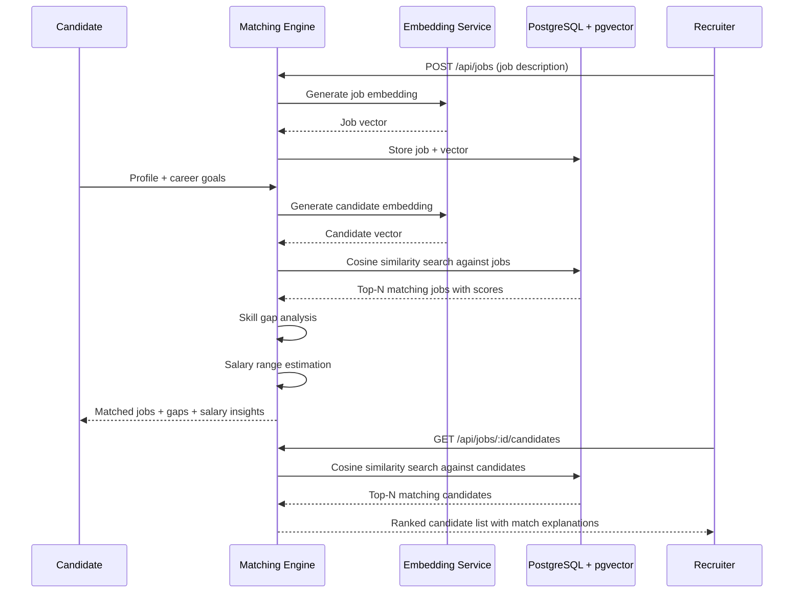
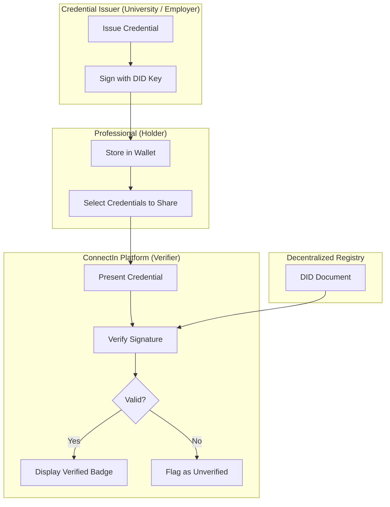
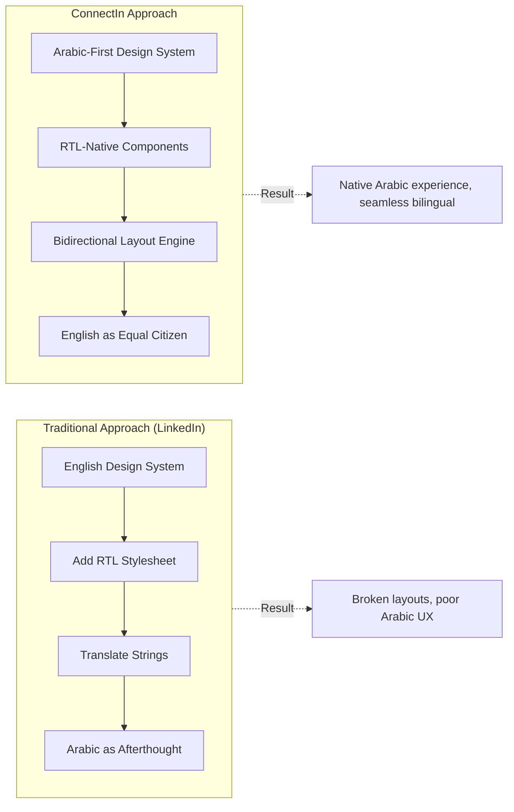
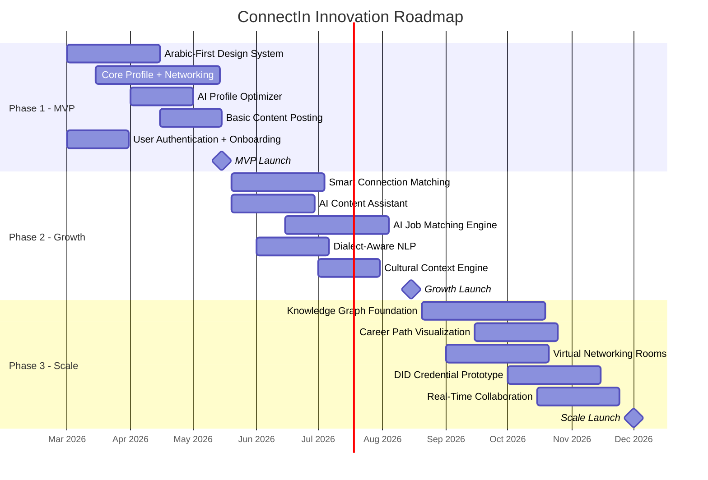
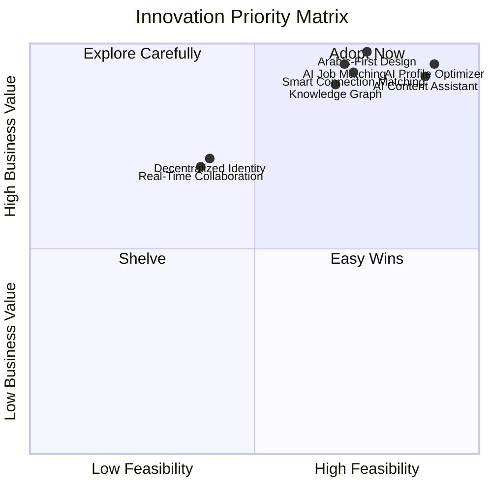
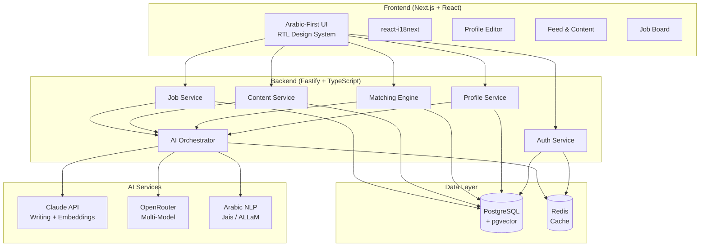

# ConnectIn Innovation Brief

**Version**: 1.0
**Date**: 2026-02-20
**Author**: Innovation Specialist
**Status**: Active
**Product**: ConnectIn -- Professional Networking Platform

---

## 1. Executive Summary

### Innovation Thesis

The professional networking space is dominated by LinkedIn, a platform that treats Arabic as a secondary language, applies Western networking norms globally, and relies on keyword-based matching that misses semantic intent. ConnectIn exists to fill a structural gap: **there is no professional networking platform built Arabic-first for the MENA region's 450+ million Arabic speakers and its rapidly growing tech ecosystem.**

### Key Insight

LinkedIn's dominance creates complacency, not satisfaction. Arab professionals use it because there is no alternative, not because it serves them well. The gap is threefold:

1. **Language**: Arabic support is bolted-on. RTL layouts break, AI features underperform in Arabic, and content algorithms are optimized for English engagement patterns.
2. **Culture**: Professional norms differ across the Gulf, Levant, and North Africa. A one-size-fits-all algorithm ignores regional networking customs, communication styles, and career trajectories.
3. **Intelligence**: LinkedIn's recommendations rely on explicit signals (mutual connections, job titles, keywords). Modern AI can match professionals on career goals, skill trajectories, and semantic understanding of expertise.

ConnectIn addresses all three by combining Arabic-first design, culturally-aware AI, and modern embedding-based intelligence into a platform purpose-built for the MENA professional community.

### Innovation Strategy Overview

---

## 2. AI-Powered Features (Adopt)

### 2.1 AI Profile Optimizer

**Description**: An AI engine that analyzes a user's CV, work history, and existing profile to generate optimized professional summaries, suggest skill endorsements, and provide a profile completeness score with actionable recommendations.

**How It Works**:

**Key Capabilities**:

- **Auto-generated Professional Summary**: Parses CV data and work history to produce a compelling Arabic and English professional summary that follows best practices for professional networking visibility.
- **Skill Endorsement Suggestions**: Analyzes job titles, project descriptions, and industry context to recommend skills the user should list, ordered by relevance to their career goals.
- **Profile Completeness Score**: A 0-100 score with weighted sections (photo, summary, experience, skills, education, endorsements) and specific AI recommendations for each incomplete area.
- **Industry-Specific Optimization**: Tailors recommendations based on the user's industry -- what works for a fintech founder differs from what works for an academic researcher.
- **Bilingual Optimization**: Generates summaries in both Arabic and English, ensuring cultural appropriateness in each language rather than direct translation.

**Viability**: **HIGH**

| Criterion | Score | Rationale |
|-----------|-------|-----------|
| Technical Feasibility | 5/5 | Claude API excels at Arabic text generation; Prisma provides structured profile data access |
| Business Value | 5/5 | Directly improves user onboarding and profile quality, driving engagement |
| Competitive Advantage | 4/5 | Arabic-first optimization is unique; English-only tools exist (Jobscan, Teal) |
| Resource Requirements | 4/5 | Low: API integration + prompt engineering + scoring algorithm |

---

### 2.2 Smart Connection Matching

**Description**: An AI-powered recommendation engine that suggests "people you should know" based on career goals, skill trajectories, and semantic similarity -- not just mutual connections and employer overlap.

**How It Works**:

**Key Capabilities**:

- **Goal-Based Matching**: Users declare career goals (e.g., "transition to AI engineering", "grow my startup's Gulf presence"). The system finds professionals who have achieved similar goals or are positioned to help.
- **Embedding-Based Similarity**: Uses sentence embeddings (via Claude or a dedicated embedding model) to represent profiles as vectors in semantic space. Stored in PostgreSQL using pgvector for efficient nearest-neighbor search.
- **Skill Complementarity**: Identifies professionals whose skills complement (not just match) the user's -- a backend engineer paired with a UX researcher, a founder paired with a potential CTO.
- **"6 Degrees" Path Visualization**: Shows the shortest connection path between any two users on the platform, revealing hidden network links.
- **Regional Awareness**: Weights geographic proximity and cultural context -- a Riyadh-based professional seeking Gulf connections should see Gulf-based matches first.

**Viability**: **HIGH**

| Criterion | Score | Rationale |
|-----------|-------|-----------|
| Technical Feasibility | 4/5 | pgvector is production-ready in PostgreSQL; embedding APIs are mature |
| Business Value | 5/5 | Core differentiator vs LinkedIn's mutual-connection model |
| Competitive Advantage | 5/5 | Goal-based matching is rare; Arabic-aware embeddings are unique |
| Resource Requirements | 3/5 | Medium: embedding pipeline + pgvector setup + scoring algorithm |

---

### 2.3 AI Content Assistant

**Description**: A content creation engine that helps professionals generate posts, articles, and thought leadership content with bilingual Arabic/English support and cultural awareness.

**Key Capabilities**:

- **Post Generation from URLs or Topics**: Paste an article link or describe a topic; the AI generates a professional post with hooks, structure, and hashtags optimized for engagement.
- **Bilingual Content (Arabic/English)**: Generates content in both languages simultaneously, with cultural adaptation rather than direct translation. Gulf Arabic readers expect different framing than Levantine or North African audiences.
- **Optimal Posting Time Prediction**: Analyzes platform engagement patterns to suggest the best time to post for maximum visibility, accounting for regional time zones (GCC peak hours differ from Maghreb).
- **Tone and Style Matching**: Learns from a user's previous posts to maintain consistent voice and style across generated content.

**Synergy with LinkedIn Agent**: ConnectSW already has a LinkedIn Agent product with proven Arabic content generation, OpenRouter multi-model routing, and format recommendation capabilities. The content assistant can reuse the core generation engine, adapting it for ConnectIn's native posting context rather than external LinkedIn publishing.

**Viability**: **HIGH**

| Criterion | Score | Rationale |
|-----------|-------|-----------|
| Technical Feasibility | 5/5 | LinkedIn Agent proves the tech works; direct code reuse possible |
| Business Value | 5/5 | Content creation drives platform engagement and retention |
| Competitive Advantage | 4/5 | Arabic-first content AI is unique; general tools (Jasper, Copy.ai) are English-centric |
| Resource Requirements | 4/5 | Low: adapt existing LinkedIn Agent engine for native platform use |

---

### 2.4 AI-Powered Job Matching

**Description**: A semantic job matching engine that understands what candidates can actually do and what employers actually need, going beyond keyword matching to true comprehension of skills, experience, and potential.

**How It Works**:

**Key Capabilities**:

- **Semantic Understanding**: Encodes job descriptions and candidate profiles as vectors. A "senior React developer" matches against "experienced frontend engineer with component architecture expertise" even without keyword overlap.
- **Skill Gap Analysis**: Identifies specific skills a candidate needs to qualify for aspirational roles, with learning resource recommendations.
- **Salary Insights**: Estimates salary ranges based on role, location, experience level, and market data from platform activity.
- **Explainable Matching**: Every match comes with a human-readable explanation of why the candidate and job are compatible, building trust in the AI.
- **Arabic Job Market Understanding**: Trained on MENA job market patterns -- understanding that "Gulf experience" is a real qualification, that military service gaps are normal in certain countries, and that bilingual capabilities have different value in different markets.

**Viability**: **HIGH**

| Criterion | Score | Rationale |
|-----------|-------|-----------|
| Technical Feasibility | 4/5 | pgvector + embedding APIs are proven; skill gap analysis adds complexity |
| Business Value | 5/5 | Job matching is a primary revenue driver for professional networks |
| Competitive Advantage | 5/5 | Semantic matching + Arabic market understanding is unique |
| Resource Requirements | 3/5 | Medium: embedding pipeline + matching algorithm + salary model |

---

## 3. Emerging Tech Opportunities (Explore)

### 3.1 Decentralized Identity (DID)

**Description**: A system where professional qualifications, certifications, and endorsements are cryptographically verifiable and user-controlled, rather than stored in a centralized database that users must trust.

**How It Works**:

**Key Capabilities**:

- **Verifiable Credentials**: University degrees, professional certifications, and employer references stored as W3C Verifiable Credentials that anyone can cryptographically verify without contacting the issuer.
- **Self-Sovereign Identity**: Users own their professional identity. If they leave ConnectIn, they take their verified credentials with them -- a fundamental differentiator from LinkedIn where your professional identity is trapped in their database.
- **Blockchain-Verified Endorsements**: Skill endorsements backed by cryptographic signatures from the endorser, preventing fake endorsements (a well-known LinkedIn problem).
- **Privacy-Preserving Verification**: Zero-knowledge proofs allow users to prove they have a qualification without revealing unnecessary details (e.g., proving they graduated from a top-50 university without revealing which one).

**Viability**: **MEDIUM**

| Criterion | Score | Rationale |
|-----------|-------|-----------|
| Technical Feasibility | 3/5 | Standards (W3C VCs, DIDs) are maturing; libraries exist but ecosystem is early |
| Business Value | 4/5 | Trust is a major gap in professional networking; verified credentials are valuable |
| Competitive Advantage | 5/5 | No major platform has implemented this; first-mover advantage is large |
| Resource Requirements | 2/5 | High: DID infrastructure, wallet integration, issuer onboarding |

**Recommendation**: **Explore** -- Prototype a basic credential verification flow. Full implementation depends on ecosystem maturity and issuer adoption in the MENA region.

---

### 3.2 Real-Time Collaboration

**Description**: Live networking features that go beyond asynchronous messaging -- virtual networking rooms with AI-powered facilitation, co-editing of professional documents, and WebRTC-based video networking.

**Key Capabilities**:

- **Virtual Networking Rooms**: Topic-based rooms where professionals can join live audio/video discussions. AI facilitates by introducing participants, suggesting talking points, and summarizing conversations.
- **Live Document Co-Editing**: Collaborative editing of business plans, proposals, and professional documents directly within the platform using CRDT-based real-time sync.
- **AI Meeting Facilitation**: An AI agent that joins networking rooms to break ice, introduce participants based on shared interests, translate between Arabic and English in real-time, and generate follow-up action items.
- **Smart Matchmaking Events**: Platform-organized networking events where AI matches participants into small groups based on complementary goals, then rotates groups at intervals.

**Viability**: **MEDIUM**

| Criterion | Score | Rationale |
|-----------|-------|-----------|
| Technical Feasibility | 3/5 | WebRTC is mature; AI facilitation adds complexity; CRDT co-editing is non-trivial |
| Business Value | 4/5 | Live features drive engagement and differentiate from LinkedIn's async model |
| Competitive Advantage | 4/5 | LinkedIn has basic messaging; live AI-facilitated rooms would be novel |
| Resource Requirements | 2/5 | High: WebRTC infrastructure, CRDT engine, AI facilitation logic |

**Recommendation**: **Explore** -- Start with simple topic-based chat rooms using WebSockets. Add audio/video via WebRTC in Phase 3. AI facilitation can be layered on incrementally.

---

### 3.3 Knowledge Graph

**Description**: A graph-based representation of professional expertise, skills, industries, and career paths across the entire platform, enabling intelligent navigation of the professional landscape.

**Key Capabilities**:

- **Professional Expertise Mapping**: Every user's skills, experiences, and knowledge areas form nodes in a graph, connected by relationships (used-at, learned-from, related-to, prerequisite-for).
- **Visual Career Path Exploration**: Users can explore career trajectories by navigating the graph -- seeing what skills are common among people who transitioned from engineering to product management, for example.
- **Industry Trend Detection**: Analyzing the graph over time reveals emerging skill clusters, growing industries, and declining specializations -- valuable intelligence for career planning.
- **Skill Gap Pathfinding**: The graph can compute the shortest path from a user's current skill set to their target role, recommending specific skills to acquire in order.

**Viability**: **MEDIUM-HIGH**

| Criterion | Score | Rationale |
|-----------|-------|-----------|
| Technical Feasibility | 4/5 | PostgreSQL with recursive CTEs handles graph queries; dedicated graph DB (Neo4j) optional |
| Business Value | 5/5 | Career intelligence is a premium feature with high willingness-to-pay |
| Competitive Advantage | 5/5 | LinkedIn has a skills graph internally but does not expose it to users |
| Resource Requirements | 3/5 | Medium: graph modeling + data pipeline + visualization frontend |

**Recommendation**: **Adopt (Phase 3)** -- Build the data model from day one (skills, relationships, career events). Graph queries and visualization can be added incrementally.

---

## 4. Arabic-First Innovation (Adopt)

### Design Philosophy

ConnectIn does not add Arabic support to an English platform. It builds an Arabic platform that also supports English. This distinction is fundamental and affects every layer of the stack.

### 4.1 RTL-Native Design System

- **Component Library**: All UI components built RTL-first using CSS logical properties (`margin-inline-start` instead of `margin-left`). Switching to LTR is a direction change, not a layout override.
- **Typography**: Arabic typography requires different line heights, letter spacing, and font choices than Latin text. The design system includes Arabic-optimized type scales using fonts like IBM Plex Arabic, Noto Naskh Arabic, or Tajawal.
- **Bidirectional Content**: Posts, messages, and documents can contain mixed Arabic and English text. The rendering engine handles inline direction switching using Unicode bidirectional algorithm awareness.

### 4.2 Arabic NLP Pipeline

- **Content Analysis**: Leveraging Arabic-specific LLMs (Jais, ALLaM) alongside Claude for content understanding, sentiment analysis, and topic extraction that understand Arabic morphology and dialectal variation.
- **Dialect Awareness**: The platform distinguishes between Modern Standard Arabic (MSA), Gulf Arabic, Egyptian Arabic, Levantine Arabic, and Maghreb Arabic -- routing content and recommendations accordingly.
- **Named Entity Recognition**: Arabic NER for extracting company names, job titles, skills, and locations from Arabic text, handling the unique challenges of Arabic morphology (roots, patterns, clitics).

### 4.3 Cultural Context Engine

- **Regional Professional Norms**: Gulf business culture values formal titles and hierarchical respect. Levantine culture is more informal and relationship-driven. North African professionals often bridge Arabic and French professional contexts. The AI adapts tone, recommendations, and matching weights accordingly.
- **Calendar and Timing**: Awareness of the Islamic calendar (Ramadan working hours, Eid breaks), regional weekends (Friday-Saturday in GCC vs Saturday-Sunday elsewhere), and local holidays affects posting time recommendations and event scheduling.
- **Communication Styles**: AI-generated content adapts to regional communication preferences -- more formal and achievement-oriented for Gulf audiences, more conversational and story-driven for Levantine audiences.

### 4.4 Viability Assessment

| Criterion | Score | Rationale |
|-----------|-------|-----------|
| Technical Feasibility | 4/5 | Arabic LLMs are maturing; RTL CSS is well-supported; cultural rules need curation |
| Business Value | 5/5 | The entire competitive thesis rests on Arabic-first experience |
| Competitive Advantage | 5/5 | No competitor has Arabic-first professional networking |
| Resource Requirements | 3/5 | Medium: design system + NLP integration + cultural knowledge base |

**Recommendation**: **Adopt (Phase 1)** -- Arabic-first design and basic NLP in MVP. Dialect awareness and cultural engine in Phase 2.

---

## 5. Innovation Roadmap

### Phase 1: MVP (March -- May 2026)

**Goal**: A functional professional networking platform with Arabic-first design, core profile features, and an AI profile optimizer that immediately demonstrates value.

**Deliverables**:
- Arabic-first RTL design system with bidirectional support
- User registration, authentication, and profile creation
- AI-powered profile optimization (summary generation, skill suggestions, completeness score)
- Basic content posting with bilingual support
- Connection requests and messaging

**Success Criteria**:
- 90%+ Arabic text renders correctly without layout breaks
- AI profile optimizer generates usable summaries in under 10 seconds
- Profile completeness score correlates with user engagement

### Phase 2: Growth (May -- August 2026)

**Goal**: AI-powered matching and content creation that drive network effects and user retention.

**Deliverables**:
- Embedding-based connection matching with pgvector
- AI content assistant (adapted from LinkedIn Agent)
- Semantic job matching with skill gap analysis
- Dialect-aware content and NLP pipeline
- Cultural context engine for regional adaptation

**Success Criteria**:
- Connection acceptance rate for AI suggestions exceeds 25%
- AI-generated posts achieve engagement parity with manually written posts
- Job match relevance score exceeds 4/5 in user ratings

### Phase 3: Scale (August -- December 2026)

**Goal**: Platform intelligence and advanced features that create durable competitive advantages.

**Deliverables**:
- Knowledge graph with career path exploration
- Virtual networking rooms with WebRTC
- DID-based credential verification prototype
- Real-time document collaboration
- Industry trend detection from platform data

**Success Criteria**:
- Knowledge graph covers 80%+ of registered skill categories
- Virtual room sessions average 15+ minutes engagement
- At least one university or certification body issues verifiable credentials on the platform

---

## 6. Viability Matrix

### Scoring Key

Each innovation is scored on four dimensions (1-5 scale):
- **Technical Feasibility**: How buildable is this with our stack? (5 = straightforward, 1 = requires fundamental new capabilities)
- **Business Value**: How much does this drive user acquisition, engagement, or revenue? (5 = critical, 1 = nice-to-have)
- **Competitive Advantage Duration**: How long before competitors can replicate this? (5 = 3+ years, 1 = months)
- **Resource Requirements**: How much effort to build? (5 = minimal, 1 = massive; lower score = more resources needed)

| Innovation | Tech Feasibility | Business Value | Competitive Advantage | Resources (lower = more) | Total | Recommendation |
|------------|:---:|:---:|:---:|:---:|:---:|----------------|
| AI Profile Optimizer | 5 | 5 | 4 | 4 | **18** | **Adopt** (Phase 1) |
| Smart Connection Matching | 4 | 5 | 5 | 3 | **17** | **Adopt** (Phase 2) |
| AI Content Assistant | 5 | 5 | 4 | 4 | **18** | **Adopt** (Phase 2) |
| AI Job Matching | 4 | 5 | 5 | 3 | **17** | **Adopt** (Phase 2) |
| Arabic-First Design | 4 | 5 | 5 | 3 | **17** | **Adopt** (Phase 1) |
| Knowledge Graph | 4 | 5 | 5 | 3 | **17** | **Adopt** (Phase 3) |
| Decentralized Identity | 3 | 4 | 5 | 2 | **14** | **Explore** |
| Real-Time Collaboration | 3 | 4 | 4 | 2 | **13** | **Explore** |

### Priority Visualization

---

## 7. Technology Stack Recommendations

### AI Layer

| Capability | Technology | Rationale |
|------------|-----------|-----------|
| Arabic/English Writing | Claude API (via Anthropic SDK) | Best-in-class Arabic text generation; proven in LinkedIn Agent |
| Embeddings (Matching) | Claude Embeddings or OpenAI text-embedding-3-large | High-quality semantic vectors for profile and job matching |
| Multi-Model Routing | OpenRouter | Existing pattern from LinkedIn Agent; cost optimization across models |
| Arabic-Specific NLP | Jais / ALLaM (via API) | Specialized Arabic LLMs for dialect detection and cultural nuance |
| Content Analysis | Gemini (via OpenRouter) | Long-context analysis for trend detection and article parsing |

### Data Layer

| Capability | Technology | Rationale |
|------------|-----------|-----------|
| Primary Database | PostgreSQL 15+ | Existing stack; battle-tested; supports all needed features |
| Vector Search | pgvector extension | Embedding storage and ANN search within PostgreSQL; no separate vector DB needed |
| Full-Text Search (Phase 1) | PostgreSQL `tsvector` | Built-in; sufficient for MVP-scale text search |
| Full-Text Search (Phase 3) | Elasticsearch / Meilisearch | Scale-out when PostgreSQL full-text hits performance limits |
| Graph Queries (Phase 3) | PostgreSQL recursive CTEs | Graph traversal within existing DB; Neo4j optional for scale |
| Caching | Redis | Session management, rate limiting, embedding cache |

### Real-Time Layer

| Capability | Technology | Rationale |
|------------|-----------|-----------|
| Notifications | Server-Sent Events (SSE) | Simpler than WebSockets for one-way push; works with Fastify |
| Chat / Messaging | WebSockets (via Fastify websocket plugin) | Bidirectional real-time messaging |
| Video Networking (Phase 3) | WebRTC (via LiveKit or mediasoup) | Open-source SFU for scalable video rooms |
| Document Collaboration (Phase 3) | Yjs (CRDT library) | Mature CRDT for real-time collaborative editing |

### Internationalization Layer

| Capability | Technology | Rationale |
|------------|-----------|-----------|
| i18n Framework | react-i18next | Industry standard; supports RTL; namespace-based organization |
| RTL Handling | CSS Logical Properties + `dir` attribute | Native browser support; no CSS hacks needed |
| Arabic Fonts | IBM Plex Arabic / Tajawal | Open-source; optimized for screen readability |
| Date/Time | Intl API + date-fns with locale | Native timezone and calendar formatting |
| Number Formatting | Intl.NumberFormat with `ar` locale | Correct Arabic numeral formatting (Eastern vs Western digits) |

### Architecture Overview

---

## 8. Recommendation Summary

### Adopt (Include in MVP or Phase 2)

| Innovation | Phase | Priority | Rationale |
|------------|-------|----------|-----------|
| **Arabic-First Design System** | Phase 1 | P0 | Foundation for the entire product; competitive thesis depends on it |
| **AI Profile Optimizer** | Phase 1 | P0 | Immediate user value at onboarding; drives profile quality |
| **AI Content Assistant** | Phase 2 | P1 | Drives daily engagement; code reuse from LinkedIn Agent minimizes cost |
| **Smart Connection Matching** | Phase 2 | P1 | Core network effect driver; pgvector enables with existing stack |
| **AI Job Matching** | Phase 2 | P1 | Primary revenue opportunity; builds on embedding infrastructure from matching |
| **Knowledge Graph** | Phase 3 | P2 | Long-term intelligence layer; data model should be designed from Phase 1 |

### Explore (Prototype Later)

| Innovation | Timeline | Trigger for Adoption |
|------------|----------|---------------------|
| **Decentralized Identity** | Phase 3+ | When MENA universities or certification bodies express interest in issuing VCs |
| **Real-Time Collaboration** | Phase 3 | Start with text chat rooms; add audio/video based on user demand |

### Shelve (Not Viable Now)

None of the evaluated innovations are shelved entirely. All have viable paths to implementation given the current technology landscape. The DID and real-time collaboration features are moved to "Explore" rather than "Shelve" because the underlying technologies are maturing rapidly.

---

## Appendix A: Competitive Landscape

| Platform | Arabic Support | AI Features | MENA Focus | Networking Model |
|----------|:---:|:---:|:---:|:---:|
| **LinkedIn** | Bolted-on RTL | Basic (Premium only) | No | Mutual connections |
| **Xing** | None | Minimal | No (DACH only) | Industry-based |
| **Bayt.com** | Yes | Keyword matching | Yes (jobs only) | Job board |
| **ConnectIn** | **Arabic-first** | **AI-native** | **Yes** | **Goal-based AI matching** |

## Appendix B: Research Sources

- [Professional Networking Automation: 2026 Guide](https://blog.linkmate.io/professional-networking-automation-guide-2026/)
- [12 Best Professional Networking Platforms (Product Hunt 2025)](https://card.biz/blog/best-professional-networking-platforms-on-product-hunt/)
- [10 Best Networking Apps for Professionals in 2026](https://www.netwoorking.com/10-best-networking-apps-that-help-professionals-connect-faster-2026/)
- [Decentralized Identity in 2026 (Indicio)](https://indicio.tech/blog/decentralized-identity-verifiable-credentials-2026/)
- [Why Verifiable Credentials Will Power Real-World AI in 2026](https://indicio.tech/blog/why-verifiable-credentials-will-power-ai-in-2026/)
- [The Landscape of Arabic Large Language Models (ACM)](https://cacm.acm.org/arab-world-regional-special-section/the-landscape-of-arabic-large-language-models/)
- [AbjadNLP 2026 Workshop](https://wp.lancs.ac.uk/abjad/)
- [Cross-Dialectal Arabic Translation: Comparative Analysis on LLMs](https://www.frontiersin.org/journals/artificial-intelligence/articles/10.3389/frai.2025.1661789/full)
- [AI-Driven Semantic Similarity-Based Job Matching (ScienceDirect)](https://www.sciencedirect.com/science/article/pii/S0020025525008643)
- [Talent Matching with Vector Embeddings (Ingedata)](https://www.ingedata.ai/blog/2025/04/01/talent-matching-with-vector-embeddings/)
- [pgvector: Key Features, Tutorial, and Pros/Cons (2026 Guide)](https://www.instaclustr.com/education/vector-database/pgvector-key-features-tutorial-and-pros-and-cons-2026-guide/)
- [The Skill Graph Economy: What Work Looks Like in 2030](https://medium.com/@mail2rajivgopinath/trends-2026-21-32-the-skill-graph-economy-what-work-looks-like-in-2030-a8b8bd498640)
- [AI and WebRTC: Future of Enhanced Communication Applications](https://www.ecosmob.com/ai-and-webrtc-communication-applications/)
- [WebRTC Market Trends and Predictions for 2025](https://www.digitalsamba.com/blog/webrtc-market-trends-predictions)
- [8 Best LinkedIn Alternatives for Professional Networking in 2026](https://www.engagecoders.com/top-linkedin-alternatives-2026/)
