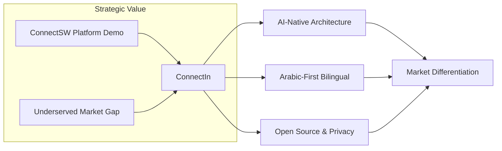
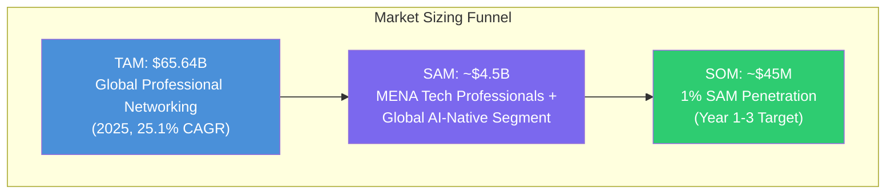
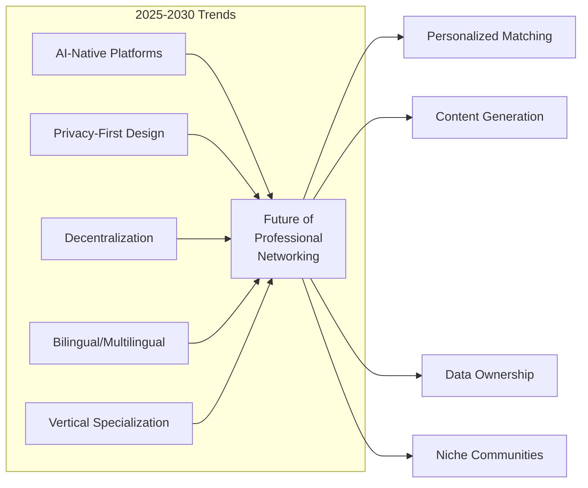
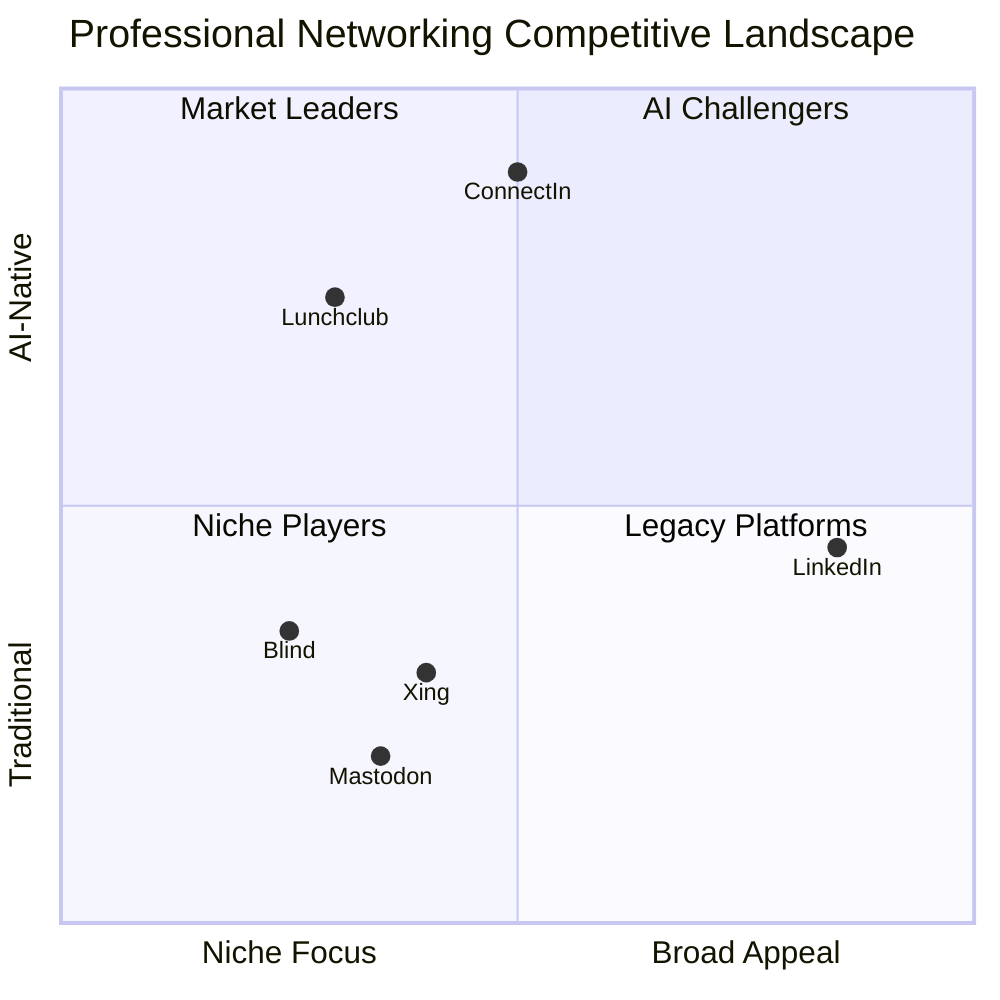
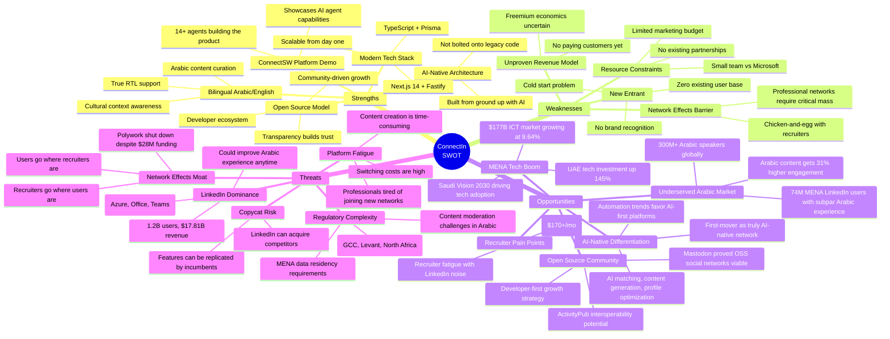
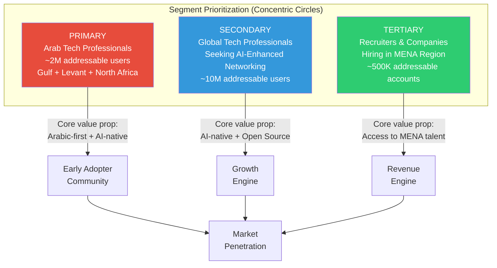
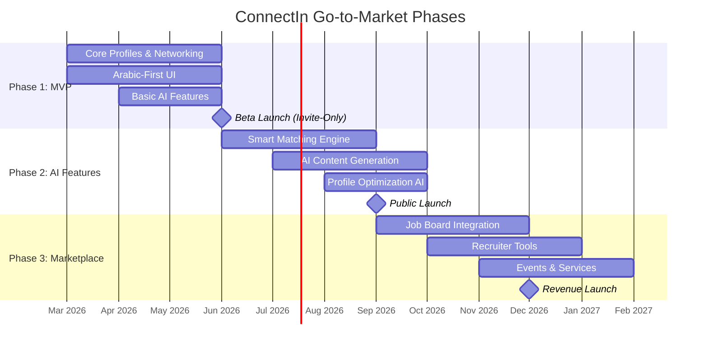
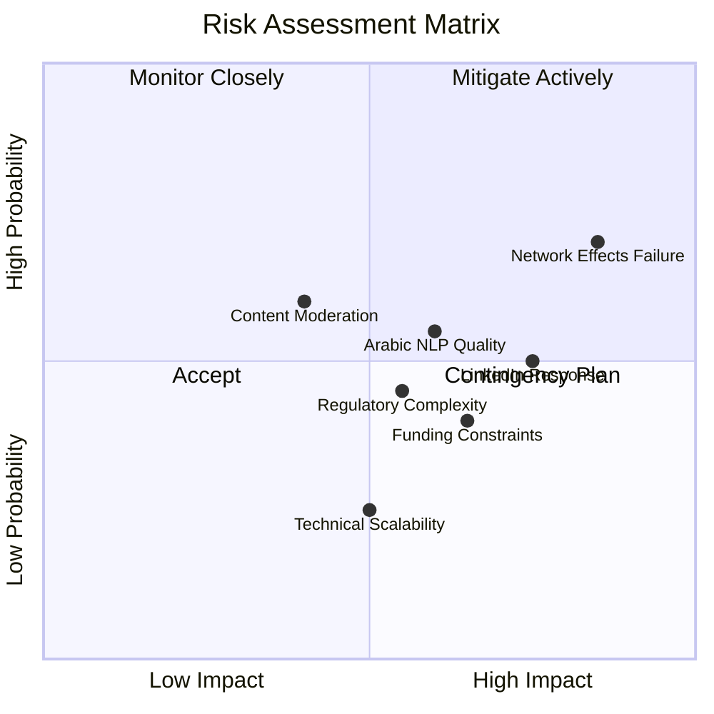
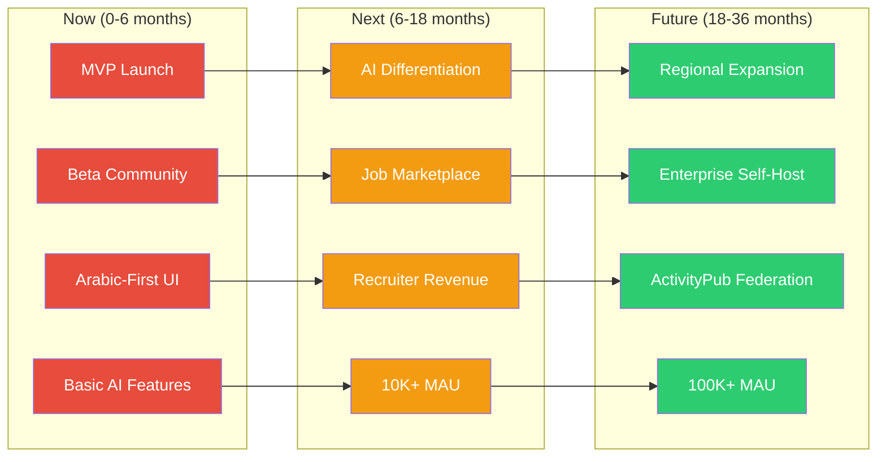

# ConnectIn Market Analysis

> **Product Strategist** | ConnectSW
> **Date**: February 20, 2026
> **Version**: 1.0
> **Status**: Complete

---

## Table of Contents

1. [Executive Summary](#1-executive-summary)
2. [Market Overview](#2-market-overview)
3. [Competitive Analysis](#3-competitive-analysis)
4. [SWOT Analysis](#4-swot-analysis)
5. [Differentiation Strategy](#5-differentiation-strategy)
6. [Target Market Segments](#6-target-market-segments)
7. [Go-to-Market Strategy](#7-go-to-market-strategy)
8. [Risk Assessment](#8-risk-assessment)
9. [Success Metrics](#9-success-metrics)
10. [Recommendation](#10-recommendation)

---

## 1. Executive Summary

**ConnectIn** is a professional networking platform being built by ConnectSW to serve two strategic purposes:

1. **Platform Showcase**: Demonstrate the full capability of ConnectSW's AI agent development platform by engaging all 14+ specialist agents across 6 phases of product development.
2. **Market Opportunity**: Address a genuine gap in professional networking for Arabic-speaking tech professionals and AI-native networking experiences.

### Key Strategic Insight

The professional networking market is valued at **$65.64 billion (2025)** and projected to reach **$201.12 billion by 2030** at a 25.1% CAGR. Despite this growth, two critical segments remain underserved:

- **Arabic-speaking professionals** (300M+ Arabic speakers globally, with LinkedIn's Arabic experience remaining secondary to its English-first platform)
- **AI-native networking** (current platforms bolt AI onto legacy architectures rather than building AI-first)

ConnectIn targets the intersection of these two gaps: an **AI-native, bilingual (Arabic/English) professional networking platform** built with modern technology and open-source principles.

---

## 2. Market Overview

### 2.1 Market Sizing

| Metric | Value | Source |
|--------|-------|--------|
| **TAM** (Total Addressable Market) | $65.64B (2025) growing to $201.12B (2030) | [Mordor Intelligence](https://www.mordorintelligence.com/industry-reports/professional-networking-market) |
| **SAM** (Serviceable Addressable Market) | ~$4.5B (MENA tech professionals + global AI-native segment) | Derived from MENA ICT spend ($177.1B) and professional networking share |
| **SOM** (Serviceable Obtainable Market) | ~$45M (1% of SAM in first 3 years) | Conservative penetration estimate |

**Alternative sizing**: The global Professional Networking Apps market was $53.23B in 2023 and is projected to reach $429.10B by 2032 at a 26.1% CAGR ([DataIntelo](https://dataintelo.com/report/professional-networking-apps-market)).

### 2.2 MENA Region Context

The MENA ICT market is expected to reach **$177.10 billion in 2025**, growing at 9.64% CAGR to **$280.60 billion by 2030** ([Mordor Intelligence](https://www.mordorintelligence.com/industry-reports/mena-ict-market)). IT spending in MENA is forecast at **$169 billion in 2026**, an 8.9% increase year-over-year ([Arab News](https://www.arabnews.com/node/2610712/business-economy)).

Key regional data points:

- **Saudi Arabia**: 10.95M LinkedIn users (28.7% population penetration), startup ecosystem ranked 38th globally with $2.1B invested in H1 2025
- **UAE**: 8.46M LinkedIn users (79.2% population penetration), tech investment projected to grow 145% to $313.5M
- **MENA Total**: 74M LinkedIn users across Middle East and Africa combined
- **Arabic Speakers Globally**: 300M+, yet Arabic remains underrepresented on professional networking platforms

### 2.3 Growth Drivers

1. **Remote Work Acceleration**: The gig economy and distributed work are driving demand for digital-first professional networking.
2. **AI Integration**: Professional networking automation is becoming mainstream, with AI-powered personalization, smart matching, and content generation ([LinkMate](https://blog.linkmate.io/professional-networking-automation-guide-2026/)).
3. **MENA Digital Transformation**: Gulf states are investing heavily in tech infrastructure (Saudi Arabia's Humain AI company, UAE data center expansion).
4. **Arabic Content Demand**: Arabic-language thought leadership generates 31% above-average engagement in MENA ([ContentIn](https://contentin.io/blog/linkedin-engagement-by-region-2025-data/)).
5. **Open Source Movement**: Growing demand for transparent, community-driven alternatives (Mastodon has 7M+ registered users).

### 2.4 Market Trends

---

## 3. Competitive Analysis

### 3.1 Competitive Landscape Overview

### 3.2 Competitor Deep Dives

#### LinkedIn (Microsoft)

| Attribute | Details |
|-----------|---------|
| **Market Position** | Dominant incumbent, 1.2B registered users, 310M MAU |
| **Revenue** | $17.81B (FY2025), crossed $5B quarterly revenue in Q4 2025 |
| **Strengths** | Massive network effects, Microsoft integration (Office 365, Teams), comprehensive feature set (jobs, learning, content, messaging), strong recruiter ecosystem |
| **Weaknesses** | Algorithmic feed criticized for low-quality content ("broetry"), privacy concerns, English-centric despite Arabic localization, pay-to-play visibility, bloated feature set |
| **Key Differentiator** | Unmatched scale and recruiter adoption |
| **Pricing** | Free tier + Premium ($29.99/mo), Sales Navigator ($99.99/mo), Recruiter ($170/mo+) |
| **Arabic Experience** | Launched Arabic in 2015, but remains a secondary language experience with limited Arabic content curation |

**Sources**: [DemandSage](https://www.demandsage.com/linkedin-statistics/), [Business of Apps](https://www.businessofapps.com/data/linkedin-statistics/)

#### Xing (New Work SE)

| Attribute | Details |
|-----------|---------|
| **Market Position** | European regional leader, 21M+ members, dominant in DACH (Germany/Austria/Switzerland) |
| **Revenue** | Part of New Work SE (publicly traded) |
| **Strengths** | Deep DACH market penetration (13M users in German-speaking markets), strong employer branding features, localized events platform, GDPR-native |
| **Weaknesses** | Limited to European market, losing ground to LinkedIn in DACH, aging UX, minimal AI features |
| **Key Differentiator** | Regional focus with localized professional culture understanding |
| **Pricing** | Free tier + Premium ($10-15/mo), employer solutions |

**Source**: [Xing Wikipedia](https://en.wikipedia.org/wiki/XING), [AppMus](https://appmus.com/software/xing)

#### Blind

| Attribute | Details |
|-----------|---------|
| **Market Position** | Anonymous professional community, 7M+ verified professionals from 83,000+ companies |
| **Revenue** | Funded, pre-IPO |
| **Strengths** | Unique anonymity model (work-email verified), authentic salary/culture discussions, strong in Big Tech, trusted for candid company reviews |
| **Weaknesses** | Limited networking utility (anonymous = hard to form connections), U.S./tech-centric, toxic discourse risk, no Arabic support |
| **Key Differentiator** | Anonymous, verified workplace discussions — the "anti-LinkedIn" |
| **Pricing** | Free (ad-supported) |

**Source**: [Blind Wikipedia](https://en.wikipedia.org/wiki/Blind_(app)), [WorkLife](https://www.worklife.news/technology/blind-anonymous-workplace/)

#### Lunchclub

| Attribute | Details |
|-----------|---------|
| **Market Position** | AI-powered 1:1 networking, targeting ~1.5M active users by 2025 |
| **Revenue** | $55.9M raised (Lightspeed, a16z, Coatue) |
| **Strengths** | AI matching algorithm (goes beyond keyword matching), curated 1:1 video meetings, strong among mid-career professionals (5-20 years experience) |
| **Weaknesses** | Limited scale, no public content/feed, video-only format may not suit all, no localization for non-English markets |
| **Key Differentiator** | AI-first matchmaking for meaningful 1:1 connections |
| **Pricing** | Freemium (basic matching free, premium for enhanced algorithm) |

**Sources**: [Tracxn](https://tracxn.com/d/companies/lunchclub/__GaTVLWXOfKtGRclqDvdBE0Pwe5UmgF1PJOIt77LqGB8), [HP TechTakes](https://www.hp.com/us-en/shop/tech-takes/lunch-club-networking)

#### Polywork (Shut Down)

| Attribute | Details |
|-----------|---------|
| **Market Position** | Shut down January 31, 2025 |
| **Revenue** | Raised $28M+ before closure |
| **Strengths** | Innovative multi-identity profiles, AI-powered profile-to-website conversion, appealed to creative professionals |
| **Weaknesses** | Failed to achieve network effects, unsustainable growth, niche audience too small |
| **Key Differentiator** | Multi-role professional identity (now defunct) |
| **Lesson for ConnectIn** | Even well-funded LinkedIn alternatives struggle without a clear, defensible niche and strong distribution strategy |

**Source**: [ProductReleaseNotes](https://www.productreleasenotes.com/p/what-happened-to-polywork-an-eye)

#### Mastodon / Fediverse

| Attribute | Details |
|-----------|---------|
| **Market Position** | Open-source, decentralized social network, 7M+ registered users |
| **Revenue** | Non-profit, community-funded |
| **Strengths** | Open-source, ActivityPub protocol, no algorithmic manipulation, strong privacy, federated architecture |
| **Weaknesses** | Not designed for professional networking, fragmented UX, steep learning curve, no job/recruiting features |
| **Key Differentiator** | Decentralized, user-owned, open protocol |
| **Lesson for ConnectIn** | Open-source can build loyal communities; ActivityPub interoperability is a potential future advantage |

**Source**: [Mastodon](https://joinmastodon.org/)

### 3.3 Competitive Feature Matrix

| Feature | LinkedIn | Xing | Blind | Lunchclub | ConnectIn (Planned) |
|---------|----------|------|-------|-----------|-------------------|
| Professional Profiles | Yes | Yes | Anonymous | Minimal | Yes (AI-optimized) |
| Job Board | Yes | Yes | No | No | Yes (AI-matched) |
| Content Feed | Yes | Yes | Yes (anonymous) | No | Yes (AI-curated) |
| Messaging | Yes | Yes | Anonymous DMs | Video only | Yes (AI-suggested) |
| Arabic-First | No | No | No | No | **Yes** |
| AI-Native Architecture | Bolt-on | No | No | Core | **Core** |
| Open Source | No | No | No | No | **Yes** |
| Privacy-First | No | Partial (GDPR) | Yes (anonymity) | Partial | **Yes** |
| Smart Matching | Basic | Basic | No | Advanced | **Advanced** |
| Content Generation | Basic (AI assist) | No | No | No | **Advanced** |

---

## 4. SWOT Analysis

### SWOT Summary Table

| | Positive | Negative |
|---|---|---|
| **Internal** | **Strengths**: AI-native architecture, bilingual Arabic/English, modern stack, open source, ConnectSW showcase | **Weaknesses**: No user base, limited resources, unproven model, cold start problem |
| **External** | **Opportunities**: Underserved Arabic market, MENA tech boom ($177B+ ICT), AI differentiation, OSS community, recruiter pain points | **Threats**: LinkedIn dominance (1.2B users), network effects moat, platform fatigue, regulatory complexity, copycat risk |

---

## 5. Differentiation Strategy

ConnectIn's differentiation is built on four pillars that, combined, create a positioning no competitor currently occupies:

```mermaid
flowchart TD
    subgraph "ConnectIn Differentiation Pillars"
        P1[AI-Native<br/>Architecture]
        P2[Arabic-First<br/>Bilingual Platform]
        P3[Privacy-First<br/>Data Ownership]
        P4[Open Source<br/>Community-Driven]
    end

    P1 --> F1[Smart Profile Optimization]
    P1 --> F2[AI Content Generation<br/>Arabic + English]
    P1 --> F3[Intelligent Matching<br/>Beyond Keywords]
    P1 --> F4[Automated Networking<br/>Assistants]

    P2 --> F5[True RTL Interface]
    P2 --> F6[Arabic Content Curation]
    P2 --> F7[Cultural Context<br/>Awareness]
    P2 --> F8[MENA Industry<br/>Taxonomies]

    P3 --> F9[User-Owned Data]
    P3 --> F10[Transparent Algorithms]
    P3 --> F11[Export Everything]
    P3 --> F12[No Dark Patterns]

    P4 --> F13[Community Contributions]
    P4 --> F14[Self-Hostable Option]
    P4 --> F15[API-First Design]
    P4 --> F16[ActivityPub Ready]

    F1 --> V[Unique Value Proposition:<br/>The AI-native professional network<br/>for Arabic-speaking tech professionals<br/>who deserve a platform built for them]
    F5 --> V
    F9 --> V
    F13 --> V

    style V fill:#2ECC71,color:#fff,stroke:#27AE60
    style P1 fill:#3498DB,color:#fff
    style P2 fill:#9B59B6,color:#fff
    style P3 fill:#E74C3C,color:#fff
    style P4 fill:#F39C12,color:#fff
```

### 5.1 Pillar 1: AI-Native Architecture

Unlike LinkedIn (which adds AI to a 2003-era architecture) or Xing (which has minimal AI), ConnectIn is **built from the ground up with AI at its core**:

- **Profile Intelligence**: AI analyzes and optimizes profiles, suggests improvements, auto-generates bilingual summaries
- **Smart Matching**: Goes beyond job title and company to match on skills, goals, working style, and professional interests (inspired by Lunchclub's approach, but integrated into a full platform)
- **Content Generation**: AI-assisted post creation in both Arabic and English, with tone/voice personalization
- **Networking Automation**: AI-suggested connections, conversation starters, and follow-up reminders

### 5.2 Pillar 2: Arabic-First Bilingual

This is the single most defensible differentiator. LinkedIn added Arabic in 2015, but:

- Arabic content curation remains poor
- RTL (right-to-left) rendering is secondary
- No cultural context in recommendations (e.g., Ramadan-aware scheduling, regional business customs)
- Arabic-language posts get 31% higher engagement but the platform does not optimize for them

ConnectIn will be **natively bilingual**, not localized-as-an-afterthought:
- Full RTL-first UI with LTR support (not the reverse)
- Arabic NLP for content analysis and recommendation
- MENA-specific industry taxonomies and job titles
- Cultural calendar integration

### 5.3 Pillar 3: Privacy-First

Post-Cambridge Analytica, professionals are increasingly privacy-conscious:
- **User-owned data**: Users can export all their data at any time
- **Transparent algorithms**: Open-source recommendation engine
- **No dark patterns**: Clear opt-in/opt-out for all features
- **Data residency**: MENA-compliant data storage options

### 5.4 Pillar 4: Open Source

Following Mastodon's proven model (7M+ users):
- Core platform is open-source
- Community can contribute features, translations, and plugins
- Self-hostable for enterprises wanting private instances
- API-first design enables ecosystem development
- Future ActivityPub compatibility for federation

---

## 6. Target Market Segments

### 6.1 Primary Segment: Arab Tech Professionals

**Size**: ~2M addressable users (derived from 74M MENA LinkedIn users, ~3% in tech roles)

**Sub-segments**:

| Sub-segment | Geography | Characteristics | Why ConnectIn |
|-------------|-----------|-----------------|---------------|
| Gulf Tech Workers | UAE, Saudi Arabia, Qatar, Bahrain, Kuwait, Oman | High income, mobile-first, bilingual | Premium Arabic experience, AI features |
| Levant Developers | Jordan, Lebanon, Palestine, Syria | Strong technical talent, cost-competitive, often remote | Arabic-first platform, privacy-first approach |
| North African Engineers | Egypt, Morocco, Tunisia, Algeria | Large talent pools, growing startup ecosystems | Bilingual (Arabic/French/English), open-source culture |
| Diaspora Professionals | Global (US, UK, EU, Canada) | Arabic-speaking tech professionals abroad | Maintain MENA connections, bilingual networking |

**User personas**:
- **Ahmed** (28, Saudi software engineer): Frustrated with LinkedIn's poor Arabic experience, wants to showcase skills to Saudi tech ecosystem
- **Fatima** (34, UAE product manager): Needs to network across GCC companies, wants AI to help manage connections efficiently
- **Omar** (25, Egyptian developer): Remote worker serving Gulf clients, needs bilingual profile for cross-border opportunities

### 6.2 Secondary Segment: Global Tech Professionals

**Size**: ~10M addressable users

Professionals globally who are attracted to:
- AI-native networking features (smart matching, content generation)
- Open-source, privacy-first alternative to LinkedIn
- Developer-friendly platform with APIs
- Not necessarily Arabic speakers

### 6.3 Tertiary Segment: Recruiters and Companies

**Size**: ~500K addressable accounts

- **MENA-based recruiters** seeking local tech talent
- **International companies** expanding into MENA (Saudi Vision 2030 driving massive tech hiring)
- **Recruitment agencies** specializing in Arabic-speaking markets
- Pain point: LinkedIn Recruiter costs $170+/month with declining signal-to-noise ratio

---

## 7. Go-to-Market Strategy

### Phase 1: MVP (Months 1-3) -- Core Networking

**Goal**: Achieve product-market fit with Arabic-speaking tech professionals

**Features**:
- Professional profiles (bilingual Arabic/English)
- Connection management
- Basic messaging
- Content feed (posts, articles)
- Basic AI: profile completeness suggestions

**Distribution Strategy**:
- Invite-only beta targeting Arab tech communities
- Partner with MENA tech communities (e.g., ArabNet, Step Conference attendees)
- Open-source launch on GitHub to attract developer attention
- Content marketing in Arabic tech blogs and podcasts

**Target**: 1,000 beta users

### Phase 2: AI Features (Months 4-6) -- Differentiation

**Goal**: Demonstrate AI-native value proposition

**Features**:
- Smart matching algorithm (professional goals, skills, interests)
- AI content generation (bilingual posts, article summaries)
- Profile optimization recommendations
- AI-suggested connections and conversation starters
- Networking assistant (follow-up reminders, interaction summaries)

**Distribution Strategy**:
- Public launch, remove invite-only gate
- Product Hunt launch
- Tech conference sponsorships (LEAP Saudi Arabia, GITEX Dubai)
- Developer advocacy and API documentation
- Arabic tech influencer partnerships

**Target**: 10,000 active users

### Phase 3: Marketplace (Months 7-12) -- Revenue

**Goal**: Establish revenue streams and recruiter adoption

**Features**:
- Job board with AI-powered matching
- Recruiter tools (candidate search, outreach, pipeline)
- Events platform (virtual + in-person MENA events)
- Services marketplace (freelance, consulting)
- Premium subscription tiers

**Distribution Strategy**:
- B2B sales to MENA recruiters and HR departments
- Partnership with Gulf-based job boards (Bayt.com, GulfTalent)
- Enterprise sales for private instances (self-hosted)
- Revenue marketing (case studies, ROI calculators)

**Target**: 50,000 active users, 500 paying company accounts

### Revenue Model

| Tier | Price | Features |
|------|-------|----------|
| **Free** | $0 | Basic profile, 50 connections/month, limited AI features |
| **Professional** | $14.99/mo | Unlimited connections, full AI suite, analytics |
| **Business** | $49.99/mo | Team features, enhanced search, API access |
| **Recruiter** | $99.99/mo | Candidate pipeline, bulk outreach, ATS integration |
| **Enterprise** | Custom | Self-hosted, SSO, custom AI models, SLA |

---

## 8. Risk Assessment

### Risk Matrix

### Risk Details and Mitigation

#### Market Risks

| Risk | Probability | Impact | Mitigation |
|------|-------------|--------|------------|
| **Network effects failure** (users do not reach critical mass) | High | High | Focus on tight niche (Arab tech professionals), create value even with small network (AI tools work independently), integrate with LinkedIn (import/export) |
| **Platform fatigue** (professionals unwilling to join another network) | Medium | High | Position as complement to LinkedIn (not replacement), offer unique value (Arabic-first, AI-native) that LinkedIn cannot replicate easily |
| **Revenue model failure** | Medium | Medium | Validate willingness-to-pay early with beta users, offer freemium to reduce adoption friction, B2B recruiter revenue as primary income |

#### Competitive Risks

| Risk | Probability | Impact | Mitigation |
|------|-------------|--------|------------|
| **LinkedIn improves Arabic experience** | Medium | High | Move fast to establish community loyalty, build features LinkedIn's monolithic architecture cannot replicate quickly (AI-native, open-source, privacy-first) |
| **LinkedIn acquires or copies features** | Low | High | Open-source model makes the platform community-owned, focus on MENA relationships LinkedIn underinvests in |
| **New well-funded competitor enters** | Low | Medium | First-mover in Arabic-AI-native intersection, open-source community creates defensibility |

#### Technical Risks

| Risk | Probability | Impact | Mitigation |
|------|-------------|--------|------------|
| **Arabic NLP quality** (AI features underperform in Arabic) | Medium | High | Invest in Arabic language models, partner with Arabic NLP researchers, use multilingual foundation models (GPT-4, Claude) that handle Arabic well |
| **Scalability issues** | Low | Medium | Modern architecture (Next.js, Fastify, PostgreSQL) scales horizontally, standard patterns well-documented |
| **Data residency compliance** | Medium | Medium | Design for multi-region from day one, use cloud providers with MENA regions (AWS Bahrain, Azure UAE) |

#### Operational Risks

| Risk | Probability | Impact | Mitigation |
|------|-------------|--------|------------|
| **Content moderation in Arabic** | High | Medium | Invest in Arabic content moderation tools, community moderation model, clear community guidelines in Arabic |
| **Funding constraints** | Medium | Medium | Open-source reduces infrastructure costs, ConnectSW platform showcase generates marketing value |

---

## 9. Success Metrics

### 9.1 User Acquisition Targets

| Milestone | Month 1 | Month 3 | Month 6 | Month 12 |
|-----------|---------|---------|---------|----------|
| **Registered Users** | 500 | 2,500 | 15,000 | 75,000 |
| **Monthly Active Users (MAU)** | 250 | 1,000 | 10,000 | 50,000 |
| **Activation Rate** (complete profile) | 60% | 65% | 70% | 75% |

### 9.2 Engagement Metrics

| Metric | Month 3 Target | Month 6 Target | Month 12 Target |
|--------|---------------|----------------|-----------------|
| **DAU/MAU Ratio** | 15% | 20% | 25% |
| **Connections per User** (avg) | 5 | 15 | 40 |
| **Posts per Week** (total) | 100 | 1,000 | 10,000 |
| **Arabic Content Ratio** | 60% | 55% | 50% |
| **AI Feature Adoption** | 30% | 50% | 65% |
| **Session Duration** (avg) | 5 min | 8 min | 12 min |

### 9.3 Revenue Metrics (Post Phase 3)

| Metric | Month 9 Target | Month 12 Target |
|--------|---------------|-----------------|
| **Paying Users** | 200 | 1,500 |
| **Company Accounts** | 50 | 500 |
| **MRR** (Monthly Recurring Revenue) | $5,000 | $50,000 |
| **ARPU** (Avg Revenue Per User) | $15 | $20 |
| **Conversion Rate** (Free to Paid) | 2% | 3% |

### 9.4 Platform Health Metrics

| Metric | Target |
|--------|--------|
| **API Uptime** | 99.9% |
| **Page Load Time** | < 2 seconds |
| **GitHub Stars** | 1,000+ (Month 6) |
| **Open Source Contributors** | 25+ (Month 6) |
| **NPS Score** | 40+ |

---

## 10. Recommendation

### Verdict: **GO** -- with focused execution

#### Rationale

1. **The market is large and growing**. Professional networking is a $65.64B market growing at 25.1% CAGR. Even capturing 0.1% of this market represents a meaningful business.

2. **The gap is real**. 74M MENA LinkedIn users are underserved by LinkedIn's English-first, bolted-on Arabic experience. Arabic content generates 31% higher engagement, signaling unmet demand.

3. **The timing is right**. MENA tech spending is at $169B and accelerating. Saudi Arabia, UAE, and Egypt are investing heavily in tech infrastructure and talent. The region's startup ecosystem raised $8.69B in 2025 alone.

4. **The differentiation is defensible**. No competitor combines AI-native architecture + Arabic-first bilingual + privacy-first + open source. LinkedIn cannot easily replicate this due to architectural debt and strategic priorities elsewhere.

5. **The dual-purpose value is unique**. ConnectIn serves as both a viable product and a showcase for ConnectSW's AI agent platform, de-risking the investment.

#### Key Conditions for Success

- **Niche-first, expand later**: Resist the temptation to compete with LinkedIn broadly. Win Arab tech professionals first, then expand.
- **AI must deliver real value**: AI features cannot be gimmicks. Smart matching and content generation must measurably improve users' professional outcomes.
- **Community over growth hacking**: Build authentic community through open source, Arabic tech events, and content. Avoid growth-at-all-costs thinking.
- **Recruit early lighthouse users**: Sign up 50-100 prominent Arab tech leaders before public launch. Their participation signals credibility.
- **Revenue within 12 months**: Validate paying customers (especially recruiters) by month 9 to prove sustainability.

#### Strategic Horizons

---

## Sources

- [Mordor Intelligence - Professional Networking Market](https://www.mordorintelligence.com/industry-reports/professional-networking-market)
- [DataIntelo - Professional Networking Apps Market](https://dataintelo.com/report/professional-networking-apps-market)
- [Mordor Intelligence - MENA ICT Market](https://www.mordorintelligence.com/industry-reports/mena-ict-market)
- [Arab News - MENA IT Spending](https://www.arabnews.com/node/2610712/business-economy)
- [DemandSage - LinkedIn Statistics](https://www.demandsage.com/linkedin-statistics/)
- [Business of Apps - LinkedIn Statistics](https://www.businessofapps.com/data/linkedin-statistics/)
- [ContentIn - LinkedIn Engagement by Region](https://contentin.io/blog/linkedin-engagement-by-region-2025-data/)
- [Medium - LinkedIn User Statistics in Arab Countries](https://medium.com/@SamerTallauze/linkedin-user-statistics-in-arab-countries-980cd948048d)
- [LinkMate - Professional Networking Automation 2026](https://blog.linkmate.io/professional-networking-automation-guide-2026/)
- [Tracxn - Lunchclub Profile](https://tracxn.com/d/companies/lunchclub/__GaTVLWXOfKtGRclqDvdBE0Pwe5UmgF1PJOIt77LqGB8)
- [ProductReleaseNotes - What Happened to Polywork](https://www.productreleasenotes.com/p/what-happened-to-polywork-an-eye)
- [Blind - Wikipedia](https://en.wikipedia.org/wiki/Blind_(app))
- [Xing - Wikipedia](https://en.wikipedia.org/wiki/XING)
- [Mastodon](https://joinmastodon.org/)
- [Arab News - MENA Funding 2025](https://www.arabnews.com/node/2627524/business-economy)
- [Its Nice That - Arabs Circle](https://www.itsnicethat.com/news/a-new-angle-arabs-circle-creative-industry-300321)
