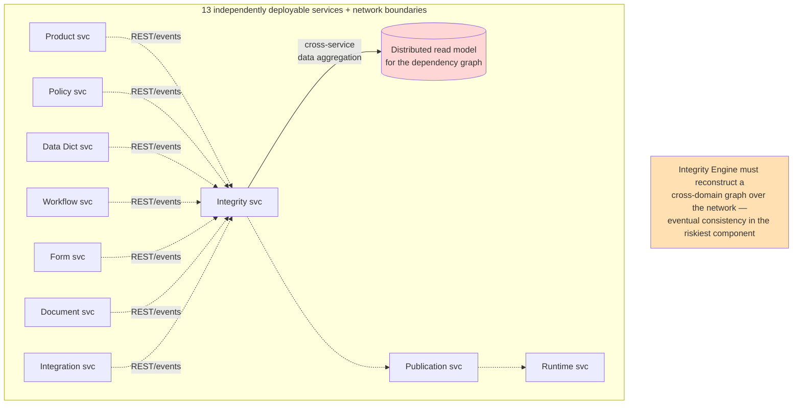
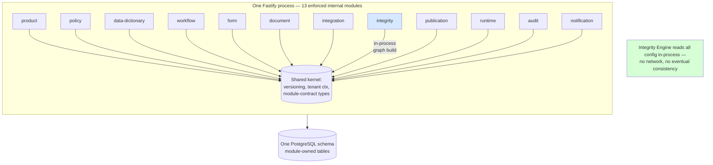

# ADR-001: Modular Monolith vs. Microservices

**Product**: Composable Credit OS (`credit-os`)
**Date**: 2026-05-17
**Author**: Architect, ConnectSW
**Deciders**: CEO (locked decision, addendum 2026-05-17)

## Status

Accepted

## Context

The CEO brief's Low-Level Design specifies a service-based architecture:

- **LLD-02** — "The platform shall use API-first, metadata-driven, service-based architecture."
- **LLD-03..15** — 13 named services: Product, Policy, Data Dictionary, Workflow, Form, Document, Credit Service Library, Integration, Integrity Engine, Publication, Runtime Orchestrator, Audit, Notification.
- **LLD-16** — "Each service shall be independently deployable."
- **LLD-17** — "Each service shall expose versioned REST APIs."
- **LLD-18** — "Each service shall emit and consume events where appropriate."

A literal reading of LLD-16 mandates 13 independently deployable microservices. ConnectSW must decide whether to build 13 deployables or a single process with strong internal boundaries.

Constraints shaping the decision:

- **Constitution Article V** — the default ConnectSW stack is a single Fastify API + single Next.js web app per product. A 13-service topology is a deviation requiring justification.
- **The Integrity Engine (LLD-26..30, RSK-01, score 9)** is the platform's highest-risk component and its hardest. It must build a *single coherent dependency graph* spanning every configuration object across all domains (LLD-27). In a microservices topology this requires cross-service data aggregation, a distributed read model, or an event-sourced projection — each of which adds eventual-consistency failure modes to the component that can least tolerate them.
- **Surface size is moderate** — 16 entities, 30 APIs, one PostgreSQL schema. This is comfortably within one Prisma schema and one Fastify app.
- **v1 is single-tenant** (ADR-004) with one deployment. There is no independent-scaling pressure that would justify per-service deployables.
- **RSK-04 (scope size, likelihood High)** — 13 deployables multiply CI pipelines, infrastructure, deployment orchestration, and integration-test surface, slowing time to a runnable system.

### Before — Literal LLD-02/LLD-16 Microservices Topology

## Decision

Build Composable Credit OS as a **modular monolith**: one Fastify API process (port 5016) and one Next.js web app (port 3121), where each of the 13 LLD services becomes a **strictly bounded internal module** — one directory per LLD service, each exposing a published TypeScript interface, with import-boundary tooling preventing cross-module reach-arounds.

The LLD service decomposition is honored as a **logical decomposition**, not a physical one. The 13 modules are: `product`, `policy`, `data-dictionary`, `workflow`, `form`, `document`, `credit-services`, `integration`, `integrity`, `publication`, `runtime`, `audit`, `notification`.

### After — Modular Monolith with Enforced Internal Boundaries

### Module boundary rules (the clean split-out path)

These rules keep each module independently extractable into a microservice later, without rewriting it:

1. **One directory per module** under `apps/api/src/modules/<module>/`. A module owns its routes, services, repositories, and Prisma model files.
2. **Published interface only.** Each module exports a single `index.ts` "module contract" — the only surface other modules may import. Internal files are private.
3. **No cross-module DB access.** A module reads and writes *only its own tables* via its own repository. To read another module's data, it calls that module's contract. This is the rule that makes the split clean — a module's persistence is encapsulated exactly as it would be behind a service boundary.
4. **Dependency direction is acyclic.** Lower modules never import higher ones. Direction: `audit` and `data-dictionary` are leaves; `product`/`policy`/`workflow`/`form`/`document`/`integration` depend on them; `integrity` depends on the six authoring modules (read-only); `publication` depends on `integrity`; `runtime` depends on `publication` + the authoring modules. `notification` is called by, never calls, others.
5. **Cross-cutting concerns via Fastify plugins**, not imports — `audit` (onResponse hook), `tenant` (request decorator), `auth` (preHandler). A module emits an audit event by calling the injected contract, never by reaching into the audit module's repository.
6. **Import-boundary tooling is CI-enforced** (NFR-007) — `dependency-cruiser` rules forbid (a) importing a module's internals, (b) cyclic module dependencies, (c) a module importing another module's Prisma repository. A violation fails CI (Article XIII).
7. **Inter-module calls are synchronous in-process function calls today.** Each call site is a candidate seam: when a module is extracted, the contract import is swapped for an HTTP/event client with the identical signature. No business logic changes.

### Split-out path

To extract any module to a microservice later: (1) the module already owns its tables — move them to a separate schema/database; (2) replace its contract's in-process implementation with an HTTP client of the same TypeScript interface; (3) the module's existing routes become the service's public API; (4) `audit`/`notification` calls become event publications. Because boundary rules 2–4 are enforced from day one, no caller code changes.

## Consequences

### Positive

- The Integrity Engine builds its dependency graph **in-process over a single consistent database read** — no distributed aggregation, no eventual consistency in the riskiest component (RSK-01).
- One CI pipeline, one deployment, one PostgreSQL instance — far faster to a runnable, demoable system; directly mitigates RSK-04 (scope size).
- Cross-module transactions (e.g. publication assembling a bundle that pins versions across six modules) are **single ACID database transactions**, not sagas.
- Local development is one `npm run dev`; debugging crosses module boundaries with a stack trace, not distributed tracing.
- The LLD service decomposition is preserved as a real, enforced structure — the design intent of LLD-03..15 is honored.

### Negative

- The whole API scales as one unit; a hot module (e.g. `runtime`) cannot scale independently of cold modules. Accepted: v1 load is moderate (NFR-006) and the API scales horizontally as a whole behind a load balancer.
- A single process is a single failure domain. Mitigated by stateless API instances behind a load balancer and PostgreSQL as the durable state.
- Module-boundary erosion is a real risk (RSK-05) — without enforcement the monolith degrades to a "big ball of mud" and the split-out path is lost. Mitigated by boundary rules 2–6 and CI enforcement.
- A literal LLD-16 ("independently deployable") is **not met** for v1. This ADR is the record of that deliberate deviation.

### Neutral

- LLD-17 (versioned REST APIs) is still satisfied — the monolith exposes versioned `/api/v1` routes (ADR-006).
- LLD-18 (emit/consume events) is satisfied logically — modules emit domain events to an in-process event bus consumed by `audit` and `notification`; the bus is a future seam to a message broker.

## Alternatives Considered

### Literal 13-microservice topology (LLD-16)

- **Pros**: Independent deployability and scaling; strict isolation enforced by the network.
- **Cons**: Distributed dependency-graph construction for the Integrity Engine; cross-service transactions for publication; 13 CI pipelines and deployments; disproportionate operational cost for a single-tenant v1 with moderate load.
- **Why rejected**: Imposes the highest operational cost precisely where the platform is riskiest, with no v1 scaling benefit. The CEO locked the modular-monolith decision (addendum).

### Unstructured monolith (no enforced module boundaries)

- **Pros**: Fastest to write initially.
- **Cons**: No clean split-out path; the LLD service decomposition becomes fictional; boundary erosion guaranteed.
- **Why rejected**: Discards the design intent of LLD-03..15 and the future microservices option. The enforced-boundary variant costs little more and preserves both.

## References

- CEO brief `notes/ceo/credit-os-brief.md` — LLD-02, LLD-16..18, CEO decision #3
- Addendum `products/credit-os/.claude/addendum.md` — Architecture decision
- Business Analysis §8.1, RSK-05 — modular-monolith assessment
- NFR-007 — module-boundary enforcement
- ARCHITECTURE.md §3.3, §4 — Component diagram and module boundary rules
