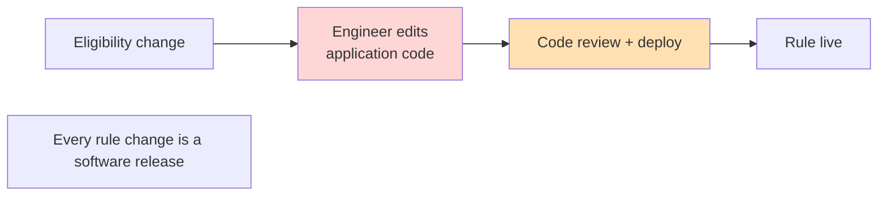
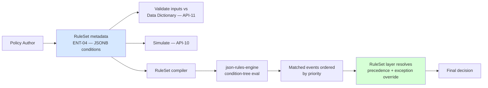

# ADR-002: Adopt json-rules-engine Behind a RuleSet Metadata Layer

**Product**: Composable Credit OS (`credit-os`)
**Date**: 2026-05-17
**Author**: Architect, ConnectSW
**Deciders**: CEO (locked decision, addendum 2026-05-17)

## Status

Accepted

## Context

The platform must let Policy Authors create eligibility/decisioning rules without code (FR-023..026, EPIC-07). The requirements:

- **FRD-11.01** — "Rules shall support condition groups, nested logic, and operator precedence."
- **FRD-11.02** — "Rules shall be reusable across products and stages."
- **FRD-11 / API-10** — rules must be **simulatable** before publishing.
- **API-11 / BR-04** — every rule input must validate against the governed Data Dictionary.
- **NFR-001** — p95 rule evaluation ≤ 200 ms.

The CEO locked the choice of `json-rules-engine` (addendum), wrapped behind our own RuleSet metadata layer. The Business Analyst flagged **ASM-01 / RSK-06** as needing an architect spike: does `json-rules-engine` actually cover FRD-11.01's nested logic and operator precedence, and FRD-11's exception/precedence semantics? This ADR records that analysis.

### Architect spike — json-rules-engine capability assessment

`json-rules-engine` (cachecontrol/json-rules-engine, MIT, mature, widely used) models a rule as `conditions` + `event`. Assessment against FRD-11:

| Requirement | json-rules-engine native support | Verdict |
|-------------|----------------------------------|---------|
| **Condition groups** (FRD-11.01) | `all` / `any` / `not` boolean operators, each holding nested conditions | **Covered** |
| **Nested logic** (FRD-11.01) | `all`/`any`/`not` nest to arbitrary depth | **Covered** |
| **Operator precedence** (FRD-11.01) | Precedence is *explicit via the tree structure* — there is no flat infix expression to disambiguate. `all`/`any` nesting IS the precedence. | **Covered** — but see note below |
| **Operators** (equal, gt, lt, in, contains, etc.) | Built-in set + custom operators registerable | **Covered** |
| **Fact resolution** | Facts resolved lazily via registered fact handlers / `almanac` | **Covered** — Data Elements become facts |
| **Multiple outcomes / events** | `event` per rule; `priority` orders rule firing within an engine run | **Covered** |
| **Rule priority / firing order** (precedence *between* rules) | `priority` integer on each rule; higher fires first; `engine.run()` returns all matched events | **Covered** |
| **Exceptions / overrides** (FRD-11 — a high-priority exception rule overriding a base rule) | Not a first-class concept. Achievable: model the exception as a higher-`priority` rule whose `event` carries an `override` directive; the RuleSet layer resolves the final decision from the ordered event list. | **Gap — closed by the metadata layer** |
| **Decisioning vs eligibility distinction** | Engine returns events; semantic meaning is the caller's | **Caller responsibility — the RuleSet layer assigns meaning** |
| **Simulation** (API-10) | `engine.run(facts)` is a pure evaluation — naturally a dry run | **Covered** |

**Spike conclusion**: `json-rules-engine` natively covers condition groups, nested logic, and operator precedence (FRD-11.01) because precedence is structural, not infix — there is no expression-parsing gap. The **one genuine gap** is *exception/override semantics* (FRD-11): the engine evaluates and fires events but does not itself decide "which winning event overrides which." This is **deliberately the job of our RuleSet metadata layer**, which is the right place for it — it keeps domain semantics in our governed model, not in a third-party library. The spike validated this against 3 representative corporate-credit rules (a nested-group eligibility rule, a threshold pricing rule, and a base-rule + exception-rule pair); all three express correctly. **RSK-06 is closed.**

### Before — Hardcoded Rule Logic (BRD-03.02)

## Decision

Adopt `json-rules-engine` as the **rule evaluation primitive only**, wrapped behind a credit-OS-owned **RuleSet metadata layer**. The boundary:

- **RuleSet entity (ENT-04)** stores `conditions` as JSONB — our own governed schema, Zod-validated. It is *not* a raw json-rules-engine config; it is our model.
- **A RuleSet compiler** translates a versioned RuleSet (+ its referenced Data Elements) into a json-rules-engine `Engine` instance at evaluation time. Data Elements become engine facts.
- **The RuleSet layer owns**: precedence/exception resolution (ordering matched events, applying `override` directives to produce one final decision), input validation against the Data Dictionary (API-11), simulation (API-10), versioning, and reuse.
- **json-rules-engine owns**: boolean condition-tree evaluation and operator application — nothing more.

The library is a swappable implementation detail behind the `policy` module contract. If a future rule requirement exceeds it, the compiler target changes; the RuleSet model, APIs, and stored metadata do not.

### After — Metadata-Driven Rules Behind the RuleSet Layer

## Consequences

### Positive

- Mature, battle-tested evaluation engine — no need to build or maintain a boolean rule evaluator.
- The governed RuleSet model stays ConnectSW-owned; the library is encapsulated and swappable.
- Precedence/exception semantics live in our domain layer where they can be versioned, audited, and tested as first-class behavior.
- Simulation (API-10) falls out naturally — a pure `engine.run()` against supplied facts.
- Pure in-process evaluation comfortably meets NFR-001 (p95 ≤ 200 ms); compiled engines can be cached per RuleSet version (versions are immutable, ADR-003).

### Negative

- Exception/override resolution is custom code in the RuleSet layer — it must be thoroughly TDD-tested (it is decisioning logic for a credit platform).
- A translation layer (RuleSet → engine config) is an extra moving part; mitigated by it being small, pure, and version-keyed.
- json-rules-engine fact resolution is async; the compiler must wire Data Element facts correctly. Covered by integration tests.

### Neutral

- Rule authoring UX (the `/policies/[id]` editor) builds our own condition-group editor over the RuleSet JSONB model — independent of the library's config format.

## Alternatives Considered

### Build a custom rule engine

- **Pros**: Full control of semantics.
- **Cons**: Re-implements a solved problem; high defect risk in credit-decisioning logic.
- **Why rejected**: No benefit over wrapping a mature engine; the metadata layer already gives us the control we need.

### Adopt a heavyweight commercial decision engine (Drools, Corticon)

- **Pros**: Rich rule features, precedence built in.
- **Cons**: Operational weight, licensing, JVM dependency — off the ConnectSW TypeScript stack (Article IV/V).
- **Why rejected**: Disproportionate for the v1 surface; off-stack.

## References

- CEO brief — FRD-11, FRD-11.01, FRD-11.02, CEO decision #4
- Business Analysis — ASM-01, RSK-06
- json-rules-engine — https://github.com/CacheControl/json-rules-engine (MIT)
- ARCHITECTURE.md §6 (Policy module), §11 (API design)
- plan.md Phase 3 (Policy module build)
