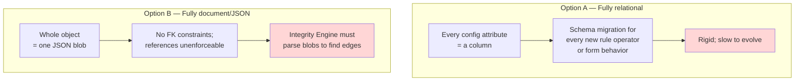
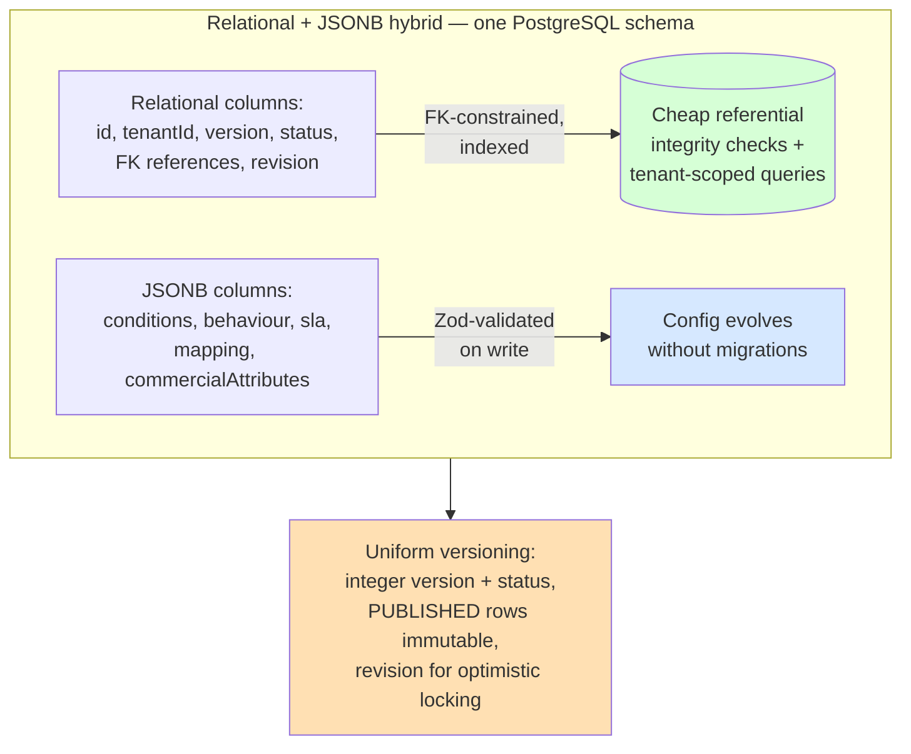

# ADR-003: Relational + JSONB Hybrid Metadata Storage and Versioning

**Product**: Composable Credit OS (`credit-os`)
**Date**: 2026-05-17
**Author**: Architect, ConnectSW

## Status

Accepted

## Context

Composable Credit OS is a metadata-driven platform: products, rules, workflows, forms, documents, connectors, and bundles are all governed configuration objects stored in a central Metadata Repository (BN-01, LLD-63). The repository must satisfy two competing demands:

1. **Strong relational integrity** — the Integrity Engine validates 11 FRD-21 relationship types (Product→DataElement, FormField→DataElement, etc.). These references must be queryable, joinable, and foreign-key-constrained so referential checks are cheap and reliable.
2. **Flexible configuration payloads** — a RuleSet's `conditions`, a FormField's `behaviour`, a WorkflowStage's `sla`, a Connector's `mapping`, a ProductVersion's `commercialAttributes` are open-ended, evolving structures that should not require a schema migration every time a new rule operator or form behavior is added.

Additionally, **BR-01 / BRD-40 / FRD-04** require *every artifact to be versioned* — every change creates a new version, history is preserved, and **published versions are immutable (BR-08, US-04)** so runtime always executes exactly what was approved.

The platform also needs **optimistic concurrency** (US-02 AC-3: concurrent edits to the same version must conflict, not silently overwrite).

### Before — Two Naive Extremes

## Decision

Use a **relational + JSONB hybrid** in a single PostgreSQL schema via Prisma, with a **uniform versioning model** applied to every metadata entity.

### Hybrid storage rule

- **Identity, references, and lifecycle are relational columns.** Every cross-object reference that the Integrity Engine validates (FRD-21) is a real foreign key or a typed reference column with an index: `Product.baseTemplateId`, `FormField.dataElementId`, `WorkflowStage.workflowId`, `Transition.fromStageId`/`toStageId`, `PublicationBundle.productVersionId`/`integrityRunId`, `RuntimeCase.bundleId`, etc. Lifecycle/status, `tenantId`, `version`, timestamps, and ownership are columns.
- **Open-ended configuration payloads are JSONB columns**, Zod-validated at the application boundary on write: `ProductVersion.commercialAttributes`, `RuleSet.conditions`, `WorkflowStage.sla`, `Transition.condition`, `FormDefinition.channelScope`, `FormField.behaviour`, `Connector.mapping`, `DocumentRequirement` config, `PublicationBundle.dependencyPins`, `ValidationRun.defects`, `AuditEvent.before`/`after`.
- **Rule**: if the Integrity Engine or a tenant-scoped query needs to traverse or filter on it, it is a column with an index. If it is configuration shape that evolves, it is JSONB with a Zod schema.

### Uniform versioning model

Two patterns, applied consistently:

- **Product** uses an explicit parent/child split: `Product` (stable identity, name, lifecycle) `has many` `ProductVersion` (the versioned snapshot, `version` integer, `status`). This matches LLD-20/LLD-21.
- **All other versioned config entities** (RuleSet, WorkflowDefinition, FormDefinition, DocumentRequirement, Connector) carry an integer `version` column and a `status` enum (`DRAFT`, `PUBLISHED`, `DEPRECATED`/`RETIRED`). A change to a `DRAFT` mutates it in place and bumps an `updatedAt`; a change to a `PUBLISHED` version is **forbidden in place** — the application creates a new `DRAFT` row at `version + 1` derived from the published one (US-04 AC-2). Published rows are never updated or deleted.
- **Immutability is enforced in the repository layer**: every module's repository rejects `update`/`delete` on a row whose `status = PUBLISHED`. This is a code-level invariant backed by a check, plus a database trigger as defense in depth.
- **Optimistic concurrency**: every mutable row carries a `revision` integer; updates use `WHERE id = ? AND revision = ?` and bump `revision`. A zero-row update result is surfaced as an HTTP 409 conflict (US-02 AC-3).
- **A `VersionHistory` projection** records `(objectType, objectId, version, actor, timestamp, changeSummary)` for every version, satisfying US-03 (view history) cheaply without scanning all version rows.

### After — Hybrid Model

## Consequences

### Positive

- The Integrity Engine validates FRD-21 references with indexed joins, not blob parsing — directly de-risks RSK-01.
- Configuration shape evolves (new rule operators, new form behaviors) with zero schema migration — the platform's "configuration over code" promise extends to its own evolution.
- One uniform versioning model across all entities makes BR-01 a single, testable invariant instead of per-module bespoke logic — de-risks RSK-03.
- Immutable published rows mean a PublicationBundle's content is structurally guaranteed unchanged (US-04 AC-3), which is the foundation of reproducible bundles and exact rollback (NFR-009).
- Tenant-scoped queries (FR-052) use the indexed `tenantId` column.

### Negative

- JSONB payloads are not FK-constrained internally — a reference *inside* a JSONB blob (e.g. a Data Element id inside a RuleSet `conditions` tree) is not a database FK. Mitigated: such references are exactly what the Integrity Engine's referential-integrity check (LLD-28 stage 2) exists to validate, and Zod validates structure on write.
- JSONB querying is less ergonomic than columns; mitigated by the rule that anything traversed becomes a column.
- The versioning invariant must be enforced in every repository; mitigated by a shared base repository in the shared kernel and a DB trigger backstop.

### Neutral

- Storage growth from retained versions is acceptable for a moderate config surface (NFR-006); old `DEPRECATED` versions can be archived later if needed.

## Alternatives Considered

### Fully relational (every attribute a column)

- **Pros**: Full FK integrity; ergonomic queries.
- **Cons**: A schema migration for every new rule operator or form behavior — defeats "configuration over code."
- **Why rejected**: Too rigid for an inherently extensible metadata model.

### Fully document (whole object as one JSON/JSONB blob, or a document DB)

- **Pros**: Maximum flexibility.
- **Cons**: No enforceable references; the Integrity Engine must parse blobs to discover edges; off the ConnectSW PostgreSQL+Prisma stack (Article V).
- **Why rejected**: Makes the platform's hardest component (Integrity Engine) harder and abandons referential integrity.

### Event-sourced metadata store

- **Pros**: Complete history as an event log.
- **Cons**: Significant complexity; projections needed for every read; overkill for a moderate config surface.
- **Why rejected**: The version-row model already gives full history (US-03) with far less machinery.

## References

- CEO brief — LLD-20..25, LLD-63, LLD-68, BRD-40, FRD-04, BR-01, BR-08
- Spec — US-01..04, FR-001..004, NFR-009
- ADR-001 (modular monolith — single schema), ADR-004 (tenantId)
- ARCHITECTURE.md §5 (data model), data-model.md
