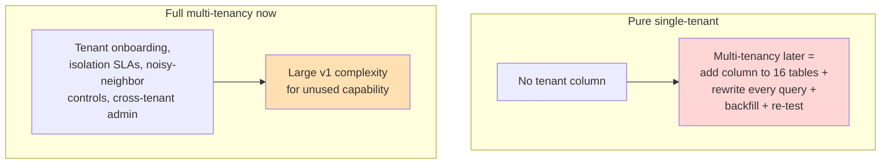
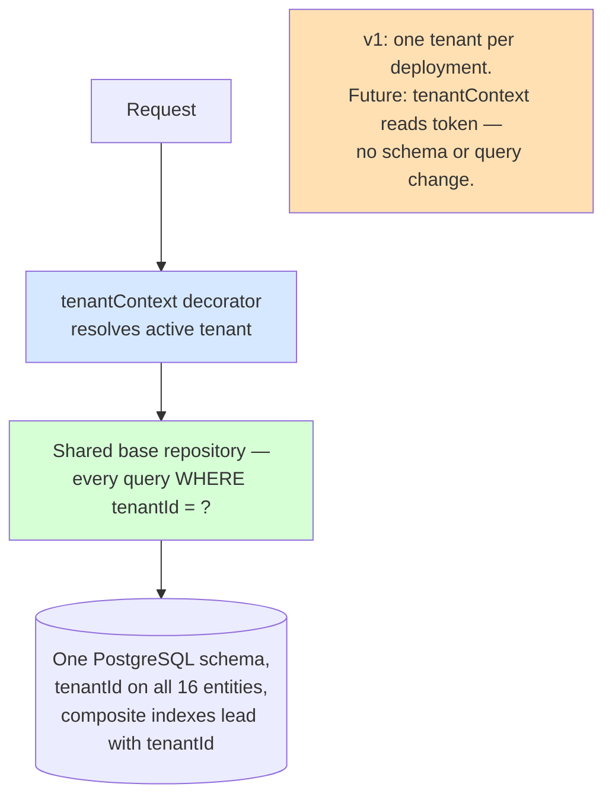

# ADR-004: Single-Tenant, Multi-Tenant-Ready Data Model

**Product**: Composable Credit OS (`credit-os`)
**Date**: 2026-05-17
**Author**: Architect, ConnectSW
**Deciders**: CEO (locked decision, addendum 2026-05-17)

## Status

Accepted

## Context

Composable Credit OS v1 runs for a single corporate-financing organization. However, the platform is positioned (Business Analysis §2.3, BRD-15) as a reusable foundation other organizations could one day adopt. Two failure modes must be avoided:

- **Building full multi-tenancy now** — tenant onboarding, per-tenant isolation guarantees, noisy-neighbor controls, cross-tenant admin — pays significant complexity cost for a capability v1 does not use.
- **Building pure single-tenant** — no tenant concept at all — would force an expensive, error-prone schema-and-query rewrite if multi-tenancy is ever needed.

The CEO locked the middle path (addendum): **single-tenant deployment, multi-tenant-ready data model** — `tenantId` on all core entities, all queries tenant-scoped, one tenant per deployment for v1 (FR-052, ASM-02).

### Before — The Two Extremes

## Decision

Adopt **single-tenant deployment with a multi-tenant-ready data model**:

1. **`tenantId` (UUID, non-null) on every core entity** — all 16 entities (ENT-01..16) carry `tenantId`. It is set from a deployment-level configured tenant value for v1.
2. **Tenant scoping is mandatory and centralized.** A Fastify request-scoped `tenantContext` decorator resolves the active tenant (from the deployment config in v1; from the OIDC token / a tenant-routing layer in a future multi-tenant build). Every repository method accepts the tenant context and **every query includes `WHERE tenantId = ?`** — there is no un-scoped read or write path for tenant-owned data. This is enforced by a shared base repository in the shared kernel: module repositories cannot construct a query without a tenant context.
3. **Composite indexes lead with `tenantId`** — e.g. `(tenantId, lifecycleStatus)`, `(tenantId, name)` — so the access pattern is already multi-tenant-shaped.
4. **One database, one schema, shared tables** for v1 — the simplest physical model. The `tenantId` column is the logical isolation boundary.
5. **Cross-tenant access is structurally impossible in application code** — because every query is tenant-scoped, a v1 bug cannot leak across tenants even though only one tenant exists. This means the isolation guarantee is *tested from day one*, not retrofitted.

### Multi-tenant path (deferred, but unblocked)

To become truly multi-tenant later: (1) `tenantContext` resolves the tenant per request from the token instead of from deployment config; (2) optionally add PostgreSQL Row-Level Security policies on `tenantId` as defense in depth; (3) add tenant onboarding and admin. **No schema change and no query rewrite** — the column and the scoping already exist.

### After — Single-Tenant Deployment, Multi-Tenant-Ready Model

## Consequences

### Positive

- Avoids a future schema-and-query rewrite for a low, fixed cost (one column + a centralized scoping rule).
- The tenant-isolation code path is exercised and tested in v1, so the eventual multi-tenant switch is low-risk.
- Centralized scoping in a shared base repository means tenant safety is one reviewable invariant, not 13 modules' worth of ad-hoc `WHERE` clauses.
- Indexes are already multi-tenant-shaped — no index rework later.

### Negative

- A small, permanent overhead: `tenantId` on every table and every query, and a `tenantContext` on every request, for a capability v1 does not exercise across tenants. Accepted as cheap insurance per the CEO decision.
- Developers must never bypass the base repository; an un-scoped raw query would be a tenant-safety hole. Mitigated by code review (Article XIV) and by the base repository being the only sanctioned data-access path.

### Neutral

- v1 does not need Row-Level Security; it remains an available future hardening layer.
- A deployment-level config supplies the single tenant id — a trivial bootstrap concern.

## Alternatives Considered

### Pure single-tenant (no tenant concept)

- **Pros**: Marginally simpler v1.
- **Cons**: Multi-tenancy later means adding a column to 16 tables, rewriting every query, backfilling, and re-testing every access path.
- **Why rejected**: The future rewrite cost dwarfs the small v1 cost of carrying `tenantId`.

### Full multi-tenancy now (per-tenant schemas or databases, onboarding, isolation SLAs)

- **Pros**: Ready for concurrent tenants immediately.
- **Cons**: Significant v1 complexity for an unused capability; conflicts with RSK-04 (scope control).
- **Why rejected**: v1 serves one organization; the CEO explicitly deferred concurrent multi-tenant operation.

## References

- CEO brief — CEO decision #2; addendum — Tenant model
- Business Analysis — ASM-02, §2.3
- Spec — FR-052
- ADR-001 (one schema), ADR-003 (storage model)
- ARCHITECTURE.md §5, §10 (security architecture)
