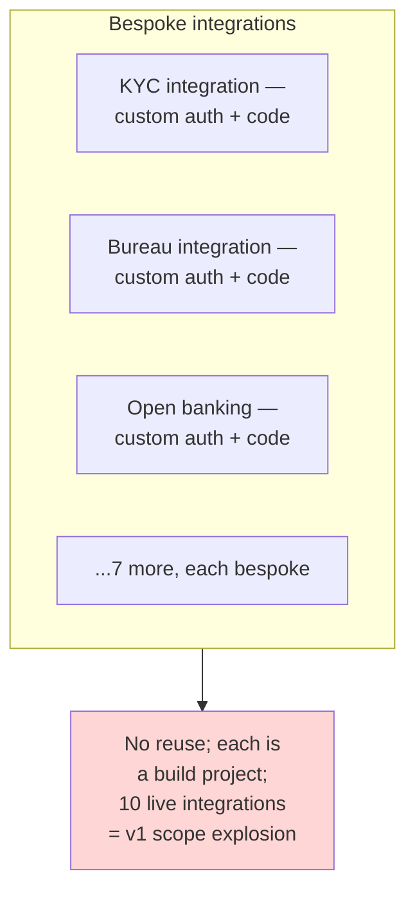
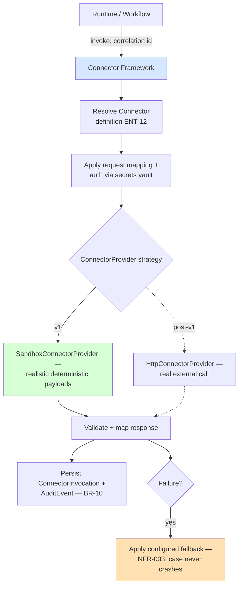

# ADR-005: Connector Framework with Sandbox Provider Strategy

**Product**: Composable Credit OS (`credit-os`)
**Date**: 2026-05-17
**Author**: Architect, ConnectSW
**Deciders**: CEO (locked decision, addendum 2026-05-17)

## Status

Accepted

## Context

The platform must integrate with 10 external provider categories (FRD-26): credit bureau, KYC, AML, sanctions, business registry, open banking, e-signature, DMS, payment, core banking. The requirements:

- **LLD-31 / BR-06** — every connector defines provider, capability type, auth config, endpoint, request mapping, response mapping, retry settings, timeout, fallback, and ownership.
- **LLD-32 / FRD-17.01** — support synchronous, asynchronous, callback, event-driven, and polling interaction patterns.
- **LLD-33..38** — runtime resolves a connector definition, maps and authenticates the payload, executes the call, validates and stores the response, and branches on it.
- **BR-10 / FRD-27.01/.02** — every connector call carries a correlation id and the request/response is persisted for audit.
- **NFR-003** — connector failures must follow configured fallback paths and never crash a runtime case.

**RSK-02 (connector sprawl, likelihood High)** — building 10 live integrations, each with distinct auth, credentials, certification, and provider-specific quirks, explodes v1 scope. The CEO resolved this (addendum, Open Question #1): **build the generic connector framework, and ship all 10 connector types against sandbox/stub providers** with realistic payloads. No real third-party credentials in v1.

### Before — Bespoke Per-Integration Connectors (BRD-03.04)

## Decision

Build one **generic connector framework** in the `integration` module, with a **provider-strategy abstraction** that resolves to a sandbox provider for every connector type in v1.

### Connector framework design

- **Connector definition model (ENT-12)** stores the LLD-31 attributes: `provider`, `capabilityType`, `endpoint`, `authRef` (a reference into the secrets vault — never inline credentials, US-14/ADR-006 security), `mapping` (request + response field mapping, JSONB), `retry`, `timeout`, `fallback`, `owner`. Connectors are versioned (ADR-003) and reusable across products (LLD-24).
- **A `ConnectorProvider` strategy interface** — the framework never calls an external system directly. It resolves a connector definition to a provider implementation. Two implementations behind the same interface:
  - **`HttpConnectorProvider`** — the real implementation: applies request mapping, authenticates via the `authRef` secret, makes the HTTP call, applies response mapping, validates the response. Deferred to post-v1 (no live credentials).
  - **`SandboxConnectorProvider`** — the v1 implementation: serves realistic, deterministic stub payloads per `capabilityType` (a sanctions hit/clear, a bureau score band, a KYC pass/refer, etc.), exercising the same mapping, retry, timeout, and fallback code paths as the real provider. Selected by a per-connector or deployment-level `mode = SANDBOX` flag.
- **The four interaction patterns (LLD-32)** are framework concerns, pattern-agnostic to the provider:
  - **Synchronous** — call, await, map response inline.
  - **Asynchronous** — submit, receive a job handle, complete on a later poll or callback.
  - **Callback** — submit with a callback URL; an inbound callback endpoint correlates the response to the originating call via the correlation id.
  - **Polling** — submit, then poll a status endpoint on an interval until terminal or timeout.
  - **Event-driven** — modeled as a callback variant feeding the in-process event bus.
- **Every invocation generates a correlation id** (BR-10), records a `ConnectorInvocation` row with the mapped request and the raw + mapped response, and emits an `AuditEvent`. The correlation id links the runtime case, the integrity-relevant connector, and the audit trail.
- **Fallback (NFR-003)**: on timeout/error/circuit-open the framework applies the connector's configured `fallback` (a default result, an exception route, or a manual-review stage) so a connector failure degrades the runtime case gracefully instead of crashing it.
- **`POST /connectors/{id}/test` (API-20)** runs a connector against its sandbox provider end-to-end, validating mapping and auth wiring (FR-039).

### After — Generic Framework + Sandbox Providers

## Consequences

### Positive

- One framework, 10 reusable connector types — directly resolves BRD-03.04 (bespoke integrations) and de-risks RSK-02 (connector sprawl).
- The sandbox/real split is behind one interface — going live post-v1 means adding `HttpConnectorProvider` and flipping `mode`, with **no change** to the connector model, mapping, runtime wiring, or APIs.
- Sandbox providers exercise the *real* mapping/retry/timeout/fallback/correlation code paths — v1 genuinely tests the framework, not a fake.
- Deterministic sandbox payloads make runtime E2E tests and the integrity engine's connector-readiness check reproducible.
- KPI-05 (integration onboarding speed) is measurable in v1 against sandbox connectors.

### Negative

- v1 does not prove integration against real provider quirks (rate limits, schema drift, auth edge cases). Accepted and explicitly deferred (Out of Scope); the framework's mapping layer is designed to absorb provider-specific shaping.
- Sandbox payloads must be realistic enough to be useful; mitigated by modeling them per `capabilityType` from typical provider responses.

### Neutral

- The connector secrets model (`authRef` → vault) is built in v1 even though sandbox providers need no real secrets — so the secure path exists from day one (ADR-006).

## Alternatives Considered

### Build 1–2 real connectors + stub the rest

- **Pros**: Proves one real integration.
- **Cons**: Needs live credentials and certification for the chosen providers; picks winners arbitrarily; still leaves 8 stubbed.
- **Why rejected**: The CEO chose uniform sandboxing; a uniform strategy is simpler and avoids credential procurement on the v1 critical path.

### No connector abstraction — call providers directly from runtime

- **Pros**: Less indirection.
- **Cons**: Re-creates bespoke, non-reusable integrations (BRD-03.04); no clean sandbox/real swap.
- **Why rejected**: Defeats the connector-reuse requirement (FR-037, LLD-24).

## References

- CEO brief — FRD-17, FRD-26, FRD-27, LLD-31..38, BR-06, BR-10, CEO decision (Open Question #1)
- Addendum — Connectors clarification
- Business Analysis — RSK-02, ASM-03
- Spec — FR-037..040, NFR-003
- ARCHITECTURE.md §8 (connector framework), §9 (runtime)
