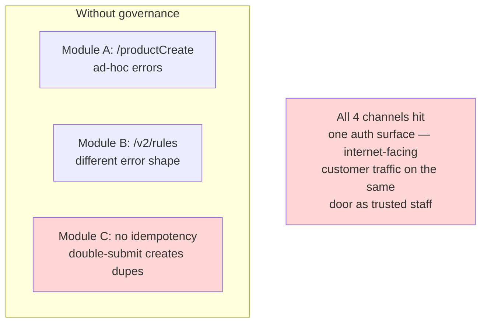
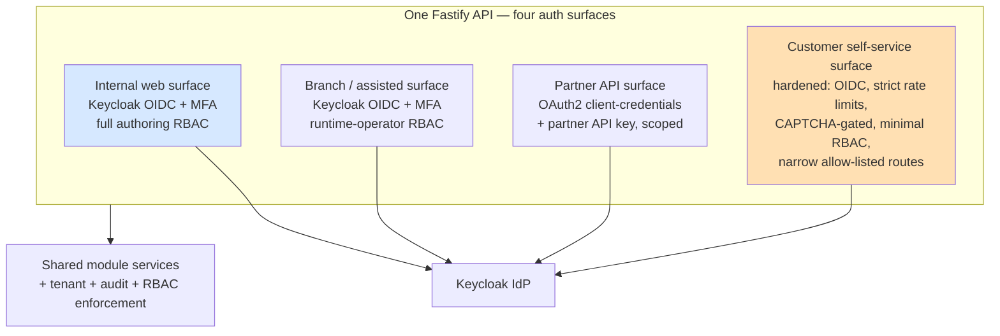

# ADR-006: API Governance, Versioning, Idempotency, and the Four Channel Auth Surfaces

**Product**: Composable Credit OS (`credit-os`)
**Date**: 2026-05-17
**Author**: Architect, ConnectSW

## Status

Accepted

## Context

The platform exposes 30 APIs (API-01..30, EPIC-13) consumed by the web app, by other internal systems (BRD-15, FRD-06), and by external partners and customers across **four channels** (addendum: web/internal, branch/assisted, partner/API, customer self-service). Requirements:

- **FRD-24** — every core module exposes CRUD, versioning, validation, simulation, and publication APIs.
- **FRD-25 / FRD-25.01/.02** — APIs are versioned, discoverable, OpenAPI-compliant, with standard error responses and **idempotency for write operations**.
- **NFR-002** — Keycloak OIDC/OAuth2, RBAC, MFA across all surfaces.
- The four channels have **materially different trust levels**: internal authors are trusted staff with MFA; the customer self-service surface is internet-facing and hostile; the partner channel is machine-to-machine.

Two cross-cutting decisions need recording: (1) a single API governance standard so 30 endpoints across 13 modules are uniform, and (2) how four channels with different trust levels authenticate against one modular-monolith API.

### Before — Inconsistent Per-Module APIs and a Single Undifferentiated Auth Surface

## Decision

### A. API governance standard (applies to all 30 APIs)

1. **URI versioning** — every endpoint is under `/api/v1/...`. A breaking change introduces `/api/v2` and runs in parallel; `v1` is never mutated. Matches the API-01..30 catalog.
2. **OpenAPI-first** — Fastify route schemas (JSON Schema) are the single source of truth; the OpenAPI 3.1 document is generated from them (`@fastify/swagger`) and served at `/api/v1/openapi.json` + `/api/v1/docs`. This satisfies FRD-25.01 and LLD-67, and keeps the contract and the implementation provably in sync (the schema *is* the validator).
3. **Idempotency on writes (FRD-25.02)** — every non-GET endpoint accepts an `Idempotency-Key` header. The key + request fingerprint + tenant is recorded; a replay returns the original response instead of re-executing. This protects bundle release, integrity runs, and runtime actions from double-submit.
4. **Standard error envelope** — all errors are RFC 7807 `application/problem+json` (`type`, `title`, `status`, `detail`, `instance`, plus a `correlationId` and a machine `code`). Reuses `AppError` from `@connectsw/auth`. One error shape across all 30 APIs.
5. **Standard success envelopes** — collections return `{ data: [...], page, pageSize, total }`; single resources return the resource. Pagination is mandatory on every list endpoint (a bounded default `pageSize`, an enforced maximum) so no endpoint can return an unbounded result set.
6. **Validation** — every request body, query, and param is Zod-validated at the boundary (Article IV); validation failure is a 400 problem+json with field-level detail.
7. **Correlation id** — every request carries/receives an `X-Request-ID`; it flows into logs, audit events, and connector calls (NFR-004/005). Reuses `@connectsw/observability` `correlationPlugin`.
8. **Module ownership** — each module owns its route file under its directory; routes call only their own module's services (ADR-001 boundary rule).

### B. Four channel auth surfaces over one API

The modular monolith exposes **one API process** but **four authentication surfaces**, each a Fastify plugin scope with its own credential type, applied per route group:

- **Internal web surface** — Keycloak OIDC authorization-code flow, MFA enforced (US-12), full authoring RBAC. Serves the Studios.
- **Branch/assisted surface** — same Keycloak OIDC + MFA; RBAC scoped to runtime-operator actions. Staff-assisted runtime cases.
- **Partner/API surface** — OAuth2 **client-credentials** flow (machine-to-machine) plus a partner API key; tokens carry narrow scopes; no human MFA (no human in the loop). Serves `consuming systems` and partner-originated runtime cases.
- **Customer self-service surface** — internet-facing and treated as hostile: OIDC for the customer, **strict per-IP and per-account rate limiting**, CAPTCHA on unauthenticated endpoints, **minimal RBAC** (a customer can only act on their own case), and a **narrow allow-list of routes** (case creation, stage submission, document upload for *their* case) — it cannot reach any authoring API. Authoring and customer traffic never share a route group.

All four surfaces converge on the same module services, the same tenant scoping (ADR-004), the same RBAC check, and the same audit trail — the *surface* differs, the *core enforcement* does not.

## Consequences

### Positive

- 30 APIs across 13 modules are uniform — one error shape, one pagination shape, one versioning rule, one idempotency mechanism. Predictable for the web app and for consuming systems (FR-041, FR-042).
- The OpenAPI document is generated from the validators, so the published contract cannot drift from the implementation (LLD-67).
- Idempotency makes release, integrity-run, and runtime-action endpoints safe to retry — important for NFR-009 (reliable rollback) and flaky-network partners.
- The hostile customer surface is isolated by route allow-list, rate limits, and minimal RBAC — a compromise of that surface cannot reach authoring APIs.
- Reuses `@connectsw/auth` (`AppError`, auth plugin), `@connectsw/observability` (correlation), and `@connectsw/shared` — less new code.

### Negative

- Four auth surfaces are more configuration than one — four plugin scopes, four credential validators. Accepted: the four channels are a locked product requirement and their trust levels genuinely differ.
- An idempotency store adds a table and a lookup on every write. Accepted as a correctness requirement (FRD-25.02).

### Neutral

- `/api/v2` is a future concern; v1 ships only `/api/v1`.
- The partner API key is stored hashed (vault/`authRef` pattern, ADR-005/006 security), never plaintext.

## Alternatives Considered

### One undifferentiated auth surface for all channels

- **Pros**: Simplest.
- **Cons**: Puts internet-facing hostile customer traffic on the same door and route set as trusted authoring staff — unacceptable for a credit platform.
- **Why rejected**: The channels' trust levels differ too much to share one surface.

### Header-based API versioning instead of URI versioning

- **Pros**: Cleaner URIs.
- **Cons**: Less discoverable; the API-01..30 catalog already specifies `/api/v1/...` paths.
- **Why rejected**: URI versioning matches the brief and is more discoverable for consuming systems.

## References

- CEO brief — API-01..30, FRD-06, FRD-24, FRD-25, LLD-59, LLD-67; addendum — Channels, Auth IdP
- Spec — FR-041, FR-042, NFR-002
- ADR-001 (module-owned routes), ADR-004 (tenant scoping), ADR-005 (connector secrets)
- ARCHITECTURE.md §10 (security architecture), §11 (API design)
- `@connectsw/auth`, `@connectsw/observability` — COMPONENT-REGISTRY.md
