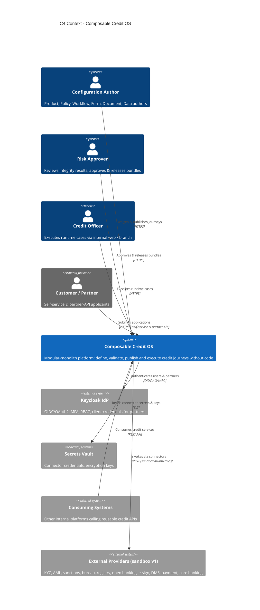
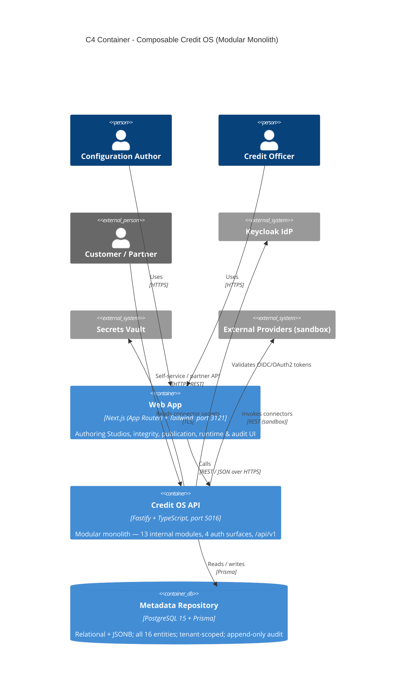
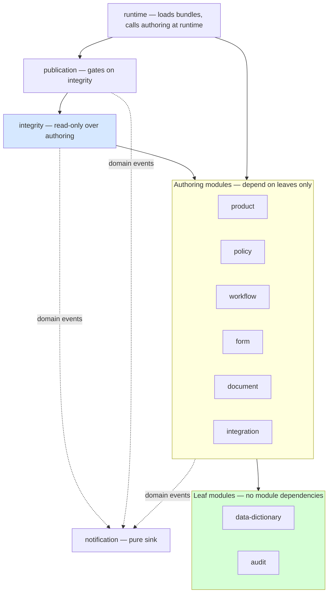
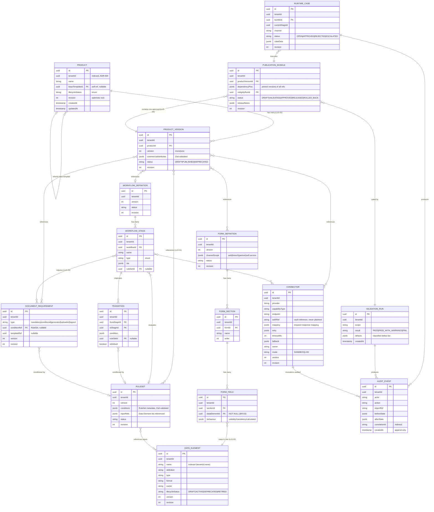
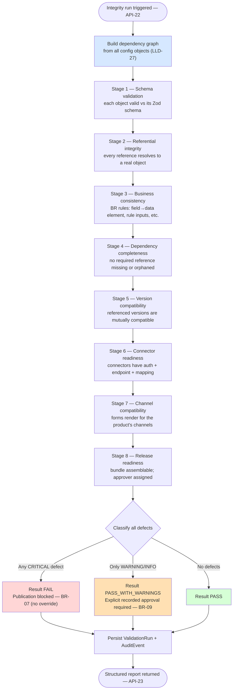
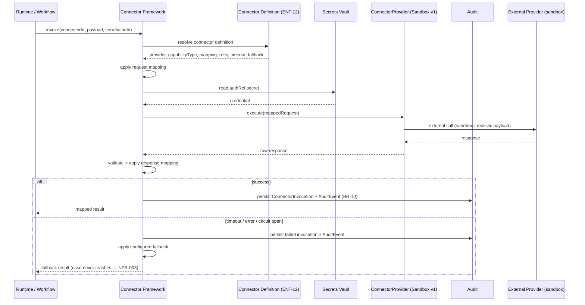
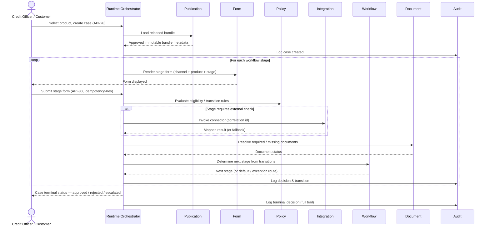
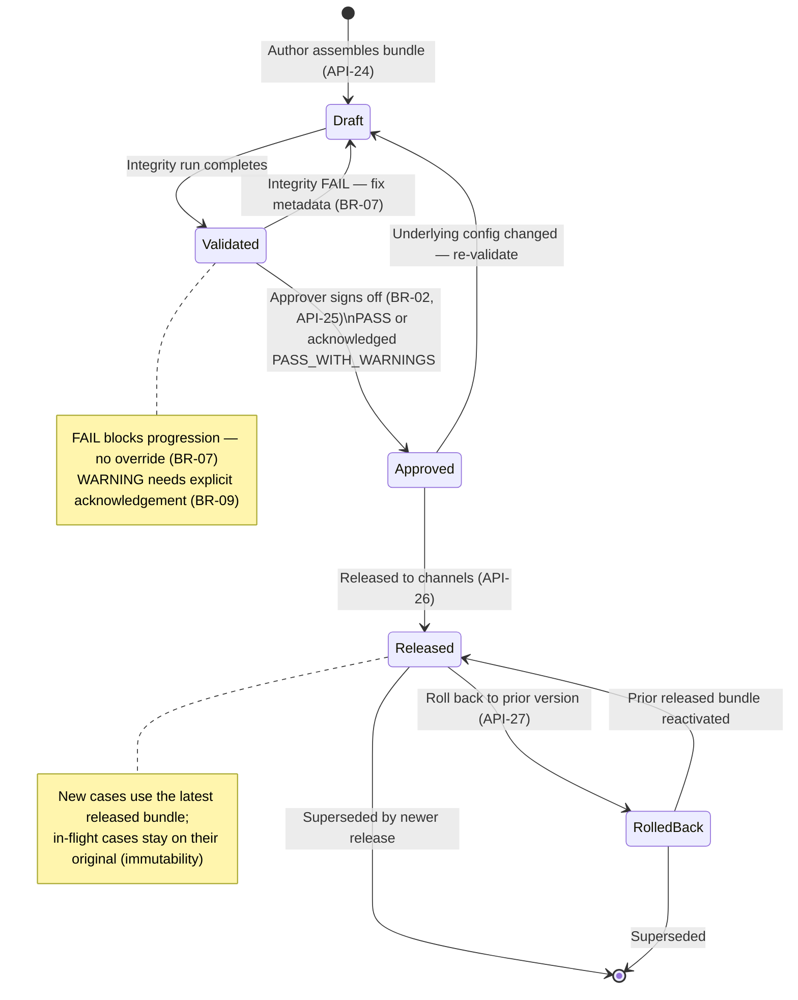
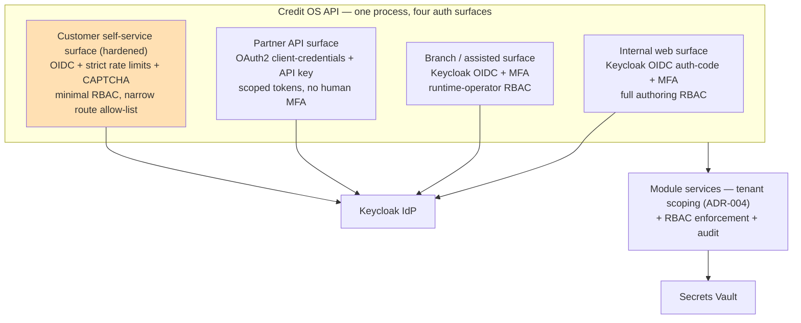

# System Architecture — Composable Credit OS

**Product**: Composable Credit OS (`credit-os`)
**Version**: 1.0
**Created**: 2026-05-17
**Status**: Architecture — for CEO checkpoint
**Author**: Architect, ConnectSW
**Sources**: PRD `docs/PRD.md` · Spec `docs/specs/spec.md` · Addendum `.claude/addendum.md` · CEO brief `notes/ceo/credit-os-brief.md` (BRD/FRD/LLD/ENT/API) · Business Analysis `docs/business-analysis.md`

> **Diagram-first document** (Constitution Article IX). This architecture contains C4 Context, Container, and Component diagrams, an ER diagram, the Integrity Engine flowchart and validation matrix, the connector call-flow, the runtime sequence diagram, and the publication-lifecycle state diagram. Text supplements the diagrams. All decisions are recorded in ADR-001..006 (`docs/ADRs/`).

---

## 1. Overview

Composable Credit OS is a **meta-driven composable credit operating system for corporate financing**. It replaces hardcoded, duplicated credit-origination logic (BRD-03) with a single governed platform on which business teams **configure and publish complete financing journeys without writing code** (BRD-01, BRD-04). Product, policy, workflow, form, document, integration, validation, publication, and runtime execution are all driven by governed metadata. A single **Integrity Engine** verifies cross-object consistency and **blocks publication of any inconsistent configuration** — making "no inconsistent journey can be published" a structural guarantee (BR-07).

The system is a **modular monolith** (ADR-001): one Fastify API (port 5016) and one Next.js web app (port 3121), where each of the 13 LLD services is a strictly bounded internal module. It is **single-tenant, multi-tenant-ready** (ADR-004): `tenantId` on every core entity, every query tenant-scoped. The metadata repository is **relational + JSONB** in PostgreSQL (ADR-003). The rule engine is **`json-rules-engine` behind a RuleSet metadata layer** (ADR-002). Connectors use a **generic framework with sandbox providers** (ADR-005).

### 1.1 Architectural principles

| Principle | Source | How the architecture honors it |
|-----------|--------|-------------------------------|
| Configuration over code | FRD-02 | All journeys are governed metadata; runtime interprets it. Even config shape evolves without migrations (JSONB, ADR-003). |
| Integrity before publication | BRD-33, FRD-18 | The Integrity Engine gates the publication lifecycle; CRITICAL defects have no override path (BR-07). |
| Reuse is the default | BRD-02, KPI-03 | One metadata graph; Data Elements, RuleSets, Forms, Connectors are shared, referenced, versioned artifacts. |
| Everything versioned | BR-01, BRD-40 | Uniform versioning model; published versions immutable (ADR-003). |
| Everything audited | FRD-31, BR-10 | `audit` is a Phase 1 cross-cutting module; 100% of material actions emit an AuditEvent. |
| Clean split-out path | NFR-007 | Enforced module boundaries (ADR-001) keep every module independently extractable. |

### 1.2 Quality attribute summary (NFRs)

| NFR | Target | Architectural mechanism |
|-----|--------|------------------------|
| NFR-001 Performance | p95 rule eval ≤ 200 ms; p95 form-render API ≤ 300 ms | In-process evaluation; compiled-engine cache keyed by immutable RuleSet version; indexed reads |
| NFR-002 Security | Keycloak OIDC, RBAC, MFA, encryption, secrets vault | §10 — 4 auth surfaces, RBAC plugin, vault-backed secrets |
| NFR-003 Availability | ≥ 99.5%; graceful degradation on connector outage | §8 — connector fallback paths; circuit breaker; runtime never crashes on connector failure |
| NFR-004 Auditability | 100% actions audited; 100% connector calls correlated; append-only | §3.3 `audit` module; onResponse hook + domain events |
| NFR-005 Observability | Structured logs, metrics, traces; correlation; failure alerts | §12 — `@connectsw/observability` |
| NFR-006 Scalability | Moderate config surface; growing runtime volume, no architectural change | Stateless API, horizontal scale; PostgreSQL durable state |
| NFR-007 Maintainability | Enforced module boundaries; clean split-out | ADR-001; dependency-cruiser in CI |
| NFR-008 Accessibility | WCAG 2.1 AA on all web surfaces | Next.js + `@connectsw/ui` accessible primitives |
| NFR-009 Reliability | Reproducible bundles; exact rollback; RTO ≤ 15 min | §7 — immutable bundles, dependency pinning, one-step rollback |

NFR review note: the four PM-proposed targets (p95 rule ≤ 200 ms, p95 form-render ≤ 300 ms, ≥ 99.5% availability, RTO ≤ 15 min) are **retained as-is** — see §12.3 for the justification and the two refinements added (a p95 integrity-run budget and an explicit availability-measurement definition).

---

## 2. C4 Level 1 — System Context

---

## 3. Container & Component Architecture

### 3.1 C4 Level 2 — Container Diagram

The platform is intentionally three containers: web, API, database. No message broker, no separate worker — async connector patterns (LLD-32) and the domain-event bus run in-process for v1 (ADR-001, ADR-005); a broker is a clean future addition behind the existing event-bus seam.

### 3.2 C4 Level 3 — Component Diagram (the 13 internal modules)

```mermaid
C4Component
    title C4 Component - Credit OS API (13 modular-monolith modules)

    Container_Boundary(api, "Credit OS API — Fastify modular monolith") {

        Component(authsurf, "Auth Surfaces", "4 Fastify plugin scopes", "Internal web, branch, partner API, customer self-service — OIDC/OAuth2 + RBAC")

        Component(m_product, "product", "LLD-03", "Product create/clone/version/retire, inheritance")
        Component(m_policy, "policy", "LLD-04", "RuleSet authoring, simulation; wraps json-rules-engine")
        Component(m_data, "data-dictionary", "LLD-05", "Canonical Data Elements, duplicate detection, lifecycle")
        Component(m_workflow, "workflow", "LLD-06", "WorkflowDefinition, stages, transitions, SLAs")
        Component(m_form, "form", "LLD-07", "FormDefinition, dynamic fields, channel rendering")
        Component(m_doc, "document", "LLD-08", "DocumentRequirements, linking, missing-doc flagging")
        Component(m_credit, "credit-services", "LLD-09", "8 reusable credit services (decisioning, pricing, ...)")
        Component(m_integration, "integration", "LLD-10", "Connector framework, sandbox providers, 4 patterns")
        Component(m_integrity, "integrity", "LLD-11", "Dependency graph + 8 validation stages")
        Component(m_publication, "publication", "LLD-12", "Bundle assembly, approval, release, rollback")
        Component(m_runtime, "runtime", "LLD-13", "Runtime case orchestration from published bundles")
        Component(m_audit, "audit", "LLD-14", "Append-only AuditEvents (cross-cutting)")
        Component(m_notify, "notification", "LLD-15", "Alerts on integrity/connector/release events")

        Component(kernel, "Shared Kernel", "lib", "Versioning base repo, tenant context, module-contract types, event bus, Zod base")
    }

    ContainerDb(db, "Metadata Repository", "PostgreSQL + Prisma")
    System_Ext(idp, "Keycloak IdP")

    Rel(authsurf, idp, "Validates tokens")
    Rel(authsurf, m_product, "Routes (RBAC-gated)")
    Rel(m_product, kernel, "Versioning, tenant, contracts")
    Rel(m_policy, kernel, "Versioning, tenant, contracts")
    Rel(m_form, m_data, "Resolves Data Element refs")
    Rel(m_policy, m_data, "Validates rule inputs")
    Rel(m_integrity, m_product, "Reads config (read-only)")
    Rel(m_integrity, m_policy, "Reads config (read-only)")
    Rel(m_integrity, m_workflow, "Reads config (read-only)")
    Rel(m_integrity, m_form, "Reads config (read-only)")
    Rel(m_integrity, m_doc, "Reads config (read-only)")
    Rel(m_integrity, m_integration, "Reads config (read-only)")
    Rel(m_publication, m_integrity, "Gates on validation result")
    Rel(m_runtime, m_publication, "Loads released bundle")
    Rel(m_runtime, m_policy, "Evaluates rules")
    Rel(m_runtime, m_form, "Renders forms")
    Rel(m_runtime, m_integration, "Invokes connectors")
    Rel(m_runtime, m_workflow, "Routes stages")
    Rel(m_runtime, m_doc, "Resolves documents")
    Rel(m_product, m_audit, "Emits AuditEvent")
    Rel(m_integrity, m_notify, "Emits alert event")
    Rel(kernel, db, "Prisma — module-owned tables")
```

### 3.3 The 13 modules

| Module | LLD | Phase | Owns (entities) | Responsibility |
|--------|-----|-------|-----------------|----------------|
| `data-dictionary` | LLD-05 | 1 | DataElement | Canonical data elements, duplicate/conflict detection, lifecycle. A leaf module. |
| `audit` | LLD-14 | 1 | AuditEvent | Append-only audit trail; cross-cutting via onResponse hook + domain events. A leaf module. |
| `product` | LLD-03 | 3 | Product, ProductVersion | Create/clone/version/retire products; template inheritance. |
| `policy` | LLD-04 | 3 | RuleSet | RuleSet authoring, simulation, reuse, dictionary validation; wraps json-rules-engine. |
| `workflow` | LLD-06 | 3 | WorkflowDefinition, WorkflowStage, Transition | Stage/transition design, SLAs, exception paths, routing validity. |
| `form` | LLD-07 | 3 | FormDefinition, FormSection, FormField | Dynamic forms bound to Data Elements; channel-aware rendering; preview. |
| `document` | LLD-08 | 3 | DocumentRequirement | Document requirements, linking, missing-doc flagging. |
| `integrity` | LLD-11 | 2 | ValidationRun | Dependency graph build + 8 validation stages; publication gating. Read-only over authoring modules. |
| `credit-services` | LLD-09 | 4 | (service definitions) | 8 reusable, versioned, discoverable credit services. |
| `integration` | LLD-10 | 4 | Connector, ConnectorInvocation | Connector framework, sandbox providers, 4 interaction patterns, correlation. |
| `publication` | LLD-12 | 5 | PublicationBundle | Bundle assembly, dependency pinning, approval, release, rollback. |
| `runtime` | LLD-13 | 5 | RuntimeCase | Runtime case orchestration from released bundles. |
| `notification` | LLD-15 | 1 (skeleton) → throughout | (notification records) | Alerts on integrity/connector/release events. Called by, never calls, others. |

### 3.4 Module boundary rules (ADR-001)

The 13 modules stay decoupled inside one process by these CI-enforced rules — they are the clean split-out path to true microservices:

1. **One directory per module** — `apps/api/src/modules/<module>/` containing `routes/`, `services/`, `repository/`, `contract.ts`, `index.ts`.
2. **Published contract only** — a module exports a single `index.ts` (the module contract — a TypeScript interface). Other modules import *only* that. All other files are private.
3. **No cross-module DB access** — a module's repository touches *only its own tables*. To read another module's data, it calls that module's contract. This is the rule that makes extraction clean — persistence is encapsulated exactly as it would be behind a service boundary.
4. **Acyclic dependency direction** — leaves (`data-dictionary`, `audit`) ← authoring modules (`product`, `policy`, `workflow`, `form`, `document`, `integration`) ← `integrity` (read-only) ← `publication` ← `runtime`. `notification` is a pure sink. No module imports a module above it; no cycles.
5. **Cross-cutting concerns via plugins** — `audit`, `tenant`, `auth` are injected as Fastify plugins/decorators, not imported. A module emits an audit event through the injected `audit` contract.
6. **In-process domain-event bus** — modules emit domain events (`RuleSetPublished`, `IntegrityRunFailed`, `BundleReleased`); `audit` and `notification` subscribe. The bus is the future broker seam.
7. **CI enforcement** — `dependency-cruiser` rules fail the build (Article XIII) on: importing a module's internals, cyclic module dependency, or importing another module's repository.

---

## 4. Data Architecture

### 4.1 ER Diagram — 16 core entities (ENT-01..16, LLD-20..25)

### 4.2 Data model decisions

- **Storage** — relational columns for identity, references (all FRD-21 edges are FK/typed reference columns), lifecycle, `tenantId`, version, `revision`; JSONB for open-ended config payloads (`conditions`, `behaviour`, `sla`, `mapping`, `commercialAttributes`, `dependencyPins`, `defects`). See ADR-003.
- **Versioning** — `Product` has the explicit `Product`/`ProductVersion` split (LLD-20); all other versioned entities carry an integer `version` + `status`. `PUBLISHED` rows are immutable — the repository rejects update/delete, a DB trigger backstops it.
- **Optimistic concurrency** — every mutable row has a `revision` integer; updates are `WHERE id AND revision`; a zero-row result → HTTP 409 (US-02 AC-3).
- **Tenant scoping** — every entity carries `tenantId`; composite indexes lead with it; the shared base repository forces `WHERE tenantId = ?` on every query (ADR-004).
- **Append-only audit** — `AuditEvent` has no update/delete path through the application; revoked at the DB grant level.
- **Indexes** — `(tenantId, lifecycleStatus)` and `(tenantId, name)` on lookup entities; `(correlationId)` on `AuditEvent` and `ConnectorInvocation`; FK columns indexed for the Integrity Engine's referential checks.

The full Prisma-level schema is produced in `docs/data-model.md` (plan.md Phase 1 deliverable).

---

## 5. The Integrity Engine (LLD-26..30) — highest-risk component (RSK-01, score 9)

The Integrity Engine is the platform's central control and its hardest component. It verifies cross-object consistency over the unified metadata graph and **blocks publication of any inconsistent configuration**. Under-design causes false passes that defeat the platform's core promise — so it receives the most design detail here and is built in Phase 2, immediately after the repository.

### 5.1 Dependency-graph construction (LLD-27)

When an integrity run is triggered (API-22) the engine builds an in-memory **directed dependency graph** of all configuration objects in scope. Because the platform is a modular monolith (ADR-001), this is a **single in-process build over a single consistent database read** — no cross-service aggregation, no eventual consistency.

- **Nodes** — every config object in scope: the ProductVersion, its referenced RuleSets, WorkflowDefinition + Stages + Transitions, FormDefinitions + Sections + Fields, DocumentRequirements, Connectors, and the Data Elements they reference.
- **Edges** — the 11 FRD-21 relationship types (see §5.3 matrix). Each edge is a typed reference resolved from a relational FK/reference column (ADR-003), so edge construction is indexed joins, not blob parsing.
- **Scope** — a run is scoped to a ProductVersion (pre-publication) or to a draft change set (on-demand, API-22). The engine resolves the transitive closure of references from the scope root.
- The graph is the **substrate for every validation stage** — stages traverse it; they do not re-query.

### 5.2 The 8-stage validation sequence (LLD-28)

The 8 validation classes run in a fixed order; each later stage assumes earlier stages passed structurally. A stage produces zero or more **defects**, each classified `CRITICAL`, `WARNING`, or `INFO`.

| Stage | Validation class | Checks (examples) | Typical defect severity |
|-------|-----------------|-------------------|------------------------|
| 1 | Schema | Each object conforms to its Zod schema; required attributes present | CRITICAL |
| 2 | Referential integrity | Every edge resolves: a RuleSet input id, a FormField's `dataElementId`, a Transition's stage ids, a bundle's product version — all exist | CRITICAL |
| 3 | Business consistency | BR-03 every FormField maps to a Data Element; BR-04 every rule input is a valid Data Element; BR-05 every Transition has a condition or is default; BR-06 every Connector has the 5 required attributes | CRITICAL |
| 4 | Dependency completeness | No mandatory field unmapped; no orphaned DocumentRequirement; no Workflow stage unreachable; no dangling reference | CRITICAL (orphan/unmapped) / WARNING (unreachable-but-harmless) |
| 5 | Version compatibility | Referenced object versions are mutually compatible; no reference to a `RETIRED` version; no incompatible version dependency | CRITICAL (incompatible) / WARNING (deprecated-but-active) |
| 6 | Connector readiness | Every referenced Connector has `authRef`, `endpoint`, `mapping`; sandbox mode resolvable | CRITICAL (missing auth/endpoint) |
| 7 | Channel compatibility | Each Form referenced renders for every channel in the product's `channelScope`; field behaviour valid per channel | WARNING (mostly) / CRITICAL (no form for a declared channel) |
| 8 | Release readiness | The bundle is assemblable; a domain approver is assigned (BRD-29); no pending blocking change | CRITICAL (no approver) / INFO |

### 5.3 The FRD-21 validation matrix (LLD-69)

The engine validates these 11 relationship types. This matrix is the Integrity Engine's **explicit test specification** (RSK-01 mitigation) — each row generates test cases for a passing edge, a broken edge, and a missing edge.

| # | FRD-21 relationship | Edge (graph) | Primary stage | CRITICAL when... |
|---|--------------------|--------------|---------------|------------------|
| 1 | FRD-21.01 Product → Data Element | ProductVersion → DataElement (via forms/rules) | 2, 4 | A referenced Data Element does not exist or is RETIRED |
| 2 | FRD-21.02 Product → policy rule | ProductVersion → RuleSet | 2, 5 | A referenced RuleSet does not exist or version-incompatible |
| 3 | FRD-21.03 Product → workflow | ProductVersion → WorkflowDefinition | 2, 4 | No workflow referenced, or workflow missing |
| 4 | FRD-21.04 Product → form | ProductVersion → FormDefinition | 2, 7 | A referenced Form is missing or has no channel coverage |
| 5 | FRD-21.05 Product → document | ProductVersion → DocumentRequirement | 2, 4 | A referenced DocumentRequirement is missing/orphaned |
| 6 | FRD-21.06 Product → integration | ProductVersion → Connector | 2, 6 | A referenced Connector is missing or not ready |
| 7 | FRD-21.07 Data element → form field | FormField → DataElement | 2, 3 | A FormField has no/invalid `dataElementId` (BR-03) |
| 8 | FRD-21.08 Rule → workflow transition | Transition → RuleSet | 2, 3, 5 | A Transition references a missing/invalid RuleSet |
| 9 | FRD-21.09 Workflow stage → document requirement | WorkflowStage → DocumentRequirement | 2, 4 | A stage requires a missing DocumentRequirement |
| 10 | FRD-21.10 Workflow stage → connector | WorkflowStage → Connector | 2, 6 | A stage invokes a missing/not-ready Connector |
| 11 | FRD-21.11 Publication bundle → runtime compatibility | PublicationBundle → (all pinned) | 5, 8 | Pinned versions are mutually incompatible / not runtime-executable |

### 5.4 Classification, blocking, and the FRD-23 blocking conditions

- **PASS** — no defects. Publication may proceed (still needs approval, §7).
- **PASS_WITH_WARNINGS** — only WARNING/INFO defects. Publication may proceed **only with an explicit, recorded approval** of the warnings (BR-09, US-20).
- **FAIL** — at least one CRITICAL defect. **Publication is blocked. There is no override path** (BR-07, FRD-23, US-18).

The **FRD-23 blocking conditions** each produce a CRITICAL defect → FAIL:

| FRD-23 condition | Detected by stage |
|------------------|-------------------|
| A mandatory field is unmapped | Stage 3 / 4 |
| A rule references undefined metadata | Stage 2 / 3 |
| A connector lacks auth or endpoint | Stage 6 |
| A workflow transition is invalid | Stage 3 |
| A document requirement is orphaned | Stage 4 |
| Version dependencies are incompatible | Stage 5 |

Every run persists a `ValidationRun` (result + classified `defects`) and an `AuditEvent`, and returns a structured report (API-23). On FAIL or connector-related defects, a `notification` alert is emitted (NFR-005).

### 5.5 Why the modular monolith makes this component safer

In a microservices topology the engine would reconstruct this cross-domain graph over the network — eventual consistency in the riskiest component. As a modular monolith (ADR-001) the engine reads all configuration in a single consistent transaction and builds the graph in-process. This is the central reason the modular-monolith decision is the correct call (Business Analysis §8.1).

---

## 6. Module Designs

### 6.1 Policy module & the RuleSet metadata layer (LLD-04, ADR-002)

The `policy` module owns RuleSet authoring, simulation, reuse, and dictionary validation. It wraps `json-rules-engine` behind the RuleSet metadata layer (ADR-002): the RuleSet entity stores governed JSONB `conditions`; a compiler translates a versioned RuleSet + its Data Element inputs into a `json-rules-engine` Engine; the metadata layer owns precedence/exception resolution. Compiled engines are cached per immutable RuleSet version (NFR-001). Simulation (API-10) is a pure `engine.run()` against supplied facts; validation (API-11) checks every input against the Data Dictionary (BR-04).

### 6.2 Connector framework (LLD-31..38, ADR-005)

The `integration` module's connector framework resolves a versioned Connector definition to a `ConnectorProvider` strategy — `SandboxConnectorProvider` in v1, `HttpConnectorProvider` post-v1 — applies request/response mapping, authenticates via the vault `authRef`, and supports four interaction patterns. Every invocation carries a correlation id, persists a `ConnectorInvocation`, emits an `AuditEvent`, and on failure applies the configured fallback (NFR-003).

### 6.3 Runtime orchestration (LLD-50..58)

The `runtime` module creates and drives runtime cases from **released bundles only** (BR-08). It loads the immutable bundle, then for each workflow stage: renders the stage form for the case's channel, evaluates eligibility/transition rules, invokes connectors when a stage requires an external check, resolves document requirements, and routes to the next stage — auditing every decision.

### 6.4 Other modules — design summary

- **`product`** — `Product`/`ProductVersion` split; clone copies a version's references; inheritance resolves a `baseTemplateId` chain at author time.
- **`data-dictionary`** — duplicate/conflict detection on create (name match + definition similarity + type-conflict check); lifecycle gates new bindings (DEPRECATED warns, RETIRED blocks).
- **`workflow`** — stages, transitions (condition or default), SLAs, parallel/sequential steps; routing-validity is a publish-time check mirrored by Integrity Stage 3.
- **`form`** — FormDefinition → Section → Field; every Field maps to a Data Element (BR-03, DB NOT NULL); `channelScope` drives per-channel rendering; preview (API-16) is a pure render.
- **`document`** — DocumentRequirements typed (mandatory/conditional/generated/uploaded/signed); linked to products/stages/rules; runtime flags missing docs by stage.
- **`credit-services`** — 8 stateless, versioned, discoverable services (decisioning, pricing, limit, collateral, covenant, exception, servicing, renewal) consumed by runtime and exposable to other systems.
- **`audit`** — append-only `AuditEvent`; written via an onResponse hook + explicit domain-event subscriptions; queryable by object/actor/action/time (API — `/audit`).
- **`notification`** — subscribes to integrity/connector/release domain events and raises alerts (NFR-005).

---

## 7. Publication Bundle Lifecycle (LLD-12, LLD-25, LLD-29, FRD-19)

A `PublicationBundle` packages one approved `ProductVersion` and **pinned versions** of every dependency (`dependencyPins`), gated by a `ValidationRun`. Pinned + immutable published versions (ADR-003) make a bundle **reproducible**; rollback re-activates a prior released bundle **exactly** (NFR-009, RTO ≤ 15 min).

- **Assembly (API-24)** resolves the ProductVersion's transitive references and pins each to a concrete published version.
- **Validation gate** — a bundle cannot move to `Approved` without a `ValidationRun` of `PASS` or acknowledged `PASS_WITH_WARNINGS`. `FAIL` blocks (BR-07).
- **Approval (API-25)** — the domain approver (BRD-29) signs off; recorded as an AuditEvent (BR-02).
- **Release (API-26)** — the bundle becomes active for new runtime cases; release notes + approval records preserved (FRD-19.02).
- **Rollback (API-27)** — re-activates the previously released bundle; in-flight cases are unaffected (they hold their original bundle). The forward target is preserved for re-release.

---

## 8. Connector Framework Design

Covered in ADR-005 and §6.2. Key points: one generic framework; `ConnectorProvider` strategy with a v1 `SandboxConnectorProvider` and a post-v1 `HttpConnectorProvider`; four interaction patterns (sync/async/callback/polling, event-driven as a callback variant); correlation id + persisted invocation on every call (BR-10); configured fallback so connector failure degrades gracefully (NFR-003); `POST /connectors/{id}/test` exercises a connector against its sandbox end-to-end.

---

## 9. Runtime Orchestration Design

Covered in §6.3 and ADR-005/006. Runtime executes **only released, immutable bundle metadata** (BR-08, FR-050); routing combines policy rule evaluation and connector responses with fallback/exception paths (FR-049); every action and decision is audited (FR-051); all four channels reach runtime through their respective auth surface (ADR-006) but converge on the same orchestration.

---

## 10. Security Architecture (LLD-59, FRD-28, NFR-002)

### 10.1 Authentication & the four channel auth surfaces

One Fastify API exposes four auth surfaces (ADR-006), each a plugin scope with its own credential type and trust posture:

- **Internal web / branch** — Keycloak OIDC authorization-code flow, **MFA enforced** (US-12); sessions are OIDC tokens with role claims.
- **Partner API** — OAuth2 client-credentials (machine-to-machine) + a partner API key (stored hashed); narrowly scoped tokens.
- **Customer self-service** — internet-facing, treated as hostile: OIDC for the customer, **strict per-IP/per-account rate limiting**, CAPTCHA on unauthenticated endpoints, **minimal RBAC** (a customer can act only on their own case), and a **narrow allow-list of routes** — it can never reach an authoring API.

### 10.2 Authorization (RBAC) & ownership

- **RBAC** — every route is permission-gated (US-11); roles map to platform actions (author / approve / publish / operate / audit). A denied action returns 403 problem+json and is audited.
- **Domain ownership (BRD-29, US-13)** — each domain has a named owner, approver, and consumer group; approval routing uses the assigned approver; an unassigned approver blocks publication (Integrity Stage 8).
- **Tenant isolation** — every query is `tenantId`-scoped via the shared base repository (ADR-004); a customer or partner cannot reach another tenant's or another case's data.

### 10.3 Data protection & secrets

- **Encryption** — TLS in transit on every surface; encryption at rest for the database; mTLS for connector calls where applicable (NFR-002).
- **Secrets (US-14)** — connector credentials and encryption keys live in a secrets vault, referenced by `authRef` — **never stored in plaintext config and never returned by the API**. Secret access is audited.
- **Crypto** — reuses `@connectsw/shared/utils/crypto` for hashing/HMAC/signatures.
- **Append-only audit** — `AuditEvent` cannot be edited/deleted through the application; DB grants revoke update/delete.

### 10.4 OWASP API & input-validation posture

- All input Zod-validated at the boundary; validation failure → 400 problem+json (ADR-006).
- Object-level authorization (BOLA) — every resource access re-checks tenant + ownership, not just authentication.
- Function-level authorization (BFLA) — RBAC permission required per route; documented in the OpenAPI security scheme.
- Rate limiting — strict on the customer self-service surface and on all auth endpoints; pagination caps prevent unbounded responses.
- Standard RFC 7807 error envelope with a `type` field; correlation id on every error.

---

## 11. API Design (API-01..30, FRD-24/25, ADR-006)

30 versioned REST APIs under `/api/v1`, grouped by module:

| Group | APIs | Module |
|-------|------|--------|
| Product | API-01..05 (create, get, version, clone, publish) | `product` |
| Data | API-06..08 (create, get, search) | `data-dictionary` |
| Rule | API-09..11 (create, simulate, validate) | `policy` |
| Workflow | API-12..14 (create, validate, publish) | `workflow` |
| Form | API-15..16 (create, preview) | `form` |
| Document | API-17..18 (templates, requirements) | `document` |
| Connector | API-19..21 (create, test, invoke) | `integration` |
| Integrity & Publication | API-22..27 (run, get run, bundles, approve, release, rollback) | `integrity`, `publication` |
| Runtime | API-28..30 (create case, get case, action) | `runtime` |

Governance (ADR-006): URI versioning (`/api/v1`); OpenAPI 3.1 generated from Fastify route schemas (`/api/v1/openapi.json`, LLD-67); `Idempotency-Key` on every write (FRD-25.02); RFC 7807 `problem+json` errors; mandatory bounded pagination on lists; Zod validation at the boundary; `X-Request-ID` correlation on every request. Audit query and RBAC/role endpoints back the `/audit` and `/admin/roles` web surfaces.

---

## 12. Observability & Non-Functional Requirements

### 12.1 Observability (LLD-60..62, NFR-005)

- **Structured logs, metrics, traces** — via `@connectsw/observability`: `observabilityPlugin` (correlation + per-route metrics), `healthPlugin` (`/health`, `/health/ready` returning 503 on a failed dependency check), `metricsPlugin` (`/internal/metrics`, p50/p95/p99 latency, error rate, request count).
- **Correlation** — `X-Request-ID` generated/propagated on every request and threaded into logs, AuditEvents, and connector calls (LLD-61, BR-10).
- **Alerting** — the `notification` module raises alerts on integrity failures, connector failures, and release problems (LLD-62) from subscribed domain events.

### 12.2 Reliability & availability (NFR-003, NFR-009)

- Connector failures follow configured fallback paths and never crash a runtime case (NFR-003).
- Bundles are reproducible (pinned + immutable versions); rollback restores the prior release exactly (NFR-009).
- Stateless API instances behind a load balancer; PostgreSQL as durable state.

### 12.3 NFR target review

The four PM-proposed targets are **retained** with the following justification, plus two refinements:

| Target | Decision | Justification |
|--------|----------|---------------|
| p95 rule evaluation ≤ 200 ms | **Retained** | In-process `json-rules-engine` evaluation against cached compiled engines (immutable RuleSet versions) is well within 200 ms for the expected condition-tree sizes. |
| p95 form-render API ≤ 300 ms | **Retained** | Form render is an indexed metadata read + assembly; 300 ms is comfortable and leaves headroom for channel-specific shaping. |
| ≥ 99.5% availability | **Retained, definition refined** | Reasonable for a single-deployment v1. **Refinement**: measured as successful `/health/ready` over a rolling 30-day window, *excluding* scheduled maintenance — stated so the KPI is unambiguous. |
| RTO ≤ 15 min via rollback | **Retained** | One-step rollback (API-27) re-activates a prior immutable bundle — a sub-minute operation; 15 min covers detection + decision. |
| **NEW — p95 integrity run ≤ 5 s** for a single-product scope | **Added** | The Integrity Engine had no latency target. Authors run it on demand (API-22) and iterate; an unbounded run harms the author loop. 5 s for a single-product graph is achievable in-process and is added as a guardrail (refines NFR-001). |
| **NEW — connector call default timeout 10 s** | **Added** | LLD-31 requires a connector timeout but the brief sets no default. A 10 s default (per-connector overridable) bounds runtime-stage latency and prevents a slow sandbox/provider from stalling a case (supports NFR-003). |

---

## 13. Architecture Quality Checklist

| Item | Status |
|------|--------|
| C4 Context, Container, Component diagrams | §2, §3.1, §3.2 |
| Module boundary rules documented | §3.4, ADR-001 |
| ER diagram for 16 entities + data model decisions | §4 |
| Integrity Engine — graph, 8 stages, FRD-21 matrix, classification | §5 |
| Connector framework design + call-flow sequence | §6.2, §8, ADR-005 |
| Runtime orchestration sequence diagram | §6.3, §9 |
| Publication lifecycle state diagram | §7 |
| API design — 30 APIs grouped, versioning, idempotency, OpenAPI | §11, ADR-006 |
| Security architecture — 4 auth surfaces, RBAC, secrets, OWASP | §10 |
| Observability + NFR review with justified refinements | §12 |
| ADRs for all significant decisions | ADR-001..006 |
| No premature optimization / over-engineering | Modular monolith (not microservices); 3 containers |

---

## Appendix — Document Cross-Reference

| Artifact | Path |
|----------|------|
| This document | `products/credit-os/docs/ARCHITECTURE.md` |
| ADRs | `products/credit-os/docs/ADRs/ADR-001..006` |
| Implementation plan | `products/credit-os/docs/plan.md` |
| Data model (Prisma-level) | `products/credit-os/docs/data-model.md` (plan Phase 1 deliverable) |
| Feature specification | `products/credit-os/docs/specs/spec.md` |
| PRD | `products/credit-os/docs/PRD.md` |
| Addendum (locked decisions) | `products/credit-os/.claude/addendum.md` |
| CEO brief | `notes/ceo/credit-os-brief.md` |
