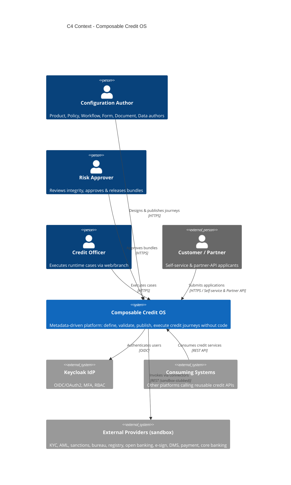
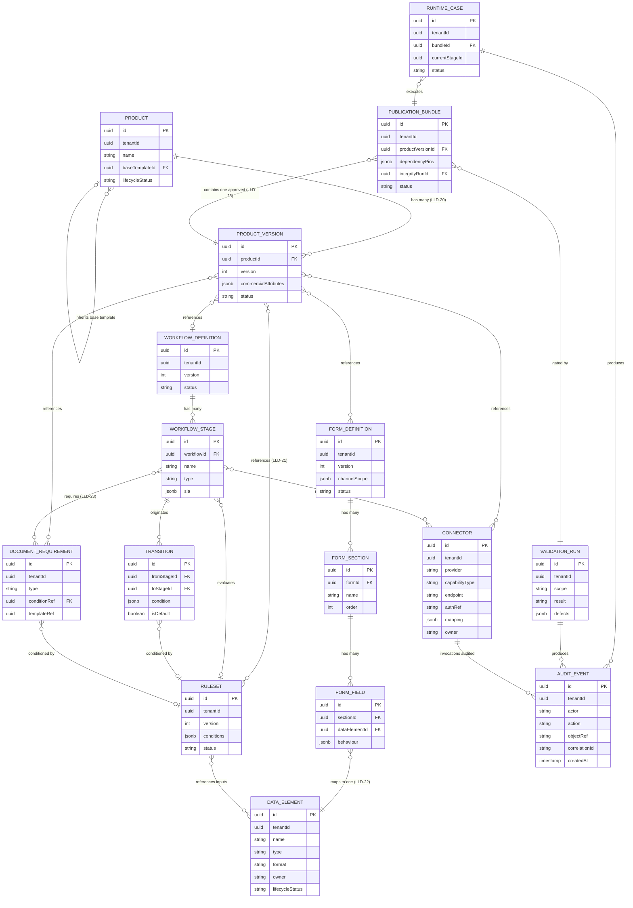
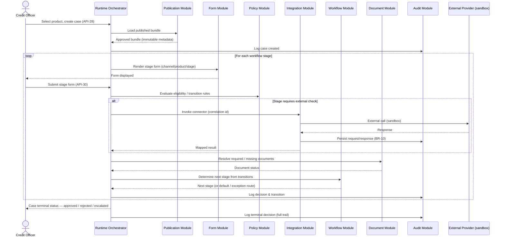
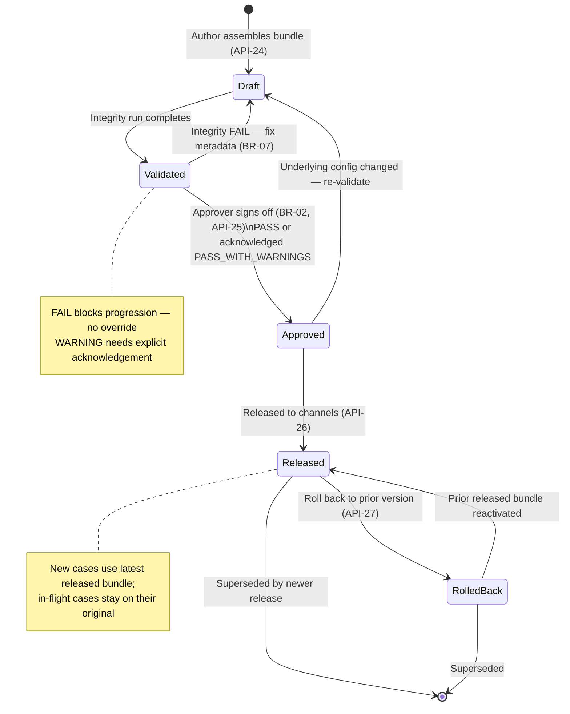
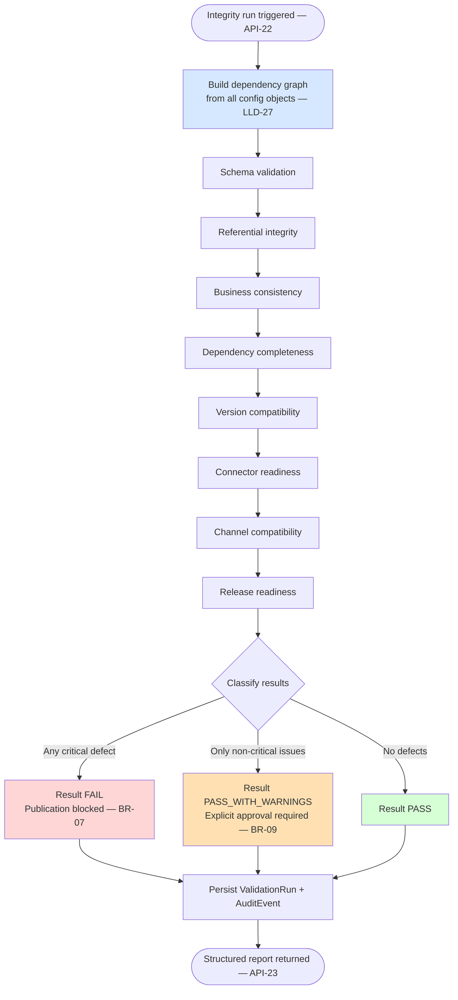
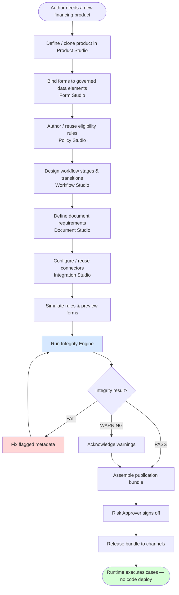
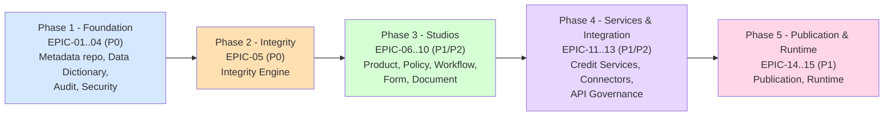

# Composable Credit OS — Product Requirements Document

**Product**: Composable Credit OS (`credit-os`)
**Version**: 1.0
**Created**: 2026-05-17
**Status**: PRD — for CEO checkpoint
**Author**: Product Manager, ConnectSW
**Sources**: CEO brief `notes/ceo/credit-os-brief.md` (BRD-01..52, FRD-01..31, LLD-01..72, ENT-01..16, API-01..30) · Business Analysis `products/credit-os/docs/business-analysis.md` · Feature Spec `products/credit-os/docs/specs/spec.md`

> **Diagram-first document** (Constitution Article IX). This PRD contains 9 Mermaid diagrams: C4 Context, C4 Container, ER, runtime sequence, publication-lifecycle state, integrity-engine flowchart, user-journey flowchart, phase-roadmap flowchart, and the as-is/to-be comparison. Text supplements the diagrams.

---

## 1. Overview

### 1.1 Vision

Composable Credit OS is a **Meta-Driven Composable Credit Operating System for corporate financing**. It replaces today's fragmented, hardcoded credit-origination estate — where product rules, eligibility logic, forms, workflows, and external integrations are duplicated across applications and every change is a code deployment — with a single governed platform on which business teams **configure and publish complete financing journeys without writing code** (BRD-01, BRD-04).

The founding principle is **configuration over code** (FRD-02). Product, policy, workflow, form, document, integration, validation, publication, and runtime execution are all driven by governed metadata. A single **Integrity Engine** verifies cross-object consistency and blocks publication of any inconsistent configuration — making "no inconsistent journey can be published" a structural guarantee.

### 1.2 Target Users

| Persona | Role | What they do on the platform |
|---------|------|------------------------------|
| Product Author | Product team (BRD-20) | Create, clone, version, and inherit financing products |
| Policy Author | Strategy / Risk policy (BRD-21, 23) | Author, simulate, and reuse eligibility/decisioning rules |
| Workflow Designer | Operations Excellence (BRD-22) | Design workflows: stages, transitions, SLAs, exception paths |
| Data Steward | Data Governance (BRD-24) | Maintain the canonical data dictionary |
| Risk Approver | Risk & Compliance (BRD-23) | Review integrity results, approve and release bundles |
| Integration Owner | External Integration (BRD-28) | Configure and test reusable connectors |
| Credit Officer | Channel/runtime staff | Execute live runtime cases |
| Auditor | Risk & Compliance / audit | Query the complete audit trail |
| Consuming System | Other internal platforms (BRD-15) | Call reusable credit services and APIs |
| Platform Engineer | Architecture & Engineering (BRD-25) | Operate and extend the platform; build connectors |

### 1.3 Success Metrics

Success is measured against BRD-47..52, operationalised in Section 9. The platform's definition of done: a business team publishes a new financing product end-to-end with **zero code changes**, the Integrity Engine blocks at least one inconsistent bundle in UAT, and a runtime case executes fully against a published bundle with a complete audit trail.

---

## 2. Business Context

### 2.1 Problem

The current operating model relies on **fragmented hardcoded logic across multiple applications** (BRD-03). Consequences:

- **BRD-03.01** — Product rules duplicated across systems, drifting out of sync.
- **BRD-03.02** — Eligibility changes require code deployment.
- **BRD-03.03** — Forms and workflow steps are not reusable.
- **BRD-03.04** — External integrations are custom-built and not reusable.
- **BRD-03.05** — Integrity errors detected late, in test or production.

The cost of inaction: lost time-to-market, recurring defect remediation, audit exposure from inconsistent credit decisions, and engineering capacity consumed by configuration work business users should own.

### 2.2 As-Is vs To-Be

```mermaid
flowchart TB
    subgraph AsIs["AS-IS — Hardcoded Model (BRD-03)"]
        A1[Business need] --> A2[Hand off to Engineering]
        A2 --> A3[Re-implement / duplicate logic<br/>BRD-03.01]
        A3 --> A4[Build bespoke connectors<br/>BRD-03.04]
        A4 --> A5[QA finds integrity defect late<br/>BRD-03.05]
        A5 --> A6[Code deployment<br/>BRD-03.02]
        A6 --> A7[Product live]
    end
    subgraph ToBe["TO-BE — Metadata-Driven Platform (BRD-04)"]
        B1[Business need] --> B2[Author / clone metadata in Studios]
        B2 --> B3[Reuse governed elements, rules, connectors]
        B3 --> B4[Integrity Engine validates pre-publication]
        B4 --> B5{Integrity result}
        B5 -->|FAIL| B2
        B5 -->|PASS| B6[Approve & publish bundle]
        B6 --> B7[Runtime executes — no code deploy]
    end
    style A3 fill:#ffd6d6
    style A5 fill:#ffd6d6
    style A6 fill:#ffe0b3
    style B4 fill:#d6e8ff
    style B7 fill:#d6ffd6
```



### 2.3 Business Value & Strategy

- **Time-to-market** — change becomes configure-and-publish, not a software release (BRD-02, KPI-01).
- **Control & auditability** — integrity verified before publication; 100% audited config + runtime (BRD-02, KPI-06).
- **Eliminate duplication** — one governed metadata graph; reuse is the default (BRD-02, KPI-03).
- **Reuse across products, channels, and systems** — API-first credit capabilities consumable by other platforms (BRD-15, FRD-06).
- **Strategic position** — the differentiator is the **publication-gating Integrity Engine over a unified metadata graph**; competitors (configurable LOS, decision engines, low-code BPM) configure each domain independently and discover inconsistencies late.

### 2.4 Out of Scope

Per BRD-16..19, the platform explicitly excludes:

- **BRD-16** — General ledger posting.
- **BRD-17** — Treasury operations.
- **BRD-18** — External provider business operations.
- **BRD-19** — Credit committee policy governance outside the platform.

Additionally deferred for v1: real third-party connector integrations (all sandbox-stubbed), concurrent multi-tenant operation (multi-tenant-ready but one tenant per deployment), and native mobile applications.

---

## 3. System Architecture

### 3.1 C4 Level 1 — System Context



### 3.2 C4 Level 2 — Container Diagram (Modular Monolith)

The platform is a **modular monolith**: one Fastify API and one Next.js web app, each with strict internal module boundaries — one module per LLD service (LLD-03..15). This is a deliberate, CEO-locked deviation from the literal 13-microservice decomposition in LLD-02/LLD-16; an ADR records the deviation and the split-out path.

```mermaid
C4Container
    title C4 Container - Composable Credit OS (Modular Monolith)

    Person(author, "Configuration Author")
    Person(officer, "Credit Officer")
    System_Ext(idp, "Keycloak IdP")
    System_Ext(extprov, "External Providers (sandbox)")

    Container(web, "Web App", "Next.js + Tailwind, port 3121", "Authoring Studios, runtime & audit UI")
    ContainerDb(db, "Metadata Repository", "PostgreSQL + Prisma", "Relational + JSONB config; all 16 entities; tenant-scoped")

    Container_Boundary(api, "Fastify API (modular monolith, port 5016)") {
        Component(m_product, "Product Module", "LLD-03", "Product create/clone/version/inherit")
        Component(m_policy, "Policy Module", "LLD-04", "RuleSet authoring + simulation; wraps json-rules-engine")
        Component(m_data, "Data Dictionary Module", "LLD-05", "Canonical data elements, duplicate detection")
        Component(m_workflow, "Workflow Module", "LLD-06", "Stages, transitions, SLAs")
        Component(m_form, "Form Module", "LLD-07", "Dynamic forms, channel rendering")
        Component(m_doc, "Document Module", "LLD-08", "Document requirements & tracking")
        Component(m_credit, "Credit Service Library", "LLD-09", "Decisioning, pricing, limit, collateral, etc.")
        Component(m_integration, "Integration Module", "LLD-10", "Connector framework, sandbox stubs")
        Component(m_integrity, "Integrity Engine", "LLD-11", "Dependency graph + 8 validation classes")
        Component(m_publication, "Publication Module", "LLD-12", "Bundle assembly, approval, release, rollback")
        Component(m_runtime, "Runtime Orchestrator", "LLD-13", "Runtime cases from published bundles")
        Component(m_audit, "Audit Module", "LLD-14", "Append-only AuditEvents (cross-cutting)")
        Component(m_notify, "Notification Module", "LLD-15", "Alerts on integrity/connector/release events")
    }

    Rel(author, web, "Uses", "HTTPS")
    Rel(officer, web, "Uses", "HTTPS")
    Rel(web, api, "Calls", "REST / JSON")
    Rel(api, db, "Reads/writes", "Prisma")
    Rel(api, idp, "Validates OIDC tokens")
    Rel(m_integration, extprov, "Invokes connectors", "REST (sandbox)")
    Rel(m_integrity, m_publication, "Gates publication")
    Rel(m_publication, m_runtime, "Provides released bundles")
    Rel(m_runtime, m_policy, "Evaluates rules")
    Rel(m_runtime, m_form, "Renders forms")
    Rel(m_runtime, m_integration, "Invokes external checks")
```

**Module boundary enforcement** (NFR-007): one directory per module with a published interface; import-boundary tooling (e.g. dependency-cruiser / ESLint) prevents cross-module reach-arounds, keeping the future split-out path clean.

---

## 4. Data Model

### 4.1 ER Diagram — 16 Core Entities (ENT-01..16, LLD-20..25)



Every entity carries `tenantId` (single-tenant, multi-tenant-ready) and version semantics where applicable (BR-01). Published versions are immutable (BR-08).

---

## 5. Runtime Case Flow

### 5.1 Sequence Diagram — Runtime Case Execution (LLD-50..58)



---

## 6. Publication Bundle Lifecycle

### 6.1 State Diagram — Bundle Lifecycle



---

## 7. Integrity Engine

### 7.1 Flowchart — Integrity Validation Sequence (LLD-28)



The 8 validation classes operate over the 11 FRD-21 relationship types. FRD-23 blocking conditions (unmapped mandatory field, rule referencing undefined metadata, connector lacking auth/endpoint, invalid transition, orphaned document requirement, incompatible version dependency) each produce a `FAIL`.

---

## 8. Primary User Journey

### 8.1 Flowchart — Author-to-Publish Journey (Configuration Author)



---

## 9. Success Metrics / KPIs

Operationalising BRD-47..52. Baselines from the current hardcoded estate to be supplied by Operations Excellence (ASM-08); where unavailable, the platform measurement establishes the baseline.

| KPI | Metric | Baseline | Target | Measurement |
|-----|--------|----------|--------|-------------|
| KPI-01 (BRD-47) | Product launch cycle time | Current request-to-live lead time | ≥ 60% reduction in time to publish a new product | Timestamp delta: product created → bundle published |
| KPI-02 (BRD-48) | Publication defect rate | Integrity defects found in test/prod per release | ≥ 70% reduction; zero CRITICAL defects reaching production | Post-publish integrity failures ÷ total publications |
| KPI-03 (BRD-49) | Reuse rate of services & metadata | 0 (no reuse today) | ≥ 50% of new products reuse ≥ 1 existing rule/form/connector | Shared-artifact refs ÷ total refs |
| KPI-04 (BRD-50) | Straight-through processing rate | Current STP rate | ≥ 40% of runtime cases auto-decided | Cases terminal with no manual stage ÷ total cases |
| KPI-05 (BRD-51) | Integration onboarding speed | Current bespoke-connector build time | ≥ 50% reduction in connector configure time | Timestamp delta: connector created → test passed |
| KPI-06 (BRD-52) | Audit & traceability completeness | Partial / inconsistent audit | 100% config + runtime actions audited; 100% connector calls carry correlation id | AuditEvent count ÷ material actions |

---

## 10. Epics & User Stories

The full product is 15 epics / 57 user stories across 5 phases. Each story's "As a / I want / So that" statement and Given/When/Then acceptance criteria are in the feature spec (`docs/specs/spec.md`). Summary below.

### 10.1 Phase 1 — Foundation (Metadata Repository) — LLD-63 — P0

| Epic | User Stories |
|------|-------------|
| **EPIC-01 Metadata Repository & Versioning** (BN-01) | US-01 Create & store a metadata object · US-02 Version every object on change · US-03 View version history · US-04 Published versions immutable |
| **EPIC-02 Data Dictionary Studio** (BN-02) | US-05 Create a canonical data element · US-06 Detect duplicate/conflicting definitions · US-07 Reuse a data element · US-08 Manage lifecycle status |
| **EPIC-03 Audit Service** (BN-13) | US-09 Material changes write an AuditEvent · US-10 Query the audit trail |
| **EPIC-04 Platform Security & Ownership** (BN-16, BN-14) | US-11 RBAC restricts actions · US-12 MFA enforced at login · US-13 Domain ownership model · US-14 Encryption & secrets management |

### 10.2 Phase 2 — Integrity Engine — LLD-64 — P0

| Epic | User Stories |
|------|-------------|
| **EPIC-05 Integrity Engine** (BN-03) | US-15 Build a dependency graph · US-16 Validate 11 FRD-21 relationships · US-17 Classify pass/warning/fail · US-18 Critical failures block publication · US-19 Run integrity on demand · US-20 Warnings require explicit approval |

### 10.3 Phase 3 — Authoring Studios — LLD-65 — P1 (EPIC-10 P2)

| Epic | User Stories |
|------|-------------|
| **EPIC-06 Product Studio** (BN-04) | US-21 Create a product · US-22 Clone a product · US-23 Version/update/retire · US-24 Inherit from a base template |
| **EPIC-07 Policy & Decision Studio** (BN-05) | US-25 Author a rule with nested groups · US-26 Simulate a rule · US-27 Reuse a rule · US-28 Validate a rule vs dictionary |
| **EPIC-08 Workflow Studio** (BN-06) | US-29 Design stages & transitions · US-30 Configure approvals/SLAs/exception paths · US-31 Parallel & sequential steps · US-32 Valid condition or default route |
| **EPIC-09 Form Studio** (BN-07) | US-33 Build a dynamic form · US-34 Every field maps to a data element · US-35 Conditional field behaviour · US-36 Preview by channel/product/stage |
| **EPIC-10 Document Studio** (BN-08) | US-37 Define a document requirement · US-38 Link to products/stages/rules · US-39 Flag missing documents by stage |

### 10.4 Phase 4 — Services & Integration — LLD-65 — P2 (EPIC-13 P1)

| Epic | User Stories |
|------|-------------|
| **EPIC-11 Composable Credit Service Library** (BN-09, BN-15) | US-40 Expose reusable credit services · US-41 Services versioned, discoverable, reusable |
| **EPIC-12 Integration Studio & Connector Framework** (BN-10) | US-42 Configure a connector · US-43 Sync/async/callback/polling patterns · US-44 Test a connector · US-45 Invoke with correlation id, persist response |
| **EPIC-13 API Governance** (BN-15) | US-46 Core modules expose standard APIs · US-47 OpenAPI-compliant, versioned, idempotent |

### 10.5 Phase 5 — Publication & Runtime — LLD-66 — P1

| Epic | User Stories |
|------|-------------|
| **EPIC-14 Publication Studio** (BN-11) | US-48 Assemble a publication bundle · US-49 Approver sign-off · US-50 Release to channels · US-51 Roll back a release |
| **EPIC-15 Runtime Orchestration** (BN-12) | US-52 Create a runtime case · US-53 Render correct form per stage · US-54 Route by policy & external responses · US-55 Request missing documents · US-56 Approved-metadata-only runtime · US-57 All runtime actions audited |

---

## 11. Requirements

### 11.1 Functional Requirements

FR-001 through FR-052 are defined in the feature spec (`docs/specs/spec.md`, Section "Functional Requirements"), each traced to a BRD/FRD/LLD source, an epic, and a user story. Summary by module:

| Module | FRs | Core capability |
|--------|-----|-----------------|
| Metadata Repository | FR-001..004 | Persistence, versioning, immutability |
| Data Dictionary | FR-005..008 | Canonical elements, duplicate detection, lifecycle |
| Audit | FR-009, FR-010 | Append-only events, queryable trail |
| Security | FR-011..014 | RBAC, MFA, ownership, encryption |
| Integrity Engine | FR-015..020 | Graph, 11+8 checks, classification, blocking, on-demand, warnings |
| Product Studio | FR-021, FR-022 | Create/clone/version/retire, inheritance |
| Policy Studio | FR-023..026 | Authoring, simulation, reuse, validation |
| Workflow Studio | FR-027, FR-028 | Stage/transition design, valid routing |
| Form Studio | FR-029..032 | Dynamic forms, field mapping, conditional behaviour, preview |
| Document Studio | FR-033, FR-034 | Requirements, linking, missing-doc flagging |
| Credit Services | FR-035, FR-036 | Reusable services, versioning |
| Integration | FR-037..040 | Connector config, patterns, test, correlation |
| API Governance | FR-041, FR-042 | Standard module APIs, OpenAPI/idempotency |
| Publication | FR-043..046 | Bundle assembly, approval, release, rollback |
| Runtime | FR-047..051 | Case creation, rendering, routing, approved-only, audit |
| Cross-cutting | FR-052 | Tenant scoping |

### 11.2 Non-Functional Requirements (FRD-28..31, LLD-59..62)

| ID | Category | Requirement |
|----|----------|-------------|
| NFR-001 | Performance (FRD-29) | p95 rule evaluation ≤ 200 ms; p95 form-render API ≤ 300 ms under expected load |
| NFR-002 | Security (FRD-28, LLD-59) | OAuth2/OIDC (Keycloak), RBAC, MFA, encryption at rest/in transit, mTLS where applicable, secrets vault |
| NFR-003 | Availability (FRD-30) | Graceful degradation on external outages; connector failures follow fallback paths; ≥ 99.5% platform availability |
| NFR-004 | Auditability (FRD-31) | 100% config + runtime actions produce an AuditEvent; 100% connector calls carry a correlation id; append-only |
| NFR-005 | Observability (LLD-60..62) | Structured logs, metrics, traces; correlation-id linking; alerts on integrity/connector/release failures |
| NFR-006 | Scalability | Moderate config surface (16 entities, 30 APIs); growing runtime case volume without architectural change |
| NFR-007 | Maintainability | Module boundaries enforced by import-boundary tooling; clean split-out path |
| NFR-008 | Accessibility | All web surfaces meet WCAG 2.1 AA |
| NFR-009 | Reliability | Reproducible bundles; rollback restores prior release exactly; RTO ≤ 15 min via rollback |

---

## 12. Roadmap



| Phase | Milestone (no time estimates) | Build-order source |
|-------|-------------------------------|--------------------|
| Phase 1 | Metadata repository, data dictionary, audit, and security operational; foundation for all modules | LLD-63 |
| Phase 2 | Integrity Engine validates all FRD-21 relationships and blocks `FAIL` bundles | LLD-64 |
| Phase 3 | Product, Policy, Workflow, Form, Document Studios — business teams can author complete journeys | LLD-65 |
| Phase 4 | Credit service library, connector framework (all sandbox-stubbed), API governance | LLD-65 |
| Phase 5 | Publication Studio and Runtime Orchestrator — end-to-end publish + execute with zero code | LLD-66 |

Each phase ends at an Orchestrator checkpoint. Phases 1–3 deliver a usable platform before P2 modules; the value proposition (publish a product with no code, runtime executes it) is fully demonstrable at the end of Phase 5.

---

## 13. Dependencies

| Dependency | Type | Status |
|-----------|------|--------|
| Keycloak (self-hosted OIDC/OAuth2 IdP) | External — auth | Locked (addendum) |
| `json-rules-engine` | Library — rule evaluation | Locked (addendum) |
| PostgreSQL + Prisma | Infrastructure — metadata repository | ConnectSW default (Article V) |
| External providers (KYC, AML, sanctions, bureau, registry, open banking, e-sign, DMS, payment, core banking) | External — runtime checks | Sandbox-stubbed for v1 (addendum) |
| `@connectsw/auth`, `@connectsw/shared`, `@connectsw/ui` | Internal shared packages | Available — see spec Component Reuse Check |

---

## 14. Risks & Mitigations

Inherited from the Business Analysis risk register (RSK-01..08).

| Risk | Impact | Likelihood | Mitigation |
|------|--------|------------|------------|
| RSK-01 Integrity Engine complexity | High | High | Build immediately after the repository (Phase 2); FRD-21 matrix as explicit test spec; incremental TDD; QA gate |
| RSK-02 Connector sprawl | Medium | High | Resolved — all connectors sandbox-stubbed; generic framework first, then types |
| RSK-03 Metadata versioning correctness | High | Medium | Central version model in Phase 1; immutable published versions; dependency pinning; rollback regression tests |
| RSK-04 Scope size | Medium | High | Strict 5-phase delivery; checkpoint per phase; P0/P1 deliver usable platform first |
| RSK-05 Module-boundary erosion | Medium | Medium | Import-boundary tooling; one directory per module; ADR; code-review gate |
| RSK-06 Rule engine semantic gap | Medium | Medium | Architect spike on json-rules-engine precedence/exception before Phase 3 |
| RSK-07 Open dependency questions | Medium | Medium | Resolved — IdP, channels, connectors all decided (addendum) |
| RSK-08 Audit completeness gap | High | Medium | Audit delivered as Phase 1 cross-cutting concern; shared middleware; code review |

---

## 15. Site Map

The site map of all 26 routes is maintained in the feature spec (`docs/specs/spec.md`, "Site Map" section). Phase 4–5 routes ship as real page skeletons with empty states — never "Coming Soon" placeholders.

---

## 16. Open Questions

All 7 known questions are **resolved** (see spec "Open Questions" and addendum). No `[NEEDS CLARIFICATION]` markers remain. The PRD is ready for the CEO checkpoint and handoff to the Architect for `/speckit.plan`.

---

## Appendix A — Document Cross-Reference

| Artifact | Path |
|----------|------|
| CEO brief (BRD/FRD/LLD pack) | `notes/ceo/credit-os-brief.md` |
| Business Analysis | `products/credit-os/docs/business-analysis.md` |
| Feature Specification | `products/credit-os/docs/specs/spec.md` |
| Product Addendum (locked decisions) | `products/credit-os/.claude/addendum.md` |
| This PRD | `products/credit-os/docs/PRD.md` |

## Appendix B — Quality Checklist

| Item | Status |
|------|--------|
| All user personas defined | Section 1.2 — 10 personas |
| Every epic has user stories | Section 10 — 15 epics, 57 stories |
| Every user story has acceptance criteria | In `docs/specs/spec.md` (Given/When/Then) |
| C4 Context + Container diagrams | Sections 3.1, 3.2 |
| ER diagram for 16 entities | Section 4.1 |
| Runtime sequence diagram | Section 5.1 |
| Publication-lifecycle state diagram | Section 6.1 |
| Integrity-engine flowchart | Section 7.1 |
| User-journey flowchart | Section 8.1 |
| Non-functional requirements | Section 11.2 — NFR-001..009 |
| Success metrics / KPIs | Section 9 — KPI-01..06 |
| 5-phase roadmap | Section 12 |
| Out-of-scope section | Section 2.4 (BRD-16..19) |
| Full FR/BRD traceability matrix | In `docs/specs/spec.md` (Traceability Matrix) |
| No ambiguous language | Reviewed — MUST/SHOULD per RFC 2119 |
| All routes listed | Section 15 + spec Site Map — 26 routes |
| No `[NEEDS CLARIFICATION]` markers | Confirmed — 0 remaining |
