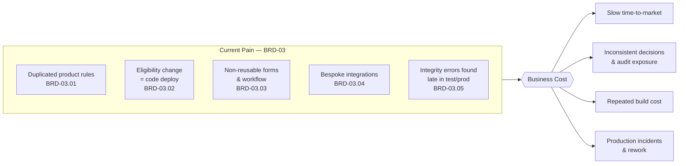
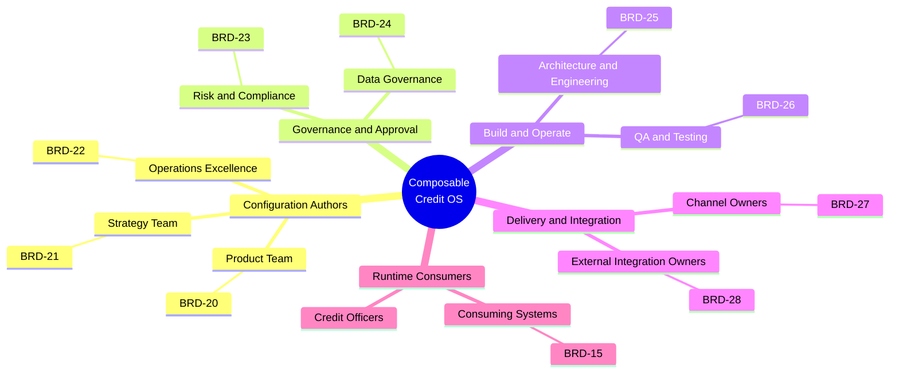
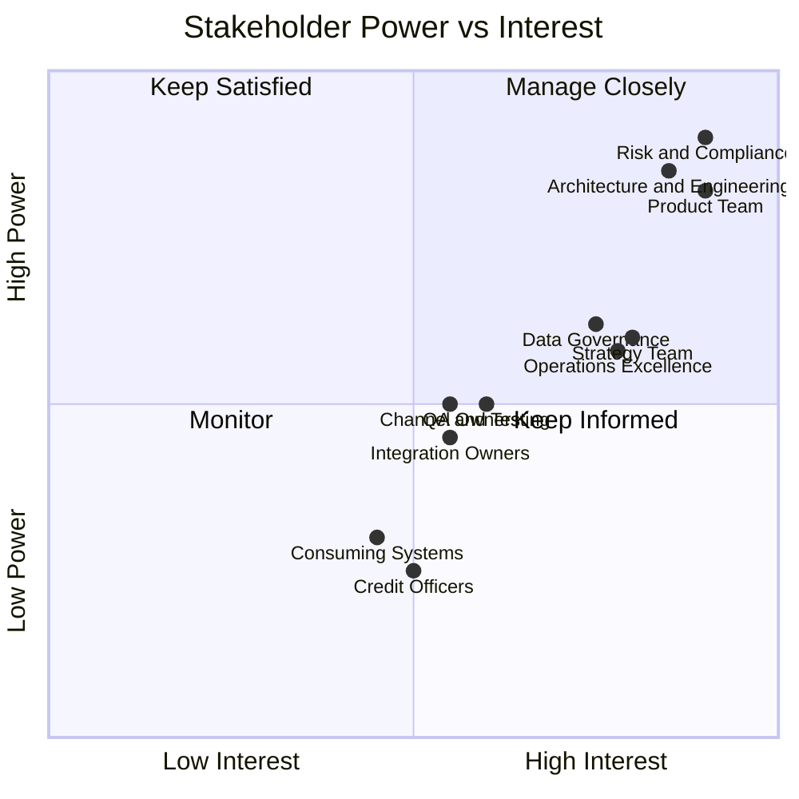
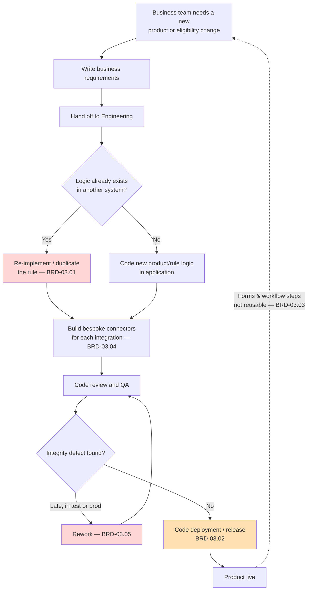
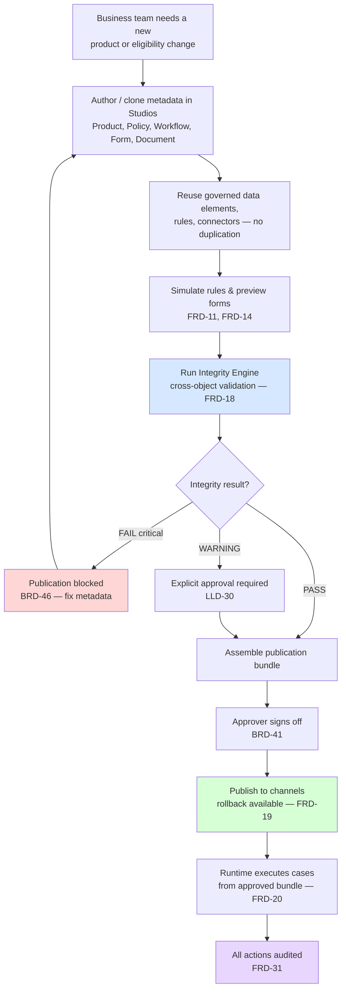
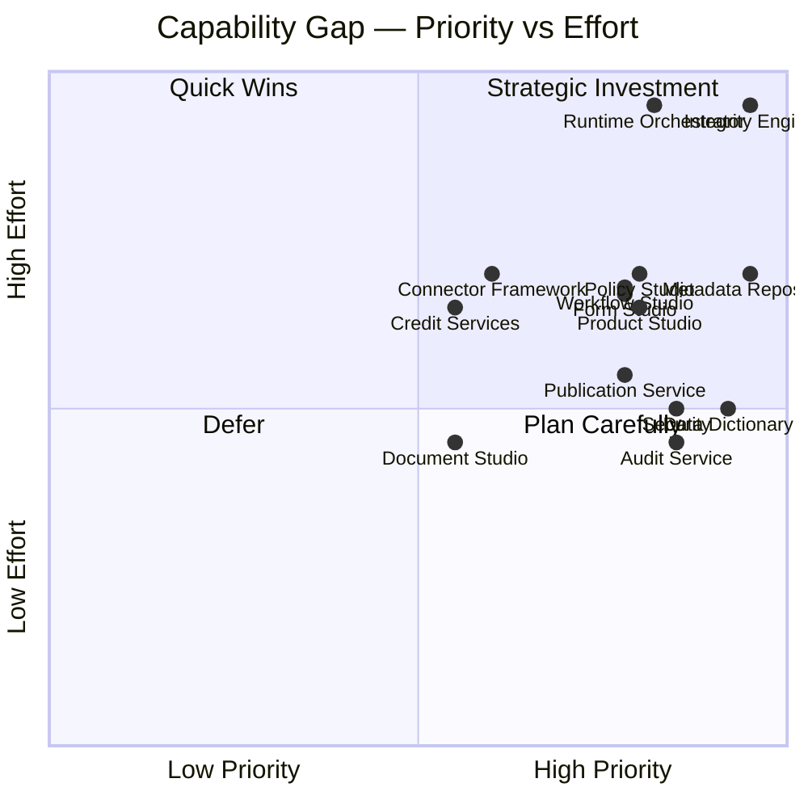
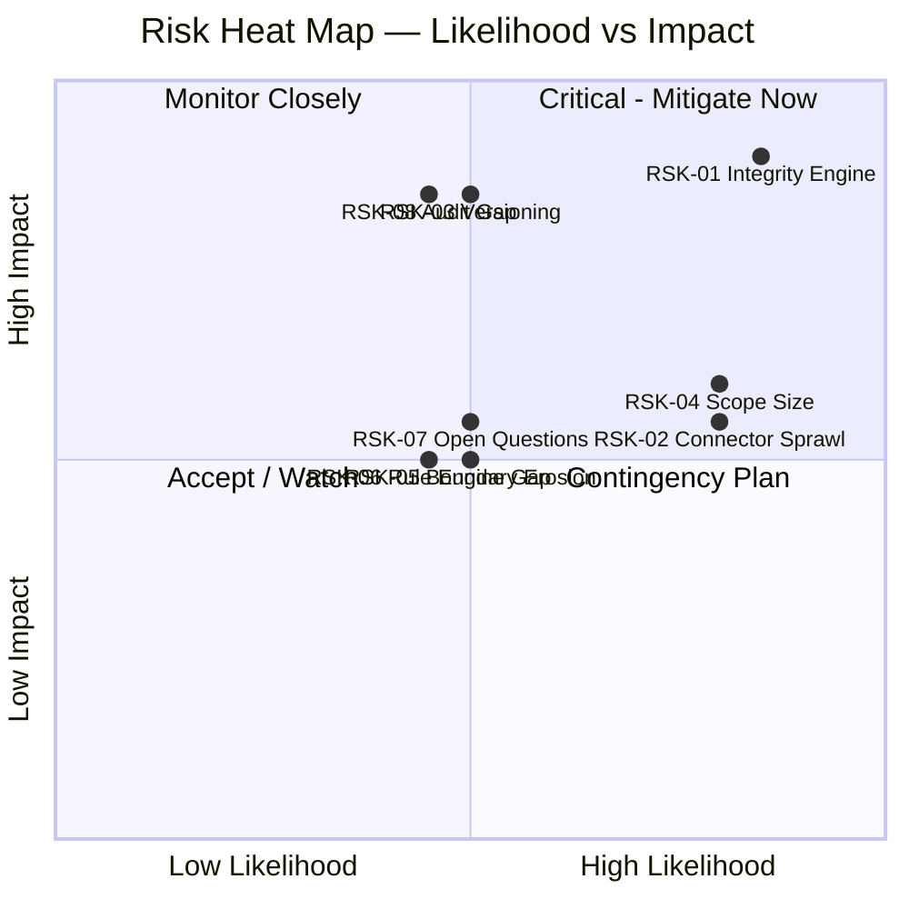
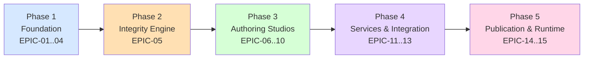

# Business Analysis Report: Composable Credit OS (`credit-os`)

**Task ID:** BA-01
**Author:** Business Analyst, ConnectSW
**Date:** 2026-05-17
**Status:** Complete — handoff to Product Manager
**Source pack:** `notes/ceo/credit-os-brief.md` (BRD-01..52, FRD-01..31, LLD-01..72, ENT-01..16, API-01..30)
**Locked CEO decisions:** Modular monolith · Single-tenant, multi-tenant-ready · Adopt `json-rules-engine` · Full-program scope (LLD build order)

---

## 1. Executive Summary

Composable Credit OS is a **metadata-driven Credit Operating System for corporate financing**. It replaces today's fragmented, hardcoded credit-origination estate — where product rules, eligibility logic, forms, workflows, and external integrations are duplicated across multiple applications and every change requires a code deployment (BRD-03) — with a single governed platform on which business teams **configure and publish complete financing journeys without writing code** (BRD-01, BRD-04).

The core business problem is **structural slowness and structural risk**. Because credit logic is embedded in application code, launching or amending a financing product is a development project rather than a configuration change (BRD-03.02). The same rules are re-implemented inconsistently across systems (BRD-03.01), workflow and form artifacts cannot be reused (BRD-03.03), connectors are bespoke (BRD-03.04), and integrity defects surface late — in test or production (BRD-03.05). The cost of inaction is measured in lost time-to-market, recurring defect remediation, audit exposure, and engineering capacity consumed by configuration work that business users should own.

The target outcome (BRD-02) is a platform that **reduces time-to-market, improves control and auditability, eliminates duplicated configuration, and enables reuse** across products, channels, and external systems. The platform is organized as 13 logical modules (LLD-03..15), 16 core data entities (ENT-01..16), and 30 versioned APIs (API-01..30), governed end-to-end by an **Integrity Engine** that blocks publication of any inconsistent configuration (BRD-33, FRD-18, LLD-26..30).

**Recommendation: GO**, with a phased delivery aligned to the LLD build order. Feasibility is **High on technical and resource dimensions** and **Medium on market dimension** (corporate-credit platform sales cycles are long; this assessment treats ConnectSW as the build organization, not the go-to-market owner). The dominant delivery risks are **Integrity Engine complexity**, **connector sprawl**, **metadata versioning correctness**, and **the sheer scope** of a 13-module program — all of which the phased epic structure in Section 12 is designed to contain. The modular-monolith decision (one Fastify API + one Next.js web with strict internal module boundaries) is assessed as **the correct call**: it honors the LLD service decomposition logically while delivering a runnable system far faster than 13 deployables, and it preserves a clean split-out path.

---

## 2. Business Context

### 2.1 Problem Statement

| Dimension | Detail |
|-----------|--------|
| **Problem** | Corporate-financing product, policy, workflow, form, document, and integration logic is hardcoded and duplicated across multiple applications (BRD-03). |
| **Who experiences it** | Product, Strategy, Operations Excellence, Risk & Compliance, Data Governance teams (BRD-20..24) who must wait on Engineering (BRD-25) for every change; QA (BRD-26) who discover integrity defects late; Channel and Integration owners (BRD-27..28) who cannot reuse capabilities. |
| **Cost of inaction** | (1) Every product launch / eligibility change is a software release (BRD-03.02) — slow and expensive. (2) Duplicated rules drift out of sync across systems (BRD-03.01), producing inconsistent credit decisions and audit findings. (3) No reuse of forms, workflow steps, or connectors (BRD-03.03/.04) means repeated build cost. (4) Integrity errors caught in test/production (BRD-03.05) cause rework, incidents, and remediation cost. |
| **Why now** | Credit operations are scaling across products and channels; the hardcoded model does not scale and concentrates delivery risk in Engineering. |

### 2.2 Market Landscape

Composable Credit OS sits at the intersection of three established enterprise software categories: **Loan Origination Systems (LOS)**, **business rules / decision engines**, and **low-code BPM / process orchestration**. The market for these capabilities is large and mature; the differentiated position is the **unified metadata model with a publication-gating Integrity Engine** — discussed in Section 8. This BA treats ConnectSW as the *builder*; the analysis informs product positioning rather than a commercial go-to-market plan.

### 2.3 Target Segments

| Segment | Description | Role on Platform |
|---------|-------------|------------------|
| **Primary — Configuration authors** | Product, Strategy, Risk/Policy, Operations, Data Governance teams who design financing journeys. | Owners / authors of metadata (products, rules, forms, workflows, documents). |
| **Primary — Approvers** | Risk & Compliance leads, Data Governance owners who approve bundles before publication. | Approvers in the publication workflow (BRD-41). |
| **Secondary — Runtime operators** | Credit officers, branch/channel staff who execute live cases against published journeys. | Consumers of runtime cases (FRD-20). |
| **Secondary — Consuming systems** | Other internal systems and platforms that call the reusable credit services and APIs (BRD-15, BRD-37.02). | API consumers. |
| **Internal — Engineering / Architecture** | Build, operate, and extend the platform; build new connectors. | Platform owners; no longer in the per-change critical path. |

---

## 3. Stakeholder Analysis

### 3.1 Stakeholder Map

### 3.2 Stakeholder Register

Per BRD-29, every domain has a named owner, approver, and consumer group. The table maps roles to platform domains.

| Stakeholder | BRD | Domain owned | Interest | Influence | Primary Needs | Communication |
|-------------|-----|--------------|----------|-----------|---------------|---------------|
| Product Team | BRD-20 | Product Studio, product versioning | High | High | Create/clone/version products without code (BRD-30); inherit from templates | Sprint demos; Product Studio UAT |
| Strategy Team | BRD-21 | Policy / decisioning strategy | High | Medium | Define eligibility & decisioning rules; simulate before publish (BRD-31, FRD-11) | Roadmap reviews; rule simulation walkthroughs |
| Operations Excellence | BRD-22 | Workflow design, SLAs | High | Medium | Configurable workflows, stages, SLAs, exception/rework loops (BRD-34) | Workflow Studio UAT |
| Risk & Compliance | BRD-23 | Policy approval, audit | High | High | Integrity guarantees; bundle approval gate; full auditability (BRD-33, BRD-41, FRD-31) | Approval-gate sign-off; audit report reviews |
| Data Governance | BRD-24 | Data dictionary | High | Medium | Canonical data elements; duplicate detection; lifecycle ownership (BRD-32, FRD-12) | Data dictionary governance forum |
| Architecture & Engineering | BRD-25 | Platform build, connectors | High | High | Maintainable modular architecture; connector framework; API governance (LLD-02, FRD-25) | ADRs; architecture checkpoints |
| QA & Testing | BRD-26 | Quality gates | Medium | Medium | Test scenarios; integrity validation; early defect detection (LLD-72, FRD-18) | Testing Gate; validation matrix |
| Channel Owners | BRD-27 | Channel delivery | Medium | Medium | Channel-specific form rendering; channel applicability of products (BRD-30.01, FRD-14.01) | Channel readiness reviews |
| External Integration Owners | BRD-28 | Connectors | Medium | Medium | Reusable, configurable connectors; sandbox credentials (BRD-38, FRD-17) | Integration onboarding; connector test results |
| Credit Officers (runtime) | — | Runtime case execution | Medium | Low | Correct form per stage; clear routing; visible document requirements (FRD-20) | Runtime UAT |
| Consuming Systems | BRD-15 | API consumption | Medium | Low | Stable, versioned, discoverable APIs; idempotent writes (FRD-24, FRD-25) | API contract publication |

### 3.3 Power / Interest Grid

**Manage Closely:** Risk & Compliance, Architecture & Engineering, Product Team — these define acceptance and gate publication. Their requirements drive P0 scope.

---

## 4. Requirements Elicitation

### 4.1 Business Needs

Business needs (BN-XXX) are derived from the BRD and consolidate the platform's intent into actionable units for the Product Manager. Priority: P0 = foundational/blocking, P1 = core value, P2 = important, P3 = later.

| ID | Need | Source | Priority | Rationale |
|----|------|--------|----------|-----------|
| BN-01 | Govern all business metadata in a versioned central repository | BRD-04, BRD-07, BRD-40, LLD-63 | P0 | Foundation for every other module; build-order item #1 (LLD-63). |
| BN-02 | Maintain a canonical, governed data dictionary with duplicate detection and lifecycle | BRD-32, FRD-12 | P0 | Every form field and rule input resolves to a data element (BRD-42, BRD-43); must exist before forms/rules. |
| BN-03 | Validate cross-object integrity and block publication of inconsistent configuration | BRD-33, FRD-18, FRD-21..23, LLD-26..30 | P0 | The platform's central control; build-order item #2 (LLD-64); enforces BRD-46. |
| BN-04 | Create, clone, update, retire, and version financing products | BRD-05, BRD-30, FRD-10 | P1 | Primary author-facing value: launch products without code. |
| BN-05 | Author eligibility and decisioning rules with simulation, reusable across products | BRD-06, BRD-31, FRD-11 | P1 | Removes code deploys for policy changes (resolves BRD-03.02). |
| BN-06 | Design dynamic workflows with stages, transitions, approvals, SLAs, exception/rework paths | BRD-08, BRD-34, FRD-13 | P1 | Reusable orchestration; resolves BRD-03.03. |
| BN-07 | Generate dynamic forms bound to governed data elements with conditional behavior | BRD-09, BRD-35, FRD-14 | P1 | Reusable UI; enforces BRD-42. |
| BN-08 | Define and track document requirements linked to products, stages, and rules | BRD-10, BRD-36, FRD-15 | P2 | Completeness of the journey; document gating. |
| BN-09 | Expose reusable composable credit services (decisioning, pricing, limit, collateral, covenant, exception, servicing, renewal) | BRD-11, BRD-37, FRD-16, LLD-39..49 | P2 | Reuse by other systems (BRD-15); API-first capability library. |
| BN-10 | Configure reusable external connectors (KYC, AML, sanctions, bureau, registry, open banking, e-sign, DMS, payment, core banking) | BRD-12, BRD-38, FRD-17, FRD-26, LLD-31..38 | P2 | Resolves BRD-03.04; connectors reusable across products. |
| BN-11 | Bundle approved configuration, publish to channels, with rollback and release notes | BRD-13, FRD-19 | P1 | Controlled release; enforces BRD-41. |
| BN-12 | Execute published configurations at runtime as auditable cases without code changes | BRD-14, BRD-39, FRD-20, LLD-50..58 | P1 | Delivers the end-to-end business outcome; build-order item #4 (LLD-66). |
| BN-13 | Record a complete, queryable audit trail of all configuration and runtime actions | BRD-39.02, FRD-31, LLD-14, LLD-19 | P0 | Cross-cutting; required for auditability KPI (BRD-52) and Risk acceptance. |
| BN-14 | Enforce a domain ownership model (named owner, approver, consumer per domain) | BRD-29 | P1 | RBAC and approval routing depend on it. |
| BN-15 | Expose versioned, discoverable, OpenAPI-compliant APIs for every reusable capability | FRD-06, FRD-24, FRD-25, BRD-37.02 | P1 | API-first principle; enables consumption by other systems (BRD-15). |
| BN-16 | Enforce platform security: RBAC, MFA, encryption, secrets management | FRD-28, LLD-59 | P0 | Non-negotiable for a credit platform; cross-cutting. |

### 4.2 Business Rules

| ID | Rule | Source | Impact / Constrains |
|----|------|--------|---------------------|
| BR-01 | Every artifact shall be versioned. | BRD-40, FRD-04 | All 16 entities require version semantics; no destructive in-place edits to published objects. |
| BR-02 | Every published bundle shall be approved. | BRD-41 | Publication workflow must enforce an approval state transition before release. |
| BR-03 | Every form field shall map to a data element. | BRD-42 | FormField cannot be saved without a valid DataElement reference (ENT-10 → ENT-03). |
| BR-04 | Every rule shall reference valid inputs. | BRD-43 | RuleSet conditions validated against the data dictionary; integrity check INT. |
| BR-05 | Every workflow transition shall have a valid condition or default route. | BRD-44 | Transition (ENT-07) cannot be orphaned; integrity check. |
| BR-06 | Every connector shall have endpoint, auth, mapping, timeout, and owner. | BRD-45, LLD-31 | Connector (ENT-12) save/validation requires all five attributes. |
| BR-07 | No critical integrity error shall be bypassed for publication. | BRD-46, FRD-23, LLD-29 | Hard publication block; no override path for CRITICAL severity. |
| BR-08 | Runtime execution shall follow approved metadata only. | BRD-39.01 | Runtime reads published bundles exclusively — never draft configuration. |
| BR-09 | Warnings permit review but not automatic override unless explicitly approved. | LLD-30, FRD-22 | WARNING severity needs explicit recorded approval to publish. |
| BR-10 | Each call to an external connector shall be traced with a correlation ID and the response persisted. | FRD-27.01, FRD-27.02, LLD-61 | Integration Service and Audit Service coupling. |

### 4.3 Assumptions

| ID | Assumption | Risk if Wrong | Validation Plan |
|----|-----------|---------------|-----------------|
| ASM-01 | `json-rules-engine` can express all rule semantics in BRD-31.02 / FRD-11.01 (thresholds, exceptions, precedence, nested condition groups). | RuleSet metadata layer needs custom evaluation logic; rework in Policy module. | Architect spike during planning: model 3 representative rules; confirm precedence handling. |
| ASM-02 | One tenant per deployment is acceptable for v1; `tenantId` on entities is sufficient future-proofing. | Multi-tenant retrofit later if assumption wrong. | Confirmed by locked CEO decision — low risk. |
| ASM-03 | A subset of external connectors will be **stubbed/sandboxed** for v1; not all 10 providers need live integration at launch. | Scope balloons; connector sprawl risk materializes. | Open Question #5 — resolve in `/speckit.clarify` with PM. |
| ASM-04 | Launch channels are limited (web at minimum); not all of web/branch/mobile/partner-API required at v1. | Form rendering and runtime scope expand. | Open Question #6 — resolve in `/speckit.clarify`. |
| ASM-05 | An OIDC IdP will be selected (Keycloak/Auth0/internal) before security module work begins. | Auth module blocked or rebuilt. | Open Question #7 — resolve in `/speckit.clarify`; Architect ADR. |
| ASM-06 | Out-of-scope items (GL posting, treasury, external provider ops, external committee governance — BRD-16..19) remain out of scope and are not silently pulled in. | Scope creep; timeline slip. | PM enforces scope boundary in spec; Orchestrator checkpoint. |
| ASM-07 | The modular monolith's internal module boundaries can be enforced (lint/dependency rules) so future split-out stays clean. | Boundary erosion; "big ball of mud"; split-out becomes costly. | Architect ADR + import-boundary enforcement (e.g. dependency-cruiser / ESLint rules). |
| ASM-08 | KPI baselines (BRD-47..52) can be measured from the current hardcoded estate for comparison. | Success cannot be quantified against a baseline. | Operations Excellence to supply current launch-cycle and defect data; see Section 11. |

---

## 5. Process Analysis

### 5.1 Current State (As-Is) — Hardcoded Model (BRD-03)

**Characteristics:** every change is a software project; logic duplicated and drifting; integrity defects discovered late; nothing reusable. The business team is dependent on Engineering's release cadence for every adjustment.

### 5.2 Future State (To-Be) — Metadata-Driven Platform (BRD-04)

**Characteristics:** business teams own the change; integrity is verified *before* publication; reuse is the default; runtime executes approved metadata only — **no code deployment in the change path**.

### 5.3 Process Improvement Opportunities

| As-Is | To-Be | Quantified Benefit |
|-------|-------|--------------------|
| Change = code deployment (BRD-03.02) | Change = configure + publish | Product launch cycle reduction — KPI BRD-47 |
| Integrity defects found late (BRD-03.05) | Integrity verified pre-publication (FRD-18) | Publication defect reduction — KPI BRD-48 |
| Rules duplicated, drifting (BRD-03.01) | Single governed rule, reused | Reuse rate — KPI BRD-49; consistency |
| Bespoke connectors per integration (BRD-03.04) | Configurable reusable connectors | Integration onboarding speed — KPI BRD-51 |
| Forms/workflow non-reusable (BRD-03.03) | Composable, reusable artifacts | Lower build cost; reuse — KPI BRD-49 |
| Partial / inconsistent audit | End-to-end audit of config + runtime | Audit completeness — KPI BRD-52 |

---

## 6. Gap Analysis

### 6.1 Capability Gap Matrix

Current state assessed against the in-scope capabilities (BRD-05..15). Effort: S/M/L/XL.

| # | Capability | BRD | Current State | Desired State | Gap Severity | Priority | Effort |
|---|-----------|-----|---------------|---------------|--------------|----------|--------|
| 1 | Central metadata repository | BRD-07 | None — config embedded in code | Versioned governed repository | Critical | P0 | L |
| 2 | Governed data dictionary | BRD-07 | None — fields defined ad hoc per app | Canonical elements + duplicate detection + lifecycle | Critical | P0 | M |
| 3 | Integrity validation + publication control | BRD-13 | None — defects found in test/prod | Cross-object engine, blocks critical failures | Critical | P0 | XL |
| 4 | Product design & versioning | BRD-05 | Hardcoded per app, duplicated | Product Studio: create/clone/version/inherit | High | P1 | L |
| 5 | Eligibility & policy design | BRD-06 | Code-deployed rules | Policy Studio: author + simulate, reusable | High | P1 | L |
| 6 | Workflow & stage orchestration | BRD-08 | Hardcoded process steps | Workflow Studio: stages, SLAs, exceptions | High | P1 | L |
| 7 | Dynamic forms & UI rendering | BRD-09 | Static, non-reusable forms | Form Studio: data-element-bound, conditional | High | P1 | L |
| 8 | Document rules & generation | BRD-10 | Manual / app-specific | Document Studio: requirements, tracking, gating | Medium | P2 | M |
| 9 | Composable credit services | BRD-11 | Logic embedded, not exposed | Reusable API-first service library | Medium | P2 | L |
| 10 | External API integrations | BRD-12 | Bespoke per integration | Configurable reusable connector framework | High | P2 | L |
| 11 | Runtime case execution & audit | BRD-14 | Per-app, code-bound | Metadata-driven runtime orchestrator | High | P1 | XL |
| 12 | Service reuse by other systems | BRD-15 | Not possible | Versioned discoverable APIs | Medium | P1 | M |
| 13 | Audit & traceability (cross-cutting) | FRD-31 | Partial, inconsistent | Complete config + runtime audit trail | High | P0 | M |
| 14 | Security (RBAC/MFA/encryption) | FRD-28 | Per-app, inconsistent | Unified platform security | High | P0 | M |

**Greenfield note:** this is a new-build product — every capability is a gap from "None". Severity reflects *blocking dependency weight* (Critical = other modules cannot proceed without it) rather than partial-implementation delta.

### 6.2 Gap Visualization

**Read:** the Integrity Engine and Runtime Orchestrator are the high-priority / high-effort items needing the most careful planning. The Data Dictionary, Audit Service, Publication Service, and Security are high-value and comparatively contained — strong early wins that de-risk later modules.

---

## 7. Competitive Analysis

### 7.1 Competitive Landscape

Composable Credit OS competes conceptually with three adjacent categories. The platform is not a like-for-like clone of any one — its differentiator is the **unified metadata model spanning product, policy, workflow, form, document, and integration, gated by a single Integrity Engine**.

| Category / Example | Strengths | Weaknesses (relative to Credit OS) | Differentiator for Credit OS |
|--------------------|-----------|-----------------------------------|------------------------------|
| **Loan Origination Systems** (configurable LOS vendors — e.g. nCino, Finastra, TurnKey Lender) | Deep credit domain features; proven origination workflows | Configuration siloed per module; cross-object integrity is manual; corporate-financing depth varies; heavyweight | One governed metadata graph; automated cross-object integrity gate before publish |
| **Decision / rules engines** (FICO Blaze Advisor, Sapiens Decision, Progress Corticon) | Mature rule authoring, simulation, precedence | Rules only — not product/workflow/form/document/integration; integration with surrounding journey is bespoke | Rules are one composable layer inside a full journey platform; rules validated against the same governed data dictionary |
| **Low-code BPM / process orchestration** (Camunda, Appian, Pega) | Strong workflow modeling, broad process tooling | Generic — not credit-aware; no built-in credit-domain entities or integrity semantics; data model unmanaged | Credit-domain entity model (ENT-01..16) and integrity checks (FRD-21) built in, not assembled |

### 7.2 Feature Comparison Matrix

| Feature | Credit OS (target) | Configurable LOS | Decision Engine | Low-Code BPM |
|---------|--------------------|--------------------|------------------|---------------|
| Metadata-driven product definition & versioning | Yes | Partial | No | Partial |
| Rule authoring + simulation | Yes (json-rules-engine) | Partial | Yes | Partial |
| Dynamic forms bound to a governed data dictionary | Yes | Partial | No | Partial |
| Workflow orchestration | Yes | Yes | No | Yes |
| **Cross-object integrity engine gating publication** | **Yes (core differentiator)** | No / manual | No | No |
| Reusable configurable connector framework | Yes | Partial | No | Partial |
| Composable credit services exposed as APIs | Yes | Partial | Partial | No |
| Single governed metadata graph across all domains | Yes | No | No | No |

### 7.3 Competitive Positioning

The **blue-ocean position** is the **publication-gating Integrity Engine over a unified metadata graph** (BRD-33, FRD-18..23, LLD-26..30). Competitors let teams configure each domain independently and discover inconsistencies late — exactly the BRD-03.05 pain. Credit OS makes "no inconsistent journey can be published" a structural guarantee (BR-07). Secondary positioning: **API-first reuse** (FRD-06, BRD-15) — credit capabilities consumable by other systems, not locked inside one application.

---

## 8. Feasibility Assessment

### 8.1 Technical Feasibility — **High**

- **Stack alignment:** Fastify + Prisma + PostgreSQL + Next.js + Tailwind is the ConnectSW default (Constitution Article V) — no novel infrastructure. The metadata repository maps naturally to relational tables plus JSONB for flexible config payloads.
- **Modular monolith for 13 modules / 16 entities / 30 APIs:** assessed as **appropriate and lower-risk than the LLD's literal 13-microservice decomposition (LLD-02, LLD-16)**. Reasoning:
  - The 13 LLD "services" are *logical* boundaries. A modular monolith preserves them as enforced internal modules (one folder per LLD service, explicit public interfaces) while removing distributed-systems overhead — network failure modes, cross-service transactions, deployment orchestration, eventual-consistency bugs.
  - 16 entities and 30 APIs is a **moderate** schema/API surface — well within a single Prisma schema and one Fastify app. Microservices would impose disproportionate operational cost for a v1 team.
  - The Integrity Engine *requires* a coherent view of all configuration objects to build its dependency graph (LLD-27). In a microservice layout this means cross-service data aggregation; in a monolith it is a single in-process graph build — **the monolith is genuinely simpler for the platform's hardest component.**
  - Risk: module-boundary erosion. Mitigation: dependency-cruiser / ESLint import-boundary rules (ASM-07), one module = one directory with a published interface, and an ADR documenting the deliberate deviation from LLD-02/16 and the split-out path.
  - **Conclusion:** the modular monolith is the correct call; it reduces technical risk for this scope.
- **Rule engine:** `json-rules-engine` is mature; the RuleSet metadata layer wraps it. Residual risk in precedence/exception semantics — covered by ASM-01 spike.
- **Complexity rating:** Integrity Engine = **complex**; Runtime Orchestrator = **complex**; remaining Studios = **moderate**; Data Dictionary, Audit, Notification = **simple-to-moderate**.

### 8.2 Market Feasibility — **Medium**

- **Demand evidence:** the three established competitor categories (Section 7) confirm a real, funded market for credit-configuration tooling. The differentiated integrity-gate position is defensible.
- **Timing:** no blocking timing dependency.
- **Caveat:** corporate-credit platform adoption involves long enterprise sales/procurement cycles and heavy compliance scrutiny. ConnectSW's task here is to *build* the platform; go-to-market is out of this BA's scope. Confidence rated Medium because demand is inferred from adjacent markets, not validated with named buyers.

### 8.3 Resource Feasibility — **High (with phasing)**

- **Effort:** 13 logical modules + cross-cutting Audit/Security. The phased epic structure (Section 12) sequences this into 6 phases aligned to LLD build order (LLD-63..66). A single full-stack agent team can deliver phase by phase.
- **Infrastructure:** PostgreSQL, one API process, one web process — minimal. Ports 3121 / 5016 already allocated.
- **Third-party dependencies:** `json-rules-engine` (locked); an OIDC IdP (ASM-05, open); external connector sandboxes (ASM-03, open). The two open items are the main resource unknowns — both deferred to `/speckit.clarify`.
- **Scope risk:** the full program is large. Mitigation is strict phasing and the P0/P1/P2 prioritization in Section 4.1 — Phases 1–2 (repository + integrity) and 3–4 (Studios) deliver a usable platform before P2 modules.

### 8.4 Feasibility Summary

| Dimension | Rating | Confidence | Key Risk |
|-----------|--------|------------|----------|
| Technical | High | High | Integrity Engine + Runtime Orchestrator complexity |
| Market | Medium | Medium | Long enterprise adoption cycles; demand inferred not validated |
| Resource | High | Medium | Total scope size; 2 open dependency questions (IdP, connectors) |

**Overall: FEASIBLE** — proceed with phased delivery.

---

## 9. Risk Register

| ID | Risk | Likelihood | Impact | Score (1-9) | Mitigation | Owner |
|----|------|------------|--------|-------------|------------|-------|
| RSK-01 | **Integrity Engine complexity** — cross-object dependency graph + 8 validation classes (LLD-28) is the hardest component; under-design causes false passes that defeat the platform's core promise. | High | High | 9 | Build engine in Phase 2 immediately after the repository (LLD-64); start from the FRD-21 validation matrix as an explicit test spec; deliver INT checks incrementally with TDD; QA validation matrix as a gate. | Architect / Backend |
| RSK-02 | **Connector sprawl** — 10 provider types (FRD-26) each with distinct auth/mapping/retry; building all live for v1 explodes scope. | High | Medium | 6 | Resolve ASM-03 in `/speckit.clarify` — designate real vs stubbed connectors; build a generic connector framework first, then 1–2 reference connectors; defer the rest to P2/P3. | PM / Integration owners |
| RSK-03 | **Metadata versioning correctness** — BR-01 requires every artifact versioned; incorrect version semantics corrupt publication bundles and runtime (BR-08) and break rollback (FRD-19.01). | Medium | High | 6 | Design version model once, centrally, in Phase 1; immutable published versions; explicit dependency pinning in PublicationBundle (LLD-25); regression tests for rollback. | Architect / Data |
| RSK-04 | **Scope size** — full 13-module program risks timeline slip and partial delivery. | High | Medium | 6 | Strict phasing (Section 12); each phase ends at an Orchestrator checkpoint; P0/P1 deliver a usable platform before P2 modules. | Orchestrator / PM |
| RSK-05 | **Module-boundary erosion** in the modular monolith — undermines the future split-out path. | Medium | Medium | 4 | Import-boundary enforcement (dependency-cruiser/ESLint); one directory per LLD module with a published interface; ADR; code-review gate. | Architect |
| RSK-06 | **Rule engine semantic gap** — `json-rules-engine` may not natively express precedence/exception logic (BRD-31.02). | Medium | Medium | 4 | ASM-01 architect spike before Phase 3 Policy work; RuleSet metadata layer absorbs any custom precedence handling. | Architect / AI-ML |
| RSK-07 | **Open dependency questions** (IdP, channels — ASM-04/05) unresolved when Security/Runtime work begins. | Medium | Medium | 4 | Force resolution in `/speckit.clarify` before Phase 1 security work and Phase 5 runtime work; Architect ADR for IdP. | PM |
| RSK-08 | **Audit completeness gap** — if Audit Service is treated as an afterthought, cross-cutting events get missed, failing KPI BRD-52. | Medium | High | 6 | Treat Audit as a P0 cross-cutting concern delivered in Phase 1; LLD-19 (every service writes audit events) enforced via shared middleware and code review. | Backend / QA |

---

## 10. Success Metrics / KPIs

BRD-47..52 are operationalized into measurable targets. Baselines must be supplied by Operations Excellence from the current hardcoded estate (ASM-08); where unavailable at launch, the platform measurement itself establishes the baseline.

| KPI ID | KPI | Baseline | Target | Measurement | Frequency |
|--------|-----|----------|--------|-------------|-----------|
| KPI-01 (BRD-47) | Product launch cycle time | Current avg lead time from request to live (Ops to supply) | ≥ 60% reduction in elapsed time to publish a new product | Timestamp delta: product created → bundle published | Per launch; monthly trend |
| KPI-02 (BRD-48) | Publication defect rate | Current integrity defects found in test/prod per release | ≥ 70% reduction; zero CRITICAL integrity defects reaching production | Integrity-run failures post-publish ÷ total publications | Per release; monthly |
| KPI-03 (BRD-49) | Reuse rate of services & metadata | 0 (no reuse possible today) | ≥ 50% of new products reuse ≥ 1 existing rule, form, or connector | Count of shared-artifact references ÷ total artifact references | Monthly |
| KPI-04 (BRD-50) | Straight-through processing (STP) rate | Current STP rate (Ops to supply) | ≥ 40% of runtime cases auto-decided with no manual intervention | Cases reaching terminal status with no manual stage ÷ total cases | Weekly; monthly trend |
| KPI-05 (BRD-51) | Integration onboarding speed | Current avg time to build a bespoke connector | ≥ 50% reduction in time to configure a new connector | Timestamp delta: connector created → connector test passed | Per connector |
| KPI-06 (BRD-52) | Audit & traceability completeness | Partial / inconsistent audit coverage | 100% of configuration changes and runtime decisions produce an AuditEvent; 100% external calls carry a correlation ID | Audited-action count ÷ total material actions (LLD-19); correlation-ID coverage on connector calls | Continuous; monthly audit |

**Success criteria — definition of "done" for the platform value proposition:** a business team publishes a new financing product end-to-end with zero code changes; the Integrity Engine blocks at least one inconsistent bundle in UAT; a runtime case executes fully against a published bundle with a complete audit trail; and at least one reusable connector and one reused rule are demonstrated.

---

## 11. Recommendations

### 11.1 Go / No-Go Recommendation

**GO.** The business problem is well-defined and quantifiable (BRD-03), the target outcome is measurable (BRD-47..52), the tech stack aligns with ConnectSW defaults, and the locked CEO decisions remove the largest design ambiguities. Technical and resource feasibility are High; the dominant risks (RSK-01..04) are known and contained by the phased epic structure. Proceed to `/speckit.specify`.

### 11.2 Prioritized Action Items

1. **Resolve the 3 open questions in `/speckit.clarify`** before Phase 1 — connector real-vs-stub list (ASM-03), launch channels (ASM-04), OIDC IdP (ASM-05). These gate Security and Runtime scope.
2. **Architect ADR** documenting the modular-monolith deviation from LLD-02/16, the module-boundary enforcement mechanism, and the split-out path (RSK-05).
3. **Architect spike on `json-rules-engine`** — validate precedence/exception semantics against 3 representative rules (ASM-01 / RSK-06) before Phase 3.
4. **Treat Audit and Security as Phase 1 cross-cutting concerns**, not later add-ons (RSK-08, BN-13, BN-16).
5. **Build the FRD-21 validation matrix into the spec as the Integrity Engine's test specification** (RSK-01).
6. **Operations Excellence to supply KPI baselines** (ASM-08) for KPI-01, KPI-02, KPI-04.

### 11.3 Traceability — Business Need → Epic → User Story Mapping

Phased epic structure aligned to LLD build order (LLD-63..66): **metadata repository → integrity engine → product/rule/workflow/form/integration → publication + runtime**. User-story IDs (US-XX) are *suggested* — the Product Manager owns final IDs, acceptance criteria, and splitting in `/speckit.specify`.

#### Phase 1 — Foundation (Metadata Repository) — LLD-63

| Epic | Business Need | Suggested User Stories | Priority |
|------|---------------|------------------------|----------|
| **EPIC-01 Metadata Repository & Versioning** | BN-01 | US-01 As a config author I can create and store a metadata object so it persists in the central repository · US-02 Every metadata object is versioned on change (BR-01) · US-03 As an author I can view version history of any object · US-04 Published versions are immutable | P0 |
| **EPIC-02 Data Dictionary Studio** | BN-02 | US-05 Create a canonical data element with definition/type/format/owner/lifecycle · US-06 System detects duplicate/conflicting definitions (FRD-12.01) · US-07 Reuse a data element across products/screens · US-08 Manage data element lifecycle status | P0 |
| **EPIC-03 Audit Service (cross-cutting)** | BN-13 | US-09 Every material configuration change writes an AuditEvent (LLD-19) · US-10 As an auditor I can query the audit trail by object/actor/time | P0 |
| **EPIC-04 Platform Security & Ownership** | BN-16, BN-14 | US-11 RBAC restricts actions by role · US-12 MFA enforced at login · US-13 Each domain has a named owner/approver/consumer (BRD-29) · US-14 Encryption & secrets management enforced | P0 |

#### Phase 2 — Integrity Engine — LLD-64

| Epic | Business Need | Suggested User Stories | Priority |
|------|---------------|------------------------|----------|
| **EPIC-05 Integrity Engine** | BN-03 | US-15 Engine builds a dependency graph from all config objects (LLD-27) · US-16 Engine validates the 11 FRD-21 relationships · US-17 Results classified pass / warning / fail (FRD-22) · US-18 Critical failures block publication (BR-07) · US-19 As an author I can run an integrity check on demand and see a report (API-22/23) · US-20 Warnings require explicit recorded approval (BR-09) | P0 |

#### Phase 3 — Authoring Studios — LLD-65

| Epic | Business Need | Suggested User Stories | Priority |
|------|---------------|------------------------|----------|
| **EPIC-06 Product Studio** | BN-04 | US-21 Create a product with commercial attributes (BRD-30.01) · US-22 Clone a product · US-23 Version / update / retire a product · US-24 Inherit from a base template (BRD-30.02) | P1 |
| **EPIC-07 Policy & Decision Studio** | BN-05 | US-25 Author a rule with nested condition groups & precedence (FRD-11.01) · US-26 Simulate a rule before publishing (API-10) · US-27 Reuse a rule across products/stages · US-28 Validate a rule against the data dictionary (BR-04, API-11) | P1 |
| **EPIC-08 Workflow Studio** | BN-06 | US-29 Design a workflow with stages and transitions · US-30 Configure approvals, SLAs, exception & rework paths · US-31 Configure parallel and sequential steps · US-32 Every transition has a valid condition or default route (BR-05) | P1 |
| **EPIC-09 Form Studio** | BN-07 | US-33 Build a dynamic form from governed data elements · US-34 Every field maps to a data element (BR-03) · US-35 Configure conditional visibility/mandatory/calculated behavior · US-36 Preview a form by channel/product/stage (API-16) | P1 |
| **EPIC-10 Document Studio** | BN-08 | US-37 Define a document requirement (mandatory/conditional/generated/uploaded/signed) · US-38 Link documents to products/stages/rules · US-39 Flag missing documents by stage (FRD-15.02) | P2 |

#### Phase 4 — Services & Integration — LLD-65

| Epic | Business Need | Suggested User Stories | Priority |
|------|---------------|------------------------|----------|
| **EPIC-11 Composable Credit Service Library** | BN-09, BN-15 | US-40 Expose decisioning, pricing, limit, collateral, covenant, exception, servicing, renewal services (FRD-16) · US-41 Services are versioned, discoverable, reusable (LLD-48/49) | P2 |
| **EPIC-12 Integration Studio & Connector Framework** | BN-10 | US-42 Configure a connector with endpoint/auth/mapping/timeout/owner (BR-06) · US-43 Support sync/async/callback/polling patterns · US-44 Test a connector (API-20) · US-45 Invoke a connector with correlation ID; persist response (BR-10) | P2 |
| **EPIC-13 API Governance** | BN-15 | US-46 All core modules expose CRUD/versioning/validation/simulation/publication APIs (FRD-24) · US-47 APIs are OpenAPI-compliant, versioned, idempotent on writes (FRD-25) | P1 |

#### Phase 5 — Publication & Runtime — LLD-66

| Epic | Business Need | Suggested User Stories | Priority |
|------|---------------|------------------------|----------|
| **EPIC-14 Publication Studio** | BN-11 | US-48 Assemble an approved product version + dependencies into a bundle (LLD-25) · US-49 Approver signs off before release (BR-02) · US-50 Release a bundle to channels · US-51 Roll back a release; preserve release notes & approval records (FRD-19) | P1 |
| **EPIC-15 Runtime Orchestration** | BN-12 | US-52 Create a runtime case from a published bundle (API-28) · US-53 Render the correct form at each stage · US-54 Route based on policy and external responses · US-55 Request missing documents at the right stage · US-56 Runtime executes approved metadata only (BR-08) · US-57 All runtime actions and decisions are audited (FRD-20.03) | P1 |

---

## Appendix A — Quality Checklist Verification

| Checklist item | Status |
|----------------|--------|
| Executive summary captures findings & recommendation | Section 1 |
| Problem statement specific & quantified | Section 2.1 + diagram |
| ≥ 3 stakeholder groups with needs | Section 3 — 11 stakeholders |
| Stakeholder map (Mermaid mindmap) | Section 3.1 |
| Business needs have IDs (BN-XX) and priorities | Section 4.1 — BN-01..16 |
| As-is and to-be process flows (Mermaid) | Sections 5.1, 5.2 |
| Gap analysis matrix with priority & effort | Section 6.1 + quadrant 6.2 |
| ≥ 3 competitors analyzed | Section 7 — 3 categories |
| Feasibility across technical/market/resource | Section 8 |
| Success metrics quantified & measurable | Section 10 — KPI-01..06 |
| Risk register ≥ 3 risks with mitigations | Section 9 — RSK-01..08 |
| Business need → user story mapping | Section 11.3 — 15 epics |
| Assumptions documented with validation plans | Section 4.3 — ASM-01..08 |
| No ambiguous language in requirements | Reviewed — needs/rules use "shall"/"can" |
| Go/no-go recommendation clear & evidence-based | Section 11.1 — GO |
