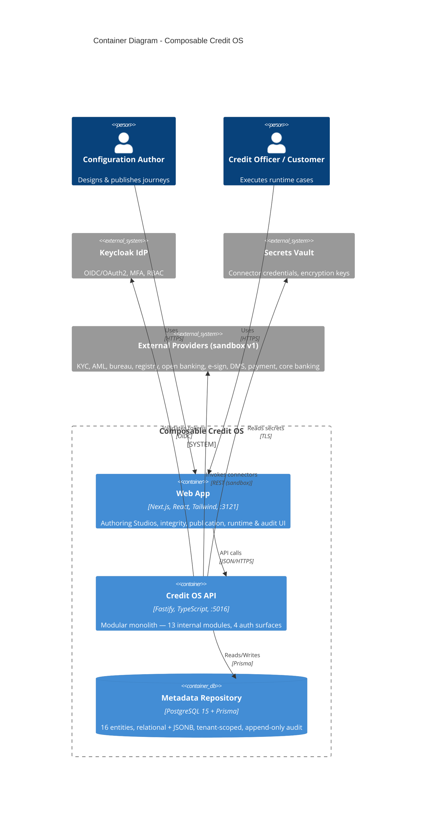
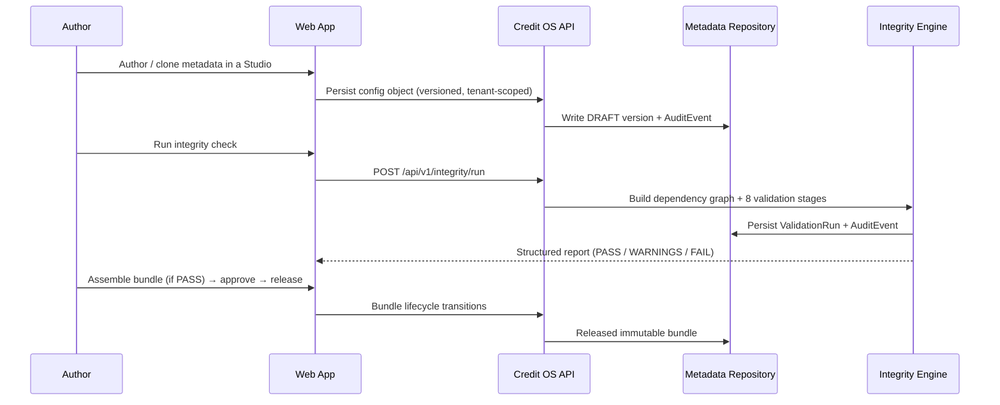
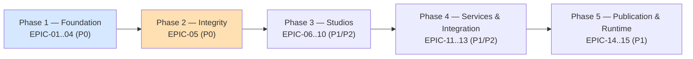

# Implementation Plan: Composable Credit OS — Full Platform

**Product**: Composable Credit OS (`credit-os`)
**Branch**: `feature/credit-os/platform`
**Created**: 2026-05-17
**Spec**: `products/credit-os/docs/specs/spec.md`
**Architecture**: `products/credit-os/docs/ARCHITECTURE.md`
**ADRs**: `products/credit-os/docs/ADRs/ADR-001..006`

## Summary

Composable Credit OS is a metadata-driven credit operating system for corporate financing. It replaces hardcoded, duplicated credit-origination logic (BRD-03) with a single governed platform on which business teams configure and publish complete financing journeys without writing code (BRD-01, BRD-04). The platform's defining feature is a publication-gating **Integrity Engine** over a unified metadata graph: no inconsistent journey can be published (BR-07).

This plan translates the spec's 15 epics / 57 user stories / 52 FRs into a **phased implementation plan aligned to the LLD build order** (LLD-63..66): (1) Metadata Repository foundation, (2) Integrity Engine, (3) Authoring Studios, (4) Services & Integration, (5) Publication & Runtime. Each phase maps to epics and user stories and ends at an Orchestrator checkpoint. Phases 1 and 2 are detailed enough to generate tasks from immediately.

The architecture is a **modular monolith** (ADR-001): one Fastify API + one Next.js web app, 13 strictly bounded internal modules. Single-tenant, multi-tenant-ready (ADR-004). Rule engine `json-rules-engine` behind a RuleSet metadata layer (ADR-002). Relational + JSONB metadata storage (ADR-003). Generic connector framework with sandbox providers (ADR-005). Governed `/api/v1` REST APIs across four channel auth surfaces (ADR-006).

## Technical Context

- **Language/Version**: TypeScript 5+ / Node.js 20+ (strict mode, Article IV)
- **Backend**: Fastify + Prisma + PostgreSQL 15 — modular monolith, port 5016
- **Frontend**: Next.js (App Router) + React + Tailwind CSS — port 3121
- **Testing**: Vitest (unit/integration, real dependencies — no mocks, Article III) + Playwright (E2E)
- **Primary Dependencies**: `json-rules-engine` (rule evaluation, ADR-002); `@fastify/swagger` (OpenAPI generation); `keycloak` OIDC client; `zod` (runtime validation); `dependency-cruiser` (module-boundary enforcement, dev); `@connectsw/auth`, `@connectsw/shared`, `@connectsw/observability` (shared packages)
- **Target Platform**: Web (all four channels web-based for v1)
- **Assigned Ports**: Frontend 3121 / Backend 5016 (addendum, PORT-REGISTRY)

## Architecture *(C4 diagrams — full set in ARCHITECTURE.md)*

### Container Diagram (C4 Level 2)



### Component Diagram (C4 Level 3)

The 13-module internal structure is in `ARCHITECTURE.md §3.2`. Summary: 4 auth surfaces → 13 modules (`product`, `policy`, `data-dictionary`, `workflow`, `form`, `document`, `credit-services`, `integration`, `integrity`, `publication`, `runtime`, `audit`, `notification`) → shared kernel (versioning base repository, tenant context, module contracts, event bus) → PostgreSQL. Boundary rules in `ARCHITECTURE.md §3.4` / ADR-001.

### Data Flow

The mandatory multi-step sequence diagrams are in `ARCHITECTURE.md`: connector call-flow (§6.2), runtime case execution (§6.3). Representative flow — author-to-publish:



### Integration Points

| System | Direction | Protocol | Data Exchanged | Auth Method |
|--------|-----------|----------|---------------|-------------|
| Keycloak IdP | Outbound | OIDC / OAuth2 | Token validation, MFA, client-credentials | OIDC discovery |
| Secrets Vault | Outbound | HTTPS/TLS | Connector credentials, encryption keys | Vault token / mTLS |
| External Providers (sandbox v1) | Outbound | REST | Connector request/response payloads | Per-connector `authRef` (sandbox) |
| Consuming Systems | Inbound | REST `/api/v1` | Reusable credit services & APIs | OAuth2 client-credentials + API key |
| Web App | Inbound | REST `/api/v1` | All authoring/runtime/audit operations | OIDC bearer token |

### Security Considerations *(mandatory)*

- **Authentication**: Keycloak OIDC/OAuth2; four channel auth surfaces (internal web + MFA, branch + MFA, partner client-credentials + API key, hardened customer self-service). See ADR-006, ARCHITECTURE.md §10.
- **Authorization**: RBAC on every route; domain ownership model (BRD-29); object-level (BOLA) re-checks of tenant + ownership; function-level (BFLA) permission per route, documented in the OpenAPI security scheme.
- **Data Protection**: TLS in transit; encryption at rest; mTLS for connector calls where applicable; connector secrets in a vault referenced by `authRef`, never plaintext, never API-returned; append-only audit (DB grants revoke update/delete).
- **Input Validation**: Zod schemas at every API boundary; failure → 400 RFC 7807 `problem+json`.
- **Rate Limiting**: strict per-IP/per-account on the customer self-service surface and on all auth endpoints; mandatory bounded pagination on all list endpoints.

### Error Handling Strategy *(mandatory)*

| Error Category | Example | Detection | Recovery | User Experience |
|---------------|---------|-----------|----------|----------------|
| Validation | Invalid metadata object | Zod schema check | Return 400 problem+json with field detail | Inline form field errors |
| Concurrency | Concurrent edit of same version | `revision` mismatch on update | Return 409 problem+json | "This object changed — reload" |
| Auth | Expired/invalid OIDC token | Auth-surface plugin | Redirect to Keycloak login | "Session expired" |
| Authorization | Action not permitted for role | RBAC preHandler | Return 403 problem+json + audit | "You do not have permission" |
| Integrity FAIL | CRITICAL defect in config | Integrity Engine stage | Block publication (no override) | Defect report on `/integrity/[runId]` |
| Connector failure | Sandbox/provider timeout | Framework timeout + circuit breaker | Apply configured fallback path | Runtime case continues via fallback |
| Database | Connection lost | Health check / Prisma error | Reconnect pool; 503 on `/health/ready` | 503 page with retry |

## Constitution Check

**Gate: Before Phase 0**

| Article | Requirement | Status |
|---------|------------|--------|
| I. Spec-First | Specification exists and is approved (`docs/specs/spec.md`, 0 `[NEEDS CLARIFICATION]`) | PASS |
| II. Component Reuse | COMPONENT-REGISTRY.md checked — see Implementation Audit + Component Reuse Plan | PASS |
| III. TDD | Test plan defined per phase; Vitest + Playwright, real dependencies, no mocks | PASS |
| IV. TypeScript | TypeScript 5+ strict, Zod runtime validation | PASS |
| V. Default Stack | Fastify + Prisma + PostgreSQL + Next.js + Tailwind — matches default; modular-monolith deviation recorded in ADR-001 | PASS |
| VII. Port Registry | Ports 3121 / 5016 assigned (addendum, PORT-REGISTRY) | PASS |
| IX. Diagram-First | C4 Context/Container/Component, ER, sequences, state, flowcharts present in ARCHITECTURE.md | PASS |

**All gates PASS.** No `[NEEDS CLARIFICATION]` markers remain. Proceed.

## Implementation Audit *(mandatory — Verification-Before-Planning Protocol)*

**Gate: Before Phase 0.** Greenfield product — no existing `credit-os` code. Verification scope is therefore: confirm there is no `credit-os` implementation, and verify which capabilities are satisfied by reusable shared packages (`packages/`). **Verification method**: file-system scan of `products/credit-os/` (no `apps/` exists) + inspection of `packages/auth`, `packages/shared`, `packages/observability`, `packages/audit`, `packages/ui` against `.claude/COMPONENT-REGISTRY.md`.

| # | Capability | Spec Req | Status | Evidence | Action |
|---|-----------|----------|--------|----------|--------|
| 1 | Credit OS application (api/web) | All FR | NOT_IMPLEMENTED | `products/credit-os/` has only `docs/` + `.claude/` — no `apps/` | INCLUDE (all) |
| 2 | Authentication / OIDC / sessions / RBAC scaffold | FR-011, FR-012 | PARTIALLY_IMPLEMENTED | `@connectsw/auth` provides JWT auth plugin, routes, RBAC guard, `useAuth`, `ProtectedRoute` | INCLUDE (gaps only — Keycloak OIDC + MFA + 4 surfaces extend it) |
| 3 | Structured logging w/ PII redaction | NFR-005 | FULLY_IMPLEMENTED | `@connectsw/shared/utils/logger` | EXCLUDE — import as-is |
| 4 | Crypto utils (hash/HMAC/signatures) | FR-014 | FULLY_IMPLEMENTED | `@connectsw/shared/utils/crypto` | EXCLUDE — import as-is |
| 5 | Prisma client lifecycle plugin | FR-001 | FULLY_IMPLEMENTED | `@connectsw/shared/plugins/prisma` | EXCLUDE — import as-is |
| 6 | Observability (correlation, health, metrics) | NFR-005 | FULLY_IMPLEMENTED | `@connectsw/observability` — `observabilityPlugin`, `healthPlugin`, `metricsPlugin`, `correlationPlugin` | EXCLUDE — import as-is |
| 7 | Audit log primitive | FR-009 | PARTIALLY_IMPLEMENTED | `@connectsw/audit` `AuditLogService` + `createAuditHook` + `AuditLog` model | INCLUDE (gaps only — extend to richer ENT-16 `AuditEvent` w/ before/after + objectRef; reuse hook + service patterns) |
| 8 | Shared UI primitives (Button, Input, Card, DataTable, layout) | NFR-008 | FULLY_IMPLEMENTED | `@connectsw/ui` components, layout, hooks | EXCLUDE — import; Studio UIs compose them |
| 9 | RFC 7807 typed error class | FR-042 | FULLY_IMPLEMENTED | `AppError` in `@connectsw/auth` | EXCLUDE — import as-is |
| 10 | Metadata repository + uniform versioning | FR-001..004 | NOT_IMPLEMENTED | No equivalent in `packages/` | INCLUDE |
| 11 | Data Dictionary + duplicate detection | FR-005..008 | NOT_IMPLEMENTED | No equivalent | INCLUDE |
| 12 | Integrity Engine (dependency graph + 8 stages) | FR-015..020 | NOT_IMPLEMENTED | No equivalent | INCLUDE |
| 13 | RuleSet metadata layer over json-rules-engine | FR-023..026 | NOT_IMPLEMENTED | No equivalent; json-rules-engine is a 3rd-party lib | INCLUDE |
| 14 | Product / Workflow / Form / Document Studios | FR-021..034 | NOT_IMPLEMENTED | No equivalent | INCLUDE |
| 15 | Connector framework + sandbox providers | FR-037..040 | NOT_IMPLEMENTED | No equivalent | INCLUDE |
| 16 | Credit service library (8 services) | FR-035, FR-036 | NOT_IMPLEMENTED | No equivalent | INCLUDE |
| 17 | Publication bundle lifecycle | FR-043..046 | NOT_IMPLEMENTED | No equivalent | INCLUDE |
| 18 | Runtime orchestrator | FR-047..051 | NOT_IMPLEMENTED | No equivalent | INCLUDE |

**Verified scope**: 13 of 18 capabilities proceed as new work; 5 are excluded (satisfied by shared packages); 2 are reduced to gaps only (auth, audit).
- **Excluded** (already implemented): logger, crypto, Prisma plugin, observability, shared UI, `AppError`.
- **Included** (new work): the Credit OS app and all 13 modules' domain logic.
- **Reduced scope** (gaps only): authentication (Keycloak OIDC + MFA + 4 surfaces extend `@connectsw/auth`); audit (extend `@connectsw/audit` to the ENT-16 `AuditEvent` model).

## Component Reuse Plan

| Need | Existing Component | Source | Action |
|------|-------------------|--------|--------|
| Auth plugin, RBAC guard, login/session | `@connectsw/auth` (backend + frontend) | `packages/auth` | Import & extend — add Keycloak OIDC, MFA, 4 channel surfaces |
| Structured logging | `@connectsw/shared/utils/logger` | `packages/shared` | Import from `@connectsw/shared` |
| Crypto (hash/HMAC/signatures) | `@connectsw/shared/utils/crypto` | `packages/shared` | Import from `@connectsw/shared` |
| Prisma client lifecycle | `@connectsw/shared/plugins/prisma` | `packages/shared` | Import from `@connectsw/shared` |
| Correlation, health, metrics | `@connectsw/observability` | `packages/observability` | Import — `observabilityPlugin`, `healthPlugin`, `metricsPlugin` |
| Audit hook + service pattern | `@connectsw/audit` | `packages/audit` | Copy & adapt — extend `AuditLog` → ENT-16 `AuditEvent` |
| RFC 7807 error class | `AppError` (`@connectsw/auth`) | `packages/auth` | Import from `@connectsw/auth` |
| UI primitives + layout | `@connectsw/ui` | `packages/ui` | Import — Studios compose Button/Input/Card/DataTable/DashboardLayout |
| Rule evaluation | `json-rules-engine` | npm (MIT) | Add dependency — wrap behind RuleSet metadata layer (ADR-002) |
| Integrity / dependency-graph engine | None found | — | Build new — credit-OS-specific (add to registry on completion) |
| Connector framework | None found | — | Build new — generic framework (add to registry on completion) |
| RuleSet metadata layer, dynamic Form renderer, runtime orchestrator | None found | — | Build new — credit-OS-specific (add to registry on completion) |
| Module-boundary enforcement | `dependency-cruiser` | npm | Add dev dependency — CI rule per ADR-001 |

New reusable assets created by this product (add to COMPONENT-REGISTRY.md on completion): Integrity Engine / dependency-graph framework, generic connector framework, RuleSet metadata layer, dynamic Form renderer, versioning base repository.

## Project Structure

```
products/credit-os/
├── apps/
│   ├── api/                              # Fastify modular monolith, :5016
│   │   ├── src/
│   │   │   ├── plugins/                  # auth surfaces, tenant, observability, swagger
│   │   │   ├── kernel/                   # versioning base repo, tenant context, module contracts, event bus
│   │   │   ├── modules/
│   │   │   │   ├── data-dictionary/      # routes/ services/ repository/ contract.ts index.ts
│   │   │   │   ├── audit/
│   │   │   │   ├── product/
│   │   │   │   ├── policy/               # + ruleset-compiler (json-rules-engine wrapper)
│   │   │   │   ├── workflow/
│   │   │   │   ├── form/
│   │   │   │   ├── document/
│   │   │   │   ├── integrity/            # graph builder + 8 validation stages
│   │   │   │   ├── credit-services/
│   │   │   │   ├── integration/          # connector framework + sandbox providers
│   │   │   │   ├── publication/
│   │   │   │   ├── runtime/
│   │   │   │   └── notification/
│   │   │   └── server.ts
│   │   ├── tests/{unit,integration}/
│   │   └── prisma/schema.prisma
│   └── web/                              # Next.js App Router, :3121
│       ├── src/{app,components,hooks,lib}/
│       └── tests/
├── e2e/                                  # Playwright
└── docs/
    ├── specs/spec.md  PRD.md  ARCHITECTURE.md  plan.md
    ├── data-model.md                     # Phase 1 deliverable
    ├── research.md                       # Phase 0 deliverable
    ├── ADRs/ADR-001..006
    └── contracts/                        # OpenAPI per module group
```

## Phase 0: Research

- [x] json-rules-engine precedence/exception capability — completed in ADR-002 spike (ASM-01/RSK-06 closed)
- [x] Modular-monolith vs microservices — decided in ADR-001
- [x] Metadata storage model — decided in ADR-003
- [x] Tenant model — decided in ADR-004
- [x] Connector strategy — decided in ADR-005
- [x] API governance + channel auth surfaces — decided in ADR-006
- [ ] Keycloak self-hosted setup — confirm OIDC discovery URL, realm, client config, MFA policy; document in `docs/research.md`
- [ ] `dependency-cruiser` rule set for the 13-module boundary graph — draft rules; document in `docs/research.md`
- [ ] Sandbox payload catalogue — define realistic stub responses per `capabilityType`; document in `docs/research.md`

All technical unknowns flagged by the BA (ASM-01, RSK-06, RSK-05) are resolved via ADRs. Remaining Phase 0 items are setup details, not design unknowns — they do not block Phase 1.

## Phase 1: Design & Contracts

- [ ] `docs/data-model.md` — full Prisma schema for all 16 entities + `ConnectorInvocation` + `VersionHistory` + idempotency-key table; ER diagram; index plan; versioning + immutability constraints
- [ ] `docs/contracts/` — OpenAPI 3.1 fragments per module group (Product, Data, Rule, Workflow, Form, Document, Connector, Integrity/Publication, Runtime), covering all 30 APIs
- [ ] Verify contracts satisfy every FR-001..052
- [ ] Re-run Constitution Check post-Phase 1

---

## Phased Implementation Plan (LLD build order)



Each phase ends at an Orchestrator checkpoint after the Testing Gate passes. Phases 1–2 are detailed below to task-generation depth; Phases 3–5 give the technical approach and dependencies.

---

### PHASE 1 — Foundation: Metadata Repository (LLD-63) — P0

**Epics**: EPIC-01 Metadata Repository & Versioning · EPIC-02 Data Dictionary · EPIC-03 Audit · EPIC-04 Security & Ownership.
**User stories**: US-01..14. **FRs**: FR-001..014, FR-052.
**Goal**: a versioned, tenant-scoped, audited, secured metadata repository — the substrate every later module depends on.

#### Technical approach

1. **Scaffold the modular monolith** — Fastify app (`apps/api`, :5016), Next.js app (`apps/web`, :3121), one Prisma schema, the `kernel/` directory (versioning base repository, tenant context, module-contract types, in-process event bus). Register `dependency-cruiser` with the ADR-001 boundary rules in CI from commit one.
2. **Shared kernel — versioning base repository (ADR-003)** — generic create / read / list / update / delete enforcing: `tenantId` scoping on every query (ADR-004), `revision` optimistic concurrency, integer `version` bump, and rejection of update/delete on `PUBLISHED` rows. This is the single place BR-01 and BR-08 are enforced; it gets the heaviest unit-test coverage (TDD).
3. **`data-dictionary` module** — `DataElement` entity; create with definition/type/format/owner/lifecycle (US-05); duplicate/conflict detection on create — name match + definition similarity + type-conflict (US-06); search (US-07, API-08); lifecycle gating — `DEPRECATED` warns on new binding, `RETIRED` blocks (US-08). APIs API-06..08.
4. **`audit` module (cross-cutting, built early — RSK-08)** — extend `@connectsw/audit` to the ENT-16 `AuditEvent` model (actor, action, objectRef, before/after, correlationId). Wire an onResponse hook + domain-event subscriptions so every create/update/publish/approve/release/rollback writes an event (US-09); append-only enforced by DB grant. Query API by object/actor/action/time (US-10).
5. **`notification` module skeleton** — event-bus subscriber stub; alert records; full behavior arrives with later phases.
6. **`auth` surfaces (EPIC-04)** — extend `@connectsw/auth`: Keycloak OIDC integration, MFA enforcement (US-12), the four channel auth-surface plugin scopes (ADR-006), RBAC permission gating on every route (US-11), the domain ownership model — owner/approver/consumer per domain (US-13), and vault-backed secrets handling — `authRef` references, never plaintext (US-14).
7. **Web foundation** — Next.js app shell using `@connectsw/ui` `DashboardLayout`; Keycloak login redirect (`/login`); the Phase 1 routes: `/` dashboard, `/data-dictionary` + `/data-dictionary/[id]`, `/audit`, `/admin/roles`, `/settings`.

#### Build order within Phase 1

`kernel` → `audit` + `data-dictionary` (leaf modules) → `auth` surfaces → web foundation. Audit before the authoring modules so no events are missed (RSK-08).

#### Phase 1 test plan (TDD, Article III)

- Unit: versioning base repository (version bump, immutability rejection, `revision` 409, tenant scoping) — the highest-coverage target; duplicate-detection algorithm; lifecycle-gating logic.
- Integration: `DataElement` CRUD against a real PostgreSQL; AuditEvent written on every material action; RBAC 403 on unauthorized action; concurrent-edit → 409.
- E2E: create a Data Element, see it in `/data-dictionary`, edit it, view version history, see the AuditEvent in `/audit`.

#### Phase 1 exit criteria (checkpoint)

A metadata object can be created, versioned, viewed in history, and is immutable once published; the Data Dictionary detects duplicates and gates lifecycle; every action is audited and queryable; RBAC + MFA + tenant scoping enforced. Testing Gate PASS.

#### Phase 1 dependencies

None external beyond Keycloak being reachable and a secrets vault being available. Blocks every later phase.

---

### PHASE 2 — Integrity Engine (LLD-64) — P0 — highest-risk (RSK-01, score 9)

**Epic**: EPIC-05 Integrity Engine. **User stories**: US-15..20. **FRs**: FR-015..020.
**Goal**: a dependency-graph-based engine that validates cross-object integrity and blocks publication of inconsistent configuration.

#### Technical approach

1. **`integrity` module scaffold** — read-only over the authoring modules (ADR-001 boundary rule 4); `ValidationRun` entity; APIs API-22 (run), API-23 (get report).
2. **Dependency-graph builder (LLD-27, US-15)** — given a scope (a ProductVersion or a draft change set), resolve the transitive closure of references in a single consistent DB read and build an in-memory directed graph: nodes = config objects, edges = the 11 FRD-21 relationship types. Edge construction uses indexed FK reads (ADR-003).
3. **The 8 validation stages (LLD-28, US-16)** — implement each stage as a separate, independently testable validator over the graph, run in fixed order: Schema → Referential integrity → Business consistency → Dependency completeness → Version compatibility → Connector readiness → Channel compatibility → Release readiness. Each emits classified defects (`CRITICAL`/`WARNING`/`INFO`). **Build the FRD-21 validation matrix (ARCHITECTURE.md §5.3) as the explicit test specification** — each of the 11 relationships gets passing/broken/missing-edge tests; each FRD-23 blocking condition gets a test (RSK-01 mitigation).
4. **Classification & blocking (US-17, US-18, US-20)** — aggregate defects to `PASS` / `PASS_WITH_WARNINGS` / `FAIL`; any CRITICAL → FAIL; FAIL has no override path (BR-07); WARNING requires explicit recorded approval (BR-09).
5. **Persistence & reporting (US-19)** — every run persists a `ValidationRun` (result + classified defects) and an AuditEvent; API-23 returns a structured report; failures emit a `notification` alert.
6. **Web** — `/integrity` (runs list, on-demand trigger) and `/integrity/[runId]` (defect report).

#### Build order within Phase 2

graph builder → stages 1–2 (schema, referential — the structural foundation) → stages 3–8 incrementally, each TDD'd against the FRD-21 matrix → classification/blocking → persistence/reporting → web. Incremental delivery of stages is the RSK-01 mitigation — each stage ships tested before the next.

#### Phase 2 test plan (TDD, Article III)

- Unit: graph builder (correct nodes/edges for a known config fixture); each of the 8 stages in isolation; the classifier (CRITICAL → FAIL, WARNING-only → PASS_WITH_WARNINGS, none → PASS).
- Integration: a configured product with linked rules/forms/workflow/documents/connectors produces a full graph; each FRD-23 blocking condition produces a FAIL; a clean config produces PASS.
- E2E: trigger a run on `/integrity`, see PASS; introduce an unmapped mandatory field, re-run, see FAIL with the defect on `/integrity/[runId]`; confirm publication is blocked.

#### Phase 2 exit criteria (checkpoint)

The engine builds a complete dependency graph; validates all 11 FRD-21 relationships across 8 stages; classifies PASS/WARNING/FAIL; a CRITICAL defect blocks publication with no override; every run is persisted and audited. Testing Gate PASS.

#### Phase 2 dependencies

Depends on Phase 1 (repository, audit, versioning). Note: Phase 2 validates configuration objects (rules, forms, workflows, connectors) that are *authored* in Phases 3–4 — for Phase 2 the engine is built and tested against **fixture configuration objects** seeded directly into the repository; the Studios that author them arrive in Phase 3. This ordering follows LLD-64 (integrity engine second) and is the BA's explicit RSK-01 mitigation.

---

### PHASE 3 — Authoring Studios (LLD-65) — P1 (EPIC-10 P2)

**Epics**: EPIC-06 Product · EPIC-07 Policy · EPIC-08 Workflow · EPIC-09 Form · EPIC-10 Document.
**User stories**: US-21..39. **FRs**: FR-021..034.

#### Technical approach

- **`product`** — `Product`/`ProductVersion` split; create/clone/version/retire (US-21..23); template inheritance via `baseTemplateId` resolution (US-24). APIs API-01..05.
- **`policy`** — RuleSet entity + the **RuleSet metadata layer** wrapping `json-rules-engine` (ADR-002): condition-group authoring (US-25), the RuleSet→engine compiler, simulation (US-26, API-10), reuse (US-27), dictionary validation (US-28, API-11). APIs API-09..11.
- **`workflow`** — WorkflowDefinition/Stage/Transition; stage & transition design, approvals/SLAs/exception paths, parallel/sequential steps (US-29..31); transition-validity check (US-32, mirrors Integrity Stage 3). APIs API-12..14.
- **`form`** — FormDefinition/Section/Field; dynamic form builder; every Field maps to a Data Element (US-34, BR-03, DB NOT NULL); conditional behaviour (US-35); the **dynamic Form renderer** for channel/product/stage preview (US-36, API-16). APIs API-15..16.
- **`document`** — DocumentRequirement typed; linking to products/stages/rules (US-37, US-38); missing-doc flagging (US-39). APIs API-17..18.
- **Web** — Studios for each: `/products`, `/policies`, `/workflows`, `/forms`, `/documents` + detail routes.

#### Dependencies & order

Depends on Phases 1–2. Build order: `product` → `policy` (json-rules-engine integration is the critical-path item per ADR-002) → `workflow` → `form` → `document`. Each Studio's authored objects become real inputs the Integrity Engine validates (replacing Phase 2 fixtures).

---

### PHASE 4 — Services & Integration (LLD-65) — P2 (EPIC-13 P1)

**Epics**: EPIC-11 Credit Services · EPIC-12 Connectors · EPIC-13 API Governance.
**User stories**: US-40..47. **FRs**: FR-035..042.

#### Technical approach

- **`credit-services`** — 8 stateless, versioned, discoverable services (decisioning, pricing, limit, collateral, covenant, exception, servicing, renewal) — US-40, US-41.
- **`integration`** — the **generic connector framework** (ADR-005): Connector entity, `ConnectorProvider` strategy with `SandboxConnectorProvider`, four interaction patterns, correlation id + persisted `ConnectorInvocation` + fallback — US-42..45. APIs API-19..21.
- **API governance (EPIC-13)** — finalize the ADR-006 standard across all 30 APIs: OpenAPI 3.1 generation, idempotency-key handling, RFC 7807 errors, versioning — US-46, US-47.
- **Web** — `/connectors`, `/connectors/[id]`, `/services` (real skeletons with empty states).

#### Dependencies & order

Depends on Phases 1–3. The connector framework is consumed by Phase 5 runtime; API governance is cross-cutting and should be retro-applied to Phases 1–3 endpoints.

---

### PHASE 5 — Publication & Runtime (LLD-66) — P1

**Epics**: EPIC-14 Publication · EPIC-15 Runtime.
**User stories**: US-48..57. **FRs**: FR-043..051.

#### Technical approach

- **`publication`** — PublicationBundle assembly with dependency pinning (US-48, LLD-25); the lifecycle state machine (ARCHITECTURE.md §7) — Draft→Validated→Approved→Released→RolledBack; approver sign-off (US-49, BR-02); release (US-50); rollback (US-51, NFR-009). APIs API-24..27.
- **`runtime`** — RuntimeCase creation from released bundles only (US-52, US-56, BR-08); per-stage form rendering (US-53); routing by policy + connector responses with fallback/exception (US-54); missing-document gating (US-55); full audit of every action (US-57). APIs API-28..30.
- **Web** — `/publication`, `/publication/[bundleId]`, `/runtime/cases`, `/runtime/cases/[caseId]`.

#### Dependencies & order

Depends on all prior phases (publication gates on integrity; runtime loads bundles and calls policy/form/integration/workflow/document at runtime). Build `publication` → `runtime`. At Phase 5 exit the platform value proposition is fully demonstrable (SC-007): publish a product with zero code, execute a runtime case end-to-end with a complete audit trail.

---

## Cross-Phase Concerns

| Concern | Approach |
|---------|----------|
| Module boundaries | `dependency-cruiser` CI rule from Phase 1; one directory per module; published contracts only (ADR-001) |
| Versioning | One shared kernel base repository enforces BR-01/BR-08 for every entity (ADR-003) |
| Audit | `audit` module built in Phase 1; onResponse hook + domain events so no later module misses events (RSK-08) |
| Tenant scoping | Base repository forces `WHERE tenantId` on every query (ADR-004) |
| API governance | ADR-006 standard applied as endpoints are built; finalized + retro-applied in Phase 4 |
| Testing | TDD per phase; Vitest + Playwright, real dependencies, no mocks; Testing Gate per phase checkpoint |

## Complexity Tracking

| Decision | Violation of Simplicity? | Justification | Simpler Alternative Rejected |
|----------|------------------------|---------------|------------------------------|
| Modular monolith with 13 enforced modules | No (simpler than the LLD's 13 microservices) | Honors LLD service decomposition logically; the Integrity Engine builds its graph in-process — no distributed aggregation (ADR-001) | Literal 13-microservice topology (LLD-16) — rejected: disproportionate operational cost, distributed graph in the riskiest component |
| RuleSet metadata layer over json-rules-engine | Slight (a wrapping layer) | Keeps governed rule semantics ConnectSW-owned and the library swappable; precedence/exception live in our domain (ADR-002) | Use json-rules-engine config directly — rejected: leaks 3rd-party shape into the governed model |
| `tenantId` on all entities for a single-tenant v1 | Slight (unused cross-tenant capability) | Cheap insurance vs. a 16-table schema+query rewrite later; CEO-locked (ADR-004) | Pure single-tenant — rejected: expensive future rewrite |
| Four channel auth surfaces | Slight (4 plugin scopes vs 1) | The four channels' trust levels genuinely differ; a hostile customer surface must be isolated from authoring (ADR-006) | One undifferentiated auth surface — rejected: unacceptable security posture |
| Relational + JSONB hybrid storage | No | Config shape evolves without migration; references stay FK-constrained for the Integrity Engine (ADR-003) | Fully relational (rigid) or fully document (no referential integrity) — both rejected |

## Next Step

`/speckit.tasks` — generate the dependency-ordered task list. Phases 1 and 2 are detailed to task-generation depth above. Then `/speckit.analyze` as the Spec Consistency Gate before the Architecture checkpoint.
