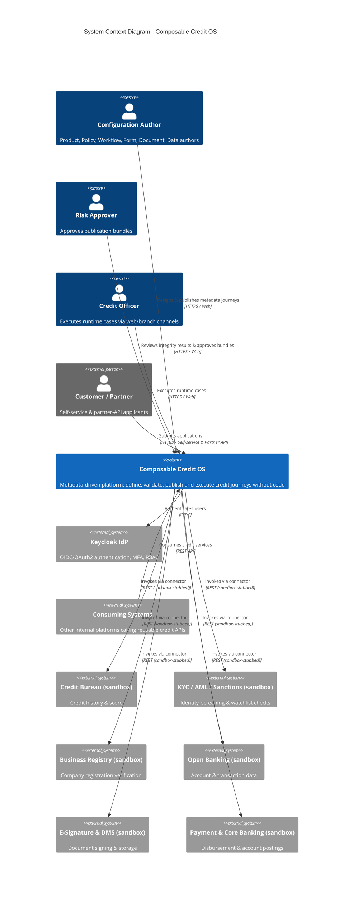
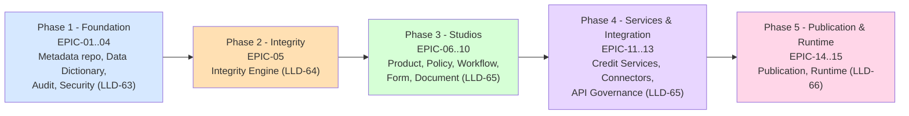
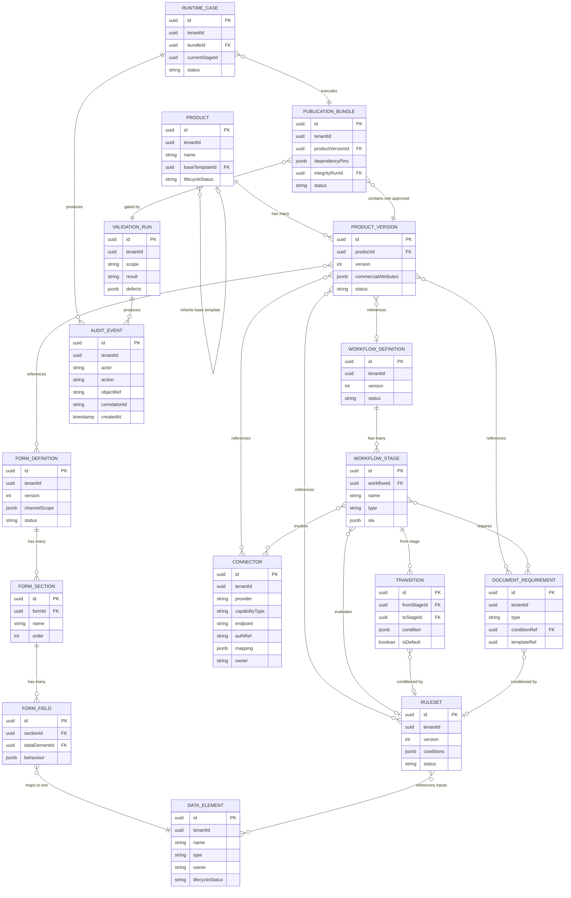

# Feature Specification: Composable Credit OS — Full Platform

**Product**: Composable Credit OS (`credit-os`)
**Feature Branch**: `feature/credit-os/platform`
**Created**: 2026-05-17
**Status**: Draft
**Input**: CEO brief `notes/ceo/credit-os-brief.md` (BRD-01..52, FRD-01..31, LLD-01..72, ENT-01..16, API-01..30) + Business Analysis `products/credit-os/docs/business-analysis.md` (BN-01..16, EPIC-01..15, US-01..57).

> This specification covers the **full product** — a metadata-driven Credit Operating System for corporate financing. It describes WHAT the platform does and WHY, organised as 15 epics and 57 user stories across 5 delivery phases. Technology choices (Fastify, Next.js, Prisma, json-rules-engine, Keycloak) are recorded in the addendum and ADRs and are out of scope for this document; they belong to `/speckit.plan`.

---

## Business Context *(mandatory)*

### Problem Statement

Corporate-financing product, policy, workflow, form, document, and integration logic is **hardcoded and duplicated across multiple applications** (BRD-03). Because credit logic is embedded in application code:

- Product rules are duplicated and drift out of sync across systems (BRD-03.01).
- Every eligibility or product change requires a code deployment (BRD-03.02) — a development project, not a configuration change.
- Forms and workflow steps cannot be reused (BRD-03.03).
- External integrations are bespoke and not reusable (BRD-03.04).
- Integrity errors are detected late, in test or production (BRD-03.05).

**Who experiences it**: Product, Strategy, Operations Excellence, Risk & Compliance, and Data Governance teams (BRD-20..24) who must wait on Engineering (BRD-25) for every change; QA (BRD-26) who discover integrity defects late; Channel and Integration owners (BRD-27..28) who cannot reuse capabilities.

**Impact of not solving it**: lost time-to-market, recurring defect remediation, audit exposure from inconsistent decisions, and engineering capacity consumed by configuration work that business users should own.

**Target state** (BRD-04): a central operating platform that governs business metadata and executes published credit journeys dynamically — **configuration over code** — so business teams design and execute financing journeys without code changes (BRD-01).

### Target Users

| Persona | Role | Pain Point | Expected Outcome |
|---------|------|-----------|-----------------|
| **Product Author** (Priya) | Product team member (BRD-20) | Launching/amending a financing product is a software release; product rules duplicated across systems | Creates, clones, versions, and inherits products without code; reuses governed artifacts |
| **Policy Author** (Sam) | Strategy / Risk policy team (BRD-21, BRD-23) | Eligibility changes require code deploys; rules re-implemented inconsistently | Authors and simulates eligibility/decisioning rules; reuses rules across products and stages |
| **Workflow Designer** (Omar) | Operations Excellence (BRD-22) | Hardcoded process steps; no reuse of workflow artifacts | Designs workflows with stages, transitions, approvals, SLAs, exception/rework paths |
| **Data Steward** (Dana) | Data Governance (BRD-24) | Fields defined ad hoc per app; no canonical definitions | Maintains a governed data dictionary with duplicate detection and lifecycle ownership |
| **Risk Approver** (Rana) | Risk & Compliance lead (BRD-23) | Integrity defects reach production; partial audit trail | Approves publication bundles after a guaranteed integrity check; full auditability |
| **Integration Owner** (Iyad) | External Integration owner (BRD-28) | Connectors are bespoke and non-reusable | Configures reusable connectors with auth/mapping/retry/timeout/owner |
| **Credit Officer** (Carla) | Runtime case operator (channel staff) | Inconsistent forms; unclear routing; hidden document needs | Executes live cases against published journeys with correct forms and visible document requirements |
| **Consuming System** | Other internal platforms (BRD-15) | Cannot reuse credit capabilities locked inside one application | Calls stable, versioned, discoverable APIs and reusable credit services |
| **Auditor** (Adel) | Risk & Compliance / audit | Audit coverage partial and inconsistent | Queries a complete audit trail of all configuration and runtime actions |
| **Platform Engineer** | Architecture & Engineering (BRD-25) | In the critical path of every business change | Operates and extends the platform; builds connectors; no longer per-change blocker |

### Business Value

- **Revenue Impact**: Faster product launches (KPI-01, BRD-47) shorten time-to-revenue for new financing products; reuse (KPI-03, BRD-49) lowers build cost per product.
- **User Retention**: Business teams gain self-service ownership of change, reducing dependence on Engineering release cadence and improving internal satisfaction.
- **Competitive Position**: The differentiator is a **publication-gating Integrity Engine over a unified metadata graph** — competitors (configurable LOS, decision engines, low-code BPM) let teams configure each domain independently and discover inconsistencies late. Credit OS makes "no inconsistent journey can be published" a structural guarantee.
- **Strategic Alignment**: Establishes a reusable, API-first credit-capability platform (BRD-15, FRD-06) that other ConnectSW systems can consume — a foundation, not a single application.

---

## System Context (C4 Level 1) *(mandatory)*

---

## Scope & Architecture Notes *(ConnectSW)*

- **Architecture**: Modular monolith — one Fastify API + one Next.js web app with strict internal module boundaries, one module per LLD service. This is a deliberate, locked CEO deviation from the literal 13-microservice decomposition in LLD-02/LLD-16; the Architect MUST record it in an ADR.
- **Tenant model**: Single-tenant, multi-tenant-ready — `tenantId` on all core entities; all queries tenant-scoped; one tenant per deployment for v1.
- **Channels (launch)**: web (internal users), branch/assisted, partner/API, customer self-service — all four. Forms render per channel (FRD-14.01).
- **Connectors (launch)**: a generic connector framework plus all 10 connector types implemented against **sandbox/stub providers** with realistic payloads. No real third-party credentials in v1.
- **Authentication**: Keycloak (self-hosted OIDC/OAuth2). Built against the OIDC standard.
- **Rule engine**: `json-rules-engine` wrapped behind the RuleSet metadata layer.

---

## Epic & Phase Map

The platform is delivered in 5 phases aligned to the LLD build order (LLD-63..66). Phase priority drives user-story priority.

| Phase | Epics | Priority Band |
|-------|-------|---------------|
| 1 — Foundation | EPIC-01 Metadata Repository, EPIC-02 Data Dictionary, EPIC-03 Audit, EPIC-04 Security & Ownership | P0 |
| 2 — Integrity | EPIC-05 Integrity Engine | P0 |
| 3 — Studios | EPIC-06 Product, EPIC-07 Policy, EPIC-08 Workflow, EPIC-09 Form, EPIC-10 Document | P1 (EPIC-10 P2) |
| 4 — Services & Integration | EPIC-11 Credit Services, EPIC-12 Connectors, EPIC-13 API Governance | P2 (EPIC-13 P1) |
| 5 — Publication & Runtime | EPIC-14 Publication, EPIC-15 Runtime | P1 |

---

## User Scenarios & Testing *(mandatory)*

> Story priority: **P0** = foundational/blocking, **P1** = core value, **P2** = important, **P3** = later. Each story is independently testable. Acceptance criteria are Given/When/Then.

### PHASE 1 — FOUNDATION

### EPIC-01 — Metadata Repository & Versioning *(BN-01 · LLD-63)*

#### User Story US-01 — Create & store a metadata object (Priority: P0)

**As a** Configuration Author, **I want to** create and store a metadata object, **so that** it persists in the central governed repository and becomes the single source of truth.

The author opens the relevant Studio, creates an object (product, rule, form, etc.), and saves it. The object is persisted to the central metadata repository with a unique identifier, tenant scope, and an initial draft version.

**Why this priority**: Build-order item #1 (LLD-63); every other module depends on the repository existing.

**Independent Test**: Create one metadata object via the API/UI and confirm it is retrievable by id with `tenantId` set and `version = 1` in `DRAFT` lifecycle status.

**Acceptance Criteria**:
1. **Given** an authenticated author, **When** they create a metadata object, **Then** the object is persisted with a unique id, `tenantId`, `version = 1`, and `lifecycleStatus = DRAFT`.
2. **Given** a persisted object, **When** the author retrieves it by id, **Then** all stored attributes are returned unchanged.
3. **Given** a create request missing a mandatory attribute, **When** it is submitted, **Then** the system rejects it with a validation error and persists nothing.

#### User Story US-02 — Version every metadata object on change (Priority: P0)

**As a** Configuration Author, **I want to** have every change to a metadata object create a new version, **so that** history is preserved and no change is silently lost (BR-01, BRD-40, FRD-04).

**Why this priority**: Versioning is a core platform rule (BR-01) every entity depends on.

**Independent Test**: Edit an object twice; confirm three distinct versions exist with monotonically increasing version numbers.

**Acceptance Criteria**:
1. **Given** a metadata object at version N, **When** the author saves a change, **Then** a new version N+1 is created and the prior version remains intact.
2. **Given** a version history, **When** queried, **Then** each version records author, timestamp, and change summary.
3. **Given** two concurrent edits to the same version, **When** both are saved, **Then** the second is rejected with a conflict error (optimistic concurrency), not silently overwritten.

#### User Story US-03 — View version history (Priority: P0)

**As a** Configuration Author, **I want to** view the full version history of any metadata object, **so that** I can audit how it evolved and compare versions.

**Why this priority**: History visibility is required for governance and audit confidence.

**Independent Test**: Open the version history panel for an object with 3 versions; confirm all 3 are listed newest-first with metadata.

**Acceptance Criteria**:
1. **Given** an object with multiple versions, **When** the author opens version history, **Then** all versions are listed with version number, author, timestamp, and lifecycle status.
2. **Given** a selected historical version, **When** the author views it, **Then** the object's state at that version is shown read-only.

#### User Story US-04 — Published versions are immutable (Priority: P0)

**As a** Risk Approver, **I want to** have published metadata versions be immutable, **so that** runtime always executes exactly what was approved (BR-08).

**Why this priority**: Immutability of published versions is the integrity foundation for publication and runtime.

**Independent Test**: Publish a version, attempt an in-place edit, confirm rejection; confirm a new draft version can still be created.

**Acceptance Criteria**:
1. **Given** a metadata version in `PUBLISHED` status, **When** an author attempts to modify it in place, **Then** the system rejects the edit.
2. **Given** a published version, **When** the author wants to change it, **Then** the system creates a new `DRAFT` version derived from the published one.
3. **Given** a published version, **When** referenced by a publication bundle, **Then** its content is guaranteed unchanged for the life of the bundle.

---

### EPIC-02 — Data Dictionary Studio *(BN-02 · FRD-12)*

#### User Story US-05 — Create a canonical data element (Priority: P0)

**As a** Data Steward, **I want to** create a canonical data element with definition, type, format, owner, and lifecycle status, **so that** every product and screen reuses one governed definition (BRD-32.01).

**Why this priority**: Forms and rules cannot resolve inputs without governed data elements (BR-03, BR-04).

**Independent Test**: Create a data element with all five attributes; confirm it persists and is searchable.

**Acceptance Criteria**:
1. **Given** a Data Steward, **When** they create a data element with definition, type, format, owner, and lifecycle status, **Then** it persists as a canonical element.
2. **Given** a create request missing type or owner, **When** submitted, **Then** it is rejected with a validation error.
3. **Given** a persisted data element, **When** another author searches the dictionary, **Then** the element is discoverable by name and definition.

#### User Story US-06 — Detect duplicate / conflicting definitions (Priority: P0)

**As a** Data Steward, **I want to** be warned when a new data element duplicates or conflicts with an existing one, **so that** the dictionary stays canonical and non-redundant (FRD-12.01).

**Why this priority**: Duplicate detection is the mechanism that keeps the dictionary "governed" rather than ad hoc.

**Independent Test**: Attempt to create a data element with a name/definition matching an existing one; confirm a duplicate warning is raised.

**Acceptance Criteria**:
1. **Given** an existing data element, **When** a Steward creates one with a matching name or near-identical definition, **Then** the system flags a potential duplicate before saving.
2. **Given** a conflicting definition (same name, incompatible type), **When** submitted, **Then** the system flags a conflict and requires explicit resolution.
3. **Given** a flagged duplicate, **When** the Steward confirms it is intentional, **Then** creation proceeds with the override recorded.

#### User Story US-07 — Reuse a data element across products & screens (Priority: P0)

**As a** Form Author, **I want to** reuse an existing data element across multiple products and screens, **so that** definitions are consistent and not re-created (BRD-32.02).

**Why this priority**: Reuse is the dictionary's core value (KPI-03) and a prerequisite for form/rule integrity.

**Independent Test**: Reference one data element from two different forms; confirm both resolve to the same element id.

**Acceptance Criteria**:
1. **Given** a canonical data element, **When** an author binds a form field or rule input to it, **Then** the binding references the shared element id.
2. **Given** an element referenced by multiple objects, **When** queried, **Then** the system lists all referencing objects.

#### User Story US-08 — Manage data element lifecycle status (Priority: P0)

**As a** Data Steward, **I want to** manage the lifecycle status of a data element, **so that** deprecated elements are not used in new configuration (FRD-12.02).

**Why this priority**: Lifecycle control prevents stale definitions entering new journeys.

**Independent Test**: Set an element to `DEPRECATED`; attempt to bind a new form field to it; confirm a warning.

**Acceptance Criteria**:
1. **Given** a data element, **When** the Steward changes its lifecycle status, **Then** the change is versioned and audited.
2. **Given** a `DEPRECATED` element, **When** an author binds new configuration to it, **Then** the system warns and records the choice.
3. **Given** a `RETIRED` element, **When** an author attempts a new binding, **Then** the system blocks the binding.

---

### EPIC-03 — Audit Service (cross-cutting) *(BN-13 · LLD-14, LLD-19, FRD-31)*

#### User Story US-09 — Material changes write an AuditEvent (Priority: P0)

**As a** Risk & Compliance lead, **I want to** have every material configuration change write an AuditEvent, **so that** the platform has a complete, tamper-evident record (LLD-19, BRD-52).

**Why this priority**: Audit must be a Phase 1 cross-cutting concern; retrofitting misses events (RSK-08).

**Independent Test**: Create, edit, and publish an object; confirm three AuditEvents exist with actor, action, object, before/after, and timestamp.

**Acceptance Criteria**:
1. **Given** any create, update, publish, approve, release, or rollback action, **When** it completes, **Then** an AuditEvent is written with actor, action type, object reference, before/after state, correlation id, and timestamp.
2. **Given** an action that fails, **When** it is rejected, **Then** an AuditEvent records the attempt and the failure reason.
3. **Given** AuditEvents, **When** stored, **Then** they are append-only and cannot be edited or deleted through the application.

#### User Story US-10 — Query the audit trail (Priority: P0)

**As an** Auditor, **I want to** query the audit trail by object, actor, action type, and time range, **so that** I can investigate and demonstrate compliance.

**Why this priority**: Audit data has no value unless it is queryable for KPI-06.

**Independent Test**: Generate events, then query by object id and by actor; confirm filtered results.

**Acceptance Criteria**:
1. **Given** a populated audit trail, **When** the Auditor filters by object id, **Then** only events for that object are returned, newest-first.
2. **Given** a populated audit trail, **When** the Auditor filters by actor and time range, **Then** only matching events are returned.
3. **Given** a runtime case, **When** the Auditor queries its events, **Then** every decision and external call (with correlation id) is included.

---

### EPIC-04 — Platform Security & Ownership *(BN-16, BN-14 · FRD-28, LLD-59, BRD-29)*

#### User Story US-11 — RBAC restricts actions by role (Priority: P0)

**As a** Platform Engineer, **I want to** have actions restricted by role, **so that** only authorised users can author, approve, publish, or operate (FRD-28).

**Why this priority**: A credit platform cannot operate without access control; every other epic relies on it.

**Independent Test**: With an "author" role attempt an approve action; confirm 403; with an "approver" role confirm success.

**Acceptance Criteria**:
1. **Given** a user with a role lacking a permission, **When** they attempt the action, **Then** the system denies it with an authorisation error and audits the denial.
2. **Given** a user with the required role, **When** they attempt the action, **Then** it is permitted.
3. **Given** a role definition change, **When** applied, **Then** it takes effect for subsequent requests and is audited.

#### User Story US-12 — MFA enforced at login (Priority: P0)

**As a** Risk & Compliance lead, **I want to** have multi-factor authentication enforced at login, **so that** credential compromise alone cannot grant access (FRD-28, LLD-59).

**Why this priority**: MFA is a baseline control for a credit platform.

**Independent Test**: Authenticate via the IdP; confirm a second factor is required before a session is issued.

**Acceptance Criteria**:
1. **Given** a user logging in, **When** primary credentials are accepted, **Then** the system requires a second factor before issuing a session.
2. **Given** a failed second factor, **When** submitted, **Then** access is denied and the attempt is audited.
3. **Given** a successful login, **When** the session is issued, **Then** it is an OIDC token with role claims.

#### User Story US-13 — Domain ownership model (Priority: P1)

**As a** Risk & Compliance lead, **I want to** have each domain assigned a named owner, approver, and consumer group, **so that** accountability and approval routing are explicit (BRD-29).

**Why this priority**: RBAC and approval routing depend on it; P1 because Phase 1 security can ship with default roles first.

**Independent Test**: Assign owner/approver/consumer to a domain; confirm the approval workflow routes to the assigned approver.

**Acceptance Criteria**:
1. **Given** a domain, **When** an admin assigns owner, approver, and consumer group, **Then** the assignment persists and is versioned.
2. **Given** an object pending approval in a domain, **When** routed, **Then** it goes to that domain's assigned approver.
3. **Given** a domain with no approver assigned, **When** an object needs approval, **Then** the system blocks publication and surfaces a configuration error.

#### User Story US-14 — Encryption & secrets management enforced (Priority: P0)

**As a** Platform Engineer, **I want to** have data encrypted and secrets centrally managed, **so that** sensitive credit and connector data is protected at rest and in transit (FRD-28, LLD-59).

**Why this priority**: Non-negotiable baseline for a credit platform handling sensitive data.

**Independent Test**: Confirm data at rest is encrypted and connector credentials are stored in a secrets vault, never in plaintext config.

**Acceptance Criteria**:
1. **Given** stored data, **When** persisted, **Then** sensitive data is encrypted at rest and all transport uses TLS.
2. **Given** a connector credential, **When** configured, **Then** it is stored in a secrets vault and never returned in plaintext via the API.
3. **Given** a secret retrieval, **When** performed by the platform, **Then** the access is audited.

---

### PHASE 2 — INTEGRITY ENGINE

### EPIC-05 — Integrity Engine *(BN-03 · LLD-26..30, FRD-18, FRD-21..23, LLD-64)*

#### User Story US-15 — Build a dependency graph (Priority: P0)

**As a** Configuration Author, **I want to** have the engine build a dependency graph from all configuration objects, **so that** cross-object relationships can be validated before publication (LLD-27).

**Why this priority**: The graph is the substrate for every integrity check; build-order item #2 (LLD-64).

**Independent Test**: Configure a product with linked rules, forms, workflow, documents, connectors; run the engine; confirm the graph contains all nodes and edges.

**Acceptance Criteria**:
1. **Given** a set of configuration objects, **When** an integrity run starts, **Then** the engine constructs a dependency graph of all objects and their references.
2. **Given** an object referencing a non-existent object, **When** the graph is built, **Then** the dangling reference is recorded as a graph defect.
3. **Given** a built graph, **When** inspected, **Then** every node maps to a specific entity id and version.

#### User Story US-16 — Validate the 11 FRD-21 relationships (Priority: P0)

**As a** Configuration Author, **I want to** have the engine validate all 11 FRD-21 relationship types, **so that** no inconsistent journey can be published (FRD-21.01..11, LLD-28).

**Why this priority**: These checks are the platform's central control and core differentiator.

**Independent Test**: Introduce one defect per relationship type (e.g. unmapped field, rule referencing undefined metadata); confirm each is detected.

**Acceptance Criteria**:
1. **Given** the dependency graph, **When** an integrity run executes, **Then** the engine validates all 11 FRD-21 relationships (product↔data element, product↔policy, product↔workflow, product↔form, product↔document, product↔integration, data element↔form field, rule↔transition, stage↔document, stage↔connector, bundle↔runtime compatibility).
2. **Given** a defect in any relationship, **When** validated, **Then** the engine reports the specific objects and the rule violated.
3. **Given** the engine also validates schema, referential integrity, business consistency, dependency completeness, version compatibility, connector readiness, channel compatibility, and release readiness, **When** a run executes, **Then** each of these 8 LLD-28 classes produces a result.

#### User Story US-17 — Classify results pass / warning / fail (Priority: P0)

**As a** Risk Approver, **I want to** see integrity results classified as pass, pass-with-warnings, or fail, **so that** I can decide whether a bundle is releasable (FRD-22).

**Why this priority**: Result classification drives the publication gate.

**Independent Test**: Run integrity on a clean config (pass), a config with a non-blocking issue (warning), and a config with a critical defect (fail).

**Acceptance Criteria**:
1. **Given** an integrity run with no defects, **When** complete, **Then** the result is `PASS`.
2. **Given** a run with only non-critical issues, **When** complete, **Then** the result is `PASS_WITH_WARNINGS` listing each warning.
3. **Given** a run with one or more critical defects, **When** complete, **Then** the result is `FAIL` listing each critical defect.

#### User Story US-18 — Critical failures block publication (Priority: P0)

**As a** Risk Approver, **I want to** have critical integrity failures block publication with no override, **so that** inconsistent journeys can never reach runtime (BR-07, BRD-46, LLD-29).

**Why this priority**: The hard publication block is the platform's strongest guarantee.

**Independent Test**: Attempt to publish a bundle whose latest integrity run is `FAIL`; confirm publication is blocked with no override path.

**Acceptance Criteria**:
1. **Given** a publication bundle whose integrity run is `FAIL`, **When** an approver or admin attempts to publish, **Then** the system blocks it and there is no override mechanism.
2. **Given** a bundle with a `FAIL` result, **When** the defects are fixed and integrity re-runs to `PASS`, **Then** publication is permitted.
3. **Given** the blocking conditions of FRD-23 (unmapped mandatory field, rule referencing undefined metadata, connector lacking auth/endpoint, invalid transition, orphaned document requirement, incompatible version dependency), **When** any is present, **Then** the run is `FAIL`.

#### User Story US-19 — Run an integrity check on demand (Priority: P0)

**As a** Configuration Author, **I want to** run an integrity check on demand and view a report, **so that** I can fix issues before requesting approval (API-22, API-23).

**Why this priority**: On-demand checking shifts defect detection left (resolves BRD-03.05).

**Independent Test**: Trigger an integrity run via API; poll the run; confirm a structured report is returned.

**Acceptance Criteria**:
1. **Given** an author, **When** they trigger an integrity run, **Then** the system returns a run id and processes the run.
2. **Given** a run id, **When** the author retrieves the run, **Then** a structured report lists status, every check performed, and every defect with object references.
3. **Given** a completed run, **When** stored, **Then** it is persisted as a ValidationRun entity for audit.

#### User Story US-20 — Warnings require explicit recorded approval (Priority: P0)

**As a** Risk Approver, **I want to** have warnings require explicit recorded approval before publication, **so that** non-critical issues are consciously accepted, not silently bypassed (BR-09, LLD-30, FRD-22).

**Why this priority**: Closes the gap between "fail" and "pass" so warnings are governed.

**Independent Test**: Attempt to publish a `PASS_WITH_WARNINGS` bundle without acknowledging warnings; confirm block; acknowledge; confirm publish proceeds and the acknowledgement is recorded.

**Acceptance Criteria**:
1. **Given** a bundle with `PASS_WITH_WARNINGS`, **When** publication is attempted without acknowledging the warnings, **Then** the system blocks it.
2. **Given** an approver explicitly acknowledges each warning, **When** publication proceeds, **Then** the acknowledgement (approver, timestamp, warning ids) is recorded in the audit trail.
3. **Given** a `PASS_WITH_WARNINGS` bundle, **When** the underlying config changes, **Then** the prior acknowledgement is invalidated and integrity must re-run.

---

### PHASE 3 — AUTHORING STUDIOS

### EPIC-06 — Product Studio *(BN-04 · FRD-10, BRD-30)*

#### User Story US-21 — Create a product with commercial attributes (Priority: P1)

**As a** Product Author, **I want to** create a financing product with limits, tenor, pricing, collateral, repayment structure, and channel applicability, **so that** a new product is defined without code (BRD-30.01).

**Why this priority**: Primary author-facing value of the platform.

**Independent Test**: Create a product with all commercial attributes; confirm it persists as ProductVersion 1 in `DRAFT`.

**Acceptance Criteria**:
1. **Given** a Product Author, **When** they create a product with limits, tenor, pricing, collateral, repayment structure, and channel applicability, **Then** a Product and its first ProductVersion are persisted.
2. **Given** a create request missing a mandatory commercial attribute, **When** submitted, **Then** it is rejected with a validation error.
3. **Given** a created product, **When** retrieved, **Then** all commercial attributes and lifecycle dates are returned (FRD-10.01).

#### User Story US-22 — Clone a product (Priority: P1)

**As a** Product Author, **I want to** clone an existing product, **so that** I can create a variant quickly without re-entering shared configuration (FRD-10).

**Why this priority**: Cloning is a primary reuse mechanism (KPI-03).

**Independent Test**: Clone a product; confirm a new product with copied attributes and an independent version lineage.

**Acceptance Criteria**:
1. **Given** an existing product, **When** the author clones it, **Then** a new product is created with copied commercial attributes and configuration references.
2. **Given** a cloned product, **When** edited, **Then** changes do not affect the source product.

#### User Story US-23 — Version, update & retire a product (Priority: P1)

**As a** Product Author, **I want to** version, update, and retire a product, **so that** the product follows a controlled lifecycle (FRD-10, BRD-05).

**Why this priority**: Lifecycle control is required for governed product management.

**Independent Test**: Update a product (new version created), then retire it; confirm a retired product cannot be published.

**Acceptance Criteria**:
1. **Given** a product, **When** the author updates it, **Then** a new ProductVersion is created and prior versions remain intact.
2. **Given** a product, **When** the author retires it, **Then** its lifecycle status becomes `RETIRED` and it cannot be added to new publication bundles.
3. **Given** a retired product, **When** an existing published bundle references it, **Then** that bundle continues to function (immutability, US-04).

#### User Story US-24 — Inherit from a base template (Priority: P1)

**As a** Product Author, **I want to** inherit a product from a base template, **so that** standard attributes are shared and only differences are configured (BRD-30.02, FRD-10.02).

**Why this priority**: Inheritance reduces duplication and enforces standards.

**Independent Test**: Create a product inheriting from a base; change the base; confirm inherited (non-overridden) attributes reflect the change.

**Acceptance Criteria**:
1. **Given** a base product template, **When** the author creates a product inheriting from it, **Then** the new product carries the base's attributes unless overridden.
2. **Given** an inherited attribute, **When** the author overrides it, **Then** the override is recorded and the base value no longer applies to that product.
3. **Given** a base template change, **When** saved, **Then** inheriting products reflect non-overridden changes in their next version.

---

### EPIC-07 — Policy & Decision Studio *(BN-05 · FRD-11, BRD-31)*

#### User Story US-25 — Author a rule with nested condition groups & precedence (Priority: P1)

**As a** Policy Author, **I want to** author a rule with condition groups, nested logic, and operator precedence, **so that** complex eligibility and decisioning policy is expressed without code (FRD-11.01, BRD-31.02).

**Why this priority**: Removes code deploys for policy changes (resolves BRD-03.02).

**Independent Test**: Author a rule with a nested AND/OR group and precedence; confirm it persists as a RuleSet.

**Acceptance Criteria**:
1. **Given** a Policy Author, **When** they author a rule with nested condition groups and operator precedence, **Then** it persists as a RuleSet with versioning.
2. **Given** a rule supporting threshold, exception, and precedence logic (BRD-31.02), **When** authored, **Then** all three constructs are representable.
3. **Given** a rule referencing customer, sector, geography, exposure, risk grade, or financial criteria (BRD-31.01), **When** authored, **Then** each criterion resolves to a data dictionary element.

#### User Story US-26 — Simulate a rule before publishing (Priority: P1)

**As a** Policy Author, **I want to** simulate a rule against sample inputs before publishing, **so that** I can verify its behaviour without affecting runtime (API-10, FRD-11).

**Why this priority**: Simulation builds confidence and prevents publication of incorrect policy.

**Independent Test**: Submit sample facts to a rule simulation endpoint; confirm the returned decision matches the expected outcome.

**Acceptance Criteria**:
1. **Given** a RuleSet, **When** the author submits sample input facts to simulate, **Then** the system returns the rule's decision and the path of conditions evaluated.
2. **Given** a simulation, **When** executed, **Then** it has no effect on published configuration or runtime cases.
3. **Given** invalid sample facts, **When** submitted, **Then** the simulation reports which facts are missing or mistyped.

#### User Story US-27 — Reuse a rule across products & stages (Priority: P1)

**As a** Policy Author, **I want to** reuse a rule across multiple products and workflow stages, **so that** policy is consistent and not re-implemented (FRD-11.02).

**Why this priority**: Rule reuse directly serves KPI-03 and decision consistency.

**Independent Test**: Reference one RuleSet from two products; confirm both point to the same RuleSet id.

**Acceptance Criteria**:
1. **Given** a RuleSet, **When** an author references it from another product or stage, **Then** the reference uses the shared RuleSet id.
2. **Given** a RuleSet referenced by multiple objects, **When** queried, **Then** all referencing objects are listed.

#### User Story US-28 — Validate a rule against the data dictionary (Priority: P1)

**As a** Policy Author, **I want to** validate a rule against the data dictionary, **so that** every rule input references a defined, valid data element (BR-04, BRD-43, API-11).

**Why this priority**: Prevents rules referencing undefined metadata — an FRD-23 blocking condition.

**Independent Test**: Validate a rule that references an undefined element; confirm the validation fails and names the element.

**Acceptance Criteria**:
1. **Given** a RuleSet, **When** validated, **Then** every condition input is checked against the data dictionary.
2. **Given** a rule referencing an undefined or retired data element, **When** validated, **Then** validation fails and identifies the offending input.
3. **Given** a rule whose inputs are all valid, **When** validated, **Then** validation passes.

---

### EPIC-08 — Workflow Studio *(BN-06 · FRD-13, BRD-34)*

#### User Story US-29 — Design a workflow with stages & transitions (Priority: P1)

**As a** Workflow Designer, **I want to** design a workflow with stages and transitions, **so that** a credit journey's process is configured without code (FRD-13, BRD-34).

**Why this priority**: Reusable orchestration; resolves BRD-03.03.

**Independent Test**: Create a workflow with 3 stages and transitions; confirm it persists as a WorkflowDefinition with WorkflowStages and Transitions.

**Acceptance Criteria**:
1. **Given** a Workflow Designer, **When** they create a workflow with stages and transitions, **Then** a WorkflowDefinition with its stages and transitions persists.
2. **Given** a workflow with a stage having no inbound or outbound transition, **When** saved, **Then** the system flags the orphaned stage.

#### User Story US-30 — Configure approvals, SLAs & exception/rework paths (Priority: P1)

**As a** Workflow Designer, **I want to** configure approvals, SLAs, and exception/rework paths, **so that** the workflow reflects real operational governance (BRD-34.01, FRD-13.01).

**Why this priority**: Operational governance is core to Operations Excellence acceptance.

**Independent Test**: Add an approval stage, an SLA, and a rework loop; confirm each persists and is reflected in the definition.

**Acceptance Criteria**:
1. **Given** a workflow stage, **When** the designer configures an approval, SLA, or exception path, **Then** the configuration persists on the stage.
2. **Given** an SLA, **When** configured, **Then** it specifies a duration and an escalation action.
3. **Given** a rework loop, **When** configured, **Then** the workflow allows returning a case to an earlier stage.

#### User Story US-31 — Configure parallel & sequential steps (Priority: P1)

**As a** Workflow Designer, **I want to** configure parallel and sequential steps, **so that** independent activities run concurrently and dependent ones run in order (FRD-13.02).

**Why this priority**: Required to model realistic credit processes.

**Independent Test**: Create a workflow with two parallel stages and one sequential stage; confirm the structure persists.

**Acceptance Criteria**:
1. **Given** a workflow, **When** the designer marks stages as parallel, **Then** the definition records them as concurrently executable.
2. **Given** sequential stages, **When** configured, **Then** the definition enforces their order.

#### User Story US-32 — Every transition has a valid condition or default route (Priority: P1)

**As a** Workflow Designer, **I want to** have every transition carry a valid condition or default route, **so that** runtime routing is always deterministic (BR-05, BRD-44).

**Why this priority**: An invalid transition is an FRD-23 publication-blocking condition.

**Independent Test**: Save a workflow with a transition lacking a condition and a default; confirm rejection.

**Acceptance Criteria**:
1. **Given** a transition, **When** saved without a condition and without being a default route, **Then** the system rejects it.
2. **Given** a stage with multiple outbound transitions, **When** none is a default route, **Then** the system requires conditions to be mutually exhaustive or flags an integrity defect.
3. **Given** a transition condition, **When** authored, **Then** it references valid data elements or rules.

---

### EPIC-09 — Form Studio *(BN-07 · FRD-14, BRD-35)*

#### User Story US-33 — Build a dynamic form from governed data elements (Priority: P1)

**As a** Form Author, **I want to** build a dynamic form composed of sections and fields bound to governed data elements, **so that** screens are reusable and consistent (FRD-14, BRD-35.01).

**Why this priority**: Reusable UI; resolves BRD-03.03.

**Independent Test**: Create a form with sections and fields bound to data elements; confirm it persists as FormDefinition/FormSection/FormField.

**Acceptance Criteria**:
1. **Given** a Form Author, **When** they build a form with sections and fields, **Then** a FormDefinition with FormSections and FormFields persists.
2. **Given** a form, **When** rendered, **Then** field labels, types, and formats derive from the bound data elements.

#### User Story US-34 — Every field maps to a data element (Priority: P1)

**As a** Form Author, **I want to** have every form field mapped to a data element, **so that** no form collects ungoverned data (BR-03, BRD-42).

**Why this priority**: An unmapped mandatory field is an FRD-23 publication-blocking condition.

**Independent Test**: Attempt to save a form field with no data element binding; confirm rejection.

**Acceptance Criteria**:
1. **Given** a form field, **When** saved without a data element binding, **Then** the system rejects it.
2. **Given** a form field bound to a `RETIRED` data element, **When** validated, **Then** the system flags it.
3. **Given** all fields mapped to valid data elements, **When** the form is validated, **Then** validation passes.

#### User Story US-35 — Configure conditional behaviour (Priority: P1)

**As a** Form Author, **I want to** configure conditional visibility, mandatory logic, default, read-only, and calculated fields, **so that** forms adapt to context and enforce data quality (FRD-14.02, BRD-35.02).

**Why this priority**: Conditional behaviour is core form functionality for real journeys.

**Independent Test**: Configure a field visible only when another field has a value; confirm the rule persists and previews correctly.

**Acceptance Criteria**:
1. **Given** a form field, **When** the author configures visibility, mandatory, default, read-only, or calculated behaviour, **Then** the behaviour persists on the field.
2. **Given** a calculated field, **When** configured, **Then** it references valid data elements as inputs.
3. **Given** a conditional rule, **When** authored, **Then** it references valid data elements or rules.

#### User Story US-36 — Preview a form by channel / product / stage (Priority: P1)

**As a** Form Author, **I want to** preview a form as it will render for a given channel, product, and stage, **so that** I can verify it before publication (API-16, FRD-14.01).

**Why this priority**: Preview prevents publishing forms that render incorrectly per channel.

**Independent Test**: Request a form preview for the partner channel; confirm the rendered output reflects channel-specific rendering.

**Acceptance Criteria**:
1. **Given** a FormDefinition, **When** the author requests a preview for a channel/product/stage, **Then** the system returns the rendered form for that context.
2. **Given** a form with conditional fields, **When** previewed, **Then** conditional behaviour is reflected in the preview.
3. **Given** a preview request, **When** executed, **Then** it has no effect on published configuration.

---

### EPIC-10 — Document Studio *(BN-08 · FRD-15, BRD-36)*

#### User Story US-37 — Define a document requirement (Priority: P2)

**As a** Document Author, **I want to** define a document requirement as mandatory, conditional, generated, uploaded, or signed, **so that** the journey states exactly which documents are needed (BRD-36.01, FRD-15.01).

**Why this priority**: Completes the journey; P2 because Studios deliver core value before document gating.

**Independent Test**: Create document requirements of each type; confirm each persists with its type and status tracking.

**Acceptance Criteria**:
1. **Given** a Document Author, **When** they define a document requirement of any of the five types, **Then** a DocumentRequirement entity persists with its type.
2. **Given** a conditional document requirement, **When** defined, **Then** it references a valid rule or data element as its condition.
3. **Given** a generated document requirement, **When** defined, **Then** it references a document template.

#### User Story US-38 — Link documents to products, stages & rules (Priority: P2)

**As a** Document Author, **I want to** link document requirements to products, workflow stages, and rules, **so that** documents are requested at the right point in the journey (BRD-36.02).

**Why this priority**: Linking makes document gating context-aware.

**Independent Test**: Link a requirement to a stage; confirm the workflow stage references it.

**Acceptance Criteria**:
1. **Given** a DocumentRequirement, **When** the author links it to a product, stage, or rule, **Then** the link persists and is bidirectionally discoverable.
2. **Given** a document requirement linked to a deleted target, **When** integrity runs, **Then** the orphaned requirement is flagged (FRD-23).

#### User Story US-39 — Flag missing documents by stage (Priority: P2)

**As a** Credit Officer, **I want to** see which documents are missing at the current stage, **so that** I know what to collect before the case can advance (FRD-15.02).

**Why this priority**: Operational visibility for runtime document completeness.

**Independent Test**: Advance a runtime case to a stage with required documents; confirm missing documents are listed.

**Acceptance Criteria**:
1. **Given** a runtime case at a stage with document requirements, **When** the officer views the case, **Then** missing documents are listed with their type.
2. **Given** a mandatory document is missing, **When** the officer attempts to advance the case, **Then** the system blocks advancement until it is provided or waived per rule.

---

### PHASE 4 — SERVICES & INTEGRATION

### EPIC-11 — Composable Credit Service Library *(BN-09, BN-15 · FRD-16, LLD-39..49)*

#### User Story US-40 — Expose reusable credit services (Priority: P2)

**As a** Consuming System, **I want to** call reusable credit services for decisioning, pricing, limit assessment, collateral assessment, exception, covenant, servicing hooks, and renewal/amendment, **so that** credit capabilities are reused rather than re-built (FRD-16, LLD-39..46).

**Why this priority**: Reuse by other systems (BRD-15); P2 because internal Studios deliver core value first.

**Independent Test**: Invoke the decisioning and pricing services via API with valid inputs; confirm structured responses.

**Acceptance Criteria**:
1. **Given** a Consuming System, **When** it calls a credit service with valid inputs, **Then** the service returns a structured result for that capability.
2. **Given** each of the eight services (decisioning, pricing, limit, collateral, exception, covenant, servicing, renewal/amendment), **When** invoked, **Then** each is independently callable.
3. **Given** invalid inputs, **When** a service is called, **Then** it returns a standard error response.

#### User Story US-41 — Services are versioned, discoverable & reusable (Priority: P2)

**As a** Consuming System, **I want to** have credit services versioned and discoverable, **so that** I can integrate against a stable contract (LLD-48, LLD-49).

**Why this priority**: Stable contracts are required for safe consumption.

**Independent Test**: Retrieve the service catalogue; confirm each service lists a versioned contract.

**Acceptance Criteria**:
1. **Given** the credit service library, **When** a consumer queries it, **Then** every service is discoverable with a versioned contract.
2. **Given** a service contract change, **When** released, **Then** a new contract version is published and the prior version remains callable.
3. **Given** a stateless service (LLD-47), **When** invoked repeatedly with the same inputs, **Then** it returns consistent results.

---

### EPIC-12 — Integration Studio & Connector Framework *(BN-10 · FRD-17, FRD-26, FRD-27, LLD-31..38)*

#### User Story US-42 — Configure a connector (Priority: P2)

**As an** Integration Owner, **I want to** configure a connector with provider, capability type, endpoint, auth, request/response mapping, retry, timeout, fallback, and owner, **so that** external integrations are reusable and governed (BR-06, BRD-45, LLD-31).

**Why this priority**: Resolves BRD-03.04; connectors reusable across products.

**Independent Test**: Create a connector with all required attributes; attempt to save one missing auth; confirm rejection.

**Acceptance Criteria**:
1. **Given** an Integration Owner, **When** they configure a connector with all of provider, capability type, endpoint, auth, mapping, retry, timeout, fallback, and owner, **Then** the connector persists.
2. **Given** a connector save request missing endpoint, auth, mapping, timeout, or owner, **When** submitted, **Then** the system rejects it (BR-06).
3. **Given** a connector, **When** referenced by multiple products, **Then** the same connector definition is reused (LLD-24).

#### User Story US-43 — Support sync / async / callback / polling patterns (Priority: P2)

**As an** Integration Owner, **I want to** configure a connector for synchronous, asynchronous, callback, event-driven, or polling interaction, **so that** it matches the external provider's protocol (FRD-17.01, LLD-32).

**Why this priority**: Different providers require different interaction patterns.

**Independent Test**: Configure connectors with each pattern; confirm the pattern persists and is honoured at invocation.

**Acceptance Criteria**:
1. **Given** a connector, **When** the owner selects an interaction pattern, **Then** the connector records the pattern.
2. **Given** an asynchronous or callback connector, **When** invoked, **Then** the system handles the deferred response and correlates it to the originating call.
3. **Given** a polling connector, **When** invoked, **Then** the system polls until a result or timeout.

#### User Story US-44 — Test a connector (Priority: P2)

**As an** Integration Owner, **I want to** test a connector against its sandbox provider, **so that** I can verify it before it is used in a journey (API-20).

**Why this priority**: Connector testing supports KPI-05 and prevents broken integrations entering journeys.

**Independent Test**: Invoke the connector test endpoint; confirm a pass/fail result with the sandbox response.

**Acceptance Criteria**:
1. **Given** a configured connector, **When** the owner runs a test, **Then** the system invokes the sandbox provider and returns a pass/fail result with the response.
2. **Given** a connector with an invalid endpoint or auth, **When** tested, **Then** the test fails with a diagnostic message.
3. **Given** a connector lacking auth or endpoint, **When** integrity runs, **Then** it is flagged as not release-ready (FRD-23).

#### User Story US-45 — Invoke a connector with correlation id & persist response (Priority: P2)

**As a** Platform Engineer, **I want to** have every connector invocation traced with a correlation id and its response persisted, **so that** integrations are auditable and troubleshootable (BR-10, FRD-27.01, FRD-27.02, LLD-61).

**Why this priority**: Audit and traceability of external calls (KPI-06).

**Independent Test**: Invoke a connector; confirm the request and response are persisted with a correlation id.

**Acceptance Criteria**:
1. **Given** a connector invocation, **When** it executes, **Then** the request and response are persisted with a correlation id.
2. **Given** an invocation that fails or times out, **When** it completes, **Then** the failure and retry attempts are recorded.
3. **Given** a persisted invocation, **When** an auditor queries by correlation id, **Then** the full request/response and outcome are returned.

---

### EPIC-13 — API Governance *(BN-15 · FRD-24, FRD-25)*

#### User Story US-46 — Core modules expose standard APIs (Priority: P1)

**As a** Consuming System, **I want to** have every core module expose CRUD, versioning, validation, simulation, and publication APIs, **so that** all reusable capabilities are accessible programmatically (FRD-24).

**Why this priority**: API-first is a founding principle (FRD-06); P1 because APIs are built alongside each module.

**Independent Test**: For each module, confirm CRUD, versioning, validation, simulation (where applicable), and publication endpoints exist.

**Acceptance Criteria**:
1. **Given** a core module, **When** its API surface is reviewed, **Then** it exposes CRUD, versioning, and validation endpoints, plus simulation and publication where applicable.
2. **Given** the API catalogue, **When** reviewed, **Then** all 30 documented APIs (API-01..30) are present and reachable.

#### User Story US-47 — APIs are OpenAPI-compliant, versioned & idempotent (Priority: P1)

**As a** Consuming System, **I want to** have APIs that are OpenAPI-compliant, versioned, discoverable, and idempotent on writes, **so that** I can integrate safely (FRD-25.01, FRD-25.02).

**Why this priority**: Safe, stable consumption by other systems.

**Independent Test**: Retrieve the OpenAPI document; replay a write request with the same idempotency key; confirm a single effect.

**Acceptance Criteria**:
1. **Given** the platform, **When** a consumer requests the API description, **Then** an OpenAPI-compliant document is returned.
2. **Given** a write request with an idempotency key, **When** replayed, **Then** the operation is applied exactly once.
3. **Given** any API error, **When** returned, **Then** it follows a standard error response format.

---

### PHASE 5 — PUBLICATION & RUNTIME

### EPIC-14 — Publication Studio *(BN-11 · FRD-19)*

#### User Story US-48 — Assemble a publication bundle (Priority: P1)

**As a** Configuration Author, **I want to** assemble an approved product version and its dependencies into a publication bundle, **so that** a complete, self-contained journey can be released (LLD-25, FRD-19).

**Why this priority**: The bundle is the unit of release; controlled release enforces BRD-41.

**Independent Test**: Assemble a bundle from a product version; confirm it contains the version and all referenced dependencies.

**Acceptance Criteria**:
1. **Given** a product version, **When** the author assembles a bundle, **Then** the bundle contains that version and every dependency (rules, forms, workflow, documents, connectors) pinned to a specific version.
2. **Given** a bundle, **When** assembled, **Then** an integrity run is required and its result is attached.
3. **Given** a bundle whose integrity run is `FAIL`, **When** assembled, **Then** it cannot proceed to approval.

#### User Story US-49 — Approver signs off before release (Priority: P1)

**As a** Risk Approver, **I want to** sign off on a publication bundle before it is released, **so that** every published bundle is approved (BR-02, BRD-41).

**Why this priority**: Approval gate is a core business rule.

**Independent Test**: Attempt to release an unapproved bundle; confirm block; approve; confirm release becomes possible.

**Acceptance Criteria**:
1. **Given** a bundle pending approval, **When** an unapproved release is attempted, **Then** the system blocks it.
2. **Given** an approver with the required role, **When** they approve a bundle whose integrity is `PASS` or acknowledged `PASS_WITH_WARNINGS`, **Then** the bundle becomes `APPROVED` and the approval is audited.
3. **Given** a bundle with a `FAIL` integrity result, **When** approval is attempted, **Then** the system blocks it (BR-07).

#### User Story US-50 — Release a bundle to channels (Priority: P1)

**As a** Configuration Author, **I want to** release an approved bundle to the target channels, **so that** runtime can execute the new journey (FRD-19).

**Why this priority**: Release is the step that makes a journey live.

**Independent Test**: Release an approved bundle; confirm its status becomes `RELEASED` and runtime can create cases from it.

**Acceptance Criteria**:
1. **Given** an `APPROVED` bundle, **When** released, **Then** its status becomes `RELEASED` and it is available to the specified channels.
2. **Given** a released bundle, **When** a newer bundle for the same product is released, **Then** new cases use the newer bundle while in-flight cases continue on their original bundle.
3. **Given** a release, **When** it completes, **Then** release notes and approval records are preserved (FRD-19.02).

#### User Story US-51 — Roll back a release (Priority: P1)

**As a** Risk Approver, **I want to** roll back a released bundle to a prior released version, **so that** a problematic release can be reverted quickly (FRD-19.01).

**Why this priority**: Rollback is essential operational safety.

**Independent Test**: Release bundle v2, then roll back to v1; confirm new cases use v1 and the rollback is audited.

**Acceptance Criteria**:
1. **Given** a `RELEASED` bundle and a prior released version, **When** an authorised user rolls back, **Then** the prior version becomes the active released bundle.
2. **Given** a rollback, **When** it completes, **Then** new cases use the rolled-back bundle and in-flight cases continue on their original bundle.
3. **Given** a rollback, **When** it completes, **Then** the rollback action, reason, and actor are recorded in the audit trail.

---

### EPIC-15 — Runtime Orchestration *(BN-12 · FRD-20, LLD-50..58)*

#### User Story US-52 — Create a runtime case from a published bundle (Priority: P1)

**As a** Credit Officer, **I want to** create a runtime case from a published bundle, **so that** a real financing application is processed against an approved journey (API-28, FRD-20).

**Why this priority**: Runtime delivers the end-to-end business outcome; build-order item #4 (LLD-66).

**Independent Test**: Create a case from a released bundle; confirm a RuntimeCase is created at the workflow's first stage.

**Acceptance Criteria**:
1. **Given** a `RELEASED` bundle, **When** an officer creates a case, **Then** a RuntimeCase is created referencing that bundle and positioned at the first workflow stage.
2. **Given** no released bundle for a product, **When** case creation is attempted, **Then** the system rejects it.
3. **Given** a created case, **When** retrieved, **Then** its current stage, status, and bundle reference are returned (API-29).

#### User Story US-53 — Render the correct form at each stage (Priority: P1)

**As a** Credit Officer, **I want to** see the correct form for the current stage, channel, and product, **so that** I capture exactly the required data (FRD-20.01, FRD-14.01).

**Why this priority**: Correct per-stage forms are core runtime behaviour.

**Independent Test**: Advance a case through stages; confirm each stage renders its configured form for the case's channel.

**Acceptance Criteria**:
1. **Given** a case at a stage, **When** the officer opens it, **Then** the form configured for that stage, channel, and product is rendered.
2. **Given** a form with conditional fields, **When** rendered at runtime, **Then** conditional visibility/mandatory/calculated behaviour is applied.
3. **Given** a submitted form, **When** mandatory fields are missing, **Then** the system blocks progression and lists the missing fields.

#### User Story US-54 — Route based on policy & external responses (Priority: P1)

**As a** Credit Officer, **I want to** have the case routed to the next stage based on policy rules and external check responses, **so that** decisioning is automatic and consistent (FRD-20.02, LLD-33..38, LLD-50..58).

**Why this priority**: Automated routing delivers straight-through processing (KPI-04).

**Independent Test**: Run a case where a rule evaluates true and an external check returns a value; confirm the case routes to the rule-determined stage.

**Acceptance Criteria**:
1. **Given** a case at a stage with outbound transitions, **When** the stage completes, **Then** the Policy Service evaluates transition conditions and routes the case.
2. **Given** a stage requiring an external check, **When** reached, **Then** the Integration Service invokes the connector and the response feeds the routing decision.
3. **Given** an external check fails or times out, **When** routing is attempted, **Then** the workflow follows the configured fallback or exception path.
4. **Given** no transition condition is satisfied, **When** routing runs, **Then** the case follows the default route or is escalated.

#### User Story US-55 — Request missing documents at the right stage (Priority: P1)

**As a** Credit Officer, **I want to** have the case request missing documents at the appropriate stage, **so that** the case cannot advance without required documents (FRD-20, FRD-15.02).

**Why this priority**: Document completeness gating is core to a sound credit journey.

**Independent Test**: Advance a case to a stage with a mandatory document; confirm the case requests it and blocks advancement until provided.

**Acceptance Criteria**:
1. **Given** a case at a stage with document requirements, **When** reached, **Then** the system lists required and missing documents.
2. **Given** a mandatory document is missing, **When** advancement is attempted, **Then** the system blocks it until the document is provided or waived per rule.
3. **Given** a generated document requirement, **When** the stage is reached, **Then** the document is produced from its template.

#### User Story US-56 — Runtime executes approved metadata only (Priority: P1)

**As a** Risk & Compliance lead, **I want to** have runtime execute only approved, published metadata, **so that** no draft or unapproved configuration can affect a live case (BR-08, BRD-39.01).

**Why this priority**: This guarantee underpins the platform's integrity promise.

**Independent Test**: Modify a draft version of a product; confirm an in-flight case continues to use its original published bundle.

**Acceptance Criteria**:
1. **Given** a runtime case, **When** it executes any stage, **Then** it reads configuration only from its referenced published bundle.
2. **Given** a draft change to any object in a journey, **When** made, **Then** in-flight cases are unaffected.
3. **Given** a case references a bundle, **When** the case runs, **Then** it never reads `DRAFT` configuration.

#### User Story US-57 — All runtime actions are audited (Priority: P1)

**As an** Auditor, **I want to** have every runtime action and decision audited, **so that** any case can be fully reconstructed and explained (FRD-20.03, FRD-31).

**Why this priority**: Runtime auditability is required for KPI-06 and regulatory defensibility.

**Independent Test**: Run a case to a terminal status; confirm every stage entry, decision, external call, and document event has an AuditEvent.

**Acceptance Criteria**:
1. **Given** a runtime case, **When** any stage transition, rule decision, external call, or document event occurs, **Then** an AuditEvent is written.
2. **Given** a case reaches a terminal status (approved, rejected, escalated), **When** complete, **Then** the full decision trail is queryable.
3. **Given** an external call within a case, **When** executed, **Then** its AuditEvent includes the correlation id.

---

### Edge Cases *(mandatory)*

| # | Scenario | Expected Behavior | Priority |
|---|----------|------------------|----------|
| 1 | Two authors edit the same metadata version simultaneously | Optimistic concurrency: first save wins; second is rejected with a conflict error; no silent overwrite (US-02 AC-3) | P1 |
| 2 | Author attempts to publish a bundle with a `FAIL` integrity result | Publication hard-blocked; no override path (BR-07, US-18) | P0 |
| 3 | A data element referenced by a published form is retired | Published bundle continues unchanged (immutability); new bindings to the element are blocked; integrity flags it for future versions (US-04, US-08) | P1 |
| 4 | External connector times out during a runtime case | Workflow follows the configured fallback/exception path; failure and retries audited; case is not silently dropped (US-54 AC-3, US-45 AC-2) | P0 |
| 5 | A workflow stage has no outbound transition and is not terminal | Integrity engine flags an orphaned stage; bundle cannot reach `PASS` (US-29 AC-2, US-32) | P1 |
| 6 | A rule references a data element that was deleted after the rule was authored | Rule validation fails and names the missing element; integrity run is `FAIL` (US-28 AC-2, FRD-23) | P0 |
| 7 | A newer bundle is released for a product while cases are in flight on the old bundle | New cases use the new bundle; in-flight cases continue on their original bundle (US-50 AC-2, US-56) | P0 |
| 8 | A circular dependency exists among configuration objects | Integrity engine detects the cycle during graph construction and reports it as a defect (US-15) | P1 |
| 9 | An approver acknowledges warnings, then the underlying config changes before release | Prior acknowledgement is invalidated; integrity must re-run before release (US-20 AC-3) | P1 |
| 10 | A connector credential is requested via the API | Credential is never returned in plaintext; only a reference/metadata is returned; access is audited (US-14 AC-2/3) | P0 |
| 11 | A runtime case is created for a product with no released bundle | Case creation is rejected with a clear error (US-52 AC-2) | P1 |
| 12 | A mandatory form field is left blank at a runtime stage | Stage progression is blocked; missing fields are listed (US-53 AC-3) | P1 |

---

## Requirements *(mandatory)*

### Functional Requirements

Each FR traces to a BRD/FRD/LLD source requirement, an epic, and a user story. The full BRD/FRD/LLD → epic → story matrix is in the **Traceability** section.

- **FR-001**: System MUST persist every metadata object in a central tenant-scoped repository with a unique id. *Source: BRD-04, BRD-07, LLD-63. Traces to: EPIC-01, US-01.*
- **FR-002**: System MUST create a new immutable version of a metadata object on every change, preserving prior versions. *Source: BRD-40, FRD-04, BR-01. Traces to: EPIC-01, US-02.*
- **FR-003**: Users MUST be able to view the complete version history of any metadata object. *Source: BRD-40. Traces to: EPIC-01, US-03.*
- **FR-004**: System MUST prevent in-place modification of published metadata versions. *Source: BR-08, BRD-39.01. Traces to: EPIC-01, US-04.*
- **FR-005**: Users MUST be able to create a canonical data element with definition, type, format, owner, and lifecycle status. *Source: BRD-32.01, FRD-12. Traces to: EPIC-02, US-05.*
- **FR-006**: System MUST detect and flag duplicate or conflicting data element definitions. *Source: FRD-12.01. Traces to: EPIC-02, US-06.*
- **FR-007**: Users MUST be able to reuse a data element across multiple products and screens. *Source: BRD-32.02. Traces to: EPIC-02, US-07.*
- **FR-008**: System MUST maintain and enforce data element lifecycle status. *Source: FRD-12.02. Traces to: EPIC-02, US-08.*
- **FR-009**: System MUST write an AuditEvent for every material configuration and runtime action. *Source: LLD-19, FRD-31. Traces to: EPIC-03, US-09; EPIC-15, US-57.*
- **FR-010**: Users MUST be able to query the audit trail by object, actor, action type, and time range. *Source: FRD-31, BRD-52. Traces to: EPIC-03, US-10.*
- **FR-011**: System MUST restrict actions by role (RBAC). *Source: FRD-28, LLD-59. Traces to: EPIC-04, US-11.*
- **FR-012**: System MUST enforce multi-factor authentication at login. *Source: FRD-28, LLD-59. Traces to: EPIC-04, US-12.*
- **FR-013**: System MUST support a domain ownership model (named owner, approver, consumer group per domain). *Source: BRD-29. Traces to: EPIC-04, US-13.*
- **FR-014**: System MUST encrypt sensitive data at rest and in transit and store secrets in a vault. *Source: FRD-28, LLD-59. Traces to: EPIC-04, US-14.*
- **FR-015**: System MUST construct a dependency graph from all configuration objects during an integrity run. *Source: LLD-27. Traces to: EPIC-05, US-15.*
- **FR-016**: System MUST validate all 11 FRD-21 relationship types and the 8 LLD-28 validation classes. *Source: FRD-21, LLD-28. Traces to: EPIC-05, US-16.*
- **FR-017**: System MUST classify integrity results as `PASS`, `PASS_WITH_WARNINGS`, or `FAIL`. *Source: FRD-22. Traces to: EPIC-05, US-17.*
- **FR-018**: System MUST block publication when an integrity run is `FAIL`, with no override mechanism. *Source: BR-07, BRD-46, FRD-23, LLD-29. Traces to: EPIC-05, US-18.*
- **FR-019**: Users MUST be able to run an integrity check on demand and retrieve a structured report (ValidationRun). *Source: API-22, API-23. Traces to: EPIC-05, US-19.*
- **FR-020**: System MUST require explicit recorded approval of warnings before publishing a `PASS_WITH_WARNINGS` bundle. *Source: BR-09, LLD-30. Traces to: EPIC-05, US-20.*
- **FR-021**: Users MUST be able to create, clone, version, update, and retire financing products with full commercial attributes. *Source: FRD-10, BRD-30. Traces to: EPIC-06, US-21, US-22, US-23.*
- **FR-022**: System MUST support product inheritance from a base template. *Source: BRD-30.02, FRD-10.02. Traces to: EPIC-06, US-24.*
- **FR-023**: Users MUST be able to author rules with nested condition groups, operator precedence, and threshold/exception logic. *Source: FRD-11.01, BRD-31. Traces to: EPIC-07, US-25.*
- **FR-024**: Users MUST be able to simulate a rule against sample inputs without affecting runtime. *Source: API-10, FRD-11. Traces to: EPIC-07, US-26.*
- **FR-025**: Users MUST be able to reuse a rule across products and stages. *Source: FRD-11.02. Traces to: EPIC-07, US-27.*
- **FR-026**: System MUST validate rule inputs against the data dictionary. *Source: BR-04, BRD-43, API-11. Traces to: EPIC-07, US-28.*
- **FR-027**: Users MUST be able to design workflows with stages, transitions, approvals, SLAs, exception/rework paths, and parallel/sequential steps. *Source: FRD-13, BRD-34. Traces to: EPIC-08, US-29, US-30, US-31.*
- **FR-028**: System MUST require every workflow transition to have a valid condition or default route. *Source: BR-05, BRD-44. Traces to: EPIC-08, US-32.*
- **FR-029**: Users MUST be able to build dynamic forms of sections and fields bound to governed data elements. *Source: FRD-14, BRD-35.01. Traces to: EPIC-09, US-33.*
- **FR-030**: System MUST require every form field to map to a data element. *Source: BR-03, BRD-42. Traces to: EPIC-09, US-34.*
- **FR-031**: Users MUST be able to configure conditional visibility, mandatory, default, read-only, and calculated field behaviour. *Source: FRD-14.02, BRD-35.02. Traces to: EPIC-09, US-35.*
- **FR-032**: Users MUST be able to preview a form by channel, product, and stage. *Source: API-16, FRD-14.01. Traces to: EPIC-09, US-36.*
- **FR-033**: Users MUST be able to define document requirements (mandatory/conditional/generated/uploaded/signed) linked to products, stages, and rules. *Source: FRD-15, BRD-36. Traces to: EPIC-10, US-37, US-38.*
- **FR-034**: System MUST flag missing documents by stage at runtime. *Source: FRD-15.02. Traces to: EPIC-10, US-39; EPIC-15, US-55.*
- **FR-035**: System MUST expose reusable credit services (decisioning, pricing, limit, collateral, exception, covenant, servicing, renewal/amendment). *Source: FRD-16, LLD-39..46. Traces to: EPIC-11, US-40.*
- **FR-036**: System MUST make credit services versioned, discoverable, stateless where possible, and reusable. *Source: LLD-47, LLD-48, LLD-49. Traces to: EPIC-11, US-41.*
- **FR-037**: Users MUST be able to configure connectors with provider, capability type, endpoint, auth, mapping, retry, timeout, fallback, and owner. *Source: BR-06, BRD-45, LLD-31. Traces to: EPIC-12, US-42.*
- **FR-038**: System MUST support synchronous, asynchronous, callback, event-driven, and polling connector patterns. *Source: FRD-17.01, LLD-32. Traces to: EPIC-12, US-43.*
- **FR-039**: Users MUST be able to test a connector against its sandbox provider. *Source: API-20. Traces to: EPIC-12, US-44.*
- **FR-040**: System MUST trace every connector invocation with a correlation id and persist the request/response. *Source: BR-10, FRD-27.01, FRD-27.02, LLD-61. Traces to: EPIC-12, US-45.*
- **FR-041**: System MUST expose CRUD, versioning, validation, simulation, and publication APIs for every core module (API-01..30). *Source: FRD-24. Traces to: EPIC-13, US-46.*
- **FR-042**: System MUST provide OpenAPI-compliant, versioned, discoverable APIs with idempotent writes and standard error responses. *Source: FRD-25, API-30. Traces to: EPIC-13, US-47.*
- **FR-043**: Users MUST be able to assemble an approved product version and its pinned dependencies into a publication bundle. *Source: LLD-25, FRD-19. Traces to: EPIC-14, US-48.*
- **FR-044**: System MUST require approver sign-off before a bundle is released. *Source: BR-02, BRD-41. Traces to: EPIC-14, US-49.*
- **FR-045**: Users MUST be able to release an approved bundle to target channels and preserve release notes and approval records. *Source: FRD-19, FRD-19.02. Traces to: EPIC-14, US-50.*
- **FR-046**: Users MUST be able to roll back a released bundle to a prior released version. *Source: FRD-19.01. Traces to: EPIC-14, US-51.*
- **FR-047**: Users MUST be able to create runtime cases from published bundles. *Source: API-28, FRD-20. Traces to: EPIC-15, US-52.*
- **FR-048**: System MUST render the correct form at each runtime stage for the case's channel and product. *Source: FRD-20.01. Traces to: EPIC-15, US-53.*
- **FR-049**: System MUST route runtime cases based on policy rules and external check responses, with fallback/exception handling. *Source: FRD-20.02, LLD-33..38, LLD-50..58. Traces to: EPIC-15, US-54.*
- **FR-050**: System MUST execute runtime exclusively from approved published metadata. *Source: BR-08, BRD-39.01. Traces to: EPIC-15, US-56.*
- **FR-051**: System MUST record all runtime actions and decisions in the audit trail. *Source: FRD-20.03, BRD-39.02. Traces to: EPIC-15, US-57.*
- **FR-052**: System MUST scope all data and queries to a `tenantId` on core entities (single-tenant, multi-tenant-ready). *Source: CEO decision (addendum). Traces to: All epics.*

### Non-Functional Requirements

- **NFR-001 (Performance — FRD-29)**: Rule evaluation and form rendering MUST be low latency — p95 rule evaluation ≤ 200 ms and p95 form-render API response ≤ 300 ms under expected load.
- **NFR-002 (Security — FRD-28, LLD-59)**: The platform MUST enforce OAuth2/OIDC authentication (Keycloak), RBAC, MFA, encryption at rest and in transit, mTLS for service/connector calls where applicable, and secrets stored in a vault.
- **NFR-003 (Availability — FRD-30)**: The platform MUST remain operable during external-provider outages via graceful degradation — connector failures follow configured fallback paths and never crash a runtime case; target platform availability ≥ 99.5%.
- **NFR-004 (Auditability — FRD-31)**: 100% of configuration changes and runtime decisions MUST produce an AuditEvent; 100% of connector calls MUST carry a correlation id; audit records are append-only.
- **NFR-005 (Observability — LLD-60, LLD-61, LLD-62)**: The platform MUST emit structured logs, metrics, and traces; correlate runtime and external-call events by correlation id; and alert on integrity failures, connector failures, and release problems.
- **NFR-006 (Scalability)**: The platform MUST support a moderate configuration surface (16 entity types, 30 APIs, multiple products/journeys per tenant) and a growing volume of runtime cases without architectural change.
- **NFR-007 (Maintainability — modular monolith)**: Internal module boundaries (one module per LLD service) MUST be enforced by import-boundary tooling so the future split-out path remains clean.
- **NFR-008 (Accessibility)**: All authoring and runtime web surfaces MUST meet WCAG 2.1 AA.
- **NFR-009 (Reliability)**: Publication bundles MUST be reproducible; rollback MUST restore the prior released bundle exactly; recovery time objective for a bad release ≤ 15 minutes via rollback.

### Key Entities

| Entity | Description | Key Attributes | Relationships |
|--------|-------------|---------------|---------------|
| ENT-01 Product | A financing product | id, tenantId, name, baseTemplateId, lifecycleStatus | has many ProductVersion (LLD-20) |
| ENT-02 ProductVersion | A versioned snapshot of a product | id, productId, version, commercial attributes, status | owns configuration references (LLD-21) |
| ENT-03 DataElement | A canonical governed data field | id, tenantId, name, definition, type, format, owner, lifecycleStatus | referenced by FormField, RuleSet |
| ENT-04 RuleSet | An eligibility/decisioning rule set | id, tenantId, version, conditions, status | references DataElement; referenced by Transition |
| ENT-05 WorkflowDefinition | A workflow process definition | id, tenantId, version, status | has many WorkflowStage |
| ENT-06 WorkflowStage | A stage within a workflow | id, workflowId, name, type, sla | references RuleSet, DocumentRequirement, Connector (LLD-23) |
| ENT-07 Transition | A routing edge between stages | id, fromStageId, toStageId, condition, isDefault | references RuleSet/DataElement |
| ENT-08 FormDefinition | A dynamic form definition | id, tenantId, version, channel scope, status | has many FormSection |
| ENT-09 FormSection | A section grouping fields | id, formId, name, order | has many FormField |
| ENT-10 FormField | A field within a form | id, sectionId, dataElementId, behaviour | maps to one DataElement (LLD-22) |
| ENT-11 DocumentRequirement | A required document | id, tenantId, type, conditionRef, templateRef | linked to Product/WorkflowStage/RuleSet |
| ENT-12 Connector | An external integration definition | id, tenantId, provider, capabilityType, endpoint, authRef, mapping, retry, timeout, owner | reusable by many Products (LLD-24) |
| ENT-13 PublicationBundle | An approved, releasable journey | id, tenantId, productVersionId, dependency pins, integrityRunId, status | contains one ProductVersion + dependencies (LLD-25) |
| ENT-14 RuntimeCase | A live financing case | id, tenantId, bundleId, currentStageId, status | references PublicationBundle |
| ENT-15 ValidationRun | An integrity check run | id, tenantId, scope, result, defects | produced by Integrity Engine |
| ENT-16 AuditEvent | An append-only audit record | id, tenantId, actor, action, objectRef, before/after, correlationId, timestamp | references any entity |

### Data Model *(mandatory)*

---

## Component Reuse Check *(mandatory — ConnectSW)*

Checked against `.claude/COMPONENT-REGISTRY.md` (last updated 2026-03-05).

| Need | Existing Component | Source Product | Reuse? |
|------|-------------------|---------------|--------|
| Authentication, sessions, RBAC scaffolding | `@connectsw/auth` (backend auth plugin, routes, frontend `useAuth`/`ProtectedRoute`) | `packages/auth` | Adapt — base auth reused; MFA + Keycloak OIDC integration extends it (US-11, US-12) |
| Structured logging with PII redaction | `@connectsw/shared/utils/logger` | `packages/shared` | Yes — directly reused for NFR-005 |
| Crypto utils (hashing, HMAC, signatures) | `@connectsw/shared/utils/crypto` | `packages/shared` | Yes — reused for secrets/credential handling (US-14) |
| Prisma client lifecycle plugin | `@connectsw/shared/plugins/prisma` | `packages/shared` | Yes — reused for the metadata repository |
| Audit log model | `@connectsw/auth/prisma` (AuditLog model) | `packages/auth` | Adapt — extended into the richer ENT-16 AuditEvent for FR-009 |
| Shared UI components (forms, tables, layout) | `@connectsw/ui` | `packages/ui` | Adapt — Studio UIs build on shared primitives; the dynamic Form renderer is new and credit-OS-specific |
| Rules engine | None (json-rules-engine is a third-party library, not a registry component) | — | No — new RuleSet metadata layer wraps json-rules-engine |
| Integrity / dependency-graph engine | None found | — | No — new, credit-OS-specific (EPIC-05) |
| Connector framework | None found | — | No — new generic connector framework (EPIC-12) |
| Workflow / publication / runtime orchestration | None found | — | No — new, credit-OS-specific (EPIC-08, 14, 15) |

The Integrity Engine, connector framework, dynamic Form renderer, RuleSet metadata layer, and runtime orchestrator are new reusable assets created by this product and should be added to the registry on completion.

---

## Site Map

The web app surfaces are authoring Studios plus runtime and audit views. All routes are MVP unless noted; routes for later phases ship as real page skeletons with empty states (never "Coming Soon").

| Route | Phase | Status | Description |
|-------|-------|--------|-------------|
| `/` | 1 | MVP | Platform dashboard — recent objects, integrity status, pending approvals |
| `/login` | 1 | MVP | Keycloak OIDC login redirect |
| `/data-dictionary` | 1 | MVP | Data Dictionary Studio — list, search, manage data elements |
| `/data-dictionary/[id]` | 1 | MVP | Data element detail, lifecycle, version history |
| `/audit` | 1 | MVP | Audit trail explorer with filters |
| `/admin/roles` | 1 | MVP | RBAC roles and domain ownership management |
| `/integrity` | 2 | MVP | Integrity runs list and on-demand run trigger |
| `/integrity/[runId]` | 2 | MVP | Integrity run report with defects |
| `/products` | 3 | MVP | Product Studio — list, create, clone |
| `/products/[id]` | 3 | MVP | Product detail, versions, inheritance |
| `/policies` | 3 | MVP | Policy & Decision Studio — rule list |
| `/policies/[id]` | 3 | MVP | Rule editor + simulation |
| `/workflows` | 3 | MVP | Workflow Studio — list |
| `/workflows/[id]` | 3 | MVP | Workflow designer (stages, transitions) |
| `/forms` | 3 | MVP | Form Studio — list |
| `/forms/[id]` | 3 | MVP | Form builder + preview |
| `/documents` | 3 | MVP | Document Studio — requirements list |
| `/documents/[id]` | 3 | MVP | Document requirement editor |
| `/connectors` | 4 | Phase 4 skeleton | Integration Studio — connector list |
| `/connectors/[id]` | 4 | Phase 4 skeleton | Connector editor + test |
| `/services` | 4 | Phase 4 skeleton | Credit service catalogue |
| `/publication` | 5 | Phase 5 skeleton | Publication Studio — bundle list, assemble |
| `/publication/[bundleId]` | 5 | Phase 5 skeleton | Bundle detail, approval, release, rollback |
| `/runtime/cases` | 5 | Phase 5 skeleton | Runtime case list |
| `/runtime/cases/[caseId]` | 5 | Phase 5 skeleton | Runtime case execution view |
| `/settings` | 1 | MVP | Tenant and platform settings |

---

## Success Criteria *(mandatory)*

### Measurable Outcomes

| # | Metric | Target | Measurement Method |
|---|--------|--------|-------------------|
| SC-001 (KPI-01, BRD-47) | Product launch cycle time | ≥ 60% reduction in elapsed time from product created → bundle published vs current baseline | Timestamp delta on Product/PublicationBundle |
| SC-002 (KPI-02, BRD-48) | Publication defect rate | ≥ 70% reduction; zero CRITICAL integrity defects reaching production | Integrity-run failures post-publish ÷ total publications |
| SC-003 (KPI-03, BRD-49) | Reuse rate of services & metadata | ≥ 50% of new products reuse ≥ 1 existing rule, form, or connector | Shared-artifact references ÷ total references |
| SC-004 (KPI-04, BRD-50) | Straight-through processing rate | ≥ 40% of runtime cases reach a terminal status with no manual stage | Cases auto-decided ÷ total cases |
| SC-005 (KPI-05, BRD-51) | Integration onboarding speed | ≥ 50% reduction in time to configure a connector (created → test passed) | Timestamp delta on Connector |
| SC-006 (KPI-06, BRD-52) | Audit & traceability completeness | 100% of config changes and runtime decisions produce an AuditEvent; 100% connector calls carry a correlation id | AuditEvent count ÷ material actions; correlation-id coverage |
| SC-007 | Platform value proof | A business team publishes a new product end-to-end with zero code changes; the Integrity Engine blocks ≥ 1 inconsistent bundle in UAT; a runtime case executes fully with a complete audit trail | UAT demonstration |

---

## Out of Scope

Per BRD-16..19, the platform explicitly does NOT include:

- **General ledger posting (BRD-16)** — accounting entries are handled by downstream finance systems; the platform may trigger but does not perform GL postings.
- **Treasury operations (BRD-17)** — funding, liquidity, and treasury management are out of scope.
- **External provider business operations (BRD-18)** — the platform integrates with KYC/AML/bureau/etc. but does not operate those providers' businesses.
- **Credit committee policy governance outside the platform (BRD-19)** — committee deliberation and governance processes that occur outside the platform are not modelled; the platform consumes their published decisions as configuration.

Additionally deferred:

- **Real third-party connector integrations** — all 10 connector types ship sandbox-stubbed for v1; live provider credentials and certification are deferred to a post-v1 iteration.
- **Multi-tenant operation** — the platform is multi-tenant-ready (`tenantId` on entities) but runs one tenant per deployment for v1; concurrent multi-tenant operation is deferred.
- **Mobile-native applications** — runtime channels are web-based for v1; native mobile apps are not in scope.

---

## Open Questions

| # | Question | Impact if Unresolved | Owner | Status |
|---|----------|---------------------|-------|--------|
| 1 | External connectors — real vs stubbed for v1 | Connector scope and credentials | CEO / PM | **Resolved** — framework + all 10 types sandbox-stubbed (addendum) |
| 2 | Launch delivery channels | Form rendering and runtime scope | CEO / PM | **Resolved** — all four: web, branch, partner API, customer self-service (addendum) |
| 3 | OIDC IdP selection | Auth module design | CEO / Architect | **Resolved** — Keycloak, self-hosted OIDC/OAuth2 (addendum) |
| 4 | Architecture: microservices vs monolith | Deployment topology | CEO / Architect | **Resolved** — modular monolith; ADR required for the LLD-02/16 deviation (addendum) |
| 5 | Rule engine selection | Policy module design | CEO / Architect | **Resolved** — json-rules-engine behind a RuleSet metadata layer (addendum) |
| 6 | Tenant model | Schema design | CEO / Architect | **Resolved** — single-tenant, multi-tenant-ready (addendum) |
| 7 | Delivery scope | Phasing | CEO | **Resolved** — full program, LLD build order (addendum) |

All 7 known questions are resolved. No `[NEEDS CLARIFICATION]` markers remain in this specification.

---

## Traceability Matrix — BRD/FRD/LLD → Epic → User Story

| Source Requirement(s) | Capability | Epic | User Story | FR |
|-----------------------|-----------|------|-----------|-----|
| BRD-04, BRD-07, BRD-40, LLD-63 | Central metadata repository | EPIC-01 | US-01 | FR-001 |
| BRD-40, FRD-04 | Versioning | EPIC-01 | US-02, US-03 | FR-002, FR-003 |
| BR-08, BRD-39.01 | Immutable published versions | EPIC-01 | US-04 | FR-004 |
| BRD-32, BRD-32.01, FRD-12 | Canonical data elements | EPIC-02 | US-05 | FR-005 |
| FRD-12.01 | Duplicate/conflict detection | EPIC-02 | US-06 | FR-006 |
| BRD-32.02 | Data element reuse | EPIC-02 | US-07 | FR-007 |
| FRD-12.02 | Data element lifecycle | EPIC-02 | US-08 | FR-008 |
| LLD-14, LLD-19, FRD-31 | Audit events | EPIC-03 | US-09 | FR-009 |
| FRD-31, BRD-52 | Audit query | EPIC-03 | US-10 | FR-010 |
| FRD-28, LLD-59 | RBAC | EPIC-04 | US-11 | FR-011 |
| FRD-28, LLD-59 | MFA | EPIC-04 | US-12 | FR-012 |
| BRD-29 | Domain ownership model | EPIC-04 | US-13 | FR-013 |
| FRD-28, LLD-59 | Encryption & secrets | EPIC-04 | US-14 | FR-014 |
| LLD-26, LLD-27 | Dependency graph | EPIC-05 | US-15 | FR-015 |
| BRD-33, FRD-18, FRD-21, LLD-28 | 11 relationship + 8 class checks | EPIC-05 | US-16 | FR-016 |
| FRD-22 | Result classification | EPIC-05 | US-17 | FR-017 |
| BR-07, BRD-46, FRD-23, LLD-29 | Critical-failure publication block | EPIC-05 | US-18 | FR-018 |
| FRD-18, API-22, API-23 | On-demand integrity run | EPIC-05 | US-19 | FR-019 |
| BR-09, LLD-30, FRD-22 | Warning approval | EPIC-05 | US-20 | FR-020 |
| BRD-05, BRD-30, BRD-30.01, FRD-10, FRD-10.01 | Product create/clone/version/retire | EPIC-06 | US-21, US-22, US-23 | FR-021 |
| BRD-30.02, FRD-10.02 | Product inheritance | EPIC-06 | US-24 | FR-022 |
| BRD-06, BRD-31, BRD-31.01, BRD-31.02, FRD-11, FRD-11.01 | Rule authoring | EPIC-07 | US-25 | FR-023 |
| API-10, FRD-11 | Rule simulation | EPIC-07 | US-26 | FR-024 |
| FRD-11.02 | Rule reuse | EPIC-07 | US-27 | FR-025 |
| BR-04, BRD-43, API-11 | Rule validation vs dictionary | EPIC-07 | US-28 | FR-026 |
| BRD-08, BRD-34, BRD-34.01, FRD-13, FRD-13.01, FRD-13.02 | Workflow design | EPIC-08 | US-29, US-30, US-31 | FR-027 |
| BR-05, BRD-44 | Valid transitions | EPIC-08 | US-32 | FR-028 |
| BRD-09, BRD-35, BRD-35.01, FRD-14 | Dynamic forms | EPIC-09 | US-33 | FR-029 |
| BR-03, BRD-42 | Field→data element mapping | EPIC-09 | US-34 | FR-030 |
| BRD-35.02, FRD-14.02 | Conditional field behaviour | EPIC-09 | US-35 | FR-031 |
| API-16, FRD-14.01 | Form preview by channel | EPIC-09 | US-36 | FR-032 |
| BRD-10, BRD-36, BRD-36.01, BRD-36.02, FRD-15, FRD-15.01 | Document requirements | EPIC-10 | US-37, US-38 | FR-033 |
| FRD-15.02 | Missing document flagging | EPIC-10 | US-39 | FR-034 |
| BRD-11, BRD-37, BRD-37.01, FRD-16, LLD-39..46 | Credit service library | EPIC-11 | US-40 | FR-035 |
| LLD-47, LLD-48, LLD-49 | Service versioning/discovery | EPIC-11 | US-41 | FR-036 |
| BRD-12, BRD-38, BRD-45, FRD-17, FRD-26, LLD-31 | Connector configuration | EPIC-12 | US-42 | FR-037 |
| FRD-17.01, LLD-32 | Connector interaction patterns | EPIC-12 | US-43 | FR-038 |
| API-20, API-21 | Connector test/invoke | EPIC-12 | US-44 | FR-039 |
| BR-10, FRD-27, FRD-27.01, FRD-27.02, LLD-61 | Correlation id & response persistence | EPIC-12 | US-45 | FR-040 |
| FRD-06, FRD-24, API-01..30 | Standard module APIs | EPIC-13 | US-46 | FR-041 |
| FRD-25, FRD-25.01, FRD-25.02 | OpenAPI, versioned, idempotent APIs | EPIC-13 | US-47 | FR-042 |
| BRD-13, FRD-19, LLD-25, API-24 | Publication bundle assembly | EPIC-14 | US-48 | FR-043 |
| BR-02, BRD-41, API-25 | Approver sign-off | EPIC-14 | US-49 | FR-044 |
| FRD-19, FRD-19.02, API-26 | Bundle release | EPIC-14 | US-50 | FR-045 |
| FRD-19.01, API-27 | Rollback | EPIC-14 | US-51 | FR-046 |
| BRD-14, FRD-20, API-28, API-29 | Runtime case creation | EPIC-15 | US-52 | FR-047 |
| FRD-20.01 | Per-stage form rendering | EPIC-15 | US-53 | FR-048 |
| FRD-20.02, LLD-33..38, LLD-50..58, API-30 | Runtime routing | EPIC-15 | US-54 | FR-049 |
| FRD-15.02, FRD-20 | Runtime document gating | EPIC-15 | US-55 | FR-034 |
| BR-08, BRD-39.01 | Approved-metadata-only runtime | EPIC-15 | US-56 | FR-050 |
| FRD-20.03, BRD-39.02, FRD-31 | Runtime audit | EPIC-15 | US-57 | FR-051 |
| FRD-28, FRD-29, FRD-30, FRD-31, LLD-59..62 | Non-functional requirements | All | — | NFR-001..009 |
| BRD-16, BRD-17, BRD-18, BRD-19 | Out-of-scope boundaries | — | — | (Out of Scope section) |
| BRD-47..52 | Success measures | All | — | SC-001..007 |

**Coverage note**: All 52 BRD requirements, 31 FRD requirements, and the LLD design requirements map to an epic and user story or to the Non-Functional / Out-of-Scope / Success Criteria sections. The 13 LLD services (LLD-03..15) are realised as the 15 epics' modules; the 30 APIs (API-01..30) are covered by FR-041; the 16 entities (ENT-01..16) are the Key Entities and Data Model. No source requirement is unmapped.
