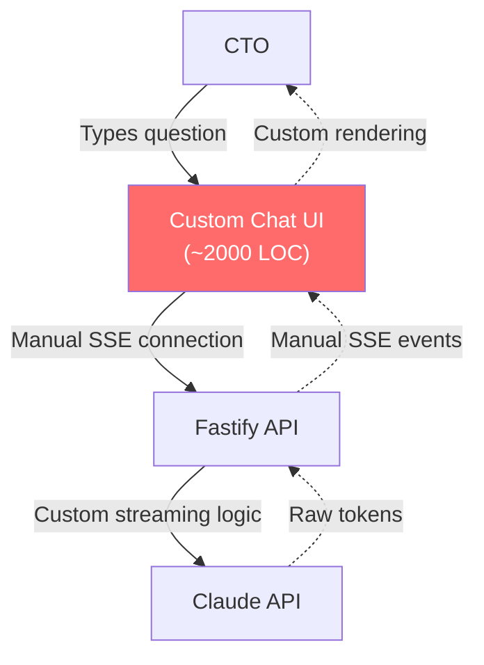
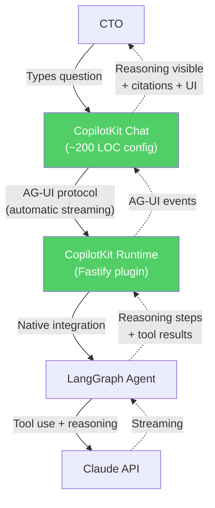

# ADR-001: CopilotKit for AI Copilot UI

## Status

Accepted (CEO-approved)

## Context

CTOaaS requires an AI-powered advisory chat interface with the following characteristics:
- Streaming token-by-token response display (FR-002)
- Visible agent reasoning steps so the CTO sees what the AI is doing in real-time
- Generative UI components (charts, cards, interactive elements within responses)
- Integration with LangGraph agent orchestration
- Source citation display with expandable previews (FR-006)

The core experience is not a simple chatbot -- it is an agentic copilot where the CTO sees the AI reasoning, searching knowledge bases, analyzing risks, and synthesizing responses in real-time.

### What was researched

1. **CopilotKit** (https://github.com/CopilotKit/CopilotKit) -- React framework for AI copilots
2. **Vercel AI SDK** (https://github.com/vercel/ai) -- Streaming AI UI utilities
3. **Custom SSE chat** -- Build from scratch with EventSource API
4. **Chainlit** (https://github.com/Chainlit/chainlit) -- Python-based chat UI
5. **chatscope** (https://github.com/chatscope/chat-ui-kit-react) -- React chat component library

## Decision

Use **CopilotKit** (`@copilotkit/react-ui`, `@copilotkit/react-core`, `@copilotkit/runtime`) for the AI copilot UI layer.

### Architecture Before (Custom Chat)

### Architecture After (CopilotKit)

## Consequences

### Positive

- **AG-UI protocol** provides standardized streaming with reasoning visibility -- CTO sees each step the agent takes
- **Generative UI** enables rich response components (charts, cards, interactive elements) within chat responses
- **LangGraph integration** is native -- CopilotKit Runtime connects directly to LangGraph agent graphs
- **80% less UI code** compared to building custom chat streaming from scratch (~200 LOC config vs. ~2000 LOC custom)
- **Frontend actions** via `useCopilotAction()` let the agent trigger UI updates (navigate to risk dashboard, open TCO calculator)
- **Shared state** via `useCopilotReadable()` gives the agent awareness of frontend context

### Negative

- **Additional dependency** (3 npm packages: react-ui, react-core, runtime)
- **Version coupling** -- CopilotKit updates may require migration work
- **Customization limits** -- heavily customized chat UI may fight against CopilotKit's design assumptions
- **Bundle size** -- adds ~100-150KB to frontend bundle (acceptable for this use case)

### Neutral

- Learning curve for team unfamiliar with CopilotKit APIs (mitigated by good documentation)
- CopilotKit is actively maintained with strong community (15K+ GitHub stars)

## Alternatives Considered

### Vercel AI SDK

- **Pros**: Maintained by Vercel (same team as Next.js), lightweight, streaming primitives
- **Cons**: Lower-level than CopilotKit -- provides streaming but not generative UI, agent reasoning display, or LangGraph integration. Would require significant custom code for the copilot experience.
- **Why rejected**: CopilotKit provides the complete copilot experience we need; Vercel AI SDK would require building the agent reasoning display and generative UI from scratch.

### Custom SSE Chat UI

- **Pros**: Full control over every aspect of the UI, no external dependencies
- **Cons**: ~2000+ LOC of custom streaming code, manual SSE management, no AG-UI protocol for reasoning visibility, no generative UI framework, significant ongoing maintenance
- **Why rejected**: Building from scratch when a purpose-built framework exists violates the "don't build from scratch" principle. CopilotKit provides the complete feature set we need.

### Chainlit

- **Pros**: Feature-rich chat UI with streaming, Python ecosystem
- **Cons**: Python-based (our stack is TypeScript), separate deployment, not React-native
- **Why rejected**: Stack mismatch (Python vs. TypeScript), would require a separate Python service.

### chatscope

- **Pros**: React components for chat UI, lightweight
- **Cons**: Static chat components only -- no streaming, no agent reasoning, no LLM integration
- **Why rejected**: Too low-level; provides chat bubbles but none of the AI-specific features we need.

## References

- CopilotKit documentation: https://docs.copilotkit.ai/
- CopilotKit GitHub: https://github.com/CopilotKit/CopilotKit
- AG-UI protocol specification: https://docs.copilotkit.ai/coagents/ag-ui
- LangGraph + CopilotKit integration: https://docs.copilotkit.ai/coagents/langgraph
