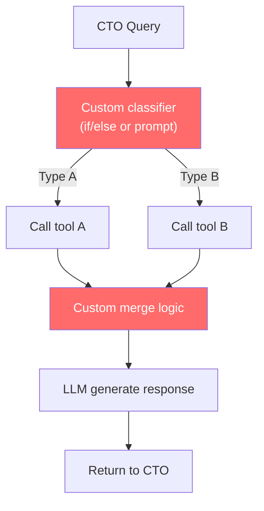
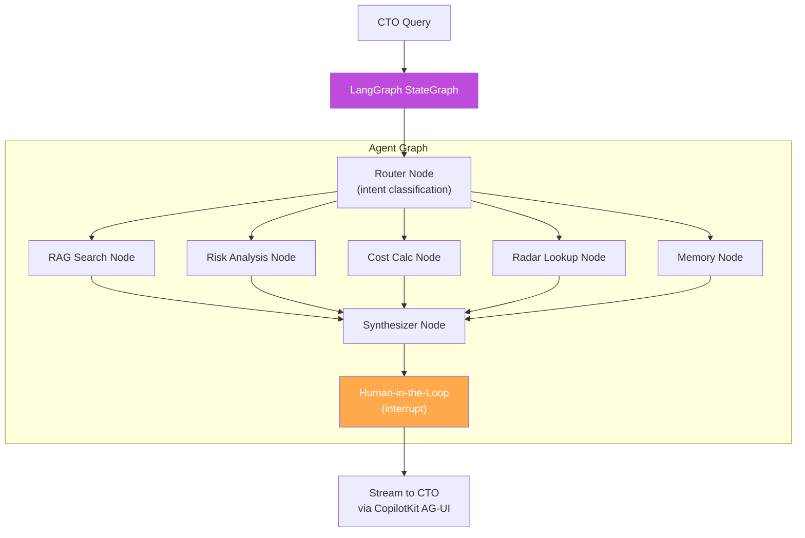

# ADR-002: LangGraph for Agent Orchestration

## Status

Accepted (CEO-approved)

## Context

CTOaaS requires an AI agent orchestration framework that supports:
- Multi-step reasoning with tool use (RAG search, risk analysis, cost calculation, tech radar lookup, memory retrieval)
- Stateful execution -- agent state persists across tool calls within a single query
- Human-in-the-loop -- agent can pause and ask the CTO for clarification
- Durable execution -- agent workflows survive transient failures
- ReAct pattern (Reasoning + Acting) with visible reasoning steps
- Integration with CopilotKit for streaming agent state to the frontend

The CTO Advisory Agent is not a simple prompt-response chatbot. It is a multi-tool agent that reasons about the query, selects appropriate tools, executes them, synthesizes results, and produces a citation-backed response.

### What was researched

1. **LangGraph** (https://github.com/langchain-ai/langgraphjs) -- Stateful agent orchestration
2. **CrewAI** (https://github.com/crewAIInc/crewAI) -- Multi-agent framework
3. **AutoGen** (https://github.com/microsoft/autogen) -- Microsoft multi-agent framework
4. **Custom agent loop** -- Build ReAct loop from scratch
5. **LangChain** (full) -- General-purpose LLM orchestration

## Decision

Use **LangGraph (TypeScript)** (`@langchain/langgraph`) for agent orchestration.

### Architecture Before (Custom Agent Loop)

### Architecture After (LangGraph)

## Consequences

### Positive

- **StateGraph abstraction** models the agent as a graph with typed state -- clean, testable, composable
- **Built-in tool use** -- each tool is a graph node that can be independently tested and monitored
- **Human-in-the-loop** via graph interrupts -- agent can pause mid-execution to ask for clarification
- **Durable execution** -- graph state is checkpointed; survives transient failures
- **CopilotKit native integration** -- LangGraph agent state streams directly to CopilotKit via AG-UI
- **Production-proven** -- used by Uber, LinkedIn, Replit at scale
- **TypeScript support** -- `@langchain/langgraphjs` provides full TypeScript types
- **ReAct pattern built-in** -- reasoning + acting loop is a first-class pattern

### Negative

- **LangChain dependency** -- requires `@langchain/core` as a peer dependency (but avoids full LangChain)
- **Learning curve** -- graph-based agent design is more complex than simple prompt chaining
- **Overhead for simple queries** -- a straightforward question still goes through the full graph (mitigated by fast router node)
- **Version churn** -- LangGraph is actively evolving; API changes possible

### Neutral

- LangGraph TypeScript package is newer than Python version but API-stable
- Graph visualization tools available for debugging agent flows

## Alternatives Considered

### CrewAI

- **Pros**: Easy multi-agent setup, role-based agents, Python ecosystem
- **Cons**: 3x higher token overhead per interaction (agents converse with each other), Python-only (no TypeScript), less production-proven at scale, no native CopilotKit integration
- **Why rejected**: Token overhead is unacceptable for a cost-sensitive product (NFR-016: < $0.05/interaction). Python stack mismatch. No CopilotKit integration means building custom streaming.

### Microsoft AutoGen

- **Pros**: Multi-agent conversations, Microsoft ecosystem, research-backed
- **Cons**: Microsoft ecosystem lock-in, primarily Python, complex setup for simple tool use, no CopilotKit integration, conversation-based (agents talk to each other) rather than graph-based
- **Why rejected**: Wrong paradigm (we need a single agent with tools, not multiple agents conversing). Ecosystem mismatch.

### Custom Agent Loop

- **Pros**: Full control, no dependencies, minimal overhead
- **Cons**: No state management, no human-in-the-loop, no durable execution, no CopilotKit integration, significant custom code (~1000+ LOC for robust agent loop with retry, state, tool use)
- **Why rejected**: Building a production-grade agent orchestrator from scratch when LangGraph exists violates the "don't build from scratch" principle.

### LangChain (Full)

- **Pros**: Comprehensive LLM framework, large ecosystem, many integrations
- **Cons**: Heavy dependency (~50+ sub-packages), abstraction overhead, "framework fatigue," many features we don't need, less control over agent behavior
- **Why rejected**: LangGraph provides the specific agent orchestration we need without the weight of full LangChain. We import only `@langchain/core` (required peer dep) and `@langchain/anthropic` (Claude provider).

## References

- LangGraph TypeScript: https://github.com/langchain-ai/langgraphjs
- LangGraph documentation: https://langchain-ai.github.io/langgraphjs/
- ReAct pattern paper: https://arxiv.org/abs/2210.03629
- CopilotKit + LangGraph integration: https://docs.copilotkit.ai/coagents/langgraph
