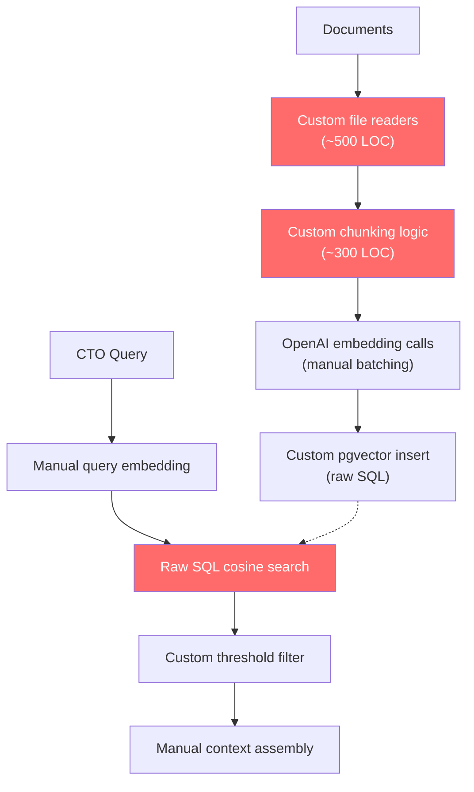
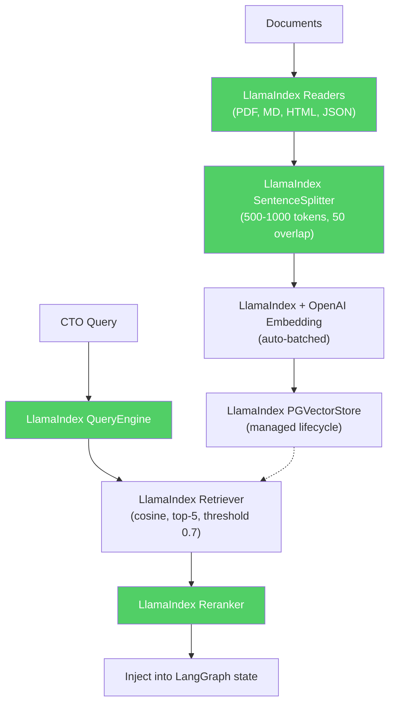

# ADR-003: LlamaIndex for RAG Pipeline

## Status

Accepted (CEO-approved)

## Context

CTOaaS requires a Retrieval-Augmented Generation (RAG) pipeline that:
- Ingests curated knowledge documents (engineering blogs, whitepapers, conference talks) from S3/R2 storage
- Chunks documents into semantically meaningful segments (500-1000 tokens)
- Generates vector embeddings and stores them in pgvector
- Retrieves the top-k most relevant chunks for a given CTO query (cosine similarity, threshold 0.7)
- Reranks results for quality before injecting into the LangGraph agent context
- Supports multiple document formats (PDF, Markdown, HTML, JSON)
- Achieves < 500ms vector search latency at 100,000 embeddings (NFR-004)

RAG is the core differentiator of CTOaaS versus generic ChatGPT/Claude usage (BN-002). The quality of the RAG pipeline directly determines the quality of advisory responses.

### What was researched

1. **LlamaIndex** (https://github.com/run-llama/LlamaIndexTS) -- TypeScript RAG framework
2. **LangChain RAG modules** -- Part of the LangChain ecosystem
3. **Custom RAG pipeline** -- Build from scratch with OpenAI embeddings + pgvector queries
4. **Haystack** (https://github.com/deepset-ai/haystack) -- Python NLP framework with RAG
5. **Txtai** (https://github.com/neuml/txtai) -- Python embeddings and RAG framework

## Decision

Use **LlamaIndex (TypeScript)** (`llamaindex`) for the complete RAG pipeline: document loading, chunking, embedding, indexing, retrieval, and reranking.

### Architecture Before (Custom RAG Pipeline)

### Architecture After (LlamaIndex)

## Consequences

### Positive

- **Complete pipeline** -- handles ingestion, chunking, embedding, indexing, retrieval, and reranking in one framework
- **pgvector integration** -- `PGVectorStore` adapter manages vector storage lifecycle (same PostgreSQL database)
- **Smart chunking** -- `SentenceSplitter` respects sentence boundaries, configurable chunk size and overlap
- **Multiple readers** -- PDF, Markdown, HTML, JSON readers included; no custom file parsing code
- **Auto-batched embeddings** -- embedding calls are automatically batched for efficiency
- **Reranking** -- built-in reranking pipeline improves retrieval precision
- **40% faster** than alternatives according to benchmarks (CEO-cited)
- **TypeScript native** -- `llamaindex` npm package with full TypeScript types

### Negative

- **Additional dependency** -- adds `llamaindex` npm package (~2MB installed)
- **Abstraction layer** over pgvector -- less control over raw SQL queries if needed
- **Version coupling** -- LlamaIndex TypeScript is newer than Python version; potential API changes
- **Embedding model lock-in** (soft) -- LlamaIndex abstracts the embedding model, but switching models requires re-embedding all documents

### Neutral

- LlamaIndex TypeScript is actively maintained (weekly releases)
- Embedding dimension (1536) is determined by the model choice (text-embedding-3-small), not LlamaIndex
- LlamaIndex query engine can be wrapped in a LangGraph tool node cleanly

## Alternatives Considered

### LangChain RAG Modules

- **Pros**: Already importing `@langchain/core` for LangGraph; shared ecosystem
- **Cons**: RAG support is spread across many sub-packages, less optimized than LlamaIndex for retrieval-specific use cases, document loaders are less mature in TypeScript
- **Why rejected**: LlamaIndex is purpose-built for RAG and 40% faster. Using LangChain for RAG would mean importing more LangChain sub-packages (text-splitters, document-loaders, vectorstores) -- adding complexity without benefit.

### Custom RAG Pipeline

- **Pros**: Full control, minimal dependencies, direct pgvector SQL
- **Cons**: ~1000+ LOC of custom code for file readers, chunking logic, embedding batching, vector queries, reranking. Each component must be tested and maintained independently.
- **Why rejected**: Building the full RAG pipeline from scratch when LlamaIndex exists is unnecessary engineering effort. The pipeline is well-understood and LlamaIndex has optimized the common patterns.

### Haystack (deepset)

- **Pros**: Mature NLP framework, good document processing, pipeline abstraction
- **Cons**: Python-only, no TypeScript support, would require a separate Python microservice
- **Why rejected**: Stack mismatch (Python vs. TypeScript). Running a separate Python service for RAG adds operational complexity and latency.

### Txtai

- **Pros**: Lightweight, embedding-focused, simple API
- **Cons**: Python-only, smaller community, fewer document format readers
- **Why rejected**: Same as Haystack -- Python stack mismatch.

## References

- LlamaIndex TypeScript: https://github.com/run-llama/LlamaIndexTS
- LlamaIndex documentation: https://ts.llamaindex.ai/
- PGVectorStore adapter: https://ts.llamaindex.ai/modules/vector_stores/pg_vector_store
- OpenAI text-embedding-3-small: https://platform.openai.com/docs/guides/embeddings
