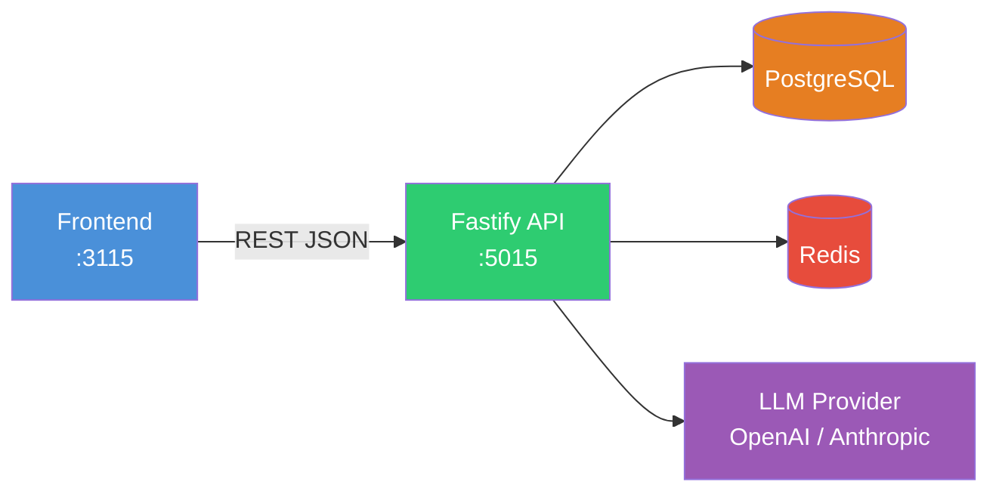
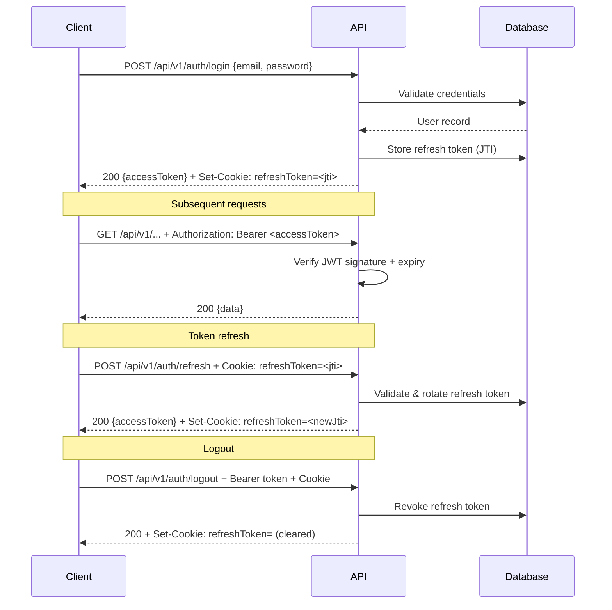
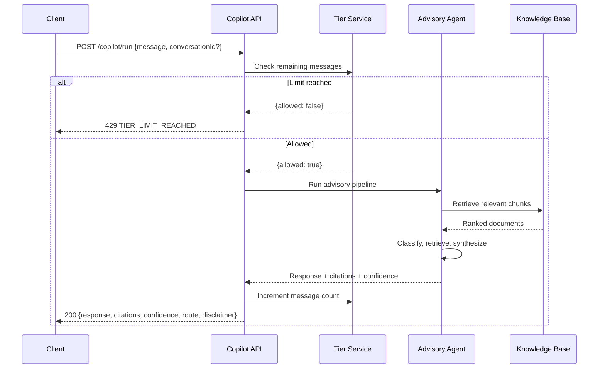
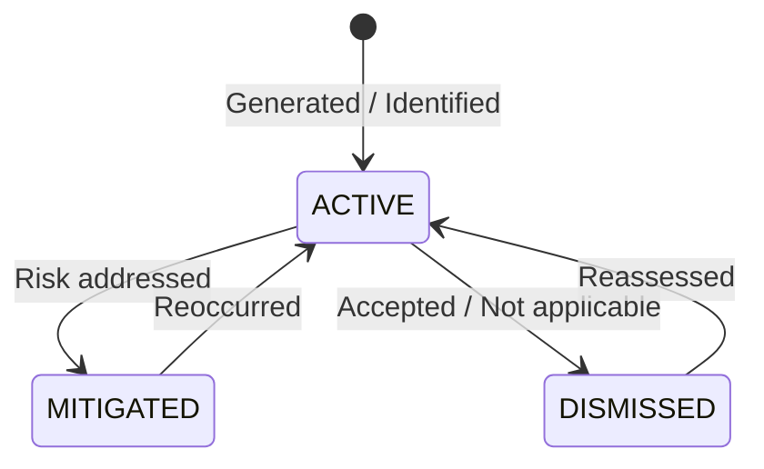
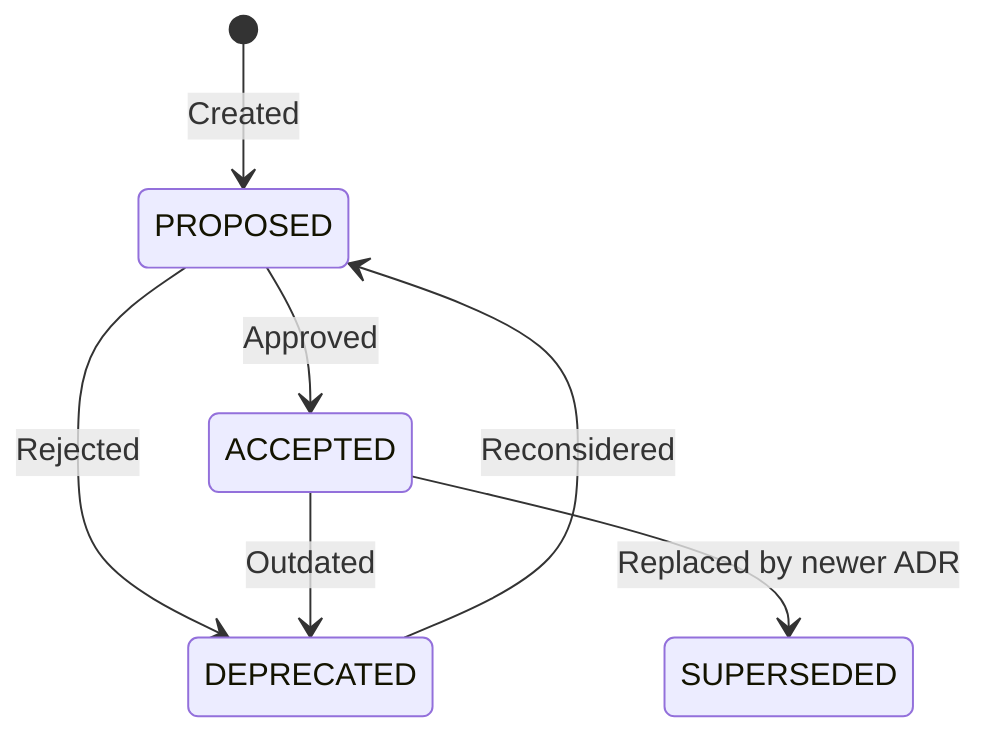

# CTOaaS API Reference

> **Version**: 0.1.0 | **Base URL**: `http://localhost:5015` | **Protocol**: REST over HTTP/JSON

CTOaaS (CTO as a Service) provides AI-powered CTO advisory capabilities to startups and SMBs through a conversational copilot backed by a knowledge base, risk analysis, cost management, tech radar, and architecture decision records.

## Table of Contents

- [Overview](#overview)
- [Authentication](#authentication)
- [Response Format](#response-format)
- [Error Handling](#error-handling)
- [Rate Limiting](#rate-limiting)
- [Endpoints](#endpoints)
  - [Health](#health)
  - [Auth](#auth)
  - [Profile and Onboarding](#profile-and-onboarding)
  - [Knowledge Base](#knowledge-base)
  - [Copilot (Chat)](#copilot-chat)
  - [Conversations](#conversations)
  - [Preferences](#preferences)
  - [Risks](#risks)
  - [Costs](#costs)
  - [Tech Radar](#tech-radar)
  - [ADRs](#adrs)
  - [Tier](#tier)

---

## Overview

The CTOaaS API follows a resource-oriented REST design. All endpoints (except health) are prefixed with `/api/v1/`. The API serves a Next.js frontend running on port 3115.



---

## Authentication

CTOaaS uses JWT access tokens with httpOnly refresh cookie rotation.



**Access Token**: Passed via `Authorization: Bearer <token>` header. Contains `sub` (user ID), `role`, and `jti` (unique token ID).

**Refresh Token**: Stored as an httpOnly cookie named `refreshToken`. Contains the JTI that maps to a database record. Expires after 7 days. Rotated on each refresh.

**Authenticated Endpoints**: All endpoints except `/health`, `/api/v1/auth/signup`, `/api/v1/auth/login`, `/api/v1/auth/verify-email`, and `/api/v1/auth/refresh` require a valid Bearer token.

---

## Response Format

All responses follow a consistent envelope structure.

### Success Response

```json
{
  "success": true,
  "data": { ... }
}
```

### Error Response

```json
{
  "success": false,
  "error": {
    "type": "https://ctoaas.dev/errors/validation_error",
    "code": "VALIDATION_ERROR",
    "message": "Human-readable error description",
    "requestId": "optional-request-id",
    "details": [
      { "field": "email", "message": "Invalid email format" }
    ]
  }
}
```

The `type` field follows the RFC 7807 problem type URI pattern. The `details` array is present only for validation errors with per-field messages.

---

## Error Handling

| Status | Code | Description |
|--------|------|-------------|
| 400 | `BAD_REQUEST` | Invalid input, missing required fields, or schema violation |
| 401 | `UNAUTHORIZED` | Missing or expired access token |
| 403 | `FORBIDDEN` | Authenticated but insufficient permissions |
| 404 | `NOT_FOUND` | Resource does not exist or belongs to another organization |
| 409 | `CONFLICT` | Duplicate resource (e.g., email already registered) |
| 429 | `TIER_LIMIT_REACHED` | Free tier daily message limit exhausted |
| 500 | `INTERNAL_ERROR` | Unexpected server error |

Zod validation errors are automatically formatted with per-field detail arrays.

---

## Rate Limiting

| Scope | Limit | Window |
|-------|-------|--------|
| General API | 100 requests | 1 minute |
| LLM endpoints (`/copilot/run`) | 20 requests | 1 minute |

Rate limit headers are returned on every response: `X-RateLimit-Limit`, `X-RateLimit-Remaining`, `X-RateLimit-Reset`.

When the rate limit is exceeded, a `429 Too Many Requests` response is returned.

---

## Endpoints

### Health

#### `GET /health`

Returns system health status including database and Redis connectivity. Returns 503 when the database is unreachable.

**Authentication**: No

**Success Response** `200 OK`

```json
{
  "status": "ok",
  "database": "connected",
  "redis": "connected",
  "uptime": 1234.567,
  "timestamp": "2026-03-14T10:00:00.000Z",
  "version": "0.1.0"
}
```

**Degraded Response** `503 Service Unavailable`

```json
{
  "status": "degraded",
  "database": "disconnected",
  "redis": "connected",
  "uptime": 1234.567,
  "timestamp": "2026-03-14T10:00:00.000Z",
  "version": "0.1.0"
}
```

**Example**

```bash
curl http://localhost:5015/health
```

---

### Auth

All auth endpoints are prefixed with `/api/v1/auth`.

#### `POST /api/v1/auth/signup`

Creates a new user account and organization. Sends a verification email.

**Authentication**: No

**Request Body**

| Field | Type | Required | Constraints | Description |
|-------|------|----------|-------------|-------------|
| `name` | string | Yes | 2-100 chars | User's display name |
| `email` | string | Yes | Valid email | Trimmed and lowercased |
| `password` | string | Yes | Min 8 chars, 1 upper, 1 lower, 1 digit, 1 special | Account password |
| `companyName` | string | Yes | 2-255 chars | Organization name |

**Success Response** `201 Created`

```json
{
  "success": true,
  "data": {
    "user": {
      "id": "clx...",
      "email": "ceo@startup.com",
      "name": "Jane Smith",
      "role": "OWNER"
    },
    "message": "Account created. Please verify your email."
  }
}
```

**Error Responses**

| Status | Code | When |
|--------|------|------|
| 400 | `VALIDATION_ERROR` | Missing/invalid fields |
| 409 | `CONFLICT` | Email already registered |

**Example**

```bash
curl -X POST http://localhost:5015/api/v1/auth/signup \
  -H "Content-Type: application/json" \
  -d '{
    "name": "Jane Smith",
    "email": "ceo@startup.com",
    "password": "Secure123!",
    "companyName": "Acme Corp"
  }'
```

---

#### `POST /api/v1/auth/login`

Authenticates a user and returns a JWT access token. Sets a refresh token as an httpOnly cookie.

**Authentication**: No

**Request Body**

| Field | Type | Required | Description |
|-------|------|----------|-------------|
| `email` | string | Yes | Registered email |
| `password` | string | Yes | Account password |

**Success Response** `200 OK`

```json
{
  "success": true,
  "data": {
    "accessToken": "eyJhbGciOiJIUzI1NiIs...",
    "user": {
      "id": "clx...",
      "email": "ceo@startup.com",
      "name": "Jane Smith",
      "role": "OWNER"
    }
  }
}
```

**Headers Set**

```
Set-Cookie: refreshToken=<jti>; HttpOnly; Path=/; SameSite=Lax; Max-Age=604800
```

**Error Responses**

| Status | Code | When |
|--------|------|------|
| 400 | `VALIDATION_ERROR` | Missing/invalid fields |
| 401 | `UNAUTHORIZED` | Invalid credentials |

**Example**

```bash
curl -X POST http://localhost:5015/api/v1/auth/login \
  -H "Content-Type: application/json" \
  -c cookies.txt \
  -d '{
    "email": "ceo@startup.com",
    "password": "Secure123!"
  }'
```

---

#### `POST /api/v1/auth/verify-email`

Verifies a user's email address using the token sent during signup.

**Authentication**: No

**Request Body**

| Field | Type | Required | Description |
|-------|------|----------|-------------|
| `token` | string | Yes | Email verification token |

**Success Response** `200 OK`

```json
{
  "success": true,
  "data": {
    "message": "Email verified successfully"
  }
}
```

**Error Responses**

| Status | Code | When |
|--------|------|------|
| 400 | `VALIDATION_ERROR` | Missing token |
| 404 | `NOT_FOUND` | Invalid or expired token |

**Example**

```bash
curl -X POST http://localhost:5015/api/v1/auth/verify-email \
  -H "Content-Type: application/json" \
  -d '{"token": "abc123def456"}'
```

---

#### `POST /api/v1/auth/refresh`

Rotates the refresh token and returns a new access token. The old refresh token is invalidated.

**Authentication**: No (uses refresh cookie)

**Request**: No body required. The `refreshToken` httpOnly cookie must be present.

**Success Response** `200 OK`

```json
{
  "success": true,
  "data": {
    "accessToken": "eyJhbGciOiJIUzI1NiIs..."
  }
}
```

**Headers Set**

```
Set-Cookie: refreshToken=<newJti>; HttpOnly; Path=/; SameSite=Lax; Max-Age=604800
```

**Error Responses**

| Status | Code | When |
|--------|------|------|
| 401 | `UNAUTHORIZED` | No refresh cookie or token revoked/expired |

**Example**

```bash
curl -X POST http://localhost:5015/api/v1/auth/refresh \
  -b cookies.txt \
  -c cookies.txt
```

---

#### `POST /api/v1/auth/logout`

Revokes the current session. Invalidates the access token JTI (via Redis blocklist) and deletes the refresh token from the database.

**Authentication**: Yes

**Request**: No body required.

**Success Response** `200 OK`

```json
{
  "success": true,
  "data": {
    "message": "Logged out successfully"
  }
}
```

**Headers Set**

```
Set-Cookie: refreshToken=; HttpOnly; Path=/; SameSite=Lax; Max-Age=0
```

**Example**

```bash
curl -X POST http://localhost:5015/api/v1/auth/logout \
  -H "Authorization: Bearer <accessToken>" \
  -b cookies.txt
```

---

### Profile and Onboarding

Profile routes are registered without a prefix; the path is embedded in each route definition.

#### `GET /api/v1/onboarding/step/:step`

Retrieves saved data for a specific onboarding step (1-4).

**Authentication**: Yes

**Path Parameters**

| Param | Type | Constraints | Description |
|-------|------|-------------|-------------|
| `step` | integer | 1-4 | Onboarding step number |

**Onboarding Steps**

| Step | Name | Fields |
|------|------|--------|
| 1 | Company Basics | `industry`, `employeeCount`, `growthStage`, `foundedYear` |
| 2 | Tech Stack | `languages[]`, `frameworks[]`, `databases[]`, `cloudProvider`, `architectureNotes` |
| 3 | Challenges | `challenges[]`, `customChallenges` |
| 4 | Advisory Preferences | `communicationStyle`, `responseFormat`, `detailLevel` |

**Success Response** `200 OK`

```json
{
  "success": true,
  "data": {
    "industry": "fintech",
    "employeeCount": 25,
    "growthStage": "SERIES_A",
    "foundedYear": 2022
  }
}
```

**Error Responses**

| Status | Code | When |
|--------|------|------|
| 400 | `BAD_REQUEST` | Step number not 1-4 |
| 401 | `UNAUTHORIZED` | Missing/invalid token |

**Example**

```bash
curl http://localhost:5015/api/v1/onboarding/step/1 \
  -H "Authorization: Bearer <accessToken>"
```

---

#### `PUT /api/v1/onboarding/step/:step`

Saves data for a specific onboarding step. All fields within each step are optional to allow partial completion.

**Authentication**: Yes

**Path Parameters**

| Param | Type | Constraints | Description |
|-------|------|-------------|-------------|
| `step` | integer | 1-4 | Onboarding step number |

**Request Body (Step 1 -- Company Basics)**

| Field | Type | Required | Constraints |
|-------|------|----------|-------------|
| `industry` | string | No | 1-100 chars |
| `employeeCount` | integer | No | >= 0 |
| `growthStage` | enum | No | `SEED`, `SERIES_A`, `SERIES_B`, `SERIES_C`, `GROWTH`, `ENTERPRISE` |
| `foundedYear` | integer | No | 1900-2100 |

**Request Body (Step 2 -- Tech Stack)**

| Field | Type | Required | Constraints |
|-------|------|----------|-------------|
| `languages` | string[] | No | Array of language names |
| `frameworks` | string[] | No | Array of framework names |
| `databases` | string[] | No | Array of database names |
| `cloudProvider` | string | No | Max 50 chars |
| `architectureNotes` | string | No | Max 2000 chars |

**Request Body (Step 3 -- Challenges)**

| Field | Type | Required | Constraints |
|-------|------|----------|-------------|
| `challenges` | string[] | No | Min 1 item if provided |
| `customChallenges` | string | No | Max 2000 chars |

**Request Body (Step 4 -- Advisory Preferences)**

| Field | Type | Required | Constraints |
|-------|------|----------|-------------|
| `communicationStyle` | enum | No | `concise`, `balanced`, `detailed`, `direct` |
| `responseFormat` | enum | No | `executive`, `technical`, `actionable`, `structured` |
| `detailLevel` | enum | No | `high-level`, `moderate`, `granular`, `detailed` |

**Success Response** `200 OK`

```json
{
  "success": true,
  "data": {
    "message": "Step 2 saved successfully"
  }
}
```

**Example**

```bash
curl -X PUT http://localhost:5015/api/v1/onboarding/step/2 \
  -H "Authorization: Bearer <accessToken>" \
  -H "Content-Type: application/json" \
  -d '{
    "languages": ["TypeScript", "Python"],
    "frameworks": ["Next.js", "FastAPI"],
    "databases": ["PostgreSQL", "Redis"],
    "cloudProvider": "AWS"
  }'
```

---

#### `PUT /api/v1/onboarding/complete`

Marks onboarding as complete for the authenticated user.

**Authentication**: Yes

**Request**: No body required.

**Success Response** `200 OK`

```json
{
  "success": true,
  "data": {
    "message": "Onboarding completed successfully"
  }
}
```

**Example**

```bash
curl -X PUT http://localhost:5015/api/v1/onboarding/complete \
  -H "Authorization: Bearer <accessToken>"
```

---

#### `GET /api/v1/profile/company`

Retrieves the company profile for the authenticated user's organization.

**Authentication**: Yes

**Success Response** `200 OK`

```json
{
  "success": true,
  "data": {
    "id": "clx...",
    "organizationId": "clx...",
    "techStack": {
      "languages": ["TypeScript"],
      "frameworks": ["Next.js"],
      "databases": ["PostgreSQL"]
    },
    "cloudProvider": "AWS",
    "architectureNotes": "Monolith transitioning to microservices",
    "constraints": null,
    "profileCompleteness": 75,
    "createdAt": "2026-03-14T10:00:00.000Z",
    "updatedAt": "2026-03-14T12:00:00.000Z"
  }
}
```

**Example**

```bash
curl http://localhost:5015/api/v1/profile/company \
  -H "Authorization: Bearer <accessToken>"
```

---

#### `PUT /api/v1/profile/company`

Updates the company profile. All fields are optional; only provided fields are updated.

**Authentication**: Yes

**Request Body**

| Field | Type | Required | Constraints |
|-------|------|----------|-------------|
| `techStack` | object | No | `{languages?: string[], frameworks?: string[], databases?: string[]}` |
| `cloudProvider` | string | No | Max 50 chars |
| `architectureNotes` | string | No | Max 2000 chars |
| `constraints` | string | No | Max 2000 chars |

**Success Response** `200 OK`

```json
{
  "success": true,
  "data": {
    "id": "clx...",
    "techStack": {
      "languages": ["TypeScript", "Go"],
      "frameworks": ["Next.js", "Fiber"],
      "databases": ["PostgreSQL", "Redis"]
    },
    "cloudProvider": "AWS",
    "architectureNotes": "Event-driven microservices",
    "constraints": "SOC2 compliance required",
    "profileCompleteness": 100
  }
}
```

**Example**

```bash
curl -X PUT http://localhost:5015/api/v1/profile/company \
  -H "Authorization: Bearer <accessToken>" \
  -H "Content-Type: application/json" \
  -d '{
    "techStack": {
      "languages": ["TypeScript", "Go"],
      "databases": ["PostgreSQL", "Redis"]
    },
    "constraints": "SOC2 compliance required"
  }'
```

---

#### `GET /api/v1/profile/completeness`

Returns the profile completeness percentage for the authenticated user.

**Authentication**: Yes

**Success Response** `200 OK`

```json
{
  "success": true,
  "data": {
    "completeness": 75
  }
}
```

**Example**

```bash
curl http://localhost:5015/api/v1/profile/completeness \
  -H "Authorization: Bearer <accessToken>"
```

---

### Knowledge Base

All knowledge endpoints are registered without a prefix; paths are embedded in route definitions.

#### `POST /api/v1/knowledge/documents`

Uploads a document to the knowledge base for RAG processing.

**Authentication**: Yes

**Request Body**

| Field | Type | Required | Constraints | Description |
|-------|------|----------|-------------|-------------|
| `title` | string | No | Defaults to empty | Document title |
| `category` | string | No | Defaults to empty | Category for organization |
| `content` | string | No | Defaults to empty | Document content (text) |
| `mimeType` | string | No | Default: `text/plain` | Content MIME type |
| `author` | string | No | - | Document author |

**Success Response** `201 Created`

```json
{
  "success": true,
  "data": {
    "id": "clx...",
    "title": "AWS Migration Playbook",
    "category": "infrastructure",
    "mimeType": "text/plain",
    "status": "PENDING",
    "chunkCount": 0,
    "createdAt": "2026-03-14T10:00:00.000Z"
  }
}
```

**Example**

```bash
curl -X POST http://localhost:5015/api/v1/knowledge/documents \
  -H "Authorization: Bearer <accessToken>" \
  -H "Content-Type: application/json" \
  -d '{
    "title": "AWS Migration Playbook",
    "category": "infrastructure",
    "content": "Step 1: Assess current workloads...",
    "author": "Platform Team"
  }'
```

---

#### `GET /api/v1/knowledge/documents`

Lists knowledge base documents with pagination.

**Authentication**: Yes

**Query Parameters**

| Param | Type | Default | Constraints | Description |
|-------|------|---------|-------------|-------------|
| `page` | integer | 1 | >= 1 | Page number |
| `limit` | integer | 10 | 1-100 | Items per page |

**Success Response** `200 OK`

```json
{
  "success": true,
  "data": {
    "documents": [
      {
        "id": "clx...",
        "title": "AWS Migration Playbook",
        "category": "infrastructure",
        "status": "COMPLETED",
        "chunkCount": 12,
        "createdAt": "2026-03-14T10:00:00.000Z"
      }
    ],
    "total": 1,
    "page": 1,
    "limit": 10
  }
}
```

**Example**

```bash
curl "http://localhost:5015/api/v1/knowledge/documents?page=1&limit=20" \
  -H "Authorization: Bearer <accessToken>"
```

---

#### `GET /api/v1/knowledge/documents/:id`

Retrieves a single document with its chunk count.

**Authentication**: Yes

**Path Parameters**

| Param | Type | Description |
|-------|------|-------------|
| `id` | string | Document ID |

**Success Response** `200 OK`

```json
{
  "success": true,
  "data": {
    "id": "clx...",
    "title": "AWS Migration Playbook",
    "category": "infrastructure",
    "content": "Step 1: Assess current workloads...",
    "mimeType": "text/plain",
    "author": "Platform Team",
    "status": "COMPLETED",
    "chunkCount": 12,
    "createdAt": "2026-03-14T10:00:00.000Z",
    "updatedAt": "2026-03-14T10:05:00.000Z"
  }
}
```

**Error Responses**

| Status | Code | When |
|--------|------|------|
| 404 | `NOT_FOUND` | Document does not exist |

**Example**

```bash
curl http://localhost:5015/api/v1/knowledge/documents/clx123 \
  -H "Authorization: Bearer <accessToken>"
```

---

#### `GET /api/v1/knowledge/documents/:id/status`

Returns the ingestion/processing status of a document.

**Authentication**: Yes

**Path Parameters**

| Param | Type | Description |
|-------|------|-------------|
| `id` | string | Document ID |

**Success Response** `200 OK`

```json
{
  "success": true,
  "data": {
    "id": "clx...",
    "status": "COMPLETED",
    "chunkCount": 12,
    "error": null
  }
}
```

**Example**

```bash
curl http://localhost:5015/api/v1/knowledge/documents/clx123/status \
  -H "Authorization: Bearer <accessToken>"
```

---

### Copilot (Chat)

The copilot endpoint powers the AI CTO advisory chatbot. It is the core interaction point where users ask technology questions and receive context-aware advisory responses with citations from the knowledge base.

#### `POST /api/v1/copilot/run`

Sends a message to the CTO advisory agent and receives a response with citations, confidence level, and AI disclaimer.

**Authentication**: Yes

**Rate Limit**: 20 requests per minute

**Free Tier Enforcement**: Users on the FREE tier have a daily message limit. Returns 429 when exhausted.



**Request Body**

| Field | Type | Required | Constraints | Description |
|-------|------|----------|-------------|-------------|
| `message` | string | Yes | 1-10,000 chars, non-empty | User's question or message |
| `conversationId` | string or null | No | UUID or null | Existing conversation to continue; null for new |

**Success Response** `200 OK`

```json
{
  "success": true,
  "data": {
    "response": "Based on your current stack (TypeScript + PostgreSQL), I recommend adopting a modular monolith architecture before moving to microservices. Here's why...",
    "citations": [
      {
        "marker": "[1]",
        "sourceTitle": "Monolith-First Strategy",
        "author": "Martin Fowler",
        "relevanceScore": 0.92
      }
    ],
    "confidence": "high",
    "route": "architecture",
    "disclaimer": "This advice is AI-generated and should be validated by qualified professionals before implementation."
  }
}
```

**Response Headers**

```
X-AI-Disclaimer: This advice is AI-generated and should be validated by qualified professionals before implementation.
```

**Error Responses**

| Status | Code | When |
|--------|------|------|
| 400 | `VALIDATION_ERROR` | Empty message or missing field |
| 429 | `TIER_LIMIT_REACHED` | Free tier daily limit exhausted |
| 429 | (rate limit) | More than 20 requests per minute |

**Example**

```bash
curl -X POST http://localhost:5015/api/v1/copilot/run \
  -H "Authorization: Bearer <accessToken>" \
  -H "Content-Type: application/json" \
  -d '{
    "message": "Should we migrate from PostgreSQL to DynamoDB?",
    "conversationId": null
  }'
```

---

### Conversations

Conversation routes are registered without a prefix; paths are embedded in route definitions.

#### `GET /api/v1/conversations`

Lists the authenticated user's conversations with pagination.

**Authentication**: Yes

**Query Parameters**

| Param | Type | Default | Constraints | Description |
|-------|------|---------|-------------|-------------|
| `page` | integer | 1 | >= 1 | Page number |
| `limit` | integer | 20 | 1-100 | Items per page |

**Success Response** `200 OK`

```json
{
  "success": true,
  "data": {
    "conversations": [
      {
        "id": "clx...",
        "title": "Database Migration Strategy",
        "messageCount": 5,
        "createdAt": "2026-03-14T10:00:00.000Z",
        "updatedAt": "2026-03-14T12:00:00.000Z"
      }
    ],
    "total": 1,
    "page": 1,
    "limit": 20
  }
}
```

**Example**

```bash
curl "http://localhost:5015/api/v1/conversations?page=1&limit=10" \
  -H "Authorization: Bearer <accessToken>"
```

---

#### `POST /api/v1/conversations`

Creates a new conversation.

**Authentication**: Yes

**Request Body**

| Field | Type | Required | Constraints | Description |
|-------|------|----------|-------------|-------------|
| `title` | string | No | Max 255 chars | Conversation title (auto-generated if omitted) |

**Success Response** `201 Created`

```json
{
  "success": true,
  "data": {
    "id": "clx...",
    "title": "New Conversation",
    "createdAt": "2026-03-14T10:00:00.000Z"
  }
}
```

**Example**

```bash
curl -X POST http://localhost:5015/api/v1/conversations \
  -H "Authorization: Bearer <accessToken>" \
  -H "Content-Type: application/json" \
  -d '{"title": "CI/CD Pipeline Discussion"}'
```

---

#### `GET /api/v1/conversations/search`

Searches conversations by text query.

**Authentication**: Yes

**Query Parameters**

| Param | Type | Required | Constraints | Description |
|-------|------|----------|-------------|-------------|
| `q` | string | Yes | 1-500 chars | Search query |

**Success Response** `200 OK`

```json
{
  "success": true,
  "data": {
    "results": [
      {
        "id": "clx...",
        "title": "Database Migration Strategy",
        "matchedSnippet": "...migrate from PostgreSQL...",
        "createdAt": "2026-03-14T10:00:00.000Z"
      }
    ]
  }
}
```

**Error Responses**

| Status | Code | When |
|--------|------|------|
| 400 | `BAD_REQUEST` | Missing `q` parameter |

**Example**

```bash
curl "http://localhost:5015/api/v1/conversations/search?q=migration" \
  -H "Authorization: Bearer <accessToken>"
```

---

#### `GET /api/v1/conversations/:id`

Retrieves a conversation with its full message history.

**Authentication**: Yes

**Path Parameters**

| Param | Type | Description |
|-------|------|-------------|
| `id` | string | Conversation ID |

**Success Response** `200 OK`

```json
{
  "success": true,
  "data": {
    "id": "clx...",
    "title": "Database Migration Strategy",
    "messages": [
      {
        "id": "msg_1",
        "role": "USER",
        "content": "Should we migrate to DynamoDB?",
        "createdAt": "2026-03-14T10:00:00.000Z"
      },
      {
        "id": "msg_2",
        "role": "ASSISTANT",
        "content": "Based on your usage patterns...",
        "citations": [...],
        "confidence": "high",
        "createdAt": "2026-03-14T10:00:01.000Z"
      }
    ],
    "createdAt": "2026-03-14T10:00:00.000Z",
    "updatedAt": "2026-03-14T10:00:01.000Z"
  }
}
```

**Error Responses**

| Status | Code | When |
|--------|------|------|
| 404 | `NOT_FOUND` | Conversation does not exist or belongs to another user |

**Example**

```bash
curl http://localhost:5015/api/v1/conversations/clx123 \
  -H "Authorization: Bearer <accessToken>"
```

---

#### `PUT /api/v1/conversations/:id`

Updates a conversation's title.

**Authentication**: Yes

**Path Parameters**

| Param | Type | Description |
|-------|------|-------------|
| `id` | string | Conversation ID |

**Request Body**

| Field | Type | Required | Constraints | Description |
|-------|------|----------|-------------|-------------|
| `title` | string | Yes | 1-255 chars | New title |

**Success Response** `200 OK`

```json
{
  "success": true,
  "data": {
    "id": "clx...",
    "title": "Updated Title",
    "updatedAt": "2026-03-14T12:00:00.000Z"
  }
}
```

**Example**

```bash
curl -X PUT http://localhost:5015/api/v1/conversations/clx123 \
  -H "Authorization: Bearer <accessToken>" \
  -H "Content-Type: application/json" \
  -d '{"title": "Revised Migration Plan"}'
```

---

#### `DELETE /api/v1/conversations/:id`

Deletes a conversation and all its messages.

**Authentication**: Yes

**Path Parameters**

| Param | Type | Description |
|-------|------|-------------|
| `id` | string | Conversation ID |

**Success Response** `200 OK`

```json
{
  "success": true,
  "data": {
    "message": "Conversation deleted"
  }
}
```

**Error Responses**

| Status | Code | When |
|--------|------|------|
| 404 | `NOT_FOUND` | Conversation does not exist or belongs to another user |

**Example**

```bash
curl -X DELETE http://localhost:5015/api/v1/conversations/clx123 \
  -H "Authorization: Bearer <accessToken>"
```

---

#### `POST /api/v1/conversations/:id/generate-title`

Auto-generates a title for a conversation based on its message content using LLM.

**Authentication**: Yes

**Path Parameters**

| Param | Type | Description |
|-------|------|-------------|
| `id` | string | Conversation ID |

**Request**: No body required.

**Success Response** `200 OK`

```json
{
  "success": true,
  "data": {
    "title": "PostgreSQL to DynamoDB Migration Analysis"
  }
}
```

**Example**

```bash
curl -X POST http://localhost:5015/api/v1/conversations/clx123/generate-title \
  -H "Authorization: Bearer <accessToken>"
```

---

### Preferences

#### `GET /api/v1/preferences`

Retrieves the authenticated user's learned preference profile. Preferences are built from feedback on copilot responses over time.

**Authentication**: Yes

**Success Response** `200 OK`

```json
{
  "success": true,
  "data": {
    "userId": "clx...",
    "communicationStyle": "technical",
    "detailLevel": "detailed",
    "preferredTopics": ["architecture", "security"],
    "feedbackCount": 42,
    "lastUpdated": "2026-03-14T10:00:00.000Z"
  }
}
```

**Example**

```bash
curl http://localhost:5015/api/v1/preferences \
  -H "Authorization: Bearer <accessToken>"
```

---

#### `POST /api/v1/preferences/feedback`

Records thumbs-up or thumbs-down feedback on a copilot message. This feedback is used to learn and refine the user's advisory preferences over time.

**Authentication**: Yes

**Request Body**

| Field | Type | Required | Constraints | Description |
|-------|------|----------|-------------|-------------|
| `messageId` | string | Yes | UUID format | ID of the copilot response message |
| `feedback` | enum | Yes | `UP` or `DOWN` | Positive or negative feedback |

**Success Response** `200 OK`

```json
{
  "success": true,
  "data": {
    "message": "Feedback recorded"
  }
}
```

**Error Responses**

| Status | Code | When |
|--------|------|------|
| 400 | `VALIDATION_ERROR` | Invalid messageId format or feedback value |
| 404 | `NOT_FOUND` | User not found |

**Example**

```bash
curl -X POST http://localhost:5015/api/v1/preferences/feedback \
  -H "Authorization: Bearer <accessToken>" \
  -H "Content-Type: application/json" \
  -d '{
    "messageId": "550e8400-e29b-41d4-a716-446655440000",
    "feedback": "UP"
  }'
```

---

### Risks

All risk endpoints are prefixed with `/api/v1/risks`.



#### `GET /api/v1/risks`

Returns a risk summary across all four categories for the user's organization.

**Authentication**: Yes

**Success Response** `200 OK`

```json
{
  "success": true,
  "data": {
    "summary": [
      {
        "category": "TECH_DEBT",
        "total": 5,
        "active": 3,
        "mitigated": 1,
        "dismissed": 1,
        "highSeverity": 2
      },
      {
        "category": "VENDOR",
        "total": 2,
        "active": 2,
        "mitigated": 0,
        "dismissed": 0,
        "highSeverity": 1
      },
      {
        "category": "COMPLIANCE",
        "total": 3,
        "active": 2,
        "mitigated": 1,
        "dismissed": 0,
        "highSeverity": 1
      },
      {
        "category": "OPERATIONAL",
        "total": 4,
        "active": 3,
        "mitigated": 0,
        "dismissed": 1,
        "highSeverity": 0
      }
    ]
  }
}
```

**Example**

```bash
curl http://localhost:5015/api/v1/risks \
  -H "Authorization: Bearer <accessToken>"
```

---

#### `GET /api/v1/risks/:category`

Lists risk items filtered by category, with optional status filter.

**Authentication**: Yes

**Path Parameters**

| Param | Type | Values | Description |
|-------|------|--------|-------------|
| `category` | string | `tech-debt`, `vendor`, `compliance`, `operational` | Risk category (URL slug format) |

**Query Parameters**

| Param | Type | Required | Values | Description |
|-------|------|----------|--------|-------------|
| `status` | string | No | `active`, `mitigated`, `dismissed` | Filter by status |

**Success Response** `200 OK`

```json
{
  "success": true,
  "data": {
    "items": [
      {
        "id": "clx...",
        "title": "Legacy jQuery dependency",
        "description": "Frontend relies on jQuery 2.x which is no longer maintained",
        "severity": "HIGH",
        "status": "ACTIVE",
        "category": "TECH_DEBT",
        "createdAt": "2026-03-14T10:00:00.000Z"
      }
    ]
  }
}
```

**Error Responses**

| Status | Code | When |
|--------|------|------|
| 400 | `BAD_REQUEST` | Invalid category or status value |

**Example**

```bash
curl "http://localhost:5015/api/v1/risks/tech-debt?status=active" \
  -H "Authorization: Bearer <accessToken>"
```

---

#### `GET /api/v1/risks/items/:id`

Retrieves detailed information about a specific risk item.

**Authentication**: Yes

**Path Parameters**

| Param | Type | Description |
|-------|------|-------------|
| `id` | string | Risk item ID |

**Success Response** `200 OK`

```json
{
  "success": true,
  "data": {
    "id": "clx...",
    "title": "Legacy jQuery dependency",
    "description": "Frontend relies on jQuery 2.x which is no longer maintained",
    "severity": "HIGH",
    "status": "ACTIVE",
    "category": "TECH_DEBT",
    "impact": "Security vulnerabilities, blocked upgrades",
    "mitigation": "Migrate to vanilla JS or React components",
    "createdAt": "2026-03-14T10:00:00.000Z",
    "updatedAt": "2026-03-14T10:00:00.000Z"
  }
}
```

**Error Responses**

| Status | Code | When |
|--------|------|------|
| 404 | `NOT_FOUND` | Risk item does not exist or belongs to another org |

**Example**

```bash
curl http://localhost:5015/api/v1/risks/items/clx123 \
  -H "Authorization: Bearer <accessToken>"
```

---

#### `PATCH /api/v1/risks/items/:id/status`

Updates the status of a risk item.

**Authentication**: Yes

**Path Parameters**

| Param | Type | Description |
|-------|------|-------------|
| `id` | string | Risk item ID |

**Request Body**

| Field | Type | Required | Values | Description |
|-------|------|----------|--------|-------------|
| `status` | enum | Yes | `ACTIVE`, `MITIGATED`, `DISMISSED` | New status |

**Success Response** `200 OK`

```json
{
  "success": true,
  "data": {
    "id": "clx...",
    "status": "MITIGATED",
    "updatedAt": "2026-03-14T12:00:00.000Z"
  }
}
```

**Error Responses**

| Status | Code | When |
|--------|------|------|
| 400 | `BAD_REQUEST` | Invalid status value |
| 404 | `NOT_FOUND` | Risk item not found |

**Example**

```bash
curl -X PATCH http://localhost:5015/api/v1/risks/items/clx123/status \
  -H "Authorization: Bearer <accessToken>" \
  -H "Content-Type: application/json" \
  -d '{"status": "MITIGATED"}'
```

---

#### `POST /api/v1/risks/generate`

Generates risk items from the organization's company profile using AI analysis. Analyzes tech stack, growth stage, and industry to identify relevant risks.

**Authentication**: Yes

**Request**: No body required. Uses the organization's profile data.

**Success Response** `201 Created`

```json
{
  "success": true,
  "data": {
    "generated": 8,
    "categories": {
      "TECH_DEBT": 3,
      "VENDOR": 2,
      "COMPLIANCE": 2,
      "OPERATIONAL": 1
    }
  }
}
```

**Example**

```bash
curl -X POST http://localhost:5015/api/v1/risks/generate \
  -H "Authorization: Bearer <accessToken>"
```

---

### Costs

All cost endpoints are prefixed with `/api/v1/costs`.

#### `POST /api/v1/costs/tco`

Creates a Total Cost of Ownership comparison with multiple options and generates 12-month projections.

**Authentication**: Yes

**Request Body**

| Field | Type | Required | Constraints | Description |
|-------|------|----------|-------------|-------------|
| `title` | string | Yes | 1-255 chars | Comparison title |
| `options` | array | Yes | 1-10 items | Cost options to compare |

**Option Object**

| Field | Type | Required | Constraints | Description |
|-------|------|----------|-------------|-------------|
| `name` | string | Yes | 1-255 chars | Option name |
| `upfrontCost` | number | Yes | >= 0 | One-time cost |
| `monthlyCost` | number | Yes | >= 0 | Recurring monthly cost |
| `teamSize` | integer | Yes | >= 0 | Team members needed |
| `hourlyRate` | number | Yes | >= 0 | Hourly labor rate |
| `months` | integer | Yes | >= 0 | Duration in months |
| `scalingFactor` | number | Yes | 0.1-5.0 | Growth multiplier |

**Success Response** `201 Created`

```json
{
  "success": true,
  "data": {
    "id": "clx...",
    "title": "Build vs Buy: Auth System",
    "options": [
      {
        "name": "Build In-House",
        "upfrontCost": 50000,
        "monthlyCost": 2000,
        "teamSize": 2,
        "hourlyRate": 150,
        "months": 12,
        "scalingFactor": 1.2,
        "totalCost": 122400
      },
      {
        "name": "Auth0",
        "upfrontCost": 0,
        "monthlyCost": 800,
        "teamSize": 0,
        "hourlyRate": 0,
        "months": 12,
        "scalingFactor": 1.5,
        "totalCost": 14400
      }
    ],
    "projections": [...],
    "createdAt": "2026-03-14T10:00:00.000Z"
  }
}
```

**Example**

```bash
curl -X POST http://localhost:5015/api/v1/costs/tco \
  -H "Authorization: Bearer <accessToken>" \
  -H "Content-Type: application/json" \
  -d '{
    "title": "Build vs Buy: Auth System",
    "options": [
      {
        "name": "Build In-House",
        "upfrontCost": 50000,
        "monthlyCost": 2000,
        "teamSize": 2,
        "hourlyRate": 150,
        "months": 12,
        "scalingFactor": 1.2
      },
      {
        "name": "Auth0",
        "upfrontCost": 0,
        "monthlyCost": 800,
        "teamSize": 0,
        "hourlyRate": 0,
        "months": 12,
        "scalingFactor": 1.5
      }
    ]
  }'
```

---

#### `GET /api/v1/costs/tco`

Lists all TCO comparisons for the authenticated user.

**Authentication**: Yes

**Success Response** `200 OK`

```json
{
  "success": true,
  "data": {
    "comparisons": [
      {
        "id": "clx...",
        "title": "Build vs Buy: Auth System",
        "optionCount": 2,
        "createdAt": "2026-03-14T10:00:00.000Z"
      }
    ]
  }
}
```

**Example**

```bash
curl http://localhost:5015/api/v1/costs/tco \
  -H "Authorization: Bearer <accessToken>"
```

---

#### `GET /api/v1/costs/tco/:id`

Retrieves a TCO comparison with full projections.

**Authentication**: Yes

**Path Parameters**

| Param | Type | Description |
|-------|------|-------------|
| `id` | string | TCO comparison ID |

**Success Response** `200 OK`

```json
{
  "success": true,
  "data": {
    "id": "clx...",
    "title": "Build vs Buy: Auth System",
    "options": [...],
    "projections": [
      {
        "month": 1,
        "costs": [
          {"optionName": "Build In-House", "cumulative": 52000},
          {"optionName": "Auth0", "cumulative": 800}
        ]
      }
    ],
    "createdAt": "2026-03-14T10:00:00.000Z"
  }
}
```

**Error Responses**

| Status | Code | When |
|--------|------|------|
| 404 | `NOT_FOUND` | Comparison does not exist or belongs to another user |

**Example**

```bash
curl http://localhost:5015/api/v1/costs/tco/clx123 \
  -H "Authorization: Bearer <accessToken>"
```

---

#### `POST /api/v1/costs/cloud-spend`

Records a cloud spend entry for the user's organization.

**Authentication**: Yes

**Request Body**

| Field | Type | Required | Constraints | Description |
|-------|------|----------|-------------|-------------|
| `provider` | enum | Yes | `AWS`, `GCP`, `AZURE`, `OTHER` | Cloud provider |
| `spendBreakdown` | object | Yes | See below | Categorized spend |
| `totalMonthly` | number | Yes | >= 0 | Total monthly spend |
| `periodStart` | string | Yes | `YYYY-MM-DD` | Period start date |
| `periodEnd` | string | Yes | `YYYY-MM-DD` | Period end date |

**Spend Breakdown Object**

| Field | Type | Default | Description |
|-------|------|---------|-------------|
| `compute` | number | 0 | Compute costs |
| `storage` | number | 0 | Storage costs |
| `networking` | number | 0 | Networking costs |
| `database` | number | 0 | Database costs |
| `other` | number | 0 | Other costs |

**Success Response** `201 Created`

```json
{
  "success": true,
  "data": {
    "id": "clx...",
    "provider": "AWS",
    "totalMonthly": 12500,
    "spendBreakdown": {
      "compute": 5000,
      "storage": 2000,
      "networking": 1500,
      "database": 3000,
      "other": 1000
    },
    "periodStart": "2026-03-01",
    "periodEnd": "2026-03-31",
    "createdAt": "2026-03-14T10:00:00.000Z"
  }
}
```

**Example**

```bash
curl -X POST http://localhost:5015/api/v1/costs/cloud-spend \
  -H "Authorization: Bearer <accessToken>" \
  -H "Content-Type: application/json" \
  -d '{
    "provider": "AWS",
    "spendBreakdown": {
      "compute": 5000,
      "storage": 2000,
      "networking": 1500,
      "database": 3000,
      "other": 1000
    },
    "totalMonthly": 12500,
    "periodStart": "2026-03-01",
    "periodEnd": "2026-03-31"
  }'
```

---

#### `GET /api/v1/costs/cloud-spend`

Lists all cloud spend entries for the user's organization.

**Authentication**: Yes

**Success Response** `200 OK`

```json
{
  "success": true,
  "data": {
    "entries": [
      {
        "id": "clx...",
        "provider": "AWS",
        "totalMonthly": 12500,
        "periodStart": "2026-03-01",
        "periodEnd": "2026-03-31",
        "createdAt": "2026-03-14T10:00:00.000Z"
      }
    ]
  }
}
```

**Example**

```bash
curl http://localhost:5015/api/v1/costs/cloud-spend \
  -H "Authorization: Bearer <accessToken>"
```

---

#### `POST /api/v1/costs/cloud-spend/analyze`

Analyzes cloud spend against industry benchmarks and returns optimization recommendations.

**Authentication**: Yes

**Request Body**

| Field | Type | Required | Constraints | Description |
|-------|------|----------|-------------|-------------|
| `provider` | enum | Yes | `AWS`, `GCP`, `AZURE`, `OTHER` | Cloud provider |
| `spendBreakdown` | object | Yes | Same as cloud-spend create | Categorized spend |
| `totalMonthly` | number | Yes | >= 0 | Total monthly spend |
| `companySize` | integer | Yes | >= 1 | Number of employees |

**Success Response** `200 OK`

```json
{
  "success": true,
  "data": {
    "benchmarks": {
      "medianSpendPerEmployee": 450,
      "p25": 300,
      "p75": 650,
      "yourSpendPerEmployee": 500,
      "percentile": "50-75th"
    },
    "recommendations": [
      {
        "area": "compute",
        "finding": "Compute spend is 40% of total, above the 35% benchmark",
        "recommendation": "Consider reserved instances or spot instances for non-critical workloads",
        "estimatedSavings": "15-25%"
      }
    ]
  }
}
```

**Example**

```bash
curl -X POST http://localhost:5015/api/v1/costs/cloud-spend/analyze \
  -H "Authorization: Bearer <accessToken>" \
  -H "Content-Type: application/json" \
  -d '{
    "provider": "AWS",
    "spendBreakdown": {
      "compute": 5000,
      "storage": 2000,
      "networking": 1500,
      "database": 3000,
      "other": 1000
    },
    "totalMonthly": 12500,
    "companySize": 25
  }'
```

---

### Tech Radar

All tech radar endpoints are prefixed with `/api/v1/radar`. The tech radar provides technology recommendations personalized to the user's tech stack and industry.

#### `GET /api/v1/radar`

Lists all tech radar items, optionally grouped by quadrant. Items are personalized based on the user's company profile tech stack.

**Authentication**: Yes

**Query Parameters**

| Param | Type | Required | Values | Description |
|-------|------|----------|--------|-------------|
| `groupBy` | string | No | `quadrant` | Group items by radar quadrant |

**Success Response (flat list)** `200 OK`

```json
{
  "success": true,
  "data": {
    "items": [
      {
        "id": "clx...",
        "name": "Bun Runtime",
        "quadrant": "LANGUAGES_FRAMEWORKS",
        "ring": "ASSESS",
        "description": "Fast JavaScript runtime alternative to Node.js",
        "relevanceScore": 0.85,
        "createdAt": "2026-03-14T10:00:00.000Z"
      }
    ]
  }
}
```

**Success Response (grouped by quadrant)** `200 OK`

```json
{
  "success": true,
  "data": {
    "grouped": {
      "LANGUAGES_FRAMEWORKS": [...],
      "PLATFORMS": [...],
      "TOOLS": [...],
      "TECHNIQUES": [...]
    }
  }
}
```

**Example**

```bash
curl "http://localhost:5015/api/v1/radar?groupBy=quadrant" \
  -H "Authorization: Bearer <accessToken>"
```

---

#### `GET /api/v1/radar/:id`

Retrieves detailed information about a tech radar item, including industry-specific relevance and adoption advice personalized to the user's stack.

**Authentication**: Yes

**Path Parameters**

| Param | Type | Description |
|-------|------|-------------|
| `id` | string | Tech radar item ID |

**Success Response** `200 OK`

```json
{
  "success": true,
  "data": {
    "id": "clx...",
    "name": "Bun Runtime",
    "quadrant": "LANGUAGES_FRAMEWORKS",
    "ring": "ASSESS",
    "description": "Fast JavaScript runtime alternative to Node.js",
    "rationale": "Significantly faster startup and package installation times...",
    "relevanceScore": 0.85,
    "industryContext": "High adoption in fintech startups for build tooling",
    "adoptionAdvice": "Consider for development tooling; production adoption is premature for your stack size",
    "createdAt": "2026-03-14T10:00:00.000Z"
  }
}
```

**Error Responses**

| Status | Code | When |
|--------|------|------|
| 404 | `NOT_FOUND` | Radar item does not exist |

**Example**

```bash
curl http://localhost:5015/api/v1/radar/clx123 \
  -H "Authorization: Bearer <accessToken>"
```

---

### ADRs

All ADR (Architecture Decision Record) endpoints are prefixed with `/api/v1/adrs`.



#### `POST /api/v1/adrs`

Creates a new Architecture Decision Record.

**Authentication**: Yes

**Request Body**

| Field | Type | Required | Constraints | Description |
|-------|------|----------|-------------|-------------|
| `title` | string | Yes | 1-500 chars | Decision title |
| `context` | string | Yes | Non-empty | Problem context and background |
| `decision` | string | Yes | Non-empty | The decision made |
| `consequences` | string | No | - | Expected consequences |
| `alternatives` | string | No | - | Alternatives considered |
| `mermaidDiagram` | string | No | - | Mermaid diagram source |
| `conversationId` | string | No | UUID | Link to originating conversation |

**Success Response** `201 Created`

```json
{
  "success": true,
  "data": {
    "id": "clx...",
    "sequenceNumber": 1,
    "title": "Use PostgreSQL over MongoDB",
    "status": "PROPOSED",
    "context": "We need a primary database for our SaaS platform...",
    "decision": "We will use PostgreSQL with Prisma ORM...",
    "consequences": "Strong ACID compliance, mature tooling...",
    "alternatives": "MongoDB was considered but rejected due to...",
    "mermaidDiagram": null,
    "createdAt": "2026-03-14T10:00:00.000Z"
  }
}
```

**Example**

```bash
curl -X POST http://localhost:5015/api/v1/adrs \
  -H "Authorization: Bearer <accessToken>" \
  -H "Content-Type: application/json" \
  -d '{
    "title": "Use PostgreSQL over MongoDB",
    "context": "We need a primary database for our SaaS platform that supports complex queries and transactions.",
    "decision": "We will use PostgreSQL with Prisma ORM for type-safe database access.",
    "consequences": "Strong ACID compliance, mature tooling, but requires schema migrations.",
    "alternatives": "MongoDB was considered but rejected due to eventual consistency concerns."
  }'
```

---

#### `GET /api/v1/adrs`

Lists ADRs for the organization with optional status filter and pagination.

**Authentication**: Yes

**Query Parameters**

| Param | Type | Required | Values | Description |
|-------|------|----------|--------|-------------|
| `status` | enum | No | `PROPOSED`, `ACCEPTED`, `DEPRECATED`, `SUPERSEDED` | Filter by status |
| `limit` | integer | No | 1-100 | Max results |
| `offset` | integer | No | >= 0 | Skip N results |

**Success Response** `200 OK`

```json
{
  "success": true,
  "data": {
    "adrs": [
      {
        "id": "clx...",
        "sequenceNumber": 1,
        "title": "Use PostgreSQL over MongoDB",
        "status": "ACCEPTED",
        "createdAt": "2026-03-14T10:00:00.000Z",
        "updatedAt": "2026-03-14T12:00:00.000Z"
      }
    ],
    "total": 1
  }
}
```

**Example**

```bash
curl "http://localhost:5015/api/v1/adrs?status=ACCEPTED&limit=10" \
  -H "Authorization: Bearer <accessToken>"
```

---

#### `GET /api/v1/adrs/:id`

Retrieves a single ADR with full content.

**Authentication**: Yes

**Path Parameters**

| Param | Type | Description |
|-------|------|-------------|
| `id` | string | ADR ID |

**Success Response** `200 OK`

```json
{
  "success": true,
  "data": {
    "id": "clx...",
    "sequenceNumber": 1,
    "title": "Use PostgreSQL over MongoDB",
    "status": "ACCEPTED",
    "context": "We need a primary database...",
    "decision": "We will use PostgreSQL...",
    "consequences": "Strong ACID compliance...",
    "alternatives": "MongoDB was considered...",
    "mermaidDiagram": null,
    "conversationId": null,
    "createdAt": "2026-03-14T10:00:00.000Z",
    "updatedAt": "2026-03-14T12:00:00.000Z"
  }
}
```

**Error Responses**

| Status | Code | When |
|--------|------|------|
| 404 | `NOT_FOUND` | ADR does not exist or belongs to another org |

**Example**

```bash
curl http://localhost:5015/api/v1/adrs/clx123 \
  -H "Authorization: Bearer <accessToken>"
```

---

#### `PUT /api/v1/adrs/:id`

Updates an existing ADR's content. All fields are optional; only provided fields are updated.

**Authentication**: Yes

**Path Parameters**

| Param | Type | Description |
|-------|------|-------------|
| `id` | string | ADR ID |

**Request Body**

| Field | Type | Required | Constraints | Description |
|-------|------|----------|-------------|-------------|
| `title` | string | No | 1-500 chars | Decision title |
| `context` | string | No | Non-empty | Problem context |
| `decision` | string | No | Non-empty | The decision |
| `consequences` | string | No | - | Expected consequences |
| `alternatives` | string | No | - | Alternatives considered |
| `mermaidDiagram` | string | No | - | Mermaid diagram source |

**Success Response** `200 OK`

```json
{
  "success": true,
  "data": {
    "id": "clx...",
    "title": "Updated title",
    "updatedAt": "2026-03-14T12:00:00.000Z"
  }
}
```

**Example**

```bash
curl -X PUT http://localhost:5015/api/v1/adrs/clx123 \
  -H "Authorization: Bearer <accessToken>" \
  -H "Content-Type: application/json" \
  -d '{
    "consequences": "Updated consequences after 3 months of usage..."
  }'
```

---

#### `PATCH /api/v1/adrs/:id/status`

Transitions an ADR's lifecycle status.

**Authentication**: Yes

**Path Parameters**

| Param | Type | Description |
|-------|------|-------------|
| `id` | string | ADR ID |

**Request Body**

| Field | Type | Required | Values | Description |
|-------|------|----------|--------|-------------|
| `status` | enum | Yes | `PROPOSED`, `ACCEPTED`, `DEPRECATED`, `SUPERSEDED` | New status |

**Success Response** `200 OK`

```json
{
  "success": true,
  "data": {
    "id": "clx...",
    "status": "ACCEPTED",
    "updatedAt": "2026-03-14T12:00:00.000Z"
  }
}
```

**Error Responses**

| Status | Code | When |
|--------|------|------|
| 400 | `BAD_REQUEST` | Invalid status value |
| 404 | `NOT_FOUND` | ADR not found |

**Example**

```bash
curl -X PATCH http://localhost:5015/api/v1/adrs/clx123/status \
  -H "Authorization: Bearer <accessToken>" \
  -H "Content-Type: application/json" \
  -d '{"status": "ACCEPTED"}'
```

---

#### `DELETE /api/v1/adrs/:id`

Archives an ADR (soft delete). The ADR is not permanently removed.

**Authentication**: Yes

**Path Parameters**

| Param | Type | Description |
|-------|------|-------------|
| `id` | string | ADR ID |

**Success Response** `200 OK`

```json
{
  "success": true,
  "data": {
    "id": "clx...",
    "status": "ARCHIVED",
    "updatedAt": "2026-03-14T12:00:00.000Z"
  }
}
```

**Error Responses**

| Status | Code | When |
|--------|------|------|
| 404 | `NOT_FOUND` | ADR not found |

**Example**

```bash
curl -X DELETE http://localhost:5015/api/v1/adrs/clx123 \
  -H "Authorization: Bearer <accessToken>"
```

---

### Tier

All tier endpoints are prefixed with `/api/v1/tier`.

#### `GET /api/v1/tier/status`

Returns the authenticated user's current subscription tier, message usage, and remaining allowance.

**Authentication**: Yes

**Success Response** `200 OK`

```json
{
  "success": true,
  "data": {
    "tier": "FREE",
    "messagesUsed": 7,
    "messagesLimit": 10,
    "messagesRemaining": 3,
    "isUnlimited": false
  }
}
```

**Success Response (paid tier)** `200 OK`

```json
{
  "success": true,
  "data": {
    "tier": "PRO",
    "messagesUsed": 0,
    "messagesLimit": null,
    "messagesRemaining": null,
    "isUnlimited": true
  }
}
```

**Example**

```bash
curl http://localhost:5015/api/v1/tier/status \
  -H "Authorization: Bearer <accessToken>"
```

---

## Endpoint Summary

| Method | Path | Auth | Rate Limit | Description |
|--------|------|------|------------|-------------|
| `GET` | `/health` | No | General | System health check |
| `POST` | `/api/v1/auth/signup` | No | General | Create account |
| `POST` | `/api/v1/auth/login` | No | General | Authenticate |
| `POST` | `/api/v1/auth/verify-email` | No | General | Verify email |
| `POST` | `/api/v1/auth/refresh` | Cookie | General | Rotate tokens |
| `POST` | `/api/v1/auth/logout` | Yes | General | End session |
| `GET` | `/api/v1/onboarding/step/:step` | Yes | General | Get onboarding step |
| `PUT` | `/api/v1/onboarding/step/:step` | Yes | General | Save onboarding step |
| `PUT` | `/api/v1/onboarding/complete` | Yes | General | Complete onboarding |
| `GET` | `/api/v1/profile/company` | Yes | General | Get company profile |
| `PUT` | `/api/v1/profile/company` | Yes | General | Update company profile |
| `GET` | `/api/v1/profile/completeness` | Yes | General | Profile completeness % |
| `POST` | `/api/v1/knowledge/documents` | Yes | General | Upload document |
| `GET` | `/api/v1/knowledge/documents` | Yes | General | List documents |
| `GET` | `/api/v1/knowledge/documents/:id` | Yes | General | Get document |
| `GET` | `/api/v1/knowledge/documents/:id/status` | Yes | General | Ingestion status |
| `POST` | `/api/v1/copilot/run` | Yes | 20/min | Run advisory agent |
| `GET` | `/api/v1/conversations` | Yes | General | List conversations |
| `POST` | `/api/v1/conversations` | Yes | General | Create conversation |
| `GET` | `/api/v1/conversations/search` | Yes | General | Search conversations |
| `GET` | `/api/v1/conversations/:id` | Yes | General | Get with messages |
| `PUT` | `/api/v1/conversations/:id` | Yes | General | Update title |
| `DELETE` | `/api/v1/conversations/:id` | Yes | General | Delete conversation |
| `POST` | `/api/v1/conversations/:id/generate-title` | Yes | General | Auto-generate title |
| `GET` | `/api/v1/preferences` | Yes | General | Get preference profile |
| `POST` | `/api/v1/preferences/feedback` | Yes | General | Record feedback |
| `GET` | `/api/v1/risks` | Yes | General | Risk summary |
| `GET` | `/api/v1/risks/:category` | Yes | General | Risks by category |
| `GET` | `/api/v1/risks/items/:id` | Yes | General | Risk detail |
| `PATCH` | `/api/v1/risks/items/:id/status` | Yes | General | Update risk status |
| `POST` | `/api/v1/risks/generate` | Yes | General | Generate risks (AI) |
| `POST` | `/api/v1/costs/tco` | Yes | General | Create TCO comparison |
| `GET` | `/api/v1/costs/tco` | Yes | General | List TCO comparisons |
| `GET` | `/api/v1/costs/tco/:id` | Yes | General | Get TCO with projections |
| `POST` | `/api/v1/costs/cloud-spend` | Yes | General | Record cloud spend |
| `GET` | `/api/v1/costs/cloud-spend` | Yes | General | List cloud spend |
| `POST` | `/api/v1/costs/cloud-spend/analyze` | Yes | General | Benchmark analysis |
| `GET` | `/api/v1/radar` | Yes | General | List radar items |
| `GET` | `/api/v1/radar/:id` | Yes | General | Radar item detail |
| `POST` | `/api/v1/adrs` | Yes | General | Create ADR |
| `GET` | `/api/v1/adrs` | Yes | General | List ADRs |
| `GET` | `/api/v1/adrs/:id` | Yes | General | Get ADR |
| `PUT` | `/api/v1/adrs/:id` | Yes | General | Update ADR |
| `PATCH` | `/api/v1/adrs/:id/status` | Yes | General | Transition ADR status |
| `DELETE` | `/api/v1/adrs/:id` | Yes | General | Archive ADR |
| `GET` | `/api/v1/tier/status` | Yes | General | Tier and usage info |
