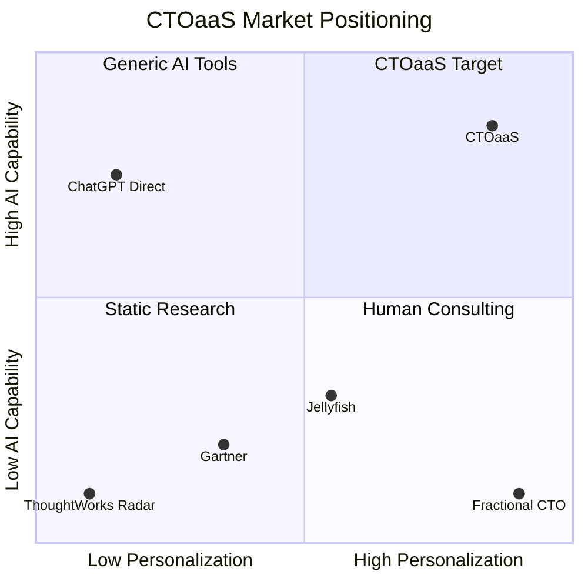
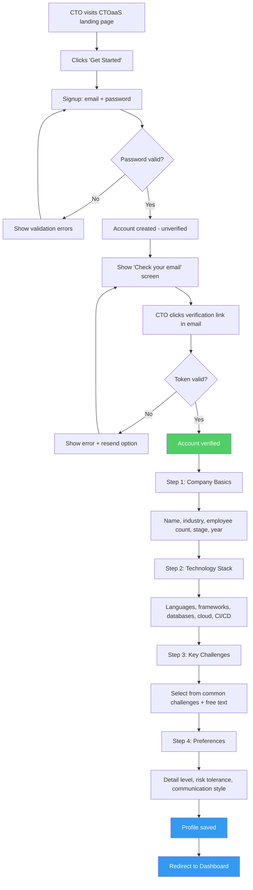
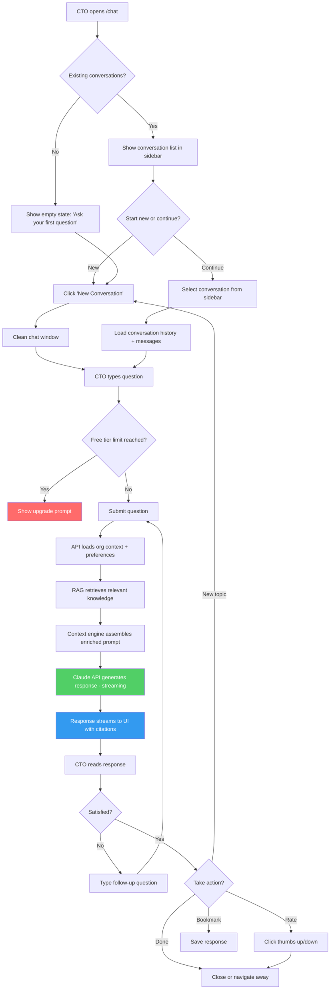
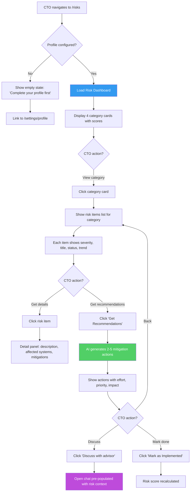
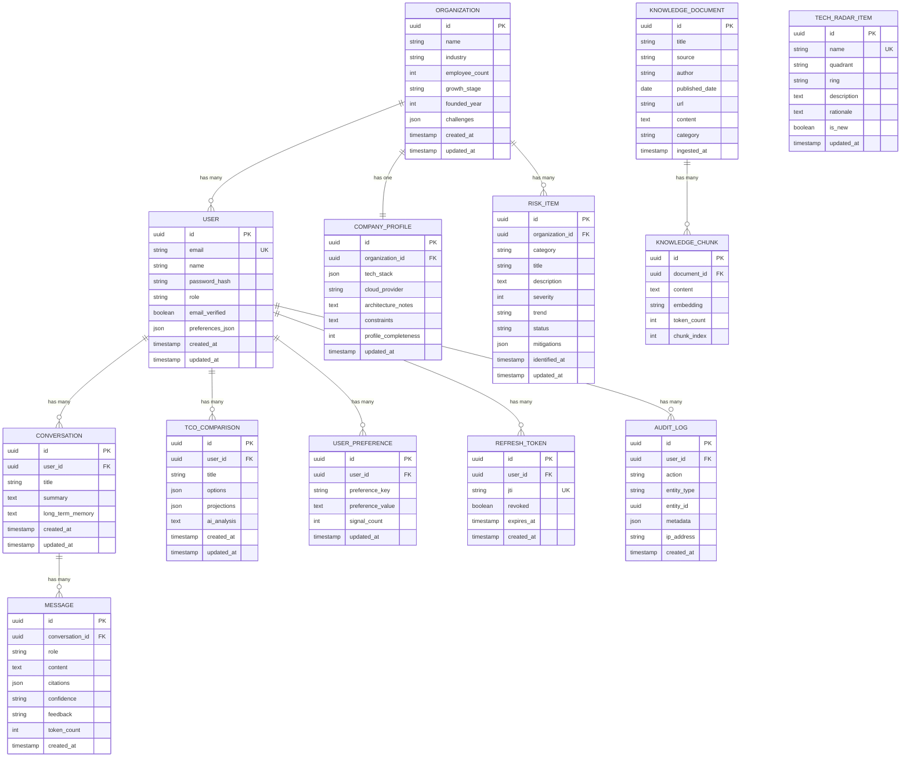
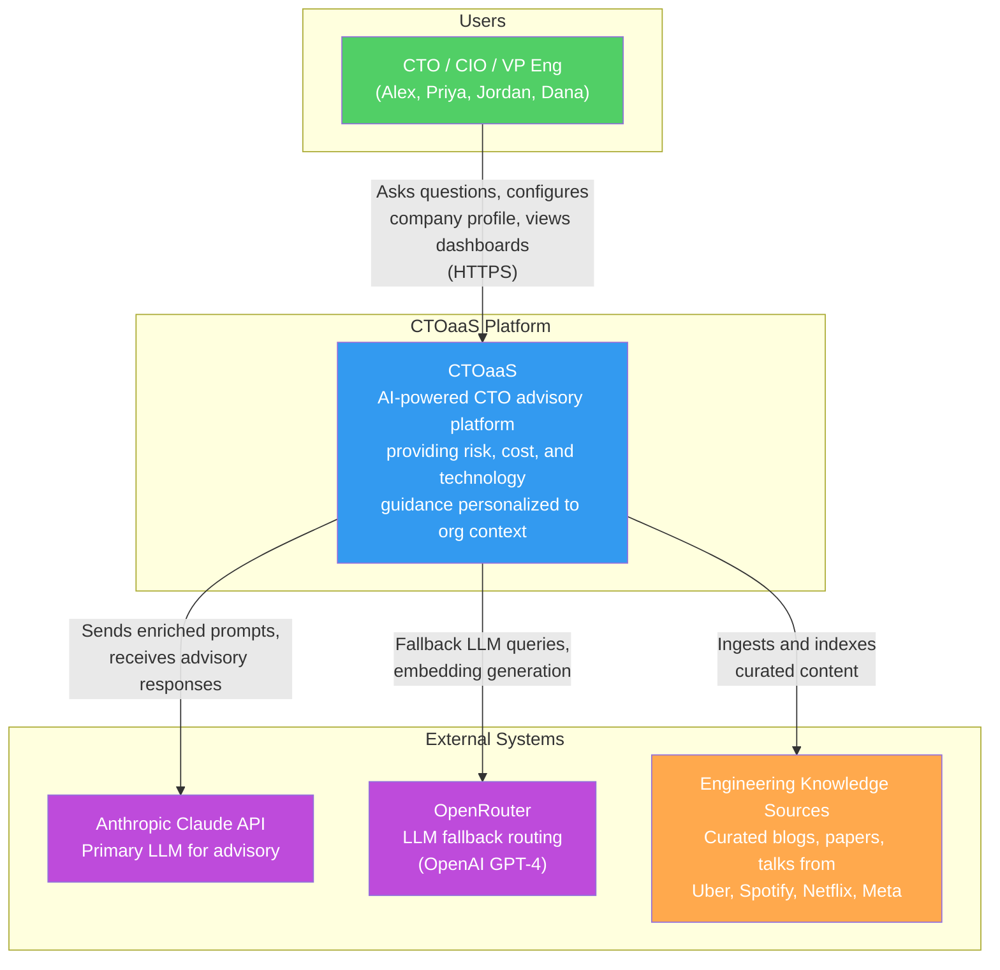
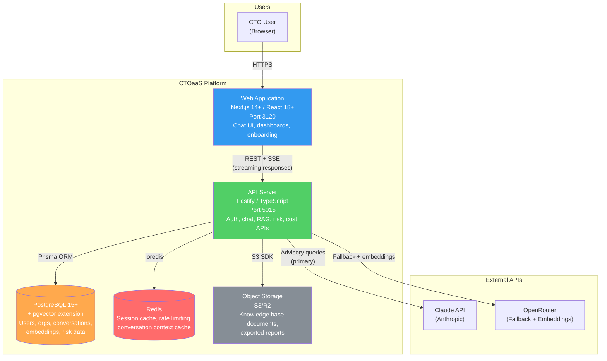
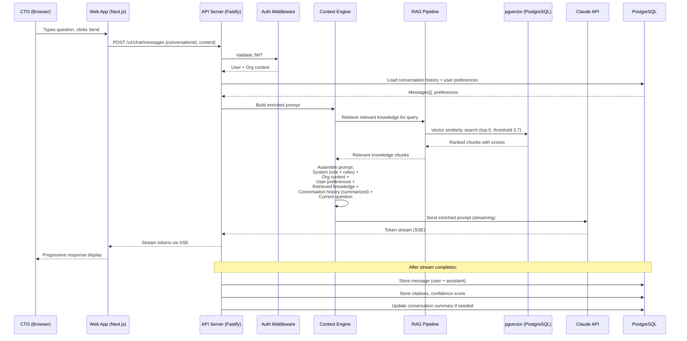
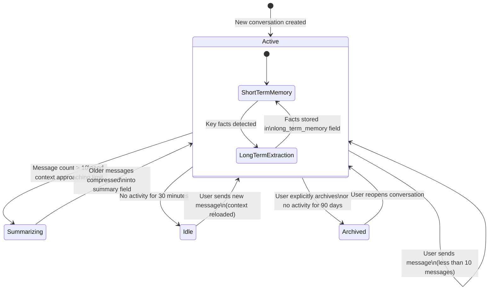

# CTOaaS - Product Requirements Document

**Product**: CTOaaS (CTO as a Service)
**Version**: 1.0
**Date**: 2026-03-11
**Author**: Product Manager
**Status**: Draft (pending CEO review)

---

## 1. Executive Summary

CTOaaS is an AI-powered advisory platform that augments the decision-making capabilities of CTOs, CIOs, and VPs of Engineering. Technology leaders face increasingly complex decisions across risk management, cost optimization, architecture design, compliance readiness, and team organization -- yet they lack personalized, always-available advisory tools that understand their specific organizational context.

Today, these leaders rely on expensive consulting firms ($300-500/hr with multi-week engagement cycles), inconsistent peer networks, or their own judgment without structured frameworks. A single bad architecture decision costs 6-12 months and $500K+ to reverse. Unmanaged technical debt slows engineering velocity by 20-40% annually.

CTOaaS addresses this gap by combining:
- **AI-powered conversational advisory** grounded in curated knowledge from elite engineering organizations (Uber, Spotify, Netflix, Meta)
- **Deep organizational personalization** that learns each CTO's company context, decision history, and preferences over time
- **Proactive risk surfacing** across technology debt, vendor risk, compliance, and operational categories
- **Cost analysis and scenario modeling** for build-vs-buy decisions and cloud spend optimization
- **Interactive technology radar** for tracking industry trends relevant to the CTO's stack

The global CTO advisory and technology consulting market exceeds $30B annually. No current product combines AI advisory + CTO domain expertise + organizational personalization + scenario modeling at an accessible price point ($300-2000/month vs. $10K-50K per consulting engagement). CTOaaS occupies the intersection of consulting (expensive, slow) and generic AI (cheap, uncontextualized).

**Recommendation**: GO with high confidence. Technical feasibility is high (aligns with ConnectSW's default stack), market demand is validated (fractional CTO market growing 25%+ annually), and the competitive gap is clear.

---

## 2. Product Vision

### 2.1 Vision Statement

To become the trusted AI advisor that every technology leader turns to before making critical decisions -- reducing the cost of bad decisions by 10x and giving every CTO access to the collective wisdom of the world's best engineering organizations.

### 2.2 Mission

Democratize access to senior technology advisory by building an AI platform that combines curated engineering knowledge, organizational context, and scenario modeling to deliver personalized, high-quality decision support at 1/100th the cost of traditional consulting.

### 2.3 Strategic Positioning

---

## 3. User Personas

### 3.1 Alex -- Startup CTO (Primary)

| Attribute | Detail |
|-----------|--------|
| **Role** | CTO at Series A-C company (50-200 employees) |
| **Age Range** | 30-42 |
| **Background** | Former senior engineer or tech lead promoted to first CTO role |
| **Goals** | Build scalable architecture, achieve SOC2 compliance for enterprise deals, hire and retain engineering talent, manage technical debt while shipping features |
| **Pain Points** | Making first-time decisions on architecture, compliance, and hiring without senior peers. 4-8 hours of manual research per major decision. No structured frameworks for recurring decision types. Consulting is too expensive for a startup budget. |
| **Usage Context** | Daily user. Opens CTOaaS from laptop during work hours. Asks 3-5 questions per day. Uses risk dashboard weekly. Shares advisory outputs with co-founders and board. |
| **Willingness to Pay** | $300-800/month |
| **Quote** | "I need a senior advisor I can talk to at 11pm before tomorrow's board meeting, not a consultant who will get back to me in 2 weeks." |

### 3.2 Priya -- Mid-Market VP of Engineering (Primary)

| Attribute | Detail |
|-----------|--------|
| **Role** | VP of Engineering at company with 200-2000 employees |
| **Age Range** | 35-50 |
| **Background** | Experienced engineering leader managing multiple teams, reporting to CTO or CEO |
| **Goals** | Optimize cloud costs, track and reduce technical debt, produce data-driven reports for leadership, evaluate vendor solutions, manage engineering metrics |
| **Pain Points** | Overwhelmed managing multiple teams, budgets, and technology strategy simultaneously. Ad-hoc cost and risk analysis. Hours spent preparing board decks and executive reports. Needs structured decision frameworks but lacks time to build them. |
| **Usage Context** | Regular user (3-4 days/week). Uses cost analysis and risk dashboard heavily. Exports reports for leadership meetings. Prefers detailed, data-rich responses with charts and comparisons. |
| **Willingness to Pay** | $500-2000/month |
| **Quote** | "I spend 6 hours every quarter preparing the technology section of our board deck. If CTOaaS could cut that to 1 hour, it pays for itself." |

### 3.3 Jordan -- Technical Co-Founder (Primary)

| Attribute | Detail |
|-----------|--------|
| **Role** | Technical co-founder wearing multiple hats at early-stage startup |
| **Age Range** | 25-38 |
| **Background** | Strong engineering skills but limited experience in strategic technology leadership, compliance, or vendor management |
| **Goals** | Make fast, informed build-vs-buy decisions. Choose the right tech stack without over-engineering. Stay current on industry trends without spending hours reading blogs. Get compliance-ready before first enterprise customer. |
| **Pain Points** | Cannot afford consultants ($300-500/hr). Wearing CEO/CTO/lead engineer hats simultaneously. Makes decisions based on incomplete information because there is no time to research. Past decisions documented in Slack messages and scattered notes. |
| **Usage Context** | Intermittent but intense user. Comes to CTOaaS when facing a specific decision. Asks 1-2 deep questions per session. Values speed and conciseness. Uses mobile browser frequently. |
| **Willingness to Pay** | $200-500/month |
| **Quote** | "I just need someone to tell me: should I use Kubernetes or keep it simple with ECS? And what are the trade-offs for a team of 4 engineers?" |

### 3.4 Dana -- Enterprise CIO (Secondary)

| Attribute | Detail |
|-----------|--------|
| **Role** | CIO at enterprise with 2000+ employees |
| **Age Range** | 45-60 |
| **Background** | Senior executive managing large IT organization, multiple vendors, compliance requirements, and board relationships |
| **Goals** | Governance and compliance at scale, vendor portfolio management, digital transformation roadmap, risk posture reporting to the board |
| **Pain Points** | Relies on Gartner ($30K+/year) and McKinsey ($500K+ per engagement) for advisory. Slow turnaround on strategic questions. Needs SSO/SAML for enterprise security requirements. Wants data residency and on-premise deployment options. |
| **Usage Context** | Infrequent personal use but high organizational value. Delegates to direct reports. Expects white-glove onboarding. Would pay premium for enterprise features (SSO, audit logs, team access). |
| **Willingness to Pay** | $2000-5000/month |
| **Quote** | "If this could replace even one Gartner engagement per quarter, the ROI is obvious. But I need SSO, SOC2 compliance, and data residency guarantees before I sign a contract." |

---

## 4. User Stories

### P0 -- Must Have (MVP)

#### US-01: Advisory Chat -- Ask a Technology Question

**As a** CTO (Alex), **I want to** ask technology questions in natural language and receive structured, actionable advice, **so that** I can make informed decisions in minutes instead of hours of manual research.

**Acceptance Criteria**:
1. **Given** a logged-in CTO with a configured company profile, **When** they type a technology question and press Enter (or click Send), **Then** the system returns a structured response within 15 seconds that includes: (a) a direct answer, (b) supporting reasoning with trade-offs, (c) at least 1 source citation from the knowledge base, and (d) a confidence indicator (high/medium/low).
2. **Given** a logged-in CTO, **When** the AI generates a response, **Then** the response streams token-by-token to the UI (server-sent events) so the CTO sees progressive output rather than waiting for the full response.
3. **Given** a question that falls outside the platform's knowledge domain (e.g., "What is the weather today?"), **When** the CTO submits it, **Then** the system responds with a polite redirect explaining it specializes in technology leadership topics and suggests rephrasing.
4. **Given** a CTO on a free tier, **When** they have sent 20 messages in the current day, **Then** the system displays a message indicating the daily limit has been reached and prompts upgrade to a paid plan.

**Priority**: P0
**Traces to**: BN-001, FR-001, FR-002, FR-028

---

#### US-02: Advisory Chat -- Follow-Up and Refinement

**As a** CTO (Alex), **I want to** ask follow-up questions that refine or drill deeper into a previous recommendation, **so that** I can explore specific aspects of a decision without re-explaining my situation.

**Acceptance Criteria**:
1. **Given** an ongoing chat conversation with at least 1 prior exchange, **When** the CTO asks a follow-up question, **Then** the response references context from prior messages in the same conversation (verified by the response containing information from the initial question without re-prompting).
2. **Given** a conversation with 10+ messages, **When** the CTO asks a follow-up, **Then** the system uses conversation summarization to stay within LLM context limits while preserving key context (response quality does not degrade noticeably after 10 messages).
3. **Given** a CTO in an active conversation, **When** they click "New Conversation," **Then** a new conversation starts with a clean context (no bleed from the previous conversation) while the previous conversation is preserved in history.

**Priority**: P0
**Traces to**: BN-001, FR-003, FR-004

---

#### US-03: RAG-Powered Knowledge Retrieval

**As a** VP of Engineering (Priya), **I want to** receive answers grounded in best practices from top engineering organizations (Uber, Spotify, Netflix, Meta), **so that** I can trust the recommendations are based on proven approaches rather than generic AI hallucination.

**Acceptance Criteria**:
1. **Given** a CTO question related to a topic covered in the knowledge base, **When** the RAG pipeline processes the query, **Then** it retrieves the top-5 most relevant knowledge chunks with vector similarity scores above 0.7, and at least 1 chunk is included in the LLM prompt context.
2. **Given** a curated knowledge base with at least 50 indexed documents, **When** a vector similarity search executes, **Then** the search completes in less than 500ms for a database with up to 100,000 embedding vectors.
3. **Given** a newly ingested knowledge document, **When** it is processed by the embedding pipeline, **Then** it is chunked (target 500-1000 tokens per chunk), embedded, and stored in pgvector within 60 seconds, and is retrievable in subsequent queries.

**Priority**: P0
**Traces to**: BN-002, FR-005

---

#### US-04: Source Citations in Responses

**As a** VP of Engineering (Priya), **I want to** see source citations for every recommendation the platform makes, **so that** I can verify the basis of the advice and build trust in the AI's output.

**Acceptance Criteria**:
1. **Given** an advisory response that used RAG-retrieved knowledge, **When** the response is displayed, **Then** each claim derived from the knowledge base includes an inline citation number (e.g., [1], [2]) and a "Sources" section at the bottom listing each source with title, author, date, and a link/preview.
2. **Given** a citation in a response, **When** the CTO clicks it, **Then** a panel or modal displays the relevant excerpt from the source document (the chunk that was retrieved).
3. **Given** a response where the AI generates advice not grounded in the knowledge base, **When** displayed, **Then** the response explicitly marks such sections as "Based on general AI knowledge" (not cited) so the CTO can distinguish grounded from ungrounded advice.

**Priority**: P0
**Traces to**: BN-002, BR-002, FR-006, FR-007

---

#### US-05: Company Profile Onboarding

**As a** Technical Co-Founder (Jordan), **I want to** configure my company profile including industry, company size, tech stack, growth stage, and key challenges, **so that** all advisory responses are tailored to my specific organizational context.

**Acceptance Criteria**:
1. **Given** a newly registered CTO, **When** they complete onboarding, **Then** the system stores their company profile with all required fields: company name, industry (from a predefined list of 20+ industries), employee count, growth stage (seed/Series A/B/C/growth/enterprise), primary tech stack components, and at least 1 key challenge.
2. **Given** a CTO with a completed profile, **When** they ask an advisory question, **Then** the system prompt includes their organizational context (verified by the response referencing company-specific factors such as their stack, team size, or industry).
3. **Given** a CTO on the onboarding flow, **When** they skip optional fields and submit, **Then** the system accepts the profile with required fields only and shows a "profile completeness" indicator encouraging them to fill in more later.
4. **Given** a CTO with an existing profile, **When** they navigate to Settings and edit their tech stack, **Then** the updated stack is reflected in subsequent advisory responses within the same session.

**Priority**: P0
**Traces to**: BN-003, FR-008, FR-009

---

#### US-06: Preference Learning Over Time

**As a** CTO (Alex), **I want** the platform to learn my preferences and past decisions over time, **so that** recommendations become more relevant and aligned with my decision-making style as I use the platform.

**Acceptance Criteria**:
1. **Given** a CTO viewing an advisory response, **When** they click a "thumbs up" or "thumbs down" button, **Then** the feedback is stored linked to the message, the response's RAG sources, and the conversation topic. The UI confirms the feedback was recorded.
2. **Given** a CTO with 10+ feedback signals, **When** the system generates a new response, **Then** the system prompt includes a summary of learned preferences (e.g., "User prefers concise answers with code examples" or "User values cost analysis over speed").
3. **Given** a CTO's preference data, **When** the same user asks a question in a later session, **Then** the system applies learned preferences to tailor the response.

**Priority**: P0
**Traces to**: BN-003, FR-010

**Note**: MVP is single-user per organization. Team member access and organizational preference sharing are deferred to Phase 2. Data model uses user-level preference table with `organization_id` FK to enable future org-level sharing without schema migration.

---

#### US-07: Conversation Memory Across Sessions

**As a** Technical Co-Founder (Jordan), **I want** my conversation context preserved across sessions, **so that** I do not have to re-explain my situation each time I return to the platform.

**Acceptance Criteria**:
1. **Given** a CTO with previous conversations, **When** they log in, **Then** the sidebar displays a list of past conversations ordered by most recent, each with a title (auto-generated from the first message or topic) and timestamp.
2. **Given** a CTO who selects a previous conversation, **When** the conversation loads, **Then** all prior messages (user and AI) are displayed, and the CTO can continue the conversation with full context retained.
3. **Given** a conversation with 50+ messages, **When** the CTO continues it, **Then** the system uses a hierarchical memory approach: recent messages (last 10) are included verbatim, older messages are summarized, and key facts are extracted into a long-term memory store. The response quality remains consistent regardless of conversation length.
4. **Given** a CTO with 20+ conversations, **When** they search conversation history, **Then** the system returns conversations matching the search query (full-text search on message content) within 2 seconds.

**Priority**: P0
**Traces to**: BN-017, FR-011, FR-012, FR-013

---

#### US-08: Secure Account Registration

**As a** CTO (Alex), **I want to** sign up and manage my account securely with email/password authentication, **so that** I can control access to my sensitive organizational data.

**Acceptance Criteria**:
1. **Given** a visitor on the signup page, **When** they submit a valid email and password (8+ characters, 1 uppercase, 1 lowercase, 1 number, 1 special character), **Then** the system creates an unverified account, sends a verification email with a token (valid for 24 hours), and displays a "Check your email" message.
2. **Given** a user who clicks the verification link, **When** the token is valid, **Then** the account is marked as verified and the user is redirected to the onboarding flow. **When** the token is expired or invalid, **Then** the system displays an error with an option to resend verification.
3. **Given** a verified user on the login page, **When** they submit correct credentials, **Then** the system returns a JWT access token (15-minute expiry, stored in memory, never localStorage) and an httpOnly refresh token cookie (7-day expiry). After 5 failed login attempts within 15 minutes, the account is temporarily locked for 30 minutes.
4. **Given** a logged-in user, **When** they click "Log out," **Then** the refresh token is revoked (JTI blacklisted), the access token is cleared from memory, and the user is redirected to the login page.

**Priority**: P0
**Traces to**: BN-018, FR-014, FR-015, FR-016

---

#### US-09: Multi-Tenant Data Isolation

**As a** VP of Engineering (Priya), **I want** my organizational data isolated from other users' data and encrypted, **so that** I can trust the platform with sensitive company information.

**Acceptance Criteria**:
1. **Given** two CTOs from different organizations, **When** CTO-A queries their conversations, company profile, or risk data, **Then** the API returns only data belonging to CTO-A's organization. No query path exists that returns another organization's data (enforced at the Prisma query layer with mandatory organization ID filtering).
2. **Given** sensitive fields (company financials, cloud spend data, API keys), **When** stored in the database, **Then** they are encrypted at the application level using AES-256-GCM before storage. Non-sensitive fields rely on PostgreSQL's disk-level encryption.
3. **Given** any API request, **When** it is transmitted between client and server, **Then** TLS 1.2+ is enforced. HTTP requests are redirected to HTTPS in production.
4. **Given** a conversation sent to the Claude API for advisory generation, **When** the prompt is assembled, **Then** the system includes only the minimum necessary context (no raw financial data, no credentials, no PII beyond what is required for the query). A data sanitization step runs before any LLM API call.

**Priority**: P0
**Traces to**: BN-018, BR-001, BR-005, FR-017, FR-018, FR-019

---

### P1 -- Should Have (MVP)

#### US-10: Risk Dashboard Overview

**As a** VP of Engineering (Priya), **I want to** see a dashboard showing current technology risks across categories (tech debt, vendor, compliance, operational), **so that** I can prioritize mitigation efforts and report risk posture to leadership.

**Acceptance Criteria**:
1. **Given** a CTO with a configured company profile, **When** they navigate to the Risk Dashboard, **Then** the dashboard displays 4 risk category cards (Technology Debt, Vendor Risk, Compliance Risk, Operational Risk), each with a numeric score (1-10), a color indicator (green 1-3, yellow 4-6, red 7-10), and a trend arrow.
2. **Given** a company profile listing "MySQL 5.7" as the primary database, **When** the risk engine evaluates the profile, **Then** it generates a risk item under Technology Debt: "MySQL 5.7 approaching end-of-life" with severity 7+, a description of the risk, and a recommended mitigation (upgrade path).
3. **Given** a risk item on the dashboard, **When** the CTO clicks it, **Then** a detail panel shows: risk title, severity score, category, affected systems, description, recommended mitigations (AI-generated), and an option to "Ask advisor about this risk" which opens a pre-populated chat.
4. **Given** a CTO who has not configured their company profile, **When** they navigate to the Risk Dashboard, **Then** the dashboard shows an empty state prompting them to complete their company profile before risk assessment can run.

**Priority**: P1
**Traces to**: BN-004, FR-020, FR-021

---

#### US-11: AI-Powered Risk Recommendations

**As a** CTO (Alex), **I want to** receive AI-generated mitigation recommendations for each identified risk, **so that** I can act on risks rather than just knowing about them.

**Acceptance Criteria**:
1. **Given** a risk item displayed on the dashboard, **When** the CTO clicks "Get Recommendations," **Then** the system generates 2-5 specific mitigation actions within 10 seconds, each with: action description, estimated effort (days/weeks), priority (high/medium/low), and expected impact on the risk score.
2. **Given** a risk recommendation, **When** the CTO clicks "Discuss with advisor," **Then** a new chat conversation opens pre-populated with the risk context and recommendation, allowing the CTO to ask follow-up questions.
3. **Given** a risk recommendation that the CTO marks as "Implemented," **When** the risk engine next evaluates, **Then** the risk score for that item is recalculated (reduced) and the trend indicator updates.

**Priority**: P1
**Traces to**: BN-004, FR-022

---

#### US-12: Cost Analysis -- TCO Calculator

**As a** Technical Co-Founder (Jordan), **I want to** analyze total cost of ownership for build-vs-buy decisions, **so that** I can justify technology investments to my board with data.

**Acceptance Criteria**:
1. **Given** a CTO on the Cost Analysis page, **When** they create a new TCO comparison with at least 2 options and fill in required fields (development cost, infrastructure cost, maintenance cost), **Then** the system calculates and displays a 3-year TCO projection for each option as both a table and a line chart.
2. **Given** a completed TCO comparison, **When** the CTO clicks "Get AI Analysis," **Then** the system generates a summary recommending the lower-TCO option with caveats, hidden costs to consider, and risks of each option, grounded in the CTO's organization context (team size, stage, constraints).
3. **Given** a TCO comparison, **When** the CTO adjusts a parameter (e.g., changes team size from 3 to 5), **Then** the projection recalculates in real-time (less than 1 second) and the chart updates.
4. **Given** a completed TCO comparison, **When** the CTO clicks "Export," **Then** the system generates a PDF or Markdown report suitable for board presentation.

**Priority**: P1
**Traces to**: BN-005, FR-023, FR-024

---

#### US-13: Cost Analysis -- Cloud Spend Optimization

**As a** VP of Engineering (Priya), **I want to** receive cloud cost optimization recommendations based on my current spend patterns, **so that** I can reduce infrastructure costs without impacting service quality.

**Acceptance Criteria**:
1. **Given** a CTO on the Cost Analysis page, **When** they input monthly cloud spend by category (compute, storage, database, networking) and provider, **Then** the system displays the spend breakdown as a donut chart and a comparison against industry benchmarks for their company size.
2. **Given** a cloud spend profile, **When** the system analyzes it, **Then** it generates 3-5 optimization recommendations within 10 seconds, each with: recommendation description, estimated monthly savings (dollar range), implementation effort, and risk level.
3. **Given** optimization recommendations, **When** the CTO clicks "Discuss with advisor," **Then** a chat conversation opens pre-populated with the cost context, allowing deeper exploration of specific recommendations.
4. **Given** a CTO who has not input any cost data, **When** they navigate to Cloud Spend Optimization, **Then** the page shows an empty state with clear instructions on how to input spend data (manual CSV/JSON upload or form entry) and an option to "Describe your infrastructure in chat" as an alternative.

**Priority**: P1
**Traces to**: BN-005, FR-027

**Note**: Phase 1 uses manual data import only (CSV upload, JSON upload, or form-based entry). Direct cloud provider API integration (AWS Cost Explorer, Azure Cost Management, GCP Billing) is deferred to Phase 2. The import interface accepts a standardized schema so that future API integrations populate the same data model.

---

#### US-14: Interactive Technology Radar

**As a** CTO (Alex), **I want to** view an interactive technology radar showing Adopt/Trial/Assess/Hold categories for technologies relevant to my stack, **so that** I can make informed decisions about technology investments and stay current with industry trends.

**Acceptance Criteria**:
1. **Given** a CTO navigating to the Technology Radar page, **When** the radar loads, **Then** it displays an interactive circular visualization with 4 rings (Adopt, Trial, Assess, Hold) and 4 quadrants (Languages & Frameworks, Platforms & Infrastructure, Tools, Techniques), populated with at least 30 technologies from the curated knowledge base.
2. **Given** a CTO with a configured tech stack, **When** the radar renders, **Then** technologies that are part of or directly related to their stack are visually highlighted (e.g., different color, border, or badge) and the radar can be filtered to show "My Stack" only.
3. **Given** a technology on the radar, **When** the CTO clicks it, **Then** a detail panel displays: technology name, current ring position, quadrant, a 2-3 sentence description, the rationale for its ring position, relevance to the CTO's organization (personalized), and a "Discuss with advisor" button.
4. **Given** the technology radar, **When** the CTO hovers over a technology dot, **Then** a tooltip displays the technology name and ring. The radar supports zoom and pan for dense areas. On mobile viewports (less than 768px), the radar switches to a list view grouped by quadrant.

**Priority**: P1
**Traces to**: BN-008, FR-025, FR-026

---

## 5. Functional Requirements

| ID | Requirement | User Stories | Description |
|----|-------------|-------------|-------------|
| FR-001 | Natural language advisory chat | US-01 | System MUST accept natural language questions via a chat interface and return structured advisory responses with citations and confidence indicators. |
| FR-002 | Streaming responses | US-01 | System MUST stream responses token-by-token using server-sent events (SSE). |
| FR-003 | Conversation context retention | US-02 | System MUST maintain conversation context across multiple messages within a session. |
| FR-004 | Conversation summarization | US-02, US-07 | System MUST implement conversation summarization when message count exceeds context window limits. |
| FR-005 | Vector similarity search | US-03 | System MUST retrieve relevant knowledge chunks via vector similarity search (pgvector) with a minimum similarity threshold of 0.7. |
| FR-006 | Inline source citations | US-04 | System MUST display inline source citations in advisory responses with expandable source previews. |
| FR-007 | Grounded vs. general knowledge distinction | US-04 | System MUST distinguish between RAG-grounded and general AI knowledge in responses. |
| FR-008 | Company profile collection | US-05 | System MUST collect and store company profile data during onboarding (industry, size, stack, stage, challenges). |
| FR-009 | Organizational context injection | US-05 | System MUST inject organizational context into LLM prompts for personalized responses. |
| FR-010 | User feedback collection | US-06 | System MUST collect user feedback (thumbs up/down) on responses and build preference profiles. |
| FR-011 | Persistent conversation history | US-07 | System MUST persist conversations across sessions with full message history. |
| FR-012 | Hierarchical memory system | US-07 | System MUST implement hierarchical memory (verbatim recent + summarized older + long-term facts). |
| FR-013 | Conversation search | US-07 | System MUST support full-text search across conversation history. |
| FR-014 | Email/password authentication | US-08 | System MUST implement email/password authentication with email verification. |
| FR-015 | JWT with refresh token rotation | US-08 | System MUST implement JWT access tokens (15-min expiry) with httpOnly refresh token rotation (7-day expiry). |
| FR-016 | Account lockout | US-08 | System MUST enforce account lockout after 5 failed login attempts within 15 minutes. |
| FR-017 | Organization-scoped data isolation | US-09 | System MUST isolate all data queries by organization ID. |
| FR-018 | Application-level encryption | US-09 | System MUST encrypt sensitive fields at application level using AES-256-GCM. |
| FR-019 | LLM data sanitization | US-09 | System MUST sanitize data before sending to LLM APIs (no raw financials, credentials, or unnecessary PII). |
| FR-020 | Risk dashboard with categories | US-10 | System MUST display a risk dashboard with 4 categories, scores, trends, and drill-down. |
| FR-021 | Auto-generated risk items | US-10 | System MUST auto-generate risk items from company profile analysis. |
| FR-022 | AI risk mitigation recommendations | US-11 | System MUST generate AI-powered risk mitigation recommendations. |
| FR-023 | TCO projection calculator | US-12 | System MUST calculate and display 3-year TCO projections for build-vs-buy comparisons. |
| FR-024 | AI TCO analysis | US-12 | System MUST generate AI analysis of TCO comparisons grounded in organizational context. |
| FR-025 | Interactive technology radar | US-14 | System MUST display an interactive technology radar with 4 rings and 4 quadrants. |
| FR-026 | Personalized radar highlights | US-14 | System MUST personalize radar highlights based on the CTO's configured tech stack. |
| FR-027 | Cloud spend analysis | US-13 | System MUST display cloud spend breakdown with benchmark comparisons and optimization recommendations. |
| FR-028 | Free-tier message limits | US-01 | System MUST enforce daily message limits for free-tier users (20 messages/day). |
| FR-029 | AI disclaimer | BR-007 | All advisory responses MUST include a disclaimer that recommendations are AI-generated and not professional advice. |

---

## 6. Non-Functional Requirements

| ID | Category | Requirement | Target |
|----|----------|-------------|--------|
| NFR-001 | Performance | Advisory chat response streaming start | Less than 3 seconds (p95) |
| NFR-002 | Performance | Full advisory response completion | Less than 15 seconds (p95) |
| NFR-003 | Performance | Dashboard page load time | Less than 2 seconds |
| NFR-004 | Performance | Vector similarity search latency | Less than 500ms for up to 100,000 embeddings |
| NFR-005 | Security | Data encryption at rest | AES-256 (application-level for sensitive fields, disk-level for others) |
| NFR-006 | Security | Data encryption in transit | TLS 1.2+ enforced; HTTP redirected to HTTPS |
| NFR-007 | Security | Token storage | JWT in memory only (never localStorage); refresh in httpOnly cookie |
| NFR-008 | Security | OWASP compliance | Top 10 mitigations implemented |
| NFR-009 | Security | API rate limiting | 100 req/min general endpoints; 20 req/min LLM-powered endpoints |
| NFR-010 | Accessibility | WCAG compliance | WCAG 2.1 AA (keyboard nav, screen reader, 4.5:1 contrast) |
| NFR-011 | Scalability | Concurrent users | 1,000 concurrent with less than 5% degradation |
| NFR-012 | Scalability | Database connections | Connection pooling for 50 concurrent connections |
| NFR-013 | Reliability | Uptime target | 99.5% for web app and API |
| NFR-014 | Reliability | Graceful degradation | System operational when Redis or Claude API unavailable |
| NFR-015 | Reliability | Data durability | No data loss on system restart |
| NFR-016 | Cost | LLM cost per interaction | Average less than $0.05 per user interaction |
| NFR-017 | Cost | Token budgeting | Enforced per user tier; common queries cached |

---

## 7. MVP Scope

### 7.1 MVP Features (Phase 1)

The MVP delivers the core advisory experience: a CTO can register, configure their organization, and engage in personalized AI-powered conversations grounded in curated engineering knowledge. Risk awareness and cost analysis provide immediate, tangible value.

| Story ID | Feature | Priority |
|----------|---------|----------|
| US-01 | Advisory Chat -- Ask Questions | P0 |
| US-02 | Advisory Chat -- Follow-Up | P0 |
| US-03 | RAG-Powered Knowledge Retrieval | P0 |
| US-04 | Source Citations | P0 |
| US-05 | Company Profile Onboarding | P0 |
| US-06 | Preference Learning | P0 |
| US-07 | Conversation Memory | P0 |
| US-08 | Secure Registration | P0 |
| US-09 | Data Isolation | P0 |
| US-10 | Risk Dashboard | P1 |
| US-11 | Risk Recommendations | P1 |
| US-12 | TCO Calculator | P1 |
| US-13 | Cloud Spend Optimization | P1 |
| US-14 | Technology Radar | P1 |

**Estimated effort**: 6-8 sprints (P0 features in first 4-5 sprints, P1 in remaining 2-3)

### 7.2 Pricing Model (MVP)

| Tier | Price | Limits | Features |
|------|-------|--------|----------|
| Free | $0/month | 20 advisory queries/day | Basic chat, 1 org profile, read-only radar, basic risk overview |
| Pro | TBD ($300-800/month range) | Unlimited queries | Full chat, cost analysis, advanced risk, decision logging, export, priority support |
| Enterprise | TBD ($2000-5000/month) | Unlimited + team access | SSO, team management, audit logs, dedicated support (Phase 2) |

---

## 8. Phase 2 Scope

Phase 2 expands the platform with advanced features and begins the transition to a custom AI model.

| Feature | Business Need | Description |
|---------|--------------|-------------|
| Custom NanoChat Model | Strategic | Replace/augment Claude API with domain-specific model trained via AutoResearch for CTO advisory |
| Team Features | BN-018 extended | Multi-user organizations, role-based access, shared conversations, team preferences |
| SSO/SAML/SCIM | Enterprise enablement | Enterprise authentication for Dana persona; required for enterprise sales |
| Cloud API Integration | BN-005 extended | Direct AWS/GCP/Azure cost API integration replacing manual input |
| Compliance Checker | BN-009 | SOC2/ISO27001/GDPR gap analysis with automated checklists |
| ADR Management | BN-011 | Create, store, search, and learn from Architecture Decision Records |
| Vendor Evaluation | BN-014 | Structured vendor comparison framework with market data |
| Technical Debt Tracker | BN-015 | Debt inventory, prioritization by business impact, ROI modeling |
| Board Report Generator | BN-016 | Auto-generated executive technology reports for board presentations |
| Engineering Metrics (DORA/SPACE) | BN-010 | CI/CD integration for engineering effectiveness metrics |

---

## 9. Out of Scope

The following are explicitly NOT included in Phase 1 MVP:

- **SSO/SAML/SCIM authentication** -- Enterprise auth deferred to Phase 2. Documented roadmap provided to enterprise prospects.
- **Direct cloud provider API integration** (AWS Cost Explorer, GCP Billing, Azure Cost Management) -- Manual input only in Phase 1.
- **Custom NanoChat model** -- Phase 2. Phase 1 uses Claude API (primary) and OpenAI via OpenRouter (fallback).
- **Engineering metrics (DORA/SPACE)** -- Requires CI/CD integration (Phase 2-3).
- **Team topology advisor** -- Requires significant domain modeling (Phase 3).
- **Incident post-mortem analyzer** -- Phase 3.
- **Vendor evaluation framework** -- Phase 2.
- **Technical debt tracker** -- Phase 2.
- **Board/executive report generator** -- Phase 2. Advisory chat can draft report sections in Phase 1.
- **ADR management** -- Phase 2. Conversations are stored, but structured ADR creation is deferred.
- **Compliance checking (SOC2/ISO27001/GDPR)** -- Phase 2.
- **Mobile application** -- No native app. Web app is responsive.
- **On-premise/VPC deployment** -- Enterprise deployment deferred to post-Phase 2.
- **Multi-language support** -- English only.
- **Real-time collaboration** -- Single-user conversations only. No shared or team chat.

---

## 10. Site Map

| Route | Status | Description | Key Elements |
|-------|--------|-------------|-------------|
| `/` | MVP | Landing page | Product overview, value props, CTA signup button, pricing preview |
| `/signup` | MVP | Registration | Email + password form, password strength indicator, link to login |
| `/login` | MVP | Login | Email/password form, forgot password link, link to signup |
| `/verify-email` | MVP | Email verification handler | Token validation, redirect to onboarding or error |
| `/onboarding` | MVP | Multi-step company profile setup | 4-step wizard: basics, tech stack, challenges, preferences |
| `/dashboard` | MVP | Main dashboard | Summary cards: recent conversations, risk overview, quick actions, profile completeness |
| `/chat` | MVP | Advisory chat interface | Conversation list sidebar, chat window, message input, streaming display |
| `/chat/:conversationId` | MVP | Specific conversation | Full conversation view with message history, citations, feedback buttons |
| `/risks` | MVP | Risk dashboard | 4 category cards with scores, trends, drill-down navigation |
| `/risks/:category` | MVP | Risk category detail | List of risk items with severity, status, "Get Recommendations" button |
| `/costs` | MVP | Cost analysis hub | Navigation to TCO calculator and cloud spend analysis |
| `/costs/tco` | MVP | TCO comparison calculator | Multi-option input form, 3-year projection chart, AI analysis |
| `/costs/tco/:comparisonId` | MVP | Specific TCO comparison | Saved comparison with detail, export option |
| `/costs/cloud-spend` | MVP | Cloud spend analysis | Input form/upload, donut chart, benchmarks, recommendations |
| `/radar` | MVP | Interactive technology radar | Circular visualization, quadrants, rings, click-to-detail, filter by stack |
| `/settings` | MVP | User settings hub | Navigation to profile, account, preferences |
| `/settings/profile` | MVP | Edit company profile | Same fields as onboarding, editable, profile completeness bar |
| `/settings/account` | MVP | Account settings | Change password, update email, delete account |
| `/settings/preferences` | MVP | Advisory preferences | Detail level, risk tolerance, communication style toggles |
| `/help` | Deferred | Help and FAQ | Page skeleton with empty state: "Help documentation coming soon" |
| `/integrations` | Deferred | Third-party integrations | Page skeleton with empty state: "Integrations coming soon" |
| `/reports` | Deferred | Executive report generation | Page skeleton with empty state: "Report generation coming soon" |
| `/team` | Deferred | Team management | Page skeleton with empty state: "Team management coming soon" |
| `/compliance` | Deferred | Compliance checker | Page skeleton with empty state: "Compliance tools coming soon" |
| `/adrs` | Deferred | Architecture Decision Records | Page skeleton with empty state: "ADR management coming soon" |

---

## 11. User Flows

### 11.1 Onboarding Flow

### 11.2 Advisory Chat Flow

### 11.3 Risk Assessment Flow

---

## 12. Data Model

### 12.1 Entity-Relationship Diagram

### 12.2 Key Relationships

- **User belongs to Organization** (1:many) -- MVP is single-user per org, but the schema supports multiple users per org for Phase 2 team features.
- **Organization has one CompanyProfile** (1:1) -- Detailed tech stack and context for personalization.
- **Organization has many RiskItems** (1:many) -- Risks are organization-scoped, not user-scoped.
- **User has many Conversations** (1:many) -- Each conversation is a chat thread.
- **Conversation has many Messages** (1:many) -- Ordered by timestamp, includes both user and assistant messages.
- **KnowledgeDocument has many KnowledgeChunks** (1:many) -- Documents are split into embeddable chunks for RAG.
- **TechRadarItem is standalone** -- Reference data shared across all users.

---

## 13. Architecture

### 13.1 C4 Context Diagram (Level 1)

### 13.2 C4 Container Diagram (Level 2)

### 13.3 Advisory Chat Sequence Diagram

### 13.4 Conversation Lifecycle State Diagram

---

## 14. Success Metrics

| ID | Metric | Target (3 months) | Target (6 months) | Target (12 months) | Measurement Method |
|----|--------|-------------------|--------------------|--------------------|-------------------|
| KPI-001 | Monthly Active Users (MAU) | 50+ | 200 | 1,000 | Unique users with 1+ chat sessions/month |
| KPI-002 | Monthly Recurring Revenue (MRR) | $5,000 | $30,000 | $200,000 | Subscription revenue |
| KPI-003 | Chat sessions per user per week | 3+ | 3+ | 5+ | Avg sessions per active user |
| KPI-004 | Decision adoption rate | 30% | 40% | 60% | % of recommendations marked "adopted" |
| KPI-005 | User-reported time savings | 3 hrs/week | 4 hrs/week | 6 hrs/week | In-app survey |
| KPI-006 | RAG retrieval relevance | 80%+ | 85%+ | 90%+ | Human evaluation of top-5 chunks (50 queries) |
| KPI-007 | Net Promoter Score (NPS) | 30+ | 40+ | 55+ | NPS survey |
| KPI-008 | Churn rate | Less than 10% | Less than 8% | Less than 5% | Monthly cancellation rate |
| KPI-009 | ARPU | $100/mo | $150/mo | $200/mo | MRR / paying users |
| KPI-010 | Knowledge base coverage | 50 topics | 100 topics | 150 topics | Curated topic areas |
| KPI-011 | Response citation rate | 90%+ | 92%+ | 95%+ | Auto-check: responses with citations |
| KPI-012 | Onboarding completion rate | 70%+ | 75%+ | 80%+ | Funnel: signup to profile complete |
| KPI-013 | Advisory response latency (streaming start) | Less than 3s (p95) | Less than 3s (p95) | Less than 2s (p95) | Server timing logs |
| KPI-014 | Security incidents | 0 | 0 | 0 | Security monitoring |

---

## 15. Risks and Mitigations

| ID | Risk | Probability | Impact | Score | Mitigation |
|----|------|-------------|--------|-------|------------|
| RSK-001 | LLM hallucination leads to bad CTO decision with real business impact | Medium | High | 6 | Confidence scoring on every response; source citations required; disclaimer in ToS; human escalation path for critical decisions |
| RSK-002 | Knowledge base curation quality insufficient (stale, irrelevant, or biased content) | Medium | High | 6 | Editorial review process; versioned content; user feedback loop on relevance; quarterly content audit |
| RSK-003 | Customer data breach (CTO organizational data is highly sensitive) | Low | Very High | 6 | Encryption at rest and in transit; SOC2 compliance roadmap; penetration testing; per-tenant data isolation; no customer data in LLM training |
| RSK-004 | LLM API cost overruns erode margins at scale | Medium | Medium | 4 | Token budgeting per tier; response caching; prompt optimization; volume pricing negotiation; Phase 2 custom model reduces dependency |
| RSK-005 | Enterprise customers require SSO/SAML before purchasing | High | Medium | 6 | Plan SSO in Phase 1.5; evaluate Auth0/WorkOS; document enterprise readiness roadmap for sales |
| RSK-006 | Market window closes as Microsoft/Google add CTO-specific Copilot features | Medium | High | 6 | Move fast on Phase 1; build personalization moat (decision history, org context); community and brand |
| RSK-007 | CTOs unwilling to input sensitive org data into AI platform | Medium | High | 6 | Transparent data handling policy; SOC2 certification; option to use without org context (degraded); future on-premise option |
| RSK-008 | Phase 2 custom model (NanoChat) underperforms commercial APIs | Medium | Medium | 4 | Maintain API-based architecture as fallback; performance benchmarks before switching; A/B testing |
| RSK-009 | Feature scope creep delays MVP beyond 8 sprints | High | Medium | 6 | Strict MVP scope (P0 first); defer all P2/P3; weekly scope review |
| RSK-010 | Free-tier too generous reduces conversion | Medium | Medium | 4 | Instrument usage analytics from day 1; adjust limits based on 30-day data |

---

## 16. Technology Decisions

| Decision | Choice | Rationale |
|----------|--------|-----------|
| **Backend framework** | Fastify (Port 5015) | ConnectSW default; high performance; plugin architecture; TypeScript-native |
| **Frontend framework** | Next.js 14+ with React 18+ (Port 3120) | ConnectSW default; SSR for SEO landing page; App Router for complex UI |
| **Database** | PostgreSQL 15+ with pgvector | ConnectSW default; pgvector enables RAG without separate vector DB; reduces infrastructure complexity |
| **ORM** | Prisma | ConnectSW default; type-safe queries; migration management |
| **Cache** | Redis | Session caching, rate limiting, conversation context caching; graceful degradation when unavailable |
| **Primary LLM** | Anthropic Claude API | Best-in-class reasoning for complex advisory; large context window |
| **LLM Fallback** | OpenAI GPT-4 via OpenRouter | Unified routing with automatic failover; budget cap per request |
| **Embeddings** | OpenAI Embeddings API | High-quality embeddings for RAG; well-documented; affordable |
| **Object Storage** | S3/R2 | Knowledge base document storage; exported reports |
| **Styling** | Tailwind CSS + shadcn/ui | ConnectSW default; rapid UI development; accessible components |
| **Testing** | Jest + React Testing Library + Playwright | ConnectSW default; unit, integration, and E2E coverage |
| **CI/CD** | GitHub Actions | ConnectSW default; automated testing and deployment |

---

## 17. Edge Cases

| # | Scenario | Expected Behavior | Priority |
|---|----------|-------------------|----------|
| 1 | CTO sends empty or whitespace-only message | Inline validation "Please enter a question" before API call. No API call made. | P0 |
| 2 | Claude API returns 429 (rate limit) or 500 (server error) | Retry with exponential backoff (1s, 2s, 4s, max 3 retries). If all fail, show "AI advisor temporarily unavailable. Your question is saved." Fall back to OpenAI via OpenRouter. | P0 |
| 3 | Conversation exceeds LLM context window (200K+ tokens) | Trigger conversation summarization: compress older messages, retain last 10 verbatim. User sees no interruption. | P0 |
| 4 | Two browser tabs open same conversation | Last-write-wins with timestamp ordering. Both tabs receive real-time updates via SSE. No message duplication. | P1 |
| 5 | Conflicting company profile data (2 employees + "enterprise" stage) | Accept data with soft warning: "Your company size and growth stage seem inconsistent. Would you like to review?" No hard block. | P1 |
| 6 | Knowledge base returns 0 results for valid CTO question | Generate response using general AI knowledge. Label as "Based on general AI knowledge (no curated sources matched)." Log query for KB expansion review. | P0 |
| 7 | CTO attempts to access another org's data via API manipulation | API middleware validates org ownership on every request. Return 403 Forbidden. Log as security event. | P0 |
| 8 | Redis cache becomes unavailable | Graceful degradation: skip caching, query PostgreSQL directly. Rate limiting falls back to in-memory store. Log warning. No user-facing error. | P1 |
| 9 | CTO pastes very long message (10,000+ characters) | Accept up to 10,000 characters. Beyond limit, truncate with warning. Truncated message is still processed. | P1 |
| 10 | CTO starts onboarding, gets interrupted, returns hours later | Onboarding progress persisted per step. Resume from where they left off. "Skip for now" on every optional step. | P1 |

---

## 18. Business Rules

| ID | Rule | Source | Impact |
|----|------|--------|--------|
| BR-001 | All CTO organizational data must be encrypted at rest and in transit | Security | Architecture, infrastructure |
| BR-002 | LLM responses must include confidence indicators and source citations | Product quality | Prevents hallucination-driven decisions |
| BR-003 | Knowledge base content must be curated and versioned, not scraped indiscriminately | CEO Brief | Content pipeline, quality control |
| BR-004 | Scenario models must show assumptions explicitly so CTOs can validate inputs | Domain requirement | UI design, model transparency |
| BR-005 | Platform must not store or transmit customer source code to LLM providers | Security/trust | Architecture constraint on RAG pipeline |
| BR-006 | Free tier must exist to drive adoption; premium features gated behind subscription | Business model | Pricing, feature gating |
| BR-007 | All advisory outputs must carry AI-generated disclaimer (not professional advice) | Legal/liability | UI, terms of service |

---

## 19. Assumptions

| ID | Assumption | Risk if Wrong | Validation Plan |
|----|-----------|---------------|-----------------|
| ASM-001 | CTOs will trust AI-generated strategic advice enough to act on it | No market; users treat it as toy | Beta with 10-20 CTOs; measure decision adoption rate |
| ASM-002 | Curated knowledge from elite orgs is transferable to smaller companies | Advice irrelevant to target segment | Interview 15 startup CTOs; test relevance |
| ASM-003 | Claude/OpenAI APIs provide sufficient quality for CTO-level advisory | Core product quality unacceptable | Benchmark 50 real CTO questions; target 80%+ accuracy |
| ASM-004 | CTOs willing to input sensitive org context into AI platform | Personalization unused; generic chat | A/B test onboarding with/without context; measure engagement delta |
| ASM-005 | $300-800/month viable for startup CTOs | Revenue model fails | Price sensitivity survey with 50 targets; test 3 price points |
| ASM-006 | RAG over curated content outperforms fine-tuning alone | KB investment wasted | Compare RAG vs. fine-tuned on 100 queries; measure preference |
| ASM-007 | Phase 1 API-based quality sufficient to retain users until Phase 2 custom model | Churn before Phase 2 | Track 30-day retention; target 60%+ monthly active |

---

## 20. Glossary

| Term | Definition |
|------|-----------|
| **RAG** | Retrieval-Augmented Generation -- enhancing LLM responses with retrieved knowledge from a curated database |
| **pgvector** | PostgreSQL extension enabling vector similarity search for embeddings |
| **SSE** | Server-Sent Events -- one-way streaming from server to client for real-time response display |
| **TCO** | Total Cost of Ownership -- comprehensive cost analysis including development, infrastructure, maintenance |
| **ADR** | Architecture Decision Record -- structured document capturing a technology decision and its rationale |
| **DORA** | DevOps Research and Assessment -- four key metrics (deployment frequency, lead time, change failure rate, MTTR) |
| **SPACE** | Satisfaction, Performance, Activity, Communication, Efficiency -- framework for developer productivity |
| **NanoChat** | ConnectSW's custom small language model (Phase 2) to be trained via AutoResearch for domain-specific advisory |
| **OpenRouter** | LLM API routing service providing unified access to multiple LLM providers with automatic failover |
| **JWT** | JSON Web Token -- compact, URL-safe token for API authentication |
| **JTI** | JWT ID -- unique identifier for a token, used for revocation tracking |

---

*Created by*: Product Manager
*Date*: 2026-03-11
*Version*: 1.0
*Status*: Draft -- pending CEO review at PRD checkpoint
